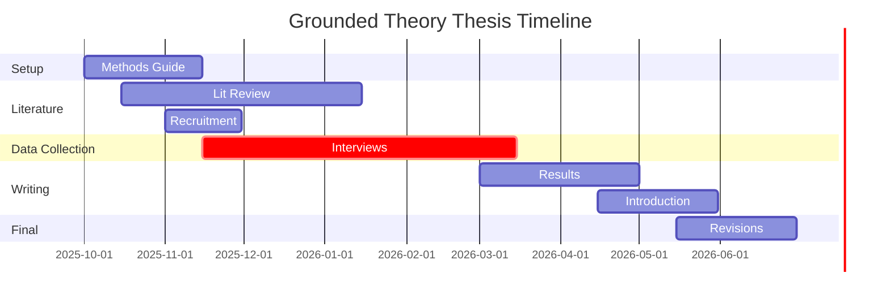

# Thesis

This project is set up to help write my thesis.

## Research Question

> How do marketing managers create value with agenic AI

## Plan of attack

These are the steps that I already have in mind in order.

1. Write methods section

    1. Theoretical underpinning.
    2. Incorporate my role to ensure that my perspective is honest: "How might my background in marketing/data/AI shape what I see?"
    3. Interviewing structure. (~~questionaire~~ Interview guide)

        1. General structure of interview (timetables etc.)
        2. Define relevant metrics (role, org, etc.) to capture before getting into the meat of the interview.
        3. Define topics that are relevant (necessary?) to touch upon.
        4. Write (find) an ethics and data-management statement.
        5. ***Question**: Should I do pilot interviews or is that a waste of time?*

    4. Ensure we have interviewees.

        1. Starting list for interviews.
        2. Introduction mail for interviewees.
        3. Define stopping criterium.

    5. Note sampling method for the interview structure

        I anticipate conducting between 15 and 25 interviews. The exact number will be determined by the point of theoretical saturation. When additional interviews no longer generate new insights into the categories and their relationships.

    6. Describe the method of encoding the interviews to topics and the topics to theory (memo writing).

        1. When, how, what, and why for memo writing.
        2. Describe how we ensure the analysis is trustworthy (Lincoln & Guba)

2. Read more literature and create the literature overview.

    1. AI (generally)
    2. Value theory
    3. Structure from the digital transformation paper

3. Write a pre-result introduction draft.

4. Execute interviews

    1. Encode memo's after every interview
    2. Check if more interviewees are needed
    3. Look for new interviewees based on referrals

5. Results

    1. Extract common themes from the literature.
    2. Extract theories from the themes.

6. Discussion

    1. Interpretation of results
    2. Implications for academia
    3. Implications for business.

7. Introduction

8. Abstract

