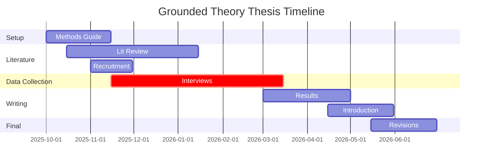

# Thesis

This project is set up to help write my thesis.

## Quick Start

### Building Your Thesis

To generate PDF and Word documents from your thesis:

```powershell
.\build-thesis.ps1
```

Output files will be in the `output/` directory.

### First-Time Setup for Mermaid Diagrams

If you haven't already, install Mermaid support (requires Node.js):

```powershell
npm install -g mermaid-filter @mermaid-js/mermaid-cli
```

For detailed setup instructions, see [thesis/PANDOC-README.md](thesis/PANDOC-README.md).

### PDF Knowledge Base (Qdrant + MCP)

To use the PDF-to-vector pipeline and MCP in Cursor:

1. **Start Docker Desktop** (required). If you see `open //./pipe/dockerDesktopLinuxEngine: The system cannot find the file specified`, Docker is not running—start Docker Desktop and wait until it is ready.
2. From the thesis folder: `docker-compose up -d` (starts Qdrant).
3. Run indexing from the CLI project:  
   `poetry run pdf-vectordb -C C:\workspace\thesis index` (set `DATALAB_API_KEY` in thesis `.env` first).

### Qualitative Coding Workflow (QDPX-first)

The coding workflow is now file-based and QDPX-first:

- Runbook: `ai-notes/coding-workflow.md`
- Primary scripts: `.cursor/skills/qdpx/qdpx_import.py`, `.cursor/skills/qdpx/qdpx_export.py`, `.cursor/skills/qdpx/qdpx_validate.py`, `.cursor/skills/qdpx/qdpx_diff.py`
- Atlas SQLite scripts in `.cursor/skills/atlasti/` are fallback/debug only

### Code Deduplication Review TUI

To review likely duplicate codes with local embeddings:

```powershell
poetry run qdpx-dedupe-launch --qdpx "qdpx/Thesis (Daan Luttik 2026-04-23 11.56).qdpx"
```

If you omit `--qdpx`, you'll get an interactive file picker when multiple `.qdpx` files exist.

The launcher runs in the current terminal by default.
Use `--new-window` to request a separate terminal window/tab.
During embedding, the script shows a live progress loader with elapsed/remaining time.

On Windows PowerShell, the same command works and opens a new PowerShell window when available.
If your GPU is detected but unsupported by the installed PyTorch build, the tool now auto-falls back to CPU.
You can also force CPU manually with `--device cpu`.

You can also run the TUI directly (without launcher) via:

```powershell
poetry run qdpx-dedupe --qdpx "qdpx/Thesis (Daan Luttik 2026-04-23 11.56).qdpx"
```

`poetry run qdpx-dedupe` without `--qdpx` also opens the same interactive picker.

To search existing codes by semantic similarity (name + quote context):

```powershell
poetry run qdpx-code-search --qdpx "qdpx/Thesis (Daan Luttik 2026-04-23 11.56).qdpx"
```

In search TUI, type your query and press Enter. Use `j`/`k` to move results and `/` to focus query.

To index and search all QDPX document paragraphs with local vectors (no Docker required):

```powershell
poetry run qdpx-paragraph-vast --qdpx "qdpx/Thesis (Daan Luttik 2026-04-23 11.56).qdpx" index
poetry run qdpx-paragraph-vast --qdpx "qdpx/Thesis (Daan Luttik 2026-04-23 11.56).qdpx" search --query "volunteer onboarding" --top 15
```

Open the interactive paragraph VAST TUI:

```powershell
poetry run qdpx-paragraph-vast --qdpx "qdpx/Thesis (Daan Luttik 2026-04-23 11.56).qdpx" tui --query "planning and action"
```

The paragraph tool uses the same embedding model as the other QDPX tools (`BAAI/bge-m3`),
stores metadata in SQLite, stores vectors in NumPy, and shows related paragraphs in the detail pane.

To suggest top-level parent categories for uncategorised coded leaf codes:

```powershell
poetry run qdpx-category-suggest --qdpx "qdpx/Thesis (Daan Luttik 2026-04-23 11.56).qdpx"
```

Keybindings inside category suggestion TUI:

- `j`/`k` or up/down: next/previous uncategorised code
- `a`/`b`/`c`/`d`: assign suggestion rank 1/2/3/4
- `s`: skip current code
- `z`: undo
- `/`: focus and clear parent filter input
- `e`: export review and apply to a new `*-categorized.qdpx`

After reviewing dedupe decisions, apply them back into a new QDPX file:

```powershell
poetry run qdpx-dedupe-apply --base "qdpx/Thesis (Daan Luttik 2026-04-23 11.56).qdpx" --review-csv "output/qdpx-dedupe-review.csv" --out "qdpx/Thesis-deduped.qdpx"
```

This rewrites code references based on your `keep A` / `keep B` / custom decisions and writes a new `.qdpx` archive.

Keybindings inside the TUI:

- `j` next candidate
- `k` previous candidate
- `t` open full-screen table view
- `v` (or `Esc`) return to side-by-side compare view
- `]` scroll quotations down (both code panels)
- `[` scroll quotations up (both code panels)
- `a` dedupe and keep code A name
- `b` dedupe and keep code B name
- `c` dedupe with custom name
- `s` keep separate
- `z` undo last decision
- `e` export review files
- `q` quit (state is autosaved)

The default compare view shows scores on top and both codes side by side with full quotations.
By default, code pairs are filtered to only coded codes (codes with at least one quotation).
Pressing `e` now also applies merge decisions into a new `*-deduped.qdpx` file by default.

### Initial Coding Review TUI

To review quotation-level coding suggestions from `qdpx-coding/` before export:

```powershell
poetry run qdpx-initial-review --doc "Interview name fragment"
```

If you omit `--doc`, the tool reviews all matching quotations.
By default it includes only quotations that currently have at least one code.

Keybindings inside the review TUI:

- `a` accept suggestion
- `d` decline suggestion (sets `**Codes**: *(none)*`)
- `e` expand context (opens exact span editor)
- `r` reduce context (opens exact span editor)
- `c` add reviewer comment for next AI pass
- `j` next quotation
- `k` previous quotation
- `z` undo last action
- `q` save and quit

The tool autosaves review state to `output/qdpx-initial-review-state.json` and applies
decisions back to `qdpx-coding/quotations/*.md` on exit.

## Research Question

> How do marketing managers create value with agenic AI

## Plan of attack

These are the steps that I already have in mind in order.

1. Write methods section

    1. Theoretical underpinning.
    2. Incorporate my role to ensure that my perspective is honest: "How might my background in marketing/data/AI shape what I see?"
    3. Interviewing structure. (~~questionaire~~ Interview guide)

        1. General structure of interview (timetables etc.)
        2. Define relevant metrics (role, org, etc.) to capture before getting into the meat of the interview.
        3. Define topics that are relevant (necessary?) to touch upon.
        4. Write (find) an ethics and data-management statement.
        5. ***Question**: Should I do pilot interviews or is that a waste of time?*

    4. Ensure we have interviewees.

        1. Starting list for interviews.
        2. Introduction mail for interviewees.
        3. Define stopping criterium.

    5. Note sampling method for the interview structure

        I anticipate conducting between 15 and 25 interviews. The exact number will be determined by the point of theoretical saturation. When additional interviews no longer generate new insights into the categories and their relationships.

    6. Describe the method of encoding the interviews to topics and the topics to theory (memo writing).

        1. When, how, what, and why for memo writing.
        2. Describe how we ensure the analysis is trustworthy (Lincoln & Guba)

2. Read more literature and create the literature overview.

    1. AI (generally)
    2. Value theory
    3. Structure from the digital transformation paper

3. Write a pre-result introduction draft.

4. Execute interviews

    1. Encode memo's after every interview
    2. Check if more interviewees are needed
    3. Look for new interviewees based on referrals

5. Results

    1. Extract common themes from the literature.
    2. Extract theories from the themes.

6. Discussion

    1. Interpretation of results
    2. Implications for academia
    3. Implications for business.

7. Introduction

8. Abstract


```mermaid
gantt
    title Grounded Theory Thesis Timeline
    dateFormat YYYY-MM-DD
    
    section Setup
    Methods Guide    :2025-10-01, 2025-11-15
    
    section Literature
    Lit Review       :2025-10-15, 2026-01-15
    Recruitment      :2025-11-01, 2025-11-30
    
    section Data Collection
    Interviews       :crit, 2025-11-15, 2026-03-15
    
    section Writing
    Results          :2026-03-01, 2026-05-01
    Introduction     :2026-04-15, 2026-05-31
    
    section Final
    Revisions        :2026-05-15, 2026-06-30
```
