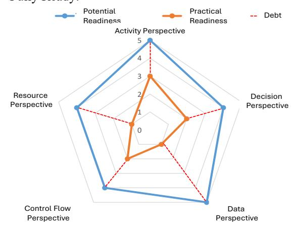
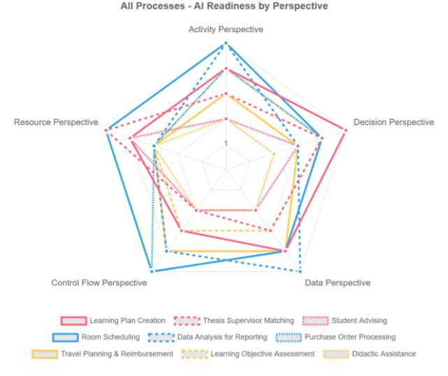

# **Agentic AI Readiness: A Process-Oriented Assessment Framework**

Rainer Schmidt Munich University of Applied Sciences rainer.schmidt@hm.edu

Rainer Alt Leipzig University rainer.alt@uni-leipzig.de

Alfred Zimmermann Reutlingen University alfred.zimmermann@reutlingen-university.de

## **Abstract**

*Are organizations ready for agentic artificial intelligence (AI)? Based on the limited success of AI projects in practice, this paper proposes an approach that recognizes the new potential of agentic AI for automating business processes and posits that business benefits are created at the level of business processes. It presents a framework for evaluating organizational readiness for agentic AI systems that emphasizes their potential of agentic AI systems for business process management. The framework provides a dual assessment: first, it determines the potential readiness across five perspectives (activities, decisions, data operations, control flow, and resource management). Second, it measures process debt, which refers to the gaps between documented and actual practices. Validated through a case study involving 40+ stakeholders and nine processes at a German university, the framework reveals distinct readiness patterns and actionable transformation insights. This enables evidence-based decision-making regarding AI investments and systematic capability building for agentic AI implementation in existing organizational settings.*

**Keywords:** digital transformation, agentic AI, process debt, AI readiness assessment, multi-perspective

## **1. Introduction**

Digital transformation (DT) requires organizations to develop new capabilities, adapt their processes, and implement emerging technologies to remain competitive. Among these technologies, agentic AI (Sapkota et al., 2026) presents both opportunities and complexities in business process automation. Agentic AI refers to AI systems capable of autonomous decision-making and task execution (Acharya et al., 2025; Sapkota et al., 2026).

While building upon multi-agent systems (MAS), which focus on coordinated behavior among computational entities (Dorri et al., 2018), agentic AI represents an evolution enabled by advances in generative AI and large-language models. Unlike MAS's strict protocols of MAS, agentic AI interprets context, employs generative

models, and learns continuously. Traditional MAS execute tasks, whereas agentic AI interprets objectives independently. This shift alters how organizations approach automation, from rigid execution to flexible achievement. Agentic AI builds on MAS research but has evolved through advances in generative AI and language models.

In the business context, the autonomous execution capabilities of agentic AI contribute to opportunities and challenges alike. Unlike traditional AI, which provides insights for human action, agentic AI makes independent decisions, modifies process paths, and coordinates with agents to achieve organizational goals. This has the potential to automate and decentralize business activities and decisions.

However, recent experiences with AI projects have not been convincing. Market enthusiasm for AI contrasts with the reality of its implementation (Challapally et al., 2025). Surveys show that "many of these AI investments aren't delivering as promised" (Orlovski, 2025; Sukharevsky et al., 2025), with success rates below expectations. Similarly, Challapally et al (2025) report that "despite \$30–40 billion in enterprise investment into GenAI, this report uncovers a surprising result in that 95% of organizations are getting zero return." Blackman (2025) states that "organizations aren't ready for the risks of agentic AI" and Cooper (2024) found that 70% of the projects failed to achieve the projected benefits. Mankins and Litre (2024) cite the "improper assessment of AI readiness" as a key failure factor, as organizations overestimate their capabilities.

This study posits that traditional methodological frameworks for assessing the readiness of organizations for AI need to reflect more closely the characteristics of AI and their link to business processes. Current AI readiness frameworks (Holmström, 2022; Jöhnk et al., 2021; Pumplun et al., 2019) mainly assess the organizational capacity to implement systems that provide analytical insights for human decision-making. They tend to ignore the potential for automating activities and the dynamic nature of business processes.

Thus, assessments of an organization's readiness for agentic AI should evaluate whether processes can support systems that (1) make autonomous decisions within defined boundaries, requiring explicit authority

protocols; (2) pursue goals independently with measurable outcomes; (3) adapt based on feedback through real-time monitoring; and (4) coordinate with specialized agents using formal handoff protocols. Autonomous decisions require explicit goals and boundaries, multiagent coordination requires collaboration protocols, and adaptive learning requires feedback systems. This leads to the following research question:

*How can organizations assess their readiness for agentic AI?*

To address this research question, a two-step methodology accounting for both the unique characteristics of agentic AI systems and the gap between documented processes and operational realities was developed. In the first step, AI readiness is evaluated from five perspectives: activities, decisions, data operations, control flow, and resource management. The second step assesses readiness by measuring "process debt" the gap between documented and actual processes that impede AI implementation.

To describe these results, Section 2 reviews the literature on digital transformation, AI adoption and agentic AI. Section 3 presents the proposed methodology. Section 4 details the framework, and Section 5 demonstrates the framework through a case study of a German university with 40 stakeholders and nine processes. Section 6 discusses the study's implications. Section 7 presents the contributions of this study and future directions.

## **2. Research Background**

Organizational assessment frameworks in the digital transformation literature use two approaches: **maturity models** and **readiness frameworks**. Maturity models (Alsheibani et al., 2019; Fukas et al., 2021) assess development through hierarchical levels, assuming a linear progression in which organizations advance through capability stages. These models show an organization's position on its developmental path. Readiness frameworks evaluate the organizational suitability for implementing technologies regardless of maturity level (Nasution et al., 2018; Voß & Pawlowski, 2019). Unlike the linear assumption of maturity, readiness recognizes that organizations may be prepared for advanced implementations in some areas while remaining unprepared in others.

**Business process automation** has evolved from workflow management to robotic process automation (RPA). Van der Aalst et al. (2018) distinguish between "dumb" rule-based automation and intelligent adaptive automation. Early AI automation focused on structured tasks. RPA exemplifies this deterministic approach through rule-based workflows (Hofmann et al., 2020; Willcocks et al., 2015) that require specific steps and predictable decisions.

**Agentic AI** marks a shift from traditional automation. Based on multi-agent systems research (Dorri et al., 2018), these systems have four main traits: autonomy (minimal human oversight), goal orientation (pursuit of objectives), adaptability (learning from feedback), and coordination (collaboration of specialized agents) (Acharya et al., 2025; Sapkota et al., 2026). Concerning human-AI interactions, the literature suggests that full automation is not always the best option, with Brynjolfsson and McAfee (2017) supporting augmentation and Raisch and Krakowski (2021) advocating task division. For example, the autonomy of agentic AI may change task allocation, necessitating an empirical study of the implications of human-AI collaboration.

## **2.1. Limitations of Existing AI Readiness Frameworks**

For agentic AI's autonomous characteristics, readiness assessment appears more appropriate than maturity progression. Organizations may possess capabilities in some perspectives while remaining unprepared in others, a pattern that does not follow traditional sequences. Autonomous decision-making and multi-agent coordination create requirements that resist hierarchical ordering, making the readiness assessment approach more suitable for evaluating agentic AI implementation.

Existing AI readiness frameworks inadequately address the requirements of autonomous systems. They assess socio-organizational factors (Holmström, 2022; Jöhnk et al., 2021; Pumplun et al., 2019) designed for traditional AI, which requires human oversight, while recent maturity models (Klingenstein et al., 2025; Petersson et al., 2022; Sonntag et al., 2024) focus on conventional implementations. Agentic AI now demands fundamentally different capabilities: decision-making authority, escalation protocols, goal interpretation mechanisms, and multi-agent coordination protocols, which are absent in traditional frameworks. These gaps explain why even organizations that are successful with traditional AI might struggle to adopt agentic AI because the novel qualities of agentic AI are not included.

### **2.2. Process Reality Gap: The Missing Dimension**

From research on process mining, we know that processes in reality differ from processes that have been modeled in process charts. (Reinkemeyer & Davenport, 2023; van der Aalst, 2012). The concept of process debt (Martini et al., 2025; Tom et al., 2012) reflects this gap and is based on Cunningham's (1992) technical debt concept. It measures divergence between intended and actual process executions, key for agentic AI implementation since autonomous agents struggle with informal practices humans intuitively grasp. Organizations implementing agentic AI in processes with high process debt risk automating inefficiencies. Agentic AI requires explicit process characteristics not evaluated by current frameworks, including clear objectives, decision boundaries, coordination mechanisms, and documented execution patterns.

## **3. Methodology**

This research employs exploratory sequential mixed methods (Clark & Creswell, 2007) by combining literature-based framework development with comprehensive case study validation.

## **3.1. Qualitative Phase: Framework Development**

The systematic literature search comprised five databases using the following terms: ("AI readiness" OR "artificial intelligence readiness") AND ("business process\*" OR "process automation") AND ("framework" OR "assessment"). From 714 papers identified between 2015-2024, 28 were selected through screening, revealing critical gaps in the existing approaches. We developed our framework using process perspectives as a theoretical lens, building on Curtis et al.'s (1992) approach to process analysis and van der Aalst et al.'s (2016) refinements of modern process management. Process perspectives represent orthogonal analytical viewpoints that examine distinct process elements while ensuring comprehensive coverage of the topic. This framework enables a complete process analysis through the separation of concerns, with each perspective providing a focused view. Based on the literature, we developed a framework through three iterative cycles with case study feedback. The first cycle created an initial framework by adapting BPM perspectives (Curtis et al., 1992; van der Aalst et al., 2016) to the characteristics of agentic AI. The second cycle integrated process debt and developed our assessment methodology after observing the gaps between the documented and actual processes. The third cycle focused on creating specific assessment criteria and 5-point measurement scales based on stakeholder feedback.

### **3.2. Quantitative Phase: Case Study Validation**

For the case study, we selected a German public university (18,000 students, 1,600 staff), which provides diverse process types across administrative, academic, and student services, with varying levels of digitalization and AI implementation potential. Our process identification began with a workshop in 2024, involving 40 participants–15 students, 13 administrative staff, and 15 faculty members–identifying 43 potential processes for agentic AI implementation. The selection of nine processes followed Yin's (2017) replication logic, incorporating literal replication through high-readiness processes, theoretical replication via low-readiness processes, and maximum variation. We selected three highreadiness administrative optimization processes, three low-readiness faculty processes emphasizing pedagogical judgment, and three student personalization processes. Data were collected from multiple sources, including framework assessments, stakeholder interviews, workshop observations, document analyses, and process characterization sessions. We integrated quantitative readiness scores with qualitative process descriptions using pattern-matching. Quantitative readiness scores were analyzed using descriptive statistics, while qualitative data from interviews and workshops were analyzed using thematic analysis to identify the readiness patterns. Integration employed convergent synthesis to validate the applicability of the framework.

## **3.3. Integration and Validation**

The mixed-methods approach used methodological triangulation: a literature review established theory, a case study was validated empirically, and stakeholder feedback was refined iteratively. Integration occurred through: (1) literature gaps informing framework design; (2) quantitative assessments revealing readiness patterns; and (3) qualitative insights explaining score variations and process debt. Framework evaluation followed three criteria: (1) theoretical coherence, alignment with BPM theory; (2) empirical applicability, successful application across processes; and (3) practical utility, providing actionable insights for stakeholders.

## **4. Framework for Agentic AI Readiness**

As argued in Section 2.2, the goal-oriented, adaptive, and collaborative characteristics of agentic AI require different process readiness criteria from traditional automation. Building on the theoretical foundation established in Section 3, our five-perspective decomposition ensures systematic evaluation without gaps or redundancies in the literature. Each perspective examines specific process elements through its focused lens, guided by the orthogonality principle, which ensures comprehensive, non-overlapping assessment coverage.

[Figure 1](#page-3-0) illustrates this dual assessment. Potential readiness (blue line) represents the theoretical scores (05 scale) for each perspective, assuming perfect process documentation and execution. Practical readiness (orange line) shows the adjusted scores after subtracting the process debt— the gaps between documented and actual practices. Quantification employs structured assessment criteria within each perspective, with scores assigned through stakeholder evaluation using our 5-point scale, where 0=Not Ready, 1-2=Limited capabilities, 3=Moderate readiness, 4=Strong capabilities, and 5=Fully Ready.

Figure 1: Two-Step, Perspective-Oriented
Framework

The framework is structured using five distinct perspectives (van der Aalst et al., 2016) to assess AI readiness: activity, decision, data operation, control flow, and resource management. These perspectives are an adaptation of traditional BPM viewpoints (Curtis et al., 1992) tailored to meet the specific characteristics and needs of the agentic AI systems. Each perspective has been validated through various studies and serves as the basis for a comprehensive process analysis (Dumas et al., 2018). Nortje et al. (2020) used a perspective-oriented approach to assess AI readiness, focusing on organizational properties rather than business processes.

Decomposition based on perspectives serves multiple functions. First, it enables targeted analysis by separating concerns. Second, it provides a framework for organizing AI readiness evaluations and identifying process debt. Third, it aids stakeholder communication since each perspective aligns with specific roles and concerns. Finally, it supports modular assessment, as organizations may achieve readiness from different perspectives at varying speeds.

Our assessment employs **process perspectives** as a formal theoretical lens (Table 1). They represent a systematic approach to process analysis, originally formalized by Curtis et al. (1992) and subsequently refined by van der Aalst et al. (2016) for contemporary process management applications.

Table 1: Process Attributes and Ideal Readiness Characteristics for Agentic Al Assessment

| Per- spective | High Readiness Characteristics                                                                                       | Low Readi- ness Indica- tors                                                                                   | Agentic Al Requirements                                                                    |
|------------------|-------------------------------------------------------------------------------------------------------------------------|----------------------------------------------------------------------------------------------------------------------|--------------------------------------------------------------------------------------------|
| Activity         | Digital I/O, repet- itive patterns, measurable quality, analyti- cal tasks                                  | Physical presence, emotional intelligence, catastrophic error risk, cultural sensitivity                             | Autonomous goal decompo- sition, seamless integration, adaptive learn- ing  |
| Decision         | Multi-criteria op- timization, rich historical data, explainable logic, clear out- comes                 | Moral judgment, unprecedented situations, per- sonal liability, strategic direc- tion                 | Autonomous authority, expli- cit boundaries, escalation pro- tocols            |
| Data             | Structured data, quality monitor- ing, governance, API integration, consistency                             | Privacy con- straints, ambig- uous infor- mation, zero-er- ror needs, frag- mented sys- tems       | Real-time ac- cess, dynamic processing, contextual inter- pretation            |
| Control Flow  | Predictable rout- ing, consistent patterns, digital handoffs, meas- urable Service Level Agree- ments | Dynamic flows, political naviga- tion, crisis re- sponse, infor- mal worka- rounds                    | Multi-agent coordination, dynamic adap- tation, auto- nomous opti- mization |
| Resource         | Algorithmic matching, digital distribution, pat- tern forecasting, skill documenta- tion                 | Relationship- based alloca- tion, mentoring priority, cultural dynamics, sub- jective assess- ment | Dynamic alloca- tion, human-Al collaboration, skill-based matching             |

Process perspectives constitute disjoint and comprehensive views of business processes that enable complete analysis while avoiding overlap or omission, thereby assuring orthogonality. Each perspective examines specific process elements through a focused analytical lens guided by the separation of concerns principle of systems analysis. This theoretical framework ensures the following.

While traditional perspective-based analyses focus on process understanding and improvement, the present framework adapts this approach for agentic AI readiness assessments. Each perspective evaluates specific aspects of agentic AI requirements. The activity perspective assesses task decomposability and the potential for autonomous execution of tasks. The decision perspective evaluates the feasibility of autonomous decision-making and the boundaries of authority. The data perspective depicts the accessibility and quality of information for real-time operations. The control flow perspective analyzes process flexibility and the require-

ments for multiagent coordination. The resource management perspective assesses human–AI collaboration and dynamic resource allocation capability.

Although not a separate perspective, ethical readiness permeates all five dimensions. Organizations must establish (1) decision boundaries with clear ethical constraints for autonomous choices, (2) transparency protocols ensuring explainable agent actions, (3) accountability mechanisms linking agent decisions to human oversight, (4) bias prevention through diverse training data and monitoring, and (5) human override capabilities to maintain the ultimate control over agent actions.

## **5. Potential Agentic AI Readiness**

In the first step, the potential agentic AI readiness was determined separately from each perspective. The process-oriented activity perspective was introduced in the first section and provided the basis for deriving the process debt dimensions.

#### **5.1. Activity Perspective**

The activity perspective examines tasks within a business process. Activities that suit agentic AI automation must align with AI capabilities while avoiding its limitations (Brynjolfsson et al., 2018). Building on the goal-oriented nature of agentic AI (Section 2.2), activities must support autonomous goal decomposition rather than merely task execution. Unlike traditional AI, which requires explicit task programming, agentic AI systems interpret high-level objectives and autonomously decompose them into executable tasks. This requires activities with clear success criteria that agents can evaluate independently and sufficient structural consistency, such that agents can adapt their approach based on environmental feedback. Activities with high AI readiness have digital inputs and outputs that enable seamless integration with Agentic AI systems. These activities involve repetitive patterns with manageable variations — sufficient consistency for AI to learn effective approaches and sufficient diversity to benefit from AI's adaptive capabilities rather than rule-based automation.

Clear quality metrics are vital for activities that are ready for AI implementation. An AI system must evaluate its performance and adjust accordingly, thus requiring measurable results to be obtained. Activities involving document processing, data extraction, pattern recognition, and analytical tasks have high readiness levels.

Conversely, certain activities indicate the unsuitability of AI automation in the workplace. Activities requiring physical presence resist agentic AI automation because autonomous agents cannot independently manipulate physical environments. For example, facility maintenance processes requiring on-site inspection cannot be fully automated by agentic AI systems, although agents can coordinate the scheduling and resource allocation remotely. Tasks demanding emotional intelligence, cultural sensitivity, or deep interpersonal understanding resist automation because of AI's limitations in empathy and social reasoning. Activities in which errors can cause catastrophic consequences, particularly affecting human safety or well-being, require careful consideration and human oversight, regardless of technical feasibility.

#### **5.2. Decision Perspective**

The autonomous decision-making capability of agentic AI fundamentally differs from that of traditional AI recommendation systems. While traditional AI provides analysis for human decisions, agentic AI systems must make independent choices within defined boundaries and escalate appropriately when they exceed their authority limits. AI-suitable decisions share characteristics that enable effective automation (Agrawal et al., 2022). Multicriteria optimization problems are ideal for AI support, benefiting from AI's ability to process information and find optimal solutions in complex spaces. Historical data are fundamental to AI-based decision making. Machine learning requires examples to identify patterns and develop decision models. For example, decisions with thousands of cases and clear outcomes enable AI training to be performed. The logic behind suitable decisions must be explained to ensure compliance and trust in the model.

Some decisions are resistant to AI automation and require human intervention. Decisions requiring moral judgment beyond codified rules challenge agentic AI systems and involve values that algorithms cannot reduce. Unprecedented situations exceed AI's patternbased learning. Decisions involving personal liability remain under human control. Strategic decisions affecting the business direction require human insight and accountability, which AI can be replicated by AI.

#### **5.3. Data Perspective**

The data perspective examines how information flows through business processes. Data accessibility is critical for agentic AI systems because agents must dynamically retrieve, process, and act on information in real time without human intervention. Unlike traditional AI, which processes static datasets, agentic AI requires continuous data streams to support autonomous adaptation and multiagent coordination.

Processes with high data readiness show key traits: structured data enables AI processing, accessibility allows Agentic AI systems to retrieve information, and metrics monitor quality. AI-ready operations require governance structures that define ownership and usage policies, particularly for sensitive information. Integration through APIs enables real-time AI processing, and data management ensures consistency across the systems.

Significant barriers to AI adoption exist from a data perspective. Privacy regulations restrict the processing of personal information. Highly ambiguous situations that challenge AI language capabilities and zero-error requirements necessitate human verification. Fragmented data with information on disconnected systems create integration challenges prior to AI implementation.

#### **5.4. Control Flow Perspective**

The control flow perspective examines how processes orchestrate activities over time, determining the sequencing and routing that give processes their dynamic behaviors. AI-ready control flows exhibit a predictable routing logic that can be learned by AI. Although this variation is acceptable for AI learning, the flow patterns must be consistent. Digital handoffs between the steps enable AI to manage process orchestration. Measurable Service Level Agreements (SLA) and performance indicators allow Agentic AI systems to optimize the control flow for efficiency.

Control flow characteristics indicating unsuitability for AI include highly dynamic flows that require novel routing decisions. Processes requiring political navigation exceed AI's social capabilities of AI. Crisis response processes, where unpredictable events require creative solutions, require human oversight, despite AI assistance. Processes with informal workarounds challenge AI because of their inconsistent flow.

#### **5.5. Resource Management Perspective**

Resource management addresses how organizations allocate human and AI resources to execute these processes. This perspective is vital in hybrid human-AI systems, where task distribution determines effectiveness. AI readiness manifests as a capability requirement for algorithmic resource-to-work matching. Digital mechanisms enable AI to distribute tasks based on workers' skills and their workloads. Resource patterns help forecast capacity needs and adjust the resources. Organizations with mature skill documentation can optimize their AI resources. Allocation decisions based on relationships are resistant to optimization algorithms. Resource assignments for mentoring prioritize human growth over efficiency. Specialized expertise resists codification for AI matching purposes.

## **6. Process Debt**

The potential agentic AI readiness score assumes flawless documentation and execution of the assessment. It requires a counterpart that shows the gap between the designed process and the actual implementation, that is, the process debt. Similar to its technical equivalent, process debt accumulates "interest" over time as undocumented variations increase in the process. Process debt poses particular challenges for agentic AI implementation because autonomous agents cannot navigate the informal practices and undocumented variations that human workers understand intuitively. While traditional AI systems operate with human oversight to handle exceptions, agentic AI systems must operate independently, making explicit documentation and standardized processes essential for reliable autonomous operation.

**Activity debt** manifests as undocumented task variations, where teams perform the same activities in different ways. The proliferation of personal productivity tools, Excel macros, and shadow IT indicates the accumulation of activity debt. New employees require extensive mentoring despite documentation, suggesting that critical task knowledge is tacit. Quality variations across performers reveal hidden execution differences that formal procedures cannot identify.

**Decision debt** is demonstrated through inconsistent judgments, where similar cases receive different treatments based on the decision-maker. Hidden criteria, known to experienced staff, guide choices beyond the documented rules. Escalation patterns vary by relationship rather than by thresholds, creating an unpredictability. The rationale for past decisions exists in individual memory rather than in records, making it impossible to understand why precedents were established or exceptions granted.

**Data debt** manifests as fragmented information landscapes in which critical data exist in disconnected systems, files, or physical documents. Data quality issues compound as validation rules remain unenforced, and departments maintain conflicting versions of the truth. Integration workarounds, such as manual transfers or email exchanges, create vulnerability points where errors multiply and audit trials disappear. The absence of clear data ownership leads to quality degradation because no party is responsible for accuracy and completeness.

**Control flow debt** emerges as a deviation between documented sequences and the actual execution paths. Process mining reveals that the official "happy path" accounts for only a fraction of the cases, with undocumented variations handling exceptions. Informal coordination mechanisms rely on personal relationships, and ad-hoc communication replaces systematic workflow management. Timing becomes unpredictable as undefined wait states and manual handovers create variability that documented service-level agreements (SLAs) cannot capture.

**Resource management debt** accumulates due to unclear capability definitions and allocations. Skills remain undocumented, residing in managers' mental models rather than in systematic competency frameworks. Workload distribution follows historical patterns rather than objective capacity analysis. The concentration of knowledge among key individuals creates a bottleneck. Performance measurement relies on subjective assessments rather than consistent metrics, thereby making resource optimization impossible.

#### **6.1. Practical Readiness**

Practical agentic AI readiness is calculated as Practical Readiness = Potential Readiness - Process Debt Score, which is applicable at both the perspective and overall process levels. This formula enables organizations to distinguish between processes requiring remediation (high potential, high debt) and those that are unsuitable for AI investment (low potential, regardless of debt levels). While analytically distinct, the five perspectives interact dynamically; high readiness in one perspective may compensate for limitations in another, or conversely, critical perspective weaknesses may block implementation despite overall strengths. This interaction requires a holistic assessment beyond the individual perspective scores.

#### **6.2. Remediation Strategies**

Process debt remediation requires perspective-specific approaches: activity debt through task mining and practitioner workshops to standardize execution patterns; decision debt via decision mining and formalization using frameworks such as DMN (OMG, 2015); data operation debt through technical improvements (data quality monitoring, API integration) and organizational changes (ownership clarification, governance structures); and control flow debt using process mining to redesign workflows based on actual rather than documented patterns. Process debt incurs costs through inefficiencies, quality variations, and automation failures. Remediation often pays for itself through operational improvements before AI implementation, making the benefits of AI additive rather than substitutive. Organizations that systematically address process debt develop strategic capabilities for discovery, standardization, and continuous improvement that extend beyond AI initiatives, creating a foundation for broader digital transformation and competitive advantages.

## **7. Empirical Validation**

Following the methodology (see Section 3), the following empirical validation aims to demonstrate the framework's utility through the design cycle and ensure relevance to real-world problems through the relevance cycle. This approach aligns with the mixed methods emphasis on iterative refinement based on empirical insights, ensuring that our artifact addresses theoretical rigor and practical relevance.

#### **7.1. Problem Space Exploration**

In a workshop at a German public university (18,000 students, 1,600 staff), 40+ stakeholders (15 students, 13 administrative staff, and 15 faculty members) participated in identifying potential agentic AI processes. The workshop revealed 43 processes and demonstrated clear alignment between stakeholder priorities and our theoretical perspectives: administrative staff focused on control flow optimization, faculty emphasized decision support requirements, and students highlighted the need for activity personalization. This natural categorization validates our five-perspective framework and confirms its broad applicability across diverse organizational roles and processes.

**Figure 2: AI Readiness Workshop Results** 

[Figure 2](#page-6-0) presents a polar diagram of the theoretical AI readiness scores across five perspectives, revealing patterns among the stakeholder categories of the nine example processes. The diagram shows the readiness scores (0-5 scale) before the debt consideration process. Administrative processes (blue) showed the highest readiness with expansive coverage, whereas faculty processes (yellow) displayed constrained profiles emphasizing human-centric traits.

**Student processes** show varied readiness profiles, highlighting the challenges of higher-education institutions. Learning plan creation (solid red line) emerged as a priority, with students frustrated by generic study paths that ignored their individual backgrounds and goals. This process demonstrates the potential of agentic AI: agents can adapt learning paths based on progress, coordinate with systems to identify optimal course sequences, and make scheduling decisions within parameters.

The radar profile shows strength in decisions (score: 5), reflecting the optimization of course prerequisites and career objectives. Workshop participants noted process debt through undocumented advisory knowledge and inconsistent planning in the workshop. Thesis supervisor matching (dashed red line) represents a process that aligns students' interests with faculty expertise and research priorities. Its peak in resource management (score: 5) confirms that optimal resource allocation is the core challenge. Current matching relies on informal networks, which raises equity concerns. While AI can optimize research-based matches, lower control flow scores (score = 2) indicate a relationship-driven nature. Student advising (dotted red line) emerged from discussions regarding scalable support. Its constrained radar profile, with low scores for activities and data operations (both 2), reflects the need for human intervention. Advising quality varies according to advisor availability.

**Administrative processes** highlight efficiency opportunities, as illustrated in [Figure 2.](#page-6-0) Room scheduling (solid blue line) is an optimization problem that yields high results. Facility management noted inefficiencies in double bookings and space utilization issues. The high profile (scores of 4-5) confirms its AI readiness with process debt in fragmented booking systems. Data analysis for reporting (dashed blue line) addresses key pain points. Its peak in data operations (score: 5) and lower decision score (score: 3) indicate a process that focuses on data transformation. Staff members spent days compiling reports from various systems. This profile validates the ability of our framework to distinguish the automation potential. Purchase order processing (dotted blue line) shows a balance with strength in the control flow (score: 5), reflecting its rule-based characteristics. Workshop discussions revealed the complexity of the approval chains and vendor management. A lower resource management score (score: 3) indicates that human allocation is less critical than standardization.

**Faculty processes** balance efficiency and academic freedom with constrained radar profiles. Travel planning and reimbursements (solid yellow line) showed moderate readiness, peaking at data operations and control flow (both scores of 4). This profile suggests automation potential, while noting the international variations. Learning objective assessment creation (dashed yellow line) evolved from "exam creation" based on workshop feedback. The profile shows strength in activities and decisions (both scores: 4), balancing standardized criteria and a pedagogical design. The faculty emphasized the alignment between assessments and learning outcomes while maintaining rigor. Didactic assistance (dotted yellow line) represents the faculty's vision for AI-supported teaching enhancement. Its flat, low profile (scores of 2-3) validates it as a boundary case based on the instructor's teaching philosophy. The elevation in resource management (score: 3) indicates AI's potential to allocate teaching resources despite limited automation. The visualization showed that certain perspectives dominated the stakeholder categories. Administrative processes exhibit strength in controlling flow and activities, reflecting their procedural nature. Student processes peak in decision-making and resource management, emphasizing the challenges of allocation.

Process debt recognition emerged during discussions, with 25% of identified processes being described as "currently chaotic," "person-dependent," or "relying on undocumented rules." This acknowledgment of the gap between formal process definitions and actual execution confirms the relevance of the process debt construct. The distribution of processes across readiness levels—40% suitable for routine automation, 35% requiring hybrid augmentation, and 25% remaining human-centric—validated the assumption that AI readiness exists on a continuum, rather than as a binary state.

## **8. Discussion**

The agentic AI readiness framework extends the AI readiness theory by showing that agentic AI requires different organizational capabilities than traditional AI. Its perspective-based approach addresses autonomous decision-making, multi-agent coordination, and dynamic adaptation, which existing frameworks overlook. Following multiple phases, the two-step assessment across five perspectives bridges the gap between strategic AI ambitions and operational realities. This enables a gradual digital transformation by leveraging agentic AI without fundamentally changing existing processes. By separating potential from practical readiness, organizations can understand their potential and the barriers to implementation.

#### **8.1. Theoretical Implications**

Our approach shifts AI readiness from a binary state to a multidimensional continuum, challenging simplistic maturity models. Unlike maturity models that assume linear progression (Alsheibani et al., 2019; Fukas et al., 2021), it recognizes that AI adoption can start from any perspective based on priorities, technology, or pain points. The continuum helps organizations identify readiness patterns: 'automation-ready' processes (high scores), 'augmentation-suitable' processes (mixed profiles needing human-AI collaboration), and 'transformation-required' processes (low scores needing redesign). Unlike binary assessments, dimensional interactions reveal compensatory potential; high data readiness can offset moderate decision readiness and enable targeted interventions. It uses process debt (Tom et al., 2012) to quantify the gap between the intended process design and actual execution. This concept extends beyond variations to include shortcuts, workarounds, and tacit knowledge that hinder technological advancement. Process debt explains why organizations with strong capabilities struggle with AI implementation; they attempt to automate processes with a documentation-reality gap. This study advances DT theory (Jöhnk et al., 2021; Pumplun et al., 2019) by providing a process-centric assessment that bridges strategic DT ambitions with operational transformation capability. This explains the productivity paradox in DT, where organizations fail not because of a lack of resources but because they automate broken processes.

#### **8.2. Practical Implications**

This framework guides stakeholders in implementing agentic AI systems, providing executives a tool to reframe AI adoption as process transformation. Process debt enables prioritization, while dual readiness assessment aids resource allocation. Organizations build automation on streamlined foundations by identifying process requirements before implementation. The framework addresses AI challenges through decision boundaries and coordination protocols. Organizations must establish authority limits for agents while maintaining control. AI teams need realistic expectations of timelines, as process preparation often exceeds estimates. The framework guides systematic gap identification rather than comprehensive transformations. Process Managers receive guidance on five-dimensional readiness assessment. Process debt quantification provides metrics for improvement initiatives and links to outcomes.

#### **8.3. Limitations and Future Research**

The measurement of process debt, including tacit knowledge, was subjective. The industry context shapes debt patterns and their remediation. Regulated industries differ from agile startups. Cultural factors matter organizations with strong documentation may have lower debt but less flexibility, while those emphasizing

adaptation show the opposite effect. Longitudinal studies can track AI implementation to validate whether the assessments predict success. Industry frameworks would enhance AI use in regulated sectors. Tools that use process mining and machine learning reduce costs while improving the precision. Process debt prediction enables proactive remediation of process debt. Future research should examine whether process characteristics matter more than organizational capabilities for AI readiness in healthcare.

#### **8.4. Conclusion**

This study aims to answer how organizations can systematically evaluate business process readiness for agentic AI implementation, accounting for the gap between automation potential and operational reality. The suggested two-phase and five-perspective framework decomposes complex readiness evaluations into manageable dimensions—activities, decisions, data operations, control flow, and resource management—each with specific readiness criteria and assessment methods. We provide organizations with a practical approach to first understand their theoretical potential and then systematically address the barriers to achieving it. Overall, the concept of process debt addresses a potential cause of failure in many DT initiatives and provides a path for improvement through remediation. As organizations increasingly compete on their ability to leverage intelligent technologies, those that achieve process clarity and systematically address their process debt will find themselves advantaged not only for current AI adoption but also for future technological innovation.

## **References**

- Acharya, D. B., Kuppan, K., & Divya, B. (2025). Agentic AI: Autonomous Intelligence for Complex Goals—A Comprehensive Survey. *IEEE Access*, *13*, 18912–18936. https://doi.org/10.1109/ACCESS.2025.3532853
- Agrawal, A., Gans, J., & Goldfarb, A. (2022). *Power and Prediction: The Disruptive Economics of Artificial Intelligence*. Harvard Business Review Press.
- Alsheibani, S., Cheung, Y., & Messom, C. H. (2019). Towards An Artificial Intelligence Maturity Model: From Science Fiction To Business Facts. *PACIS*, 46. https://core.ac.uk/download/pdf/301391799.pdf
- Blackman, R. (2025, June). Organizations Aren't Ready for the Risks of Agentic AI. *Harvard Business Review*. https://hbr.org/2025/06/organizations-arent-ready-forthe-risks-of-agentic-ai
- Brynjolfsson, E., & McAfee, A. (2017). The Business of Artificial Intelligence. *Harvard Business Review*, 1–20.
- Brynjolfsson, E., Mitchell, T., & Rock, D. (2018). What Can Machines Learn and What Does It Mean for Occupations and the Economy? *AEA Papers and Proceedings*, *108*, 43–47. https://doi.org/10.1257/pandp.20181019

- Challapally, A., Pease, C., Raskar, R., & Chari, P. (2025). *State of Ai in Business 2025*. MIT Panda.
- Clark, V. L. P., & Creswell, J. W. (2007). *The Mixed Methods Reader*. SAGE Publications, Inc.
- Cooper, R. G. (2024). Why AI Projects Fail: Lessons From New Product Development. *IEEE Engineering Management Review*, *52*(4), 15–21. https://doi.org/10.1109/EMR.2024.3419268
- Cunningham, W. (1992). The WyCash portfolio management system, experience report. *Proceedings on Object-Oriented Programming Systems, Languages, and Applications (OOPSLA 1992)*.
- Curtis, B., Kellner, M. I., & Over, J. (1992). Process Modeling. *Communications of the ACM*, *35*(9), 75–90.
- Dorri, A., Kanhere, S. S., & Jurdak, R. (2018). Multi-Agent Systems: A Survey. *IEEE Access*, *6*, 28573–28593. https://doi.org/10.1109/ACCESS.2018.2831228
- Dumas, M., La Rosa, M., Mendling, J., & Reijers, H. A. (2018). *Fundamentals of Business Process Management*. Springer Berlin Heidelberg. https://doi.org/10.1007/978- 3-662-56509-4
- Fukas, P., Rebstadt, J., Remark, F., & Thomas, O. (2021). Developing an Artificial Intelligence Maturity Model for Auditing. *ECIS 2021 Proceedings*. ECIS. https://aisel.aisnet.org/ecis2021\_rp/133
- Hofmann, P., Samp, C., & Urbach, N. (2020). Robotic Process Automation. *Electronic Markets*, *30*(1), 99–106. https://doi.org/10.1007/s12525-019-00365-8
- Holmström, J. (2022). From AI to Digital Transformation: The AI Readiness Framework. *Business Horizons*, *65*(3), 329–339. https://doi.org/10.1016/j.bushor.2021.03.006
- Jöhnk, J., Weißert, M., & Wyrtki, K. (2021). Ready or Not, AI Comes—An Interview Study of Organizational AI Readiness Factors. *Business & Information Systems Engineering*, *63*(1), 5–20. https://doi.org/10.1007/s12599-020- 00676-7
- Klingenstein, F., Kessler, S., Hoeltl, M., Daume, P., & Fischer, M. (2025). A Maturity Model to Assess and Enhance the AI Readiness of an Enterprise Architecture. *AMCIS 2025 Proceedings*. AMCIS 2025, Montreal, Quebec, Canada. https://aisel.aisnet.org/amcis2025/sig\_osra/sig\_osra/27
- Mankins, M., & Litre, P. (2024). Transformations That Work. *Harvard Business Review*. https://hbr.org/2024/05/transformations-that-work
- Martini, A., Stray, V., Besker, T., Moe, N. B., & Bosch, J. (2025). Process Debt: Definition, Risks, and Management. *Journal of Software: Evolution and Process*, *37*(4), e70017. https://doi.org/10.1002/smr.70017
- Nasution, R. A., Rusnandi, L. S. L., Qodariah, E., Arnita, D., & Windasari, N. A. (2018). The Evaluation of Digital Readiness Concept: Existing Models and Future Directions. *The Asian Journal of Technology Management*, *11*(2), 94–117.
- Nortje, M. A., & Grobbelaar, S. S. (2020). A Framework for the Implementation of Artificial Intelligence in Business Enterprises: A Readiness Model. *2020 IEEE International Conference on Engineering, Technology and Innovation (ICE/ITMC)*, 1–10. https://doi.org/10.1109/ICE/ITMC49519.2020.9198436
- OMG. (2015). *DMN 1.0*. http://www.omg.org/spec/DMN/1.0/Beta1/

- Orlovski, V. (2025). Agentic AI In Large Enterprises: What's Going Wrong And How To Fix It. *Forbes Business Council*. https://www.forbes.com/councils/forbesbusinesscouncil/2025/06/06/agentic-ai-in-large-enterpriseswhats-going-wrong-and-how-to-fix-it/
- Petersson, L., Larsson, I., Nygren, J. M., Nilsen, P., Neher, M., Reed, J. E., Tyskbo, D., & Svedberg, P. (2022). Challenges to implementing artificial intelligence in healthcare: A qualitative interview study with healthcare leaders in Sweden. *BMC Health Services Research*, *22*(1), 850. https://doi.org/10.1186/s12913-022-08215-8
- Pumplun, L., Tauchert, C., & Heidt, M. (2019). A New Organizational Chassis for Artificial Intelligence-Exploring Organizational Readiness Factors. *ECIS 2019 Proceedings*. ECIS. https://aisel.aisnet.org/ecis2019\_rp/106
- Raisch, S., & Krakowski, S. (2021). Artificial Intelligence and Management: The Automation–Augmentation Paradox. *Academy of Management Review*, *46*(1), 192–210. https://doi.org/10.5465/amr.2018.0072
- Reinkemeyer, L., & Davenport, T. (2023). Transform Business Operations with Process Mining. *Harvard Business Review*. https://hbr.org/2023/10/transform-business-operations-with-process-mining
- Sapkota, R., Roumeliotis, K. I., & Karkee, M. (2026). AI Agents Vs. Agentic AI: A Conceptual Taxonomy, Applications and Challenges. *Information Fusion*, *126*, 103599. https://doi.org/10.1016/j.inffus.2025.103599
- Sonntag, M., Mehmann, S., Mehmann, J., & Teuteberg, F. (2024). Development and Evaluation of a Maturity Model for AI Deployment Capability of Manufacturing Companies. *Information Systems Management*, *42*(1), 37–67. https://doi.org/10.1080/10580530.2024.2319041
- Sukharevsky, A., Kerr, D., Hjartar, K., Hämäläinen, L., Bout, S., Leo, V. D., & Dagorret, G. (2025). *Seizing the Agentic AI Advantage*. Quantum Black.
- Tom, E., Aurum, A., & Vidgen, R. (2012). A Consolidated Understanding of Technical Debt. *ECIS 2012 Proceedings*. ECIS.
- van der Aalst, W. M. P. (2012). Process Mining. *Commun. ACM*, *55*(8), 76–83. https://doi.org/10.1145/2240236.2240257
- van der Aalst, W. M. P., Bichler, M., & Heinzl, A. (2018). Robotic Process Automation. *Business & Information Systems Engineering*, *60*(4), 269–272. https://doi.org/10.1007/s12599-018-0542-4
- van der Aalst, W. M. P., Rosa, M. L., & Santoro, F. M. (2016). Business Process Management. *Business & Information Systems Engineering*, *58*(1), 1–6. https://doi.org/10.1007/s12599-015-0409-x
- Voß, F. L. V., & Pawlowski, J. M. (2019, June 12). *Digital Readiness Frameworks*. https://doi.org/10.1007/978-3- 030-21451-7\_43
- Willcocks, L. P., Lacity, M., & Craig, A. (2015). *The IT Function and Robotic Process Automation*. https://eprints.lse.ac.uk/64519/1/OUWRPS\_15\_05\_published.pdf
- Yin, R. K. (2017). *Case study research and applications: Design and methods*. Sage publications.