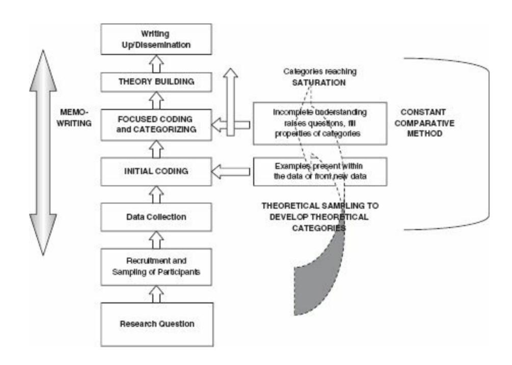
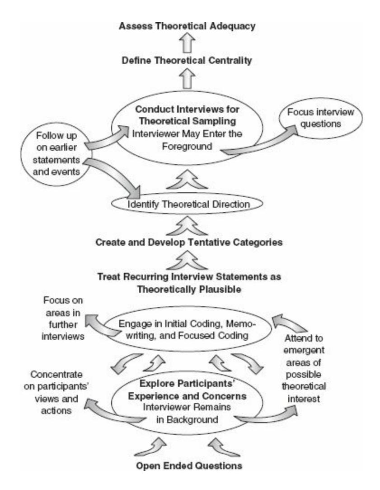
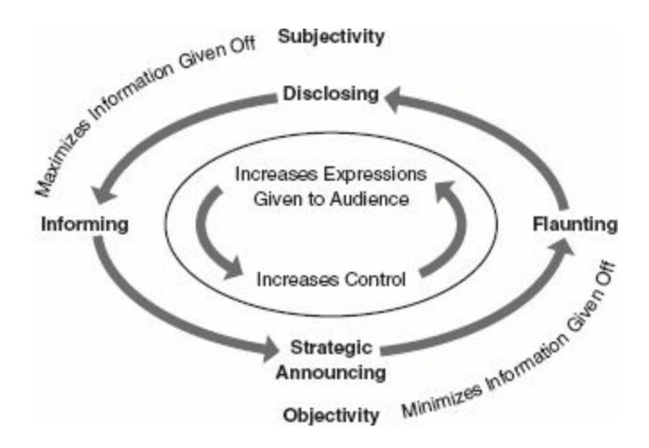
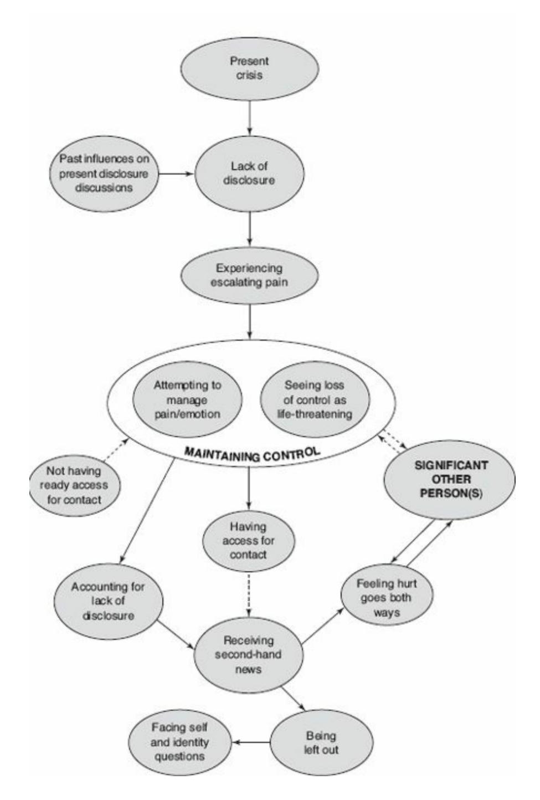
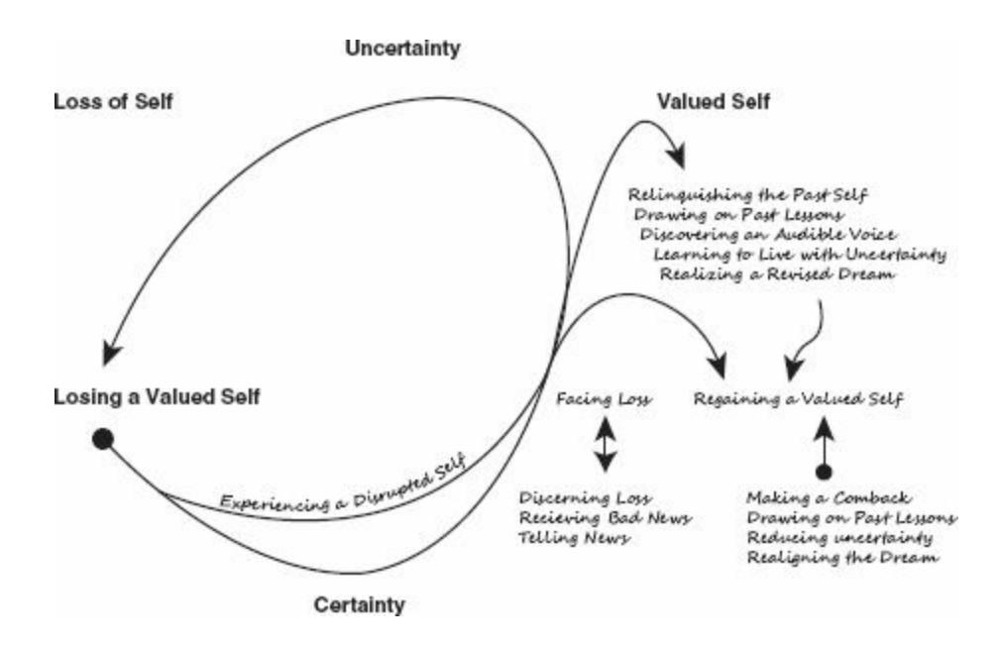
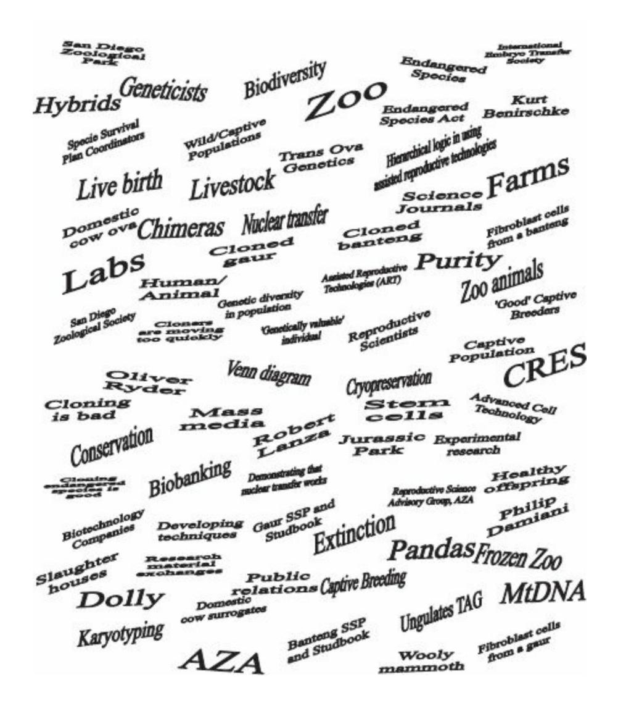
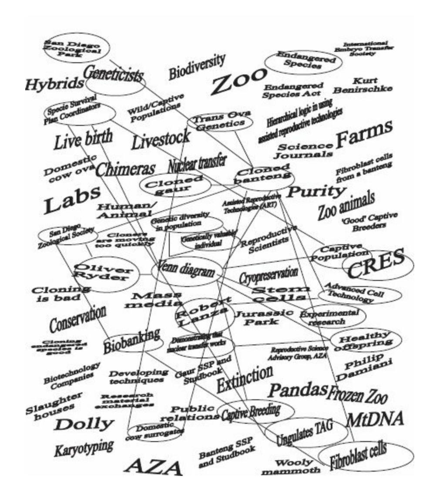
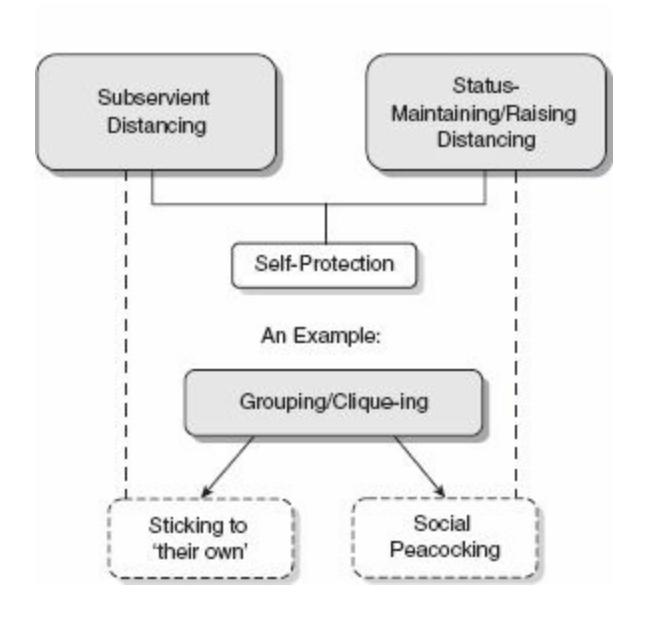
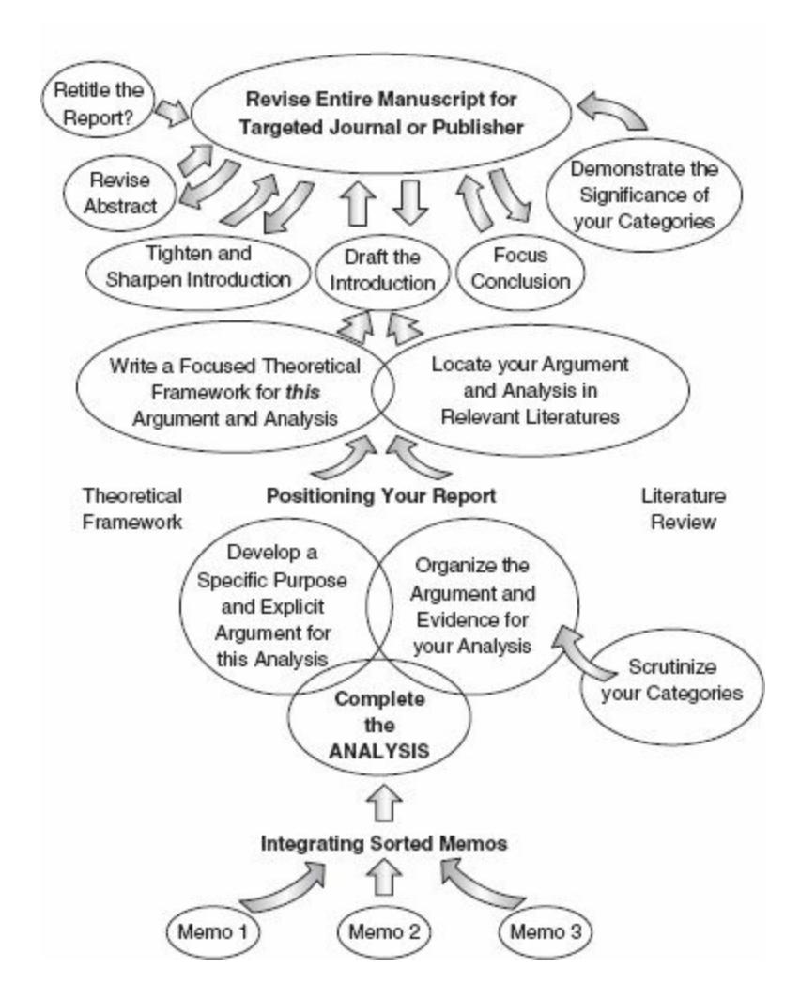

# Constructing Grounded Theory

2nd Edition

Kathy Charmaz


# Constructing Grounded Theory

INTRODUCING QUALITATIVE METHODS provides a series of volumes which introduce qualitative research to the student and beginning researcher. The approach is interdisciplinary and international. A distinctive feature of these volumes is the helpful student exercises.

One stream of the series provides texts on the key methodologies used in qualitative research. The other stream contains books on qualitative research for different disciplines or occupations. Both streams cover the basic literature in a clear and accessible style, but also cover the 'cutting edge' issues in the area.

# SERIES EDITOR

David Silverman (Goldsmiths College and University of Technology, Sydney)

# EDITORIAL BOARD

Michael Bloor (Cardiff University and University of Glasgow)

Barbara Czarniawska (Göteborg University)

Norman Denzin (University of Illinois, Urbana-Champaign)

Uwe Flick (Freie Universität Berlin)

Barry Glassner (Lewis and Clark College)

Jaber Gubrium (University of Missouri)

Anne Murcott (University of Nottingham and SOAS)

Jonathan Potter (Loughborough University)

For a list of all titles in the series, visit [www.sagepub.co.uk/iqm](http://www.sagepub.co.uk/iqm)

# Constructing Grounded Theory

2nd Edition

Kathy Charmaz


Singspore | Washington DC

#### © Kathy Charmaz 2014

First edition published 2006 Reprinted 2008, 2009, 2010, 2011 & 2012

Apart from any fair dealing for the purposes of research or private study, or criticism or review, as permitted under the Copyright, Designs and Patents Act, 1988, this publication may be reproduced, stored or transmitted in any form, or by any means, only with the prior permission in writing of the publishers, or in the case of reprographic reproduction, in accordance with the terms of licences issued by the Copyright Licensing Agency. Enquiries concerning reproduction outside those terms should be sent to the publishers.

**Library of Congress Control Number: 2013939790**

**British Library Cataloguing in Publication data**

A catalogue record for this book is available from the British Library

ISBN 978-0-85702-9133 ISBN 978-0-85702-9140 (pbk)


SAGE Publications Ltd 1 Oliver's Yard 55 City Road London EC1Y 1SP

SAGE Publications Inc. 2455 Teller Road Thousand Oaks, California 91320

SAGE Publications India Pvt Ltd B 1/I 1 Mohan Cooperative Industrial Area Mathura Road New Delhi 110 044

SAGE Publications Asia-Pacific Pte Ltd 3 Church Street #10-04 Samsung Hub Singapore 049483

Editor: Jai Seaman

Production editor: Ian Antcliff Copyeditor: Richard Leigh Proofreader: Jennifer Hinchliffe Indexer: David Rudeforth

Marketing manager: Ben Griffin Sherwood

Cover design: Wendy Scott

Typeset by: C&M Digitals (P) Ltd, Chennai, India

Printed in Great Britain by Henry Ling Limited at The Dorset Press, Dorchester, DT1 1HD


# **Contents**

# [Extended](#page-14-0) Contents

# About the [Author](#page-27-0)

[Preface](#page-28-0) to the First Edition

[Preface](#page-32-0) to the Second Edition

# [Acknowledgments](#page-37-0)

- An Invitation to [Grounded](#page-40-0) Theory
- [Gathering](#page-70-0) Rich Data
- Crafting and [Conducting](#page-121-0) Intensive Interviews
- [Interviewing](#page-163-0) in Grounded Theory Studies
- The Logic of [Grounded](#page-203-0) Theory Coding Practices and Initial Coding
- [Focused](#page-246-0) Coding and Beyond
- [Memo-writing](#page-282-0)
- [Theoretical](#page-328-0) Sampling, Saturation, and Sorting
- [Reconstructing](#page-376-0) Theorizing in Grounded Theory Studies
- Symbolic [Interactionism](#page-428-0) and Grounded Theory
- [Writing](#page-465-0) the Draft
- [Reflecting](#page-517-0) on the Research Process

[Glossary](#page-548-0)

# [Bibliography](#page-557-0)

# [Index](#page-614-0)

# <span id="page-14-0"></span>**Extended Contents**

# About the [Author](#page-27-0)

[Preface](#page-28-0) to the First Edition

[Preface](#page-32-0) to the Second Edition

# [Acknowledgments](#page-37-0)

# **1 An Invitation to [Grounded](#page-40-0) Theory**

# **[Emergence](#page-46-0) of Grounded Theory**

The [Historical](#page-46-1) Context

Glaser and Strauss's [Challenge](#page-48-0)

Merging Divergent [Disciplinary](#page-51-0) Traditions

# **[Developments](#page-54-0) in Grounded Theory**

The [Constructivist](#page-56-0) Turn

Why [Constructivist](#page-58-0) Grounded Theory?

Grounded Theory as a [Constellation](#page-60-0) of Methods

# **[Constructing](#page-63-0) Grounded Theory**

# **[Constructing](#page-64-0) Grounded Theory at a Glance**

Figure 1.1 A visual [representation](#page-65-0) of a grounded theory

# **2 [Gathering](#page-70-0) Rich Data**

# **[Thinking](#page-72-0) about Methods**

Seeing Through [Methods](#page-73-0)

Figure 2.1 [Wasserman](#page-75-0) and Clair's study

[Reaching](#page-86-0) for Quality

Gathering [Grounded](#page-88-0) Theory Data

# **Grounded Theory in [Ethnography](#page-90-0)**

Defining [Ethnography](#page-90-1)

Box 2.1 Christopher Schmitt's [Reflection—An](#page-92-0) of "Territorial Fair"

Gaining Access and Getting [Involved](#page-95-0)

# **[Documents](#page-105-0) as Data**

Elicited [Documents](#page-108-0)

Extant [Documents](#page-110-0)

Box 2.2 Jason Eastman's Reflection on Embracing [Contradictions](#page-113-0) in Ethnographic Data

Studying [Documents](#page-116-0)

# **[Concluding](#page-119-0) Thoughts**

# **3 Crafting and [Conducting](#page-121-0) Intensive Interviews**

**Thinking about Intensive [Interviewing](#page-123-0)**

# **[Preparing](#page-127-0) for the Interview**

[Getting](#page-127-1) Ready

[Constructing](#page-132-0) Your Interview Guide

Box 3.1 A Sample of [Grounded](#page-138-0) Theory Interview Questions about a Life Change

# **[Conducting](#page-141-0) the Interview**

Etiquette and [Expectations](#page-141-1) in Interviewing

Box 3.2 Do's and Don'ts of Intensive [Interviewing](#page-144-0)

[Negotiations](#page-146-0) during the Interview

Box 3.3 James Joseph Dean's Reflection about [Interviewing](#page-152-0) Heterosexual Men and Women

# **Problems, Prospects, and Strengths of [Interviewing](#page-156-0) [Concluding](#page-162-0) Thoughts**

# **4 [Interviewing](#page-163-0) in Grounded Theory Studies Why Intensive [Interviewing](#page-166-0) Fits Grounded Theory [Pursuing](#page-169-0) Theory**

Figure 4.1 [Interviewing](#page-171-0) in Grounded Theory Studies

# **[Constructivist](#page-175-0) Interviewing**

Considering [Constructivist](#page-175-1) Interviewing Practices

The Significance of Language and Meaning in [Constructivist](#page-180-0) Grounded Theory Interviews

Box 4.1 [Catherine](#page-188-0) Conlon's Interview Excerpt

Box 4.2 Catherine Conlon's Reflection on Explicating a Research [Participant's](#page-190-0) Key Term

# **[Interviewing](#page-193-0) in Theoretical Sampling**

**How Many [Interviews?](#page-196-0)**

**[Concluding](#page-200-0) Thoughts**

# **5 The Logic of [Grounded](#page-203-0) Theory Coding Practices and Initial Coding**

Box 5.1 Initial [Grounded](#page-204-0) Theory Coding

# **The Logic of [Grounded](#page-209-0) Theory Coding**

About [Coding](#page-209-1)

[Constructing](#page-211-0) Codes

Entering an [Interactive](#page-213-0) Analytic Space

# **Initial [Coding](#page-214-0)**

The Logic of Initial [Coding](#page-214-1)

Box 5.2 [Grounded](#page-217-0) Theory Initial Coding Example

Coding for Topics and Themes vs. Coding with [Gerunds](#page-220-0)

Box 5.3 – Initial Coding for Topics and [Themes](#page-222-0)

Box 5.4 Grounded Theory Coding in [Comparison](#page-224-0) with Thematic Coding

# **Initial Coding [Practices](#page-226-0)**

[Word-by-Word](#page-226-1) Coding

[Line-by-Line](#page-227-0) Coding

Box 5.5 Kris Macomber's Initial [Line-by-Line](#page-228-0) Coding

Coding Incident with [Incident](#page-232-0)

Box 5.6 [Comparing](#page-233-0) Incident with Incident

Box 5.7 Comparing Properties in Incident with Incident Coding:

[Comprehending](#page-236-0) the Ominous Moment

Using [Comparative](#page-237-0) Methods

[Advantages](#page-238-0) of Initial Coding

In Vivo [Codes](#page-239-0)

# **[Transforming](#page-242-0) Data into Codes**

**[Concluding](#page-243-0) Thoughts**

# **6 [Focused](#page-246-0) Coding and Beyond**

Box 6.1 Focused [Grounded](#page-247-0) Theory Coding

# **Focused Coding in [Practice](#page-249-0)**

Box 6.2 Kris [Macomber's](#page-252-0) Focused Coding

Box 6.3 Focused Coding: Robert [Thornberg's](#page-253-0) Study of Bullying

Box 6.4 [Focused](#page-257-0) Coding

# **Axial [Coding](#page-259-0)**

Figure 6.1 Forms of [Telling](#page-263-0)

# **Theoretical Coding: Application or [Emergence?](#page-264-0)**

Box 6.5 [Thornberg](#page-266-0) on Bullying

**Wrestling with [Preconceptions](#page-287-0)**

**Strategies for Revealing [Preconceptions](#page-277-0)**

**[Concluding](#page-279-0) Thoughts**

# **7 [Memo-writing](#page-282-0)**

Box 7.1 Example: Early Memo on [Connections](#page-283-0) between

[Losing](#page-283-1) Voice and Self

# **Methods of [Memo-writing](#page-286-0)**

Keeping a [Methodological](#page-286-1) Journal

Box 7.2 Richard McGrath's Reflection and Methodological Journal

| Entry |
|-------|
|-------|

Box 7.3 Richard McGrath's Memo on [Documents](#page-289-0)

Routes for [Writing](#page-291-0) Memos

Box 7.4 How to Write [Memos](#page-292-0)

Box 7.5 Codes: [Interview](#page-296-0) with Staff Member P-D in a Facility for Survivors of Brain Injury

Standpoints and Starting Points in [Memo-writing](#page-298-0)

Box 7.6 Early Memo: Explaining [All-Encompassing](#page-299-0) Loss

Box 7.7 Example of a Memo – [Suffering](#page-302-0) as a Moral Status

Figure 7.1 [Hierarchy](#page-306-0) of Moral Status in Suffering

Box 7.8 Treating an In Vivo Code as a [Category](#page-309-0)

# **Adopting Writers' Strategies: [Prewriting](#page-313-0) Exercises**

[Clustering](#page-314-0)

[Freewriting](#page-317-0)

Figure 7.2 'Example of [Clustering'](#page-319-0)

Box 7.9 Example of a Focused [Freewrite](#page-320-0) on Codes from Bonnie Presley's Interview

# **Using Memos to Raise Focused Codes to [Conceptual](#page-321-0) Categories**

Box 7.10 Example of a Memo [Prompted](#page-323-0) by Studying an Earlier Memo

– The Category of 'Existing from Day to Day'

# **[Concluding](#page-325-0) Thoughts**

# **8 [Theoretical](#page-328-0) Sampling, Saturation, and Sorting**

Box 8.1 Excerpt from Jennifer Lois's Reflection on [Constructing](#page-333-0) an Emergent Category

# **[Considering](#page-335-0) Theoretical Sampling**

[Distinguishing](#page-335-1) Theoretical Sampling from Other Types of Sampling

The Logic of [Theoretical](#page-339-0) Sampling

[Theoretical](#page-340-0) Sampling and Abductive Reasoning

Box 8.2 Sequencing: Eliciting Nostalgia and [Anticipating](#page-344-0) Regret

Using [Theoretical](#page-346-0) Sampling

[Discovering](#page-350-0) Variation

Box 8.3 Example of a Memo on [Variation](#page-351-0)

[Problematics](#page-352-0) of Theoretical Sampling

Benefits of [Theoretical](#page-356-0) Sampling

# **Saturating [Theoretical](#page-358-0) Categories**

# **Theoretical Sorting, [Diagramming,](#page-362-0) and Integrating**

[Theoretical](#page-363-0) Sorting

[Diagramming](#page-366-0)

Figure 8.1 Losing and [Regaining](#page-368-0) a Valued Self

Figure 8.2 Friese's Messy Map of the Gaur and Banteng Cloning [Situations](#page-370-0)

[Integrating](#page-370-1) Memos

Figure 8.3 Friese's Neat Map of the Gaur and Banteng Cloning [Situations](#page-371-0)

Figure 8.4 Friese's [Relational](#page-372-0) Map of Banteng

# **[Concluding](#page-373-0) Thoughts**

# **9 [Reconstructing](#page-376-0) Theorizing in Grounded Theory Studies What Is [Theory?](#page-379-0)**

Positivist [Definitions](#page-381-0) of Theory

[Interpretive](#page-384-0) Definitions of Theory

Table 9.1 [Epistemological](#page-386-0) Underpinnings of Grounded Theory

The Rhetoric, Reach, and Practice of [Theorizing](#page-387-0)

# **Objectivist and [Constructivist](#page-389-0) Grounded Theory**

[Objectivist](#page-391-0) Grounded Theory

Figure 9.1 Ojectivist and [Constructivist](#page-392-0) Grounded Theory:

Comparisons and Constrasts

[Constructivist](#page-396-0) Grounded Theory

# **[Theorizing](#page-399-0) in Grounded Theory**

Critique and [Renewal](#page-399-1)

[Developing](#page-403-0) Theoretical Sensitivity through Theorizing

# **[Scrutinizing](#page-408-0) Grounded Theories**

Developing a Category for [Substantive](#page-409-0) Theorizing: Elaine Keane

Box 9.1 Elaine Keane's Reflection on [Distancing/Distancing](#page-409-1) to Self-Protect

Figure 9.2 The Logic of Distancing to [Self-Protect](#page-413-0) – Elaine Keane

Extending Extant Theory with a New Concept: Michelle [Wolkomir](#page-416-0)

[Challenging](#page-419-0) Extant Theory: Susan Leigh Star

# **[Concluding](#page-425-0) Thoughts**

# **10 Symbolic [Interactionism](#page-428-0) and Grounded Theory**

**The Symbolic [Interactionist](#page-430-0) Tradition**

**Pragmatism and the Chicago Heritage of Symbolic [Interactionism](#page-431-0)**

# **Symbolic [Interactionism](#page-434-0) as a Theoretical Perspective**

Interaction, [Interpretation,](#page-434-1) and Action

Premises of Symbolic [Interactionism](#page-442-0)

Defining the [Situation,](#page-444-0) Naming, and Knowing

# **The [Dramaturgical](#page-447-0) Approach**

# **Symbolic [Interactionism](#page-453-0) and Grounded Theory as a Theory-Methods Package**

Box 10.1 Anne R. Roschelle's Reflection on Using Symbolic [Interactionism](#page-455-0)

# **Symbolic [Interactionism](#page-459-0) in Grounded Theory Studies [Concluding](#page-463-0) Thoughts**

# **11 [Writing](#page-465-0) the Draft**

Figure 11.1 [Writing](#page-467-0) the Report

# **[Regarding](#page-470-0) Writing**

[Making](#page-470-1) Your Mark

Drafting [Discoveries](#page-472-0)

# **[Revising](#page-473-0) Early Drafts**

Pulling the Pieces [Together](#page-474-0)

[Constructing](#page-475-0) Arguments

Box 11.1 Draft: Stories and Silences: [Disclosures](#page-478-0) and Self in Chronic Illness

Box 11.2 Final [Manuscript:](#page-479-0) Stories and Silences: Disclosures and Self in Chronic Illness

[Scrutinizing](#page-482-0) Categories

Box 11.3 Excerpt from an Early Memo on [Disclosure](#page-482-1)

Box 11.4 Published Version of the Memo on [Disclosure](#page-484-0)

# **Preparing Your [Manuscript](#page-487-0) for Publication**

Planning for [Publication](#page-487-1)

[Titles](#page-489-0) Talk

[Instructive](#page-491-0) Abstracts and Keywords

# **Returning to the Library: Literature Reviews and Theoretical**

# **[Frameworks](#page-494-0)**

The Disputed [Literature](#page-496-0) Review

Box 11.5 Writing the [Literature](#page-501-0) Review

# **Writing the Theoretical [Framework](#page-503-0)**

Box 11.6 Example of a Theoretical [Framework](#page-504-0)

# **[Rendering](#page-508-0) Through Writing [Concluding](#page-515-0) Thoughts**

# **12 [Reflecting](#page-517-0) on the Research Process**

# **The Core of [Grounded](#page-518-0) Theory: Contested Versions and Revisions**

Emerging [Constructions](#page-518-1) of Grounded Theory Methods and Grounded Theories as Emergent Constructions

The Union of [Comparative](#page-519-0) Methods and Interaction in Grounded Theory

# **What Defines a [Grounded](#page-521-0) Theory?**

# **Grounded Theory and Recent [Methodological](#page-523-0) Developments**

[Considering](#page-523-1) Mixed Methods Research

[Turning](#page-526-0) toward Social Justice Inquiry

# **Grounded Theory in Global [Perspective](#page-530-0)**

The Effects of [Post-colonialism](#page-531-0)

[Collecting](#page-532-0) Data and Cultural Contexts

The [Centrality](#page-533-0) of Language

Points of Cultural [Convergence](#page-536-0)

Issues in Using [Grounded](#page-538-0) Theory

# **[Evaluating](#page-542-0) Grounded Theory**

# **Criteria for [Grounded](#page-543-0) Theory Studies**

[Credibility](#page-543-1)

[Originality](#page-543-2)

[Resonance](#page-543-3)

[Usefulness](#page-544-0)

# **[Grounded](#page-545-0) Theory of the Past, Present, and Future**

A [Constructive](#page-545-1) Return to Grounded Theory Origins [Transforming](#page-546-0) Knowledge

[Glossary](#page-548-0)

# [Bibliography](#page-557-0)

# [Index](#page-614-0)

# <span id="page-27-0"></span>**About the Author**

Kathy Charmaz is Professor of Sociology and Director of the Faculty Writing Program at Sonoma State University. In the latter position, she leads seminars for faculty to help them complete their research and scholarly writing. She has written, co-authored, or co-edited fourteen books including *Good Days, Bad Days: The Self in Chronic Illness and Time*, which won awards from the Pacific Sociological Association and the Society for the Study of Symbolic Interaction. The first edition of *Constructing Grounded Theory* received a Critics' Choice Award from the American Educational Studies Association. It has been translated into Chinese, Japanese, Korean, Polish and Portuguese and two more translations are underway. A co-edited four-volume set, *Grounded Theory and Situational Analysis* with senior editor, Adele Clarke, came out in 2014 as part of the SAGE Benchmarks in Social Research series. Another co-edited volume with Antony Bryant, senior editor, *The SAGE Handbook of Grounded Theory*, published in 2007. Professor Charmaz is a co-author of two recent multi-authored books, *Five Ways of Doing Qualitative Analysis: Phenomenological Psychology, Grounded Theory, Discourse Analysis, Narrative Research, and Intuitive Inquiry* and*Developing Grounded Theory: The Second Generation*. She also writes about the experience of chronic illness, the social psychology of suffering, and academic writing for publication. Currently she is working on a text on symbolic interactionist social psychology and several papers on methods. Professor Charmaz lectures and leads workshops on grounded theory, qualitative methods, medical sociology, and symbolic interactionism around the globe.

# <span id="page-28-0"></span>**Preface to the First Edition**

This book takes you through a journey of constructing grounded theory by traversing basic grounded theory steps. The book will provide a path, expand your vistas, quicken your pace, and point out obstacles and opportunities along the way. We can share the journey but the adventure is yours. I will clarify grounded theory strategies and offer guidelines, examples, and suggestions throughout. Although some authors provide methodological maps to follow, I raise questions and outline strategies to indicate possible routes to take. At each phase of the research journey, *your* readings of your work guide your next moves. This combination of involvement and interpretation leads you to the next step. The endpoint of your journey emerges from where you start, where you go, and with whom you interact, what you see and hear, and how you learn and think. In short, the finished work is a construction – yours.

Writing about methods can take unpredictable turns. In a recent issue of *Symbolic Interaction*, Howard Becker (2003) recounts why the master ethnographer Erving Goffman avoided writing about his methods. Becker tells us that Goffman believed any methodological advice would go awry and researchers would blame him for the resulting mess. Offering methodological advice invites misunderstanding – and constructive critiques. Unlike Goffman, however, I welcome entering the methodological fray and invite you to join me in it. Possibilities for methodological misunderstandings may abound but also openings for methodological clarifications and advances may occur. Bringing any method beyond a recipe into public purview inevitably invites interpretation and reconstruction – and misunderstandings. Readers and researchers' perspectives, purposes, and practices influence how they will make sense of a method. In the past, researchers have often misunderstood grounded theory methods. Published qualitative researchers add to the confusion when they cite grounded theory as their methodological

approach but their work bears little resemblance to it. Numerous researchers have invoked grounded theory as a methodological rationale to justify conducting qualitative research rather than adopting its guidelines to inform their studies.

This book represents my interpretation of grounded theory and contains methodological guidelines, advice, and perspectives. The method has evolved or changed, depending on your perspective, since its originators, Barney G. Glaser and Anselm L. Strauss, set forth their classic statement of grounded theory in 1967. Each has shifted his position on certain points and added others. My version of grounded theory returns to the classic statements of the past century and re-examines them through a methodological lens of the present century. Researchers can use grounded theory methods with either quantitative or qualitative data; however, they have adopted them almost exclusively in qualitative research, which I address here. Throughout the book, I refer to the materials we work with as 'data' rather than as materials or accounts because qualitative research has a place in scientific inquiry in its own right.

In writing this book I aim to fulfil the following objectives: 1) to offer a set of guidelines for constructing grounded theory research informed by methodological developments over the past four decades; 2) to correct some common misunderstandings about grounded theory; 3) to point out different versions of the method and shifts in position within these versions; 4) to provide sufficient explanation of the guidelines that any budding scholar can follow who has a basic knowledge of research methods; and 5) to inspire beginning and seasoned researchers to embark on a grounded theory project. As consistent with the classic grounded theory statements of Glaser and Strauss, I emphasize the analytic aspects of inquiry while recognizing the importance of having a solid foundation in data. For the most part, I have used published data and excerpts so that you can seek the original sources, should you wish to see how excerpted data fit in their respective narratives.

I hope that you find my construction of grounded theory methods helpful for your construction of new grounded theories. These methods provide a valuable set of tools for developing an analytic handle on your work, and taken to their logical extension, a theory of it. Researchers who move their studies into theory construction may find [Chapters](#page-203-0) 5 and [6](#page-246-0) [now [Chapters](#page-328-0) 8 and [9](#page-376-0)] to be of particular interest. I realize, however, that sometimes our research objectives and audiences do not always include explicit theory

construction, but providing a useful analytic framework makes a significant contribution. Grounded theory methods foster creating an analytic edge to your work. Evidence abounds that these methods can inform compelling description and telling tales. Whether you pursue ethnographic stories, biographical narratives, or qualitative analyses of interviews, grounded theory methods can help you make your work more insightful and incisive.

A long evolution precedes my traversing the grounds of this book. My ideas arose from two separate sources: an early immersion in epistemological developments in the 1960s and an innovative doctoral program that ignited my imagination. As for many graduate students of the day, Thomas Kuhn's *The Structure of Scientific Revolutions* has had a lasting effect on me, but so did the theoretical physicists who challenged conventional notions of scientific objectivity, reasoning, and truth.

As a member of the first cohort of doctoral students in sociology at the University of California, San Francisco, I had the privilege of learning grounded theory from Barney Glaser in multiple graduate seminars. Each student had a class session when all members analyzed his or her material in a free-wheeling discussion. The seminars sparkled with excitement and enthusiasm. Barney's brilliance shone as he led us away from describing our material and into conceptualizing it in analytic frameworks. I am grateful for having had the opportunity to study with him. Anselm Strauss, my dissertation chair, kept tabs on my work from the day of our first meeting until his death in 1996. He and Barney shared a commitment to raising new generations of scholars to become productive grounded theorists. When I gave Anselm a piece of writing—often just a fragment—in the morning, he would call me by evening to talk about it. Although Anselm would disagree with several points in this book, I hope that much of it might have caught his interest and have elicited the familiar chuckle that so many generations of students cherished.

A book may have long antecedents that precede its writing. My journey with grounded theory began with Barney Glaser and Anselm Strauss, whose lasting influence has not only permeated my work, but also my consciousness. So, too, in less transparent ways, my rendering of grounded theory contains lessons learned during my doctoral studies from Fred Davis, Virginia Olesen, and Leonard Schatzman about the quality of data collection and scholarship. Since then, I have developed the ideas in this book. Varied requests to articulate my version of grounded theory have enlarged my vision

of it. Although none of the following people were involved in this project, responding to their earlier requests helped me to clarify my position and advance my understanding of grounded theory. I thank Paul Atkinson, Alan Bryman, Amanda Coffey, Tom Cooke, Robert Emerson, Sara Delamont, Norm Denzin, Uta Gerhardt, Jaber Gubrium, James Holstein, Yvonna Lincoln, John Lofland, Lyn Lofland, and Jonathan A. Smith.

This book could not have evolved without the support and encouragement of my editor at Sage, Patrick Brindle, and the series editor, David Silverman. I thank David Silverman for inviting me to join this series and appreciate his faith that the book would materialize. Special thanks are due to Patrick Brindle for his efforts to make it possible. I am grateful to Patrick Brindle, Antony Bryant, Adele Clarke, Virginia Olesen, and David Silverman for their astute readings of the manuscript and wonderful comments on it. Jane Hood, Devon Lanin, and Kristine Snyder each read and made useful comments on a chapter. Several times, I discussed chapters with members of the Faculty Writing Program at Sonoma State University and always enjoyed our conversations. Anita Catlin, Dolly Freidel, Jeanette Koshar, Melinda Milligan, Myrna Goodman, and Craig Winston raised sound questions. In addition to participating in stimulating discussions, Julia Allen, Noel Byrne, Diana Grant, Mary Halavais, Kim Hester-Williams, Matt James, Michelle Jolly, Scott Miller, Tom Rosen, Richard Senghas, and Thaine Stearns also wrote insightful commentaries on chapters in various stages of development. My conversations about grounded theory with Kath Melia in the early stages of the project were always stimulating.

On a more technical level, Leslie Hartman managed several nagging clerical tasks with skill and enthusiasm and Claire Reeve and Vanessa Harwood at Sage kept me apprised of details. No book comes to fruition without time to think and write. A sabbatical leave from Sonoma State University during Spring, 2004 greatly expedited my writing. Throughout the book, I draw on some excerpted or adapted material from my past publications on grounded theory with Sage Publications and I thank Patrick Brindle for permission to reprint.

# <span id="page-32-0"></span>**Preface to the Second Edition**

The seeds of this edition took root in an 'Author Meets Critics' session on the first edition of *Constructing Grounded Theory* at the 2007 meetings of the Pacific Sociological Association. During the session, the panelists, Adele Clarke, Jane Hood, Lyn Lofland, Virginia Olesen, and Christopher Schmitt concurred that a future edition of the book should have more examples from varied fields. They liked my plan to invite selected researchers to write reflections on key aspects of the research process but also urged me to add numerous published examples from varied disciplines and professions. Thus, the second edition includes both previously published and new excerpts, explanations, and reflections from diverse scholars about using grounded theory. Authors ranging from beginners to award winners tell us about pivotal points in the research process and how they used grounded theory strategies. I am grateful to Catherine Conlon, James Dean, Jason Eastman, Elaine Keane, Jennifer Lois, Kris Macomber, Richard McGrath, Anne Roschelle, and Christopher Schmitt for sharing their ideas and showing us how they did their research, and to international scholars Linda Åhlstro˚m, Stephanie Bethmann and Deborah Niermann, César Cisneros-Puebla, Joanna Crossman, Annika Hedman, Elaine Keane, Krzysztof Konecki, Kiyoko Sueda and Hisako Kakai, Massimiliano Tarozzi, and Robert Thornberg for commenting on their experiences in using grounded theory.

Despite the 2007 panelists' strong concurrence with my plan to include more varied examples, two reviewers of the first edition preferred to contemplate examples from a single case. In a sense, readers of the second edition can follow the progression of one project from early data analysis to writing the paper as represented in worked examples of major grounded theory strategies. These examples derive from my grounded theory analysis for a demonstration project of approaches to qualitative analysis in psychology with Fred Wertz, Linda McMullen, Ruthellen Josselson,

Rosemarie Anderson, and Emalinda McSpadden. What began as a conference symposium culminated in our multi-authored book, *Five Ways of Doing Qualitative Analysis: Phenomenological Psychology, Grounded Theory, Discourse Analysis, Narrative Research, and Intuitive Inquiry* (Wertz, Charmaz, McMullen, Josselson, Anderson, & McSpadden, 2011). We each analyzed data from our respective approaches and then compared our methods. We aimed to demonstrate and compare methodological directions and decisions for each approach, not to produce a full study with any approach.

This expanded edition of *Constructing Grounded Theory* contains four more chapters and more detailed explanations throughout the volume. Because grounded theorists most commonly use interviewing for collecting data, this edition has two chapters devoted to it. In the first I discuss general considerations about interviewing, and in the second I raise concerns that pertain to interviewing for grounded theory studies. The sections on coding and writing the report offer more detailed discussions than found in the first edition. Symbolic interactionism has served many grounded theorists as a lens for viewing realities and as a tool for theorizing them. But it is a misunderstood perspective. To clarify matters, I include a chapter on symbolic interactionism that may spark your ideas as well as answer your questions about the perspective. Whether or not symbolic interactionism kindles your imagination, you can advance your progress in theory construction with this book.

As I pointed out in the first edition, however, not everyone seeks to move into theory construction. Many researchers aim for cogent syntheses of their data without delving into constructing theories. Grounded theory helps them achieve their goals expeditiously. The immense effectiveness and efficiency of grounded theory strategies also are useful to professionals who write essays, policies, reviews, and reports. They benefit from using grounded theory strategies such as coding and memo-writing. [Chapters](#page-376-0) 9 and [10](#page-428-0) may be of less interest to these readers.

Consistent with the first edition, the views of grounded theory in this volume represent my constructivist approach. The roots of my perspective lie in the original version of grounded theory, which includes both of its originators, Barney Glaser and Anselm Strauss. I thank Barney Glaser for how he shaped the method and shared it with generations of researchers. His genius made grounded theory a systematic method and has left a lasting

imprint on the practice of qualitative research. Today some grounded theorists do not recognize the legacy of Anselm Strauss for the method, despite numerous citations throughout *The Discovery of Grounded Theory* documenting ties to Strauss's tradition and his later publications about the method. In addition to tangible evidence of his legacy, Strauss's significance also lives on in the consciousness and contributions of his students and reverberates throughout these pages.

Over the past seven years, I have been privileged to work with a number of co-authors on a variety of volumes, chapters, and articles about grounded theory. Each co-author brought unique expertise and insights to our shared projects. I thank Linda Liska Belgrave, Antony Bryant, Adele Clarke, Karen Henwood, Lisa Perhamus, Robert Thornberg, and Alison Tweed for their excellent contributions and colleagueship. Special thanks go to Tony Bryant and Adele Clarke with whom I have collaborated on several projects, large and small. They are both keen observers and interpreters of the grounded theory scene. Their intellectual companionship and organizational skills have made our projects a delight to share.

Thanks to all who extended invitations to write chapters, teach courses, lead workshops, and give lectures about grounded theory. Each invitation encouraged me to look at the method in new ways. It has been a pleasure to work with doctoral students, faculty, and researchers from diverse professions and specialties across the globe. Three qualitative methodologists have given me numerous opportunities to present my approach to grounded theory. I thank Norm Denzin for his support of my work for over four decades and invitations to give workshops on grounded theory, Ray Maietta for including my classes on grounded theory and writing for publication in the impressive array of offerings at ResearchTalk's annual Summer Intensives, and Janice Morse for her interest in my approach and invitations to share it. In multiple ways, Norm, Ray, and Jan's uncommon vision of qualitative inquiry has stretched its boundaries and reached out across disciplines throughout the world. Norm and Jan's international conferences and journals provide vistas and venues for scholars around the globe. Ray's approach to teaching and learning at ResearchTalk fosters the participants' remarkable growth in skills and understanding. I have long appreciated ResearchTalk's open registration, which permits a wide range of new and seasoned scholars to attend the Summer Intensives and brings together a marvellous mix of participants who always spark my thinking.

Since publication of the first edition of *Constructing Grounded Theory*, I have talked and written about grounded theory methods for varied audiences and purposes. Thanks are due to numerous encyclopedia editors and to the following editors of handbooks and methods collections: Len Bickman, Pertti Alasuutari, and Julia Brannen; Harris Cooper and Paul Camic; Adele Clarke; Norm Denzin and Michael Giardina; Norm Denzin and Yvonna Lincoln; Uwe Flick; Jaber Gubrium and James Holstein Amir Marvasti, and Karyn McKinney; Sharlene Hesse-Biber and Patricia Leavy; Stephen Lapan, MaryLynn Quartaroli, and Frances Riemer; Janice Morse; Gυ¨nter Mey and Katja Mruck; Antony Puddephatt, William Shaffir, and Steven Kleinknecht; Olivia Saracho; Graham Scambler and Sasha Scambler; David Silverman; Jonathan Smith; Andrew Thompson and David Harper; Carla Willig and Wendy Stainton-Rogers; and Paul Vogt and Malcolm Williams. I also appreciate Vivian Martin and Astrid Gynnild's invitation to contribute to the festschrift for Barney Glaser for which I wrote a reflection on his early doctoral students' remembrances of learning grounded theory rather than an exegesis on the method itself. I have appreciated invitations to make visits and to write books and chapters that time and other constraints did not permit me to accept.

The first edition of this book has appeared in five translations, Chinese, Japanese, Korean, Polish, and Portuguese, and two more translations are now in process. All the translators and their publishers made concerted efforts to produce accessible books for their readers and I am grateful to them. Many thanks are due to Jai Seaman for her thoughtful reading of the manuscript and to Linda Belgrave, Antony Bryant, Adele Clarke, Lyn Lofland, Gil Mulsof, Antony Puddephatt, David Silverman, and Sandy Sulzer for their useful comments on chapters. Members of the Faculty Writing Program at Sonoma State University read two chapters. I appreciate comments from Sandy Ayala, Rebecca Bryant, Diana Grant, Matt James, Sheila Katz, Lauren Morimoto, Don Romesberg, Tom Rosin, Richard Senghas, and Bob Switky. I thank Patrick Brindle of Sage Publications for his enthusiasm about this project and understanding of my situation. Anna Horvai at Sage kept me informed of permission policies; Jolie Nazor transposed several figures to requisite software files; Erica Lindstrom-Dake caught numerous errors in the page proofs, and Ian Antcliff managed the production of this book. Patrick Brindle and Jai Seaman granted permission to use excerpts from my earlier Sage publications and thus saved me hours of tedious toil.

And now we turn to our expedition through grounded theory.

# <span id="page-37-0"></span>**Acknowledgments**

The author and publisher thank the following organizations, publishers and individuals for granting permission to reproduce their material:

Alan Bryman

Alison Tweed

Anne Roschelle

Annicka Hedman

Catherine Conlon, and Virpi Timonen of Trinity College Dublin, Tom Scharf and Gemma Carney of National University of Ireland Galway, all of the Changing Generations Research Project team

([http://www.sparc.tcd.ie/generations/\)](http://www.sparc.tcd.ie/generations/)

César A. Cisneros Puebla

Christopher Schmitt

David Silverman

Elaine Keane

Hisako Kakai and Kiyoko Sueda

Jason T. Eastman

Jen Lois

Joanna Crossman

Kris Macomber

Krzysztof Konecki

Linda Ahlstrom

Linda Belgrave

Lisa M. Perhamus

Massimiliano Tarozzi

Richard McGrath

Robert Thornberg Stephanie Bethmann and Debora Niermann Left Coast Press

Taylor and Francis for excerpts from Kathy Charmaz (2008) Views from the margins: Voices, silences, and suffering. *Qualitative Research in Psychology*, 5(1): 7–18.

# And:

Kathy Charmaz (2009) Stories, silences, and self: Dilemmas in disclosing chronic illness. In D. E. Brashers and D. J. Goldstein (Eds): *Communicating to manage health and illness*.

Wiley for excerpts from Michelle Wolkomir (2001) Wrestling with the angels of meaning: The revisionist ideological work of gay and ex-gay Christian men. *Symbolic Interaction, 24*(4), 407–424.

# And:

Anne R. Roschelle and Peter Kaufman (2004) Fitting in and fighting back: Stigma management strategies among homeless kids. *Symbolic Interaction, 27*(1), 23–46.

The Guilford Press for excerpts from Frederick J. Wertz, Kathy Charmaz, Linda M. McMullen, Ruthellen Josselson, Rosemarie Anderson, and Emalinda McSpadden. (2011) *Five1 Ways of Doing Qualitative Analysis: Phenomenological Psychology, Grounded Theory, Discourse Analysis, Narrative Research, and Intuitive Inquiry*.

NYU Press for excerpts from James Joseph Dean (2014) *Straights: Heterosexuality in post-closeted culture*.

Stanford University Press for excerpts from Susan Leigh Star (1989) *Regions of the Mind: Brain research and the quest for scientific certainty*.

BrownWalker Press for Kathy Charmaz (2011) Lessons for a lifetime: Learning grounded theory from Barney Glaser. In V. Martin and A. Gynnild

(Eds): *Grounded theory: Philosophy, method, and the work of Barney Glaser*.

Rutgers University Press for excerpts from Kathy Charmaz (1991) *Good days, bad days: The self in chronic illness and time*.

# <span id="page-40-1"></span><span id="page-40-0"></span>**An Invitation to Grounded Theory**

**This book charts our second foray into grounded theory. Our journey takes you on new routes as well as familiar paths. We stop for longer sojourns and pause often to gain a deeper view. A journey begins before the travelers depart. So, too, our grounded theory adventure begins as we ask about what a grounded theory journey involves and what to expect along the way. We scope the terrain that grounded theory covers and we expect to traverse. Like travelers planning trips to a distant land, we look back into the history of grounded theory in the twentieth century so that we can look forward to its increasing potential for the twenty-first century. Before embarking on our journey, we construct a map of the method and of this book.**

In this book, I invite you to join my second grounded theory journey through a qualitative research project. You might ask, what does the journey entail? Where do I start? How do I proceed? Which obstacles might lie ahead? This book takes a side trip through data collection and then follows a lengthy trail through analysis of qualitative data. Along the way, numerous guides ease your way through the analytic and writing processes. Throughout the journey we will climb up analytic levels and raise the theoretical import of your ideas while we keep a taut rope tied to your data on solid ground.

What are grounded theory methods? Stated simply, grounded theory methods consist of systematic, yet flexible guidelines for collecting and analyzing qualitative data to construct theories from the data themselves.

Thus researchers construct a theory 'grounded' in their data. Grounded theory begins with inductive data, invokes iterative strategies of going back and forth between data and analysis, uses comparative methods, and keeps you interacting and involved with your data and emerging analysis.

Grounded theory methods consist of systematic, yet flexible guidelines for collecting and analyzing qualitative data to construct theories from the data themselves….Grounded theory begins with inductive data, invokes iterative strategies of going back and forth between data and analysis, uses comparative methods, and keeps you interacting and involved with your data and emerging analysis.

<span id="page-41-1"></span>Grounded theory methods lead you to make early stops to analyze what you find along your path. What do these early stops accomplish? Early analytic work expedites your progress toward your destination – and, likely, increases your excitement about the research process and product. This book will guide you through the grounded theory process to theory construction should you aim to complete the journey. If, like many researchers, you travel less far with grounded theory, using the method will still enable you to increase the analytic import of your work and the speed with which you complete it.

<span id="page-41-0"></span>What might a path between collecting and analyzing data look like? For a moment, let us take a look at what it means to have a life-threatening illness. At 57, Caitlin McCarthy's [1](#page-69-0) doctors recently diagnosed her with stage IV metastatic breast cancer. For three years before, Caitlin's physicians thought she had fibromyalgia because their treatments helped her severe muscle cramps. After she began to experience intractable chest pain, she saw another physician who ordered x-rays but found nothing alarming on them. During a casual phone conversation with her regular fibromyalgia physician, Caitlin happened to mention that she was now using a walker. Her doctor told her that using a walker was not consistent with fibromyalgia and said, 'I think you have bone cancer.' Caitlin received her diagnosis six weeks before she completed all her clinical hours for certification as a family counselor. Both her plans for a new career and expectations of a long life suddenly crumbled.

As sometimes occurs among people with life-threatening illnesses, Caitlin talks of gaining insights and fulfillment as well as of sorrow and suffering. Consider her remarks below:

**Whereas I expected to live to a ripe old age, I was going to live to 105, it's like now will I live to 60? – probably, probably. But I can't take it for granted the way I used to. It's like there's a compactness and a preciousness and little things have more importance. When I look at the sunset and realize it's really very beautiful, I don't take things for granted. And it certainly changed how I work as a therapist. I always thought I was a pretty good listener. I always thought I tracked well and that I was a good listener, that I picked up and followed the most salient things, but now this, just that being connected with humankind, certainly as a therapist was so much intimacy and….It's that my listening is even more intense because I don't how many more years I'll be hearing human voices or have that sense of connection with other people, so, everything has shifted. But it's not all negative. A lot of these are shifts that are quite positive. For example, I was thinking, I have a lot of friends who are addicted and how much more I live life from 'now.' I say things like 'see you next week' because that's how we're taught in our culture, but their [her friends] training is one day at a time, and basically I'm living more like one day at a time now, too, so, in that sense things have really slowed down.**

At this point, my research assistant picked up on an earlier comment that Caitlin had made and combined it with what she gained from Caitlin's reflection above.

**Interviewer: And you're committing to what's in front of you in the moment.**

# **Caitlin replied:**

<span id="page-42-0"></span>**I'm much more in the moment. I sort of make plans in the future because that's how our culture is but there's always that, if I can, you know, [the] unspoken question. And also, for me a lot of my own personal mark has just been to soften and process anyway over a lifetime because I grew up with such a – kind of a harsh upbringing. So for me to – that tough outer shell and softening that has always**

**been a part of my own therapy – but since I've been diagnosed I've seen that just being expedited, that when clients say that they're tired and they don't feel well I'm more open to the fact that they're tired and they're not feeling well because I have that experience now myself. I think, I realized how I didn't mean to be harsh but there was a harsher edge to me even though I thought I was soft. So it's changed everything, everything. And it's not all bad.**

Now think about how we can study reflections like Caitlin's. We might agree that her story says something about the sequence of events and her words tell something about meanings. But what? In your view, how are such situations and statements significant? If you could talk with Caitlin, what would you explore further? What has Caitlin given us that you would want to compare with other people with life-threatening illnesses? Might you develop some ideas that you would wish to compare with people in presumed good health? Are you wondering about how to conduct qualitative research and create a solid analysis?

Grounded theory can guide you; it gives you focus and flexibility. This method offers the tools for conducting successful research. Grounded theory strategies will help you get started, stay involved, and finish your project. The research process will bring surprises, spark ideas, and hone your analytic skills. Grounded theory methods foster seeing your data in fresh ways and exploring your ideas about the data through early analytic writing. By adopting grounded theory methods you can direct, manage, and streamline your data collection and, moreover, construct an original analysis of your data.

Grounded theory gives you focus and flexibility. This method offers the tools for conducting successful research. Grounded theory strategies will help you get started, stay involved, and finish your project.

Grounded theory methods offer a set of general principles, guidelines, strategies, and heuristic devices rather than formulaic prescriptions (see also Atkinson, Coffey, & Delamont, 2003). Thus, data form the foundation of our theory and our analysis of these data generates the concepts we construct.

Grounded theorists collect data to develop theoretical analyses from the beginning of a project. We try to learn what occurs in the research settings we join and what our research participants' lives are like. We study how they explain their statements and actions, and ask what analytic sense we can make of them.

Whatever constitutes our data – studied scenes, interview statements, documents, or some combination – we bring an open mind to what is happening, so that we can learn about the worlds and people we study. Grounded theory leads us to attend to what we hear, see, and sense while gathering data. As grounded theorists, we start with data. We construct these data through our observations, interactions, and materials that we gather about the topic or setting. We study empirical events and experiences and pursue our hunches and potential analytic ideas about them. Most qualitative methods allow researchers to follow up on interesting data in whatever way they devise. Grounded theory methods have the additional advantage of containing explicit guidelines that show us *how* we may proceed.

<span id="page-44-0"></span>Caitlin McCarthy's reflections on facing a foreshortened future shifted her view of herself – and of existence. Her reflections could serve as starting points for analysis as well as give us ideas for further data collection. In subsequent interviews, we would seek to explore the situations and views of other people who have received life-threatening diagnoses and to learn how their lives may have changed. Which comparisons and contrasts can we make between their situations, the events they retell, and their views and actions? We raise questions that emanate from thinking about our collected data and shape those data we wish to obtain.

As grounded theorists, we study our early data and begin to separate, sort, and synthesize these data through qualitative coding. Coding means that we attach labels to segments of data that depict what each segment is about. Through coding, we raise analytic questions about our data from the very beginning of data collection. Coding distills data, sorts them, and gives us an analytic handle for making comparisons with other segments of data. Grounded theorists emphasize what is happening in the scene when they code data.

As I coded Caitlin's reflections, several initial codes indicated promising leads: 'facing a shrinking future,' 'experiencing intensified perceptiveness,' 'treasuring the moment,' 'deepening human connections,' 'seeing the world anew,' 'finding rewards,' 'shifting frames of meaning,' 'living in the

moment,' 'softening the self,' and 'living one day at a time,' which also appeared in many of my earlier interviews. In addition, we need to consider and code what we know about Caitlin's situation: 'experiencing escalating pain,' 'receiving a late diagnosis,' and 'learning from friends' are a few examples from the above excerpts. The full interview and our observations while visiting Caitlin afford more material to code and ponder. Our codes and ideas about them point to areas to explore during subsequent data collection. We would compare the events and experiences that Caitlin talks about – with our codes from the next person's interview, and the next person's, and the next.

By making and coding numerous comparisons, our analytic grasp of the data begins to take form. We write preliminary analytic notes called memos about our codes and comparisons and any other ideas about our data that occur to us. Through studying data, comparing them, and writing memos, we define ideas that best fit and interpret the data as tentative analytic categories. When inevitable questions arise and gaps in our categories appear, we seek data that might answer these questions and fill the gaps. We may return to Caitlin and other research participants to learn more and to strengthen our analytic categories. As we proceed, not only do our categories coalesce as we interpret the collected data, but also the categories become more theoretical because we engage in successive levels of analysis.

Our analytic categories and the relationships we draw between them provide a conceptual handle on the studied experience. Thus, we build levels of abstraction directly from the data and, subsequently, gather additional data to check and refine our emerging analytic categories. Our work culminates in a 'grounded theory,' or an abstract theoretical understanding of the studied experience. Our research journey starts as soon as we begin collecting data; doing comparative analysis and developing categories advances our progress. In short, grounded theory methods demystify the conduct of qualitative inquiry – and expedite your research and enhance your excitement about it. The method fosters gaining both analytic control and momentum.

Grounded theory methods demystify the conduct of qualitative inquiry – and expedite your research and enhance your excitement about it. The method fosters gaining both analytic control and momentum.

# **Emergence of Grounded Theory**

# <span id="page-46-2"></span>**The Historical Context**

<span id="page-46-1"></span><span id="page-46-0"></span>The history and development of grounded theory are intertwined with larger currents in social scientific inquiry, and particularly with tensions between qualitative and quantitative research in sociology in the United States in the early 1960s, a time of US economic and political domination. During the early decades of the twentieth century, US sociologists, particularly at the University of Chicago, began building an empirical foundation in life histories and case studies. [2](#page-69-1) Such luminous works as those by George Herbert Mead (1932, 1934), John Dewey (1919/1948, 1925/1958, 1929/1960), W. I. Thomas and Dorothy Swayne Thomas (1928), and W. I. Thomas and Florian Znaniecki (1918–1920/1958) inspired numerous graduate students. At the time Anselm Strauss studied at Chicago (1939–1945), a core of qualitative graduate students engaged in field research and ethnographic studies.

Inductive qualitative inquiry in sociology had shifted from life histories and case studies to participant observation in the US by the 1940s. This methodology had not been theorized, explicated, or codified in accessible ways. Nor, as Jennifer Platt (1996) notes, did proponents talk about field methods. However, Paul Rock (1979) writes about novices learning field research through a combination of mentoring and becoming immersed in field research settings. What researchers actually did while in the field and afterwards remained opaque. The few early methodological texts emphasized data gathering and fieldwork roles and relations rather than qualitative analytic strategies (see, for example, Adams & Preiss, 1960; Junker, 1960; Kahn & Cannell, 1957).

Enter grounded theory. In their 1967 publication of *The Discovery of Grounded Theory: Strategies for Qualitative Research*, sociologists Barney G. Glaser and Anselm L. Strauss refocused qualitative inquiry on methods of analysis. Grounded theory emerged from their successful collaboration while studying death and dying in hospitals (see Glaser & Strauss, 1965, 1968; Strauss & Glaser, 1970). In the US during the early 1960s, hospital staff seldom talked about or even acknowledged death and dying with seriously ill patients. Glaser and Strauss's research team observed how dying occurred in a variety of hospital settings; they looked at how and when professionals and their terminal patients knew they were dying and how they handled the news.

Glaser and Strauss gave their data explicit analytic treatment and produced theoretical analyses of the social organization and temporal order of dying. They explored analytic ideas in long conversations and exchanged preliminary notes analyzing observations in the field. As they constructed their analyses of dying, they developed systematic methodological strategies that researchers could adopt for studying many other topics. Glaser and Strauss (1967) first articulated these strategies and advocated *developing* theories from research grounded in qualitative data rather than *deducing* testable hypotheses from existing theories.

<span id="page-47-0"></span>Glaser and Strauss entered the methodological scene at a propitious time. Qualitative research in sociology was losing ground. By the mid-1960s, the long tradition of qualitative research in sociology waned as sophisticated quantitative methods gained dominance in the US. Quantitative methodologists reigned over departments, journal editorial boards, and funding agencies. Platt (1996) states, however, that some sociologists quantified measures to persuade outside audiences, not because they believed quantification to be necessary. Unlike strong British and European sociological traditions in critical debate and praxis in theorizing, US sociology advanced quantification of various sorts and abstract macro theories devoid of solid empirical roots. At that time, the divide between theory and research deepened in the US and the gap between inductive qualitative and deductive quantitative research widened. Despite the awe accorded to a few qualitative stars, the presence of several strong qualitative doctoral programs, and sharp critiques of quantification from critical theorists, the discipline marched toward defining research in quantitative terms.

What kinds of methodological assumptions supported the mid-century move toward quantification? Every way of knowing rests on a theory of how people develop knowledge. Beliefs in a unitary method of systematic observation, replicable experiments, operational definitions of concepts, logically deduced hypotheses, and confirmed evidence – often taken as *the* scientific method – formed the assumptions upholding quantitative methods. These assumptions supported positivism, the dominant paradigm of inquiry in routine natural science.

Mid-century positivistic conceptions of scientific method and knowledge stressed objectivity, generality, replication of research, and falsification of competing hypotheses and theories. Social researchers who adopted the

positivist paradigm aimed to discover causal explanations and to make predictions about an external, knowable world. Their beliefs in scientific logic, a unitary method, objectivity, and truth legitimized reducing qualities of human experience to quantifiable variables. Thus, positivist methods assumed an unbiased and passive observer who collected facts but did not participate in creating them, the separation of facts from values, the existence of an external world separate from scientific observers and their methods, and the accumulation of generalizable knowledge about this world. Positivism led to a quest for valid instruments, technical procedures, replicable research designs, and verifiable quantitative knowledge.

Mid-century positivistic conceptions of scientific method and knowledge stressed objectivity, generality, replication of research, and falsification of competing hypotheses and theories.

Narrowly scientific – that is, quantitative – ways of knowing held validity for mid-century positivists; they rejected other possible ways of knowing, such as through interpreting meanings or intuitive realizations. Thus, qualitative research that analyzed and interpreted research participants' meanings sparked disputes about its scientific value. Many US quantitative researchers of the 1960s saw qualitative research as impressionistic, anecdotal, unsystematic, and biased. The priority they gave to replication and verification resulted in ignoring human problems and research questions that did not fit positivistic research designs. If proponents of quantification acknowledged qualitative research at all, they treated it as a preliminary exercise for refining quantitative instruments. Thus, some quantitative researchers used interviews or observations to help them design more precise surveys or more effective experiments.

As positivism gained strength in mid-century US sociology, the division between theory and research simultaneously grew. Growing numbers of quantitative researchers concentrated on obtaining concrete information. Those quantitative researchers who connected theory and research tested logically deduced hypotheses from an existing theory. Although they refined extant theory, their research seldom led to new theory construction.

# <span id="page-48-1"></span><span id="page-48-0"></span>**Glaser and Strauss's Challenge**

In *The Discovery of Grounded Theory*, Glaser and Strauss countered ruling mid-century methodological assumptions. The arrival of grounded theory sparked growing interest in qualitative methods beyond Chicago school sociologists and their students and subsequently changed the way American researchers learned these methods. Their book made a cutting-edge statement because it punctured notions of methodological consensus *and* offered systematic strategies for qualitative research practice.

Glaser and Strauss's book made a cutting-edge statement because it punctured notions of methodological consensus and offered systematic strategies for qualitative research practice.

Given the hegemony of quantitative research, the appearance of the *Discovery* book probably remained unnoticed by numerous quantitative researchers of the day. Yet it soon commanded immense symbolic and practical influence among North American qualitative researchers and graduate students with qualitative inclinations.

In the book, Glaser and Strauss essentially joined epistemological critique with practical guidelines for action. Curiously, they mention but do not take up the vibrant epistemological debates about the construction of scientific inquiry sparked by Thomas S. Kuhn's (1962) *The Structure of Scientific Revolutions* or engage with Aaron Cicourel's (1964) arguments in *Method and Measurement in Sociology* (Bryant & Charmaz, 2007a).

Nonetheless, Glaser and Strauss proclaimed a revolutionary message. They proposed that systematic qualitative analysis had its own logic and could generate theory. In particular, Glaser and Strauss intended to construct abstract theoretical explanations of social processes. For Glaser and Strauss (1967; Glaser, 1978; Strauss, 1987), the defining components of grounded theory practice include:

- **• Simultaneous involvement in data collection and analysis**
- **• Constructing analytic codes and categories from data, not from preconceived logically deduced hypotheses**
- **• Using the constant comparison method, which involves making comparisons during each stage of the analysis**
- **• Advancing theory development during each step of data collection and**

# **analysis**

- **• Memo-writing to elaborate categories, specify their properties, define relationships between categories, and identify gaps**
- <span id="page-50-0"></span>**• Sampling aimed toward theory construction (theoretical sampling), not for population representativeness**
- **• Conducting the literature review after developing an independent analysis.**

Engaging in these practices helps researchers to control their research process and to increase the analytic power of their work (see also Bigus, Hadden, & Glaser, 1994; Birks & Mills, 2011; Bryant & Charmaz, 2012; Charmaz, 1983a, 1990, 1995b, 2003, 2008c; Corbin & Strauss, 2008; Glaser, 1992, 1994, 1998; Glaser & Strauss, 1967; Locke, 2001; Oktay, 2012; Stern, 1994b; Stern & Porr, 2011; Strauss, 1987; Strauss & Corbin, 1990, 1994, 1998; Thornberg & Charmaz, 2012, 2014). Glaser and Strauss aimed to move qualitative inquiry beyond descriptive studies into the realm of explanatory theoretical frameworks, thereby providing abstract, conceptual understandings of the studied phenomena. They urged novice grounded theorists to develop fresh theories and thus advocated delaying the literature review to avoid seeing the world through the lens of extant ideas. Glaser and Strauss's theorizing contrasted with armchair and logico-deductive theorizing because they began with data and systematically raised the conceptual level of their analyses while maintaining the strong foundation in data. Consistent with their reasoning, a completed grounded theory met the following criteria: a close fit with the data, usefulness, conceptual density, durability over time, modifiability, and explanatory power (Glaser, 1978, 1992; Glaser & Strauss, 1967).

Glaser and Strauss aimed to move qualitative inquiry beyond descriptive studies into the realm of explanatory theoretical frameworks, thereby providing abstract, conceptual understandings of the studied phenomena.

*The Discovery of Grounded Theory* provided a powerful argument that legitimized qualitative research as a credible – and rigorous – methodological

approach in its own right rather than simply as a precursor for developing quantitative instruments. In the book, Glaser and Strauss (1967) challenged:

- **• Beliefs that qualitative methods were impressionistic and unsystematic**
- **• Separation of data collection and analysis phases of research**
- **• Prevailing views of qualitative research as a precursor to more 'rigorous' quantitative methods**
- **• Suppositions that qualitative research should be judged by the canons for quantitative research**
- **• An arbitrary division between theory and research**
- **• Views that theory construction belonged to elites**
- **• Assumptions that qualitative research could not generate theory.**

Glaser and Strauss built on earlier qualitative researchers' implicit analytic procedures and research strategies and made them explicit. These researchers had offered their readers scant advice on analyzing piles of collected data. Glaser and Strauss's written guidelines for conducting qualitative research changed the oral tradition and made analytic guidelines accessible to researchers within and beyond the disciplinary borders of sociology and the continental borders of North America.

# <span id="page-51-1"></span>**Merging Divergent Disciplinary Traditions**

<span id="page-51-0"></span>Grounded theory marries two contrasting – and competing – traditions in sociology as represented by each of its originators: Columbia University positivism and Chicago school pragmatism and field research. The epistemological assumptions, logic, and systematic approach of grounded theory methods reflect Glaser's rigorous quantitative training at Columbia University with Paul Lazarsfeld. Glaser intended to codify qualitative research methods as Lazarsfeld had codified quantitative research (see, for example, Lazarsfeld & Rosenberg, 1955). Codifying qualitative research methods entailed specifying explicit strategies for conducting research and therefore demystified the research process.

Glaser also advocated building useful 'middle-range' theories, as the Columbia University theorist Robert Merton (1957) had proposed. Middlerange theories consisted of abstract renderings of specific social phenomena that were grounded in data. Such middle-range theories contrasted with the

'grand' theories of mid-century sociology that swept across societies but lacked a foundation in systematically analyzed data.

Many of the basic principles of grounded theory came from Glaser. He imbued the method with dispassionate empiricism, rigorous codified methods, emphasis on emergent discoveries, and its somewhat ambiguous specialized language that echoes quantitative methods. Although *The Discovery of Grounded Theory* transformed methodological debates and inspired generations of qualitative researchers, Glaser's lesser-known book, *Theoretical Sensitivity* (1978), provided the most definitive early statement of the method.

Glaser imbued the method with dispassionate empiricism, rigorous codified methods, emphasis on emergent discoveries, and its somewhat ambiguous specialized language that echoes quantitative methods.

Nonetheless, Strauss's Chicago school heritage also pervades the grounded theory method, but in less visible ways. Strauss viewed human beings as active agents in their lives and in their worlds rather than as passive recipients of larger social forces. He assumed that process, not structure, was fundamental to human existence; indeed, human beings created structures through engaging in processes. For Strauss, subjective and social meanings relied on our use of language and emerged through action. The construction of action was the central problem to address. In short, Strauss brought notions of human agency, emergent processes, social and subjective meanings, problem-solving practices, and the open-ended study of action to grounded theory.

Strauss brought notions of human agency, emergent processes, social and subjective meanings, problem-solving practices, and the open-ended study of action to grounded theory.

All these ideas reflected the pragmatist philosophical tradition that Strauss embraced while in his doctoral program at the University of Chicago (Blumer, 1969; Mead, 1934). Pragmatism informed symbolic interactionism,

a theoretical perspective that assumes society, reality, and self are constructed through interaction and thus rely on language and communication. This perspective assumes that interaction is inherently dynamic and *interpretive* and addresses how people create, enact, and change meanings and actions. Consider how Caitlin McCarthy described how her perspective had shifted with its subsequent changes in how she listened to and understood her clients. Symbolic interactionism assumes that people can and do think about their lives and actions rather than respond mechanically to stimuli. Through the influence of Herbert Blumer and Robert Park, Strauss adopted both symbolic interactionism and the Chicago legacy of field research (Park & Burgess, 1921).

<span id="page-53-0"></span>Glaser employed his analytic skills to codify qualitative analysis and thus constructed specific guidelines for doing it. In the early years, Glaser and Strauss shared a keen interest in studying fundamental social or social psychological processes within a social setting or a particular experience such as having a chronic illness. Thus, for them, a finished grounded theory explains the studied process in new theoretical terms, explicates the properties of the theoretical categories, and often demonstrates the causes and conditions under which the process emerges and varies, and delineates its consequences. Carolyn Wiener received her doctorate in 1978 from the Graduate Program in Sociology at University of California, San Francisco, and worked with Anselm Strauss for many years thereafter. In my chapter (Charmaz 2011c) about learning grounded theory from Barney Glaser, Wiener compares Glaser with Strauss's approach to the method:

**He [Glaser] was a good teacher of the method as he saw it, which was more disciplined than Anselm's approach, and I didn't really understand how he was influenced by his quantitative training until years later when I started to work with students. I feel I benefited from the amalgam of the two of them. Barney's emphasis on substantive theory leading to formal theory and strict insistence on a basic social process are reflected in my article that came out of his method class, 'The Burden of Rheumatoid Arthritis' and my thesis/book,** *The Politics of Alcoholism* **[1981]. Anselm encouraged more free-wheeling flights of imagination, 'blue skying' he called it (for example, comparing medical machinery to home appliances in order to tease out the properties of the former). (Charmaz, 2011c, p.**

Most grounded theorists produce substantive theories addressing delimited problems in specific substantive areas such as a study of how newly diagnosed patients with cancer understand their situations. The logic of grounded theory can reach across substantive areas and move into the realm of formal theory, which means generating abstract concepts and specifying relationships between them to understand problems in multiple substantive areas (see Kearney, 1998, 2007). For example, if we developed a theory of identity loss and reconstruction among people with serious illnesses, we could examine our theoretical categories in other areas of life in which people have experienced a sudden major loss, such as occurs with a partner's sudden death, layoff from work, or loss of place due to a natural disaster. Each exploration within a new substantive area can help us to refine the formal theory. Glaser and Strauss's logic led them to formal theorizing when they took the theoretical categories that they had developed about status passage during their studies of dying and examined it as a generic process that cut across varied substantive areas (see Glaser & Strauss, 1971).

The *Discovery* book stands as a major force in igniting the 'qualitative revolution' (Denzin & Lincoln, 1994, p. ix) that gained momentum throughout the latter part of the twentieth century. Glaser and Strauss's explicit strategies and call for developing theories from qualitative data inspired new generations of social scientists and professionals, especially nurses in the early years, to pursue qualitative research. Many doctoral students in nursing at the University of California, San Francisco, learned grounded theory methods from Glaser or Strauss and later became leaders in their professions and international experts in qualitative inquiry (see Chenitz & Swanson, 1986; Corbin, 1998, 2009; Corbin & Strauss, 2008; Kearney, 2007; May, 1996; Schreiber & Stern, 2001; Stern, 2009; Stern & Porr, 2011; Wilson & Hutchinson, 1991).

# <span id="page-54-1"></span>**Developments in Grounded Theory**

<span id="page-54-0"></span>Since Glaser and Strauss's classic statements in 1967 (Glaser & Strauss) and 1978 (Glaser), they have taken grounded theory in somewhat divergent directions (Charmaz, 2000a). However, several early doctoral students who studied with both of them sensed dissimilarities years before the first edition

of Strauss and Corbin's *Basics of Qualitative Research* (1990) divided them. Odis Simmons (2011), a 1974 graduate, recalls:

**Although Strauss used some of the terminology (constant comparison, theoretical sampling, etc.) from** *Discovery***, the content of what he was saying did not always match the understanding of grounded theory that I had gained from reading** *Discovery* **and participating in classes and individual conversations with Glaser. (p. 17)**

Strauss's (1987) manual, *Qualitative Analysis for Social Scientists*, foreshadowed developing differences between his approach and Glaser's (1978) rendering of grounded theory. Consistent with Wiener's remarks above, Strauss's (1987) book took a looser approach than Glaser and also briefly linked grounded theory with verification. However, the book preserved the emphasis on inductive, iterative inquiry consistent with their original 1967 statement.

For years, Glaser remained quite consistent with his 1978 explication of the method and thus defined grounded theory as a method of discovery, treated categories as emergent from the data, relied on a direct and, often, narrow empiricism, developed a concept-indicator approach, considered concepts to be variables, and emphasized analyzing a basic social process. Strauss (1987), separately, and together with his co-author in the 1990s, Juliet M. Corbin (Corbin & Strauss, 1990; Strauss & Corbin, 1990, 1998), further moved the method toward seeing grounded theory as a method of verification. [3](#page-69-2)

<span id="page-55-1"></span><span id="page-55-0"></span>The first two editions of Strauss and Corbin's (1990, 1998) version of grounded theory also favor applying additional technical procedures rather than emphasizing emergent theoretical categories and the comparative methods that distinguished earlier grounded theory strategies. Glaser (1992) contends that Strauss and Corbin's procedures force data and analysis into preconceived categories, ignore emergence, and result in 'full conceptual description,' not grounded theory. In short, Glaser argues that Strauss and Corbin's approach contradicts fundamental tenets of grounded theory. As a few researchers suggest (see, for example, Atkinson et al., 2003; Charmaz, 2000a; Melia, 1996), a number of Glaser's trenchant criticisms of Strauss and Corbin had credence. For some readers, however, his scathing attack vitiated these criticisms. Although later commentators often portray the divide

between Glaser and Strauss as a debate, Strauss never responded to Glaser's attack. It was not his style (see also Corbin, 1998). Adele E. Clarke portrays Strauss's stance in this way:

**Anselm especially liked people taking his work and running with it in strange new directions. He was always curious about what people had done with grounded theory, though not always particularly impressed. He knew from the inside out that when you put something like GT out into the world, the world will do with it as it pleases, rather than necessarily please you. He lived comfortably within such potential difficulties in ways that are deeply impressive to me. He was always engaged, but also always letting go, keeping moving, keeping on. Keeping the momentum going with Anselm also meant learning to avoid the disease of premature terminal attachment – to codes and categories and theories and ways of doing things. (Charmaz, 2000b, p. S168)**

Despite Glaser's numerous objections to Strauss and Corbin's version of grounded theory, their books gained vast popularity. Their audiences read *Basics* as *the* statement of the method. Few readers sensed any disjuncture between *Basics* and Glaser and Strauss's classic statement in the *Discovery* book. The first two editions of *Basics* instructed graduate students throughout the world during the 1990s and early 2000s. Many researchers still rely on these volumes despite Corbin's (Corbin & Strauss, 2008) substantial revision in the third edition of her earlier epistemological perspective and procedural approach.

In the 1960s, Glaser and Strauss fought the dominance of positivistic quantitative research. Ironically, by 1990 grounded theory became known not only for its rigor and usefulness, but also for *its* positivistic assumptions. By now, grounded theory has gained increasing acceptance from those quantitative researchers who adopt it in mixed-methods projects. The flexibility and legitimacy of grounded theory methods continue to appeal to qualitative researchers with varied theoretical and substantive interests.

# **The Constructivist Turn**

<span id="page-56-0"></span>Beginning in the 1990s, a growing number of scholars moved grounded theory away from the positivism in both Glaser's and Strauss and Corbin's

earlier versions of the method (see Bryant, 2002, 2003; Charmaz, 2000a, 2002a, 2006a; Clarke, 2003, 2005; Seale, 1999). Like any container into which different content can be poured, diverse researchers can use basic grounded theory strategies such as coding, memo-writing, and sampling for theory development with comparative methods because these strategies are, in many ways, transportable across epistemological and ontological gulfs, although *which* assumptions researchers bring to these strategies and *how* they use them presuppose epistemological and ontological stances.

Diverse researchers can use basic grounded theory strategies such as coding, memo-writing, and sampling for theory development with comparative methods because these strategies are, in many ways, transportable across epistemological and ontological gulfs.

<span id="page-57-0"></span>Constructivist grounded theory adopts the inductive, comparative, emergent, and open-ended approach of Glaser and Strauss's (1967) original statement. It includes the iterative logic that Strauss emphasized in his early teaching, as well as the dual emphases on action and meaning inherent in the pragmatist tradition. The constructivist turn answers numerous criticisms raised about earlier versions of grounded theory. Constructivist grounded theory highlights the flexibility of the method and resists mechanical applications of it. During the 1990s, postmodern and narrative critics undermined the epistemology of the method. These critics (see for example, Conrad, 1990; Ellis, 1995; Richardson, 1993) viewed grounded theory as clinging to an outdated modernist epistemology. For them, grounded theory fragmented the respondent's story, relied on the authoritative voice of the researcher, blurred difference, and uncritically accepted Enlightenment grand metanarratives about science, truth, universality, human nature, and worldviews. Such critics melded grounded theory strategies with the originators' early statements and usage of the method.

Researchers can use grounded theory strategies without endorsing midcentury assumptions of an objective external reality, a passive, neutral observer, or a detached, narrow empiricism. If, instead, we start with the assumption that social reality is multiple, processual, and constructed, then we must take the researcher's position, privileges, perspective, and

interactions into account as an inherent part of the research reality. It, too, is a construction. As Clarke (2005, 2006, 2007, 2012) stresses, the research reality arises within a situation and includes what researchers and participants bring to it and do within it. Thus, relativism characterizes the research endeavour rather than objective, unproblematic prescriptions and procedures. Research acts are not given; they are constructed. Viewing the research as constructed rather than discovered fosters researchers' reflexivity about their actions and decisions.

The constructivist approach perspective shreds notions of a neutral observer and value-free expert. Not only does that mean that researchers must examine rather than erase how their privileges and preconceptions may shape the analysis, but it also means that their values shape the very facts that they can identify. Karl Marx once said in *The Eighteenth Brumaire* (1852): 'Men make their own history, but they do not make it just as they please; they do not make it under self-selected circumstances, but under circumstances existing already, given and transmitted from the past.' Reminiscent of Marx's view of history, the constructivist approach treats research as a construction but acknowledges that it occurs under specific conditions – of which we may not be aware and which may not be of our choosing.

The constructivist approach treats research as a construction but acknowledges that it occurs under specific conditions – of which we may not be aware and which may not be of our choosing.

# <span id="page-58-1"></span>**Why Constructivist Grounded Theory?**

<span id="page-58-0"></span>Over the years, scholars have occasionally inquired about my constructivist position and why I chose the term 'constructivist grounded theory.' Like many explanations, this one has decided historical antecedents and locations. I first drafted my position in what became a handbook chapter 'Objectivist and Constructivist Grounded Theory' (Charmaz, 2000a) as a plenary presentation, over eight years before its publication. This paper outlined constructivist grounded theory and juxtaposed it against both Glaser's and Strauss and Corbin's versions of the method. In the paper, I brought relativity and subjectivity into epistemological discussions of grounded theory. My plenary presentation in 1993 caused quite a stir. Responses to it split along

gender lines. Women in the audience welcomed my perspective. Most of the men did not. Several vocal positivist researchers criticized my inattention to validity and reliability without realizing that grounded theorists seldom embraced these criteria. Other men whose expertise included grounded theory expressed concern that my version strayed from earlier approaches to grounded theory, particularly those of Strauss and Corbin.

During the 1980s and early 1990s, I grew dissatisfied with social constructionist approaches to research in my discipline. Sociologists who conducted social constructionist research often produced impressive analyses of the constructions of the worlds they studied. But they treated their analyses as accurate renderings of these worlds rather than as constructions of them. Nor did they take into account *their* processes of construction of the research and the structural and situational encroachments upon it. In keeping with the conventions of the times, researchers erased the subjectivity they brought to their studies rather than acknowledging it and engaging in reflexivity.

I chose the term 'constructivist' to acknowledge subjectivity and the researcher's involvement in the construction and interpretation of data and to signal the differences between my approach and conventional social constructionism of the 1980s and early 1990s. My position aligns well with social constructivists whose influences include Lev Vygotsky (1962) and Yvonna Lincoln (2013), who thus stress social contexts, interaction, sharing viewpoints, and interpretive understandings. These constructivists view knowing and learning as embedded in social life. Other constructivists sometimes assume a more individualistic stance and a radical subjectivism to which I do not subscribe. For me, subjectivity is inseparable from social existence.

Years after I first wrote about constructivist grounded theory, close readers view my position as consistent with social constructionist analyses, and my 2000 chapter as a social constructionist statement. They have good reasons for this view. Social constructionism has evolved over the years and my position is consistent with the form it takes today. Strong currents of social constructionism are apparent in constructivist grounded theory, as are its links to social constructivism.

Grounded theory methodologists who present one version of the method share much in common with grounded theory proponents who propose another version, although we differ on foundational assumptions shaping our studies. We may have different standpoints and conceptual agendas yet we all begin with inductive logic, subject our data to rigorous comparative analysis, aim to develop theoretical analyses, and value grounded theory studies for informing policy and practice.

# **Grounded Theory as a Constellation of Methods**

<span id="page-60-0"></span>Grounded theory methods provide a frame for qualitative inquiry and guidelines for conducting it. Consistent with Wayne Babchuk (2011) and Antony Bryant's view in our co-authored earlier chapter (Bryant & Charmaz, 2007b), I see the major versions of grounded theory as constituting a constellation of methods, rather than an array of different methods. Grounded theory methodologists who present one version of the method share much in common with grounded theory proponents who propose another version, although we differ on foundational assumptions shaping our studies. We may have different standpoints and conceptual agendas yet we all begin with inductive logic, subject our data to rigorous comparative analysis, aim to develop theoretical analyses, and value grounded theory studies for informing policy and practice.

<span id="page-60-1"></span>All variants of grounded theory offer helpful strategies for collecting, managing, and analyzing qualitative data.

A caveat is in order. It can be difficult for novices to sort out what stands as grounded theory in any version. Researchers cite grounded theory as informing their studies more than any other qualitative method. Some researchers, however, merely claim grounded theory to legitimize conducting inductive qualitative research. Others believe they use the method but unwittingly reveal that they do not understand its basic strategies. And many researchers use one or two grounded theory strategies, but not all.

What strategies do grounded theorists use? What makes their studies grounded theory analyses? Telling distinctions about what stands as a grounded theory reside in researchers' actions. Hence, grounded theorists:

# **1 Conduct data collection and analysis simultaneously in an iterative process**

- **2 Analyze actions and processes rather than themes and structure**
- **3 Use comparative methods**
- **4 Draw on data (e.g. narratives and descriptions) in service of developing new conceptual categories**
- **5 Develop inductive abstract analytic categories through systematic data analysis**
- **6 Emphasize theory construction rather than description or application of current theories**
- **7 Engage in theoretical sampling**
- **8 Search for variation in the studied categories or process**
- **9 Pursue developing a category rather than covering a specific empirical topic (Charmaz, 2010a, p. 11).**

Most researchers who claim grounded theory, or are placed under its umbrella, engage in actions 1–5, but do not make the remaining actions evident. Not surprisingly, researchers draw the lines distinguishing grounded theory at different points. I view actions 1–5 as evidence of a grounded theory study. Using inductive data to construct abstract analytic categories through an iterative process differs from sorting topics, as is common practice in general approaches to qualitative research.

Using inductive data to construct abstract analytic categories through an iterative process differs from sorting topics, as is common practice in general approaches to qualitative research.

Jane Hood (2007) views theoretical sampling as the crucial criterion for grounded theory studies. She also states: 'The substantive and/or formal theory outlined in the final report takes into account all the variations in the data and conditions associated with these variations. The report is an *analytical product rather than a purely descriptive account. Theory development is the goal*' (p. 154; emphasis in original).

In practice, however, few researchers show evidence of conducting theoretical sampling and of constructing theory, despite their claims of having done both. To me, engaging in iterative research is not equivalent to theory construction *per se*. Theories rest on explicated abstract concepts. If

<span id="page-62-0"></span>so, then connections to theory may remain loose in many studies but the analytic precision of numerous other studies distinguishes them as original contributions. Think of Adele Clarke and Teresa Montini's (1993, p. 119) concept of 'implicated actors.' The term represents actors in the situation who others either silence or invoke in discourses (and sometimes even appear to revere) but construct for their own purposes. US politicians who proclaim what '"the" American people want' often construct implicated actors of their own design for their own ends rather than invoke the needs and wishes of real people. Policy statements are often replete with references to and assumptions about the targeted subjects for the policies, such as 'the patients,' 'our clients,' and 'the students,' and thus treat them as implicated actors. All-knowing written statements may appear about the relevant implicated actors although the policy-makers may have cut them out of policy planning discussions.

Grounded theory has generated innovative ideas since its earliest beginnings. Glaser's (1964a) early concept of 'comparative failure' depicted how seemingly successful scientists learned to adopt famous scientists as their models and subsequently judged their own contributions against these much more recognized scientists. And thus by comparison, they always failed. Recent ideas, such as Jennifer Lois's (2010) concept of 'temporal emotions' (see [Chapter](#page-328-0) 8) attest to the vitality of grounded theory. Lois contends that certain emotions such as regret, nostalgia, and hope depend on moving between timeframes of past, present, and future and therefore are temporal emotions. Grounded theory concepts can travel within and beyond their disciplinary origins.

Grounded theory has generated innovative ideas since its earliest beginnings. Its concepts can travel within and beyond their disciplinary origins.

Grounded theory guidelines describe steps of the research process and provide a path through it. You can adopt and adapt them to solve varied problems and to conduct diverse studies, whether or not you aim for theory development. You can join the journey to the final destination of writing a grounded theory report that reaches theory development or you may use the strategies to the extent that helps you complete a specific task. Just try to be

aware of where you go, what you do, and how far you raise your analysis into theory construction. This book takes up the challenge of showing you how to do that.

# **Constructing Grounded Theory**

<span id="page-63-0"></span>In their original statement of the method, Glaser and Strauss (1967) invited their readers to use grounded theory strategies flexibly in their own way. I accepted their invitation in the first edition of this book and again return to past grounded theory emphases on examining processes, making the study of action central, and creating abstract interpretive understandings of the data. This book provides a way of doing grounded theory that takes into account the theoretical and methodological developments for more than four decades.

In the following chapters, I emphasize flexible guidelines, not methodological rules, recipes, and requirements. During our journey through the research process, I aim to clarify what grounded theorists do and to show you how we do it. Hence, I discuss the guidelines throughout subsequent chapters with sufficient detail so that you can use them on your own and give them a sound appraisal.

Grounded theory methods can complement other approaches to qualitative data analysis, rather than stand in opposition to them. I occasionally draw on excellent examples from qualitative studies whose authors do not claim grounded theory allegiance or whose writing only acknowledges specific aspects of the approach. These authors bring an imaginative eye and an incisive voice to their studies – and inspire good work. Their works transcend their immediate circles.

<span id="page-63-2"></span><span id="page-63-1"></span>The classic grounded theory texts of Glaser and Strauss (1967) and Glaser (1978) provide an explicit method for analyzing processes. I have talked about the research process and studying process, but what is a process? [4](#page-69-3) A process consists of unfolding temporal sequences that may have identifiable markers with clear beginnings and endings and benchmarks in between. The temporal sequences are linked in a process and lead to change. Thus, single events become linked as part of a larger whole. Even the most regimented process may contain surprises because the present arises from the past but is never quite the same. The present emerges with new characteristics (Mead, 1932). Thus the experience and outcome of a specific process have some degree of indeterminacy, however small it might be.

Throughout the book, I build on my earlier discussions of the grounded theory method (see especially Bryant & Charmaz, 2007a; Charmaz, 1990, 2000a, 2002a, 2003, 2005, 2008a, 2008b, 2008d, 2009c, 2011b, 2012a; Charmaz & Bryant, 2011; Thornberg & Charmaz, 2012, 2014) and on a symbolic interactionist theoretical perspective. Grounded theory serves as a way to learn about the worlds we study and a method for developing theories to understand them. In the original grounded theory texts, Glaser and Strauss talk about discovering theory as emerging from data separate from the scientific observer. Unlike their position, I assume that neither data nor theories are discovered either as given in the data or the analysis. Rather, we are part of the world we study, the data we collect, and the analyses we produce. We *construct* our grounded theories through our past and present involvements and interactions with people, perspectives, and research practices.

My approach explicitly assumes that any theoretical rendering offers an *interpretive* portrayal of the studied world, not an exact picture of it (Charmaz, 1995b, 2000a; Guba & Lincoln, 1994; Schwandt, 1994). Research participants' implicit meanings, experiential views – and researchers' finished grounded theories – are constructions of reality. In keeping with its Chicago school antecedents, I advocate building on the pragmatist underpinnings in grounded theory and advancing interpretive analyses that acknowledge these constructions.

# **Constructing Grounded Theory at a Glance**

<span id="page-64-0"></span>The organization of this book reproduces the logic of grounded theory in linear form. We start with gathering data and end by writing our analysis and reflecting on the entire process. In practice, grounded theory research is not as linear as the organization of chapters in this book might suggest. A flash of insight or instantaneous realization of analytic connections can happen any time during the research process. Grounded theorists stop and write whenever ideas occur to them.

In practice, grounded theory research is not as linear as the organization of chapters in this book might suggest. A pivotal insight or realization of analytic connections can happen any

time during the research process. Grounded theorists stop and write whenever ideas occur to them.

<span id="page-65-0"></span>

**Figure 1.1** A visual representation of a grounded theory. An earlier version of this figure originally appeared in Tweed and Charmaz (2011, p. 133). Alison Tweed constructed the original figure.

Some of our best ideas may occur to us late in the process and may lure us back to the field to gain an arresting view. Quite often, we discover that our work suggests pursuing more than one analytic direction. Thus, we may focus on certain ideas first and finish one paper or project about them but later return to our data and unfinished analysis in another area. Throughout this book, I treat grounded theory methods as constituting a craft that researchers practice. Like any craft, practitioners vary in their emphasis on one or another aspect but taken together share commonalities, which I address in the book and portray in [Figure](#page-65-0) 1.1.

[Chapter](#page-70-0) 2, 'Gathering Rich Data,' considers decisions about getting started and choosing approaches to data-gathering. Researchers can use grounded theory strategies with a variety of data collection methods. I consider these methods to be tools to use rather than recipes to follow. I advocate gathering rich – detailed and full – data and placing them in their relevant situational and social contexts. This chapter introduces documentary

and ethnographic approaches to data-gathering and gives guidelines for using data to learn how people make sense of their situations and act on them.

Intensive interviewing has become the most common source of qualitative data, and many grounded theorists rely on it. Thus, [Chapters](#page-121-0) 3 and [4](#page-163-0) focus on interviewing. In [Chapter](#page-121-0) 3, 'Crafting and Conducting Intensive Interviews,' I present key aspects of intensive interviewing in qualitative research and discuss how to craft questions and prepare for conducting interviews. You will find tips and tactics to improve your interviewing skills as well as forewarnings about potential problems. Despite its popularity, interviewing is a contested method of data collection. Hence, I consider common criticisms of the method and challenge the assumptions on which they rest.

<span id="page-66-0"></span>[Chapter](#page-163-0) 4, 'Interviewing in Grounded Theory Studies' takes up the specific ways in which grounded theorists conceive of and use interviewing. Unlike numerous qualitative researchers, we place priority on the theoretical usefulness of our interview data rather than a quest for meticulous accuracy. I show why intensive interviewing fits grounded theory and how these methods complement each other. Constructivist perspectives frame how interviews proceed and thus I consider language and meaning. This chapter tackles gathering interview data for theory construction. The open-ended and participant-centered nature of earlier interviews may shift into a mutual conversation about theoretical categories as the researcher seeks further data to develop these categories. Newcomers to grounded theory frequently ask, 'How many interviews do I need?' The chapter ends with a discussion of points to consider so that you can decide how many interviews will suffice for your project.

As we learn how our research participants make sense of their experiences, we begin to make analytic sense of their meanings and actions. [Chapter](#page-203-0) 5, 'The Logic of Grounded Theory Coding Practices and Initial Coding,' first lays out the structure of grounded theory coding and the reasons for it. Coding links collecting data with developing an emergent theory. It gives you an analytic skeleton for your grounded theory. I provide guidelines on and worked examples of how to do grounded theory coding, which entails labeling bits of data according to what they indicate for conceptual development. The chapter focuses on the first phase of grounded theory coding: initial line-by-line coding. This strategy prompts you to study your data closely – line by line – and to begin conceptualizing your ideas. We

conclude the chapter with ideas about reducing problems in coding.

In [Chapter](#page-246-0) 6, 'Focused Coding and Beyond,' I discuss the second stage of coding, focused coding. It permits you to separate, sort, and synthesize large amounts of data. This form of coding accelerates your analytic pace. In focused coding, you work with initial codes that indicate analytic significance. Some initial codes stand out and you can use them directly; other codes may take form when you compare initial codes while engaging in focused coding. Because numerous researchers still apply Strauss and Corbin's (1990, 1998) coding procedures, I briefly describe axial coding, which means coding the dimensions of a category. Instead of applying axial coding, I prefer to keep codes simple, direct, analytic, and emergent. We next examine theoretical coding, a form of coding to integrate and solidify the analysis in a theoretical structure. Using emergent theoretical codes keeps your analysis creative and fresh. The chapter ends with a discussion of preconceptions in coding and how to avoid and minimize them.

Certain codes crystallize meanings and actions in the data. Writing extended notes, called memos, on telling codes helps you to develop your ideas. In [Chapter](#page-282-0) 7, 'Memo-writing,' I show how grounded theorists take these codes apart and analyze them in memos. Memos form the core of your analysis and record how you arrived at it. You write memos throughout your research. Memos provide ways to compare data, to explore ideas about the codes, and to direct further data-gathering. As you work with your data and codes, you become progressively more analytic in how you treat them and thus you raise certain codes to tentative conceptual categories.

<span id="page-67-0"></span>Grounded theory evolved as a method of theory construction yet not everyone who uses its strategies intends to develop theory. The next three chapters can help researchers with diverse goals to sharpen their thinking and their analyses; these chapters will help theoretically-oriented researchers to move their work further into theory construction. [Chapter](#page-328-0) 8, 'Theoretical Sampling, Saturation, and Sorting,' explains theoretical sampling, the grounded theory strategy of obtaining further selective data to refine and fill out your major categories. The process of theoretical sampling comes alive when we see it enacted in research practice in this chapter. Theoretical saturation presumably becomes the criterion for stopping data collection. The yardstick for measuring saturation rests on the assumption that no new properties of the theoretical category are emerging. However, I question the meaning of theoretical saturation in research practice. I next discuss sorting

memos to fit the theoretical categories and show relationships that integrate the work. I introduce diagramming because increasing numbers of grounded theorists use it as an alternative way to integrate their ideas and to establish the logic of their ordering.

[Chapter](#page-376-0) 9, 'Reconstructing Theorizing in Grounded Theory Studies,' asks you to reassess what theory means. I explore meanings of theory in the social sciences and conceptions of theorizing in grounded theory. Next, I juxtapose positivist and interpretive kinds of grounded theory to explicate how contrasting forms of analysis flow from different starting points. The chapter ends with a discussion of three examples of theorizing in grounded theory and a reconstruction of their respective theoretical logic. Each example differs in theoretical emphasis, scope, and reach but taken together they show the versatility and usefulness of grounded theory methods.

Symbolic interactionism underlies many grounded theory studies. To clarify this perspective, [Chapter](#page-428-0) 10, 'Symbolic Interactionism and Grounded Theory,' presents basic definitions and premises of symbolic interactionism and portrays how researchers use it. The combined 'theory–methods package' of symbolic interactionism and grounded theory has generated innovative ideas and intriguing studies. Thus this theory–methods package offers a powerful tool for those who subscribe to the symbolic interactionist perspective. Like the grounded theory method, symbolic interactionism has often been misunderstood and misrepresented. Some current researchers echo the unwarranted criticisms of symbolic interactionism wielded over 40 years ago without demonstrating a first-hand examination of either classic statements or contemporary studies.

<span id="page-68-0"></span>[Chapter](#page-465-0) 11, 'Writing the Draft,' explains differences between writing to develop an analysis and writing for an audience. Grounded theory strategies lead you to concentrate on your analysis rather than on arguments about it, to delay the literature review, and to construct an original theory that interprets your data. These strategies contradict traditional requirements for reporting research. This chapter reconciles tensions between grounded theory methods and traditional forms of social scientific reportage by offering guidelines for constructing arguments, writing the literature review, and developing a theoretical framework. Several worked examples show how we can use professional writers' tips and tricks when preparing our manuscripts for publication. The chapter closes with ways to render our ideas through writing.

Finally, [Chapter](#page-517-0) 12, 'Reflecting on the Research Process,' reviews the routes we have taken and describes new paths for grounded theory. We tarry and talk about grounded theory in global perspective. Before finishing our journey, we consider criteria for assessing grounded theories as products of research. The book concludes with questions about our quest for knowledge and a call for action.

Now our second journey through the research process begins …

- <span id="page-69-1"></span>[2](#page-46-2) What became known as the 'Chicago school' typically includes a symbolic interactionist theoretical perspective and ethnographic field research methodological tradition. As Abbott (1999) points out, consensus on theory and method did not exist at Chicago in the 1940s, when the 'second Chicago school' emerged. Herbert Blumer influenced some Chicago graduate students; others saw themselves as field researchers, but not necessarily symbolic interactionists, and, simultaneously, as Bulmer (1984) states, traditional methodologists pursued a vigorous quantitative agenda.
- <span id="page-69-2"></span>[3](#page-55-0) Strauss became increasingly committed to a view of grounded theory as verificational. For example, he called me to question my assertion in a draft of a chapter that grounded theory was not a method of verification, although he liked the rest of the paper (personal communication, February 1, 1993). As always, our conversation was cordial, despite his view that I was wrong on this point.
- <span id="page-69-3"></span>[4](#page-63-1) My definition of 'process' draws heavily on pragmatist conceptions of emergence and partly concurs with aspects of varied views expressed by Russell Kelley, Dan E. Miller, Dennis Waskul, Angus Vail, and Phillip Vannini during a listserv discussion on SSSITalk, January 25, 2005.

<span id="page-69-0"></span>[<sup>1</sup>](#page-41-0) All names from my research are pseudonyms.

# <span id="page-70-1"></span><span id="page-70-0"></span>**Gathering Rich Data**

**Our grounded theory adventure starts as we enter the field where we gather data. We step forward from our disciplinary perspectives with a few tools and provisional concepts to suggest what we might look for along the way. We need to think about the direction we aim to travel and the kinds of data our tools enable us to gather. A grounded theory journey may take varied routes, depending on where we want to go and where our analysis takes us. Attending to** *how* **you gather data will ease your journey and bring you to your destination with a stronger product. Grounded theorists increasingly use interviewing as their main tool for gathering data, so we will stop and explore it in detail in subsequent chapters. Ethnographic methods and analyses of documents provide two other major tools for gathering data. A brief excursion in this chapter explores the benefits each promises and the limits it imposes.**

What do you want to study? Which research problem might you pursue? Which tools will help you proceed? How do you use methods to gather rich data? Rich data get beneath the surface of social and subjective life. An inquiring mind, persistence, and innovative data-gathering approaches can bring a researcher into new worlds and in touch with rich data.

Educational researcher, Robert Thornberg (2006, 2007, 2008, 2010a,

2010b), conducted an extensive ethnographic study of morality, values, and norms in everyday life in two elementary schools in Sweden. In the following excerpt, Thornberg (2010b) reports his data collection strategies for his article about how children acted when they witnessed another child in distress.

**Twenty-six instances of bystander situations occurring among the students were documented by ethnographic observations (field notes and in some cases audio recordings). I also conducted 132 individual follow-up conversations with students involved as bystanders. In total, 76 (40 girls and 36 boys) of the 141 students participated at least once in these informal conversations. Examples of the questions that I usually asked in these conversations were: What happened? What did you think when you saw …? How come no one did anything to help her/him? How come you helped/didn't help her or him? In addition, I conducted informal conversations with those teachers who were involved in situations in which their students witnessed a distressed peer. (p. 589)**

<span id="page-71-0"></span>Thornberg tells of seeking data about situations in which school children experienced considerable distress such as when their peers harass or hit them as well as situations with lesser distress such as losing a toy, or needing help with an assignment. He built sources of comparison into his data collection by using such strategies as asking about situations in which students took the role of passive bystanders when another child was being bullied as well as collecting data on situations in which they helped a victimized child.

Combining ethnographic observations of numerous incidents with subsequent informal conversations with those present is a powerful data collection strategy. This approach spawns and spans multiple views of each incident for a researcher to ponder. Furthermore, this approach generates solid data for systematically comparing and analyzing incidents. Thornberg also observed numerous additional bystander incidents during the course of his field research without holding subsequent informal conversations about them. As an ethnographer, he studied school and student cultures in everyday school life with their attendant processes and structures, and norms and values. In addition, he conducted 49 qualitative group interviews with 139 students to examine how students generally reasoned and made sense of

school rules, peer relations, and teachers' discipline and values education practices.

Clearly, Thornberg commands a wealth of data from varied sources and vantage-points on which to build. As someone researching children, Thornberg's effectiveness also relied on adapting his self-presentation to fit the scene and his research goals. He distanced himself from adult authority, told the children that he was only a guest who wanted to learn about school life, and spent his time with or near them.

What we can do and ask in a setting depends on how our research participants identify and know us. Ethnographers who distance themselves from organizational authority may learn what the scene looks like from the bottom of the organizational hierarchy (Charmaz, 2004, 2005; Goffman, 1989). A confluence of conditions in the research situation frames the data we collect. No doubt the children's familiarity with Thornberg and his role in each setting, as well as the group interview situation, influenced their responses to his direct questions about being bystanders.

Your research adventure begins with finding and generating data. Discover how exciting empirical research can be through gathering rich data. Let the world appear anew through your data. Gathering rich data will give you solid material for building a significant analysis. Rich data are detailed, focused, and full. They reveal participants' views, feelings, intentions, and actions as well as the contexts and structures of their lives. Obtaining rich data means seeking 'thick' description (Geertz, 1973), such as writing extensive fieldnotes of observations, collecting respondents' written personal accounts, finding relevant documents, and/or compiling detailed narratives (such as from transcribed tapes of interviews).

Researchers generate strong grounded theories with rich data. Grounded theories may be built with diverse kinds of data – fieldnotes, interviews, and information from records and reports. The kind of data the researcher pursues depends on the topic and access. Researchers often gather several types of data in grounded theory studies and may adopt varied data-gathering strategies. What do we need to think about to gain rich data for an emerging grounded theory? How might we construct rich data with our methodological tools?

# <span id="page-72-0"></span>**Thinking about Methods**

# <span id="page-73-1"></span>**Seeing through Methods**

<span id="page-73-0"></span>Methods extend and magnify our view of studied life and, thus, broaden and deepen what we learn of it and know about it. Through our methods, we first aim to see this world as our research participants do – from the inside. Although we cannot claim to replicate their views or reproduce their experiences in our own lives, we can try to enter their settings and situations to the extent possible. [1](#page-119-1) Seeing research participants' lives from the inside often gives a researcher otherwise unobtainable views. You might learn that outsiders hold limited, imprecise, or erroneous views about the world you study. For Jason Adam Wasserman and Jeffrey Michael Clair (2010, 2011) what began as a class exercise in making a short documentary film *of* homelessness turned into a major ethnographic project *with* homeless people. Wasserman and Clair (2011) describe moving along their research path in the following way:

**With no previous professional experience with homelessness, our fouryear longitudinal ethnographic project proceeded from a grounded episteme, where we took advantage of our inexperience by delaying a literature review and instead letting our insights emerge from our data (Charmaz, 2006[b]; Glaser and Strauss, 1967). Additionally, the theoretical sampling process guided our data collection. We first interviewed service providers and local researchers, but their inability to satisfactorily explain why someone would choose to stay on the street rather than in the shelter sparked our central focus on street homeless people. Eventually, emergent themes from our street homeless data brought us back to the service providers, as well as sheltered homeless people, city officials, police officers, local business owners, religious leaders, and community activists.**

**Of particular relevance here, the longitudinal nature of our project, our extensive time spent on the street, and the breadth of our contacts allowed us to observe the effect of city center redevelopment on the street homeless population from a variety of angles. We witnessed waves of police pressure to keep street homeless individuals out of certain areas, local discourses concerning vagrancy legislation, oppositions of neighborhood associations to homeless people themselves and service institutions located nearby, initiatives to stop**

**charities from feeding homeless people, and a host of reactions from the transitioning downtown business community. But we also observed the community building practices among the street homeless, their reactions to mounting pressures as redevelopment proceeded, their intensive regulation of community boundaries, and ultimately a sort of 'suburban flight' of their own, where they sought increased privacy further away from the gentrifying parts of the city center. (Wasserman & Clair, 2011, p. 79)**

<span id="page-74-0"></span>[Figure](#page-75-0) 2.1 portrays the detail of Wasserman and Clair's involvement in the ethnographic scene and approach to data collection. You gain an image of Wasserman and Clair's varied sources of data and the scope of their study but not of the trust, acceptance, and commitment involved in conducting it. Nor can the details of the figure portray the emergent development of the project and the iterative processes in which Wasserman and Clair engaged.

<span id="page-75-0"></span>

| Research<br>Participants                                                                             | Relationships                                    | Type of Data                                                | Main Locations                                                                                                       |
|------------------------------------------------------------------------------------------------------|--------------------------------------------------|-------------------------------------------------------------|----------------------------------------------------------------------------------------------------------------------|
| 70 Street<br>homeless people                                                                         | Direct, sustained contact                        | Observation/<br>participation,<br>34 in-depth<br>interviews | Urban camps, 8 Gathering areas<br>Homeless Services (e.g. soup<br>kitchens, drug treatment,<br>psychiatric outreach) |
| 46 Shelter<br>homeless people                                                                        | Direct, sustained contact                        | Observation/<br>participation,<br>16 in-depth<br>interviews | Homeless Services<br>(e.g. shelters, kitchens, etc.)                                                                 |
| Hundreds of people<br>at street feedings,<br>soup kitchens                                           | Observation, casual contacts                     | Observation/<br>participation                               | Street feeding events, Soup kitchens                                                                                 |
| 55 Service<br>providers                                                                              | Recurrent contact<br>and/or direct<br>interviews | Observation/<br>participation,<br>34 in-depth<br>interviews | Homeless services<br>(Offices, Events, Meetings)                                                                     |
| 8 authorities –<br>police, private<br>security guards, city<br>council members                       | Intermittent<br>observation,<br>contact          | Observation/<br>participation                               | Points of authority (e.g. security office, police precincts), Streets, Community meetings                            |
| 12 others – 3<br>local researchers,<br>1 photographer,<br>2 graffiti artists, 1<br>drug dealer, etc. | Recurrent,<br>in-depth contact                   | Observation/<br>participation                               | Gathering spots                                                                                                      |

**Figure 2.1** Wasserman and Clair's study

<span id="page-75-1"></span>Qualitative researchers have one great advantage over our quantitative colleagues. Like Wasserman and Clair, we can add new pieces to the research puzzle or conjure entire new puzzles *while we gather data*, and that can even occur late in the analysis. The flexibility of qualitative research permits you to follow leads that emerge. Wasserman and Clair followed up on competing versions of a telling incident about a homeless man defecating on the doorstep of an upscale restaurant (2011, pp. 83–84). For business people and local government officials, the incident exemplified the problems that homeless people cause. For the street homeless people, the incident arose when a homeless man begged to use the restroom due to an emergency but was refused. By following the different versions of the incident, Wasserman

and Clair learned more that culminated in their category, 'constructing illegitimacy around profitable business' (p. 82), and led them to make the insightful analytic point below:

**These differing accounts illustrate the general discursive tension that pervades relations between homeless people and the rest of the city. The manner in which businesses construct the narrative betrays their position on the homeless by leaving out information that casts the restaurant as rigid and heartless. The implication is that the employees simply arrived one morning to find that someone had randomly defecated on their doorstep. With no other explanation, the insinuation is that homeless people simply are animalistic. The homeless community's version speaks to feelings of alienation, oppression, and resistance. (pp. 83–84)**

Grounded theory methods increase your flexibility when gathering data because they foster following up on what is happening, as Wasserman and Clair illustrate. Simultaneously these methods give you more focus than many others because you code and categorize data as you collect them. Used well, grounded theory quickens the speed of gaining a clear focus on what is happening in your data without sacrificing the detail of enacted scenes. Similar to a camera with many lenses, first you view a broad sweep of the landscape. Subsequently, you change your lens several times and shorten your focal points to bring key scenes closer and closer into view.

With grounded theory methods, you shape and reshape your data collection and, therefore, refine your data and increase your knowledge. Nonetheless, methods wield no magic. A method provides *a* tool to enhance seeing but does not provide automatic insight. We must *see through* the armament of methodological techniques and the reliance on mechanical procedures. Methods alone – whatever they might be – do not generate good research or astute analyses. How researchers use methods matters. Mechanistic applications of methods yield mundane data and routine reports. A keen eye, open mind, discerning ear, and steady hand can bring you close to what you study and are more important than developing methodological tools (Charmaz & Mitchell, 1996).

Methods *are* merely tools. However, some tools are more useful than others. When combined with insight and industry, grounded theory methods

offer sharp tools for generating, mining, and making sense of data. Grounded theory can give you flexible guidelines rather than rigid prescriptions. With flexible guidelines, you direct your study but let your imagination flow.

Although methods are merely tools, they do have consequences. Choose data collection methods that help you answer your research questions with ingenuity and incisiveness – and be willing to alter your research questions when you discover that other questions have greater significance in the field. What you find in the field may also affect your data collection methods. *How* you collect data affects *which* phenomena you will see, *how*, *where*, and *when* you will view them, and *what* sense you will make of them.

<span id="page-77-0"></span>What kinds of data collection suit grounded theory projects? Is grounded theory solely an interview method? No, grounded theory is a way of conducting inquiry that shapes data collection and emphasizes analysis. My notion of grounded theory includes a basic methodological principle: our data collection methods flow *from* the research question and where we go with it. Thus, a particular data collection or analytic strategy cannot drive the research question. This principle brings methodological eclecticism into grounded theory and counters those scholars who have treated it as a method for interview studies only.

My notion of grounded theory includes a basic methodological principle: our data collection methods flow *from* the research question and where we go with it.

Methodological eclecticism negates views of grounded theory and ethnography as mutually exclusive approaches and rejects views asserting the incompatibility of grounded theory with documents. Clearly, successively shaping and controlling the data works best, but documents may be all the data that researchers can obtain. Grounded theorists who have studied the history and sociology of science have excelled in using documents as their major sources of data (see, for example, Bowker & Star, 1999; Clarke, 1998; Star, 1989; Star & Griesemer, 1989). Other grounded theorists use documents in conjunction with interviewing and/or observation (see, for example, Chen, 2011; Eastman, 2010, 2011; Hardman, 2013).

Just as the methods we choose influence what we see, what we bring to the study also influences what we *can* see. Qualitative research of all sorts

relies on those who conduct it. We are not passive receptacles into which data are poured (Charmaz, 1990, 1998; cf. Glaser & Strauss, 1967; Glaser, 1978). We are not scientific observers who can dismiss scrutiny of our values by claiming scientific neutrality and authority. Neither observer nor observed come to a scene untouched by the world. Researchers and research participants make assumptions about what is real, possess stocks of knowledge, occupy social statuses, and pursue purposes that influence their respective views and actions in the presence of each other. Nevertheless, researchers, not participants, are obligated to be reflexive about what we bring to the scene, what we see, and how we see it.

Let your research problem shape the methods you choose. Your research problem may point to one method of data collection. Certain research problems indicate using several combined and/or sequential data collection approaches. Janet Walter and Janelle Hart (2009) studied student motivation in mathematics education with grounded theory methods. They asked:

**What insights can we gain about the powers and nuances of student motivation by studying the actions of students as they engage in mathematics problem solving in an inquiry-based calculus classroom? More specifically, what motivations do these students have for learning mathematics with understanding? (p. 163)**

Walter and Hart conducted a teaching experiment in experimental honors calculus courses in a private US university to learn how student actions affected their motivations. Consider how they collected data:

<span id="page-78-0"></span>**In the experimental classes, students were invited to work together on mathematics tasks that were carefully designed to elicit mathematical need. From the beginning of each semester, students were encouraged to explain their thinking and provide compelling arguments for their mathematical work. The instructors did not tell students how to proceed to solve any of the tasks. Instructors listened carefully to student discussions, asked questions to better understand student thinking, and made pedagogical decisions based on how students were framing or structuring and solving problems. Students often presented their intermediate work and final solutions in whole class discussions. Homework assignments included final write-ups of student-developed**

**solutions for each task and for student-posed extension problems as well as textbook exercises selected from the homework list for all university calculus sections assigned by the mathematics department. The mathematics department also constructed the final exam that was required for all calculus students.**

**All class sessions were videotaped. One camera focused on students and student inscriptions as they collaboratively worked on mathematics tasks; another camera focused on student presentations or whole class discussions. All videos were transcribed. Verbatim transcripts were linked with video time codes. After video transcription, particularly compelling episodes were identified within sessions grouped according to the tasks upon which students worked. Often, work on one task extended over several 2-hour class sessions. Transcripts were annotated with interpretative phrases and checked for accuracy by research team members. Researchers' field notes, students' homework, and exams were available for analysis. Student background information and pre- and post-course mathematical beliefs surveys contributed to the data corpus. (p. 163)**

The videotapes gave Walter and Hart material for coding students' expressive behavior such as gestures, facial expressions, and emotions as well as recording what they said. These authors also noted students' terms for describing their answers: 'most accurate,' 'as close as possible,' 'more precise,' and 'little more perfect' (p. 165). By gathering diverse kinds of data Walter and Hart discerned that students created communities of learning in their respective classes. Scrutiny of their data led the authors to argue that student motivations for learning mathematics entail a complex interplay between social and personal motivations. They suggest that relying on ordinary distinctions between intrinsic and extrinsic motivations is insufficient for understanding student motivations to learn mathematics and for making pedagogical decisions (p. 162).

While in the midst of the research, questions may arise that impel researchers to construct new data-gathering methods and to revise earlier ones. Occasionally a researcher's method of data collection does not generate the needed data. Lee Monaghan (2002) conducted an ethnographic study of bodybuilding culture in which he described himself as an active and accepted member. Ordinarily we think of such ethnographers as gaining access to

secrets and surreptitious practices. Monaghan wanted to learn about steroid use but ironically he found that fitting in precluded obtaining data about it. Perhaps the men pegged him as someone who did not use steroids. As an interviewer, however, he could ask in-depth questions that his ethnographic participation had disallowed. Monaghan described his methods as follows:

**This paper draws primarily upon transcribed data generated while interviewing male (steroid-using) bodybuilders. There are three main reasons for this. First, as elaborated below, bodybuilding is male dominated and steroid use was particularly common within this group. Second, I was unable systematically to obtain naturalistic observations of bodybuilders giving steroid accounts to nonparticipants. Identity switching and secrecy seemed to be the most common strategies employed by steroid-using contacts when interacting with inquisitive non-participants. Third, there were distinct ethnomethodological reasons for me obtaining drug accounts in interview situations. Interviewing was an important strategy for asking potentially awkward questions in a cultural environment where steroid use is simply taken-for-granted (cf. Scott & Lyman, 1968, pp. 46–7). The usefulness of this strategy was underscored given the disadvantages associated with my otherwise valuable field role or, to be more specific, the image which most respondents had of me. (pp. 696–697)**

<span id="page-80-0"></span>Monaghan's comments suggest two larger issues that affect ethnographers and interviewers: identity and etiquette. How your research participants identify you influences what they will tell you. Their identifications of you draw on their readings of subtle observations as well as explicit categorizations such as steroid user or non-user, insider or outsider. Whether or not you would concur, research participants define their readings and categories as real and act on them. Thus, a research participant may detect a flicker of disbelief or disapproval crossing your face or a flinch of shirking or squeamishness in your body language. Research participants likely adhere to taken-for-granted etiquette rules in their settings or the cultural norms of their communities. Workers in corporations who subscribe to the rule 'Don't tell company secrets' may be reluctant to give you important information about their situations. Interview participants sometimes believe that talking about

personal matters with strangers is neither polite nor appropriate.

Definitions of both your identity and etiquette may change, however, once you gain familiarity and trust. Your research participants may give you materials that you had not anticipated collecting but help to further your ideas. Some participants might tell you about organizational records that would give you information; others might invite you to join their web support groups or read their personal journals.

The logic of grounded theory guides your *methods of data-gathering* as well as the theoretical development of your analysis. Aim to create or adopt methods that promise to advance your emerging ideas. Such innovation can occur at any point during the research. You will learn things during your research that you would have liked to explore earlier. Think about what kind of approach would enable you to gain this needed information and in which type of setting you will find it. For one project, it might mean framing certain questions to allow participants to make disclosures or to reveal potentially discrediting information, such as asking, 'Some people have mentioned having \_\_\_\_\_\_ experience. Have you experienced something like that?' For another project, needed data may mean obtaining documents that you had not realized would be important before you began your research.

Barney Glaser (2002) says that 'All is data.' Yes, everything you learn in the research setting(s) or about your research topic can serve as data. However, data vary in quality, relevance for your emerging interests, and usefulness for interpretation. Researchers also vary in their ability to discern useful data and in their skill and thoroughness in recording them. Moreover, *people* construct data – whether it be researchers generating first-hand data through interviews or fieldnotes or gathering documents and information from other sources such as historical texts, government records, or organizational information compiled for private discussion or public dissemination. We may treat such documents, records, and census data as facts; however, individuals constructed them.

*People* construct data – whether it be researchers generating first-hand data through interviews or fieldnotes or gathering documents and information from other sources such as historical texts, government records, or organizational information compiled for private discussion or public dissemination.

Whatever stands as data flows from some purpose to realize a particular objective. In turn, purposes and objectives arise under particular historical, social, and situational conditions.

<span id="page-82-0"></span>Grounded theorists' background assumptions and disciplinary perspectives can alert them to certain possibilities and processes in their data. These assumptions and perspectives often differ among disciplines but nonetheless may shape research topics and conceptual emphases. Researchers need to be aware of how and to what extent they draw on such assumptions and perspectives and to be willing to revise or relinquish them, should their interpretations of the data so indicate. Henry Khiat (2010), who teaches engineering mathematics, shows how prior knowledge can help and hinder conducting research in one's own field. His research question asked, 'What are engineering students' conceptions of understanding in mathematics learning?' (p. 1459). Khiat's insider experience gave him comparative knowledge between categories of students and insights for theoretic sampling but also framed his views and research relationships. He writes:

**I have my own perspectives about how engineering students think and feel about mathematics learning and … their subsequent behaviours towards it due to my proximity to the participants in my position as a lecturer. Such prior perspectives can bias data collection and analysis. At the same time, due to our lecturer-student relationship, some of the students are more apprehensive and reserved in sharing with me about their experiences in mathematics learning. I believe our unique lecturer-student relationship might have created a power imbalance between us. Therefore, the participants may not want to divulge honest information to me in fear of affecting their academic progress or offending me. Such power imbalance may bias the data collection and analysis stages too. In conclusion, as an insider researcher in this study, I have to acknowledge the methodological limitations caused by my preconceived conceptions about the participants and the power imbalance between us. While recognising such methodological limitations due to my proximity to the participants could not be totally eliminated, I took steps to minimise them so as to improve the rigor of the findings. (pp. 1463–1464)**

Khiat wanted to reduce the power imbalance, build trust, and encourage his research participants to disclose any negative views they held about learning engineering mathematics, the research process, and its later findings. Hence, he ensured that none of the research participants were his past or prospective students and he offered personal and professional views to encourage reciprocity.

In this case, Khiat focused on the potential effects of his disciplinary perspectives and the research situation. Researchers who use disciplinary ideas to guide their research also need to scrutinize their implications. Herbert Blumer's (1969) notion of sensitizing concepts is useful here. A sensitizing concept is a broad term without definitive characteristics; it sparks your thinking about a topic (van den Hoonard, 1997). Sensitizing concepts give researchers initial but tentative ideas to pursue and questions to raise about their topics. Grounded theorists use sensitizing concepts as tentative tools for developing their ideas about processes that they define in their data. If particular sensitizing concepts prove to be irrelevant, then we dispense with them.

Sensitizing concepts give researchers initial but tentative ideas to pursue and questions to raise about their topics. Sensitizing concepts can provide a place to *start* inquiry, not to end it. Grounded theorists often begin their studies with certain guiding empirical interests to study and, consistent with Blumer (1969), general concepts forming a loose frame for looking at these interests.

<span id="page-83-0"></span>Thus, sensitizing concepts may guide but do not command inquiry, much less commandeer it (Charmaz, 2008e). Treat these concepts as points of departure for studying the empirical world while retaining the openness for exploring it. In short, sensitizing concepts can provide a place to *start* inquiry, not to *end* it. Grounded theorists often begin their studies with certain guiding empirical interests to study and, consistent with Blumer, general concepts forming a loose frame for looking at these interests. For example, I began my studies of people with chronic illnesses with an interest in how they experienced time and how their experiences of illness affected

them.

<span id="page-84-0"></span>My guiding interests led to bringing concepts such as self-concept, identity, and duration into the study. But that was only the start. I used those concepts as *points of departure* to form interview questions, to look at data, to listen to interviewees, and to think analytically about the data. Guiding interests, sensitizing concepts, and disciplinary perspectives often provide us with such points of departure for developing, rather than limiting, our ideas. [2](#page-120-0) Then we devise specific concepts through studying the data and examining our ideas through successive levels of analysis. Kerry Byrne, Joseph B. Orange, and Catherine Ward-Griffin (2011) used sensitizing concepts to begin their study of the changes caregiving spouses experienced when their partners returned home from a geriatric rehabilitation unit (GRU). They write:

**Sensitizing concepts, based on previous research on caregiving and transitions (e.g., Grimmer et al., 2004; Kneeshaw, Considine, & Jennings, 1999; Showalter, Burger, & Salyer, 2000) such as changes in relationship and social supports, were used as points of departure for the interview guide and also guided the initial analysis. As recommended by Charmaz (2006[b]), these concepts were incorporated into specific questions in the initial interview guide and were used as** *tentative tools* **to develop ideas about the processes in our data. For instance, participants were asked how they would describe their relationship with their spouse currently (at the time of interview) in comparison to before they were admitted to the GRU, and about who had been especially helpful to them in caring for their spouse. We were particularly attuned and sensitive to these concepts during initial coding and debriefing, as well. (p. 1373; emphasis added)**

Byrne et al. used general concerns from the research literature to begin their study. But did they end there? Not at all. These authors began with some ideas and directions to explore. By using them as tentative tools, rather than definitive concepts, they opened up inquiry rather than shutting it down – and treated these tools as subject to correction and change. Byrne et al. aimed to develop a theoretical understanding of processes that the caregivers experienced. Subsequently, they defined caregivers as undergoing the process of reconciling the dissonance between their past and present lives. They

developed a dense analysis that delineated the contexts of reconciling this dissonance and divided it into three phases: 'getting ready,' 'getting into it,' and 'getting on with it' (p. 1377).

<span id="page-85-0"></span>Professional researchers and many graduate students already have a sound footing in their disciplines before they begin a research project. They often know about the research topic and the literature about it. Such vantage points intensify looking at certain aspects of the empirical world but may ignore others. We may begin our studies from these vantage points but need to remain as open to what we see and sense in our research. Treat earlier concepts and perspectives as subject to rigorous empirical and analytical scrutiny and possible dismissal from your study.

What happens if your qualitative data do not illuminate your initial research interests? Pertti Alasuutari (1995) shows how his research team tackled this problem:

**This process, in which we chewed over the main problems of our project and made false starts and rethought it all over again, is hardly an exceptional beginning for a research project. It's just that researchers rarely report on all of this. However, an early failure to choose the right road does not have to mean you are ultimately trapped in a dead-end. … Revise your strategy on the basis of that result and you might be able to move on to another result.**

**In our case the false starts we made and the research ideas we had to discard as unrealistic in view of existing resources led to a better plan and clearer view of how the project should be carried out. (p. 161)**

Grounded theorists evaluate the fit between their initial research interests and their emerging data. We do not force preconceived ideas and theories on our data. Rather, we follow leads that we *define* in the data, or design another way of collecting data to pursue our initial interests. Thus, I started with research interests in time and self-concept but also pursued other topics that my respondents defined as crucial. For example, I felt compelled to explore their concerns about disclosing illness, something I had not anticipated. Their dilemmas about disclosing and feelings about doing so emerged as a recurrent theme. Subsequently, I studied how, when, why, and with whom ill people talk about their conditions. Later, I began to explore when and why

chronically ill people remain silent about their illnesses (Charmaz, 2002b, 2009b).

Tensions between data collection strategies and what constitutes 'forcing' are unresolved in grounded theory. What might stand as a viable means of gathering data to one grounded theorist might be defined as forcing the data into a preconceived framework by another. Glaser (1998) cautions against using 'interview guides, units for data collection, samples, received codes, following diagrams, rules for proper memoing and so forth' (p. 94). He argues that these methods preconceive the data – and therefore the analysis – by forcing them into categories before you start. However, an open-ended interview guide to explore a topic is hardly of the same order as imposing received codes on collected data. Simply thinking through how to word openended questions helps novices to avoid blurting out loaded questions and to avert forcing responses into narrow categories. Researchers' inattention to methods of data collection results in them forcing data in unwitting ways and likely repeating their mistakes over and over.

# <span id="page-86-1"></span>**Reaching for Quality**

<span id="page-86-0"></span>The quality of your study starts with the data, as does its credibility. The depth and scope of the data make a difference. A study based upon rich, substantial, and relevant data stands out. Thus, in addition to their usefulness for developing core categories, two other criteria for data are their suitability and sufficiency for depicting empirical events.

<span id="page-86-2"></span>Whatever data collection methods you choose, plan to gather sufficient data to fit your task and to give a full picture of the topic within the parameters of this task. [3](#page-120-1) Readers and reviewers will see your study as a serious effort and you will have a strong foundation from which to speak. A novice may mistake good, but limited, data for an adequate study. Consider the design of the study as a whole. For example, an ethnographer who engages in detailed sustained observation and concludes the study with ten intensive interviews of key informants has far more to draw on than someone who has simply conducted ten rich interviews. What fits the requirements for an undergraduate project seldom suffices for a doctoral dissertation. Skimpy data may give you a wonderful start but do not add up to a detailed study or a nuanced grounded theory. A researcher can rarely make persuasive, much less definitive, statements from limited data.

Some grounded theorists (Glaser, 1998; Stern, 1994a) argue against attending to the amount of data. Numerous other researchers have embraced a similar stance to legitimize small studies with skimpy data. For both Glaser and Stern, small samples and limited data do not pose problems because grounded theory methods aim to develop conceptual categories and thus data collection is directed to illuminate properties of a category and relations between categories. Their reasoning can help you streamline data collection. It can also lead to superficial analyses.

What kind of data stands as rich and sufficient? Asking yourself the following questions may help you evaluate your data:

- **• Have I collected enough background data about persons, processes, and settings to have ready recall and to understand and portray the full range of contexts of the study?**
- **• Have I gained detailed descriptions of a range of participants' views and actions?**
- **• Do the data reveal what lies beneath the surface?**
- **• Are the data sufficient to reveal changes over time?**
- **• Have I gained multiple views of the participants' range of actions?**
- **• Have I gathered data that enable me to develop analytic categories?**
- **• What kinds of comparisons can I make between data? How do these comparisons generate and inform my ideas?**

Interpretive qualitative methods mean entering research participants' worlds. Blumer's (1969) dictum to 'respect your subjects' reminds us to preserve our participants' dignity although we may question their perspectives or practices. One way of respecting our research participants is through trying to establish rapport with them. Dey (1999, p. 119) points out that Glaser and Strauss's (1967) 'smash-and-grab' data collection strategy dispenses with rapport, which for many projects is a prerequisite to gaining solid data and maintaining access for collecting further data.

<span id="page-87-0"></span>How we collect data shapes their content. We can make concerted efforts to learn about participants' views and actions and try to understand their lives from their perspectives. Yet we do not necessarily adopt or reproduce their views as our own; rather we interpret them. Thus we must test our assumptions about the worlds we study, and not unwittingly reproduce these

assumptions. We need to discover what our research participants take for granted or do not state, as well as what they say and do. We attempt to learn but we cannot know what occurs in people's heads (see also Murphy & Dingwall, 2003). Nonetheless, a careful interpretive understanding often marks classic qualitative studies and represents a stunning achievement (see, for example, Clark, 1997; Fine, 1986, 2010; Karp, 1996; Lois, 2010; Mitchell, 2002).

# **Gathering Grounded Theory Data**

<span id="page-88-0"></span>Classic statements of grounded theory (Glaser & Strauss, 1967; Glaser, 1978) emphasize analyzing action and process. The grounded theory approach of simultaneous data collection and analysis helps us to keep pursuing these emphases as we shape our data collection to inform our emerging analysis. First ask the following grounded theory question:

**• What's happening here? (Glaser, 1978)**

This question spawns looking at what is happening at either of two levels:

- **• What are the basic social processes?**
- **• What are the basic social psychological processes?**

Such questions get you started. The answers may not be as straightforward as the questions suggest. What you define as basic is always an interpretation, even when major participants concur. Glaser and Strauss (1967; Glaser, 1978) emphasize *the* basic social process that the researcher discovers in the field. The original texts present the analysis of basic social processes as fundamental to the grounded theory method, as Glaser's early students recall (see, for example, Carolyn Wiener's statement in [Chapter](#page-40-0) 1, p. 10). Glaser's (2002) revision disavows the pursuit of a basic social process, stating that doing so forces the data.

You may find many things happening in the setting. Everything may seem significant – or trivial. Reflect on what you are seeing and hearing. Depending on your assessment, such questions as the following may help to study processes in the setting.

**• From whose point of view is a given process fundamental? From**

**whose point of view is it marginal?**

- **• How do the observed social processes emerge? How do participants' actions construct them?**
- **• Who exerts control over these processes? Under what conditions?**
- **• What meanings do different participants attribute to the process? How do they talk about it? What do they emphasize? What do they leave out?**
- **• How and when do their meanings and actions concerning the process change?**

<span id="page-89-0"></span>These questions may be deceptive. The easy answer may slice no deeper than a paper cut – and not pierce fundamental social processes. These processes may remain unseen and unstated but shape participants' actions and understandings within the setting. Might definitions of 'the' basic social process in the setting differ according to various participants' positions and resulting vantage points? On which information and experiences do participants define the processes in which they are engaged? Do they provide an idealized picture wrapped in public relations rhetoric rather than one reflecting the realities people struggle with? When does a basic social process become visible or change? A community agency, for example, may purport to do good works for clients. Yet a close examination may reveal that the most basic process is keeping the agency solvent. Consider the following ways to construct data:

- **• Attending to actions and processes as well as to words**
- **• Delineating the context, scenes, and situations of action carefully**
- **• Recording who did what, when it occurred, why it happened (if you can ascertain the reasons), and** *how* **it occurred**
- **• Identifying the** *conditions* **under which specific actions, intentions, and processes emerge or are muted**
- **• Looking for ways to interpret these data**
- **• Focusing on specific words and phrases to which participants seem to attribute particular meaning**
- **• Finding taken-for-granted and hidden assumptions of various participants; showing how they are revealed through and affect actions.**

# **Grounded Theory in Ethnography**

# **Defining Ethnography**

<span id="page-90-1"></span><span id="page-90-0"></span>Ethnography means recording the life of a particular group and thus entails sustained participation and observation in their milieu, community, or social world. Definitions of ethnography have stretched; however, it means more than participant observation alone. An ethnographic study covers the round of life occurring within the given milieu(x) and often includes supplementary data from documents, diagrams, maps, photographs, and, occasionally, formal interviews and questionnaires. Ethnography requires involvement even if it consists of sustained hanging around a setting rather than shared action within it.

Participant observers may limit their focus to one aspect of daily life and to minimal shared action within the setting. In contrast, ethnographers seek detailed knowledge of the multiple dimensions of life within the studied milieu and aim to understand members' taken-for-granted assumptions and rules (Ashworth, 1995; Charmaz & Olesen, 1997). Timothy Gongaware (2012) observed and conducted interviews in two Native American social movement organizations, the State Indian Education Association (SIEA) and a Title IX[4](#page-120-2) Parent Advisory Committee (PAC). Gongaware's comments on his experience in collecting data suggest the difference between becoming an ethnographer and remaining a participant observer:

<span id="page-90-3"></span><span id="page-90-2"></span>**To gather data, I initially entered both groups as an observer and offered to help out in whatever way they liked. Over a 2-year period of time, I attended formal movement meetings, attended informal gatherings, and conducted in-depth, formal interviews with members of both movements. I then analyzed the data following a grounded theory approach (cf. Glaser, 1992; Glaser and Strauss, 1967; Strauss and Corbin, 1990) from which numerous interactive themes and patterns emerged.**

**Although the process of working with each group was similar, there were notable differences in my experiences with the two groups. For the SIEA, I gained access by simply joining the group and attending meetings. However, some suggested that my consistent note taking might be useful and the group asked me to serve as a member of the**

**Board of Directors; specifically as Secretary for the Board. This gave me both observational and participant access to typical member activities as well as conversations among group leaders. For the Title IX PAC, on the other hand, I was initially invited to attend the meetings by a member who was also in SIEA and knew of my research interests. However, my role with this group was almost entirely as an observer, and only on rare occasions was I asked to participate directly in group activities (e.g., taking tickets at the door for a group activity), and never at meetings. Unfortunately, while I did have some limited opportunities to observe informal conversations among group leaders, I was not privy to all of the outside conversations that were sometimes referred to in meetings. (pp. 10–11)**

Note that Gongaware's shift from observation to participation in SIEA occurred *within* the organization. His comments also suggest how gathering data across settings may spawn intriguing comparisons of organizational structure and actions, communication, and information control. Ethnographers rarely undertake studying more than one group or setting at a time and relatively few conduct sequential studies. By comparing the actions within two organizations, organizational processes may become more visible. Increasingly, a major purpose for ethnographic study focuses on learning about events and actions in specific settings and situations as they unfold. This purpose moves ethnography from studying structures to analzing processes and thus complements grounded theory practice and goals.

What should an ethnographer study in the field? Whatever is happening there. By remaining open to the setting, its members, and their individual and collective actions, ethnographers have the opportunity to work from the ground up and to pursue whatever they find to be of the greatest interest.

Research participants allow ethnographers to see their worlds and their actions within them. One goal of much ethnography is to gain an 'insider's' understanding of the studied world by learning to experience it as members do. Nonetheless, like other researchers, ethnographers bring their theoretical training and methodological tools to their work. From the research participants' standpoint, the ironic outcome may be an outsider's report (Pollner & Emerson, 2001).

The extent to which ethnographers move from passive observation to full participation depends on the specific study, including its objectives,

agreements about access, involvement, reciprocities, and emergent relationships with members. Quite possibly, an ethnographer may become more involved in the scene than anticipated. Similarly, he or she may find this involvement to be of a different order than expected. During my student years, I gained access to live in a care facility and to conduct an ethnographic study of it. As a naïve ethnographer, I thought I would be able to slip back to my room and write notes at times during the day. The administrator who had given me permission to live there held quite a different view: institutional life trumped research roles. He insisted that I spend the days – and most evenings – participating in the residents' activities. He informed me, 'Everyone is a therapist here.'

<span id="page-92-1"></span>What is basic in a setting depends on participants' positions, actions, and intentions. Actions may defy stated intentions. Different participants have different vantage points – and, sometimes, competing agendas. Subsequently, an ethnographer may pursue questions such as these: What sparked their awareness of competing agendas? How do they act on them? When, if ever, does conflict emerge?

If you happened to read fieldnotes of observations in a grounded theory project, you might find that these notes:

- **• Record individual and collective actions**
- **• Contain full, detailed notes with anecdotes and observations**
- **• Emphasize significant processes occurring in the setting**
- **• Address what participants define as interesting and/or problematic**
- **• Attend to participants' language use**
- **• Place actors and actions in scenes and contexts**
- **• Become progressively focused on key analytic ideas.**

<span id="page-92-0"></span>In [Box](#page-92-0) 2.1, see how Christopher Schmitt's observation (taken from his unpublished fieldnotes of 2006–2007) helped him to probe beneath the surface. His short fieldnote exemplifies attending to setting and scene, actor and actions, language and meaning, and resulted in understanding contradictory actions in the scene.

# **Christopher Schmitt: Reflection on an Ethnography of Territorial Fair**

**My research community involved several thousand volunteers who join a handful of paid employees to create a 1960s-spirited fair that now materializes temporarily as one of the largest cities in Western State each year for 3 days of visitors and 4–6 weeks of setting up and dismantling. Five hundred booths, eighteen stages and a profusion of requisite services are facilitated by sixty-odd interwoven but relatively autonomous crews. Territorial Fair's mission calls for 'sustainable and magical experiences.' Its culture emphasizes eco-stewardship, consensus, tolerance, and fair play, and the organization favors collaboration over hierarchy. Those ideals are continually challenged by the practical concerns that have accompanied forty-plus years of organizational growth.**

**When asked about how the fair actually operates, however, participants frequently offered up comments about power, authority, and hierarchy. For example, one crew reported 'some crew managers run their areas like fiefdoms'; an ex-crew chief shared images of 'power and empire on the Farm;' and one ex-Fair Board member simply said 'there's nothing worse than a f – hippie with power' (field notes 7/12/07, 7/11/07 and 7/8/06, respectively). By contrast, a like number of other participants spoke either implicitly or explicitly about the continued strength of Fair culture. [A sign behind Main Camp kitchen reminds 'If you are returning, no explanation is necessary.']**

**These disparities lacked a connection that might show how Fair folk reconcile their problematic understandings. The following field note helped me bridge that gap and begin to gain some theoretical purchase:**

<span id="page-93-0"></span>**Hearing some singing, I followed the sounds of a guitar being retuned back toward the yurts … stacked Tupperware cartons, and a crumpled sleeping bag surrounding the musician … his Fair moniker is Red Tag – for the red construction warning labels he posts when booths aren't up to standard in some way… Red Tag has been a part of Fair for years in his capacity as a building**

**inspector. If I hadn't spent hours walking the site with him [post-Fair the past year], I would never have understood just how encompassing his interests in Fair are, or how dedicated he was to maintaining an integrative approach toward building codes, the quality of live performances, safety and hygiene, and water reclamation – in short, to ensure 'sustainable and magical experiences' for years to come. In that sense, Red Tag's mission exactly parallels that of Fair's stated intention to create an environment where experiences of that sort remain not just possible, but likely… (field notes 7/15/07).**

**Photographs of dozens of Red Tag's posted labels reveal his preference for poetry, literature, paraphrased rock lyrics, puns, and amusing drawings that make clear a booth's problem without resort to numbered codes and statutes. [One rickety booth's label depicted a guillotine and provided instructions: 1) place head as shown, 2) pay fee, 3) pull string.] Red Tag's sense of playfulness dissolves that tension between practical concerns and community ideals, and helped me to recognize the important role of playfulness found throughout the Fair. The playful, everyday magic that manufactures consent (Burawoy, 1982) in this community plays a dual role: Fair folk are energized and transported by it at the same time that 'the grit in the wheels is actually the fairy dust itself' (field notes 7/7/07).**

Attending to what is happening in the setting can aid you in defining what it means. Note Schmitt's telling comment, 'The following field note helped me bridge that gap and begin to gain some theoretical purchase.' Through recording an observation in your fieldnotes and studying it, you may also gain fresh theoretical understanding and direction for your study.

From the start, a grounded theory study takes a different form than other types of ethnographies. Grounded theory ethnography gives priority to the studied *phenomenon* or *process* – rather than to a description of a setting. Thus, from the beginnings of their fieldwork, grounded theory ethnographers study what is happening in the setting and make a *conceptual* rendering of these actions. Other ethnographic approaches often focus on topics such as kinship networks, religious practices, and the organization of work in a

specific community. Subsequently, these ethnographers provide full descriptions of these topics in the studied setting and usually take a more structural than processual approach.

Grounded theory ethnography gives priority to the studied *phenomenon* or *process* – rather than the setting itself.

A study of a major process, however, can unveil the construction of structure. David Ager (2011) conducted an ethnographic grounded theory analysis of the process of organizational integration after corporate mergers and acquisitions (M&A). While explaining what his research offers his field of organizational change, he also presents a powerful argument for ethnographic studies. He contends that his research:

<span id="page-95-1"></span>**… complements existing research not only because it opens up the process of M&A integration to the participant perspective (which prior studies have neglected), but also because it goes much further. For example, the research is longitudinal. It covers the integration process from start to finish and in real time. Moreover, unlike other studies that simulate actors and environment with students and lab experiments or construct theoretical exhortations, my research involved real managers and actual employees at three existing business organizations. It explored** *how* **those actors 'lived, acted, interacted, and thought' about the changes occurring and affecting them. The model presented here of behavioral consequences to postacquisition integration not only illuminates actual processes, but also draws on an unvarnished view of individual and group life in a highly charged situation as described by the actors. (p. 203)**

# **Gaining Access and Getting Involved**

<span id="page-95-0"></span>Gaining access means more than permission to enter a setting; the ethnographer has to gain access within the setting. How do they do it? Standard textbooks call for an open mind and accepting demeanor in the field and often recommend assuming the role of the naïve learner. Yet ethnographers bring divergent styles to their studies and hold different positions within their field settings. Their research problems and expertise,

the participants they meet, and the constraints they encounter all shape their ongoing access, roles, and involvements. In one setting, an ethnographer may find participants eager to tell their personal and collective stories. In another, the ethnographer may remain welcome only if he or she provides a novel presence in the setting.

Ager chose one firm whose chief executive officer 'agreed to grant carte blanche access to the company from boardroom to mailroom' (p. 201) and followed the firm's postmerger integration processes closely as it acquired and merged two other companies in the same software development industry under non-hostile conditions. These acquisitions and mergers fit the industry's category of non-hostile at the organizational level although employees still experienced tensions and uncertainties. The two acquisitions gave Ager material for comparisons and his detailed ethnographic research led to new ideas about why these employees insisted on preserving their self and group identity during major organizational change. Ager also discovered how seeking support from their trusted colleagues 'may actually lead to perverse, unintended consequences for both the individual and the organization-level goal of integration' (p. 199).

Four distinctive advantages of Ager's ethnographic approach mirror those in many other ethnographic studies: 1) direct access to events, scenes, and people; 2) participation over time; 3) observation of actions and events in real time; and 4) opportunities to follow up on emergent patterns and problems. To gain more knowledge of the studied process, a grounded theory ethnographer may move across settings from the beginning of the research. Alexandra Michel's (2007) ethnographic study of investment banks built on her earlier interview study as well as on her prior professional experience and connections in this field. She writes:

<span id="page-96-0"></span>**The two banks I studied, which I refer to as Amp Bank and Red Bank, are two investment banking departments in different banks that I chose to examine in more depth following a one-year study. That study, which was in addition to the two year ethnography reported here, also included 12 other professional service firms. All firms were located in a major financial center. The preliminary study consisted of 84 interviews with professionals at all levels and 48 days of observation. Numerous informants commented on how Amp Bank 'created constant uncertainty' and 'tried to keep bankers alert.' I**

**chose Red Bank for maximum contrast. Among the organizations in my sample, it most strongly emphasized uncertainty reduction. For instance, one industry analyst said about Red Bank, 'They are the epitome of the superstar culture. They can't use Amp Bank's creative chaos strategy. They are all about creating certainty so that bankers can command authority.' Also, informants at one bank often used the other as a contrast. For example, the Red Bankers said things like, 'I don't buy into Amp Bank's management-by-confusion strategy, ' while the Amp Bankers sneered at the Red Bank experts, who were 'frequently wrong but never in doubt.' Selecting banks for maximum contrast on the independent variable (the banks' practices) was likely to produce more salient differences in the dependent variables, namely, organizational and bankers' cognition (Eisenhardt, 1989b). (pp. 513–514)**

Ethnographers assume diverse roles with varied starting points depending on their access and as well their knowledge and skills. Both Ager and Michel possessed professional expertise in their topics that made them conversant with what was happening in their field settings – and eased relationships. Marie Buscatto (2008) had worked as a professional training manager in the same industry in which she conducted ethnographic research for her doctorate. She found herself navigating between being defined as an untrustworthy 'immature trainee' to be avoided when top managers thought she had no expertise and a 'professional consultant' who could use her observations in dangerous ways when they knew about her background (p. 34). In contrast, Michel moved between being an observer and helpful participant and informal and formal interviewer. She states that being an active participant allowed her to ask questions that an observer could not. The kind and pace of action matter for conducting ethnographic research. Michel had the requisite skills to help in a fast-paced world. In addition, she points out that this fast pace deflected the bankers' attention from her as a researcher. Yet being a researcher benefited her interviews. Michel's adherence to confidentiality enabled the bankers to disclose their concerns without undermining their image.

A fieldwork role that allows access to participants' views and actions varies according to the setting and how the researcher obtained entry. Being a naïve student who does not know much about the setting and its participants

is a classic starting point for many ethnographers. Organizational gatekeepers may allow access to students that they would not accord to professional researchers, when they view the latter as potentially more critical. For her study of hospice workers, Cindy Cain (2012) began her research as a student who served as a volunteer. She states:

**Gaining trust was especially important in that I sought to observe workers' behaviors behind the scenes and to ask them questions about sensitive topics, including feelings and behaviors that might be damaging to their professional careers. In turn, I had to monitor power dynamics between myself and the participants carefully (Hoffmann, 2007; Kleinman and Copp, 1993). To ensure that we had trusting relationships, I took the role of student and confidant. I also performed my own emotional labor in the following ways: I ensured participants that I did not judge them for their comments, I hid my frustration when they dodged tough questions, and I buried my delight when I was finally able to get some of the respondents to open up. (p. 677)**

<span id="page-98-0"></span>Cain's description implies that she distinguished her research assumptions as well as her role in the field from those of the hospice workers. Coming into the setting, as she did, without prior experience fosters bringing a fresh view to observed behavior and events. The disadvantage consists of missing details that participants discern.

A potential problem with ethnographic studies is seeing data everywhere and nowhere, gathering everything and nothing. The studied world seems so interesting (and probably is) that the ethnographer tries to master knowing it all. Mountains of unconnected data grow (see also Coffey & Atkinson, 1996) but they do not say much. What follows? Low-level description and, if a bit more sophisticated, lists of unintegrated categories. Ethnographers who leave data undigested seldom produce fresh insights, and sometimes may not even complete their projects, despite years of toil.

Grounded theory resolves these problems. Paradoxically, concentrating on a basic social process can help you to gain a more complete picture of the *whole* setting than the former approach common in earlier ethnographic work. Ethnographers can make connections between events by using grounded theory to study processes. A grounded theory emphasis on

comparative methods leads ethnographers 1) to compare data with data systematically from the *beginning* of the research, not after all the data are collected, 2) to compare data with emerging categories, and 3) to demonstrate relations between concepts and categories. Grounded theory strategies can increase ethnographers' involvement in their *research inquiry*, despite pressures to be full participants in their research settings. In this sense, grounded theory dispels the positivist notion of passive observers who merely absorb their surrounding scenes.

A grounded theory emphasis on comparative methods leads ethnographers 1) to compare data with data systematically from the *beginning* of the research, not after all the data are collected, 2) to compare data with emerging categories, and 3) to demonstrate relations between concepts and categories.

Grounded theorists select the scenes they observe and direct their gaze within them. Their fieldnotes show the actions, processes, and events that constitute what is happening in the setting. If used with care and thoroughness, grounded theory methods provide systematic guidelines for probing beneath the surface and digging into the scene. These methods help in maintaining control over the research process because they assist the ethnographer in focusing, structuring, and organizing it.

Most ethnographers do a considerable amount of interviewing in the field. Ager (2011) shows how ethnographic relationships can enable a researcher to conduct increasingly useful interviews. He states:

**I did not use a monolithic interview protocol. Rather, the close relationships I developed with many participants enabled me to capture in vivid detail how they felt about themselves, their jobs, their colleagues, the company, and its leaders. With every subsequent interview, these encounters took on the quality of a recursive conversation, eliciting more and more detail with each exchange. Throughout my time in the field, my investigation was driven by one overarching question: Were the members of these organizations actually becoming integrated (and if so, how and how well)? (pp. 204– 205)**

<span id="page-100-0"></span>Ager had an integrating process to follow throughout his research that shaped his ethnographic interviews. Peter Nugus (2008) focused on organizational labor in an emergency department, but his field observations initially lacked direction. However, he reports that he gained it when he conducted field interviews about his observations immediately after shadowing particular clinical staff during their shifts. Nugus shows how asking about participants' special terms unveils their concerns. In addition, his use of field interviews dispels notions of an either–or dichotomy between observation and interviews. Consider his statement:

**The field interviews, combing the 'best' of observation and interviews, yielded more data than unstructured observations because I had concrete events, stories and interactions on which to explore their organizing roles. For instance, one emergency staff specialist asked the emergency staff specialist I was observing: 'Are you the gatekeeper of hell tonight?' In my field interview after the shift I asked him what the phrase meant. He told me the other emergency doctor was implicitly asking whether they were responsible that night for determining which patients were to be placed in the overnight 'emergency medical unit (EMU)' – otherwise known as the 'observation ward' or 'shortstay unit' (Counselman, Schafermeyer, Garcia, & Perina, 2000). I asked why they used the phrase 'gatekeeper of hell'. My participant said they believed it was because it was a very difficult task to determine which patients were to be allocated to that unit and which were to be diagnosed, treated and discharged, or for another medical or surgical team to be consulted with a view to admitting them to the hospital. They explained that it was tempting to place patients in the EMU because patients were allowed to remain in the EMU for up to 24 hours, and this would alleviate the pressure to fulfill measurable targets of patient 'flow' through the department. However, it was unclear how many patients might need to be allocated to the unit that night, given its limited number of beds. This made the decision 'a delicate balancing act' (fieldnote senior doctor B2: 24) (p. 194).**

Nugus's study gained analytic direction by changing his data collection strategy. Grounded theory methods move ethnographic research forward through combining useful data collection and analytic strategies. Like

Thornberg, Nugus's explicit integration of observation and interviewing affords immediate material for analysis. Grounded theory methods preserve an open-ended approach to studying the empirical world yet add rigor to ethnographic research by building systematic checks into both data collection and analysis. In the past, ethnography suffered from a rigid and artificial separation of data collection and analysis. The logic of grounded theory entails going back to data and forward into analysis. Ethnographers can raise their descriptions to abstract categories and theoretical interpretation. Subsequently they can focus further data collection to refine their emerging theoretical framework. This logic aids in overcoming several ethnographic problems: accusations of uncritically adopting research participants' views; lengthy unfocused forays into the field setting; superficial, random data collection; and reliance on stock disciplinary categories.

The iterative logic of grounded theory aids in overcoming several ethnographic problems: accusations of uncritically adopting research participants' views; lengthy unfocused forays into the field setting; superficial, random data collection; and reliance on stock disciplinary categories.

Engaging in the iterative process of moving back and forth between data and analysis throughout inquiry also prevents you from feeling overwhelmed and helps you avoid procrastinating (see also Coffey & Atkinson, 1996). Both can happen when researchers collect data without analytic direction.

<span id="page-101-0"></span>Thin, unfocused data may tempt ethnographers to fall back on lifting stock concepts from their disciplinary shelves. Krzysztof Konecki (2008b) points out that the ethnographer as author draws on symbols, values, and norms of his or her audience (i.e. disciplinary colleagues). Thus, the ethnographer's interpretations of observed events arise not only from the interaction between the researcher and participants but also from author and audience and their shared discourse of meaning. Konecki is right. Yet grounded theory opens the possibility of expanding the discourse of meaning in your field through offering new ideas and directions. Take a critical look at ethnographies in your field. Studying them will increase your awareness of disciplinary conventions. Should tensions arise between these conventions and your grounded theory analysis, dispense with the conventions in favor of

the analysis.

Current trends toward limited data and 'instant' theorizing have long been associated with grounded theory and now permeate other methods, including ethnography. A competent ethnographic study demands time and commitment. Grounded theory can help you trim excess work but the core tasks still need to be done. Gathering rich ethnographic data means starting by engaging the studied phenomena – get involved!

You can make the most of what you bring to the setting. Novices often bring energy and openness. Some experienced ethnographers may be so imbued with disciplinary ideas and procedures that they have difficulty moving beyond them. Other experienced ethnographers sense areas to pursue without articulating them and, moreover, without being wedded to them. Novices may flounder. A few guidelines can turn floundering into flourishing. You may find that several questions help you to view the events in your research setting. If so, adopt them, but follow what you observe in the setting first.

- **1 What is happening in the setting(s)? What are people doing? When do they do it? Why are they doing it? How do people in the setting explain what is happening and their actions concerning it? Which actions, experiences, and events routinely occur within the setting? Which** *patterns* **of actions and events do you discern? Which actions, experiences and events are unusual, surprising, and/or cause consternation? For whom? When?**
- **2 What strikes you as most noteworthy, most interesting, or most telling? What tacit knowledge leads to your judgment (Wolfinger, 2002)? What hunches, impressions, and intuitions do you gain that you need to look for and check? Which questions occurred to you while in the field or writing fieldnotes?**
- **3 How would you describe the setting(s)? Who is there? Why? How do people become part of or associated with the setting in each group that you find in it? Are there non-human actors involved in the setting? If so, how? What significance do they hold?**
- **4 Which hierarchies do you discern? On what are these hierarchies based? Who has or takes control? To what extent does an informal hierarchy complement or challenge a formal hierarchy? How do these hierarchies affect individual and collective actions? How and to what**

- **extent do various participants and contingents talk about hierarchical arrangements?**
- **5 What do different participants/groups in the setting seek to accomplish? What do various participants/groups take for granted? To which larger groups or networks are participants and/or their actions connected? How?**
- **6 What do participants' experiences mean to them? How do they reveal meanings? How do they talk about their experiences and the events in the setting? What do they say?**
- **7 How do participants use language? Which words hold special meanings to them? What symbols do they share and act upon? How is language related to action – and inaction – in the setting(s)? Which discourses do participants employ? Which purposes do specific discourses serve? For whom?**
- **8 On what criteria do participants and/or groups judge actions, events, and products or outcomes? What do they define as effective actions and successful outcomes? Failures?**
- <span id="page-103-0"></span>**9 To whom are participants accountable? How and to what extent is accountability enacted from their standpoints? From your observations?**
- **10 How do participants explain their actions to each other (Goffman, 1989)? How do they present, explain, or justify, their actions to peers and to publics? What do they aim to teach you? Why? Who tries to instruct you?**
- **11 What conventional understandings are reproduced in the setting? How does the reproduction of conventional understandings occur? Which ones are contested, resisted, or rejected? How and to what extent do members' actions reveal these understandings?**
- **12 How are material resources involved? What material resources are needed for the action? How are these resources procured, maintained, controlled, and dispersed? Who has access to the resources? To what extent do participants agree on the distribution of resources?**
- **13 How do your understandings shift and change as your research proceeds? As you have different vantage points in the setting? How do you ascertain that you have represented the setting, its**

<span id="page-104-0"></span>**participants, and their actions and meanings fairly (Fine, 1993; Madison, 2011)? [5](#page-120-3)**

# **14 What theoretical area does this ethnography address? Why? How do you approach studying it?**

An ethnographer may ask such questions when learning about context and content, meaning and action, structures and actors. These questions are only for sparking possible ideas. The important goal is to focus on what is happening and record it as completely as possible. Grounded theory can expedite ethnographers' delving into problematic topics that emerge in the field. Follow this grounded theory strategy: seek data, describe observed events, answer fundamental questions about what is happening, and then develop theoretical categories to understand it. This approach also remedies weaknesses in grounded theory studies, especially those that rely on single accounts given to field investigators. How people explain their actions to each other may not resemble their statements to an interviewer (Goffman, 1989). Moreover, participants' most important explanations may consist of tacit understandings. If so, then participants seldom articulate them out loud among themselves, let alone to non-members.

Follow this grounded theory strategy: seek data, describe observed events, answer fundamental questions about what is happening, and then develop theoretical categories to understand it.

<span id="page-104-1"></span>Understanding derives most directly from the immediacy of our participation in social actors' shared worlds (Prus, 1996). In practical terms, this means the researcher needs to share some experiences, but not necessarily all viewpoints, with those being studied. Bergson (1903/1961, p. 1) states: 'Philosophers agree in making a deep distinction between two ways of knowing a thing. The first implies going all around it, the second entering into it.' The ethnographer's job is to explore the second way. Grounded theory studies often move around an object; these methods generate a map of the object of study from the outside, but may not enter it. Such studies may look at phenomena from a variety of locations and standpoints (see, for example, Glaser & Strauss, 1965, 1968). Yet grounded theory ethnographers

can go deep into experience to make an interpretive rendering (see, for example, Baszanger, 1998; Casper, 1998; Timmermans, 1999; Wasserman & Clair, 2010).

Finally, conducting ethnography can transform the researcher as well as the data. Kumar Ravi Priya (2010) reflected on the suffering of his research participants and found release from his own suffering. He credits his reflections as giving him 'new and enabling meaning to my crisis and inspired my own self-transformation' (p. 493). Many other researchers may experience similar transformative effects from their ethnographic studies but remain silent about them.

# **Documents as Data**

<span id="page-105-0"></span>Documents provide a major form of data. They include varied forms of written texts and recorded visual images. How do researchers use documents? Ethnographers routinely collect and analyze what people in their studied settings write and report about themselves. Interviewers review information pertaining to their topics. Organizational analysts study how agencies and companies represent themselves to their publics. Communications specialists increasingly rely on treating words and images from electronic media as data. Some social scientists conduct secondary analyses of extant data. Documents enter research in multiple ways that reflect contemporary worlds. Everyday life involves technical manuals, contracts, medical records, performance evaluations, email messages, webpages, photographs, movies, and maps, if not also letters, diaries, genealogical records and personal blogs (see also Plummer, 2001). Such potential resources may be viewed as relevant documents for addressing specific research questions.

Researchers often review documents but undervalue their potential for theorizing. Analysis of documents may seem far removed from first-hand observations or interviews, but think of documents as texts. Most qualitative research entails analyzing texts. Documents comprise one type of text whose form, content, purpose, accessibility, visibility, utility, legitimacy, and consequences can raise intriguing questions. Grounded theories of documents can address form as well as content, audiences as well as authors, and production of the text as well as presentation of it.

Grounded theories of documents can address form as well as content, audiences as well as authors, and production of the text as well as presentation of it.

Documents vary. Most documents consist of diverse texts or images that the researcher had no hand in shaping – and therefore are often seen as more 'objective' than interviews or fieldnotes. Archival data such as letters from a historical figure are classic forms of these extant texts. Researchers treat extant texts *as* data to address their research questions, although these texts were produced for other – usually very different – purposes. Documents also include co-constructed material such as photos and videos that involve the researcher and participants' coordinated efforts (e.g. Konecki, 2009; Wasserman & Clair, 2010, 2011) and elicited materials that researchers partially shape, as I discuss below. Elicited documents involve research participants in producing data in response to a researcher's request and thus offer a means of generating data. We may use elicited and extant documents as either primary or supplementary sources of data, depending on our projects.

<span id="page-106-0"></span>Long before many of their colleagues, Glaser and Strauss (1967) recognized the usefulness of documents for social science inquiry, qualitative research, and developing grounded theories. Glaser (1964b) based his dissertation primarily on a secondary analysis of survey data from over 300 organizational scientists who worked in one government research institution. Strauss (1961) analyzed historical treatises, sociological studies of the city, and popular publications such as magazines and biographies for his evocative monograph, *Images of the American City*. Consistent with their view of treating earlier works as data, Glaser and Strauss (1967) saw library stacks as filled with 'voices begging to be heard' and each publication as representing at least one voice 'equivalent to the anthropologist's informant or the sociologist's interviewee' (p. 163).

Glaser and Strauss's (1967) statement gave documentary analysis a novel twist because most mid-century sociologists subjected documents to quantitative content analyses. In recent years, however, Lindsay Prior (2003, 2008, 2011) has led taking documentary analysis much further. Prior (2008) chides Glaser and Strauss (1967) for not recognizing that 'documents do much more than serve as informants and can, more properly, be considered as

actors in their own right' (p. 822). Prior also objects to Glaser and Strauss's view of documents as inert texts and their sole emphasis on content analysis, views that remain pervasive today.

Prior is correct. Documents do more than linger as distant but inert voices in libraries and organizations. Researchers can do more with documents than just content analysis. Prior (2008, 2011) advocates shifting our view of documents to focus on what documents *do*, rather than only concentrate on what they contain. A study of what a document does can include the following: 1) what its originators intended to accomplish; 2) the process of producing the document; 3) what and whom the document affects; 4) how various audiences interpret it; and 5) how, when, and to what extent these audiences use the document.

Documents do not stand as objective facts, although they often represent what their authors assumed were objective facts (Coffey, 2014; Prior, 2003). People create documents for specific purposes and they do so within social, economic, historical, cultural, and situational contexts. The genre and specific form of a document as well as any written text in it draw on particular views and discourses. Written texts not only serve as records, but also explore, explain, justify, and/or foretell actions, whether these texts are elicited or extant. What does not become part of a record also can be telling. For example, police officers may occasionally rely on judgment in ticketing a clear violation. An officer may lecture a middle-aged woman about driving 10 miles per hour over the speed limit when her record shows no moving violations but ticket a 25-year-old man who has had two recorded violations.

Documents do not stand as objective facts, although they often represent what their authors assumed were objective facts (Coffey, 2014; Prior, 2003). People create documents for specific purposes and they do so within social, economic, historical, cultural, and situational contexts. The genre and specific form of a document as well as any written text in it draw on particular views and discourses.

Documents represent discourses and accounts. As a discourse, a document follows certain conventions and assumes embedded meanings.

Researchers can compare the style, contents, direction, and presentation of material to a larger discourse of which a document is a part. As accounts, documents tell something of intent and have intended – and perhaps unintended – audiences. Thus questions such as these arise: For which objectives do people use documents? What consequences for action and allowances for inactions result from particular documents?

# <span id="page-108-1"></span>**Elicited Documents**

<span id="page-108-0"></span>Elicited documents involve research participants in producing the data. Common sources of such data include mailed questionnaires or, increasingly, internet surveys containing open-ended questions. In addition, ethnographers and interviewers may ask their participants to write texts. Asking participants to record family or work histories, keep personal diaries, write daily logs, take pictures, or write answers to questions all generate elicited texts. These texts, like published autobiographies, may elicit thoughts, feelings, and concerns of the thinking, acting subject as well as give researchers ideas about what structures and cultural values influence this person. Researchers' guidelines for elicited texts may range from detailed instructions to minimal suggestions.

On a social psychological level, contrasts between elicited written documents and direct observations may tell a poignant tale. When conducting an ethnographic study of a residential care setting, I asked members to log what they did on a Wednesday and on a Sunday to gain more knowledge of their views of typical days in the institution. After I collected the residents' logs of their typical days, I discovered that one woman had recorded a packed schedule of her reading and writing pursuits. Yet I had observed her sleeping during most of these periods. While engaged in a conversation with a staff nurse, I discovered that this woman had recorded her typical day of three years before (Calkins, 1970). Once a published writer, she wished to be identified by her past, not her present. She documented a valiant attempt to preserve her identity, not to report the events of her current days. If I had not collected the logs, I might have missed learning how some elders and ill people construct fictional identities in the present that they reconstruct from actual identities in the past. These identities reflect meanings and preferred images of self, rather than outright lies. In a similar way, interview respondents may wish to appear affable, intelligent, or politically correct and

thus shape their responses accordingly. However, interviews pose possibilities for checking a story that a text does not.

In the example above, my sustained presence in the setting allowed me to search for reasons for disparities between observed realities and written responses. When elicited texts are written by anonymous authors, the researcher has no means of comparing them with other data about the same people.

Elicited texts such as logs, journals, diaries or written responses to specific questions share some of the advantages and disadvantages of conventional surveys and interviews. Like questionnaires, anonymous elicited texts might foster frank disclosures that a person avoids telling an interviewer. Anonymous responses could reveal secrets that risk shame, disgrace, or failure. Interview participants may evade interview questions about their genetic histories, sex lives, finances, troubles, failures, feelings, or unfulfilled dreams but might be willing to write anonymous responses. Elicited texts allow participants to tell as much or little about themselves as they wish.

<span id="page-109-0"></span>Still, elicited texts rely on participants' prior writing skills and practices. Not all participants possess the skill, comfort, and confidence to write full accounts. Murphy and Dingwall (2003) state that elicited texts generate data that resemble interview data. True – they do when the questions posed resemble interview questions and the participants respond to them as such, rather than as quick surveys, management ploys, bureaucratic exercises, or trivial inquiries. Thus, elicited texts work best when participants have a stake in the addressed topics, experience in the relevant areas, view the questions as significant, and possess the requisite writing skills to convey their views.

Elicited texts work best when participants have a stake in the addressed topics, experience in the relevant areas, view the questions as significant, and possess the requisite writing skills to convey their views.

As in questionnaire construction, researchers who use elicited texts cannot modify or reword a question once they ask it. Nor can these texts foster the intimacy and immediacy of intensive interviewing. Thus researchers cannot follow up on a statement, encourage a response, or ask a

related question at the appropriate moment, even when they can later interview the writers of the texts. Although having access to multiple forms of data strengthens a study, qualitative researchers increasingly use personal accounts, letters, responses to open-ended questionnaires, and media resources without other forms of data collection and without the possibility of pursuing such data collection.

# **Extant Documents**

<span id="page-110-0"></span>Extant documents contrast with elicited materials in that the researcher does not affect their construction. Among those we use are public records, government reports, organizational documents, mass media images and texts, charts and diagrams, literature, autobiographies, personal correspondence, internet discussions, and earlier qualitative materials from data banks. In the past, researchers have valued extant documents because of their relative availability, typically unobtrusive method of data collection, and seeming objectivity. [6](#page-120-4) Qualitative researchers often use such material to support their observational or interview findings. Jia-shin Chen (2011) analyzed archival texts, intensive interviews, and observations for his study of governmental technologies of drug policy formation for harm reduction. He used the archival texts to 'disclose and supplement the historical and discursive background from which harm reduction emerged' (p. 472).

<span id="page-110-2"></span><span id="page-110-1"></span>When researchers use extant documents, their readers may believe a document mirrors reality. A radiology report, annual corporate statement, charts of the distribution of homelessness in your hometown, census data on race may look like reports of 'facts.' Yet these official documents reflect shared definitions concerning each topic, the power to enforce these definitions, and a frame to convince readers of their verity.

Official documents reflect shared definitions concerning their respective topics, the power to enforce these definitions, and a frame to convince readers of their verity.

Report writers may adopt definitions that shape, alter, or contradict their readers' meanings of seemingly concrete categories such as profits and losses. Extant documents such as medical charts, police records, or school

policy statements may all provide useful data and all have serious limitations. For example, health care workers who foresee possible litigation may limit their notes in medical charts. While working as a nursing assistant during his ethnographic study of a nursing home, Timothy Diamond (1992) examined patients' medical charts. He discovered that staff notes erased prior uncharted events and, moreover, that the caring work of nursing assistants remained invisible. Through his field research, Diamond learned what staff charted, how they used charts, and what they left out. Such documents also protect the institution and reaffirm its hierarchical order.

Researchers often combine analysis of organizational documents with other kinds of data but may not know of or have access to internal documents unless they become part of the setting. Helen Hardman (2013), in contrast, began her study of democratization with a grounded theory textual analysis of published minutes of three Communist Party meetings in 1988 in Hungary, Serbia, and the Soviet Union during a time when key members engaged in liberalizing the party. She found that delegates used nuanced language in their speeches. Those who advocated substantial changes spoke in coded words and those who took hardline positions injected words ordinarily linked to liberal democracies. Hardman engaged in interpretive coding of these minutes, which not only gave her a close reading but also illuminated her subsequent interview and archival data. She learned what the texts did:

**This textual analysis was conducted before the interview and archival stages of the research into the conferences, and the results indicated similar efforts by leaderships in these states to broadcast a common message. These events were carefully staged to show all-party approval of a centrist line of reform, which was not necessarily embraced by the majority of members in these parties, and was apparently more the result of careful selection of the delegates invited to speak at these meetings. As one delegate at the Soviet conference quipped,**

**Comrade communists, delegates of the party conference, I will not keep you for long. I am already the fourth metallurgist and worker that has been allowed to speak today. This fact could serve to show really, either the extent to which the situation in metallurgy has become very problematic, and throws up a lot of**

**issues, or the fact that we are speaking out more heatedly in favour of** *perestroika* **(CPSU, 1988: v.1, 337).**

**Subsequent data from archives and interviews confirmed the results of the textual analysis, which in turn validates the method applied (Hardman, 2012: 72–268 passim). While archival and interview materials brought to light very different issues concerning these conferences, including evidence that they had been organized in synchronism (Hardman, 2012: 108–147 passim), the staged nature of these meetings and the surprising similarities between the leaderships' policies, as advocated at these conferences would not have been evident without the textual analysis of the conference publications. (p. 11)**

<span id="page-112-0"></span>In Hardman's study, the archival texts revealed the staging of the performance. Her analysis shows that understanding the contexts of the construction of both texts and enacted performances can avoid creating a simplistic analysis. Exploring the purposes and objectives of texts allows placing them into perspective and may encourage a researcher to seek more data from other sources. Hardman's example above indicates how documentary analysis can complement ethnographic methods.

Ethnographers often find sharp differences between their field observations and an organization's texts and images. Both organizational rhetoric and reports may pale in the face of observed worlds. For example, a manager may tout a failed project as a success in the annual report. Such important data could direct your analysis in pivotal ways. Comparisons between fieldnotes and written documents can spark insights about the relative congruence – or lack of it – between words and deeds. These texts may fulfill intriguing organizational purposes, but researchers cannot assume that they mirror organizational processes. Thus, such texts may provide useful statements about an organization's professed images and claimed objectives – the front stage view aimed to shape its public reputation. When significant audiences accept these statements, the organization can shield backstage realities and often more fundamental objectives from scrutiny, such as organizational survival or dominance.

Similar contradictions between documents and observational and/or interview data may pervade studies of larger social worlds. Jason Eastman

(2012) conducted a detailed analysis of 52 websites and the lyrics of 1,063 songs by Southern rock musicians in the US who extolled 'rebel manhood.' These texts celebrate an unruly lower-class life symbolizing a conception of white Southern hegemonic masculinity. Eastman found that rebel manhood meant rejecting middle-class men's values and roles, clashing with authorities, subjugating women, and expressing rebelliousness through drunkenness, drug use, and brawling (p. 189). In his reflection below, Eastman accounts for the sharp differences between his textual analysis of the texts and his interview data.

# <span id="page-113-0"></span>**BOX 2.2**

# **Jason Eastman's Reflection on Embracing Contradictions in Ethnographic Data**

**Contextualizing the findings brought about a great many contradictions in my data. I found the aspects of race, class and gender as described in songs aligned nearly perfectly with the macro level literatures on race, class and gender. Yet, the songs about drinking and fighting every night, abandoning wives and children, and giving up on achieving upward mobility through hard work were not matching the actual ways musicians described their own and many of their fans' daily lives as most worked hard, many loved their families, and quite a few moderated their drinking, drug use and fighting. I especially noticed these discrepancies as I tried to redevelop my codes from categories into active processes of social construction. This difference between my interviews and texts was so pronounced that I initially separated the interview data from my country musicians and wrote a paper about how the southern rebelliousness I saw in song and from the stage was somewhat of a façade or was a result of these artists' efforts to authenticate themselves as the legitimate voice of poor, rural whites by exaggerating their rebel practices. I explored how these musicians' songs of rebelliousness reinforced the two main aspects of these authenticating identity work efforts:**

<span id="page-113-1"></span>**First, musicians provide accounts and descriptions that vilify the**

**mainstream country music industry as corrupt and commercialized; then secondly, using their marginalized status, they invoke authenticity by further specifying how their distance from the industry facilitates meaningful expression. Such accounts enable these artists to negotiate their authentic artistic selves (Eastman, 2010, p. 54).**

**This framing helped me reconcile the difference between what respondents sung about and what they actually did. The rebel masculine identity I observed in song and from the stage was an abstract construction in many ways, as musicians told me things such as 'we live in an ugly fucking world, and my job as an artist is to portray it' or 'most songs I write are about my life or my trials and tribulations I've lived through or seen.' Briefly, I even became sidetracked from my own data and wrote about how 'southern masculine rebelliousness' was present not just in southern rock, but in all rock genres that trace their lineage back to the blues and country music of the American Southeast (Eastman, 2012).**

**Yet, while I was confident the southern masculine rebelliousness was in some ways a social construct embedded in the abstract ideals of U.S. culture, I could not help but think rebel manhood was more than just an abstraction because of its importance to the identities of the men I observed. Then, as I worked through the revision of a manuscript, a journal editor suggested I focus on the contradictions emerging from my coding and data analysis rather than trying to run and hide from them. In centralizing the contradictions, I quickly realized my data collected and coded from a multi-methodological approach revealed two aspects of the lower-class, white, southern male identity: southern masculinity in its ideal, abstracted form as musicians express it in song, on the internet, from the stage and this class-based masculinity and practiced by men who try to live up to the unattainable, and unrealistic ideal tenets of rebel manhood in their everyday lives. This contradiction ultimately became what I foresee being the capstone article from this project. In it I write 'by interviewing musicians in addition to examining their artistic expression, I was able to explore the backstage ways they construct idealized rebel masculinity along with how they navigate the rebel**

**identity in their personal lives' (Eastman, 2012).**

**I now realize that finally embracing the contradictions that emerged in my coding instead of trying to reconcile them was one of the most important steps forward I made in my data analysis.**

Eastman's contradictory data led to important insights about identity and action. Although he could not reconcile the contradictions, ultimately he was able to integrate their significance in his analysis. For some projects, documents provide an independent source of data from the researcher's collected first-hand materials (Reinharz, 1992). Many qualitative researchers make use of demographic data as a backdrop for their topics. Some explore the weaknesses of such data to frame their arguments. Others look for earlier materials that can inform their research questions. I draw upon written personal accounts, primarily published autobiographies, of their respective authors' experience with chronic illness. Rather than assuming such texts are objective sources of data, uncontaminated by the researcher, you can treat them analytically as another source of data. These texts may also spark your ideas and provide evidence for your hunches. Occasionally, you may come across a text that provides strong evidence for an analytic point long after you have drafted it. After I had developed my category 'recapturing the past' I happened to read Kathleen Lewis's (1985) poignant account of having lupus erythematosus. Her statement supported my category:

<span id="page-115-0"></span>**My family and I kept taking the 'old me' off the shelf, hoping one day she might return and we could go back to our past lives. We'd sigh and put her back on the shelf, but she lingered in our memories and hopes, thwarting any attempts of accepting and living in the present as it was. It was always, 'Tomorrow we'll …' or 'Remember yesterday, when …?' (p. 45)**

Rather than using texts as an auxiliary source of data, a grounded theorist's research question may focus solely on documents. Natalie Boero (2007) relied on 751 newspaper articles from the *New York Times* for her study of obesity in the US and focused most on a series about the 'fat epidemic.' She states:

**I treat these articles as social constructions and not as social facts.**

**Thus, these articles represent the media construction of an epidemic, and not objective information on science or medicine. Using a grounded theory approach to discourse analysis, I identify three dominant discursive pairings, chaos and containment, professionalization and 'common sense' and … nature and culture around which these articles orbit. These pairings comprise the three sets of categories that emerge in the data and help elucidate the basic social processes central to the construction of the epidemic…. An analysis of these categories which are typically seen as oppositional highlights the tension, contradictions, and contested nature of this epidemic. (pp. 43–44)**

Boero states that the articles applied the language and moral panic of an epidemic but viewed individual choice as its cause, and thus ignored structural constraints such as access to health care. Paying close attention to language advances the analysis. Boero argues that the language of an epidemic reveals particular influential discourses such as those surrounding chaos and containment. She finds that the *New York Times* presents a racialized and gendered view of obesity and upholds the habits and values of white middle-class people to deal with it. She also points out that the *New York Times* did not attend to the instant creation of 50 million more obese people when the US government lowered the Body Mass Index threshold two points. What organizations as well as individuals minimize or ignore figures in the discourses that they invoke. By studying the discourses in these *New York Times* articles and using grounded theory, Boero contributes to offering fresh theoretical insights about the meaning and significance of an epidemic as a social form.

# **Studying Documents**

<span id="page-116-0"></span>To the extent possible, we need to situate documents in their contexts. Now internet research offers endless opportunities for documentary analysis – and poses enormous methodological issues. Texts without contexts are major among them. Where do the data come from? Who participated in shaping them? What did the authors intend? Have participants provided sufficient information for us to make a plausible interpretation? And do we have sufficient knowledge of the relevant worlds to read their words with any understanding? Internet participants may alter what we define as basic

information – age, gender, race, ethnicity, and social class origins – as well as the specific content of their responses.

<span id="page-117-0"></span>Much textual analysis is without context or, worse, out of context. How do you place texts into context? Providing a description of the times, actors, and issues gives you a start. Multiple methods help, such as interviewing key participants, and using several types of documents also helps. Documents that tell a story behind other texts at least suggest the social context for the analysis. Both the detail of the texts themselves and the thoroughness of the analysis figure here. Cynthia Bogard (2001) drew upon *New York Times* and *Washington Post* stories about local homelessness as well as archival data, television reports, and scholarly publications to reconstruct a view of the context surrounding homelessness in New York and Washington and the kind of claims-making about homelessness that occurred in each city. Rather than treating newspaper reports as objective historical records, she viewed them as 'dominant and elite voices in the public conversation about a social problem … [and thus] important sites of reality construction' (p. 431). Bogard not only emphasized advocates and adversaries' claims but also developed an analysis of the emergent contexts in which these claims occurred. The depth and comprehensiveness of Bogard's scrutiny of these texts furthers our understanding of homelessness and of how people make claims about reality.

Numerous other kinds of documents can serve as objects for analytic scrutiny rather than as corroborating evidence. Archival records and written narratives, video and photographic images, internet posts and graphics may give you insights into perspectives, practices, and events not easily obtained through other qualitative methods. Konecki (2009) made the following comparisons in his photographs of homeless people.

**When we compare pictures of the homeless living in shelters with the pictures of homeless living in the streets we see that pictures from the shelters show homeless in the group. The homeless in the streets are more 'self-dependent' and live alone or in pairs. It is also very effective to compare the pictures for generating the properties of the category of 'time perspective'. Constant comparative methods seemed to be the most important method of visual grounded theory and also teaching device in showing the analysis and elaborating of theoretical categories and hypotheses. (p. 89)**

Konecki also co-constructed photographs with homeless people that documented their immersion in the present, few visual markers of the past, and little hope for a better future. Numerous pictures revealed the context of their lives and told more about current life on the streets than they could articulate in verbal accounts.

The processes that shape documents may be ambiguous, invisible, and, sometimes, unknowable. Among the possible ways to study documents, these questions may help:

- **• What is the purported purpose of the document? Might it serve other unstated or assumed purposes? Which ones?**
- **• How was the document(s) produced? By whom? For which intended audiences?**
- **• How does the document reflect its author's (or authors') assumptions? Which meanings are embedded in its form? In its content? How do those meanings reflect particular social, historical, and perhaps organizational contexts?**
- **• What is the structure of the document? How does its structure shape what is said? Which categories can you discern in its structure? What can you glean from these categories? Do the categories change in sequential documents over time? How so?**
- <span id="page-118-0"></span>**• Which realities does the document claim to represent? How does it represent them? What and whose facts underlie this document?**
- **• What, if any, unintended information and meanings might you see in the document? What is glossed over or left out? Who has access to the facts, records, or sources on which the document rests?**
- **• How is language used?**
- **• Which rules govern the construction of the document? Can you discern them in the narrative? How do these rules reflect both tacit assumptions and explicit meanings? How might they be related to other data on the same topic?**
- **• What kinds of comparisons can you make between documents? Between different documents on the same topic? Similar documents at different times such as organizational annual reports?**
- **• Who benefits from the document? Why? Who knows about the document?**

**• How do various audiences interpret the document and act on it? When and how do they act on or ignore the document?**

# **Concluding Thoughts**

<span id="page-119-0"></span>With any data-gathering approach, consider how participants act on ideas, practices, and world-views from both the larger and local cultures of which they are a part. Keep in mind that they may not simply borrow from these cultures or reproduce them. Rather, participants may make innovations as they adapt cultural forms to serve their immediate purposes. Similarly, as researchers, we adapt language and meanings as we record data. Data are never entirely raw. Recording data alone confers interpretations on them because we frame these data through our use of language and understandings about the world.

Scrutinizing how you collect data and examining which data you obtain helps you build methodological skills while simultaneously locating these data. Such scrutiny also helps you when coding and categorizing because you will be able to place your emerging analysis in its social context. Then you can make more precise comparisons when coding data. By studying your methods, you will improve both your methodological skills and the quality of your data. Subsequently, your scrutiny may lead you to realize later that collecting another kind of data with a different method may answer questions in your emerging analysis. For large projects such as theses, you might use two or more data-gathering approaches. For a major funded research project, multi-method and multi-site approaches often prove to be useful. If you design a research proposal that builds in possibilities for pursuing data in several settings, you have the flexibility later on to use or develop methods that address emergent questions.

In the interim, we next move on to think about how to conduct interviews.

<span id="page-119-1"></span>[<sup>1</sup>](#page-73-1) The knowledge we take into the field and the knowledge we gain from it typically differ from that of our research participants. We bring analytic skills to our experience and leave with a conceptual rendering of it. Some ethnographers become immersed in worlds that bear little resemblance to those from which they came. Even if they believe that they think, act, and feel like members of their studied worlds, one sharp difference remains:

- ethnographers know they can leave.
- <span id="page-120-0"></span>[2](#page-84-0) In contrast, the logico-deductive model of traditional quantitative research necessitates operationalizing established concepts in a theory as accurately as possible and deducing testable hypotheses about the relationships between these concepts. In this model, the research is locked into the original concepts.
- <span id="page-120-1"></span>[3](#page-86-1) Grounded theory studies have long been accused of building analyses on haphazard, skimpy data (Lofland & Lofland, 1984). Some grounded theorists have earned the criticism. Depending on the purpose and the quality of data and analysis, however, limited data collection might be sufficient. The tendency to shortcut data collection permeates all kinds of approaches to data collection, including ethnographic methods.
- <span id="page-120-2"></span>[4](#page-90-2) US law requiring equal entitlement to education in institutions receiving Federal funds.
- <span id="page-120-3"></span>[5](#page-104-0) As Fine (1993) points out, most ethnographers have dispensed with conventional notions of objectivity but still need to be concerned with fairness. Ethnography is partial and situated in time, space, position, and interaction. Fieldnotes are constructions of observed and noted experience. Yet we share discourses of meaning with our participants and readers, often including ethical meanings that assume fairness. Thus, how ethnographers represent participants and their beliefs and actions as well as their place in the ethnographic story needs to correspond to the collected observations.
- <span id="page-120-4"></span>[6](#page-110-1) Not all telling texts may be so straightforward. The most significant extant texts may be relatively unavailable and require obtrusive methods to find. Obtaining these texts may contradict informed consent rules and institutional review board policies that serve to protect the powerful. Dalton's *Men Who Manage* (1959) offers a classic example. Dalton received the confidential documents confirming the status characteristics of managers from a secretary who believed in the value of Dalton's project.

# <span id="page-121-1"></span><span id="page-121-0"></span>**Crafting and Conducting Intensive Interviews**

**Grounded theorists often embark on their research journeys with plans to interview people whose experiences can illuminate the topic they wish to study. Crafting and conducting interviews with care can help you move ahead. Your first footsteps into the field matter. Which steps do you need to take to learn how to craft and conduct useful interviews? This chapter gives you a starting point for your research journey with interviewing and informs you of varied resources you can use as you proceed along your path. We will draw on the rich literature about interviewing in qualitative inquiry and will pause from time to time to observe vistas and viewpoints of special import.**

In the following excerpt, one of my research assistants interviewed a middleaged woman, Carla, about having a life-threatening illness. Carla talked about how she had reduced socializing with her extended family as her illness progressed. Without receiving any audible prompting from the interviewer, Carla volunteered a lengthy description of family relationships as she talked about needing to attend to her health. Toward the end of her detailed portrayal, Carla added the following story about her aunt.

**Carla: My aunt contacted me a couple months ago**

**wondering how come I don't come to family gatherings much, and I wrote a letter and was just as honest as I could, and said you know, I've really moved in a different direction and I have to watch my energy and I can't go to all these things [phone rings], anyway, I felt good about that I tried to do that as nice as possible but couldn't tell her that I just didn't [phone rings again]. I just don't have the time and energy and I told her I was on a different path so….[pauses].**

**Interviewer: So you feel you're a little selective with your time**

<span id="page-122-0"></span>**and energy.**

**Carla: Oh definitely, definitely, in fact, I go to Weight Watchers and today I meet a gal; she's great and she always says that a friendship must sustain you, not drain you, so that's how I look at everything and everybody in life. And there are a lot of people who are toxic or they're just – like my aunt called me up a couple years ago and I was having a wedding for my son, oh she was having a wedding for her son and she called to say, 'Can you come?' and I said, 'No, I'm on vacation those two weeks and all the kids – we've all got our times down and everything.' And she said, 'Well, can't you change your vacation days?' and I said, 'You know, my son is getting married and we can't meet your son' and blah, blah, blah. And I said, 'Auntie, I don't even know if I'm going to be here a year from now, so I'm going to do what I want to do, ' so she hung up the phone on me….**

Carla continued her story in detail. In the excerpt above, the interviewer said very little but offered an encouraging, non-judgmental summary statement in question form. In turn, her question elicited further details. Although research interviewers may say little, their body language, gaze, and murmured 'mmm's and 'uh huh's (which can be too soft to be heard when transcribing)

express their interest and keep the conversation flowing about the research participant's experience. How do you learn when to speak and when to encourage and listen in an intensive interview? What does good interviewing practice include?

This chapter gives you an overview of issues in intensive interviewing and suggestions that can help you use intensive interviewing in grounded theory studies. I emphasize the context of the interview situation, forming questions, and conducting the interview. Researchers can learn to conduct intensive interview with skill, style, and sensitivity. Novices can develop skills in creating a special interactional climate for the interview and in encouraging the research participant to talk. Grounded theorists profit from knowing about the growing literature on interviewing in qualitative research. Thus, I include diverse sources to spark your ideas about developing, conducting, and evaluating intensive interviewing.

# **Thinking about Intensive Interviewing**

<span id="page-123-0"></span>What is intensive interviewing? When do researchers use it? What is involved in crafting and conducting intensive interviews? Intensive interviewing is a way of generating data for qualitative research. It typically means a gently-guided, one-sided conversation that explores research participants' perspective on their personal experience with the research topic. This topic may be broad and fluid such as the life histories of people who grew up during the Cold War era, or much narrower and more focused such as local elementary school teachers' views of learning assessment policies and practices. Key characteristics of intensive interviewing include its:

Intensive interviewing typically means a gently guided, onesided conversation that explores a person's substantial experience with the research topic.

- **• Selection of research participants who have first-hand experience that fits the research topic**
- **• In-depth exploration of participants' experience and situations**
- **• Reliance on open-ended questions**

- **• Objective of obtaining detailed responses**
- **• Emphasis on understanding the research participant's perspective, meanings, and experience**
- **• Practice of following up on unanticipated areas of inquiry, hints, and implicit views and accounts of actions.**

<span id="page-124-0"></span>In short, researchers use intensive interviewing to study specific topics about which the research participant has had substantial experience. During the interview, the participant talks; the interviewer encourages, listens, and learns.

Intensive interviewing is one type of research interviewing. All types of interviewing rely on conducting a more or less directed conversation (see Lofland & Lofland, 1984, 1995). Different forms of interviewing and purposes for it affect the degree to which the interviewer explicitly directs the interview. Standardized interviewing for quantitative research, for example, aims for total interviewer direction. The logic of this approach depends on the interviewer asking the same questions in the same way to all research participants. This logic also assumes that the researcher knows the pertinent questions to ask in advance and that research participants will interpret the questions in the way that the researcher intends. Neither assumption fits intensive interviewing.

Qualitative research draws on informational, intensive, and investigative interviewing strategies. Informational interviewing aims at gathering accurate 'facts.' Informational interviewing entails gaining accurate responses for demographic questions and descriptions of events with clarifications about such details as chronologies, places, and the people who were involved. Investigative interviewing similarly aims for accurate details but often with the aim of uncovering hidden actions and intentions or exposing policies and practices and their implications. Although investigative social science researchers may use intensive interviewing, they also use direct and sometimes confrontational questions.

Grounded theorists may invoke each strategy but typically use intensive interviewing, which I focus on in this chapter. When we conduct intensive interviews we also do some informational interviewing to gather needed details for our studies. As grounded theorists, our interviewing approach may change as our studies develop. Keep in mind that interviews take place within a culture at a specific historical time and social context. Your approach to

interviewing, questions, specific word choice, and interactional style during the interview need to respect the traditions and situations of your interview participants.

Much of my discussion of intensive interviewing reflects a North American context and situation. Look for how the social, cultural and economic conditions of your society, situation, and research affect their applicability to your project. Consider using the content of this chapter as a framework with which to compare your situation and project. Then draw on the ideas, guidelines, and concerns to the extent that they fit your situation and the worlds of the people you interview.

Much of my discussion of intensive interviewing reflects a North American context and situation. Look for how the social, cultural and economic conditions of your society, situation, and research affect their applicability to your project. Consider using the content of this chapter as a framework with which to compare your situation and project. Then draw on the ideas, guidelines, and concerns to the extent that they fit your situation and the worlds of the people you interview.

<span id="page-125-0"></span>Interviews are complex situations. Intensive interviews create and open an interactional space in which the participant can relate his or her experience. Yet the purpose of your interview, the people you talk with, their understanding and stake in the interview all figure in the quality and usefulness of its content. A researcher has topics to pursue. Research participants have problems to solve, goals to pursue, and actions to perform, and they hold assumptions, form ideas, and have feelings about all these concerns. Both interviewer and interview participant bring their own priorities, knowledge, and concerns to the interview situation, which may not be entirely compatible. Interview participants' questions about your study affect whether or not they will participate. If they do decide to participate, their reservations may affect the extent and quality of their statements. Participants might raise the following questions: Whose interests do you represent? How will the findings be used? Will I be recognizable? Such questions may, however, remain unstated when potential interview

participants prefer to piece together their own conclusions.

Intensive interviews focus on research participants' statements about their experience, how they portray this experience, and what it means to them, as they indicate during the interview. A caveat: Social scientific reporting of interview statements lends them a rational cast and thus these statements may seem to have greater coherence than the actual interview might indicate. A number of my interviewees experienced memory loss, confusion, fatigue, and medication effects that might have affected them, although their transcribed statements hide these effects. Similarly, as Annika Lilrank (2002, 2012) proposes, the cogency of interview participants' words can erase the experienced emotions and ambiguity of living through tensions and traumas.

Such problems may contribute to the context of our interviews but sometimes remain beyond what we can address. Instead, we examine how our research questions and mode of inquiry shape our subsequent data and analysis. It helps you to become self-aware about why and how you gather data and thus enables you to assess your effectiveness. You learn to sense when you are gathering rich, useful data that do not undermine or demean your respondent(s). Not surprisingly, then, grounded theory methods work best when the grounded theorist engages in data collection as well as data analysis. This way, you can explore nuances of meaning and process that hired hands might easily miss.

Because the interviewer seeks to understand the research participant's language, meanings and actions, emotions and body language, intensive interviewing is a useful method for interpretive inquiry. Other forms of interviewing, such as informational interviewing, might be indicated for certain grounded theory projects, particularly those with an objectivist cast. Grounded theorists may also occasionally use investigative interviewing strategies with specific research participants, such as politicians, in certain kinds of social justice projects, or in some ethnographic studies when the researcher's long-standing field relationships permit pointed questions.

The in-depth nature of an intensive interview fosters eliciting each participant's interpretation of his or her experience at the time the interview takes place. The interviewer seeks to understand the topic and the interview participant has the relevant experiences to shed light on it. Thus, the interviewer's questions ask the participant to describe and reflect upon his or her experiences in ways that seldom occur in everyday life. The interviewer listens, observes with sensitivity, and encourages the person to talk. Hence, in

this conversation, the participant does most of the talking. In short, intensive interviewing is a flexible, emergent technique that:

- **• Combines flexibility and control**
- **• Opens interactional space for ideas and issues to arise**
- <span id="page-127-2"></span>**• Allows possibilities for immediate follow-up on these ideas and issues**
- <span id="page-127-0"></span>**• Results from interviewers and interview participants' co-construction of the interview conversation.**

# **Preparing for the Interview**

# **Getting Ready**

<span id="page-127-1"></span>Learn about the situation you will enter before you begin. What getting ready entails depends on your project. A common grounded theory dictum is that you should avoid reading the research and theoretical literatures about your topic. If you have the luxury of avoiding a literature review before entering the field, you may enter it with a fresh mind – or not. You might enter the field with unexamined preconceptions about the topic that you have long held. As I detail in [Chapter](#page-465-0) 11, most researchers today cannot begin their research without prior knowledge of the scholarship about their field.

Beyond doing a research literature review, you need to be current about the experience or situation that you will be studying. If, for example, you expect to study how people with rheumatoid arthritis manage mobility problems, you would be wise to be conversant with common symptoms of rheumatoid arthritis. If you are going to do organizational research, you need to be familiar with the public information and obtainable documents about the organization. After all, public documents are likely to become part of what you analyze. Similarly, if you are going to interview executives of corporations, be conversant with their respective organizations.

Like ethnographers, interviewers also increasingly conduct research in complex organizations and settings in which being fluent in pertinent procedural issues and technical questions helps them to engage the research participant and guide the conversation. Jeffrey Baldwin (2011) studied institutional obstacles to beaver re-colonization in the US state of Oregon. Beaver re-colonization offered a low-cost, low-technology potential adaptation to climate change, yet officials had not viewed it as a viable

option. Baldwin notes that his background likely contributed to his interviewees' comfort and fostered their detailed responses (pp. 7–8). First, his broad training as a geographer of human–environment interrelations made him conversant in both policy formation and the scientific aspects of habitat restoration. Second, as a native Oregonian, Baldwin had considerable prior knowledge of the places and issues that his participants discussed.

Baldwin already had the kind of background for conducting effective interviews about an issue that affected scientific, economic, political, and administrative priorities and practices. Other interviewers need to gain the tools to conduct interviews that involve specialized knowledge and technical sophistication. Research problems that involve sophisticated technological questions in biomedicine and information science are just two examples of areas in which an interviewer may need to have prior knowledge about the relevant technology. Interview studies usually lack the sustained involvement of ethnography in which research participants may teach the researcher about technological and organizational complexities of their world. Thus, research problems that involve such complexities may require an interviewer to do substantial preparation to apprehend the studied world and get beneath its surface.

Interview studies usually lack the sustained involvement of ethnography in which research participants may teach the researcher about technological and organizational complexities of their world. Thus, research problems that involve such complexities may require an interviewer to do substantial preparation to apprehend the studied world and get beneath its surface.

<span id="page-128-0"></span>Practice interviews, particularly for emotionally sensitive topics, can help avert mistakes during later interviews. Words such as 'denial,' 'adjustment,' and 'cancer victim' can raise obvious warning signals for specific studies. Terms that you may find in a professional literature may *not* help you in the field. Words that both professionals and lay persons view as apt and neutral might offend research participants. In her study of loss of a murdered child, Sarah Goodrum (Goodrum & Keys, 2007) learned what to ask about and how

to ask it by having four participants act as informants before she began her formal interviews. One informant taught her about the insensitive meanings embedded in the term 'closure':

**[E]ven still [4 years after our daughter's murder], you know, [my wife] Kathy and I hate this word 'closure.' 'Do you have closure?' [They say] 'If they find the murderer, you'll have closure then.' I say, 'No, no. I won't have closure. I'm never gonna have complete closure, no matter what happens.' (p. 252)**

Learning the language as Goodrum did helps to avoid mistakes. It also helps you to explore and to discern research participants' viewpoints and justifications. Rebecca Trammel and Scott Chenault (2009) offer insight about how a prepared interviewer can use expert knowledge about the studied setting and learn more by asking about special terms during the interview. They studied how convicted felons picked out new prisoners that they suspected of being child molesters. The felons saw the new men as doing 'dirty time' (p. 334) and defined them as 'dirty' prisoners to be avoided. Paradoxically, these convicts avoided dirty prisoners through coordinating efforts to punish them through violent assaults. Subsequently, the prisoner defined as dirty would be banished to protective custody – or die at the scene.

**James: This guy transferred in from old Corcoran and**

**he's dirty. He has a 207 but no paperwork.**

**Question: So how do you know he has a 207?**

**what that means.**

**James: He came in and wouldn't show paperwork. I ask**

**the CO [correctional officer] what the deal is, and he tells me that he was marked at Corcoran and had to leave. I know what that means. He's fucking dirty and this was the craziest, freakiest guy you ever want to meet. So he comes in and has no paperwork and someone at Corcoran really beat him up, he had teeth missing and was cut on his face and his eye was bloody and stuff, you know what I mean? So I go to him and ask to see his folder, he says he doesn't have one. I know** **Question: What does that mean?**

**James: He's dirty. He's got something he doesn't want**

**me to see. He's a transfer, that's a red flag anyway but a transfer without paperwork, yeah he's dirty. So I just tell him okay, that's cool, see ya later. I'm not asking questions, we don't ask questions at that point. I then check with my people, and they say he needs a hit. Three of us**

**take him out in a blind spot.**

**Question: Blind spot?**

**James: A place where the cops can't see you, we have**

**some privacy. We took him out.**

**Question: Did you kill him?**

**James: He wasn't moving when I left him. (pp. 341–342)**

<span id="page-130-0"></span>Note that the interviewer (Trammel) already knew the meaning of a '207,' but asked what not having a folder meant, and also clarified the definition of 'blind spot' and the specific consequence of 'we took him out.' Trammel and Chenault found that men who took out dirty prisoners viewed themselves as morally correct in dispensing this 'justice' while simultaneously they gained a higher rank in the inmate hierarchy.

Knowing or just identifying some of your prospective participants' key terms in advance can help you form questions and put your research participant at ease.

Knowing or just identifying some of your prospective participants' key terms in advance can help you form questions and put your research participant at ease.

How you appear to research participants affects their response to your topic and questions. Appearance can mean much more than attire and demeanor. Abdi Kusow (2003) attempted to interview fellow Somali immigrants in Canada to talk about their situations as well as the civil war in Somalia. Kusow first thought of himself as an insider who would have access to interview other Somali immigrants. He soon discovered, however, that his

intentions appeared to be suspect and that insider/outsider status and relationships were far more complicated than methodologists assumed.

**One complication involved my becoming a kind of 'suspicious insider, ' especially in discussions pertaining to politically or culturally sensitive issues. In my own experience, I had insider access to these issues simply by initiating a casual conversation with almost any Somali I met. However, as soon as I revealed my research identity, the nature of the conversation would suddenly change. (p. 594)**

Few Somali immigrants continued their conversations with Kusow and agreed to be interviewed. The war in Somalia made Kusow's research problematic for prospective interviewees. His difficulties magnify the kind of access problems researchers who pursue less charged topics may experience.

In short, how your status as a researcher appears to gatekeepers and prospective research participants affects your effectiveness in finding suitable people and conducting the interviews. I interviewed some people with chronic illnesses whose health professionals and/or families discounted their illnesses. These research participants each relished being interviewed by a professional sociologist. They believed that the interview validated their claims of being ill – and several said that they were going to tell everyone about it. Being a student may give you access to research participants. People often enjoy helping a student and, thus, make time for one that they would not grant to a professional.

Physical appearances can matter, too. Carla Rice (2009) was overweight when she began her study of women's embodiment that focused on weight and disability. After she lost weight, she found that she also lost her research participants' ready acceptance. She realized that some women felt 'intimidated or alienated' (p. 253) by her appearance:

<span id="page-131-0"></span>**Many revealed this range of responses with queries such as 'Why are** *you* **doing this research?' and 'What made you interested in this topic?' While initially I believed women posed personal questions because they wanted more intimate information about my body issues, I gradually began to understand that they were asking for an** *ethical accounting* **more than a** *confessional recounting* **of my reasons for conducting the research. In my conversations with women**

**marginalized by societal misconceptions about their bodies, some subtly wondered whether I had the insight needed to revision conventional accounts and enrich understanding about living with bodily differences. (p. 254)**

The type of ethical accounting that Rice's participants overtly requested may be covertly requested in other studies. On a more mundane level, Raymond Gorden (1998) and Kristin Luker (2008) each point out that how you look should be compatible with the world of the people you will interview. Depending on your country and culture, you may not need to be dressed for corporate success but you do need to look appropriate for the setting, participant, *and* situation. Treat your participants, their world, and the interview situation with respect. Linda Belgrave [1](#page-162-1) points out that a researcher who shows up in tattered old clothes to interview an impoverished elder evinces disrespect rather than fits into the scene.

<span id="page-132-1"></span>A disarming demeanor helps, particularly if you first have to obtain the participant's signature on a legal document giving informed consent. Even sophisticated professionals looked crestfallen and distressed when I have asked them to sign my university's informed consent form. Their faces indicate that something more must be transpiring than what my earlier explanation of the research had implied. It takes some reassurance and interactional work to undo the damage that the informed consent form creates. The more controversial your topic is, the longer you may have to spend on putting the participant at ease about signing the form. If possible, I suggest writing the informed consent form in as short and simple terms as possible. Many of these forms read like a legal contract between adversaries rather than a source of information and agreement. Practicing what you will say when you ask a research participant to sign the form may help you to avoid stumbling over it.

# <span id="page-132-2"></span>**Constructing Your Interview Guide**

<span id="page-132-0"></span>Human subjects committees and institutional review boards (IRBs) are proliferating across the globe, ostensibly to protect your research participants. Such committees now routinely require a research plan and interview guide before approving an interview study. [2](#page-162-2) Prospective organizations and research participants may also demand to see an interview guide before they permit

you to proceed.

Treat constructing your interview guide as a way to learn how to obtain data and how to ask questions. Treat your completed interview guide as a flexible tool to revise. I recommend that new researchers develop a detailed interview guide to think through the kinds of questions that can help them fulfill their research objectives. An interview guide is also useful to experienced researchers, especially when they begin a new project. Why not just jot down a list of topics to cover during the course of the conversation? Some qualitative researchers advocate this approach to allow the interview to be fluid and spontaneous. Starting a new project without a working guide is, however, fraught with pitfalls, particularly for novices. This approach invites asking awkward, poorly timed, intrusive questions that you may fill with unexamined preconceptions. Even experienced interviewers such as David Karp (2009) may construct interview guides. He writes:

<span id="page-133-0"></span>**An obvious first step in an interview study is to get straight the questions you want to ask people….I spend considerable time constructing a guide. I consider work on the interview guide as far more than a purely methodological exercise. It is yet another point in the research process when I try to clarify the analytic motifs and ambitions of my work. An interview guide plainly sets out my 'domains of inquiry.' Certainly I respect the idea that a well done interview is an artful conversation that often moves in unexpected directions. And while a researcher's questions inevitably change over the course of an investigation, I think long and hard about the fundamental issues that I want to cover during each interview. (p. 40)**

Does Karp's approach preconceive what the content of the interview should be? Perhaps. Yet he predicates his interview guide on observations and experience. You can achieve a balance between designing a useful interview guide that simultaneously focuses your topic and fosters pursuing new areas that had not occurred to you. Karp's approach can help you create a tool to go deep into the topic. Karp (1996, 2001, 2006) brings extensive personal experience to his award-winning studies of depression, psychiatric medications, and caregiving. On the first page of *Speaking of Sadness*, Karp states: 'In greater or lesser degree I have grappled with depression for almost 20 years' (1996, p. 3). The combination of insider knowledge and detailed

study can yield profound analyses when researchers are able to subject their experiences, interview guides, and subsequent data to rigorous analytic scrutiny.

An interviewer's questions and interviewing style outline the context, frame, and content of the study. Subsequently, a naïve researcher may inadvertently force interview data into preconceived categories, and that undermines a grounded theory study. Not only can asking the 'wrong questions' result in forcing the data, but also how interviewers pose, emphasize, and pace their questions can force the data. The wrong questions fail to explore pivotal issues or to elicit participants' experiences in their own language. Such questions may also foist the researcher's concepts, concerns, and discourse upon the research participant's reality – from the start. Asking questions in rapid succession fits interviewing some busy executives but bombards chronically ill elders. Let your research participant set the tone and pace and then mirror what seems comfortable to him or her. Recorded transcribed interviews make it easy to see when your questions do not work or force the data. When irrelevant, superficial, or forced questions shape the data collection, the subsequent analysis suffers. Thus, researchers need to be constantly reflexive about the nature of their questions and whether they work for the specific participants and the nascent grounded theory.

Constructing an interview guide prepares you for conducting the actual interview. When you grapple with creating, revising, and fine-tuning your interview questions, you gain a better grasp of how and when to ask them in conversation. You will keep in mind how to form well-constructed questions although you might not follow your original questions or glance at your interview guide while conducting the interview.

Constructing an interview guide prepares you for conducting the actual interview. When you grapple with creating, revising, and fine-tuning your interview questions, you gain a better grasp of how and when to ask them in conversation. You will keep in mind how to form well-constructed questions although you might not follow your original questions or glance at your interview guide while conducting the interview.

Conducting interviews without constructing a guide may seem like a better solution for engaging the interview participant in a spontaneous conversation. Ironically, however, novices who try it frequently become anxious, miss places to follow leads, ask loaded questions, and may impose their preconceived interests on the interview.

Your interview guide can give you cues about where and when to soften a question, depersonalize a response, or give the participant another chance to decline to answer a line of questions. Having questions in mind helps you to be able to go back to a topic when the interviewee has already mentioned the answer to an important question. You are less likely to become rattled or derailed when research participants wander or ask if they are giving you what you aimed to learn. And you will have a question in mind that you can easily adapt to further explore the topic. For example, an interviewer might say, 'You mentioned that you were on leave when you had your heart attack. Could you tell me about the events that led to your being on leave?'

Note that my question fosters answering a why question without invoking the directness and possible intrusiveness of asking 'Why did you take a leave?' Consider the difference in saying to an interview participant, 'That's interesting, could you tell me more?' and 'Why do you think that?' The first question encourages; the second asks for an accounting, explaining, or justification. The first question implies interest and acceptance. The second question suggests inadequacy of the participant's response and casts doubt on its believability. Subsequently research participants may engage in a number of maneuvers to save face, defend their actions, protect their identities, or simply disengage from the interview.

Planned questions help you improvise in a smoother, less confrontational way, which is a typical goal of intensive interviewing. Developing a set of questions helps researchers to become aware of *their* interests, assumptions, and use of language. Studying these questions helps researchers not only to interrogate the questions themselves, but also to reflect upon the research process from the very beginning. Subjecting one's interview guide to the following questions prompts such reflection and expedites revision:

- **1 To what extent does the interview guide elicit the research participant's views, concerns, and accounts of experience?**
- **2 To what extent does the interview guide reflect my views and interests instead of the participant's experience?**

- **3 Will the interview guide address the purpose of the research?**
- **4 How can I shape my questions to open the conversation to what the research participant has to say and simultaneously fulfill my research objectives?**
- **5 How well have I paced the questions? Have I eased the research participant into the tough questions?**
- **6 Have I asked the right background questions for what we need to do in** *this interview***?**
- **7 Do I have enough information about the research participant to delve into his or her experience?**
- **8 Have I adequately prepared the research participant for what will ensue?**
- **9 How would these questions sound to someone who has had this experience?**
- <span id="page-136-0"></span>**10 What do my questions assume? To what extent will the research participant share my assumptions?**
- **11 Have I worded the questions in terms that the research participant would use or understand?**
- **12 Are the questions clear and concise?**
- **13 Have I thought of probes that will follow up on the general questions? Are any of my probes too intrusive?**

To begin a grounded theory study, devise some broad, open-ended questions. Then you can focus your interview questions to invite detailed discussion of the topic. By creating open-ended, non-judgmental questions, you encourage unanticipated statements and stories to emerge. The combination of how you construct the questions and conduct the interview shapes how well you achieve a balance between making the interview openended and focusing on significant statements. Your first question may suffice for the whole interview if stories tumble out. Receptive 'uh huh's', a few clarifying questions or comments may keep a story coming when a participant can and wants to tell it. I write questions carefully and ask them slowly to foster the participant's reflections.

Most researchers use intensive interviewing to explore, not to interrogate (Charmaz, 1991b). Framing questions takes skill and practice. Questions

must explore the interviewer's topic and fit the participant's experience. As evident below, these kinds of questions cover a wide range of experiences but are narrow enough to elicit and elaborate the participant's specific experience.

I include sample questions below to give you ideas about how to frame questions to study process. These questions also reflect a symbolic interactionist emphasis on learning about participants' views, experienced events, and actions. The sample questions are intended to study individual experience. For a project concerning organizational or social processes, I direct questions to the collective practices first, and later attend to the individual's participation in them and views of them.

These sample questions merely provide examples to consider. Think about them and write as few open-ended questions as possible for your study. I have never asked all the questions below and may not get beyond an initial set of questions in one session. I seldom take an interview guide with me into the interview. I prefer to keep the interview informal and conversational. However, novices need more structure. Having an interview guide with wellplanned open-ended questions and ready probes can increase your confidence and permit you to concentrate on what the person says. Otherwise you may miss obvious points to explore because you become distracted by what to ask next and how to ask it. Subsequently, you may ask a series of 'do you' questions that cut off exploring the topic. At worst, your line of questioning can slip into an interrogation. Both can defeat the purpose of conducting an intensive interview. Interviewing takes skill, but you can learn how to do it.

Just as you may need to give special consideration to interviewing certain participants, many topics require special attention when planning your interview as well as conducting it. Studying life disruptions or stigmatized behaviors may raise questions of being intrusive. Participants might tell painful stories during the interview that they never imagined telling, which may or may not pertain to your study. I follow principles in such cases that may help you to design better questions as well as to conduct the actual interview.

- <span id="page-137-0"></span>**• Give the participant's comfort level higher priority than obtaining juicy data**
- **• Frame questions to understand the experience from the participant's view**

- **• Affirm that the participant's views and experiences are important**
- **• Be aware of questions that could elicit the participant's distress about an experience or incident**
- **• Construct follow-up questions that encourage elaboration**
- **• Slant ending questions toward positive responses to bring the interview to closure at a positive level.**
- **• Re-evaluate, revise, and add questions throughout the research process.**

The kind of detail IRBs and human subjects committees require is inconsistent with the emergent nature of qualitative research in general and of grounded theory methods in particular. Interview questions pose special problems in seeking approval from IRBs and human subjects committees. Proposed interview questions must be sufficiently detailed to convince evaluators that no harm will befall research participants yet open enough to allow unanticipated material to emerge during the interview. A well-thought out list of open-ended questions helps. As these committees become more knowledgeable about qualitative research, they usually accept an interview guide with the *kinds* of questions you intend to ask rather than demanding an itemized list of exactly what you will ask.

The following list of questions exemplifies a way of constructing openended interview questions. It shows how you can initiate a conversation about a difficult life change in the initial open-ended questions. In the intermediate questions, you delve into the tough areas and attempt to elicit the participant's views of his or her experience. No interview should end abruptly after an interviewer has asked the most searching questions or when the participant is distressed. The rhythm and pace of the interview should bring the participant back to a normal conversational level before ending. The following sample interview questions in [Box](#page-138-0) 3.1 illustrate the above points.

# <span id="page-138-0"></span>**BOX 3.1**

**A Sample of Grounded Theory Interview Questions about a Life Change**

**Initial Open-ended Questions**

<span id="page-139-0"></span>

| 1  | Tell<br>me<br>about<br>what<br>happened<br>[or<br>how<br>you<br>came<br>to<br>]?                                                                                                                                                                                                  |  |
|----|-----------------------------------------------------------------------------------------------------------------------------------------------------------------------------------------------------------------------------------------------------------------------------------|--|
| 2  | When,<br>if<br>at<br>all,<br>did<br>you<br>first<br>experience<br>[or<br>notice<br>]?                                                                                                                                                                                             |  |
| 3  | [If<br>so,]<br>what<br>was<br>it<br>like?<br>If<br>you<br>recall,<br>what<br>were<br>you<br>thinking<br>then?<br>How<br>did<br>you<br>happento<br>?<br>Who,<br>if<br>anyone,<br>influenced<br>your<br>actions?<br>Tell<br>me<br>about<br>how<br>he/she/they<br>influenced<br>you. |  |
| 4  | Could<br>you<br>describe<br>the<br>events<br>that<br>led<br>up<br>to<br><br>[or<br>preceded<br>]?                                                                                                                                                                                 |  |
| 5  | What<br>contributed<br>to<br>?                                                                                                                                                                                                                                                    |  |
| 6  | What<br>was<br>going<br>on<br>in<br>your<br>life<br>then?<br>How<br>would<br>you<br>describe<br>how<br>you<br>viewed<br>before<br><br>happened?<br>How,<br>if<br>at<br>all,<br>has<br>your<br>view<br>of<br><br>changed?                                                          |  |
| 7  | How<br>would<br>you<br>describe<br>the<br>person<br>you<br>were<br>then?                                                                                                                                                                                                          |  |
|    | Intermediate<br>Questions                                                                                                                                                                                                                                                         |  |
| 1  | What,<br>if<br>anything,<br>did<br>you<br>know<br>about<br>?                                                                                                                                                                                                                      |  |
| 2  | Could<br>you<br>tell<br>me<br>about<br>your<br>thoughts<br>and<br>feelings<br>when<br>you<br>learned<br>about<br>?                                                                                                                                                                |  |
| 3  | What<br>happened<br>next?                                                                                                                                                                                                                                                         |  |
| 4  | Who,<br>if<br>anyone,<br>was<br>involved?<br>When<br>was<br>that?<br>How<br>were<br>they<br>involved?                                                                                                                                                                             |  |
| 5  | If<br>you<br>recall,<br>could<br>you<br>tell<br>me<br>about<br>how<br>you<br>learned<br>to<br>handle<br>?                                                                                                                                                                         |  |
| 6  | How,<br>if<br>at<br>all,<br>have<br>your<br>thoughts<br>and<br>feelings<br>about<br><br>changed<br>since<br>?                                                                                                                                                                     |  |
| 7  | What<br>positive<br>changes<br>have<br>occurred<br>in<br>your<br>life<br>(or<br>)<br>since<br>?                                                                                                                                                                                   |  |
| 8  | What<br>negative<br>changes,<br>if<br>any,<br>have<br>occurred<br>in<br>your<br>life<br>(or<br>)<br>since<br>?                                                                                                                                                                    |  |
| 9  | Tell<br>me<br>how<br>you<br>go<br>about<br><br>What<br>do<br>you<br>do?                                                                                                                                                                                                           |  |
| 10 | Could<br>you<br>describe<br>a<br>typical<br>day<br>for<br>you<br>when<br>you<br>are<br>?<br>(probe<br>for<br>different<br>times).<br>Now<br>tell<br>me<br>about<br>a<br>typical<br>day<br>when<br>you<br>are<br>                                                                  |  |

| 11 | Would<br>you<br>tell<br>me<br>how<br>you<br>would<br>describe<br>the<br>person<br>you<br>are<br>now?<br>What<br>most<br>contributed<br>to<br>this<br>change<br>[or<br>continuity]?                                                                                                                                                                  |
|----|-----------------------------------------------------------------------------------------------------------------------------------------------------------------------------------------------------------------------------------------------------------------------------------------------------------------------------------------------------|
| 12 | As<br>you<br>look<br>back<br>on<br>,<br>are<br>there<br>any<br>other<br>events<br>that<br>stand<br>out<br>in<br>your<br>mind?<br>Could<br>you<br>describe<br>[each<br>one]<br>it?<br>How<br>did<br>this<br>event<br>affect<br>what<br>happened?<br>How<br>did<br>you<br>respond<br>to<br><br>[the<br>event;<br>the<br>resulting<br>situations<br>]? |
| 13 | Could<br>I<br>ask<br>you<br>to<br>describe<br>the<br>most<br>important<br>lessons<br>you<br>learned<br>through<br>experiencing<br>?                                                                                                                                                                                                                 |
| 14 | Where<br>do<br>you<br>see<br>yourself<br>in<br>two<br>years<br>[five<br>years,<br>ten<br>years,<br>as<br>appropriate]?<br>Describe<br>the<br>person<br>you<br>hope<br>to<br>be<br>then.<br>How<br>would<br>you<br>compare<br>the<br>person<br>you<br>hope<br>to<br>be<br>and<br>the<br>person<br>you<br>see<br>yourself<br>as<br>now?               |
| 15 | What<br>helps<br>you<br>to<br>manage<br>?<br>What<br>problems<br>might<br>you<br>encounter?<br>Could<br>you<br>tell<br>me<br>the<br>sources<br>of<br>these<br>problems?                                                                                                                                                                             |
| 16 | Who<br>has<br>been<br>the<br>most<br>helpful<br>to<br>you<br>during<br>this<br>time?<br>How<br>has<br>he/she<br>been<br>helpful?                                                                                                                                                                                                                    |
| 17 | Has<br>any<br>organization<br>been<br>helpful?<br>What<br>did<br><br>help<br>you<br>with?<br>How<br>has<br>it<br>been<br>helpful?                                                                                                                                                                                                                   |
|    |                                                                                                                                                                                                                                                                                                                                                     |
|    | Ending<br>Questions                                                                                                                                                                                                                                                                                                                                 |
| 1  | What<br>do<br>you<br>think<br>are<br>the<br>most<br>important<br>ways<br>to<br>?<br>How<br>did<br>you<br>discover<br>[or<br>create]<br>them?<br>How<br>has<br>your<br>experience                                                                                                                                                                    |
| 2  | before<br><br>affected<br>how<br>you<br>handled<br>?<br>Could<br>you<br>tell<br>me<br>about<br>how<br>your<br>views<br>[and/or<br>actions,<br>depending<br>on<br>the<br>topic<br>and<br>preceding<br>responses]<br>may<br>have<br>changed<br>since<br>you<br>have<br>?                                                                              |
| 3  | How<br>have<br>you<br>grown<br>as<br>a<br>person<br>since<br>?<br>Tell<br>me<br>about<br>the<br>strengths<br>that<br>you<br>discovered<br>or<br>developed<br>through<br><br>[If<br>appropriate]<br>What<br>do<br>you<br>most<br>value<br>about                                                                                                      |
|    | yourself<br>now?<br>What<br>do<br>others<br>most<br>value<br>in<br>you?                                                                                                                                                                                                                                                                             |
| 4  | After<br>having<br>these<br>experiences,<br>what<br>advice<br>would<br>you<br>give<br>to<br>someone<br>who<br>has<br>just<br>discovered<br>that<br>he<br>or<br>she<br>?                                                                                                                                                                             |

- **6 Is there something else you think I should know to understand \_\_\_\_\_\_\_\_\_\_\_ better?**
- **7 Is there anything you would like to ask me?**

<span id="page-141-3"></span>These questions overlap to allow the interviewer to return to an earlier thread to gain more information, or to winnow unnecessary or potentially uncomfortable questions. Using a recorder allows you to give full attention to your research participant, with steady eye contact, and to obtain detailed data. Jotting down key points during the interview helps as long as it does not distract you or your participant. Your jottings remind you to return to these points and suggest how to frame follow-up questions. Note that Questions 5 and 6 in the Ending Questions ask about 'something,' rather than the more common 'anything.' David Silverman (2008) told me that conversational analysts discovered making this minor change elicits more details rather than closing the conversation. [3](#page-162-3) You may need to ask more ending questions if the research participant broaches sensitive topics late in the interview process. The additional questions help you to impart a sense of completion of the interview and to bring its tone and content back to that of an ordinary conversation. After designing your guide for the open-ended questions, think about the informational background questions you need to ask for *this* study. Designing these questions later will help you tailor them for your topic so that the requested information leads smoothly to the subsequent open-ended questions.

# <span id="page-141-2"></span>**Conducting the Interview**

# **Etiquette and Expectations in Interviewing**

<span id="page-141-1"></span><span id="page-141-0"></span>An intensive interview may be conversational, but it follows a different etiquette. A researcher expresses interest and wants to know more. What might be rude to ask or be glossed over in friendly agreement in ordinary conversation – even with intimates – becomes grist for exploration *if and when the research participant consents*. As Nigel King and Christine Horrocks (2010) note, consent means more than signing an initial form. It also means that the interviewer reads the participant's non-verbal cues and checks with him or her during the interview before asking questions that

could be intrusive. You can remind your research participant that he or she can forgo answering a specific question or line of questioning before asking about areas that could cause distress.

When asking potentially disturbing questions, death researcher Paul Rosenblatt (1995) opens spaces for interview participants to decline to answer during the interview. He reminds them that they do not have to answer by asking sensitive questions in these ways:

- **• I don't know if this is an appropriate question or not, but…**
- **• I feel like maybe all these questions are too personal. You can tell me to shut up anytime you want.**
- **• Could I ask you? (p. 148)**

Rosenblatt studied bereaved families of people who had died in farm accidents. He monitored his participants' responses to his questions and backed away from lines of questions when the participants became distressed. By saying 'Could I ask you?' rather than 'Tell me about …,' he reduces his control of the interview.

<span id="page-142-0"></span>Softening a question can reduce its potential invasiveness. Often insights from earlier research participants can inform which questions to soften and how to do it. They may have revealed hidden concerns or viewed their acts or feelings as ethically questionable. If so, can you connect your question with a general observation from earlier interviews? Consider this question about caregivers' grieving the death of their elderly frail parents: 'Other people have told me that their grief over the loss of their frail parent was mixed with feeling relieved. Could I ask what you were feeling then?'

Intensive interviewing does mean improvising. You need to be sensitive to how your research participant responds to the questions. Asking an awkward or intrusive question during a tense or sad moment disrupts the tone and flow of the interview, and you may seem disrespectful as well.

Research participants often expect their interviewers to ask questions that invite reflections about the topic. Rather than uttering 'uh huh's' or just nodding as if meanings are automatically shared, an interviewer might ask, 'That's interesting, can you tell me more about it?' or 'Would you tell me how you define it, so I have it in your words?' In your role as an interviewer, your comments and questions can help the research participant to articulate his or her intentions and meanings. As the interview proceeds, you may

request clarifying details to obtain accurate information and to learn about the research participant's experiences and reflections. Unlike ordinary conversation, an interviewer can shift the conversation and follow hunches. An interview goes beneath the surface of ordinary conversation and examines earlier events, views, and feelings afresh.

Intensive interviews allow an interviewer to:

- **• Ask for an in-depth description of the studied experience(s)**
- **• Stop to explore a statement or topic**
- **• Request more detail or explanation**
- **• Ask about the participant's thoughts, feelings, and actions**
- **• Keep the participant on the subject**
- **• Come back to an earlier point**
- **• Restate the participant's point to check for accuracy**
- **• Slow or quicken the pace**
- **• Shift the immediate topic**
- **• Validate the participant's humanity, perspective, or action**
- **• Use observational and social skills to further the discussion**
- **• Respect the participant and express appreciation for his or her participation.**

Now compare these conversational entitlements to disclosures in ordinary life. Conversational rules may dictate that you listen, not ask for clarification, agree with the speaker – at least – tacitly, but not question, let the speaker direct conversational flow, rather than stop it to explore an earlier point, and hear a story but not repeat it in your words to recapture the other person's. Think about what ensues after a friend has shared a long story with you. Can you imagine saying to her 'Let's see if I have grasped these events correctly,' followed by your portrayal of each twist and turn in her story.

A research participant also has conversational prerogatives in the interview. Intensive interviews allow research participants to:

- <span id="page-143-0"></span>**• Break silences and express their views**
- **• Tell their stories and to give them a coherent frame**
- **• Reflect on earlier events**

- **• Be experts**
- **• Choose what to tell and how to tell it**
- **• Share significant experiences and teach the interviewer how to interpret them**
- **• Express thoughts and feelings disallowed in other relationships and settings**
- **• Gain a new perspective on past and present events**
- **• Receive affirmation and understanding.**

Learning about research participants' experiences is a privilege. With practice, you can gain the skills to conduct smooth interviews with a comfortable flow of questions and explorations. [Box](#page-144-0) 3.2 [4](#page-162-4) lists guidelines for conducting intensive interviews. If you have little experience in conducting interviews, these guidelines can help you hone your skills.

# <span id="page-144-1"></span><span id="page-144-0"></span>**BOX 3.2**

# **Do's and Don'ts of Intensive Interviewing**

# **DO**

- **1 Listen, listen, and listen some more.**
- **2 Try to understand the described events, beliefs, and feelings from your research participant's point of view, not your own.**
- **3 Aim to be empathetic and supportive.**
- **4 Build trust.**
- **5 Encourage your research participant to state things in his or her own terms.**
- **6 Let the participant explore a question before you ask more specific probes.**
- **7 Ask the participant to elaborate, clarify, or give examples of his or her views.**
- **8 Be sensitive to the participant's non-verbal responses to you and your questions.**
- **9 Revise a question that doesn't work.**

- **10 Be willing to take time for unanticipated issues that might come up.**
- **11 Leave the participant feeling positive about the interview experience and about self.**
- **12 Express your appreciation for the opportunity to talk with (and, perhaps, get to know) him or her.**

# <span id="page-145-0"></span>**DON'T**

- **1 Interrupt.**
- **2 Correct the research participant about his or her views, experiences, or feelings.**
- **3 Interrogate or confront.**
- **4 Rely on 'do you' and 'did you' probes. (These questions elicit 'yes' or 'no' responses, rather than information and reflections.)**
- **5 Ask 'why' questions. ('Why' questions are generally taken as hostile challenges in numerous cultures. Instead, phrase questions in these ways: 'Tell me about …, ' 'Could you tell me more about …, ' 'How did …, ' 'What was …?')**
- **6 Ask loaded questions. (Try to frame questions, even follow-up questions, in neutral terms.)**
- **7 Expect your research participants to answer questions that you would be unwilling to answer.**
- **8 Take an authoritarian stance in the interview. (It is a privilege to share someone's private views and personal experience – establish equality, not authority.)**
- **9 Ignore or gloss over what the participant wishes to talk about. Be willing to take more time with him or her, if need be.**
- **10 Forget to follow up and thus overlook clarifying points and/or asking for further thoughts and information.**
- **11 Truncate the interview to get it over 'on time.'**
- **12 Leave when the participant seems distressed.**

# **Negotiations During the Interview**

<span id="page-146-0"></span>An interview is contextual and negotiated. Intensive interviews on a specific topic invite the participants to explore the topic from the vantage point of their experiences. The researcher gives the interview its initial direction but the semi-structured, emergent nature of the interview can shift control to the participant (Corbin & Morse, 2003). Many of my comments apply to diverse individuals but I also note issues that may arise when interviewing people with elite and marginalized statuses.

The interviewer and interviewee may recognize that these conversational rules differ somewhat from ordinary talk. You can tell the research participants in advance that you wish to understand their experience in their words without imposing yours on it and thus may ask for more details on what they mean from time to time. When asking searching questions, it can help to explain your purpose and remind the research participant that you would not ask these questions during a social occasion, as Susan Ostrander (1993) suggests when interviewing elites.

Interviewers learn how deep to go and when to explore a point further with probes as they become sensitive to their participants' concerns and vulnerabilities. Research participants' facial and bodily expressions, as well as their tone, pacing, and wording, give interviewers needed cues to read their participants' responses.

Neutral questions do not mean a neutral interview. Instead an interview reflects what interviewers and participants bring to the interview, impressions during it, and the relationship constructed through it. Interviewers must remain attuned to how participants perceive them. Both individuals' past and immediate identities may influence the character and content of interaction.

Neutral questions do not mean a neutral interview. Instead an interview reflects what interviewers and participants bring to the interview, impressions during it, and the relationship constructed through it. Interviewers must remain attuned to how participants perceive them. Both individuals' past and immediate identities may influence the character and content of interaction.

<span id="page-146-1"></span>The past as well as the present informs participants' tacit questions and

negotiations about the interview process and discussion during it. Similarly, fond hopes or dashed dreams may shape the content of the interview. Research participants appraise the interviewer, assess the situation, and act on their present assessments and prior knowledge, often in taken-for-granted ways. People who have experienced crises may seek direction from their interviewer about what to say and how deep to go. Part of that direction is reading whether the interviewer could understand the experience and handle listening to it. Experiences that might seem surreal in ordinary life or are laden with shame or suffering can shape what research participants tell and how much of their experience they reveal. Thus a severely burned patient may minimize talking about the excruciating pain of cleansing his wounds when he sees that the interviewer winces.

Temporality matters with both elites and marginalized people. Time is a resource that has sharp boundaries and moves quickly for busy elites. They may object to engaging in a leisurely conversation, allot less time than you requested, and expect to know the focus beforehand. Public image can be crucial for elites and therefore they may wish to prepare for the interview despite your assurances that preparation is not needed. Marginalized people, particularly those who are isolated, may want more time rather than less, if they believe talking with you will not harm them.

People bring their situations into the interview, which can form an unstated backdrop for negotiating the content and conduct of the interview. What the researcher brings to the interview also matters. The researcher's race, class, gender, and embodiment, may raise questions among ethnic, indigenous, and disability communities (Rice, 2009; Roulston, 2010; L. Smith, 1999). As Kusow's (2003) story attests, his status as a researcher eradicated the significance of his similarities with the people he expected to interview. In Kusow's case, the political strife in Somalia silenced his prospective respondents. When earlier research has served power interests, communities will likely resist participating in studies conducted by outsiders. Kathryn Roulston (2010b) points out that researchers with insider status in indigenous communities can find themselves caught in tensions between research standards and their community. The portrayal of the community stands among these tensions. Kusow's (2003) coffee-shop conversation with one Somali immigrant illustrates this point. When this man learned about Kusow's research, he instructed him to portray the Somali community in glowing terms and offered specific characteristics that he believed Kusow

should emphasize. Kusow attempted to recruit him for an interview and showed him his interview questions. Kusow writes:

**After he read, or pretended to read, the questions, he told me to change some of them because they were too sensitive and might produce a bad image of the Somali people. Although I understood his view, I nevertheless tried to explain what the questions were intended to achieve and that I did not have any particular interest in painting a bad image of the community. At that point he refused to grant me an interview. (p.595)**

<span id="page-148-0"></span>Relative differences in power and status may be acted on and played out during an interview. Those differences can increase when university researchers interview marginalized people. Differences may decrease as the status characteristics of interviewer and research participant decrease. Differences in language and world-views may also decrease. Certainly, interviewers frame the questions and thus, in turn, the subsequent interaction. If interviewers take on the role of the interested learner rather than, say, the distant investigator, they open spaces for their research participants to be the experts on their lives.

Powerful people may take charge, turn the interview questions to address topics on their own terms, and control the timing, pacing, and length of the interview. Differences in gender, age, status, and experience may result in *interactional power differences*. The differences represent taken-for-granted hierarchical arrangements that people enact during the conversation. For example, a 35-year-old female research assistant interviewed an articulate 67 year-old man who had once worked as a professional actor. The transcription and audio recording of the interview showed that he took over the conversation. Whether or not she had intended it, she assumed the role of the interested but naïve learner. At one point she asked an awkward question. He hastened to inform her 'That's a dumb question,' and told her what she should have asked.

Both powerful and disempowered individuals sometimes distrust their interviewers, their institutional affiliations, and the stated purpose of the research, as well as how researchers might use their findings (Kusow, 2003). During interviews, professionals and elites often recite public relations rhetoric rather than reveal personal views, much less a full account of their

experiences. Clients may raise silent or overt questions about whether the interviewer represents officials or advocates – and test his or her loyalties. William Harvey (2011) interviewed a pharmaceutical chief executive officer who became agitated and accused him of asking vague, irrelevant questions. The encounter dampened Harvey's confidence and affected several subsequent interviews; however, he did glean some positive lessons from it.

**First, the respondent agreed to be contacted again. Second, he provided the details of other elite members whom I could contact which he presumably would not have done if he thought that I would be wasting their time. It also transpired that the company had very recently made a large number of redundancies which was out of my control. However, I should have done my research more thoroughly on the company beforehand so that I could have either rearranged the interview or at the very least had a better idea of the interviewee's context. I also needed to respond better to criticism and have a good reason for why all of my interview questions were significant and relevant. (p. 437)**

The research literature has treated the term 'elites' as though it held onedimensional static meanings. Interviewers need to recognize that holding an elite status reflects specific contextual, positional, locational, and temporal properties (Harvey, 2011; Smith, 2006) that can shift and change. All of these can influence how a politician, organizational officer, or media personality handles an interview. Once the interviewer has established a common ground and built trust, elites may become remarkably frank and give the interviewer substantially more time and detail than expected by either party. A student of mine had interviewed an official in a research institute that conducted controversial animal research. This official's time commitment to no more than a 45-minute interview dissolved as the conversation ensued and lasted 3 hours. Some interviewers report that they received brusque treatment from elites; however, Katherine Smith (2006) writes:

<span id="page-149-0"></span>**I rarely felt that the interview space involved consistently asymmetrical power relations which favoured the interviewees. In fact, I have frequently been surprised by the level of self-reflection, uncertainty and nervousness tangible in some of the most senior (in**

# **terms of their position within professional hierarchies) interviewees, as well as their willingness to share their thoughts with me. (p. 646)**

In addition to the dynamics of power and professional status, gender, race, and age can affect the direction and content of interviews. The social locations of both the interviewer and the interviewee matter. How they matter depends on the topic, interview participants' experience with this topic, their relative willingness to be interviewed, and their preconceptions about the interview and impressions of the interviewer.

In addition to the dynamics of power and professional status, gender, race, and age can affect the direction and content of interviews. The social locations of both the interviewer and the interviewee matter. How they matter depends on the topic, interview participants' experience with this topic, their relative willingness to be interviewed, and their preconceptions about the interview and impressions of the interviewer.

Michael Schwalbe and Michelle Wolkomir (2002) state that men may view intensive interviews as threatening because they occur within a one-toone relationship, render control of interaction ambiguous, foster selfdisclosure, and, therefore, risk loss of public persona. Mats Alvesson (2011) dismisses Schwalbe and Wolkomir's statements about threatening men's masculinity as 'somewhat stereotypical' (p. 87). Are they? Other researchers who attend to gender dynamics echo, refine, and extend Schwalbe and Wolkomir's observations (Arendell, 1997; Conway, 2008; Gailey & Prohaska, 2011; Miller & Glassner, 2011; Sailee & Harris, 2011; Sharp & Kremer, 2006).

Several conditions appear to affect gender relationships in qualitative interviewing. First, the nature of the topic matters. Should the interview topic undermine valued gendered identity claims or assumptions, the gender of the researcher and the participant may be brought into the foreground. Daniel Conway (2008) argues that masculinity is the norm and thus only becomes recognized when disrupted. While interviewing white men who refused to serve in the apartheid army, he became aware of his discomfort about

masculinity when interviewing an aging surfer who made disparaging comments about women. Conway writes:

**As someone who agrees with much feminist thinking, I did not share his amusement or indeed agree with his conclusions. As a man, however, he clearly assumed that I did and seemed unaware that I might not. He spoke in derogatory terms of the African National Congress (ANC) government, referring to 'black rule' (assuming I would self-evidently share his viewpoint as a fellow white man), which also diverged from my beliefs. His bonding ploys contain deeper meanings and I notice these because I did not share them. (p. 350)**

<span id="page-151-0"></span>The effects of gender likely heighten when compounded by race, age, and education and when the interview topic alone could discredit the research participant. Topics that involve sexuality and masculinity reveal how gender can come into play during an interview, such as studying men who engage in gang rape and other practices that degrade women. Jody Miller and Barry Glassner (2011) found that boys' accounts contrasted when they talked with a male or female interviewer about 'running trains' (two or more males involved in penetrative sexual acts with one female, p. 142). When the interviewer was a young white male, the boys insisted the girls consented, provided graphic details, and focused on their sexual performance. When a young African American woman from their community, Toya, interviewed the boys, their accounts changed. The boys were less graphic and Toya pursued questioning about the situation and their construction of the girl's consent. Miller and Glassner observe that Toya's sensitive interviewing skills and persistence resulted in undermining the boys' claims that the acts were consensual.

Two young women, Jeanine Gailey and Ariane Prohaska (2011), similarly argue that gender shaped their interviews. They interviewed undergraduate men, who engaged in 'hogging.' This practice involves men seeking women they see as fat or unattractive for sport and/or sex and ranges from derision on the dance floor to gang rape. Gailey and Prohaska state:

**The men we interviewed, over all, had no trouble making derogatory remarks about women to us, referring to them as 'sex toys, ' fat, or stupid. In some instances, they also use their power as men to take**

**control of the interview by interrupting or directing the course of the interview. This may have happened because the men weren't comfortable talking about sex with women who were for the most part close in age and, therefore, felt that they could ease their own tension or anxiety by exerting control.…Gender performances were not unique to the men. We both also perform gender during the interview process by allowing them to take charge, interrupt, and by laughing or remaining silent when misogynistic or derogatory remarks were made. (p. 377)**

Note Gailey and Prohaska's candor in acknowledging how their gendered actions entered the interview. Conducting intensive interviews fosters being interested in the other person, supportive, and accepting – all behaviors commonly associated with women's gender role.

Interviews that focus on taken-for-granted assumptions about sexuality and sexual preference can elicit tense interactions. James Joseph Dean's (2013) reflection on interviewing heterosexuals illuminates how tensions could arise [\(Box](#page-152-0) 3.3).

# <span id="page-152-0"></span>**BOX 3.3**

<span id="page-152-1"></span>**James Joseph Dean's Reflection about Interviewing Heterosexual Men and Women**

**Imperiling Heterosexual Privilege: Asking Heterosexuals about Their Heterosexuality[\\*](#page-153-0)**

<span id="page-152-2"></span>**Interviewing black and white heterosexual men and women about their homophobic practices and interactions with gay men and lesbians often made me anxious. I braced myself for their responses, especially towards the end of the interview when I asked them directly about homophobia and their thoughts on same-sex marriage. Although my interview protocol was not to disclose that I was gay until the end of the interview, I think that many of my respondents assumed I was due to my own bodily comportment, the questions I asked, or through the word of mouth of the respondent who had given me this respective individual's name. Of course, I did my best to remain even-tempered, trying to modulate my voice and keeping an**

**unfazed look on my face, all in hopes of soliciting the most candid and detailed responses possible. Nonetheless, I was caught off guard numerous times. Several straight men and women who I assumed would express gay-affirmative views did not, and conversely others who I thought would not express pro-gay views did.**

**One way I varied my interview guide's questions was to start with the 'softer' set of questions about the individual's sense of gender or racial identity instead of asking them the 'harder' set of questions about what being straight meant to them. I did this in an effort to establish rapport. A 'softer' question was, 'How would you define being a man for yourself?' Although respondents struggled to answer questions about their gender identities, they seemed more at ease with gender than sexuality identity queries. Thus, I learned early on that asking heterosexuals to think about the meaning of their heterosexuality often made them defensive. In part, just by asking the question, I seemed to attack the normative standing of straight identity and to challenge the invisible privilege that is coextensive with it. For example, here is an excerpt from my interview with Rodney Smith (a pseudonym). In it we can see his instant sensitivity to being asked to define his sexual identity. Raised in a conservative Southern Baptist religious tradition, Mr. Smith, an African American male in his 30s, is married with children and works as a teacher.**

**James: So let me ask you about sexual identity in general,**

**some people define themselves as bisexual or gay or heterosexual, how would you define your sexual**

**identity?**

**Rodney: I'm hardcore, 110 percent heterosexual.**

**The intensity of the qualifying words, 'hardcore, 110 percent, ' stand out in Rodney's self-definition of his sexual identity, hinting at his aversion to homosexuality and his headstrong homophobia. It wasn't easy to interview heterosexuals like Rodney with strong homophobic beliefs, but I felt compelled to gather the best data I could, given my circumstances as a young sociologist in the making, trying to finish a dissertation and secure an academic appointment.**

<span id="page-153-0"></span>**[\\*](#page-152-1)Reprinted from James Joseph Dean (2014),** *Straights:*

# *Heterosexuality in Post-Closeted Culture* **by permission of New York University Press.**

Dean's reflection illustrates several points about interview studies. First, it turns typical interviewer–participant relationships inside out. Commonly, heterosexual researchers interview homosexual research participants about their sexuality – and implicitly mark them as different. In contrast, Dean's standpoint as a gay man and questions about sexuality make assumptions about heterosexuality problematic. Second, interviewers who challenge participants' taken-for-granted assumptions and actions likely meet with resistance. Third, learning to ask what Dean calls 'softer' questions first not only helps to build rapport but also fosters progression to the harder questions. Fourth, the participant's body language, facial expressions, tone of voice, and immediacy of response affect the impact of his or her words and assume special significance when interaction turns tense and topics are sensitive. Dean's participant, Rodney Smith, may have evinced as much as or more through *how* he replied than what he said.

<span id="page-154-0"></span>Participants' gendered responses also occur in interviews that do not explicitly address masculinity, femininity, or sexuality. Men's potential discomfort may heighten when topics such as disability or divorce challenge their masculinity claims. Women might be reluctant to discuss issues concerning their sexuality with a male interviewer. While studying divorced fathers, Terry Arendell (1997) observed a subtle shift in emphasis from the focus on divorce during certain interviews. When these fathers revealed a major concern with their identities as men, their interview statements took on a meta-discourse about masculinity. Men who hide their emotions behind a thick wall of impression management may not agree to be interviewed; others may dodge questions rather than address them directly. As Arendell discovered, some men enact and dramatize gendered relations during the interview.

Interviewing women poses other dilemmas. When the interviewer is a man, gender dynamics may enter the interview. When both the interviewer and participant are women, class, age, embodiment, and/or race and ethnic differences may still influence how the interview proceeds. Nonetheless, women from diverse backgrounds often volunteer to be interviewed for a variety of sensitive topics. The quality of women's responses may range widely when other people had previously silenced them about the interview

topic or the topic itself elicits shame (Owens, 2006). Hence, participants' responses to the interview may range from illuminating, cathartic, or revelatory to uncomfortable, painful, or overwhelming. The topic, its meaning, and the circumstances of the participant's life, as well as the interviewer's skills, affect how women experience their respective interviews (see also Reinharz and Chase, 2001).

As implied above, differences between interviewer and research respondent in race, class, gender, age, and ideologies may affect what happens during the interview. Such differences can arise in ambiguous and troubling ways during the interview, particularly when we consider the confluence of the interview topic, context, and immediate interaction. Alex Broom, Kelly Hand and Philip Tovey (2009, p. 52) contend that researchers have not sufficiently examined the interplay between a range of gender relationships and environmental, biographical, and psycho-social influences in shaping the interaction between the interviewer and research participant and hence the production of data. In one example, a 48-year-old woman with metastatic breast cancer talked with Author A, a young male interviewer, about having been attractive and sexual but now described herself as 'feeling like a freak' (p. 57). Broom et al. point out the multiple difficulties occurring in this interview:

**Firstly, the clinical environment with staff and patients walking past created a reasonably loud and disruptive environment. She has just received chemotherapy and was having hot flushes from the toxins. Furthermore, she was talking to a young male about attractiveness and sexuality. She was clearly concerned about whether this was 'appropriate' and whether other people in the ward would perceive this as 'appropriate'. Combine this with a painful discussion of individual mortality and you create a very difficult situation for the interviewee and interviewer. Author A wanted to reinforce that she looked good in her wig but felt that this would be transgressing appropriate interviewer/interviewee boundaries. (p. 57)**

<span id="page-155-0"></span>The context of the interview and the credibility of the researcher affect interviewing across racial lines. John Carter (2004) anticipated problems not only with interviewing women but also with interviewing across racial and ethnic divides. He gained formal access to ethnic minority nurses by

promising management to write a report on his findings. Carter discovered that participants' subsequent view of him as a management spy created more problems than being male and white. Carter writes that later his situation changed because:

**A halo effect had been conferred on me by a key gatekeeper whose intervention gave me a credibility among ethnic minority staff that I had previously lacked. I was certainly no longer regarded as a management 'spy'. Even so, many of the ethnic minority nurses who were interviewed still made obvious the anxieties they had about being interviewed. (p. 350)**

An organizational history of discriminatory practices and these nurses' distrust of management formed the context in which Carter had conducted interviews at the worksite. The nurses' fear of the consequences of potentially being identifiable shaped their responses. When Carter later interviewed retired African-Caribbean nurses, he found that the combination of their feeling free to speak out and being interviewed in their homes created a contrasting context for his interviews.

Consider how you can best solve problems of difference, access, and acceptance. Keep in mind that some projects need to be controlled and conducted by members of the studied group. For other grounded theory projects, using both ethnography and interviewing may reduce distance barriers and solve problems of access and acceptance. You could start with observations as an involved participant and then, as your analysis proceeds, interview the members of the setting with more focused queries.

# <span id="page-156-0"></span>**Problems, Prospects, and Strengths of Interviewing**

Interviewing has received sharp criticism from ethnographers, discourse, and conversational analysts (see Alvesson, 2010; Atkinson & Silverman, 1997; Potter & Hepburn, 2012; Rapley, 2001; Roulston, 2010a, 2010b; Silverman, 2007) as well as from methodologists who address power, race, gender, colonialism, and/or class in social research (Briggs, 2001, 2007; D. Smith, 1987, 1999; L. Smith, 1999, 2005; Stanfield, 2011). Many of the critiques offer apt reminders of the limitations of interviewing. Few of them identify its strengths.

Numerous criticisms attack the aims and assumptions underlying research interviewing. Paul Atkinson and David Silverman's (1997) ground-breaking article crystallized an array of these criticisms. A number of their criticisms and those who follow them turn on notions of accuracy. Interviews consist of retrospective narratives. What people say may not be what they do, have done, and would do in the future. Interviews are performances that research participants give for particular purposes.

<span id="page-157-0"></span>Thus the critics warn researchers not to assume that interviews forge direct links to authentic experience and immediate disclosure of the research participant's private self. Instead, interviews occur under specific research conditions and interactional situations, as well as within larger social, cultural, and historical contexts. Numerous critics contend that interviews take place within a culture of what Silverman (1993, 1997b) first called an 'interview society' (see also Holstein & Gubrium, 2001b). The notion of an interview society has ironically become an unquestioned, untested 'truth' that numerous methodologists accept. Yet it may leave out many people and be limited to specific social classes and cultures.

The above criticisms about authentic experience and private subjectivity, however, stand. Whether participants recount their concerns without interruption or researchers request specific information, the result is a construction – or reconstruction – of a reality. Through constructing their respective performances, interviewers and interview participants present themselves to each other. However silently, both the interviewer and participant's performances make and negotiate identity claims. The observations of Conway (2008), Miller and Glassner (2011), and Rice (2009) cited above reveal the conduct of such performances. Interview stories do not reproduce prior realities (Alvesson, 2011; Atkinson & Silverman, 1997; Murphy & Dingwall, 2003; Silverman, 2001). Rather these stories provide statements from particular points of view that serve specific purposes, including assumptions that one should follow tacit certain conversational rules during the interview and disregard others.

Atkinson and Silverman (1997) call for rejection of 'untheorized and uncritical endorsement of personal narratives' (p. 322), whether these narratives aim for an empathic revealing of the person's inner world or an unveiling of strategic manipulations, self-deceptions, and ideological assumptions and actions involved in investigative interviewing. Other critics (Alvesson, 2011; Gubrium & Holstein, 2001b; Roulston, 2010a, 2010b)

develop typologies that label research interviewing with such terms as 'emotionalism,' 'romanticism,' 'neopositivism,' 'revised neopositivism' and apply them as though they represent discrete entities (but see Roulston, 2010a). The typologies appear to emanate from their authors' conceptions rather than from systematic analysis of diverse interviews. Depending on your topic, your interview may contain aspects of all the labels, as mine sometimes do. Not every research participant tells his or her story with cool dispassion. Not every interviewer senses the significance of silences. Yes, some interviewers and interviews achieve the empathetic connection attributed to romanticism. Most interviewers seek some facts as typifying neopositivist or revised neopositivist interviews, although researchers who conduct intensive interviews seldom ask each participant the same questions in the same way.

Do these labels, with their accompanying metaphors, mean that researchers should forgo conducting intensive interviews? No. Interviews are the most common form of data collection in qualitative research, including grounded theory studies. Moreover, interviews are the most effective way of obtaining data for certain research questions. The research question should drive the method(s) of collecting data.

The research question should drive the method(s) of collecting data.

Some of the criticisms lament the lack of use of ethnography or conversational analysis in natural settings. Even when researchers would prefer one of these approaches institutional approval may not be forthcoming. A few years ago I chaired a session in which noted ethnographers discussed their research strategies for the projects that brought them acclaim. Each of the five panelists said that their institutions would not approve their studies now.

<span id="page-158-0"></span>A common criticism of interviews is that they are tainted by the participants' subjectivity, and therefore are suspect, particularly when the researcher accepts the participant's disclosures at face value. Phillip T. Yanos and Kim Hopper (2008) take authenticity as the fundamental criterion of effective interviewing and argue that researchers can be drawn into an inauthentic collusion with their participants, with an outcome of producing

useless interviews. They state:

**Respondents effectively elude the interview's incentives, opportunities and instructions, all of which have been formally designed to secure some modicum of truth peculiar to the singularities of** *this* **respondent. Instead, following some unstated convention, respondent and interviewer both default to a mode of self-presentation of pre-emptive closure, one that sidesteps uncomfortable issues and rides roughshod over inconsistencies. The sidestepping is accomplished in a manner that is deceptively pleasing to many interviewers (and is therefore not noticed or addressed by them) – because the language that is used echoes social science concepts and terminology, because the account is packaged persuasively or because it fits in neatly with theories that the interviewer is familiar with. (p. 230)**

Grounded theorists would not necessarily treat such interviews as useless, as Yanos and Hopper propose, but would ask what is happening in the interview. Such interviews can offer important leads about silences, forbidden topics, and vulnerabilities – those of the interviewer as well as of the participant. Yanos and Hopper, however, make an important contribution by pointing out the interactional dynamics that bring the researcher into collusion. Social scientists do sometimes forget that their interview participants may also be silently monitoring the 'directed conversation' and *redirecting* it to suit their own purposes (Charmaz, 2009b; Charmaz & Bryant, 2011). Interview participants' accounts explain and justify their behavior as well as report past events from the vantage point of the present, as George Herbert Mead (1932) would point out. Yet interviews can also give research participants a space, time – and human connection – to reflect on these events anew and to clarify meanings and actions while providing rich data that spark analytic insights (Charmaz & Belgrave, 2012).

Although some critics rail against subjectivity and emotionalism in interviews, topics for intensive interviews elicit subjectivity and emotions often come with it. Miczo (2003, p. 480) reminds us that negative emotions and negative self-conceptions disrupt interactive flow. He states that many people in North American culture cannot handle having raw feelings erupt. The risk of losing face as well as earlier social expectations to present a positive attitude can predispose interview participants to avoid or minimize

talking about experiences that recall or recreate troubled feelings and/or negative self-images. Subsequently, as Miczo points out, research participants downplay negative events and experiences during the interview.

To take Miczo's point further, interviewers may present themselves as open to the stories their participants wish to tell but these participants may disbelieve the impression that their interviewers project. Subsequently, participants' imagined readings of the interactional possibilities can spiral. These participants may imagine that their disclosures would distress their interviewers and predict that this distress would puncture and disrupt their sad stories (which sometimes are well rehearsed for public consumption). If so, they remain unlikely to risk dealing with their *own* emotions that they imagine could erupt. Thus participants' imagined response of their response to the imagined response of the interviewer imposes self-monitored boundaries on the interview.

<span id="page-160-0"></span>Miczo's analysis refers to the interview participant. Yet his point about restricting disclosures similarly pertains to interviewers. The inability to handle the participant's raw emotions, much less to handle their own, extends to interviewers. Thus, they may unwittingly indicate to their participants which stories are safe to tell and which they cannot bear to hear. Interviewers who enter the research unprepared for what might ensue may be particularly likely to create silent but effective boundaries on the interview content.

Metaphor, story, and trope enter interviews. Alvesson (2011) warns of the metaphors underlying the language of interviews. His insightful analysis takes metaphors into account and calls for social scientists' awareness of them. He proposes that the two major metaphors for research interviews are an instrument and a human encounter but does not address the masculine metaphors that Douglas Ezzy (2010) identifies as infusing the methodological literature on interviews. Ezzy (2010) writes: 'Textbooks on qualitative interviews are replete with masculine metaphors of conquest: probing, directing, questioning, active listening. It is the interviewer who is in control, directing and shaping the course of the conversation. These metaphors can feel like conquest' (p. 164). Perhaps these silent masculine metaphors feed concerns about interviewers having undue power that feminist researchers have countered.

Taken-for-granted understandings of interviewing go beyond what happens in an interview. David Silverman (1993, 1997b) creates a metaphor of modern society by arguing that his term 'the interview society' represents

contemporary life. He argues that the wide proliferation and acceptance of confessional and testimonial interviews in the media has permeated modern life. Many others (see, for example, Alvesson, 2011; Dingwall, 1997; Gubrium & Holstein, 2001b; Kvale & Brinkmann, 2009) have taken up this concept. Most authors emphasize revelations of the private self for public consumption as the core of the concept. Private selves are turned into public spectacles. Kvale and Brinkmann, however, observe that the interview society rests on focus group interviewing to feed consumption in our marketdriven society.

Do we live in an interview society? For whom is it an interview society? When? Do research interviews replicate the kinds of interviews portrayed in the media? The concept of an interview society may hold useful insights – and may have limits. Both have yet to be explored empirically. To what extent do ordinary people participate in interviews? Those who can be easily reached by telephone may receive requests to participate in marketing or election surveys (although critics assail their diminished predictive utility when pollsters cannot locate cell phone users). Journalists may talk with witnesses and victims to get a useful quote or clip for a news story. But how many people participate in intensive face-to-face interviews about a significant aspect of their lives? My guess is not many. How many people can tell their stories to a receptive listener who holds no professional authority over them? Again, probably not many.

<span id="page-161-0"></span>What is missing in the critiques of research interviewing? An acknowledgment of the power of the interview experience. Numerous critiques focus on negative aspects of interview interaction, ranging from questions of accuracy to issues of hierarchical relationships. Many of us give advice about ways to improve the flow and content of your interviews. Few of us examine interview interactions. A small but growing literature is beginning to speak to the form – and quality – of interaction in intensive interviewing. Patrick Dilley (2000) contends that intensive interviews are a site of connection. Harry H. Hiller and Linda DiLuzio (2004) emphasize mutuality between the interviewer and participant and the 'reflexive progression' of the interview. The focus is on the research participant throughout, but with thoughtful encouragement from the interviewer.

Reflexive progression means that co-construction of the interview becomes more than a creation of an interactional space to disclose thoughts and feelings or an extraction of statements from the participant, be they true

or false. Numerous critics imply that the participant holds a specific perspective but may not choose to reveal it. Reflexive progression means that the participant's views arise through the conversation and may not precede it. Ezzy (2010) brings the emotional structure of the interview relationship into view and treats it as a fundamental part of 'good interviewing practice' commensurate with well-constructed questions (p. 164). I emphasize the special character of the intensive interview in which the interviewer has the privilege of learning about the research participant's life. The conversations that ensue can have extraordinary depth that is disallowed in everyday life.

# **Concluding Thoughts**

<span id="page-162-0"></span>My treatment of intensive interviewing brings the researcher into view as part of the interview process and product. In the most fundamental sense, intensive interviews are open-ended and emergent. What transpires within the interview may be neither expected nor predictable. The pacing of the interview may slow to support reflections while simultaneously its discourse gains momentum and intensity. Chatter and noise fade as both interviewer and participant construct and reconstruct meanings.

Most of the criticisms and commendations of interviewing, including my own, result from reflection and debate. It is time to test them through empirical study.

<span id="page-162-1"></span>[<sup>1</sup>](#page-132-1) Personal communication, August 18, 2011.

<span id="page-162-2"></span>[<sup>2</sup>](#page-132-2) For a useful discussion of institutional review practices and ethics in qualitative interviewing, see King and Horrocks, 2010.

<span id="page-162-3"></span>[<sup>3</sup>](#page-141-2) Personal communication, David Silverman, July 5, 2008. The published report of this finding appears in Heritage & Robinson (2011).

<span id="page-162-4"></span>[<sup>4</sup>](#page-144-1) As the only social scientist on my university's Campus Climate Committee, I developed this list for its faculty and staff interview team 20 years ago. No other committee member had any experience in interviewing yet we were charged with conducting intensive interviews with other faculty and staff on a sensitive topic during a tense period. The interview team found the list to be helpful, so I have used it in workshops and classes since then.

# <span id="page-163-1"></span><span id="page-163-0"></span>**Interviewing in Grounded Theory Studies**

**In this chapter we begin our ascent into interviewing in grounded theory. We come to the task supplied with skills and resources from qualitative inquiry and thus prepared for what we encounter as we travel. Our paths overlap and blend with those of fellow qualitative researchers. Yet we proceed as grounded theorists. Hence, we use interviewing not only to learn about the world but also to advance our progress in constructing theory. Telling statements – and silences – that we catch during an interview can give theoretical direction to our emerging ideas. As we arrive at tentative theoretical categories, our use of interviewing may diverge from that of our qualitative colleagues. Our stops to conduct interviews can occur in different places; our ideas may lead us to take another path, and occasional shortcuts help us to reach our destination. As we move our ideas forward, we might return to people and places we visited before to ask a further question and take a deeper view.**

In the following interview segment, Marty, an older woman, told me about recent events in her life. Consider when and how I posed questions concerning what she said:

**Marty: I play golf with some women that are 74, 78, and they go forever. Of course, two have just had a very bad stroke. Should I just have the aches and pains, I'll take that. Yeah, fatigue is so hard to battle and sometimes it's like flu, you're really that tired. But if you can give up and go to sleep or take a nap or take a walk or read a book, it kind of goes away. Or at least mentally, it goes away. I slow down a little more.**

**Kathy: Could you tell me what slowing down means to you now?**

**Marty: As my sister says, 'You're just hitting the average person's [energy level].' But I've had to slow down; I can tell.**

**Kathy: So do you define the greatest difficulty primarily in terms of the physical fatigue? Is that how you view it?**

**Marty: I guess so. I'm very fortunate. I'm extremely fortunate because I don't think in terms of suffering. I don't suffer. I've seen suffering but I don't suffer.**

**Kathy: How would you compare what [suffering] you've seen in others to yourself?**

<span id="page-164-0"></span>**Marty: Pain that never stops. God, that's suffering. That never, never goes away, oh boy. I know probably nine out of ten people have that, the pain that never goes away until you close your final eyes. Whoa. And I've seen some of that. And whew, that's suffering. That is really suffering. And mental suffering, I think if you're a mother whose child has gone very, very, very bad, I think that's suffering. Because you're living with it, and your mind has to be so filled with it, and that's another type of suffering, physical pain. A lot of suffering, I do get impatient with people who play up their pain, or their handicaps. I really get heartbroken**

# **and impatient with it. I don't say anything; I just don't give them any credence. Sop it up, and they know it's not nice, but I do it anyway.**

Before she made these comments, Marty had been telling me about her health since I had last seen her. I asked few questions as she recounted events. Then, without prompting, Marty happened to mention and tacitly connect two areas of special theoretical interest to me: slowing down and suffering. At these points, I asked her to elaborate further. My first question about slowing down aimed to illuminate how Marty defined and viewed it. My second question attempted to clarify the extent to which Marty linked slowing down with fatigue. Note that her response seemed unsure, but she hastened to convey her good fortune and lack of suffering. Earlier interviews had taught me that suffering is a loaded term in North American culture that many people do not wish to address, much less to apply to themselves. Direct questions about suffering could cause discomfort, so I use the research participant's terms and ask for additional details. However, Marty's explicit reference to suffering gave me the opportunity to learn more without either breaking the flow of our conversation or bringing potentially distressing meanings into it.

As Marty talked about her view of suffering, she expressed no hesitation and sought no prompting or concurrence from me. Her emphatic tone and body language underscored her delivery of a clearly articulated position: 'I don't suffer.' She was explaining, reporting, rather than, say, reaching for meaning. Marty had definitely thought about her stance on suffering.

The excerpt above shows how two major concerns of constructivist grounded theorists come into the foreground while conducting interviews: learning the participant's words and meanings; and exploring the researcher's areas of emerging theoretical interest when a participant brings them up. My questions about Marty's view aimed to ensure that I understood her words and grasped her meaning. I typically ask few questions in exploratory intensive interviews and seldom ask two consecutive questions, but my lengthy acquaintance with Marty permitted me more latitude and spontaneity. Might other qualitative researchers use similar strategies during an interview and attend to language and meanings in comparable ways? Of course. But they are less likely to focus their interviews successively for theoretical development.

<span id="page-165-0"></span>Marty's comments offer both theoretical directions and theoretical

content to pursue for a grounded theory analysis. In this chapter, I build on the foundation constructed in the previous chapter and address how intensive interviewing can inform grounded theory studies. Intensive interviewing serves as a way of opening inquiry and as a tool for advancing our theoretical analyses. Intensive interviewing and grounded theory fit together well as complementary data collection and analysis methods. Earlier grounded theorists have, however, received sharp criticisms for how they collected data to advance their theoretical ideas (see, for example, Dey, 1999; Fendt & Sachs, 2008; Lofland & Lofland, 1984). Hence, I consider how to use intensive interviewing to pursue theory with sensitivity and take up concerns about tensions between theoretical construction and a quest for accurate data.

When we engage in theoretical sampling, we may assume a more active role in the interview and ask more direct questions than in earlier interviews. Thus, I offer suggestions about ways to pursue theoretical interests while remaining respectful of our participants. Throughout this chapter, I show how constructivist grounded theorists attend to language in framing our questions and in attending to participants' responses. Finally, I consider the question of how many interviews to conduct that grounded theorists, like other qualitative researchers, often ask.

# <span id="page-166-0"></span>**Why Intensive Interviewing Fits Grounded Theory**

Intensive qualitative interviewing fits grounded theory methods particularly well. Why? Both grounded theory methods and intensive interviewing are open-ended yet directed, shaped yet emergent, and paced yet unrestricted. Researchers adopt intensive interviewing precisely because it facilitates conducting an open-ended, in-depth exploration of an area in which the interviewee has substantial experience.

Intensive interviewing focuses the topic while providing the interactive space and time to enable the research participant's views and insights to emerge. Any interviewer assumes more direct control over the construction of data than most other qualitative methods allow. This combination of focused attention and open-ended inquiry in intensive interviewing mirrors grounded theory analysis. As I suggest in earlier chapters, grounded theory methods enable researchers to take successively more analytic control over their data collection and emerging theoretical ideas. Although grounded theorists commonly choose intensive interviewing as a single method, it can

complement other methods such as observations, surveys, focus group interviews, and research participants' written accounts (see [Chapter](#page-517-0) 12 for a discussion of the benefits and hazards of mixed methods).

An intensive interview may elicit a range of responses and discourses, including a person's concerns at the moment, justifications of past actions, and measured reflections. In turn, responses and discourses flow from the research participant's multiple identities and social connections. During an interview, the participant's responses may echo a shared discourse tied to one or more identities. Yet as an emergent event, an interview conversation may elicit the participant's reappraisal of a taken-for-granted discourse and its social foundations.

Discourses accomplish things. People not only invoke them to claim, explain, and maintain, or constrain viewpoints and actions, but also to define and understand what is happening in their worlds. Thus, discourses serve purposes but not all of these purposes are strategic. Interviews offer one way of eliciting discourses, which may be multiple, fragmented and contradictory as well as coherent and consistent. And research participants can use interviews to find, piece together, or reconstruct a discourse to make sense of their situation.

<span id="page-167-0"></span>The flexibility of intensive interviewing permits interviewers to discover discourses and to pursue ideas and issues immediately that emerge during the interview. Grounded theory methods and intensive interviewing are similar in the type of flexibility on which they depend. From the beginning of our research, we grounded theorists aim to learn what is happening. Our attempts to learn help us to correct tendencies to follow preconceived notions about what is happening in the field. In addition to picking up and pursuing themes in interviews, we look for ideas through studying our data and then, return to the field and gather focused data to answer analytic questions and to fill conceptual gaps. Thus, the combination of flexibility and control inherent in intensive interviewing techniques fits grounded theory strategies for increasing the analytic incisiveness of the resultant analysis.

Yet grounded theory objectives of studying processes and of developing theoretical analyses raise potential interviewing dilemmas. A grounded theorist may work on defining the collective analytic story at the expense of the individual interview participant's story. Similarly, some interviewers may concentrate on their emerging categories without sufficient concern for how questions concerning these categories affect their research participants. Dey

(1999, p. 119) criticizes Glaser and Strauss's (1967) data collection strategy as exploiting research participants because they argue that data may be obtained quickly without rapport in the late stages of research. Linda Belgrave (Charmaz & Belgrave, 2012) observes that sharing the interview 'space,' especially ceding control of an interview to a participant, poses difficulties for those interviewers who ordinarily dominate conversations. Both interviewers and participants come to the interview with agendas and work together but with differential power, usually favoring the interviewer (Gubrium & Koro-Ljungberg, 2005). Nonetheless, the collaborative elements in constructivist grounded theory foster a more egalitarian exchange than research interviews are sometimes portrayed. Moreover, the constructivist approach to the interview experience resolves the kind of criticism that Dey wields.

Clearly, grounded theorists need to balance hearing the participant's story in its fullness with searching for the analytic properties and implications of major processes. Placing arbitrary limits on the length of an interview can, however, negate researchers' best intentions. Arbitrary time limits can stifle a story or curtail possibilities for analytic exploration. Achieving a balance between story and analysis becomes particularly problematic when researchers combine narrative interviewing and grounded theory strategies, as many researchers do. Elisabeth Scheibelhofer (2008), for example, aimed to learn about migrants' constructions of their experiences from Austrians who had moved to New York City. She realized early in her data collection that viewing her interviewees as migrants was her presupposition, not theirs. Subsequently, Scheibelhofer changed her interviewing strategy and began her interviews with statements like the following:

**Could you please tell me everything that is involved in your coming to New York and how your life went on since then? I will listen and make some notes and I will not interrupt you until you have finished. Please take as much time as you feel necessary and tell me all the details you remember that, in your opinion, are connected to your living in New York. (2008, p. 407)**

After hearing their stories, Scheibelhofer asked open-ended questions about topics that these interviewees had brought up but had not detailed. She found that they often offered substantial accounts in response. An interested

interviewer can engage interviewees in conversations that reveal their narrative constructions rather than gloss over them.

<span id="page-169-1"></span>Scheibelhofer's initial approach contains a cautionary tale for interviewers: Do not assume that your research participants would describe themselves, their actions, and situations in the same way you do. Instead, use – and explore – the interview participant's terms. By following up on what Marty meant by suffering, I learned more about how conceptions of suffering are linked to ideologies and actions. Participants' terms often convey tacit discourses, stake claims about personal identity, and reveal distinctions they make between themselves and others.

Grounded theory interviewers start with the participant's story and fill it out, often by attempting to locate it within a basic social process, which may be implicit. The fundamental grounded theory question opening a study is: 'What is happening here?' (Glaser, 1978). In this case, the 'happening' is the experience or central problem addressed in the interview. As you analyze early interviews, your depiction of what is happening guides and focuses subsequent interview questions.

# **Pursuing Theory**

<span id="page-169-0"></span>Like other interviewers, grounded theorists try to elicit their interviewees' stories, to the extent that they are willing to share them. We strive to gather accounts as completely as possible and to represent our data and research participants fairly. Nonetheless, grounded theorists use interview data to construct inductive conceptual categories. The stated goal of grounded theory strategies is to focus data collection to construct theory. Many grounded theorists treat their categories analytically but may not take them into theory construction. In any case, interviewing provides the major tool for generating focused data for developing abstract conceptual categories. This explicit emphasis on conceptual development and theory construction sets grounded theorists apart from other qualitative researchers who use intensive interviewing as their primary method of collecting data.

If you take grounded theory strategies to their logical extension, then theoretical concerns take precedence over collecting stories. But pursuing theory can place you on tricky ground, if you do not also heed cues about what your research participant wants to say. Thus you have two overall objectives for interviewing: attending to your research participants and

constructing theoretical analyses. Accomplishing both objectives might require either more than one interview or building additional carefully constructed and focused questions into later interviews.

The form and content of your interviews demand careful assessment throughout your study. Your project and purpose will likely shift or change as you proceed. If you take your grounded theory project into theory construction, four theoretical concerns affect which data you seek and how you collect them: *theoretical plausibility*, *direction*, *centrality*, and *adequacy*.

If you take your grounded theory project into theory construction, four theoretical concerns affect which data you seek and how you collect them: *theoretical plausibility*, *direction*, *centrality*, and *adequacy*.

<span id="page-170-0"></span>These theoretical concerns about data collection supersede interviewing. Grounded theory studies rely on collecting data to advance the theoretical analysis. Thus, obtaining data that helps you construct theoretical plausibility, direction, centrality, and adequacy is important in whatever form of data collection you use. Interviewing gives you more control over generating data than in most other forms of qualitative data gathering. Because interviewing allows exerting control and researchers choose it most frequently, I address these theoretical concerns here.

Should you aim to construct theory, these four theoretical concerns come into play (see [Figure](#page-171-0) 4.1). I categorize them here to offer a language for developing theory and to draw your attention to the significance of theoretical thinking in grounded theory, not to impose a set of external criteria to apply to your study.

<span id="page-171-0"></span>

**Figure 4.1** Interviewing in Grounded Theory Studies

<span id="page-171-1"></span>For clarity, I define these theoretical concerns separately, although you may find that a major idea encompasses several of the categories almost simultaneously. On occasion, the theoretical plausibility of your idea arises early in the research, and soon this idea gains theoretical centrality and gives your work theoretical direction. The extent to which it has theoretical adequacy becomes evident through grappling with it in your comparative analysis. Many of us may view key interview statements as theoretically plausible. However, we may not define the theoretical centrality and direction of the study itself until we have done considerable coding and memo-writing.

When developing a grounded theory from interviews, *theoretical plausibility* trumps the accuracy to which many qualitative researchers aspire (see Miczo, 2003; Yanos & Hopper, 2008). But 'accuracy' may be significant. A quest for accurate statements is merited, *when your study*

*indicates it*. Keep in mind, however, that definitions of accuracy are social constructions to which people subscribe. Even when a particular definition of accuracy is widely shared, grounded theorists attend more to the theoretical plausibility of interview statements than to whether their research participants constructed them with unassailable accuracy. Thus, we may evince less concern than other qualitative researchers as to whether a specific participant's interview account is entirely accurate.

When developing a grounded theory from interviews, the criterion of theoretical plausibility trumps the accuracy to which many qualitative researchers aspire. A quest for accurate statements is merited, *when your study indicates it*. Grounded theorists, however, attend more to whether interview statements are theoretically plausible than to whether their research participants have constructed them with unassailable accuracy.

Two points concerning accuracy are at issue here. First, from a grounded theory perspective, collecting a substantial amount of data offsets the negative effects of several misleading accounts and thus reduces the likelihood of the researcher making misleading claims or writing a superficial analysis (Glaser, 1998; see also Luker, 2008). Grounded theory aims to make patterns visible and understandable. Gathering data with broad and deep coverage of your emerging categories strengthens both the precision and theoretical plausibility of your analysis.

Grounded theory aims to make patterns visible and understandable. Gathering data with broad and deep coverage of your emerging categories strengthens both the precision and theoretical plausibility of your analysis.

Data you obtain through the iterative process of grounded theory alerts you to limited, misleading, or fabricated accounts. Such approaches to data collection will help you define the range and types of variation occurring in your data. Should subsequent studies address your analysis, you will have

still another check on its plausibility.

Second, you might view some research participants as offering inaccurate, embellished, minimalist, or deceptive accounts. Yet these accounts can still give you important data about these participants, their situations, and the theoretical range of empirical possibilities. I adopted the category of 'creating fictional identities' for people with chronic illnesses whose self-presentations no longer fit their lives. I found that these participants constructed fictional identities to maintain continuity with the past, not to manipulate or lie. The past beckons when one can no longer construct a valued identity in the present. In addition, my data on chronic illness and disability has long shown that experience can change faster than self-concepts.

<span id="page-173-0"></span>One elderly man talked about his garden a few blocks away, while his niece stood behind him shaking her head to contradict his claims of maintaining the garden. I had visited the garden with him in years past and already knew that he had not tended the garden for several years. Like the elderly woman (see [Chapter](#page-70-0) 2) who slept all day but logged an active schedule, his statements represented a poignant attempt to be known by who he had been rather than who he had become.

Third, be open to what you hear, see, and learn in an interview. Specific data may not recur but might instead represent a tacit recurring pattern that went unmarked and, likely, heretofore unnoted.

Be open to what you hear, see, and learn in an interview. Specific data may not recur but might instead represent a tacit recurring pattern that went unmarked and, likely, heretofore unnoted.

Occasionally, someone will say something that captures and crystallizes what other people indicated in earlier interviews. Here one fragment of data gains theoretical plausibility precisely because it provides a way of understanding many more situations you have encountered, including both statements and silences. Marty's stance on suffering highlights a viewpoint numerous other people share: permissible suffering has boundaries that apply to people with illnesses and disabilities as well as anyone else. My data showed that the actions and concerns of people with chronic illnesses and

their caregivers often assumed this viewpoint. It became a silent frame for self-blame and moral judgments.

As you conduct and analyze your interviews, the *theoretical direction* of your study will begin to emerge. Some interview responses stand out; other interview statements cluster, which becomes apparent as you code and write memos. Hence, patterns emerge and begin to shape your analysis. These patterns inform what you aim to accomplish in subsequent interviews and prompt you to think about how you will accomplish it. You may rethink what you seek in an interview, which questions you ask, and when and how you ask them. In short, your interview guide evolves with your study.

Similarly, as you develop a theoretical direction, the *theoretical centrality* of certain ideas and areas of inquiry leads you to pursue them. You may decide to drop less compelling lines of inquiry in your data and nascent analysis. By this time, you will direct parts of your interviews to focusing on your main codes and tentative categories. Finally, the content of your later interviews will include questions that help you assess the *theoretical adequacy* of your categories. Theoretical adequacy gets at the core of theoretical sampling. The purpose of theoretical sampling is to make your theoretical categories robust.

Do these theoretical concerns mean that you ignore what participants want to tell you? Certainly not. Theoretical concerns may affect the amount of time you spend with interview participants and the content you cover. With some research participants, a quick conversation about their experience suffices for obtaining data to clarify a theoretical point. Talking with other participants may take more time. If you can only interview each person once, then build more questions into the interview conversation as you proceed to check your emerging theoretical categories. Your interview guide lengthens. I often slipped additional questions into the conversation that pertained to my emerging theoretical interests after the research participant had initiated pertinent comments, as my interview excerpt with Marty indicates. The topic matters here as well as the participants' situations. Some topics such as experiencing grief, parenting an autistic teenager, or losing a job require giving our participants time to relate their cares and to reflect on their situations. Other topics require respecting their time constraints and fitting what we seek to learn within these constraints.

<span id="page-174-0"></span>Do our theoretical concerns distinguish grounded theorists from other researchers? To an extent. The best ethnographers and interviewers likely

follow a similar theoretical logic, but it remains implicit. Grounded theory gives us tools. The method affords us the advantage of understanding how to direct our research to move forward theoretically.

# **Constructivist Interviewing**

# <span id="page-175-0"></span>**Considering Constructivist Interviewing Practices**

<span id="page-175-1"></span>Constructivist grounded theorists attend to the situation and construction of the interview, the construction of the research participant's story and silences, and the interviewer–participant relationship as well as the explicit content of the interview (Charmaz, 2009c). What participants do not say can be as telling as what they do say. A constructivist perspective differs from conceptions of the interview as either a mirror of reality or a mere account served up to answer a question. A constructivist approach views interviews as emergent interactions in which social bonds may develop. Hence this approach attends to mutuality during the course of the interview and ways to build that mutuality (see also Hiller & DiLuzio, 2004). In this sense, the interview becomes more than a performance. Instead, it is the site of exploration, emergent understandings, legitimation of identity, and validation of experience.

How might you go about doing an interview for a grounded theory study? Your first question may suffice for the whole interview if stories tumble out. Receptive 'uh huh's', a few clarifying questions or comments may keep a story coming when a participant can and wants to tell it. I choose questions carefully and ask them slowly to foster the participant's reflections.

Constructivist and objectivist grounded theory approaches (Glaser 1978, 1998, 2001) to interviewing differ about recording and transcribing interviews. Glaser still argues that taking notes enables a grounded theorist to record the essentials without becoming lost in details. I followed his advice and took notes for the 55 interviews for my dissertation (see Charmaz, 2009a). But notes could not sufficiently preserve the participants' tone and tempo, silences and statements, and the form and flow of questions and responses. My notes not only missed many situational details, but also much of the construction of the interview.

Clues about the form and content of theorizing reside within datagathering methods – and the researcher's experiences. My dissertation was <span id="page-176-1"></span><span id="page-176-0"></span>theoretical *despite* rather than *because of* the quality of the data. The range and depth of my experience in this area of study had provided the foundation from which I conceptualized my dissertation data. [1](#page-201-0) By using notes instead of transcripts, I moved quickly to abstract theoretical concepts but lost rich details that would have enlivened the abstractions.

In later projects, by transcribing the interviews I not only preserved detail but also gained understanding about the construction of interview content. My first interview with Karen, a 46-year-old woman, illustrates what may occur during in an interview. Karen viewed her devastating neck injury as leading to multiple health problems that included chronic fatigue syndrome and possible fibromyalgia. Note how a simple question produced an elaborate response.

**Kathy: Were you married at the time then that your first accident occurred in '93?**

**Karen: Yes, I was living in Springview and I was married to my third husband and we lived on a ranchette with a pasture, with farm animals, and a garden, and country life, pool, gym; it was very nice, and I was out there for six and a half years. My exhusband had kind of a double life going on as it turns out; he would disappear for two or three days at a time which became increasingly worse. He had colitis…part of it was his colitis but part of it, [as] it turned out was a hidden cocaine addiction so I couldn't continue to – in my chronic pain condition and his behavior, just kept me so stressed out where I couldn't function emotionally and physically to a point. That's why I say my survival was at stake…it hurt me. And there was no support there for my pain issue. … I always had to be the one who had to be strong because he'd be gone on these disappearing things and then somebody had to hold down the fort and keep everything going when this would happen. And then sometimes it would take him a week to recover because whatever he was doing**

**would cause his colitis to flare up, so I was always forced to be in the position of the emotional anchor in the family and it was so exhausting to me and again I had to keep escalating that pain medication then to continue on and normally, then, at the time the disk was fully herniated so I was being treated for chronic pain but there was still some questions to the validity of my pain factor whether it was emotionally induced or physically and some question as to whether it was a lot psychological, that I was perhaps, you know, had a painful addiction and was just selfmedicating. (Charmaz, 2004, p.978)**

<span id="page-177-1"></span>Karen's uninterrupted statement actually went on for three single-spaced pages when she paused and I again asked an informational question for clarification. Clearly, Karen was open about her life, articulate about describing it, and found that the interview gave her space and time to tell her story – and to establish a view of the events that comprise it. Yet for her, those events were unsettling and unsettled. Karen was dealing with identity questions, confirming her ex-husband's hidden identity, and was grappling with nagging questions about who she might be.

In my research, respondents' stories about illness often spilled out nonstop. The amount of non-stop detail in Karen's statement belies the substantial non-verbal interaction that occurred and, thus, the co-construction of the interview. The content of this non-verbal interaction also challenges common assumptions about the researcher and participant's relative power to control the interview. Participants may have stories they want to tell and tales that they wish to sidestep or tread on softly. [2](#page-201-1) Thus, they may exert control over the content of the interview – and the situation – by avoiding areas that might elicit probing questions.

<span id="page-177-0"></span>Simultaneously, a 'silent dialogue' (Olesen & Whittaker, 1968) ensues about the *interview* itself. This dialogue particularly arises when: sensitive topics arise during the interview; the research participant believes that the interviewer might define him or her negatively; or the interviewer reveals signs of being disturbed about or uninterested in the content of the interview. At these points, the researcher and research participant may tacitly construct

and negotiate meanings that influence what can and will be said. I account for what happened in the following way:

**I was observing Karen and she was observing me – closely. I encouraged her to talk and she monitored my responses to her disclosures all along the way. As she began to reveal concerns about her use of prescription drugs, her expression and tone changed. Despite her non-stop story, Karen's face became impassive with her steady gaze focused on me and her voice took on a measured, matterof-fact tone. I had the distinct feeling that she was gauging how I would view her and how much she could safely reveal. (Charmaz & Bryant, 2011, p. 301)**

From a grounded theory standpoint, asking a few interview questions allows the research participant to tell his or her story without the researcher preconceiving the content, or for that matter, the direction the interview will take. Such a strategy is particularly useful during early interviews but can change as the researcher moves back and forth between data collection and analysis.

Constructivist grounded theory emphasizes going into emergent phenomena and defining their properties. By taking a phenomenon apart, researchers can build explicit 'what' and 'how' questions into the data collection, as other qualitative researchers do (Gubrium & Holstein, 2001b). Grounded theorists, however, can use these questions to begin to shape a subsequent theoretical analysis. These questions elicit content that becomes the grist of the analysis and leads toward explicating processes. The question below gets at the properties of surrendering as well as this interviewee's meanings of it. Hence, the lines between what constitutes data collection and what constitutes analysis blur. Thus credibility is not simply a property of the data as separate from the *analysis*.

<span id="page-178-0"></span>In addition to preparing an interviewee for questions that call for detailing meanings, the pacing and tone of a direct 'what' or 'how' question do much to defuse the interviewee's possible interpretation of the following question as confrontational. I asked the question slowly and softly to seek Sara's meaning rather than to elicit a justificatory account.

**Sara: But, fortunately, I had the experience of at some**

**point surrendering, you know.**

**I: What does that mean to you, surrendering?**

**Sara: It means that I don't have, I can't control it and**

**to look at what it has to teach me. Just, you know, let it tell me what it needs to tell me. You know, that willingness and that acceptance. (Charmaz &**

**Bryant, 2011, p. 301)**

In an interview on health narratives in schools, Lisa Perhamus's (2009) 'how' question elicits the sequence of events following students' classroom disruptions and contributes to illuminating the process of trying to reestablish classroom control after a child has disrupted the class:

**Linda, a Hispanic kindergarten teacher at Wedgewood, talked about some of the personal tolls teaching can have.**

**Interviewer: And how does that [behavior problems] affect you**

**as a teacher?**

**Linda: It drains me. It does. Because the amount of time**

**that I have to take, when you've got a class of twenty-one kids and you have one or even two… boys or girls, who are off and you know in part that they can't control it and this is what you've been told that they can't control it, and then they're off, and then I have to watch… for the well-being of my other kids or in the situation where the child just doesn't want to do his work and he'll get up and make a spectacle moving around the room. I have to stop, redirect him, which takes attention away from everybody else, and it's just, it's drainingand it's not fair to the**

**other kids. (p. 110)**

Grounded theory made the iterative practice of moving back and forth between data and analysis a common strategy in inductive qualitative inquiry. Starting with what and how questions brings an analytic edge to the data collection, even in the very early stages of research, and maintaining the

grounded theory emphasis on process helps the researcher to link events that otherwise might seem disparate. Adding 'when' questions moves the data collection toward specifying conditions under which the studied phenomenon or process occurs or changes. Similarly, asking questions about sequence gets at process and implications as well as specific meanings and actions.

Generally, we grounded theorists stick closely to patterns that we define in our data and treat as categories. From a constructivist perspective, such patterns develop as we grapple with interpreting our data.

# <span id="page-180-0"></span>**The Significance of Language and Meaning in Constructivist Grounded Theory Interviews**

<span id="page-180-2"></span>The logical sequel of the grounded theory prescription against forcing interview data into preconceived categories (Glaser, 1978) is to study how researchers and their participants use language and form and enact meanings. Constructivist grounded theorists have attended to this task more than proponents of other versions of grounded theory. Interviewing challenges grounded theorists to create a balance between asking significant questions and forcing responses – more so than other forms of qualitative data collection. The emphasis on language and the co-construction of data in constructivist version of grounded theory alerts researchers to their role in shaping the data.

Constructivist grounded theorists' attention to language and discourse fosters encouraging participants to reflect upon their experiences during the interview in fruitful ways for advancing theory construction. When my interviews about the experience of chronic illness proceeded at a slow reflective pace, I could insert questions to explore meanings (Charmaz, 2009a). Mike Reilly had had a massive heart attack while in his early 40s. During an interview, he said of the heart attack, 'Memorial Day, was my anniversary,' I asked softly, 'What did the anniversary mean to you?' This question directed me toward a theoretical line of inquiry while guiding Mike's reflection. By stating the question softly, I imparted my interest in knowing more rather than implying that he had made an inadequate response. [3](#page-201-2) My straightforward question about the anniversary of his heart attack elicited depths of subjective meaning. Mike said:

<span id="page-180-1"></span>**Oh, time for reflection again. In fact, I went on a bicycle ride. I went**

**half the route that I did go on when I had my heart attack. I wasn't strong enough to go the full 25–50 miles so I just did half. I went around to where I had the heart attack, just to see that I could do it. What was I feeling? I don't know – time for reflection – because a lot went on in my life those last two years, you know, economically, health-wise, strain on the family, ah, so – yeah – a lot. How lucky I was [to survive]….**

**Memorial Day will always mean a time of reflection to me. It always had since Viet Nam. Now with the heart attack, more so. I shall never forget Memorial Day. (Charmaz 1991a, p. 196)**

Mike Reilly's response to my question gave me a clear analytic direction to pursue. In short, the analytic direction here resides in the interview account but depends on the researcher to identify and pursue it.

The analytic direction for a key idea in a study can reside in the interview account but depends on the researcher to identify and pursue it.

The focus of the interview and the specific questions asked will likely differ depending on whether the interviewer adopts a more constructivist or more objectivist approach. A constructivist would emphasize eliciting the participant's definitions of terms, situations, and events and try to tap his or her assumptions, implicit meanings, and tacit rules. An objectivist would be concerned with obtaining information about chronology, events, and problems that the participant seeks to resolve. In addition, Glaser's (1978, 1998, 2011) version of grounded theory likely would produce different questions than Strauss and Corbin's (1990, 1998) approach. When thinking about data, Strauss often asked those of us who studied with him, 'What's the story in the data?' His approach to interviewing was to prod gently until the story came out or he could piece it together. [4](#page-201-3)

<span id="page-181-1"></span><span id="page-181-0"></span>On a more general level, we need to be aware of the assumptions and perspectives that we import into our interview questions. Consider the following questions:

**• Tell me about the stressors in your situation.**

# **• What coping techniques do you use to handle these stressors?**

These questions might work with a sample of research participants such as nurses, for whom the terms 'stressors' and 'coping techniques' are common parlance, as long as the interviewer asked participants to define these terms at some point. However, the term 'stressors' might be alien to other participants such as elderly nursing home patients, much less the thought of identifying sources of stress and having explicit techniques for dealing with them. Paying attention to participants' language, meanings, and lives is crucial here.

I have emphasized that interviewing, more than other forms of qualitative data collection, challenges researchers to ask significant questions without forcing responses. How do you learn what is significant without preconceiving the questions? Following threads in our participants' everyday language and discourse helps us to form questions from their terms and learn about their lives. We can easily allow our notions to overshadow those of our participants without realizing it (see also Gubrium & Koro-Ljungberg, 2005). In the following initial interview, I use intonation, slow my pacing, repeat key points, and gently turn the interviewee's words into open-ended questions when a moment for inquiry occurs:

**K: You told me that you're 68 now.**

**J: I'm 68 now. I was an extremely healthy person up until the day I guess, the night when I was 60 years old.**

**K: You were 60.**

**J: It happened very dramatically.**

**K: Dramatically?**

**J: Almost overnight, looking back at it with hindsight which is always…, looking back on it, given the fact that I most likely have Lyme disease and that is another subject, and since I've been bitten by ticks all my, you know, for the last twenty years, because of where we live in rural areas, it's not known if I had contracted the illness but had stayed silent until all of a sudden, bang – it does happen with Lyme disease and**

<span id="page-183-0"></span>**probably a lot of other things because everybody carries a lot of bacteria but not everybody gets sick….(Charmaz & Belgrave, 2012, p. 353)**

In the excerpt above, I adopted an approach reminiscent of Carl Rogers' (1951) non-directive client-centered therapy. This approach acknowledges and works from the individual's concerns and words. Repeating the interviewee's words nurtures an insider's view. J's statements and tone direct my questions. By turning her words into questions, I acknowledged and absorbed her responses and encouraged her to say more. This short sequence opened the interview as a site in which J could reflect on her life and express her worries about her current situation.

In the following excerpt from her study of concealed pregnancy, Catherine Conlon (2006) simultaneously summarized her research participant's last statement and encouraged her to say more:

**R: I never thought that would be me, I never thought. You see girls my age going round with kids but you're, like, well they're different, they're not me, you know that sort of way? They come from rougher areas of town and you think, 'Yeah that's them, ' or whatever, but it wouldn't be me. You know, I thought I'd finish college and I was having a great time in college and I'll be [a professional] and I'll earn lots of money and I'll have a nice car and everything and then, like, all of a sudden you're faced with a child and you're, like, 'Oh my God, what do I do?'**

**I: This just wasn't part of your life plan?**

**R: Yeah, it wasn't part of the plan, I wasn't expecting kids for at least ten or fifteen years.**

Like other skilled interviewers, grounded theorists must remain active in the interview and alert for interesting leads (for suggestions, see Holstein & Gubrium, 1995; Kvale & Brinkmann, 2009; Rubin & Rubin, 2005; Seidman, 2006; Witz, 2006). Sound interview strategies help the researcher go beyond common-sense tales and subsequent obvious categories that add nothing new.

Any competent interviewer shapes questions to obtain rich material and, simultaneously, avoids imposing preconceived concepts on it. Keeping the questions open-ended helps enormously. Constructivists also follow up on taken-for-granted meanings in their participants' language. When participants use terms from the lexicon of their experience, such as 'good days' and 'bad days,' the interviewer can ask for more detail. Contrast the difference between these questions:

- **• 'Tell me what a good day is like for you.'**
- **• 'Do you feel better about yourself on a good day?'**

The first question leaves the response open to the participant's experience and conceptions. This question invites the participant to frame and explore his or her views of a good day. The second question closes down the discussion and relegates the answer to a 'yes' or 'no.' It is a classic example of a loaded question because it presumes a value stance and prompts an affirmative response. This question also assumes both the definitional frame and the assumption that the participant and interviewer share this frame.

Interview questions that allow the participant to reflect anew on phenomena elicit rich data. 'Tell me about,' how, what, and when questions yield rich data, particularly when you buttress them with queries to elaborate or to specify such as 'Could you describe \_\_\_\_ further' (see Charmaz, 2002a). Look for the 'um's and 'you know's and then explore what they indicate. What do long pauses indicate? How might they reflect a struggle to find words? When might a 'you know' signal taken-for-granted meanings? When might 'you know' seek the interviewer's concurrence or suggest that the respondent is struggling to articulate an experience?

<span id="page-184-0"></span>Respondents' stories may tumble out or the major process in which people are engaged may jump out at you. However, respondents may not be so forthcoming nor may major processes be so obvious. Even if they are, it usually takes considerable work to discover the subtlety and complexity of respondents' intentions and actions. The researcher may have entered the implicit world of meaning, but not the explicit world of words. For example, some of my participants spoke of incidents in which they told other people about their illnesses. They described these people as being initially sympathetic, but later they sensed that they were being treated with insincerity, and felt that their social and personal worth was undermined.

Often the meaning of such incidents showed in the emotions they expressed when retelling the events, more than in the words they chose.

The researcher may have entered the implicit world of meaning, but not the explicit world of words.

Entering the participant's world of implicit meaning is a privilege in which you may experience precious shared moments. Attending to them can infuse your nascent grounded theory with new analytic insights and increase its theoretical reach. In his study of suffering among earthquake survivors, psychologist Kumar Ravi Priya (2010) proposes that the researcher's 'empathetic witnessing' (p. 479) may create a space allowing participants to share and transcend their suffering. Priya finds that shared moments during interviews not only shaped his emerging categories but also led to participants' sense of coherence and increased self-worth. He states:

**Using constructionist grounded theory analysis I developed five categories, with attendant subcategories of how the research relationship facilitated remoralization and self-growth among the participants:**

- **1 Getting overwhelmed while verbalizing suffering: Getting overpowered by intense and incomprehensible feelings while attempting to narrate them before a listener.**
- **2 Search for the cultural meaning of the research relationship: Figuring out the nature of human relationships with and the role of the stranger (researcher) in one's current life situation.**
- **3 Piecing together of self through interviewing: Initiating a communication with the person that enables him or her to gain coherence in experience related to distinct life events. This is facilitated by enabling thoughts, experiences, and cultural discourse.**
  - **i Being guided toward secure domains: Directing the interaction to participants' nonthreatening or positive domains of life circumstances, thereby providing him or her a sense of relief.**
  - **ii Gaining coherence: Gaining coherence in experience through**

**narrating with a sense of relief about life circumstances.**

- **4 Reaffirmation of moral status: Gaining meaning and value or worth for one's experience through narrating how one adhered to culturally valued principles or practices.**
  - **i Experiencing high self-esteem or heroism: Gaining high self-esteem or a sense of heroism through expressing adherence to culturally valued principles and practices.**
  - **ii Sharing wisdom: Sharing wisdom derived out of adherence to culturally valued principles and practices.**
- **5 Continuing bond revalidating the self: The human bond developed through the empathic understanding of the participant's experience becomes a space where his or her meaning and worth of self is reaffirmed.**

<span id="page-186-0"></span>**Although these categories appear to be in chronological sequence, they often overlapped and were not sequential either within a single interview or over time. (pp. 484–485)**

Priya's analysis speaks to the value of emergent connection and the power of the human bond. It also suggests that the researcher's analytic insights are intertwined in such emergent connections and take form through the shared bonds.

For some topics, emergent connections may develop through close study of your data and direct questioning during interviews. Other topics may lead to altering your interviewing approach. As your emerging analysis becomes more theoretical, reconsider the balance between participants' concerns and your analytic direction. You may need a few questions to bridge these sometimes disparate aspects of an interview.

This balancing and bridging during the interview reflects part of the iterative process of grounded theory. It assumes increasing import as you engage in theoretical sampling. At this point, you will need to construct sufficiently focused questions to elicit data for your heretofore unanswered theoretical questions while acknowledging the participant's concerns. In my case, our language contains few words with which to talk about time. Thus, many of my research participants' attitudes toward and actions concerning time remained unspoken and taken for granted. Yet their stories about illness

often depended on conceptions of time and referred to implicit qualities of experienced time. One woman's multiple sclerosis had left her paralyzed and vulnerable to bladder infections. Consider her story:

**So I just cleared [a] bladder infection. It was stressful and it's been a year of that bladder infection, and I probably have another one and this has just been a week and a half. So I could always tell with my back pain and the way I sleep and – and with every bladder infection, the medicines, they kill the good bacteria too. So you get a yeast infection and it's like you just live round-the-clock [with illness and care] and it's – and that's – if all I have to deal with that's one thing, but I have the stress of my – my family. And that's taken a real toll. And then my bowels don't work. This bladder medicine gives you diarrhea. (Charmaz, 1991a, p. 73)**

This woman did not talk directly about time, yet her statement about dealing with constant bladder infections referred to the speed and unevenness of her days. When you plan to explore such areas, then you try to devise ways to construct questions that will foster pertinent responses. To illustrate, I asked my respondents questions like 'As you look back on your illness, which events stand out in your mind?' and 'What is a typical weekday like for you?' Glaser (1992) might say I force the data here by asking preconceived questions of it. Instead, I generate data by opening exploration of taken-forgranted aspects of life. At whatever level you attend to your participants' meanings, intentions, and actions, you can create a coherent analysis by using grounded theory methods. Hence, the method is useful for fact-finding descriptive studies as well as conceptually developed theoretical statements.

Studying your data enables you to learn nuances of your research participants' language and meanings. Subsequently, you learn to define the directions where your data can take you. Through studying interview audiotapes, for example, you attend closely to your respondents' feelings and views. They will live in your mind as you listen carefully over and over to what they were saying. For example, one student in my class remarked:

<span id="page-187-0"></span>Studying your data enables you to learn nuances of your research participants' language and meanings.

**What an impact the words had on me when I sat home alone transcribing the tapes. I was more able to hear and feel what these women were saying to me. I realized how, at times, I was preoccupied with thoughts of what my next question was, how my eye contact was, or hoping we were speaking loud enough for the tape-recorder. (Charmaz, 1991b, p. 393)**

If you attend to your participants' language, you can bridge their experience with your research questions. Then you can learn about their meanings rather than make assumptions about what they mean. For example, when my respondents with chronic illnesses talked about having 'good days' and 'bad days,' I asked more questions around their taken-for-granted meanings of good and bad days. I raised questions such as 'What is a good day like?', 'Could you describe what a bad day is?', 'What kinds of things do you do on a good day?', and 'How do these activities compare with those on a bad day?' I discovered that good days mean 'minimal intrusiveness of illness, maximal control over mind, body, and actions, and greater choice of activities' (Charmaz, 1991a, p. 50). The meaning of good days also extends to increased temporal and spatial horizons, to the quality of the day and to realizing the self that one wishes to be. But had I not followed up and asked respondents about the meanings of these terms, their specific properties would have remained implicit. Thus, I gained a more textured, dense understanding of how time and self were related.

In the interview excerpt in [Box](#page-188-0) 4.1 and the reflection about it in [Box](#page-190-0) 4.2, Catherine Conlon (see Conlon, Carney, Timonen, & Scharf, 2013) shows how the interview conversation led to new insights for both the researcher and participant.

# <span id="page-188-0"></span>**BOX 4.1**

# <span id="page-188-1"></span>**Catherine Conlon's Interview Excerpt**

**The following excerp[t\\*](#page-190-1) is from the** *Changing Generations Study***, which explores intergenerational solidarity in families and society in contemporary Ireland. The study uses qualitative interviews of 100 women and men across age and socio-economic spectrums. The study is being carried out at a time when Ireland, with a population of 4.4 million, is in a deep and protracted recession characterized by high**

**unemployment, rapidly increasing emigration levels, high personal indebtedness including mortgage arrears, and severe fiscal policies. The project team comprises Professor Virpi Timonen and Dr Catherine Conlon of Trinity College Dublin and Professor Thomas Scharf and Dr Gemma Carney of National University of Ireland Galway. Atlantic Philanthropies funded the project. The project website is [www.sparc.tcd.ie/generations.](http://www.sparc.tcd.ie/generations)**

**Excerpt from Sonya Foley (Ref: Sonya\_East\_049\_Dublin)**

**Sonya was Catherine's 43rd interview participant, the 49th for the Trinity College team, and the 80th of 100 participants. The interview opens with a question that attempts to have participants locate themselves in their own terms rather than prescribing their life-stage. In answering, Sonya first emphasizes her professional life but later brings in her family life.**

- <span id="page-189-0"></span>**A But my father is getting a lot older now, so that has really impacted on our family this year … [Sonya made several identifiable statements here that we removed to protect her anonymity.]**
- **Q That is what we were, that's the next thing that we are interested in, is who you would say the people closest to you are? Is that, an answer to that question?**
- **A Well do I feel close to him, or is it just like obligation, family obligation thing?**
- **Q Well, tell me! That's what really interests me, actually, is …**
- **A Right, ok, ahm, gosh, yea, I suppose I would, it's more like the last couple of years I would have probably started to have a better relationship with my father than I have had, but I wouldn't have felt that close to him over the last twenty years, particularly. But the last few years, maybe because of ill-health, we've sort of maybe gotten to know each other a little bit better. I would probably go home more than I've ever gone home, you know, for the last few years. … And it is more obligation, I will be honest.**

- **A Yea. But I feel, I guess I feel a bit more, I feel a bit closer to him in the last six months, I think more because as he is getting older, and maybe I feel a bit more, that it is more than just obligation any more, I feel a bit more of something else, maybe, kind of, yea.**
- **Q Can you describe, I know they're kind of hard concepts, but can you describe what the difference is between the obligation and the closeness? Like when you thought of 'just obligation' , what did that feel like? And what did that mean?**
- **A Well obligation is kind of 'oh God I just have to do it' , 'are you going home?' 'No, I can't, are you going' it's like a bit of a, you know, it's something you feel you have to do as a family duty, and you have to do it. But I suppose feeling a closeness is something that just kind of creeps up on you when you see them in hospital a lot, and you see them frail, and you see them in a different kind of way, that I've never seen him in before. So seeing him like that in recent years, it does change your perception a bit, you kind of you start to see him as a person, again, who is scared and lonely and needs your help, kind of.**
- **Q Yea.**
- **A So there is a sense, obligation, but it is more than that, I suppose it's a sense of maybe love, yea, he is my Dad, no matter what, so kind of, you know, a bit closer than I would have felt to him for a long time, yea.**

<span id="page-190-1"></span>**[\\*M](#page-188-1)uch of this interview excerpt appears in Conlon et al. (2013).**

# <span id="page-190-2"></span><span id="page-190-0"></span>**BOX 4.2**

**Catherine Conlon's Reflectio[n\\*](#page-192-0) on Explicating a Research Participant's Key Term**

**Principles guiding my interviewing technique**

**The role and questioning style I demonstrate in this excerpt is**

**underpinned by the following principles. I strive to diminish the power relations between researcher and participant by revealing the intention of questions and explaining how the interview is informing theorizing. When possible I signal where participants are staying on track with the intended direction of the interview rather than referring back to questions as worded on the schedule. These principles seem to provide a strong basis for trust in the interview relationship. I strive to facilitate participants fully explicating out issues they raise by referring back to terms they introduced themselves. Trust is the key to achieving this yet not as a device to 'maximise revelation' but to allow a participant reflect on aspects of their life that benefit the research and the participant. Taking part in research is a unique experience in one's everyday life and the knowledge generated in an interview should be as meaningful as possible for the participant as** *well* **as for research consistent with emancipatory principles.**

**To date, explanations of intergenerational solidarity emphasise either normative principles or theories of exchange. Within the data we were encountering taken-for-granted positions on providing elder care. We were framing these as 'unquestioning obligation' while asking how this fits with notions of self-making identity and action. Sonya comes to 'question obligation' herself, specifically whether such a traditional norm constraining and compelling action holds sway in her life and underpins her relationship with her father.**

**When Sonya asks 'is it just obligation?' , I feel like I have struck gold and convey the significance of this question to her. 'Groping' for language signifies a critical moment in an interview. Sonya is conveying surprise with where our conversation has brought her. She is taking time and care to find the 'right' words to construct the particular meaning the term has come to hold for her through the practice of care giving. This is intimate and sensitive territory and it is a privilege to hear her make this meaning in process. Later her reference to 'something else' strikes me as coming to the 'crux' of the matter. I hear this 'something else' as referring to a dimension of relations that make a coherent identity and agency while engaging in reflexive self-making consistent with Sonya's life. Her talk is very reflexive. As she talks her tone and demeanour are slow and**

**deliberative, her hands sit open on her lap, her eyes search the distance while groping for words but fix on me when she asserts 'something else.' By fixing her eyes on mine at this point and ending the sentence with a question I view her as open to being pressed for further explication. I have a hunch that the juxtaposition of obligation and closeness will 'break open' the 'something else.' I want to put Sonya's own two terms back to her to do this. And I want to guide her to drill down into her key terms and reflect on her own way of questioning obligation in asking is it 'just obligation'. I ask an explicit question to reveal my hunch and to 'let her in' on my thinking. As I ask questions, she watches and listens intently, remaining highly engaged and ready to answer. It feels like a shared moment of building understandings.**

**Here Sonya contributed significantly to the theoretical direction of the project. Sonya's social locations challenged normative gender and sexuality scripts (childless, lesbian, professional woman). Through our talk, she re-constructs her care relationship with her father from one based on traditional norms of 'obligation' or 'having to' to a relationship based on affective values of 'love' and 'wanting to' through memory and relational work. This suggests a process of reworking traditional norms through relational principles to maintain a coherent sense of self.**

<span id="page-192-0"></span>**[\\*A](#page-190-2) revised version of this reflection appears in Conlon et al. (2013).**

<span id="page-192-1"></span>Conlon's interview excerpt demonstrates how emergent meanings can occur during an interview. Much more happened here than the research participant recounting stories and events or forming and performing an account to fit the interview situation and to satisfy an interviewer. We can sense the mutuality involved during this experience. Sonya's realization was more than something that happened 'in' or 'during' or 'while' she talked. Rather Sonya's reconstruction of the meaning of caring for her father emerged through the interview and Conlon's relationship with her. Such emergent reconstructions not only consist of theoretically plausible data but also can shape the theoretical direction and centrality of the analysis.

# **Interviewing in Theoretical Sampling**

<span id="page-193-0"></span>The iterative process of grounded theory often brings researchers back to research participants whom they have already interviewed. Alternatively, we include new lines of inquiry in later interviews that reflect our developing analyses. When we construct a tentative category from our interviews, we often find it to be intriguing but incomplete. Have we identified the properties of the category? Do we need greater clarity on the conditions under which the category illuminates the empirical world – and when it no longer fits? Might we need to ascertain how and to what extent it compares with another category we have developed? Such questions take us back to seeking data for answers.

Recall Robert Thornberg's (2010a) study of school children who witnessed another child in distress and his use of interviewing children about their responses. He engaged in theoretical sampling to develop his concept of 'Moral Frames in Bystander Situations,' which included the categories 'The Moral Construction of the Good Student,' 'Institutionalized Moral Disengagement,' and 'The Gentle Caring-Girl Morality.' Thornberg compared varied situations of distress and differences in student responses to them as passive bystanders or helpers:

<span id="page-193-1"></span>**I collected, compared, and analyzed these differences by using theoretical sampling and the flip-flop technique. [5](#page-202-0) The flip-flop technique helped me elaborate my concepts by looking at examples in the data that were contrary to my original concepts in order to gain different perspectives on the events and the interaction patterns (Strauss & Corbin, 1998). For instance, I compared passive bystander behavior with helping behavior, and high status students' and lowstatus students' behaviors as a result of my ongoing coding and analysis. (pp. 589–590)**

Thornberg's comparative approach to data-gathering, coding, and analysis made theoretical sampling a seamless part of the iterative process. Theoretical sampling affords a researcher like Thornberg a dense conceptual analysis to challenge or extend ruling ideas about the empirical problem. Thus, Thornberg concludes his article by offering a revised model of bystander behavior in the school context.

By collecting focused interview data as well as his observations, Thornberg exerts control of his theoretical sampling. Consistent with the logic of theoretical sampling, he shapes his quest to fill out his emerging categories. Theoretical sensitivity can also turn an unexpected moment during an interview into an occasion for theoretical development. Thus, opportunities for theoretical sampling may occur without being planned in advance. During an interview with Patricia Kennedy, she alluded to seeing herself in the present. Subsequently, I followed up on several earlier conversations. On one occasion, she talked extensively about how disrupted plans and uncertainty about the future undermined her view of herself as a future-oriented person. I had already talked with Patricia numerous times, which is an advantage when conducting theoretical sampling. The content of our previous interviews and lengthy earlier conversation in this interview allowed opening an interactional space for focusing questions on areas of theoretical interest to me. This space supported asking her about where she now located herself in time. She replied in the following way:

**Patricia: I'm in the present.**

**I: You're in the present.**

**Patricia: Oh yeah.**

**I: And that's a change, isn't it?**

**Patricia: Where was I before?**

**I: In the future.**

**Patricia: Future. Yeah. Yeah. [said thoughtfully] I'm right**

**here – today.**

**I: And has all this [what we had talked about in the**

**preceding hour and a half] brought you to today?**

**Patricia: The whole process? Yeah.**

**I: And what does tomorrow look like?**

**Patricia: Tomorrow's hopeful.**

**I: How much of tomorrow do you see today with**

**you [being] right here today?**

**Patricia: I see some. I can see quite a bit of tomorrow, I**

**think. But what I see is that part…I feel like because I – I have much more control over my –**

**my life today that tomorrow will be better as a direct result of how I live today. But I also know that there's a great deal of unknowns in there. But I think there are a lot of unknowns for a lot of people, for everybody. And that I have the advantage over everybody else because I'll be able to deal with it.**

**I: Hmm, that's interesting. And your today is, when**

**your self is in today, what does that mean to you?**

**Patricia: When my self is in today, what I'm probably**

**saying about today is, today – actually today.**

**(Charmaz, 2009a, p. 54)**

Note how I follow Patricia's statements and return to key points that she raised. Initially, I use her response as a mirror to reflect and clarify meaning. Unlike my initial formal interview with J above, however, I ask direct questions and focus them on the areas for which I sought more data. The focused nature of theoretical sampling sometimes can lead to asking more direct questions than earlier. Thus interview participants may be brought into the grounded theorist's analytic questions in similar ways to key informants in ethnographic research.

<span id="page-195-0"></span>Patricia's statements had theoretical relevance because in years past she had described herself as a future-oriented person who had mapped her life out. With much sadness, she had witnessed how her once assured future slipped away to be replaced by harrowing uncertainty. The weight of this loss had played heavily upon her and, at times during early interviews, Patricia had dwelt on its implications. By comparing data and codes from her earlier interviews with this one, I learned about changing time frameworks for locating the self. Patricia's statements above gave me not only material to analyze about locating oneself in time, but also ideas during the interview about the conditions under which time perspective changed over time.

When using interviews for theoretical sampling, researchers need to be attentive to the kind of interactional space their approach and questions could create. That means building a context and pacing before asking difficult or possibly intrusive questions. Obviously, asking a participant to explain why he or she took a particular stance or engaged in specific actions will likely incite defensive moves. Thus 'how' questions work better when your

theoretical sampling touches on sensitive areas or undercuts taken-for-granted understandings.

# <span id="page-196-1"></span>**How Many Interviews?**

<span id="page-196-0"></span>The question of how many interviews a researcher should conduct pervades qualitative research and remains contested among grounded theorists. [6](#page-202-1) Some grounded theorists have defended a very small number of interviews and have become proponents of what several skeptics call 'grounded theory-lite.' The question of how many interviews has special importance in view of the theory construction goal in grounded theory and the emphasis on generalization, particularly among objectivist grounded theorists.

When novices ask how many interviews they need, their question likely rests on three presuppositions. First, the question presupposes that the number of interviews answers a researcher's concern about performance, whether this concern is about meeting barely adequate, credible, or exemplary standards. Second, the question presupposes that experts can specify a concrete number of interviews. Third, it presupposes that they would agree on the same concrete number. All three presuppositions are problematic.

How many interviews do I need? First, the question presupposes that the number of interviews answers a researcher's concern about performance, whether this concern is about meeting barely adequate, credible, or exemplary standards. Second, the question presupposes that experts can specify a concrete number of interviews. Third, it presupposes that they would agree on the same concrete number. All three presuppositions are problematic.

<span id="page-196-2"></span>Forming any answer to the question is more complex than it seems and raises a series of related questions. An answer based primarily on the topic, research purpose, disciplinary traditions, institutional human subjects' reviews, or the researcher's professional goals does not suffice, although such concerns figure in planning an interview research project. Fundamental

questions about epistemology must be addressed.

- **• What do you seek to know?**
- **• What might you need to learn?**
- **• How can interviews inform these questions?**
- **• How will you develop your interview questions and skills to minimize preconceiving the data?**
- **• How do you intend to use grounded theory methods to shape your interview study?**

The inherent paradox of qualitative interview projects particularly affects grounded theory studies: you are unlikely to know what you need to find out until you grapple with analyzing your data. The logic of grounded theory involves openness to learning about the empirical world. Like most qualitative interview studies, grounded theory research is a decidedly emergent process of learning about and interpreting research participants' views of their experience. Important foci often remain implicit. Planning solid interview studies entails allowing for following your emergent ideas and the directions they take you. That can influence how many interviews you write into your research proposals.

In qualitative research, a standard answer to the question of how many interviews is that it depends on your research purpose. This question holds significance for grounded theorists, too. Might you have multiple purposes that complement or supersede your immediate research purpose? Do you intend to meet a course or doctoral requirement and later present and publish papers from your study? What are the norms of your discipline? Are you aiming for credibility within and across disciplines and professions?

The number of interviews depends on the analytic level to which the researcher aspires as well as these purposes. When researchers pursue straightforward research questions to resolve problems in local practice in applied fields, a small number of interviews may be enough. Greg Guest, Arwen Bunce, and Laura Johnson (2006) attempted to answer the question about how many interviews researchers (particularly those in applied fields) needed by conducting an experiment using their codebooks from an earlier qualitative interview study. They correctly observed that researchers held fuzzy, contradictory criteria for saturating concepts. In my view, however, they incorrectly turned away from saturating emergent categories and

concepts, as is consistent with grounded theory practice.

In their quest to establish how many interviews researchers need, Guest et al. aimed to saturate data, not categories. Their approach stands in contrast to the iterative, emergent strategies of grounded theory. Saturating data differs from saturating the researcher's emergent categories and concepts and requires much less engagement with data. These authors wanted to discover the point in data collection and analysis when new data does not alter themes in a pre-existing codebook. Such themes could reflect the researcher's preconceived ideas applied to the data rather than ideas generated from grappling with participants' meanings. In contrast to grounded theorists, these authors use standardized interviews and emphasize practice studies. Guest et al. acknowledge that different research goals, unstructured interviews, and comparative methods push the number of interviews upward. They are correct on this point. They also suggest that heterogeneous samples, poor data quality, and a diffuse or vague area of inquiry affect and increase the number of interviews. They conclude, however, that 12 interviews suffice for most researchers when they aim to discern themes concerning common views and experiences among relatively homogeneous people. Twelve interviews may generate themes but may not command respect.

<span id="page-198-0"></span>Many grounded theorists state that they aim for theory construction rather than identification of themes, except perhaps those influenced by Strauss and Corbin (1990, 1998; Corbin & Strauss, 2008). A grounded theory study with few interviews might allow development of a conceptual category, but the successive focusing of interviews to develop and refine this category can foreclose discovering more significant, particularly implicit, lines of inquiry. Occasionally, you may see an explicit core category in an early interview. I defined a core category while coding an interview for the psychology demonstration project (Charmaz, 2011a) in which I participated. Was the category I identified then the only important one in the coded data? No. I have developed several other major codes before and after publication of the chapter. These codes reflect elusive experiences and nuanced comparisons. Although I have data from another project with which to make comparisons, it could take more than 12 subsequent interviews to develop my new categories and create a credible analysis.

Numerous studies involve synthesizing data and sorting them into recognizable general headings without theoretical analysis. Subsequently such studies remain thematic and descriptive. The general headings subsume

data and gloss over differences and distinctions that a comparative analysis could make explicit. Heterogeneity among the research participants, variation of experience and circumstance, comparative analytic methods, and development of an abstract conceptual analysis of the data all point to expanding the number of interviews. Which theoretical directions does your interview data suggest?

The nature of the research topic can also foster increasing the number of interviews. Opening secrets, silences, and liminal spaces will likely increase the number of interviews needed, as will studying an area which does not come equipped with a widely shared language, such as experiencing time.

Researchers sometimes claim that using a particular method, such as narrative analysis or grounded theory, requires their intense scrutiny and therefore precludes conducting a large number of interviews. Rationalization may serve as reason here. To what extent do your interviews help you obtain theoretical adequacy? Researchers may mistake the efficiency of grounded theory as reason to shortcut data collection. Grounded theorists have taken contradictory positions on the amount of data that you need. Some grounded theorists emphasize saturating concepts and eschew attention to large interview samples. Others advocate comparing many incidents and, thus, require thorough data collection (Glaser, 1998, p. 138). Grounded theory is efficient, but that does not mean a handful of interviews produces a respectable study. Conversely, having a substantial amount of data does not guarantee making an original contribution. Often the question of how many interviews assumes that conducting single interviews is the only method of gathering data. Is it? Not always. Sometimes researchers do not give themselves credit for observational, archival, and documentary research that they have done. Mixed qualitative methods can strengthen a study with a small number of interviews.

<span id="page-199-1"></span><span id="page-199-0"></span>A very small sample can produce an in-depth interview study of lasting significance. It depends on the initial and emergent research questions and how the researcher conducted the study and constructed the analysis. Grounded theorists can learn much from a range of qualitative methodologists and researchers about achieving depth and significance in interviews. [7](#page-202-2) In his classic study, Edward Speedling (1981) studied eight married men who had had heart attacks. The small sample belies a large effort. Speedling observed on the cardiac wards for several months, visited patients, talked with their family members, and subsequently interviewed the

men and their wives during the hospital stays, after the husband's arrival at home, and remained involved in their lives for three to four more months.

The following guidelines may help you decide how many interviews you need. Increase your number of interviews when you: pursue a controversial topic; anticipate or discover surprising or provocative findings; construct complex conceptual analyses; use interviewing as your only source of data; and seek professional credibility. In short, my advice is to learn what constitutes excellence rather than adequacy in your field – and beyond, if your project portends of having larger import – and conduct as many interviews as needed to achieve it.

Increase your number of interviews when you: pursue a controversial topic; anticipate or discover surprising or provocative findings; construct complex conceptual analyses; use interviewing as your only source of data; and seek professional credibility.

# **Concluding Thoughts**

<span id="page-200-0"></span>Intensive interviewing gives you several advantages in grounded theory research. The first concerns the nature of the interview. Intensive interviewing allows you both to pursue new leads and to pace your queries about key theoretical concerns. Second, you can keep revisiting and reframing your conceptual categories as you conduct interviews. The iterative process of grounded theory leads you to focus, write, reflect, and focus again while interviewing. It also fosters studying, revising, and developing your interview questions and skills. Although you seek theoretical precision and thoroughness, paradoxically, you may also obtain useful data to analyze in several ways. Third, if you can return to key participants to obtain additional data about your tentative theoretical ideas, they are already familiar with you and the interview process. Hence, you can proceed smoothly with what can be thought-provoking questions.

What if you cannot return to key participants or are using secondary interview data that someone else collected? Is all lost? Must you forgo constructing theory? Not at all. Do the best you can with the materials you

can construct or already have. Like grounded theorists who have worked with documents, you may create something grand.

- <span id="page-201-0"></span>[1](#page-176-0) During my dissertation defense, two department members questioned how I could justify the theoretical level of the dissertation. Could grounded theory methods accomplish it with so little recorded data in the study and less included in the dissertation? The defense soon centered on one member's skepticism about developing such an abstract analysis from 55 interviews. He also criticized how the heavy theoretical frame of the grounded theory analysis of progressive chronic illness made my writing a complex and lifeless tract, unbroken by humor and recovery. (True, it was complex, lifeless, and devoid of humor and recovery.) Consistent with a grounded theory analytic emphasis, I had woven categories and subcategories together into a dense theoretical framework. My dissertation contained intriguing ideas but my approach had led to poor writing. The external member of the dissertation committee endorsed my analysis with enthusiasm as a theoretical analysis chronicling the diminished self. After I tried to explain how I generated the analysis, Barney Glaser took up the question of the relationship between the theoretical level of the dissertation and the data. He observed that the dissertation reflected my entire personal and professional life of being surrounded by chronic illness and thus its theoretical level was built on much more than 55 interviews. I valued his insight and support during a tense moment and continue to value it today. Even then, I saw the irony of looking past the immediate study. Glaser (1978, 1998; Glaser and Strauss, 1967) had always contended that drawing on past theories and experience could lead to preconceiving the analysis.
- <span id="page-201-1"></span>[2](#page-177-0) Social scientists (Charmaz, 2009; Polkinghorne, 1997) have attended to silences in the interviewee's story, but examining Karen's interview brings the interviewer's seeming silence into focus, for the conversation includes more than words alone.
- <span id="page-201-2"></span>[3](#page-180-1) Mike already knew that I would occasionally ask him to elaborate so that I had things in his words rather than mine.
- <span id="page-201-3"></span>[4](#page-181-0) Strauss's approach to graduate students was to interview them but he used his interviewing skills in such subtle ways that numerous students did not realize it. As his health failed, he invoked his interviewing skills not only

- to learn about students' research but also as one way of keeping in touch with their lives and events in the world.
- <span id="page-202-0"></span>[5](#page-193-1) Thornberg is referring to the technique of asking what would happen if the opposite had occurred instead of what the researcher defined as having occurred. The flip-flop technique turns the studied phenomenon "insideout" or "up-side down" (Strauss and Corbin, 1998, p. 94).
- <span id="page-202-1"></span>[6](#page-196-1) Useful brief responses to this question can be found in Baker and Edwards's 2012 compilation of 14 experts' views and 5 new career researchers' responses to them. See "Discussion Paper: How many qualitative interviews is enough?", in Sarah Elsie Baker and Rosalind Edwards (eds.), National Centre for Research Methods Review Papers. <http://eprints.ncrm.ac.uk/2273/>
- <span id="page-202-2"></span>[7](#page-199-0) Ruthellen Josselson (2013), Karin Olson (2011), Catherine Riessman (2008), Kathryn Roulston (2010b) each give close attention to interviewing. In addition, the diverse discussions in the *Handbook of Interview Research 2nd edn*. (Gubrium, Holstein, Marvasti, & McKinney, 2012) cover a wide range of issues in conducting interview research.

# <span id="page-203-2"></span><span id="page-203-0"></span>**The Logic of Grounded Theory Coding Practices and Initial Coding**

**The first analytic turn in our grounded theory journey brings us to coding. Grounded theory coding requires us to stop and ask analytic questions of the data we have gathered. These questions not only further our understanding of studied life but also help us direct subsequent data-gathering toward the analytic issues we are defining. Grounded theory coding consists of at least two phases: initial, which I explain here, and focused coding (see [Chapter](#page-246-0) 6). During initial coding we study fragments of data – words, lines, segments, and incidents – closely for their analytic import. From time to time, we may adopt our participants' telling terms as codes. Initial coding continues the interaction that you shared with your participants while collecting data but brings you into an interactive analytic space.**

<span id="page-203-1"></span>In the coded interview excerpt below, a young woman called Teresa, [1](#page-244-0) a graduate student in psychology, talked about having had surgery for anaplastic cancer of the thyroid gland when she was a 19-year-old voice major in college (see Wertz et al., 2011). Unlike other thyroid cancers, anaplastic cancer metastasizes rapidly and is life-threatening. Teresa had written an autobiographical account of her experience for an assignment in

her graduate course in qualitative methods in which students were asked to write about an unfortunate event in their lives. Subsequently each student conducted and transcribed an interview with a classmate about this event. Teresa shared her autobiographical account and interview with all five researchers, who each analyzed the material. In both texts, Teresa talked of pursuing her lifelong goal of becoming an opera singer. She described herself as having been the extraordinary voice student that her professors and a growing public had already recognized. Teresa grew up in a family with a Filipino mother and a Venezuelan father with whom she often quarreled. In this interview excerpt, Teresa alluded to her troubled relationship with her father who neither supported her ambition nor believed she could earn a living as a singer.

# <span id="page-204-1"></span><span id="page-204-0"></span>**BOX 5.1 Initial Grounded Theory Codin[g\\*](#page-206-0)**

#### Examples of Codes

Enduring recovery
Remembering first instant of
consciousness
Measuring surgery in hours
Finding unexpected (?) spread
of tumor
Explaining effects of anesthesia

Waking up waiting Hearing a better voice Feeling jubitant about surgical results Being in pain

Increasing the excision Stopping the spreading tumor Being immobilized

Feeling miserable Being forced to stay with parents Wanting distance – dad

Continuing conflict complicating voice problems Externalizing her inability to speak coherently Experiencing altered speech

Defining certain impairment Receiving no definitive explanation; not asking why; info withheld? Reciting possible loss

#### Initial Narrative Data to be Coded

Could you talk about the ease... maybe... or difficulty... in the actual physical recovery?

It was horrible. I remember the instant I woke up from the surgery. And the surgery was supposed to take, maybe, three hours\_it ended up taking something like six, maybe seven hours, because they didn't expect to find the spreading. I woke up\_and\_ well, anesthesia has an interesting effect on people. I'd seen people come out of anesthesia before, and it's funny sometimes... people just start bawling and talking gibberish. Naturally, I wake up and I just start waiting, crying. But I realize, first thing, that my voice is coming out much better than it had before surgery, so I thought, 'yeah, this is great!' The following weeks, I was in a lot of pain, primarily because of the nature of the surgery. For a thyroidectomy, there's a period of healing, of course, but my surgery was different because they had to go to the side of my neck where the tumor had begun to spread. As a result, I couldn't walk, could barely move\_ I was in bed for a good three weeks. I'm not the sort that can be bedridden easily. So I was miserable, and more unfortunate, I had to stay with my parents. My mother was fine... she doted on me a bit too much for my taste, but it was no surprise. But I could have done without my dad being there, and he was there plenty. And my condition didn't mean we didn't argue, which just complicated things with my voice. Following the surgery, there was a notable inability to speak well for about a month, when my phonation was very definitively affected. Slowly, it started coming back here and there, but something had definitely changed. I got everything checked, but no one could tell what changed. It's been theorized that the surgery was responsible for shifting some things around, so things were just going to be different from that point

<span id="page-206-1"></span>

# <span id="page-206-0"></span>**[\\*](#page-204-1) From Charmaz (2011a, p. 173).**

The interview excerpt in [Box](#page-204-0) 5.1 includes my initial coding of Teresa's statements. The qualitative codes in the excerpt label what I saw as happening in the data fragments.

As Susan Leigh Star (2007) writes, 'a code sets up a relationship with your data, and with your respondents' (p. 80). Coding means naming segments of data with a label that simultaneously categorizes, summarizes, and accounts for each piece of data. With grounded theory coding, you move beyond concrete statements in the data to making analytic sense of stories, statements, and observations. We aim to make an interpretative rendering that begins with coding and illuminates studied life. If you concentrate on taking fragments of data apart and asking what meanings you glean from these fragments, you will move into analysis.

Grounded theory coding is the process of defining what data are about.

Coding means categorizing segments of data with a short name that simultaneously summarizes and accounts for each piece of data. Your codes show how you select, separate, and sort data and begin an analytic accounting of them.

For several years, I only knew Teresa through the two texts and formed my published analysis (Charmaz, 2011a) of her experience through coding

these narratives as well as additional data from other people. Hence, I derived my codes from Teresa's texts but did not have first-hand knowledge of their contexts. When you collect first-hand data, however, you see the setting, observe interactions, witness research participants' non-verbal behaviour, and hear their voices as well as see written accounts. Analytic ideas may occur to you in the midst of an interview or during a moment in your ethnographic setting. If so, write a memo (see [Chapter](#page-282-0) 7) about each idea so that you can develop and check it. Include the links between your idea and the empirical observation that spawned it. Novice researchers sometimes make the mistake of believing that only an interview transcription or a set of fieldnotes count as real data and ignore other events and cues that occur.

<span id="page-207-0"></span>When you collect first-hand data, you see the setting, observe interactions, witness research participants' non-verbal behaviour, and hear their voices as well as their accounts. Analytic ideas may occur to you during the midst of an interview or a moment in your ethnographic setting. If so, write a memo (see [Chapter](#page-282-0) 7) about each idea so that you can develop and check it.

The codes in [Box](#page-204-0) 5.1 portray meanings and actions – and mark several questions that I had about Teresa's experience. Many of the codes are short. Note that the codes stick closely to the data, show actions, and indicate the progression of events from Teresa's point of view. The codes cover her descriptions of both her feelings and what happened to her as well as several additional codes of her explanations. Thus codes such as 'enduring recovery,' 'waking up wailing,' 'feeling jubilant about surgical results,' 'being in pain,' and 'feeling miserable' describe feelings. Codes such as 'being immobilized,' 'being forced to stay with parents,' and 'defining certain impairment' depict Teresa's story of what happened. I advise coding everything early in your research and see where it takes you as you proceed. These early codes can lead you to identify focused codes quickly.

Teresa moved from subjective description to an objective observation when she said 'there was a notable inability to speak well for about a month.' Her body then became an object of scrutiny which I called 'externalizing her inability to speak coherently.' I thought then that Teresa's statement and the

code suggested important relationships – and tensions – between her body and self that might point to a line of analytic development.

My codes subsequently reveal intensity, momentum, and increased coherence as Teresa recounted changes and loss. Like many interviewees, she brings this story to its climax at the end of the passage. I viewed these last sentences, 'I wasn't even myself anymore after that. My voice was gone, so I was gone, and I'd never been anything but my voice,' as the most telling statements. Subsequently they formed the core of my analysis and identified one of the two major processes I analyzed, 'losing a valued self' (Charmaz, 2011a, p. 176–205). In keeping with Teresa's statements, my codes move from point to point. Note that her statements and, hence my coding, build tension as she learned of her condition. Codes such as 'experiencing altered speech,' 'receiving no definitive explanation,' 'reciting possible loss,' and 'defining permanent loss' begin to reveal processes involved in Teresa's experience of loss of her voice. The subsequent codes 'experiencing forced loss,' 'voice and self merge,' and 'losing a valued self' shaped the core of the analysis to follow.

Teresa articulated the depth of loss that numerous other people in my earlier studies had conveyed but seldom stated as explicitly. As a social psychologist who had studied the effects of chronic illness on the self, I was attuned to issues concerning loss of self (Charmaz, 1983b, 1991a; Swanson & Chenitz, 1993). Nonetheless, Teresa's statement testified to their significance for analyzing these data. 'Losing a valued self' reflects the data and thus in Glaser's (1978) terms [2](#page-245-0) had earned its way into these codes and, by extension, into the subsequent analysis.

<span id="page-208-0"></span>Consistent with a grounded theory emphasis on emergence, the questions I raise about these codes arise from my reading of the data rather than emanating from an earlier frame applied to them. I wondered if others knew that the cancer had spread before Teresa learned of it. Similarly, I also wondered if others had definitive information earlier than Teresa about the changes she had incurred from the surgery. Indicating such questions while coding gives you clues to consider later.

<span id="page-208-1"></span>In the following pages, I lay out coding strategies for developing an analytic frame. Try them. See how they work for you. Grounded theory coding fosters studying action and processes, as you can see in the codes of Teresa's story. But first you may want more explanation of coding.

Coding gives you tools for interrogating, sorting, and synthesizing

hundreds of pages of interviews, fieldnotes, documents, and other texts. Interrogating your data means that you take them apart and examine how these data are constituted. You create codes to explicate how people enact or respond to events, what meanings they hold, and how and why these actions and meanings evolved. Whether we have collected stories, scenes, or written statements, we study and define these materials to analyze what happened and what they might mean. Grounded theory coding is particularly useful for close examination and analysis of the data by breaking them into their components.

In grounded theory coding, we take segments of data apart, name them in concise terms, and propose an analytic handle to develop abstract ideas for interpreting each segment of data. As we code, we ask which theoretical categories might these statements indicate. Grounded theory coding is a powerful tool that can enable you to define what constitutes the data and to make implicit views, actions, and processes more visible. In brief, you begin to conceptualize what is happening in the data.

# <span id="page-209-0"></span>**The Logic of Grounded Theory Coding**

# **About Coding**

<span id="page-209-1"></span>What does coding entail? How does grounded theory coding compare with other types of qualitative coding? Where does grounded theory coding take you?

Coding is the pivotal link between collecting data and developing an emergent theory to explain these data. Through coding, you *define* what is happening in the data and begin to grapple with what it means. The codes take form together as elements of a nascent theory that explains these data and directs further data-gathering. By careful attending to coding, you begin weaving two major threads in the fabric of grounded theory: generalizable theoretical statements that transcend specific times and places and contextual analyses of actions and events.

Coding is the pivotal link between collecting data and developing an emergent theory to explain these data. Through coding, you define what is happening in the data and begin to

Grounded theory coding generates the bones of your analysis. Theoretical centrality and integration will assemble these bones into a working skeleton. Thus, coding is more than a beginning; it shapes an analytic frame from which you build the analysis. As Star (2007, p. 84) notes, grounded theory codes are 'transitional objects.' Codes crystallize what we learn while studying our data. As transitional objects, they connect fragments of data with the analytic abstraction that we accord to them.

<span id="page-210-0"></span>Conducting grounded theory coding involves you in at least two main phases: 1) an initial phase involving naming each word, line, or segment of data followed by 2) a focused, selective phase that uses the most significant or frequent initial codes to sort, synthesize, integrate, and organize large amounts of data. I aim to keep coding simple, direct, and spontaneous, but some researchers prefer more elaborate coding schemes. Should you wish to consider additional forms of early coding, Johnny Saldaña (2009) has both developed new ways of coding and compiled exemplars and explanations of established ways of coding in the most comprehensive treatment of qualitative coding available.

While engaged in initial coding, you mine early data for analytic ideas to pursue in further data collection and analysis. Initial coding entails a close reading of the data as indicated by my codes of Teresa's story. During initial coding, the goal is to remain open to all possible theoretical directions indicated by your readings of the data. Later, you use focused coding to pinpoint and develop the most salient codes and then put them to the test with large batches of data. Theoretical integration begins with focused coding and proceeds through all your subsequent analytic steps.

Your actual research will likely differ – at least somewhat – from what you may have planned earlier in a research or grant proposal (see, for example, Dunn, 2009). Your experiences in collecting and analyzing your data as you proceed shape that difference. We learn through what we find in our field settings and through studying the data we construct from them. Initial grounded theory coding guides our learning. Through it, we begin to make analytic sense of our data. How we make sense of it shapes the ensuing analysis. Careful attention to coding furthers our attempts to understand acts and accounts, scenes and sentiments, stories and silences from our research participants' view. We want to know what is happening in the setting, in

people's lives, in documents, images, and texts, and in lines of our recorded data. Hence, we try to understand our participants' standpoints and situations, as well as their actions within the setting.

We learn through studying our data. Initial grounded theory coding guides our learning. Through it, we begin to make sense of our data. How we make sense of it shapes the ensuing analysis.

The logic of grounded theory coding differs from quantitative logic, which applies *preconceived* categories or codes to the data. The use of preconceived qualitative coding has also gained greater attention over the past decade from those who advocate application of extant theory or whose research proposals include completed coding books. In contrast, as the example above illustrates, grounded theorists *create* codes by defining what we see in the data. Codes emerge as you scrutinize your data and define meanings within it. Through this active coding, you interact with your data again and again and ask many different questions of them. As a result, coding may take you into unforeseen areas and new research questions.

# <span id="page-211-1"></span>**Constructing Codes**

<span id="page-211-0"></span>We construct codes. Even concrete, descriptive codes show how we see the data. Language plays a crucial role in how and what we code. Most fundamentally, the empirical world does not appear to us in some natural state apart from human experience. Instead we know the empirical world through language and the actions we take toward it. In this sense, no researcher is neutral because language confers form and meaning on observed realities. Specific use of language reflects views and values. We share one language with colleagues and perhaps another with friends; we attribute meanings to specific terms and hold perspectives. Our codes arise from the languages, meanings, and perspectives through which we learn about the empirical world, particularly those of our research participants as well as our own. Coding impels us to make our participants' language problematic to render an analysis of it. Coding should inspire us to examine hidden assumptions in *our* use of language as well as that of our participants.

We *construct* our codes because we are actively naming data – even when we believe our codes form a perfect fit with actions and events in the studied world. We may think our codes capture the empirical reality. Yet it is *our* view: we choose the words that constitute our codes. Thus we define what we see as significant in the data and describe what we think is happening. Coding consists of this initial, shorthand defining and labeling; it results from a grounded theorist's actions and understandings. Nonetheless, the coding process is interactive. We interact with our participants and subsequently interact with them again many times over through studying their statements and observed actions and re-envisioning the scenes in which we know them. As we define our codes and perhaps later refine them, we try to understand participants' views and actions from their perspectives. These perspectives usually assume much more than what is immediately apparent. We must dig into our data to interpret participants' tacit meanings. Close attention to coding helps us to do that.

We construct our codes because we are actively naming data – even when we believe our codes form a perfect fit with actions and events in the studied world. We may think our codes capture the empirical reality. Yet it is *our* view: we choose the words that constitute our codes. Thus we define what we see as significant in the data and describe what we think is happening. Coding consists of this initial, shorthand defining and labeling; it results from a grounded theorist's actions and understandings. Nonetheless, the coding process is interactive.

This close attention to coding follows the first grounded theory decree: *study your emerging data* (Glaser, 1978). From the beginning, you may sense that the process of coding produces certain tensions – between analytic insights and described events, whether spoken accounts or written observations, between static topics and dynamic processes, and between participants' worlds and professionals' meanings. By studying your data and scrutinizing your codes you learn which of these tensions raise methodological and theoretical questions and which suggest substantive areas and leads for you to pursue.

Grounded theory coding need not be complex. By engaging in thorough coding early in the research process and comparing data and codes, the researcher can identify which codes to explore as tentative categories. In turn, selecting categories expedites inquiry because the researcher then uses these categories to sort large batches of data and simultaneously evaluate the relative usefulness of these tentative categories. This approach is particularly useful in social justice research projects that address pressing social issues and policies. Grounded theory coding preserves empirical detail and simultaneously moves the project toward completion.

# **Entering an Interactive Analytic Space**

<span id="page-213-0"></span>As my comments above indicate, grounded theory is not only an iterative, comparative method, but also an interactive method. It prompts you to keep interacting with your data. Grounded theory can bring you back to some research participants while going forward with fresh ideas to check with new participants (or with new texts or settings, depending on your sources of data). As you conduct grounded theory coding, you enter an interactive space that pulls you deeper into the data and keeps you involved with them far more than a casual reading fosters. In grounded theory coding, you *act* on your data and these actions sustain your involvement with them.

As you conduct grounded theory coding, you enter an interactive space that pulls you deeper into the data and keeps you involved with them far more than a casual reading fosters. Being in this interactive space leads you to new analytic questions. The questions you ask merge the subjective with what appears to be objective as you grapple with understanding this world.

<span id="page-213-1"></span>You may experience a sense of wonder about the world you are studying and feel awestruck about the privilege of learning about it. Being in this interactive space can challenge your earlier preconceptions and hunches. See what you can learn. Entering this interactive space means tolerating ambiguity as you grapple with making analytic sense of your data. It also means that you can see fragments of data in new ways and define new connections between them. Implicit meanings and actions grow visible.

Through grounded theory coding, we relive and re-view our earlier interactions with participants and subsequently interact with them again many times over. Our coding leads us to study their statements and observed actions and re-envision the scenes in which we know them. As we define our codes and perhaps later refine them, we try to understand participants' views and actions from their perspectives. These perspectives typically assume much more than what is immediately apparent. We must dig into our data to interpret participants' tacit meanings – and interact with these meanings again and again. Close attention to coding helps us to do that.

Being in this interactive space leads you to new analytic questions. The questions you ask merge the subjective with what appears to be objective as you contend with understanding this world. Your codes can shift, change, or transform your relationship with your data. Making comparisons between data and then data and codes advances and may transform your analytic understandings. As you learn about, know, and interpret your data, your codes capture both your involvement with these data and studied world and your analytic separation from them (see also Star, 2007).

# **Initial Coding**

# **The Logic of Initial Coding**

<span id="page-214-1"></span><span id="page-214-0"></span>When grounded theorists conduct initial coding, we remain open to exploring whatever theoretical possibilities we can discern in the data. This initial step in coding moves us toward later decisions about defining our core conceptual categories. Through comparing data with data, we learn what our research participants view as problematic and begin to treat it analytically. During initial coding, we ask:

- **• 'What is this data a study of?' (Glaser, 1978, p. 57; Glaser & Strauss, 1967)**
- **• What do the data suggest? Pronounce? Leave unsaid?**
- **• From whose point of view?**
- **• What theoretical category does this specific datum indicate? (Glaser, 1978)**

Initial coding should stick closely to the data. Try to see actions in each

segment of data rather than applying pre-existing categories to the data. Attempt to code with words that reflect action. At first, invoking a language of action rather than of topics and themes may feel strange. Look closely at actions and, to the extent possible, code data *as* actions.

<span id="page-215-1"></span>Coding for actions reduces tendencies to code for types of people. Coding people as types leads you to focus on individuals rather than what is happening in the data. Assigning types to people casts them with static labels. In effect, you make them one-dimensional although the behavior on which you based the label may represent only a small part of who they are and what they do. Both may change as events change. Thus, such coding freezes people in time and space and also erases or minimizes defining variation in the studied phenomenon.

In addition, coding for actions curbs our tendencies to make conceptual leaps and to adopt extant theories *before* we have done the necessary analytic work. Students often believe that they must rely on earlier concepts and invoke them before they begin coding to make their qualitative research legitimate. They adopt current ideas such as 'risk', 'habitus,' and 'discourses of power' to *apply* to their data rather than to initiate interrogating it. Similarly, other students and researchers may believe that they must apply a specific theorist to legitimize their work. 'I'm going to use Marx – or Mead – or Foucault – or Harding.' [3](#page-245-1) Such applications can preclude *your* ideas from emerging as you code events. The openness of initial coding should spark your thinking and allow new ideas to emerge.

<span id="page-215-0"></span>Earlier grounded theory rules prescribed conducting initial coding without having preconceived concepts in mind (Glaser, 1978, 1992). I agree with Glaser's approach of keeping initial coding open-ended but acknowledge that researchers hold prior ideas and skills. Dey's (1999, p. 251) oft-quoted criticism of Glaser and Strauss's (1967) stance still fits: 'There is a difference between an open mind and an empty head.' Try to remain open to seeing what you can learn while coding and where it can take you. Make efforts to learn and examine how your past influences the way you see the world and your data.

Sensitizing concepts can help you start to code your data. These concepts give you starting points for initiating your analysis but do not determine its content. Sensitizing concepts from symbolic interactionism include action, meaning, process, agency, situation, identity, and self. Social justice inquiry may lead to sensitizing concepts such as ideology, power, privilege, equity,

and oppression, and to remaining alert to variation and difference. Glen Bowen (2006) chose 'empowerment' as one of several sensitizing concepts to conduct a small exploratory qualitative study of community improvement projects that the Jamaica Social Investment Fund (JSIF) had supported. As he engaged in line-by-line coding, Bowen found that empowerment was not a directly useful concept and dropped it. His initial interest in empowerment, however, did foster pursuing a fruitful direction. It led him to seek nuanced data and to construct useful codes. He writes: 'In general, the JSIF-funded projects were more enabling than empowering' (p. 20). Among his codes, Bowen defined 'creating an enabling environment' as a significant consequence of citizen involvement in the process of enacting an improvement project.

Initial codes are provisional, comparative, and grounded in the data. They are provisional because you aim to remain open to other analytic possibilities and create codes that best fit the data you have. You progressively follow up on codes that indicate that they fit the data. Then you gather data to explore and fill out these codes. In team research, several individuals may code data separately and then compare and combine their codes to evaluate their fit and usefulness. Might one team member come up with different codes than other members? Yes, our perspectives, social locations, and personal and professional experiences affect how we code. Thus, team researchers can scrutinize how differences among team members may generate new insights, rather than dismiss a colleague's codes that differ.

<span id="page-216-1"></span><span id="page-216-0"></span>Initial grounded theory coding can prompt you to see areas in which you lack needed data. Realizing that your data have gaps – or holes – is part of the analytic process. It is inevitable when you adopt an emergent method of conducting research. [4](#page-245-2) After all, making 'discoveries' about the worlds you study and pursuing these discoveries to construct an analysis is what grounded theory is about. Such discoveries reflect what you learn and how you conceptualize it. The advantage of grounded theory strategies is that you may learn about gaps and holes in your data from the earliest stages of research. Then you can locate sources of needed data and gather them. Hence, simultaneous data collection and analysis can help you go further and deeper into the research problem as well as engage in developing categories.

Codes are also provisional in the sense that you may reword them to improve their fit with data. Part of the fit is the degree to which they capture and condense meanings and actions. Compelling codes capture the

phenomenon and grab the reader. Speed and spontaneity help in initial coding. Working quickly can spark your thinking and spawn a fresh view of the data. Some codes fit the data and grab the reader immediately. You can revise others to improve the fit.

In the example below, Bonnie Presley talked of her difficulty in telling her adult daughter, Amy, about her recent crisis. Amy now lived in the same area, although their phone calls and visits remained sporadic. Years before, Amy could not understand how the mother she had known as a fitness buff could have become so sedentary. Bonnie's youthful physical appearance belied her health status because her symptoms remained invisible to an untrained eye. In the early years of her illness, Bonnie had long found it difficult to tell Amy about her illness and its seriousness. Amy had moved away before Bonnie first became ill and Bonnie had either understated what was happening or avoided telling Amy. Bonnie recounted her realization about how she had told Amy the news this time, as the data in [Box](#page-217-0) 5.2 shows.

My original code of the first line of Bonnie Presley's story was 'receiving news indirectly.' It condensed the statement but the neutral wording drained the incident of its intensity and importance. Changing the code to 'receiving second-hand news' suggested the reduced value of the news, implied the receiver's diminished status, and alluded to her angry response. You might wonder if it is legitimate to accept Bonnie's account of Amy's response without interviewing Amy. Yes, it is, because I focused on how chronically ill people dealt with news about their conditions. 'Receiving second-hand news' emerged as a consequence of the amount of interaction, relative invisibility of illness and disability, and past patterns of limited disclosure or non-disclosure.

<span id="page-217-0"></span>**BOX 5.2**

**Grounded Theory Initial Coding Example**

#### Initial codes

Receiving second-hand news; Being left out; Accusing mother of repeated not telling; (questioning ethical stance?) Being confronted Facing self and identity questions; Demanding self-disclosure and information

Experiencing escalating pain Expecting to manage pain Inability to control pain

Rapid worsening of pain

Having excruciating pain Becoming frightened Foreseeing breathing crisis Breaking the news; informing daughter of plan Explaining projected treatment

Having access for making contact Leaving follow-up contact open-ended No follow-up

Ascertaining the time between contacts

Explaining lack of disclosure

Accusing daughter of not caring
Expressing hurt; Assuming lack of
caring; Making negative inferences
(of a moral lapse?)
Accounting for not telling
Sounding fine
Questioning daughter's expectations

Explaining need for emotional control
Seeing life-threatening risk of
losing control
Teaching that mode of telling does
not reflect state of being

Sounding like a 'normal' mom

#### Interview statement

She found out from Linda that I was, had been in bed for days and she called me up, 'You never tell me, and I have to find out from Linda,' and 'Why don't you tell me who you are and what's going on and ...' Well, I don't know how long after that, but that Saturday the pain started right here and it, throughout the day it got worse and worse and worse. And she - I kept thinking that, well, I can deal with this, so I took some kind of a pain pill and nothing helped. And that was about one in the afternoon. Well, it got worse and worse so that every time I took a breath the pain was horrible, so by seven, eight o'clock that night, I was scared because I knew that if it got any worse I wasn't going to be able to breathe. So I called her and then I told her what was going on, that I was going to be driven to the doctor because they were going to try giving me shots of zylocain or something to try to locate a point to where maybe it would go in there and numb the pain for me so that I could breathe. Well, I called her and told her this. And I have a car phone. She says, 'Well, Mom I'll call you later or you call me.' Well, I didn't call her; she didn't call me. That was Saturday night. She didn't call me until -she called me about noon on Monday, and I finally said, 'Well look, this is why I don't tell you, because when I told you Saturday night, you never called, you didn't care or anything and it really hurt my feelings. So that's why I don't tell you when I have this going on.' And she said to me, 'Well, Mom, you sounded perfectly fine.' And I said, 'Well, what do you expect me to do, become an emotional wreck or something?' I said, 'I have to keep everything still and quiet in me in order to control, because if I went into emotional frenzy, I would have not been able to breathe," you know. So she started really trying to understand that just because I was scared to death, I was in horrible pain, but when I called her, I guess I was just a normal mom.

<span id="page-219-0"></span>At this point a key difference between grounded theory and other forms of qualitative research on accuracy becomes apparent. Recall our stance on the theoretical plausibility of data. Similarly, grounded theorists aim to code for possibilities suggested *by* the data rather than ensuring complete accuracy *of* the data. This approach helps you to define the range of variation of your studied process or phenomenon and provides leads for conceptualizing it further and checking your ideas with other data.

Grounded theorists aim to code for possibilities suggested *by* the data rather than ensuring complete accuracy *of* the data. This approach helps you to define the range of variation of your studied process or phenomenon and provides leads for conceptualizing it further and checking your ideas with other data.

Comparing incidents of the same order between data spurs you to think analytically about them. Bonnie Presley revealed a reluctance to tell her daughter, delayed in telling her, and imparted difficult news in a matter-offact manner. Yet, from time to time over the years, she and Amy had talked about their problems in giving and getting news about Bonnie's illness. Because Bonnie no longer had much contact with her own mother, dilemmas of disclosure did not arise with her. No disclosures occurred. Bonnie's grandmother, of whom she was very fond, had partly raised her. Bonnie protected her grandmother from worry by treating her situation lightly and by minimizing the implications of her symptoms. My data included other cases of intergenerational tensions. Several other single women I studied who had no children and few close family ties had conflicted relationships with their aging mothers. As geographical and emotional distance increased, these women correspondingly curtailed sharing their news. From the data and brief descriptions above, avoiding disclosure, delaying disclosure, and controlling information all emerged as salient codes.

Picking up general terms from an interview such as 'experience' or 'event' and calling them codes tells you little about the participant's meaning

or action. If general terms seem significant, qualify them. Make your codes fit the data you have rather than forcing the data to fit them.

A code for coding:

- **• Remain open**
- **• Stay close to the data**
- **• Keep your codes simple and precise**
- **• Construct short codes**
- **• Preserve actions**
- **• Compare data with data**
- **• Move quickly through the data.**

In sum, remain open to what the material suggests and stay close to it. Keep your codes short, simple, active, and analytic. The first two guidelines above reflect your stance toward coding. The remaining guidelines suggest how to do coding.

# <span id="page-220-1"></span><span id="page-220-0"></span>**Coding for Topics and Themes vs. Coding with Gerunds**

Glaser (1978) shows how coding with gerunds helps you detect processes and stick to the data. Think of the difference in imagery between the following gerunds and their noun forms: describing versus description, stating versus statement, and leading versus leader. We gain a strong sense of action and sequence with gerunds. The nouns turn these actions into topics. Staying close to the data and, when possible, starting from the words and actions of your respondents, preserves the fluidity of their experience and gives you new ways of looking at it. These steps encourage you to begin analysis from their perspective. That is the point. If you ignore, gloss over, or leap beyond participants' meanings and actions, your grounded theory will likely reflect an outsider's, rather than an insider's view. Outsiders often import an alien professional language to describe the phenomenon. If your data are thin and if you do not push hard in coding, you may mistake routine rationales for analytic insights. Thus, accepting participants' orchestrated impressions at face value can lead to outsider analyses.

Line-by-line coding, the initial grounded theory coding with gerunds, is a *heuristic* device to bring the researcher into the data, interact with them, and study each fragment of them. This type of coding helps to define implicit

meanings and actions, gives researchers directions to explore, spurs making comparisons between data, and suggests emergent links between processes in the data to pursue and check.

Line-by-line coding, the initial grounded theory coding with gerunds, is a *heuristic* device to bring the researcher into the data, interact with them, and study each fragment of them. This type of coding helps to define implicit meanings and actions, gives researchers directions to explore, spurs making comparisons between data, and suggests emergent links between processes in the data to pursue and check.

The data excerpts in [Boxes](#page-222-0) 5.3 and [5.4](#page-224-0) tell the story of a middle-aged woman with lupus erythematosus whose friends rushed her to a doctor to reassess her medications during a medical crisis. These medications can cause multiple side-effects including confusion, depression, blurred vision, and inappropriate emotional responses. After two hospital transfers, this woman's medical crisis became redefined as a psychiatric crisis. Subsequently, her claims of having physical symptoms were unacknowledged and her requests for lupus medications went unheeded. She aroused the doctor's ire when he discovered another patient helping her complete the detailed personal intake survey. Getting help with the survey broke all hospital rules of confidentiality. However, this woman's vision problems meant that she could not read the questions and so she just filled circles randomly after her doctor forbade her from having help. Her actions in one incident after another made sense given her situation, but fit neither the hospital protocol nor the logic of her treatment program.

Nevertheless, this woman attempted to present her views and to become her own advocate while her physical illness worsened. If the psychiatrist was either unaware of her medical history or ignored it, he could have invoked the same incidents as justifying his diagnosis and treatment. In this case, the grounded theory codes chronicle this woman's progressive loss of control over her life and her illness. Thus the initial codes in the excerpt become the details substantiating a more general code, 'resisting spiraling powerlessness.'

Comparing the codes in [Boxes](#page-222-0) 5.3 and [5.4](#page-224-0) demonstrates that grounded theory codes preserve the character of the data, provide a precise handle on the material, and point to places that need further elucidation. Coding gives the researcher leads to pursue in subsequent data collection.

Note the difference between coding for topics as contrasted with grounded theory coding for actions. General qualitative coding identifies topics about which the researcher can write; the researcher may use these topics as areas to sort and synthesize the material. Line-by-line grounded theory coding goes deeper into the studied phenomenon and attempts to explicate it.

Note the difference between coding for topics as contrasted with grounded theory coding for actions. General qualitative coding identifies topics about which the researcher can write; the researcher may use these topics as areas to sort and synthesize the material. Line-by-line grounded theory coding goes deeper into the studied phenomenon and attempts to explicate it.

# <span id="page-222-0"></span>**BOX 5.3 Initial Coding for Topics and Themes**

# Examples of Codes Friends' support Hospitalization Conflict with doctor Hospital transfer Loss of choice of doctor

Physician control

Threats

Powerlessness

Lack of physical care

#### Narrative Data to be Coded

- P: They called the clinic to see if they could see me, if they would reevaluate some of my meds and stuff, and they said, 'Oh yeah.' When I got there they decided that they were going to put me in, put me away or whatever. And I ended up with a really bad doctor. Really bad. I even brought charges against him, but I lost.
- 1: What did he do?
- P: They put me in this one place, then the next day they sent me over to West Valley [hospital 60 miles away], and they didn't have any female doctors there, they only had male, so you didn't have a choice, and you get one and that's who you get the whole time you're there. For some reason he just took a distiking, I guess, and I tried to tell him about some of the problems I had with my Lupus and stuff, and angered him. [He had ordered her to take off her dark glasses.] And I wore [dark] glasses all the time and I tried to tell him, you know, that if he would turn off the fluorescent lights, I would take off the glasses. And he felt I was just being stubborn. I gave him the name and number of my doctor that makes the glasses and he just ripped it up in front of me and threw it away. And you have to go to group sessions all the time white you're there. I went, I just didn't speak to anybody. But I went. I went to everything they said I had to. And everyday he'd say that he was going to lock me up again. After ten days he did. He called me in to this little room and there were these two big guys there and they grabbed me and put me on a gurney and tied me down. And he sent me to a lockup ward, wouldn't let me make a call or do anything. And my potassium was down really bad and, I mean my whole - I was sick. They weren't giving me the pills that I needed and he just wouldn't even acknowledge that I had Lupus. It was bad.

# <span id="page-224-0"></span>**BOX 5.4 Grounded Theory Coding in Comparison with Thematic Coding**

#### **Examples of Codes**

Receiving friends' help in seeking care Requesting regimen reevaluation

Gaining medical access Being admitted to hospital

Getting a 'bad' doctor Taking action against MD

Being sent away

Preferring a female MD
Losing choice; dwindling control
Getting stuck with MD
Accounting for MD's behavior
Trying to gain a voice - explaining
symptoms
Remaining unheard

Asserting self
Attempting to bargain

Being misjudged
Countering the judgment
Offering evidence
Being discounted
Facing forced attendance
Maintaining silence

'Following' orders Receiving daily threats MD acting on threat

Being overpowered Experiencing physical constraints Experiencing immediate loss of control

Witnessing one's deterioration Being denied medication MD rejecting illness claims

#### Initial Narrative Data to be Coded

- P: They [her friends] called the clinic to see if they could see me, if they would reevaluate some of my meds and stuff, and they said, 'Oh yeah.' When I got there they decided that they were going to put me in, put me away or whatever. And I ended up with a really bad doctor. Really bad. I even brought charges against him, but I lost.
- I: What did he do?
- P: They put me in this one place, then the next day they sent me over to West Valley [hospital 60 miles away], and they didn't have any female doctors there, they only had male, so you didn't have a choice, and you get one and that's who you get the whole time you're there. For some reason he just took a distiking, I guess, and I tried to tell him about some of the problems I had with my Lupus and stuff, and angered him. [He had ordered her to take off her dark glasses.] And I wore [dark] glasses all the time [because of her photosensitivity] and I tried to tell him, you know, that if he would turn off the fluorescent lights. I would take off the glasses. And he felt I was just being stubborn. I gave him the name and number of my doctor that makes the glasses and he just ripped it up in front of me and threw it away. And you have to go to group sessions all the time while you're there. I went, I just didn't speak to anybody. But I went. I went to everything they said I had to. And everyday he'd say that he was going to lock me up again. After ten days he did. He called me in to this little room and there were these two big guys there and they grabbed me and put me on a gurney and tied me down. And he sent me to a lockup ward, wouldn't let me make a call or do anything. And my potassium was down really bad and, I mean my whole - I was sick. They weren't giving me the pills that I needed and he just wouldn't even acknowledge that I had Lupus. It was bad.

<span id="page-226-2"></span>Line-by-line coding gives researchers more directions to consider and already suggests emergent links between processes in the data. The codes above are quite concrete and close to the data but indicate spiraling events during which P's loss of control escalated. The codes also illuminate the situations in which these events occur; readers gain a sense of what is happening in this statement and how it happens. The analytic level of the grounded theory codes ranges from describing a fragment of data, such as 'trying to gain a voice' and 'remaining unheard,' to potential analytic categories such as 'experiencing immediate loss of control.' When your codes are concrete, examine them and ask what larger analytic story they indicate.

If coding in gerunds is so fruitful, why don't more researchers use them? In my view, the English language favors thinking in structures, topics, and themes rather than thinking in actions and processes. In addition, Strauss and Corbin's (1990, 1998) books have instructed thousands of researchers but emphasize gerunds less than Glaser (1978, 1998) and I (1990, 2008c) do. Many grounded theorists begin with the open-minded stance that Glaser and Strauss (1967) first recommended but do not use gerunds (see, for example, Allen, 2011; Andrade, 2009; Porr in Stern & Porr, 2011, pp. 82–83). Furthermore, other researchers' coding decisions lead them to adopt and adapt grounded theory strategies to manage qualitative data rather than to study processes and construct theories. Yet coding with gerunds and studying processes enable you to discern implicit connections – and, simultaneously, give you control over your data and emerging analysis.

# **Initial Coding Practices**

# **Word-by-Word Coding**

<span id="page-226-1"></span><span id="page-226-0"></span>The size of the unit of data to code matters. Some grounded theorists conduct nuanced coding and move through their data word by word. Those with interests in phenomenology may find word-by-word coding to be a complementary coding strategy. This approach may also be particularly helpful when working with documents or certain types of ephemera, such as data from internet blogs. Word-by-word analysis forces you to attend to

images and meanings. You may attend to the structure and flow of words, and how both affect the sense you make of them, as well as their specific content.

# <span id="page-227-2"></span>**Line-by-Line Coding**

<span id="page-227-0"></span>For many grounded theorists, line-by-line coding is the first step in coding. Line-by-line coding means naming each line of your written data (Glaser, 1978). Coding every line may seem like an arbitrary exercise because not every line contains a complete sentence and not every sentence may appear to be important. [5](#page-245-3) Nevertheless, it can be an enormously useful tool. Ideas will occur to you that had escaped your attention when reading data for a general thematic analysis.

<span id="page-227-1"></span>Line-by-line coding works particularly well with detailed data about fundamental empirical problems or processes, whether these data consist of interviews, observations, documents, or ethnographies and autobiographies. For example, pretend that you plan to study how people end an addiction to prescription drugs. You have identified an area to explore about which you would hear stories in interviews, support groups, and written personal accounts that take on vivid meanings when studied line by line.

Detailed observations of people, actions, and settings revealing their everyday life as well as visibly *compelling* and *consequential* scenes and actions lend themselves to line-by-line coding. Generalized observations afford you little such substance to code. Line-by-line coding encourages you to see otherwise undetected patterns in everyday life. Line-by-line coding enables you to take compelling events apart and analyze what constitutes them and how they occurred.

Fresh data and line-by-line coding prompt you to remain open to the data and to see nuances in them. When you code early in-depth interview data, you gain a close look at what participants say and, likely, struggle with. This type of coding can help you to identify implicit concerns as well as explicit statements. Engaging in line-by-line coding helps you to refocus later interviews. The following flexible strategies help you code:

- **• Breaking the data up into their component parts or properties**
- **• Defining the actions on which they rest**
- **• Looking for tacit assumptions**

- **• Explicating implicit actions and meanings**
- **• Crystallizing the significance of the points**
- **• Comparing data with data**
- **• Identifying gaps in the data.**

By using these strategies flexibly and following leads in your data, coding leads to developing theoretical categories, some of which you may define in your initial codes. Stick with what you define in your data. Build your analysis step-by-step from the ground up without taking off on theoretical flights of fancy. Having a credible amount of data that speaks to your research topic further strengthens the foundation of your study.

Your research participants' actions and statements teach you about their worlds, albeit sometimes in ways they may not anticipate. Studying your data through line-by-line coding sparks new ideas for you to pursue. Hence, the grounded theory method itself contains correctives that reduce the likelihood that researchers merely superimpose their preconceived notions on the data. Line-by-line coding provides an early corrective of this type.

In the example of line-by-line coding in [Box](#page-228-0) 5.5 on the following page, Kris Macomber describes how her data had revealed women advocates' multiple and sometimes conflicting viewpoints about men's involvement in the movement and then she shows us how Ruby expressed these multiple viewpoints. Note that Macomber uses 'conveying multiple viewpoints' as a code three times in this excerpt, which affirms its significance. Her codes simultaneously synthesize and analyze key statements in the interview excerpt.

Initial codes often range widely across a variety of topics. Because even a short statement or excerpt may address several points, it could illustrate several different categories. I could use the excerpt from Bonnie Presley's interview in [Box](#page-217-0) 5.2 to show how avoiding disclosure serves to control identity. I could also use it either to show how a seriously ill individual creates strategies to control crises or why he or she withdraws from significant relationships. Having multiple interviews of the same individuals allows me to see how social and emotional isolation begins and progresses.

<span id="page-228-0"></span>**BOX 5.5**

**Kris Macomber's Initial Line-by-Line Coding**

**Given that the Violence Against Women Movement is a historically feminist women's movement, I wanted to know how women advocates felt about men's increasing involvement. Based on what I learned about the tensions men's involvement was creating within the movement, I expected to find that some advocates would support men's involvement, while others would resist it. During interviews, I asked women advocates, 'How do you feel about men's increasing involvement in the movement?' Through continuous analytic coding I discovered that women's reactions to men's involvement were not nearly as straightforward as I expected.**

**During initial coding, I coded data pieces with codes like 'conveying multiple viewpoints, ' and 'critiquing male privilege.' Early on, these codes captured how individual women were making sense of men's increasing involvement, including their concerns about men's impact on the movement. My initial coding also identified the complexity of women's reactions to men's involvement. See below.**

# **Initial Coding**

Conveying multiple viewpoints Distinguishing between viewpoints

Attributing responsibility to men

Evaluating men's increasing involvement

Distinguishing between viewpoints Conveying multiple viewpoints; claiming men have elevated status in movement.

Critiquing reactions to men's involvement

Claiming men activists are romanticized

Claiming inequity; claiming sexism
Identifying and critiquing male privilege
Perceiving men as 'elevated,' 'higher'
Comparing men's contributions to
women's
Conveying multiple viewpoints

Critiquing reactions to men, casting men as undeserving; comparing responses to men with responses to women. Excerpt 1 Ruby, age 31, rape prevention specialist:

I have a few different trains of thought about men's involvement. One is, why in the hell wouldn't they be involved? The overwhelming majority of perpetrators are men. It's also about time more men are doing this work. So, that's one thought that I have - that they should be involved. But, at the same time, I'm sure not going to put anybody on a pedestal. I've seen that happen way too often... 'Oh wow, Look at this man. And he's involved in the anti-sexual violence movement and isn't that great!' 'Wow, he's dreamy!' There's all this sexist stuff in this movement, 'Oh well, it's a man and men are better. so we will elevate them on this great pedestal...' Even though what they're saying is the same exact thing that Ida B. Wetts said back in tike 1824. I think it's great that men are involved because they need to be, but I do not agree with putting men who are involved on a pedestal because women certainly haven't been.

The logic of 'discovery' becomes evident as you begin to code data.

<span id="page-230-0"></span>Line-by-line coding prompts you to look at the data anew. Compare what you see when you read a set of fieldnotes or an interview as an entire narrative with what you gain when you do word-by-word, line-by-line, or incident-with-incident coding on the same document. Entire narratives may net several major themes. Word-by-word, line-by-line, segment-by-segment, and incident-with-incident coding may generate a range of ideas and information. Therefore, you 'discover' ideas on which you can build.

Line-by-line coding prompts you to look at the data anew. Initial codes help you to separate data into categories and to see processes. Line-by-line coding frees you from becoming so immersed in your research participants' world-views that you accept them without question.

Initial codes help you to separate data into categories and to see processes. Line-by-line coding frees you from becoming so immersed in your research participants' world-views that you accept them without question. If you had already accepted the same assumptions inhering in your participants' world-views, then you risk reproducing them in your research. This problem not uncommonly occurs when researchers from professional fields study members from their respective professions. In either case, you fail to look at your data critically and analytically – and to seek data that question the assumptions undergirding the views and practices you study. Being critical about your data does not necessarily mean being critical of your research participants. Instead, being critical forces asking *yourself* questions about your data. These questions help you to see actions and to identify significant processes. Such questions include:

- **• What process(es) is at issue here? How can I define it?**
- **• How does this process develop?**
- **• How does the research participant(s) act while involved in this process?**
- **• What does the research participant(s) profess to think and feel while involved in this process? What might his or her observed behavior indicate?**
- **• When, why, and how does the process change?**
- **• What are the consequences of the process?**

Through coding each line of data, you gain insights about what kinds of data to collect next. Thus, you distill data and direct further inquiry early in the data collection. Line-by-line coding gives you leads to pursue. If, for example, you identify an important process in your fifteenth interview, then you can return to earlier respondents and see if that process explains events

and experiences in their lives. If you cannot return, you can seek new respondents who can illuminate this process. Hence, your data collection becomes more focused, as does your coding.

<span id="page-232-1"></span>If perchance your line-by-line codes remain at a mundane level, then *code these codes*. Ask yourself, what larger analytic story do these codes suggest? What process do they suggest? By coding the codes, you push yourself to look for patterns and think more analytically – and you keep interacting with your data and codes.

If perchance your line-by-line codes remain at a mundane level, then *code these codes*. Ask yourself, what larger analytic story do these codes suggest? What process do they indicate? By coding the codes, you push yourself to look for patterns and think more analytically – and you keep interacting with your data and codes.

# **Coding Incident with Incident**

<span id="page-232-0"></span>Whether or not you conduct line-by-line coding depends on the type of data you have collected, their level of abstraction, the stage of the research process, and your purpose for collecting these data. Grounded theorists often conduct a close cousin of line-by-line coding through a comparative study of incidents. Here you compare incident with incident, then as your ideas take hold, compare incidents to your conceptualization of incidents coded earlier. That way you can identify properties of your emerging concept. In [Box](#page-233-0) 5.6, I compare two incidents in which each young woman learns of her physical loss, which I have coded as 'comprehending the ominous moment,' to mirror thoughts and feelings that each research participant expressed. The two incidents share the properties of a rapid onset and of each person's sudden realization of its meaning.

We can code and compare these incidents in several ways. First, we can look at the context of each incident and compare them.

Teresa had had visible changes and thus limited forewarning that something was amiss, although she did not know what it portended. Gail's injury, in contrast, occurred without warning. When comparing the content of these two incidents, the codes outline the sequence of becoming aware of

what was happening, portray experiencing these moments, and reveal what each woman recounted thinking and feeling. Teresa learned of the seriousness of her condition from another person, the surgeon. Gail learned of her injury through experiencing the speed of her descent, hearing the sound of her elbow tearing, and feeling her elbow and contorted arm. [Box](#page-236-0) 5.7 shows how we can compare these two incidents to discern their properties.

I used the same excerpts to compare the two incidents, which I coded as 'comprehending the ominous moment.' I saw the incidents as ominous moments in congruence with the women's statements and ferreted out the properties of these moments. By coding in this way, I could either remain at the level of the experience or embark on an abstract analysis of relationship between time, identity, and awareness. The properties give me direction for coding similar incidents and for writing memos to expand these ideas.

You can use a similar logic with observational data. Making comparisons between incidents may work better than word-by-word or line-by-line coding, in part because fieldnotes already contain a logic and point of view that you have given them. After all, fieldnotes consist of your words, your framing of events, and your way of recording these events to make them comprehensible (see, for example, Charmaz & Mitchell, 2001). Compare incident with incident. Isolated concrete, behavioristic descriptions of people's mundane actions may not be amenable to fruitful line-by-line coding, particularly when you observed a scene but neither interacted in it nor gained a sense of its context, its participants, or their intentions for their actions. [6](#page-245-4) When, however, you participate in the scene or setting and record detailed fieldnotes, then your initial codes may be more plentiful.

<span id="page-233-1"></span><span id="page-233-0"></span>**BOX 5.6**

**Comparing Incident with Incident Codes: Comprehending the Ominous Moment**

| could lose her voice                                                                                                                                                                                                            |                                                 | gymnastics practice                                                                                                                                                                                                                                                        |                                                     |
|---------------------------------------------------------------------------------------------------------------------------------------------------------------------------------------------------------------------------------|-------------------------------------------------|----------------------------------------------------------------------------------------------------------------------------------------------------------------------------------------------------------------------------------------------------------------------------|-----------------------------------------------------|
| I took it all in very methodically, as though we were talking about some- one else entirely that he'd be cutting into the next morn- ing. After that was done, he leaned back in his chair and asked me if I had any questions, | Separating<br>bad news<br>from self             | All of a sudden, with the blink of an eye, I feel my body coming down quickly instantly toward the ground. I'm going fast. I'm almost head first going like a torpedo on to the mat underneath the bar. Somehow I managed to miss the bar. I was so high, but too far away | Defining fate<br>ful speed and<br>direction         |
| and I didn't. Then, perhaps in an effort to make small talk, he asked, 'So, you're a college stu- dent_ what's your major?' I told him it was vocal perfor- mance, and his face                                                 |                                                 | from the high bar to catch it. I'm coming down fast. Even though it was so fast, I felt that moment take forever. All of a sudden I hear a crack. Or was it a tear? It sounded like the Velcro that holds the mats                                                         | Feeling the<br>moment last<br>Hearing the<br>impact |
| went white. He looked grimmer now than he had at any point in our conver- sation. 'Look,' he said very gently, 'because of where                                                                                                | Speed –<br>quickening<br>of cues<br>Forecasting | together ripping apart. I almost turned to see what it was. Wait. Something feets funny. Wait. Something doesn't feet right. I was on the floor kneeting down                                                                                                              | Experiencing<br>gap between<br>sound and<br>feeling |
| this thing is and what we're going to have to do, there's a chance you won't be able to even speak the same way again. You may not be singing anymore                                                                           | grim Future  Imparting ominous                  | underneath the high bar.  I feet my right elbow with my left hand. Something feets very, very wrong. There was no elbow anymore, my arm was contorted. I couldn't feet that bony                                                                                           | Feeting her<br>injury<br>Sensing<br>horror          |
| after this.' I froze. I couldn't breathe, couldn't move, couldn't even blink. I felt like I                                                                                                                                     | news Shortening of time Immediate awareness     | part of my arm. It was<br>bent the wrong way. I<br>panicked. That Velcro<br>sound was from my<br>elbow? I'm holding my                                                                                                                                                     |                                                     |

#### (Continued)

|                                         | arm, feeting the new                                                                                                                                                                                                                                                                                                                                                                                                                                                                                                                                                                                                                                                                                                                                                                                                                                                                                                                                                                                                                                                                                                                                                                                                                                                                                                                                                                                                                                                                                                                                                                                                                                                                                                                                                                                                                                                                                                                                                                                                                                                                                                           |                                                                                                                                                                                                                                                                                                                                                                                                                                                                                                                                                                                                                                                           |
|-----------------------------------------|--------------------------------------------------------------------------------------------------------------------------------------------------------------------------------------------------------------------------------------------------------------------------------------------------------------------------------------------------------------------------------------------------------------------------------------------------------------------------------------------------------------------------------------------------------------------------------------------------------------------------------------------------------------------------------------------------------------------------------------------------------------------------------------------------------------------------------------------------------------------------------------------------------------------------------------------------------------------------------------------------------------------------------------------------------------------------------------------------------------------------------------------------------------------------------------------------------------------------------------------------------------------------------------------------------------------------------------------------------------------------------------------------------------------------------------------------------------------------------------------------------------------------------------------------------------------------------------------------------------------------------------------------------------------------------------------------------------------------------------------------------------------------------------------------------------------------------------------------------------------------------------------------------------------------------------------------------------------------------------------------------------------------------------------------------------------------------------------------------------------------------|-----------------------------------------------------------------------------------------------------------------------------------------------------------------------------------------------------------------------------------------------------------------------------------------------------------------------------------------------------------------------------------------------------------------------------------------------------------------------------------------------------------------------------------------------------------------------------------------------------------------------------------------------------------|
|                                         | bend created by the fall                                                                                                                                                                                                                                                                                                                                                                                                                                                                                                                                                                                                                                                                                                                                                                                                                                                                                                                                                                                                                                                                                                                                                                                                                                                                                                                                                                                                                                                                                                                                                                                                                                                                                                                                                                                                                                                                                                                                                                                                                                                                                                       |                                                                                                                                                                                                                                                                                                                                                                                                                                                                                                                                                                                                                                                           |
|                                         | to the floor. Then it hits                                                                                                                                                                                                                                                                                                                                                                                                                                                                                                                                                                                                                                                                                                                                                                                                                                                                                                                                                                                                                                                                                                                                                                                                                                                                                                                                                                                                                                                                                                                                                                                                                                                                                                                                                                                                                                                                                                                                                                                                                                                                                                     |                                                                                                                                                                                                                                                                                                                                                                                                                                                                                                                                                                                                                                                           |
|                                         | me. Look at what hap-                                                                                                                                                                                                                                                                                                                                                                                                                                                                                                                                                                                                                                                                                                                                                                                                                                                                                                                                                                                                                                                                                                                                                                                                                                                                                                                                                                                                                                                                                                                                                                                                                                                                                                                                                                                                                                                                                                                                                                                                                                                                                                          | Realizing                                                                                                                                                                                                                                                                                                                                                                                                                                                                                                                                                                                                                                                 |
|                                         | pened to me, in a split                                                                                                                                                                                                                                                                                                                                                                                                                                                                                                                                                                                                                                                                                                                                                                                                                                                                                                                                                                                                                                                                                                                                                                                                                                                                                                                                                                                                                                                                                                                                                                                                                                                                                                                                                                                                                                                                                                                                                                                                                                                                                                        | what                                                                                                                                                                                                                                                                                                                                                                                                                                                                                                                                                                                                                                                      |
|                                         | second. I thought about                                                                                                                                                                                                                                                                                                                                                                                                                                                                                                                                                                                                                                                                                                                                                                                                                                                                                                                                                                                                                                                                                                                                                                                                                                                                                                                                                                                                                                                                                                                                                                                                                                                                                                                                                                                                                                                                                                                                                                                                                                                                                                        | happened                                                                                                                                                                                                                                                                                                                                                                                                                                                                                                                                                                                                                                                  |
|                                         | my competitive season                                                                                                                                                                                                                                                                                                                                                                                                                                                                                                                                                                                                                                                                                                                                                                                                                                                                                                                                                                                                                                                                                                                                                                                                                                                                                                                                                                                                                                                                                                                                                                                                                                                                                                                                                                                                                                                                                                                                                                                                                                                                                                          |                                                                                                                                                                                                                                                                                                                                                                                                                                                                                                                                                                                                                                                           |
| Collapsed                               | going down the drain. I                                                                                                                                                                                                                                                                                                                                                                                                                                                                                                                                                                                                                                                                                                                                                                                                                                                                                                                                                                                                                                                                                                                                                                                                                                                                                                                                                                                                                                                                                                                                                                                                                                                                                                                                                                                                                                                                                                                                                                                                                                                                                                        |                                                                                                                                                                                                                                                                                                                                                                                                                                                                                                                                                                                                                                                           |
| future                                  | thought about sitting out                                                                                                                                                                                                                                                                                                                                                                                                                                                                                                                                                                                                                                                                                                                                                                                                                                                                                                                                                                                                                                                                                                                                                                                                                                                                                                                                                                                                                                                                                                                                                                                                                                                                                                                                                                                                                                                                                                                                                                                                                                                                                                      | Foretelling                                                                                                                                                                                                                                                                                                                                                                                                                                                                                                                                                                                                                                               |
| 194000 to 20                            | all those meetsagain. I                                                                                                                                                                                                                                                                                                                                                                                                                                                                                                                                                                                                                                                                                                                                                                                                                                                                                                                                                                                                                                                                                                                                                                                                                                                                                                                                                                                                                                                                                                                                                                                                                                                                                                                                                                                                                                                                                                                                                                                                                                                                                                        | the sequel                                                                                                                                                                                                                                                                                                                                                                                                                                                                                                                                                                                                                                                |
|                                         | thought about the doctor.                                                                                                                                                                                                                                                                                                                                                                                                                                                                                                                                                                                                                                                                                                                                                                                                                                                                                                                                                                                                                                                                                                                                                                                                                                                                                                                                                                                                                                                                                                                                                                                                                                                                                                                                                                                                                                                                                                                                                                                                                                                                                                      | 5X                                                                                                                                                                                                                                                                                                                                                                                                                                                                                                                                                                                                                                                        |
|                                         | I thought about surgery. I                                                                                                                                                                                                                                                                                                                                                                                                                                                                                                                                                                                                                                                                                                                                                                                                                                                                                                                                                                                                                                                                                                                                                                                                                                                                                                                                                                                                                                                                                                                                                                                                                                                                                                                                                                                                                                                                                                                                                                                                                                                                                                     |                                                                                                                                                                                                                                                                                                                                                                                                                                                                                                                                                                                                                                                           |
|                                         | panicked more when                                                                                                                                                                                                                                                                                                                                                                                                                                                                                                                                                                                                                                                                                                                                                                                                                                                                                                                                                                                                                                                                                                                                                                                                                                                                                                                                                                                                                                                                                                                                                                                                                                                                                                                                                                                                                                                                                                                                                                                                                                                                                                             |                                                                                                                                                                                                                                                                                                                                                                                                                                                                                                                                                                                                                                                           |
|                                         | I thought about surgery. I                                                                                                                                                                                                                                                                                                                                                                                                                                                                                                                                                                                                                                                                                                                                                                                                                                                                                                                                                                                                                                                                                                                                                                                                                                                                                                                                                                                                                                                                                                                                                                                                                                                                                                                                                                                                                                                                                                                                                                                                                                                                                                     |                                                                                                                                                                                                                                                                                                                                                                                                                                                                                                                                                                                                                                                           |
|                                         | remember the shock.                                                                                                                                                                                                                                                                                                                                                                                                                                                                                                                                                                                                                                                                                                                                                                                                                                                                                                                                                                                                                                                                                                                                                                                                                                                                                                                                                                                                                                                                                                                                                                                                                                                                                                                                                                                                                                                                                                                                                                                                                                                                                                            |                                                                                                                                                                                                                                                                                                                                                                                                                                                                                                                                                                                                                                                           |
|                                         | When I felt my elbow, I                                                                                                                                                                                                                                                                                                                                                                                                                                                                                                                                                                                                                                                                                                                                                                                                                                                                                                                                                                                                                                                                                                                                                                                                                                                                                                                                                                                                                                                                                                                                                                                                                                                                                                                                                                                                                                                                                                                                                                                                                                                                                                        | Becoming                                                                                                                                                                                                                                                                                                                                                                                                                                                                                                                                                                                                                                                  |
|                                         | said 'Oh my God!' 'Oh my                                                                                                                                                                                                                                                                                                                                                                                                                                                                                                                                                                                                                                                                                                                                                                                                                                                                                                                                                                                                                                                                                                                                                                                                                                                                                                                                                                                                                                                                                                                                                                                                                                                                                                                                                                                                                                                                                                                                                                                                                                                                                                       | panicked                                                                                                                                                                                                                                                                                                                                                                                                                                                                                                                                                                                                                                                  |
|                                         | God!' in panic and disbe-                                                                                                                                                                                                                                                                                                                                                                                                                                                                                                                                                                                                                                                                                                                                                                                                                                                                                                                                                                                                                                                                                                                                                                                                                                                                                                                                                                                                                                                                                                                                                                                                                                                                                                                                                                                                                                                                                                                                                                                                                                                                                                      |                                                                                                                                                                                                                                                                                                                                                                                                                                                                                                                                                                                                                                                           |
|                                         | Lief that something so                                                                                                                                                                                                                                                                                                                                                                                                                                                                                                                                                                                                                                                                                                                                                                                                                                                                                                                                                                                                                                                                                                                                                                                                                                                                                                                                                                                                                                                                                                                                                                                                                                                                                                                                                                                                                                                                                                                                                                                                                                                                                                         |                                                                                                                                                                                                                                                                                                                                                                                                                                                                                                                                                                                                                                                           |
|                                         | intense could happen in                                                                                                                                                                                                                                                                                                                                                                                                                                                                                                                                                                                                                                                                                                                                                                                                                                                                                                                                                                                                                                                                                                                                                                                                                                                                                                                                                                                                                                                                                                                                                                                                                                                                                                                                                                                                                                                                                                                                                                                                                                                                                                        |                                                                                                                                                                                                                                                                                                                                                                                                                                                                                                                                                                                                                                                           |
| Softening                               | a split second. Then, as it                                                                                                                                                                                                                                                                                                                                                                                                                                                                                                                                                                                                                                                                                                                                                                                                                                                                                                                                                                                                                                                                                                                                                                                                                                                                                                                                                                                                                                                                                                                                                                                                                                                                                                                                                                                                                                                                                                                                                                                                                                                                                                    |                                                                                                                                                                                                                                                                                                                                                                                                                                                                                                                                                                                                                                                           |
| bad news                                | all started to sink in and                                                                                                                                                                                                                                                                                                                                                                                                                                                                                                                                                                                                                                                                                                                                                                                                                                                                                                                                                                                                                                                                                                                                                                                                                                                                                                                                                                                                                                                                                                                                                                                                                                                                                                                                                                                                                                                                                                                                                                                                                                                                                                     |                                                                                                                                                                                                                                                                                                                                                                                                                                                                                                                                                                                                                                                           |
|                                         | the panic came over me,                                                                                                                                                                                                                                                                                                                                                                                                                                                                                                                                                                                                                                                                                                                                                                                                                                                                                                                                                                                                                                                                                                                                                                                                                                                                                                                                                                                                                                                                                                                                                                                                                                                                                                                                                                                                                                                                                                                                                                                                                                                                                                        |                                                                                                                                                                                                                                                                                                                                                                                                                                                                                                                                                                                                                                                           |
|                                         | A CONTRACTOR OF THE STREET, STREET, STREET, STREET, STREET, STREET, STREET, STREET, STREET, STREET, STREET, STREET, STREET, STREET, STREET, STREET, STREET, STREET, STREET, STREET, STREET, STREET, STREET, STREET, STREET, STREET, STREET, STREET, STREET, STREET, STREET, STREET, STREET, STREET, STREET, STREET, STREET, STREET, STREET, STREET, STREET, STREET, STREET, STREET, STREET, STREET, STREET, STREET, STREET, STREET, STREET, STREET, STREET, STREET, STREET, STREET, STREET, STREET, STREET, STREET, STREET, STREET, STREET, STREET, STREET, STREET, STREET, STREET, STREET, STREET, STREET, STREET, STREET, STREET, STREET, STREET, STREET, STREET, STREET, STREET, STREET, STREET, STREET, STREET, STREET, STREET, STREET, STREET, STREET, STREET, STREET, STREET, STREET, STREET, STREET, STREET, STREET, STREET, STREET, STREET, STREET, STREET, STREET, STREET, STREET, STREET, STREET, STREET, STREET, STREET, STREET, STREET, STREET, STREET, STREET, STREET, STREET, STREET, STREET, STREET, STREET, STREET, STREET, STREET, STREET, STREET, STREET, STREET, STREET, STREET, STREET, STREET, STREET, STREET, STREET, STREET, STREET, STREET, STREET, STREET, STREET, STREET, STREET, STREET, STREET, STREET, STREET, STREET, STREET, STREET, STREET, STREET, STREET, STREET, STREET, STREET, STREET, STREET, STREET, STREET, STREET, STREET, STREET, STREET, STREET, STREET, STREET, STREET, STREET, STREET, STREET, STREET, STREET, STREET, STREET, STREET, STREET, STREET, STREET, STREET, STREET, STREET, STREET, STREET, STREET, STREET, STREET, STREET, STREET, STREET, STREET, STREET, STREET, STREET, STREET, STREET, STREET, STREET, STREET, STREET, STREET, STREET, STREET, STREET, STREET, STREET, STREET, STREET, STREET, STREET, STREET, STREET, STREET, STREET, STREET, STREET, STREET, STREET, STREET, STREET, STREET, STREET, STREET, STREET, STREET, STREET, STREET, STREET, STREET, STREET, STREET, STREET, STREET, STREET, STREET, STREET, STREET, STREET, STREET, STREET, STREET, STREET, STREET, STREET, STREET, STREET, STREET, STREET, STREET, STREET, STREET, STREET, STREET, ST |                                                                                                                                                                                                                                                                                                                                                                                                                                                                                                                                                                                                                                                           |
|                                         |                                                                                                                                                                                                                                                                                                                                                                                                                                                                                                                                                                                                                                                                                                                                                                                                                                                                                                                                                                                                                                                                                                                                                                                                                                                                                                                                                                                                                                                                                                                                                                                                                                                                                                                                                                                                                                                                                                                                                                                                                                                                                                                                | Feeting                                                                                                                                                                                                                                                                                                                                                                                                                                                                                                                                                                                                                                                   |
|                                         |                                                                                                                                                                                                                                                                                                                                                                                                                                                                                                                                                                                                                                                                                                                                                                                                                                                                                                                                                                                                                                                                                                                                                                                                                                                                                                                                                                                                                                                                                                                                                                                                                                                                                                                                                                                                                                                                                                                                                                                                                                                                                                                                | defeated and                                                                                                                                                                                                                                                                                                                                                                                                                                                                                                                                                                                                                                              |
|                                         |                                                                                                                                                                                                                                                                                                                                                                                                                                                                                                                                                                                                                                                                                                                                                                                                                                                                                                                                                                                                                                                                                                                                                                                                                                                                                                                                                                                                                                                                                                                                                                                                                                                                                                                                                                                                                                                                                                                                                                                                                                                                                                                                | frustrated                                                                                                                                                                                                                                                                                                                                                                                                                                                                                                                                                                                                                                                |
|                                         | defeat and frustration.                                                                                                                                                                                                                                                                                                                                                                                                                                                                                                                                                                                                                                                                                                                                                                                                                                                                                                                                                                                                                                                                                                                                                                                                                                                                                                                                                                                                                                                                                                                                                                                                                                                                                                                                                                                                                                                                                                                                                                                                                                                                                                        | 10.000000000000000000000000000000000000                                                                                                                                                                                                                                                                                                                                                                                                                                                                                                                                                                                                                   |
|                                         |                                                                                                                                                                                                                                                                                                                                                                                                                                                                                                                                                                                                                                                                                                                                                                                                                                                                                                                                                                                                                                                                                                                                                                                                                                                                                                                                                                                                                                                                                                                                                                                                                                                                                                                                                                                                                                                                                                                                                                                                                                                                                                                                |                                                                                                                                                                                                                                                                                                                                                                                                                                                                                                                                                                                                                                                           |
|                                         |                                                                                                                                                                                                                                                                                                                                                                                                                                                                                                                                                                                                                                                                                                                                                                                                                                                                                                                                                                                                                                                                                                                                                                                                                                                                                                                                                                                                                                                                                                                                                                                                                                                                                                                                                                                                                                                                                                                                                                                                                                                                                                                                |                                                                                                                                                                                                                                                                                                                                                                                                                                                                                                                                                                                                                                                           |
|                                         |                                                                                                                                                                                                                                                                                                                                                                                                                                                                                                                                                                                                                                                                                                                                                                                                                                                                                                                                                                                                                                                                                                                                                                                                                                                                                                                                                                                                                                                                                                                                                                                                                                                                                                                                                                                                                                                                                                                                                                                                                                                                                                                                |                                                                                                                                                                                                                                                                                                                                                                                                                                                                                                                                                                                                                                                           |
|                                         |                                                                                                                                                                                                                                                                                                                                                                                                                                                                                                                                                                                                                                                                                                                                                                                                                                                                                                                                                                                                                                                                                                                                                                                                                                                                                                                                                                                                                                                                                                                                                                                                                                                                                                                                                                                                                                                                                                                                                                                                                                                                                                                                |                                                                                                                                                                                                                                                                                                                                                                                                                                                                                                                                                                                                                                                           |
|                                         |                                                                                                                                                                                                                                                                                                                                                                                                                                                                                                                                                                                                                                                                                                                                                                                                                                                                                                                                                                                                                                                                                                                                                                                                                                                                                                                                                                                                                                                                                                                                                                                                                                                                                                                                                                                                                                                                                                                                                                                                                                                                                                                                |                                                                                                                                                                                                                                                                                                                                                                                                                                                                                                                                                                                                                                                           |
|                                         |                                                                                                                                                                                                                                                                                                                                                                                                                                                                                                                                                                                                                                                                                                                                                                                                                                                                                                                                                                                                                                                                                                                                                                                                                                                                                                                                                                                                                                                                                                                                                                                                                                                                                                                                                                                                                                                                                                                                                                                                                                                                                                                                |                                                                                                                                                                                                                                                                                                                                                                                                                                                                                                                                                                                                                                                           |
| Grieving                                |                                                                                                                                                                                                                                                                                                                                                                                                                                                                                                                                                                                                                                                                                                                                                                                                                                                                                                                                                                                                                                                                                                                                                                                                                                                                                                                                                                                                                                                                                                                                                                                                                                                                                                                                                                                                                                                                                                                                                                                                                                                                                                                                |                                                                                                                                                                                                                                                                                                                                                                                                                                                                                                                                                                                                                                                           |
| 100                                     |                                                                                                                                                                                                                                                                                                                                                                                                                                                                                                                                                                                                                                                                                                                                                                                                                                                                                                                                                                                                                                                                                                                                                                                                                                                                                                                                                                                                                                                                                                                                                                                                                                                                                                                                                                                                                                                                                                                                                                                                                                                                                                                                |                                                                                                                                                                                                                                                                                                                                                                                                                                                                                                                                                                                                                                                           |
| *************************************** |                                                                                                                                                                                                                                                                                                                                                                                                                                                                                                                                                                                                                                                                                                                                                                                                                                                                                                                                                                                                                                                                                                                                                                                                                                                                                                                                                                                                                                                                                                                                                                                                                                                                                                                                                                                                                                                                                                                                                                                                                                                                                                                                |                                                                                                                                                                                                                                                                                                                                                                                                                                                                                                                                                                                                                                                           |
|                                         |                                                                                                                                                                                                                                                                                                                                                                                                                                                                                                                                                                                                                                                                                                                                                                                                                                                                                                                                                                                                                                                                                                                                                                                                                                                                                                                                                                                                                                                                                                                                                                                                                                                                                                                                                                                                                                                                                                                                                                                                                                                                                                                                |                                                                                                                                                                                                                                                                                                                                                                                                                                                                                                                                                                                                                                                           |
|                                         |                                                                                                                                                                                                                                                                                                                                                                                                                                                                                                                                                                                                                                                                                                                                                                                                                                                                                                                                                                                                                                                                                                                                                                                                                                                                                                                                                                                                                                                                                                                                                                                                                                                                                                                                                                                                                                                                                                                                                                                                                                                                                                                                |                                                                                                                                                                                                                                                                                                                                                                                                                                                                                                                                                                                                                                                           |
|                                         |                                                                                                                                                                                                                                                                                                                                                                                                                                                                                                                                                                                                                                                                                                                                                                                                                                                                                                                                                                                                                                                                                                                                                                                                                                                                                                                                                                                                                                                                                                                                                                                                                                                                                                                                                                                                                                                                                                                                                                                                                                                                                                                                |                                                                                                                                                                                                                                                                                                                                                                                                                                                                                                                                                                                                                                                           |
|                                         |                                                                                                                                                                                                                                                                                                                                                                                                                                                                                                                                                                                                                                                                                                                                                                                                                                                                                                                                                                                                                                                                                                                                                                                                                                                                                                                                                                                                                                                                                                                                                                                                                                                                                                                                                                                                                                                                                                                                                                                                                                                                                                                                |                                                                                                                                                                                                                                                                                                                                                                                                                                                                                                                                                                                                                                                           |
|                                         |                                                                                                                                                                                                                                                                                                                                                                                                                                                                                                                                                                                                                                                                                                                                                                                                                                                                                                                                                                                                                                                                                                                                                                                                                                                                                                                                                                                                                                                                                                                                                                                                                                                                                                                                                                                                                                                                                                                                                                                                                                                                                                                                |                                                                                                                                                                                                                                                                                                                                                                                                                                                                                                                                                                                                                                                           |
|                                         |                                                                                                                                                                                                                                                                                                                                                                                                                                                                                                                                                                                                                                                                                                                                                                                                                                                                                                                                                                                                                                                                                                                                                                                                                                                                                                                                                                                                                                                                                                                                                                                                                                                                                                                                                                                                                                                                                                                                                                                                                                                                                                                                |                                                                                                                                                                                                                                                                                                                                                                                                                                                                                                                                                                                                                                                           |
|                                         |                                                                                                                                                                                                                                                                                                                                                                                                                                                                                                                                                                                                                                                                                                                                                                                                                                                                                                                                                                                                                                                                                                                                                                                                                                                                                                                                                                                                                                                                                                                                                                                                                                                                                                                                                                                                                                                                                                                                                                                                                                                                                                                                |                                                                                                                                                                                                                                                                                                                                                                                                                                                                                                                                                                                                                                                           |
|                                         | future                                                                                                                                                                                                                                                                                                                                                                                                                                                                                                                                                                                                                                                                                                                                                                                                                                                                                                                                                                                                                                                                                                                                                                                                                                                                                                                                                                                                                                                                                                                                                                                                                                                                                                                                                                                                                                                                                                                                                                                                                                                                                                                         | bend created by the fall to the floor. Then it hits me. Look at what hap- pened to me, in a split second. I thought about my competitive season going down the drain. I thought about sitting out all those meetsagain. I thought about surgery. I panicked more when I thought about surgery. I remember the shock. When I fett my elbow, I said 'Oh my God!' 'Oh my God!' in panic and disbe- lief that something so intense could happen in a split second. Then, as it all started to sink in and the panic came over me, I kept saying, 'No!! No!! No!!', first in denial and passionate, then through sobs and a feeling of defeat and frustration. |

Comparing Properties in Incident with Incident Coding:

Comprehending the Ominous Moment

Excerpt 1: Teresa on learning she could lose her voice

won't be able to even speak the same way again. You may not be singing took it all in very methodically, as though we were talking about someone else entirely that he'd [the surgeon] be cutting into the next morning. After that was done, he leaned back in his chair and asked me if I had any questions, and I didn't. Then, perhaps in an effort to make small talk, he asked So, you're a college student... what's your major?' I told him it was vocal performance, and his face went white. He looked grimmer now than he had at any point in our conversation. 'Look,' he said very gently, 'because of where this thing is and what we're going to have to do, there's a chance you any more after this.'

suddenly cold and numb. Apparently picking up on my shock, the surgeon We're going to do everything we can not to be too intrusive.' I started to thing meaningful, expressive... all that I could manage was, 'Man... I was I froze. I couldn't breathe, couldn't move, couldn't even blink. I felt like had just been shot. My gut had locked up like I'd been punched in it. My mouth went dry and my fingers, which had been fumbling with a pen, were smiled a little. 'We're going to save your life, though. That's what counts. And you know what? The other surgeon working with me is a voice guy breathe a little, very little, and I felt myself trembling. I tried to say someactually pretty good."

Then, all of me let loose. I was sobbing, but there was no sound; just a torrent of tears, and the hiss of crying from my open mouth, pushing through the pressure from the accursed mass.

From Wertz et al. (2011, pp. 105-106)

<span id="page-236-0"></span>Excerpt 2: Gail on her injury during gymnastics practice

my elbow? I'm holding my arm, feeling the new bend created by the fall to All of a sudden, with the blink of an eye, I feel my body coming down quickly... instantly... toward the ground. I'm going fast. I'm almost head first going like a torpedo on to the mat underneath the bar. Somehow I managed to miss the bar. I was so high, but too far away from the high bar to catch it. I'm coming down fast. Even though it was so fast, I felt that moment take forever. All of a sudden I hear a crack. Or was it a tear? It sounded like the Velcro that holds the mats together ripping apart. I almost turned to see what it was. Wait. Something feels funny. Wait. Something doesn't feel right. I was on the floor kneeling down underneath the high bar. I feel my right albow with my left hand. Something feels very, very wrong. There was no elbow anymore, my arm was contorted. I couldn't feel that bony part of my arm. It was bent the wrong way. I panicked. That Velcro sound was from about surgery. I panicked more when I thought about surgery. I remember the shock. When I felt my elbow, I said '0h my God!' '0h my God!' in panic and disbelief that something so intense could happen in a split second Then, as it all started to sink in and the panic came over me, I kept saying, the floor. Then it hits me. Look at what happened to me, in a split second. thought about my competitive season.. going down the drain. I thought about sitting out all those meets\_again. I thought about the doctor. I thought "No!! No!!", first in denial and passionate, then through sobs and a feeting of defeat and frustration.

From Wertz et al. (2011, pp. 404-405)

- Properties of 'Comprehending the Ominous Moment
- Realizing the Meaning of Cues Instantaneous Awareness Despite Shock Perceiving Rapid Successive Cues - Speed and Timing
- Experiencing Rivotal Point of Set Defined Turning Point m
- Shattering the self incident Strikes Core of Self and Identity
- Immediate Understanding of Consequences Foretells Future 4 10

<span id="page-236-1"></span>Nonetheless, detailed observations alone do not guarantee creating an insightful theoretical analysis although they might excellent generate description. The mode of analysis matters. Comparative methods help you to see and make sense of observations in new, analytic ways. Conducting a lineby-line coding of one observation after another of people's mundane actions in a public place may not spark fresh ideas. If so, try making comparisons between these observations. You will likely discern clues to follow if not have immediate ideas. If the people you study bring you into their world, for example, you may record all kinds of incidents in anecdotes, conversations, and observations in your fieldnotes that abound with meaning (recall Gongaware's (2012, pp. 10–11) comments discussed in [Chapter](#page-70-0) 2). You may see first-hand how your participants manage daily life without them telling you – and you may learn much more.

The more unproblematic – that is, routine, familiar, and ordinary – observed events seem to you, the more problematic creating an original conceptual analysis of them will be. Breaking through the ordinariness of routine events takes effort. To gain analytic insights from observations of routine actions in ordinary settings, first compare and code similar events. Then you may define subtle patterns and significant processes. Later, comparing *dissimilar* events may give you further insights.

# **Using Comparative Methods**

<span id="page-237-0"></span>Whatever unit of data you begin coding in grounded theory, you use *constant comparative methods* (Glaser & Strauss, 1967) to establish analytic distinctions – and thus make comparisons at each level of analytic work. At first, you compare data with data to find similarities and differences. For example, compare interview statements and incidents within the same interview and compare statements and incidents in different interviews. Making sequential comparisons helps. Compare data in earlier and later interviews of the same individual(s) or compare observations of events at different times and places. When you conduct observations of a routine activity, compare what happens on one day with the same activity on subsequent days.

If your codes define another view of a process, action or belief than your respondent(s) holds, note that. Your observations and ideas matter. Don't dismiss your own ideas if they differ from statements in the data. These ideas may rest on covert meanings and actions that have not entirely surfaced yet. Such intuitions form another set of ideas to check. Our task is to make analytic sense of the material, which may challenge taken-for-granted understandings, and grounded theory strategies lead you to remain engaged in

comparative analysis to test your ideas.

What you see in your data relies in part upon your prior perspectives. Rather than seeing your perspectives as truth, try to see them as representing one view among many. That way, you may gain more awareness of the concepts that you employ and might impose on your data. To illustrate, you might already possess a repertoire of psychological concepts through which you ordinarily explain behavior. Invoking these concepts in your codes can lead you to prejudge what is happening. Try to avoid assuming that respondents, for example, repress or deny significant 'facts' about their lives. Instead, look for how they understand their situations before you judge their attitudes and actions through your own assumptions. Seeing the world through their eyes and understanding the logic of their experience brings you fresh insights. Afterwards, if you still enlist disciplinary terms as codes, you will use them more consciously rather than automatically. Thus, you can elect to use only those terms that fit your data.

# <span id="page-238-1"></span>**Advantages of Initial Coding**

<span id="page-238-0"></span>From the start, careful word-by-word, line-by-line, or incident-with-incident coding moves you toward fulfilling two criteria for completing a grounded theory analysis: fit and relevance. Your study fits the empirical world when you have constructed codes and developed them into categories that crystallize participants' experience. It has relevance when you offer an incisive analytic framework that interprets what is happening and makes relationships between implicit processes and structures visible.

Careful coding also helps you to refrain from imputing your motives, fears, or unresolved personal issues to your respondents and to your collected data. Some years ago, a young man in my undergraduate seminar conducted research on adaptation to disability. He had become paraplegic himself when he was hit by a car while bicycling. Stories of courage, hope, and innovation filled his ten in-depth interviews. Narratives of grief, anger, and loss permeated his analysis of them. After I noted that his analysis did not reflect his collected material, he realized how his feelings had colored his perceptions of other people's disabilities. His was an important realization. However, he might have arrived at it before he handed in his paper had he done more assiduous coding. Line-by-line coding might have changed his ideas about his data early in the analysis.

Coding forces you to think about the material in new ways that may differ from your research participants' interpretations. Your analytic eye and disciplinary background lead you to look at their statements and actions in ways that may not have occurred to them. You may forge links between their actions and larger social processes that take your emerging grounded theory beyond the immediate individuals or observational setting. Salespeople in a US department store, for example, may be concerned with struggling to meet their managers' sales quotas and keeping their jobs. They may not think about how such everyday work policies and practices serve globalizing processes.

By studying the data and following leads you find in them, you may make fundamental processes explicit, render hidden assumptions visible, and give participants new insights. Thomas (1993) says that a researcher must take the familiar, routine, and mundane and make it unfamiliar and new. Think of seeing a once familiar landscape with a fresh eye after a long absence. You see familiar landmarks with acuity, unlike days past when they blurred together. Word-by-word and line-by-line coding help you to see the familiar in new light. Incident-with-incident coding aids you in discovering patterns and contrasts. You may gain surprising insights about how people's actions fit together or come into conflict. You also gain distance from your preconceptions and your participants' taken-for-granted assumptions about the material so that you *can* see it in new light.

# **In Vivo Codes**

<span id="page-239-0"></span>Grounded theorists refer to codes of participants' special terms as *in vivo* codes. These terms provide a useful analytic point of departure. *In vivo* codes help us to preserve participants' meanings of their views and actions in the coding itself. *Pay attention to language while you are coding. In vivo* codes serve as symbolic markers of participants' speech and meanings. Whether or not they provide useful codes in the later more integrated analysis depends on how you treat them analytically. Like any other code, they need to be subjected to comparative and analytic treatment. Although participants' terms may be catchy, *in vivo* codes do not stand on their own in a robust grounded theory; these codes need to be integrated into the theory. When you scrutinize them carefully, four kinds of *in vivo* codes prove to be useful:

**• Terms everyone 'knows' that flag condensed but significant meanings**

- **• A participant's innovative term that captures meanings or experience**
- **• Insider shorthand terms reflecting a particular group's perspective**
- **• Statements that crystallize participants' actions or concerns.**

*In vivo* codes use research participants' terms as codes to uncover their meanings and understand their emergent actions. Linda Ziegahn and Kathleen A. Hinchman's (1999) in vivo codes – 'breaking the ice,' 'figuring out how to help,' 'trying to understand' – provided form and coherence to their study of college students who tutored adult learners. They use gerunds to code and thus portray problems that the tutors wrestled with. Despite the student tutors' increased awareness of poverty and lack of opportunity, the authors learned 'that the border between campus life and the adult literacy community is a site of reproduction rather than transformation' (p. 99).

Authors may use *in vivo* codes to title their works. Doig, McLennan, and Urichuk's (2009) title reads '"Jumping through Hoops": Parents' Experiences with Seeking Respite Care for Children with Special needs;' Teti, Bowleg, and Lloyd's (2010) title is '"Pain on Top of Pain, Hurtness on Top of Hurtness": Social Discrimination, Psychological Well-Being, and Sexual Risk among Women Living with HIV/AIDS;' and Alexandra Solomon et al. (2011) adopt the title '"Don't Lock Me Out": Life-Story Interviews of Family Business Owners Facing Succession.' Noel Richardson (2010) also uses an *in vivo* code for his title, '"The 'Buck' Stops with Me" – Reconciling Men's Lay Conceptualisations of Responsibility for Health with Men's Health Policy' [in Ireland]. Richardson picks up this thread and weaves his major *in vivo* code into sections of the article: '"The 'buck' stops with me" – Being a Responsible Citizen' (p. 423); '"It's an eye-opener really" – Responsibility and Fatherhood' (p. 424); '"Things began to creak a little bit" – Ageing and Increased Responsibility for Health' (p. 424); and 'Wake-up call' (p. 425). Richardson's *in vivo* title and sections headings link Irish men's experience and views with tensions and contradictions in Ireland's published statement of a national health policy for men.

When participants assume everyone shares the condensed meanings of *in vivo* codes, they give you grist for analysis. Look for participants' implicit meanings and attend to how they construct and act upon these meanings. In doing so, we can ask, what analytic category or categories does this code suggest? Unpacking such terms gives you an opportunity not only to understand implicit meanings and actions but also to make comparisons

between data and with your emerging categories.

<span id="page-241-0"></span>Some *in vivo* codes simultaneously reflect condensed meanings of a general term and reveal an individual's fresh perspective. After suffering a sudden onset of a serious chronic condition, one man said he intended to pursue 'making a comeback' (Charmaz, 1973). By borrowing a term from once successful celebrities, he defined his stance toward dealing with chronic illness. Other participants' actions and statements indicated that they shared this stance, although they did not invoke this vivid term.

*In vivo* codes are characteristic of social worlds and organizational settings. Organizations use a rich array of terms researchers can treat as *in vivo* codes. Calvin Morrill's (1995, pp. 263–268) glossary of executives' terms in one corporation included both general terms and specific labels that no doubt furthered his understanding of how they dealt with conflict. Executives imbued some terms, such as 'bozo,' 'roadblock,' or 'jumping ship,' with meanings that echoed ordinary parlance, although many terms assumed specific meanings within the organization and evoked metaphors of combat, violence, and violation. Morrill's inventory of specialized terms includes the following:

# **BLACK KNIGHT**

**An executive who often engages in covert action against opponents, does not support his intra-departmental colleagues in disputes … ; (in take-over imagery, black knight refers to an unfriendly acquirer from the perspective of an acquired firm). (p. 263)**

# **FLYING LOW**

**Not confronting an offender with longstanding grievances against their behavior. (p. 265)**

# **VAPORIZING**

**Terminating an executive from the company or creating the conditions under which an executive resigns from the corporation. (p. 267)**

At organizational or collective levels of analysis, *in vivo* codes reflect assumptions, actions, and imperatives that frame action. Studying these codes and exploring leads in them allows you to develop a deeper understanding of what is happening and what it means. Such codes anchor your analysis in your research participants' worlds. They offer clues about the relative

congruence between your interpretation of participants' meanings and actions and their overt statements and actions. *In vivo* codes can provide a crucial check on whether you have grasped what is significant.

In each study you conduct, participants will word or write things in ways that crystallize and condense meanings. Hearing and seeing their words allows you to explore their meanings and to understand their actions through coding and subsequent data collection. Pursue telling terms. One young doctor with severe diabetes explained himself as being 'supernormal' (Charmaz, 1973, 1987). As our conversation unfolded, his meaning of supernormal became clear. Not only did he intend to manage being a physician without his condition deterring him, he also aimed to excel beyond his peers. His hopes and plans symbolized identity goals in social life that transcended psychological predilections. Once I grasped the idea of pursuing supernormal identity goals, I saw this process reflected in other participants' actions and stated intentions. Similarly, other *in vivo* codes emerged as I heard many people advocate 'taking one day at a time,' and listened to their stories of having 'good days' and 'bad days.' Subsequently, I sought the condensed meanings and actions that these terms covered and coded for them.

# **Transforming Data into Codes**

<span id="page-242-0"></span>Coding relies on having solid data. How and what you record affects what you have to code. Increasingly, qualitative research draws on in-depth and focus group interviews. A few grounded theorists advocate coding from notes rather than transcribed interviews. Presumably, you grasp the important points and eliminate clutter. This approach assumes an objective transparency of what participants say and do. It also assumes that any keen interviewer will recall and record the most telling material and record it well, an unsupported assumption that Gary Fine's (1993) experiment refutes. He found that even trained ethnographers rapidly forgot details. Interviewers who rely solely on notes may further assume that their notes and codes have 'captured' the participants' views and actions. None of these assumptions may be true – even for experienced researchers.

Coding full interview transcriptions gives you ideas and understandings that you otherwise miss. Thus, the method of data collection not only forms your materials, but also frames your codes. Coding full transcriptions can

bring you to a deeper level of understanding. In contrast, coding from and across notes might give you a wider view. It also can, however, contribute to grounded theorists going around the studied phenomenon rather than into it. An overriding emphasis on plausibility that sidesteps thoroughness and systematic study risks constructing superficial analyses.

Transcribing entire interviews and fieldnotes also has some hidden benefits. Your first reading and coding of the data need not be the final one. Rich, thorough data can generate many research questions. Such data contain the makings of several analyses, whether or not you realize it early in your research. You can save a set of related codes to develop later. You can return and recode a set of old data. In both cases, your codes spark new ideas. In the meantime, the full recordings preserve details for these ideas to ignite later. You may be amazed at the diverse ideas you can gain from the data for one project.

Any method of data collection frames what you can code. Ethnographers sometimes rely more on what they hear than what they see, and interviewers may rely on only what they hear. Record what you see as well as what you hear. An interviewer sees a scene and at least one person. Notes about these observations are data to code. In one of Abdi Kusow's (2003) interviews of Somali immigrants, his observations constituted most of his data. Kusow had already found that many potential participants declined to be interviewed because of the volatile political climate in Somalia. One participant referred him to a young woman who consented to the interview. When Kusow arrived, the TV was blaring and she and several small children were watching it. She did not suggest leaving the room, kept the TV on, and answered his questions in monosyllables. Kusow saw her responses as 'basically her way of giving me no information at all' (p. 596). Kusow's anecdote suggests a dictum for interviewers: Code your observations of the setting, scene, and participant as well as your interviews. Revealing data resides in such observations.

# <span id="page-243-1"></span>**Concluding Thoughts**

<span id="page-243-0"></span>Initial coding routes your work in an analytic direction while you are in the early stages of research. You can make grounded theory coding familiar through practice, and then evaluate how it works for you. By remaining open to the data as you had been open to statements, observations, and events in

the research setting, you will discover subtle meanings and have new insights. I recommend completing a close initial coding at the level that best fits your data and task.

Grounded theory coding is part work but it is also part play. We play with the ideas we gain from the data. We become involved with our data and learn from them. Coding guides us in viewing data. Through coding we make discoveries and gain a deeper understanding of the empirical world.

Theoretical playfulness allows us to try out ideas and to see where they may lead. Initial coding gives us direction and a preliminary set of ideas that we can explore and examine analytically by writing about them. Grounded theory coding is flexible; if we wish, we can return to the data and make a fresh coding. We can go forward to writing about our codes and weighing their significance.

Initial coding is that first part of the adventure that enables you to make the leap from concrete events and descriptions of them to theoretical insight and theoretical possibilities. Grounded theory coding surpasses sifting, sorting, and synthesizing data, as is the usual purpose of qualitative coding. Instead grounded theory coding begins to unify ideas analytically because you kept in mind what the possible theoretical meanings of your data and codes might be. Now that you have some codes, it is time to proceed to studying, sorting, and selecting them. The next chapter outlines ways to engage in focused coding and advanced forms of coding.

<span id="page-244-0"></span>[<sup>1</sup>](#page-203-1) The data about Teresa's experience of having anaplastic cancer forms the basis of a methodological demonstration project, *Five Ways of Doing Qualitative Analysis: Phenomenological Psychology, Grounded Theory, Discourse Analysis, Narrative Research, and Intuitive Inquiry* (Wertz, Charmaz, McMullen, Josselson, Anderson, and McSpadden, 2011) in which each qualitative methodologist used his or her method to analyze the same data. This data consisted of a personal account of an unfortunate event and a subsequent interview about it from one main participant, "Teresa," and analogous materials from another participant, "Gail," for those of us who requested more data for comparative purposes. I also made comparisons with interview data from my earlier studies. Even though we had limited materials to demonstrate our diverse analytic approaches, each methodologist developed a cogent analysis that exemplified his or her analytic method. We only aimed to demonstrate

- how we used our respective methods but did discuss what we would ask, how many participants we might seek, and which directions we would take to complete a full-scale study.
- <span id="page-245-0"></span>[2](#page-208-0) From a grounded theory perspective, extant concepts must earn their way into the analysis (Glaser, 1978; Glaser & Strauss, 1967).
- <span id="page-245-1"></span>[3](#page-215-0) For clarification, the full names are Karl Marx, George Herbert Mead, Michel Foucault, and Sandra Harding.
- <span id="page-245-2"></span>[4](#page-216-0) Discovering that the data have holes is not limited to qualitative research. Survey researchers who conduct standardized interviews sometimes discover when conversing with respondents afterwards that their questions do not tap significant areas. Quantitative researchers must stick to the same instrument but qualitative researchers can remedy such problems while gathering data. So what might quantitative researchers do? Conducting qualitative research on a topic before constructing quantitative instruments can help. The current turn to mixed methods will likely bring more grounded theorists into quantitatively-driven projects.
- <span id="page-245-3"></span>[5](#page-227-1) By 1992, Glaser seems to disavow line-by-line coding as he advises against taking apart a single incident. He states that line-by-line coding produces a `helter skelter' of over-conceptualizing the incident and generates too many categories and properties (p. 40) without yielding an analysis. Nonetheless, a researcher can select the most telling codes gained through line-by-line coding of an incident and make comparisons between incidents.
- <span id="page-245-4"></span>[6](#page-233-1) Students often think observing behavior in public places is the easiest type of qualitative research to conduct. Not so. Both the researcher's data and analytic approach make a difference. Few novices have the eye and ear to record nuances of action and interaction that constitute the tiny incidents shaping routine events. More likely, they record concrete behaviours in a general way and gradually learn to make more acute observations.

# <span id="page-246-1"></span><span id="page-246-0"></span>**Focused Coding and Beyond**

**Our initial codes give us possible paths to take our analyses. But which one shall we take? Through studying and comparing our codes, we choose telling initial codes or devise a code that subsumes numerous initial codes. We treat these codes as focused codes to examine large batches of data. Focused coding directs our analysis early in the research process and helps us to evaluate the directions we take without embarking on a path of no return. While engaging in focused coding, we typically concentrate on what we define as the most useful initial codes and then we test them against extensive data. Subsequently, we may follow special procedures to elaborate our codes or move to extant theoretical codes if indicated by our emerging analysis. Signposts and guides make our sojourn with coding accessible and ease our way around obstacles.**

Engaging in focused coding is the second major phase in coding. These codes appear more frequently among your initial codes or have more significance than other codes. In focused coding you use these codes to sift, sort, synthesize, and analyze large amounts of data. Focused coding requires decisions about which initial codes make the most analytic sense to categorize your data incisively and completely. It also can involve coding your initial codes.

Focused coding means using the most significant and/or frequent earlier codes to sift through and analyze large amounts of data. Focused coding requires decisions about which initial codes make the most analytic sense to categorize your data incisively and completely. It also can involve coding your initial codes.

Focused coding expedites your analytic work enormously without sacrificing the detail contained in your data and initial codes. This type of coding condenses and sharpens what you have already done because it highlights what you find to be important in your emerging analysis.

Focused codes advance the theoretical direction of your work. These codes are often more conceptual than many initial word-by-word, line-byline, and incident-with-incident codes (Glaser, 1978). After you have established some strong analytic directions through your initial coding, you can begin focused coding to synthesize, analyze, and conceptualize larger segments of data.

# <span id="page-247-1"></span><span id="page-247-0"></span>**BOX 6.1 Focused Grounded Theory Coding [\\*](#page-249-1)**

#### Examples of Codes

#### Narrative Data to be Coded

Could you talk about the ease... maybe... or difficulty... in the actual physical recovery?

It was horrible. I remember the instant I woke up from the surgery. And the surgery was supposed to take, maybe, three hours... it ended up taking something like six, maybe seven hours, because they didn't expect to find the spreading. I woke up\_and\_ well, anesthesia has an interesting effect on people. I'd seen people come out of anesthesia before, and it's funny sometimes... people just start bawling and talking gibberish. Naturally, I wake up and I just start wailing crying. But I realize, first thing, that my voice is coming out much better than it had before surgery, so I thought, 'yeah, this is great!' The following weeks, I was in a lot of pain, primarily because of the nature of the surgery. For a thyroidectomy, there's a period of heating, of course, but my surgery was different because they had to go to the side of my neck where the tumor had begun to spread. As a result, I couldn't walk, could barely move... I was in bed for a good three weeks. I'm not the sort that can be bedridden easily. So I was miserable, and more unfortunate, I had to stay with my parents. My mother was fine... she doted on me a bit too much for my taste, but it was no surprise. But I could have done without my dad being there, and he was there plenty. And my condition didn't mean we didn't argue, which just complicated things with my voice. Following the surgery, there was a notable inability to speak well for about a month, when my phonation was very definitively affected. Slowly, it started coming back here and there, but something had definitely changed. I got everything checked, but no one could tell what changed. It's been theorized that the surgery was responsible for shifting some things around, so things were just going to be different from that point on. That was difficult... healing physically and coming to terms with the fact that things would have to be so different from then on... I wasn't even myself anymore after that. My voice was gone, so I was gone, and I'd never been anything but my voice. So yeah, that was really hard.

Being immobilized

Feeling miserable

Externalizing her inability to speak coherently Experiencing altered speech

Defining certain impairment

Defining permanent Loss

Experiencing forced loss

Voice and self merge; losing a valued self Acknowledging suffering

# <span id="page-249-1"></span>**[\\*](#page-247-1) See Charmez (2011a).**

<span id="page-249-2"></span>[Box](#page-247-0) 6.1 provides focused codes I defined after assessing the initial codes from same interview excerpt (see [Box](#page-204-0) 5.1 in [Chapter](#page-203-0) 5, p. 000). I highlighted 'voice and self merge' and 'losing a valued self.' These codes shaped the subsequent analysis. Defining loss of self by the participants themselves was explicit in the data that I used from the psychology demonstration project. Loss of self was present but remained implied in much of my data from studies of people with chronic illness. Losing a valued self became one of two fundamental processes on which I focused. The data also contained many statements that fit my focused code of 'regaining a valued self.' Subsequently, the analysis dealt with both processes. I wove codes together to form an explicit analysis of these two processes and distinguished between loss and disruption of self. My analysis of regaining a valued self in these data quickly centered on the intentional effort the research participants made to make a comeback and thus regain their earlier selves.

# **Focused Coding in Practice**

<span id="page-249-0"></span>Focused coding is usually straightforward and proceeds quickly. As my comments above suggest, it is a matter of studying and assessing your initial codes. Yet focused coding means more than simply selecting and going forward with the codes that most interest you. Rather, it means concentrating on what your initial codes say and the comparisons you make with and between them. Like your coding itself, what the codes say relies on how you define their meanings. You are a part of your analytic work. You bring your analytic skills and perspectives to bear on the analysis throughout the research process – and that can be a gift.

Keep your involvement in mind as you proceed. It helps if you take a critical as well as measured stance toward your analytic practices. Focused coding involves attending to how your initial codes account for your data. Look for what these codes imply as well as what they reveal. Granted, what you define the codes as implying and revealing may represent widely shared definitions. But your definitions might represent a unique view that you bring to the analysis. And perhaps your codes lead you to make a phenomenon explicit that many people experience or witness but had not yet

conceptualized. Your focused codes may lead you in unanticipated but exciting directions.

Perhaps your codes lead you to make a phenomenon explicit that many people experience or witness but had not yet conceptualized. Your focused codes may lead you in unanticipated but exciting directions.

Engaging in focused coding brings you further into the comparative process. One goal of focused coding is to determine the adequacy and conceptual strength of your initial codes. Assessing your initial codes involves comparing them with data and distinguishing those codes that have greater analytic power. Thus, you also compare codes with codes and think about the ones that may be promising tentative categories. Likely you wrote memos earlier in which you made and checked some of these comparisons. Comparing codes with codes heightens your sense of the direction your analysis is going and clarifies the theoretical centrality of certain ideas. The following list may help you define which codes could serve best as focused codes.

- **• What do you find when you compare your initial codes with data?**
- **• In which ways might your initial codes reveal patterns?**
- <span id="page-250-0"></span>**• Which of these codes best account for the data?**
- **• Have you raised these codes to focused codes?**
- **• What do your comparisons between codes indicate?**
- **• Do your focused codes reveal gaps in the data?**

Answers to these questions often come so quickly that you do not need to dwell on the questions. In this event, you already have the answers for the project at hand. For another project, you may need to do more comparative work to ascertain which codes will serve as focused codes and thus may become tentative categories. Attending to focused coding through making informed choices from your initial codes can give you the skeleton of your analysis. In addition, attending to focused coding can increase your confidence in your emerging analysis.

In [Box](#page-252-0) 6.2 on the following page, Kris Macomber (2011) shows us some of her focused codes (see also Macomber's initial codes and comments in [Box](#page-228-0) 5.5) in another interview excerpt from her study of feminist advocates' views of men joining the movement to stop violence against women.

Here Macomber reveals that the women in the movement face a dilemma that they cannot resolve. The interview excerpt and its corresponding codes portray the tensions these women experience. Macomber's codes delineate points that she can connect and elaborate in memos.

Focused coding is a significant step in organizing how you treat data and manage your emerging analysis. By attending to your initial codes and making decisions about focused codes, you trim away the excess for now (although you may go back to it later or write a separate paper or chapter on it). The move from initial to focused coding is often seamless. For most of my analyses, focused coding simply meant using certain initial codes that had more theoretical reach, direction, and centrality and treating them as the core of my nascent analysis.

In [Box](#page-253-0) 6.3 on page143, Robert Thornberg provides an example from his study of bullying with his colleagues (see Thornberg, Halldin, Bolmsjö & Petersson, 2013. His focused codes portrayed in this box are ones he selected from his initial codes (see Thornberg & Charmaz, 2012).

Note how Thornberg's focused codes fit tightly with his data. They make immediate sense. They also provide the makings of a frame for the later analysis. Rather than using these focused codes as the final frame, however, Thornberg et al. (2013) developed an analysis of processes involved in becoming a victim of school bullying and in extricating self from it. They used the focused codes in this excerpt in service of related categories. Thus, the authors noted that being defined as deviant was part of the initial attacks and treated their code 'self-inhibiting,' as part of a self-protective strategy. In addition, they constructed an intriguing major category, '"double victimizing" [which] refers to an interplay and cycling process between external victimizing and internal victimizing' (pp. 6–7).

We think of focused coding as following initial coding. But moving to focused coding is not entirely a linear process. Some respondents or events will make explicit what was implicit in earlier statements or events. An 'Aha! Now I understand,' experience may prompt you to study your earlier data afresh. Then you may return to earlier respondents and explore topics that had been glossed over, unstated, or may have been too implicit to discern

# <span id="page-252-0"></span>**BOX 6.2**

# **Kris Macomber's Focused Coding**

**During focused coding, I compared cases and doing so captured the duality (not just the complexity) of women's experiences that my data were recording. Women were not merely 'critiquing' men, nor were they simply undecided about their involvement. Focused coding captured how women are struggling to resolve the micro-political** *dilemma* **men's involvement creates for them. On the one hand, they support the benefits men's involvement brings. On the other hand, they contest the privilege and inequality it reproduces. Despite my initial assumption that individual women either supported or rejected men's involvement, focused coding illuminated how women simultaneously support and reject men's involvement. In presenting this dilemma, women articulated a tautological evaluation of men's involvement.**

# **Focused Coding**

The strength of grounded theory coding derives from this type of concentrated, active involvement in the process. You interact with and act upon your data rather than passively read them. Through your actions, new threads for analysis become apparent. Events, interactions, and perspectives come into analytic purview that you had not thought of before. Focused coding also checks your preconceptions about the topic.

# <span id="page-253-1"></span><span id="page-253-0"></span>**BOX 6.3**

**Focused Coding: Robert Thornberg's Study of Bullying**

| Focused Coding                                          | Interview Statement |                                                                                                                                                                                                                                   |
|---------------------------------------------------------|---------------------|-----------------------------------------------------------------------------------------------------------------------------------------------------------------------------------------------------------------------------------|
|                                                         | Anna:               | It was that I was a bit different, and<br>then, you know, they started to call<br>me names. I don't remember<br>exactly what.                                                                                                     |
|                                                         | Interviewer:        | Different? How?                                                                                                                                                                                                                   |
| Deviance-defining and<br>breaking-down of self by peers | Anna:               | Well, that I was more outgoing than most of the others and stuff. And they thought that you shouldn't really be like that. But I was like that so they thought I had to be broken down or stuff like that. So is stopped talking. |
|                                                         | Interviewer:        |                                                                                                                                                                                                                                   |
| Setf-inhibiting                                         | Anna:               | That was basically the whole junior level of the elementary school During the third grade, I really didn't dare to talk to people. I was very shy then.                                                                           |
|                                                         | Interviewer:        | But at the same time you report<br>that you have lost a lot of?                                                                                                                                                                   |
|                                                         | Anna:               | Yeah, you know, all these years you                                                                                                                                                                                               |
| Setf-inhibiting                                         |                     | didn't dare to stand up for yourself<br>and you kind of just take it in and                                                                                                                                                       |
| Developing self-worthlessness                           |                     | somehow thought that you are worthless. There is so much time                                                                                                                                                                     |
| Suffering Loss of time                                  |                     | you have lost that you have might<br>done more fun stuff. Instead you<br>have walked about and felt that<br>you don't deserve to live.                                                                                            |

**From Thornberg and Charmaz (2012, p. 49). The excerpt and the codes are examples from the focused coding that preceded the results in Thornberg et al., 2013.**

Consistent with the logic of grounded theory, both initial and focused coding are emergent processes. Unexpected ideas emerge. They can keep emerging. After you code a body of data, compare your codes and data with each other. A telling code that you constructed to fit one incident or statement

<span id="page-255-0"></span>might illuminate another. An earlier incident may alert you to see a subsequent one with incisiveness. Your coding may uncover such incidents or you may observe them unfolding while you are interviewing or in the field. I had witnessed several tense moments with couples during which one of the pair declared that their partner's disabilities robbed him or her of former competencies.

Consider the following fieldnotes from an early interview with Andrei, a retired college professor, and his wife, Natasha, both of whom had chronic illnesses:

**I asked [Andrei], 'Did you keep up with professional work after you retired?' He said: 'I used to teach extension courses but due to the budget and that governor, there isn't any money for extension courses.' She [Natasha] cut in [to me], 'Andrei used to be an extremely successful speaker; partly his enthusiasm, partly his articulateness, but with the speech problems, he can't do it …' [He said, slowly and painfully] 'The schools don't have any money … I can't speak very well.'**

**I felt desperately sorry for him at this point. Whether or not both factors were at play at the point when they stopped calling him for extension teaching, this was a terrible moment for him when she said it. Regardless of the real reason, at this precise moment knowing what she thought of his deteriorating competence was critical to him. Participating in this short sequence was like watching someone who was observing his own identity crumbling away – it was painful both for him and for me, although I got the impression that she was so caught up in her perceptions of accuracy that she didn't actually see how it defaced him. … Acknowledging that he can't speak very well was said like an admission of guilt or inferiority that was previously hidden from view. (Charmaz, 1983a, pp. 119–120)**

From such early observations, I developed the code of 'identifying moment.' In each case, the judgment imparted a shocking image of who the ill person had become. Such disquieting views proclaimed negative changes and underscored their permanence. The 'identifying moment' code alerted me to other brief interactions in which someone conferred a significant identity on a person with chronic illness.

Through comparing data with data, we develop the code. Then we compare data with these codes, which helps to refine them. Prior to interviewing Andrei, I compared situations in which participants had freely discussed their disabilities, with those situations in which they had not. Before the incident above, Andrei's physician had told me that his impaired speech was never openly discussed. I also compared such incidents for their intensity and impact. At first, the code only represented negative identifying moments. As I obtained more data, I found and defined positive identifying moments. 'Identifying moments' began as a code, which I developed as a category (Charmaz, 1991a). Because the notion of identifying moments resonates with many experiences, Will van den Hoonaard (1997) treats it as a sensitizing concept for other researchers to use as a starting point.

Focused coding involves making decisions, but these decisions are tentative, not binding. You have the flexibility to pursue the codes that prove to be fruitful and to put aside ones that are not. In many cases, the codes that you work with during focused coding will become sections of your finished analysis.

Might you think that there must be more in the data than your initial codes reveal? If so, take these codes and ask this question: what kinds of theoretical categories do these codes indicate?

Might you think that there must be more in the data than your initial codes reveal? If so, take these codes and ask this question: what kinds of theoretical categories do these codes indicate?

<span id="page-256-0"></span>This question can spark new ideas and spur you to conceptualize material that you had under-theorized. Because initial codes serve multiple tasks, some of your codes likely remain descriptive. Focused coding moves you out of immersion in data and brings you further into analysis. The added distance that focused coding affords can make conceptualizing these codes easier. Furthermore, you gain greater theoretical sensitivity as you work with ideas and raise questions about your data and earlier codes.

Sometimes students believe that the same code must reappear time and again to be used as a focused code and subsequently a possible category. Not at all. If the code is telling, use it. Occasionally, you will craft a code that explains much more than the data from which you constructed it. The code

can give you a flash of insight, a way of looking at your data. It's exhilarating! Allow these moments of exhilaration to occur.

In [Box](#page-257-0) 6.4, one code, 'suffering as a moral status,' is more abstract than the others and less tightly anchored to the data. Notice that Christine, the interviewee, does not say anything about either suffering or moral status. Those are my terms from interpreting the data and piecing together implicit meanings to make them visible. This code occurred to me while coding Christine's interview, long after I had coded numerous other interviews. Making such inferences while coding is one way in which you raise the analytic level of your work, but the data must support your inferences.

# <span id="page-257-0"></span>**BOX 6.4**

# **Focused Coding**

| Focused Coding                      | Interview Statement                                                                                                                                                                                                                                                                                                                                                  |
|-------------------------------------|----------------------------------------------------------------------------------------------------------------------------------------------------------------------------------------------------------------------------------------------------------------------------------------------------------------------------------------------------------------------|
| Going against medical advice        | And so I went back to work on March 1st, even though I wasn't supposed to. And then when I got there, they had a long meeting and they said                                                                                                                                                                                                                          |
| Suffering as a moral status         | could no longer rest during the day. The only time<br>I rested was at lunch time, which was my time, we<br>were closed. And she said, my supervisor, said                                                                                                                                                                                                            |
| Making a moral claim                | couldn't do that anymore, and I said, 'it's my time,<br>you can't tell me I can't lay down.' And they said,                                                                                                                                                                                                                                                          |
| Having a devalued moral status      | 'Well you're not laying down on the couch that's                                                                                                                                                                                                                                                                                                                     |
| because of physical suffering       | in there, it bothers the rest of the staff.' So I went<br>around and I talked to the rest of the staff, and<br>they all said, 'No, we didn't say that, it was never                                                                                                                                                                                                  |
| Making a case for legitimate rights | even brought up.' So I went back and I said, 'You know, I just was talking to the rest of the staff, and it seems that nobody has a problem with it but you,' and I said, 'You aren't even here at lunch time.' And they still put it down that I couldn't do that any longer. And then a couple of months later one of the other staff started laying down at lunch |
| Seeing injustice                    | time, and I said, you know, 'This isn't fair. She                                                                                                                                                                                                                                                                                                                    |
| Making claims for moral rights      | doesn't even have a disability and she's laying                                                                                                                                                                                                                                                                                                                      |
| of personhood                       | down,' so I just started doing it.                                                                                                                                                                                                                                                                                                                                   |

# **From Charmez (2001).**

<span id="page-258-0"></span>My earlier interviews had contained codes such as 'being stigmatized,' 'loss of self,' 'losing credibility,' 'feeling devalued', although I did not anchor them in an analysis of injustice, legitimacy, and suffering. I had discerned relationships between stigma, loss of self, and suffering much earlier (Charmaz, 1983b) and realized that much suffering derived from how other people treated those with chronic illnesses, but I focused on loss of self rather than on developing an explicit analysis of suffering.

Nonetheless those earlier codes nagged me. Yes, people routinely talked about experiences of being stigmatized, losing credibility, feeling devalued and the like. I had many related codes emanating from similar experiences. The codes fit what was happening in the data. Did these codes reflect all that occurred? No. What else was happening? What were these codes getting at? What did research participants imply with their stories represented by these codes? Are these codes interchangeable indicators of something else? Perhaps. But what?

Constructing the 'suffering as a moral status' code was a breakthrough moment for me. I immediately realized that this code explained far more than what I was defining in the specific interview. I also realized that this code answered questions I had had about my earlier codes. To me 'suffering as a moral status' supplied a deeper, more incisive analytic handle on what I had coded. In this case, the code made explicit what I had sensed and understood but had not conceptualized. Before constructing the code, I had no adequate words to capture and crystallize the stories I was hearing and reading in the transcribed interview texts.

Through grappling with Christine's interview, my coding congealed around relationships between moral status and legitimacy, rights, and personhood. Christine's interview gave me the cues and the codes to look at other interviews. I found numerous stories that spoke to a person's moral status in families and friendships as well as at work. I also found ample evidence of suffering when a person believed his or her moral status had been diminished.

The theoretical import of a code such as 'suffering as a moral status' comes through in the code itself. The code emerged through my engagement with the data. Experiencing a significant theoretical insight while coding reflects what can occur when you enter an interactive space with your data.

By interacting with fragments of data, I came to see these data and what the person experienced in new light. My new view generated a substantially more abstract code that explained a number of the earlier codes and the described incidents those codes represented. This code is not something I applied later or perused the literature to find.

In this case, I happened to come up with the code during an initial coding of an interview after working with many materials about experiencing chronic illness. It is quite possible that you will construct a new code with greater theoretical reach and centrality during focused coding.

<span id="page-259-1"></span>The moral of this story about 'suffering as a moral status' contains a message for you: allow yourself to raise the analytic level of one or more codes, *when your data indicate it*. Subsequently, check how and to what extent the code fits other data. You may already have a fund of data that fit your new analytic code. If you do not have other data, this code can lead you to asking new questions and gathering further data as you proceed, so that you can discern the relative usefulness of the code. In short, when you see that earlier codes speak to a more abstract code, construct one.

Allow yourself to raise the analytic level of a code, when your data indicate it. Subsequently, check how and to what extent this code fits other data.

Initial and focused coding will suffice for many projects. Once you have your focused codes, you can work with what you find in them and the patterns they suggest. The coding excerpt beginning this chapter exemplifies an analysis that only used initial and focused coding. Keep coding simple. If you have the makings of a solid analysis with a small number of focused codes, then proceed with the analysis – and enjoy working on it.

# **Axial Coding**

<span id="page-259-0"></span>Strauss and Corbin (1990, 1998; Strauss, 1987) present a third type of coding, *axial coding*, to relate categories to subcategories. Axial coding specifies the properties and dimensions of a category. Thus proponents see it as a way of making coding – and the resulting analysis – more systematic. Axial coding has received some accolades and considerable criticism. Although Corbin

(Corbin & Strauss, 2008) does not emphasize axial coding in the recent third edition of *Basics of Qualitative Research*, a number of researchers still profess to use it, so I briefly discuss it here.

Researchers who follow earlier editions of *Basics of Qualitative Research* (Strauss and Corbin, 1990, 1998) often adopt its complicated coding procedures to generate themes (Ball, Perkins, Whittington, Frank, & King, 2009; Morrow & Smith, 1995; Sakamoto, Chin, Chapra & Ricciar, 2009; Ullman & Townsend, 2008). Sarah Ullman and Stephanie Townsend's (2008) coding procedures generated themes such as 'definitions of feminist/empowerment approaches,' 'importance of control,' 'techniques for empowerment', and 'advocate versus agency orientations' rather than a theory or conceptualized process.

Strauss (1987, p. 64) views axial coding as building 'a dense texture of relationships around the "axis" of a category.' Thus, axial coding follows the development of a major category, although it may be in an early stage of development. The purposes of axial coding are to sort, synthesize, and organize large amounts of data and reassemble them in new ways after open coding (Creswell, 1998).

Axial coding relates categories to subcategories, specifies the properties and dimensions of a category, and reassembles the data you have fractured during initial coding to give coherence to the emerging analysis.

<span id="page-260-0"></span>During initial coding you fracture data into separate pieces and construct distinct codes. Axial coding is Strauss and Corbin's (1998) strategy for bringing data back together again in a coherent whole. According to Strauss and Corbin (p. 125), axial coding answers questions such as 'when, where, why, who, how, and with what consequences.' With these questions, a researcher can describe the studied experience more fully, although Corbin and Strauss contend that linking relationships between categories occurs on a conceptual rather than descriptive level. For them, analyzing data means converting text into concepts, which seems to be the intent of Strauss and Corbin's use of axial coding. These concepts specify the dimensions of a larger category. Axial coding aims to link categories with subcategories, and asks how they are related. Adele Clarke views axial coding as elaborating a

<span id="page-261-0"></span>category and uses diagramming to integrate relevant categories. [1](#page-280-0) For her, an integrative diagram aims to link categories with categories to form a substantive theory of action.

While engaged in axial coding, Strauss and Corbin apply a set of scientific terms to make links between categories visible. They group participants' statements into components of an organizing scheme to answer their questions above. In one such organizing scheme, Strauss and Corbin include: *conditions*, the circumstances or situations that form the structure of the studied phenomena; *actions/interactions*, participants' routine or strategic responses to issues, events, or problems; and *consequences*, outcomes of actions/interactions. Strauss and Corbin use conditions to answer the why, where, how come, and when questions (p. 128). Actions/interactions answer by whom and how questions. Consequences answer questions on 'what happens' because of these actions/interactions.

Axial coding provides a frame for researchers to apply. The frame may extend or limit your vision, depending on your subject matter and ability to tolerate ambiguity. Researchers who prefer to work with a preset structure will welcome having a frame. Those who prefer simple, flexible guidelines – and can tolerate ambiguity – do not need to do axial coding. Instead, they can follow the leads that they define in their empirical materials.

Although I have not used axial coding according to Strauss and Corbin's formal procedures, I have developed subcategories of a category and showed the links between them as I learned about the experiences the categories represent. My approach differs from axial coding in that my analytic strategies are *emergent*, rather procedural applications. The subsequent categories, subcategories, and links reflect how I made sense of the data.

The earlier coding example from Bonnie Presley's interview indicates that telling other people about having a chronic illness poses emotional and interactional dilemmas. Such dilemmas arose in many interviews; I had not planned to study them. Not surprisingly, the first two categories that I saw in early interviews were disclosing illness and avoiding disclosure. I outlined their respective properties through comparing data with data of the same kind of experience or event. The apparent pain in participants' stories led me to view 'disclosing' as revealing and often risky. Bonnie Presley's risks included exacerbating a medical crisis. Many other people risked making themselves emotionally vulnerable and having uncontrollable feelings. Disclosing was not a neutral form of talking.

Next, I re-examined the data I had coded during initial coding. Participants dealt with information about themselves both by avoiding disclosure of illness and by telling people about it; however, some forms of telling lacked control and sometimes not telling at all occurred when participants felt overwhelmed. When participants' lacked control in telling, they exposed themselves by blurting out their concerns instead of managing and metering self-revelations.

<span id="page-262-0"></span>Subsequently, I coded for the range between spontaneous statements and staged pronouncements. I linked forms of telling explicitly to the relative absence or presence of participants' control in relaying information and the extent to which they invoked explicit strategies. After discovering that people invoked different forms of telling, I then looked more closely at the following:

- **• Biographical and interactional contexts of their telling**
- **• Social and experiential conditions affecting whom various participants told**
- **• Participants' stated intentions for telling**
- **• What participants told these individuals**
- **• How participants told them.**

I coded for if, when, how, and why participants changed their earlier forms of telling. These strategies may lead to charting causes and conditions of the observed phenomenon. In my analysis of forms of telling (see [Figure](#page-263-0) 6.1), studying these data led to seeing that the participant's subjective stake in telling exceeded what a researcher could plot along a simple continuum. Rather, subjectivity and objectivity meet when participants flaunt illness. It became apparent that some individuals flaunt illness when it has caused them unresolved problems of self-acceptance and acceptance by others.

<span id="page-263-0"></span>

**Figure 6.1** Forms of Telling

No explicit frame guided my analytic constructions of participants' accounts and experiences or elicited the emphasis. Although axial coding may help researchers to explore their data, it encourages them to *apply* an analytic frame to the data.

Although axial coding may help researchers to explore their data, it encourages them to *apply* an analytic frame to the data.

In that sense, relying on axial coding may limit what and how researchers learn about their studied worlds and, thus, restricts the codes they construct.

Whether axial coding helps or hinders remains a question (see Kelle, 2005). Whether and to what extent it offers a more effective technique than careful comparisons remains debatable. Although many authors (see, for example, Hildenbrand, 2007) found Strauss and Corbin's coding procedures to be helpful, some did not (see, for example, Kendall, 1999; Urquhart, Lehmann, & Myers, 2010). Judy Kendall states: 'I became so distracted by working the model to its natural conclusion that I stopped thinking about what the data were telling me in regard to the research question' (p. 753).

<span id="page-263-1"></span>At best, axial coding helps to clarify and to extend the analytic power of your emerging ideas. At worst, it casts a technological overlay on the data – and perhaps on your final analysis. Although intended to obtain a more complete grasp of the studied phenomena, axial coding can make grounded theory cumbersome (Robrecht, 1995).

# <span id="page-264-0"></span>**Theoretical Coding: Application or Emergence?**

*Theoretical coding* is a sophisticated level of coding that follows the codes you have selected during focused coding. Glaser (1978, p. 72) introduced theoretical codes as conceptualizing 'how the substantive codes may relate to each other as hypotheses to be integrated into a theory. They like substantive codes are emergent.' He reiterates this definition in 2005; however, he also applauds Phyllis Stern (1980, p. 23) for saying that theoretical coding 'simply means applying a variety of analytic schemes to the data to enhance their abstraction' (see Glaser, 2005, p. 5). As these statements indicate, the extent to which theoretical coding is an application or emergent process is somewhat ambiguous.

The extent to which theoretical coding is an application or emergent process is somewhat ambiguous.

The place of prior knowledge becomes ambiguous with theoretical codes. If theoretical codes are emergent, to what extent do they rely on prior knowledge? If emergence fosters creating new modes of thinking rather than reproducing the old, how might theoretical codes reflect new, fresh ways of integrating your codes and categories? Yet in *Theoretical Sensitivity* (1978), Glaser speaks to possessing prior knowledge in his discussion of theoretical codes. He writes: 'It is necessary for the grounded theorist to know many theoretical codes in order to be sensitive to rendering explicitly the subtleties of the relationships in his data' (p. 72).

Why use theoretical codes? The purpose of these codes is to help you theorize your data and focused codes. Theoretical codes are meant to be integrative; they lend form to the focused codes you have collected. These codes may help you tell an analytic story that has coherence. Hence, theoretical codes not only conceptualize how your substantive codes are related, but also may move your analytic story in a theoretical direction. Theoretical codes underlie your substantive codes and show relationships between them, rather than replace the substantive codes with ones constituting your theory. Glaser (1992) argues that theoretical codes preclude a need for axial coding because they 'weave the fractured story back together' (Glaser, 1978, p. 72).

Used wisely, theoretical codes can help you specify possible relationships between categories you have developed through focused coding. When merely applied, they impose a framework on your analysis and may encase it in an esoteric jargon. Unthinking application of theoretical codes can make your analysis opaque and impenetrable. A quick perusal of an article containing such codes can turn readers away. Nonetheless, some grounded theorists too frequently adopt them.

<span id="page-265-0"></span>Knowledge of theoretical codes can lead to becoming circumspect as to how to use them. It can also foster applying these codes. In my analysis of losing and regaining a valued self, I made no explicit attempt to integrate my focused codes through theoretical coding. Instead, the direction of the analysis emerged from the participants' statements and their subsequent coding. Yes, theoretical notions about self and identity do surface in the analysis but they were not applied. I could have concentrated solely on regaining a valued self, which would align the analysis with Glaser's current view of grounded theory: the study of how people resolve a problem in their lives. But this problem came from somewhere. Thus, accounting for losing a valued self became an important part of my analytic task. In my view, what you need to do emerges from the studied empirical world and the analytic sense you make of it.

The tension in theoretical coding lies precisely between emergence and application and, I believe, is yet to be resolved. How do you handle this tension? You might draw on the following sources: Glaser's (1978) 18 theoretical coding families; his additional, more recent codes (Glaser, 2005); theories from your discipline; and concepts from other fields. Glaser's early analytic categories include his 'Six Cs: Causes, Contexts, Contingencies, Consequences, Covariances, and Conditions' (p. 74), 'degree,' 'dimension,' 'interactive,' 'theoretical,' and 'type' coding families, as well as ones that derive from major concepts such as 'identity – self,' 'means – goals,' 'cultural,' and 'consensus' families. Several of Glaser's coding families indicate a specific analytic category but merge conceptual distinctions. For example, the 'unit' family includes the following structural units: group, family organizational, aggregate, territorial, societal, status and role units. Glaser also includes situations, social worlds and social contexts, which certainly may serve as units of analysis but connote emergent, rather than structural properties. In *Doing Grounded Theory* (1998), Glaser enlarges on several earlier coding families and extends the list to include more coding

families such as: the 'paired opposite,' 'representation,' 'scale,' 'random walk,' 'structural-functional,' and 'unit identity' families.

If you use them skilfully, theoretical codes may hone your work with a sharp analytic edge. These codes can add precision and clarity – as long as they fit your data and substantive analysis.

If you use them skilfully, theoretical codes may hone your work with a sharp analytic edge. These codes can add precision and clarity – as long as they fit your data and substantive analysis.

Theoretical codes can aid in making your analysis coherent and comprehensible. Depending on the data and what you learn about them, your analysis may take into account several coding families. For example, you may clarify the general context and specific conditions in which a particular phenomenon is evident. It might be possible to specify the conditions under which this phenomenon changes and to outline its consequences. You may learn its temporal and structural orderings and discover participants' strategies for dealing with them. And if the temporal ordering is understandable, you likely include an analysis of process. Thus, despite not delving into substance, this short example alone brings in the following analytic coding families: the 'Six Cs,' 'temporal ordering,' 'ordering' (Glaser includes structural ordering here, see 1978, p. 78), 'strategy,' and 'process.' The links provided by the codes may also point to areas that you can strengthen.

Robert Thornberg (2010a) shows how children's accounts of the reasons for bullying are social representations. The notion of social representations speaks to theoretical codes about social structure and collective representations that are widely shared and often understood as taken-forgranted truths. In the excerpt in [Box](#page-266-0) 6.5, see how Thornberg's interviews of children reflect and develop two types of social representations.

<span id="page-266-1"></span><span id="page-266-0"></span>**BOX 6.5**

**Thornberg on Bullying**

**Bullying as a Reaction to Deviance**

**The most prevalent social representation on bullying causes among the children in this study is to view** *bullying as a reaction to deviance***….This social representation means that the victim is interpreted as deviant, different, or odd, which in turn provokes others to bully him or her.**

*Interviewer: What do you think caused the bullying?*

**Child: Being different.**

*Interviewer: Different? What do you mean?*

**Child: Well, different clothes, and talking differently,**

**looking different.**

*Interviewer: Can you tell a bit more about this? Looking*

*different?*

**Child: Tall, short, fat, different styles of clothes and such**

**things.**

**(Interview with a 13-year-old boy) (2010a, p. 315)**

# **Bullying as a Revengeful Activity**

**A fourth social representation on bullying causes is about explaining bullying in terms of revenge, payback, or punishment…. For example, he or she said something mean, was teasing, started a fight, was nasty to the bully's little brother, spread negative rumors, snitched and told teachers, and so on.**

**Child: He [victim] does something bad, and then he gets**

**shit back.**

*Interviewer: What could he have done?*

**Child: Well, it could be that he asks if he can join in a**

**game, and they say no to him, and then he…tells a teacher so you get a lot of telling-off. And then, the others usually think, 'well, that wasn't so smart [of him].' And then a lot of things happen during the lessons and we can't go outdoors and**

**have breaks because of that.**

*Interviewer: So it's like a bit of punishment then?* **Child: Yeah, and then the whole class gets it.**

*Interviewer: Well, okay, but how come that the bullying occurs?*

**Child: Well, because he [the victim] has done something**

**or has started something, that he has said**

**something.**

**(Interview with a 10-year-old boy) (2010a, p. 317)**

Strauss's (1978a, 1993) work on social worlds and social arenas influenced Clarke (1998), who subsequently developed the concepts. In the following passage, she offers an explicit rationale for the theoretical concepts that emerged early in her research as an integrating coding family:

<span id="page-268-0"></span>**Social worlds and arenas analysis offers a number of analytic advantages in studies of disciplinary formation. First, and of special import in historical research, social worlds analysis bridges internal and external concerns by encompassing the involvement and contributions of all the salient social worlds. Both internal and external topics may be relevant. Social worlds are genuinely social units of analysis, elastic and plastic enough to allow very diverse applications. One can avoid misrepresenting collective social actors as monolithic by examining diversity within worlds, while still tracking and tracing their overall collective perspectives, ideologies, thrusts, and goals. One can comfortably analyze the work of particular individuals as important to the arena, without being limited to an individual approach. Perhaps most important, in the very framing of an arena, one is analytically led to examine the negotiations within and between worlds that are most consequential for the development of the arena over time. (1998, p. 265)**

Your earlier substantive analysis should indicate the kind of theoretical codes that you invoke. In short, like any other extant concept, theoretical codes must earn their way into your grounded theory (Glaser, 1978). Yet *how* grounded theorists assess which theoretical codes fit remains ambiguous. The outcome is clearer; grounded theorists tend to adopt concepts from their

disciplines, or borrow them from another when their field lacks such concepts. When we look at how analytic styles and conceptual toolkits take hold in a discipline, we discover fads and trends among them. Such fads and trends limit ways of seeing and perhaps force data into old boxes.

When we look at how analytic styles and conceptual toolkits take hold in a discipline, we discover fads and trends among them. Such fads and trends limit ways of seeing and perhaps force data into old boxes.

Glaser points out that over-reliance on the strategy coding family leads scholars to impute conscious intentions when participants may not hold them (p. 76). Similar problems arise with other theoretical codes. Glaser proposes: 'Perhaps the most frequent implicit rubric in studies is a problem of social order [usually disorder]' (p. 78). Yet counter-arguments proclaim that enlisting the concept of 'disorder' prevents researchers from seeing alternative social structural forms. Marxists have long argued that the consensus model precludes seeing conflict and domination. Some symbolic interactionists have applied such concepts as 'career,' 'work,' 'negotiation,' and 'strategy' wholesale to their studies (Charmaz, 2005).

If so, the chosen concept may preclude attending to emergence of other possible theoretical codes. Theoretical codes centering on strategizing, for example, can preclude attending to actions that do not aim to control other people and also leave out spontaneity, whimsy, and happenchance. Erving Goffman's (1959, 1967, 1969) work exemplifies a strategic model of interaction and its corresponding assumption that individuals aim to control encounters:

**Regardless of the particular [interactional] objective which the individual has in mind and of his motive for having this objective, it will be in his interests to control the conduct of the others, especially their responsive treatment of him. This control is achieved largely by influencing the definition of the situation which the others come to formulate, and he can influence this definition by expressing himself in such a way as to give them the kind of impression that will lead them to act voluntarily in accordance with his own plan. Thus, when an**

**individual appears in the presence of others, there will usually be some reasons for him to mobilize his activity so that it will convey an impression to others which it is in his interests to convey. (1959, pp. 3– 4)**

<span id="page-270-0"></span>In the passage above, you see Goffman's explicit concern with strategy and control. Often the theoretical integration provided by theoretical codes remains implicit in the analysis. For example, symbolic interactionism informs my study of people with chronic illness, *Good Days, Bad Days: The Self in Chronic Illness and Time* (1991a), but remains in the background. The substantive analysis of how people experience illness takes the foreground in the book and, thus, comes across most strongly. The codes that arose from symbolic interactionist sensibilities give a theoretical foundation or conceptual infrastructure that integrates the narrative. Readers from other disciplines may remain unaware of the implicit theoretical frame that organizes a given piece of work. For example, the connections between time and self are clear in the following example, although not every reader will see their links to symbolic interactionism.

**A desire to recapture the past reflects yearning for a lost self. That yearning results from grieving for accumulated losses from illness. Here, the person defines losses and acknowledges illness. Though she writes that she learned to live moment by moment after her stroke, poet May Sarton simultaneously longed for her past self: 'Now I am frightfully lonely because I am not my self. I can't see a friend for over a half-hour without feeling as though my mind were draining away like air rushing from a balloon'. (1988, p. 18)**

**The sorrow for a past self increases when people believe that they might not reclaim it. Even after trying to wait out illness or treatment, regaining the past self and recapturing the past may remain elusive. Sarton suggests this elusiveness when she writes that 'to manage such a passive waiting life for so many months I have had to bury my real self – and now realize that bringing back that real self is going to be even more difficult than it was to bury it'. (1988, p. 78) (Charmaz, 1991a, p. 194)**

Sarton's lament reflects the idea that one's self-concept has boundaries and

content, as a symbolic interactionist would argue. Our self-concepts provide a way of knowing ourselves, a way of separating what is ours and what is distinct from us. Sarton shows us that her self-concept remains in the past and now is at odds with the images of self given in her current predicament.

What stands as a theoretical coding family? Glaser (1978, 2005) does not supply criteria for establishing what we should accept as a coding family or reasons why we should accept his depiction of them. He states that his list of coding families contains overlapping categories and points out that a new coding family can arise from a pre-existing one. As Glaser acknowledges, his coding families are neither exhaustive nor mutually exclusive. Nor are they reflective of the same level and type of abstraction. Some coding families refer to recognizable analytic terms and some draw on sociological concepts. The names of several coding families, such as 'interactive,' 'reading,' 'mainline,' seem arbitrary and vague (see Glaser, 1978, pp. 76–81). Their meanings as well as those of others remain embedded in the narrative. 'Interactive' refers to 'mutual effects,' 'reciprocity,' 'mutual dependency,' and the like, rather than to interaction *per se*. The 'reading family' includes 'concepts,' 'problems,' and 'hypotheses.' The 'mainline family' includes a sweeping array of structural concepts and concerns such as 'social institutions,' and 'social order,' along with 'socialization,' 'social interaction,' and 'social worlds,' which Glaser also lists in the unit family.

<span id="page-271-0"></span>Several conceptual families are noticeably absent in Glaser's list, including those that focus on agency and action, power, networks, and narrative and biography. Others such as inequality remain buried in a larger unit. Conflict is relegated to the larger family of consensus, indicating a subordination that conflict theorists would rightfully and vigorously contest. More recently, theoretical currents such as feminist theory and cultural studies generate other theoretical codes. Glaser acknowledges that new coding families may emerge from earlier ones. Many of his additions hearken back to positivist concepts.

How might ordinary grounded theory coding compare with axial coding and using theoretical codes? Think about the preceding discussion and the forms of telling in [Figure](#page-263-0) 6.1. The types of telling themselves might be seen as dimensions of the larger category of telling. Each type has particular properties and reflects views of self and identity as well as immediate interactional circumstances. In one sense, the types reflect a range from subjectivity to objectivity along a continuum. The types differed by degrees

in the following areas: felt emotional intensity, difficulty in telling, emotional and informational control in the telling, amount and kind of planning, and intended audience effect. A number of participants found that their forms of telling differed at various points in their illness. When people felt shocked by a diagnosis or first episode of illness, they blurted out the news without control. If they felt demeaned or devalued for having told their news, then they became more measured in their telling and may move from spontaneous disclosing to measured informing. When episodes accrue and people discover costs of telling, they may resort to occasional strategic announcing. Although many people may become strategic about how, when, where, and to whom they disclose, relatively few engage in flaunting. From this brief discussion, you can see how studying processes can shape an analysis. Note that a consequence of one type of telling can set the conditions for a person to engage in another.

The kinds of links in the preceding example emerged as I studied my data about imparting illness news. Quite possibly further in-depth data or additional comprehensive data about forms of telling would lead to more links. Now a word of caution. These theoretical codes may lend an aura of objectivity to an analysis, but the codes themselves do not stand as some objective criteria about which scholars would agree or that they could uncritically apply. When your analysis indicates, use theoretical codes to help you clarify and sharpen your analysis but avoid imposing a forced framework on it with them. It helps to interrogate yourself about whether these theoretical codes interpret all the data. My advice? If you use theoretical codes, let them breathe through the analysis, not be applied to it.

# **Wrestling with Preconceptions**

<span id="page-272-0"></span>Throughout the grounded theory literature, researchers are enjoined to avoid forcing their data into preconceived codes and categories. Foremost among these are extant theories. We also must guard against forcing our preconceptions on the data we code during every phase of coding. Engaging in reflexivity about preconceptions holds special significance in focused coding because these codes shape our analyses. The student who forced his own view of disability on his interview data imposed what sociologists call 'common sense theorizing' on his analysis (Schutz, 1932/1967). His reasoning arose from his notions of how the world works and from his own

<span id="page-273-1"></span>experience as a disabled man. Had he attended more closely to his codes, he might have identified his preconceptions.

Grounded theorists, like other researchers, may and do unwittingly start from their own preconceptions about what a particular experience means and entails. Preconceptions that emanate from such standpoints as class, race, gender, age, embodiment, culture, and historical era may permeate an analysis without the researcher's awareness. If so, these invisible standpoints linger outside the frame for discussing the analysis and remain fundamentally unproblematic for researchers who hold them. These researchers may deny their existence. [2](#page-280-1)

<span id="page-273-0"></span>Every researcher holds preconceptions that influence, but may not determine, what we attend to and how we make sense of it. Shadows of capitalism, competition, and individualism may enter Western social scientists' analyses without our realizing it because they frame the way we know the world. Erving Goffman's detailed fieldwork, keen observations, and compelling categories made him one of the most astute social scientists of the twentieth century. Nonetheless, Goffman's model of strategic interaction assumed an individualistic, competitive, strategic, and hierarchical concept of human nature that fit 1950s North American cultural conceptions of white, upwardly mobile, middle-class men (Charmaz, 2004). Such takenfor-granted assumptions influence what we attend to and how we make sense of it. In the statement below, Goffman provides trenchant advice for conducting excellent ethnographic work. As incisive as his advice is, we also gain a glimpse of his preconceptions.

**As graduate students, we're only interested in being smart, and raising our hands, and being defensive – as people usually are – and forming the right associations, and all that. And if you're going to do good fieldwork it seems to me that's got to go by the board. …**

**You have to open yourself up in ways you're not in ordinary life. You have to open yourself up to being snubbed. You have to stop making points to show how 'smart-assed' you are. And that is extremely difficult for graduate students (especially on the East Coast). Then you have to be willing to be a horse's ass. (1989, pp. 127– 128)**

Our preconceptions may only become apparent when our taken-for-granted

standpoints are challenged.

Our preconceptions may only become apparent when our takenfor-granted standpoints are challenged.

Rosanna Hertz (2003) faced such challenges 20 years after her ethnographic study of a kibbutz when the son of a couple in the kibbutz asked to live with her. Through his presence, she discovered that this family had defined her relationship to them as 'family' and she had seen it as a 'transaction' bounded by her now long-past stay in the kibbutz. Hertz states that she realized 'how tricky perception is and how deeply rooted assumptions and ideological preferences can challenge even the most ardent efforts at openness' (p. 474).

Becoming aware of your preconceptions as you engage in the iterative process of coding, memo-writing, and collecting data enriches your analysis. Gemma Carney (see Conlon et al., 2013) tells how her preconceptions surfaced during an interview for a team project in Ireland. The team had already conducted 23 interviews; this one was Carney's eighth interview. By this time, the team was conducting simultaneous data collection, coding, and memo-writing and had developed some tentative ideas about solidarity between generations. Carney states:

<span id="page-274-0"></span>**It was only through speaking with a young, energetic woman, engaged enough to join a protest movement that I began to question my preconceptions of emigration in Ireland. Was emigration more insidious than I had first thought? Rosalind helped me to link disillusionment with the state to Irish people's propensity to leave their home country. I began to interpret her views as demonstrating the role of emigration in establishing a permanently temporary social contract in Ireland. Emigration fractures family units and separates 'being Irish' from 'living in Ireland.' The option to emigrate is always there, having become ingrained in the psyche of a country that has repeatedly used emigration to survive hardships, including colonialism, famine, numerous recessions and latterly the worst negative effects of globalisation. Without a permanent constituency of citizens like Rosalind, willing to fight to improve social, economic and**

**political conditions, I began to see that solidarity between generations is both stronger and weaker than I had assumed. It is stronger in the sense that families do maintain close relationships despite living long distances apart. However, the Irish diaspora also leaves remainders: lost generations, and a fractured, temporary relationship between state and those citizens who stay behind. (p. 11)**

Carney's discovery of her preconceptions not only enriched her understanding but also contributed to the team's emerging analysis. Should you have the good fortune to discover your preconceptions while engaged in the research process, welcome your new awareness. Your analysis will benefit from it.

Should you have the good fortune to discover your preconceptions while engaged in the research process, welcome your new awareness. Your analysis will benefit from it.

<span id="page-275-0"></span>Our preconceptions may be shaken time and again during the research process. During her field research for her dissertation and subsequent book, *The Making of the Unborn Patient: A Social Anatomy of Fetal Surgery* (1998), [3](#page-280-2) Monica Casper realized that fetal surgery posed risks to both mother and fetus. She saw that the surgeons viewed the mother as a container for the fetus, the 'real' patient, a stance with which she disagreed. Casper makes her starting points and perspectives explicit in the following statement:

<span id="page-275-1"></span>**I have spent a great deal of time and energy articulating the ways in which fetal surgery and its practitioners are political. Yet I have also had to be reflexive about my own politics and how they have shaped this research. As C. Wright Mills argued, 'there is no way in which any social scientist can avoid assuming choices of value and implying them in his [sic] work as a whole. … No one is "outside society"; the question is where each stands within it.' … My deep commitment to women's health issues and my reproductive rights philosophy generated my initial interest in fetal surgery. After beginning this project, I realized that moving from 'activist' to 'analyst' was not a simple endeavor; I could not just 'turn off' my politics once I entered**

**the field. To assert that I could somehow manage to keep my politics separate from my research, while simultaneously exposing my informants' politics, would have been the height of methodological hypocrisy. (1997, pp. 240–241)**

From the beginning, Casper's perspective on the implications of fetal surgery for women's reproductive health clashed with those of fetal surgeons whose views and work formed a significant part of her research. Unlike the experience of most qualitative researchers, Casper's early analytic work became known to those she criticized. After sharing a paper with one woman she had interviewed, the woman sent it to her surgical team. These surgeons confronted Casper about her beliefs and actions in the field and forced her to take a reflexive stance. What made Casper's study such a powerful analysis is exactly what made it so difficult. She immersed herself in studying a contested problem controlled by elites and did so as a young, female graduate student.

In her book, Casper indicates the depth of her reflexive inquiry by saying, 'I have been moved and transformed by this research in multiple ways, and fetal surgery is something I shall continue to think and talk about long after this book is published. My politics and intellectual assumptions have been shaken time and again' (1998, p. 25). Long after publication of the book, Casper (2007) still questions what transpired during her research and afterwards, the savage responses of many fetal surgeons to her book:

**What had I said or done that was so objectionable? I had been critical of surgeons and their lack of ethical reflection, to be sure, but I was also deeply concerned about fetal health and well-being. Surely we were roughly on the same side. Yet I had also positioned myself as an advocate for pregnant women, arguing for their safety, care, and autonomy while challenging many aspects of the procedure itself. In the end, I realized that my book had become caught up in the very politics about which I had written. The fetus in American culture is vociferously contested, and no discussion of the unborn is untainted by these politics.** *The Making of the Unborn Patient* **was yet another player in the ongoing battle to determine who gets to speak for the fetus, and for pregnant women. (p. 25)**

Casper's searching questions hint at how our preconceptions can continue to be challenged and at how continued reflexivity about them can teach us to remain circumspect about our work. Her questions continued despite changes in fetal surgery over the intervening years, respectful integration of her policy recommendations at certain major medical institutions, and, shortly after its publication, receiving the most prestigious book award in her discipline.

# <span id="page-277-1"></span>**Strategies for Revealing Preconceptions**

<span id="page-277-0"></span>Several strategies foster revealing preconceptions. Achieving intimate familiarity with the *studied phenomenon* is a prerequisite, as the research design of both Casper and Carney's projects fostered. Such familiarity not only includes an in-depth knowledge of people who contend with the phenomenon, but also a level of understanding that pierces their experience. This level moves you beyond taking the same things for granted that your respondents assume. Initial coding can move you in this direction by inducing you to wrestle with your participants' interpretive frames of reference, which may not be your own. Taking a reflexive stance toward challenges, as Hertz does above, may result in questioning one's perspectives and practices.

The grounded theory maxim about preconceived ideas earning their way into your analysis includes ideas from your previous studies. That means you do fresh heavy analytic work first, as I showed in the coding excerpts of losing a valued self. I have argued that earlier theoretical concepts may provide starting points for looking *at* your data but they do not offer automatic codes *for* analyzing these data. If you apply theoretical concepts from your discipline at all, you must ensure that these concepts work. Several safeguards against imposing them may help. Consider these questions:

- **• Do these concepts help you understand what the data indicate?**
- **• If so, how do they help?**
- **• Can you explicate what is happening in this line or segment of data with these concepts?**
- **• Can you adequately interpret this segment of data without these concepts?**
- **• What do these concepts add? What do they leave out?**

If extant concepts are not integral for understanding your data, they do not have a place in your codes or your later analysis. The best approach is for you to define what is happening in your data first.

Preconceptions work their way into how we think and write. Researchers who see themselves as objective social scientists or professionals often assume that their judgments of participants are correct. This stance can lead to treating your unexamined assumptions as fact. Be careful about applying a language of intention, motivation, or strategies *unless the data support your assertions*. You cannot assume what is in someone's mind – particularly if he or she does not tell you. And then should people tell you what they 'think,' remember that they provide statements reflecting social context, time, place, biography, situation, and audience. Participants' unstated purposes in telling you what they 'think' may be more significant than their stated thoughts. If you reframe participants' statements to fit a language of intention, you are forcing the data into preconceived categories – yours, not theirs. Making comparisons between data about what people say and do, however, strengthens your assertions about implicit meanings.

A fine line exists between interpreting data and imposing a pre-existing frame on it. While coding, problems may arise by:

- **• Coding at too general a level**
- **• Identifying topics instead of actions and processes**
- **• Overlooking how people construct actions and processes**
- **• Attending to disciplinary or personal concerns rather than participants' concerns**
- **• Coding out of context**
- **• Using codes to summarize but not to analyze.**

<span id="page-278-0"></span>During a grounded theory workshop, the participants engaged in a coding exercise with the same data from fieldnotes about professionals in a clinical setting. One participant coded almost every statement and described incident in the data as 'stress' – undifferentiated, unexamined stress, at that. Her reasons for seeing stress as significant were understandable; however, she was coding at too general a level with a topic that consumed her but did not take into account actions and processes in the fieldnotes. Other workshop participants whose codes stuck more closely to the data created a nuanced set

of codes that synthesized what they saw happening in the data.

Take an examined stance about whose point of view your codes reflect, which categories they indicate, and when you bring in abstract ideas. Such a stance toward coding fosters treating your ideas as problematic as well as those of your research participants. Consider using the following questions to check how you code:

- **• How does my coding reflect the incident or described experience?**
- **• Do my analytic constructions begin from this point?**
- **• Have I created clear, evident connections between the data and my codes?**
- **• Have I guarded against rewriting – and therefore recasting – the studied experience into a lifeless language that better fits** *our* **academic and bureaucratic worlds than those of our participants?**

Granted, we bring different views to the data we witness. We see things that our participants may not. As our codes become more abstract, we may couch them in analytic terms our participants do not share. They may, however, resonate with some codes such as the idea of an 'identifying moment' discussed above. Through illuminating experience, codes forge a bridge between described data and our emerging analysis.

Finally, another word about earlier grounded theory notions about erasing preconceptions. Early versions of grounded theory became marked by the insistence that researchers dispense with preconceptions about such issues as the research problem, earlier conceptions of it, research about the problem and theories to apply to it. Entering the research field with no preconceptions became a dictum. But these versions of grounded theory remained remarkably silent about researchers' preconceptions emanating from their other positions and locations. Remaining open-minded about the research issues above forms a basic stance toward inquiry. Yet the notion of entering inquiry with no preconceptions is itself a preconception. This dictum can serve as an excuse for not examining fundamental preconceptions: what the researcher *takes for granted* about self, situation, and the world.

# **Concluding Thoughts**

<span id="page-279-0"></span>Both initial and focused coding present challenges, as I have outlined in the

previous and present chapters. Coding also presents opportunities for rapid analytic development. Active involvement in coding is a key part of the grounded theory process. At first coding may seem labored but you may soon be amazed by your brisk pace. As your initial codes take analytic form, your focused coding quickens. Checking your focused codes against large batches of data makes the analytic process effective and efficient. And developing some of your focused codes may well be all you need.

<span id="page-280-3"></span>Developing theoretical sensitivity will enable you to bring analytic precision to your work, whether or not you pursue constructing theory. Theoretical sensitivity and coding each influence the other. Theoretical sensitivity is the ability to understand and define phenomena in abstract terms and to demonstrate abstract relationships between studied phenomena. With this type of sensitivity, grounded theorists discern meanings in their emergent patterns and define the distinctive properties of their constructed categories concerning these patterns. Thus, theoretical sensitivity enables grounded theorists to construct analytic codes leading to abstract concepts that have clear empirical indicators and can be distinguished from other concepts.

Theoretical sensitivity fosters going to the roots of studied life and specifying how it is constituted. Theoretical sensitivity increases the analytic power of your codes and engaging in coding stimulates developing theoretical sensitivity. Coding not only fragments your data, through coding you also learn what forms these data and in which theoretical directions you can take them. Implicit processes become visible. Connections between codes emerge. And your questions about your data grow more precise and penetrating.

My final comment echoes earlier guidelines but adds a promise. Keep your initial codes short, simple, spontaneous – and *analytic. The rest will fall in place*.

<span id="page-280-0"></span>[<sup>1</sup>](#page-261-0) Personal communication, September 20, 2004.

<span id="page-280-1"></span>[<sup>2</sup>](#page-273-0) Feminist standpoint theorists such as Dorothy Smith (1987), Nancy Hartsock (1998), and Patricia Hill Collins (1990) have made powerful arguments about hidden assumptions.

<span id="page-280-2"></span>[<sup>3</sup>](#page-275-0) Casper's book exemplifies writing an outstanding grounded theory study for an educated general audience. She wrote a sophisticated but accessible analysis devoid of grounded theory jargon and structure. For a contrasting

exemplar of clear writing and excellent analysis reflecting an explicit grounded theory logic, see Suellen Miller's (1996) superb study of new mothers' strategies for re-entering careers. Miller adopted the notion of strategies to integrate the analysis for her doctoral research in nursing. Her report provides a nice example of how an often over-used code, "strategies," fits the studied data. Thus, beyond its exceptional contribution, her study is also instructive for assessing the fit between theoretical codes and data.

# *7*

# <span id="page-282-1"></span><span id="page-282-0"></span>**Memo-writing**

**Our journey through the research process takes an analytic break at this point as we stop and write informal analytic notes, commonly called memos. Memos chart, record, and detail a major analytic phase of our journey. We start by writing about our codes and data and move upward to theoretical categories and keep writing memos throughout the research process. Memos serve a variety of purposes, although I emphasize their central role in constructing theoretical categories. Writing memos expedites your analytic work and accelerates your productivity. I offer ideas about how to go about writing memos and add several writers' strategies that can make memo-writing easier. Then I present ways to use memos to raise focused codes to conceptual categories.**

Memo-writing is the pivotal intermediate step between data collection and writing drafts of papers. When you write memos, you stop and analyze your ideas about the codes in any – and every – way that occurs to you during the moment (see also Glaser, 1998). Memo-writing constitutes a crucial method in grounded theory because it prompts you to analyze your data and codes early in the research process. Writing successive memos throughout the research process keeps you involved in the analysis and helps you to increase the level of abstraction of your ideas. Certain codes stand out and take form as theoretical categories as you write successive memos.

Memo-writing is the pivotal intermediate step between data collection and writing drafts of papers. Memo-writing constitutes a crucial method in grounded theory because it prompts you to analyze your data and codes early in the research process.

<span id="page-283-2"></span>Memos catch your thoughts, capture the comparisons and connections you make, and crystallize questions and directions for you to pursue. Memowriting creates an interactive space for conversing with yourself about your data, codes, ideas, and hunches. Questions arise. New ideas occur to you during the act of writing. Your standpoints and assumptions can become visible. You will make discoveries about your data, emerging categories, the developing frame of your analysis – and perhaps about yourself. Memowriting serves diverse purposes. Putting things down on paper makes your work concrete and manageable – and exciting. Once you have written a memo, you can use it immediately or store it for later retrieval. In short, memo-writing provides a space to become actively engaged in your materials, to develop your ideas, to fine-tune your subsequent data-gathering, and to engage in critical reflexivity.

By writing memos, you construct analytic notes to explicate and fill out categories. Start by developing your focused codes. Memos give you a space and place for making comparisons between data and data, data and codes, codes of data and other codes, codes and category, and category and concept and for articulating conjectures about these comparisons. Use memos to help you think about the data and to discover your ideas about them.

The following memo relates what I first wrote after coding Teresa's portrayal of losing her voice that appeared in [Chapter](#page-203-0) 5.

# <span id="page-283-0"></span>**BOX 7.1**

**Example: Early Memo on Connections between Losing Voice and Self**

# <span id="page-283-1"></span>**Losing and Regaining Self**

**It's been theorized that the surgery was responsible for shifting some things around, so things were just going to be different from**

**that point on. That was difficult… healing physically and coming to terms with the fact that things would have to be so different from then on… I wasn't even myself anymore after that.** *My voice was gone, so I was gone, and I'd never been anything but my voice***. [Emphasis mine]**

**In her statement above, Teresa (Participant 4) revisits a defining moment of eleven years before. She describes this moment as though it occurred yesterday. The meaning of the event hits her full force. 'My voice was gone.' A voice merged with self. Indistinguishable from self. All of her self. Teresa knew her life had changed at this moment and with it, the self she had been in the past. Perhaps time collapses as Teresa returns to the defining moment. Perhaps we see the self of the thirty-year-old woman become again the nineteen-year-old girl who faced losing the only self she had known and valued.**

**Meanings of time permeate Teresa's narrative. The past, present, and future take on intensified meaning, as Teresa's story unfolds. She had recounted the incident earlier in her story and in her statement above describes the surgery as a point in time. Teresa treats having thyroid cancer as a defining event that separated past and present. Her surgery becomes a benchmark of time and demarks her changed self. It marks the reality of loss of the voice that had defined her and had shaped her life. As Teresa struggles with losing her voice, she juxtaposes the event against her past and future. Her story goes beyond an account of an 'unfortunate event.' [This story emanated from an assignment in Teresa's graduate psychology course on qualitative methods. The instructor asked students to write about an unfortunate event in their lives and subsequently interview each other about it.] Rather, Teresa tells a tale of devastating loss and of regaining a revised but valued self.**

**For Teresa, her cancer, surgery, and lost voice merge into an overwhelming experience that forced loss of self. The past shaped the force of the event and the life-changing spiral of events that rapidly followed. Yet she had gained both a stance and skills in the past that turned her tragic narrative into the beginnings of a positive new direction. (Charmaz, 2011a, p. 175)**

<span id="page-285-1"></span>What did I try to accomplish in this memo? I aimed to explore tacit and explicit meanings in Teresa's statement. Note that I brought her statement right into the memo and started analysis with it and the codes I constructed from it, including 'implying distress,' 'defining permanent loss,' 'experiencing forced loss,' 'voice and self merge,' 'losing a valued self,' and 'acknowledging suffering.' People with serious illnesses may feel loss of a similar magnitude but not express it. Teresa's statement, however, reveals the explicit connection she made between voice and self. I worked with the connections between voice, loss, and self and their magnitude. Moving to more implicit meanings, I asked, what role did time play? How did her past affect the present? To what extent did she view experiencing loss now as defining and redefining her past, present and future?

<span id="page-285-0"></span>Grounded theorists delineate the properties of their categories and define the category from these properties. In this case, the properties constituting the connection between voice and self in Teresa's narrative included 1) the essential merged nature of voice and self; 2) the degree of this merging – voice and self are indistinguishable; and 3) the necessity of voice for the unity and expression of self. [1](#page-325-1) Did I believe that all of Teresa's self was lost? No. But I could believe that Teresa felt this way at the time. Teresa's story also told of regaining another valued self that drew on the kind of attentiveness, skills, and persistence she had developed as a singer. I saw connections between the two processes but the accounts provided more material about losing self, so I attended to it.

What does memo-writing do? Memo-writing encourages you to stop, focus, take your codes and data apart, compare them, and define links between them. Stop and catch meanings and actions. Get them down on paper and into your computer files.

Memo-writing encourages you to stop, focus, take your codes and data apart, compare them, and define links between them. Stop and catch meanings and actions. Get them down on paper and into your computer files.

Focus on what your codes and data show – and suggest. Take your codes apart and see what constitutes them. Grounded theory is a method that leads you to analyze the components of your codes and construct categories from

these components. By examining the specifics, you understand the whole of your studied phenomenon, often in new ways.

Memos record your path of theory construction. They chronicle what you grappled with and learned along the way. As Lora Lempert (2007, p. 345) states, 'Memo writing is the methodological link, the distillation process, through which the researcher transforms data into theory.'

# <span id="page-286-3"></span>**Methods of Memo-writing**

<span id="page-286-0"></span>Methods for producing memos rely on making them spontaneous, not mechanical. Before learning about grounded theory, you may have thought of memos as formal business communications that state policies, procedures, and proposals in official, frequently opaque, bureaucratic terms. In contrast, grounded theorists write memos to serve analytic purposes, as you can see in the example above. We write our memos in informal, unofficial language for personal use, rather than public consumption.

The methods of memo-writing are few. Do what works for you but aim to make your memos increasingly analytic. Memos may be free and flowing; they may be short and stilted – especially as you enter new analytical terrain. What is important is to get things down on paper and stored in your computer files. Keep writing memos however you write and in whatever way advances your thinking. [2](#page-325-2)

<span id="page-286-2"></span>The methods of memo-writing are few. Do what works for you, but aim to make your memos increasingly analytic.

Create a 'memo bank' (Clarke, 2005) of all your memos, which contains each revision of a memo. You can cross-file your memos as you refine your ideas, but do keep a central memo bank. Early memos often contain insightful nuggets that you can mine long after having excised them from more recent work. We cannot foresee what will emerge as significant in our nascent analyses.

# **Keeping a Methodological Journal**

<span id="page-286-1"></span>One way to expedite your memo-writing is to keep a methodological journal

in which you jot down your methodological dilemmas, directions, and decisions. You will find that your journal prompts ideas for memos as well as giving you specific details for writing 'Methods and Data' sections, articles, and chapters.

I recommend keeping a journal to engage in reflexivity and to avoid preconceiving your data. Following the oft suggested axiom, 'start where you are at' (Lofland et al., 2005; Lofland & Lofland, 1995), poses the potential problem of sharing unquestioned assumptions with your participants and failing to cast a critical eye on the data. Some grounded theorists who write about their own professions idealize them in remarkably uncritical ways that suggest an entrenched and unexamined value stance. [3](#page-326-0)

<span id="page-287-1"></span>Richard McGrath, who attended one of my grounded theory seminars, heeded my suggestion to keep a methodological journal. He wanted to avoid importing his prior experiences – and assumptions – into the data. At the time he began his journal, he had started data collection for his doctorate in business. [Box](#page-287-0) 7.2 shows how his journal notes sparked his accompanying memo for his dissertation on managing ambiguity in Australian local government agencies (McGrath, 2012). Coding first is the usual route to writing memos; however, keeping a methodological journal can also illuminate substantive questions.

# <span id="page-287-0"></span>**BOX 7.2**

# **Richard McGrath's Reflection and Methodological Journal Entry**

**The focus of the study I conducted was Australian local government authorities. The adoption of this focus was purely out of personal interest and affiliation. I had entered my undergraduate degree because of my personal involvement with one particular local authority. Subsequently I had been involved as a research assistant working with various local authorities across Australia and New Zealand conducting contract research. As such I had developed a close affinity to local government practices. However, I was conscious of the problem of being 'too close' to the study and this having the potential of influencing data analysis. In an attempt to avoid the potential of over familiarisation, I decided to keep a research journal**

**to record personal views throughout the study. To illustrate the use of the research journal and how it was incorporated into later data analysis, I have selected a passage concerning the identification of the use of local government documents by staff to validate their actions and decisions.**

# **JOURNAL ENTRY**

**Very interesting interview. Once again it appears that actions are linked to documents. As with other interviews, staff appear to validate what they do based on them referring to various plans and strategies. Documentation, particularly formal documents… sanctioned documents, are used as reasons for doing things. Staff seem to be more concerned with ensuring they are seen to be linking actions to documents.**

**Previous journal entries have noticed this. Re-read these entries….Think about what is in the documents that are of some importance.**

**I know all this though.**

**My own dealings with local government 'needing' research reports to validate their decisions…to use as evidence to support actions has occurred numerous times in my work as [a research assistant].**

**Am I seeing this in the data because of my own personal experiences???**

**I need to keep a check on this. Make sure I do not lead questioning in interviews to linking documents to actions.**

**Need to check previous audio recordings to see if this idea occurs from the interviewees or is being directed by me.**

**Following this journal entry I reviewed audio recordings and made the following short journal entry:**

*Checked recordings and there does seem to be consistent links between actions and documents. The discussion is directed by interviewees…..not me***.**

*Need to keep this in mind for future interviews. Documentation is a*

*key process. What does this mean???? Need to explore some literature around bureaucratic practices (Weber??). Think about the importance of this***.**

**Later in the study it became apparent that documents were an integral part of the emergent grounded theory. A concept within the developing grounded theory identified in my dissertation focused on how some local government staff adopted a 'prescriptive' orientation to workplace practices. The following memo illustrates how this concept was initially identified. The memo also shows how the previously cited journal entries were used to assist in the data analysis.**

<span id="page-289-1"></span>McGrath's methodological journal accomplishes five purposes. First, having been involved in local government, keeping a journal helps him to step back and take a fresh analytic look at familiar organizational priorities and practices. Second, it gives McGrath a venue to capture his fleeting feelings and views and to reflect on an interview shortly after conducting it. Third, the journal entry crystallizes ideas that he gained while collecting the interview data. Fourth, these ideas spur McGrath to review earlier data and compare them with his recent interview. Finally, this journal entry leads to a useful memo that informed his analysis.

# <span id="page-289-0"></span>**BOX 7.3**

# **Richard McGrath's Memo on Documents**

# **Documents as a process to action**

**Local government staff use documents to validate action. But more than that, documents provide a direction for action. … documents have a prescriptive nature to them. Documents tell local government staff what needs to be done…what the focus/purpose of their work entails. Providing recreation opportunities for people with impairments needs to fit into a process, a process indentified within a document. This fits into Weber's ideal bureaucratic organisation. Clear, objective, formalised processes detailed within documents ensures subsequent actions can be justified. The need to ensure a**

**process is adhered to, to ensure actions are not created/crafted as a whim is substantiated through the use of formal, publicy available documents. Local authorities need to be seen to be objective, not favouring any particular agenda within the community.**

**Numerous citations occur within interviews linking the need to adhere to various internal and external documents prior to actions being taken. Documents are god-like. They appear to hold a reified place within the process of providing community recreation opportunities.**

**Analysis of Disability Action Plans and Sport & Recreation Strategies also reveals the processes within which actions are to be initiated. Documents provide checklists from which to evaluate progress, justify expenditure, allocate staff and resources. This occurs across the variety of documents reviewed.**

**Need to extract examples and exemplars from documents to support ideas. Need to ensure this is not a personal view from my own experiences working with local government. Keep reviewing interviews to ensure the concept of documents as a process to action is not being forced.**

The short memo in [Box](#page-289-0) 7.3 does a considerable amount of work. In it, McGrath explores and defines how local government staff use documents. Through writing the memo, he identifies key properties of using documents: validating actions, directing and prescribing actions, focusing and organizing work, and evaluating performance. In this particular organization, the documents detail the process through which staff provide services. Consequently, their documents provide ready-made disclaimers that justify staff actions. Thus by relying on documents, staff dodge or deflect potential criticism.

<span id="page-290-0"></span>The memo gives McGrath areas to pursue and ideas to develop. Each property of how staff use documents offers enticing possibilities for further analysis, should McGrath decide that he needs to examine these properties further to create a dense analysis. In addition, he can look for statements and actions among staff that show how they use and talk about documents – and further examine how the documents themselves guide or prescribe their use. Think about how this memo can lead a researcher to look and listen for discourses concerning documents.

McGrath defines a significant consequence of how local government staff use documents: they *reify* them. As such, staff treat documents as fixed and stable and view them as immutable. Thus, documents take on a life of their own that transcends specific staff actions.

What about invoking an earlier theory? McGrath observes that these documents fit Max Weber's theory of bureaucracy. He does not apply Weber's theory directly but sees it as a source of comparative analysis for later scrutiny. Might engaging with Weber's theory mean that McGrath preconceives his analysis? Not necessarily. If he gives his data a fresh examination, fleshes out his ideas about them first, and treats Weber's theory as problematic, not as an imported truth, then McGrath's analysis can show the limitations of Weberian theory and the preconceptions in it.

Last, McGrath uses the memo to direct his research and to outline how he needs to check his ideas. Like the documents McGrath discusses, memos can guide, direct, and *commit* the researcher to actions as well as examine our research participants' actions.

Memos can guide, direct, and *commit* the researcher to actions as well as examine our research participants' actions.

Lindsay Prior (2003, 2008, 2011) is correct: memos are documents that guide grounded theorists.

# **Routes for Writing Memos**

<span id="page-291-0"></span>Professional writers have long advised having a notebook with you at all times. Their advice? Whenever you have an idea, stop and write it down. Similarly, Glaser (1978, p. 83) advises you to write memos as ideas occur to you. Memo-writing forms the next logical step after you define codes that you need to pursue; however, write memos from the beginning of your research, as Richard McGrath did.

Making memo-writing a habit will give you material to ponder, explore, revise, and sort. Grounded theorists have different routes to writing memos. Think about the routes that work for you. Carolyn Wiener (2007) collaborated on numerous projects with Anselm Strauss and other members of his research team. She writes that ideas for pivotal memos arose in their

team meetings (p. 302). Toward the end of his career, Strauss came to use transcriptions of team discussions as memos. Transcriptions can expedite the process for those who can devote the time or funds for them, if these researchers have a discerning ear and eye. Otherwise they may get lost in the details. Transcriptions preserve the rapid flow of ideas and may allow you to discern and develop subtle implications. If so, then your memos may grow in sophistication.

<span id="page-292-1"></span>[Box](#page-289-0) 7.3 gives suggestions, not prescriptions. Follow the writing routes that fit the way you think and work. Melanie Birks, Ysanne Chapman, and Karen Francis (2008) found it helpful to categorize memos as 'operational, coding and analytical' (p. 72) in the early stages of analysis. Their operational memos share similarities with methodological journals as they recorded their steps in the research process and the reasons for their decisions and actions. They define coding memos as those for exploring their coding and categorizing practices and view analytical memos as those for examining, explaining, and conceptualizing data. If such ways of cataloguing your memos help you, fine, but do maintain folders charting the chronological order of your memos that you can easily copy and cross-file for later comparisons.

My distinction between early and advanced memos only acknowledges that researchers have less data and fewer codes and categories to work with in the early stages than later. Our memos are likely to be more tentative and less theoretically developed at this time. Yet you may make dazzling discoveries early in your research as you learn about the world you study. If so, write as many memos as you can and make them progressively more analytic.

# <span id="page-292-0"></span>**BOX 7.4**

# **How to Write Memos**

**Prerequisite: Study your Emerging Data!**

**Identify what you're talking about – title your memo as specifically as possible. You may sense that the words you choose do not quite capture the meaning. Flag them. Think about them. Refine them later. Write now!**

# **Early Memos**

Record what you see happening in the data. Use early memos to explore and fill out your qualitative codes. Use them to direct and focus further data collection. Some basic questions may help:

- What is going on in the field setting or within the interview accounts? Can you turn it into a pithy category? Examples: 'avoiding disclosure,' 'surrendering to illness,' and 'losing a valued self.'
- What are people doing?
- What are people saying or trying to say? What do they remain silent about? What accounts for their silence? When, if at all, do secrets shape what's happening?
- What do research participants' actions and statements take for granted?
- How do structure and context serve to support, maintain, impede or change their actions and statements?
- What connections can you make? Which ones do you need to check?
- What comparisons can you make?

Have you found *in vivo* codes such as 'living one day at a time,' 'vaporizing' (Morrill, 1995), and 'jumping through hoops' (Doig et al., 2009) to take apart and examine? A grounded theory study allows you to look for processes. The following questions help to maintain a focus on process:

- What process is at issue here? How would you define it? To what extent is it explicit or does it remain implicit?
- Under which conditions does this process develop?
- <span id="page-293-0"></span>• How do(es) the research participant(s) think, feel, and act while involved in this process?
- What slows, impedes, or accelerates the process?
- When, why, how, and under which conditions does the process change?
- What are the consequences of the process?

**• Structure memos to chart observed and predicted relationships in your data and between your emerging categories.**

# **Advanced Memos**

- **• Trace and categorize data subsumed by your topic.**
- **• Describe how your category emerges and changes.**
- **• Identify the beliefs and assumptions that support it.**
- **• Specify how the category informs action and experience. If relevant, tell what it looks and feels like from various vantage points.**
- **• Place the category or categories within an argument.**
- **• Sharpen your comparisons:**
  - **Compare different people (such as their beliefs, situations, actions, accounts, or experiences).**
  - **Compare data from the same individuals with themselves at different points in time.**
  - **Compare codes. Specify their relationship(s) with your tentative category.**
  - **Compare categories in the data with other categories. For example: How does '"accepting" illness' compare with 'reconciling oneself to illness?' Which categories should become major sections? Which should be relegated to minor status?**
  - **Compare subcategories with general categories for fit–example: Where does '"accepting" Illness' go? At what point does it become an issue? Where does it fit into the course of illness?**
  - **Compare subcategories within a general category. For example: What is the difference between an 'identifying moment' and a 'significant event?'**
  - **Compare concepts or conceptual categories. For example: Demonstrate the differences between the 'self in the past' and the 'self in the present, ' compare experiencing 'intrusive illness' with 'immersion in illness.'**
  - **Compare the entire analysis with existing literature or the ruling**

# **ideas in a field.**

**Refine the consequences of your analysis.**

# **Adapted and updated from Kathy Charmaz (1995b).**

Memo-writing encourages you to stop other research activities, such as gathering data without analyzing them. Engage an emergent category, let your mind rove freely in, around, under, and from the category; and write whatever comes to you. That is why memo-writing forms an interactive space and place for exploration and discovery. You take the time to discover your ideas about what you have seen, heard, sensed, and coded and then you examine these ideas.

<span id="page-295-0"></span>Memos spur you to develop your ideas in narrative form and fullness early in the analytic process. Your memos will help you clarify and direct your subsequent coding. Writing memos prompts you to elaborate processes, assumptions, and actions covered by your codes or categories. They encourage you to take your emergent categories apart and break them into their components. Memos also help you to identify which codes to treat as analytic categories, if you have not already defined them. (Then you can further develop these categories through more memo-writing.)

No single mechanical procedure defines a useful memo. Do what is possible with the material you have. Memos vary, but you may do any of the following in a memo:

- **• Define each code or category by its analytic properties**
- **• Spell out and detail processes subsumed by the codes or categories**
- **• Make comparisons between data and data, data and codes, codes and codes, codes and categories, categories and categories**
- **• Bring raw data into the memo**
- **• Provide sufficient empirical evidence to support your definitions of the category and analytic claims about it**
- **• Offer conjectures to check in the field setting(s)**
- **• Sort and order codes and categories**
- **• Identify gaps in the analysis**
- **• Interrogate a code or category by asking questions of it.**

Specifying each code and titling your memo accordingly focuses its source, content, and direction. Giving your codes specificity helps you to examine them in your memos, clarify the code, and see how it fits with other data and codes. Then you can revise, develop, or put the memo aside, as indicated by your data and analysis.

<span id="page-296-1"></span>Grounded theorists look for patterns, even when focusing on a single case (see Strauss & Glaser, 1970). Because we stress identifying patterns, grounded theorists typically invoke respondents' stories to illustrate analytic points – rather than provide complete portrayals of their lives or even a full narrative of an experience. [4](#page-326-1) When you bring raw data right into your memo, you preserve telling evidence for your analytic ideas from the start. Providing ample verbatim material 'grounds' your abstract analysis and lays a foundation for making claims about it. Including verbatim material from different sources permits you to make precise comparisons right in the memo. These comparisons enable you to define patterns in the empirical world. Thus, memo-writing moves your work beyond individual cases.

Because we stress identifying patterns, grounded theorists typically invoke respondents' stories to *illustrate* analytic points – rather than provide complete portrayals of their lives or even a full narrative of an experience. When you bring raw data right into your memo, you preserve telling evidence for your analytic ideas from the start.

# <span id="page-296-0"></span>**BOX 7.5**

**Codes: Interview with Staff Member P-D in a Facility for Survivors of Brain Injury 319s**

#### Initial ends

Acknowledging multiple reasons; Repeating all-inclusive euphemism-'challenging'

Delineating reasons—stressing magnitude of losses: suffering rejection; identifying identity loss, family because of personality changes, children, home, job Losing one's life, way of being in the world

Suffering massive loss; having alienated others

Misbehaving cloaks loss; misreading behaviour (by staff): acting up reflects loss

Confronting Loss constantly; surveying probable pasts

Explaining all-encompassing loss

Being aware of devastating losses; Losing one's prior life; having nothing left

Comparing self with others

Explaining emotional response

#### Interview statement

- I: (3) The next question is thinking about why, um, patients with brain injury might exhibit challenging behaviour and you've, you've kind of talked a bit about that, you know, the processes in the brain. Is there anything else you want to add to that?
- P-D: There's so many reasons why a patient might display challenging behaviour. Loss of identity, you know, loss, they suffer huge losses, they might lose their family because of the change in personality, families just can't cope with, you know, this changing person. They might lose their children, they might lose their home, you know, they'll lose um, lose their job. I think, I don't think enough emphasis is placed on that fact that these people have lost their life. And basically through that they have perhaps experienced a huge range, huge range of losses and because of their behaviour they may have alienated people so that there is just this massive aspect of loss that they all have. And again, again I don't think that there are people that appreciate that, that they are doing it because they are acting up, or they are doing it because they want something when in effect, you know, they might just be constantly thinking about how much they've lost. I mean um, well you know \_ patient, well ... patient has lost everything she lost her, you know she had a flat with her, well she was engaged she had a, you know, a really good job, fantastic social life. And she's got nothing now, and, you know, quite rightly so that, she's, you know, on days where she's feeling low and sees people going off doing things that she can't do. Her level of arousal is going to rise, so if you even say wait a minute to her, it's important to her. And I think that's

<span id="page-298-1"></span>

**From Tweed and Charmaz (2011, pp. 138–140).**

# **Standpoints and Starting Points in Memo-writing**

<span id="page-298-0"></span>Where we stand and start analysis influences the form and content of our memos and, thus, our written reports. When writing early memos about an unfamiliar topic, we have the advantage of a fresh view and the disadvantage

of having little background knowledge. To show differences in standpoints and starting points – and how our memos can vary – I present and discuss two memos that have contrasting origins.

<span id="page-299-1"></span>For the first memo, 'Explaining All-Encompassing Loss' [\(Box](#page-299-0) 7.6) I had coded and analyzed data from the standpoint of a distant analyst who was not involved in the setting. Inga Stewart collected the data from staff members who worked at a medical facility that treated brain-injured patients. She contributed a portion of her data for me to analyze in a co-authored chapter with Alison Tweed (Tweed & Charmaz, 2011). I had no direct contact with any of the research participants. I coded interviews and wrote the memo without prior knowledge about the setting or of current concepts in care of brain-injured patients. Compare the memo with a data excerpt and codes from Participant D's interview that informed it ([Box](#page-296-0) 7.5). I saw Participant D's views of the losses patients had sustained as reflecting a carefully articulated account and as offering details for important comparisons with how other staff viewed the patients and their work.

# <span id="page-299-0"></span>**BOX 7.6**

# **Early Memo: Explaining All-Encompassing Loss**

**Explaining all-encompassing loss means making explicit unknown or forgotten meanings of the magnitude of patients' loss. Explaining here means pointing out types of loss patients have experienced, delineating their extent, and making these losses known and understood. Explaining all-encompassing loss means taking the** *patient's* **perspective and looking at what is lost. Loss resides in the chasm between the life once lived and current institutional existence. Participant D points out, 'I think, I don't think enough emphasis is placed on that fact that these people have lost their life. And basically through that they have perhaps experienced a huge range, huge range of losses and because of their behaviour they may have alienated people so that there is just this massive aspect of loss that they all have.' Thus, loss can result in spiraling consequences. Awareness of losing one's life, one's way of being in the world causes patients enormous suffering that they may express through frustration, anger, and aggression, which leads to being rejected and further suffering,**

**and subsequently more acting up. Misbehaving cloaks loss, and then, staff misread the patient's behavior. Conditions that exacerbate this process include the nature of the patient's impairment and its relative visibility, the extent to which it complicates daily life, and the institutional situation itself. To what extent does being subject to this situation impart messages that lapses in self-control are routine events and therefore desensitize patients as well as staff to troublesome behavior?**

**Explaining all-encompassing loss not only asks the listener to envision losses, but also to envision who a patient was before experiencing brain impairment. Thus, staff would gain a different image of the patient than that of the person they encounter in their daily work. Explaining links the past with the present and accounts for the present. (In contrast to Participant D's accounting for the present by looking at the past, Participant B considers impairment but concentrates on the present, not the magnitude of loss, nor the suffering it may cause.) Participant D adopts the role of the teacher who elucidates for the interviewer why patients act as they do. To what extent can or does she make her views known and heard? How does she deal with co-workers who fail to grasp these meanings of loss?**

**By explaining all-encompassing loss, Participant D presents herself as empathetic, insightful, and different – separate? – from co-workers. How does her empathy alter relationships with patients? How and when do her insights affect her work with patients? What, if any, are the implications of setting oneself apart from co-workers in this setting?**

**From Tweed and Charmaz (2011, pp. 140–141).**

<span id="page-300-0"></span>The excerpt is filled with statements about loss. Trying to understand what Participant D is doing in her statements, however, provides considerably more grist for making comparisons and developing an analysis than if my codes only had noted loss.

Using the codes and statements in the data, I began with a working definition of what explaining all-encompassing loss meant. Then I started to spell out its properties and identify what seems to be crucial for staff

members to share Participant's D's perspective: taking the patient's perspective and looking at their lives from this perspective. Participant D's statements and their corresponding codes bring awareness of multiple losses, biography and time into focus as well as present suffering and behavior. My point about patients' awareness of their losses leading to spiraling social and behavioral consequences rests on Participant D's statements and the codes of them. These codes give me a handle on how they fit with explaining allencompassing loss and reveal sharp contrasts with Participant B's statements who emphasized the physical outbursts.

Is my analysis correct? A distant analyst whose standpoints and starting points reside outside the scene risks viewing actions and events out of context. Such risks increase when the data consist of extant texts and documents.

The questions at the end of the memo suggest that staff ideologies may affect *their* relationships as well as how they work with patients. These questions illustrate how early analytic threads might lead you in new directions – if you can seek the data that would inform these directions. If so, even a memo from a distanced standpoint can lead to weaving a fruitful analysis albeit one with contextual limitations.

In contrast, I had considerable contextual knowledge about the topic, research participant, and type of situation before writing the next memo, 'suffering as a moral status' ([Box](#page-302-0) 7.7). My standpoints and starting points reflected 'insider' knowledge. I had collected data, interviewed the research participant several times, and had multiple involvements with the research topic for years before coding the specific interview that sparked writing the memo. The multiple forms of data provided immediate sources for comparative analysis.

This memo was quick but my thoughts leading to it were slow, as I imply in [Chapter](#page-246-0) 6. From time to time, I had pondered Erving Goffman's (1963) powerful analysis of stigma. His concept has inundated social scientific and nursing literatures on chronic illness and disability. My research participants talked about situations in which they felt devalued and discredited, but somehow the concept of stigma did not quite represent all that I saw and heard. The pain and sorrow on their faces and in their voices cast deep shadows on their tales. Few people mentioned the term 'suffering' in reference to themselves; but their stories were replete with it. Nor did participants use the term 'moral status,' although it made sense of their

experience.

The new code, 'suffering as a moral status,' ignited a new line of analysis and made sense of a substantial amount of data. In turn, having a reservoir of earlier transcribed interviews and recordings gave me the context from which I could construct the code and the memo about it. Had I not had these data, I would have missed liminal cues and nuanced statements. By treating 'suffering as a moral status' as a category, I raised a code to a conceptual level to treat analytically. I treat it as distinctive and constituted by properties that I discern in the data and synthesize by scrutinizing and compiling initial codes. Thus, I constructed this category, and developed an abstract analysis of it that stays close to my data.

# <span id="page-302-0"></span>**BOX 7.7**

# **Example of a Memo – Suffering as a Moral Status**

**Suffering is a profoundly** *moral status* **as well as a physical experience. Stories of suffering reflect and redefine that moral status.**

**With suffering come moral rights and entitlements as well as moral definitions – when suffering is deemed legitimate. Thus, the person can make certain moral claims** *and* **have certain moral judgments conferred upon him or her.**

**Deserving Dependent In need**

**Suffering can bring a person an elevated moral status. Here, suffering takes on a sacred status. This is a person who has been in sacred places, who has seen, known what ordinary people have not. Their stories are greeted with awe and wonder. The self also has elevated status. This person is special; the compelling story casts an aura of compelling qualities on the story-teller.**

**Ex. Bessie and her daughter. Bessie sat bent over in her wheelchair at the kitchen table and tells me of her rapid descent into life-threatening illness. When she began her tale of her risky surgery, her middle-aged daughter, Thelma, who had been tidying kitchen counters in the adjoining room, stops and joins us. Bessie tells of her**

**near-death experience when her heart stopped. Thelma listened with rapt attention and awe. Though she had heard the tale many times before, it transformed the moment anew. Bessie told of being in the long dark tunnel, then seeing a beautiful bright light. Bessie believed that the light emanated from the face of God. As Thelma heard her mother's tale again, she gazed upon her with reverence. Afterwards, Thelma emphasized how this event had lifted Bessie's spirits and improved her attitude toward her illness.**

**Suffering also may present opportunities to play out the myth of the hero who emerges victorious against all odds. Thus again, suffering elevates status and sets the person apart when viewed as a hero who has emerged from battle. This person has defied death and, perhaps, doctors through resolving to act despite taking risks. Heroic status often follows facing illness and death earlier than one's peers. Such stories then become tales that entice and proclaim. They entice an audience and they proclaim a changed identity. Both person and circumstance are transformed through the heroic struggle.**

**Although suffering may first confer an elevated moral status, views change. The moral claims from suffering typically narrow in scope and in power. The circles of significance shrink. Stories of self within these moral claims may entrance and entertain for a while, but grow thin over time – unless someone has considerable influence or power. The circles narrow to most significant others.**

**The moral claims of suffering may only supersede those of the healthy and whole in crisis and its immediate aftermath. Otherwise, the person is less. WORTH LESS. Two words – now separate may change as illness and aging take their toll. They may end up as 'worthless.'**

**The moral status of suffering brings standards of decorum and dignity. One has to live up to these standards or suffer the consequences. However, the standards are usually taken-for-granted and relative to group and prior experience. Invoking the standards of one group can alienate another.**

<span id="page-303-0"></span>**Christine went from silence to outburst. Silence doesn't work in some contexts; it's the only strategy in others. An outburst does attract attention, but can alienate.**

**The ill person may also take for granted standards that are or are**

**not shared. One's moral status may emerge in private with spouse, parent, or adult child. It may occur in public as degradation. A groundskeeper had worked as part of a maintenance team for years with the same men. They had shared an esprit de corps. But now his work-mates refused to help him on the very tasks that they had always been defined as two- or three-men jobs. A professor in an understaffed department suffered a rapid decline that resulted in his colleagues taking over his classes. Though they said they did so willingly, he sensed how burdened they were and felt that he had let them down. Meanwhile his colleagues banged at the Dean's door, saying 'How can we get him out of here?'**

**Christine makes moral claims, not only befitting those of suffering, but of PERSONHOOD. She is a person who has a right to be heard, a right to just and fair treatment in both the medical arena and the workplace. (memo 1–04–98)**

The memo in [Box](#page-302-0) 7.7 outlines ideas and initiates discussion between them. I tried to jot down quickly everything that came to mind about the category, codes, and data. Ideas for the category came to me when I was coding data while traversing the continent by plane, so I stopped to write them. As I was scribbling, the links between suffering and moral status became clearer. I said to myself, of course, this is what I've been trying to grapple with; why didn't I think of it sooner? I jotted down the short memo and typed it when I returned home. I copied my earlier capital letters and spacing and used boldface in lieu of my yellow felt-tip marker. (I use visual strategies to emphasize ideas from the start.) That way I gave myself some prompts and flagged leads to pursue. A few additions clarified points.

In the memo, I first established 'suffering as a moral status' as a category I aimed to analyze. I claimed that we need to think beyond physical pain and agony and look into moral life and moral worth. Hence, I formed a working definition of suffering as making a person's moral status problematic. Research participants dwelled on moral tales of loss and its stigmatizing consequences. The tone and body language of their telling expressed suffering and meaning, sometimes more than their words. Still, participants' tales also contained tacit claims for moral rights and legitimate moral status.

Which codes did the category 'suffering as a moral status' subsume? How did these codes fit together under the category? I saw that the category

subsumed a number of initial codes that implied devaluation and the participant's response to experiences in which they felt demeaned, disbelieved, or discriminated against. I began to connect conceptions of rights, claims, and injustice with both suffering and moral status. Writing the memo helped me to clarify how moral status changes in suffering. It prompted me to look further at the conditions under which moral status rises as well as those when it plummets. I began to lay out a moral hierarchy of suffering and to ferret out how implicit rules affect someone's status in this moral hierarchy. The memo encouraged me to go back and forth between data and my emerging analysis and to relate it to other categories.

The memo contains ideas and several stories but its purpose needed fleshing out. I had been comparing situations between various research participants for some years. Recall Christine Danforth's story in [Chapter](#page-246-0) 6. The focused coding in [Box](#page-257-0) 6.4 generated several potential categories, 'suffering as a moral status,' 'making a moral claim,' and 'having a devalued moral status' (Charmaz, 1999, 2001). Over the years, Christine had told stark stories of her struggles to remain independent, to manage her illness, and to have a place in the world. Several major incidents inflamed Christine's sense of moral outrage about her treatment and ignited growing concern about her moral rights. These incidents not only aroused her sense of injustice but also undermined her sense of self.

In the memo, I define suffering as including social responses and I assert the relationship of this definition to self. Many people I talked with realized that other people – including professionals and family members – denied or doubted the presence and/or extent of their symptoms. These participants told stories of their attempts to be treated as persons with legitimate concerns. As you could see in Bonnie Presley's story ([Box](#page-217-0) 5.2) of delaying disclosure in [Chapter](#page-203-0) 5, whether and when someone discloses illness affects how other people view and treat them. Suffering can take a further twist. Receiving second-hand news can hurt loved ones and cause them to suffer. Thus, legitimacy, disclosure, fairness, and suffering become intertwined.

To which kind of theoretical analysis does the category of 'suffering as a moral status' belong? What types of conceptual connections does the memo suggest? It certainly speaks to structure, process, and experience. The notion of status assumes structure. In this case it assumes a hierarchical stratifying of social value. Structure remains implicit in the memo but I assert its presence – and its implications. Note how holding high moral status compares with

low. I point out the tenuousness of high moral status and imply how it deteriorates. This process holds profound implications for self and identity. It stirs people's emotions, affects their identities, redefines their situations, and changes relationships. The category integrates disparate, as well as similar experiences, implies temporal ordering and turning points, fosters certain behaviors, fits into and emerges under certain conditions, and has consequences.

This memo hints at how sensitizing concepts, long left silent, may murmur during coding and analysis. Faint echoes of Talcott Parsons (1953), Erving Goffman (1959, 1961, 1963, 1967) and Emile Durkheim (1915/1965, 1925/1961, 1951), who inspired Goffman, reverberate through the memo. Parsons's conception of the sick role lingers in the background but affects the moral position from which moral expectations and edicts flow. No doubt Goffman's treatment of moral life and moral meanings throughout his opus informed and furthered my connections between moral hierarchies, moral status within them, and suffering. I had not reviewed these theorists before writing the memo, nor thought about them when doing it. We can, however, discern how the memo complements several of their ideas. Both Goffman and Durkheim wrestle with moral rules, moral rights, and moral responsibilities. Goffman dealt extensively with how people presented themselves to others, managed impressions that others might have, and played roles during interactions. For Goffman, situations have their own moral rules and people aim to establish themselves as moral beings within them. Durkheim's analysis of the moral force of rules and of meanings of the sacred and profane illuminates the hidden strength of social bonds and shared values.

<span id="page-306-0"></span>HIGH MORAL STATUS – VALIDATED MORAL CLAIMS

MEDICAL EMERGENCY INVOLUNTARY ONSET BLAMELESSNESS FOR CONDITION

SUSTAINED MORAL STATUS – ACCEPTED MORAL CLAIMS CHRONIC ILLNESS NEGOTIATED DEMANDS PRESENT OR PAST POWER & RECIPROCITIES

# DIMINISHED MORAL STATUS – QUESTIONABLE MORAL CLAIMS PERSONAL VALUE

worth less

worth less

# **Worth Less**

# **WORTHLESS**

**Figure 7.1** Hierarchy of Moral Status in Suffering

Because I chose this memo for a spoken address, I wanted the audience to hear the links between my ideas and the stories that gave rise to them. I also wanted them to envision the suffering that follows loss of moral status. By the time I presented the material 5 weeks after drafting the memo, I had articulated an explicit moral hierarchy. [Figure](#page-306-0) 7.1 depicts this moral hierarchy as a structure and shows movement down it. As moral status plummets, worthlessness enshrouds many people with debilitating chronic illnesses.

The life of an initial memo can outlast its publication. Further analysis and development of the ideas can generate additional works. One memo can spark numerous ideas and serve varied purposes. The journal articles in which memos appear can presage books. Since publication of the address, I have refined some of my ideas about suffering to reflect how definitions of difference in my data accelerated individuals' descent down the hierarchy. As I compared incidents in my data, I learned more about how class and age differences and appearances played out in interaction and appeared in the hierarchy (see Charmaz, 2005). As you gather further data, you may find valuable sources of comparisons that you had not anticipated. My data contained numerous examples of individuals who had lost credibility as reliable adults when their medical practitioners did not accept their symptoms as real. In Box 5.4 a patient recounts her story of finding herself in the care of a new psychiatrist who discounted her claims of having lupus erythematosus

and thus needing to wear dark glasses. Her situation exemplifies conditions under which a person rapidly loses credibility and worth (see Charmaz 2005, p. 368).

In short, an earlier memo can inform and refine later analyses. By writing memos, you will also become more attune to actions and statements in your data.

<span id="page-308-0"></span>Begin your memo by titling it. That's easy because your codes give you titles to analyze; hence, you already have direction and focus. Define the category you intend to treat. Note how I tried to define why and how suffering is a moral status. Take your definition as far as you can. Forming the definition from your codes and data forces you to pierce the surface. Although you may establish a preliminary, working definition to get a handle on the phenomena, grappling with your material moves the definition beyond description into analysis. Thus, your definition of the category starts by explicating its properties or characteristics.

Forming the definition from your codes and data forces you to pierce the surface. Your definition of the category starts by explicating its properties or characteristics.

Next, think about where both the category and the data it subsumes lead you. Follow these leads, whatever they might be. I look for the underlying and – usually – unstated assumptions embedded in the category. In addition, I try to show how and when the category develops and changes and why and for whom it has relevance in the field setting. I found that people frequently referred to living one day at a time when they suffered a medical crisis or faced continued uncertainty. Subsequently, I began to ask questions about what living one day at a time was like for them. I began to define the category and its characteristics from their responses and from published autobiographical accounts. The term 'living one day at a time' condenses a series of implicit meanings and assumptions. It becomes a strategy for handling unruly feelings, for exerting some control over a now uncontrollable life, for facing uncertainty, and for handling a conceivably foreshortened future.

Memo-writing encourages you to dig into implicit, unstated, and condensed meanings. Look for codes that subsume condensed meanings.

These codes give you analytic mileage and carry conceptual weight. Such codes can give your nascent analysis increasing theoretical centrality and direction. See how I tried to get at these meanings in the section of a longer memo shown in [Box](#page-309-0) 7.8.

# <span id="page-309-0"></span>**BOX 7.8**

# **Treating an** *In Vivo* **Code as a Category**

# **Living One Day at a Time**

**Living one day at a time means dealing with illness on a day-to-day basis, holding future plans and even ordinary activities in abeyance while the person and, often, others deal with illness. When living one day at a time, the person feels that his or her future remains unsettled, that he or she cannot foresee the future or if there will be a future. Living one day at a time allows the person to focus on illness, treatment and regimen without becoming entirely immobilized by fear or future implications. By concentrating on the present, the person can avoid or minimize thinking about death and the possibility of dying.**

# **Relation to Time Perspective**

**The felt need to live one day at a time often drastically alters a person's time perspective. Living one day at a time pulls the person into the present and pushes back past futures (the futures the person projected before illness or before this round of illness) so that they recede without mourning [their loss]. These past futures can slip away, perhaps almost unnoticed. [I then go and compare three respondents' situations, statements, and time perspectives.]**

<span id="page-309-1"></span>Memo-writing frees you to explore your ideas about your categories. Memowriting is part of the discovery phase of writing in which you first write to learn. Treat memos as partial, preliminary, and provisional. They are entirely correctable. Just note where you stand on firm ground and where you make conjectures. Then go back to the field and check your conjectures.

Memo-writing frees you to explore your ideas about your categories. Memo-writing is part of the discovery phase of writing in which you first write to learn. Treat memos as partial, preliminary, and provisional. They are entirely correctable. Just note where you stand on firm ground and where you make conjectures. Then go back to the field and check your conjectures.

Begin writing memos as soon as you have some ideas and categories to pursue. If at a loss about what to write, elaborate on and compare your most frequent codes. Keep collecting data, keep coding, and keep refining your ideas through writing more and further developed memos. Some researchers who use grounded theory methods discover a few interesting findings early in their data collection and then truncate their research. Their work lacks the 'intimate familiarity' with the setting or experience that Lofland and Lofland (1995) avow meets the standards for good qualitative research. Glaser (2001) rightly applauds Martin Jankowski's (1991) concept of 'defiant individualism' among gang members, because Jankowski has compared hundreds of incidents. [5](#page-326-2) Cover your topic in depth by exploring sufficient cases and by elaborating your categories fully.

<span id="page-310-0"></span>Memos can remain private and unshared. At this point, just get your ideas down as quickly and clearly as you can. Do not worry about verb tense, overuse of prepositional phrases, or lengthy sentences at this point. You write memos to render the data, not to communicate to an audience. Use memowriting to discover and explore ideas. You can revise the memo later.

Writing memos quickly without editing them fosters developing and preserving your natural voice. Then your memo reads as though written by a living, thinking, feeling human being rather than a pedantic social scientist. You can write memos at different levels of abstraction – from the concrete to the highly theoretical. Some of your memos will find their way directly into your first draft of your analysis. Set aside others with a different focus and develop them later.

Much of your memo-writing will be concerned with making comparisons, in keeping with Glaser and Strauss's constant comparative methods. Constructing core categories through the constant comparison method is

fundamental for doing grounded theory. Lillemor Hallberg (2006) declares that making constant comparisons is 'the "core category" of grounded theory' (p.141). She writes that the constant comparative method means:

<span id="page-311-0"></span>**That every part of data, i.e. emerging codes, categories, properties, and dimensions as well as different parts of the data, are constantly compared with all other parts of the data to explore variations, similarities and differences in data. The constant comparative method of grounded theory is strict enough to be helpful to the researcher in exploring the content and meaning in the data, but not saddled with so many strict rules to be too rigid for a grounded theory researcher. (p. 143)**

Memo-writing is the site in which you develop earlier comparisons and make new ones. Making constant comparisons through memo-writing can lead to defining and developing a core category that otherwise may have eluded you. In your successive memos, you can compare incidents indicated by each category, integrate categories by comparing them and delineating their relationships, delimit the scope and range of the emerging theory by comparing categories with concepts and write the theory, which you may compare with other theories in the same area of study. Hence, you may begin by elaborating the codes in which you compared one respondent's beliefs, stance, and actions with another respondent's, or one experience with another. If you have longitudinal data, you can compare a participant's response, experience, or situation at one point in time with that at another time. Then as you become more analytic and have some tentative analytic categories, compare new data with them. This step will help you delimit your categories and to define their properties.

As you become more analytic and have some tentative analytic categories, compare new data with them. This step will help you delimit your categories and to define their properties. As you develop categories, write further memos to detail comparisons between them.

As you develop categories, write further memos to detail comparisons

between them. These memos help you to tease out distinctions that sharpen your treatment of the material. Such memos also aid you to weigh and locate your categories in relation to each other. Through memo-writing, you distinguish between major and minor categories and delineate how they are related. Thus, you begin to frame them into a theoretical statement. You direct the shape and form of your emergent analysis through your memos.

Bring your data right into your analysis with each new, revised, or elaborated memo. That way you keep your memos grounded while making them more analytic and abstract. *Show* how you build your analysis on your data in each memo. Bringing your data into successive levels of memowriting ultimately saves time. You do not have to dig through stacks of material to illustrate your points and, moreover, your analysis builds on its inductive foundation.

Bringing your data into successive levels of memo-writing ultimately saves time. You do not have to dig through stacks of material to illustrate your points and, moreover, your analysis builds on its inductive foundation.

In the section of a memo provided in [Box](#page-309-0) 7.8, note that I first defined the category, 'living one day at a time,' and outlined its main properties. Then I developed aspects of living one day at a time such as its relationship to time perspective, which I show in the excerpt, and to managing emotions. The memo also covered *how* people lived one day at a time, the problems it posed as well as those it solved, and the consequences of doing so.

<span id="page-312-0"></span>Memo-writing helps you to:

- **• Stop and think about your data**
- **• Treat qualitative codes as categories to analyze**
- **• Continue to interact with your data and emerging analysis**
- **• Develop your writer's voice and writing rhythm (let your memos read like letters to a close friend; no need for stodgy academic prose)**
- **• Spark ideas to check out in the field setting**
- **• Avoid forcing your data into extant concepts and theories**
- **• Construct fresh ideas, create new concepts, and find novel**

# **relationships**

- **• Demonstrate connections between categories (e.g. empirical events and social structures, larger groups and the individual, espoused beliefs and actions)**
- **• Discover gaps in your data collection**
- **• Link data-gathering with data analysis and report-writing**
- **• Build whole sections of papers and chapters**
- **• Keep involved in research and writing**
- **• Maintain analytic momentum**
- **• Increase your confidence and competence.**

# <span id="page-313-0"></span>**Adopting Writers' Strategies: Prewriting Exercises**

Delving into memo-writing can be liberating. Memo-writing can release you from the strictures of academic writing, the constraints of traditional research procedures, and the controls of teachers and supervisors. But does it? Not always. Some problems arise from within the researcher, others from without. Researchers occasionally find that the freedom of memo-writing involves a disquieting leap of faith and practice. Memo-writing requires us to *tolerate ambiguity*. Researchers who write from an outline with a predictable beginning, middle, and end may move right into reporting and miss the discovery, exploratory phase of writing. Memo-writing exemplifies this discovery phase. Subsequently, these researchers cannot write until they have the whole picture in mind. They wait – and wait. Other people view writing as tedious drudgery. They dawdle and dread it. [6](#page-326-3)

<span id="page-313-1"></span>If either dawdling or dreading sounds like you, try building prewriting exercises into your analytic practices to help you learn to tolerate ambiguity – and to enjoy writing. Prewriting exercises consist of strategies that writers use; they are not part of the methods associated with grounded theory. These exercises can, however, help you delve into writing your grounded theory memos. You may use them as unrelated warm-up exercises or as tools to help you begin memo-writing.

Teachers and research supervisors often treat grounded theory memos as interim, but sharable reports, rather than as private analytic explorations. Thus, another scenario can stifle your efforts to write memos: that is, being

<span id="page-314-2"></span>evaluated on their quality. How can you write spontaneous memos subject to scrutiny when their purpose is for personal analytic building blocks? Your memos likely will lose spontaneity and their creative edge. When a watchful eye stares – or glares – over your shoulder, it may take you forever to draft a memo.

From their perspectives, teachers and research supervisors have good reasons for evaluating your memos. Many students can handle a large, unwieldy project when their teachers divide it into steps. This pedagogical strategy fits traditional quantitative research design and much of qualitative research, but not memo-writing.

The problem now extends to the professional realm. Increasingly, research teams on large funded projects choose grounded theory methods. Collaborative research projects depend on sharing tasks and ideas. Principal investigators expect team members to prove their merit. What better way to see how team members demonstrate merit than through their memos? How can team members collaborate if they do not share their emerging analyses? Yet this kind of situation poses other pressing questions for you. How can you avoid being stifled, complete tasks on time, and preserve your analytic autonomy?

<span id="page-314-1"></span>Again, consider starting with prewriting exercises. They can get you started and make memo-writing easier. You can revise your memos later for clarity and organization. Intriguing software programs are available to help you generate ideas, although other techniques consist of simple exercises only requiring paper and pencils. For many years, I have introduced two prewriting exercises, *clustering* and *freewriting*, in grounded theory workshops. [7](#page-327-0) Both blocked and fluent workshop participants have found these excercises useful ways to get started and to rethink ideas and how they fit together. Peter Elbow's (1981) guidelines for freewriting resemble aspects of memo-writing but do not limit you to the data. Both clustering and freewriting are non-linear and thus liberate you from linear logic and organization.

# **Clustering**

<span id="page-314-0"></span>Clustering is a shorthand prewriting technique for getting started. As Gabriele Rico (1983) explains, clustering gives you a non-linear, visual, and flexible technique to understand and organize your material. Adopt this technique to

produce a tentative and alterable chart or map of your work. Like freewriting, a major objective of clustering is to liberate your creativity. You write your central idea, category, or process; then circle it and draw spokes from it to smaller circles to show its defining properties, and their relationships and relative significance.

Because it offers a diagram of relationships, clustering shares some similarities with conceptual or situational mapping in grounded theory (see Clarke, 2003, 2005; Clarke & Friese, 2007; Soulliere, Britt, & Maines, 2001). The configurations of clusters provide an image of how your topic fits together and relates to other phenomena. Clustering is active, quick, and changeable. You can remain uncommitted to a cluster. Try several different clusters to see how the pieces of your puzzle fit together in a variety of ways. This form of prewriting gives you a fast self-correcting way to work with ideas. Clustering makes writing less onerous for those who dread it and speeds up the process for those who enjoy it. Novices find that clustering expedites laying out the form and content of their memos.

Through clustering you gain control because you create an image of the piece before delving into writing about it. Putting together a sensible cluster can give a novice confidence to start elaborating the various sections of it. Clustering can give you a preliminary sketch of the memo you need to write. Later, you can use clustering to work out how sections of your paper fit together.

You can use clustering for all kinds of writing tasks at varied levels of analytic work. The general approach to clustering includes the directions below. You might follow a few of these directions when you first explore your codes.

- **• Start with the main topic or idea at the center**
- **• Work quickly**
- **• Move out from the nucleus into smaller subclusters**
- **• Keep all related material in the same subcluster**
- **• Make the connections clear between each idea, code, and/or category**
- **• Keep branching out until you have exhausted your knowledge**
- **• Try several different clusters on the same topic**
- **• Use clustering to play with your material.**

A nucleus word, such as a code, forms the most basic cluster. Try to construct the cluster and see where it takes you. Clustering around processes moves you further into studying actions rather than only structures. Try to draw connections between parts of your emerging pattern. When you finish, you have a plan for proceeding. Whether or not you follow your plan, you have created a way of moving in and through the material. For practice, try clustering topics unrelated to your research or writing. Explore your thoughts about an event, a film, or a book.

Treat clustering as inconsequential to lessen the seriousness of writing. If it helps you play with your material, so much the better. Writers use clustering to combat writing blocks. Clustering can get you started and keep you moving. The spontaneity and imagery in clustering can foster developing feeling, imagery, and rhythm when you begin to write.

Clustering can enable you to define essentials. It allows for chaos and prompts you to create paths through it. You gain a way of sifting and sorting your material while you create a pattern about, around, and through your category or categories. Clustering lets you make what lurks in the background jump into the foreground. Use clustering to make things explicit and to order your ideas. A cluster provides a direct visual, as contrasted with a solely mental image. Hence, you can assess the relative importance of the points within your cluster and relationships between them.

Clustering techniques are fast, fluid, fruitful – and fun. If they help you, adopt them. I have adapted these techniques to use with grounded theory methods. You may wish to start clustering with one code and then move on to clustering relationships between codes and then codes and categories. In any case, try the general approach to clustering as outlined above or my adaptation below. After working on a cluster for 8–10 minutes, you will sense how to begin writing about the category. Then you can begin writing a focused freewrite or a memo.

<span id="page-316-0"></span>The following are *guidelines for clustering*, and [Figure](#page-319-0) 7.2 offers an example.

- **• Draw a circle around a main code large enough to include what it indicates**
- **• Make the circled code the center of** *this* **cluster**
- **• Divide the inside of the circle to show the defining properties of the code**

- **• Draw spokes from your code to any codes it subsumes to signify relationships**
- **• Use configurations of clusters to construct an image of how your main codes fit together and relate to other categories**
- **• Make the size of your circled codes reflect their relative empirical strength**
- **• Indicate the relative strength of the relationships between codes by the width of your lines**
- **• Allow your clusters to be non-linear**
- **• Work quickly and keep involved in the process**
- **• Take a cluster as far as you can**
- **• Treat clustering as flexible, mutable, and open-ended**
- <span id="page-317-0"></span>**• Keep clustering. Try several on the same codes. Compare them.**

# **Freewriting**

Freewriting means putting pen to paper or fingers to keyboard and writing for 8 minutes to begin, longer with practice. Freewriting encourages you to compose fresh material, unlearn past immobilizing habits, and write in a natural voice. Freewriting liberates your thoughts and feelings. It provides an effective warm-up exercise and produces results: a freewrite. A quick 10 minute freewrite may save you hours of staring at a blank screen.

Writing teachers often urge students to use freewriting for free association – write whatever comes to consciousness. This type of freewriting opens our minds and releases our imaginations. Such freewriting can increase our receptivity to the world and our ease in writing. It releases immobilizing constraints that others place on you and you may have internalized. Regular sessions of this freewriting can help your writing flow and heighten your awareness of feeling and imagery.

How do you freewrite? Try following these guidelines:

- **• Get your ideas down on paper as quickly and fully as you can**
- **• Write to and for yourself**
- **• Permit yourself to write freely and badly**
- **• Don't attend to grammar, organization, logic, evidence, and audience**

# **• Write as though you are talking.**

Be receptive when freewriting. Accept anything that comes to mind. Keep writing – putting one thing down on paper leads to another. Let the process emerge. Follow those glimpses of ideas and bursts of inchoate thoughts – right now. You can assess them later. Just concentrate on what you learn or sense now.

Correct grammar doesn't matter. Neither do perfect spelling, logical organization, and clear arguments. What does matter is that you become accustomed to getting your ideas on paper, however they emerge. A freewrite is for your eyes only, like a secret journal you create and share with yourself.

<span id="page-318-0"></span>Once you are comfortable with freewriting, try a focused freewrite that addresses your data and categories. To help you remain open, follow the guidelines above. Doing focused freewrites can keep you from becoming immobilized and may serve as a direct precursor to memo-writing. Study these freewrites because they may contain seeds of a great memo. By adding a step or two to the writing process, you may soon be writing fluent memos for your research project.

<span id="page-319-0"></span>

**Figure 7.2** 'Example of Clustering'

Work in whatever way suits your style – with pad and pencil or your computer.

<span id="page-319-1"></span>In [Box](#page-320-0) 7.9, I took the clustering that I made from Bonnie Presley's interview excerpt and wrote about it for about 12 minutes. See the excerpt below from this focused freewrite. Note that I brought other data right into

the freewrite; the act of writing about the codes sparked comparisons with other research participants. This focused freewrite is considerably more coherent than my freewrites often are, in part because I completed the clustering first and in part because I find writing from data easier than other forms of writing. The clustering helped me to draw relationships between several intriguing codes and Bonnie's situation. Clustering is particularly helpful to those of us who gravitate to images. Many writers freewrite first or use both techniques. Experiment with freewriting and clustering and see what works for you.

# <span id="page-320-0"></span>**BOX 7.9**

# **Example of a Focused Freewrite on Codes from Bonnie Presley's Interview**

**The crisis sets off the chain of events and dilemmas about disclosure. Yet the past history of relationships and issues around disclosure echo in the current crisis. Lack of disclosure may be an explicit choice or a consequence of other actions or inactions. Various participants will make assumptions about the person's lack of disclosure, how long it prevailed and what it 'really' meant. In Bonnie's case, her lack of disclosure coincided with escalating pain and her increased efforts to manage, to cope, to control what was happening. If so, then disclosing implied risks of losing control if all the past conflict, disappointments, and lack of emotional support arise again. In other situations such as Bob's, disclosing meant possibly reinvoking all the past issues about obtaining help and his embarrassment – and mortification for asking for it. Such issues in disclosure raise all kinds of sticky intimacy issues and relationship obligations anew. Bob defines not asking for help unless absolutely necessary as his relationship obligation; Bonnie sees avoiding emotional upheavals with her daughter as hers.**

**In some sense then, Bob only has partial and tentative access for help and partial access for contact. It is not a given. Bonnie has access for contact although she has to be proactive to realize it. Amy comes by or calls sporadically; she is not a regular part of Bonnie's day, as Linda has become. This incident with Bonnie shows how feeling hurt goes two ways. Misunderstandings build on each other.**

**From the family or friend's view, receiving second-hand news informs one of his or her place and significance. Being left out stings. It elicits unwelcome images of self and the relationship. It may reaffirm family hierarchies and past family feuds as in Ann's case. Identity questions emerge.**

# <span id="page-321-1"></span><span id="page-321-0"></span>**Using Memos to Raise Focused Codes to Conceptual Categories**

Writing memos on your codes from the start helps to clarify what is happening in the field. In grounded theory, memo-writing relies on treating some codes as conceptual categories to analyze. Glaser and Strauss (1967, p. 37) define a category as a 'conceptual element in a theory.' Yet what stands as a category? But what does that mean? No need to worry: you already have your focused codes, as I note above.

Through engaging in focused coding, you begin to sketch the content and form of your budding analysis. Treating focused codes as tentative categories prompts you to develop and scrutinize them. Then you can evaluate these tentative categories and decide whether they hold up as categories for *this* analysis. If you accept these codes as categories, clarify what they consist of and specify the relationships between them.

Treating focused codes as tentative categories prompts you to develop and scrutinize them. Then you can evaluate these tentative categories and decide whether they are categories for this analysis. If you accept these codes as categories, clarify what they consist of and specify the relationships between them. To begin, assess which codes best represent what you see happening in your data.

To begin, assess which codes best represent what you see happening in your data. In a memo, raise them to conceptual categories for your developing analytic framework – give them conceptual definition and analytical treatment in narrative form in your memo. Thus, you go beyond

using a code as a descriptive tool to view and synthesize data.

What do categories do? Categories explicate ideas, events, or processes in your data – and do so in telling words. A category may subsume common themes and patterns in several codes. For example, my category 'regaining a valued self' included 'drawing on lessons from the past,' 'discovering an audible voice,' 'learning to live with uncertainty' and 'realizing the dream' (Charmaz, 2011a, pp. 189–195).

Again, make your categories as conceptual as possible – with abstract power, general reach, analytic direction, and precise wording. Simultaneously, remain consistent with your data and acknowledge the temporal, social, and situational conditions of their production. By having made your focused codes active, incisive (to reflect what people are doing or what is happening), and brief, you have the material to treat them as potential categories. During coding you asked, what category does this piece of data indicate? Now ask, what category does this code indicate? A little time and distance from collecting data and initial coding may help you to move another conceptual step. Processes gain visibility when you keep codes active. Succinct, focused codes lead to sharp, clear categories. That way, you can establish criteria for your categories to make further comparisons.

<span id="page-322-1"></span><span id="page-322-0"></span>Grounded theorists look for substantive processes that they develop from their codes. 'Getting off the street' (Karabanow, 2008), 'managing "spoiled" national identity' (Rivera, 2008) and 'living one day at a time' above are such processes. As grounded theorists create conceptual handles to explain what is happening in the setting, they may move toward defining generic processes (Prus, 1987). A generic process cuts across different empirical settings and problems; it can be applied to varied substantive areas. The process of regaining a valued self extends beyond devastating illness and injury. It can also occur when people lose jobs, intimate partners, and homes. For sociologists, generic processes are basic to social life; for psychologists, generic processes are fundamental for psychological existence; for anthropologists, these processes support local and global cultures. Because they are fundamental, generic processes can apply in varied professions and fields. A grounded theorist can elaborate and refine the generic process by gathering more data from diverse arenas where this process is evident. Concentrate on analyzing a generic process that you define in your codes; then you can raise relevant codes to theoretical categories that lead to explanations of the process and predictions concerning these categories. [8](#page-327-1) As

you raise a code to a category, you begin to write narrative statements in memos that:

- **• Define the category**
- **• Explicate the properties of the category**
- **• Specify the conditions under which the category arises, is maintained, and changes**
- **• Describe its consequences**
- **• Show how this category relates to other categories.**

Categories may consist of *in vivo* codes that you take directly from your respondents' discourse or they may represent your theoretical or substantive definition of what is happening in the data. My terms (Charmaz, 1991a) 'good days and bad days' and 'living one day at a time' came directly from my respondents' voices. In contrast, my categories 'recapturing the past' and 'time in immersion and immersion in time' reflect theoretical definitions of actions and events. In the same study, categories such as 'pulling in,' 'facing dependency,' and 'making trade-offs' address my respondents' substantive realities of grappling with a serious illness. I created these codes and used them as categories but they reflect my research participants' concerns and actions. Novice researchers may find that they rely almost exclusively on *in vivo* and substantive codes. A grounded description often results rather than a theory. Nonetheless, studying how these codes fit together in categories can help you treat them more theoretically.

By writing memos on your focused codes, you build and clarify your category by examining all the data it covers and by identifying variations within it and between other categories. You also become aware of gaps in your analysis. For example, I developed my category 'existing from day to day' when I realized that my category 'living one day at a time' did not cover impoverished people's level of desperation. In short, I had data about a daily struggle to survive that the first category, 'living one day at a time,' did not subsume. Box [7.10](#page-323-0) provides the first few paragraphs of the finished narrative:

<span id="page-323-0"></span>**BOX 7.10**

**Example of a Memo Prompted by Studying an Earlier**

# **Memo – The Category of 'Existing from Day to Day'**

**Existing from day to day occurs when a person plummets into continued crises that rip life apart. It reflects a loss of control of health and the wherewithal to keep life together.**

**Existing from day to day means constant struggle for daily survival. Poverty and lack of support contribute to and complicate that struggle. Hence, poor and isolated people usually plummet further and faster than affluent individuals with concerned families. Loss of control extends to being unable to obtain necessities – food, shelter, heat, medical care.**

<span id="page-324-0"></span>**The struggle to exist keeps people in the present, especially if they have continued problems in getting the basic necessities that middleclass adults take for granted. Yet other problems can assume much greater significance for these people than their illness – a violent husband, a runaway child, an alcoholic spouse, the overdue rent.**

**Living one day at a time differs from existing from day to day. Living one day at a time provides a strategy for controlling emotions, managing life, dimming the future, and getting through a troublesome period. It involves managing stress, illness, or regimen, and dealing with these things each day to control them as best as one can. It means concentrating on the here and now and relinquishing other goals, pursuits, and obligations. (Charmaz, 1991a, p. 185)**

Note the comparisons between the two categories above. To generate categories through focused coding, you need to compare data, incidents, contexts, and categories. Try making such comparisons as suggested in the section on 'advanced memos' in [Box](#page-292-0) 7.4.

Some examples might help. Carolyn Wiener (2000) compares how professional providers, health care managers, and industry regulators define quality care and accountability for it. I compare individuals' depictions of events and their responses to them at different times (an advantage of comparing material from sequential interviews is that you can compile respondents' stories about their recent events rather than ones reconstructed from long-past incidents). In addition to comparing events and incidents, I also compared how people experience different phases of their illnesses.

As I compared different people's experiences, I realized that some

people's situations forced them into the present. I then looked at how my rendering of living one day at a time did not apply to them. I reviewed earlier interviews and began to seek published accounts of illness narratives that might clarify the comparison. As is evident in the distinctions between 'living one day at a time' and 'existing from day to day', focused coding prompts you to begin to see the relationships and patterns between categories.

# **Concluding Thoughts**

<span id="page-325-0"></span>Your memos will form the core of your grounded theory. Following up on ideas and questions that came up while you wrote them will push your work forward. Now you can set aside those memos that you deem to be finished and work on those that still raise nagging questions. Memos provide a record of your research and of your analytic progress. Do keep a memo bank containing each one so that you have the chronological set and can retrieve an earlier idea that you had discarded. You can revisit, review, and revise your memos with a critical eye as you proceed. Like me, you may find that a little time and distance allows gaps and holes in your memos to appear. On returning to them you may identify your next step in an instant and, moreover, take your ideas to a more abstract analytic level.

Perhaps more often than solving our analytic problems, studying our memos – particularly early memos – points to gaps we need to fill. Our ideas are tentative and the memos reveal that we need to do more work to strengthen our categories. When we realize that our categories are weak or incomplete, we can seek more data, but how do we do that? Which data should we seek? How will this new material solve our analytic problems? The next chapter will show you how grounded theorists grapple with these problems and often solve them. Plan to return to the empirical world. In the meantime, keep writing memos.

<span id="page-325-1"></span>[<sup>1</sup>](#page-285-0) These properties define the loss of self that Teresa experienced and serve to define the category 'losing a valued self.' I chose not to present them as formal properties because I wished to reproduce the power of the experience in the writing of it.

<span id="page-325-2"></span>[<sup>2</sup>](#page-286-2) For memos that make quick preliminary comments and converse with a co-author, see Anselm Strauss's (1987, pp. 111–112) memo.

- <span id="page-326-0"></span>[3](#page-287-1) Researchers who do not share professional ideologies with their research participants may present views that contrast with those of researchers who do. One striking example is evident in sociologist Daniel Chambliss's (1996) observations of nursing practice in his award-winning ethnographic study. He takes a critical view on how nurses perform their daily work. Certainly the form of data collection also contributes to such differences. Chambliss based his analysis on 10 years of ethnographic study while most qualitative research relies on interviewing, and limited one-shot interviewing at that. As I. E. Seidman (2006) points out, professionals excel at articulating a persuasive but idealized view of their fields. He advocates interviewing professionals three times as a way of getting beyond the standardized public relations performance they offer in an initial interview.
- <span id="page-326-1"></span>[4](#page-296-1) In this sense, grounded theorists include fewer field anecdotes and less description than other qualitative approaches. We often fragment actions, events, and participants' stories in service of our developing analyses. Glaser (1998) lauds such fragmentation as necessary to move the theory forward. Some narrative analysts, phenomenologists, and postmodernists object to fracturing participants' stories into fragments because they believe the story needs to be preserved (although often in condensed form) in its wholeness and that the form the story takes, as well as its content, provides significant insight into its meaning.
- <span id="page-326-2"></span>[5](#page-310-0) Glaser (2001) clarifies his stance on comparing incidents with incidents when he argues that small sample size does not mean limited incidents because people can talk at length and be reinterviewed. Whether and how well his logic works in actual practice is an empirical question. Telling incidents become evident during data-gathering and analysis but may not affect all participants, thereby limiting the range of comparisons. Because many grounded theory studies rely on single interviews, researchers may only learn about a participant's one major incident rather than a range of incidents that might offer sources of comparison. In addition, they lose the chance to ask more questions later about the incident of original interest. An ethnography with a small number of participants but many observations such as Curtis Jackson-Jacobs's (2004) study of college crack users can generate numerous incidents for comparative analysis.
- <span id="page-326-3"></span>[6](#page-313-1) Don't castigate yourself. Some good writers procrastinate, then inch along, word by word. You may be absorbing the material at a

- preconscious level and need that time to have your ideas come together. Just try to flow with the process, recognize your patterns, and, if need be, build in some steps and strategies that help you move forward.
- <span id="page-327-0"></span>[7](#page-314-1) Those of us who have taught courses on writing routinely include these techniques. For more ideas and excellent advice, see Ede (2011) and Flower (2003).
- <span id="page-327-1"></span>[8](#page-322-0) Dey (1999) is correct in arguing that categorization in grounded theory is more complex and problematic than its originators suggest. I agree with Dey that categorization involves inferences as well as classification.

# <span id="page-328-1"></span><span id="page-328-0"></span>**Theoretical Sampling, Saturation, and Sorting**

**Turns and twists in your research journey leave you with questions about directions to take, how quickly to proceed, and what you will have when you arrive. Theoretical sampling prompts you to retrace your steps or take a new path when you have some tentative categories and emerging, but incomplete ideas. By going back into the empirical world and collecting more data about the properties of your category, you can saturate its properties with data and write more memos, making them more analytic as you proceed. Afterwards, you are ready to sort and integrate memos on your theoretical categories. You may find it helpful to chart the course with diagrams and maps that explain what you have and where you are going.**

Suppose that you have arrived at some preliminary – and likely tentative – categories. While making earlier comparisons between data, you selected some focused codes and wrote memos on them. Now several categories look like promising abstract tools for rendering your data analytically. Yet a quick reading of these memos tells you that these categories are intriguing but thin. You have not yet defined your categories and their properties clearly. Too much still remains assumed, unknown, or questionable. Instead you want robust categories that stand on firm, not shaky, ground. What do you do?

How can grounded theory strategies advance your analytic thinking at this stage of the research?

The answer is to gather more data that focus on the *category* and its properties. This strategy is *theoretical sampling*, which means seeking and collecting pertinent data to elaborate and refine categories in your emerging theory.

<span id="page-329-2"></span><span id="page-329-0"></span>The logic of theoretical sampling distinguishes grounded theory from other types of qualitative inquiry. Theoretical sampling brings explicit systematic checks and refinements into your analysis. You conduct theoretical sampling by sampling to develop the properties of your categories until no new properties emerge. Thus, you *saturate* your categories with data and subsequently *sort* and/or diagram them to integrate your emerging theory. [1](#page-373-1) Conducting theoretical sampling can keep you from becoming stuck in unfocused analyses. Glaser and Strauss (1967; Glaser, 1978, 1998, 2001; Strauss, 1987) created the strategies of theoretical sampling, saturation, and sorting. Despite Glaser's continued efforts to explicate what theoretical sampling and saturation entail, Strauss and Corbin's (1990, 1998) explanations, and increasing discussion of these strategies (Birks & Mills, 2011; Thornberg & Charmaz, 2012, 2014), researchers commonly misunderstand how grounded theorists use them.

Theoretical sampling means seeking pertinent data to develop your emerging theory. The main purpose of theoretical sampling is to elaborate and refine the categories constituting your theory. You conduct theoretical sampling by sampling to develop the properties of your categories until no new properties emerge.

<span id="page-329-1"></span>This chapter consists of guidelines for conducting theoretical sampling, saturating your categories and sorting them into an integrated theoretical statement. To illustrate theoretical sampling and saturation, I draw upon a recent reflection from Jennifer Lois [2](#page-373-2) (personal communication, March 14, 2012), who studied homeschooling mothers, about constructing categories from emergent data as well as published materials. Qualitative researchers routinely adopt the term 'saturation,' but seldom use it as grounded theorists do. Thus, I qualify the meaning of saturation in grounded theory, show how it

differs from other understandings, and suggest where some grounded theorists themselves have taken it amiss. The chapter ends with ideas about how to do theoretical sorting.

Moving from data, coding, and memo-writing to theoretical sampling may seem seamless but you might have stops and starts along the path. Not all the pieces of your puzzle may fit together. Yet pursuing puzzling questions can reap theoretical rewards. Significant theoretical categories may not occur to a researcher until after he or she has done considerable research. By remaining open to the data, researchers can sense when implicit meanings, rules, and actions are at play, even when they cannot yet define them.

In her comments below, Lois traces her development of theoretical categories in her award-winning 2010 article, 'The Temporal Emotion Work of Motherhood: Homeschoolers' Strategies for Managing Time Shortage.' She shows how she handled puzzling data and followed nascent ideas. She recalls:

**When I began my field research with homeschooling mothers in 2002, I quickly learned that homeschooling took an inordinate amount of time. Mothers mentioned burnout quite a bit, so my first paper in this study was about the quantity of time mothers devoted to homeschooling and their strategies for overcoming emotional burnout. Their most effective strategies were to lower their standards for housework and to ask their husbands to contribute to the domestic load. In this way they were able to find enough time to complete the expectations of their varied roles: mother, wife, homemaker, and teacher.**

**That was my first published article (Lois, 2006) … out of this research, but not all of the data I had coded as 'time' had fit into it. The remaining data focused on the idea that even after finding enough time to complete these various domestic duties, most mothers still said they had no time for themselves. I considered this concept outstanding – not outstanding as in 'fantastic, ' but rather as in 'unresolved.' I saw it as an unanchored code, floating around in my datasphere, waiting for a home. I knew this meant I had not exhausted the concept of 'time' in the data.**

**So I went back to the data, because that's where you find the**

**answers; that's where you look for how people experience the phenomenon under study. I coded for 'time sacrifice' and 'me-time, ' and I saw that some mothers expressed discontent with the idea of having no time for themselves, but others thought time sacrifice was acceptable – that was what homeschooling mothers were willing to do. One quote stuck out to me, and kept running through my head. (I always tell my students that you should keep coming back to the quotes that won't leave you alone. If they are dramatic, unique, compelling – even if you can't put your finger on why – something's there. If you find yourself saying 'I just love this quote, ' write it down, keep it in view, keep coming back to it.) This is the quote that needled me, from a homeschooling mother of 12 children, who responded to my question 'What is the hardest part of homeschooling?':**

**I stay home every day! Being around them isn't so easy. Children are hard! Working on relationships is hard. It's so easy to put them on a bus and send them to school for half a day, for a whole day and just say, 'That time is mine! Phew! They're gone!'… But what else was I going to do with my time? Hey, I could sit down and watch soap operas in the afternoon, but what better thing to do than to give it to your children?**

**It really bothered me that this quote about mothers' time hadn't fit into that paper on domestic labor because I knew there was something really significant about it. It seemed to say that a mother's needs (and indeed, her self) should be subordinated to her children's. And if that means that mothers have** *no* **time to themselves, so be it. Now, not all homeschooling mothers felt this way – some struggled with the lack of personal time more than others – but the fact that some mothers would think about their time sacrifice in this way intrigued me.** *But I didn't have enough data to support a deeper analysis on the topic of time sacrifice***. [Emphasis added.]**

Note that Lois advises, 'You should keep coming back to the quotes that won't leave you alone.' Sage advice. We can enlarge her point to include any puzzling – or dazzling – piece of data, whether it is a quote, fieldnote, document, or statistic. Lois kept this quote and others like it close to her. She

sees this quote as unresolved data, and thus she has not yet analytically accounted for it. Something is going on here, but what?

After six years, Lois had become a mother of two children and author of another article from her homeschooling data. Yet her data on time sacrifice remained conceptually unanchored, although she still wanted to account for the mothers' time sacrifice. She writes:

**The more experience I gained as a mother, the more I thought about this quote, and the less I could relate to its sentiment. Motherhood is indeed time consuming, and the thought of having 12 children and homeschooling them was blowing my mind. How did homeschooling mothers get to this place, where they were willing to sacrifice** *all* **of their time?**

<span id="page-332-0"></span>Subsequently, Lois conducted follow-up interviews with the intent of learning more about these mothers' time sacrifice, elaborating this category, and uncovering its complexity. The following questions were among the few she asked:

- **• How do you find time for yourself? Do you feel that's important?**
- **• What do you do with your time for yourself? What would you like to do?**
- **• Has that changed over time?**
- **• Are you ever torn about having so little (much?) time for yourself?**
- **• Do you envision your time to yourself changing in the future?**
- **• What will you do with your time in the future?**

Lois's first follow-up interview was with a mother of four children, whose birth dates spanned 15 years. Lois discovered that this research participant invoked several rationales to explain having had no time to herself for about 25 years. Lois identified this mother's most compelling rationale as residing in her explanation: 'Motherhood is a season. … There will be time for me later to pursue anything that interests me.' This quote also intrigued Lois, who said:

**Now I could not get this new quote out of my head. While I could relate to this on some level, I could not relate to the self-obliteration I**

**would experience if I were to adopt this extreme view on time and motherhood. I rolled that quote around in my mind for several days, asking myself 'Why do mothers feel that this level of sacrifice is a good thing? What function does this belief serve for them?'**

Lois's questions led her to new answers. Rather than bracketing her own assumptions about motherhood, she makes them explicit and seeks to understand these mothers' contrasting beliefs. Her question, 'What function does this belief serve for them?' is particularly telling. It not only shows Lois's inquiring stance toward her study but also reveals a way of treating interview comments as problematic, although the participants themselves may not. In [Box](#page-333-0) 8.1, see how Lois gained new insights into time sacrifice.

# <span id="page-333-0"></span>**BOX 8.1**

# **Excerpt from Jennifer Lois's Reflection on Constructing an Emergent Category**

**I still remember the moment an idea crystallized and sprouted several major new codes. I was swimming laps for exercise and the rhythm of the strokes kept the phrase 'there will be time for me later, ' looping in my mind. '***Time for me later'; what does that mean***? It means, as other mothers had said in the first round of interviews that 'children are only young once' and 'you only have so much time with them.' I had always considered such phrases to be platitudes, but what if they were the most meaningful, driving forces for these mothers? Why were they using these phrases? How were they helping?**

<span id="page-333-1"></span>**Then suddenly I thought:** *Because they are making 'time' mean something else!* **I realized that all my questions about mothers' quantity of time had only scratched the surface of their temporal experiences. There was a subjective component of time that I had not explored, and furthermore, mothers were using it to manage their discontent about having absolutely no time for themselves. It was okay because there would be 'time for me later.'**

**That was the epiphany. 'Subjective sense of time' was a major theme in these data, and I started with** *A Watched Pot***, in which Michael Flaherty explains how our subjective experiences of time can**

vary depending on other situational factors. In his subsequent work he explores ways we might be able to manage that temporal experience. This was where I wanted to be! That led me to your work, *Good Days*, *Bad Days*, which was another huge step forward in thinking about mothers' temporal experiences and how manipulating them helped construct a particular sense of self: sacrificial mother. And — the ideas were just exploding now — not only were they manipulating temporal experiences to manage their selves, but also to manage their emotions — to quell the resentment and discontent from their time famine, feelings that could make them feel guilty (and undermine their idea of good mother) for wanting time for themselves.

So my new codes became 'subjective experience of time,' 'time management,' 'manipulating emotions to manage time,' 'manipulating time to manage emotions,' and I went back to the data and coded for those, all the while probing them in the subsequent follow-up interviews. When I reviewed all of those data, they led me to a new code, which I termed 'temporal emotion work' and defined as a type of emotion work that both shapes and is shaped by temporal concerns.

Then I went back to the data *again* for a deeper round of coding on temporal emotion work. I saw that mothers performed two types, so I created two more codes. I called one 'sequencing', wherein homeschooling mothers purposely thought about nostalgic moments in the past and the possible regrets they would have in the future to manage their emotions in the present: 'there will be time for me later.' The second type I called 'savoring', wherein homeschoolers focused intensely on the present in order to slow down time and appreciate the moment: 'they grow up so fast.' I was able to use my data to illuminate the emotional facets of 'sequencing' and 'savoring,' both concepts that had previously been used to explain only temporal phenomena.

By refocusing her lens to look at these women's time sacrifice, Lois brought subjective meanings of time into view and thus shifted the direction of inquiry. Her first new codes combined broad areas of the subjective sense of time and temporal experience with more specific codes of 'manipulating emotions to manage time,' and 'manipulating time to manage emotion.' Using action codes helped her become more precise and make connections between fragments of data. Lois invoked key works concerned with meanings and experiences of time but remained untethered to them. These works gave her a broad handle to move forward in her own theoretical direction: temporal emotion work.

Observe that Lois again returned to the data and coded them again from her new vantage point. She had begun her study on the domestic labor of homeschooling and moved to women's temporal emotion work. During the process, Lois moved across social, subjective, and temporal spaces as her work became increasingly more theoretical, general, and original. It led to theorizing about routes that crossed timeframes into the past and future. Lois's research exemplifies the iterative process of grounded theory and, as I explain below, shows that grounded theory involves more than induction.

# <span id="page-335-2"></span>**Considering Theoretical Sampling**

# <span id="page-335-1"></span><span id="page-335-0"></span>**Distinguishing Theoretical Sampling from Other Types of Sampling**

To understand and to use theoretical sampling, we must relinquish our preconceptions about what sampling means. Sometimes qualitative researchers claim to use theoretical sampling but do not follow the logic of grounded theory. They mistake theoretical sampling for the following types of sampling:

- **• Sampling to address initial research questions**
- **• Sampling to reflect population distributions**
- **• Sampling to find negative cases**
- **• Sampling until no new data emerge.**

These sampling strategies mistake theoretical sampling for conventional qualitative research approaches. Of course anyone who writes a research proposal seeks data to address his or her research questions – but this sampling is of an initial type. Initial sampling provides a point of departure, not of theoretical elaboration and refinement. We cannot assume to know our categories in advance, much less have them contained in our beginning

research questions. Jennifer Lois's category of time sacrifice emerged during her research and led to new categories. When I (Charmaz, 2011a) joined colleagues in psychology in our demonstration project to analyze accounts of experiencing an 'unfortunate event,' I could not anticipate that my analysis would be about losing and regaining a valued self. Nor could I anticipate that I would later compare the differences between losing a valued a self with having a disrupted self. These categories emerged through coding and memowriting. Comparing codes from different accounts led me to defining the properties of having a disrupted self.

Criteria for initial sampling differ from those you invoke while doing theoretical sampling. Initial sampling in grounded theory gets you started; theoretical sampling guides where you go. For initial sampling, you establish sampling criteria for people, cases, situations, and/or settings before you enter the field. Start with relevant materials for your study, whether that leads you to sampling texts, people, settings, or larger structures such as government agencies or organizations. Suppose that you choose a topic such as living with multiple sclerosis. You know that people who have it share certain demographic characteristics, so you might want your initial sample to reflect these characteristics. That makes sense. It is a good place to start but it is not theoretical sampling.

<span id="page-336-0"></span>Initial sampling in grounded theory gets you started; theoretical sampling guides where you go.

Initial sampling relies on establishing criteria and planning how you will access data. Seemingly straightforward topics may soon become complex. If you wish to explore drinking among people with disabilities, then you must start with at least a provisional definition stating what the term 'disability' will cover. Then you need to find out what drinking – and disability – can mean to your participants and perhaps ascertain if you need to talk with their families or friends. You must decide whether you will include people with disabilities who view themselves as recovering alcoholics. Topics that prompt you to contact certain people but not others already circumscribe what you address. Not least among your initial tasks, you should explicate and examine your own preconceptions about both disability and drinking. You may make some sophisticated initial distinctions, but they still do not

amount to theoretical sampling.

Some researchers confuse theoretical sampling with the logic of traditional quantitative research sampling. However, comparing these two forms of sampling reveals sharp contrasts. The purpose of theoretical sampling is to obtain data to help you explicate your categories. When you fill out the properties of your categories, you define pivotal qualities of the studied experience. Simultaneously, you provide a useful analytic handle for understanding it. In short, theoretical sampling pertains only to conceptual and theoretical development of your analysis; it is *not* about representing a population or increasing the statistical generalizability of your results. In contrast, many quantitative studies require random samples of people whose characteristics are representative of the population under study. Whereas quantitative researchers use their data to make statistical inferences about target populations, grounded theorists aim to fit their emerging theories with their data. Quantitative researchers test preconceived hypotheses; grounded theorists can offer the grist for emergent hypotheses that quantitative researchers might pursue.

Theoretical sampling pertains only to conceptual and theoretical development of your analysis; it is not about representing a population or increasing the statistical generalizability of your results.

Colleagues and teachers who invoke the logic of quantitative research often mistakenly advise novices that theoretical sampling involves making samples represent distributions of larger populations (see also Hood, 2007). This advice errs not only in defining theoretical sampling but also by assuming that qualitative research aims for generalizability resembling quantitative research. Substituting a representational sample for theoretical sampling can result in the researcher collecting unnecessary and conceptually thin data.

The search for negative cases raises more ambiguous questions. Negative cases typically refer to data that demonstrate sharp contrasts with the major pattern that accounts for most of the data. Because these data contradict the major pattern, they make its robustness problematic. The logic of negative cases assumes asking whether the data include individuals, situations, or

themes that do not fit your analysis. Thus, you can ask, Did I find negative cases? Virginia Olesen (personal communication, June 5, 2005) asks a further question: Did you try to find those cases? In this instance, you search for cases that refute the findings that support your categories.

The definition of a negative case is straightforward, but what stands as a negative case in research practice remains less clear. Perhaps more frequently we have outlying or puzzling data, such as Jennifer Lois found. Whether or not sampling negative cases complements or contradicts grounded theory depends on the situation. Qualitative researchers often use negative cases to identify new variables or to provide alternative explanations from their developing theory, as Lois eventually did with her outlying data.

<span id="page-338-0"></span>The source of negative cases and how the researcher uses these cases shape their relative fit with grounded theory. Did these cases arise in the data or did the researcher *import* them into the research process as though they furthered theoretical sampling? If the researcher does not define negative cases in the comparative analysis of his or her data, a search for them may result in importing them. If negative cases emerge in the data, however, these cases may indicate the need to refine one's emerging theory. Examining negative cases comes close to the emphasis on variation in a category or process and analytic density in grounded theory (Strauss & Corbin, 1990). Becker (1998) points out that some researchers consider hypothetical negative cases or draw on fiction for possibilities. To the extent that such practices cause the researcher to stray from their studied empirical world, they remain inconsistent with the grounded theory emphasis on building one's analysis from it.

Perhaps researchers' most common error results from confusing theoretical sampling with gathering data until the same patterns reoccur. This strategy differs from theoretical sampling because these researchers have not aimed their data-gathering toward explicit development of *theoretical* categories derived from analyses of their studied worlds. Instead, the patterns describe empirical *themes* in their studied worlds.

Perhaps researchers' most common error results from confusing theoretical sampling with gathering data until the same patterns reoccur. This strategy differs from theoretical sampling because these researchers have not aimed their data-gathering toward

explicit development of *theoretical* categories derived from analyses of their studied worlds. Instead, the patterns describe empirical *themes* in their studied worlds.

# **The Logic of Theoretical Sampling**

<span id="page-339-0"></span>Theoretical sampling involves starting with data, constructing tentative ideas about the data, and then examining these ideas through further empirical inquiry. Consider how Lois moved between data collection and data analysis throughout her research. Early data and codes raised unanswered questions. Early categories were suggestive but not yet definitive. Further data collection refined them and a new standpoint from which to view puzzling data led her to fresh conceptual directions. Throughout this process, Lois interacted with her data and emerging ideas about them and subsequently gained new categories.

Memo-writing spurs theoretical sampling. Theoretical sampling is strategic, specific, and systematic. Because you use it to elaborate and refine your theoretical categories, conducting theoretical sampling depends on having already identified a category. This pivotal grounded theory strategy helps you to delineate and develop the properties of your category and its range of variation.

Theoretical sampling is strategic, specific, and systematic. Because you use it to elaborate and refine your theoretical categories, conducting theoretical sampling depends on having already identified a category. This pivotal grounded theory strategy helps you to delineate and develop the properties of your category and its range of variation.

<span id="page-339-1"></span>Writing memos has already enabled you to flag incomplete categories and gaps in your analysis. Engaging in theoretical sampling prompts you to *predict* where and how you can find needed data to fill such gaps and to saturate categories. Lois conducted follow-up interviews with homeschooling mothers who did not fit her earlier analysis to explore her incomplete category of time sacrifice. Your predictions arise from your immediate

analytic work. They are not off-hand conjectures. Rather, they emerge from your grounded comparative analysis of earlier data. Follow hunches to look for data that will illuminate these nascent categories and then go *collect* these data. If you are conducting an interview study, revise your guide to include a few focused questions to learn about your categories. Next, code the new data and compare your codes with each other, earlier codes, and your emerging categories. Write increasingly abstract and conceptual memos as you proceed to record your new comparisons – and all those flashes of insight you have while filling out your categories. Recall Lois's sudden realization that time meant something else than a scarce quantity to these homeschooling mothers. This realization reshaped her research and later led to fine-tuned theoretical sampling.

Theoretical sampling ensures that you construct full and robust categories and aids you in clarifying relationships between categories. Theoretical sampling not only helps you fill out the properties of your major categories, you can learn more about how a basic process develops and changes. When you engage in theoretical sampling, you seek statements, events, or cases that will illuminate your categories. You might add new participants or observe in new settings. You may ask earlier participants further questions or inquire about experiences that you had not covered before.

How does theoretical sampling benefit your analysis from the start? From early in the research process, you check emerging questions as you compare data with data. Lois's initial explicit comparisons between frustrated mothers who wanted time for themselves and those who willingly sacrificed time led to subtle comparisons, as she uncovered less tangible meanings and actions. Theoretical sampling can help you make explicit distinctions about experiences that appear to be similar on the surface. Lois's reflection suggests how she used theoretical sampling by forming new questions that would advance her analysis of the meanings of time sacrifice.

# **Theoretical Sampling and Abductive Reasoning**

<span id="page-340-0"></span>Theoretical sampling involves a particular form of reasoning, abduction, which distinguishes grounded theory. What is abduction? In brief, it is a mode of imaginative reasoning researchers invoke when they cannot account for a surprising or puzzling finding. Subsequently they make an inferential leap to consider all possible theoretical explanations for the observed data,

and then form and test hypotheses for each explanation until arriving at the most plausible theoretical interpretation of the observed data (see Reichertz, 2007). Writing in the late nineteenth century, Charles S. Peirce (1878/1958), created the concept of abduction. He viewed it as facilitating the search for a new theoretical explanation to account for surprising data. Peirce saw limits to inductive reasoning and sought to explain a surprising finding unlike the other findings that emerged during inductive research. Consequently, abduction begins during inductive inquiry when a researcher discovers a surprising finding that neither fits the pattern of other findings nor can be theoretically explained in the same way. Rudy Richardson and Eric Hans Kramer (2006) make the connection between abduction and its pragmatist roots clear: 'Abduction is the process by which useful explanations are developed and is therefore an essential concept within pragmatism. This process of finding useful explanations is essentially "*an inference*" from observed facts' (p. 498).

<span id="page-341-0"></span>Abductive inference entails considering all plausible theoretical explanations for the surprising data, forming hypotheses for each possible explanation, and checking these hypotheses empirically by examining data to arrive at the most plausible explanation.

Abduction leads grounded theorists to go beyond induction. Karen Henwood and Nick Pidgeon's (2003) concept of theoretical agnosticism fits here. You consider all possible theoretical interpretations of your data but maintain a critical, skeptical stance toward these theories. Any that you use must earn their way into your analysis through their theoretical power to illuminate your data.

Abduction provides an important path for interacting with your data and emerging analysis during your grounded theory journey. It means paying attention to data that do not fit under existing interpretive rules or earlier inductive generalizations. Peirce posited abduction as a type of reasoning that includes imaginative interpretations and deductions that follow inductive discoveries. Thus, as Richardson and Kramer suggest, the researcher makes *inferences* as to how to account for the surprising finding and these inferences rely on imaginative ways of reasoning. Such inferences do not inhere in the surprising finding but instead arise from the imaginative

hypotheses the researcher makes about it as he or she grapples with it. For Reichertz, an abductive inference comprises a 'mental leap' because the researcher makes connections between things which he or she 'had never associated with one another: A cognitive logic of discovery' (2007, p. 220).

Yet abductive reasoning does not end with mental leaps. Instead, you go back to your data and re-examine them or, likely, gather more data to subject your new theoretical interpretations to rigorous empirical scrutiny. In abductive reasoning, your new theoretical interpretation must fit the surprising empirical findings. Thus, abduction builds on the pragmatist tradition of problem-solving and supports the notion of indistinct borders between scientific discovery and justification. Reichertz (2007, p. 221) sees abductive reasoning as 'an attitude towards data and towards one's own knowledge: data are to be taken seriously, and the validity of previously developed knowledge is to be queried. So it is a state of preparedness for being taken unprepared.'

In abductive reasoning, the researcher makes inferences as to how to account for the surprising finding and these inferences rely on imaginative ways of reasoning. Then you return to your data and re-examine them or, likely, gather more data to subject your new theoretical interpretations to rigorous empirical scrutiny.

<span id="page-342-0"></span>Why is grounded theory an abductive method? Because grounded theory involves *reasoning* about experience for making theoretical conjectures – inferences – and then checking them through further experience – empirical data. [3](#page-373-3) In this sense, grounded theory methods are abductive (Deely, 1990; Kelle, 1995, 2014; Richardson & Kramer, 2006; Rosenthal, 2004; Peirce, 1878/1958). In short, grounded theory relies on *reasoning – making inferences –* about empirical experience. Thus a major strength of the grounded theory method is that these budding conceptualizations can lead researchers in the most useful, emergent and often unanticipated theoretical direction to understand their data.

<span id="page-342-1"></span>How did ideas about abduction become part of grounded theory? Strauss was heavily influenced by Peirce and John Dewey as well as George Herbert

<span id="page-343-0"></span>Mead. Reichertz (2007) wonders if Strauss knew about abduction because the Strauss and Corbin (1990, 1998) texts contain elements consistent with it. Yes, he knew about abduction and understood Peirce's logic of it. I recall Anselm talking about grounded theory as an abductive method several times during the early days (1968–1972) of the University of California, San Francisco Sociology Graduate Program. [4](#page-373-4) In his book, *Qualitative Analysis for Social Scientists* (Strauss, 1987), he states that the roots of grounded theory included Peirce, although he only refers readers to the concept of abduction in a footnote (p. 12). Richardson and Kramer (2006) suggest that abductive reasoning shaped Anselm Strauss's vision of grounded theory in that the scientist attempted to verify the hypotheses as to which theory accounted for the surprising fact. Abduction may answer why Strauss viewed grounded theory as a method of verification. [5](#page-374-0) Given Peirce's logic, you derive testable hypotheses for each possible theoretical explanation and put the respective hypotheses to empirical test.

<span id="page-343-1"></span>Udo Kelle (2014) contends that abduction limits creativity because it is tied to previous knowledge. However, abduction also fosters developing new hypotheses, as Kelle also points out. Moreover, when researchers bring together diverse strands of prior knowledge to theorize puzzling findings, the possibilities for imaginative interpretations grow. Karen Locke and Karen Golden-Biddle (2008) propose how imaginative interpretations can arise. They examine the central role of doubt in abductive reasoning and its generative potential for initiating shifts in thinking. Doubt undermines one's current knowledge and, when nurtured rather than dismissed, signals a need to reassess prior understandings. Thus embracing such doubt can lead to hunches about imagining possibilities and creating new connections. In short, the role of doubt in abduction leads to discoveries.

Jennifer Lois's research exemplifies how certain puzzling data led to her reassessment and subsequent new inferences about subjective meanings of time. She learned to see emotion work in a novel way. But it took additional data and analysis for her to arrive at theorizing the role of temporal emotion work in crossing timeframes between past and future as a way of constructing continuity of self. Subsequently, it took further reasoning to posit the idea of time-sensitive identities.

How did abductive reasoning move Lois forward on her analytic journey? Her epiphany about her unresolved data led her to look for new theoretical explanations for it. She realized that time meant something more than a

<span id="page-344-2"></span>scarce quantity for certain homeschooling mothers and needed to account for it. Hence, she turned to works that theorized time to glean cues that might account for the kind of time sacrifice she witnessed. Might she simply have applied a new set of theoretical codes to integrate her own nascent theory? No, she used these works as a lens for *seeing*, not for solving or integrating the riddles in her data. Lois's approach relied on theoretical sensitivity. She pursued constructing a theoretical interpretation of the puzzling data. Subsequently, re-examining her data and seeking further data to account for her heretofore unresolved data led to new directions and ideas. By entertaining all conceivable theoretical explanations and then putting them to empirical test, Lois invoked the logic of abduction.

<span id="page-344-1"></span>Lois's reasoning affirms Kelle's (2014) idea that abduction relies on old knowledge and the creation of new knowledge. As he points out, researchers bring their surprising, unresolved data together with established knowledge but in ways that may revise, re-form, or reintegrate this prior knowledge to become consistent with the surprising observation. [6](#page-374-1) Lois looked to existing studies of subjective meanings of time and then built on my idea of timeframes and Arlie Hochschild's (1982) concept of emotion work. Her analysis of temporal emotional work in crossing timeframes, the delineation of conditions under which it occurs, and time-sensitive identities stands as a new, creative contribution. Several brief excerpts from her published article show how she constructed her grounded theory and created a theoretical argument.

# <span id="page-344-0"></span>**BOX 8.2**

# **Sequencing: Eliciting Nostalgia and Anticipating Regret**

# **Excerpts from Jennifer Lois's Published Article.**

**Homeschooling mothers relied on two emotions to help them justify sequencing: nostalgia and regret. Specifically, they used these emotions to transcend the present – to cross 'timeframes' (Charmaz [1991a]) – into the past and the future. (Lois, 2010, p. 435)**

**Evoking nostalgia and anticipating future regret were emotion management strategies that mothers used to manipulate their temporal experience and, circularly, manage some of their problematic emotions such as frustration and resentment. Nostalgia**

**and regret were the routes to crossing timeframes into the past and future, an essential shift that enabled mothers to view their lives, children, and families in the 'great scheme of things.' Thus, sequencing was an important form of temporal emotion work for mothers because it helped them transcend the present and transform the problematic emotions they felt there. (p. 437)**

# <span id="page-345-0"></span>**Savoring: Staying Present and Creating Quality Time**

**Once mothers did the temporal emotion work necessary to sequence, they then turned to a second type of temporal emotion work: savoring. On a temporal level, savoring is the opposite of sequencing. Whereas sequencing helped mothers shift to the past and future to gain a broader perspective on their mothering careers, savoring helped them stay in the here and now, narrowing their focus to become hyperaware of the present. On an emotional level, however, they were intricately connected: Savoring derived from sequencing. In the process of accepting sequencing as a strategy, mothers learned an emotional lesson: Their children's childhoods were evaporating daily, and they would regret not making the most of this time. Even with its focus on the past and future, sequencing rested on an assumption that the present was filled with precious emotional moments that should be experienced to the fullest because they would form the basis for families' nostalgia in the future. Savoring became the main form of temporal emotion work to deal with the ephemeral nature of the present. (pp. 437–438)**

**Lois's conclusion brings together the theoretical import of her analysis:**

**This research…uncovers some of the theoretical links between emotion work and temporality, not only by introducing the concept of temporal emotion work, but also by showing that it can be used as a tool in self-construction. Charmaz [(1991a)] has shown that thinking about the 'self in time' is an important part of identity. Her work with chronically ill people demonstrates that one way people use time is by anchoring the self in different timeframes – past, present, or future. (p. 440)**

**My research suggests that there may be a subclass of emotions, which I call temporal emotions, that can only be felt by crossing timeframes…. Nostalgia, regret, disillusionment, ambition, hope, optimism, and dread … cannot be felt without bridging the present to either the past or the future…. As such, it is possible that the ways we use temporal emotions have a particularly important effect on constructing a continuous self over time. Although scholars have shown that past emotional experiences can be used as a template for understanding present emotions (e.g., Charmaz [1991a]; Mattley 2002), my research goes further, identifying the category of temporal emotions that require a person to transcend the present…. [by] accessing the past or imagining the future. (p. 441)**

**Control over temporal boundaries may be one important factor in the degree of emotional turmoil brought about by identity shifts. Thus, it stands to reason that time-sensitive identities, because they strip the individual of control over entering and exiting, may require additional (and perhaps a different type of) emotion work than those with temporal boundaries that are easier to control. (p. 443)**

In short, Lois's published article attests to the creativity that abductive reasoning can bring to an area of study. She constructed a progressively abstract grounded theory in which her emerging codes are connected with the next higher level of abstraction but are not interchangeable indictors for it. At each step along the way, Lois could have stopped and written an interesting article about her emergent ideas such as: 'time sacrifice,' 'manipulating emotions to manage time,' 'manipulating time to manage emotions,' 'sacrificial mothers,' 'homeschooling career trajectories.' Instead, she raised questions, pushed her ideas, returned to the data, and engaged in theoretical sampling. As a result, Lois constructed a dense grounded theory that links time, emotions, self, and identity together in insightful new ways.

# <span id="page-346-1"></span>**Using Theoretical Sampling**

<span id="page-346-0"></span>You can use theoretical sampling in both the early and later stages of your research – if you have categories to direct your sampling. Researchers who advocate conducting theoretical sampling from the very beginning of data collection may confuse theoretical sampling with the iterative process of

grounded theory. Of course you follow the iterative process of continually focusing your data collection as you gain ideas and define patterns. But that is not necessarily theoretical sampling. You need to have tentative analytic categories to pursue. Your categories likely become increasingly abstract, hold greater theoretical reach, and demonstrate more theoretical connections when you have examined and coded more data. In their study of the reproductive decisions of women with HIV, Donna Barnes and Sheigla Murphy (2009) state that constant comparison analysis altered their sampling strategies and ultimately led them to theoretical sampling:

**Our sampling goals were modified over the course of 4 years of data collection. For example, once we discovered the influence of current HIV treatment on pregnancy decisions, we deliberately sampled for women who were pregnant or currently making reproductive decisions….**

**We also altered the interview questions over time using theoretical sampling as we became more sensitized to influential conditions and experiences. (p. 483)**

Use theoretical sampling as a strategy to narrow your focus on emerging categories and as a technique to develop and refine them. Begin theoretical sampling when you have some preliminary categories to develop. Theoretical sampling helps you to check, qualify, and elaborate the boundaries of your categories and to specify the relations among categories. Initially, theoretical sampling helps you to fill out the properties of a category so that you can create an analytic definition and explication of it. Later, theoretical sampling may help you demonstrate links among categories.

Begin theoretical sampling when you have some preliminary categories to develop. Theoretical sampling helps you to check, qualify, and elaborate the boundaries of your categories and to specify the relations among categories. Initially, theoretical sampling helps you to fill out the properties of a category so that you can create an analytic definition and explication of it. Later, theoretical sampling may help you demonstrate links among categories.

Some attempts to conduct theoretical sampling are not particularly theoretical. In this case, researchers pursue an interesting finding but may not theorize its significance. They fail to push the boundaries of a substantive finding and answer the 'So what?' question. Of what larger, more abstract theoretical category or problem is this finding a part? Theoretical sampling means more than following up on intriguing earlier codes, which good researchers routinely do. Conduct theoretical sampling after you have already defined and tentatively conceptualized relevant ideas that indicate areas to probe with more data. Otherwise, early theoretical sampling may result in one or more of the common grounded theory pitfalls:

- **• Premature closure of analytic categories**
- **• Trite or redundant categories**
- **• Over-reliance on overt statements for elaborating and checking categories**
- **• Unfocused or unspecified categories.**

Textbook authors often treat theoretical sampling as a procedure that researchers conduct through interviews. Theoretical sampling is a *strategy* that you invoke and fit to your specific study, not a unitary data-collecting procedure. Methods for conducting theoretical sampling vary accordingly. Theoretical sampling can entail studying documents, conducting observations, or participating in new social worlds as well as interviewing or reinterviewing with a focus on your theoretical categories.

<span id="page-348-0"></span>*What* you look for through theoretical sampling and *how* you conduct it depends on your purposes in doing it. Consistent with the logic of grounded theory, theoretical sampling is emergent. Your developing ideas shape what you do, areas you tap, and questions you pose while doing theoretical sampling.

*What* you look for through theoretical sampling and *how* you conduct it depends on your purposes in doing it. Consistent with the logic of grounded theory, theoretical sampling is emergent. Your developing ideas shape what you do and the questions you

The following research account may clarify how theoretical sampling can evolve. When I was trying to figure out how people with chronic illnesses defined the passage of time, I went back to several participants whom I had interviewed before to ask them more focused questions about how they perceived times of earlier crisis and when time seemed to slow, quicken, drift, or drag. Because such topics resonated with their experiences, they responded to esoteric questions and offered numerous insights about meanings of temporal duration. When I studied their stories, I realized that chronically ill adults implicitly located their self-concepts in the past, present, or future. [7](#page-374-2) These timeframes reflected the form and content of self and mirrored hopes and dreams for self, as well as beliefs and understandings about self. [8](#page-374-3) Hence, I made 'the self in time' a major category. Thereafter, I asked more people how they saw themselves in relation to the past, present, or future. An elderly working-class woman said without hesitation:

<span id="page-349-1"></span><span id="page-349-0"></span>**I see myself in the future now. If you'd asked where I saw myself eight months ago, I would have said, 'the past.' I was so angry then because I had been so active. And to go downhill as fast as I did – I felt life had been awfully cruel to me. Now I see myself in the future because there's something the Lord wants me to do. Here I sit all crumpled in this chair not being able to do anything for myself and still there's a purpose for me to be here. [Laughs.] I wonder what it could be. (Charmaz, 1991a, p. 256)**

Through theoretical sampling you can elaborate the meaning of your categories, discover variation within them, and define *gaps among categories*. By gaps among categories, I mean that your current categories do not account for the full range of relevant experience. Theoretical sampling relies on comparative methods for discovering these gaps and finding ways to fill them. These methods are particularly helpful when you attempt to analyze liminal experience and tacit views. As I wrote memos about the properties of locating one's self in time, I realized that meanings of the past differed (Charmaz, 1991a). For some people, the past was a tangled web in which they felt ensnared. They sought to explain and account for past events that had brought them to the present. Other people located themselves in a

familiar past because the present seemed so alien and inexplicable. Still others located themselves in a reconstructed past that shone bright with happiness, fullness, and vibrancy when juxtaposed against a lived present with which they did not identify. As I analyzed differences in how people located themselves in the past, my subcategories depicting their pasts, 'the past as a tangled web,' 'the familiar past and the inexplicable present,' and 'the reconstructed past,' refined the larger category of the self in the past and showed how living in the past varied.

# <span id="page-350-2"></span><span id="page-350-1"></span>**Discovering Variation**

<span id="page-350-0"></span>Variation within a category or process usually becomes apparent while you are conducting theoretical sampling. For example, when living with physical impairment, people show considerable variation in how they act and feel about it. They may ignore impairment, minimize it, struggle against it, reconcile themselves to it, embrace it, or adapt to it. [9](#page-374-4) These ways of living with impairment may differ among people and change over time with the same individual. I wanted to see what changes occurred over time, so I talked with a subset of my interview participants for a number of years. Being selective about which data you seek and where you seek them aids you to discern variation in your category or studied process. You focus on certain actions, experiences, events, or issues, *not on individuals per se*, to understand how, when, and why your theoretical categories vary. However, you will likely gain more knowledge about those experiences, events, or issues that you seek to treat theoretically through observing certain settings or talking with specific individuals. One of my main categories was 'immersion in illness' (Charmaz, 1991a). Major properties of immersion include recasting life around illness, slipping into illness routines, pulling into one's inner circle, facing dependency, and experiencing an altered (slowed) time perspective. Activities of all sorts took longer but not everyone's time perspective changed, despite being immersed in illness.

How could I account for this phenomenon? What supported maintaining the time perspective of a former workaday world? By going back through my data, I gained some leads. Then I talked with more people about specific experiences and events that influenced their time perspective. Theoretical sampling helped me to refine the analysis and make it more complex. I then added a category 'variations in immersion' to highlight and account for

different experiences of immersion in illness.

My earlier interviews contained hints that immersion in illness varied and affected experiencing time but the significance of this variation only occurred to me after I developed the larger category of immersion in illness. I had begun to see variations in what being immersed in illness was like when I compared telling events and specific experiences of people with different illnesses, with different life situations, and different ages. Subsequently, theoretical sampling helped me to define more specific forms of variation. For example, I sampled to learn how illness and time differed for people who spent months in darkened rooms and how both varied when people anticipated later improvement or defined their situations as facing continued uncertainty. Demarcations of time stretched when people had few activities, little companionship, and minimal responsibilities. Making comparisons explicit through successive memos enabled me to draw connections that I did not initially discern. The memo [\(Box](#page-351-0) 8.3) became a short section of a chapter that begins as follows and then goes on to detail each remaining point.

# <span id="page-351-1"></span><span id="page-351-0"></span>**BOX 8.3**

# **Example of a Memo on Variation**

# **Variations in Immersion**

**A lengthy immersion in illness shapes daily life and affects how one experiences time. Conversely, ways of experiencing time dialectically affect the qualities of immersion in illness. The picture above of immersion and time has sharp outlines. What sources of variation soften or alter the picture of immersion and time? The picture may vary according to the person's 1) type of illness, 2) kind of medication, 3) earlier time perspective, 4) life situation, and 5) goals.**

**The type of illness shapes the experience and way of relating to time. Clearly trying to manage diabetes necessitates gaining a heightened awareness of timing the daily routines. But the effects of the illness may remain much more subtle. People with Sjögren's syndrome, for example, may have periods of confusion when they feel wholly out of synchrony with the world around them. For them, things happen too quickly, precisely when their bodies and minds function too slowly. Subsequently, they may retreat into routines to**

**protect themselves. Lupus patients usually must retreat because they cannot tolerate the sun. Sara Shaw covered her windows with black blankets when she was extremely ill. Thus, her sense of chronological time became further distorted as day and night merged together into an endless flow of illness… (Charmaz, 1991a, p. 93)**

Identifying the properties and parameters of variation, your subsequent memo-writing becomes more precise, analytic, and incisive. Theoretical sampling keeps you moving between targeted data collection and analytic memo-writing. You follow leads, check out hunches, and refine your ideas in successive memos. Because theoretical sampling forces you to check your ideas against direct empirical realities, you have solid materials and sound ideas with which to work.

# <span id="page-352-1"></span>**Problematics of Theoretical Sampling**

<span id="page-352-0"></span>The logic of theoretical sampling implies a quick, focused method of gathering pinpointed data. Some grounded theorists present it as an unproblematic step in refining theory. Yet conducting theoretical sampling entails more than technical and analytic procedures. It brings you back into empirical worlds with all their ambiguities and tensions.

Empirical worlds have their own rules and traditions. Theoretical sampling may not fit them. Textbook explanations of theoretical sampling seldom take into account interactional reciprocities and situational demands. These technical explanations ignore relationships and reciprocities in the field and all the actual work it takes to gain ready access to information. You may not be able to dash in, grab the needed data, and dart back to your desk. The lines between involvement and distance in field research often blur and may require continual renegotiation. Remember that human beings are unlikely to relish being treated as objects from which you extract data. Reciprocities are important, and listening and being there are among them. Some researchers may command access on the basis of their authority and the prestige of their projects. Many other researchers cannot. Instead we gain access through the trust that emerges through establishing ongoing relationships and reciprocities. Ignoring such reciprocities not only weakens your chances of obtaining telling data but also dehumanizes your research participants – and yourself.

<span id="page-353-0"></span>The logistics of legitimacy, formal access, and entry also pose problems. During a presentation on grounded theory, one researcher asked me, 'How do you do theoretical sampling when you have to have approval of institutional review boards?' [10](#page-374-5) Excellent question. Depending on the situation of your participants and your situation, conducting theoretical sampling may require further clearance with institutional committees. Biomedical models of experimentation often guide these committees. Through their decisions, they attempt to enact principles of doing no harm to research subjects, anticipating potential harm, and articulating strategies for minimizing and handling whatever harm arises – to the institution as well as the research participants. Funded research proposals receive careful scrutiny before their principal investigators can gather any data. Most researchers and students who pursue unfunded research also must receive approval from institutional committees before proceeding with their studies. How can they reconcile the emergent process of doing grounded theory with institutional constraints on research? [11](#page-374-6)

<span id="page-353-1"></span>When seeking approval from institutional review and supervisory committees, Mary Katherine O'Connor, F. Ellen Netting, and M. Lori Thomas (2008) advise clarity on whether you are using positivist or interpretive grounded theory. They state that the term 'grounding' holds different meanings in each approach. Interestingly, they propose that positivists seek useful language data to increase 'the fidelity of future objective research' (p. 39) and thus bring in concerns with validity and reliability to maximize generalization. Positivist grounded theorists seldom invoke these terms, although O'Connor et al.'s distinction could help them receive approval from institutional review boards and supervisory committees. The quest for generalization still stands as a familiar methodological anchor for most review committees. O'Connor et al. argue that interpretivists seek to learn specific meanings in the context of their production without expectation of generalizability and such context distinguishes their approach. The emphasis on meanings and contexts is correct, although constructivist grounded theorists argue against generalizations stripped of time, place, and the research situation, rather than opposing generalizations *per se*. With either approach, careful definition of terms, specification of methodological principles, and considered methodological rationales serve researchers well and, simultaneously, teach these committees about grounded theory.

<span id="page-353-2"></span>Given the current practices of institutional review committees, many

qualitative researchers try to anticipate all possible contingencies and account for them in their research proposals. Taken literally, theoretical sampling poses obstacles because you cannot anticipate what your core categories will be beforehand. You can, however, create a rationale to justify using theoretical sampling later without explaining the logic of theoretical sampling or specifying core categories in advance. Just seek approval for a possible second and perhaps third set of interviews and observations from the start. It helps to include participant observation at interview and field sites as part of your methodological approach. Multiple interviews and observations give you access. A discourse of clarification and confirmation should then suffice to gain approval of your proposal. By delineating key grounded theory steps, you show how you plan to increase the conceptual precision of your emerging ideas and to focus your data-gathering to achieve this precision as you proceed. Thus, your later observations, interviews, cases, or other data are pinpointed to address conceptual issues. In short, building plans to return to the field settings and key 'informants' into your original proposal gives you some leeway to gather further data to develop properties of categories. Similarly, when you design an interview study, plans to conduct follow-up interviews on the major ideas will allow for theoretical sampling.

<span id="page-354-0"></span>Adopting the language of member-checking in your research proposal may also help, as a large literature on member-checking has made it an accepted – and sometimes expected – practice. Although member-checking generally refers to taking ideas back to research participants for their confirmation, you can use return visits to gather material to elaborate your categories. Cheryl and Dan Albas devised a clever method of checking and refining their categories late in their research (personal communication, March 29, 2004). [12](#page-375-0) They explain their major categories to certain participants they have studied and then inquire whether and to what extent these categories fit each participant's experience. Albas and Albas observe the participants' expressions given in the conversation and those unwittingly given off. When a participant offers bland agreement with their analysis, Albas and Albas conclude that their categories have not penetrated the core of the participant's experience. Subsequently, Albas and Albas engage the participant in a discussion to generate new properties of a category or a range of categories. They report that they have gained some of their best data from this technique.

Alasuutari (1992, 1996) invokes a similar strategy but turns it inside out.

Instead of aiming to discover what he might have overlooked or underanalyzed, as Albas and Albas did, he confronts his research participants with their tacit actions. Thus, Alasuutari aims for what *they* have overlooked or understated. He speaks from the standpoint of the researcher when he points out that informants typically provide meaningful but partial interpretations. The researcher must dig deeper to develop a more complete explanation. Alasuutari's strategies for constructing this explanation resemble theoretical sampling. See how he brought his observations back to his informants:

**In one particular conversation I raised the issue of why members were always so eager to compete for the title of heaviest drinker and at the same time to belittle the drinking of other members:**

- *PA:* **Somehow I feel there's this feeling in this group that there's someone here who hasn't drunk as much as the others or who's been down and out for a shorter while than others, that you tend to belittle that person's drinking, that, you know that's nothing really, I drank a lot more than he did.**
- *A:* **Where've you heard that?**
- *PA:* **I have you know.**
- *B:* **I see.**
- *PA:* **Even during these sessions right here.**
- *C:* **It's always better the sooner you have the sense to go and get help isn't it.**
- *A:* **That's right.**
- *C:* **The longer you drink the more stupid you are, there's no doubt about that.**
- *PA:* **But do you brag about being more stupid?**
- *C:* **You tend to color things a bit, like I've been drinking longer than you have. You've only been drinking for a year but I've been there two years. So the one who's been drinking a year realizes that this is the point where I need to go and get help for myself. I'm so stupid that I didn't have the sense to come and get help, I had to carry on. So this is how I describe the situation so that there you are, I'm a bit better,** *I know these things***, a bit better.**

**When I raised this question, the members of the group first wanted to deny my interpretation, even though I had clear examples of these sorts of situations in my fieldnotes. When at long last it is admitted that the phenomenon really exists, member C (in the italicized section of his speech) renders further support to my interpretation that the emphasis on the seriousness of one's earlier alcohol problems is associated with the respect that members show for practical experience. (1995, pp. 170–171)**

<span id="page-356-1"></span>In this instance, Alasuutari offered his interpretation and pushed for a dialogue about it. [13](#page-375-1) He gained confirmation of his view then pressed further later in the same conversation. In my view, Alasuutari's effectiveness relied on dual sources: strong bonds with group members and solid data from which to speak. Strong bonds build trust and foster open conversations with research participants about areas ordinarily left unspoken. Solid data ground the questions – *despite their provocative nature*. What might be a preconceived leading question by an unskilled observer can become an incisive strategy by a practiced ethnographer. Interestingly, Alasuutari did not take the men's support for his interpretation at face value. Rather he took it a few analytic steps further. He located his confirmed interpretation in the context of the group culture and concluded that it also reflected the group members' contradictory relationships with staff and lack of trust in professionals.

# <span id="page-356-2"></span>**Benefits of Theoretical Sampling**

<span id="page-356-0"></span>Conducting theoretical sampling advances your analysis. Simultaneously it keeps you from getting stuck in either unfocused data collection or foiled analyses. Use theoretical sampling to keep you moving toward such emergent objectives as:

- **• To delineate the properties of a category**
- **• To check hunches about categories**
- **• To saturate the properties of a category**
- **• To distinguish between categories**
- **• To clarify relationships between emerging categories**

# **• To identify variation in a process.**

Theoretical sampling is *emergent*. The specific reason why you conduct theoretical sampling depends on the analytic problems you are grappling with and what ideas, gaps, ambiguities, and questions subsequently arise.

Identifying problems and seeking solutions for them takes a certain amount of candor and distance. Are your categories analytically thin? Insufficiently supported? Are your ideas about the relationships between categories hazy? Are they indistinct but perhaps suggestive? Good researchers learn to recognize such analytic problems – and work to resolve them. Theoretical sampling in grounded theory provides a valuable tool for developing your analysis and correcting trouble spots. Grappling with analytic problems is part of the research process. Feeling confused and uncertain – but learning to tolerate the ambiguity – shows your growth as a researcher. Researchers who treat the analytic process as transparent often have superficial analyses.

Theoretical sampling in grounded theory provides a valuable tool for developing your analysis and correcting trouble spots. Grappling with analytic problems is part of the research process. Feeling confused and uncertain – but learning to tolerate the ambiguity – shows your growth as a researcher.

Conducting theoretical sampling encourages you to follow up on analytic leads. As a result, you improve your study through:

- **• Specifying the relevant properties of your categories**
- **• Increasing the precision of your categories**
- **• Providing the substance to move your material from description to analysis**
- **• Making your analysis more abstract and generalizable**
- **• Grounding your conjectures in data**
- **• Explicating the analytic links between or among categories**
- **• Increasing the parsimony of your theoretical statements.**

Note that theoretical sampling gives you the material to compare theoretical category with category. Think about whether you have lumped properties under one category that might call for constructing separate, distinctive categories.

<span id="page-358-1"></span>Delineating links between views and actions is one way of sharpening your ideas. Subsequently, an analysis of mundane experiences in a field setting becomes more analytic, abstract and potentially generalizable. Anchoring your categories in a solid substantive base first gives you leads about where and how to proceed in other areas.

Theoretical sampling gives your work analytic depth and precision. As you engage in theoretical sampling, your work gains clarity and generality that transcends the immediate topic. By focusing on your *theoretical categories* rather than on a single empirical topic, theoretical sampling leads you to sample across substantive areas. Thus, engaging in theoretical sampling can encourage you to raise your theory to a formal, more abstract level that cuts across different substantive areas.

# **Saturating Theoretical Categories**

<span id="page-358-0"></span>When do you stop gathering data? What criteria do you use? The standard short grounded theory answer to the criteria question dictates: stop when the properties of your theoretical categories are 'saturated' with data. In other words, your categories are robust because you have found no new properties of these categories and your established properties account for patterns in your data (Glaser, 1978; Holton, 2007; Wiener, 2007). The longer answer adds that you have defined, checked, and explained relationships between categories and the range of variation within and between your categories.

Categories are 'saturated' when gathering fresh data no longer sparks new theoretical insights, nor reveals new properties of these core theoretical categories.

Unfortunately many researchers have detached the term 'saturation' from its theoretical moorings in grounded theory (see also O'Reilly & Parker, 2013). Some researchers (e.g. Bowen, 2008; Higginbottom, 2004; Morse, 1995; Stern, 1980, 2007) treat saturation in conjunction with theoretical

sampling in grounded theory; many do not. The common use of the term 'saturation' refers to nothing new happening. 'I was hearing the same stories over and over.' What did you do with these stories? You are likely to hear similar stories, if you engage in a repetitive process of data-gathering rather than an iterative process of data-gathering followed by conceptualization, and then increasingly more focused data-gathering and analysis. If you say 'I kept finding the same patterns' then I ask 'Which patterns? Do these patterns inform theoretical categories?' Researchers establish patterns at various analytic levels and many are descriptive and obvious. Other patterns are descriptive and insightful. Grounded theorists aim to establish patterns that not only are insightful, but also demonstrate analytic precision and establish abstract theoretical relationships.

Theoretical saturation is not the same as witnessing repetition of the same events or stories, although many qualitative researchers confuse saturation with repetition of described events, actions, and/or statements. In contrast, Glaser (2001) takes a more sophisticated view of saturation than implied by common research parlance:

**Saturation is not seeing the same pattern over and over again. It is the conceptualization of comparisons of these incidents which yield different properties of the pattern, until no new properties of the pattern emerge. This yields the conceptual density that when integrated into hypotheses make up the body of the generated grounded theory with theoretical completeness. (p. 191)**

<span id="page-359-0"></span>Glaser's perspective on saturation forms the foundation for treating theoretical concepts in grounded theory. When you treat categories theoretically, you raise them to an abstract and general level while preserving their specific connections to the data from which you constructed these categories. When assessing whether you have saturated your categories, consider asking such questions as the following:

- **• Which comparisons do you make between data within and between categories?**
- **• What sense do you make of these comparisons?**
- **• Where do they lead you?**
- **• How do your comparisons illuminate your theoretical categories?**

- **• In what other directions, if any, do they take you?**
- **• What new conceptual relationships, if any, might you see?**

Grounded theory logic invokes saturation as the criterion to apply to your categories. As such, some grounded theorists (Glaser, 1992, 1998, 2001; Stern, 2007) argue that you keep sampling until your categories are saturated and that this logic supersedes sample size – which may be very small. Mark Mason (2010) contends that sample size and saturation need to take into account the research objectives and the quality of data. He suggests that a skilled interviewer who conducts 10 interviews may produce a more significant analysis than a novice who conducts 50. Bowen (2008) correctly identifies saturation as a consequence of theoretical sampling. He writes:

**In this sampling strategy, the researcher does not seek 'generalizability' or 'representativeness' and therefore focuses less on sample** *size* **and more on sampling** *adequacy***. Sample size is important only as it relates to judging the extent to which issues of saturation have been carefully considered. (p. 140)**

Other considerations may supersede sample size. Think about how your claims of saturation affect the credibility of your study. A small study with modest claims might allow proclaiming saturation early. Researchers who make hefty claims should be circumspect about the thoroughness of their data and the rigor of their analyses. A study of 25 interviews may suffice for certain small projects but invites skepticism when the author's claims are about, say, human nature or contradict established research.

*Theoretical* saturation is what grounded theorists aim for – or should aim for, according to the canons. Yet even grounded theorists often invoke the term 'saturation' uncritically. Disagreements arise about the meaning of saturation. Alan Bryman (2012a) points out that researchers who use grounded theory cannot anticipate what kind of sample size they will need to achieve theoretical saturation:

**… which causes problems when trying to formulate a research proposal or plan or when creating a budget. It is probably this pressure on the researcher that results in the common observation that saturation is often claimed when there is little evidence that it has**

**been employed as a criterion for deciding when to stop sampling (Bryman [2012b]; Guest et al. 2006; O'Reilly and Parker [2013]). (p. 18).**

<span id="page-361-0"></span>Carolyn Wiener (2007) clearly states that saturation is a judgment, but also takes into account the situation of research, including running out of time or money (p. 306). And as is evident throughout this discussion, some researchers proclaim saturation rather than making a considered judgment, as Sally Thorne and Philip Darbyshire's (2005, p. 1108) renaming of theoretical saturation reveals. They call it 'the wet diaper,' but hasten to note that misuse of theoretical saturation extends beyond the borders of grounded theory. Thorne and Darbyshire puncture claims of theoretical saturation in health research 'merely by conveniently ignoring the complexities inherent in any human health-related experience' (p. 1108).

Judgments about theoretical saturation need to rest on the qualitative method the researcher adopted. O'Reilly and Parker (2013) lament the inappropriate judgment of requiring saturation for conversational analysis, although they acknowledge that it is an integral part of grounded theory.

Since her classic 1995 statement, Janice Morse has tirelessly raised questions about saturation and its significance for developing theoretical categories (see, for example, Morse, 2002, 2008b, 2011). In 1995 she observes that researchers often proclaim saturation rather than prove that they have achieved it. In 2011 she asks, 'What are the characteristics of saturation, and how can we recognize it?' During the intervening years, Morse has consistently tied saturation to theoretical sampling at every stage of analysis. Thus saturation means more than a one-time check. Instead, like Jennifer Lois, researchers need to be self-critical about saturation at multiple levels of conceptual development. Granted, few studies have the theoretical complexity, reach, and level of abstraction of Lois's, but grounded theorists can aim for further analytic development and awareness of what saturation entails. Otherwise, like other qualitative researchers, grounded theorists may share the hazard of assuming that their categories are saturated when they may not be.

The kinds of initial research questions and the analytic level of the subsequent categories matter. Mundane research questions may rapidly produce saturated but common or trivial categories. Uncritical or limited analytic treatment may also result in early saturation of categories. Novel

questions may demand more complex categories and more sustained inquiry.

Dey (1999) views the term 'saturation' as 'imprecise' because he sees it as incongruent with a method that 'stops short of coding all of the data' (p. 257) and relies on the researcher's *conjecture* that the properties of the category are saturated. Rather than establishing categories saturated by data, Dey contends that grounded theorists have categories *suggested* by data.

Instead of claims of achieving saturation, Dey argues that the term 'theoretical sufficiency' (p. 257) better fits how researchers conduct grounded theory. In addition, Dey asks if saturation of categories itself might be an artefact of how grounded theorists focus and manage data collection. Such concerns spark further questions. Are our claims to having saturated categories legitimate? If so, when? Is the method a teleological closed system? When researchers treat grounded theory guidelines like recipes, they do foreclose possibilities for innovation without having explored their data. Strauss and Corbin's (1990, 1998) axial coding matrix may force data into preconceived frameworks, as any set of Glaser's theoretical codes may also. Adopting and applying these frameworks takes the focusing inherent in grounded theory and renders it directive and prescriptive. Subsequently, researchers undermine the value and legitimacy of their analyses.

<span id="page-362-1"></span>By extension, Dey's argument complements my concerns about foreclosing analytic possibilities and about constructing superficial analyses. My solution? Be open to what is happening in the field and be willing to grapple with it. When you get stuck, go back and recode earlier data and see if you define new leads. Use grounded theory guidelines to give *you* a handle on the material, not a machine that does the work for you.

# <span id="page-362-0"></span>**Theoretical Sorting, Diagramming, and Integrating**

Sorting, diagramming, and integrating your memos are interrelated processes. Your sorting may integrate the analysis and a diagram may simultaneously sort and integrate it. The visual image of a diagram may suggest the content and direction of the analysis as well as its form. All qualitative researchers use such methodological strategies as sorting, diagramming, and integrating their materials; however, grounded theorists use these strategies in service of the *theoretical* development of their analysis. I treat sorting, diagramming, and integrating separately below for clarity, although they are intertwined in grounded theory practice.

# **Theoretical Sorting**

<span id="page-363-0"></span>Analytic memos provide the substance for creating first drafts of papers or chapters. Writing memos during each analytic phase prompts you to make the analysis progressively stronger, clearer, and more theoretical. You already have developed categories in your written memos and have titled them in as concrete, specific, and analytic terms as possible. Now you are ready to sort them.

In grounded theory, sorting goes beyond the first step in organizing a paper, chapter, or book: sorting serves your emerging theory. It gives you a means of creating and refining theoretical links. Through sorting, you work on the theoretical integration of your categories. Thus, sorting prompts you to compare categories at an abstract level.

In grounded theory, sorting gives you a logic for organizing your analysis and a way of creating and refining theoretical links that prompts you to make comparisons between categories.

Think of the logic of your emerging theory. When you analyze a process, your analysis may assume an order based on the key events or phases of the process. In the psychology demonstration project, I began with what happened to Teresa after surgery. Potential loss had become actual loss at this point and thus formed the core of my analysis. Actual loss became the link to regaining a valued self. In this case, Teresa's awareness of potential loss preceded her actual loss, but I wanted to cover the concrete experience of loss and how people dealt with it. Thus, I aimed to conceptualize the larger category of loss of self and treat it in relation to the process of losing a valued self as well as analyze the concrete precipitating event. My analytic work inched up to arriving at a conceptual analysis of loss of self. However, I sorted the memos to put this material in the first main section of the paper after the introduction. I used the introduction to lay out relationships between loss and disruption of self, time, and suffering. The passage about loss of self reads as follows:

# <span id="page-363-1"></span>**Defining Loss of Self**

**Loss of self symbolizes more than bodily losses. It means loss of the**

**ways people know, define, and feel about themselves. Their identifying attributes are gone. The foundations of their lives have weakened or crumbled. Loss of self alters how people compare themselves to others and locate themselves in their worlds. It means losing their way of being in the world – and, moreover, in its most intense forms, losing their personal and collective worlds (Ciambrone, 2007; Charmaz, [1983b], 1997; Mathieson and Stam, 1995). Chaos erupts. Communities disappear and lives irrevocably change.**

**Loss of self resides at the far end of a continuum of reconstruction of self with regaining a valued self at the other end. Both are played out in a situation that ranges between certainty and uncertainty [see [Figure](#page-368-0) 8.1]. Loss of self makes life uncertain and chaotic; regaining a valued self fosters a sense that life has become more predictable and manageable. Hence, regaining a valued self also implies that the person has reestablished a stable self-concept, although it may be based on new attributes and values.**

**The depth, extent, and existential meaning of loss define loss of self. Such losses are devastating, uncontrollable – overwhelming. These losses impose uncertainty; portend permanence, undermine autonomy, and cause grief and suffering. Teresa's tale of wrenching loss suggests the suffering that she endured. She lost what had made her distinctive, given her solace, and formed a way of life. When her interviewer asked about her relationship with God, Teresa revealed how losing her voice reverberated through her life:**

**Singing was my prayer. That was my connection. That was my big gift. I was a fat kid with no friends for as long as I could remember… but I could sing! That was the 'in' for me. When I lost that, I lost my connection with God, I lost all my friends, I lost my calling in life, I lost my passion in life, I lost my trump card… the thing that was gonna get me out of being that fat kid with the oppressive dad, and whatever… that was going to be my ticket out. I lost my ticket! So I lost my connection to God. Gone.**

**Loss of voice spread throughout Teresa's life as she lost relationships, her passion, and her purpose – and one identity after another. (Charmaz, 2011a, pp. 178–180)**

In the narrative above, I spelled out the properties of loss of self and treated it as the far end of a continuum moving toward reconstruction of self, as filled with problems as it could be. Then I juxtaposed losing a valued self with experiencing a disrupted self and then went on to intentional reconstruction of a valued self, which assumed facing loss. Through the analysis, it became clear how these participants built on their past strengths to regain a valued self, even when the past self had to be relinquished.

Researchers construct how they sort and compile memos. The closer your sorting reflects your depiction of the flow of empirical experience, the smoother it will seem to you and likely to your readers. When you have a logic that makes sense, sorting and integrating memos falls into place. When you include several processes or pursue multiple categories, how to sort and integrate your memos may not always be so clear-cut. Try several different sortings and think through how each portrays your analysis. When you are working out the implications of each way of sorting, it may help to diagram them.

<span id="page-365-0"></span>Sorting, comparing, and integrating memos seem like simple steps. Each memo on a category may become a section or subsection of the draft. If so, integrating memos may merely reproduce the theoretical logic of the analysis, or stages of a process. However, sorting, comparing, and integrating memos may be more complicated. Take a memo from your pile and compare it with another, then another (see also Glaser, 1998). How do the memos compare? Does your comparison spark new ideas? If so, write another memo. Do you discern new relationships between memos? What leads do you gain by sorting the memos? If it helps, take your related memos and form quick clusters with them. How do they fit together? What makes most sense? Some sets of memos fit together so well that the answers seem obvious. But for many analyses, you must create the order and make the connections for your readers. The first draft of your paper represents how you sort, compare, and integrate a set of memos into some kind of coherent order.

How does one go about sorting, comparing, and integrating memos?

- **• Sort memos by the title of each category**
- **• Compare categories**
- **• Use your categories carefully**
- **• Consider how their order reflects the studied experience**
- **• Now think how their order fits the logic of the categories**

**• Create the best possible balance between the studied experience, your categories, and your theoretical statements about them.**

Some practical advice may help. Sort your memos by hand in an area where you can see and shuffle them. Turn the computer off for now. A large table works well; the floor can too if you have no cats or children to disrupt your sorted designs. I once plastered my dining room walls with cards containing the titles of my memos. Be willing to experiment with different arrangements of your memos. Treat these arrangements as tentative and play with them. Lay out your memos in several different ways. Draw a few diagrams to connect them. When you create a sorting that looks promising, jot it down and diagram it.

Continue to compare categories while you sort memos. Sorting fosters your efforts to refine comparisons between categories. As a result of sorting, you can see relationships between your categories more clearly. For example, sorting memos about time and self clarified a major shift in how people with serious chronic illnesses viewed themselves. I saw how easily they went from trying to live in the present to situating their selves in the past as the present became more problematic. Relationships between categories form an outline of what you cover and *how* you cover it. They give your future readers important information. Furthermore, studying and sorting these categories helps you learn when and where you go astray.

# **Diagramming**

<span id="page-366-0"></span>Diagrams can offer concrete images of our ideas. The advantage of diagrams is that they provide a visual representation of categories and their relationships. Many grounded theorists, particularly those influenced by Clarke (2003, 2005, 2012), Strauss (1987), and Strauss and Corbin (1998; Corbin & Strauss, 2008), treat creating visual images of their emerging theories as an intrinsic part of grounded theory methods. They use various types of diagrams – including maps, charts, and figures – to tease out relationships while constructing their analyses and to demonstrate these relationships in their completed works.

<span id="page-366-1"></span>Diagrams can enable you to see the relative power, scope, and direction of the categories in your analysis as well as the connections among them. You may find that diagrams can serve useful and diverse purposes at all

stages of analysis. You might revise an early quick clustering about a category into a more exacting form as a diagram illustrating the properties of a category. You might develop a conceptual map that locates your concepts and directs movement between them.

Sion Williams and John Keady (2012) offer 'center stage diagrams' as a way of advancing constructivist grounded theory. Over time, they coconstruct these diagrams with participants about their lives through adopting each participant's language and visual representation of his or her subjective experience. Ultimately, their diagrams arrive at two interrelated analytic questions: 'i) *what* is the centre stage storyline in the lived representation of the phenomenon under study? and ii) *who* is centre stage in that lived experience?' (p. 224). Williams and Keady find that center stage diagrams enable participants to move forward with the researcher as they proceed from 'identifying the story, defining the descriptive story and formalizing a "storyline memo"' (p. 233).

Maps show positions and processes (Clarke, 2003, 2005). Conceptual maps can plot the relative strength or weakness of relationships. They also show how your grounded theory fits together. [Figure](#page-368-0) 8.1 shows how I represented key relationships in my analysis of losing and regaining a valued self.

The figure shows that the process of intentional reconstruction of self after loss occurs in a context ranging from certainty to uncertainty. It diagrams the process of losing and regaining a valued self, outlines conditions for regaining a valued self, and introduces comparisons with experiencing a disrupted self. Losing a valued self can hover between certainty and uncertainty and further loss may occur. Regaining a valued self may mean constructing a different self after unalterable change. The person may be forced to relinquish his or her past self but constructing another valued self draws on past lessons, attributes, and skills. Experiencing a disrupted self is a variant of losing a valued self. It entails loss, but of a temporary nature and thus resides close to certainty.

<span id="page-368-0"></span>

**Figure 8.1** Losing and Regarding a valued self

<span id="page-368-1"></span>You can use maps to *form* your analysis as well as to report it. Adele Clarke (2003, 2005, 2012; Clarke & Friese, 2007) uses maps to create sophisticated situational analyses that offer a fresh alternative to the earlier grounded theory emphasis on basic social processes. Situational analysis integrates postmodernist assumptions and directions with grounded theory and emphasizes analyzing discursive data. Clarke (2005) argues that we already know much about our research sites and problems before officially collecting data, and maps are one way to make fruitful use of this knowledge.

Through mapping situations, social worlds and their arenas, and positions in discourses, Clarke develops grounded theory methods in ways that preserve empirical realities and complexities without resorting to reductionist analyses or wholly relying on Glaser's (1978) earlier basic social process model. Consider how Friese employed Clarke's techniques (see Figures 8.2[–8.4](#page-372-0)) for sorting [conventional](#page-370-0) grounded theory memos in addition to explicating the social arenas and social worlds' levels of analysis for which she devised them. Clarke's situational maps show that she takes Glaser's (1998) dictum 'All is data' seriously because she builds structural properties right into her maps and positions them in social worlds and arenas. At the beginning of a study, researchers can construct situational maps to chart everything they need to examine (Clarke, 2005, 2012). This approach goes beyond traditional versions of grounded theory because it accounts for the material environment, non-human actors, discourses, and structural elements

that shape and condition the studied situation.

Clarke's strategy allows us to move from micro to organizational levels of analysis and to render invisible structural relationships and processes visible. Similarly, this approach fosters making relationships and processes between different social worlds and arenas visible that ordinarily might be hidden from view. The situational analysis that follows provides provisional, flexible, interpretive theorizing about the construction of the studied social worlds.

Strauss and Corbin (1990, 1998) introduce the conditional/consequential matrix as a way of providing a visual representation of the observed transactions in the empirical world and their interactions and interrelationships. In particular, they offer this matrix as an analytic device for thinking about macro and micro relationships that might shape the situations the researcher studies. They provide a depiction of the conditional/consequential matrix as concentric but connected circles that place the individual at the core in their 1998 edition (as contrasted with placing action at the core in the 1990 edition). The concentric circles represent increasingly larger social units.

A major purpose of the conditional/consequential matrix is to help researchers to think beyond micro social structures and immediate interactions to larger social conditions and consequences, as Bruno Hildenbrand (2007) illustrates. Strauss and Corbin propose that the conditional/consequential matrix can aid researchers in making theoretical sampling decisions as well as in locating the contexts in which the conditions occur and the paths between them. They present this matrix as offering a means for developing theory that advances the researcher's work beyond describing phenomena. The conditional/consequential matrix is a technique to *apply*; therefore, it may force moving your data and analysis in a preestablished direction. If, however, your emerging analysis indicates that mapping conditions, contexts, and consequences in this way fits your data, you might wish to use this matrix.

<span id="page-370-0"></span>

<span id="page-370-1"></span>**Figure 8.2** Friese's Messy Map of Gaur and Banteng Cloning Situations

# **Integrating Memos**

How do you integrate the memos? Ordering for process is one obvious solution to integrate the piece. If you build your paper on a major category, then you must decide how the memos about it best fit together. Processural analyses have a built-in logical order, but analytic categories may have a subtle one that will make sense to your readers. For example, in my analysis of disclosure, it made sense to talk first about avoiding disclosure of illness followed by assessing the risks and then disclosing illness. Taking this example into another realm, personal, professional, and organizational disclosures routinely occur in work settings of all kinds. When to avoid or

risk making disclosures can raise dilemmas. A corporate manager who knows that downsizing lies on the horizon may first avoid disclosure, and then risk it with trusted staff, and later make strategic general announcements. In this case, disclosure dilemmas relate to the type and extent of public release of information or potential discoveries of hidden information, and other conditions that affect disclosure.

<span id="page-371-0"></span>

<span id="page-372-0"></span>**Figure 8.3** Friese's Neat Map of the Gaur and Banteng Cloning Situations



**Figure 8.4** Friese's Relational Map of Banteng Cloning Situations

Much of the grounded theory literature emphasizes writing about a single category. You may, however, need to juggle several categories. If so, then your sorting attends to how these categories fit – or do not fit – together. The subsequent integration may reflect what you found in the empirical world. The integration makes relationships intelligible. Early grounded theory studies stressed causal relationships but now many scholars aim for interpretive understandings. Such understandings remain contingent on contextual conditions.

<span id="page-372-1"></span>Through sorting and integrating memos, you may explicate implicit theoretical codes which you may have adopted without realizing it. In

addition, these strategies may force you to think through theoretical links among categories that may have been left implicit. Diagramming sharpens the relationships among your theoretical categories. All three strategies can spark ideas for constructing your written report and aid in shaping the introduction and writing the theoretical framework.

# **Concluding Thoughts**

<span id="page-373-0"></span>Like coding and memo-writing, theoretical sampling occupies a crucial place in grounded theory. It articulates a practice that the best qualitative researchers may follow but may not define. The movement back and forth between category and data in theoretical sampling fosters raising the conceptual level of your categories and extending their reach. As you develop your categories, you can see which ones to treat as major concepts in your analysis.

By engaging in theoretical sampling, saturation, and sorting, you create robust categories and penetrating analyses. Capturing what you have gained in successively more abstract memos gives you the grist for the first draft of your finished piece. Sorting and diagramming gives you its initial analytic frame. Now you are ready to write the first draft of your report, but first you may wish to think a bit more about theorizing in grounded theory.

<span id="page-373-1"></span>[<sup>1</sup>](#page-329-0) Strauss (see Strauss, 1987; Strauss & Corbin, 1990, 1998) emphasized diagramming as a way of laying out conceptual relationships. Since then, Adele Clarke (2003, 2005) has most developed this approach. As a graduate student, I wrote a paper on conceptual mapping to integrate theoretical analyses by showing relationships between concepts and by offering a visual representation of their relative significance.

<span id="page-373-2"></span>[<sup>2</sup>](#page-329-1) Jennifer Lois (2012). *Using Grounded Theory to Understand Homeschooling Mothers' Experiences: A Retrospective Methodological Narrative*.

<span id="page-373-3"></span>[<sup>3</sup>](#page-342-0) The creative, cognitive dimensions of abductive reasoning in grounded theory may be most emphasized by Strauss and his followers.

<span id="page-373-4"></span>[<sup>4</sup>](#page-343-0) On one foggy afternoon in 1969, I happened to meet Anselm on Parnassus Avenue near the Social & Behavioral Sciences Department office. We talked for a few minutes about grounded theory and then he asked with his

- eyes twinkling, 'Do you know what kind of method grounded theory is?' Before I could reply, he pronounced, 'It's abductive!' and danced away, quite delighted to share this revelation. But I knew he would say that.
- <span id="page-374-0"></span>[5](#page-343-1) Abduction rests on confirming that the researcher has discovered the most plausible theoretical explanation for the puzzling data. Anselm and I disagreed on what process meant in grounded theory. I had asserted that grounded theory was not a verification method, which I associated with statistical measures. I contended that we check our inferences but did not agree that we verify them, but for Anselm grounded theory was and remained a method of verification.
- <span id="page-374-1"></span>[6](#page-344-1) Lois's surprising finding suggests that what may be puzzling and surprising at one point in time may not be in another. She sees the enormous time sacrifice of certain homeschoolers as leading to their selfobliteration. In the 1950s, middle-class women's time sacrifice for family was a taken-for-granted part of their roles. Had homeschooling been an alternative then, it likely would have been an extension of the time sacrifices they were already making.
- <span id="page-374-2"></span>[7](#page-349-0) I chose to make experiencing illness the focus of the book (Charmaz, 1991a) because it would speak to broader audiences than a book on time. This focus did, however, allow developing the analyses of time and self.
- <span id="page-374-3"></span>[8](#page-349-1) Gubrium (1993) has observed that nursing home residents similarly locate themselves in time. While some saw their lives as in the past, others were rooted in their nursing home experience, and still others looked over their current situations to the future.
- <span id="page-374-4"></span>[9](#page-350-1) I developed these subcategories from depictions of my participants' statements and actions. Hence, they import fewer implied judgments than the psychological concepts of acceptance and denial that pervade professionals' discourse about illness and impairment.
- <span id="page-374-5"></span>[10](#page-353-0) Her question arose during a presentation titled 'Constructing Qualitative Research through Grounded Theory' at the Center for AIDS Prevention Studies (CAPS), University of California, San Francisco, September 7, 2004.
- <span id="page-374-6"></span>[11](#page-353-1) Qualitative researchers in a number of disciplines and professions are challenging narrow institutional directives that hinder their research. They are engaged in educating colleagues who adhere to a biomedical model about its limitations for qualitative research. Changes in ethics policies

and institutional reviews should result.

- <span id="page-375-0"></span>[12](#page-354-0) Albas and Albas found that they obtained some of their most compelling data with this method and, simultaneously, they expedited and strengthened their analyses. See also D. Albas and C. Albas (1988, 1993) and C. Albas and D. Albas (1988).
- <span id="page-375-1"></span>[13](#page-356-1) Alasuutari's strategy is reminiscent of advice that Anselm Strauss once gave me about not taking textbook prescriptions of conducting neutral interviews too seriously. He found that sometimes provocative questions worked and field researchers could ask them, as long as they did not get kicked out of the setting.

# <span id="page-376-1"></span><span id="page-376-0"></span>**Reconstructing Theorizing in Grounded Theory Studies**

**Grounded theorists talk much about theory and about constructing theory, but what do they mean? In this chapter, we pause to contemplate what theory means and how grounded theorists engage in theorizing as a practice. I begin with an example of theorizing in grounded theory research and then step back and ask, what is theory? By viewing general definitions of theory from two distinct traditions, the antecedents of objectivist and constructivist grounded theory become clearer. We move on to compare objectivist and constructivist grounded theory, so you can assess where you stand in relation to them. Reconsidering critiques of grounded theory helps to refresh our thinking and reaffirm our theoretical tasks. To encourage your development of theoretical sensitivity, I suggest ways you might plumb the depth of your ideas while expanding the reach of your theory. We close by inspecting how three different grounded theory studies demonstrate theorizing in practice and reflecting on how grounded theorists are part of their theorizing.**

To begin thinking about reconstructing theorizing in grounded theory research, consider the excerpt below from my analysis of losing and

regaining a valued self (Charmaz, 2011a). In this excerpt, I begin theorizing what intentional reconstruction of self entails when a person has experienced loss of self. The explicit theoretical logic builds on conceptualizing a changing self. The implicit theoretical logic links the self to perspectives about temporality and subjective experiences of time. The narrative states:

**At 30, Teresa's clear reflective voice amplifies the story of losing her singing voice and, therefore, herself. Her loss of voice was involuntary, uncontrollable, and irrevocable. She felt like she had lost control of her life. Teresa's cancer, surgery, and lost voice merge into an existential crisis that forced loss of self and resulted in enormous suffering (Charmaz, 1983b, 1999, [2002c]). The past shaped the force of the crisis and the life-changing spiraling events that rapidly followed and still echo through her life today. An ominous cancer lurked in the background of her life, ever present, usually quiescent, but there. Yet Teresa had gained both a stance and skills in the past that turned a tragic narrative into a tale of hope, courage, and positive growth.**

<span id="page-377-0"></span>**Meanings of time permeate Teresa's story. She looked back at the past through the prism of the present (Mead, 1932; Ross and Buehler, 2004). As Teresa's story unfolds, the past, present, and future take on intensified meaning. Her story also teaches us about meanings of moments. Telling moments mark and symbolize tumultuous changes. Teresa had earlier recounted how her ordeal unfolded before she made the stunning statement about losing her self. The moment when Teresa learned that she could lose her voice became the defining event in her life. The news separated the present from her past. This moment marked the shattering of Teresa's self. What could life be without singing? …**

**A social psychological analysis of Teresa's story illuminates the process of losing a valued self, an embodied self, and suggests ways of regaining a valued self while living with uncertainty. For analytic clarity here, my rendering of her story (1) treats losing and regaining self as two ends of a continuum of reconstructing self, (2) emphasizes the conditions under which loss of self develops, (3) describes those conditions necessary to effect** *intentional* **reconstruction of self and (4) links intentionality with meanings of moments. When I use similar**

**data to trace biographies over time, I find that these processes are seldom singular and linear. Instead people move between, through, and around these processes, depending on the vicissitudes of health and life (Charmaz, [1995a]). (Charmaz, 2011a, pp. 177–178)**

<span id="page-378-0"></span>The above narrative sets the stage for analzing losing and regaining a valued self. Consistent with the structure of the demonstration project (Wertz et al., 2011), I emphasized Teresa and Gail's stories when writing the analysis but conducted further comparative research with my own data. [1](#page-426-0) Through analyzing the shared project data, I focused on *intentional* reconstruction of a valued self. Both Teresa and Gail made concerted efforts to make a comeback after loss of physical function. Not everyone approaches losses from illness or injury in such systematic ways. Both young women struggled with how their respective situations affected who they could be and how other people identified them. Their identity goals were clear.

My analysis traces the course of intentional reconstruction of self under conditions of relative uncertainty and certainty (see [Figure](#page-368-0) 8.1). Gail would recover – eventually. Her initial fears of looming surgery and possible reduced function quelled. Uncertainty for Gail raised these questions: Would recovery occur soon? Could she regain strength, endurance, and precision in time to participate on the team? For Teresa, questions about uncertainty loomed in the foreground and continued to lurk in the background. Despite Teresa's determined efforts to regain her voice, it did not occur during the months following her surgery. She spoke of her beloved voice teacher saying to her, '"Why don't you just stop coming?" And I said, "You're right." And that's the last time I went to the studio' (Wertz et al., 2011, p. 118). She relinquished her hopes of becoming an opera singer and sought a valued self through new pursuits. Was relinquishing her hopes as simple as Teresa's statement implies? Not only did her career hopes crumble but she soon realized that she also lost her voice teacher and ally, the life she had known, and herself. She recalled:

**As soon as the voice was gone, I had to find something or I was going to die. I really felt that I was going to have to die, or kill myself… or hold my breath until it ended. Anything but feel like that. It was miserable and painful, and terrible… I can't explain in words how awful it was.…I lost my identity. I lost myself. (p. 119)**

<span id="page-379-2"></span>The magnitude of Teresa's loss and the continued uncertainty she faced made losing and regaining a valued self far more problematic than Gail's injury. Note the objective and subjective elements for each young woman. Teresa's life-threatening illness came with a foreboding prognosis. Gail's injury and current debility were temporary. Of course Gail felt crushed about misjudging her move to the high bar during her new routine and crashing to the ground. The accident undermined Gail's identity as a gymnast. But the accident did not end it.

Through comparing the conditions of experiencing uncertainty and certainty, I accounted for different types of losses, which in turn held different implications for self. I constructed a major category, experiencing a disrupted self that spoke to Gail's narratives and analyzed the processes of losing and regaining a valued self that Teresa's story reflected. Both Gail and Teresa aimed to recapture their earlier selves and identities. When comparing their actions with my earlier concept (1987) of an identity hierarchy [2](#page-426-1) consisting of gradients in identity levels, they each aimed for a restored self. Both women strove to make a comeback. Yet even extraordinary effort did not permit Teresa to restore her earlier self. Relinquishing her dream meant abandoning her earlier identity goals. It took finding a new place in another social world to transform enormous loss into regaining a valued self.

These excerpts theorize a process of regaining a valued self. Do they constitute a theory? Not yet, but through my comparative analysis using other data, they do move toward theory construction. What makes a line of analysis theory – or theoretical? What kind of presuppositions about theory does a grounded theory analysis assume? How can we reconcile the creative – and often messy – process of theorizing and constructing grounded theories with their measured presentations in finished reports and published articles? How might we write grounded theory from a constructivist approach? To make theorizing transparent, we need to see how grounded theorists construct their theories, but first we need to think further about theory.

# <span id="page-379-3"></span><span id="page-379-1"></span>**What Is Theory?**

<span id="page-379-0"></span>As grounded theorists, what do we define as a 'bona fide' *theory?* How do we make our grounded theory analyses theoretical? How do we move from analytic processes to producing grounded theories? Which directions do our grounded theories typically take? To assess whether, how, why, and when

grounded theory studies offer actual theories first requires taking a step back and asking, what is theory?

To think about meanings of theory in grounded theory, it helps to look at broader definitions of theory in the social sciences. We can use this definition of theory as a starting point: 'A theory states relationships between abstract concepts and may aim for either explanation or understanding' (Thornberg & Charmaz, 2012 p. 41).

The term 'theory' remains slippery in grounded theory discourse and mirrors ambiguities about what theory means throughout the social sciences and professions. Many grounded theorists talk about theory but few define it. Numerous grounded theorists claim they construct theory, but do they?

Disagreements among grounded theorists about how to use the method and what a completed theory should look like may arise from unsettled notions about what theory means (see also Abend, 2008). These disagreements resonate with grumblings – and ideological clashes – throughout the social sciences (see also Abend, 2008). Grounded theorists echo these disagreements without always recognizing their epistemological underpinnings. Disputes may be played out and intensified in discussions and directions about how to construct grounded theory.

In this chapter, I touch upon the two general orientations to theory, positivist and interpretivist, which exert most influence on grounded theory. Theoretical perspectives in classical sociological theory and cultural studies help us to clarify major themes in these orientations to theory, so I discuss them briefly. If we look beneath the surface, we can discern different definitions of theory among grounded theorists, depending on whether their definitions assume positivist or interpretivist theories. Some defining points remain firm, others are elastic. Rather than viewing positivist and interpretivist theories as separate either/or definitions, budding grounded theorists may find it more useful to view them as located on a continuum. That way you can clarify where you stand in regard to theory.

Theories try to answer questions. Theories offer accounts for what happens, how it ensues, and may aim to account for why it happened. Theorizing consists of the actions involved in constructing these accounts. Addressing *why* questions about observed actions often raises existential issues such as those of meaning and moral value, as my excerpt above suggests. Jaber F. Gubrium and James A. Holstein (1997) propose that qualitative researchers could address 'why' questions 'by considering the

contingent relations between the *whats and hows* of social life' (p. 200). Hence, we treat accounting for *what* people do in specific situations and linking it to *how* they do it as contingent relationships. This form of analysis poses possibilities for learning why subsequent actions and events occur. Jack Katz (2002) adds that answers to 'why?' are always about dimensions of social life that inspire transcending situated action. Grounded theory provides both a way of analyzing situated action and of moving beyond it. In contrast, most qualitative research involves 'what?' and 'how?' questions and sticks to the immediate action.

Grounded theory has had a long history of raising and answering analytic 'why?' questions in addition to 'what?' and 'how?' questions. Our answers to why questions range from explanatory generalizations that theorize causation to abstract understandings that theorize relationships between concepts. To show how grounded theorists address why questions and engage in theorizing, I conclude this chapter by taking several grounded theory studies apart and reconstructing their logic with you.

# **Positivist Definitions of Theory**

<span id="page-381-0"></span>Perhaps the most prevalent definitions of theory derive from positivism. In general, positivist definitions of theory treat it as a statement of relationships between abstract concepts that cover a wide range of empirical observations. This definition of theory coincides with Abend's (2008) first of six definitions of theory. In this case, theory means 'a general proposition, or logically-connected system of general propositions, which establishes a relationship between two or more variables' (p. 177). Positivists view their theoretical concepts as variables and focus on observable facts. They construct operational definitions of their concepts for hypothesis testing through efforts to achieve accurate, replicable, empirical measurement. Thus, positivism is rooted in empiricism but by no means is limited to induction.

This definition of positivism exerts considerable influence for two reasons: it reaches across fields; and authors of research textbooks widely adopt and disseminate it, often as the only meaning of theory and approach to theorizing.

In this view, the objectives of theory stress *explanation* and *prediction*. Positivist theory aims for parsimony (short, precise explanations), seeks causes, looks for explanations, and emphasizes generality and universality. In

short, positivist theories consist of a set of interrelated propositions aiming to:

Positivist theory seeks causes, looks for explanations, and emphasizes generality and universality.

- **• Treat concepts as variables**
- **• Identify the properties of concepts**
- **• Specify relationships between concepts**
- **• Explain and predict these relationships**
- **• Systematize knowledge**
- **• Verify theoretical relationships through hypothesis-testing**
- **• Generate hypotheses for research.**

The logic of positivism rests on separating fact and value. Positivists try to keep their values out of their research to avoid contaminating the results. This fact–value separation supports researchers' claims of impartiality and objectivity and, thus, positivists predicate the strength of their research designs and findings on the separation. Similarly, many positivists, particularly of the twentieth century, eschewed theories that took a value position.

<span id="page-382-0"></span>With their emphasis on parsimony, positivistic theories aim to be elegant in form and direct in their statements. In the social sciences, however, these theories can result in narrow explanations with simplistic models of action such as theories that leave out emotions and cultural contexts when explaining individuals' economic behavior. In such cases, researchers may build their theories on concepts that they can reduce to quantifiable variables. Jonathan A. Turner (2006), a proponent of positivism who has long explicated its tenets, provides an important corrective. He observes that critics often wrongly accuse positivists of aiming to transform *all* concepts into variables and numbers. Turner enjoins positivists to establish generic and universal properties of social life and to 'formulate laws about their dynamic properties; whether these laws are stated in words or mathematics makes much less difference than formulating abstract laws about the operative dynamics of some domain of the social universe' (p. 452). Turner's position about formulating abstract laws maintains a clear connection with classical

social scientific works of the nineteenth century. Not all researchers who subscribe to positivistic assumptions would pursue formulating abstract laws, including most grounded theorists who theorize from a positivistic perspective. Instead, they aim to construct generalizations about a limited empirical problem.

Positivism of various sorts profoundly influenced twentieth-century social science when the divide between quantitative and qualitative research had sharp boundaries. Both quantitative methodologists and qualitative researchers of yesteryear attended to positivism's premises and promise of accumulated knowledge, albeit in different ways. Quantitative methodologists who were informed by positivism pursued research problems that they could make amenable to quantitative measures. Hence, they moved toward reducing empirical objects and events to indicators that they could subsume under operationalized concepts. Qualitative researchers immersed themselves in data collection and often emphasized overt behavior in efforts to protect their work from charges of bias and of failing to meet traditional quantitative standards of reliability and validity. Both quantitative and qualitative researchers attempted to minimize subjectivity and remain dispassionate, neutral observers.

Do positivistic assumptions still influence grounded theory? Yes. Perhaps more than other types of qualitative research, premises and perspectives emanating from positivism may be more transparent in grounded theory. Does this transparency indicate that questions have been resolved in other forms of qualitative research? No. Yet because of its transparency, Karen Henwood and Nick Pidgeon (2003) point out that grounded theory provides a useful nodal point around which issues in qualitative research can be addressed.

One problem that still occurs is treating positivism and its versions of theory and method as interchangeable with science and scientific method. Positivism represents one rather than all ways of accomplishing scientific work.

One problem that still occurs is treating positivism and its versions of theory and method as interchangeable with science and scientific method. Positivism represents one rather than all ways of accomplishing scientific work.

Turner (2006) concurs with a frequent criticism. He writes: 'There is a legitimate concern that when laws are derived from empirical regularities at particular points in time and place, they do not address generic and universal processes but, instead, make time-bound events sound more universal and generic than they actually are' (p. 453). Like Antony Bryant (2002; Bryant & Charmaz, 2007a, 2007b), Adele Clarke (2005), and others, I share this concern about decontextualized grounded theory studies.

# **Interpretive Definitions of Theory**

<span id="page-384-0"></span>An alternative definition of theory emphasizes interpretation and gives *abstract understanding* greater priority than explanation. Proponents of this definition view theoretical understanding as gained through the theorist's interpretation of the studied phenomenon. Interpretive theories allow for indeterminacy rather than seeking causality and aiming to theorize patterns and connections.

An alternative definition of theory emphasizes interpretation and gives abstract understanding greater priority than explanation. Proponents of this definition view theoretical understanding as gained through the theorist's interpretation of the studied phenomenon. Interpretive theories allow for indeterminacy rather than seek causality and aim to theorize patterns and connections.

<span id="page-384-1"></span>Although interpretive threads in the social sciences have long been evident, interpretive theories often arose as alternatives to positivism. These theories include a range of perspectives including symbolic interactionism and social constructionism as well as a number of others such as phenomenology, feminist theory, cultural theory, and some poststructuralist approaches. Interpretive theories aim to understand meanings and actions and how people construct them. Thus these theories bring in the subjectivity of the actor and may recognize the subjectivity of the researcher. Interpretive theory calls for the imaginative understanding of the studied phenomenon. This type of theory assumes emergent, multiple realities; indeterminacy; facts and values as inextricably linked; truth as provisional; and social life as processual. Thus, theorizing from interpretive perspectives is an emergent

process and fully compatible with George Herbert Mead's philosophical pragmatism that informs symbolic interactionism. Mead takes a sophisticated view of action as the starting place for analysis that includes the person's imagined understanding of the other person's role and response during interaction.

Interpretive theories aim to understand meanings and actions and how people construct them. Thus these theories bring in the subjectivity of the actor and may recognize the subjectivity of the researcher.

From an interpretive approach, we interpret our participants' meanings and actions and they interpret ours. The interpretive turn in theory has gained attention as social constructionist principles gained advocates among diverse scholars, particularly since the 1960s. This theoretical approach emphasizes practices and actions. Rather than explaining reality, social constructionists see multiple realities and therefore ask: *What* do people assume is real? *How* do they construct and act on their views of reality? Knowledge and theories are situated and located in particular positions, perspectives, and experiences. In brief, interpretive theory aims to:

Interpretive theory calls for the imaginative understanding of the studied phenomenon. This type of theory assumes emergent, multiple realities; indeterminacy; facts and values as linked; truth as provisional; and social life as processual.

- **• Conceptualize the studied phenomenon to understand it in abstract terms**
- **• Articulate theoretical claims pertaining to scope, depth, power, and relevance of a given analysis**
- **• Acknowledge subjectivity in theorizing and hence recognize the role of experience, standpoints, and interactions, including one's own**
- **• Offer an imaginative theoretical interpretation that makes sense of the studied phenomenon**

[Table](#page-386-0) 9.1 contrasts positivism with pragmatism, the interpretive theoretical foundation with which constructivist grounded theory is aligned. Interpretive theories are often juxtaposed against positivist theories, which I do in Table 9.1 and when discussing [constructivist](#page-386-0) and objectivist grounded theory below. But for now, consider that grounded theory as *theory* contains both positivist and interpretivist elements because it relies on empirical observations and depends on the researcher's constructions of them.

Consider that grounded theory as theory contains both positivist and interpretivist elements because it relies on empirical observations and depends on the researcher's constructions of them.

<span id="page-386-0"></span>**Table 9.1** Epistemological underpinnings of grounded theory

<span id="page-386-1"></span>

| Positivist                                          | Pragmatist                                                                  |  |
|-----------------------------------------------------|-----------------------------------------------------------------------------|--|
| Follows the scientific method                       | Emphasizes problem-solving                                                  |  |
| <ul> <li>Assumes an external reality</li> </ul>     | <ul> <li>Assumes a fluid, somewhat</li> </ul>                               |  |
| <ul> <li>Unbiased observer</li> </ul>               | indeterminate reality                                                       |  |
| <ul> <li>Discovers abstract generalities</li> </ul> | <ul> <li>Defines multiple perspectives</li> </ul>                           |  |
| Explains empirical phenomena                        | <ul> <li>Studies people's actions to solve<br/>emergent problems</li> </ul> |  |
| <ul> <li>Separates facts and values</li> </ul>      | <ul> <li>Joins facts and values</li> </ul>                                  |  |
| Truth is provisional                                | <ul> <li>Truth is provisional</li> </ul>                                    |  |

Cultural studies theorist, Pertti Alasuutari (1996) clarifies this point. He distinguishes between how lay people ordinarily make sense of their worlds and what the concept of theory means. By adopting a sophisticated view of theory consistent with Schutz (1932/1967), Alasuutari argues that theoreticians examine lay persons' rules of interpretation and therefore move beyond lay persons' conceptions.

**One takes a one-step distance from the members' perspective, not by arguing that it is narrower or incorrect, but by** *studying how it works* **in constituting social realities. Theories are thus deconstructions of the way in which we construct realities and social conditions and ourselves as subjects in those realities. They cannot compete with lay thinking, because their very objective is to make sense of it in its various forms and in different instances. (1996, p. 382, emphasis added)**

Alasuutari explicitly departs from definitions of theory as generalized statements about universals from which researchers deduce hypotheses to explain local, specific phenomena. Instead, to him theories provide interpretive *frames* through which to view realities. Although Alasuutari's comment recognizes that lay persons and researchers hold different interpretive frames, we might note that both make sense of lay persons' ideas and actions. Alasuutari theorizes.

Alasuutari's work gains theoretical reach and depth by combining careful explanation with theorizing of local scenes and specific incidents.. His work combines the sensibilities of a skilled ethnographer with the kind of theoretical sensitivity possessed by the best grounded theorists. Thus, through his exquisite awareness of meanings and actions in situated events, Alasuutari builds on specifics and subsequently constructs general statements that cut across time and space.

Constructivist grounded theory adopts a similar logic. We build from specifics and move to general statements while situating them in the context of their construction.

# <span id="page-387-1"></span>**The Rhetoric, Reach, and Practice of Theorizing**

<span id="page-387-0"></span>Whether positivist or interpretive, theories are rhetorical – although interpretive theorists more often acknowledge this point than their positivist counterparts. A theorist attempts to convince readers that certain conclusions flow from a set of premises (Markovsky, 2004). Thus, theories present arguments about the world and relationships within it, despite sometimes being cleansed of context and reduced to seemingly neutral statements. Earlier positivist notions of objectivity assumed that such cleansing and neutrality added to a theory's persuasiveness. Interpretivists strongly disagreed.

When we consider either positivist or interpretive theory, we need to think of its theoretical reach and power within, beyond, and across disciplines. A persuasive theory is compelling. Randall Collins (2004a) says that 'Theory is what you remember' (see also Davis, 1971). Theories flash illuminating insights and make sense of murky musings and knotty problems. The ideas fit. We agree, for example, when Jennifer Lois (2010) says:

**While all emotions can be felt in the present, remembered in the past, or anticipated in the future, there are a few – such as nostalgia, regret,**

**disillusionment, ambition, hope, optimism, and dread – that cannot be felt without bridging the present to either the past or the future. (p. 441)**

Phenomena and relationships between them become visible that you only sensed beforehand.

Still, theories can do more. A theory can alter your viewpoint and change your consciousness. Through it, you can see the world from a different vantage point and create new meanings of it. Theories have an internal logic and more or less coalesce into coherent forms.

My preference for theorizing – and it is for theorizing, not theory – is unabashedly interpretive. Theorizing is a *practice*. It entails practical activities of engaging the world and of constructing abstract understandings about and within it. The fundamental contribution of grounded theory methods resides in guiding interpretive theoretical practice, not in providing a blueprint for theoretical products.

Interpretive theorizing arises from social constructionist assumptions that inform symbolic interaction, ethnomethodology, cultural studies and phenomenological discourse, narrative analysis, and other approaches. Such theorizing is not limited to individual actors or micro situations. Nor should it be. Rather, interpretive theorizing can move beyond individual situations and immediate interactions to include collectivities and institutions. Maines (2001) makes this argument about symbolic interactionism, and Alasuutari's (1995, 1996, 2004, 2010) vantage point in cultural studies points to one way to theorize at the collective level.

<span id="page-388-0"></span>Anselm Strauss devoted much of his career to theorizing the study of action, particularly at the organizational level. His concepts of social worlds and social arenas animate numerous studies and have particularly influenced Adele Clarke and her students. Strauss's analyses of negotiated orders (e.g. 1978b; Strauss, Schatzman, Bucher, Ehrlich, & Sabshin, 1963) and social worlds (1978a) initiate interpretive inquiry at organizational and collective levels. Rather than studying the structure of the hospital as static, Strauss et al. (1963) revealed its dynamic, processual nature by analyzing negotiations within and between people and departments at varied organizational levels in the hospital. Their interpretation of the hospital as a negotiated order and analysis of this order assumed considerable significance because Strauss et al. showed how researchers could study the construction of individual and

collective action and the intersections between them.

Speaking from the classical theorists' camp, Collins (2004b) argues for situations rather than individuals as starting points for theorizing continuities between classical nineteenth-century theory and contemporary theoretical questions. He views the social in the individual and explores how the varied intensity of rituals shape forms of social participation and ideas at local levels that collectively involve larger social structures.

Interpretive theorizing can infuse network analysis with the tools to bring meanings into view. Both Collins (2004b) and Clarke (2003, 2005, 2007, 2012) suggest methodological strategies for studying meso and macro levels of analysis. Collins endorses using network analysis to study situations, although grounded theorists would find that Clarke's methods offer them more access to specific contexts and types of interactions. When researchers use both methods, they may find that Clarke's situational analysis and positional mapping can broaden network analysis and make it more interpretive.

# <span id="page-389-0"></span>**Objectivist and Constructivist Grounded Theory**

Throughout this book, I treat using grounded theory methods and theorizing as *social actions* that researchers construct in concert with others in particular places and times. In addition to our research participants and immediate colleagues, institutional review committees and intended audiences may live in our minds and influence how we conduct our studies. We interact with data and create theories about them. But we do not exist in a social vacuum.

Our conceptions of theory and research have social origins that influence what we do and the allegiances we forge, as well as disagreements we may develop. As I have implied, a number of the disputes among grounded theorists and criticisms from other scholars result from differences about where various authors stand between positivist and interpretive traditions.

Differences about where various authors stand vis-à-vis positivist and interpretive traditions surface in objectivist and constructivist grounded theory (Charmaz, 2000a, 2001, 2008a), which I juxtapose here. In practice, researchers may draw from both objectivist and constructivist positions. Numerous scholars define Strauss and Corbin's (1990, 1998) immensely popular first and second editions of *Basics of Qualitative Research* as representing post-positivist grounded theory, a third major form of the

method that lies in between objectivist and constructivist poles. Many current researchers still use the earlier editions of *Basics* to conduct their studies despite Corbin's substantial move away from post-positivism in the third edition and move toward explicit constructionism (Corbin & Strauss, 2008).

<span id="page-390-0"></span>Because of the continuing influence of the first two editions of *Basics*, it may help to recall the stance that Strauss and Corbin expressed in 1998 and to mention several major shifts Corbin made in the third edition. Their 1998 book contains some positivist leanings but emphasizes relationships among concepts. At that time, they defined theory as 'a set of well-developed concepts related through statements of relationship, which together constitute an integrated framework that can be used to explain or predict phenomena' (p. 15). Strauss and Corbin's (1998) stance toward constructing theories, however, also acknowledges their adherence to symbolic interactionism and an emphasis on positioning grounded theory as a way of thinking about data. Yet at that time they offered an ambivalent stance toward interpretive theorizing. In a 1998 article, for example, Corbin mentions that analysis means that researchers interpret data but implies that such interpretation is an unavoidable limitation (p. 123).

By 2009, however, Corbin writes about multiple realities and building knowledge through making sense of multiple viewpoints but states that researchers construct concepts and theories. She places the researcher squarely within the research situation and views data as co-constructed with participants. In these ways, Corbin presents a way of conducting grounded theory consistent with methodological developments during the past few decades. This revision places her current view in much closer alignment with the constructivist position.

Corbin (2009, pp. 36–37) states that a methodology is a living thing and changes occur over the years among methods and to researchers. She maintains the philosophical roots of grounded theory in symbolic interactionism and pragmatism but now views the methodological premises influencing the earlier editions of *Basics of Qualitative Research* as outdated. Essentially, Corbin's rethinking of her methodological position has brought her further into social constructionism and more clearly into interpretive theorizing.

Constructivist grounded theory is part of the broader interpretive tradition and objectivist grounded theory derives from positivism. I juxtapose these approaches in [Figure](#page-392-0) 9.1 for clarity. However, whether you judge a specific

study to be constructivist or objectivist depends on the *extent* to which one tradition or the other informs its key characteristics.

Whether you judge a specific study to be constructivist or objectivist depends on the extent to which one tradition or the other informs its key characteristics.

# **Objectivist Grounded Theory**

<span id="page-391-0"></span>Objectivist grounded theory is most represented by Barney Glaser and his colleagues. One of its major spokespersons, Vivian B. Martin (2006), defines theory in this tradition as 'an integrated series of concepts integrated by a core concept' (p. 126)

Glaser's (1978, 1992, 1998, 2001, 2003, 2009) treatment of theory contains strong positivist leanings. He emphasizes the development of theoretical categories that serve as variables, assumes an indicator-concept approach, seeks context-free but modifiable theoretical statements, and aims for 'the achievement of parsimony and scope in explanatory power' (1992, p. 116). Glaser stresses the work of using comparative methods and attributes the analytic development of theory to emergence from this comparative work. However, he treats emergent categories almost as its automatic result. The place of interpretive understanding remains less clear in his position than the positivist elements.

Do researchers whose position falls under objectivist grounded theory adopt all tenets of positivism? No, what they adopt and how they conduct their studies locates their work. Consistent with positivism, objectivist grounded theory is fundamentally empirical. This form of grounded theory attends to data as real in and of themselves and does not attend to the historical, social, and situated processes of their production. Thus, objectivist grounded theory erases the social context from which data emerge, the influence of the researcher, and often the interactions between grounded theorists and their research participants. Note that most interview excerpts in published reports before 2005, including mine, do not give you a sense of how interviewers and their research participants produced the data. An objectivist grounded theorist assumes that data represent objective facts about a knowable world. The data already exist in the world; the researcher finds

<span id="page-392-0"></span>them and 'discovers' theory from them.

|           | Comparison                                                                                                                                                                                                                                                                         | Comparisons and Contrasts                                                                                                                                                                                                                                                                                       |
|-----------|------------------------------------------------------------------------------------------------------------------------------------------------------------------------------------------------------------------------------------------------------------------------------------|-----------------------------------------------------------------------------------------------------------------------------------------------------------------------------------------------------------------------------------------------------------------------------------------------------------------|
| 1         | Foundational Assumptions                                                                                                                                                                                                                                                           | Foundational Assumptions                                                                                                                                                                                                                                                                                        |
|           | <ul> <li>Assumes an external reality</li> <li>Assumes discovery of data</li> <li>Assumes conceptualizations emerge from data analysis</li> <li>Views representation of data as unproblematic</li> <li>Assumes the neutrality, passivity, and authority of the observer.</li> </ul> | Assumes multiple realities     Assumes mutual construction of data through interaction     Assumes researcher constructs categories     Views representation of data as problematic, relativistic, situational, and partial     Assumes the observer's values, priorities, positions, and actions affect views. |
|           | Objectives                                                                                                                                                                                                                                                                         | Objectives                                                                                                                                                                                                                                                                                                      |
| 1 - 7 - 7 | Aims to achieve context-free generalizations                                                                                                                                                                                                                                       | <ul> <li>Views generalizations as partial, conditional, and situated in time, space, positions, action, and interactions</li> </ul>                                                                                                                                                                             |
|           | <ul> <li>Aims for parsimonious, abstract conceptualizations that<br/>transcend historical and situational locations</li> <li>Aims to create theory that fits, works, has relevance, and is modifiable.<br/>(Glaser)</li> </ul>                                                     | <ul> <li>Aims for interpretive understanding of historically situated data</li> <li>Specifies range of variation</li> <li>Aims to create theory that has credibility, originality, resonance, and usefulness.</li> </ul>                                                                                        |
|           | Implications for Data Analysis                                                                                                                                                                                                                                                     | Implications for Data Analysis                                                                                                                                                                                                                                                                                  |
|           | Views data analysis as an objective process     Sees emergent categories as forming the analysis     Sees reflaxivity as one possible data source     Gives priority to researcher's analytic categories and voice.                                                                | <ul> <li>Acknowledges subjectivities throughout data analysis</li> <li>Views co-constructed data as begirning the analytic direction</li> <li>Engages in reflexivity throughout the research process</li> <li>Seeks and (re)represents participants' views and voices as integral to the analysis.</li> </ul>   |

<span id="page-392-1"></span>In this approach, grounded theorists make conceptual sense of data from rigorous analysis of these data. They understand meaning as inhering in the data and the grounded theorist as discovering it (see, for example Corbin & Strauss, 1990; Glaser, 1978; Glaser & Strauss, 1967). This view assumes an

external reality and an unbiased observer who records facts about it. Objectivist grounded theorists contend that careful application of their methods and trust in the emergence of theoretical ideas will lead to theoretical explanations. Their role requires conducting the research process in accordance with directives embedded in their approach. Given these assumptions, objectivist proponents would argue for a stricter adherence to grounded theory steps than constructivists do.

Objectivist grounded theorists remain separate and distant from research participants and their realities, although they may adopt observational methods. Their claims of neutrality paradoxically assume a value position. Consistent with their assumption of neutrality, these grounded theorists treat their depictions of research participants as unproblematic. They assume the role of authoritative analysts who bring an objective view to their research. In her critique of the first edition of this book, Martin (2006) writes: 'The daily worlds of nursing, management, information systems, and other fields, I would argue, very much privilege an "objective" reality where phenomena are defined and measured' (p. 20). She states that the fast-moving worlds of professional practice rely on this conception to manage problems.

Glaser (see, for example, 1978, 1992, 1998, 2001, 2003, 2005, 2009) articulates central aspects of an objectivist position, despite his disdain for quests for accurate data and insistence that grounded theory is not a verification method. I agree with Glaser on the issue of verification. Checking hunches and confirming emergent ideas, in my view, does not equal verification, particularly if one defines verification as entailing systematic quantitative procedures that presuppose establishing firm definitions of the phenomena before studying them.

Objectivist grounded theorists aim to conceptualize the data without taking an interpretive stance. Their emphasis is on variable concepts. In several places Glaser implies that interpretive renderings remain at descriptive levels but theoretical conceptualizations do not. He writes: 'All knowledge is not perspectival. Description is perspectival; concepts that fit and work are variable' (2001, p. 48). Hence, his view suggests that description arises from value standpoints but because concepts are variables, they transcend perspectives. Constructivists disagree.

<span id="page-393-0"></span>Glaser (2002) treats data as something separate from the researcher and implies that data are untouched by the competent researcher's interpretations. If, perchance, researchers somehow interpret their data, Glaser argues that

then these data are 'rendered objective' by looking at many cases. This point seems inconsistent with his vigorous defence of small samples and early use of theoretical sampling when discussing saturation. Granted, the number of 'cases' may not always equal the sample size, but in many grounded theory studies they come close and are miniscule.

Studying many cases is crucial, in part because researchers may become aware of their preconceptions about their topics. Yet such study may not challenge their fundamental assumptions about the world, ways of knowing it, or actions in it. Here, researchers' entrenched assumptions grind the lens for viewing the world and filter their resulting images of it. *What* we define as data and *how* we look at them matters because these acts shape what we *can* see and learn. Without engaging in reflexivity, researchers may elevate their own tacit assumptions and interpretations to 'objective' status. Our assumptions, interactions – and interpretations – affect the social processes constituting *each* stage of inquiry.

Looking at many cases benefits theorists, including those whose unexamined assumptions predetermine what they see, because they can strengthen their grasp of the complexities of empirical worlds and discern variation in their categories. Surely we learn as we proceed, particularly when we strive to find out what our research participants say and do and what their worlds are like.

An overall goal of the objectivist approach is to develop theoretical generalizations abstract from particularities of time, place, and situation. Nonetheless theorizing – grounded or otherwise – occurs under particular historical, social, and situational conditions. In a rare first-hand example of using each major form of grounded theory – objectivist, post-positivist, and constructionist – Jacqueline Fendt and Wladimir Sachs (2008) raise major criticisms of objectivist versions through examining Fendt's experience of completing a grounded theory dissertation and Sachs's view of becoming her dissertation advisor after she had completed much of her work. In addition, they address the researcher's situation of conducting a grounded theory study while navigating European forms of conducting dissertation research in management. Fendt brought a wealth of managerial experience to her study of how European chief executive officers dealt with conflicting demands following corporate mergers (p. 433). She began with Glaserian positivism, next attempted to follow Strauss and Corbin's coding schemes, and finally came across constructivist grounded theory late in the research process. After

listing numerous criticisms, Fendt remarks:

<span id="page-395-0"></span>**I also had a certain philosophical malaise with the terminology of GTM [grounded theory method]. A 'theory' that was 'grounded' in the data would 'emerge' or be 'discovered.' All these terms implied that there was an objective, underpinning truth lying somewhere in this mountain of data. This again contradicted my own constructionist epistemological stance. It also, as I understood it, contradicted the very raison d'être of the authors of GTM, namely, to offer an alternative to the testing of some 'objective grand theory.' This became irritating to me, given that the method also promised to make qualitative inquiry legitimate, to stand and speak up for the validity of phenomenological, interpretative, and hermeneutic research. The results that emerged from my research were clearly constructed by me, however carefully I documented the process and however much I checked the original data and the different abstraction levels with members and respondents. There was no doubt in my mind that the constructed truth was idiosyncratic and that any other researcher going on the same journey was bound to discover another truth. And, if so, what was wrong with that? Were these formulas and scientific-sounding, objectifying terms simply remnants of a time when qualitative inquiry needed justification in a positivist-dominated environment – or did they stand for an epistemic inconsistency in the method itself? Similarly, I had some doubts as to whether the results emerging from my research qualified as theory. However, I decided that they did, given the wide plurality of definitions of theory in qualitative research that include explanation, argument, reflection, orienting principles, crafted knowledge, epistemological presuppositions, and more (e.g., Cicourel, 1979; Martindale, 1979; Thomas & James, 2006). Wlad and I had more serious doubts about the GTM claim that such theory would be built on by others, that it represented a building block to some grand unified theory of management. (pp. 440–441)**

Fendt and Sachs (2008) identify and argue against 'methodological ethnocentrism' (p. 447) in grounded theory that leads to rigid methodological procedures and an unquestioned epistemology. Fendt asks whether the objectifying terms in grounded theory represented remnants from past

justifications or an epistemic inconsistency in the method. The answer speaks to a divide between Strauss and Glaser. For Strauss, much of the *Discovery* book represented a justification for conducting inductive qualitative research. For Glaser, the book articulated a method that he was working out. Fendt and Sachs's argument focuses on methods but also suggests that theorizing may take fluid, idiosyncratic directions. And that, after all, can carve a path to theory construction.

# **Constructivist Grounded Theory**

<span id="page-396-0"></span>Like other interpretive responses to positivism, constructivist grounded theory arose as an alternative to objectivist forms. Consistent with my stance in earlier chapters, a constructivist approach places priority on the studied phenomenon and sees both data and analysis as created from shared experiences and relationships with participants and other sources of data (see Bryant, 2002, 2003; Bryant & Charmaz, 2007a, 2007b; Charmaz, 1990, 1995b, 2000a, 2001; Charmaz & Mitchell, 1996).

Constructivists study *how* – and sometimes *why* – participants construct meanings and actions in specific situations. We locate our studies in the conditions of research as we develop abstract analyses. A constructivist approach means more than looking at how individuals view their situations. It not only theorizes the interpretive work that research participants do, but also acknowledges that the resulting theory is an interpretation (Bryant, 2002; Charmaz, 2000a, 2002a, 2008a, 2009b).

A constructivist approach theorizes the interpretive work that research participants do, but also acknowledges that the resulting theory is an interpretation. The theory depends on the researcher's view; it does not and cannot stand outside of it.

The theory *depends* on the researcher's view; it does not and cannot stand outside of it. Adele Clarke (2005, 2006, 2007, 2012) fully develops this point. She views the research reality as a situation that includes who and what is in that situation and what affects it from the broader environment in which it dwells. Granted, different researchers may come up with similar ideas, although how they render them theoretically may differ.

<span id="page-397-0"></span>Grounded theorists may borrow an insight from Silverman's (2004) observation of conversational analysis. He contends that only after establishing how people construct meanings and actions can the analyst pursue why they act as they do. Certainly a fine-grained inductive analysis of how people construct actions and meanings can lead grounded theorists to theorize answers to 'why' questions, although the 'why' might emerge with the 'how'.

The logical extension of the constructivist approach means learning how, when, and to what extent the studied experience is embedded in larger and, often, hidden structures, networks, situations, and relationships (e.g. Clarke, 2005). Subsequently, differences and distinctions between people become visible as well as the hierarchies of power, communication, and opportunity that maintain and perpetuate such differences and distinctions. A constructivist approach means being alert to conditions under which such differences and distinctions arise and are maintained. Having enough material to anchor the experience takes rich and ample data and entails having sufficient knowledge so one can see and articulate differences and distinctions. Extremely small grounded theory studies risk being disconnected from their social contexts and situations. Thus, researchers diminish the potential power of their analyses when they treat experience as separate, fragmented, and atomistic.

Constructivist grounded theorists take a reflexive stance toward the research process and products. We consider *how* our theories evolve, which involves reflecting on my earlier point that both researchers and research participants interpret meanings and actions. Constructivist grounded theorists assume that both data and analyses are social constructions that reflect the conditions of their production (see also Bryant, 2002, 2003; Charmaz, 2000a, 2008a; Clarke, 2005, 2007, 2012; Hall & Callery, 2001; Thorne, Jensen, Kearney, Noblit, & Sandelowski, 2004). In this view, we construct research processes and products, but these constructions occur under pre-existing structural conditions, arise in emergent situations, and are influenced by the researcher's perspectives, privileges, positions, interactions, and geographical locations. Similarly, standpoints and starting points matter, and likely shift during inquiry. All these conditions inhere in the research situation but in many studies remain unrecognized, unmentioned, or ignored. Which observations we make, how we make our observations, and the views that we form of them reflect these conditions as do our subsequent grounded theories.

Conducting and writing research are not neutral acts.

We construct research processes and products, but these constructions occur under pre-existing structural conditions, arise in emergent situations, and are influenced by the researcher's perspectives, privileges, positions, interactions, and geographical locations.

The constructivist view of facts and values as linked leads to acknowledging that what we see – and do not see – depends on values. Hence, we constructivists attempt to become aware of our presuppositions and to grapple with how they affect the research. We aim to avoid inadvertently importing taken-for-granted values and beliefs into our work. Thus, constructivism fosters researchers' reflexivity about their *own* interpretations and the implications of them as well as those of their research participants.

Realities are multiple in the constructivist view and a multiplicity of perspectives results. Viewers remain embedded in their worlds rather than separate from them. The viewer may see a world from multiple standpoints and hold views that conflict with research participants' standpoints and realities and, of course, participants' actions may reveal sharp differences among them.

<span id="page-398-0"></span>Constructivists emphasize entering participants' liminal world of meaning and action. What we see, when, how, and to what extent we see it are not straightforward. Much remains tacit; much remains silent. We exist in a world that is acted upon and interpreted – by our research participants and by us – as well as being affected by other people and circumstances. We also try to locate participants' meanings and actions in larger social structures and discourses of which they may be unaware. Their meanings may reflect ideologies; their actions may reproduce current ideologies, social conventions, discourses, and power relationships. Of course, if we are not reflexive, our research analyses may also reproduce current ideologies, conventions, discourses, and power relationships. We look for the assumptions on which participants construct their meanings and actions. Assumptions of individual responsibility for health, for example, often lie beneath how people account for becoming ill. This assumption can lead to

blame and to further beliefs that individuals can – and should – ameliorate their own problems. Hence, social causes of illness and collective solutions for handling them remain invisible. By locating our participants' meanings and actions in this way, we show the connections between micro and macro levels of analysis and thus link the subjective and the social.

Increasing our awareness of the relativity in the empirical world and in our analyses fosters taking a reflexive stance while we are engaged in research and writing. Does reflexivity mean that researchers must publicly disclose intimate details of their lives? No. But it means we need to take these details into account. Emily Martin (2007), who describes her own bipolar condition, had wondered if she should forewarn her audiences of the harm that rash disclosures can do. She concludes that the best alternative to secrecy and fear is a local guardianship by those who witness the disclosure (p. xviii), which means protecting the discloser and keeping the disclosure within the confines of the group who heard it. However well intentioned, such commitments are easily ruptured. Public disclosures have a way of spreading. Esteemed professors in prestigious secure positions can disclose a risky personal connection to their research with fewer negative consequences than other scholars.

The constructivist approach fosters renewal and revitalization of grounded theory by integrating methodological developments with the original statement of the method. This approach challenges the assumption of creating general abstract theories and leads us to situated knowledges (Haraway, 1991), while simultaneously moving grounded theory further into interpretive social science.

# **Theorizing in Grounded Theory**

# **Critique and Renewal**

<span id="page-399-1"></span><span id="page-399-0"></span>Where is the theory in grounded theory? Although more researchers claim to have used grounded theory methods than profess to have constructed substantive or formal theories, most hold some sort of conception of theory. If you peruse articles whose authors claim allegiance to grounded theory, you might identify such varied assumptions that theory means: 1) an empirical generalization, 2) a category or core variable, 3) a predisposition, 4) an explication of a process, 5) a relationship between variables, 6) an

<span id="page-400-1"></span>explanation, 7) an abstract understanding, and/or 8) a description. In recent years, Glaser (2001, 2005) continues to emphasize analysis of a core variable but also describes grounded theory as a 'theory of resolving a main concern' that can be theoretically coded in many ways. An emphasis on variables positions him in positivism, a theory of resolving a main concern fits pragmatism. [3](#page-427-0)

<span id="page-400-0"></span>Assertions abound about what theory should mean for a grounded theory, and that, of course, complicates assessing the extent to which grounded theorists have produced theories. Some observers look at what researchers have done in the name of grounded theory (see, for example, Becker, 1998; Charmaz, 1995b; Silverman, 2001) and find that most studies are descriptive rather than theoretical. Granted, description entails conceptualization but a theoretical rendering of the data is also analytic and abstract.

Other observers address the logic of grounded theory. Numerous critics (see, for example, Atkinson et al., 2003; Bendassolli, 2013; Bulmer, 1984; Charmaz, 2000a, 2008a, 2009b; Clarke, 2007; Dey, 1999, 2004, 2007; Emerson, 1983, 2004; Kelle, 2005, 2014; Layder, 1998; Locke, 2007; Strübing, 2007; Thomas, 2010; Thomas & James, 2006; Thornberg, 2012) identify and challenge presuppositions and prescriptions in grounded theory concerning preconception, induction, and procedures. Richard Swedberg (2012), for example, implies that grounded theory muddies discovery and justification in theorizing and subsequently can lead to errors in theoretical sampling and result in such errors as those of misplaced attribution. Of course, grounded theorists from different variants have critiqued each other's approaches, as is evident throughout this book (see, for example, Birks & Mills, 2011; Bryant, 2002, 2003; Charmaz, 2000a, 2001, 2005; Clarke, 2005, 2007, 2012; Corbin, 1998; Glaser, 1992, 2002, 2003a; Melia, 1996; Robrecht, 1995; Stern, 1994a; Stern & Porr, 2011; Wilson & Hutchinson, 1996).

What criticisms of grounded theory as *theory* have arisen? Keep in mind that some critics base their remarks on the earliest works and may only address the *Discovery* book (see, for example, Burawoy, 1991, 2000; Layder, 1998; Reed, 2010). Critiquing the early works as starting points or as now historical statements of an evolving method makes more sense. Similarly, critics often attack assumptions and approaches that pertain to one version of grounded theory but not all. One notable example that no longer uniformly applies is the criticism that grounded theory produces empirical generalizations abstracted from time and place (Burawoy, 1991, 2000).

Moreover, of course, objectivist grounded theorists see this point as a laudable goal, not a weakness. In every version of grounded theory, a major strength resides in theorizing across substantive areas. Still, we should assess *how* and *when* to move our analyses across areas, and ask whether we have gained intimate familiarity with the phenomenon before transporting an analysis<sup>4</sup>.

<span id="page-401-1"></span><span id="page-401-0"></span>Several critics see induction as dicey because we cannot know if a recurring observation will continue to occur (Bendassolli, 2013; Bryant & Charmaz, 2007a, 2007b; Haig, 1995). True, but inductive theorizing opens the possibility of novel understandings, and, increasingly, researchers acknowledge that 1) their observations include how they see and define the observed phenomenon, 2) they move between creating inductive categories and making deductions about them, and 3) explicitly invoke abductive reasoning.

Grounded theory has been criticized for focusing on individuals, and producing astructural analyses (Burawoy, 1991, 2000). Iddo Tavory and Stefan Timmermans (2009) contend that Burawoy's criticism emanates from divergent assumptions about what theory is and its place in qualitative research. They are correct that Burawoy's approach begins theorizing from extant theory defining the parameters of the studied case and, in contrast, grounded theory begins from the narratives (I would say the situations) of the participants. In short Burawoy's approach begins as structural and deductive whereas grounded theory begins as inductive and processual.

Lars Mjøset (2005) argues that grounded theory solves Burawoy's problem of firm connections to the macro context, rather than Burawoy's 'extended case method' solving problems of grounded theory. In addition to using prior theory to inform ethnographic studies, the extended case method aims to locate microanalyses in larger units of analysis, particularly their global and historical contexts. Notions that grounded theory cannot move beyond microanalysis are wrong. Grounded theory can and does move up to or begin with larger units of analysis, as is increasingly evident (see, for example, Clarke, 1998; Clarke & Montini, 1993; Michel, 2007; Rivera, 2008; Santos & Buzinde, 2007; Sheridan, 2008; Star, 1989, 1999).

In his analysis of job loss, Roy Garrett-Peters (2009) began with a micro analysis but placed it in its structural context. He found that displaced workers bolstered damaged feelings of self-efficacy by: '(1) redefining the meaning of unemployment, (2) realizing accomplishment, (3) restructuring

*time*, (4) *forming accountability partnerships*, and (5) *helping others*' (p. 453). Garrett-Peters started by looking at self and identity after suffering job loss but moved on to theorizing how and why meso-level structures and social capital can result in differential vulnerability to economic insecurity.

A contextualized grounded theory can begin with being attuned to sensitizing concepts that address larger units of analysis such as global reach, power, and other sites of difference. This approach can end with inductive analyses that theorize connections between local worlds and larger social structures. Grounded theorizing does not preclude constructing meso and macro analyses.

The issue of decontextualized analyses raises further concerns. Grounded theorists may unwittingly produce decontextualized analyses when they disattend to context or are unaware of or unclear about it. Such analyses mask the significance of constructivist elements in grounded theory. When grounded theorists construct decontextualized analyses through moving across fields, they may ironically force their data into their early generalizations because they lack sufficient contexts with which to ground new data. Similarly, seeking decontextualized generalities also can reduce opportunities to create theoretical complexity because decontextualizing fosters oversimplification and can abbreviate the comparative process. Premature analyses are a problem in grounded theory studies.

<span id="page-402-0"></span>At what point are decontextualized generalizations granted theoretical status? Who grants them theoretical status – or does not? For what purposes? The stress on theorizing leads to consideration of who does the theorizing and with what sort of claims of authority or of conferred authorization.

Critics of grounded theory commonly miss five crucial points about the method: 1) theorizing is an on-going activity; 2) grounded theory methods provide constructive ways to proceed with this activity; 3) the method involves abduction as well as induction; 4) the research problem and the researcher's unfolding interests can shape the *content* of theorizing, rather than the method presupposing the content; and 5) the products of theorizing reflect how researchers acted on these points. Critics' reifications about the nature of grounded theory also spawn further reifications about its presumed limits and thus influence other interpreters, practitioners, and students of the method. Such mistaken notions about what grounded theory can address also spawn reifications about boundaries circumscribing the content of grounded theory studies, such as the belief that grounded theorists cannot use their

methods to theorize power. Limited ideas about the form of inquiry that grounded theory takes also produce other kinds of reifications. Treating grounded theory as only a variable analysis, for example, can lead to reductionist frames and encourage favoring those 'variables' within ready grasp. Hence, the resulting study may skirt the borders of a category without explicating it.

Critics of grounded theory commonly miss five crucial points about the method: 1) theorizing is an on-going activity; 2) grounded theory methods provide constructive ways to proceed with this activity; 3) the method involves abduction as well as induction; 4) the research problem and the researcher's unfolding interests can shape the content of theorizing, rather than the method presupposing the content; and 5) the products of theorizing reflect how researchers acted on these points.

Theory generation continues to be the unfilled promise and potential of grounded theory. What Dan Miller (2000, p. 400) stated over a decade ago still holds: 'Although grounded theory (Glaser & Strauss, 1967) is often invoked as a methodological strategy, ironically too little grounded theory is actually done.'

# **Developing Theoretical Sensitivity through Theorizing**

<span id="page-403-0"></span>Like other grounded theory texts (see Birks & Mills, 2011; Corbin & Strauss, 2008; Glaser, 1998; Goulding, 2002; Locke, 2001; Oktay, 2012; Stern & Porr, 2011), this volume clarifies the logic and sequence of grounded theory methods. Early grounded theorists predicated constructing theory on developing 'theoretical sensitivity' (Glaser, 1978), but how might grounded theorists acquire it? Which clues can we discover through studying grounded theorists' actions? What do acts of theorizing entail?

Theorizing means stopping, pondering, and thinking afresh. We stop the flow of studied experience and take it apart. To gain theoretical sensitivity, we look at studied life from multiple vantage points, make comparisons, follow leads, and build on ideas. Because you chart your direction through

acts of theorizing, you may not be able to foresee endpoints or stops along the way.

<span id="page-404-1"></span>The acts involved in theorizing foster *seeing* possibilities, *establishing* connections, and *asking* questions. Grounded theory methods give you theoretical openings that avoid importing and imposing packaged images and automatic answers from extant theories. How you practice theorizing and how you construct the content of theorizing vary depending on what you find in the field. When you theorize, you reach down to fundamentals, up to abstractions, and probe into experience. The content of theorizing cuts to the core of studied life and poses new questions about it.

When you theorize, you reach down to fundamentals, up to abstractions, and probe into experience. The content of theorizing cuts to the core of studied life and poses new questions about it.

Although tools may help, constructing theory is not a mechanical process. Theoretical playfulness enters in. Whimsy and wonder can lead you to see the novel in the mundane. Openness to the unexpected expands your view of studied life and subsequently of theoretical possibilities. Your hard work reins in those ideas that best fit the data and brings them to fruition.

Throughout this book, I have stressed using gerunds in coding and memowriting to the extent that they fit your data. Adopting gerunds fosters theoretical sensitivity because these words nudge us out of static topics and into enacted processes. Gerunds prompt thinking about actions – large and small. If you can focus your coding on analyzing *actions*, you have ready grist for seeing sequences and making connections. If your gerunds quickly give way to coding for topics, you may synthesize and summarize data but the connections between them will remain more implicit. Thus, I strongly suggest renewed emphasis on actions and processes, rather than on viewing individuals as discrete units of analysis, as a key strategy in constructing theory and moving beyond categorizing types of individuals.

<span id="page-404-0"></span>Taking a closer look at other grounded theorists' processual analyses may aid your efforts to construct theory. [5](#page-427-2) Studying a process fosters your efforts to construct theory because you define and conceptualize relationships between experiences and events. Then you can define the major phases and

concentrate on the relationships between them. Major events and often the pacing may be clear when you study an identifiable process, such as becoming a member of a profession. The patterns of other processes, such as being selected for layoff from work or developing innovative software may not be so clear – to research participants and the researchers who study them. If so, you may have to do considerable observational and analytic work to define phases and categories that make empirical and theoretical sense.

In their substantive grounded theory of bereavement, Hogan, Morse, and Tasón (1996) outline processes of surviving a death of a close family member. They present their theory as somewhat sequential major processes that may overlap or re-emerge:

- **1 Getting the news**
- **2 Finding out**
- **3 Facing realities**
- **4 Becoming engulfed with suffering**
- **5 Emerging from the suffering**
- **6 Getting on with life**
- **7 Experiencing personal growth.**

<span id="page-405-0"></span>These authors qualify the process according to whether the deceased person had experienced an illness or sudden death. Survivors of a person who suffered a sudden death entered bereavement at the second major phase, finding out, while those whose loved one died of an illness experienced the shock of the terminal diagnosis and a caregiving process. Hogan et al. connect descriptions of grief to specific phases in the process, and to subprocesses that constitute a particular phase. Thus they treat 'enduring hopelessness,' 'existing in the present,' and 'reliving the past' as part of the 'missing, longing, and yearning' that characterizes how bereaved people experience being engulfed in suffering.

If grounded theorists possess methods to construct theory, why do many studies remain descriptive? Coding for themes rather than analyzing actions contributes to remaining descriptive. We have the tools for explicating actions that constitute a process, as Clarke demonstrates in *Disciplining Reproduction* (1998). She persists in analyzing these actions in her treatment of each phase of the two-edged process of scientists establishing their field as

a legitimate discipline and exerting controls over women's bodies. Such works maintain *analytic momentum* and establish a theoretical direction. Thus these studies extend their theoretical reach further than those that identify a process, outline its phases, and then only describe them. One hazard of grounded theory approaches is constructing a list of connected but under-analyzed processes.

To maintain analytic momentum, try to remain open to theoretical possibilities. Recall that Glaser (1978, 1998) advises you to begin the analytic process by asking, 'What is this data a study of?' (1978, p. 57). If we ask the question at *each* stage of the analytic process and seek the most fundamental answer that fits, we might discover that particular meanings and actions in our studied world suggest theoretical links to compelling ideas that had not occurred to us. As we pursue theoretical possibilities, we may make connections between our theoretical categories and ideas concerning the core of human experience. If so, our study may be about fundamental views and values such as those concerning human nature, selfhood, autonomy and attachment, moral life and responsibility, legitimacy and control, and certainty and truth. For example, my study of struggling for self in the identity hierarchy linked selfhood, autonomy, legitimacy, and control.

Any field contains fundamental concerns and contested ideas, whether or not they have been theorized. As we code data and write memos, we can think about which concerns, if any, our materials suggest and how our completed theories address them. In my field of sociology, such concerns include:

Embodiment and consciousness Individual and collective action Cooperation and conflict Choice and constraint Meanings and actions Standpoints and differences Ritual and ceremony Positions and networks Power and prestige Structure and process Opportunities and inequalities Rights and resources

<span id="page-407-0"></span>Discerning connections to such concerns opens possibilities for theorizing. What deflects them? Analytic starting points matter. Looking for a single basic process or overriding problem that participants attempt to resolve can pose problems when you identify numerous processes or problems occurring in a setting. While I had no difficulty defining loss of self (Charmaz, 1983b) as more basic than 'managing illness' or 'disclosing illness' in my early studies of experiencing chronic illness, I could not define a single basic process that unified everything I was learning. For several years I wrestled with this problem. I finally realized that collapsing multiple different processes into one would be over-simplifying. People experienced many different processes ranging from learning to live with chronic illness to experiencing time in new ways to recreating or re-establishing a self they could accept. Ultimately I wrote about all of these processes and thereby revealed the complex variations of experiencing major illness.

Once the analytic work begins, all the potential problems mentioned above may arise. Thus, some grounded theories suffer from what John Lofland (1970) calls 'analytic interruptus' in qualitative research. The analytic work begins but comes to an abrupt ending. A disjuncture arises between the analytic level in these grounded theory studies and the broader goal of theorizing. Cathy Urquhart (2003) attributes this disjuncture in her field of information systems to subjective elements in coding. She states: 'Experience with using GTM shows that it is essentially a "bottom up" coding method. Therefore, it is not unusual for researchers to find that GTM gives them a low level theory which they find difficult to "scale up" appropriately' (p. 47).

Urquhart's astute assessment applies to many grounded theory researchers who code at a descriptive level, cease comparative analysis after coding, and construct elementary categories. In contrast to Urquhart, however, I argue that the bottom-up approach gives grounded theory its strength, *when the researcher asks analytic questions of the data*. The researcher's subjectivity provides a *way* of viewing, engaging, and interrogating data.

The bottom-up approach of grounded theory gives the method its strength, *when the researcher asks analytic questions of the data*.

The researcher's subjectivity provides a way of viewing, engaging, and interrogating data.

Instead of arresting analysis at the coding stage, researchers can raise their main categories to concepts.

Categories are major and minor. Which categories does a researcher raise to theoretical concepts? Consistent with grounded theory logic, you raise the categories that render the data most effectively. Cathy Urquhart, Hans Lehmann, and Michael D. Myers (2010) recommend scaling higher-level categories up into broader themes (p. 369). To the extent possible, I recommend comparing and then constructing a more abstract but telling category that subsumes these higher-level categories. Subsequently you can explicate its properties and connections to the categories and data it subsumes. If conducted with precision such scaling up contributes to the scope of the theory.

Clarke (personal communication, February 28, 2005) views these highlevel categories as having 'carrying capacity' because they carry substantial analytic weight. The choice of words is crucial. Clear, evocative words have much more carrying capacity than vague, bland terms. Such strong categories contain crucial properties that make data meaningful and carry the analysis forward. We choose to raise certain categories to concepts because of their theoretical reach, theoretical centrality, incisiveness, generic power, and relation to other categories. Raising categories to concepts includes subjecting them to further analytic refinement and involves showing their relationships to other concepts. For objectivists, these concepts serve as core variables and hold explanatory and predictive power. For constructivists, theoretical concepts serve as interpretive frames and offer an abstract understanding of relationships. Theoretical concepts subsume lesser categories with ease and by comparison hold more significance, account for more data, and often make crucial processes more evident. We make a series of decisions about these categories after having compared them with other categories and the data. Our actions shape the analytic process. Rather than discovering order *within* the data, we create an explication, organization, and presentation *of* the data (Charmaz, 1990).

# <span id="page-408-1"></span><span id="page-408-0"></span>**Scrutinizing Grounded Theories**

While keeping meanings of theory and theorizing practices in mind, we can take a fresh look at theory construction in several grounded theories. Each theory bears the imprint of its author's interests and ideas and reflects its historical context as well as the historical development of ideas – and of grounded theory – in its parent discipline. The following three studies represent three different kinds of grounded theorizing. In her article, 'Distancing to Self-Protect: The Perpetuation of Inequality in Higher Education through Socio-relational Dis/engagement,' educational researcher Elaine Keane (2011b) constructs a complex substantive theory that offers multiple implications for policy and practice as well as developing a useful category that can move across substantive areas. Sociologist Michelle Wolkomir develops a theoretical concept, ideological maneuvering, in her article, 'Wrestling with the Angels of Meaning: The Revisionist Ideological Work of Gay and Ex-Gay Christian Men' (2001). Her concept extends understandings of ideologies and how they work. In the third study, Susan Leigh Star focuses on how a contentious coalition of interested parties established theoretical dominance about brain functioning and, furthermore, she subsequently addresses the nature of scientific theorizing itself in her (1989) book, *Regions of the Mind: Brain Research and the Quest for Scientific Certainty*. Each of these grounded theories portray their respective authors' disciplinary and professional interests. Although a brief analysis cannot re-create these studies, you may gain a sense of their respective authors' theorizing as well as the logic and significance of the resulting grounded theories.

# <span id="page-409-0"></span>**Developing a Category for Substantive Theorizing: Elaine Keane**

<span id="page-409-1"></span>Elaine Keane's reflection in [Box](#page-409-1) 9.1 charts her analytic path to a major category in her three-year study of low-income, working-class white students called 'school leaver-aged access' (SLA) students and traditional entry (TE) undergraduates in an Irish university (Keane, 2011a, 2011b, 2012). Both types of students strategized to make the most of their university experience, so strategizing became her main core category. But how did they do it? Keane focuses on their strategies, which also say something about differential meanings of getting an education and being at the university.

# **BOX 9.1**

# **Elaine Keane's Reflection on Distancing/Distancing to Self-Protect**

**My research focused on academic and socio-cultural experiences of two groups of undergraduate students at an Irish university, 'school leaver-aged access' students from low income backgrounds who completed a pre-entry preparation course and traditional entry students who came from more affluent families. My participants' main concern was maximizing, or 'making the most' of their higher education experience. They achieved maximizing through** *strategizing***, my core category. This reflection describes how I developed the concept of 'distancing' , a sub-category of strategizing.**

**My data consisted of two rounds of semi-structured interviews and several email updates. All data were transcribed verbatim. Analysis consisted of informal analysis and memoing during the interviewing and transcription stage, immersion, manual open and focused coding of Round One Interviews, memoing and design of the theoretical sampling and participatory stage (Round Two Interviews), coding of both rounds of interviews within NVIVO [a computer-assisted qualitative data analysis software program], further memoing, diagramming, and conceptual memoing.**

# **Initial Analysis: Coding and Provisional Categories**

**During and following the manual coding stage, I developed memos from significant and frequent codes. Through subsequent memoing, and free-writing I constructed a provisional category based on these codes, 'seeing a [social] class thing' , that encompassed 'making friends' , students being/staying in their groups, 'getting "dressed up"' , 'seeing college as a social thing (or not)' , and 'disclosing access.' I saw evidence of class-differentiated behaviour: the participants revealed a lack of integration between student groups and evinced some defensiveness about it.**

# **The Theoretical Sampling and Participatory Stage**

**To fill the gaps within and between provisional categories, I engaged**

in theoretical sampling. I also wished to discuss my emerging analysis and interpretation with the participants and to involve them in the analysis, as is consistent with constructivist grounded theory. During Round Two Interviews, I summarized the main findings from the initial analysis and asked all participants for their reactions to the summary and several emerging interpretations. I raised further questions and sought clarifications to close 'gaps' in the emerging analysis. Next, I coded all data from both rounds of interviews within NVIVO, through which I confirmed, clarified, and strengthened the significance of the elements, i.e. properties, of my provisional category of 'seeing a class thing'. These elements included: (1) 'disclosing access', (2) 'making friends, mixing with others (or not)', (3) 'seeing social class differences', and (4) 'seeing groups/cliques and "dressing up"'/'Plastics'. However, I found that naming the category 'seeing a class thing' to be inappropriate, so I lacked an overarching concept that integrated what was going on with these elements.

# **Descriptive and Conceptual Memoing, and Diagramming**

<span id="page-411-0"></span>Throughout this process, I raised descriptive (summaries of all relevant data, with key properties and dimensions identified, similarities and differences) and conceptual memos (in which key points from the descriptive memos were raised through free-writing and diagramming to a more abstract, conceptual, level). In the conceptual memos, I developed possibilities, questions, 'hypotheses' about potential relationships between properties of a category, and between categories. Questions typically asked of the data within memos included: 'What factor(s) may have led to this happening?' and 'what seems to have happened as a result of this?' Such questions initially focused on possible cause and effect type conceptualisations (including some of Glaser's (1978) '6 Cs' - causes, contexts, contingencies, consequences, co-variances, and conditions). To consider such questions, I again revisited the raw data.... I also used diagramming to consider possible conceptual relationships germane to the emerging theory. It proved to be an excellent aid in thinking and writing more conceptually. Memoing and diagramming essentially bridged the gap between coding and conceptual development.

**Through free-writing in the conceptual memos about the four elements above, 'distancing' emerged as a way to describe and conceptualise my participants' statements. I noted access students distancing themselves from the access course, the physical and symbolic distancing of groups of students (through grouping/'cliqueing' and 'dressing up'), distancing through compartmentalizing university and non-university lives, and even distancing from the concept of social class itself through denying its existence.**

Keane (2011b) explains that one strategy consisted of self-protective distancing and shows how both privileged and disadvantaged students enacted it. Her other strategies include 'differential prioritising,' 'negotiating the transition,' 'figuring out and enacting academic practice,' and 'memorising.' [6](#page-427-3) Keane defines distancing as:

<span id="page-412-0"></span>**A deliberate movement away from something that is perceived as different to oneself, or from something from which one seeks to differentiate oneself. It also involves positioning oneself as either lower or higher than an other/others, based on perceived relative social positioning. (p. 453)**

Keane's analysis of distancing uncovers the significance of perceived social position for students to hide or flaunt their social class origins. A study that only addressed low-income students would likely have missed the selfprotective distancing strategies of affluent students. Keane (2011b) argues that distancing behaviors reduce the ability of working-class students to build needed social capital and thus limit the effectiveness of policies aimed to widen their participation and increase their access to equal opportunities. (p. 441)

<span id="page-412-1"></span>Pivotal theoretical insights may arise at any stage of the research process. Note that in her reflection, Keane states that her original overriding category, 'seeing a class thing,' was not appropriate for the elements (or properties) she had defined. Through continuing to write conceptual memos and doing freewriting as she proceeded, Keane first defined distancing as a major strategy that students used to handle their university experience. She states:

<span id="page-413-0"></span>

**Figure 9.2** The Logic of Distancing to Self-Protect – Elaine Keane

Reprinted from Elaine Keane, 2009. '*Widening participation' and 'traditional entry' students at an Irish university: Strategising to 'make the most' of higher education*. PhD Dissertation, School of Education, National University of Ireland, Galway. Permission granted by Elaine Keane.

**I came to see that the various distancing behaviours (which themselves were continually explicated through memoing and diagramming) could be grouped into two types, based on perceived social positioning, which I named 'subservient distancing' and 'statusmaintaining/raising distancing'. Further analysis led me to identify that the underlying motivation for the various types of distancing behaviours was that of self-protection, and this was activated when some sort of threat was perceived within a particular context. An example of both can be seen through the concept of 'clique-ing' , through which certain students from similar social class backgrounds grouped together in particular ways. An example of subservient distancing was that of the access students 'sticking to their own' , while the 'social peacocking' behaviours of the 'wealthy' 'snobby' students constituted an example of status-maintaining/raising distancing. (Personal communication, April 16, 2012)**

Through conceptualizing what distancing involved and how students enacted it, Keane accounts for her data and brings theoretical direction and centrality to her emerging analysis. She (2011b) weaves together a dense analysis that

preserves her participants' actions and simultaneously presents their motivations for these actions. Thus her analysis details what participants did and how they did it, and goes a further step to theorize for why they acted in these ways. Keane shows how students' hierarchical positioning of self affected the form of distancing that their actions revealed. Both types of students seek similar others who share the same class background and thus form cliques. Keane (2011b) provides data that nicely illustrate her categories. She writes:

<span id="page-414-0"></span>**Feeling subserviently positioned was a common experience for most of the SLAs. Gemma (3SLA) claimed it was a 'different class of person that went to university' and said she 'felt a bit below them' and 'intimidated'. There was a consciousness that their family backgrounds were different, as Jamie explained:**

**… a huge proportion of the college are from a different background to myself …. You feel uncomfortable … out of your depth. You're in with people that … are a lot more comfortable in their surroundings. (Jamie, 2SLA)**

**… Further evidence that they [SLAs] felt 'below' other students is seen in the way in which the SLAs initially distanced themselves from the access programme. They worried that they would be seen as 'a charity case' (Duncan, 2SLA) or 'not capable of being there' (Brenda, 3SLA) if they disclosed their entry route. The few who did so encountered negative reactions:**

**… there's a lot of, em, resentment … towards Access students … a lot of the girls can be very bitchy towards it … (p. 455)**

An array of emotions lurk underneath the concept of distancing. The SLA students fear revealing their entry status and hide it to avoid embarrassment and shame. The privileged students exude pride in their identities and show confidence in their ease and ability in navigating the university scene. Keane contends that, at least from access students' perspective, privileged students may have deliberately exhibited their wealth to display their higher social position. Thus, Keane theorizes that they aimed to demonstrate statusdifferentiating. Her data support this contention:

**Deirdre (3SLA) felt that those '… who have all the lovely clothes and the labels and who are definitely from a higher class …** *like to let people know that***'. Eileen (3TE) spoke of 'your very obvious upper class people' wearing 'all designer clothes … as badges'. (p. 459)**

Keane's reflection documents the exacting course of her research path. Her sustained involvement and interaction with her data and developing analysis are evident. Note that when her preliminary category, 'seeing a class thing,' did not hold up as the major category, she kept writing conceptual memos and diagramming – and she engaged in freewriting for her conceptual memos, which led to her conceptual breakthrough. Then pieces of the analysis fit together as Keane shows in [Figure](#page-413-0) 9.2.

From her comments, we can discern that Keane's focus on class fits the data. However, by analyzing precisely how students manifested it, she refused to settle for a superficial if accurate analysis. Keane's approach of continuing to analyze the data is consistent with the logic of abduction. When a theoretical interpretation does not hold up or lacks thoroughness and depth, grounded theorists seek other ways of theorizing their data to deepen the analysis. In Keane's case, going deeper into analysis revealed contradictions in the access program. She shows that acting on feelings elicited by participating in the SLA program can undermine the very policies set forth to increase these students' opportunities and promote gaining equality.

<span id="page-415-0"></span>The concept of distancing to self-protect can travel. You can find instances of it in varied relationships ranging from intimate partners to corporate entities. Keane's definition and analysis of distancing has generic applicability and thus represents a generic process (Prus, 1987; Schwalbe et al., 2000). Hence, this concept can give other studies theoretical centrality and direction. Keane points out that she collected her data during the height of the 'Celtic tiger' era in Ireland and that her participants were mostly women in liberal arts fields. Although she tells readers that they must place her analysis in these contexts, she also observes that self-protective distancing merits further study within and beyond other types of educational institutions. As Keane (2011b, p. 462) suggests, this concept can help us understand situations in which individuals and collectivities perceive differential status. Thus, distancing to self-protect may also occur in subtle, unstated forms such as when athletic supply companies quietly cancel advertising contracts with athletes accused of using drugs. As Keane's

analysis shows, acting on such feelings can undermine the very policies set forth to increase opportunities and promote gaining equality.

In addition, I believe Keane's analysis allows us to distinguish distancing to self-protect from distancing due to either dismissal or disdain. These two other forms of distancing also occur at multiple levels ranging from interaction between individuals to between governments. Thus, the kind of theorizing in which Keane engages can lead to further research, theoretical sampling, and theorizing. Her analysis can generate further comparative inquiry to illuminate various forms of distancing as well as how distancing to self-protect compares with her other emergent categories. Significantly, Keane demonstrates how grounded theorists can develop a sophisticated analysis from readily identifiable actions in everyday life.

# <span id="page-416-0"></span>**Extending Extant Theory with a New Concept: Michelle Wolkomir**

In her study of fundamentalist Christian men's gay and ex-gay support and Bible study groups, Michelle Wolkomir (2001) conceptualizes how the men engaged in 'ideological maneuvering' (p. 407). This maneuvering allowed them to evade and subvert the Christian ideology that condemned their sexuality and viewed them as 'egregious sinners' (p. 408). She argues that such ideological revision requires sustained effort, particularly when conducted by marginalized groups without power. She begins her article with the following assertion and explanation:

**Ideologies stabilize our cultural terrain. They give meaning and order to identities, to the relationships on which identities depend, and to the larger social world. Further, as Fine and Sandstrom (1993: 24, 29) point out, the shared beliefs and attitudes that constitute an ideology have both an evaluative component that allows us to interpret people and what they do as good or bad and an affective component that helps us to choose lines of action that 'feel right.' Ideological change can thus be threatening and difficult, entailing periods of cognitive and emotional disruption as people relinquish old ideas and wrestle with new ones. Under what conditions is such change likely to occur, and how is it accomplished? (p. 407)**

<span id="page-416-1"></span>Consistent with a grounded theory emphasis on analyzing social and social

psychological processes, Wolkomir's major conceptual category, 'ideological maneuvering', is a process. This concept not only makes sense, it gives her work theoretical centrality and direction. She developed her analysis of ideological maneuvering through starting with the men's concerns and perspectives and studying their views and actions about the tensions they faced. How could they avoid stigma and claim moral Christian identities when their churches condemned homosexuality? By raising questions about the conditions under which change occurs and how the men accomplish it, Wolkomir brings analytic precision to her analysis. Moreover, her work challenges conceptions of ideologies as reified belief systems that remain impervious to change.

Wolkomir's article reveals the underpinnings of her grounded theory while simultaneously providing an insightful analysis of the overall process and major conceptual category. She shows that the process of ideological maneuvering consists of three sub-processes: '(1) selective dismantling of existing ideology to open new interpretive space; (2) constructing a new affirming ideology; and (3) authenticating new self-meanings' (p. 408). She treats these sub-processes as analytic categories and then demonstrates the actions constituting each one. Note that Wolkomir's categories are active, specific, and rooted in the data. Her categories depict how the men dealt with the Christian ideology that condemned and excluded them. Wolkomir found that for one support group, dismantling the existing ideology explicitly included 'redefining sin' (p. 413). These men discovered new Scriptural reasons to believe that the significance of homosexual sin had been exaggerated and 'concluded that their homosexual sin was no worse than selfishness or gossip' (p. 414).

In her analysis, Wolkomir first demonstrates how these men challenged and shifted reigning ideas and hierarchical relationships and then she specifies the conditions under which changes occur. Wolkomir's analysis does not end with successful ideological maneuvering. Instead she positions her analysis in relation to the larger implications of her study. She observes that inequalities limit such ideological revision and, in turn, ideological maneuvering paradoxically reproduces inequality because it allows the larger oppressive ideology to remain intact. Wolkomir (2006) finds that her gay and ex-gay research participants' ideological maneuvering enabled them to resolve their Christian beliefs with their homosexuality but at the cost of leaving the structures that oppressed them unchanged. She writes:

**If marginalized groups retain their beliefs in the legitimacy of dominant ideas, then they are apt to use these ideas as building blocks in their attempts to revise oppressive ideologies. Doing so might remodel outer appearance, but the fundamental dominant structure remains intact. Using the master's tools to facilitate social change is thus likely to result in the building not of a new house but of more comfortable servants' quarters, albeit with perhaps better amenities than previous structures. (p. 197)**

In short, Wolkomir's grounded theory analysis advances our understanding of how ideological change can occur through micro processes while simultaneously specifying how macro structures limits its progress.

Wolkomir's processual analysis demonstrates grounded theory in practice. Her approach reveals how people confer meaning on their situation and enact ideological stances. Yet Wolkomir's analysis does more. It moves from substantive theorizing toward formaI theory because of its generality and contribution to an abstract concept. Wolkomir's analysis contains strong links between detailed ethnographic description, substantive processual categories, and development of an emergent theoretical concept: ideological maneuvering. Subsequently, she situates her concept and frames her article in the larger theoretical discourse on ideology. By doing so, Wolkomir offers a dynamic analysis of relationships between agency and structure, as her conclusion states:

<span id="page-418-0"></span>**The ideological work that begins, to paraphrase Goffman, in the cracks, in the mortar of meaning, between the bricks of society, can thus drive social change on a large scale.**

**Working between the bricks, the members…created what they came to see as a higher form of Christianity. In doing so, they generated new ideas, created corresponding images, and developed new rhetorics. The making of these symbolic resources allowed the creation of more cultural space for self-definition, that is, multiple ways to signify a creditable Christian self. In this sense, the struggle between elites and subordinates for control of cultural meanings is one of the processes that alters our cultural terrain, creating niches for selves that might otherwise never exist. (2001, p. 423)**

Perhaps like her participants working between the cracks in the mortar of meaning, Wolkomir constructs theoretical meaning as she works between the 'what' and 'how' questions surrounding the men's situations. Her analysis excavates the contingent relations between the 'what' and 'how' questions in these men's lives and answers 'why' questions that account for their actions. Yet answers to such questions emerge within larger contexts. The ideological manuevering in this study occurred just before shifts in public response to the quest for gay rights in the US and elsewhere. Wolkomir's analysis affirms the significance of locating specific grounded theories in the social and historical conditions of their emergence.

Wolkomir's nuanced theoretical account contributes to knowledge in a substantive area, theoretical ideas in her discipline, and useful understandings for social justice scholars and activists as well as of organizational power dynamics. She provides a theoretical concept that can be transported and tested in other empirical studies as well as entering theoretical discourse about ideologies. Her concept of ideological maneuvering not only extends our understanding of how ideologies are enacted but also expands our awareness of the conditions under which they shift or are reproduced.

# **Challenging Extant Theory: Susan Leigh Star**

<span id="page-419-0"></span>Susan Leigh Star's (1989) book, *Regions of the Mind: Brain Research and the Quest for Scientific Certainty*, offers an analysis that moves from answering 'what' and 'how' questions to addressing 'why' questions. In this sense, Star's book exemplifies a grounded theory study that not only invokes theorizing, but also creates a transparent process of moving from a compelling analysis to theorizing. She studied how a small faction of nineteenth-century brain researchers, 'localizationists,' established theoretical dominance in the contested field of brain function despite invoking questionable evidence to support their theory. Localizationists maintained that the brain was divided into areas that controlled specific functions, such as the speech function. In sharp contrast, diffusionists contended that the brain functioned holistically. By examining such documents as patient records, laboratory reports and notebooks, letters, journal submissions and reviews, as well as other archival documents and books from 1870–1906, Star reconstructs what happened, how it happened, and ultimately answers 'why' questions. In short, she constructs a theoretical explanation not only of

how scientific theorizing occurs but also why we need to rethink the nature of scientific theorizing.

Star pieces together how the localizationists constructed certainty about their theory. Consistent with the grounded theory emphasis on studying processes, Star defines a process, 'creating and maintaining certainty' (p. 87), and identifies sub-processes constructed through individual and collective actions that constitute the major process. Localizationists transformed the uncertainty that they witnessed in their laboratories and clinics to what Star calls 'global certainty at the institutional level' (p. 87). She addresses 'what' and 'how' questions here: what happened and how it happened. Through examining the mechanisms of transformation, Star scrutinizes what localizationists did – a process – and how they did it – actions. Thus, she analyzes how localizationists' ordinary actions accomplished this institutional transformation and, simultaneously, rendered local contradictions invisible.

The grounded theory emphasis on studying data undergirds Star's research. From her examination of data, Star defines a set of actions that, taken together, accomplished the domination of localization theory of the brain. To create and maintain certainty, localizationists engaged in such actions as: 1) borrowing evidence from other fields, 2) evaluating their operational procedures rather than actual technical failures, 3) substituting ideal clinical pictures for anomalous findings, 4) generalizing from limited case results, and 5) reducing epistemological questions to debates about technique (pp. 87–93). Star's depiction of how localizationists substituted ideal types for irregular cases reveals key dimensions of her reconstruction of their emergent constructions of views and actions. She points out that medical researchers and clinicians demanded accurate textbooks and atlases of typical neurological conditions. Star writes:

**In the process of resolving taxonomic uncertainty, researchers thus created** *typical* **pictures of diseases that were eagerly adopted by the medical community. These representations include functional anatomical maps – such as maps that could indicate the anatomical point in the brain that was the source of loss of speech. These maps became substitutes, in the building of localization theory, for case data stated that contained irregular or anomalous findings. The demand for functional anatomical representations in medical education, diagnosis, and texts represented a market intolerant of ambiguity and**

**of individual differences. The theory became unambiguously packaged into the atlas. The ideal types represented in such maps were presented as context-independent (that is, as** *the* **brain, not a brain). (pp. 89–90)**

In the excerpt above, the relationship between interaction and action with the subsequent result is clear. The demand came first, followed by a neurology textbook with functional atlases that erased anomalies, ambiguities, and differences. The subsequent widespread adoption of the textbook made the localizationists' views the standard in the field – the gold standard. The localizationists' idealized type had become more than a source of comparison; it became the only serious measure. Thus, Star implies that these early neurologists had accomplished significant boundary work that prevented other theories of brain function from being entertained.

Star's attention to the sequencing of action reveals the interconnections between knotty work problems and localizationists' attempts to resolve them. Establishing an ideal typical clinical picture through the textbook atlas is just one kind of action the localizationists undertook. Star similarly traces how localizationists routinely constructed each kind of the above actions in which they engaged. These actions arose in the exigencies of problem-solving at work. Localizationists' other actions reflected how they acted on their professional ideologies by explicitly constructing strategies to defeat brain diffusionists' opposing theory of brain function.

Note how Star moves from action to outcome in the excerpt. Earlier in the book, she provided the historical, professional, and work contexts in which the reader can situate the actions she describes in this section. Hence she can move directly to delineating the conditions under which actions arose and theorize their meanings and consequences. Clinicians urgently needed to make definitive diagnoses. Brain researchers needed to categorize diseases accurately. Both groups sought certainty. The lack of tolerance of ambiguity made localization theory appealing. Later, Star tells us that localizationists' financial sponsors also pressed for generality and standardization. When the sponsors' referees discovered irregular findings in localizationists' experimental reports, they requested that the localizationists standardize their existing results rather than redo the experiments. Here, significant external bodies buttressed the construction of particular 'facts.' Subsequently, their imprimatur on the written reports served to reify this construction and likely

fostered gaining further funding and support for studies taking the same research direction.

Star makes a strong case for accepting her interpretation of what localizationists did and how they did it. She weaves specific evidence and telling incidents through her narrative that support her assertions. The range and thoroughness of her evidence make her argument compelling. Star specifies how actions construct processes and answers what and how questions. Her use of grounded theory logic and construction of categories is explicit at this level. However, Star does not stop with 'what' and 'how' questions.

Instead, Star merges processes into major categories and chapter titles, as she brings the reader back to her major topics and places them on center stage. Subsequently, the grounded theory style and logic recede to the backstage. Rather than provide a parsimonious statement of relationships between abstracted categories, Star synthesizes what localizationists did and how they did it in one clear, direct statement: 'Localizationists eventually intertwined questions about the nature of phenomena, the strategies for organizing information and resources, and political commitments' (p. 196). Then to end her book, she raises 'why' questions and answers them in the following discussion of the implications of analyzing science as a type of work:

**Research on scientific theories has rarely taken into account the processes in dimensions described above, especially the degree with which these complex multiple dimensions are interactive and developmental. What are the implications of looking at theories in this way? A conversation with Anselm Strauss provided a partial answer to this question. As I was describing to him the many participants in the debate about localization, and the various kinds of work and uncertainties faced by participants, I began to frame the concept, 'inertia.' I saw the questions becoming extraordinarily complex and, at the same time, taken for granted by participants. In the middle of explaining this, and when I was feeling overwhelmed with the complexity and interdependence of all the issues, Strauss asked me: what would it have taken to overthrow the theory? (p. 196)**

By addressing what overthrowing the theory would have taken and when it

<span id="page-423-0"></span>could have occurred, Star answers why it did not. Moreover, by showing how localization became and remained entrenched, she offers a new explanation for change and stability in scientific theorizing. Star's strong answers to how questions fortify the foundation for advancing 'why' questions. Throughout the book, she pieces together diverse sources of evidence that permit her to trace chronology and to make connections between actions, incidents, and outcomes.

Star presents an analysis thoroughly grounded in data. Her sorting and categorizing of data make sense. She creates simple, direct, but intermediate categories such as 'diplomacy' (p. 134), 'compiling credibility' (p. 138), 'manipulating hierarchies of credibility' (p. 140), 'organizational tactics' (p. 144), 'controlling the focus of the debate' (p. 145), and 'modes of debate and tacit debates' (p. 152) to build an abstract analysis. Star describes and explains each category and often details a series of actions that constitutes the category as outlined above under 'creating and maintaining certainty.' Most of these intermediate categories are gerunds; they depict actions. As such, her categories not only give the reader a sense of people's intentions and concerns, but also specify and anchor the analysis. When Star uses gerunds, her categories provide more information and a clearer point of view than her topical categories. They enliven her narrative and inform the reader of its direction. Taken together, Star's intermediate categories outline her chapters, organize her argument, and form the foundation for theorizing.

Star traces the localizationists' growing power as she records their actions and creates her category, 'manipulating hierarchies of credibility'. Localizationists used their rising status to make their *ad hominem* arguments stick as they dismissed competing scientists' arguments as well as anomalies in their own research. Their status and power conferred authority through which they could ignore, censor, and, in turn, sarcastically dismiss other researchers and their reports.

As Star builds the structure of this category, she shows how localizationists built the architecture of their argument. Hence, she reaches down into the data and demonstrates how localizationists established that they were 'more scientific than thou,' as one tactic supporting the more general category of 'manipulating hierarchies of credibility.' Subsequently, she fits being more scientific than thou together with other localizationist tactics that support and specify the larger category, including 'arguments from authority' and 'ignoring, censorship, and sarcasm.' In each case, she

shows how localizationists used these tactics and gave reasons why they invoked them. Simultaneously, localizationists strengthened their organizational connections and control over the focus of the debate. Star notes that if diffusionists had had generous funding from well-respected sponsors, the debate might have taken a different turn. With the added help of their sponsors, however, localizationists manipulated hierarchies of credibility more effectively than diffusionists and steadily gained professional and theoretical clout in medicine and physiology.

<span id="page-424-0"></span>Like other qualitative researchers, grounded theorists are often deservedly criticized for moving too quickly from the specific study to a general level. Star's analysis demonstrates how a grounded theorist's measured theorizing can move to increasingly general levels. The strength of Star's analysis with its foundation in data permits her to move from the particular case of localization theory to theorize how and why scientific theories do or do not change. Star challenges Thomas S. Kuhn's (1970) explanation that a critical mass of anomalous findings forces a paradigm change. He argues that at certain critical points, scientists can no longer ignore must confront numerous anomalous findings that their current theory cannot explain. For Kuhn, these anomalous findings force a paradigm change that overthrows the reigning scientific theory. In contrast, Star shows that scientists' routine actions in their everyday work lead to theories gaining more or less currency. In opposing Kuhn's theory, she states: 'By contrast with Kuhn, … practical negotiations with and about anomalous events are constitutive of science at every level of organization' (p. 64). Star closes her book with the following explanation of the significance of her study:

**The study of how theories take hold and become seen as 'natural' is important in answering some basic questions in the sociology of knowledge and epistemology. This book argues that problems/theories/facts/perspectives are a form of collective behavior, and I have provided some data about the processes and conditions of that behavior. Implicit in this approach is an equation between knowing and working. These two kinds of events do not proceed in parallel: they are the same activity, but differently reported. (p. 197)**

Star's analysis brought her to forming a new explanation for change and stability in scientific theorizing. In this sense, Star's analysis presages

Gubrium and Holstein's (1997) advice to look for the contingent relationships between the what and how of social life. Moreover, she demonstrates strengths that grounded theorists can bring to structural analysis.

Throughout her research, Star remained alert to implicit processes and posed larger questions about them. As a result, she steadily scaled up the theoretical significance of her analysis. Both the properties and consequences of a process or category may remain implicit until theoretical sampling, comparative analysis, and interpretive rendering make them explicit. The further we go into implicit experience, the longer it may take to make such empirical and conceptual leaps. Part of your interpretive task is being alert to possibilities for moving the analysis beyond the definitive evidence you currently have and beyond its most discernible application.

# **Concluding Thoughts**

<span id="page-425-0"></span>Throughout this chapter, I have drawn lines between positivist and interpretive inquiry, constructivist and objectivist grounded theory, and the subsequent distinctions and directions they suggest. In research practice, however, the lines are not so clear. Positivist researchers may explore elusive topics with ephemeral meanings and seek to understand them. Constructivist grounded theorists may investigate overt processes in painstaking detail and offer explanatory statements. In research practice, theorizing means being eclectic, drawing on what works, defining what fits (see also Wuest, 2000).

Fendt (Fendt & Sachs, 2008) asks whether theory construction is idiosyncratic. From a constructionist perspective, theories reflect what their authors bring to their research as well as what they do with it. Yes, some theories in similar areas, particularly those without much abstraction, may resemble each other. However, theories that explicate tacit phenomena and construct abstract categories of them can generate unique interpretations. The results of theoretical sampling and an interpretive rendering can give the reader, as well as the researcher, a moment of joy in savoring original ideas.

Neither objectivist nor constructivist researchers may intend that readers view their written grounded theories as *theory*, shrouded in all its grand mystique, or acts of theorizing. Instead they just are doing grounded theory in whatever way they understand it.

<span id="page-425-1"></span>Like Star's early brain researchers, however, grounded theorists

sometimes invoke a 'more theoretical than thou' form of invidious comparison. An elegant parsimonious theory may offer clear propositions but have limited scope. An imaginative diffuse theory may spark bursts of insight but offer interpretive frames with porous borders. Each presupposes different objectives and favors certain ways of knowing and types of knowledge. A theory allows us to cut through ordinary explanations and understandings and to attend to some realities and not to others. Theories cannot be measured like bank statements, although we can establish criteria for different kinds of theorizing. The balance of if–then theoretical propositions and the number and density of abstractions depends on a grounded theorist's audience and purpose as well as on his or her theoretical proclivities. As the above discussions of theorizing in grounded theory imply, theories serve different purposes and differ in their inclusiveness, precision, level, scope, generality, and applicability.

The subjectivity and ambiguity I portray in constructivist grounded theory permeate objectivist approaches as well. But these approaches mask subjectivity and ambiguity through shared assumptions about the world and established formats for conducting and reporting research. In the end, inquiry takes us outward, and yet reflecting on it draws us inward. Subsequently, grounded theory leads us back to the world for a further look and deeper reflection – again and again. Our imaginative renderings of what we see and learn are interpretations, emanating from dialectics of thought and experience. Whether we adhere to positivist or interpretive traditions, we do not gain an autonomous theory, albeit one amenable to modification. Rather we are *part* of our constructed theory and this theory reflects the vantage points inherent in our varied experiences, whether or not we are aware of them.

<span id="page-426-0"></span>[<sup>1</sup>](#page-378-0) In keeping with the structure of the psychology demonstration project, the source of this excerpt, the analysis focused on data from Teresa and Gail. For more information on the project, see [Chapter](#page-203-0) 5, p. 109, in this volume.

<span id="page-426-1"></span>[<sup>2</sup>](#page-379-1) The identity hierarchy reflects ill people's different preferred identities that mirror their dreams and goals. The levels in the identity hierarchy include: (1) the supernormal social identity, an identity demanding extraordinary achievement in conventional worlds; (2) the restored self, a reconstruction of previous identities predating the illness; (3) contingent

personal identity, a hypothetically possible, though uncertain, identity because of further illness; and (4) the salvaged self, retaining a past identity based on a valued activity or attribute while becoming physically dependent. All levels of the identity hierarchy represent how chronically ill people separate themselves from being identified as an invalid and thus an invalid person. Some people gradually move down the identity hierarchy while others plummet down or move up and down depending on their health and situations. Reducing identity goals amounts to aiming for a less valued identity. (Charmaz, 1987, p. 285)

- <span id="page-427-0"></span>[3](#page-400-0) Focusing on a main concern raises some problems. Whose main concern? Cheating clients, for example, may not pose problems for those financial consultants who assume they will not be caught. Their actions, however, can impose huge problems for their targets. On a much larger scale, white racism is not a problem for those whose words and actions assume racism unless their words and actions are made problematic. Yet studying how those who are stuck with the problem deal with it shifts the focus of the research and reduces scrutiny of the powerful.
- <span id="page-427-1"></span>[4](#page-401-0) My point here complements Silverman's (2001) argument cited above.
- <span id="page-427-2"></span>[5](#page-404-0) Many grounded theory studies offer insightful observations of subjective experience and/or organizational processes (see, for example, Hogan, Morse, & Tasón, 1996; Jacob & Cerny, 2005; Jacobson, 2009; Kolb, 2011; Lempert, 1996; Leisenring, 2006; Melia, 1987; Schrock & Padavic, 2007; Thulesius, Håkansson, & Petersson, 2003; Tweed & Salter, 2000).
- <span id="page-427-3"></span>[6](#page-412-0) Should Keane publish her analysis in book form, each strategy could serve also as a chapter. Keane's reflection relates the chronicle of an engaged researcher who interacts with her data and analysis in multiple ways.

# <span id="page-428-1"></span><span id="page-428-0"></span>**Symbolic Interactionism and Grounded Theory**

**At this point in our journey we will take a brief tour through symbolic interactionism, the major theoretical perspective associated with grounded theory. This perspective formed the foundations of Anselm Strauss's vision of grounded theory and animated his contributions to theory and research. Because Strauss brought the logic and assumptions of symbolic interactionism to grounded theory, this perspective has become part of the method. You can use symbolic interactionism to raise theoretical questions about your data. Thinking theoretically can take you to new analytic places where you discover fresh ideas and new ways of looking at studied life. How might symbolic interactionism inform your emerging theoretical ideas? How does your emerging theory compare with past theoretical notions? In [Chapter](#page-70-0) 2, I suggest that we can use general concepts to launch our studies but we must be open to the unexpected. Now I turn to integrating grounded theory research with symbolic interactionism, should you choose to use it. To apprehend what symbolic interactionism can offer, you need to be acquainted with it and learn about its origins. Some of you may find a path for theoretical development in this perspective. For others it may be a brief**

**detour before entering another possible route. Whether or not this perspective beckons you to follow its path, stopping to see the views from the standpoint of symbolic interactionism gives you a glimpse of the power of unifying theory and method.**

Symbolic interactionism underlies how I reflected on the following research tale and began recounting it:

**Consider the story of an adventurous 46-year-old woman whose chronic illness took her from the thick of social life to the margins of American society. In her earlier years, Marilyn Raymer attended college far from home, volunteered at a kibbutz in Israel, worked in a plastics factory, and later became an indispensable – and affluent – manager in a thriving family business. After a new company bought the business, Marilyn left. She traveled, attended college, and then worked in a wildlife rescue center cleaning up birds after oil spills. Nine months after her first clean up, Marilyn developed inexplicable symptoms. Months of nagging symptoms and negative medical tests followed. Marilyn recalled receiving her diagnoses:**

<span id="page-429-0"></span>**My husband was diagnosed with inoperable lung cancer on the same day I was diagnosed with chronic fatigue syndrome and fibromyalgia and he died a few weeks later. And I've been thinking he was the luckier one of the two of us.**

**The past forms the backdrop for Marilyn's story. The crucial day when she received the news became a symbolic marker that divided her life, the time before everything changed and the time after. Marilyn wanted the interviewer to know who she was before illness marginalized her as well as who she has become in its aftermath. Marilyn contrasted her present unending saga of illness with stories of her past successes. (Charmaz, 2008g, p. 7)**

In my rendering of Marilyn's story, I juxtapose past and present, health and illness, connection and marginalization. Events assume enlarged meaning and dates become clear markers of loss, change, and self. Because I view Marilyn's story through the lens of symbolic interactionism, I seek to learn what her experiences meant to her, how both her experiences and meanings

<span id="page-430-0"></span>changed, and when, why, and how they changed.

# **The Symbolic Interactionist Tradition**

What is symbolic interactionism? Put simply, symbolic interactionism is a dynamic theoretical perspective that views human actions as constructing self, situation, and society. It assumes that language and symbols play a crucial role in forming and sharing our meanings and actions. Symbolic interactionism views interpretation and action as reciprocal processes, each affecting the other. This perspective recognizes that we act in response to how we view our situations. In turn, our actions and those of other people affect these situations, and subsequently we may alter our interpretations of what is, was, or will be happening. Individual and collective actions and meanings are consequential. With a symbolic interactionist awareness of temporality, you can analyze how the present unfolds and how the present informs interpretations of the past. Marilyn Raymer's statement above shows how she viewed her husband's sudden death from the view of her present existence.

The symbolic interactionist perspective contains a number of concepts and guiding assumptions. Like any theoretical perspective, certain kinds of questions and directions flow from symbolic interactionism and these may hold greater significance than its specific concepts. Symbolic interactionism inspires theoretically-driven research and leads to fresh theoretical implications. Grounded theory methods offer the analytic tools for doing just that.

<span id="page-430-1"></span>Symbolic interactionism consists of an abstract theoretical framework of premises and concepts for viewing social realities. As such, symbolic interactionism is a perspective, not an explanatory theory that specifies variables and predicts outcomes. This perspective gives you a way of knowing – a way of growing – that opens your views of meanings, actions, and events in the worlds you study. Symbolic interactionism encourages you to learn about people and places, times and troubles, actions and accomplishments as members of your studied world understand them. Symbolic interactionism sees people as active beings engaged in practical activities in their worlds and emphasizes how they accomplish these activities. This perspective produces a dynamic understanding of actions and events.

Symbolic interactionism consists of an abstract theoretical framework of premises and concepts for viewing social realities. As such, symbolic interactionism is a perspective, not an explanatory theory that specifies variables and predicts outcomes. Symbolic interactionism sees people as active beings engaged in practical activities in their worlds and emphasizes how people accomplish these activities.

# <span id="page-431-0"></span>**Pragmatism and the Chicago Heritage of Symbolic Interactionism**

Symbolic interactionism has American philosophical roots, unlike most classical theoretical traditions. This perspective derives from the pragmatist tradition developed primarily at the University of Chicago during the early twentieth century. Pragmatism assumes that the value of theories or beliefs rests on effective practical application. Meanings emerge through practical actions to solve problems. Through actions people come to know the world. Pragmatism views reality as fluid and somewhat indeterminate, and as open to multiple interpretations. In this perspective, facts and values are linked rather than separate and scientific truth is relative, provisional, and assessed through what works in empirical practice. For John Dewey (1925/1981), pragmatism considered the future and led 'to the conception of a universe whose evolution is not finished, of a universe which is still, in James' term, "in the making," "in the process of becoming," of a universe up to a certain point still plastic.'

In addition to John Dewey ([1919]1948, [1925]1958, [1929]1960) and William James (1906), early pragmatist thinkers included George Herbert Mead (1932, 1934) and Charles S. Peirce (1878/1958). Peirce gave the name 'pragmatism' to this tradition and laid out many of its major ideas, although he later distanced himself from it. Sociologists W. I. Thomas and Florian Znaniecki (1918–1920/1958) and Charles Horton Cooley (1902) contributed to the concepts associated with symbolic interactionism. Philosopher George Herbert Mead, whose ideas formed the foundation for symbolic interactionism, attracted numerous sociology students to his lectures, which

are captured in his most cited book, *Mind, Self and Society* (1934). Mead's theory of the development of a social self has taken a central place in sociological social psychology. His work also contains innovative theories of action and temporality, which Anselm Strauss (1956, 1978, 1993; Corbin & Strauss, 1987, 1988; Glaser & Strauss, 1968) helped to preserve.

The Chicago heritage imbued symbolic interactionism with emphases on human agency, language, and interpretation. It assumes a view of social life as open-ended and emergent, fosters studying action and process, and takes temporality into account. Hence, symbolic interactionists stress the significance of language for selfhood and social life and understand that human worlds consist of meaningful objects. In this view, subjective meanings emerge from experience and change as experience changes (Reynolds, 2003a). Thus, the Chicago tradition assumes dynamic, reciprocal relationships between interpretation and action and views social life as people fitting together diverse forms of conduct (Blumer 1979, p. 22). Because social life is interactive and emergent, it is characterized by a certain amount of indeterminacy (Fisher & Strauss, 1979a, 1979b).

<span id="page-432-1"></span><span id="page-432-0"></span>Most social scientists are acquainted with symbolic interactionism through Mead's intellectual heir, Herbert Blumer, who coined the term 'symbolic interactionism.' [1](#page-464-0) Blumer became a major critic of survey research and the leading proponent of 'Chicago school sociology.' The term has come to mean commitments to symbolic interactionism and ethnographic field research in natural settings, although researchers (Abbott, 1999; Bulmer, 1984; Musolf, 2003; Platt, 1996) have corrected over-generalized connotations of this term. The Sociology Department at the University of Chicago also featured prominent quantitative sociologists and not all Chicago sociologists who conducted field research subscribed to symbolic interactionism. Nonetheless, the name 'Chicago school sociology' stuck and became defined by symbolic interactionism and field research. In research practice, the Chicago school sparked urban ethnographies and case studies (see, for example, Park & Burgess [1925]1967; Shaw [1930]1966; Thomas & Znaniecki [1918–1920]1958; Thrasher, 1927). Gil Musolf (2003) points out that Chicago sociologists merged first-hand research with theoretical ideas and subsequently made their work distinctive and their department preeminent. Robert Park stood as a major proponent of first-hand research and incisive analyses of urban scenes. Park discerned the hegemonic effects of urban social structure. As Lonnie Athens (2007, 2009) argues, had more

sociologists adopted Park's approach, symbolic interactionism might have taken a more radical direction and studied domination. Park did, however, exert more influence on some graduate students than textbook authors ordinarily recognize, although his influence on Anselm Strauss is clear. Blumer (personal communication, 1982) talked with me about the enormous influence both Mead and Park had on him and mentioned that he had had considerably more intellectual association with Park than with Mead.

Through several important essays, Blumer (1969) served as a major force in establishing symbolic interactionism as a sociological social psychology. Blumer's other works on industrial relations and the perspective itself, however, belie categorizing his work and symbolic interactionism as solely social psychological. Although perhaps forgotten by many social scientists, Chicago school research addressed both macro and micro analyses from its beginnings. Both Kurtz (1984) and Musolf (2003) stress that the most significant empirical study of the early twentieth century, Thomas and Znaniecki's *The Polish Peasant in Europe and America* (1918–1920/1958) contained macro and micro analyses. Many symbolic interactionists have been sociological social psychologists, but social worlds and social movements researchers (Benford & Hunt, 1992; Benford & Snow, 2000; Clarke, 1998; Clarke & Star, 2008; Hall, 1987; Strauss, 1982, 1984, 1993; Strauss et al., 1963) have moved symbolic interactionism beyond microsociology. In addition, scholars from other disciplines and professions also adopt this perspective, as exemplified by several prominent studies in this chapter.

<span id="page-433-1"></span>Why are the pragmatist underpinnings of symbolic interactionism important for grounded theory? First, these underpinnings form an openended theoretical perspective from which grounded theory researchers can begin their studies. Second, grounded theory methods fit pragmatist emphases on process and change. The Meadian conception of emergence recognizes that the reality of the present differs from the past from which it develops (Strauss, 1964). [2](#page-464-1) Novel aspects of present experience give rise to new interpretations and actions. This view of emergence can sensitize researchers to study change in new ways and grounded theory methods can give them the tools to do so. Third, grounded theory invokes Peirce's (1878/1958) abductive logic, particularly in Straussian and constructivist versions (see [Chapter](#page-328-0) 8, pp. 000–000).

<span id="page-433-0"></span>Symbolic interactionism can inform macrosociological studies by using

grounded theory methods. Barbara Ballis Lal (1990) not only suggests the contemporary usefulness of early Chicago school symbolic interactionist ideas for studying race and ethnicity but also notes their implications for current political action and social policy. David Maines (2001) demonstrates that symbolic interactionist emphases on agency, action, and negotiated order have long had macro-sociological import. He shows that the discipline of sociology has incorrectly – and ironically – compartmentalized symbolic interactionism. Yet simultaneously, the discipline has moved toward becoming, albeit unknowingly, more interactionist in its assumptions and directions. Fourth, building on the Chicago heritage supports the development of grounded theory in directions that can serve inquiry in the area of social justice. This heritage contains antecedents for attending to social reform in Jane Addams' (1912) work for impoverished immigrants at Hull-House [3](#page-464-2) in Chicago, Park and Burgess's (1925) analyses of the city, and Mead and Dewey's interests in democratic reform.

# <span id="page-434-2"></span><span id="page-434-0"></span>**Symbolic Interactionism as a Theoretical Perspective**

# **Interaction, Interpretation, and Action**

<span id="page-434-1"></span>As a theoretical perspective, the concept of an agentic actor who interprets his or her situation has long been a distinctive characteristic of symbolic interactionism. In his explication of this perspective, Blumer (1969) emphasizes the importance of interpretation. The significance of interpretation is all many scholars know about symbolic interactionism and early critics often mistook this emphasis as an astructural bias. Symbolic interactionists do not deny the existence of social structures but argue that people construct and reproduce them. Interaction is crucial. Interpretation and action arise from interaction, whether we address the reconstructed past, lived present, or imagined future.

<span id="page-434-3"></span>The symbolic interactionist perspective assumes that prior interactions constitute society and collective life, precede the individual, and form the conditions in which action and interpretation occur. Blumer argues that social reality is obdurate – it is tough and resistant to change. An individual's wishes and whims may not alter reality but new conditions and collective action may.

As Blumer (1969, p. 8) stresses, social interaction *forms* human conduct instead of being merely a means of expressing or releasing it. Interaction is a symbolic process. It depends on spoken and unspoken shared language and meanings. Hence, interaction occurs within social, cultural, and historical contexts that shape but do not determine it. The pragmatist heritage of symbolic interactionism treats ideas as arising, changing, or shifting through practice.

As Blumer stresses, social interaction *forms* human conduct instead of being merely a means of expressing or releasing it. Interaction is a symbolic process. It depends on spoken and unspoken shared language and meanings.

In Mead's (1934) view, subjective meanings emerge from grappling with experienced interactions, are given form through language, and change when something prompts reassessment. Thus, the symbolic interactionist perspective treats social interaction as dynamic and somewhat open-ended. For symbolic interactionists, human life most fundamentally consists of process and change rather than assuming stability and continuity. Yet structure and process intrinsically implicate each other. The theoretical tension between structure and process can be put simply: symbolic interactionists assume process and explain stability. Thus symbolic interactionism offers an alternative to other social scientific perspectives that assume stability and attempt to explain change.

Mead (1934) theorized that language is pivotal for the development of self and the conduct of social life. For Mead, self and mind develop simultaneously and depend on learning the language and symbolic meanings of one's community. Thus, consciousness is inextricably linked to possessing a self. In turn, possessing a self means that we can act toward ourselves as we act toward others. Cooley's (1902) concept of the looking-glass self reveals the subtlety of the conversations we hold with ourselves. We receive reflections from the mirrors that others provide us about how we appear. Subsequently we may experience feelings of pride or shame about the sense we make of their reflections. But these are only reflected images that involve our imagined view that we believe the other holds of us.

For Mead, self and mind develop simultaneously and depend on learning the language and symbolic meanings of one's community. Thus, consciousness is inextricably linked to possessing a self. In turn, possessing a self means that we can act toward ourselves as we act toward others.

Cooley's (1902) concept of the looking-glass self reveals the subtlety of the conversations we hold with ourselves. We receive reflections from the mirrors that others provide us of how we appear. Subsequently we experience feelings of pride or shame about the sense we make of their reflections. But these are only reflected images that involve our imagined view that we believe the other holds of us.

Mirrored reflections project images but do not reproduce realities. Yet we shape our response to the other from our imagined image of how we appear to this individual or group. And we examine our behavior in light of this imagined image, evaluate its meaning and shape our response, which may be discernible action – or not. A common view is that we internalize our imagined images as real portrayals of ourselves. Not necessarily. Exceptions occur, as revealed by the following anecdote from my research on experiencing chronic illness.

**Over the years, Tina became increasingly disabled. During her youth, men had viewed her as beautiful and sought her company. Recently, Tina had an affair with Bruce, a considerably younger acquaintance. Rather than receiving the validation and acceptance she sought, Tina realized that Bruce's judgments stigmatized and marginalized her.**

<span id="page-436-0"></span>**I can read out people pretty well, you know, even when they're looking at me. So that was real strange about Bruce because he would keep looking at me as a freak and I would keep looking at him looking at me.**

# **I: Then how did you feel?**

**Tina: I felt like I wanted him out of my space … I felt kind of self-conscious, like I didn't feel like he was a friend of mine. … [Bruce would say,] 'You know, you're really attractive, but I don't want to marry you, ' …. I remember thinking, you know, being insulted that he always had to bring that up, that he didn't want to marry me. That really annoyed me … I almost felt like he was discriminating against me because I was older and I had arthritis. But he still liked the packaging. (Charmaz, 2008g, pp. 12–13)**

Tina believed that she had an accurate reading of the images that Bruce projected of her but she rejected what she read as his judgment of her value. Tina's anger toward Bruce reveals that she found these images to be unjust. Observe how she looked at what happened during these encounters. She received certain images, interpreted them, experienced subsequent feelings, and responded to her interpretation and the feelings it elicited. Like many people, Tina trusted her interpretations and her daily experience confirmed them. She rejected the image that she believed Bruce held of her. That does not always occur. Under certain conditions, people may not have confidence in their interpretation and accept the negative images they view other people as giving them.

Nor do other people always agree with a person's interpretation of their reflected images of him or her. For example, very thin girls may think everyone sees them as 'fat,' despite the contrasting images other people have of them. Susan Haworth-Hoeppner and David Maines (2005) studied the persistence of invalidated anorexic identities. One of their participants said:

**I didn't weigh myself at any time, you know, as this went along because I still looked, to myself, to be really fat. And I, when I would buy clothes, I would go [and] I would pick up a size twelve off the rack and I'd say, or I'd go pick up a size eight and I'd say, 'Do you have this in a twelve?' And the salespeople would say to me, 'What do you mean? A twelve is not gonna fit you. The eight may be too big.' And I'd be saying, 'Oh, no, no. This will never fit.' And they'd be looking at me strangely, but that was not, you know, really making any sense to**

# **me. (p. 12)**

This woman looked back on her former anorexic self and saw that the images she received from others were incongruent with her self-concept.

For analytic clarity, I distinguish between self-images, self, and selfconcept (Charmaz, 1991a). Self-images include fleeting reflections given in experience and interactions past and present as noted and interpreted by the individual. These reflections rely on our use of language to understand, categorize, and deal with experience, whether or not someone else is physically present. Individuals who have chronic illnesses often define what a symptom means before receiving any medical corroboration of it.

<span id="page-438-0"></span>People learn ways to define themselves – some things mirror what the person defines as his or her 'real' self. Other things are not of the self and do not reflect it. We may also receive or define images of ourselves that we do not attach to ourselves. As I explained earlier:

**The way we feel during an acute illness, for example, and the way we act – grumpy, whiny, foggy – may have nothing to do with how we define ourselves although we actually behaved in ways consistent with the labels. Being grumpy, whiny, or foggy does not reflect us; these are temporary behaviors that we believe remain unrelated to our real selves. (Charmaz, 2002b, p. 35S)**

The symbolic interactionist distinction between the self as process and self as object sheds light on such seeming discrepancies (Gecas, 1982). Symbolic interactionists view the self both as a continual unfolding process and as a more stable object, the self-concept, or what Turner (1976) defined as the 'real' self. I contend that a person's habitual ways of being and doing can bridge the fluidity of self as process and the self as object (Charmaz, 2002b). Developing new ways of being in the world contributes to the self as process and the reconstruction of self and identity after loss or change. As Turner outlines, the self-concept consists of relatively stable, organized attributes, values, and judgments through which a person defines him or herself. If so, a self-concept has boundaries, limits, and content – including emotions and evaluations. Self-concepts are not neutral (Charmaz, 1991a). The excerpt above suggests that this woman's former view of herself as fat had become firmly embedded in her self-concept and, thus, she rejected opposing images

and identifications that defined her as thin.

A self-concept has boundaries, limits, and content – including emotions and evaluations. Self-concepts are not neutral. When the boundaries of someone's self-concept are permeable, then this person is open to reflected images of self that he or she would otherwise ignore or reject.

When the boundaries of someone's self-concept are permeable, however, then this person is open to reflected images of self that he or she would otherwise ignore or reject (Charmaz, 1991a). Recall the following statement from 15-year-old Anna, one of Robert Thornberg's (Thornberg & Charmaz, 2012, see [Chapter](#page-246-0) 6, p. 143) respondents who had been bullied by schoolmates:

**Yeah, you know, all these years you didn't dare to stand up for yourself, and you kind of just take it in and somehow thought that you are worthless. There is so much time you have lost … that you might have done more fun stuff. Instead you have walked about and felt that you don't deserve to live. (p. 47)**

Anna had told how her view of herself took different forms before, during, and after being bullied. She changed from defining herself an outgoing little girl whose gregariousness marked her as different and resulted in persistent name-calling. Think about how prolonged bullying altered the boundaries of Anna's self-concept. Choosing silence became Anna's way of dealing with bullying but did not neutralize the effect of the reflected images that she perceived other children gave her. She internalized these images as part of her self-concept: 'you are worthless' and 'you don't deserve to live'. Being identified as someone to bully affected Anna's self-concept for a long time. Fortunately, much later she redefined herself as having become impervious to negative images (see Thornberg, 2011).

<span id="page-439-0"></span>Erving Goffman's (1959, 1961, 1963) work draws researchers' attention to individuals' social identities. Other people confer social identities on individuals and groups based on their social locations (such as race, gender, and age), cultural meanings, and group affiliations (Hewitt,1992). Typically

social identities have profound implications for claims to a personal identity, which as Hewitt (1989) explained, means the way the individual defines 'a sense of location, differentiation, continuity, and direction by and in relation to the self' (Charmaz, 1994, p. 269).

Symbolic interactionism assumes that society precedes the individual and that we exist in a material environment. Language and culture precede us, although our actions might alter them. Recall that symbolic interactionism is a dynamic perspective that assumes continuous reciprocal processes occurring between the individual, collectivity, and environment. This perspective recognizes the relativity of varied standpoints and takes into account the subjectivity of social actors as they engage in practical actions in the world. As Puddephatt (2009) states, Mead locates 'reality in practical action between organism and environment, and the dialectical relation of individual experience and symbolic universals shared by the group' (p. 91). People enact meanings and make them real through interaction – and that interaction may be with other beings, objects, and conditions in the material environment.

Symbolic interactionism assumes that society precedes the individual and that we exist in a material environment. Recall that symbolic interactionism is a dynamic perspective that also assumes continuous reciprocal processes occurring between the individual, collectivity, and environment. This perspective recognizes the relativity of varied standpoints and takes into account the subjectivity of social actors as they engage in practical actions in the world.

Although the symbolic interactionist perspective assumes that people's intended and taken-for-granted interactions construct society, situations, and selves, symbolic interactionists also recognize that they seldom do so under conditions entirely of their own choosing. Structures exist and persist but some individuals may resist, circumvent, or ignore these constraints or use them for their own purposes. Institutionalized values and practices precede and constrain individuals and set the conditions for possible actions, although how they respond to these conditions can vary. The men in Ghaziani's (2004)

study responded to constraints they experienced for having AIDS when they attempted to return to work after having retired on AIDS disability benefits. New medications improved their health and made returning to work a possibility. However, they found that disclosure of AIDS during employment interviews or at the workplace was fraught with risks. They wanted to disclose their HIV/AIDS status but felt forced to keep it secret. Consider these two men's comments:

**I look around at all these guys at our support group who look well but they're not working. Hell, I'm not working either. It's not that we don't want to work. It's just that we don't want to work somewhere where AIDS is our dirty secret. Hell, I'd rather not work at all then. (p. 287)**

**I've been honest about my HIV status and subsequently been fired from two jobs based on it. Fortunately, I won both lawsuits, but I'm afraid of playing the game. I'm afraid of telling the truth. (p. 292)**

While many men wanted to work, Ghaziani found that cultural contradictions, including discrimination and internalized shame and stigma, obstructed their attempts to reenter the job market. Ghaziani not only challenges cultural beliefs that receiving a disability benefit ends participation in the labor market but also shows that only a fragile thread connects the men's hopes to return to work with their actual experiences of attempting to realize these hopes (p. 294).

<span id="page-441-0"></span>Looking at Ghaziani's data from another vantage point, these men have thought about their situations and subsequently decided how to act. They are not merely passive recipients of harsh cultural values; they attempt to circumvent these values, albeit at multiple costs to themselves. In this sense, they exemplify symbolic interactionist assumptions about human nature. Symbolic interactionism assumes that people are reflective, creative, active, and social creatures. Our ability to communicate with ourselves as well as others allows us to rethink, recast, and redirect our views and actions. Blumer (1969) emphasizes that people fit their actions to the actions of others. If so, we seek to understand the meaning of the other's action and respond to it. Subsequently, we imagine the other person's role from his or her perspective and construct our own roles in relation to it. To illustrate, Marko Valenta

(2009) examined how Bosnian and Iraqi immigrants in Norway learned to manage how Norwegians saw and interacted with them. One of the Iraqi men he interviewed had the following observation:

**You cannot use self-irony or sarcasm because you don't know how people will react…. If you say to people who do not know you well that your wife is not obedient enough and that you will have to beat her soon, they will not understand that you are ridiculing Norwegian stereotypes about Muslim men. (p. 364)**

Here, you can see how this man has learned to monitor his conversations with native Norwegians. His statement reveals a reflective, agentic actor who makes choices to control other people's images and identifications of him, even though he simultaneously constrains his own actions. Situations pose a range of possible actions. From the symbolic interactionist perspective, it is possible to reinterpret our situations and take another course of action.

# **Premises of Symbolic Interactionism**

<span id="page-442-0"></span>The position of symbolic interactionism becomes clearer when we examine its premises. According to Herbert Blumer (1969, p. 3), the symbolic interactionist position rests upon three premises:

- **1 Human beings act toward things on the basis of the meanings that things have for them.**
- **2 The meaning of such things is derived from, or arises out of, the social interaction that one has with one's fellows.**
- **3 These meanings are handled in, and modified through, an interpretative process used by the person in dealing with the things he encounters.**

Three additional premises clarify and extend Blumer's position:

- **1 Meanings are interpreted through shared language and communication (Charmaz, 1980, p.25).**
- **2 The mediation of meaning in social interaction is distinguished by a continually emerging processual nature (Charmaz, 1980, p.25).**

# <span id="page-443-0"></span>**3 The interpretive process becomes explicit when people's meanings and/or actions become problematic or their situations change (Charmaz, 1980; Snow, 2002).**

Blumer (1969) clarifies how symbolic interactionist views of meaning differ from common ways of attributing meaning. Instead of assuming that the meaning of an object emanates from this object itself, as if meaning is intrinsic to it, symbolic interactionists assume that people form meanings from what they do with the object. Meanings are tied to practice.

Instead of assuming that the meaning of an object emanates from this object itself, as if meaning is intrinsic to it, symbolic interactionists assume that people form meanings from what they do with the object.

Consider such objects as a specific medication or an elusive concept such as 'health.' To one person the medication might mean a path to immediate recovery; to another it might mean something to be saved and shared later for recreation, rather than used now. When looking at groups that share actions and goals, we will likely find shared meanings. For example, members of a fitness class may view health as meaning something for each person to work at, monitor, and measure to ensure that it does not disappear, or to enhance. In contrast, members of another group may define health as the absence of disease, and take it for granted until they experience disturbing symptoms. Both definitions locate health within the individual and his or her action or inaction. Focusing on the individual reduces attention to social causes of ill health and policies to protect health.

Blumer's first premise asserts that meaning-making precedes action, which over-simplifies a fundamental assumption of symbolic interactionism. People construct new meanings – or reconfirm past meanings – through acting. Problematic actions and events interrupt the taken-for-granted flow of experience and subsequently result in reassessment. Blumer also implies that social actors constantly converse with themselves as they grapple with their situations. However, much of social life is routine. People share close ties, act in social worlds, work in organizations, adopt collective identities and subscribe to certain collective values and actions that may not demand a

person's continual scrutiny. All these connections occur in a web of affiliations. Through their affiliations people learn – and absorb – routine meanings and practices. As life becomes routine, the interpretive process compresses and people engage less in an overt inner conversation to mull over their situations. They are unlikely to change either their practices or meanings unless their situations have become problematic and their habitual responses no longer work (Charmaz, 1980; Snow, 2002) or new, unanticipated situations or opportunities arise. [4](#page-464-3)

<span id="page-444-1"></span>Through their affiliations people learn – and absorb – routine meanings and practices. As life becomes routine, the interpretive process compresses and people engage less in an overt inner conversation to mull over their situations. They are unlikely to change either their practices or meanings unless their situations have become problematic and their habitual responses no longer work (Charmaz, 1980; Snow, 2002), or new, unanticipated situations or opportunities arise.

A problematic situation develops when people 1) find themselves torn between conflicting desires, demands, or directions, 2) their current practices do not resolve the situation, and/or 3) the problem lies outside their existing normative framework (Shibutani, 1986 p. 268). Pretend, for example, that your co-workers question your intentions and actions by implying that you take more than your share of the easy tasks and leave the hard ones to them. Subsequently you may devise ways to highlight your contributions to difficult tasks.

# <span id="page-444-2"></span>**Defining the Situation, Naming, and Knowing**

<span id="page-444-0"></span>Symbolic interactionists believe that how people view their situations and those of larger groups, and how they name things affects what they know, how they know it, and the actions they take. A pivotal concept that guides much symbolic interactionist research is the Thomas (1923, pp. 42–43; Thomas & Thomas, 1928, p. 572) theorem of the definition of the situation: 'If men define situations as real, they are real in their consequences'.

**The total situation will always contain more and less subjective factors, and the behavior reaction can be studied only in connection with the whole context, i.e., the situation as it exists in verifiable, objective terms, and as it has seemed to exist in terms of the interested persons. (Thomas & Thomas, 1928, p. 572)**

Thus, we act according to how we define the situation – and hence may affect other people's actions. Our definitions may not be correct, as occurred when gang members mistook and murdered a young musician (who had no gang affiliations) as a member of a rival gang (Payne, 2011).

Defining, labeling, and naming are ways in which we understand situations. Building on Dewey and Bentley (1949), Anselm Strauss (1959) addressed relationships between naming and knowing. Naming constitutes a way of knowing, categorizing, locating, evaluating and dealing with an object, event, individual or group (Charmaz, 2008e; Strauss, 1959). Naming intrinsically involves boundary-setting and frames one's relationship to what is named. Names are seldom neutral. Instead, naming a phenomenon typically evokes or ensures an evaluation of it. Here Strauss brings in what the phenomenon signifies to an individual or group and thus involves a line of action. Strauss recognizes that both naming and evaluating are embedded in experience and observes that renaming something means changing one's relationship to it. Renaming clumsiness to lack of proprioception due to a diagnosis of multiple sclerosis recasts its meaning. It subsequently involves revising actions, predicts social identity, and casts shadows on the future.

Renaming oneself as a particular type of person can mark profound changes in self-concept, beliefs, and actions. The following example shows how the vantage point of the present shaped one woman's redefinition of her past self:

| S: | And<br>I<br>used<br>to<br>be<br>an<br>awful<br>martyr,<br>but<br>I<br>never     |
|----|---------------------------------------------------------------------------------|
|    | thought<br>I<br>was<br>a<br>martyr,<br>and<br>I'm<br>not<br>anymore.            |
|    | And<br>that's<br>–<br>and<br>then<br>when<br>I<br>found<br>out<br>I<br>was<br>a |
|    | martyr,<br>I<br>felt<br>terrible.<br>But<br>then<br>I<br>got<br>over<br>that    |
|    | too,<br>you<br>know,<br>it's<br>funny<br>how<br>you<br>go<br>through            |
|    | the<br>phases.                                                                  |

- **I: In which ways did you see yourself as a martyr?**
- <span id="page-445-0"></span>**S: Well, I would work hard at things and then**

**complain about it. You know, I may not complain all the time, but it would be like, 'Oh, God, you know, I travel a hundred miles a day and put in 40 hours a week and I work seven days a week, I'm working two jobs and milking two cows and raising three kids, and got a garden and a drill team and a 4-H group – and I did all these things – I belong to five horse clubs and' – -and it's like, I look back and it's like God, what an idiot. I have to be super woman, you know. And now I don't belong much to clubs and I don't like crowds of people and I don't have to do all these things. And it's, I don't know, it's just, because it's a learning, it's like I'm 52 years old and it's like, God, you know, and I, all that's happened, it's like I didn't learn anything until I hit my forties. Then you think, God, if I could go back, I could change so many things. I always thought I was stupid, and I'm finding out I'm really not, you know, I'm really fairly intelligent. I wish I would have got more education and done some different things, but I just have to go on and do what I can do now. I never knew I was creative…I'll have other people say that 'I can't do that [artwork].' And I always thought, Well, anybody could do that, I never thought it was anything special. You know, but I guess all of that [being aware of her talents] comes with feeling good about yourself. (Bryant & Charmaz, 2012, p. 46)**

Redefining the meaning of her actions and feelings led this woman to redefining herself as a martyr. At the time of all these pursuits, she was a single mother who believed that she had to provide her children comfortable lives and wanted them to have the experience of rural life. What she once viewed as accomplishments became tinged with shame. What changed her

view? She believed that the combination of experiencing a debilitating chronic illness and seeking mental health counseling led her to define her past and present selves in new ways. Her illness prohibited her from pursuing so many involvements and counseling gave her another language with different meanings to evaluate herself and her actions.

# **The Dramaturgical Approach**

<span id="page-447-0"></span>Blumer's emphasis on interpretation for the construction of meaning relies heavily on communication and interpretive processes. What people say becomes grist for analysis. An alternative lies in the dramaturgical approach, which, in part, derives from symbolic interactionism. Dramaturgical analysis invokes the metaphor of the theater to study human conduct. It focuses on meaning as emerging through action. Rhetorician Kenneth Burke (1945) originated this approach, and sociologists Erving Goffman (1959), Charles Edgley (2003), Dennis Brissett and Charles Edgley (Brissett & Edgley, 1975), and Marvin Scott and Stanford Lyman (1968) have developed it. According to Burke, dramaturgical analysis begins with theories of action rather than theories of knowledge. Researchers who use a dramaturgical approach scrutinize both the problematic features of the individual's or group's action and explanations of this action. Dramaturgical analysts take non-verbal behavior into account and observe how participants express it. Rather than what individual actors say about the definition of the situation, the dramaturgical analyst emphasizes the definition of the situation that they observe revealed in the event. In short, for dramaturgical analysts, the definition of the situation arises in how actors perform the observed action. Other researchers, including many symbolic interactionists, begin with the problematic features of an individual's or a group's knowledge and rely on what people say about their prior actions without studying the action itself.

<span id="page-447-1"></span>As Charles Edgley (2003, p.143) points out, dramaturgical analysis examines how people accomplish meaning through their behavior. Meaning is emergent, variable, and contingent. Hence, dramaturgical analysts look at how people accomplish activities first, and then these analysts infer meaning from what these people did. Edgely contends that we can learn the meaning of people's conduct though studying how they express themselves when engaged with other people in their worlds (p. 144). People may stage what they express. Yet often they express behavior of which they are unaware but

their audiences see. Aspects of behavior such as how we talk, what our facial expressions and body movements suggest, what we wear, and where we wear it all interest dramaturgical analysts.

Dramaturgical analysis examines how people accomplish meaning through their behavior. Meaning is emergent, variable, and contingent. Hence, dramaturgical analysts look at how people accomplish activities first, and then these analysts infer meaning from it.

Following Burke (1945) and Goffman (1959, 1961), invoking the metaphor of the drama leads us to look at acts, actions, scenes, and purposes as inseparable and therefore necessary to study in order to analyze human conduct. This metaphor makes some empirical aspects of reality visible that might otherwise not be brought into view. It also draws attention to the spatial and temporal dimensions of the scene as well as the social staging of action. Generally, dramaturgical analysts have paid more attention to spatial arrangements than have their symbolic interactionist counterparts. They study people in places and the effects of places on people, scenes, and actions. Goffman's dramaturgical approach to space increasingly influences symbolic interactionists to study place and space. Thus Lyn Lofland (1998) examines strangers in urban space; Melinda Milligan (2003, 2007) attends to meanings of place attachment; Michael Ian Borer (2010) analyzes collective nostalgia and urban redevelopment; and Yuki Kato (2011) studies how teenagers use space as a symbolic boundary.

Dramaturgical analysts differentiate between public (or front stage) territories and private (or backstage) regions (see Goffman, 1959). Spatial divisions not only mark differences in status, resources, and roles, but also often symbolize hierarchical prerogatives about interactions, time obligations, and personal autonomy. Work settings abound with strategic use of space, time, props, and performance rituals that reveal hierarchies, divide roles, enforce rules, and prepare the scene for task performance. The workers may, however, take for granted that such arrangements are merely the way to complete their tasks. Working within these arrangements gives these workers meaning and, in turn, this meaning influences how they continue to reproduce these arrangements and enact their roles.

Some actors need new scripts and prompts to play their roles. Gale Miller (1986) observed staff in a work incentive program for helping unemployed welfare recipients obtain jobs. The staff taught their clients how to manage the impressions they made on prospective employers and how to counteract negative impressions that might accrue from their pasts. One staff member demonstrated how employers sought pivotal information by asking mundane interview questions that the client had already answered on the written application. This staff member pointed out that applicants should turn their responses to these questions into something positive and asked a client:

**Staff Member: What if the employer asks, 'Are you married?' That's right there on the app [job application],**

**what are you going to say?**

<span id="page-449-0"></span>**Client: Well, I'd say, 'Yeah, I'm married and I have a**

**little baby. He'll be fourteen months real soon.'**

**Staff Member: Okay, now you're volunteering too much. He [the**

**employer] doesn't want to hear about your baby, he wants to know if you'll be a good worker. So, you have to turn everything back to the job. There's nothing more boring than hearing about somebody's family. So you could say, 'Yes, I'm married and I want this job so that I can support my family properly.' What you're saying is that you have family obligations and you'll be a**

**dependable worker. (p. 486)**

Actors, roles, performances, audiences, scenes, and settings all contribute to the script for dramaturgical analysis and its concepts such as selfpresentation, impression management, and front stage and backstage. This script provides you with cues for focusing your gaze, while dramaturgical concepts say something about how actors play their roles, what kind of performance they enact, and in which settings they play it. How actors give their performance intertwines with who gives and receives it, where it occurs, and when and why it is given. Using dramaturgical analysis can sensitize you to a litany of intriguing questions. Who takes center stage? When? How do the actors present themselves on and off stage? How does the tempo of unfolding scenes affect actors' performances? Who are the supporting actors?

The stagehands? The audience(s)? Does the audience participate in the performance? If so, when? How does the audience judge the performance? What is visible or invisible, and kept on or off stage? The issues of visibility and invisibility pose constant problems for people with invisible chronic illnesses. They often need to make their symptoms real and credible to family members and health professionals while simultaneously keeping them invisible to employers.

Dramaturgical analysts emphasize how actors attempt to control their situations, interactions, and self-presentations. In her study of shy people, Susie Scott (2005) discovered that they attempted to hide their shyness because they saw it as a flaw. Subsequently they created strategies to prevent stressful encounters such as rehearsing an anticipated encounter to shorten it, using body language to avoid conversing, deflecting attention from self, and hiding behind cultural stereotypes. One older woman told Scott that she took advantage of stereotypes about the elderly to lower other people's expectations of her. She said:

**I feel safer, all wrapped up. I would love to wear a long robe and a veil, but that wouldn't be very popular today, would it? I compromise with coat, hat, gloves, spectacles (which I don't need; they belonged to my mother) and a walking stick which I don't need either. I like to be covered up and have something to hold. A friend suggested the walking stick and I find it very helpful. It looks natural, too, for an old lady of seventy to have one. (p. 104)**

<span id="page-450-0"></span>This woman used dramaturgical props to create a scene that she could control. Such staging occurs among larger social entities. Governments and organizations present and preserve specific public images and stated purposes through staging scenes and performances. R. Richard Ritter and Jonathan H. Silver (1986) present a case analysis of the Bureau of Consumer Services (BCS), an agency established in Pennsylvania to compile and investigate consumer complaints concerning utilities. They argue that relationships arise in a ritual 'dramaturgy of exchange' (p. 25) between potential organizational adversaries and contribute substantially to institutionalizing an innovative agency. Their research found that the BCS expanded its role to include finding irregular service practices, publicly identifying and pressuring errant utilities to meet standards, and testifying at rate-increase hearings against

these utilities. Ritter and Silver show how the BCS engaged in myth-building through a dramaturgy of inter-organizational exchange that involved the utilities, Public Utilities Commission, state legislature, and media outlets – all the major players except consumers who had no collective voice. The authors state that myths in organizational culture blend fact and fabrication to dramatize an organization's origins and objectives (p. 27). This mythbuilding contributed to legitimizing and institutionalizing the BCS as providing technical solutions to a set of problems.

However, Ritter and Silver also show that this agency minimized its role in certain areas such as consumer complaints and was ill equipped to handle others. Yet through the dramaturgy of exchange, the BCS acted to develop predictable outcomes and neutralize decisions and relationships between potential adversaries. Ritter and Silver write:

**The dramaturgy of exchange emphasizes elements that highlight the role of the BCS as a crusading agency using its technical expertise to set consumer grievances aright. Thus, reference is made in prepared press releases to 'computerized analysis, ' although the actual procedures used are elementary counting ones. Newspaper accounts relate how rate requests from 'profiteering' utility companies have been 'slashed' through BCS intervention, even though the amount slashed is but a fraction of one percent. However, while the utilities are assigned the role of the 'heavy, ' they may actually gain. Bill payment problems among the poor or financially overextended do exist and the utility companies must deal with the problem, BCS or no. In consequence, the BCS's public pronouncements actually help by giving the public evidence of the fact that something is being done. We are reminded of Barthes' (1972: 42) observation that 'a little "confessed" evil saves one from acknowledging a lot of hidden evil.' (p. 39)**

Dramaturgical analysts' attention to how people and groups explain, justify, and excuse their behavior has challenged conventional views of human motivation (Albas & Albas, 2003; Goffman, 1959, 1967,1969; Kalab, 1987; Pestello, 1999; Scott & Lyman, 1968). Consistent with the general symbolic interactionist perspective, dramaturgical analysts do not accept the social determinist view that social forces motivate the individual to act. Instead,

they believe that social actors invoke motives as a way of explaining or accounting for their past actions. Eric O. Silva (2007) studied how letterwriters to newspaper editors justified the use of Native American symbols, names, and mascots by sports teams in the US, despite the offensiveness of the practice to Native American groups. One letter-writer complained:

Dramaturgical analysts do not accept the social determinist view that social forces motivate the individual to act. Instead, they believe that social actors invoke motives as a way of explaining or accounting for their past actions.

**If we use animal names, PETA [People for the Ethical Treatment of Animals] will be mad at us. If we use ethnic names, the ethnic groups will be mad at us. Anything we use will eventually be found offensive by some group that takes offense where none is intended – or by the media looking to sell papers and appear self-important. (Silva, 2007, p. 255)**

<span id="page-452-0"></span>This letter-writer provides a justification implying awareness that using the symbols is questionable but denies intending to offend. In addition, the letterwriter invokes an analogy to neutralize negative judgments about using Native American names. The analogy claims that other groups would be equally offended as those arguing against using Native American names. Thus, the letter-writer attempts to defuse and dismiss the hegemonic implications of adopting Native American symbols. As Silva suggests, such letter-writers put forth a public account that rejects challenges to their definition of the situation. In such situations, people realize that other people oppose their viewpoints and call for explanations of them.

Dramaturgical analysts also attend to ordinary actions that remain uncontested. They assume that much of social life ensues without needing to articulate reasons for behavior. Hence, people may not consciously define their acts, much less examine them. But when their actions are frustrated or called into question, then the issue of their motivation arises. Actions become problematic when actors become self-conscious about what they are doing, as many of Silva's letter-writers evince.

Dramaturgical analysts assume that much of social life ensues without needing to articulate reasons for behavior. Hence, people may not consciously define their acts, much less examine them. But when their actions are frustrated or called into question, then the issue of their motivation arises.

Consequently, providing explanations for behavior occurs only when taken-for-granted activity is challenged or interrupted. By interpreting prior action, a stated motive answers the question of 'why' behind that action. In short, motives provide a way of rationalizing or justifying actions when an account is defined as necessary. Brissett and Edgley (1975, p. 7) declare: 'human beings are consciously rationalizing, not consciously rational.'

Dramaturgical analysis typically proceeds from the standpoint of the observer, who attends to observable played roles and how people perform roles, rather than on their subjective reflections about them. In that way, the observer brings non-verbal aspects of behavior into view as well as verbal ones. A dramaturgical analyst would be more interested in what research participants say to each other and how they say it during an observed encounter than what they might later say about it to an interviewer. Similarly, the analyst pays more attention to analyzing the encounter than to studying the thoughts of various protagonists within it.

Many symbolic interactionists bring both interpretive and dramaturgical elements to their analyses. Integrating dramaturgical analysis with interpretive symbolic interactionism fosters constructing a fluid theory that reflects the studied experience.

# <span id="page-453-0"></span>**Symbolic Interactionism and Grounded Theory as a Theory–Methods Package**

Symbolic interactionism offers grounded theorists an open-ended theoretical perspective that can inform grounded theory studies. Researchers may draw on symbolic interactionism's major strength of combining theory and method into a coherent, unified whole without forcing their data and ideas into a prescribed set of concepts. Symbolic interactionism and grounded theory methods fit, complement, and can advance each other.

<span id="page-454-2"></span>The integration of theory and method in symbolic interactionism is most realized, in my view, in its long tradition of qualitative research, much of which claims grounded theory as its guiding analytic force. Blumer (1969) discerned that symbolic interactionism had profound implications for conducting empirical research. Note that the full title of his book is *Symbolic Interactionism: Perspective and Method*. [5](#page-464-4) Yet Joel Best (2006) observes that Blumer did relatively little research despite his injunctions to study obdurate realities first-hand. Thus, he did not fulfill the methodological potential of the perspective he so valiantly championed.

<span id="page-454-0"></span>Grounded theory, however, provides the methodological momentum for realizing the potential of symbolic interactionism in empirical inquiry. Strauss knew that grounded theory explicated strategies of Chicago school qualitative research. The Chicago school relied on an oral tradition of mentoring combined with immersion in the field. Glaser and Strauss (1967) took the often uneven, implicit, and idiosyncratic mode of ethnographic reportage and moved it toward rigorous and explicit analysis. They recast theorizing as arising through systematic analysis of qualitative data about the world. Hence, they moved theorizing from the domain of armchair elites to the work of ordinary qualitative researchers. Moreover, they made these strategies sufficiently accessible so that researchers who did not study with elite Chicago school ethnographers could use them.

<span id="page-454-1"></span>Experienced ethnographers such as Lyn Lofland (2007) argue that grounded theory methods were not new; ethnographers had been doing the same things all along. [6](#page-464-5) Ethnographers conducted inductive research, made comparisons, checked hunches, and offered conceptual analyses. True. Some ethnographers did. However, the grounded theory method explicitly provided the means for achieving the rigor and efficiency that earlier ethnographic studies typically lacked. Before grounded theory, the traditions of learning to conduct ethnography remained uncodified. Furthermore, relatively few sociologists had the privilege of studying with Chicago school ethnographers. As Timmermans and Tavory (2007) also point out, Glaser and Strauss democratized qualitative research. Before grounded theory, fewer ethnographers managed to advance their work theoretically. Much of what ethnographers produced remained descriptive. They often blurred their conceptual analyses and fieldnotes in practice and presentation. Not infrequently, ethnographers focused on types of people rather than processes and, in my view, truncated the analytic potential of their studies (see, for

example, Davis & Munoz, 1968).

In an earlier reflection, I argued that an invisible and largely unacknowledged legacy of Strauss' Chicago heritage still animates grounded theory (Charmaz, 2008e). Strauss embraced Mead's view of action, process, and the multiplicity of perspectives. To me, the open-endedness of grounded theory imbues the method with a curiosity, openness, and sense of wonder about the world that Strauss embodied and are part of the Chicago tradition. Strauss lived in a Chicago school social world, shared its world-view, and advanced it as a collective endeavor that contributes to the rich legacy he has left us.

<span id="page-455-1"></span>For Adele E. Clarke (2005), grounded theory and symbolic interactionism constitute a theory–method package in which ontology and epistemology are co-constitutive and non-fungible. She is right. Both the constructivist version of grounded theory and Corbin and Strauss's (2008) revision of *Basics of Qualitative Research* fit a theory–methods package. Might that mean that symbolic interactionism is the only theoretical perspective to bring to the grounded theory table? Not at all. Clarke also draws on Foucault. Should grounded theorists adopt symbolic interactionism? Not necessarily. If the perspective helps you, then use it. Can you integrate several theoretical perspectives? Of course. Purity fosters preconception. Theoretical integration may expand and enlarge your methodological directions and your theoretical insights. With any theoretical lens, see if, how, and to what extent it works.

Some grounded theorists hold the conception – or preconception – that other researchers apply symbolic interactionism and grounded theory as a preconceived theory–methods package to the detriment of their research. In contrast, symbolic interactionism may not be applied from the start and use of the perspective may well enhance rather than diminish the theoretical power and reach of the study. In Box [10.1,](#page-455-0) Anne Roschelle, who is not a symbolic interactionist, tells how she developed a symbolic interactionist analysis with her co-author, Peter Kaufman, for their 2004 article, 'Fitting In and Fighting Back: Stigma Management Strategies among Homeless Kids.'

<span id="page-455-0"></span>In Roschelle's case, she followed the iterative approach of grounded theory. Note that she attributes grounded theory principles as the reason why she saw symbolic interactionism as informing her study, not because she subscribed to this perspective. As Roschelle points out, she had other theoretical perspectives to sensitize her to issues in her research but her early analyses pointed to symbolic interactionism.

# **Anne R. Roschelle's Reflection on Using Symbolic Interactionism**

**In 1996, I began a four year ethnography of homeless families in San Francisco. In the spirit of grounded theory I entered the field with an open mind and tried to refrain from imposing preconceived ideas onto the research site. However, given my background in feminist and critical race epistemology and methodology, I did not enter the field as a blank slate. I entered the field with an eye towards examining the ways in which race, class, and gender are organized by and organize social practices and social institutions in a mutually reinforcing way. Nonetheless, throughout my fieldwork I employed the guiding principles of grounded theory. I continuously analyzed and synthesized events in the field as they occurred. This process allowed me to look for the emergence of unexpected themes and trends and to make connections between them.**

**As I observed families struggling for economic survival, I noticed that they were also struggling to maintain a sense of self. Parents and kids were engaging in stigma management strategies as they traversed the hostile terrain of the city. Homeless kids were disparaged for behavior that mainstream society deemed destructive, when in fact their behavior was a rational response to being stigmatized. Had it not been for the guiding principles of grounded theory, I might have overlooked this serendipitous finding.**

<span id="page-456-0"></span>**As I engaged with the data and prepared to write an article on the survival strategies of homeless kids, it became clear that symbolic interactionism would provide the most insight into their behavior. It was then that I asked my colleague Peter Kaufman to collaborate on the article with me. Peter is an expert in symbolic interactionism and has a sophisticated understanding of stigma management theory. Combining my data and his theoretical expertise seemed like the perfect way to honor grounded theory, and to make sense of behavior that on the surface seemed self-destructive. Like intersectionality theory, symbolic interactionism examines the relationship between interpersonal interaction and the larger social structure. Therefore, applying symbolic interactionism to the data also allowed us to**

**incorporate an analysis of race, class, and gender inequality in our examination of the stigma management strategies of homeless kids in San Francisco.**

Roschelle and Kaufman's final analysis shows the influence of feminist theory and intersectionality. Awareness of these theories increases the power of symbolic interactionism to address structural issues. Roschelle and Kaufman (2004) write:

**In our analysis, stigma and homelessness are both construed as structural locations. Like stigma, homelessness must be recognized as a structural component characterizing the individual's relationship to the social world. Individuals may find themselves delegitimized socially, politically, or economically if they cannot accumulate normative resources, are unable to receive positive appraisals, and are incapable of following expected rules of behavior. Such is the case with homeless individuals and other stigmatized populations. In daily life, these populations often find themselves disadvantaged because they do not have the means to engage in successful social interactions. Implicitly then, stigma, like homelessness, is about power – or the lack thereof. (p. 25)**

Throughout their analysis, Roschelle and Kaufman show how stigma and powerlessness affect the kids' behavior. But they take their analysis further than individual behavior and identity and reveal how the kids' behavior speaks to their social locations.

**As Dominic, an articulate sixteen-year-old, said, 'Everyone hates the homeless because we represent what sucks in society. If this country was really so great there wouldn't be kids like us.' A more developed expression of this political awareness is evident in the following conversation:**

**Marta: Man, I'm so sick of the nasty shit people say about the**

**homeless.**

**Jorge: Yeah, me too. They talk about us like we were garbage.**

**Wanda: I know and it ain't our fault we poor.**

**Marta: Yeah, my dad lost his job cuz he got hurt and then we got**

**kicked out of our apartment cuz he couldn't pay the rent.**

**It's not like he's some lazy crack head.**

**Jorge: My mom works two jobs and we still can't afford an**

**apartment.**

**Marta: Yeah, but that don't matter. Willie Brown and them**

**other politicians – they just keep saying how lazy homeless people are and that we are all drug addicts and**

**criminals. It ain't right and you know it ain't true.**

**Wanda: Damn straight. (p. 30)**

<span id="page-458-0"></span>Fitting in and fighting back represent the kids' two types of strategies that Roschelle and Kaufman found, strategies of inclusion and strategies of exclusion. Fitting in reflected the kids' attempts to be like any other kid who had a home, and thus erased boundaries between their identities as homeless kids and other people's identity (p. 30). One way in which they tried to fit in was to forge friendships. The authors describe how Silvia drew on her friendship with a volunteer:

**Silvia's discussion of her friendship with Tami, a volunteer, illustrates the importance of forging friendships as a way to manage stigma.**

**Silvia: I call her whenever I feel really bad. She is so nice. She**

**makes me feel better when I'm depressed and she never**

**makes me feel like a freak because I'm homeless.**

**Anne: Is that important to you?**

**Silvia: Yeah. Most of the time I feel pretty bad about my life. I**

**mean my mom has a new boyfriend every few weeks, we live in this nasty ass hotel, and I feel like everyone knows I'm a loser. Tami is always trying to make me feel better about my life. She tells me how smart and pretty I am and that I should feel good about being such a great older sister. Tami really cares about me and makes me feel better about myself. I don't know what I'd do without her. (p. 32)**

But the kids also fought back from their stigmatized position. Thus,

Roschelle learned that some girls flaunted their sexuality and engaged in prostitution while in their early teens. Boys got into fights and projected images of themselves as dangerous. Roschelle and Kaufman state:

**…by presenting themselves as prototypical gangstas, these kids engage in impression management: they project an image of potentially violent and threatening thugs who should be avoided. This impression management contrasts sharply with nonhomeless kids whose selfpresentations also mimic popular cultural images. Kids and adolescents often construct meaning out of mainstream images of what is cool. However, society interprets this meaning differently for middle-class and affluent kids than for homeless kids. As Anne observed, when Home Away kids engaged in these self-presentations in public, they were often maligned and discredited to a greater extent than their more privileged counterparts. (p. 39)**

Roschelle and Kaufman's study suggests how symbolic interactionism can inform an analysis of everyday experiences and practices and grounded theory gives you the tools to make theoretical sense of these experiences and practices As a theory–methods package, symbolic interactionism and grounded theory can serve research agendas across and within many disciplines.

# <span id="page-459-0"></span>**Symbolic Interactionism in Grounded Theory Studies**

The significance of any theory–methods package resides in the problems it addresses and the products that it generates. Grounded theory travels well across disciplines and professions. Symbolic interactionism also travels, albeit more slowly. A theory–methods package of symbolic interactionistgrounded theory increasingly invokes interest beyond sociology and beyond microsociology.

<span id="page-459-1"></span>How might symbolic interactionist analyses speak to structural issues? Conducting historical and documentary research at the macro level offers possibilities. Extensive case analyses such as Ritter and Silver's (1986) study of the institutionalization of the BCS in Pennsylvania can lead to an intricate understanding of the web of political, policy, and private organizational

players. Yet some small studies hold larger implications that illuminate cultural and societal issues.

The following three studies suggest ways of taking symbolic interactionism to structural levels of analysis. How might individual and collective action impinge upon social structure? Tourism researchers Carla Almeida Santos and Christine Buzinde (2007) studied the significance of contested spatial locations and focused on the Puerto Rican neighborhood of Humboldt Park in Chicago, a destination for local ethnic tour companies. These authors show how tourism and impending gentrification impelled Puerto Rican community members to resist relocation, counter dominant discourses and stereotypes, portray images of their cultural identity and, in the process, change representations of tourism, space, their community, and themselves. They draw on traditional symbolic interactionist ideas about self, identity work, agency and action (Blumer, 1969; Hewitt, 1994; Mead, 1934) but also adopt Norman Denzin's (1992, p. 3) definition of symbolic interactionism as a 'theory of experience and a theory of social structure.' Santos and Buzinde argue that community members tell their own history, display cultural symbols, affirm their identity – and communicate their cultural identity through their use of cultural objects in specific locations. For example, they inscribe 'cultural memories into their landscape to claim the physical space' (p. 328). One research participant, Gilberto, said:

**Most of the architecture of the city is more of the catholic architecture. And, while there is a great deal of beauty in this architecture, it is based on the formations of fear. It is an architecture that is based on keeping you out rather than inviting you in…. So what we did here… we said, 'Let's do the facades.' The facades were never to change their original architecture because that would be a criminal act if you think about it. We would put elements of Puerto Rican architecture that would create an inviting atmosphere. So like murals, all these cultural images that create an almost like an outdoor museum or outdoor gallery. And I think that is what we have been trying to do here, creating a Puerto Rican space. (p. 328)**

Santos and Buzinde give us important clues about relationships between process and structure. Community members act. Altering the material environment presented community members with opportunities to resist

gentrification and dislocation while not eradicating the past. In the process, they changed tourists' images of their community and moved them from voyeurism to engagement with the Puerto Rican community's representations of their culture and history. Moreover, community members changed themselves, built 'alternative conceptions of realizable futures' and induced social transformation (p. 323). Thus, Santos and Buzinde link subjective experience, shared meanings, and collective action to structural change.

Clothing and consumer researchers John Jacob and Catherine Cerny (2005) studied gay men who publicly cross-dressed but aimed to appear as neither male nor female. One interviewee, Nonami, whose lanky 6 ft 2 in. frame weighed in at 160 pounds, talked of wearing corsets for a 26 in. waist, stuffing his chest for 52 in. breasts, and using garish theatrical makeup and clothes to achieve a Bride of Frankenstein effect. Nonami said:

<span id="page-461-0"></span>**I realized I was almost mocking what women have to put themselves through. And then I had a saying, 'no pain, no pretty' which really. And then I applied that. Really came from my torturing myself to do drag. To do my performances you know putting on.**

**Well putting on several girdles or corsets. Inch long eyelashes that are glued to lids of your eyes. So you know.**

**High heels I mean you know that's a tortuous device even for women. It doesn't cross a man's mind. About what it would feel like to wear a pair of high heels all day. (pp. 130–31)**

The authors argue that radical drag queens teach us to apprehend gender in new ways that turn assumptions about gender inside out. Jacob and Cerny state:

**It is the essence of radical drag queen appearances that they are intentionally neither male nor female. The hyperbolic artifice of their appearance is a lie that tells the truth. Their appearances tell the truth by unmasking the artifice of ordinary gendered appearances. They reveal a gender category crisis where the gender order does not accommodate or affirm their existence. (p. 132)**

Managing impressions through exaggeration, distortion, and presentation of images also occurs within and among societies. Laura Rivera (2008) studied the Croatian government's efforts to manage the global reputation of the

country after a 'difficult' past of ethnic violence during the Croatian war of secession from Yugoslavia in 1991. Rivera reports that atrocities often occurred against the Serbs in 1992–1993. Both sides committed atrocities such as torture, rape, and murder against targeted civilians to instill fear and to force permanent migration. In 1995, the Croatians again used these tactics in eastern Croatia. She argues:

**Events that attract widespread negative attention, such as war, terrorism, or instability can have devastating and lasting effects. Management of the past is thus not only a matter of national cohesion but also an international and economic affair….**

**…The state has managed the country's 'difficult' recent past not through recognition but through covering and cultural reframing, directing attention away from the war and repositioning the country a being identical to its Western European neighbors. I use the Croatian case alongside Goffman's work on stigma management for understanding the conditions under which commemoration of reputation-damaging events is likely not to occur. This framework uses micro-level theories of interaction to understand macro-level processes, an intellectual project recently advocated by several scholars (Collins, 2004b; DiMaggio, 1997; Fine and Beim, 2007) and contributes to an expanding literature on the social and cultural processes underpinning stigma response (Lamont, [2009]; Link and Phelan, 2001; Yang et al., 2007). (p. 614)**

<span id="page-462-0"></span>Rivera uses received theory in an innovative way by taking Goffman's concept of stigma to study macrosocial structure. She adopts Goffman's concept and a process framework of action. Her two social processes, covering and cultural framing, reveal the Croatian government's strategies. By studying the tourism industry, she gained insights into re-representation of the Croatian culture and national identity after the war (see Rivera, 2008, online supplement). Rivera employed a mixed qualitative approach using textual analysis, interviewing and multi-sited ethnography. Her interviews of 34 diverse tourism officials included general questions such as 'In your opinion, has tourism changed since the war?', 'Do you think the image of Croatia as a travel destination has changed since the war?', and 'In your opinion, what would you say defines Croatian culture?' Rivera developed

topical codes to analyze this material, and included art/architectural, cultural, geographical, and historical codes, but she included distinctions to code her respondents' descriptions as European, Turkish/Ottoman, local, and mixed within her topical codes. These codes subsequently generated the processes of covering and cultural framing that she defined. Although Rivera invokes earlier concepts to understand structural tensions in Croatia, she does so in a most imaginative way.

# **Concluding Thoughts**

<span id="page-463-0"></span>Symbolic interactionism holds theoretical promise for diverse disciplines, despite its strong sociological roots. This chapter contains important empirical examples by authors from other fields. The studies by Ritter and Silver (1986), Santos and Buzinde (2007), and Jacob and Cerny (2005) all demonstrate that researchers beyond the borders of sociology can successfully use major ideas from symbolic interactionism and dramaturgical analysis, its conceptual cousin. We can see the strength of a theory–methods package in Rivera's (2008) study, even when an author does not adopt all that either theory or method can offer.

By forming a strong theory–methods package, symbolic interactionism and grounded theory can inform and advance each other. Symbolic interactionism offers a world-view and language for conducting grounded theory studies. Moreover, the perspective's emphasis on language surpasses simply concentrating on the language of research participants. Rather, adopting this perspective also impels us to attend to our language and to understand how it shapes what we ask, see, and tell. Similarly, the emphasis on meaning and definition in symbolic interactionism extends to studying emotions among participants in our settings. Yet we also need to be aware of our emotions and how they enter both our research relationships and renderings. In short, the symbolic interactionist perspective fosters developing the kind of reflexivity to which constructivist grounded theorists aspire.

Grounded theory holds promise for constructing stunning new concepts that expand the reach and repertoire of symbolic interactionism. But realizing the full potential of both perspective and method is still to come and awaits your involvement.

- <span id="page-464-0"></span>[1](#page-432-0) Several scholars with major interests in symbolic interactionism such as Hans Joas (1985) and Antony Puddephatt (2009) have questioned Blumer's presentation of Mead's central ideas. Yet Blumer's representation of Mead has had staunch supporters among other leading symbolic interactionists such as David R. Maines (2001) and Thomas J. Morrione (2004).
- <span id="page-464-1"></span>[2](#page-433-0) The congruent views on emergence held by Mead, an American pragmatist, and Durkheim, a French structuralist, reflect their realist assumptions of society preceding individuals and, likely, exposure to Henri Bergson's ideas. William James brought Bergson's ideas to the pragmatists and Durkheim knew Bergson from their student days at the Ecole Normale. For more on Bergson's contributions see his 1903/1965 and 1921/1965 works.
- <span id="page-464-2"></span>[3](#page-434-2) Numerous women who worked with Jane Addams made methodological contributions to studying the urban environment that male scholars did not acknowledge (Deegan, 1988).
- <span id="page-464-3"></span>[4](#page-444-1) I am indebted to Linda Liska Belgrave for reminding me of this point.
- <span id="page-464-4"></span>[5](#page-454-0) See [Chapter](#page-70-0) 2 for Blumer's helpful and humanistic maxims for conducting research.
- <span id="page-464-5"></span>[6](#page-454-1) Lyn Lofland has made this point over the years in discussions with me about grounded theory. In 2007, she also stated it at the Author Meets Critics session of the first edition of this book at the annual meetings of the Pacific Sociological Association in Oakland, California on March 30, 2007.

# *11*

# <span id="page-465-1"></span><span id="page-465-0"></span>**Writing the Draft**

**A grounded theory journey extends through the writing process. Writing your manuscript presents opportunities for drafting new discoveries with each revision and making your mark in your field with grace and style. I suggest ways to pull sections of your manuscript together, construct a compelling argument that fits your grounded theory, and scrutinize your categories again to gauge how they shape the core of the manuscript. After drafting your grounded theory, the next step is to finish your manuscript and likely prepare for its publication. You will gain ideas about writing titles and abstracts for an electronic age and we will grapple with the disputed literature review and often troublesome theoretical framework. I offer solutions to the tensions between these standard scholarly requirements and grounded theorizing that will serve your theoretical analysis and the argument you make about it. The chapter ends with writers' strategies and rhetorical devices to render your grounded theory accessible – and to make it matter.**

Grounded theory writing preserves and presents the form and content of the analytic work. Rather than spotlighting actors or authors, grounded theory places ideas and analytic frameworks on center stage. In a sense, our concepts become 'actors' who create the analysis of actions in the scene.

What tensions arise between constructing our grounded theory analyses and our writing tasks? How might we recapture the fullness of events through our analytic renderings? How can we merge the analytic demands of grounded theory with the standards of good writing? What does writing a professional report entail?

[Figure](#page-467-0) 11.1 portrays key components of the writing process. Like your grounded theory analytic work, writing a finished paper is an iterative process. It means going back and forth between sections to rethink, revise, and sometimes recast and rewrite. But you come to the task well supplied with your analysis. You have already mastered the most difficult tasks. Now you turn toward your audiences and prepare to address them.

<span id="page-466-0"></span>As I have contended, the potential strength of grounded theory lies in its analytic power to *theorize* how meanings, actions, and social structures are constructed. [1](#page-515-1) Analytic memos grab readers' attention. These memos pierce our understandings and puncture our preconceptions about it. We can pull such memos together in an integrated analysis that theorizes the realm of studied action.

<span id="page-467-0"></span>

**Figure 11.1** Writing the Report

Grounded theories dig deep into the empirical and build analytic structures that reach up to the hypothetical. The abbreviated excerpt below gives you an idea of how I compared and analyzed loss and disruption of self in illness and injury for the psychology demonstration project (Charmaz, 2011a) and use data from this project. I had defined 'loss of self' earlier in the paper and move on here to consider, compare, and specify the differences between loss and disruption.

**Distinguishing Between Loss and Disruption of Self**

<span id="page-467-1"></span>**The magnitude of losing a valued self becomes apparent when**

**we compare it with experiencing a disruption of self. Here continuity of self is broken, but not irretrievably. Loss of self shares certain properties with a disrupted self but also has some significant differences. As I analyze them here, both losing self and experiencing a disrupted self 1) result from misfortune, 2) typically cause distress, and 3) impose immediate changes in daily life. In addition, each may affect the person's sense of purpose, require sustained effort, and perhaps elicit questions about the person's prior actions or judgment. Whether and to what extent people are aware of what has happened to them affects what they say, do, and feel about it.**

**The immediacy of disruption of self may elicit similar feelings as arising with loss of self. Similarly, a person may feel cast adrift. As Ville (2005, p. 332) points out, following injury, 'the broken body occupies the entire field of experience.' Gail recalled what she felt after dislocating her elbow during gymnastics practice. 'When I got home that evening…I felt like my life lost some of its purpose. I felt handicapped and I really felt the physical pain. …It was nice that a lot of the girls [teammates] came over, but I felt really horrible. I was upset, I was disappointed, and I was still a little shocked.'**

**Feelings of disappointment and depression accompany experiencing a disrupted self. Yet loss of self reaches deeper and extends further. Loss of self is the endpoint on the continuum of reconstructing self. [See [Figure](#page-368-0) 8.1.] Experiencing a disrupted self resides closer to the middle of the continuum between loss and regaining a valued self, but it is not neutral. Rather the 'unfortunate event' interferes with how people live their lives and delays them from realizing valued goals. …**

**…Loss of self means at least relative permanence, if not lasting change. Life is irrevocably altered. No possibilities of regaining the lost self exist. No alternative paths to realizing it appear. The force, intensity, and uncertainty typifying loss of self distinguish it from experiencing a disrupted self. Teresa's comment below not only suggests the magnitude of loss that**

**occurs when people's lifelong dreams are smashed but also their acute awareness of this moment and its meaning:**

**I'm not the only one walking around, thinking, as a singer, 'that's my voice, and without my voice I have nothing.' It's a huge step for a singer to say, 'Eh… maybe I'll try** *this* **career change.' That's huge. It's almost as big as religion. It may be bigger. Because for a musician to devote themselves that completely to their art and to even consider the thought of straying from that path, even for a moment… that moment is very pivotal for a singer. Whenever you hear about people who have degrees in music and do completely different things… there was a big choice that took place there. In my case, it was forced on me. (Charmaz, 2011a, pp. 183–184)**

The example above blends analytic statements about two categories, 'loss of self' and 'disruption of self,' with supporting description and illustration and treats these categories as theoretical concepts. Thus it moves back and forth between theoretical interpretation and empirical evidence. The *distinction* between loss and disruption of self matters. Although the analysis began from the data, Gail and Teresa's statements now serve analytic points. I point out shared properties and implications of the two concepts. Subsequently, however, I delineate the far greater magnitude, extent, and misery of loss and anchor it in Teresa's plaintive observation.

<span id="page-469-0"></span>Grounded theory works can be written in a variety of ways. One size does not fit all. You can bring your grounded theory analysis to audiences beyond your immediate colleagues and discipline. What steps do you need to take? How can you expedite finishing the grounded theory report? How do you manage tensions between an inductive grounded theory and the deductive logic inherent in standard journal formats? Which writing strategies enhance producing a powerful theory and vivid narrative? Not every researcher aims to develop theory; however, applying the following guidelines for writing theory will improve descriptive works as well.

# **Regarding Writing**

# **Making Your Mark**

<span id="page-470-1"></span><span id="page-470-0"></span>How do you say something original? New scholars need to make their mark on their disciplines. Senior scholars need to prove that they are still up to the mark. Old and new scholars want to show that they have not missed the mark in their fields. Robert F. Murphy (1987, 81) proposes his 'Murphy's First Law of Academic Careers' as having two phases: 'In the first, young academics are anxious over whether they will be discovered; in the second, the established ones are worried about whether they will be found out.'

What does an 'original contribution' mean? If you offer a fresh or deeper understanding of the studied phenomena, you can make an original contribution. Too often, however, researchers' assertions of an original grounded theory amount to a trite list of common-sense accounts (see also Silverman, 2001). They may top their trite lists with a tongue-twister ending in 'zing' that purports to explain their respective lists and offer a new 'theory' to their disciplines. Sally Thorne and Philip Darbyshire (2005) allude to grounded theorists' penchant for neologisms when they add the following criticisms to their complaint about overused metaphors in research reports: 'Compounding this linguistic felony is the tendency to neologize to impress by adding "-ing" to just about any word that comes along (anyone for "languaging"?). At times, such gerunding is simply nonsensing' (p. 1111).

Neologisms add undue complexity and diminish the effectiveness of your writing. Carefully chosen gerunds advance your analysis. Think of the difference between, say, 'seeking closure' and 'closurizing.' Which term speaks to you? If Thorne and Darbyshire's criticism fits you, then subject your writing to rigorous scrutiny. Avoid neologisms. They portray the author's poor writing skills rather than proclaim originality. To assess whether a clumsy gerund works, we can improvise on Barney Glaser's rule about extant theories: Make awkward gerunds earn their way into your final report. Do your terms mark an original contribution or at least denote what you are talking about? Often the terms fit, such as 'losing a valued self' or Michelle Wolkomir's (2001) innovative concept of 'ideological [maneuvering,'](#page-376-0) with which she makes an original contribution (see Chapter 9). Other gerunds are grating, such as my early concept of 'remobilizing after illness' (Charmaz, 1973). Gerunds lose power – and, likely, originality –

when authors inflate them to an all-inclusive process such as 'pacing,' 'juggling' or 'remobilizing.' Rather than offering an original contribution, some grounded theorists merely torture language and deserve heavy sentences in Barbara Wallraff and Francine Prose's (2001) *Word Court: Wherein Verbal Virtue Is Rewarded, Crimes Against the Language Are Punished, and Poetic Justice Is Done*.

To take Thorne and Darbyshire's logic a step further, what stands as original depends in part on the audience. Not uncommonly, grounded theory PhD students and/or their supervisors tout a dissertation as having made an original contribution. But scholars beyond the author's immediate networks may not concur with the glowing assessment. Thus, we must ask: how can you make an original contribution?

<span id="page-471-0"></span>Authors adopt one of several strategies to claim originality. They provide 1) an analysis in a new area, 2) an original treatise in an established or fading area, or 3) an extension of current ideas. In the past, a number of scholars made their mark by exploring significant new terrain. Like a first explorer on distant shores, they claimed the turf – and have been cited ever afterwards. The new turf may have been a field such as sociology of emotions or an intriguing topic such as the work of laboratory scientists (Clarke, 1998; Latour & Woolgar, 1986; Star, 1989). As a field develops, however, the areas narrow in which scholars can claim originality. In many disciplines, the days have long past when an author could make a breakthrough by constructing a new field. Originality in grounded theory studies, like other forms of qualitative research, most commonly can be found in extending current ideas.

Grounded theorists can contribute to a specialty field and simultaneously extend general theoretical interpretations that cut across fields. Compelling theoretical ideas reach further than treatment of a specific empirical problem, as Jennifer Lois's (2010) theorizing of temporal emotions exemplifies. Her idea of temporal emotions opens new turf for further research. But if you cannot claim new turf, you may be able to mine an overlooked or underanalyzed area.

Increasingly, scholars develop original grounded theories in fields that have relied on other forms of study or methods of inquiry. Carolyn Wiener (2000) brings grounded theory into the field of accountability for hospital care, an area dominated by economists and quantification. Richard Ekins's (2010) grounded theory study of jazz contributes to music history. Stuart D. Green, Chung-Chin Kao, and Graeme D. Larsen (2010) argue for using

grounded theory methods for studying co-production of innovations between industry and academics in construction engineering and management. Environmental scientists Marie-Christine Fléchard, Matthew S. Carroll, Patricia J. Cohn, and Áine Ná Dhubhá (2007) used grounded theory to study changing relationships between forestry and a local community in Ireland.

Whether you dove into a new area or plunged into an established one, now it is time to pinpoint the original ideas in your analysis. Use these ideas to form an argument that will speak to your intended audience.

# <span id="page-472-1"></span>**Drafting Discoveries**

<span id="page-472-0"></span>The discovery process in grounded theory extends into the writing and rewriting stages. You will gain further insights and create more ideas about your data while you are writing. You will see clearer connections between categories and draw implications from them. Thus writing and rewriting become crucial phases of the *analytic* process. Writing demands more than mere reporting. Through writing and rewriting drafts, you can bring out implicit arguments, provide their context, make links with extant literatures, critically examine your categories, present your analysis, and provide data that support your analytic arguments. Each successive draft grows more theoretical and comprehensive.

Principles apply to writing your manuscript similar to those in doing the grounded theory analysis itself. Let your ideas emerge *before* you make decisions about what to do with the manuscript. Whether you intend to write a grounded theory class report or book, draft it first. Decide what to do with the manuscript and how to do it *after* you have a solid analytic draft. Take one step at a time. When reassessing your manuscript later, you may discover that it could serve a lofty goal. The grounded theory class report may make a stunning student competition submission. With revision, a thesis chapter might work as a journal submission. A rewritten dissertation might fit a particular series for a publishing house.

Let your ideas emerge *before* you make decisions about what to do with the manuscript. Whether you intend to write a grounded theory seminar report or book, draft it first. Decide what to do with the manuscript and how to do it after you have a solid

The emergent character of grounded theory writing may conflict with class or dissertation requirements. Residuals of positivist dominance cast shadows over how we frame our research reports – sometimes long shadows. Required formats often presuppose a traditional logico-deductive organization. Thus, we need to rethink the format and adapt it to our needs and goals rather than pour our work into standard categories. Rethink and adapt a prescribed format in ways that work for your ideas rather than compromise your analysis.

Required formats often presuppose a traditional logico-deductive organization. Thus, we need to adapt the format rather than pour our work into standard categories. Do it in ways that work for your ideas rather than compromise your analysis.

# **Revising Early Drafts**

<span id="page-473-0"></span>A trade secret: writing qualitative research is an ambiguous process. Writing our analysis entails more than mere reporting. We may not realize what we have or know where we are going. We may wander around what becomes our purpose. Grounded theory gives us more guidelines and, yes, grounding, than most approaches. Yet we may still feel as though we step on shaky terrain. Perhaps we wonder if our analysis has value. At this stage, learn to tolerate ambiguity but keep moving in the process. That will keep you progressing toward your goals. You will discover rewards at the end. Learning to trust in the writing process, if not in ourselves, is like learning to trust in the grounded theory analytic process. Writing, like our analyses, is emergent. Involvement in these processes can take us where we need to go.

Similar to constructing a grounded theory analysis, writing the finished report may be filled with ambiguity and uncertainty. Finished work is replete with impression management as writers' voices exude certitude and authority (Charmaz & Mitchell, 1996). Published writers often act as if they proceeded on a single path with a clear destination from choosing their topics to writing their conclusions. More likely, the path is neither single, nor the destination

clear. And today you can write about the bumps in the road as well.

# <span id="page-474-1"></span>**Pulling the Pieces Together**

<span id="page-474-0"></span>Enthusiastic researchers might pin three lovely memos together and tack on a short introduction and conclusion. This ploy might produce a sparkling presentation but does not suffice for a completed report or published article. Carefully sorted and selected memos give you compelling content for a presentation. How you present the material matters. In an oral presentation, you impart significance through the rhythm and pacing of your speech, emotional nuances and enthusiasm, body language, and eye contact with the audience. In your written paper, the powerful ideas, subtle meanings, and graceful transitions, so apparent in your talk, all disappear. What happened? Your spoken words fade and flatten in written texts. Your analysis gave you superb material to work with – but it still needs work. What should you do?

Order your memos according to the logic of your sorting or the most telling diagram or clustering that you made. Study these memos and explicate your logic for their order. Then put your memos together in a first draft that integrates and demonstrates relations between them. As you work with the material, try to make the analysis more abstract. Form the core of your report with the analysis. Take it as far as you can before working on other sections.

Look at your theory and think about the following questions:

- **• Are the definitions of major categories complete?**
- **• Have I raised major categories to concepts in my theory?**
- **• How have I increased the scope and depth of the analysis in this draft?**
- **• Have I established strong theoretical links between categories and between categories and their properties, in addition to the data?**
- **• How have I increased understanding of the studied phenomenon?**
- **• How does my grounded theory make a fresh contribution?**
- **• With which theoretical, substantive, or practical problems is this analysis most closely aligned? Which audiences might be most interested in it? Where shall I go with it?**
- **• What implications does this analysis hold for theoretical reach, depth, and breadth? For methods? For substantive knowledge? For actions or interventions?**

Then start writing an introduction and conclusion that takes these problems into account. These sections will be rough. Just keep refining them. Your first draft of an introduction or conclusion is merely that – a draft. You can – and should – rework each section multiple times. Nothing is perfect in the early stages. [2](#page-515-2) By reworking your draft several times, you catch vague statements and confusing sentences, and craft a tight, convincing statement.

<span id="page-475-1"></span>Now you can work with the whole draft. You may have generated an absorbing grounded theory analysis, but it may not contain an explicit purpose or argument. Involved researchers often assume that their purposes are obvious and their arguments clear. They are often wrong. New authors frequently mistake their initial purpose for a dissertation as providing them with a developed argument for a book or journal article. That is unlikely. You need to position your analysis in a specific purpose that drives your argument for *this* manuscript.

We all make mistakes about the purpose and argument when immersed in our work. Just be aware that confusing an initial purpose for a bona fide contribution and assuming your argument speaks for itself are standard pitfalls.

# **Constructing Arguments**

<span id="page-475-0"></span>Much scholarly writing consists of arguments – whether explicit or implicit. Ostensibly straightforward data analyses rely on arguments and invoke rhetorical devices to form them. We persuade readers to accept a new theory or interpretation. We convince researchers that we have solid data and sound analyses. A strong argument persuades the reader to accept the writer's viewpoint. Think about why a reader should attend to your ideas, much less accept them.

You think you have an argument. The material fascinates you; therefore, you presume that anyone would want to read it. But why should your reader care? So what?

Writers must address the 'so what?' question. A strong argument answers the 'so what?' question because you explicitly claim why your grounded theory makes a significant contribution. Nonetheless, answering this question can lead to quandaries because arguments can be elusive – or stale. That means finding your argument and making it original and meaningful.

Writers must address the 'so what?' question. A strong argument answers the 'so what?' question because you explicitly claim why your grounded theory makes a significant contribution.

Most likely, you have buried the argument in the initial drafts. Find it. Get help in finding it. Your actual argument likely differs from what you originally set out to do. That's fine. This difference indicates that you have grown. Start with yesterday's or yesteryear's purpose if you must, but studying and sorting your memos likely takes you to a more sophisticated argument(s). You can make a more intriguing argument now, so go ahead and revise and reorganize your draft around it. Build your argument into each section, point by point, step by step. Our arguments do not stand like parked cars, waiting for us to find them. We rarely begin with an overriding argument that drives our writing. If it happens, appreciate your good fortune. If not, do not stop and wait for an argument to pop up and put the pieces of your analysis together for you.

Instead, work at it. Your argument will emerge. It develops as your thinking progresses. An argument is a product of grappling with the material. Writing short successive memos about your emerging argument can help you focus it. Some researchers benefit from talking out loud about their ideas at this point. Talking to yourself may give nebulous arguments form. Go through your manuscript and write:

| • | My<br>argument<br>here<br>is<br>that<br>                |  |
|---|---------------------------------------------------------|--|
| • | My<br>reasoning<br>is<br>                               |  |
| • | I<br>support<br>this<br>argument<br>by<br>including<br> |  |

Talking with other people is riskier than talking to yourself in writing. They may encourage you to tell what you already know or you may focus on what they wish to know, not on your remaining analytic work with the argument. My advice? If you talk with other people, then explain the logic of your analysis to them, and bring a recorder. You might capture the essence of an argument and its ordering during the conversation that you had not stated or left implicit in your manuscript. When you are too close to your material, a supportive writing group can help you find your argument and its key claims.

Create your argument from points embedded in your analysis. Outlining

<span id="page-477-0"></span>your paper for the main point in each paragraph can help you identify a nascent argument. Sometimes it may help to begin with a tentative initial argument. Keep refining it; see how it works. But don't commit yourself to it until you know that it accounts for your most important ideas. You may abandon the argument with which you started – that's alright. You'll gain a far more thoughtful argument than you had anticipated through wrestling with the ideas.

Here are some questions to help you find arguments:

- **• What sense of this process or analysis do you want your reader to make?**
- **• Why is it significant? (Even practiced writers often assume the significance of their work rather than making it clear and explicit.)**
- **• What did you tell your readers that you intended to do? Why did you tell them that?**
- **•** *In which sentences or paragraph do your major points coalesce***?**

The last question is crucial. Look for the telling sentence or paragraph that makes your points coalesce. That is where you will find your argument.

Look for the telling sentence or paragraph that makes your points coalesce. That is where you will find your argument. Your argument may hide where you least suspect – buried in the conclusion.

Writers may not sense what is significant in their analyses. You may have already articulated the argument but not recognized it yet. A few buried sentences await your excavation. Pull them out, state their connections – and your perspective on these connections. Your argument may hide where you least suspect – buried in the conclusion. You articulated your argument at the last minute. Now put it in the first moment, early in the introduction, and build it up throughout the paper. Then you will have an argument and a way of positioning your analysis in the literature.

If you cannot find these sentences together, take another tack. You will find telling sentences sprinkled throughout your manuscript. Go back and look for the sentences that speak to the logic of your analysis – color-code

them with highlighters. Better yet, outline them and then fit them together to persuade a doubting reader. Now you created an argument to develop. What are your sub-arguments? How closely aligned are they with your main argument? Are they integral to it? If the sub-arguments seem loosely aligned to your main argument, can you chop them out without changing it? If so, do so. Pick them up in another piece of work. If not, clarify and strengthen the connections to your main argument.

To substantiate your argument, provide vivid description, examples, evidence that *shows* the point, rather than tells the reader what it is. Mere assertions bore readers; they do not convince them. Consider providing a balance of analytic statements anchored in concrete empirical instances.

To keep your analysis at the forefront, write for your audience and professional standards *after* you have established your argument and garnered your evidence. Write in successive drafts. With each draft, adopt simpler, more direct words and tighter phrasing and logic.

To keep your analysis at the forefront, write for your audience and professional standards *after* you have established your argument and garnered your evidence. Write in successive drafts. With each draft, adopt simpler, more direct words and tighter phrasing and logic.

As a result, you will improve the analytic precision, clarity, and flow of the piece.

In [Boxes](#page-478-0) 11.1 and [11.2](#page-479-0), I provide the first few paragraphs from an early version of the introduction to a paper that became an article (Charmaz, 2002c) and appeared much later in expanded form as a chapter (Charmaz, 2009c). [3](#page-516-0)

# <span id="page-478-2"></span><span id="page-478-1"></span><span id="page-478-0"></span>**BOX 11.1**

**Draft: Stories and Silences: Disclosures and Self in Chronic Illness**

**Stories and silences simultaneously frame and constitute meanings among people who experience disrupted lives and, subsequently,**

**inform the content of much qualitative inquiry. The narrative turn in the social sciences has buttressed this inquiry through renewed attention to research participants' stories and researchers' renditions and interpretations of them. Considerable attention has been given to how researchers represent their subjects' stories and bring the reader into the written narrative.**

**The narrative turn has broadened both the range of reportage genres and specific types of representation of research participants. Polkinghorne (1997) advocates narrative as an alternative to traditional research reports. Nonetheless, lines blur between stories that social scientists adopt from their research texts and the stories of distressed people. Lay persons and scholars alike valorize stories and storytellers.**

**Still, not all experiences are storied, nor are all experiences stored for ready recall. Silences have meaning, too. Silence signifies an absence – of words and/or perceivable emotions. However, absent sounds may, at times, reflect active signals – of meanings, boundaries, and rules. What are the sources of silence? The juxtaposition of meaning and awareness comes into play here. Certainly silences derive from what people forget or do not know, understand, or take into account. Other silences occur when people grope for words to say something on the edge of awareness that had remained unclear and unsaid (Devault, 1990). And some silences result from people's awareness of and actions toward their situations. Such silences may either be intended or imposed: some people are silenced.**

**Stories and silences are emergent but seldom wholly idiosyncratic; they emerge within social contexts. Any consideration of stories or silences needs to take these contexts into account. When and why people tell stories or remain silent not only reflects the immediate content of their concerns, but also how they are embedded in historical, social, cultural, and interactional contexts. What sparks stories in one context may silence individuals in another.**

<span id="page-479-0"></span>**BOX 11.2**

**Final Manuscript: Stories and Silences: Disclosures and**

# **Self in Chronic Illness**

**Stories and silences simultaneously frame and constitute meanings among people who experience disrupted lives and, subsequently, inform the content of much qualitative inquiry. The narrative turn in the social sciences has buttressed this inquiry through renewed attention to research participants' stories and researchers' renditions and interpretations of them (Brody, 1987; Bury, 1982, 2001; Charmaz, 1999a, 1999b; Frank, 1995, 1998, 2001; Hyden, 1997; Kleinman, 1988; Maines, 1993; Richardson, 1990; Riessman, 1993; Robinson, 1990). Considerable scrutiny has been given to how researchers represent their subjects' stories and bring the reader into the written narrative (see, for example, Clough, 1992; Denzin, 1997, 2000; Fine et al., 2000; Lincoln, 1997; and Tedlock, 2000). But do stories encompass all experiences? How do we account for silences?**

**The narrative turn has significantly broadened how we report research. Donald E. Polkinghorne (1997) advocates narrative as an alternative to traditional research reports because it retains temporality and links events to a common purpose. He notes that we researchers select events to tell the story yet by bringing events together we impose a higher level of order on them than actually occurred. William G. Tierney (1997) further observes, 'events and stories do not always unfold sequentially' (p. 30). Scholars such as Polkinghorne and Tierney have advanced our awareness of both the place and logistics of storytelling in research.**

**However, the notion of story,** *per se***, itself largely remains unquestioned (but see Frank, 1997) in research. Serious chronic illness presents an intriguing case for social scientists to study disclosures within subjective stories – and their absence. Imposing a narrative frame on research participants' experience may mask rather than illuminate its meanings, particularly those of suffering. From a participant's perspective, the raw experience of suffering may fit neither narrative logic nor the comprehensible content of a story. Some participants can only articulate a story about suffering long after experiencing it. Further, when stories are research data, the participant's and researcher's meanings of the story may differ and whose story it becomes may change. Lines blur between stories that**

**we adopt from our research texts and the stories of distressed people. Whether or not** *their* **stories and** *our* **stories reflect or retell their experienced realities raises other questions. Nonetheless, lay persons and scholars alike valorize stories and storytellers.**

**Not all experiences are storied, nor are all experiences stored for ready recall. Silences have meaning, too. In this case, silences often reflect meanings about having a chronic illness and feelings about disclosing it. Silence signifies an absence – of words and/or perceivable emotions. Sources of this absence include a lack of awareness, inability or unwillingness to express thoughts and feelings, attempts to control information, and, at times, tacit messages. Absent sounds sometimes reflect active signals – of meanings, boundaries, and rules. As such, these silences are the other side of spoken language.**

<span id="page-481-0"></span>**To date, studies of chronically ill adults have emphasized how they make sense of their lives through stories (see, for example, Karp, 1996; Maines, 1991). By understanding both stories and silences – and what lies between them – as well as when, why, and how they emerge, social scientists may gain a nuanced, processual analysis of how their research participants and, they, themselves, construct meanings about self and subjective existence. Studying the stories and silences of chronically ill people permits us to see how crucial features of their existence emerge. I propose that participants' fundamental, though often liminal, concerns underlie their illness stories and intentional silences, and result in tensions between them. These concerns include the place of suffering….**

Unlike so many early drafts in which my specific purpose and argument lacked clarity, I wrote the first draft of 'Stories and Silences' in 2000 with a definite purpose in mind. I wanted to redress an overemphasis on stories in qualitative research and call attention to the significance of silences. The purpose may come across in the draft of the introduction in Box [11.1](#page-478-0); the argument buttressing it does not. In the second version in Box [11.2,](#page-479-0) the argument is more explicit and developed. Observe that I foreshadow the argument here with two questions ending the first paragraph, 'But do stories encompass all experiences? How do we account for silences?' The first and second paragraphs contain key ideas and authors to position this paper. I

acknowledge the important preceding work on narratives and then present my argument in the third and fourth paragraphs: 1) the notion of story in research needs to be questioned; 2) stories are selective but valorized; 3) serious chronic illness can serve as a case example for studying storied disclosures and silences; 4) silences have meaning; and 5) understanding both stories and silences fosters analysis of self and meaning. I also build in my subargument: suffering may not fit the narrative logic and content of a story. Similar to the format of many academic journals, this introduction blends argument, its significance, and literature review into one integrated statement.

# **Scrutinizing Categories**

<span id="page-482-0"></span>Inspect your categories again to see how they shape this manuscript. Scrutinize these categories for their power, purpose, and pattern. Then you can clean them up and make them clear and crisp. Compelling categories give you a fresh handle on your material. Be judicious about using categories; do not abuse them or your readers. One grounded theory pitfall is overloading your work with clumsy jargon. Whittle and smooth those categories and turn the most significant ones into concepts for *this* manuscript.

You have already treated your categories to analytic scrutiny several times. With each successive memo, your ideas grew stronger and more coherent. Thus, much of your work already has a rhythm and flow. Grounded theory methods prompt making connections within and between categories as an inherent part of the analytic process. Thus, your sentences already flow together to create a section.

Now examine your categories for their power, purpose, and patterns. Consider collapsing categories that lack power. Ask yourself: what purpose do they serve *here*? If you do not need them for *this* analysis, argument, or audience, drop them. In the excerpt from an early memo in Box [11.3](#page-482-1) my categories read like a list and sound like a lecture. They do reveal, however, how I ordered and integrated the ideas in the narrative.

# <span id="page-482-2"></span><span id="page-482-1"></span>**BOX 11.3**

**Excerpt from an Early Memo on Disclosure**

**Forms of Telling**

**Telling means to relate thoughts, actions, or feelings and to state them clearly. Here, telling often includes announcing and recounting professionals' accounts of one's illness and prognosis …**

# **1. Disclosing**

**Disclosing represents a subjective form of telling, which brings one's experiencing, feeling self into the foreground. A disclosure reveals crucial facts and feelings about self. Private views of self and personal concerns seldom made public in middle-class American life may emerge. The very process of disclosing is risky …**

**I found two types of disclosure in the data: protective disclosures and spontaneous disclosures …**

# **2. Informing**

**When informing, in contrast, ill people assume an objective stance, almost as if their bodies and their situations remain separate from themselves … Informing decreases emotional risks. Compared to disclosing, informing permits greater control over emotions, over others' responses, and over possible negative labels.**

# **3. Strategic announcing**

**By making strategic announcements, ill people extend their control over the information, themselves, and another's response. They plan what they will tell, to whom they will tell it, and when they will do it. Strategic announcing may protect self, control interaction, and preserve power …**

# **4. Flaunting illness**

**The logical extension of making strategic announcements is flaunting illness. When flaunting illness, people extend further control over another's response and try to extract a specific response, often shock or guilt, from their audience …**

The categories in Box [11.3](#page-482-1) are straightforward and their ordering makes sense. The categories deal with experiences that spark readers to make comparisons. Everyone makes problematic disclosures of some sort from

time to time. Assess your readers' familiarity with analogous experiences and understanding of the categories. Then decide whether to dispense with the formal titling and treatment of each category. In the published version (Box 11.4), I collapsed the [sub-categories](#page-484-0) under the main heading, 'Forms of Telling.'

# <span id="page-484-0"></span>**BOX 11.4**

# **Published Version of the Memo on Disclosure**

# **Forms of Telling**

**Telling means relating thoughts, actions, or feelings with sufficient clarity to be understandable. Telling usually includes announcing and recounting professionals' accounts of one's illness and prognosis. Because disclosing represents a subjective form of telling, the person's experiencing, feeling self is brought into the foreground. Private views of self and personal concerns seldom made public in middle-class American life may emerge.**

**I discovered two ways of disclosing: protective disclosing and spontaneous disclosing… (Charmaz, 1991a, pp. 119)**

Use your categories as tools to build context. Make every subcategory fit under your major headings. Then think about including your subcategory titles. Carefully crafted grounded theory categories work well as signposts. One writing trick is to make your headings and subheadings do considerable work for you.

Consider how the conditions for regaining a valued self became subcategories of my analysis (see [Figure](#page-368-0) 8.1). Subsequently, I highlighted these subcategories by making them subheadings in the final paper: 'Relinquishing the Past Self,' 'Drawing on Past Lessons,' 'Discovering an Audible Voice,' 'Learning to Live with Uncertainty,' and 'Realizing a Revised Dream.' The gerunds impart actions. The subcategories show what constitutes the process of regaining a valued self and the direction of the analysis. Simultaneously, they provide signposts for the reader.

Social science and professional journal articles include multiple signposts. Essays have fewer, if any, formal breaks. A copy editor may delete

all the subheadings in one quick read. As signposts disappear, the narrative style changes. A straightforward scientific style recedes and a more literary style evolves. Ensure that whatever categories you use as signposts earn their way into the narrative.

Categories do not work well when they are general or obvious. Why bother including them? By this time, you should be able to dispense with everything that strays from your purpose *for this specific manuscript*. Fewer, but novel, categories give your writing power and become concepts that readers will remember.

Consider including only those subcategories as explicit headings that explain new ideas. Keep the ideas but subjugate them to the main heading or purpose. At this point, think about whether including diagrams will clarify your analysis and argument for your reader. As we shift from analytic writing to communicating with an audience, what we need to do for ourselves as writers and analysts differs from what we need to write for our audience. You may collapse subcategories, condense descriptions, and dispense with obvious statements but add a diagram to pinpoint the conceptual relations that are abundantly clear to you but not to the reader.

As we shift from analytic writing to communicating with an audience, what we need to do for ourselves as writers and analysts differs from what we need to write for our audience.

<span id="page-485-0"></span>When we include all our subcategories, our voices grow ponderous and our writing stilted. Yes, we may generate subcategory after subcategory to handle the work. But handling the work is not the same as writing to and for our readers. Think about what it would be like to read an analysis with every axial code carefully articulated.

A caveat. Making subcategories into explicit subheadings is useful when on unfamiliar terrain. Unconventional ideas and abstract conceptual schemes require more signposts. For example, we do not have a developed language to talk about experiencing time. Thus, I refused to let the copy editor automatically remove the subheadings (and the managing editor agreed). The following subheadings not only serve as signposts, but also show how chronically ill people relate to time. These subheadings serve as conceptual categories and ground the analysis in contexts and actions.

# **Illness as a Timemarker**

**Many people use illness to mark time and to divide periods of their lives (Roth, 1963). They celebrate certain markers as anniversaries to note a positive change. Markers can also be cast as comparative anchor points for measuring illness, health, and self …**

# **Creating a Chronology**

**Ill people note how the time within periods of their lives directly relates to self. Their illness chronologies render their experiences more comprehensible. They draw upon their chronologies to help them explain what had happened, why they got worse, or better, and what illness meant to them …**

# **Establishing Markers**

**What are the benchmarks of time? Why do some events stand out forever and others blur into the past …? (Charmaz, 1991, pp. 198– 201)**

Use your major categories for headings of sections. Grounded theory gives you a decided advantage when developing a completed report. Your categories ground readers in your topic and direct them through your analysis. They foreshadow the content and emphasize the logic of the piece. Action categories involve readers much more than 'Findings' or 'Analysis of Data.'

Use your major categories for headings of sections. Grounded theory gives you a decided advantage when developing a completed report. Your categories ground readers in your topic and direct them through your analysis. They foreshadow the content and emphasize the logic of the piece.

If you must adopt a traditional quantitative research format, then include standard sections early in the report: 'Introduction,' 'Review of the Literature,' 'Theoretical Framework' and 'Methods and Data.' When you have done admirable work in these areas, you have built a solid foundation for your analysis – and earned some latitude. Take full advantage of it. Showcase the analysis section with *your* categories and make it the most compelling – and lengthiest – section of your report.

# **Preparing Your Manuscript for Publication**

<span id="page-487-0"></span>Completing the analysis is your most important task. Now you are ready to frame the analysis to highlight it and to fit your particular audience or venue for publication. I offer tips for crafting sections of a manuscript to which grounded theorists often give insufficient attention. Even if you do not intend to publish your work, the following sections should help you complete a stronger report or thesis. I treat these sections as though you did them sequentially. In fact, I advise writing abstracts last and being willing to change the title to best fit your final analysis and audience.

# <span id="page-487-2"></span>**Planning for Publication**

<span id="page-487-1"></span>Many of us publish where and with whom we think our work will be welcome. But it can help to assess possible outlets. First note where related studies appear. Next evaluate these journals and publishers. Their editorial policies can help you judge whether these outlets might be suitable homes for your work. These policies appear in journal guidelines and in an editor's statements at the beginning of his or her editorial term. Then you can weigh whether your study fits the direction the current editor takes the journal. Gary Alan Fine's (2007) message to readers of *Social Psychology Quarterly* exemplifies an editorial statement that outlines the direction for the journal – and the editor's intentions:

**Editors have choices. One can simply wait for articles, publishing those with the best reviews. Such a strategy seems obvious, no? This style of editing produces a journal for authors. What articles receive high marks? Often they are works of glossy competence in wellestablished, consensual research areas – Thomas Kuhn's normal science. Articles that are controversial often meet with contentious reviews. I want a journal for readers. My goal is to publish articles that colleagues wish to – need to – read. Controversy is essential for scholarly progress. A journal for readers and one for authors will not look all that different; we lack many degrees of freedom and no editor should lightly reject an article that all reviewers respect. However, given a choice between an article with a large potential impact and a narrow gauged one, or between an article that speaks to a broad swath of microsociologists and one that appeals to a few, I'll choose the**

**former over the latter. For those aggrieved, advice is simple: take a deep breath, and in three years I'll be gone. Rotating editors are a blessing. And some day – perhaps someday soon – we will be epublishing what we want without constraints of bandwidth. (p. 1)**

Publishing houses often post policy statements on their websites and describe any special series that they sponsor. Study related articles or books for their substantive topics, analytic style and level, research approaches, and audiences. After assessing editorial policies and practices and evaluating authors' works, choose several potential outlets for your work. Examine how authors review the literature and write the theoretical framework in your targeted journals or publisher's lists. Study the rhetorical style of the best authors but develop your own style.

The best writers may not be the best-known scholars. Once a scholar has an established reputation, an editor may grab his or her work despite less than stellar writing. That said, some senior scholars write with clarity, grace, and style. Their work evinces none of the tortuous jargon and convoluted sentences of their junior colleagues (Derricourt, 1996). These authors merit close attention for their writing as well as for their ideas because the scale for writing has shifted upward over the past four decades and differentially affects newer authors. Choose your writing role models well.

<span id="page-488-0"></span>When you plan to submit your work for external review, use the acceptable substantive conventions and manuscript style for your targeted journal, or publisher. Published works differ by disciplines in how authors treat topics and organize narratives. One discipline may extoll exhaustive coverage of preceding literatures; another may emphasize a succinct and limited survey. One publisher may ask you to acknowledge relevant works throughout a chapter; another may expect you to use notes at the end. Articles for many scholarly journals include citations with little discussion of most works. Some journal policies forbid endnotes but assume authors will have numerous citations. Coverage of the literature may appear in the introduction. Preceding chapters in a book may form the foundation for a discussion of extant theories that appears after the analysis rather than before it.

Many grounded theory works appear in refereed journals and careers depend on them. The following questions may inform your decision about choosing a journal:

- **• How do your goals for this specific manuscript fit with this journal? Consider the journal's content, direction, and audience as well its reputation, review policies, rejection rate, impact factor (computations that assess an article or journal's influence in its field), possible publication charges, and online accessibility.**
- **• How does your argument and evidence fit** *this* **journal** *now***? Show why this audience needs to know your argument and analysis, whether your work complements or clashes with conversations in the journal and field. Make clear and justifiable claims for these readers and support your claims with strong reasoning and evidence.**
- **• How does your manuscript compare with the articles published in this journal? How does your paper compare in writing style, format, length, comprehensiveness and depth? A provocative or contentious paper will receive a more favorable reading if the author acknowledges strong points in adversaries' arguments and follows the conventions of the journal, whenever possible. A paper that mirrors the form, approach, and** *type and depth* **of content of the journal's articles can be hard to reject.**
- **• How are your conclusions significant for this journal's audience? The conclusion gives you the opportunity to delineate the implications of your analysis in areas of particular interest to the journal's readers such as theory, policy, or practice.**

After answering these questions, you're ready to refine your manuscript for the targeted journal.

# **Titles Talk**

<span id="page-489-0"></span>Titles talk. A title can tell more than what a paper or book is about. A title may reveal the author's point of view, political stance, and tribal connections, as well as current disciplinary trends. The wording of a title may state or suggest a specific argument or issue, such as Antony Bryant's (2003) critique, 'A Constructive/ist Response to Glaser,' or Adina Nack's (2008) feminist analysis in her book, *Damaged Goods? Women Living with Incurable Sexually Transmitted Diseases*.

What makes a title work? Effective titles reflect contemporary concerns and reproduce common parlance, if these titles are clear and concrete. Think

<span id="page-490-0"></span>about where and for whom a title will work. For conferences and general audiences, consider making your title (and abstract, for that matter) snappier or more provocative than you would for the most staid journal in your field and perhaps change it later. A title for a cross-over book [4](#page-516-1) works particularly well when it reflects problematic situations that readers share. Adina Nack's title shines here and the popularity of her book confirms its effectiveness. By raising the nagging question of being a damaged woman, Nack's study resonates with women who have incurable sexually transmitted diseases and subsequently with their partners and health care workers.

Titles with an ironic twist can capture readers' attention while announcing what the book is about. Adele Clarke's (1998) twist on her title, *Disciplining Reproduction: Modernity, American Life Sciences, and the Problems of Sex*, imparts three messages: (1) the study analyzes how the discipline of reproductive science emerged; (2) life scientists of that era saw sex and women's reproductive biology as posing moral as well as scientific problems; and thus (3) human reproduction needed discipline. The title of this book, *Constructing Grounded Theory*, uses 'constructing' in two ways: first, by stating that the book is about creating grounded theories; and second, by alluding to its specific approach, constructivist grounded theory.

Titles reflect trends. Used carefully, a trend can help authors to position their work – in the title and throughout the narrative. Roz Dixon's (2007) title, 'Ostracism: One of the Many Causes of Bullying in Groups?' places her work in the growing trend to study bullying and hints that ostracism merits more attention. Attempts to be trendy, however, rapidly date a book or article as fads rise and fall. Some authors ride fads to heights of fame; other authors crash with a falling fad. What starts out as an innovative direction can become a convenient but boring peg on which an author hangs his or her work.

Subtitles can clarify what the piece is about and pick up analytic slack in their respective titles. Like keywords, subtitles have become increasingly important for electronic searches and impact factors. Authors, journal editors, and publishers grant considerable significance to impact factors, and academic careers can hang on publishing in high-impact journals. The impact of a journal may rest, in part, on whether it resides in accessible large databases for which institutions have contracts.

Marketing directors of publishing houses sometimes add an explanatory subtitle or change a title to fit their conceptions of market demand. Yet

marketing concerns may not coincide with prescriptions for good writing. Researchers may choose an evocative title that alludes to the purpose of the book or their position on the topic. However, publishers aim to maximize the market and, thus, may impose a general, recognizable – and mundane – title. Such titles identify the topic but flatten the content. An evocative title or a crisp, catchy title, such as Adina Nack's, may have worked better, depending on the intended audience. Authors are well advised to adopt a suitable title for their articles and books and their audiences and argue for their preferred title.

Most senior scholars' publication lists contain a few errant and graceless titles, whether by design or default. One of mine occurred during graduate school when I studied working-class families who cared for their dying elders. A professor named the process and paper 'shouldering a burden,' although I had misgivings. Little of my data reflected the notion that the research participants saw giving care as a burden. The paper appeared in a death and dying journal, which gerontologists did not read, and had no explanatory subtitle. Thus the article missed being cited in the burgeoning literature on caregiving that emerged almost a decade later.

# <span id="page-491-1"></span>**Instructive Abstracts and Keywords**

<span id="page-491-0"></span>Why fuss over abstracts and also keywords, should a journal use them, when the work itself is what counts? The obvious answer lies in a publication reaching its intended audience. Article titles, abstracts, and keywords can expand or suppress readerships that rely on electronic searches. The less obvious answer speaks to the veiled role that abstracts, in particular, play in academic publishing. Reviewers form their first impression of your manuscript from the title and the relative strength and clarity of your abstract. Editors of journals with numerous submissions heavily rely on reviewers to make their final decisions about your manuscript. In turn, high-impact journals in a field call on the same pool of senior scholars as reviewers – and exhaust them. After reading your abstract, these reviewers may decide whether to write a dismissive or constructive review.

Researchers who write chapters and books also cannot afford to be cavalier about abstracts. A proposal for an edited volume may rest on the collective strength of a set of chapter abstracts. In addition, effective book proposals rely on similar skills as writing good abstracts. Prospective book

authors should be able to deliver a succinct exegesis about their manuscript during a fleeting conversation with an editor or employer. This short, persuasive statement amounts to a sparkling abstract.

What is an effective abstract? How do you construct one? Some professional and scientific journals, such as the *International Journal of Nursing Studies*, tell authors what to include in explicit subheadings (e.g. 'Background, Objectives, Design, Settings, Participants, Methods, Results, Conclusions'). Others expect you to craft a good abstract within a limited word count. Make yours fit the journal and your field. Suppose, for example, that you planned to submit a manuscript to another nursing research journal that limited the abstract to 150 words. You could then use the above subheadings to assess what to include in a much-condensed abstract.

Consider the following two examples of abstracts. (Neither journal used keywords.) Sally Burford (2011) introduces her article 'Complexity and the Practice of Web Information Architecture' to readers of the *Journal of the American Society for Information Science and Technology* in the following abstract:

**This article describes the outcomes of research that examined the practice of web information architecture (IA) in large organizations. Using a grounded theory approach, seven large organizations were investigated and the data were analyzed for emerging themes and concepts. The research finds that the practice of web IA is characterized by unpredictability, multiple perspectives, and a need for responsiveness, agility, and negotiation. This article claims that web IA occurs in a complex environment and has emergent, selforganizing properties. There is value in examining the practice as a complex adaptive system. Using this metaphor, a pre-determined, structured methodology that delivers a documented, enduring, information design for the web is found inadequate – dominant and traditional thinking and practice in the organization of information are challenged. (p. 2024)**

<span id="page-492-0"></span>My second example returns to Michelle Wolkomir's (2001) article, 'Wrestling with the Angels of Meaning: The Revisionist Ideological Work of Gay and Ex-Gay Christian Men,' in *Symbolic Interaction* (see the discussion in [Chapter](#page-376-0) 9). She explains her study in this abstract:

**Ideological change is arduous and complex work, particularly for marginalized groups that lack the power and authority to challenge dominant ideas. This study analyzes how subordinates can accomplish ideological change and under what conditions such change is likely to occur. More specifically, in this ethnographic study of two groups of men – gay Christian and ex-gay Christian – I map a process of 'ideological maneuvering' by which the men were able to sidestep dominant power and revise traditional Christian ideology in ways that accommodated their sexuality. In doing so, the men were able to construct moral identities and mitigate psychological distress. On a broader level, an examination of this process reveals how ideological revision is constrained by and reproduces inequality. We also see how this process helps to create new symbolic resources that can be used to expand culture. (p. 407)**

Both abstracts state the content of their respective studies in clear, concise terms befitting each journal and audience. Burford's abstract outlines her study and simultaneously indicates her results. By informing readers that she conducted a grounded theory study and covered seven large organizations, Burford states the type of research and indicates that she bases her argument on solid data. She lays out the properties of the practice of web information architecture and claims that her analysis challenges established ideas and practices. Thus, her abstract entices readers who need to be aware of provocative ideas in this field.

Wolkomir's concise abstract is a graceful statement of her logic and argument. It introduces readers (or listeners) to a significant ethnographic contribution and delineates the process that she defined and conceptualized, ideological maneuvering. With few additions, this abstract could adorn the back jacket of a book. In the abstract, Wolkomir mentions what and whom she studied, but does not say how many participants she studied, nor for how long, nor how she constructed her concepts. Are these details necessary? Not for readers of this journal at the time Wolkomir wrote the article. Yet to use electronic searches to move across areas and disciplines today, adding a few more details and keywords would help.

Several suggestions can help you improve your abstract:

**• What is the paper about? State your purpose and/or argument as soon**

**as your disciplinary conventions allow.**

- **• What's new in this paper? Claim the originality of this specific piece.**
- **• Why bother to read the paper? Show how this paper is significant – e.g., addresses a new area, challenges existing ideas, offers new data, re-examines old problems from a new perspective, or extends current knowledge in a specific way.**
- **• How did you do the study? Delineate your approach and describe the participants.**
- **• What are your results? Include your categories and concepts and how they fit together.**
- **• What do you conclude from the study? Its theoretical relevance? Consequences of the studied process or phenomenon? Implications for policy, practice, or further research?**
- **• Have you revised the abstract for each successive draft of your manuscript? See if the reader gains a clear sense of your stance, argument, and logic. Reduce jargon so that your work might attract audiences beyond your immediate colleagues.**

# <span id="page-494-0"></span>**Returning to the Library: Literature Reviews and Theoretical Frameworks**

What happens when you return to the library to write your literature review and theoretical framework? Do you envision an objective scholar who labors over the materials to present an impartial analysis? Although scholars may don a cloak of objectivity, research and writing are inherently ideological activities. The literature review and theoretical framework are ideological sites in which you claim, locate, evaluate, and defend your position (see also Holliday, 2002). These two sections state which earlier ideas and evidence you accept and reject, and how you arrived at considered decisions. What do you need to take into account? How do you go about working on these sections?

Although scholars may don a cloak of objectivity, research and writing are inherently ideological activities. The literature review and theoretical framework are ideological sites in which you claim, locate, evaluate, and defend your position.

The literature review and theoretical framework should contain much more than summaries. Instead, show why you favor certain arguments and evidence.

Do varied styles of writing a literature review and theoretical framework leave you with endless choices? No. Draft each *in relation to your grounded theory*. You can use your analysis to direct how you critique earlier studies and theories and to make comparisons with these materials. Aim to get your ideas out in clear statements. Then revise the sections to fit your specific task. Write for your audience and professional standards *after* you have developed your analysis.

Draft your literature review and theoretical framework in relation to your grounded theory. You can use your analysis to direct how you critique earlier studies and theories and to make comparisons with these materials.

The constant comparative method in grounded theory does not end with completion of your data analysis. The literature review and theoretical framework can serve as valuable sources of comparison and analysis. Through comparing other scholars' evidence and ideas with your grounded theory, you may show where and how their ideas illuminate your theoretical categories and how your theory extends, transcends, or challenges dominant ideas in your field.

Start with the formal requirements and informal traditions that shape your task. Lines often blur between a literature review and a theoretical framework. Whether you make sharp distinctions between them depends on the task at hand and its requirements. Student research projects at all levels typically require both a literature review and theoretical framework. Other tasks take varied forms. In most disciplines, a book differs from a dissertation. A research report for a funding agency diverges from books and dissertations. A journal article may draw on all the chapters in a thesis, but not replicate any one chapter. A chapter in a collection may take still another

form.

Disciplines and genres also shape how, where, and to what extent you 'review' the literature and 'use' extant theories. Departments and advisors vary in their requirements for covering the literature and theoretical framework. One department's thesis requirements may demand lengthy separate chapters for each; another may ask students to weave the research literature and theoretical arguments throughout their analyses.

# **The Disputed Literature Review**

<span id="page-496-0"></span>When should you delve into the literature? How do you go about doing it? What do you need to cover? The place of the literature review in grounded theory research has long been both disputed and misunderstood. Recall that classic grounded theorists (Glaser & Strauss, 1967; Glaser, 1978) advocate delaying the literature review until after completing the analysis. They do not want you to see your data through the lens of earlier ideas, often known as 'received theory.'

Glaser and Strauss raise a valuable although problematic point. Not uncommonly, teachers judge students by how well they recite key theories in their fields. Some graduate departments expect students to produce dissertations that demonstrate their competence in working out applications of well-established theories and methods. Period. Novices may become enthralled with other people's ideas; established scholars may become enamored with their own. In either case, scholars old and new may force their data into pre-existing categories. The intended purpose of delaying the literature review is to avoid importing preconceived ideas and imposing them on your work. Delaying the review encourages you to articulate *your* ideas. That's fine in principle. In practice it can result in rehashing old empirical problems and dismissing the literature.

In their battle to free new scholars from the shackles of old ideas, Glaser and Strauss either overstated their position or differed on it. For Strauss, key points in the *Discovery* book were rhetorical. [5](#page-516-2) Strauss and Corbin (1990) clarify their position by saying, 'We all bring to the inquiry a considerable background in professional and disciplinary literature' (p. 48). Glaser (1992, 1998, 2012) insists that grounded theorists can and should keep themselves uncontaminated by extant ideas.

<span id="page-496-1"></span>Many scholars reject Glaser and Strauss's original pronouncement and

Glaser's continued adherence to it. Bulmer (1984), Dey (1999), and Layder (1998) assume that Glaser and perhaps Strauss naïvely viewed the researcher as a *tabula rasa*. Now grounded theorists increasingly recognize that a lack of familiarity with relevant literatures is unlikely and untenable (e.g. Clarke, 2005; Dunne, 2011; Goldkuhl & Cronholm, 2010; Henwood & Pidgeon, 2003; Lempert, 2007; Thornberg, 2011; Tummers & Karsten, 2012; Walls, Parahoo, & Fleming, 2010). Researchers typically hold perspectives and possess knowledge in their fields before they decide on a research topic. Examining committees expect such expertise, funding agencies require it. Rather than theoretical innocence, invoke Karen Henwood and Nick Pidgeon's (2003, p. 138) critical stance of 'theoretical agnosticism' again. Consider treating extant concepts as problematic and then look for the extent to which their characteristics are lived and understood, not as given in textbooks.

Robert Thornberg (2011) not only challenges the dictum to delay the literature review but also calls for an 'informed grounded theory.' Like many others (Chalmers, 1999; Charmaz, 2005; Clarke, 2005; Dey, 1999; Kelle, 2014), he rejects the notion of pure induction. Thornberg opposes the position of dismissing extant theoretical and research literatures, along with the naïve empiricism he sees as accompanying such dismissal. He states:

<span id="page-497-0"></span>**If researchers reject a naïve empiricism as well as theoretical forcing, then they do not dismiss extant theoretical and research literature nor apply it mechanically to empirical cases. Instead these researchers use the literature as a possible source of inspiration, ideas, 'aha!' experiences, creative associations, critical reflections, and multiple lenses, very much in line with the logic of abduction….**

**What I call informed grounded theory refers to a product of a research process as well as to the research process itself, in which both the process and the product have been thoroughly grounded in data by GT methods while being informed by existing research literature and theoretical frameworks. …In contrast to the classic GT tradition, but in accordance with the constructivist GT tradition, an informed grounded theorist sees the advantage of using pre-existing theories and research findings in the substantive field in a sensitive, creative and flexible way instead of seeing them as obstacles and threats. Informed GT has its roots in constructivist GT and the pragmatist idea of**

**abduction, and hence fits in very well with constructivist GT. Yet its sensitizing principles in how to use literature … can also work in tandem with Glaser's as well as Strauss and Corbin's versions of GT as long as the researcher rejects pure induction and the dictum of delaying literature, uses the logic of abduction during the whole research process, and recognizes his or her embeddedness within an historical, ideological and socio-cultural context, and hence that data always are social constructions and not exact pictures of the reality. (p. 7)**

Thornberg's approach assumes and necessitates taking a critical, reflective stance. Arguments for delaying the literature review often assume that researchers remain uncritical of what they read and are easily persuaded by it. Requirements for a research or grant proposal probably led you to the library months before you conducted your study. The proposal demanded a sophisticated knowledge of leading studies and theories in your field. Engage this material critically and comparatively in relation to your project. You may let this material lie fallow until after you have developed your categories and the analytic relationships between them. Nonetheless, remain alert as to whether, when, and to what extent earlier ideas and findings enter your research and, if so, subject them to rigorous scrutiny.

Begin locating your work within the relevant literatures, which, no doubt, have changed. Since you began your study, you may have traveled to new substantive terrain and scaled unforeseen theoretical heights. If need be, satisfy your professors by outlining your path, but first attend to writing your grounded theory.

The disputes over when to conduct the literature review miss a crucial point: any researcher should tailor the final version of the literature review to fit the *specific* purpose and argument of his or her research report. A researcher may develop several manuscripts from the same study, each with a different purpose and argument. Each manuscript also requires a literature review that fits the specific journal or task.

The disputes over when to conduct the literature review miss a crucial point: any researcher should tailor the final version of the literature review to fit the *specific* purpose and argument of his

<span id="page-499-0"></span>Delaying the literature review differs from writing a scanty one. Nor does delaying it excuse careless coverage. Some grounded theorists display a cavalier attitude toward earlier works. Certain scholars loathe acknowledging their colleagues' competing ideas – or any crucial ideas – that might undermine their stance. Still others cite competitors' lesser works instead of their most significant contributions. Lazy scholars fail to cite the most significant points of convergence and divergence. Give earlier works their due. Completing a thorough, sharply focused literature review strengthens your argument – and your credibility. For grounded theorists, writing a thorough but focused literature review often means going across fields and disciplines (for excellent examples, see Baszanger, 1998; Casper, 1998; Clarke, 1998, 2005; Leisenring, 2006; Michel, 2007; Schrock & Padavic, 2007; Wiener, 2000). Grounded theorists have received harsh criticisms for slighting the literature review, 'reinventing the wheel,' and reproducing common-sense categories (e.g. Barbour, 2008; Dey, 1999, 2007; Lofland, 2007; Silverman & Marvasti, 2008; Strübing, 2007). Some grounded theorists even ignore earlier grounded theory studies. Several grounded theorists, for example, have offered the category 'preserving self' as an original substantive theory with no acknowledgement, much less discussion, of how earlier grounded theorists treated and developed it.

Many research reports require a standard – rigid – format. The trick is to use it without letting it stifle your creativity or strangle your theory. The literature review gives you an opportunity to set the stage for what *you* do in subsequent sections or chapters. Analyze the most significant works in relation to what you addressed in your now developed grounded theory.

Use the literature review without letting it stifle your creativity or strangle your theory. The literature review gives you an opportunity to set the stage for what you do in subsequent sections or chapters. Analyze the most significant works in relation to what you addressed in your now developed grounded theory.

*Assess* and *critique* the literature from this vantage point. Your literature review can do more work for you than merely list, summarize, and synthesize major works.

Main points from the literature and earlier theories often appear in the introduction of an article or report. In the introduction to her article 'The Other Side of Help: The Negative Effects of Help-Seeking Processes of Abused Women,' Lora Bex Lempert (1997) addresses key studies in the literature, presents her argument, and juxtaposes it against earlier theories. The following excerpt illustrates her logic:

**In this article I offer an examination of some significant social actions that abused women take to access help from informal network resources, initially to preserve their relationships and later to leave them. Collective representations of 'wife abuse' reduce such relationships to acts of violence and hold that abused women should resolve the problem of their abuse by leaving their abusing mates (Loseke, 1992). Abused women, however, hold much more complex interpretations of their mates and their relationships.**

**They believe in their partners as their primary sources of love and affection and, simultaneously, as the most dangerous persons in their lives (Walker, 1979; Lempert, 1995). It is this simultaneity that must be grasped analytically to understand when, why, and how abused women seek help to cope with, change, and/or leave their relationships.**

**Theories developed to explain 'domestic violence' and/or 'wife abuse' have contributed to an understanding of the whole of the complex dynamic (see Walker, 1979, 1989 on psychosocial cycle of violence theory; Straus, Gelles & Steinmetz, 1980 for culture of violence theory; Pagelow, 1984 for social learning theory; Giles-Sims (1983) for general systems theory; Dobash & Dobash, 1979 and Martin, 1976 for conflict theory; Straus, 1977 for intimate resource theory); MacKinnon, 1993 for eroticization of violence theory). Yet none is complete.**

<span id="page-500-0"></span>**With few exceptions (Dobash & Dobash, 1981; Ferraro & Johnson, 1983; Mills, 1985; Loseke, 1987; Chang, 1989), researchers on wife abuse have focused on what women in violent relationships do rather than how abused women interpret the violent actions, or events, and how those meaning-making interpretations affect their help-seeking**

**process. Most of the research on battered women's help-seeking has focused on formal agencies, primarily police and medical responses (or lack thereof) and community shelters (Berk et al., 1983, 1984; Berk & Loseke, 1980/81; Bowker & Maurer, 1987; Edwards, 1987; Ferraro, 1987, 1989; Schechter, 1982; Stark & Flitcraft, 1983, 1988; Loseke, 1992). My analysis has as its fundamental focus the informal helpseeking overtures of women in abusive relationships, that is, within the contradictory, but simultaneous contexts of love and violence, and it includes the unanticipated consequences of these overtures. By directing analytic attention to some negative effects of well-intentioned assistance efforts, this work extends the reports of previous researchers and highlights both help-seeking processes and their unanticipated consequences. It further calls attention to the ways that binary divisions of either/or logic impede both the help-seeking and the help-provision processes. (pp. 290–291)**

Engaging the literature goes beyond a short section of a paper or a chapter of a thesis. Weave your discussion of it throughout the piece. A required section or chapter compels you to lay the foundation for this discussion. You might treat it as a challenge to do the following:

- **• Clarify your ideas**
- **• Make intriguing comparisons**
- **• Invite your reader to begin a theoretical discussion**
- **• Show how and where your work fits or extends relevant literatures.**

Subsequently, you create a dialog and enter the current conversations in your field (see also Silverman, 2001). Becoming part of a sophisticated conversation in a substantive area signifies that your readers can view you as a serious scholar.

# <span id="page-501-0"></span>**BOX 11.5**

# **Writing the Literature Review**

**A literature review provides a place to engage the ideas and research in the areas that your grounded theory addresses. It also serves as a**

**way to evaluate your grasp of these areas. A literature review gives you the opportunity to fulfill the following objectives:**

- **• To demonstrate your grasp of relevant works**
- **• To show your skill in identifying and discussing the most significant ideas and findings in these works**
- **• To prompt you to make explicit and compelling connections between your study and earlier studies**
- **• To permit you to make claims from your grounded theory.**

<span id="page-502-0"></span>**Use the literature review to analyze relevant works in relation to your specific research problem and now developed grounded theory. Use the literature review to do the following tasks:**

- **• Enlist your conceptual argument to frame, integrate, and assess the literature**
- **•** *Evaluate* **earlier studies**
- **• Specify who did what, when and why, and how they did it**
- **• Reveal gaps in extant knowledge and state how your grounded theory answers them**
- **• Position your study and clarify its contribution.**

Instead of summarizing, argue why readers must examine the cited works – in relation to the objectives you set forth in your argument and analysis. How exhaustive the literature review needs to be depends on the requirements of your task. In any case, engage the leading works – whether or not they support your grounded theory and show points of divergence as well as convergence. Think about showing how your work transcends specific works later in the conclusion and foreshadow this point in your introduction. Craft a pertinent and focused literature review. An exhaustive literature review does not mean an endless list of summaries. Should your teacher or department expect an exhaustive literature review, focus and organize your remarks. Again, use your grounded theory to organize how you frame the review.

Think beyond the immediate substantive area to connections with other areas. Make the most of your innovative analytic contributions. Also take the

opportunity to contribute a fresh topic, study a new group of research participants, or create new methods.

Lars Tummers and Niels Karsten (2012) attempt to reconcile Glaser with Strauss and Corbin on the literature review for researchers in public administration. Tummers and Karsten call for taking a critical stance toward using literature reviews throughout the research process and argue that grounded theory can guide how to do it. Among the consequences of their position, they contend that:

- **• Research reports should be explicit as to the phases in which literature has been used, and to what extent and how the opportunities and pitfalls have been addressed, and what limitations follow from this**
- **• Academic publications should similarly be explicit about how literature has been used during the research process as well as about the limitations this imposes on the results. (p. 80)**

# **Writing the Theoretical Framework**

<span id="page-503-0"></span>How can a grounded theorist who conducted an inductive study write a required theoretical framework? Might not this framework clutter rather than clarify? Perhaps. Would not such a framework imply that you used deductive logic? Not necessarily. You might balk, then stumble over the theoretical framework. Rather than stumble, use it to provide an anchor for your reader and to demonstrate how your grounded theory *refines, extends, challenges* or *supersedes* extant concepts. Thus, a theoretical framework does more than announce and summarize the conceptual underpinnings of the manuscript.

<span id="page-503-1"></span>Theoretical frameworks differ in grounded theory from traditional quantitative research. We do not use theories for deducing specific hypotheses before data-gathering. Symbolic interactionist concepts inform my world-view. Thus, these concepts influence what I see and how I see it, similar to how other researchers' perspectives influence them. However, these concepts remain in the background until they become relevant for immediate analytic problems.

Your argument tells how you want readers to think about your analysis. The theoretical framework locates the specific argument that you make. Here, how you use and develop a theoretical framework takes a new twist: it emerges from your analysis and argument about it. In contrast, researchers

who use a traditional quantitative design invoke an established theory and deduce hypotheses from it before conducting their studies. For them, the theory to use in their theoretical framework is already there.

Your argument tells how you want readers to think about your analysis. The theoretical framework locates the specific argument that you make.

In contrast, in a grounded theory study you can put your sensitizing concepts and theoretical codes to work in the theoretical framework. These concepts and codes locate your manuscript in relevant disciplines and discourses. Sensitizing concepts account for your starting point. Theoretical codes can help you explain how you conceptualize the arrangement of key ideas.

Write a sound theoretical framework that serves your grounded theory. How might you go about it? Think about using the theoretical framework to:

- **• Explicate your conceptual logic and direction(s)**
- **• Engage leading ideas**
- **• Acknowledge prior theoretical works**
- **• Position your new grounded theory in relation to these theories**
- **• Explain the significance of your original concepts**
- **• Fit your immediate writing task and readers.**

Theoretical frameworks are not all alike. They need to fit your intended audience and to fulfill the task at hand. What you need to write for one journal, for example, can differ from another. I wrote the theoretical framework in Box [11.6](#page-504-0) for an article for the *Sociological Quarterly*, a journal whose readers are well schooled in symbolic interactionist social psychology. This theoretical framework takes into account relationships between body, self, and identity for adapting to illness and disability.

# <span id="page-504-0"></span>**BOX 11.6**

**Example of a Theoretical Framework**

**This article takes a symbolic interactionist perspective on identity (Blumer, 1969; Cooley, 1902; Lindesmith, Strauss, & Denzin, 1988; Mead, 1934; and Strauss, 1959) and builds upon the emerging literature on the body (DiGiacomo, 1992; Frank, 1990, 1991a, 1991b; Frankenberg, 1990; Freund, 1982, 1988, 1990; Gadow, 1982; Glassner, 1988, 1989; Kotarba, 1994; Olesen, 1994; Olesen, Schatzman, Droes, Hatton, & Chico, 1990; Sanders, 1990; Scheper-Hughes & Lock, 1987; Zola, 1982, 1991). I draw upon the philosopher Sally Gadow's (1982) clarification of the relation between body and self and on my earlier work on the self in chronic illness (Charmaz, 1991[a]) and the effects of loss upon identity (Charmaz, 1987).**

<span id="page-505-0"></span>**In keeping with symbolic interactionism, personal identity means the way an individual defines, locates, and differentiates self from others (see Hewitt, 1992). Following Peter Burke (1980), the concept of identity implicitly takes into account the ways people wish to define themselves. Wishes are founded on feelings as well as thoughts. If possible, ill people usually try to turn their wishes into intentions, purposes, and actions. Thus, they are motivated to realize future identities, and are sometimes forced to acknowledge present ones. However implicitly, they form identity goals. Here, I define identity goals as preferred identities that people assume, desire, hope, or plan for (Charmaz, 1987). The concept of identity goals assumes that human beings create meanings and act purposefully as they interpret their experience and interact within the world. Some people's identity goals are implicit, unstated, and understood; other people have explicit preferred identities. Like other categories of people, some individuals with chronic illnesses assume that they will realize their preferred identities; others keep a watchful eye on their future selves and emerging identities as they experience the present (see also Radley & Green, 1987).**

**Gadow (1982) assumes that human existence essentially means embodiment and that the self is inseparable from the body. I agree. Mind and consciousness depend upon being in a body. In turn, bodily feelings affect mind and consciousness. Yet, as Gadow points out, body and self, although inseparable, are not identical. The relation between body and self becomes particularly problematic for those chronically ill people who realize that they have suffered lasting**

# **bodily losses.…**

**Gadow argues that illness and aging result in loss of the original unity of body and self and provide the means of recovering it at a new level. She assumes that an original unity existed and implies that loss and recovery of unity is a single process. However, what unity means can only be defined subjectively. Some people may not have defined themselves as having experienced such unity before illness, or as only having partially experienced it. Further, with each new and often unsuspected bodily impairment, people with chronic illnesses repeatedly experience loss of whatever unity between body and self they had previously defined or accepted. Thus, at each point when they suffer and define loss, identity questions and identity changes can emerge or reoccur. Throughout this article, I deal with the loss of body–self unity and its recovery through acknowledging bodily experience and opening oneself to the quest for harmony between body and self.**

**In order to understand how loss and recovery of body–self unity occurs, we must understand ill people's meanings of their bodily experiences and the social contexts in which they occur (Fabrega & Manning, 1972; Gerhardt, 1979; Radley & Green, 1987; Zola, 1991). Such meanings arise in dialectical relation to their biographies (Bury, 1982, 1988, 1991; Corbin & Strauss, 1987, 1988; Dingwall, 1976; Gerhardt, 1989; Radley, 1989; Radley & Green, 1987; Williams, 1984) and are mediated by their interpretations of ongoing experiences. Consistent with symbolic interactionist social psychology, present meanings of the ill body and self develop from, but are not determined by, past discourses of meaning and present social identifications (Blumer, 1969; Goffman, 1963; Mead, 1934).**

<span id="page-506-0"></span>**As chronic illness encroaches upon life, people learn that it erodes their taken-for-granted preferred identities as well as their health. Further, they may discover that visible illness and disability can leave them with a master status and overriding stigmatized identity. Because of their physical losses, they reassess who they are and who they can become. Subsequently, they form identity goals as they try to reconstruct normal lives to whatever extent possible (Charmaz, 1987; 1991[a]). Frequently, people with chronic illnesses initially plan and expect to resume their lives unaffected by illness, or even to exceed**

**their prior identity goals. As they test their bodies and themselves, ill people need to make identity trade-offs at certain points, or even to lower their identity goals systematically until they match their lessened capacities. At other times, they may gradually raise their hopes and progressively increase their identity goals when they meet with success. Therefore, both raised or lowered identity goals form an implicit identity hierarchy that ill people create as they adapt to bodily loss and change (Charmaz, 1987). (Charmaz, 1995a, p. 659– 660)**

Note that I engaged Sally Gadow's (1982) arguments directly. They are central to my argument and the analysis that follows. Gadow's philosophical argument provides one fundamental source for understanding what I try to do in the article; symbolic interactionist social psychology provides another. Because readers of the *Sociological Quarterly* already understand symbolic interactionist theories of the self, I acknowledge significant works but do not need to explain them. Sally Gadow's (1982) ideas became significant as I worked out ideas about 'adapting to impairment.' Gadow and I both take bodily experience as real and as tied to self. My argument extends Gadow by emphasizing personal meaning, repeated loss and regaining of body–self unity, and reconstruction of identity within an implicit identity hierarchy.

If I were to write this theoretical framework now, I would make several changes such as the two below to sharpen the positioning of this paper:

In keeping with symbolic interactionism, personal identity means the way an individual defines, locates, and differentiates self from others (see Hewitt, 1992). Personal identity becomes problematic for people with chronic illnesses. They are motivated to realize future identities, and are sometimes forced to acknowledge present ones. Their stance reflects Peter Burke's (1980) insight that the concept of identity implicitly takes into account the ways people wish to define themselves. Wishes are founded on feelings as well as thoughts. If possible, ill people usually try to turn their wishes into intentions, purposes, and actions.

However implicitly, people with chronic illnesses form identity goals, particularly after onset of illness or after a serious flare-up or complication. Here, I define identity goals as preferred identities that

people assume, desire, hope, or plan for (Charmaz, 1987). The concept of identity goals assumes that human beings create meanings and act purposefully as they interpret their experience and interact within the world.

<span id="page-508-2"></span>Slight changes in wording, emphases, and paragraph structure make a difference in positioning your paper. The new idea of 'identity goals' comes into the foreground, rather than being buried in the middle of the paragraph. My treatment of Peter Burke above is more accurate because my argument for this article complemented his position rather than followed it; I had already arrived at this position (Charmaz, 1973). Today I would also sharpen a point of divergence from Gadow's position by moving the following sentences forward to begin the paragraph: 'With each new and often unsuspected bodily impairment, people with chronic illnesses repeatedly experience loss of whatever unity between body and self they had previously defined or accepted. Thus, at each point when they suffer and define loss, identity questions and identity changes can emerge or reoccur.'

The amount and depth of explanation you give in a published article depends on the journal and its readers. A class project or thesis remains an entirely different matter. Rather than writing for a reader who shares your knowledge, you must prove that you can explain, critique, and use extant theories.

Think about using the theoretical framework to inform a specific argument in a particular piece of work – rather than your entire research project. You may have several papers with different arguments. For that matter, you may construct several grounded theories that begin with the same data.

# <span id="page-508-1"></span>**Rendering Through Writing**

<span id="page-508-0"></span>Writing reflects authors' choices. Grounded theorists' writing style typically relies on conventional reporting. Researchers record their grounded theories and recount 'facts' to support them. However, you can broaden the range of possibilities – and publishing venues – by attending to your writing. As Laurel Richardson (1990) declares, writing matters. [6](#page-516-3) You can make use of those rhetorical devices and writing strategies that mirror how you constructed your grounded theory. Adopting this tactic can help you advance

your grounded theory and enhance the power of your writing. Several strategies and examples may help.

Go beyond an analysis of acts and facts. Think about what is relevant but lurks in the background of your analysis. Cultural context? Historical antecedents? Organizational climate? Emotional ambiance? See how rendering it explicitly in the text affects your writing – and moves your analysis beyond reporting. In my studies, the gamut of emotions shades scenes and statements. Thus, I evoke experiential feeling through rendering it in writing – *as part of the analysis and evidence*. This strategy includes taking the reader into a story and imparting its mood through linguistic style and narrative exposition. Such approaches set your writing apart from typical scientific format without transforming it into fiction, drama, or poetry. Now consider how I revised the memo excerpt in [Chapter](#page-282-0) 7 about experiencing loss of self for the final version of the manuscript:

*'I'd never been anything but my voice***.' So begins my analytic story of Teresa's portrayal of experiencing a devastating event that occurred eleven years earlier when she was a nineteen-year-old college student. Teresa's astonishing talent as an opera singer had already set her apart from other voice students and destined her for stardom. But tragedy intervened. A rapidly growing lump in Teresa's neck turned out to be a deadly cancer that required delicate surgical excision. Consider Teresa's story as she seeks to account for what happened to her voice:**

**It's been theorized that the surgery was responsible for shifting some things around, so things were just going to be different from that point on. That was difficult… healing physically and coming to terms with the fact that things would have to be so different from then on… I wasn't even myself anymore after that.** *My voice was gone, so I was gone, and I'd never been anything but my voice***. (Emphasis in original)**

**Teresa revisits the tumult of eleven years before when she experienced the reality of loss of her voice, self – a life. She describes this turning point as though it happened yesterday. Its meaning had ripped through her consciousness and torn her self apart. '***My voice*

*was gone***.' A voice merged with self. Indistinguishable from self. All of her self.**

**Voice is a metaphor for self. Voice unifies body and self. Voice conveys self and expresses its passions. … Perhaps time collapses as Teresa returns to the crucial event. Perhaps we catch a glimpse of the thirty–year-old woman becoming again the nineteen year old girl who lost the only self she had known and valued. (pp. 176–177)**

After the first two descriptive sentences, I aimed to make distinctions in words that reproduced the tempo and mood of the experience. I highlight joining voice and self analytically through how I write about it. My claim that voice is a metaphor for self foreshadows making voice a metaphor for my analysis throughout the paper. Teresa's disclosure, *'I'd never been anything but my voice,'* in the first sentence sets the tone and direction of the piece, and then repeating *'My voice was gone'* underscores its effect. Voice also becomes a metaphor for overwhelming loss. What could be more devastating for a dedicated young singer? Using voice as a metaphor and weaving it throughout the paper served to integrate the analytic narrative.

Analytic statements immediately follow repetition of Teresa's statement, '"*My voice was gone*." A voice merged with self. Indistinguishable from self. All of her self.' Placing these analytic fragments right after her statement merges analysis with subjective description. Each fragment reinforces the preceding sentence or fragment and infers the next. The parallel structure of the fragments conveys the power of the words. The ending fragment packs the most punch. The sequence of the fragments builds momentum that echoes in the next paragraph. I move from longer to shorter fragments in the first sequence but reverse the length order in the second: 'Voice is a metaphor for self. Voice unifies body and self. Voice conveys self and expresses its passions.' Repeating the word 'voice' increases its significance for both Teresa's story and my analysis. Simultaneously this repetition lends rhythm to this paragraph that the two consecutive sentences starting with 'perhaps' continue. The analysis echoes Teresa's statement. The rhythm of the words recaptures experiential form and feeling. The following example also evokes the experience in writing the analysis.

**Constant crises. No resolution in sight. Spiraling problems and devastating illness. Chaos….Nancy Swenson…sometimes felt barely**

**alive. In addition she felt overwhelmed by her other daily problems. Conditions at home worsened as her mother became incontinent and more volatile. When Nancy's illness flared up again, she said, 'I just go from day-to-day.' When I asked her what that was for her, she explained:**

**Chaotic. Things are too chaotic now – the house is chaotic – there is no place I can go just for peace of mind…. Foodstamps said that they have overpaid me; now I have to pay them back. General assistance asked what kind of help I'm getting by having my mom here and cut me off. Welfare isn't even interested in you if you don't have a child at home… When times are tough living day-to-day is the only thing that pulls me through. (p. 188)**

<span id="page-511-0"></span>The fragments and short sentences in this excerpt on chaos resemble that in the treatment of voice and self. The wording in both excerpts invites readers to form an imagined shared response to the narrative. Yet I intend for readers to sense different emphases and meanings in each excerpt. The staccato drumming of sentence fragments on voice and self recreates Teresa's anguish as her thudding awareness of loss grows. Simultaneously the reader's awareness increases as relationships between voice, self, body, and passion come into view. In contrast, the fragments in the chaos excerpt reconstruct a sense of misfortunes coming too quickly to grasp, much less to control. The words reconstruct the experience of being overwhelmed, unable to alter the course of events. The reader learns how life looks when chaos reigns and hope fades.

Both excerpts contain description that fit what I wanted readers to grasp. In each case, I distilled the description to just enough details for providing the context and setting the parameters for the analysis.

Analogies and metaphors can explicate tacit meanings and feelings subsumed within a category (see also Charmaz & Mitchell, 1996; Richardson, 1994). To buttress connections between voice, loss, and self in 'losing and regaining a valued self,' I widened my use of metaphor to include other musical terms. Thus I brought words such as 'synchrony,' 'rhythm,' 'sound,' and 'song' into the analysis at key points. The sentences below adopt musical terms to link loss with turning points in biographical time.

- **• Trauma disrupted the rhythm of the past. (p. 177)**
- **• Within seconds, the tempo of conversation had quickened, signaling the crisis and subsequent profound loss. (p. 180)**
- **• Critical illness is out of synchrony with the rhythm of their lives. (p. 180)**

The following sentences invoke metaphors about song and sound. The first sentence conveys the centrality of voice in Teresa's life. The subsequent sentences impart the magnitude of loss.

- **• Through her voice, Teresa's spirit could sing. She could make her most authentic self audible – a reality. (p.182)**
- **• The sounds of sorrow alternate with the silence of numbing shock. (p. 181)**
- **• The cast permitted Gail's arm to mend but surgery silenced Teresa's voice. (p. 185)**
- **• They did not have to strain to listen to their bodies. Their bodies spoke but did not sing. (p. 180)**
- **• The audience for sound had become an audience for sight – and dismissal. (p. 189)**

Simple language and straightforward ideas make theory readable. The extent to which you use writers' strategies depends on your writing task and intended audience. For a doctoral program whose faculty expect you to write books, not dissertations, adopting such strategies expedites your work. For a spare theoretical article, use fewer of them. Whether the theory remains embedded in the narrative or stands out in bold relief depends on your task and your rendering of it. A theory becomes more accessible but less identifiable as theory when woven into the narrative.

Several other strategies foster making your writing accessible. Unexpected definitions and assertions can catch readers' attention.

- **• The language of habit is silent. (Charmaz, 2002b, p. 31S)**
- **• Grounded theory served at the front of the 'qualitative revolution' (Denzin & Lincoln, 1994, p. ix). (Charmaz, 2000a, p. 509)**

<span id="page-512-0"></span>Questions help tie main ideas together or redirect the reader. Rhetorical

questions quicken the pace and focus subsequent points. You can also use questions in novel ways. Consider adopting the role or standpoint of your readers or research participants and ask questions as they would.

- **• What is loss of self? How might it be related to a disrupted self and a changed self? Which experiences contribute to suffering loss of self? How do people who suffer loss of self regain a valued self?**
- **• Did Teresa's suffering become silent at this moment, silenced by the daunting events? Can words express what she felt then? Could she voice her sorrow? How did this moment of realization influence her subsequent actions?**
- **• Teresa relinquished having a voice, her voice,** *the* **voice that identified her and made her unique. The overriding question in her life had shifted during this moment. What could life be without singing? What** *would* **life be without singing?**

Try to balance the logic of exposition with the logic of the theorized experience. Writers use a linear logic to organize their analyses and to make experience understandable. Yet experience is neither necessarily linear, nor always conveniently demarcated with clear boundaries. For example, experiencing illness, much less all its spiraling consequences, does not always fit neatly into one linear progressive process.

Consider the tone and pacing of your piece. Think about how and when you need to alter them. Set the tone as you lead the reader into the topic. Provide evidence that fits your tone as well as your point. The following excerpt is part of my analysis of illness stories and silences.

**As Mattingly (1998) argues, stories are socially enacted and they unfold through mutual enactment. However, narrative disjunctures may pierce the appearance of shared meanings at every turn. Different actors may begin at different narrative starting points. A woman who defined herself as an ill person with intermittent serious disabilities took a contrasting narrative starting point than her husband. He defined her as in good health although periodically afflicted with illness. Various actors may bring different facts, sensibilities, and stakes to the enactment of the story – a story, for they may construct different stories. Even if they contribute to the same story what may**

**constitute a narrative plot for one actor may represent evanescent fragments of experience for another. One woman defined her impairment as all-encompassing although its significance remained masked even to her college-age sons. Her attractiveness combined with the invisible nature of her disability led them to ignore her daily struggles. She said, 'They only think I'm sick when I can't get out of bed.' (Charmaz, 2009c, p. 243)**

For grounded theorists, a story does not stand on its own. Instead, we use stories in service of our analyses. The power of a piece rests on the scope, incisiveness, and usefulness of the analysis:

**Silences may be imposed: some people are silenced. Once silence has been imposed, the person may choose it rather than risk demeaning judgments. For example, one woman had sequential mastectomies for breast cancer. The chemotherapy and radiation treatments made her deathly ill. Despite her extreme weight loss, baldness, and lack of energy, friends and family trivialized her illness. She said, 'For my father and his wife this was kind of like get over it, Martha, it was like I had a toothache or an earache or something, it was like just get over it. I mean they were not supportive at all.' Such experiences relegate people with serious illnesses to silence. Similarly, the devalued moral status that arises from sustained suffering without medical legitimation enforces silence. (Charmaz, 2009c, pp. 245–246)**

<span id="page-514-0"></span>Now consider the writer's voice. I have noted in previous chapters that the analytic emphasis in grounded theory can lead to silent authorship replete with assumed neutrality, objectivist pretensions, and an absent author (Charmaz & Mitchell, 1996). Yet, completed grounded theories need not be voiceless, objectified recordings. We can weave our points of view into the text and portray a sense of wonder, imagery, and drama.

My examples above suggest that even grounded theorists do not have to write as disembodied technicians. We can bring evocative writing into our narratives. In the excerpts above, my voice pervades the passages and persuades the reader, although I remain in the background as an interpreter of scenes and situations (see also Charmaz & Mitchell, 1996). Writers' rendering of experience becomes their own through word choice, tone, and

rhythm. Voice echoes the researcher's involvement with the studied phenomena; it does not reproduce the phenomena. Yet through struggling with representing our research participants' experience we may find the collective in the subjective.

# **Concluding Thoughts**

<span id="page-515-0"></span>Writing is a social process. Draw upon friends and colleagues, but write for yourself and your grounded theory first. You are now the expert; the theory is yours. Let the voices of teachers and earlier researchers grow faint while you compose the manuscript. Once you have drafted your core ideas, bring these voices back. Ask your mentors and close colleagues for constructive critiques. Enlist their help before you submit your manuscript for review – whether it is your thesis or an article. Then be willing to rethink, revise, and rework the entire manuscript according to your critical appraisal of their comments. That means more than cosmetic tinkering. It may mean reframing central points. A mentor, for example, may raise a serious criticism with which you disagree. Think about what sparked this criticism as well as its content. Quite possibly, vague statements, over-generalizations, or logical gaps weakened your argument and flashed caution lights in your mentor who may not see beyond them. You can fix such problems and avert delays and later disappointments, particularly at the stage of publication submission. One common reason for rejection of studies with solid data and interesting ideas stands out: too early submission.

By entertaining early critiques and revising your manuscript, you can submit a polished piece of work that makes your grounded theory shine. Each revision can make your manuscript stronger, sharper, and more compelling. As you think about each draft, the criteria for a grounded theory study in the next chapter may help you develop your manuscript and anticipate reviewers' concerns. In the meantime, enjoy the discoveries you make along the way.

<span id="page-515-1"></span>[<sup>1</sup>](#page-466-0) Any rendering of meaning is an interpretive one. We cannot know what goes on in people's heads, but we can offer our interpretations of what they say and do.

<span id="page-515-2"></span>[<sup>2</sup>](#page-475-1) Grounded theorists vary on many revisions they complete but accomplished senior scholars often revise and rework their manuscripts

- multiple times. Adele Clarke observes that ten or more revisions are common (personal communication, December 22, 2004). A writing teacher once told me that she made it a practice not to share her unpublished work for informal comments until after the fourth draft.
- <span id="page-516-0"></span>[3](#page-478-1) A cautionary note for new scholars: your chapter in an edited volume will not go to press until the last piece reaches the editor. The article was published in 2002; I sent my final submission of the expanded chapter to the book editors in 2003; the book appeared in 2009 with a list of contributors that differed from plans set forth in 2001. Had I been subject to retention or tenure review, I likely would have had to do some serious explaining as to why "forthcoming" showed up year after year on my publication list. On the surface, it looks like an attempt to inflate this list.
- <span id="page-516-1"></span>[4](#page-490-0) A cross-over book is one that the publisher aims to reach educated general audiences in addition to those in the author's discipline. Interesting topics, solid research, well-positioned arguments, and good writing make crossover books stand out. These books – and their authors – often command special attention from production and marketing staffs and receive considerably more publicity than other books. Publishing a cross-over book with a reputable academic press is a tribute to the significance of your work. Granted, some books become cross-over books after publication but many are chosen from the onset.
- <span id="page-516-2"></span>[5](#page-496-1) I base this point on many conversations and interviews I had with Strauss, who assumed that grounded theorists had prior lives and knowledge before embarking on their research. See also (Charmaz, 1983).
- <span id="page-516-3"></span>[6](#page-508-1) Glaser (2001: 80) tells readers that 'GT gets known and remembered on its conceptual ideas. No one remembers how it was written.' Speaking as a former editor, I see Glaser as correct on the first point and wrong on the second. The best – and worst – writers and writing become part of disciplinary lore even when authors like Thorne and Darbyshire (2005) only allude to them rather than name them. Helen Sword's (2012) incisive critique of academic writing takes entire disciplines to task with her neologism, "jargonitis" (pp. 112-121).

# <span id="page-517-1"></span><span id="page-517-0"></span>**Reflecting on the Research Process**

**We end this journey by looking back on the steps we have taken and by looking forward to assess the impact of our grounded theory. Questions still arise as to what stands as grounded theory and when it is an evolving method and when it might be something else. Since the first edition of this book, constructivist grounded theory has become a well-known version of the method and has spawned many studies. Two recent developments merit mention as they offer new paths for grounded theory: mixed methods research and social justice inquiry. Before reaching our destination, we pause to think about what grounded theory gives us. We can adopt the method's tools and strategies without endorsing a prescribed theory of knowledge or view of reality. Yet, the meaning of these tools and strategies and their relative usefulness may vary for grounded theorists across the globe. Thus, I begin a conversation about grounded theory with international researchers about their experiences in using and teaching grounded theory. The book concludes with a renewed call to build on the method's pragmatist roots and to pursue committed inquiry in future research journeys.**

This chapter ends our journey through the research process. Along the way,

we have gathered data and categorized them through coding. Subsequently we cut new analytic paths through memo-writing. We widened our route by conducting theoretical sampling, and specified directions for our grounded theorizing through sorting and integrating our categories. Finally, we explored ways of imparting what we have learned through writing. What sense do we make of our journey? How do we evaluate our completed grounded theory? Where does the grounded theory method take us? How might routes and destinations differ amongst us? To place these questions into perspective, we need to look back at our journey through the preceding chapters.

# <span id="page-518-0"></span>**The Core of Grounded Theory: Contested Versions and Revisions**

While reflecting on your view of grounded theory, consider what constitutes grounded theory. Everyone 'knows' what grounded theory is all about; however, do they share definitions and basic assumptions? Since its inception in 1967 the term 'grounded theory' has been packed with multiple meanings, but also fraught by numerous misunderstandings, and complicated by competing versions. Discourse about grounded theory blurs distinctions between the method as process and the theory as product of that process. What stands as grounded theory? How do we define a finished work as a grounded theory? Which properties, objectives, and strategies constitute the core of the method? What counts as an evolving grounded theory method and what irrevocably changes it?

# <span id="page-518-1"></span>**Emerging Constructions of Grounded Theory Methods and Grounded Theories as Emergent Constructions**

When we think about what defines the grounded theory method, we may consider a specific philosophical stance, a particular logic of inquiry, a set of procedures, or flexible guidelines. All these views imply that the defining properties of grounded theory reside in attributes external to the researcher and the research process. Yet finished grounded theories are emergent. The grounded theory method itself is open-ended and relies on emergent processes, and the researcher's emerging constructions of concepts shape both process and product.

I have argued throughout this book that the strength of grounded theory methods lies in its focus and flexibility and that one must engage the method to make this strength real. Researchers can draw on the flexibility of grounded theory without transforming it into rigid prescriptions concerning data collection, analysis, theoretical leanings, and epistemological positions. The emerging significance of critical realism as an approach to take with grounded theory exemplifies the versatility of the method.

We can view grounded theories as products of emergent processes that occur through interaction. Researchers construct their respective products from the fabric of the interactions, both witnessed and lived. The following points summarize my constructivist stance:

- **• The grounded theory research process is fluid, interactive, and openended.**
- **• A general research topic informs initial methodological choices for data collection.**
- **• Researchers are part of what they study, not separate from it.**
- **• Grounded theory** *analysis* **shapes the conceptual content and direction of the study.**
- **• The emerging analysis may lead to adopting multiple methods of data collection and to pursuing inquiry in several sites.**
- **• Successive levels of abstraction through comparative analysis constitute the core of grounded theory analysis.**
- **• Analytic directions arise from** *how* **researchers interact with and interpret their comparisons and emerging analyses rather than from external prescriptions or from inherent meanings in data.**

# <span id="page-519-0"></span>**The Union of Comparative Methods and Interaction in Grounded Theory**

The grounded theory method depends on using constant comparative methods *and* your engagement. Both constitute the core of the method. Making comparisons between data, codes, and categories advances your conceptual understanding because you define analytic properties of your categories and then begin to treat these properties to rigorous scrutiny. Your analysis becomes more explicitly theoretical when you ask: Of what

theoretical category are these data an instance? And to the extent that you interrogate relationships between your categories and fundamental aspects of human existence such as the nature of social bonds or relationships between choice and constraint, individuals and institutions or actions and structures, your work becomes yet more theoretical.

Comparative methods lend you basic tools, yet myriad interactions occurring in multiple forms at various levels shape the content of your grounded theory. Ultimately, your interpretation of the emerging content shapes how you use the tools. Your grounded theory journey relies on *interaction* – emanating from your world-view, standpoints, and situations, arising in the research sites, developing between you and your data, emerging with your ideas, then returning back to the field or another field, and moving on to conversations with your discipline and substantive fields. To interact at all, we make sense of our situations, appraise what occurs in them, and draw on language and culture to create meanings and frame actions. In short, interaction is interpretive.

True, some scholars have long worried about the interpretive nature of data collection in qualitative research. Quantitative researchers have cast doubt on the reliability of qualitative data based on a lone, possibly biased, observer's idiosyncratic recordings of immediate interactions and impressions. Qualitative researchers who tried to meet these concerns scrambled to take a distanced stance toward their studies. Such concerns have spawned debates about the place of interpretation in the resulting analyses. However, qualitative researchers increasingly see the entire research process as interpretive and take a reflexive stance toward it.

The cloak of objectivity enshrouding grounded theory of the past reduced visibility of its interactive strength. Enlisting grounded theory in a reflexive mode keeps you interacting with your data and emerging ideas. It does so in ways that foster making abstract interpretations. From your tentative interpretations in initial coding and memos to your finished project, grounded theory methods capture your fleeting thoughts and immediate questions and prompt you to give your ideas concrete form in analytic writing.

Certainly we can see continuities between these strengths and Glaser and Strauss's (1967) original statement of the logic of grounded theory. Their statement resonated with wide audiences that included diverse researchers of both social constructionist and objectivist allegiances. My emphasis on constructivism loosens grounded theory from its objectivist foundations and

brings the grounded theorist into the research situation and process of inquiry. We stand *within* our research process rather than above, before, or outside it.

# **What Defines a Grounded Theory?**

<span id="page-521-0"></span>When we think about identifying defining properties of grounded theory, we enter ambiguous terrain. To what extent do the goal and focus of grounded theory analysis constitute its defining properties? From a constructivist view, researchers may use grounded theory methods to pursue varied *emergent* analytic goals and foci instead of pursuing a priori goals and foci such as studying how people resolve a main concern.

A constructivist approach can invoke grounded theory methods for diverse analytic and substantive problems. When Glaser (2005) argues grounded theory is a 'theory of resolving a main concern' that can be theoretically coded in many ways, he offers an excellent use of grounded theory, but not the only one. For that matter, what constitutes a main concern depends on one's point of view. Constructions matter. Who defines this main concern? With which criteria? Whose definitions stick? Note that addressing such questions treats the main concern as problematic, not as given, and brings power and control into the analysis. Grounded theory offers tools to get at varied constructions or competing definitions of the situation, as given in *action*, not merely stated in reconstructed accounts.

Must grounded theory aim for the general level abstracted from empirical realities? No. Situating grounded theories in their social, historical, local, and interactional contexts strengthens them and supports making nuanced comparisons between data and among different studies. Subsequently these comparisons can result in more abstract – and, paradoxically, general – theories. The generality arises here from scrutinizing numerous particulars and, after developing a substantive theory, may include analyzing and conceptualizing the results of multiple studies to construct a formal theory.

Generality emerges *from* the analytic process rather than as a prescribed goal *for* it. When you situate your study and let generality emerge from the analysis, you construct a safeguard against forcing data into your favorite analytic categories. As I have noted earlier, situating grounded theory studies also reduces possibilities of importing preconceived assumptions such as those about human intentions, actions, and meanings and minimizes letting

unexamined ethnocentric, gender, class, or racial beliefs seep into the analysis.

Does the *form* of analysis separate researchers who do 'genuine' grounded theory from those who merely claim to use the method? Not always. Must a finished grounded theory always be a variable analysis? No. Should it be a conceptual analysis of patterned relationships? Yes. Does it ignore relationships outside the pattern? No. These relationships suggest paths to learn about variations in a process or category and alternative interpretations. In addition, such relationships can link a grounded theory to larger structures. Ironically, a traditional grounded theory emphasis can lead to researchers minimizing the significance of data and details that do not fit their emerging categories and subsequently they force the data into them.

<span id="page-522-0"></span>One of the few critical reflections on a grounded theory study speaks to this point. Carolyn Ellis (1986) states that her grounded theory focus caused her to force details of her ethnography into her emerging categories with the result that her categories had explanatory value but 'presented life as lived much more categorically than actual day-to-day experiences warranted' (p. 91). You might think that this problem could be resolved by invoking the criterion of modifiability. But does that occur? How often do researchers conduct subsequent studies that alter a category or promote a different understanding? Ellis visited the community she studied many times before and during her research. After a troubling revisit to the community three years following publication of her book, her subsequent reflections sparked new insights. Researchers with limited involvement in their respective fields probably would not have realized the limitations of their categories. Without such knowledge no one acts on the criterion of modifiability. Meanwhile, the usefulness of the theory diminishes, or worse, less than useful public or professional policies may result from it.

Grounded theory involves taking comparisons from data and reaching up to construct abstractions and simultaneously reaching down to tie these abstractions to data. It means learning about the specific and the general – and seeing what is new in them – then exploring their links to larger issues or creating larger unrecognized issues in entirety. An imaginative interpretation sparks new views and leads other scholars to new vistas. Grounded theory methods can provide a route to see beyond the obvious and a path to reach imaginative interpretations.

# <span id="page-523-0"></span>**Grounded Theory and Recent Methodological Developments**

# **Considering Mixed Methods Research**

<span id="page-523-1"></span>Mixed methods typically combine qualitative and quantitative approaches including their respective perspectives, analyses, and forms of inference to gain breadth and depth of understanding and to corroborate the findings of each method (Johnson, Onwuegbuzie, & Turner, 2007). Nonetheless, Sharlene Hesse-Biber (2010a, 2010b, 2010c) and Janice M. Morse and Linda Niehaus (2009) propose that mixed qualitative methods should be viewed as part of the growing mixed methods trend. Their view is wholly consistent with a grounded theory approach. An emerging grounded theory can indicate needing more than one type of data and can incorporate more than one type of analysis. I emphasize the qualitative–quantitative divide here due to the issues it raises. The major goal of both qualitative–qualitative and qualitative–quantitative approaches remains the same for those who develop and advance mixed methods. Their goal is to demonstrate integration of the methods and to create a finished product that shows the whole is greater than would have been gained by only using separate methods (Barbour, 1999; Bryman, 2007).

What stands as mixed methods in practice, however, is often unclear. Many studies use multiple methods but integrate neither their use nor the results. Researchers often treat qualitative components of mixed methods as adding another form of data collection without considering forms of data analysis. Rosaline Barbour (2008) states that the qualitative component of a methods project often consists of adding a few open-ended questions to a survey for public relations purposes rather than serious analysis. Janice M. Morse (2011, p. 1020) observes:

**The majority of mixed methods designs are quantitatively driven, with small add-ons of a few interviews or focus groups as the qualitative supplemental component. I am constantly amazed at how sophisticated the quantitative components of these studies are, and how feeble the qualitative.**

<span id="page-523-2"></span>Barbour and Morse give apt assessments of past and present mixed methods

practice. Yet mixed methods research portends of becoming more sophisticated as this approach develops as a major force on the methodological scene. Grounded theory has much potential for making significant contributions to its methodology and practice. As R. Burke Johnson, Marilyn W. McGowan and Lisa A. Turner (2010) propose, grounded theory fits mixed methods research particularly well.

The inductive, iterative process of grounded theory can complement moving between methods and mixing the results. The inductive, iterative process in qualitative grounded theory studies can lead researchers to seeking quantitative data. After developing an analysis, grounded theorists may subject their emergent theoretical frameworks to quantitative testing (Hesse-Biber, 2010b, 2010c). Quantitative researchers may adopt grounded theory explorations to help them refine survey tools. Mixed methods research benefits when grounded theorists can follow up with qualitative research on intriguing but undeveloped quantitative responses. To the extent that a mixed methods design can accommodate theoretical sampling, the project results will be stronger.

Problems do arise in integrating grounded theory research in a mixed methods project. The emergent logic of grounded theory can mean adding or abandoning a method during the research process. Practical logistics can make such changes difficult, particularly in large institutions with several layers of review for each project. And significantly, the problem of preconceived inquiry persists because researchers often conduct mixed methods research on large funded projects that require specific approval of each research instrument in advance.

Mixed methods may divide, collide, or cohere. And, quite commonly, a method is added but not mixed. Whether or not a researcher can integrate the findings cannot be predicted with emergent qualitative research. The specific case of grounded theory also poses interesting epistemological problems in mixed methods research (see also Hesse-Biber, 2010b) and must be considered, as Johnson et al. (2010) emphasize. In my view, objectivist grounded theory shares assumptions with the epistemology of quantitative methodology and thus poses fewer problems in mixing methods than constructivist grounded theory. This point does not diminish the actual and potential contributions of constructivist grounded theory to enrich mixed methods.

Johnson et al. (2010) suggest that the qualitative component of many

mixed methods studies relies on constructivist assumptions. In their analysis of the fit between grounded theory and mixed methods, they categorize mixed methods projects according to whether the dominant approach is qualitative, quantitative, or equal status. They state that constructivism underlies qualitative mixed methods projects while a postpositivist philosophy drives quantitative mixed methods studies.

These authors get to the roots of the matter because they contend that mixing epistemologies is problematic. From their analysis, the controversies surround equal-status mixed methods research. Johnson et al. (2010) find that substantial training is necessary for conducting equal-status mixed methods research because it demands a thorough knowledge of both qualitative and quantitative methods. Does that leave grounded theory out of the mixed methods mix? Not at all. Grounded theory can contribute to each form of mixed methods research. It does mean, as Johnson et al. advise, that researchers must be explicit about their assumptions, research objectives, expertise, and methodological decisions. For these authors, grounded theory can connect theory generation with theory testing, integrate theory and practice, and join interpretive understandings of experience with generalizations and explanations (2010, p. 65).

<span id="page-525-0"></span>In my view, whatever the mix or combination – be it qualitatively driven with a quantitative component, quantitatively driven with qualitative additions, and all permutations within and amongst these components – the criteria for effective mixed methods research rest on the analytic coherence of the research product, integrated findings, and illumination of the research problem(s). Do these criteria mean that researchers must be assured of effective mixed methods outcomes before they start? No, they cannot. The emergent logic of grounded theory precludes such assurances, and serendipitous quantitative findings may supersede anticipated outcomes. Disparate findings, particularly between interpretive understandings and measurable responses, can be significant and certainly merit further inquiry.

Constructivist grounded theory is particularly suited to analyze interpretive understandings because it begins by taking an 'insider's' view to the extent possible. Neither all grounded theorists nor all qualitative researchers aim to take an insider's view and aim for interpretive understanding. This point can pose dilemmas in mixed qualitative as well as quantitative research. Ethical problems can arise when researchers use a data collection approach that contrasts with their analytic methods. Linda

McMullen (in Wertz et al., 2011, p. 395) states that ethical questions may arise when researchers conduct interviews with empathy and aim toward understanding but these interviews are analyzed with a method that does not aim to render experience.

The turn to mixed methods fosters looking at traditional methods of data collection and analysis anew. Which data we collect, how we collect them, and what kind of analytic approach we take to them all come into purview. Earlier mixed methods discussions that treated qualitative research as a single entity (i.e. interviews with thematic analyses) are succumbing to more nuanced considerations. The next decade may bring technological advancements that can spawn new ways of doing mixed methods research. Nigel Fielding and grounded theorist César Cisneros-Puebla (2010) have already integrated computer-assisted qualitative data analysis software and geographical information systems methods in an innovative mixed methods approach. Ultimately, which data collection methods will prove to advance development of mixed methods research as well as researchers' concrete goals will depend on what unfolds in research practice.

# **Turning Toward Social Justice Inquiry**

<span id="page-526-1"></span><span id="page-526-0"></span>Qualitative researchers increasingly adopt grounded theory methods to study social justice issues (see, for example, Dixon, 2007; Karabanow, 2008; Keane 2011a, 2011b, 2012; Perhamus, 2009; Timonen, Conlon, Scharf, & Carney, 2013; Thornberg & Elvstrand, 2012; Veale & Stavrou, 2007; Wasserman & Clair, 2010, 2011) and the turn toward social justice inquiry includes growing support from major qualitative researchers (see, for example, Birks & Mills, 2011; Denzin & Lincoln, 2005, 2011; Gilgun, 2010; Hesse-Biber, 2012a, 2012b; Madison, 2011; Padgett, 2009). Not only are justice and injustice abstract concepts that people define for specific purposes; these terms, moreover, reflect *enacted processes*, made real through actions performed again and again.

Adopting grounded theory methods to study substantive questions about social justice advances grounded theory and enhances social justice studies. The critical stance in social justice research combined with the analytic focus of grounded theory broadens and sharpens the scope of inquiry. Such efforts locate subjective and collective experience in larger social structures and increase understanding of how these structures work. In this way, integrating

a critical stance offers a corrective to narrow and limited grounded theory studies. Neither a narrow focus nor limited empirical material is part of the method itself. We cannot blur how earlier researchers have used the method with the method itself.

Grounded theory can supply analytic tools to move social justice studies beyond description, while keeping them anchored in their respective empirical worlds. Thus, grounded theorists can offer integrated theoretical statements about the conditions under which defined forms of injustice or justice develop, change, or continue.

Both grounded theory methods and social justice inquiry fit pragmatist emphases on process, change, and probabilistic outcomes. Pragmatism recognizes that the reality of the present emerges from the past but differs from it (Strauss, 1964). Novel aspects of experience give rise to new interpretations and actions. This view of emergence can sensitize social justice researchers to study change in new ways, and grounded theory methods can give them the tools for studying it. Clearly much research in the area of social justice is objectivist and flows from standard positivist methodologies. A constructivist grounded theory offers an alternative: a systematic approach to social justice inquiry that fosters integrating subjective experience with social conditions, as a growing number of studies demonstrate (see, for example, Bainbridge, Whiteside & McCalman, 2013; Choi & Holyrod, 2007; Daub, 2010; Furlong & McGilloway, 2012; Jacobs & Taylor, 2012; Mishna, Saini, & Solomon, 2009; Shiao & Tuan, 2008; Veale & Stavrou, 2007).

An interest in social justice means attentiveness to ideas and actions concerning fairness, equity, equality, democratic process, status and hierarchy, and individual and collective rights and obligations. It signifies thinking about being human, creating good societies and a better world, and what national and world citizenship means. It involves exploring tensions between complicity and consciousness, choice and constraint, indifference and compassion, inclusion and exclusion, poverty and privilege, and barriers and opportunities. It also means taking a critical stance toward actions, organizations, and social institutions. Social justice studies require looking at both realities and ideals. Thus, contested meanings of 'shoulds' and 'oughts' come into play. And, unlike positivists of the past, these researchers openly bring their shoulds and oughts into the discourse of inquiry.

To be persuasive, social justice studies require data that diverse audiences

<span id="page-528-0"></span>can agree represents the empirical world and that researchers have given these data a fair assessment. I do not mean that we reify, objectify, and universalize the data. Instead, we must start by gathering thorough empirical materials because social justice research may provoke controversy and contested conclusions. Hence, we need to identify clear boundaries and limits of our data. Locating the data strengthens the foundation for theoretical insights and for providing evidence for evaluative claims. Critics can then evaluate an author's argument on its merits. The more they see direct connections between evidence and argument, the more they will be persuaded. The lingering hegemony of positivism still makes controversial research suspect. A strong empirical foundation is the first step in achieving credibility – for both social justice researchers and grounded theorists. Thus, rigorous mixed methods research can be particularly helpful in social justice research.

Adopting grounded theory strategies in social justice research means that we cannot import a set of concepts such as hegemony and domination and paste them onto the realities in the field. Instead, we can treat them as sensitizing concepts – to begin inquiry and evaluate if, when, how, to what extent, and under which conditions these concepts become relevant to the study. We need to treat concepts as problematic and look for their characteristics as lived and understood, not as given in textbooks.

Grounded theory studies can show how inequalities are played out at interactional and organizational levels. True, race, class, and gender – and age and disability – are everywhere. Yet they are contested social constructions invoked and reconstituted in different ways; they are not static variables (Olesen, 2005, 2011). How do members define them? How and when do they affect action in the scene? Similarly, researchers must define how, when, and to what extent participants *construct* and *enact* power, privilege, and inequality (see also Prus, 1996). Taking the meanings of such concepts as given undermines using grounded theory to develop fresh insights and ideas.

A social justice focus can sensitize us to look at both large collectivities and individual experience in new ways. Several emphases stand out: *resources*, *hierarchies*, *ideologies*, and *policies and practices*. First, present, partial, or absent resources – whether economic, social, or personal – influence interactions and outcomes. Such resources include information, control over meanings, access to networks, and determination of outcomes.

Thus, information and power are crucial resources. As Martha Nussbaum (1999) argues, needs for resources vary among people, vary at different times, and vary according to capabilities. Elders with disabling conditions need more resources than other people or than they themselves needed in earlier years. What are the resources in the empirical worlds we study? Who defines them? What do they mean to actors in the field? Which resources, if any, are taken for granted? By whom? Who controls the resources? Who needs them? According to which criteria? What are the implications of having control over resources and of handling them, as observed in the setting(s)?

Second, any social entity has hierarchies – often several. What are they? How did they evolve? At what costs and benefits to involved actors? Which purported and actual purposes do these hierarchies serve? Who benefits from them? Under which conditions? How are the hierarchies related to power and oppression? How, if at all, do definitions of race, class, gender, and age, cluster in specific hierarchies and/or at particular hierarchical levels? Which moral justifications support the observed hierarchies and individual lives?

<span id="page-529-0"></span>Third, ideologies abound in every group and differentially serve certain interests but not others, although the moral justifications inhering in an ideology may remain unquestioned. What people define as true and real speaks to their ideological beliefs and suggests their actions. What are these beliefs? Do members of a setting subscribe to different ideologies? The professional ideologies of nurses, social workers, and physical therapists, for example, may raise conflicts concerning patient care. How and when might ideologies change?

Fourth, the consequences of social policies and practices are made real in collective and individual life. Structure and process converge. What are the rules – both tacit and explicit? Who writes or enforces them? How? Whose interests do the rules reflect? From whose standpoint? Do the rules and routine practices negatively affect certain groups or categories of individuals? If so, are they aware of them? What are the implications of their relative awareness or lack of it? To what extent and when do various participants support the rules and the policies and practices that flow from them? When are they contested? When do they meet resistance? Who resists and which risks might resistance pose?

By asking such questions, I aim to stimulate thinking and to suggest diverse ways that critical inquiry and grounded theory research may join. The

potential of advancing such endeavors has been undertaken by symbolic interactionists who point the way to demonstrating micro consequences of structural inequalities (Anderson & Snow, 2000; Marvasti & McKinney, 2011; Morris, 2012; Schwalbe et al., 2000; Wolkomir, 2001, 2006). Bringing critical inquiry and grounded theory together furthers these efforts.

# **Grounded Theory in Global Perspective**

<span id="page-530-0"></span>Grounded theory reaches across the globe. As this book affirms, researchers in diverse disciplines and professions throughout the world have adopted this method to conduct qualitative inquiry. Consistent with Pertti Alasuutari's (2004) criticism of Anglo-[North] American dominance in shaping qualitative methodology (see also, Gobo, 2011), grounded theory bears the distinct stamp of a North American logic and approach to inquiry. The historical moment when Glaser and Strauss (1967) developed grounded theory occurred a few years before the tumult of the late 1960s. The method emerged during a time of unquestioned capitalism, taken-for-granted hierarchies of race, class, and gender in the United States, and of political and economic dominance beyond its borders.

Like other approaches to research, grounded theory exports culture, a world-view, a way of viewing, relating to, and depicting studied life along with exporting its specific strategies. The very frame of a method constitutes a standpoint from which the research process flows. The specific content this frame generates can become separated from the frame and reified as truth. Perhaps ironically, researchers use grounded theory to discern cultural differences between and within societies (Shakespeare-Finch & Copping, 2006), but its own cultural foundations have remained implicit.

<span id="page-530-3"></span><span id="page-530-1"></span>International researchers may have national and cultural pasts that differ considerably from those in which grounded theory originated. [1](#page-547-0) What do these researchers experience when using grounded theory? How might their research situations and disciplinary concerns intersect with their cultural traditions and national trends?

<span id="page-530-2"></span>To consider these questions, I draw upon the few written methodological and autobiographical statements about using grounded theory in international contexts and emphasize short reviews from international colleagues who have used and taught grounded theory. [2](#page-547-1) Their reviews consist of personal reflections about whether and how culture and context affects their use of

<span id="page-531-0"></span>grounded theory.

# **The Effects of Post-colonialism**

The social conditions in a society form a silent frame on inquiry within it. Structural and historical conditions within a society frames which topics researchers can study, whether and how potential research participants become involved, and what kinds of research situations emerge. The shadows of post-colonialism persist in societies for which the domination of more powerful nations still shapes everyday life. The extent to which a colonial past also shapes a grounded theory present and future is unclear. For César Cisneros-Puebla, the subordination continues. He writes:

**Mexico has lived always as [a] subordinate country in [a] different sense of life: economically, politically, culturally, scientifically and technologically. Mexico has been forever a colonized country. Even from a postcolonial and critical perspective [it] is possible to say such subordinate roles have played a crucial influence in how social science is conducted and practiced in my country.**

The extent of grounded theorists' marginalization in post-colonial nations can affect whether they define it as constraining their research practice. If researchers do not see themselves or their countries as marginalized, their views contrast with Cisneros-Puebla's. Elaine Keane defines Ireland as a post-colonial nation but does not view its post-colonial status as framing grounded theory methods. She states:

**I'm finding it difficult to see how in any particular way Irish culture impacts on the understanding or use of grounded theory methods. In terms of a 'fit' with Irish culture, one could argue that as a postcolonial nation, Irish culture might be anathema to the objectivist ontology of the classical approach and much more aligned to the context-situated theorisations of the constructivist approach. However, a rejection of this ontology and an embracing of the constructivist approach is certainly not unique to Irish culture!**

Perhaps sharing the same language buffers the impact of post-colonialism on research and provides a taken-for-granted frame. Keane offers other

important clues about framing grounded theory inquiry at the level of research practice. She adapts the method for her priorities and projects. Thus, her purposes frame how she uses grounded theory and constructs the research situation.

<span id="page-532-1"></span>**I would not say that I have adapted grounded theory methods to fit the cultural traditions in Ireland. I have, however, found it necessary to adapt them to better fit a) my beliefs in terms of the philosophical underpinnings of research methodology, and b) the social justice orientation in terms of my research topic. Both…required a rejection of the clearly objectivist ontology of the classical approach and a deep engagement with, and appreciation of, the constructivist adaptation. In addition, because of the social justice orientation of my research, I adapted the theoretical sampling stage to include a participatory stage for my participants, as I wished to include them as much as possible in my research.**

Keane's comments suggest that adapting the method flows from her clear purposes yet also emerges through engaging the empirical world.

# **Collecting Data and Cultural Contexts**

<span id="page-532-0"></span>Complex research relationships affect grounded theorists' strategies of data collection particularly as immigration increasingly takes global forms and societies become multi-cultural. Subsequently, multiple and conflicting cultural rules, beliefs, and values can enter the foreground. Collecting data has its own rules and values which may conflict with those of the research participants.

Western researchers who enter worlds elsewhere may only glimpse but not grasp how the long hand of history shapes meanings and actions within their studied communities (see also Glesne, 2007). Anne Ryen (2011) offers an extensive list of non-Western complexities that complicate grasping empirical realities such as long-standing internal conflicts, multi-ethic populations, both multi-cultural groups and class divides within those populations, intricate and sometimes dual political structures (i.e. parallel local government and tribal arrangements) and unfamiliar gender, age, and familial traditions. Yet, data collection strategies must fit the particular culture and specific research participants. Thus, research roles can distance

indigenous scholars from their research participants (Roulston, 2010b).

Similarly, researchers who do not speak their participants' language may find using interpreters to be a poor idea. Meanings may be muted or lost in translation and, as Vera Sheridan and Katharina Storch (2009) note, the interpreter gains private knowledge that could cause the research participant to lose face. Interviews may not be acceptable in a particular cultural community or, if acceptable, recording or note-taking during the interview may not be. Cisneros-Puebla views interviewing as incongruent with Mexican culture: 'Interviewer-interviewee is regularly a very vertical and unequal situation.' Cisneros-Puebla also states:

**If the data to be analyzed by GT [grounded theory] methodologies has been constructed from interviews a great discussion must be faced. Here the issue is about what is the validity interview data can create….Interview is not a regular relationship in our culture. In some ways interview and some of its components (as consent signed by the interviewee) is shaped by multiple distrusts.**

<span id="page-533-1"></span>Using grounded theory across cultures and societies can change research relationships. Access may be predicated on becoming an acceptable and accepted member of the studied community. Sheridan and Storch (2009, para. 8) state: 'In-depth research with Vietnamese in Ireland implies the investment of a long-term approach: a long record as a known and, eventually, trusted person which then provides the basis for a renewal of such bonds and the opportunity to contact individuals in a semipublic sphere.' These authors also suggest the danger of assuming that a term such as 'Vietnamese community' means class, cultural, religious, and political homogeneity (para. 12).

# **The Centrality of Language**

<span id="page-533-0"></span>Language is central. The characteristics of specific languages matter as do the characteristics of cultural traditions and norms. Massimiliano Tarozzi, who translated *The Discovery of Grounded Theory* into Italian, agrees with me, as did several other reviewers.

**I think that language, more than 'culture' , affects social science methods and that it cannot be taken for granted in carrying out research. The translation question should be more carefully studied in**

**order to highlight what we exactly mean when we presume to say the same thing, esp. 'grounded theory' , while we only reduce this complex notion to its propositional content….It is interesting to see in which countries and why 'grounded theory' is translated in the local language. In Italy we decided not to translate it both because the original term was already settled among scholars and researchers and because a perfect translation of the rich term 'grounded' is impossible, with all its nuances and semantic variations.**

However silently, language enters both data collection and analysis. Like most other qualitative researchers, grounded theorists have given scant attention to how the structure and content of specific languages can affect inquiry. In a striking exception, Tarozzi (2011) describes the influence of language when using grounded theory strategies. He compares Italian with English in his reflection on translating the *Discovery* book. Tarozzi states:

**Italian is particularly suitable for applying careful, rich and refined descriptions. For that reason, I think Italian is more suitable than English for the first phases of research and memos. That may be why English is been called an 'isolating (or analytic) language, ' while Italian is more 'inflectional' (Comrie, 1989).**

**… English is a more conceptualizing language than Italian, and has greater propositional power. Therefore, it seems more suitable for making propositional statements, binding concepts, expressing complex and tricky categories with synthetic nomenclature. Because of this, I prefer English for more advanced coding, where it is necessary to label concepts. In the early stages of analysis (open and initial coding) Italian is particularly suitable because it corresponds more closely to the original data. The more the analysis proceeds into selective and theoretical coding, the more English becomes appropriate for sorting and conceptualization. (2011, p. 171)**

<span id="page-534-0"></span>Tensions arise between coding in one's first language and in English. When I taught at the University of Vienna in 2006, the students avowed that coding in English prohibited them from capturing the subtleties that coding in German preserved. Recently I asked doctoral students at the University of Gothenburg to participate in a coding exercise in which they compared

having first coded some data in English followed by coding other data in their native language. Afterwards, Annika Hedman made the following observation:

**Languages do make a difference – I felt a little restricted when coding in English compared to coding in Swedish, not having access to all the nuances of the language.**

**My English codes tended to become longer than my Swedish [codes because of] not finding the right summarizing words. I sometimes had to describe the actions with more words.**

The degree of familiarity with a language matters, as does the researcher's purposes. Certainly coding in English could go more slowly when it is a second or third language. Cisneros-Puebla observes that 'Line by line coding is quite challenging because of the Spanish wording when talking about anything.' Searching for succinct words and groping with language also needles many researchers for whom English is their first language. However, they likely experience less uneasiness with their codes. Second-language coders may lose spontaneity but gain a critical stance toward their codes.

In the coding exercise with Gothenburg students, Linda Åhlström tells how she moves between English and Swedish in her doctoral research:

**The interviews, the data, are in Swedish, although I prefer to start thinking in English immediately. For me it feels like I stick with the facts better, I am more precise and accurate, my imagination is not as obvious in the English language as it is in my native language. As well, I know I want to publish the findings and there are no journals that accept articles in Swedish. For me it feels easier to start to think in English straight away for a theory to emerge in the English language. This might have to do with me having lived in an English-speaking country for many years.**

Note that Åhlström raises an intriguing point: for her, thinking in English fosters emergent theorizing. The relative compatibility between the language of thought and the conduct of theorizing may have a significant impact on the extent to which international scholars adopt grounded theory.

Scholars who work with international students likely encounter problematic features of language. Joanna Crossman, who teaches doctoral

students in international business in Australia, states:

**Language is problematic too in sharing trans-cultural research contexts. The challenges in this direction are not exclusive to GT by any means but the notion of research as a co-created activity allows us to engage deeply with decision making and interpretations, asking questions all the time about meaning and understandings. I noticed this particularly in working with Dr. Hiroko Nomo on the concept of sunao [a complex concept with multiple and layered meanings. Sunao denotes openness, honesty, innocence, and straightforwardness in a person while also this concept means tractability, obedience, and willingness to adapt (Crossman & Nomo, 2012).] in Japanese multinationals operating in Australia. Our long conversations on meaning and the implications of how her participants constructed their accounts and understood the actions of others through this lens could not have happened if sunao had simply been left to languish as something the Japanese understand but westerners don't. My ignorance of sunao as her supervisor forced her to interrogate her own cultural understandings; that might not have happened if I had also been Japanese. Engaging with the concept was not simply concerned with the translation of a word; it involved peeling away layers of personal cultural assumptions so that the intercultural implications could become accessible to others unfamiliar with the context under study.**

# <span id="page-536-1"></span>**Points of Cultural Convergence**

<span id="page-536-0"></span>In varied ways, reviewers often found points of convergence between their situations and grounded theory. A convergent complementarity between national and disciplinary cultures and grounded theory was discernible. Kiyoko Suedo and Hisako Kakai, who specialize in international communication, reflect on using grounded theory in Japan:

**We do not remember exactly where we got this information, but there tends to be more inductive learners than deductive learners in Japan. That being the case, grounded theory has some advantage in Japan. Other than that, we do not think of any cultural specific aspect that makes Japanese people use grounded theory easily. 'Culture' may**

# **take some role in how the data are interpreted.**

Krzysztof Konecki situates his remarks in Polish society and culture, his discipline, and the culture of social scientific study in Poland. Specifically, Konecki sees his grounded theory approach as embedded in humanistic sociology and symbolic interactionism. In turn, this foundation derives from appreciating his predecessors and deeply-held shared cultural values.

**The humanistic vision of sociology was always present in Poland. For that reason the interpretive/constructive grounded theory is well accepted in Poland. We still live in the aura of Florian Znaniecki and his works and we believe that he has had a big influence on Chicago School of sociology and later on the development of symbolic interactionism: Mainly innovative strength of the methods and serendipity (see Konecki, 2008a). It fits the culture, because stereotypically we like more to work in unpredictable environments and discover new things than to verify existing hypothesis created by others (individualism and adventurous spirit).**

Connections with key scholars created points of convergence in other countries, too. Stephanie Bethmann and Deborah Niermann noted the importance of Anselm Strauss for the development of grounded theory in Germany. They also see grounded theory coding as consistent with earlier research practice. They state:

**Grounded Theory is valued in Germany because it offers a complete methodological program on the one hand, and yet is flexible and encourages unorthodox research practices on the other. …Another characteristic of the most common German methods is a strong emphasis on microscopic analysis of textual, transcribed data. In this context, Grounded Theory codes are usually grounded in a thorough line-by-line analysis. Furthermore, due to the importance of methodology in German qualitative research, the foundations of GT, especially American Pragmatism have been intensely described and discussed in Germany (Strübing, 2005). This has been inevitable since, in Germany, a study's quality is often measured upon its coherence of following one logic. Consequently, every decision in the research process is guided and has to be reasoned from epistemological**

**premises. Ultimately, one could say we turned a quite flexible and rather anti-foundationalist program into a more foundationalist one.**

# **Issues in Using Grounded Theory**

<span id="page-538-0"></span>Cultures are multiple, mobile, and dynamic, and increasingly hybrid. Using grounded theory means these cultures come into play, whether or not the researcher is explicitly aware of them. For some, qualitative research in general remains contested and the logic of grounded theory is subsumed by larger disciplinary battles within and beyond a researcher's own country. Perhaps potential issues of using grounded theory become blurred by multiple challenges to the method.

Grounded theorists across the globe report similar problems with their colleagues' outdated or limited views of grounded theory that have arisen in the US and UK (Charmaz, 2005, 2008d). Several reviewers commented on the lack of awareness of some of their colleagues of recent developments in grounded theory. Tarozzi states:

**Sometimes GTM is conceived in my country as rigid or too structured method, in particular when used through qualitative data analysis software ([NVivo] or [Atlas-ti]). This problem is related to the objectivist origin of the method. Italian researchers are not always aware of the evolution of the method and in particular they didn't absorb the second generation's shift in GTM, particularly the 'constructivist turn'.**

Robert Thornberg responds to the culture of his country, the academic culture pertaining to qualitative research, and to the professional culture of his discipline. Hence, Thornberg reveals how national and disciplinary priorities and trends shape views of a method and influence its adoption:

**Even though GT is one of the most cited approaches in qualitative social science, in Sweden GT is still rather underused in the field of educational research (as for example in contrast to the field of health care or nursing research). Among some of those educational researchers who conduct qualitative research in Sweden, there is a skeptical or critical stance toward GT (based on their view of GT as a naïve realistic project, and based on their lack of awareness of its**

**pragmatist roots and later developments such as constructivist GT and situational analysis). In addition, there are educational researchers in Sweden who position themselves within the fields of philosophy of education and theoretical political sciences, and who take a more or less skeptical stance toward empirical research in general. Finally, within the field of quantitative research of education, there are those who undervalue or dismiss qualitative research in general. Hence, there are some challenges considering legitimacy of GT in relation to certain groups of educational researchers. Furthermore, a recent strong emphasis on evidence-based research within the Swedish 'governmentality' of delivering research grants (within the fields of education, psychology, social work, and nursing) is indeed a challenge for GT and other qualitative research approaches.**

Thornberg's statement illustrates how local situations can constrain the development and transmission of a method. Yet individuals may be left on their own to deal with the consequences. Thornberg (see also Thornberg, 2012) explains how he handles the challenges above:

<span id="page-539-0"></span>**One way of approaching and resolving the widespread reputation of GT among Swedish researchers that if you do GT, you have to accept a naïve realistic position, become 'a-theoretical' (and uncritical) and delay the literature review, is my own efforts to present arguments for using literature in GT from the constructivist position and pragmatist epistemology, and how to do this in a data-sensitive manner.**

Grounded theory has been a contested method both from within and without. Torazzi's observations and Thornberg's assessment of educational research in Sweden capture other international researchers' major criticisms. Thornberg not only proposes one solution to resolve external criticisms but also addresses debates within the method.

When thinking about the implications of culture in global perspective, Joanna Crossman connects debates within grounded theory with training the next generation of international scholars. She writes:

**The main weakness of GT in my view, is not about culture at all unless it is about the** *GT* **cultures [her emphasis]. It is about what I perceive as a 'preciousness' about what constitutes 'good' GT. I loved the text,**

*The Second Generation* **because finally it seemed that GT researchers were listening and talking to one another. GT squabbles intensify the confusion of new researchers (perhaps even more so amongst international scholars) who become incredibly anxious about whether they are 'doing the right thing' and feel they should stick labels on their heads, reflected in their work, that [declare] them to be 'Glaserian' , or 'Straussian' or a constructivist grounded theorist as though these were the names of beings from strange planets. The terminology of 'classical' GT too, bothers me. It suggests that it is something like classical ballet or classical music as though early ideas about GT are more pure, rigorous or authentic than later evolutions or further developed conceptualisations.**

Crossman shows considerable cultural sensitivity in her work with international students. She describes her approach:

**I do encourage international scholars to read and familiarise themselves with their options that arise from varied perspectives but seem to spend a lot of time de-briefing them afterwards so that they can have the confidence and courage to really engage with their own cultural contexts and allow those contexts to drive their rationales for decision making. Labels of the kind I described suggest we need to be purist. I think this is a threat to the wonderful flexibility of GT. Preciousness suggests there are rules and absolutes and there really aren't when you are in the middle of the mud. You have to think it through (muddle through sometimes) and the 'rules' don't always work in a particular (cultural) context so we have to make sure new international researchers on completion of their PhDs can think for themselves and stay sensitive to the cultural contexts in which they will work in the future, whether 'back home' or, as seems to be occurring increasingly, when they take up positions as expatriate researchers. Essays and articles about 'what GT isn't' or affirmations from the gurus about what GT is, might feel comforting to the confused in the short term but in the end they douse the fire of our passions about the process and leave practitioners afraid to take some reasoned risks.**

Taking reasoned risks needs to be acknowledged and encouraged in grounded

theory practice. Yet Crossman finds that researchers approach and 'resolve' problems in using the method by 'stick[ing] labels on their heads.' The labels may give researchers a sense of identification and belonging while sidestepping knotty problems. Crossman's comments also raise questions about when a study is a grounded theory study. Does it matter? Yes, where grounded theorists draw the lines matters, but the lines need not be rigid and inflexible.

<span id="page-541-0"></span>Turning from problems to possibilities, what new direction might grounded theory take? Konecki envisions a new future for grounded theory through visual sociology:

**Visual data open new possibilities to develop grounded theories. Developing of theories of substantive visual processes could facilitate constructing formal theories of the visualization of social problems, visualization of organizational politics, visualization of identity, etc. The most ambitious goal looms large on a theoretical horizon: the construction of a formal theory of the visualization of action. The future of grounded theories will inevitably be associated with constructing theory on the social, cultural and psychological dimensions of visual reality, not only because of our societies' recent 'visual turn' , but also because of the growing research focus on the visuality of our social worlds. (Konecki, 2011, p. 152)**

Konecki proposes an innovative direction that fits contemporary life across the globe. Yet to move in innovative directions means integrating global perspectives with local practices. By honoring local epistemologies, ways of knowing, new knowledge can emerge, as Cisneros-Puebla states:

**Adopting GT methodologies in our own practices as researchers in our countries means adapting it to what are the specific conditions of our ways of knowing. Epistemologically speaking when creating inductively knowledge a new way of perceiving emerges and that is the real value of adapting any way of theory construction. I see GT methodologies as a pragmatic way of theory building.**

Cisneros-Puebla (2013) attends to the rippling effects of colonialism on inquiry and the Anglo-American dominance of qualitative research. He argues that locating theories and methods in history forces social scientists'

awareness of 'how contested our certitudes and taken-for-granted beliefs are in the encounter with other cultures and knowledges' (p. 400). Cisneros-Puebla recognizes cultural gaps and chasms between the cultures of methodological origination and application and thus urges indigenous scholars to adapt methods creatively.

It is humbling to read the statements of international colleagues. While their remarks begin to address what using grounded theory means in global perspective, this conversation needs to continue. Both their statements here and the developments in qualitative inquiry remind us to follow Glaser and Strauss's early view to adopt and *adapt* grounded theory methods. This way, we all can attend to our specific conditions of inquiry, including the situations shaping the research process.

# <span id="page-542-1"></span>**Evaluating Grounded Theory**

<span id="page-542-0"></span>As we evaluate where we have been and what we have gained, we look back into our journey and forward to imagining how our endpoint appears to our readers or viewers. The method of transporting us through our journey differs from what we gain from this journey. The sense we make of the journey takes form in our completed work. The endpoint that we portray makes sense to us because we have been immersed in the process. For our audiences, however, lines become blurred between process and product. Other scholars will likely judge the grounded theory process as an integral part of the product. I have argued throughout this book that grounded theory methods contain untapped versatility and potential. We need to consider our audiences, be they teachers or colleagues. They will judge the usefulness of our methods by the quality of our final product.

Criteria for evaluating research depend on who forms them and what purposes he or she invokes. Glaser's (1978, pp. 4–5) criteria of fit, work, relevance, and modifiability are particularly useful for thinking about how your constructed theory renders the data.

Other important criteria take into account disciplinary, evidentiary, or aesthetic issues. Each is significant for your project. Different disciplines adhere to different standards for the conduct of research and for acceptability of evidence (see, for example, Baker & Edwards, 2012; Conrad, 1990; Morse, 2012; Thorne, 2001). Criteria for barely adequate research may differ from those studies accorded respect. Disciplines or departments may also

require less from their graduate students than from qualified professionals. Although expectations for grounded theory studies may vary, the following criteria may give you some ideas.

# <span id="page-543-0"></span>**Criteria for Grounded Theory Studies**

# **Credibility**

- <span id="page-543-1"></span>**• Has your research achieved intimate familiarity with the setting or topic?**
- **• Are the data sufficient to merit your claims? Consider the range, number, and depth of observations contained in the data.**
- **• Have you made systematic comparisons between observations and between categories?**
- **• Do the categories cover a wide range of empirical observations?**
- **• Are there strong logical links between the gathered data and your argument and analysis?**
- **• Has your research provided enough evidence for your claims to allow the reader to form an independent assessment – and** *agree* **with your claims?**

# **Originality**

- <span id="page-543-2"></span>**• Are your categories fresh? Do they offer new insights?**
- **• Does your analysis provide a new conceptual rendering of the data?**
- **• What is the social and theoretical significance of this work?**
- **• How does your grounded theory challenge, extend, or refine current ideas, concepts, and practices?**

# **Resonance**

- <span id="page-543-3"></span>**• Do the categories portray the fullness of the studied experience?**
- **• Have you revealed both liminal and unstable taken-for-granted meanings?**
- <span id="page-543-4"></span>**• Have you drawn links between larger collectivities or institutions and**

- **individual lives, when the data so indicate?**
- **• Does your grounded theory make sense to your participants or people who share their circumstances? Does your analysis offer them deeper insights about their lives and worlds?**

# **Usefulness**

- <span id="page-544-0"></span>**• Does your analysis offer interpretations that people can use in their everyday worlds?**
- **• Do your analytic categories suggest any generic processes?**
- **• If so, have you examined these generic processes for tacit implications?**
- **• Can the analysis spark further research in other substantive areas?**
- **• How does your work contribute to knowledge? How does it contribute to making a better world?**

A strong combination of originality and credibility increases resonance, usefulness, and the subsequent value of the contribution. A claim to making a scholarly contribution requires a careful study of relevant literatures, including those that go beyond disciplinary boundaries, and a clear positioning of your grounded theory. These criteria address the implicit actions and meanings in the studied phenomenon and help you analyze how it is constructed. The above criteria account for the empirical study and development of the theory. They say little about how the researcher writes the narrative or what makes it compelling. Other criteria speak to the aesthetics of the writing. Our written works derive from aesthetic principles and rhetorical devices – in addition to theoretical statements and scientific rationales. The act of writing is intuitive, inventive, and interpretive, not merely a reporting of acts and facts, or, in the case of grounded theory, causes, conditions, categories, and consequences – or an outline of processes that depict resolving a main concern.

When born from reasoned reflections and principled convictions, a grounded theory that conceptualizes and conveys what is meaningful about a substantive area can make a valuable contribution. Add aesthetic merit and analytic impact, and then its influence may spread to larger audiences.

# <span id="page-545-0"></span>**Grounded Theory of the Past, Present, and Future**

# **A Constructive Return to Grounded Theory Origins**

<span id="page-545-1"></span>My version of grounded theory looks back into its past, explores its present, and turns forward to the future. The dual roots of grounded theory in midcentury positivism and Chicago school sociology, with its foundation in pragmatist philosophy, have given grounded theory its rigor and its reliance on emergence. Throughout the preceding chapters, I have attempted to bring the Chicago school antecedents of grounded theory back into the foreground and show how they inform and enrich current discussions of grounded theory.

<span id="page-545-2"></span>Our journey forward through the grounded theory process took into account its pragmatist antecedents. Now I call for other scholars – old and new – to turn to the pragmatist heritage of grounded theory and to build on these antecedents while invoking twenty-first-century constructivist sensibilities. A constructivist grounded theory retains the fluidity and openended character of pragmatism as evidenced in Strauss's works and those influenced by him (see, for example, Baszanger, 1998; Biernacki, 1986; Bowker & Star, 1999; Clarke, 1998, 2005; Corbin & Strauss, 1988; Strauss, 1959, 1978a, 1978b, 1993, 1995). In typical grounded theory practice, you follow the leads in your data, as you see them – and constructivist grounded theory takes you one step further. With it, you try to make everyone's vantage points and their implications explicit – yours as well as those of your various participants. Not only does a constructivist approach help you to remain clear about the antecedents of your constructed theory, this approach helps other researchers and policy-makers to establish the boundaries of the usefulness of your grounded theory and, possibly, to ascertain how and where to modify it.

A pragmatist foundation can help you preserve an emphasis on language, meaning, and action in grounded theory. Subsequently you avoid reducing grounded theory research to studies of overt behavior or interview accounts taken at face value. If you hold constructivist sensibilities, you may learn and interpret nuances of meaning and action while becoming increasingly aware of the interactive and emergent nature of your data and analyses. In short, the pragmatist foundations encourage us to construct an *interpretive rendering* of the worlds we study rather than an external reporting of events and

statements.

Although constructivist grounded theory provides a methodological route to renewing and revitalizing the pragmatist foundations of classic grounded theory, constructivist grounded theory certainly can and does serve researchers from other traditions. Thus, constructivist sensibilities complement other approaches such as feminist theory, narrative analysis, cultural studies, critical realism, and critical inquiry.

You may see connections between your work and the Chicago school that you had not realized before. If you were not familiar with the Chicago school earlier, you might wish to ponder how this tradition could reveal new vistas and transport you to new heights. The pragmatist underpinnings of Chicago school traditions foster openness to the world and curiosity about it as well as encourage an empathetic understanding of research participants' meanings, actions, and worlds.

# **Transforming Knowledge**

<span id="page-546-0"></span>Now that you have finished your grounded theory study, consider the purposes it serves. Your original purposes may have been immediate: to use the grounded theory method in practice to do the job before you. Other purposes may have remained under the surface while your pressing project and involvement in the process narrowed your attention. In a larger sense, what purpose does your grounded theory serve?

Taking the question to a wider level, what purposes *should* knowledge serve? Robert S. Lynd (1939) raised this question, *Knowledge for What?*, in his book of the same title over seven decades ago. The question still persists; the answers still remain contested. Yet if we take the constructivist position to its logical extension, the questions become more specific and the answers clear. Should knowledge transform practice and social processes? Yes. Can grounded theory studies contribute to a better world? Yes. Should such questions influence what we study and how we study it? Yes.

Turning to researchers' actions, does the grounded theory research literature reflect efforts to transform knowledge, social processes – and grounded theory *as* practice? Grounded theorists in nursing and education have moved forward in these areas, and some sociologists have too. Yet career advancement may spawn more grounded theory studies than commitment to a subject area or emergent goals to transform knowledge. To

the extent that researchers rely on claims of value neutrality, their explicit and implicit purposes may remain obscure. Claims of value neutrality may mask the implications of the knowledge we produce, whether significant or trivial. Knowledge is not neutral, nor are we separate from its production or the world.

The research journey can be an end in itself rather than a means to establishing a career. We can use grounded theory methods to do more than score career points. Through using grounded theory, you can realize impassioned goals.

Grounded theory methods enhance possibilities for you to transform knowledge. Topics that ignite your passions lead you to do research that can go beyond fulfilling academic requirements and accruing professional credits. Enter the studied phenomenon with enthusiasm and open yourself to the research experience and follow where it takes you. The path may present inevitable ambiguities that hurl you into the existential dislocation of bewilderment. Still, when you bring passion, curiosity, openness, and care to your work, novel experiences will ensue and your ideas will emerge. As you move from data through analysis to writing the research report, your journey through grounded theory may transform you.

<span id="page-547-0"></span>[<sup>1</sup>](#page-530-1) The ensuing discussion shares concerns that Norman Denzin (2007, 2010) has raised about the political underpinnings of knowledge and Linda Tuhiwai Smith (1999) has detailed in her ground-breaking work on developing anticolonialist methods.

<span id="page-547-1"></span>[<sup>2</sup>](#page-530-2) My involvement in writing and teaching grounded theory precludes conducting research on this topic. Thus, I present excerpts from international scholars' short reviews about their experiences in using and teaching grounded theory. These scholars represent different countries and various career stages from doctoral students to senior scholars. English was a second or third language for most of them.

# **Glossary**

<span id="page-548-1"></span><span id="page-548-0"></span>**Abduction** A type of reasoning that begins with the researcher examining inductive data and observing a surprising or puzzling finding that cannot be explained with conventional theoretical accounts. After scrutinizing these data, the researcher entertains all possible theoretical explanations for the observed data, and then forms hypotheses and tests them to confirm or disconfirm each explanation until he or she arrives at the most plausible theoretical interpretation of the observed data. Hence, abduction begins but does not end with induction. Rather, the search for a theoretical explanation involves an imaginative leap to achieve a plausible theoretical explanation. At this point, the researcher may create a new theory or put extant theories together in a novel way. Thus, abduction brings creativity into inquiry and takes the iterative process of grounded theory further into theory construction.

**Axial coding** A type of coding that treats a category as an axis around which the analyst delineates relationships and specifies the dimensions of this category. A major purpose of axial coding is to bring the data back together again into a coherent whole after the researcher has fractured them through line-by-line coding. Axial coding is a procedure *applied* to the data, rather than emerging from them.

**Categorizing** The analytic step in grounded theory of selecting certain codes as having overriding significance or abstracting common themes and patterns in several codes into an analytic concept. As the researcher categorizes, he or she raises the conceptual level of the analysis from description to a more abstract, theoretical level. The researcher then tries to define the properties of the category, the conditions under which it is operative, the conditions under which it changes, and its relation to other categories. Grounded theorists

make their most significant theoretical categories into the concepts of their theory.

**Chicago school sociology** A tradition in sociology that arose at the University of Chicago during the early decades of the twentieth century. Pragmatist philosophy, life history analysis, and field research formed the respective intellectual foundations and methodological principles of this tradition. Chicago school sociologists were not as homogeneous as textbooks portray them and not all members of the Sociology Department at the University of Chicago at that time had any affinity with the Chicago school; however, the designation of a 'school' stuck. Its adherents spawned a rich tradition of symbolic interactionist social psychology and of ethnographic and qualitative research. Chicago school sociology assumes dynamic, reciprocal relationships between interpretation and action. Social life is interactive, emergent, and somewhat indeterminate. Chicago school ethnography fosters openness to the world and curiosity about it, and symbolic interactionism fosters developing an empathetic understanding of research participants and their worlds.

<span id="page-549-0"></span>**Code** The short label the grounded theorist constructs to depict what is happening in a piece of data. Codes sort, synthesize and, most significantly, *analyze* data. Codes connect raw data with the grounded theorist's conceptualization of them. The best codes are short, simple, precise, and analytic. These codes account for the data in theoretical yet accessible terms. Codes vary in their level of abstraction, depending on the data, the researcher's theoretical acumen, and the point in the research process. Recoding earlier codes can result in substantially more abstract analytic codes.

**Coding** The process of taking data apart, defining, and labeling what these data are about. Unlike quantitative researchers, who apply *preconceived* categories or codes to the data, a grounded theorist creates qualitative codes by defining what he or she sees in the data. Thus, grounded theory codes are emergent. Researchers develop codes as they study and interact with their data. The coding process may take a researcher to unforeseen areas and research questions. Grounded theory proponents follow such leads; they do not pursue previously designed research problems that lead to dead-ends.

**Concepts** The analytic conceptualizations that form the components of the developed grounded theory. Concepts are abstract ideas that account for the data and have specifiable properties and boundaries. Grounded theorists construct fresh concepts from inductive data and check and develop them through abduction. For objectivist grounded theorists, concepts are variables abstract of time, place, and people. For constructivists, concepts provide abstract understanding of the studied phenomenon and are situated in the conditions of their production in time, place, people and the circumstances of the research process. Although most scholars view theories as demonstrating relationships between concepts, many grounded theorists focus on developing one concept.

**Concept-indicator model** A method of theory construction in which the researcher constructs concepts that account for relationships defined in the empirical data and each concept rests on empirical indicators. Thus, the concept is 'grounded' in data.

**Conditional/consequential matrix** A coding device created by Strauss and Corbin (1990, 1998) to show the intersections of micro and macro conditions/consequences on actions and to clarify the connections between them. The matrix is *applied to* the data rather than emerging from them.

**Constant comparison method** A method of analysis that generates successively more abstract concepts and theories through inductive processes of comparing data with data, data with code, code with code, code with category, category with category, and category with concept. In the last stages of analysis, researchers compare their major categories with those in relevant scholarly literatures. Comparisons then constitute each stage of analytic development. Grounded theorists use this method to reveal the properties and range of the emergent categories and to raise the level of abstraction of their developing analyses.

**Constructivism** A social scientific perspective addressing how realities are made. This perspective brings subjectivity into view and assumes that people, including researchers, construct the realities in which they participate. Constructivist inquiry starts with the experience and asks how members construct it. To the best of their ability, constructivists enter the phenomenon, gain multiple views of it, and locate it in its web of connections and

constraints. Constructivists acknowledge that their interpretation of the studied phenomenon is itself a construction.

**Constructivist grounded theory** A contemporary version of grounded theory that adopts methodological strategies such as coding, memo-writing, and theoretical sampling of the original statement of the method but shifts its epistemological foundations and takes into account methodological developments in qualitative inquiry occurring over the past fifty years. Thus, constructivist grounded theorists attend to the production, quality, and use of data, research relationships, the research situation, and the subjectivity and social locations of the researcher. Constructivist grounded theorists aim for abstract understanding of studied life and view their analyses as located in time, place, and the situation of inquiry.

**Deduction** A type of reasoning that starts with the general or abstract concept and reasons to specific instances.

<span id="page-551-0"></span>**Focused coding** A sequel to initial coding in which researchers concentrate on the most frequent and/or significant codes among their initial codes and test these codes against large batches of data. Researchers can then take those codes demonstrating analytic strength and raise them to tentative categories to develop. When the researcher's initial codes are concrete, the researcher can code them by asking what analytic story these codes indicate, and thus arrive at a set of focused codes.

**Formal theory** A theoretical rendering of a generic issue or process that cuts across several substantive areas of study. The concepts in a formal theory are abstract and general, and the theory specifies the links between these concepts. Theories that deal with identity formation or loss, the construction of culture, or the development of ideologies can help us understand behavior in diverse areas such as juvenile gangs, the socialization of professionals, and the experience of immigration.

**Grounded theory** A rigorous method of conducting research in which researchers construct conceptual frameworks or theories through building inductive theoretical analyses from data and subsequently checking their theoretical interpretations. Thus, researchers' analytic categories are directly 'grounded' in the data. The method favors the following: 1) analysis over

description, 2) fresh categories over preconceived ideas and extant theories, and 3) systematically focused sequential data collection over large initial samples. This method involves the researcher in data analysis while collecting data. Data analysis and collection inform and shape each other in an iterative process. Thus, sharp distinctions between data collection and analysis phases of traditional research are intentionally blurred in grounded theory studies.

**Ideology** An ideology is a set of shared values and beliefs that justifies past and present actions and serves as a call for future actions.

**Induction** A type of reasoning that begins with study of a range of individual cases and extrapolates patterns from them to form a conceptual category.

**Initial Coding** The early process of engaging with and defining data. Initial coding forms the link between collecting data and developing an emergent theory to understand and account for these data. Through coding, you *define* what is happening in the data and begin to grapple with what it means.

*In vivo Codes* Codes that researchers adopt directly from the data, such as telling statements they discover in interviews, documents, and the everyday language used in a studied site.

**Line-by-line Coding** A form of initial coding in which the researcher assesses what is happening in each line of data and what theoretical ideas it suggests. Line-by-line coding is a *heuristic* device to encourage researchers to think analytically about their data and to generate fresh ideas about them. This type of coding encourages active engagement with data and enables researchers to see their data from new standpoints. Researchers conduct lineby-line coding only until they have generated some codes to pursue. Line-byline coding also serves as an excellent antidote for analytic and writing blocks.

**Memo-writing** The pivotal intermediate step in grounded theory between data collection and writing drafts of papers. When grounded theorists write memos, they stop and analyze their ideas about their codes and emerging categories in whatever way that occurs to them (see also Glaser, 1998).

Memo-writing is a crucial method in grounded theory because it prompts researchers to analyze their data and to develop their codes into categories early in the research process. Writing successive memos keeps researchers involved in the analysis and helps them to increase the level of abstraction of their ideas.

<span id="page-553-0"></span>**Objectivist grounded theory** A grounded theory approach in which the researcher takes the role of a neutral observer who remains separate from the research participants, analyzes their world as an outside expert, and pursues theory construction. Although individual followers may examine their data collection practices, current leading proponents concentrate on emergent theory construction without preconceptions from data-gathering guidelines, research literatures, and earlier theories. Most adhere to Glaser's ruling principles, 'All is data' (2001, p. 145) and 'trust in emergence' (2011, p. 1). Objectivist grounded theorists distinguish their approach from other approaches to qualitative research, which they often explicitly oppose. Objectivist grounded theorists seldom include the following concerns in their discussions of specific research projects and methodological approaches: the research situation, research relationships, representation of research participants, and the standpoints and subjectivity of the researcher. Objectivist grounded theory is a form of positivist qualitative research and thus subscribes to much of the logic of the positivist tradition and to its central tenets concerning empiricism, generalizability, universality, abstraction, and parsimony.

**Positivism** An epistemology that subscribes to a unitary scientific method consisting of objective systematic observation and experimentation in an external world. Positivism relies on empiricism as the source of generalizations. The goal of positivistic inquiry is to discover and to establish generalizations that explain the studied phenomena and from which predictions can be made. Subsequently, experimentation and prediction can lead to scientific control over the studied phenomena.

**Postmodernism** A theoretical turn that challenges the foundational assumptions of the Enlightenment with its beliefs in human reason, science, and progress through science. Postmodernists range from those who wish to acknowledge intuitive forms of knowing to those who call for nihilistic

rejection of modern ways of knowing and of being in the world and their foundation in Enlightenment values.

**Pragmatism** A North American philosophical tradition that views reality as characterized by indeterminacy and fluidity, and as open to multiple interpretations. Pragmatism assumes that people are active and creative. In pragmatist philosophy, meanings emerge through practical actions to solve problems, and through actions people come to know the world. Pragmatists see facts and values as linked rather than separate and truth as relativistic and provisional.

**Process** A process consists of unfolding temporal sequences in which single events become linked as part of a larger whole. Thus temporal sequences are linked in a process and lead to change. A process may have identifiable markers with clear beginnings and endings and benchmarks in between or may be much more diffuse and less visible but nonetheless evident when comparisons are made over time.

**Properties** The defining characteristics or attributes of a category or concept as ascertained from the researcher's study and analysis of his or her data and codes.

**Reflexivity** The researcher's scrutiny of the research experience, decisions, and interpretations in ways that bring him or her into the process. Reflexivity includes examining how the researcher's interests, positions, and assumptions influenced his or her inquiry. A reflexive stance informs how the researcher conducts his or her research, relates to the research participants, and represents them in written reports.

**Social constructionism** A theoretical perspective that assumes that people create social reality or realities through individual and collective actions. Rather than seeing the world as given, constructionists ask how it is accomplished. Thus, instead of assuming realities in an external world including global structures and local cultures—social constructionists study what people at a particular time and place take as real, how they construct their views and actions, when different constructions arise, whose constructions become taken as definitive, and how that process ensues. Symbolic interactionism is a constructionist perspective because it assumes

that meanings and obdurate realities are the product of collective processes.

**Substantive theory** A theoretical interpretation or explanation of a delimited problem in a particular area, such as family relationships, formal organizations, or education.

<span id="page-555-0"></span>**Symbolic interactionism** A theoretical perspective derived from pragmatism which assumes that people construct selves, society, and reality through interaction. Because this perspective focuses on dynamic relationships between meaning and actions, it addresses the active processes through which people create and mediate meanings. Meanings arise out of actions, and in turn influence actions. This perspective assumes that individuals are active, creative, and reflective and that social life consists of processes.

**Theoretical agnosticism** Karen Henwood and Nick Pidgeon's (2003, p. 138) term for a critical stance toward earlier theories that neither denies nor accepts their potential relevance for the researcher's study without rigorous scrutiny. This stance concurs with the position of requiring extant concepts to earn their way into a grounded theory analysis.

**Theoretical codes** Codes that researchers draw on from prior theories or analytic schemes and use to integrate the categories of their analyses. Glaser (2005) offers a loosely organized series of 'coding families' that researchers can use to articulate how their categories, codes and data are related.

**Theoretical sampling** A type of grounded theory sampling in which the researcher aims to develop the properties of his or her developing categories or theory, not to sample randomly selected populations or to sample representative distributions of a particular population. To engage in theoretical sampling, the researcher must have already developed a tentative theoretical category from the data. When engaging in theoretical sampling, the researcher seeks people, events, or information to illuminate and define the properties, boundaries, and relevance of this category or set of categories. Because the purpose of theoretical sampling is to sample in order to develop the theoretical categories, conducting it can take the researcher across substantive areas.

**Theoretical saturation** Refers to the point at which gathering more data about a theoretical category reveals no new properties nor yields any further theoretical insights about the emerging grounded theory.

# **Bibliography**

- <span id="page-557-0"></span>Abbott, A. (1999) *Department and discipline: Chicago sociology at one hundred*. Chicago: University of Chicago Press.
- Abend, G. (2008) The meaning of 'theory'. *Sociological Theory, 26*(2): 173– 199.
- Adams, R. N. and Preiss, J. J. (Eds) (1960) *Human organization research*. Homewood, IL: Dorsey Press.
- Addams, J. (1912) *Twenty years at Hull-House, with autobiographical notes*. New York: Macmillan.
- Adler, C. T. (2007) *Fighting, self-reliance and being the bigger man: Native Hawaiian and Samoan girls' experiences and perceptions of peer violence*. Unpublished dissertation, University of Hawaii.
- Ager, D. (2011) The emotional impact and behavioral consequences of post-M&A integration: An ethnographic case study in the software industry. *Journal of Contemporary Ethnography*, *40* (2): 199–230.
- Alasuutari, P. (1992) *Desire and craving: A cultural theory of alcoholism*. New York: State University of New York Press.
- ————. (1995) *Researching culture: Qualitative method and cultural studies*. London: Sage.
- ————. (1996) Theorizing in qualitative research: A cultural studies perspective. *Qualitative Inquiry*, *2*(4): 371–384.
- ————. (2004) The globalization of qualitative research. In C. Seale, G. Gobo, J. F. Gubrium, and D. Silverman (Eds) *Qualitative research practice*(pp. 595–608) London: Sage.
- ————. (2010) The nominalist turn in theorizing power. *European Journal of Cultural Studies 13*(4): 403–417.
- Albas, C. A. and Albas, D. C. (1988) Emotion work and emotion rules: The case of exams. *Qualitative Sociology*, *11*(4): 259–274.
- ————. (2003) Motives. In L. T. Reynolds and N. J. Herman-Kinney

- (Eds) *The handbook of symbolic interactionism* (pp. 349–366) Walnut Creek, CA: Alta Mira.
- Albas, D. C. and Albas, C. A. (1988) Aces and bombers: The post-exam impression management strategies of students. *Symbolic Interaction*, *11*(2): 289–302.
- ————. (1993) Disclaimer mannerisms of students: How to avoid being labelled as cheaters. *Canadian Review of Sociology and Anthropology*, *30*(4): 451–467.
- Allen, M. (2011) Violence and voice: Using a feminist constructivist grounded theory to explore women's resistance to abuse. *Qualitative Research, 11*(1): 23–45.
- Anderson, E. (1976) *A place on the corner*. Chicago: University of Chicago Press.
- ————. (2003) Jelly's place: An ethnographic memoir. *Symbolic Interaction*, *26*(2): 217–237.
- Alvesson, M. (2011) *Interpreting Interviews*. London: Sage.
- Anderson, L. and Snow, D. A. (2000) Inequality and the self: Exploring connections from an interactionist perspective. *Symbolic Interaction*, *24*(4): 395–406.
- Andrade, A. D. (2009) Interpretive research aiming at theory building: Adopting and adapting the case study design. *The Qualitative Report, 14*(1): 42–60.
- Aneas, M. A. and Sandín, M. P. (2009) Intercultural and cross-cultural communication research: Some reflections about culture and qualitative methods. *Forum Qualitative Sozialforschung/Forum: Qualitative Social Research*, *10*(1): Art. 51. Retrieved from: http://nbn[resolving.de/urn:nbn:de:0114–fqs0901519.](��http://nbn-resolving.de/urn:nbn:de:0114 fqs0901519)
- Arendell, T. (1997) Reflections on the researcher–researched relationship: A woman interviewing men. *Qualitative Sociology*, *20*(3): 341–368.
- Ashworth, P. D. (1995) The meaning of 'participation' in participant observation. *Qualitative Health Research*, *5*(3): 366–387.
- Athens, L. (2007) Radical interactionism: Going beyond Mead. *Journal for the Theory of Social Behaviour, 37*(2): 137–165.
- ————. (2009) The roots of 'radical interactionism'. *Journal for the Theory of Social Behaviour, 39*(4): 387–414.
- Atkinson, P. (1990) *The ethnographic imagination: Textual constructions of reality*. London: Routledge.

- Atkinson, P., Coffey, A. and Delamont, S. (2003) *Key themes in qualitative research: Continuities and changes*. New York: Rowan and Littlefield.
- Atkinson, P. and Silverman, D. (1997) Kundera's immortality: The interview society and the invention of the self. *Qualitative Inquiry, 3*(3): 304–325.
- Babchuk, W. A. (2011) Grounded theory as a 'Family of methods': A genealogical analysis to guide research, *US–China Education Review*, *8*(9): 383–388.
- Bainbridge, R., Whiteside, M. and McCalman, J. (2013) Being, knowing and doing: A Phronetic approach to constructing grounded theory with aboriginal Australian partners. *Qualitative Health Research, 23*(2): 275– 288.
- Baker, C., Wuest, J. and Stern, P. (1992) Methods slurring: The grounded theory, phenomenology example. *Journal of Advanced Nursing*, *17*(11): 1355–1360.
- Baker, S. E. and Edwards, R. (2012) *How many qualitative interviews is enough*. Unpublished discussion paper. National Centre for Research Methods Review Papers. Retrieved from: [http://eprints.ncrm.ac.uk/2273/.](http://eprints.ncrm.ac.uk/2273/)
- Baldwin, J. (2011) Institutional obstacles to beaver re-colonization and potential climate change adaptation in Oregon, USA. Unpublished Ms., Department of Geography, Sonoma State University, Rohnert Park, CA.
- Ball, M. M., Perkins, M. M., Whittington, F. J. and King, S. V. (2009) Pathways to assisted living: The influence of race and class. *Journal of Applied Gerontology*, *28*(1): 81–108.
- Barbour, R. S. (1998) Mixing qualitative methods: Quality assurance or qualitative quagmire? *Qualitative Health Research, 8*(3): 352–361.
- ————. (1999) The case for combining qualitative and quantitative approaches in health services research. *Journal of Health Services Research and Policy, 4*(1): 39–43.
- ————. (2001) Checklists for improving rigour in qualitative research: A case of the tail wagging the dog? *British Medical Journal 322*(7294): 1115–1117.
- ————. (2008) *Introducing qualitative research: A student guide to the craft of doing qualitative research*. London: Sage.
- Barnes, D. and Murphy, S. (2009) Reproductive decisions for women with HIV: Motherhood's role in envisioning a future. *Qualitative Health Research*, *19*(4): 481–491.
- Barthes, R. (1972) *Mythologies*. New York: Hill and Wang.

- Baszanger, I. (1998) *Inventing pain medicine: From the laboratory to the clinic*. New Brunswick, NJ: Rutgers University Press.
- Becker, H. S. (1967/1970) Whose side are we on? In H. S. Becker, *Sociological work: Method and substance* (pp. 123–134) New Brunswick, NJ: Transaction Books.
- ————. (2003) The politics of presentation: Goffman and total institutions. *Symbolic Interaction*, *26*(4): 659–669.
- ————. (1998) *Tricks of the trade: How to learn about your research while you're doing it*. Chicago: University of Chicago Press.
- Becker, P. H. (1993) Pearls, pith, and provocations: Common pitfalls in grounded theory research. *Qualitative Health Research*, *3*(2): 254–260.
- Bendassolli, P. F. (2013) Theory building in qualitative research: Reconsidering the problem of induction. *Forum Qualitative Sozialforschung/Forum: Qualitative Social Research*, *14*(1): Art. 25. Retrieved from: [http://nbn-resolving.de/urn:nbn:de:0114–fqs1301258.](��http://nbn-resolving.de/urn:nbn:de:0114 fqs1301258)
- Benford, R. D. and Hunt, S. A. (1992) Dramaturgy and social movements: The social construction and communication of power. *Sociological Inquiry, 62*(1): 36–55.
- Benford, R. D. and Snow, D. A. (2000) Framing processes and social movements: An overview and assessment. *Annual Review of Sociology*, *26*: 611–639.
- Bergson, H. (1903/1961) *An introduction to metaphysics*. New York: Philosophical Library.
- ————. (1910/2008) *Time and free will: An essay on the immediate data of consciousness*. New York: Cosimo, Inc.
- Berk, R. A., Berk, S. F., Loseke, D. R. and Rauma, D. (1983) Mutual combat and other family violence myths. In D. Finkelhor, R. J. Gelles, G. T. Hotaling, and M. A. Straus (Eds): *The dark side of families* (pp. 197–212) Beverly Hills, CA: Sage.
- Berk, R. A., Berk, S. F., Newton, J. and Loseke, D. R. (1984) Cops on call: Summoning the police to the scene of spousal violence. *Law & Society Review*, *18*(3): 480–498.
- Berk, S. F. and Loseke, D. R. (1980–1981) Handling family violence: Situational determinants of police arrest in domestic disturbances. *Law & Society Review*, *15*(2): 317–346.
- Best, J. (2006) Blumer's dilemma: The critic as a tragic figure. *American Sociologist*, *37*(3): 5–14.

- Biernacki, P. (1986) *Pathways from heroin addiction: Recovery without treatment*. Philadelphia: Temple University Press.
- Bigus, O. E., Hadden, S. C. and Glaser, B. G. (1994) The study of basic social processes. In B. G. Glaser (Ed.): *More grounded theory methodology: A reader* (pp. 38–64) Mill Valley, CA: Sociology Press.
- Birks, M., Chapman, Y. and Francis, K. (2008) Memoing in qualitative research: Probing data and processes. *Journal of Research in Nursing, 13*(1): 68–75.
- Birks, M. and Mills, J. (2011) *Grounded theory: A practical guide*. London: Sage.
- Blumer, H. (1969) *Symbolic interactionism: Perspective and method*. Englewood Cliffs, NJ: Prentice Hall.
- ————. (1979) Comments on 'George Herbert Mead and the Chicago tradition of sociology'. *Symbolic Interaction 2*(2): 21–22.
- Boero, N. (2007) All the news that's fat to print: The American 'obesity epidemic' and the media. *Qualitative Sociology*, *30*(1): 41–60.
- Bogard, C. (2001) Claimsmakers and contexts in early constructions of homelessness: A comparison of New York City and Washington, D. C. *Symbolic Interaction*, *24*(4): 425–454.
- Bong, S. A. (2007) Debunking myths in CAQDAS use and coding in qualitative data analysis: Experiences with and reflections on grounded theory methodology. *Historical Social Research, 32*(Supplement No. 19): 258–275.
- Borer, M. I. (2010) From collective memory to collective imagination: Time, place, and urban redevelopment. *Symbolic Interaction 33*(1): 96–114.
- Bowen, G. A. (2006) Grounded theory and sensitizing concepts. *International Journal of Qualitative Methods 5*(3): 12–23.
- ————. (2008) Naturalistic inquiry and the saturation concept: A research note. *Qualitative Research*, *8*(1): 137–152.
- Bowker, G. and Star, S. L. (1999) *Sorting things out: Classification and its consequences*. Cambridge, MA: MIT Press.
- Bowker, L. H. and Mauer, L. (1987) The medical treatment of battered wives. *Women & Health*, *12*(1): 25–45.
- Brent, E. and Slusarz, P. (2003) 'Feeling the beat': Intelligent coding advice from metaknowledge in qualitative research. *Social Science Computer Review, 21*(3): 281–303.
- Briggs, C. (1986) *Learning how to ask: A sociolinguistic appraisal of the role*

- *of the interview in social science research*. Cambridge: Cambridge University Press.
- ————. (2001) Interviewing, power/knowledge, and social inequality. In J. Gubrium and J. A. Holstein (Eds) *The SAGE Handbook of interview research: Context and method* (pp. 911–922) Thousand Oaks, CA and London: Sage.
- ————. (2007) Anthropology, interviewing, and communicability in contemporary society. *Current Anthropology*, *48*(4): 551–80.
- Brissett, D. and Edgley, C. (1975) The dramaturgical perspective. In D. Brissett and C. Edgley (Eds): *Life as theater: A dramaturgical sourcebook* (pp. 1–46) Chicago: Aldine.
- Brannen, J. (1988) The study of sensitive subjects. *Sociological Review*, *36*(3): 552–563.
- Broom, A., Hand, K. and Tovey, P. (2009) The role of gender, environment and individual biography in shaping qualitative interview data. *International Journal of Social Research Methodology*, *12*(1): 51–65.
- Bryant, A. (2002) Re-grounding grounded theory. *Journal of Information Technology Theory and Application*, *4*(1): 25–42.
- ————. (2003) A constructive/ist response to Glaser. *FQS: Forum for Qualitative Social Research*, *4*(1) Art. 15. Retrieved from: http://nbn[resolving.de/urn:nbn:de:0114–fqs03011555.](��http://nbn-resolving.de/urn:nbn:de:0114 fqs03011555)
- Bryant, A. and Charmaz, K. (2007a) Grounded theory in historical perspective: An epistemological account. In A. Bryant and K. Charmaz (Eds) *The SAGE handbook of grounded theory*(pp. 31–57) London: Sage.
- ————. (2007b) Introduction: Grounded theory research: Methods and practices. In A. Bryant and K. Charmaz (Eds): *The SAGE handbook of grounded theory* (pp. 1–28) London: Sage.
- ————. (2011) Grounded theory. In P. Vogt and M. Williams (Eds): *The SAGE handbook of methodological innovations in the social sciences* (pp. 205–227) Los Angeles and London: Sage.
- ————. (2012) Grounded theory and psychological research. In H. Cooper (Ed.): *APA Handbook of research methods in psychology Vol. 2* (pp. 39– 56) Washington, DC: APA Books.
- Bryman, A. (2007) Barriers to integrating quantitative and qualitative research. *Journal of Mixed Methods Research, 1*(1): 8–22.
- ————. (2012a) Contribution to S. E. Baker and R. Edwards, *How many qualitative interviews is enough? Expert voices and early career*

- *reflections on sampling and cases in qualitative research*. (pp. 18–20) National Centre for Research Methods Review Papers. Retrieved from <http://eprints.ncrm.ac.uk/2273/> (April 10, 2012).
- ————. (2012b) *Social research methods*(4th edn) Oxford: Oxford University Press.
- Bulmer, M. (1984) *The Chicago school of sociology: Institutionalization, diversity, and the rise of sociology*. Chicago: University of Chicago Press.
- Burawoy, M. (1982) *Manufacturing Consent*. Chicago: University of Chicago Press.
- ————. (1991) The extended case method. In M., Burawoy, A. Burton, A. A. Ferguson, K. Fox, J. Gamson, N. Gartrell, L. Hurst, C. Kurzman, L. Salzinger, J. Schiffman, and S. Ui, *Ethnography unbound: Power and resistance in the modern metropolis*(pp. 271–290) Berkeley: University of California Press.
- ————. (2000) Grounding globalization. In M. Burawoy, J. A. Blum, S. George, G. Sheba, Z. Gille, T. Gowan, L. Haney, M. Klawiter, S. A. Lopez, S. O'Riain, and M. Thayer, *Global ethnography: Forces, connections, and imaginations in a postmodern world* (pp. 337–373) Berkeley: University of California Press.
- Burford, S. (2011) Complexity and the practice of web information architecture. *Journal of the American Society for Information Science and Technology, 62*(10): 2024–2037.
- Burke, K. (1945) *A grammar of motives*. Berkeley: University of California Press.
- Burke, P. J. (1980) The self: Measurements from an interactionist perspective. *Social Psychology Quarterly*, *43*(1): 18–29.
- Bury, M. (1982) Chronic illness as biographical disruption. *Sociology of Health & Illness*, *4*(2): 167–182.
- ————. (1988) Meanings at risk: The experience of arthritis. In R. Anderson and M. Bury (Eds): *Living with chronic illness* (pp. 89–116) London: Unwin Hyman.
- ————. (1991) The sociology of chronic illness: A review of research and prospects. *Sociology of Health & Illness*, *13*(4): 452–468.
- Buscatto, M. (2008) Who allowed you to observe? A reflexive overt organizational ethnography. *Qualitative Sociology Review*, *4*(3): 29–48.
- Byrne, K., Orange, J. B. and Ward-Griffin, C. (2011) Care transition experiences of spousal caregivers: From geriatric rehabilitation unit to

- home. *Qualitative Health Research, 21*(10): 1371–1387.
- Cain, C.L. (2012) Integrating dark humor and compassion: Identities and presentation of self in the front and back regions of hospice. *Journal of Contemporary Ethnography, 41*(6): 668–694.
- Calkins, K. (1970) Time: Perspectives, marking and styles of usage. *Social Problems*, *17*(4): 487–501.
- Cameron, R. (2009) A sequential mixed model research design: Design, analytical and display issues. *International Journal of Multiple Research Approaches*, *3*(2): 140–152.
- Carter, J. (2004) Research note: Reflections on interviewing across the ethnic divide. *International Journal of Social Research Methodology, 7*(4): 345– 353.
- Casper, M. J. (1997) Feminist politics and fetal surgery: Adventures of a research cowgirl on the reproductive frontier. *Feminist Studies, 23*(2): 232–262.
- ————. (1998) *The making of the unborn patient: A social anatomy of fetal surgery*. New Brunswick, NJ: Rutgers University Press.
- ————. (2007) Fetal surgery then and now. *Conscience, 28*(3): 24–28.
- Chalmers, A. F. (1999) *What is this thing called science?*(3rd edn) Maidenhead: Open University Press.
- Chambliss, D. F. (1996) *Beyond caring: Hospitals, nurses, and the social organization of ethics*. Chicago: University of Chicago Press.
- Chang, D. B. K. (1989) An abused spouse's self-saving process: A theory of identity transformation. *Sociological Perspectives*, *32*(4): 535–550.
- Chang, J. H. Y. (2000) Symbolic interaction and transformation of class structure: The case of China. *Symbolic Interaction*, *23*(3): 223–251.
- ————. (2004) Mead's theory of emergence as a framework for multilevel sociological inquiry. *Symbolic Interaction, 27*(3): 405–427.
- Charmaz, K. (1973) *Time and identity: The shaping of selves of the chronically ill*. PhD dissertation, University of California, San Francisco.
- ————. (1980) *The social reality of death*Reading, MA: Addison-Wesley.
- ————. (1983a) The grounded theory method: An explication and interpretation. In R. M. Emerson (Ed.): *Contemporary field research* (pp. 109–126) Boston: Little Brown.
- ————. (1983b) Loss of self: A fundamental form of suffering in the chronically ill. *Sociology of Health & Illness*, *5*(2): 168–195.
- ————. (1987) Struggling for a self: Identity levels of the chronically ill.

- In J. A. Roth and P. Conrad (Eds): *Research in the sociology of health care: The experience and management of chronic illness*(Vol. 6, pp. 283– 321) Greenwich, CT: JAI Press. ————. (1990) Discovering chronic illness: Using grounded theory. *Social Science and Medicine, 30*(11): 1161–1172. ————. (1991a) *Good days, bad days: The self in chronic illness and time*. New Brunswick, NJ: Rutgers University Press. ————. (1991b) Translating graduate qualitative methods into undergraduate teaching: Intensive interviewing as a case example. *Teaching Sociology*, *19*(3): 384–395. ————. (1994) Identity dilemmas of chronically ill men. *Sociological Quarterly, 35*(2): 269–288. ————. (1995a) The body, identity, and self: Adapting to impairment. *Sociological Quarterly*, *36*(4): 657–680. ————. (1995b) Grounded theory. In J. A. Smith, R. Harré, and L. Van Langenhove (Eds): *Rethinking methods in psychology* (pp. 27–49) London: Sage. ————. (1995c) Between positivism and postmodernism: Implications for methods. In N. K. Denzin (Ed.): *Studies in symbolic interaction*(vol. 17, pp. 43–72) Greenwich, CT: JAI Press. ————. (1999) Stories of suffering: Subjective tales and research narratives. *Qualitative Health Research*, *9*(3): 362–382. ————. (2000a) Constructivist and objectivist grounded theory. In N. K. Denzin and Y. Lincoln (Eds): *Handbook of qualitative research* (2nd edn, pp. 509–535) Thousand Oaks, CA: Sage. ————. (2000b) Teachings of Anselm Strauss: Remembrances and reflections. *Sociological Perspectives, 43*(4, Supplementary Issue): S163– S174. ————. (2001) Qualitative interviewing and grounded theory analysis. In J. F. Gubrium and J. A. Holstein (Eds): *Handbook of interview research* (pp. 675–694) Thousand Oaks, CA: Sage. ————. (2002a) Grounded theory: Methodology and theory construction.
- *social and behavioral sciences* (pp. 6396–6399) Amsterdam: Pergamon. ————. (2002b) The self as habit: The reconstruction of self in chronic illness. *Occupational Therapy Journal of Research*, *22*(Supplement 1): 31s–42s.

In N. J. Smelser and P. B. Baltes (Eds): *International encyclopedia of the*

————. (2002c) Stories and silences: Disclosures and self in chronic illness. *Qualitative Inquiry*, *8*(3): 302–328. ————. (2003) Grounded theory. In J. A. Smith (Ed.): *Qualitative psychology: A practical guide to research methods* (pp. 81–110) London: Sage. ————. (2004) Premises, principles, and practices in qualitative research: Revisiting the foundation. *Qualitative Health Research*, *14*(7): 976–993. ————. (2005) Grounded theory in the 21st century: A qualitative method for advancing social justice research. In N. Denzin and Y. Lincoln (Eds): *Handbook of qualitative research* (3rd edn, pp. 507–535) Thousand Oaks, CA: Sage. ————. (2006) Grounded theory. In G. Ritzer (Ed.): *Encyclopaedia of sociology*. Cambridge, MA: Blackwell. ————. (2008a) Constructionism and grounded theory. In J. A. Holstein and J. F. Gubrium (Eds): *Handbook of constructionist research*(pp. 319– 412) New York: Guilford. ————. (2008b) A future for symbolic interactionism. In N. K. Denzin (Ed.): *Studies in symbolic interaction, 32*(vol. 32, pp. 51–59) Bingley, W. Yorks: Emerald. ————. (2008c) Grounded theory. In J. A. Smith (Ed.): *Qualitative psychology: A practical guide to research methods* (2nd edn, pp. 81–110) London: Sage. (Revised and updated version of the 2003 chapter). ————(2008d) Grounded theory as an emergent method. In S. N. Hesse-Biber and P. Leavy (Eds) *The handbook of emergent methods* (pp. 155– 170) New York: Guilford. ————. (2008e) The legacy of Anselm Strauss for constructivist grounded theory. In N. K. Denzin (Ed.): *Studies in symbolic interaction, 32*(vol. 32, pp. 127–141) Bingley, W. Yorks.: Emerald. ————. (2008f) Reconstructing grounded theory. In L. Bickman, P. Alasuutari, and J. Brannen (Eds): *The SAGE handbook of social research*(pp. 461–478) London: Sage. ————. (2008g) Views from the margins: Voices, silences, and suffering. *Qualitative Research in Psychology, 5*(1): 7–18. ————. (2009a) Recollecting good and bad days. In A. J. Puddephatt, W. Shaffir, and S. W. Kleinknecht (Eds): *Ethnographies revisited: Constructing theory in the field* (pp. 48–62) New York: Routledge. ————. (2009b) Shifting the grounds: Constructivist grounded theory

- methods for the twenty-first century. In J. Morse, P. Stern, J. Corbin, B. Bowers, K. Charmaz, and A. Clarke, *Developing grounded theory: The second generation*(pp. 127–154) Walnut Creek, CA: Left Coast Press.
- ————. (2009c) Stories, silences, and self: Dilemmas in disclosing chronic illness. In D. E. Brashers and D. J. Goldstein (Eds): *Communicating to manage health and illness* (pp. 240–270) New York: Routledge.
- ————. (2010a) Studying the experience of chronic illness through grounded theory. In G. Scambler and S. Scambler (Eds): *Assaults on the lifeworld: New directions in the sociology of chronic and disabling conditions* (pp. 8–36) London: Palgrave.
- ————. (2010b) Disclosing illness and disability in the workplace. *Journal of International Education in Business, 3*(1/2): 6–19.
- ————. (2011a) A constructivist grounded theory analysis of losing and regaining a valued self. In F. J. Wertz, K. Charmaz, L. J. McMullen, R. Josselson, R. Anderson, and E. McSpadden, *Five ways of doing qualitative analysis: Phenomenological psychology, grounded theory, discourse analysis, narrative research, and intuitive inquiry*(pp. 165–204) New York: Guilford.
- ————. (2011b) Grounded theory methods in social justice research. In N. K. Denzin and Y. E. Lincoln (Eds): *Handbook of qualitative research*(4th edn, pp. 359–380) Thousand Oaks, CA: Sage.
- ————. (2011c) Lessons for a lifetime: Learning grounded theory from Barney Glaser. In V. Martin and A. Gynnild (Eds): *Grounded theory: Philosophy, method, and the work of Barney Glaser* (pp. 177–185) Boca Raton, FL: Brown-Walker Press.
- ————. (2012a) Plenary address: The power and potential of grounded theory. *MedSo Online*, *6*(3): 2–15.
- ————. (2012b) Writing feminist research. In S. Hesse-Biber (Ed.): *Handbook of feminist research methods* (2nd edn, pp. 475–494) Thousand Oaks, CA: Sage.
- Charmaz, K. and Belgrave, L. (2012) Qualitative interviewing and grounded theory analysis. In J. F. Gubrium, J. A. Holstein, A. Marvasti, and K. M. Marvasti (Eds): *Handbook of interview research* (2nd edn, pp. 347–365) Thousand Oaks, CA: Sage.
- Charmaz, K. and Bryant, A. (2011) Grounded theory and credibility. In D. Silverman (Ed.): *Qualitative research: Issues of theory, method and practice* (3rd edn, pp. 291–309) London: Sage.

- Charmaz, K. and Henwood, K. (2008) Grounded theory in psychology. In C. Willig and W. StaintonRogers (Eds): *Handbook of qualitative research in psychology* (pp. 240–259) London: Sage.
- Charmaz, K. and Mitchell, R. G. (1996) The myth of silent authorship: Self, substance, and style in ethnographic writing. *Symbolic Interaction*, *19*(4): 285–302.
- ————. (2001) An invitation to grounded theory in ethnography. In P. Atkinson, A. Coffey, S. Delamonte, J. Lofland, and L. H. Lofland (Eds): *Handbook of ethnography* (pp. 160–174) London: Sage.
- Charmaz, K. and Olesen, V. (1997) Ethnographic research in medical sociology. *Sociological Methods and Research*, *25*(4): 452–494.
- Chen, F. and Ogden, L. (2012) A working relationship model that reduces homelessness among people with mental illness. *Qualitative Health Research*, *22*(3): 373–383.
- Chen, J. (2011) Studying up harm reduction policy: The office as an assemblage. *International Journal of Drug Policy*, *22*(4): 471–477.
- Chenitz, W. C. and Swanson, J. M. (Eds) (1986) *From practice to grounded theory: qualitative research in nursing*. Reading, MA: Addison–Wesley.
- Choi, S. Y. P. and Holroyd, E. (2007) The influence of power, poverty and agency in the negotiation of condom use for female sex workers in mainland China. *Culture, Health and Sexuality*, *9*(5): 489–503.
- Christ, T. W. (2009) Designing, teaching, and evaluating two complementary mixed methods research courses. *Journal of Mixed Methods Research*, *3*(4): 292–325.
- Ciambrone, D. (2007) Illness and other assaults on self: The relative impact of HIV/AIDS on women's lives. *Sociology of Health & Illness*, *23*(4): 517–540.
- Cicourel, A. V. (1964) *Method and measurement in sociology*. New York: Free Press.
- ————. (1979) Field research: The need for stronger theory and more control over the data base. In W. E. Snizek, E. R. Fuhrman, and M. K. Miller (Eds): *Contemporary issues in theory and research: A metasociological perspective*(pp. 47–79) London: Aldwych.
- Cisneros-Puebla, C. A. (2013) The onward journey. In D. M. Mertens, F. Cram, and B. Chilisa (Eds): *Indigenous researchers' journeys: Pathways into social science research*(pp. 395–402) Walnut Creek, CA: Left Coast Press.

- Cisneros-Puebla, C. A., Faux, R., Moran-Ellis, J., García-Álvarez, E. and López-Sintas, J. (2009) Introduction: Fostering the cultural aspects of doing research. *Forum Qualitative Sozialforschung/Forum: Qualitative Social Research*, *10*(2): Art.19. Retrieved from: [http://nbnresolving.de/urn:nbn:de:0114–fqs0902192.](��http://nbnresolving.de/urn:nbn:de:0114 fqs0902192)
- Clark, C. (1997) *Misery and company: Sympathy in everyday life*. Chicago: University of Chicago Press.
- Clarke, A. E. (1991) Social worlds/arenas theory as organizational theory. In D. R. Maines (Ed.): *Social organization and social process: Essays in honor of Anselm Strauss* (pp. 119–158) New York: Aldine de Gruyter.
- ————. (1998) *Disciplining reproduction: Modernity, American life sciences, and the problems of sex*. Berkeley: University of California Press.
- ————. (2003) Situational analyses: Grounded theory mapping after the postmodern turn. *Symbolic Interaction*, *26*(4): 553–576.
- ————. (2005) *Situational analysis: Grounded theory after the postmodern turn*. Thousand Oaks, CA: Sage.
- ————. (2006) Feminisms, grounded theory, and situational analysis. In S. Hess-Biber and D. Leckenby (Eds): *Handbook of feminist research methods* (pp. 345–370) Thousand Oaks, CA: Sage.
- ————.(2007) Grounded theory: Conflicts, debates and situational analysis. In W. Outhwaite and S. P. Turner (Eds): *Handbook of social science methodology* (pp. 838–885) Thousand Oaks, CA: Sage.
- ————. (2012) Feminisms, grounded theory, and situational analysis revisited. In S. N. Hess-Biber Ed.): *Handbook of feminist research methods* (2nd edn, pp. 388–412) Thousand Oaks, CA: Sage.
- Clarke, A. and Friese, C. (2007) Grounded theory using situational analysis. In A. Bryant and K. Charmaz (Eds): *Handbook of grounded theory* (pp. 363–391) London: Sage.
- Clarke, A. and Montini, T. (1993) The many faces of RU486: Tales of Situated knowledges and technological contestations. *Science, Technology & Human Values*, *18*(1): 42–78.
- Clarke, A. and Star, S. L. (2008) The social worlds framework: A theory/methods package. In E. Hackett, O. Amsterdamska, M. Lynch, and J. Wajcman (Eds): *The handbook of science and technology studies*(3rd edn, pp. 113–137) Cambridge, MA: MIT Press.
- Coffey, A. (2014) Analysing documents. In U. Flick (Ed.): *Handbook of Qualitative Data Analysis* pp. 367–379) London, Sage.

- Coffey, A. and Atkinson, P. (1996) *Making sense of qualitative data: Complementary research strategies*. Thousand Oaks, CA: Sage.
- Coffey, A., Holbrook, P. and Atkinson, P. (1996) Qualitative data analysis: Technologies and representations. Sociological Research On-line, 1(1) [<http://www.socresonline.org.uk/1/1/4.xlink.html>](http://www.socresonline.org.uk/1/1/4.xlink.html).
- Cohn, S., Dyson, C., Wessley, S. (2008) Early accounts of Gulf War illness and the construction of narratives in UK service personnel. *Social Science & Medicine, 67*(11): 1641–1649.
- Collins, P. H. (1986) Learning from the outsider within: The sociological significance of Black feminist thought. *Social Problems, 33*(6): S14–S32.
- ————. (1990) *Black feminist thought: Knowledge, consciousness, and the politics of empowerment*. Boston: Unwin Hyman.
- Collins, R. (2004a) Interaction ritual chains. Alpha Kappa Delta Distinguished Lecture presented at the American Sociological Association, San Francisco, August 14.
- ————. (2004b) *Interaction ritual chains*. Princeton, NJ: Princeton University Press.
- Comrie, B. (1989) *Language universals and linguistic typology* (2nd edn) Oxford: Blackwell. Original work published 1983.)
- Conlon, C. (2006) *Concealed pregnancy: A case-study approach from an Irish setting*. Report No. 15, Crisis Pregnancy Agency, Dublin. <http://www.crisispregnancy.ie/pub/conceal.pdf>. Accessed November 2, 2011.
- Conlon, C., Carney, G., Timonen, V. and Scharf, T. (2013) 'Emergent reconstruction' in grounded theory: Learning from team-based interview research. *Qualitative Research*. On-line access: <http://qrj.Sagepub.com/content/early/2013/07/24/1468794113495038>. Accessed September 17, 2013.
- Conrad, P. (1990) Qualitative research on chronic illness: A commentary on method and conceptual development. *Social Science & Medicine*, *30*(11): 1257–1263.
- Conway, D. (2008) Masculinities and narrating the past: Experiences of researching white men who refused to serve in the apartheid army. *Qualitative Research*, 8(3): 347–354.
- Cooley, C. H. (1902) *Human nature and social order*. New York: Charles Scribner's Sons.
- Corbin, J. M. (1998) Alternative interpretations: Valid or not? *Theory &*

- *Psychology*, *8*(1): 121–128.
- ————. (2009) Taking an analytic journey. In J. M. Morse, P. N. Stern, J. Corbin, B. Bowers, K. Charmaz, and A. E. Clarke, *Developing grounded theory: The second generation* (pp. 35–53) Walnut Creek, CA: Left Coast Press.
- Corbin, J. and Morse, J. M. (2003) The unstructured interactive interview: Issues of reciprocity and risks when dealing with sensitive topics. *Qualitative Inquiry 9*(3): 335–354.
- Corbin, J. and Strauss, A. L. (1987) Accompaniments of chronic illness: Changes in body, self, biography, and biographical time. In J. A. Roth and P. Conrad (Eds): *Research in the sociology of health care: Vol. 6. The experience and management of chronic illness* (pp. 249–281) Greenwich, CT: JAI Press.
- ————. (1988) *Unending work and care: Managing chronic illness at home*. San Francisco: Jossey-Bass.
- ————. (1990) Grounded theory research: Procedures, canons, and evaluative criteria. *Qualitative Sociology*, *13*(1): 3–21.
- ————. (2008) *Basics of qualitative research*(3rd edn) Los Angeles: Sage.
- Counselman, F., Schafermeyer, R. W., Garcia, R. and Perina, D. G. (2000) A survey of academic departments of emergency medicine regarding operation and clinical practice. *Annals of Emergency Medicine*, *36*(5): 446–450.
- Creswell, J. (1998) *Qualitative inquiry and research design: Choosing among five traditions*. Thousand Oaks, CA: Sage.
- ————. (2003) *Research design: Qualitative, quantitative, and mixed methods design* (2nd edn) Thousand Oaks, CA: Sage.
- Creswell, J. W. and Plano Clark, V. L. (2007) *Designing and conducting mixed methods research*. Thousand Oaks, CA: Sage.
- Creswell, J. W., Shope, R., Plano Clark, V. L. and Green, D. O. (2006) How interpretive qualitative research extends mixed methods research. *Research in the Schools, 13*(1): 1–11.
- Dahlberg, C. C. and Jaffe, J. (1977) *Stroke: A doctor's personal story of his recovery*. New York: Norton.
- Dalton, M. (1959) *Men who manage*. New York: Wiley.
- Daly, K. (2002) Time, gender, and the negotiation of family schedules. *Symbolic Interaction*, *25*(3): 323–342.
- Daub, S. J. (2010) Negotiating sustainability: Climate change framing in the

- communications, energy and paperworkers union. *Symbolic Interaction, 33*(1): 115–140.
- Davis, F. (1963) *Passage through crisis: Polio victims and their families*. Indianapolis: BobbsMerrill.
- Davis, F. and Munoz, L. (1968) Heads and freaks: Patterns and meanings of drug use among hippies. *Journal of Health and Social Behavior, 9*(2): 156–164.
- Davis, M. S. (1971) 'That's interesting!' Towards a phenomenology of sociology and a sociology of phenomenology. *Philosophy of the Social Sciences*, *1*(2): 309–344.
- Dean, J. J. (2014) *Straights: Heterosexuality in post-closeted culture*. New York: New York University Press.
- Deegan, M. J. (1988) *Jane Addams and the men of the Chicago school, 1892–1918*. New Brunswick, NJ: Transaction Books.
- Deely, J. N. (1990) *Basics of semiotics*. Bloomington: Indiana University Press.
- Denzin, N. K. (1970) *The research act: A theoretical introduction to sociological methods*. Chicago: Aldine.
- ————. (1984) *On understanding emotion*. San Francisco: Jossey-Bass.
- ————. (1992) *Symbolic interactionism and cultural studies: The politics of interpretation*. Cambridge, MA: Blackwell.
- ————. (1994) The art and politics of interpretation. In N. K. Denzin and Y. S. Lincoln (Eds): *Handbook of qualitative research* (pp. 500–515) Thousand Oaks, CA: Sage.
- ————. (2007) Grounded theory and the politics of interpretation. In A. Bryant and K. Charmaz (Eds): *Handbook of grounded theory* (pp. 454– 471) London: Sage.
- ————. (2010) Grounded and indigenous theories and the politics of pragmatism *. Sociological Inquiry*, *80*(2): 296–312.
- Denzin, N. K. and Lincoln, Y. S. (1994) Preface. In N. K. Denzin and Y. S. Lincoln (Eds): *Handbook of qualitative research*(pp. ix–xii) Thousand Oaks, CA: Sage.
- ————(Eds) (2005) *Handbook of qualitative research*(3rd edn) Thousand Oaks, CA: Sage.
- ————(Eds) (2011) *Handbook of qualitative research*(4th edn) Thousand Oaks, CA: Sage.
- Derricourt, R. (1996) *An author's guide to scholarly publishing*. Princeton,

- NJ: Princeton University.
- Dewey, J. (1919/1948) *Reconstruction in philosophy*. Boston: Beacon Press.
- ————. (1925/1958) *Experience and nature*. New York: Dover Publications.
- ————. (1929/1960) *The quest for certainty: A study of the relation of knowledge and action*. New York: Putnam.
- ————. (1925/1981) The development of American pragmatism: Twentieth century philosophy, living school of thought. In J. Dewey and J. Boydston, *The later works of John Dewey*, Vol. 17, No. 2 (pp. 1–32) Boston: Beacon Press.
- Dewey, J. and Bentley, A. (1949) *Knowing and the known*. Boston: Beacon Press.
- Dey, I. (1999) *Grounding grounded theory*. San Diego, CA: Academic Press. ————. (2004) Grounded theory. In C. Seale, G. Gobo, J. F. Gubrium, and D. Silverman (Eds): *Qualitative research practice* (pp. 80–93) London: Sage.
- ————. (2007) Grounding categories. In A. Bryant and K. Charmaz (Eds): *Handbook of grounded theory* (pp. 167–190) London: Sage.
- Diamond, T. (1992) *Making gray gold*. Chicago: University of Chicago Press.
- Dick, B. (2007) What can grounded theorists and action researchers learn from one another? In A. Bryant and K. Charmaz (Eds): *Handbook of grounded theory* (pp. 398–416) London: Sage.
- Dickson-Swift, V., James, E. L., Kippen, S. and Liamputtong, P. (2009) Researching sensitive topics: Qualitative research as emotion work. *Qualitative Research*, *9*(1): 61–79.
- DiGiacomo, S. M. (1992) Metaphor as illness: Postmodern dilemmas in the representation of body, mind and disorder. *Medical Anthropology*, *14*(1): 109–137.
- Dilley, P. (2000) Conducting successful interviews: Tips for intrepid research. *Theory into Practice*, *39*(3): 131–137.
- Dingwall, R. (1976) *Aspects of illness*. Oxford: Martin Robertson.
- ————. (1997) Accounts, interviews, and observations. In G. Miller and R. Dingwall (Eds): *Context and method in qualitative research*. London: Sage.
- Dixon, R. (2007) Ostracism: One of the many causes of bullying in groups? *Journal of School Violence, 6*(3): 3–26.

- Dobash, R. E. and Dobash, R. P. (1979) *Violence against wives*. New York: Free Press.
- ————. (1981) Community response to violence against wives: Charivari, abstract justice and patriarchy. *Social Problems*, *28*(5): 563–581.
- Doig, J. L., McLennan, J. D. and Urichuk, L. (2009) 'Jumping through hoops': Parents' experiences with seeking respite care for children with special needs. *Child: Care, Health and Development*, *34*(2): 234–243.
- Draucker, C. B., Martsolf, D. S., Ross, R. and Rusk, T. B. (2007) Theoretical sampling and category development in grounded theory. *Qualitative Health Research, 17*(8): 1137–1148.
- Duemer, L. S. and Zebidi, A. (2009) The pragmatic paradigm: An epistemological framework for mixed methods research. *Journal of Philosophy and History of Education*, *59*: 164–168.
- Dumit, Joseph. (2006) Illnesses you have to fight to get: Facts as forces in uncertain, emergent illnesses. *Social Science & Medicine*, *62*(3): 577–590.
- Dunn, J. L. (2009) The path taken; Opportunity, flexibility, and reflexivity. In A. Puddephatt, W. Shaffir, and S. W. Kleinknecht (Eds): *Ethnographies revisited: Constructing theory in the field* pp. 277–288) New York: Routledge.
- Dunne, C. (2011) The place of the literature review in grounded theory research. *International Journal of Social Research Methodology, 14*(2): 111–124.
- Durkheim, E. (1951) *Suicide*. Glencoe, IL: Free Press.
- ————. (1925/1961) *Moral education: A study in the theory and application of the sociology of education*. New York: Free Press.
- ————. (1902/1960) *The division of labor in society*. Glencoe, IL: Free Press.
- ————. (1915/1965) *Elementary forms of religious life*. New York: Free Press.
- Eastman, J. (2010) Authenticating identity work: Accounts of underground country musicians. *Studies in symbolic interaction*, (vol. 35, pp. 189–219) Bingley, W. Yorks.: Emerald.
- ————. (2012) Rebel manhood: The hegemonic masculinity of the Southern rock music revival. *Journal of Contemporary Ethnography, 41*(2): 189–219.
- Eaton, J. B. and Sanders, C. (2012) A little help from our friends: Informal third parties and interpersonal conflict. *Personal Relationships*, *19*(4):

- 623–643.
- Ede, L. (1995) *Work in progress: A guide to writing and revising* (3rd edn) New York: St Martins.
- ————. (2011) *The academic writer: A brief guide*. New York: Bedford/St. Martins.
- Edgley, C. (2003) The dramaturgical genre. In L. T. Reynolds and N. J. Hermans (Eds): *Handbook of symbolic interactionism* (pp. 141–172) Walnut Creek, CA: Alta Mira.
- Edwards, S. (1987) Provoking her own demise: From common assault to homicide. In J. Hanmer and M. Maynard (Eds): *Women, violence and social control* (pp. 152–168) Atlantic Highlands, NJ: Humanities Press International.
- ————. (2011) *The academic writer: A brief guide*. New York: Bedford/St Martins.
- Einwohner, R. L. and Spencer, J. W. (2005) That's how we do things here: Local culture and the construction of sweatshops and anti-sweatshop activism in two campus communities. *Sociology Inquiry, 75*(2): 248–272.
- Eisenstadt, K. M. (1989) Building theory from case study research. *Academy of Management Review, 14*(4): 532–550.
- Ekins, R. (2010) Traditional jazz and the mainstreaming of authenticity: The case of British traddy pop (1959–1963) — a grounded theory approach. *Popular Music History, 5*(2): 125–150.
- Elbow, P. (1981) *Writing with power*. New York: Oxford University Press.
- Ellis, C. (1986) *Fisher folk: Two communities on Chesapeake Bay*. Lexington: University Press of Kentucky.
- ————. (1995) Emotional and ethical quagmires of returning to the field. *Journal of Contemporary Ethnography*, *24*(1): 68–98.
- Emerson, R. M. (1983) Introduction to Part II: Theory and evidence and representation. In R. M. Emerson (Ed.): *Contemporary field research: A collection of readings* (pp. 93–107) Boston: Little Brown.
- ————. (2001) Introduction to Part III: Producing ethnographies: Theory, evidence and representation. In R. M. Emerson (Ed.): *Contemporary field research: Perspectives and formulations* (2nd edn, pp. 281–316) Prospect Heights, IL: Waveland Press.
- ————. (2004) Working with 'key incidents.' In C. Seale, G. Gobo, J. F. Gubrium, and D. Silverman Eds): *Qualitative research practice* (pp. 457– 472) London: Sage.

- Enosh, G. and Buchbinder, E. (2005) The interactive construction of narrative styles in sensitive interviews: The case of domestic violence research. *Qualitative Inquiry, 11*(4): 588–617.
- Ezzy, D. (2010) Qualitative interviewing as an embodied emotional performance. *Qualitative Inquiry, 16*(3): 163–170.
- Fabrega, H. Jr. and Manning, P. K. (1972) Disease, illness and deviant careers. In R. A. Scott and J. D. Douglas (Eds): *Theoretical perspectives on deviance* (pp. 93–116) New York: Basic Books.
- Fann, K. T. (1970) *Peirce's theory of abduction*. The Hague: Martinus Nijhoff.
- Fendt, J. and Sachs, W. (2008) Grounded theory method in management research: Users' perspectives. *Organizational Research Methods*, *11*(3): 430–455.
- Ferraro, K. J. (1987) Negotiating trouble in a battered women's shelter. In M. J. Deegan and M. R. Hill (Eds): *Women and symbolic interaction* (pp. 379–394) Boston: Allen & Unwin.
- ————. (1989) Policing woman battering. *Social Problems*, *30*(3): 61–74.
- Ferraro, K. J. and Johnson, J. M. (1983) How women experience battering: The process of victimization. *Social Problems*, *30*(3): 325–339.
- Fielding, N. and Cisneros-Puebla, C. (2010) CAQDAS-GIS convergence: Toward a new integrated mixed method research practice. *Journal of Mixed Methods Research, 3*(4): 349–370.
- Fielding, N. G. and Lee, R. M. (1998) *Computer analysis and qualitative data*. London: Sage.
- ————. (2002) New patterns in the adoption and use of qualitative software. *Field Methods, 14*(2): 197–216.
- Finch, J. and Mason, J. (1990) Decision taking in the fieldwork process: Theoretical sampling and collaborative working. In R. G. Burgess (Ed.): *Studies in qualitative methodology: Reflections on field experience* (pp. 25–50) Greenwich, CT: JAI Press.
- Fine, G. A. (1986) *With the boys: Little league baseball and preadolescent culture*. Chicago: University of Chicago Press.
- ————. (1993) Ten lies of ethnography: Moral dilemmas of field research. *Journal of Contemporary Ethnography*, *22*(3): 267–294.
- ————. (1998) *Morel tales: The culture of mushrooming*. Cambridge, MA: Harvard University Press.
- ————. (2007) The last editor's note. *Social Psychology Quarterly, 70*(1):

- p. 1–4.
- ————. (2010) *Authors of the storm: Meteorology and the culture of prediction*. Chicago: University of Chicago Press.
- Fisher, B. M. and Strauss, A. L. (1979a) George Herbert Mead and the Chicago tradition of sociology Part 1) *Symbolic Interaction*, *2*(1): 9–25.
- ————. (1979b) George Herbert Mead and the Chicago tradition of sociology (Part 2) *Symbolic Interaction*, *2*(2): 9–20.
- Fléchard, M., Carroll, M. S., Cohn, P. J. and Dhubháin, Á. N. (2007) The changing relationships between forestry and the local community in rural northwestern Ireland. *Canadian Journal of Forest Research*, *37*(10): 1999– 2009.
- Flick, U. (1998) *An introduction to qualitative research*. Thousand Oaks, CA: Sage.
- Flower, L. (2003) *Problem-solving strategies for writing* (5th edn) Fort Worth, TX: Harcourt Brace Jovanovich.
- Foote-Ardah, C. E. (2003) The meaning of complementary and alternative medicine practices among people with HIV in the United States: Strategies for managing everyday life. *Sociology of Health & Illness*, *25*(5): 481–500.
- Francis, J., Johnston, M., Robertson, C., Glidewell, L., Entwistle, V., Eccles, M. P. and Grimshaw, J. M. (2010) What is an adequate sample size? Operationalising data saturation for theory-based interview studies. *Psychology and Health, 25*(10): 1229–1245.
- Frank, A. W. (1990) Bringing bodies back in: A decade review. *Theory, Culture & Society*, *7*(1): 131–162.
- ————. (1991a) *At the will of the body*. Boston: Houghton Mifflin.
- ————. (1991b) For a sociology of the body: An analytical review. In M. Featherstone, M. Hepworth, and B. S. Turner (Eds): *The body: Social process and cultural theory* (pp. 36–102) London: Sage.
- Frankenberg, R. (1990) Disease, literature and the body in the era of AIDS A preliminary exploration. *Sociology of Health & Illness*, *12*(3): 351–360.
- Freire, P. (1970) *The pedagogy of the oppressed*. New York: Herder and Herder.
- Freund, P. E. S. (1982) *The civilized body: Social domination, control, and health*. Philadelphia: Temple University Press.
- ————. (1988) Bringing society into the body: Understanding socialized human nature. *Theory and Society*, *17*(6): 839–864.
- ————. (1990) The expressive body: A common ground for the sociology

- of emotions and health and illness. *Sociology of Health & Illness*, *12*(4): 452–477.
- Frohmann, L. (1991) Discrediting victims' allegations of sexual assault: Prosecutorial accounts of case rejections. *Social Problems*, *38*(2): 213– 226.
- ————. (1998) Constituting power in sexual assault cases: Prosecutorial strategies for victim management. *Social Problems*, *45*(3): 393–407.
- Fujimura, J. (1992) Crafting science: Standardized packages, boundary objects and 'translation.' In A. Pickering (Ed.): *Science as practice and culture* (pp. 168–214) Chicago: University of Chicago Press.
- Furlong, M. and McGilloway, S. (2012) The *Incredible Years Parents Program*in Ireland: A qualitative analysis of the experience of disadvantaged parents. *Clinical Child Psychology and Psychiatry*, *17*(4): 616–630.
- Gadow, S. (1982) Body and self: A dialectic. In V. Kestenbaum (Ed.): *The humanity of the ill: Phenomenological perspectives* (pp. 86–100) Knoxville: University of Tennessee Press.
- Gagné, P. (1996) Identity, strategy and feminist politics: Clemency for women who kill. *Social Problems*, *43*(1): 77–93.
- Gailey, J. A. and Prohaska, A. (2011) Power and gender negotiations during interviews with men about sex and sexually degrading practices. *Qualitative Research*, *11*(4): 365–380.
- Galvin, R. D. (2005) Researching the disabled identity: Contextualising the identity transformations which accompany the onset of impairment. *Sociology of Health & Illness*, *27*(3): 393–413.
- Garot, R. (2009) Reconsidering retaliation: Structural inhibitions, emotive dissonance, and the acceptance of ambivalence among inner-city young men. *Ethnography*, *10*(1): 63–90.
- Garrett-Peters, R. (2009) "If I don't have to work anymore, who am I?: Jobloss and collaborative self-concept repair. *Journal of Contemporary Ethnography 38*(5): 547–583.
- Gecas, V. (1982) The self-concept. *Annual Review of Sociology*, *8*: 1–32.
- Geertz, C. (1973) *The interpretation of cultures*. New York: Basic Books.
- Gerhardt, U. (1979) Coping and social action: Theoretical reconstruction of the life-event approach. *Sociology of Health & Illness*, *1*(2): 195–225.
- ————. 1989. *Ideas about illness: An intellectual and political history of medical sociology*. New York: New York University Press.

- Ghaziani, A. (2004) Anticipatory and actualized identities: A cultural analysis of the transition from aids disability to work. *The Sociological Quarterly*, *45*(2): 273–301.
- Giles-Sims, J. (1983) *Wife battering: A systems theory approach*. New York: Guilford Press.
- Gilgun, J. F. (2010) Methods for enhancing theory and knowledge about problems, policies, and practice. In K. Briar, J. Orme, R. Ruckdeschel, and I. Shaw, *The Sage handbook of social work research* (pp. 281–297) Thousand Oaks, CA: Sage.
- Gipson, J. and Hindin, M. J. (2008) 'Having another child would be a life or death situation for her': Understanding pregnancy termination among couples in rural Bangladesh. *American Journal of Public Health*, *98*(10): 1827–1832.
- Glaser, B. G. (1964a) Comparative failure in science. *Science*, *143*(3610):1012–1014.
- ————. (1964b) *Organizational scientists: Their professional careers*. Indianapolis: Bobbs- Merrill.
- ————. (1978) *Theoretical sensitivity*. Mill Valley, CA: Sociology Press.
- ————. (1992) *Basics of grounded theory analysis*. Mill Valley, CA: Sociology Press.
- ————. (Ed.) (1994) *More grounded theory*. Mill Valley, CA: Sociology Press.
- ————. (1998) *Doing grounded theory: Issues and discussions*. Mill Valley, CA: Sociology Press.
- ————. (2001) *The grounded theory perspective: Conceptualization contrasted with description*. Mill Valley, CA: Sociology Press.
- ————. (2002) Constructivist grounded theory? *Forum qualitative Sozialforschung/Forum: Qualitative Social Research*, *3*. Available at: [http://www.qualitative-research.net/fqs-texte/3–02/3–02glaser-e-htm](��http://www.qualitative-research.net/fqs-texte/3 02/3 02glaser-e-htm).
- ————. (2003) *The grounded theory perspective II: Description's remodeling of grounded theory methodology*. Mill Valley, CA: Sociology Press.
- ————. (2005) *The grounded theory perspective III: Theoretical coding*. Mill Valley, CA: Sociology Press.
- ————. (2006) *Doing formal grounded theory: A proposal*. Mill Valley, CA: Sociology Press.
- ————. (2008) *Doing quantitative grounded theory*. Mill Valley, CA:

| Sociology<br>Press.                                                                                                 |
|---------------------------------------------------------------------------------------------------------------------|
| ————.<br>(2009)<br>Jargonizing:<br>Using<br>the<br>grounded<br>theory<br>vocabulary.<br>Mill                        |
| Valley,<br>CA:<br>Sociology<br>Press.                                                                               |
| ————.<br>(2011)<br>Getting<br>out<br>of<br>the<br>data.<br>Mill<br>Valley,<br>CA:<br>Sociology<br>Press.            |
| ————.<br>(2012)<br>No<br>preconceptions:<br>The<br>dictum.<br>Grounded<br>Theory<br>Review                          |
| 11(2):<br>1–6.                                                                                                      |
| Glaser,<br>B.<br>G.<br>and<br>Strauss,<br>A.<br>L.<br>(1965)<br>Awareness<br>of<br>dying.<br>Chicago:<br>Aldine.    |
| ————.<br>(1967)<br>The<br>discovery<br>of<br>grounded<br>theory.<br>Chicago:<br>Aldine.                             |
| ————.<br>(1968)<br>Time<br>for<br>dying.<br>Chicago:<br>Aldine.                                                     |
| ————.<br>(1971)<br>Status<br>passage.<br>Chicago:<br>Aldine.                                                        |
| Bodies.<br>Glassner,<br>B.<br>(1988)<br>New<br>York:<br>Putnam.                                                     |
| ————.<br>(1989)<br>Fitness<br>and<br>the<br>postmodern<br>self.<br>Journal<br>of<br>Health<br>and                   |
| Social<br>Behavior,<br>30(2):<br>180–191.                                                                           |
| Glesne,<br>C.<br>(2007)<br>Research<br>as<br>solidarity.<br>In<br>N.<br>K.<br>Denzin<br>and<br>M.<br>D.<br>Giardina |
| (Eds):<br>Ethical<br>futures<br>in<br>qualitative<br>research:<br>Decolonizing<br>the<br>politics<br>of             |
| knowledge<br>(pp.<br>169–178)<br>Walnut<br>Creek,<br>CA:<br>Left<br>Coast<br>Press.                                 |
| Gobo,<br>G.<br>(2011)<br>Glocalizing<br>methodology.<br>The<br>encounter<br>between<br>local                        |
| methodologies,<br>International<br>Journal<br>of<br>Social<br>Research<br>Methodology,                              |
| 14(6):<br>417–437.                                                                                                  |
| Goffman,<br>E.<br>(1959)<br>The<br>presentation<br>of<br>self<br>in<br>everyday<br>life.<br>Garden<br>City,         |
| NY:<br>Doubleday<br>Anchor<br>Books.                                                                                |
| ————.<br>(1961)<br>Asylums.<br>Garden<br>City,<br>NY:<br>Doubleday<br>Anchor<br>Books.                              |
| ————.<br>(1963)<br>Stigma.<br>Englewood<br>Cliffs,<br>NJ:<br>Prentice<br>Hall.                                      |
| ————.<br>(1967)<br>Interaction<br>ritual.<br>Garden<br>City,<br>NY:<br>Doubleday<br>Anchor                          |
| Books.                                                                                                              |
| Strategic<br>interaction.<br>————.<br>(1969)<br>Philadelphia:<br>University<br>of                                   |
| Pennsylvania<br>Press.                                                                                              |
| ————.<br>(1989)<br>On<br>fieldwork.<br>Journal<br>of<br>Contemporary<br>Ethnography,                                |
| 18(2):<br>123–132.                                                                                                  |
| Goldkuhl,<br>G.<br>and<br>Cronholm,<br>S.<br>(2010)<br>Adding<br>theoretical<br>grounding<br>to                     |
| International<br>Journal<br>of<br>grounded<br>theory:<br>Toward<br>multi-grounded<br>theory.                        |
| Qualitative<br>Methods,<br>9(2):<br>187–205.                                                                        |
| Gongaware,<br>T.<br>(2010)<br>Collective<br>memory<br>anchors:<br>Collective<br>identity<br>and                     |

continuity in social movements. *Sociological Focus, 43*(3): 214–239. ————. (2012) Subcultural identity work in social movements: Barriers to collective identity changes and overcoming them. *Symbolic Interaction, 35*(1): 6–23.

- Goodrum, S. and Keys, J. L. (2007) Reflections on two studies of emotionally sensitive topics: Bereavement from murder and abortion. *International Journal of Social Research Methodology*, *10*(4): 249–258.
- Gorden, R. (1998) *Basic interviewing skills*. Long Grove, IL: Waveland Press.
- Goulding, C. (2002) *Grounded theory: A practical guide for management, business, and market researchers*. London: Sage.
- Greckhamer, T. and Koro-Ljungber, M. (2005) The erosion of a method: Examples from grounded theory. *International Journal of Qualitative Studies in Education, 18*(6): 729–750.
- Green, S. D., Kao, C. and Larsen, G. D. (2010) Contextualist research: Iterating between methods while following an empirically grounded approach. *Journal of Construction Engineering & Management 136*(1): 117–126.
- Greene, J. C. (2006) Toward a methodology of mixed methods social inquiry. *Research in the Schools, 13*(1): 94–99.
- Grimmer, K., Falco, J. and Moss, J. (2004) Becoming a carer for an elderly person after discharge from an acute hospital admission. *Internet Journal of Allied Health Science & Practice 2*(4).
- Guba, E. G. and Lincoln, Y. S. (1994) Competing paradigms in qualitative research. In N. K. Denzin and Y. S. Lincoln (Eds): *Handbook of qualitative research* (pp. 105–118) Thousand Oaks, CA: Sage.
- Gubrium, E. and Koro-Ljungberg, M. (2005) Contending with border making in the social constructionist interview. *Qualitative Inquiry*, *11*(5): 689–715.
- Gubrium, J. F. (1993) *Speaking of life: Horizons of meaning for nursing home residents*. Hawthorne, NY: Aldine de Gruyter.
- Gubrium, J. F. and Holstein, J. A. (1997) *The new language of qualitative research*. New York: Oxford University Press.
- Gubrium, J. F. and Holstein, J. A. (Eds) (2001a) *Handbook of interview research: Context and method*. Thousand Oaks, CA: Sage.
- Gubrium, J. F. and Holstein, J. A. (2001b) From the individual interview to the interview society. In J. A. Holstein and J. F. Gubrium (Eds) *Handbook of interview research: Context and method* (pp. 3–32) Thousand Oaks, CA: Sage.
- Gubrium, J. F., Holstein, J. A., Marvasti, A. B. and McKinney, K. D. (Eds) (2012) *Handbook of interview research: The complexity of the craft*. Thousand Oaks, CA: Sage.

- Guest, G., Bunce, A. and Johnson, L. (2006) How many interviews are enough? An experiment with data saturation and variability. *Field Methods*, *18*(1): 59–82.
- Gunter, V. J. (2005) News media and technological risks: The case of pesticides after *Silent Spring. Sociological Quarterly*, *46*(4): 671–698.
- Haig, B. D. (1995) Grounded theory as scientific method. In *Philosophy of Education Yearbook 1995*: *Current issues*(pp. 281–290) Urbana: University of Illinois Press.
- Hall, P. M. (1987) Interactionism and the study of social organization. *Sociological Quarterly 28*(1): 1–22.
- Hall, W. A. and Callery, P. (2001) Enhancing the rigor of grounded theory: Incorporating reflexivity and relationality. *Qualitative Health Research*, *11*(2): 257–272.
- Hallberg, L. R. M. (2006) The 'core category' of grounded theory: Making constant comparisons. *International Journal of Qualitative Studies on Health and Well-being*, *1*(3): 141–148.
- Hallberg, L. R. M. and Strandmark, M. K. (2006) Health consequences of workplace bullying: Experiences from the perspective of employees in the public service sector. *International Journal of Qualitative Studies on Health and Well-being*, *1*(2): 109–119.
- Hammersley, M. (2007) The issue of quality in qualitative research. *International Journal of Research and Method in Education, 30*(3): 287– 306.
- Haraway, D. (1991) Situated knowledges: The science question and feminism and the privilege of partial perspectives. In *Simians, cyborgs, and women: The reinvention of nature*(pp. 183–202) New York: Routledge.
- Hardman, H. (2012) *Gorbachev's export of perestroika to Eastern Europe: Democratisation reconsidered*. Series: Perspectives on democratic practice. Manchester: Manchester University Press.
- Hardman, H. (2013) The validity of a grounded theory approach to research on democratization. *Qualitative Research, 13*(6): 635–649. Accessed online at <http://qrj.Sagepub.com/content/early/2012/06/15/1468794112445526>. June 30, 2012.
- Harrington, B. (2002) Obtrusiveness as strategy in ethnographic research. *Qualitative Sociology*, *25*(1): 49–61.
- Harris, S. R. (2001) What can interactionism contribute to the study of

- inequality? The case of marriage and beyond. *Symbolic Interaction*, *24*(4): 455–480.
- Harris, S. (2006a) *The meanings of marital equality*. Albany: State University of New York Press.
- ————. (2006b) Social constructionism and social inequality: An introduction to a special issue of JCE. *Journal of Contemporary Ethnography*, *35*(3): 223–235.
- Harry, B., Sturges, K. M. and Klingner, J. K. (2005) Mapping the process: An exemplar of process and challenge in grounded theory analysis. *Educational Researcher*, *34*(2): 3–13.
- Hartsock, N. C. M. (1998) *The feminist standpoint revisited and other essays*. Boulder, CO: Westview.
- Harvey, W. S. (2011) Strategies for conducting elite interviews. *Qualitative Research 11*(4): 431–441.
- Haworth-Hoeppner, S. and Maines, D. (2005) A sociological account of the persistence of invalidated anorexic identities. *Symbolic Interaction*, *28*(1): 1–23.
- Hellström, I., Nolan, M. and Lundh, U. (2005) Awareness context theory and the dynamics of dementia: Improving understanding using emergent fit. *Dementia*, *4*(2): 269–295.
- Henwood, K. and Pidgeon, N. (2003) Grounded theory in psychological research. In P. M. Camic, J. E. Rhodes, and L. Yardley (Eds): *Qualitative research in psychology: Expanding perspectives in methodology and design* (pp. 131–155) Washington, DC: American Psychological Association.
- Hermes, J. (1995) *Reading women's magazines*. Cambridge: Polity Press.
- Heritage, J. and Robinson, J. D. (2011) 'Some' vs. 'any' medical issues: Encouraging patients to reveal their unmet concerns. In C. Antaki (Ed.): *Applied conversation analysis: Changing institutional practices* (15–31) Basingstoke: Palgrave Macmillan.
- Hertz, R. (2003) Paying forward and paying back. *Symbolic Interaction*, *26*(3): 473–486.
- Hesse-Biber, S. (2007) Teaching grounded theory. In A. Bryant and K. Charmaz (Eds): *Handbook of grounded theory* (pp. 311–338) London: Sage.
- ————. (2010a) Emerging methodologies and methods practices in the field of mixed methods research. *Qualitative Inquiry*, *16*(6): 415–428.

- ————. (2010b) *Mixed methods research: Merging theory with practice*. New York: Guilford.
- ————. (2010c) Qualitative approaches to mixed methods research. *Qualitative Inquiry*, *16*(6): 455–68.
- ————(Ed.) (2012a) *Feminist Research: A Primer*(2nd edn) Thousand Oaks, CA: Sage Publications.
- ————. (2012b) *Handbook of Feminist Research: Theory and Praxis*(2nd edn) Thousand Oaks, CA: Sage Publications.
- Hewitt, J. P. (1989) *Dilemmas of the American self*. Philadelphia: Temple University Press.
- ————. (1992) *Self and society* (5th edn) New York: Simon and Schuster.
- ————. (1994) *Self and society symbolic interactionist social psychology* (6th Edn.) Needham Heights, MA: Simon & Schuster.
- Higginbottom, G. A. (2004) Sampling issues in qualitative research. *Nurse Researcher*, *12*(1): 7–20.
- Hildenbrand, B. (2007) Mediating structure and interaction in grounded theory. In A. Bryant and K. Charmaz (Eds): *Handbook of grounded theory* (pp. 539–564) London: Sage.
- Hiller, H. H. and DiLuzio, L. (2004) The interviewee and the research interview: Analysing a neglected dimension. *Canadian Review of Sociology & Anthropology*, *41*(1): 1–26.
- Hochschild, A. (1979) Emotion work, feeling rules, and social structure. *American Journal of Sociology, 85*(3): 551–575.
- Hogan, N., Morse, J. M. and Tasón, M. C. (1996) Toward an experiential theory of bereavement. *Omega*, *33*(1): 43–65.
- Holliday, A. (2002) *Doing and writing qualitative research*. London: Sage.
- Holstein, J. A. and Gubrium, J. F. (1995) *The active interview*. Thousand Oaks, CA: Sage.
- Holt, N. L. and Tamminen, K. A. (2010) Moving forward with grounded theory in sport and exercise psychology. *Psychology of Sport and Exercise, 11*(6): 419–422.
- Holton, J. (2007) The coding process and its challenges. In A. Bryant and K. Charmaz (Eds): *Handbook of grounded theory* (pp. 265–289) London: Sage.
- Hood, J. (2007) Orthodoxy versus power: The defining traits of grounded theory. In A. Bryant and K. Charmaz (Eds): *Handbook of grounded theory* (pp. 151–164) London: Sage.

- Hyde, J. and Kammerer, N. (2009) Adolescents' perspectives on placement moves and congregate settings: Complex and cumulative instabilities in out-of-home care. *Children and Youth Services Review, 31*(2): 265–273.
- Jackson-Jacobs, C. (2004) Hard drugs in a soft context: Managing trouble and crack use on a college campus. *Sociological Quarterly*, *45*(4): 835– 856.
- Jacob, J. and Cerny, C. (2005) Radical drag appearances and identity: The embodiment of male femininity and social critique. *Clothing and Textiles Research Journal*, *22*(3): 122–134.
- Jacobs, M. R. and Taylor, T. (2012) Challenges of multiracial antiracist activism: Racial consciousness and Chief Wahoo. *Critical Sociology*, *38*(5): 687–706.
- Jacobson, N. (2009) Dignity violation in health care. *Qualitative Health Research*, *19*(11): 1536–1547.
- James, W. (1906) What pragmatism means. In *A New Name for Some Old Ways of Thinking* Lecture II) Retrieved from <http://www.marxists.org/reference/subject/philosophy/works/us/james.htm>.
- Jankowski, M. S. (1991) *Islands in the street: Gangs and American urban society*. Berkeley: University of California Press.
- Jiménez, T. R. (2008) Mexican immigrant replenishment and the continuing significance of ethnicity and race. *American Journal of Sociology*, *113*(6): 1527–1567.
- Joas, H. (1985) *G. H. Mead: A contemporary re-examination of his thought*. Cambridge, MA: MIT Press.
- ————. (1993) *Pragmatism and social theory*. Chicago: University of Chicago Press.
- Johnson, R. B., McGowan, M. W. and Turner, L. A. (2010) Grounded theory in practice: Is it inherently a mixed method? *Research in the Schools, 17*(2): 65–78.
- Johnson, R. B., Onwuegbuzie, A. J. and Turner, L. A. (2007) Toward a definition of mixed methods research. *Journal of Mixed Methods Research*, *1*(2): 122–133.
- Johnston, L. (2006) Software and method: Reflections on teaching and using QSR NVivo in doctoral research. *International Journal of Social Research Methodology*, *9*(5): 379–391.
- Josselson, R. (2013) *Interviewing for qualitative inquiry: A relational approach*. New York: Guilford.

- Junker, B. H. (1960) *Field work: An introduction to the social sciences*. Chicago: University of Chicago Press.
- Kahn, R. L. and Cannell, C. F. (1957) *The dynamics of interviewing*. New York: Wiley.
- Kalab, K. (1987) Student vocabularies of motives: Accounts for absence. *Symbolic Interaction*, *10*(1): 71–83.
- Karabanow, J. (2008) Getting off the street: Exploring the processes of young people's street exits. *American Behavioral Scientist*, *51*(6): 772–788.
- Karp, D. A. (1996) *Speaking of sadness: Depression, disconnection, and the meanings of illness*. New York: Oxford University Press.
- ————. (2001) *The burden of sympathy: How families cope with mental illness*. New York: Oxford University Press.
- ————. (2006) *Is it me or my meds? Living with anti-depressants*. Cambridge, MA: Harvard University Press.
- ————. (2009) Learning how to speak of sadness. In A. J. Puddephatt, W. Shaffir, and S. W. Kleinknecht (Eds): *Ethnographies revisited: Constructing theory in the field*(pp. 37–47) New York: Routledge.
- Kato, Y. (2011) Coming of age in the bubble: Suburban adolescents' use of a spatial metaphor as a symbolic boundary. *Symbolic Interaction*, *34*(2): 244–264.
- Katz, J. (2002) "From how to why: On luminous description and causal inference in ethnography Part 2):" *Ethnography*, *3*(1): 63–90.
- Keane, E. (2009) *'Widening participation' and 'traditional entry' students at an Irish university: Strategising to 'make the most' of higher education*. PhD dissertation, School of Education, National University of Ireland, Galway.
- ————. (2011a) Dependence-deconstruction: Widening participation and traditional-entry students transitioning from school to higher education in Ireland. *Teaching in Higher Education*, *16*(6): 707–718.
- ————. (2011b) Distancing to self-protect: The perpetuation of inequality in higher education through socio-relational dis/engagement. *British Journal of Sociology of Education*, *32*(3): 449–466.
- ————. (2012) Differential prioritising: Orientations to higher education and widening participation. *International Journal of Educational Research*, *53*(1): 150–159.
- Kearney, M. H. (1998) Ready to wear: Discovering grounded formal theory. *Research in Nursing & Health*, *21*(2): 179–186.

- ————. (2007) From the sublime to the meticulous: The continuing evolution of formal grounded theory. In A. Bryant and K. Charmaz (Eds): *Handbook of grounded theory* (pp. 127–150) London: Sage.
- Kelle, U. (2004) Computer-assisted qualitative data analysis. In C. Seale, G. Gobo, J. F. Gubrium, and D. Silverman (Eds): *Qualitative research practice* (pp. 473–489) London: Sage.
- ————. (2005) Emergence vs. forcing of empirical data? A crucial problem of 'grounded theory' reconsidered. *Forum Qualitative Sozialforschung/Forum: Qualitative Social Research*, 6(2): Art. 27. Available at [http//www.qualitative-research.net/fqs-texte/2–05/05–2–27–](��http://www.qualitative-research.net/fqs-texte/2 05/05 2 27 e.htm) e.htm (accessed May 30, 2005).
- ————. (2007) The development of categories: Different approaches in grounded theory. In A. Bryant and K. Charmaz (Eds): *Handbook of grounded theory* (pp. 191–213) London: Sage.
- ————. (2014) Theorization from data. In U. Flick (Ed.): *Handbook of Qualitative Data Analysis* pp. 554–568) London: Sage.
- Kendall, J. (1999) Axial coding and the grounded theory controversy. *Western Journal of Nursing Research*, *21*(6): 743–757.
- Khiat, H. (2010) A grounded theory approach: Conceptions of understanding in engineering mathematics learning. *The Qualitative Report*, *15*(6): 1459– 1488.
- King, N. and Horrocks, C. (2010) *Interviews in qualitative research*. London: Sage.
- Kleinman, A., Brodwin, D., Good, B. J. and Good, M. D. (1991) Introduction. In M. D. Good, P. E. Brodwin, B. J. Good, and A. Kleinman (Eds): *Pain as human experience: An anthropological perspective* (pp. 1– 28) Berkeley: University of California Press.
- Kneeshaw, M. F., Considine, R. M. and Jennings, J. (1999) Mutuality and preparedness of family caregivers for elderly women after bypass surgery. *Applied Nursing Research*, *12*(1): 128–135.
- Knowles, C. (2006) Handling your baggage in the field: Reflections on research relationships. *International Journal of Social Research Methodology*, *9*(5): 393–404.
- Kolb, K. H. (2011) Claiming competence: Biographical work among victimadvocates and counselors. *Symbolic Interaction*, *34*(1): 86–107.
- Konecki, K. T. (2008a) Grounded theory and serendipity. Natural history of a research. *Qualitative Sociology Review*, *4*(1): 171–188.

- ————. (2008b) Triangulation and dealing with the realness of qualitative research. *Qualitative Sociology Review*, *4*(3): 7–28.
- ————. (2009) Teaching visual grounded theory. *Qualitative Sociology Review*, *5*(3): 64–92.
- ————. (2011) Visual grounded theory: A methodological outline and examples from empirical work. *Revija za sociologiju*, *41*(2): 131–160.
- Konopásek, Z. (2008) Making thinking visible with Atlas.ti: Computer assisted qualitative analysis as textual practices. *Forum Qualitative Sozialforschung/Forum: Qualitative Social Research*, *9*(2): Art. 12. [http://nbn-resolving.de/urn:nbn:de:0114–fqs0802124.](��http://nbn-resolving.de/urn:nbn:de:0114 fqs0802124) (Accessed January 18, 2010).
- Kotarba, J. A. (1994) Thoughts on the body: Past, present, and future. *Symbolic Interaction*, *17*(2): 225–230.
- Kotter, J. P. (2010) *Matsushita leadership*. New York: Free Press.
- Kuhn, T. S. (1970) *The structure of scientific revolutions* (2nd edn). Chicago: University of Chicago Press.
- Kurtz, L. R. (1984) *Evaluating Chicago school sociology*. Chicago: University of Chicago Press.
- Kusow, A. (2003) Beyond indigenous authenticity: Reflections on the insider/outsider debate in immigration research. *Symbolic Interaction*, *26*(4): 591–599.
- Kvale, S. and Brinkmann, S. (2009) *InterViews: Learning the craft of qualitative research interviewing*. London: Sage.
- Lal, B. B. (1990) *The romance of culture in an urban civilization: Robert E. Park on race and ethnic relations in cities*. New York: Routledge.
- Lamont, M. (2009) Destigmatization strategies and inclusion as dimensions of successful societies. In P. Hall and M. Lamont (Eds): *Successful societies* (pp. 151–168) Cambridge: Cambridge University Press.
- Latour, B. and Woolgar, S. (1986) *Laboratory life: The social construction of scientific facts* (2nd edn) Princeton, NJ: Princeton University Press.
- Layder, D. (1998) *Sociological practice: Linking theory and social research*. London: Sage.
- Lazarsfeld, P. and Rosenberg, M. (Eds) (1955) *The language of social research: A reader in the methodology of social research*. Glencoe, IL: Free Press.
- Leisenring, A. (2006) Confronting 'victim' discourses: The identity work of battered women. *Symbolic Interaction 29*(3): 307–330.

- Lempert, L. B. (1996) The line in the sand: Definitional dialogues in abusive relationships. In N. K. Denzin (Ed.): *Studies in symbolic interaction*, *18* (vol. 18, pp. 171–195) Greenwich, CT: JAI Press.
- ————. (1997) The other side of help: The negative effects of helpseeking processes of abused women. *Qualitative Research*, *20*(2): 289– 309.
- ————. (2007) Asking questions of the data: Memowriting in the grounded theory tradition. In A. Bryant and K. Charmaz (Eds) *Handbook of grounded theory*(pp. 245–264) London: Sage.
- Lewis, K. (1985) *Successful living with chronic illness*. Wayne, NJ: Avery.
- Lilrank, A. (2002) The tension between overt talk and covert emotions in illness narratives. *Culture, Medicine and Psychiatry*, *26*(1): 111–127.
- ————. (2012) Managing the interviewer self. In J. F. Gubrium, J. A. Holstein, A. Marvasti, and K. M. Marvasti (Eds): *Handbook of interview research* (2nd edn, pp. 281–294) Thousand Oaks, CA: Sage.
- Lindesmith, A., Strauss, A. L. and Denzin, N. K. (1988) *Social psychology*. Englewood Cliffs, NJ: Prentice Hall.
- Link, B. G. and Phelan J. (2001) Conceptualizing stigma. *Annual Review of Sociology*, *27*: 363–385.
- Locke, K. (2001) *Grounded theory in management research*. Thousand Oaks, CA: Sage.
- ————. (2007) Rational control and irrational free-play: Dual thinking modes as necessary tension in grounded theorizing. In A. Bryant and K. Charmaz (Eds): *Handbook of grounded theory* (pp. 565–579) London: Sage.
- Locke, K. and Golden-Biddle, K. (2008) Making doubt generative: Rethinking the role of doubt in the research process. *Organization Science*, *19*(6): 907–918.
- Lofland, J. (1970) Interactionist imagery and analytic interruptus. In T. Shibutani (Ed.): *Human nature and collective behavior*. Englewood Cliffs, NJ: Prentice Hall.
- Lofland, L. H. (1998) *The public realm: Exploring the city's quintessential social territory*. New York: Aldine de Gruyter.
- ————. (2007, March) Panelist, 'Author Meets Critics' session on *Constructing Grounded Theory: A Practical Guide Through Qualitative Analysis*. Annual Meetings of the Pacific Sociological Association, Oakland, CA.

- Lofland, J. and Lofland, L. H. (1984) *Analyzing social settings* (2nd edn) Belmont, CA: Wadsworth.
- ————. (1995) *Analyzing social settings* (3rd edn) Belmont, CA: Wadsworth.
- Lofland, J., Snow, D., Anderson L., and Lofland, L. H. (2005) *Analyzing social settings* (4th edn) Belmont, CA: Cengage Learning.
- Lois, J. (2010) The temporal emotion work of motherhood: Homeschoolers' strategies for managing time shortage. *Gender & Society*, *24*(4): 421–446.
- Loseke, D. R. (1987) Lived realities and the construction of social problems: The case of wife abuse. *Symbolic Interaction*, *10*(2): 229–243.
- ————. (1992) *The battered woman and shelters: The social construction of wife abuse*. Albany: State University of New York Press.
- Luker, K. (2008) *Salsa dancing into the social sciences: Research in an age of info-glut*. Cambridge, MA: Harvard University Press.
- Lutgen-Sandvik, P. (2008) Intensive remedial identity work: Responses to workplace bullying trauma and stigmatization. *Organization, 15*(1): 97– 119.
- Lynd, R. S. (1939) *Knowledge for what? The place of social science in American culture*. Princeton, NJ: Princeton University Press.
- MacDonald, L. (1988) The experience of stigma: Living with rectal cancer. In R. Anderson and M. Bury (Eds): *Living with chronic illness* (pp. 177– 202) London: Unwin Hyman.
- MacKinnon, C. A. (1993) Feminism, Marxism, method and the state: Toward a feminist jurisprudence. In P. B. Bart and E. G. Moran (Eds): *Violence against women* (pp. 201–208) Newbury Park, CA: Sage.
- Macomber, K. (2011) A precious few men truly get it: Women advocates construct the male ally identity. Paper presented at the annual meetings of the Society for the Study of Interaction, Las Vegas, NV, August 18–21.
- Madison, D. S. (2011) *Critical ethnography: Method, ethics, and performance*(2nd ed**n**) Thousand Oaks, CA: Sage.
- Maines, D.R. (1987) The significance of temporality for the development of sociological theory. *Sociological Quarterly*, *28*(3): 303–311.
- ————. (2001) *The faultline of consciousness: A view of interactionism in sociology*. New York: Aldine de Gruyter.
- Maines, D., Sugrue, N. and Katovich, M. (1983) The sociological import of G. H. Mead's theory of the past. *American Sociological Review*, *48*(2): 161–173.

- Markovsky, B. (2004) Theory construction. In G. Ritzer (Ed.): *Encyclopedia of social theory, Volume II* (pp. 830–834) Thousand Oaks, CA: Sage.
- Martin, D. (1976) *Battered wives*. New York: Pocket Books.
- Martin, D. D. (2010) Identity management of the dead: Contests in the construction of murdered children. *Symbolic Interaction*, *33*(1): 18–40.
- Martin, E. (2007) *Bipolar expeditions: Mania and depression in American culture*. Princeton, NJ: Princeton University Press.
- Martin, V.B. (2006) The postmodern turn: Shall classic grounded theory take that detour? A review essay. *Grounded Theory Review 5*(2/3): 119–129.
- ————. (2008) Attending the news: A grounded theory about a daily regimen. *Journalism*, *9*(1): 76–94.
- Martin, V. and Gynnild, A. (Eds) (2011) *Grounded theory: Philosophy, method, and the work of Barney Glaser*. Boca Raton, FL: Brown-Walker Press.
- Martindale, D. (1979) Ideologies, paradigms and theories. In W. E. Snizek, E. R. Fuhrman, and M. K. Miller (Eds): *Contemporary issues in theory and research: A metasociological perspective*. London: Aldwych.
- Marvasti, A. B. and McKinney, K. D. (2011) Does diversity mean assimilation? *Critical Sociology*, *37*(5): 631–650.
- Mason, M. (2010) Sample size and saturation in PhD studies using qualitative interviews. *Forum: Qualitative Social Research*, *11*(3): Article 8. Retrieved from http://www.qualitative[research.net/index.php/fqs/article/view/1428/3027.](http://www.qualitative-research.net/index.php/fqs/article/view/1428/3027)
- May, K. (1996) Diffusion, dilution or distillation? The case of grounded theory method. *Qualitative Health Research*, *6*(3): 309–311.
- McCreaddie, M. and Payne, S. (2010) Evolving grounded theory methodology: Towards a discursive approach. *International Journals of Nursing Studies*, *47*(6): 781–793.
- McDermott, K. A. (2007) 'Expanding the moral community' or 'blaming the victim?' *American Education Research Association Journal*, *44*(1): 77– 111.
- McGrath, R. (2012) Managing ambiguity: A grounded theory study exploring Australian local government provision of community recreation opportunities for people with impairments. PhD thesis, University of South Australia, Adelaide. [http://ura.unisa.edu.au/webclient/StreamGate?](http://ura.unisa.edu.au/webclient/StreamGate?folder_id=0&dvs=1374044525836~98) folder\_id=0&dvs=1374044525836~98 (accessed July 17, 2013)
- McPhail, B. A. and DiNitto, D. M. (2005) Prosecutorial perspectives on

- gender-bias hate crimes. *Violence Against Women*, *11*(9): 1162–1185.
- Mead, G. H. (1932) *Philosophy of the present*. LaSalle, IL: Open Court Press. ————. (1934) *Mind, self and society*. Chicago: University of Chicago Press.
- Medjedovi, I. (2011) Secondary analysis of qualitative interview data: Objections and experiences. Results of a German feasibility study. *Forum Qualitative Sozialforschung/Forum: Qualitative Social Research*, *12*(3): Art. 10. [http://nbn-resolving.de/urn:nbn:de:0114–fqs1103104.](��http://nbn-resolving.de/urn:nbn:de:0114 fqs1103104)
- Melia, K. M. (1987) *Learning and working: The occupational socialization of nurses*. London: Tavistock.
- ————. (1996) Rediscovering Glaser. *Qualitative Health Research*, *6*(3): 368–378.
- Mertens, D. M. (2007) Transformative paradigm: Mixed methods and social justice. *Journal of Mixed Methods Research*, *1*(3): 212–235.
- ————. (2010) *Research and evaluation in education and psychology: Integrating diversity with quantitative, qualitative, and mixed methods*. Thousand Oaks, CA: Sage.
- Merton, R. K. (1957) *Social theory and social structure*. Glencoe, IL: Free Press.
- Mevorach, M. (2008) Do preschool teachers perceive young children from immigrant families differently? *Journal of Early Childhood Teacher Education*, *29*(2): 146–156.
- Michel, A. (2007) A distributed cognition perspective on newcomers' change processes: The management of cognitive uncertainty in two investment banks. *Administrative Science Quarterly*, *52*(4): 507–557.
- Miczo, N. (2003) Beyond the 'fetishism of words': Considerations on the use of the interview to gather chronic illness narratives. *Qualitative Health Research*, *13*(4): 469–490.
- Miller, D. E. (2000) Mathematical dimensions of qualitative research. *Symbolic Interaction*, *23*(4): 399–402.
- Miller, G. (1986) Unemployment as a dramaturgical problem: Teaching impression management in a work incentive program. *Sociological Quarterly*, *27*(4): 479–493.
- ————. (1997) Contextualizing texts: Studying organizational texts. In G. Miller and R. Dingwall Eds): *Context and method in qualitative research* (pp. 77–91) London: Sage.
- Miller, J. and Glassner, B. (2011) The 'inside' and the 'outside': Finding

- realities in interviews. In D. Silverman (Ed.): *Qualitative research: Issues of theory, method and practice* (3rd edn, pp. 291–309) London: Sage.
- Miller, S. (1996) Questioning, resisting, acquiescing, balancing: New mothers' career reentry strategies. *Health Care for Women International 17*(2): 109–131.
- Milligan, M. J. (2003) Displacement and identity discontinuity: The role of nostalgia in establishing new identity categories. *Symbolic Interaction*, *26*(3): 381–403.
- ————. (2007) Buildings as history: The place of collective memory in the study of historic preservation. *Symbolic Interaction*, *30*(1): 105–123.
- Mills, J., Bonner, A. and Francis, K. (2006) The development of constructivist grounded theory. *International Journal of Qualitative Methods*, *5*(1): 25–35.
- Mills, T. (1985) The assault on the self: Stages in coping with battering husbands. *Qualitative Sociology*, *8*(2): 103–123.
- Mishna, F., Saini, M. and Solomon, S. (2009) Ongoing and online: Children and youth's perceptions of cyber bullying. *Children and Youth Services Review*, *31*(12), 1222–1228.
- Mitakidou, S., Tressou, E. and Karagianni, P. (2008) Students' reflections on social exclusion. *International Journal of Diversity in Organisations, Communities and Nations*, *8*(5): 191–198.
- Mitchell, R. C. and McCusker, S. (2008) Theorising the UN convention on the rights of the child within Canadian post-secondary education: A grounded theory approach. *International Journal of Children's Rights*, *16*(2): 159–176.
- Mitchell, R. G. (2002) *Dancing to Armageddon: Survivalism and chaos in modern times*. Chicago: University of Chicago Press.
- Mjøset, L. (2005) Can grounded theory solve the problems of its critics? *Sosiologisk Tidsskrift', 13*(4): 379–408.
- Monaghan, L. F. (2002) Vocabularies of motive for illicit steroid use among bodybuilders. *Social Science & Medicine*, *55*(3): 695–708.
- Moreno, M. (2008) Lessons of belonging and citizenship among *hijas/os de inmigrantes Mexicanos. Social Justice*, *35*(1): 50–75.
- Morrill, C. (1995) *The executive way: Conflict management in corporations*. Chicago: University of Chicago Press.
- Morrione, T. J. (2004) Editor's introduction. In B. Herbert (Ed.): *George Herbert Mead and human conduct*(pp. 1–11) Walnut Creek, CA: Altamira.

- Morris, E. W. (2012) Repelling the "rutter": Social differentiation among rural teenagers *. Symbolic Interaction, 35*(3): 301–320.
- Morrow, S. L. and Smith, M. L. (1995) Constructions of survival and coping by women who have survived childhood sexual abuse. *Journal of Counseling Psychology 42*(1): 24–33.
- Morse, J. M. (1991) Approaches to qualitative-quantitative methodological triangulation. *Nursing Research*, *40*(2): 120–123**.**
- ————. (1995) The significance of saturation. *Qualitative Health Research*, *5*(2): 147–149.
- ————. (2002) A comment on comments. *Qualitative Health Research, 12*(1): 3–4.
- ————. (2007) Sampling in grounded theory. In A. Bryant and K. Charmaz (Eds): *Handbook of grounded theory* (pp. 229–254) London: Sage.
- ————. (2008a) 'What's your favorite color?' Reporting irrelevant demographics in qualitative research. *Qualitative Health Research*, *18*(3): 299–300.
- ————. (2008b) Deceptive simplicity. *Qualitative Health Research*, *18*(10): 1311.
- ————.(2009) Mixing qualitative methods. *Qualitative Health Research*, *19*(11): 1523–1524.
- ————. (2011) Molding qualitative health research. *Qualitative Health Research*, *21*(8): 1019–1021.
- ————.(2012) *Qualitative health research: Creating a new discipline*. Walnut Creek, CA: Left Coast Press.
- Morse, J. M. and Niehaus, L. (2009) *Mixed method design: Principles and procedures*. Walnut Creek, CA: Left Coast Press.
- Morse, J. M., Stern, P., Corbin, J., Bowers, B., Charmaz, K. and Clarke, A. (2009) *Developing grounded theory: The second generation*. Walnut Creek, CA: Left Coast Press.
- Mruck, K. and Mey, G. (2007) Grounded theory and reflexivity. In A. Bryant and K. Charmaz (Eds): *Handbook of grounded theory* (pp. 515–538) London: Sage.
- Mulcahy, A. (1995) Claims-making and the construction of legitimacy: Press coverage of the 1981 Northern Irish hunger strike. *Social Problems*, *42*(4): 449–467.
- Murphy, E. and Dingwall, R. (2003) *Qualitative methods and health policy*

- *research*. New York: Aldine de Gruyter.
- Murphy, R. F. (1987) *The body silent*. New York: Henry Holt.
- Musolf, G. (2003) The Chicago school. In L. T. Reynolds and N. J. Herman-Kinney (Eds): *The handbook of symbolic interactionism* (pp. 91–117) Walnut Creek, CA: Alta Mira.
- Nack, A. (2008) *Damaged goods? Women living with incurable sexually transmitted diseases*. Philadelphia: Temple University Press.
- Neill, S. J. (2006) Grounded theory sampling: The contribution of reflexivity. *Journal of Research in Nursing*, *11*(3): 253–260.
- Nepal, V. P. (2010) On mixing qualitative methods. *Qualitative Health Research*, *20*(2): 281.
- Nepstad, S. E. (2007) Oppositional consciousness among the privileged: Remaking religion in the Central America solidarity movement. *Critical Sociology*, *33*(4): 661– 688.
- Nugus, P. (2008) The interactionist self and grounded research: Reflexivity in a study of emergency department clinicians. *Qualitative Sociology Review*, *4*(1) Retrieved June 17, 2009, from [http://www.qualitativesociologyreview.org/ENG/archive\\_eng.php](http://www.qualitativesociologyreview.org/ENG/archive_eng.php)
- Nussbaum, M. C. (1999) *Sex and social justice*. New York: Oxford University Press.
- ————. (2000) Women's capabilities and social justice. *Journal of Human Development 1*(2): 219–247.
- O'Connor, M. K., Netting, F. E. and Thomas, M. L. (2008) Grounded theory: Managing the challenge for those facing institutional review board oversight. *Qualitative Inquiry, 14*(1): 28–45.
- O'Connor, G. C., Rice, M. P., Peters, L. and Veryzer, R. W. (2003) Managing interdisciplinary, longitudinal research teams: Extending grounded theory-building methodologies. *Organization Science*, *14*(4): 353–373.
- Oktay, J.S. (2012) *Grounded theory*. New York: Oxford University Press.
- Olesen, V. (1994) Problematic bodies: Past, present, and future. *Symbolic Interaction*, *17*(2): 231–237.
- ————. (2005) Early millennial feminist qualitative research: Challenges and contours. In N. K. Denzin and Y. S. Lincoln (Eds): *Handbook of qualitative research 3rd. edn*, (pp. 235–278) Thousand Oaks, CA: Sage.
- ————. (2007) Feminist qualitative research and grounded theory: Complexities, criticisms and opportunities. In A. Bryant and K. Charmaz

- (Eds): *Handbook of grounded theory* (pp. 417–435) London: Sage.
- Olesen, V. L. (2011) Feminist qualitative research in the millennium's first decade. In N. K. Denzin and Y. S. Lincoln (Eds): *Handbook of qualitative research (4th edn*, pp. 129–146) Los Angeles: Sage.
- Olesen, V., Schatzman, L., Droes, N., Hatton, D. and Chico, N. (1990) The mundane ailment and the physical self: Analysis of the social psychology of health and illness. *Social Science & Medicine*, *30*(4): 449–455.
- Olesen, V. L. and Whittaker, E. W. (1968) *The silent dialogue: A study in the social psychology of professional socialization*. San Francisco: Jossey-Bass.
- Olson, K. (2011) *Essentials of qualitative interviewing*. Walnut Creek, CA: Left Coast Press.
- O'Neil Green, D., Creswell, J. W., Shope, R. J. and Plano Clark, V. L. (2007) Grounded theory and racial/ethnic diversity. In A. Bryant and K. Charmaz (Eds): *Handbook of grounded theory* (pp. 472–492) London: Sage.
- O'Reilly, M. and Parker, N. (2013) 'Unsatisfactory saturation': A critical exploration of the notion of saturated sample sizes in qualitative research. *Qualitative Research*, *13*(2): 190–197.
- Ostrander, S. (1993) "Surely you're not in this just to be helpful": Access, rapport and interviews in three studies of elites. *Journal of Contemporary Ethnography, 22*(1): 7–27.
- Owens, E. (2006) Conversational space and participant shame in interviewing. *Qualitative Inquiry 32*(6): 1160–1179.
- Padavic, I. (2005) Laboring under uncertainty: Identity renegotiation among contingent workers. *Symbolic Interaction*, *28*(1): 111–134.
- Padgett, D. K. (2009) Qualitative and mixed methods in social work knowledge development. *Social Work*, *54*(2): 101–105.
- Pagelow, M. D. (1984) *Family violence*. New York: Praeger.
- Park, R. E. and Burgess, E. W. ([1921] 1967) *The city*. Chicago: University of Chicago Press.
- Parsons, T. (1953) *The social system*. Glencoe, IL: Free Press.
- Payne, P. (2011) Internal gang rivalry at heart of Santa Rosa murder case. *The Press Democrat*. Retrieved from: [http://www.pressdemocrat.com/article/20110714/ARTICLES/110719723?](http://www.pressdemocrat.com/article/20110714/ARTICLES/110719723?p=1&tc=pg) p=1&tc=pg.
- Peirce, C. S. (1878/1958) *Collected Papers*. Cambridge, MA: Harvard University Press.

- Perhamus, L. M. (2009) In the name of health and wellness: An analysis of how young children, their families and school navigate the moralizing dynamics of health promotion. University of Rochester. *ProQuest Dissertations and Theses*, [http://search.proquest.com/docview/304989251?](http://search.proquest.com/docview/304989251?accountid=13567) accountid=13567.
- Pestello, F. (1999) Discounting. *Journal of Contemporary Ethnography*, *20*(1): 26–46.
- Piantanida, M., Tananis, C. A. and Grubs, R. E. (2004) Generating grounded theory of/for educational practice: The journey of three epistemorphs. *International Journal of Qualitative Studies in Education*, *17*(3): 325–346.
- Pini, B. (2005) Interviewing men: Gender and the collection and interpretation of qualitative data. *Journal of Sociology*, *41*(2): 201–216.
- Platt, J. (1996) *A history of sociological research methods in America: 1920– 1960*. Cambridge: Cambridge University Press.
- Potter, J. and Hepburn, A. (2012) Eight challenges for interview researchers. In J. Gubrium, J. Holstein, A. Marvasti and K. McKinney (Eds): *Handbook of interview research (2nd edn*, pp. 541–570) Los Angeles: Sage.
- Plummer, K. (2001) *Documents of life 2: An Invitation to A Critical Humanism*. London: Sage.
- Plummer, M. and Young, L. E. (2010) Grounded theory and feminist inquiry: Revitalizing links to the past. *Western Journal of Nursing Research*, *32*(3): 305–321.
- Pollner, M. and Emerson, R. M. (2001) Ethnomethodology and ethnography. In P. Atkinson, A. Coffey, S. Delamont, J. Lofland, and L. H. Lofland (Eds): *Handbook of ethnography* (pp. 118–135) London: Sage.
- Poonamallee, L. (2009) Building grounded theory in action research through the interplay of subjective ontology and objective epistemology. *Action Research*, *7*(1): 69–83.
- Prior, L. (2003) *Using documents in social research*. London: Sage.
- ————. (2008) Repositioning documents in social research. *Sociology 42*(5): 821–836.
- ————. (2011) Editor's introduction. In L. Prior (Ed.): *Using documents and records in social research, Vol. I: The study of content*(pp. xxi–lii) London: Sage.
- Priya, K. R. (2010) The research relationship as a facilitator of remoralization and self-growth: Postearthquake suffering and healing. *Qualitative Health Research*, *20*(4): 479–495.

- Prus, R. C. (1987) Generic social processes: Maximizing conceptual development in ethnographic research. *Journal of Contemporary Ethnography*, *16*(3): 250–293.
- ————. (1996) *Symbolic interaction and ethnographic research: Intersubjectivity and the study of human lived experience*. Albany: State University of New York Press.
- Puddephatt, A. (2009) The search for meaning: Revisiting Herbert Blumer's interpretation of G. H. Mead. *The American Sociologist*, *40*(1): 89–105.
- Qin, D. and Lykes, M. B. (2006) Reweaving a fragmented self: A grounded theory of selfunderstanding among Chinese women students in the United States of America. *International Journal of Qualitative Studies in Education*, *19*(2): 177–200.
- Quint, J. C. (1965) Institutionalized practices of informational control. *Psychiatry: Journal for the study of Interpersonal Processes*, *28*(2): 119– 132.
- ————. (1967) *The nurse and the dying patient*. New York: Macmillan.
- Radley, A. (1989) Style, discourse and constraint in adjustment to chronic illness. *Sociology of Health & Illness*, *11*(3): 230–252.
- Radley, A. and Green, R. (1987) Illness as adjustment: A methodology and conceptual framework. *Sociology of Health & Illness*, *9*(2): 179–206.
- Rapley, T. J. (2001) The art(fulness) of open-ended interviewing: some considerations on analysing interviews *. Qualitative Research 1*(3): 303– 323.
- Reed, I. A. (2010) Epistemology contextualized: Social-scientific knowledge in a post-positivist era. *Sociological Theory*, *28*(1): *21*–39.
- Reichertz, J. (2007) Abduction: The logic of discovery of grounded theory. In A. Bryant and K. Charmaz (Eds): *Handbook of grounded theory* (pp. 214– 228) London: Sage.
- Reinharz, S. (1992) *Feminist methods in social research*. New York: Oxford University Press.
- Reinharz, S. and Chase, S. E. (2001) Interviewing women. In J. F. Gubrium and J. A. Holstein (Eds): *Handbook of interview research* (pp. 221–238) Thousand Oaks, CA: Sage.
- Reynolds. L. T. (2003) Early representatives. In L. T. Reynolds and N. J. Herman-Kinney (Eds): *Handbook of symbolic interaction* (pp. 59–81) Walnut Creek, CA: Alta Mira.
- Rice, C. (2009) Imagining the other? Ethical challenges of researching and

- writing women's embodied lives. *Feminism & Psychology*, *19*(2): 245– 266.
- Richardson, L. (1990) *Writing strategies: Reaching diverse audiences*. Newbury Park, CA: Sage.
- Richardson, L. (1993) Interrupting discursive spaces: Consequences for the sociological self In N. K. Denzin (Ed.): *Studies in Symbolic Interaction*(vol. 14, pp. 77–84) Greenwich, CT: JAI Press.
- ————. (1994) Writing: A method of inquiry. In N. K. Denzin and Y. S. Lincoln (Eds): *Handbook of qualitative research* (pp. 516–529) Thousand Oaks, CA: Sage.
- Richardson, N. (2010) 'The "buck" stops with me': Reconciling men's lay conceptualisations of responsibility for health with men's health policy. *Health Sociology Review*, *19*(4): 419–436.
- Richardson, R. and Kramer, E. H. (2006) Abduction as the type of inference that characterizes the development of a grounded theory. *Qualitative Research*, *6*(4): 497–513.
- Rico, G. L. (1983) *Writing the natural way: Using right-brain techniques to release your expressive powers*. Los Angeles: J. P. Tarcher.
- Rier, D. (2007) Internet social support groups as moral agents: The ethical dynamics of HIV+ status disclosure. *Sociology of Health & Illness*, *29*(7): 1–16.
- Ritter, R. R. and Silver, J. H. (1986) Early processes of institutionalization: The dramaturgy of exchange in interorganizational relations. *Administrative Science Quarterly*, *31*(1): 25–42.
- Rivera, L. (2008) Managing 'spoiled' national identity: War, tourism, and memory in Croatia. *American Sociological Review*, *78*(4): 613–634.
- Robrecht, L. C. (1995) Grounded theory: Evolving methods. *Qualitative Health Research*, *5*(2): 169–177.
- Rock, P. (1979) *The making of symbolic interactionism*. London: Macmillan.
- Rogers, C. R. (1951) *Client-centered therapy: Its current practice, implications, and theory*. Boston: Houghton Mifflin.
- Roschelle, A. R. and Kaufman, P. (2004) Fitting in and fighting back: Stigma management strategies among homeless kids. *Symbolic Interaction 27*(1): 23–46.
- Rose, L., Mallinson, R. K. and Walton-Moss, B. (2002) A grounded theory of families responding to mental illness. *Western Journal of Nursing Research*, *24*(5): 516–536.

- Rosenblatt, P. C. (1995) Ethics of qualitative interviewing with grieving families. *Death Studies*, *19*(2): 139–155.
- Rosenthal, G. (2004) Biographical research. In C. Seale, G. Gobo, J. F. Gubrium, and D. Silverman Eds): *Qualitative research practice* (pp. 48– 64) London: Sage.
- Roth, J. (1963) *Timetables*. New York: Bobbs-Merrill.
- Roulston, K. (2010a) Considering quality in qualitative interviewing. *Qualitative Research*, *10*(2): 199–228.
- ————. (2010b *) Reflective interviewing: A guide to theory and practice*. London: Sage.
- Rubin, H. J. and Rubin, I. S. (2005) *Qualitative interviewing: The art of hearing data*(2nd edn) Thousand Oaks, CA: Sage.
- Ryen, A. (2011) Exploring or exporting: Qualitative methods in times of globalisation. *International Journal of Social Research Methodology 14*(6): 439–453.
- Sailee, M. W. and Harris, F. (2011) Gender performances in qualitative studies of masculinities. *Qualitative Research*, *11*(4): 409–429.
- Sakamoto, I., Chin, M,, Chapra, A. and Ricciar, J. (2009) A 'normative' homeless woman? Marginalisation, emotional injury and social support of transwomen experiencing homelessness. *Gay and Lesbian Issues and Psychology Review*, *5*(1): 2–19.
- Saldaña, J. (2009) *The coding manual for qualitative researchers*. London: Sage.
- Samuels, G. M. (2009) Ambiguous loss of home: The experience of familial (im)permanence among young adults with foster care backgrounds. *Children and Youth Services Review 31*(12): 1229–1239.
- Sanders, C. R. (1990) *Customizing the body*. Philadelphia: Temple University Press.
- Sanders, G. (2009) 'Late' capital: Amusement and contradiction in the contemporary funeral industry. *Critical Sociology*, *35*(4): 447–470.
- Sandstrom, K. L. (1998) Preserving a vital and valued self in the face of AIDS. *Sociological Inquiry*, *68*(3): 354—371.
- ————. (1990) Confronting deadly disease: The drama of identity construction among gay men with AIDS. *Journal of Contemporary Ethnography*, *19*(3): 271–294.
- Sandelowski, M., Voils, C. I. and Knafl, G. (2009) On quantitizing. *Journal of Mixed Methods Research*, *3*(3): 208–222.

- Santos, C. A. and Buzinde, C. (2007) Politics of identity and space: Representational dynamics. *Journal of Travel Research*, *45*(February): 322–332.
- Sarton, M. (1988) *After the stroke: A journal*. New York: W. W. Norton.
- Schechter, S. (1982) *Women and male violence*. Boston: South End Press.
- Scheibelhofer, E. (2008) Combining narration-based interviews with topical interviews: Methodological reflections on research practices. *International Journal of Social Research Methodology, 11*(5): 403–416.
- Scheper-Hughes, N. and Lock, M. M. (1987) The mindful body: A prolegomenon to future work in medical anthropology. *Medical Anthropology Quarterly*, *1*(1): 6–41.
- Schneider, M. A. (1997) Social dimensions of epistemological disputes: The case of literary theory. *Sociological Perspectives*, *40*(2): 243–264.
- Schreiber, R. S. and Stern, P. N. (Eds) (2001) *Using grounded theory in nursing*. New York: Springer.
- Schrock, D. P. and Padavic, I. (2007) Negotiating hegemonic masculinity in a batterer intervention program. *Gender & Society 21*(5): 625–649.
- Schutz, A. (1932/1967) *The phenomenology of the social world*. Evanston, IL: Northwestern University Press.
- Schwalbe, M. (1996) *Unlocking the iron cage: The men's movement, gender politics, and American culture*. New York: Oxford University Press.
- Schwalbe, M. (2005) Identity stakes, manhood acts, and the dynamics of accountability. In N. K. Denzin (Ed.): *Studies in Symbolic Interaction*(vol. 28, pp. 65–81) Bingley, W. Yorks.: Emerald.
- Schwalbe, M. and Wolkomir, M. (2002) Interviewing men. In J. F. Gubrium and J. A. Holstein (Eds): *Handbook of interview research* (pp. 203–219) Thousand Oaks, CA: Sage.
- Schwalbe, M. S., Goodwin, S., Holden, D., Schrock, D., Thompson, S. and Wolkomir, M. (2000) Generic processes in the reproduction of inequality: An interactionist analysis. *Social Forces 79* (2):419–452.
- Schwandt, T. (1994) Constructivist, interpretivist approaches to human inquiry. In N. K. Denzin and Y. S. Lincoln (Eds): *Handbook of qualitative research* (pp. 118–137) Thousand Oaks, CA: Sage.
- ————. (2006) Opposition redirected. *International Journal of Qualitative Studies in Education*, *19*(6): 803–810.
- Scott, E. K. (2005) Beyond tokenism: The making of racially diverse feminist organizations. *Social Problems*, *52*(2): 232–254.

- Scott, E. K., London, A. S. and Gross, G. (2007) 'I try not to depend on anyone but me': Welfarereliant women's perspectives on self-sufficiency, work, and marriage. *Sociological Inquiry*, *77*(4): 601–625.
- Scott, M. B. and Lyman, S. M. (1968) Accounts. *American Sociological Review*, *33*(1): 46–62.
- Scott, S. (2005) The red, shaking fool: Dramaturgical dilemmas in shyness. *Symbolic Interaction, 28*(1): 91–110.
- Seale, C. (1999) *The quality of qualitative research*. London: Sage.
- Seidman, I. E. (2006) *Interviewing as qualitative research: A guide for researchers in education and the social sciences*(3rd edn) New York: Teachers College Press.
- Shade, K., Kools, S., Pinderhughes, H. and Weiss, S. J. (2013) Adolescent fathers in the justice system: Hoping for a boy and making him a man. *Qualitative Health Research*, *23*(4): 435–449.
- Shakespeare-Finch, J. and Copping, A. (2006) A grounded theory approach to understanding cultural differences in posttraumatic growth. *Journal of Loss and Trauma: International Perspectives on Stress and Coping*, *11*(5): 355–371.
- Sharp, G. and Kremer, E. (2006) The safety dance: Confronting harassment, intimidation, and violence in the field. *Sociological Methodology*, *36*(1): 317–327.
- Shaw, C. (1966/1930) *The jackroller: A delinquent boy's own story*. Chicago: University of Chicago Press.
- Shelley, N. M. (2001) Building community from 'scratch': Forces at work among urban Vietnamese refugees in Milwaukee *. Sociological Inquiry*, *71*(4): 473–492.
- Sheridan, V. (2008) With loneliness and satisfaction: Narratives of Vietnamese refugee integration in Irish society. In B. Faragó and M. Sullivan (Eds): *Facing the other: Interdisciplinary studies in race, gender and social justice in Ireland* (pp.108–122) Newcastle upon Tyne: Cambridge Scholars Press.
- Sheridan, V. and Storch, K. (2009) Linking the intercultural and grounded theory: Methodological issues in migration research. *Forum Qualitative Sozialforschung/Forum: Qualitative Social Research*, *10*(1): Art. 36. Retrieved from [http://nbn-resolving.de/urn:nbn:de:0114–fqs0901363.](��http://nbn-resolving.de/urn:nbn:de:0114 fqs0901363)
- Shiao, J. L. and Tuan, M. H. (2008) Korean adoptees and the social context of ethnic exploration. *American Journal of Sociology*, *113*(4): 1023–1066.

- Shibutani, T. (1986) *Social processes*. Berkeley: University of California Press.
- Shilling, C. (1993) *The body and social theory*. London: Sage.
- Shostak, S. (2004) Environmental justice and genomics: Acting on the futures of environmental health. *Science as Culture*, *13*(4): 539–562.
- Showalter, A., Burger, S. and Salyer, J. (2000) Patients' and their spouses' needs after total joint arthroplasty: A pilot study. *Orthopaedic Nursing*, *19*(1): 49–62.
- Shriver, T. E and Waskul, D. D. (2006) Managing the uncertainties of Gulf War illness: The challenges of living with contested illness. *Symbolic Interaction*, *29*(4): 465–486.
- Silva, E. O. (2007) Public accounts: Defending contested practices. *Symbolic Interaction*, *30*(2): 245–265.
- Silverman, D. (1993) *Interpreting qualitative data*. London: Sage.
- ————. (1997a) *Discourses of counselling: HIV counselling as social interaction*. London: Sage.
- ————. (1997b) *Qualitative research: Theory, method and practice*. London: Sage.
- ————. (2001) *Interpreting qualitative data: methods for analyzing talk, text, and interaction*, 2nd edn. London: Sage.
- ————. (2004) *Instances or sequences? Improving the state of the art of qualitative research*. Paper presented at the Qualitative Research Section of the European Sociological Association, Berlin, September.
- ————. (2006) *Interpreting qualitative data: Methods for analysing talk, text, and interaction*(3rd edn) London: Sage.
- ————. (2007) *A very short, fairly interesting and reasonably cheap book about qualitative research*. London: Sage.
- Silverman, D. and Marvasti, A. (2008) *Doing qualitative research: A comprehensive guide* (3rd edn) London: Sage.
- Simmons, O. E. (2011) Why classic grounded theory. In V. Martin and A. Gynnild (Eds): *Grounded theory: The philosophy, method, and work ofBarney Glaser*(pp. 15–30) Bacon Raton, FL: Brown Walker.
- Sixsmith, J. A. (1999) Working in the hidden economy: The experience of unemployed men in the UK. *Community, Work and Family*, *2*(3): 257–277.
- Smith, D. E. (1987) *The everyday world as problematic: A feminist sociology*. Boston: Northeastern University Press.
- ————. (1999) *Writing the social: Critique, theory and investigations*.

- Toronto: University of Toronto Press.
- Smith, K. E. (2006) Problematising power relations in 'elite' interviews. *Geoforum*, *37*(4): 643–653.
- Smith, L. T. (1999) *Decolonizing methodologies: Research and indigenous peoples*. London: Zed Books.
- ————. (2005) On tricky ground: Researching the native in the age of uncertainty. In N. Denzin and Y. Lincoln (Eds): *Handbook of qualitative research* (3rd edn, pp. 85–108) Thousand Oaks, CA: Sage.
- Snow, D. A. (2002) Extending and broadening Blumer's conceptualization of symbolic interactionism. *Symbolic Interaction*, *25*(4): 571–575.
- Solomon, A., Breunlin, D., Panattoni, K., Gustafson, M., Ransburg, D., Ryan, C., Hammerman, T. and Terrien, J. (2011) 'Don't lock me out': Life-story interviews of family business owners facing succession. *Family Process*, *50*(2): 149–166.
- Soulliere, D., Britt, D. W. and Maines, D. R. (2001) Conceptual modeling as a toolbox for grounded theorists. *Sociological Quarterly*, *42*(2): 253–269.
- Soyini, M. D. (2012) *Critical ethnography: Methods, ethics, and performance*. Los Angeles: Sage.
- Speed, S. and Luker, K. A. (2006) Getting a visit: How district nurses and general practitioners 'organise' each other in primary care. *Sociology of Health & Illness*, *28*(7): 883–902.
- Speedling, E. (1982) *Heart attack: The family response at home and in the hospital*. New York: Tavistock.
- Spencer, J. W. and Triche, E. (1994) Media constructions of risk and safety: Differential framings of hazard events. *Sociological Inquiry*, *64*(2): 199– 213.
- Stanfield II, J. H. (2011) *Black reflective sociology: Epistemology, theory, and methodology*. Walnut Creek, CA: Left Coast Press.
- Star, S. L. (1989) *Regions of the mind: Brain research and the quest for scientific certainty*. Palo Alto, CA: Stanford University Press.
- ————. (1999) The ethnography of infrastructure. *American Behavioral Scientist*, *43*(3): 377–391.
- ————. (2007) Living grounded theory: Cognitive and emotional forms of pragmatism. In A. Bryant and K. Charmaz (Eds): *Handbook of grounded theory* (pp. 75–93) London: Sage.
- Star, S. and Griesmer, J. (1989) Institutional Ecology, `Translations' and Boundary Objects: Amateurs and Professionals in Berkeley's Museum of

- Vertebrate Zoology, 1907–39. *Social Studies of Science, 19*(3): 387–420.
- Stark, E. and Flitcraft, A. (1983) Social knowledge, social policy, and the abuse of women. In D. Finkelhor, R. J. Gelles, G. T. Hotaling, and M. A. Straus (Eds): *The dark side of families* (pp. 330–348) Beverly Hills, CA: Sage.
- ————. (1988) Violence among intimates—An epidemiological review. In V. B. Van Hasselt, R. L. Morrison, A. S. Bellack, and M. Hersen (Eds): *Handbook of family violence* (pp. 293–317) New York: Plenum Press.
- Stephenson, J. S. (1985) *Death, grief, and mourning: Individual and social realities*. New York: Free Press.
- Stern, P. N. (1980) Grounded theory methodology: Its uses and processes. *Image, 12*(1): 20–23.
- ————. (1994a) Eroding grounded theory. In J. Morse (Ed.): *Critical issues in qualitative research methods* (pp. 212–223) Thousand Oaks, CA: Sage.
- ————. (1994b) The grounded theory method: Its uses and processes. In B. G. Glaser (Ed.): *More grounded theory: A reader* (pp. 116–126) Mill Valley, CA: Sociology Press.
- ————. (2007) On solid ground: Essential properties for growing grounded theory. In A. Bryant and K. Charmaz (Eds): *Handbook of grounded theory* (pp. 114–126) London: Sage.
- ————. (2009) Glaserian grounded theory. In J. Morse, P. Stern, J. Corbin, B. Bowers, K. Charmaz, and A. Clarke, *Developing grounded theory: The second generation* (pp. 55–65) Walnut Creek, CA: Left Coast Press.
- Stern, P. N. and Porr, C. J. (2011) *Essentials of accessible grounded theory*. Walnut Creek, CA: Left Coast Press.
- Stockl, A. (2007) Complex syndromes, ambivalent diagnosis, and existential uncertainty: The case of systemic lupus erythematosus (SLE) *Social Science and Medicine*, *65*(7): 1549–1559.
- Straus, M. A. (1977) A sociological perspective on the prevention and treatment of wife-beating. In M. Roy (Ed.): *Battered women* (pp. 194–238) New York: Van Nostrand Reinhold.
- Straus, M. A., Gelles, R. J. and Steinmetz, S. (1980) *Behind closed doors*. Garden City, NY: Doubleday.
- Strauss, A. L. (1959) *Mirrors and masks*. Mill Valley, CA: Sociology Press.
- ————. (1961) *Images of the American city*. New York: Free Press.
- ————(Ed.) (1964) *George Herbert Mead on social psychology 2nd edn*.

- Chicago: University of Chicago Press.
- ————. (1978a) A social worlds perspective. In N. Denzin (Ed.): *Studies in Symbolic Interaction*(vol. 1, pp. 119–128). Greenwich, CT: JAI Press.
- ————. (1978b) *Negotiations: Varieties, contexts, processes and social order*. San Francisco: Jossey-Bass.
- ————. (1982) Social worlds and legitimation processes. In N. Denzin (Ed.): *Studies in Symbolic Interaction*, (vol. 4, pp. 171–190). Greenwich, CT: JAI Press.
- ————. (1984) Social worlds and their segmentation processes. In N. Denzin (Ed.): *Studies in Symbolic Interaction* (vol. 5, pp. 123–139). Greenwich, CT: JAI Press.
- ————. (1987) *Qualitative analysis for social scientists*. New York: Cambridge University Press.
- ————. (1993) *Continual permutations of action*. New York: Aldine de Gruyter.
- ————. (1995) Notes on the nature and development of general theories. *Qualitative Inquiry*, *1*(1): 7–18.
- Strauss, A. and Corbin, J. (1990) *Basics of qualitative research: Grounded theory procedures and techniques*. Newbury Park, CA: Sage.
- ————. (1994) Grounded theory methodology: An overview. In N. K. Denzin and Y. S. Lincoln (Eds): *Handbook of qualitative research* (pp. 273–285) Thousand Oaks, CA: Sage.
- ————. (1998) *Basics of qualitative research: Grounded theory procedures and techniques* (2nd edn) Thousand Oaks, CA: Sage.
- Strauss, A. L. and Glaser, B. G. (1970) *Anguish*. Mill Valley, CA: Sociology Press.
- Strauss, A. L., Schatzman, L., Bucher, R., Ehrlich, D. and Sabshin, M. (1963) The hospital and its negotiated order. In E. Friedson (Ed.): *The hospital in modern society* (pp. 147–168) Glencoe, IL: Free Press.
- Strübing, J. (2005) *Pragmatistische Wissenschafts- und Technikforschung. Theorie und Methode*. Frankfurt am Main: Campus.
- ————. (2007) Research as pragmatic problem-solving: The pragmatist roots of empirically grounded theorizing. In A. Bryant and K. Charmaz (Eds): *Handbook of grounded theory* (pp. 580–599) London: Sage.
- Suddaby, R. (2006) From the editors: What grounded theory is not. *Academy of Management Journal*, *49*(4): 633–642.
- Suddaby, R. and Greenwood, R. (2005) Rhetorical strategies of legitimacy.

- *Administrative Science Quarterly*, *50*(1): 35–67.
- Swahnberg, K., Thapar-Björkert, S. and Berterö, C. (2007) Nullified: Women's perceptions of being abused in health care. *Journal of Psychosomatic Obstetrics and Gynecology*, *28*(3): 161–167.
- Swanson, J. and Chenitz, W. (1993) Regaining a valued self: The process of adaptation to living with genital herpes. *Qualitative Health Research, 3*(3): 270–297.
- Swedberg, R. (2012) Theorizing in sociology and social science: Turning to the context of discovery. *Theory & Society*, *41*(1): 1–40.
- Sword, H. (2012) *Stylish academic writing*. Cambridge, MA: Harvard University Press.
- Tan, J. (2010) Grounded theory in practice: Issues and discussion for new qualitative researchers. *Journal of Documentation 66*(1): 93–112.
- Tarozzi, M. (2011) On translating grounded theory: When translating is doing. In V. B. Martin and A. Gynnild (Eds): *Grounded theory: The philosophy, method, and work of Barney Glaser*(pp. 161–174) Boca Raton, FL: Brown Walker.
- Tashakkori, A. and Teddlie, C. (2003) The past and future of mixed methods research: From data triangulation to mixed model designs. In A. Tashakkori and C. Teddlie (Eds): *Handbook of mixed methods in social and behavioral research* (pp. 671–701) Thousand Oaks, CA: Sage.
- Tavory, I. and Timmermans, S. (2009) Two cases of ethnography: Grounded theory and the extended case method. *Ethnography 10*(3): 243–263.
- Teram, E., Schachter, C. L. and Stalker, C. A. (2005) The case for integrating grounded theory and participatory action research: Empowering clients to inform professional practice. *Qualitative Health Research*, *15*(8): 1129– 1140.
- Teti, M., Bowleg, L. and Lloyd, L. (2010) 'Pain on top of pain, hurtness on top of hurtness': Social discrimination, psychological well-being, and sexual risk among women living with HIV/AIDS. *International Journal of Sexual Health, 22*(4): 205–218.
- Thomas, G. (2010) Doing case study: Abduction not induction, phronesis not theory. *Qualitative Inquiry*, *16*(7): 575–582.
- Thomas, G. and James, D. (2006) Reinventing grounded theory: Some questions about theory, ground and discovery. *British Educational Research Journal*, *32*(6): 767–795.
- Thomas, J. (1993) *Doing critical ethnography*. Newbury Park, CA: Sage.

- Thomas, W. I. (1923) *The unadjusted girl*. Boston: Little, Brown.
- Thomas, W. I. and Thomas, D. S. (1928) *The Child in America: Behavior problems and programs*. New York: Knopf.
- Thomas, W. I. and Znaniecki, F. ([1918–1920]1958) *The Polish peasant in Europe and America*. New York: Dover Publications.
- Thornberg, R. (2006) The situated nature of preschool children's conflict strategies. *Educational Psychology, 26*(1): 109–126.
- ————. (2007) Inconsistencies in everyday patterns of school rules. *Ethnography and Education*, *2*(3): 401–416.
- ————. (2008) School children's reasoning about school rules. *Research Papers in Education*, *23*(1): 37–52.
- ————. (2009) The moral construction of the good pupil embedded in school rules. *Education, Citizenship and Social Justice*, *4*(3): 245–261.
- ————. (2010a) Schoolchildren's social representations on bullying causes. *Psychology in the Schools, 47*(4): 311–327.
- ————. (2010b) A student in distress: Moral frames and bystander behavior in school. *Elementary School Journal*, *110*(4): 585–608.
- ————. (2012) Informed grounded theory. *Scandinavian Journal of Educational Research*, *55*(1): 1–17.
- Thornberg, R. and Charmaz, K. **(**2012) Grounded Theory. In S. Lapan, M. Quartaroli, and F. Riemer Eds): *Qualitative research: An introduction to methods and designs*(pp. 41–67) San Francisco: Jossey-Bass.
- ————. (2014) Grounded theory and theoretical coding. In U. Flick (Ed.): *Handbook of qualitative analysis*(pp.151–169) London: Sage.
- Thornberg, R., Halldin, K., Bolmsjö, N. and Petersson, A. (2013) Victimizing of school bullying: A grounded theory. *Research Papers in Education, 28*(3): 309–329.
- Thornberg, R. and Elvstrand, H. (2012) Children's experiences of democracy, participation, and trust in school. *International Journal of Educational Research, 53*(1): 44–54.
- Thornberg, R., Perhamus, L. and Charmaz, K. (2014) In O. Saracho (Ed.): *Handbook of Research Methods in Early Childhood Education: Research Methodologies* (vol. 1, pp. 405–439) Charlotte, NC: Information Age Publishing.
- Thorne, S. (2001) The implications of disciplinary agenda on quality criteria for qualitative research. In J. M. Morse, J. M. Swanson, and A. Kuzel (Eds): *The nature of qualitative evidence* pp. 141–159) Thousand Oaks,

- CA: Sage.
- Thorne, S. and Darbyshire, P. (2005) Land mines in the field: A modest proposal for improving the craft of qualitative health research. *Qualitative Health Research*, *15*(8): 1105–1113.
- Thorne, S., Jensen, L., Kearney, M. H., Noblit, G. and Sandelowski, M. (2004) Qualitative metasynthesis: Reflections on methodological orientation and ideological agenda. *Qualitative Health Research*, *14*(10): 1342–1365.
- Thrasher, F. (1927) *The gang: A study of 1,313 gangs in Chicago*. Chicago: University of Chicago Press.
- Thulesius, H., Håkansson, A. and Petersson, K. (2003) Balancing: A basic process in the end-of-life care. *Qualitative Health Research*, *13*(10): 1357– 1377.
- Timmermans, S. (1999) *Sudden death and the myth of CPR*. Philadelphia: Temple University Press.
- Timmermans, S. and Tavory, I. (2007) Advancing ethnographic research through grounded theory practice. In A. Bryant and K. Charmaz (Eds): *Handbook of grounded theory* (pp. 493–512) London: Sage.
- Timonen, V., Conlon, C., Scharf, T. and Carney, G. (2013) Family, state, class and solidarity: Re-conceptualising intergenerational solidarity through the Grounded Theory approach. *European Journal of Ageing*, *10*(3): 171–179.
- Tolhurst, E. (2012) Grounded theory method: Sociology's quest for exclusive items of inquiry. *ForumQualitative Sozialforschung/Forum: Qualitative Social Research*, *13*(3): Art. 26. Retrieved from http://nbn[resolving.de/urn:nbn:de:0114–fqs1203261.](��http://nbn-resolving.de/urn:nbn:de:0114 fqs1203261)
- Trammel, R. and Chenault, S. (2009) 'We have to take these guys out': Motivations for assaulting incarcerated child molesters. *Symbolic Interaction*, *32*(4): 334–350.
- Tuason, M. T. G. (2008) Those who were born poor: A qualitative study of Philippine poverty. *Journal of Counseling Psychology*, *55*(2): 158–171.
- Tuckett, A. (2004) Qualitative research sampling: The very real complexities. *Nurse Researcher*, *12*(1): 47–61.
- Tummers, L. and Karsten, N. (2012) Reflecting on the role of literature in qualitative public administration research: Learning from grounded theory. *Administration & Society*, *44*(1): 64–86.
- Turner, B. A. (1981) Some practical aspects of qualitative data analysis: One

- way of organizing the cognitive processes associated with the generation of grounded theory. *Quantity and Quality*, *15*(3): 225–47.
- Turner, B. S. (1992) *Regulating bodies: Essays in medical sociology*. London: Routledge.
- Turner, J. H. (2006) Explaining the social world: historicism versus positivism. *Sociological Quarterly*, *47*(3), 451–463.
- Turner, R. (1976) The real self: From institution to impulse. *American Journal of Sociology, 81*(5): 989–1016.
- Tweed, A. E. and Charmaz, K. (2011) Grounded theory for mental health practitioners. In A. Thompson and D. Harper (Eds): *Qualitative research methods in mental health and psychotherapy: A guide for students and practitioners* (pp. 131–146) Oxford: Wiley-Blackwell.
- Tweed, A. E. and Salter, D. P. (2000) A conflict of responsibilities: A grounded theory study of clinical psychologists' experiences of client nonattendance within the British National Health Service. *British Journal of Medical Psychology*, *73*(4): 465–481.
- Ullman, S. E. and Townsend, S. M. (2008) What is an empowerment approach to working with sexual assault survivors? *Journal of Community Psychology*, *36*(3): 299–312.
- Urquhart, C. (199**7**) Exploring analyst-client communication: Using grounded theory techniques to investigate interaction in informal requirements. In A. S. Lee, J. Liebenau, and J. I. DeGross (Eds): *Information systems and qualitative research* (pp. 149–181) London: Chapman & Hall.
- ————. (2003) Re-grounding grounded theory or reinforcing old prejudices? A brief response to Bryant. *Journal of Information Technology Theory and Application*, *4*(3): 43–54.
- ————. (2007) The evolving nature of grounded theory method: The case of the information systems discipline. In A. Bryant & K. Charmaz (Eds): *Handbook of grounded theory* (pp. 339–359) London: Sage.
- Urquhart, C., Lehmann, H., and Myers, M. (2010) Putting the 'theory' back into grounded theory: Guidelines for grounded theory studies in information systems. *Information Systems Journal*, *20*(4): 357–381.
- Valadez, J. R. (2008) Shaping the educational decisions of Mexican immigrant high school students. *American Educational Research Journal*, *45*(4): 834–860.
- Valdez, A. and Flores, R. (2005) A situational analysis of dating violence

- among Mexican American females associated with street gangs. *Sociological Focus, 38*(2): 95–114.
- Valenta, M. (2009) Immigrants' identity negotiations and coping with stigma in different relational frames. *Symbolic Interaction*, *32*(4): 351–371.
- van den Hoonaard, W. C. (1997) *Working with sensitizing concepts: Analytical field research*. Thousand Oaks, CA: Sage.
- Van Maanen, J. (1988) *Tales of the field*. Chicago: University of Chicago Press.
- Veale, A. and Stavrou, A. (2007) Former Lord's Resistance Army child soldier abductees: Explorations of identity in reintegration and reconciliation. *Peace and Conflict: Journal of Peace Psychology*, *13*(3): 273–292.
- Vygotsky, L. (1962) *Thought and language*. Cambridge, MA: MIT Press.
- Walker, D. and Myrick, F. (2006) Grounded theory: An exploration of process and procedure. *Qualitative Health Research*, *16*(4): 547–559.
- Walker, L. E. (1979) *The battered woman*. New York: Harper & Row.
- ————. (1989) *Terrifying love*. New York: Harper & Row.
- Wallraff, B. and Prose, F. (2001) *Word court: Wherein verbal virtue is rewarded, crimes against the language are punished, and poetic justice is done*. New York: Mariner Books.
- Walls, P., Parahoo, K. and Fleming, P. (2010) The role and place of knowledge and literature in grounded theory. *Nurse Researcher*, *17*(4): 8– 17.
- Walter, J. G. and Hart, J. (2009) Understanding the complexities of student motivations in mathematics learning. *Journal of Mathematical Behavior*, *28*(2/3): 162–170.
- Wasserman, J. A. and Clair, J. M. (2010) *At home on the street: People, poverty, and a hidden culture of homelessness*. Boulder, CO: Lynne Rienner.
- ————. (2011) Housing patterns of homeless people: The ecology of the street in the era of urban renewal. *Journal of Contemporary Ethnography*, *40*(1): 71–101.
- Weber, M. (1922/1968) *Economy and society*. New York: Bedminster Press.
- Wertz, F. J., Charmaz, K., McMullen, L. J., Josselson, R. Anderson, R. and McSpadden, E. (2011) *Five ways of doing qualitative analysis: Phenomenological psychology, grounded theory, discourse analysis, narrative research, and intuitive inquiry*. New York: Guilford.

- Weitzman, E. A. (2000) Software and qualitative research. In N. K. Denzin and Y. Lincoln (Eds): *Handbook of qualitative research* (2nd edn, pp. 803–820) London: Sage.
- Wiener, C. L. (1981) *The politics of alcoholism: Building an arena around a social problem*. New Brunswick, NJ: Transaction Books.
- ————. (2000) *The elusive quest: Accountability in hospitals*. New York: Aldine de Gruyter.
- ————. (2007) Making teams work in conducting grounded theory. In A. Bryant and K. Charmaz Eds): *Handbook of grounded theory*(pp. 293–310) London: Sage.
- Williams, G. (1984) The genesis of chronic illness: Narrative reconstruction. *Sociology of Health & Illness*, *6*(2): 175–200.
- Williams, S. and Keady, J. (2008) 'A stony road … a 19 year journey': 'Bridging' through late-stage Parkinson's disease. *Journal of Research in Nursing*, *13*(5): 373–388.
- ————. (2012) Centre stage diagrams: A new method to develop constructivist grounded theory—late-stage Parkinson's disease as a case exemplar. *Qualitative Health Research*, *12*(2): 218–238.
- Williamson, K. (2006) Research in constructivist frameworks using ethnographic techniques. *Library Trends, 55*(1): 83–101.
- Wilson, H. S. and Hutchinson, S. (1991) Triangulation of qualitative methods: Heideggerian hermeneutics and grounded theory. *Qualitative Health Research*, *1*(2): 263–276.
- ————. (1996) Methodologic mistakes in grounded theory. *Nursing Research*, *4*(2): 122–124.
- Wilson, K. and Luker, K. A. (2006) At home in hospital? Interaction and stigma in people affected by cancer. *Social Science & Medicine*, *62*(7): 1616–1627.
- Witz, K. G. (2006) The participant as ally and essentialist portraiture. *Qualitative Inquiry*, *12*(2): 246–68.
- Wolfinger, N. H. (2002) On writing fieldnotes: Collection strategies and background expectancies. *Qualitative Research*, *2*(1): 85–91.
- Wolkomir, M. (2001) Wrestling with the angels of meaning: The revisionist ideological work of gay and ex-gay Christian men. *Symbolic Interaction*, *24*(4): 407–424.
- ————. (2006) *Be not deceived: The sacred and sexual struggles of gay and ex-gay Christian men*. New Brunswick, NJ: Rutgers University Press.

- Wray, N., Markovic, M. and Manderson, L. (2007) 'Researcher saturation': The impact of data triangulation and intensive-research practices on the researcher and qualitative research process. *Qualitative Health Research 17*(10): 1392–1402.
- Wuest, J. (2000) Negotiating with helping systems: An example of grounded theory evolving through emergent fit. *Qualitative Health Research*, *10*(1): 51–70.
- Yang, L. H., Kleinman, A., Link, B. G., Phelan, J., Lee, S. and Good, B. (2007) Culture and stigma: Adding moral experience to stigma theory. *Social Science and Medicine*, *64*(7): 1524–1535.
- Yanos, P. K. and Hopper, K. (2008) On 'false, collusive objectification': Becoming attuned to selfcensorship, performance and interviewer biases in qualitative interviewing. *International Journal of Social Research Methodology*, *11*(3): 229–237.
- Ziegahn, L. and Hinchman, K. A. (1999) Liberation or reproduction: Exploring meaning in college students' adult literacy tutoring. *Qualitative Studies in Education*, *12*(1): 85–101.
- Zola, I. K. (1982) *Missing pieces: A chronicle of living with a disability*. Philadelphia: Temple University Press.
- ————. (1991) Bringing our bodies and ourselves back in: Reflections on a past, present, and future 'medical sociology.' *Journal of Health and Social Behavior*, *32*(1): 1–16.

# **Index**

<span id="page-614-0"></span>Page numbers with Tables or Figures are printed in bold. Footnotes are indicated by the page number followed by "n" and the note number. Page numbers in italics indicate a comment in the margin.

```
Åhlstrom, L. 332
Abbott, A. 5n2, 264
abduction 200–4, 244, 341
  and pragmatism 200–1
abductive inference 201
Abend, G. 229
Abstracts, suggestions for writing 303–4
Access, gaining entry to observational settings 39–45
  by students 40
Adams, R.N. and Preiss, J.J. 5
Addams, J. 265
Ager, D.L. 38–9, 41
Alasuutari, P. 32, 210–12, 232, 233, 328
Albas, C. and Albas, D. 210, 276
Allen, M. 124
Alvesson, M. 74, 78, 79, 81
analytic level
  and 'analytic interruptus' 247
  and numbers of interviews 106
  in coding 124
  and raising it in coding 146–7
  in memo-writing 191
  and theoretical saturation 213
analytic memos
```

```
in adanced memo-writing 170
  and theoretical sampling 208
  and theoretical sorting 216
  and writing 286–7, 286
analytic momentum, 183, 246
analytic styles in a discipline 153
Anderson, L. and Snow, D.A. 328
Andrade, A.D. 124
Arendell, T. 74, 77
Ashworth, P.D. 35
Atkinson, P. et al 3, 11, 242
Atkinson, P. and Silverman, D. 78, 79
axial coding 147–50, 215, 341
  applying an analytic frame 148, 149
  converting text to concepts 148–9
  critics of 149–50
  emergent strategies 148
  linking categories, way of 148
  uses 147
Babchuk, W. 14
Bainbridge, R. 326
Baker, S.E. and Edwards, R. 105n5, 337
Baldwin, J. 59
Ball, M.M. et al 147
Barbour, R. 323, 324
Barnes, D. and Murphy, S. 205
Baszanger, I. 45
Becker, H.S. 242
behavior
  articulating reasons for 277
  and determinism 274
  formed by social interaction 266
  and meanings 271, 273, 274
Belgrave, L. 62, 86
Bendasolli, P.F. 242, 243
Benford, R.D. and Hunt, S.A. 264
```

Benford, R.D. and Snow, D.A. [264](#page-432-1)

bereaved families (sensitivity in interviewing) [68](#page-141-3)

Bergson, H. [44](#page-103-0)

Best, J. [278](#page-454-2)

Bethmann, S. [333](#page-536-1)

Bigus, O.E. et al [8](#page-50-0)

Birks, M. [169](#page-292-1)

Birks, M. and Mills, J. [8](#page-50-0), [193](#page-329-2), [242](#page-400-1), [326](#page-526-1)

Blumer, H. [5](#page-46-0)n2, [9](#page-51-1), [30](#page-82-0)[–1,](#page-83-0) [33](#page-86-2), [263](#page-430-1)–[4](#page-432-1), [265](#page-433-1), [266](#page-434-3), [270](#page-441-0), [271](#page-443-0), [273](#page-445-0)

*Symbolic Interactionism* [277](#page-452-0)–[8](#page-454-2)

Boero, N. [52](#page-115-0)

Bogard, C. [53](#page-117-0)

Borer, M.I. [274](#page-447-1)

bottom up approach, grounded theory as a *[247](#page-407-0)*

Bowen, G.A. [117](#page-215-1), [213](#page-358-1)

Bowker, G. and Star, S.L. [27](#page-77-0)

Briggs, C. [78](#page-155-0)

Brissett, D. and Edgley, C. [273,](#page-445-0) [277](#page-452-0)

Broom, A. et al [77](#page-154-0)

Bryant, A. [12,](#page-55-1) [14](#page-58-1), [239](#page-395-0), [240](#page-397-0), [242](#page-400-1)

Bryant, A. and Charmaz, K. [8](#page-50-0), [17,](#page-63-2) [230,](#page-382-0) [239,](#page-395-0) [243,](#page-401-1) [272](#page-444-2)[–3](#page-445-0)

Bryman, A. [214,](#page-359-0) [323](#page-522-0)

bullying at school research [141](#page-250-0), [143](#page-253-1), [151](#page-265-0)–[2](#page-266-1)

Bulmer, M. [242,](#page-400-1) [264,](#page-432-1) [306](#page-496-0)

Burawoy, M. [242,](#page-400-1) [243](#page-401-1)

Bureau of Consumer Services (BCS) (dramaturgical analysis) [275](#page-449-0)[–6,](#page-450-0) [282](#page-459-1)

Burford, S. [303](#page-491-1)

Burgess [165](#page-286-3)

Burke, K. [273](#page-445-0)

Burke, P.J. [312](#page-505-0)

Buscatto, M. [40](#page-96-0)

Byrne, K. et al [31](#page-83-0)

Cain, C.L. [40](#page-96-0)–[1](#page-98-0)

caregivers and transitions study [31](#page-83-0)

Carney, G. [156–](#page-273-1)[7](#page-274-0)

Carter, J. [78](#page-155-0)

```
Casper, M.J. 45, 157–8, 157n3
categories 180, 189–90
  definition of categorizing 341
  as headings 299
  high level 247
  major and minor 247
  and memo-writing 168–9
  purposes 296–7
  scrutinizing 296–9
  selecting 115
  and subcategories 298–9
  see also saturation
Chalmers, A.F. 306
Chambliss, R. 165n3
Chapman, Y. 169
Charmaz, K.
  analysis and description 286–7
  categories 189, 190, 207
  Chicago School 278
  coding 110–11, 112, 118, 124, 135–6
  development of grounded theory 11, 12, 242
  example of writing 294–6
  focused coding 139, 144, 145–6
  global perspectives 334
  identity 313–14
  identity hierarchy 227n2
  induction 243
  interviews 65, 80, 91–3, 95, 107
  language and meaning 270–1
  literature reviews 307
  logic of grounded theory 242
  memo-writing 163–4, 169–70, 174–9
  memos on disclosure 297–8
  objectivist/constructivist theory 13, 234, 239, 240
  processes 246–7
  self-images/concepts 267, 268, 269
  sensitizing concepts 30
```

```
silence and serious illness 317
  sorting 217
  stories 317
  symbolic interactionism 154, 261–2, 266–7, 271, 272
  theoretical coding 153
  theoretical sampling 207
Charmaz, K. and Belgrave, L. 80, 86
Charmaz, K. and Bryant, A. 17, 80
Charmaz, K. and Mitchell, R.G. 239, 290, 316, 318
Charmaz, K. and Oleson, V. 35
Chen, J. 48
Chenitz, W.C. and Swanson, J.M. 10
Chicago school of sociology 5n2, 9, 264, 265, 278, 338, 339, 341
children's responses to others in distress (theoretical sampling) 103
Choi, S.Y.P. and Holyrod, E. 326
Cicourel, A., Method and Measurement in Sociology 7
Cisneros-Puebla, C. 329, 330, 336
Clark, C. 34
Clarke, A.
  axial coding 148
  categories 247
  clustering 184
  conceptual maps 219, 220
  decontextualized studies 230
  Disciplining Reproduciton 246
  literature review 306
  network analysis 234
  originality 289
  research within a situation 13, 240
  social worlds and arenas 152–3
  Strauss's stance 12
  symbolic interactionism 264, 278–9
  use of documents 27
Clarke, A. and Friese, C. 184, 220
Clarke, A. and Montini, T. 15, 243
Clarke, A. and Star, S.L. 264
clustering 184–6, 187
```

```
codes/coding 4, 19, 109–61
  for actions 116–17, 120–1, 124, 245, 246
  axial 147–50, 341
  close examination of data 113
  coding the codes 128
  comparing codes 140–1
  constant comparison 132–3, 140–1, 181
  constructing codes 114–15
  defining and labeling 114–15, 341–2
  definition of 4, 111
  fieldnotes 136
  focused 113, 138–47, 188–91
  gaps in data 118, 118n4
  with gerunds 120–1, 124, 245
  and immersion in participants' world view 127
  imposing a pre-existing frame 159
  In vivo codes 134–6
  incident with incident 128–32, 181n5
  indicating theoretical categories 145
  initial 109–37, 127
    advantages 133–4
    examples 109–11, 112, 119
  interactive 114, 115–16
  interactive space 116
  interrogating data 113
  from interview transcriptions 136
  and language 114–15, 134–5
  in languages other than English 331–2
  line-by-line 121, 123, 124–5, 126, 127
  linking data gathering and developing theories 113
  merging subjective and objective 116
  naming data 114, 115
  from notes 136
  observations 136–7
  openness 117
  possibilities suggested by data 120
  preconceived codes and categories 114, 155–60
```

```
questions about data 127
  questions to ask for coding 116
  questions for checking coding 160
  selecting categories 115
  sensitizing concepts 117
  shaping analytic frame 113
  specifying codes 171
  strategies 125
  studying emerging data 115
  thematic 121, 123, 246
  theoretical 150–5
  for topics or action 124
  transforming data 136–7
  word-by-word 124
Coffey, A. and Atkinson, P. 42
Collins, P.H. 156n2
Collins, R. 233, 234
Columbia University 8–9
Comparative method 4, 132–3, 140–1, 181–2, 181n5, 205, 321, 342
  of data 41, 323
concept-indicator model 342
concepts, definition of 342
conditional/consequential matrices 220–1, 342
confidentiality 29
Conlon, C. 97
  concealed pregnancy interview 97
  Changing Generations Study 100–1
  principles of interviewing technique 101–3
Conlon, C. et al 156
connections with disciplinary concerns 246–7
Conrad 13, 337
consciousness as linked to possessing a self 266, 312
consensus model 153
constructivism 13–4, 240, 322
  definition 342
constructivist grounded theory
  definitions/description 12–13, 239–41, 342
```

```
and objectivist theory 234–9, 236
  origins 12–13, 239
  points summary 320
  reasons for using 13–14
  subjectivism in 14, 260
constructivist interviews 91–103
  emergent phenomena 93
  implicit meanings 98
  language and meaning 94–103
  learning nuances of meaning 99
  open-ended questions 96, 97
  reflecting on phenomena 97
  'silent dialogue' 93, 93n2
  theory construction 92–3, 92n1
contextualized analysis 243
conversational analysis 239
Conway, D. 74, 79
Cooley, C.H. 263, 266
Corbin, J.M. 10, 242
Corbin, J.M. and Strauss, A.L. 8, 10, 11, 12, 107, 147, 219, 263
  Basics of Qualitative Research 279
core categories 107
criticism of grounded theory 13, 242–4
  commonly missed points 244
Croatia: reputation after ethnic violence 283–4
Crossman, J. 332, 335
cultural context of grounded theory 330–1
  trans-cultural research 332–3
data gathering
  amount of data 33, 33n3
  basic social processes 34–5
  changing strategies 42
  and coding 136–7
  to construct theories 87–8
  construction of data 29
  cultural context 330
```

```
documents 27, 45–54
  ethnography 22–3, 24–6, 35–45
  evaluation of data (criteria) 33
  flexibility 26
  following leads 25, 32
  interpretive 321
  interviewing 28–9
  iterative process 89
  leads defining data 32
  quality of data 32–4
  and research questions 27, 28, 79
  reshaping data 26
  scrutiny of methods 54
  smash-and-grab collection 33, 86
Daub, S.J. 326
Davis, F. 233
Davis, F. and Munoz, L. 278
Dean, J.J. 75–6
decontextualized analysis 243, 244
deduction 342
Deely, J.N. 201
democratization of Soviet Union countries (textual analysis) 49
Denzin, N.K. and Lincoln, Y.S. 10, 316, 326
Derricourt, R. 300
developments in grounded theory 11–12
  constructivist grounded theory 12–14
  divergent views of Glaser and Strauss 11–12
Dewey, J. 5, 202, 263, 265
Dewey, J. and Bentley, A. 272
Dey, I. 33, 84, 85, 117, 215, 242, 306, 307
diagramming 193n1, 218–23
  center stage diagrams 219
  conceptual maps 219–20
  conditional/consequential matrices 220–1, 342
  Friese's mapping of Gaur and Banteng Cloning Situations 221, 222, 223
  situational maps 220
Diamond, T. 49
```

```
Dilley, P. 82
Dingwall, R. 81
distancing behaviors 250, 251, 252–3
Dixon, R. 325
documents 27, 45–54
  as accounts 46–7
  archival 45, 48
  co-constructed 45
  context 52
  as discourses 46
  elicited 45, 47–8
    and observations 47
  extant 45, 48–52
  genre and form 46
  and interview data 50–1
  memo on (McGrath) 167
  and observations 47, 50
  questions to ask 53–4
  studying 52–4
  textual analysis 45, 49–50, 52–3
  types 45, 53
  uses 46
Doig, J.L. et al 134
dramaturgical analysis 273–7
  and action 273–274
  control of self-presentation and performance 275
  and meaning 273–4
  and motives
  and studying an organization 275–6, 282
  props 275
  roles and performances 275
Dunne, C. 306
Durkheim, E. 265n2
Eastman, J. 50–1
Ede, L. 184n7
Edgley, C. 273, 274
```

```
Ekins, R. 289
Elbow, P. 184
Ellis, C. 13, 322
emergent categories 195–6, 322–3
emergent ideas 290
emergent phenomena 93
emergent subjective meanings 266
emerging data 115, 322
emerging patterns 90
Emerson, R.M. 242
ethnography 22–3, 24–6, 35–45
  access 39–45
  combined data collection and analytic strategies 42
  comparative methods 41
  data collection across settings 35–6
  definition 35
  entering setting 44–5
  fairness 44n5
  field interviews 41–2
  fieldnotes 37–8, 41, 44n5, 50
  guidelines for viewing settings 43–4
  and interviewing 41, 79
  iterative process of data collection and analysis 42
  knowledge of researchers 24n1
  participant observation 36
  priority to phenomenon or process 38
  researcher's interaction with audience 43–4
  social processes 34–5, 38–9, 41
  use of grounded theory methods 278
etiquette 29
evaluating grounded theory 337–8
  credibility 337
  originality 337
  resonance 337–8
  usefulness 338
extant documents 45, 48–52
  authority of 48–9
```

```
availability 48n6
  differences from observations 50
Ezzy, D. 81, 82
fact and value separation 229
Fendt, J. 238–9
Fendt, J. and Sachs, W. 85, 239, 259
Fielding, N. 325
Fine, G.A. 34, 44n5, 136, 300
Fisher, B.M. and Strauss, A.L. 263
Fléchard, M.-C. 289
flexibility 16
Flower, L. 184n7
focused coding 113, 138–47, 343
  choosing codes for focus 140–1
  definition 138
  examples 139, 142, 143
  making a phenomenon explicit 140
  move into analysis 144–5
  raising codes to categories 188–91
formal theories 343
Francis, K. 169
Friese's mapping of Gaur and Banteng Cloning Situations 221, 222, 223
funded research 209
Furlong, M. and McGilloway, S. 326
Gadow, S. 312, 313
Gailey, J. and Prohaska, A. 74, 75
Garrett-Peters, R. 243
Gecas, V. 268
generality 322
German language 331
Ghaziani, A. 269–70
Gilgun, J.F. 326
Glaser, B.G. 8, 9, 10, 11–12, 17
  amount of data 33
```

analytic process [246](#page-405-0)

```
basic social processes 34
  coding 117, 118, 124, 124n5, 138, 150, 151, 153, 154–5
  'comparative failure' 16
  constructing data 29
  criteria for evaluation 337
  Doing Grounded Theory 151
  emerging data 115
  grounded theory resolving a main concern 322
  interviews 87, 91, 95, 107
  literature reviews 306
  memo-writing 168, 172n4, 181n5, 217
  objectivist grounded theory 235, 237–8
  saturation 213–14
  'Six Cs' 151, 250
  theoretical sampling 193
  Theoretical Sensitivity 150
  theory 242
  use of documents 46
Glaser, B.G. and Strauss, A.L. 5–6, 8, 11, 86, 328
  Discovery of Grounded Theory, The 5, 7, 8, 9, 10, 12–13, 16, 17, 33, 46
  literature reviews 306
  openness 117
  'smash and grab' data gathering 86
  symbolic interactionism 263
  theoretical sampling 193
  use of documents 46
Glesne, C. 330
global perspectives 328–36
  Anglo-[North] American domination of qualitative methods 328–9
  cultural context 330–1
  cultural convergence 333
  issues in grounded theory 334–6
  language and culture 330
  post-colonialism 329–30
  using grounded theory with specific languages 331–3
Goffman, E. 44, 153–4, 156, 175, 268–9, 273, 274, 276
Goldkuhl, G. and Cronholm, S. 306
```

```
Gongaware, T. 35–6
Goodrum, S. and Keys, J.L. 60
Gordon, R. 62
Green, S.G. et al 289
grounded theory
  as abductive method 201–2
  concepts generated by data 3
  criticism 242–4
  defining components 7–8
  definitions 1, 320, 343
  demystifying qualitative inquiry 4
  developments 11–12, 319, 320, 323–8
  focus and flexibility of 3, 16, 320
  history 5–12, 320, 328
  linear research 18
  meanings of theory 241–2
  objectivist and constructivist 234–41, 236
    constructivist 12–14, 239–41
    objectivist 91, 235, 237–9, 343–4
  strategies used across epistemologies and ontologies 12
  strategies used with other approaches 12–13, 16
  variants and strategies 14–16
  and verification 202n5
  visual representation of 18
grounded theory overall strategy 44
Guba, E.G. and Lincoln, Y.S. 17
Gubrium, E. and Koro-Ljungberg, M. 96
Gubrium, J.F. et al 108n6
Gubrium, J.F. and Holstein, J.A. 81, 228, 259
Guest, G. et al 106–7
Haig, B.D. 243
Hall, P.M. 264
Hall, W.A. and Callery, P. 240
Hallberg, L. 181–2
Hardman, H. 49–50
Hartsock, N. 156n2
```

Harvey, W. [73](#page-148-0)

Henwood, K. and Pidgeon, N. [230](#page-382-0), [306](#page-496-0), [345](#page-555-0)

Hertz, R. [156](#page-273-1)

Hesse-Biber, S. [323,](#page-522-0) [324,](#page-523-2) [326](#page-526-1)

heterosexuals interviewed about sexuality [75](#page-151-0)[–7](#page-154-0)

Hewitt, J.P. [269](#page-439-0), [312](#page-505-0), [313](#page-506-0)

Higginbottom, G.A. [213](#page-358-1)

Hildebrand, B. [150,](#page-263-1) [221](#page-370-0)

Hiller, H.H. and DiLuzio, L. [82,](#page-161-0) [91](#page-174-0)

historical context of grounded theory [5–](#page-46-0)[12](#page-55-1)

Chicago School [8,](#page-50-0) [9](#page-51-1)

developments and dispute [11–](#page-54-1)[12](#page-55-1)

disputed validity [6–](#page-47-0)[7](#page-48-1)

Glaser, B.G. and Strauss, A.L. [7–](#page-48-1)[10](#page-53-0)

HIV/AIDS disclosure and stigma [269–](#page-439-0)[70](#page-441-0)

Hochschild, A. [203](#page-344-2)

Hogan, N. et al [245](#page-404-1)–[6](#page-405-0)

Holliday, A. [305](#page-494-0)

Holstein, J.A. and Gubrium, J.F. [79,](#page-157-0) [97](#page-183-0)

Holton, J. [213](#page-358-1)

homeless children and stigma management (Roschelle and Kaufman) [279](#page-455-1)–[81](#page-458-0)

homelessness study and visual methods (Konecki) [53](#page-117-0)

Homelessness ethnographic study (Wasserman and Clair) [24](#page-72-0)[–6,](#page-75-1) **[25](#page-74-0)**

homeschooling mothers (theoretical sampling) [193–](#page-329-2)[7,](#page-335-2) [199–](#page-338-0)[200,](#page-339-1) [203–](#page-344-2)[4](#page-345-0)

Hood, J. [15](#page-60-1), [198](#page-336-0)

hospice workers (ethnographic study) [40](#page-96-0)[–1](#page-98-0)

Humboldt Park Puerto Rican community in Chicago (using symbolic interactionism) [282](#page-459-1)

identity goals [135](#page-241-0), [136](#page-242-0)

identity hierarchy [227](#page-379-2)n2

ideological revision [253](#page-415-0)[–4](#page-416-1)

illness: disclosure [297](#page-482-2)–[8](#page-484-0)

immersion in illness (variation in categories) [207](#page-350-2)[–8](#page-351-1)

*In vivo* codes [190](#page-322-1), [343](#page-551-0)

induction [243,](#page-401-1) [244,](#page-402-0) [343](#page-551-0)

inductive data [15](#page-60-1)

```
initial coding 343
initial sampling 197–8
  and theoretical sampling 197
innovative ideas from grounded theory 16
integrating memos 223–4
interaction 321
International Journal of Nursing Studies 303
interpretive data gathering 321
interpretive theories 17, 230–1, 233–4, 239, 260–1
  aims 231
interrogating data 113
interview in facility for survivors of brain injury (memo-writing) 172–3
interviews/interviewing 18–19, 55–108
  accuracy 89
  across racial lines 78
  authenticity 80, 89
  collaboaration with respondent 86
  consent 68
  constructing questions 63–7
    ending questions 67
    intermediate questions 67
    open-ended questions 65, 66
  constructivist 91–103
  criticism of interviewing 78–81
    personal narratives 79
    'romanticism' 79
    subjectivity of respondents 80, 89
  cultural context 57–8
  demeanor 62
  discourse 85
  Do's and Don'ts 70–1
  with elite respondents 71, 72, 73–4
  emotionalism 80–1
  etiquette 68–9
  flip-flop technique 103
  gender dynamics 74–7
  going deeper than conversation 69–70, 72
```

```
inaccurate accounts by participants 89–90
informational 57, 58
intensive
  characteristics 56–7, 58–9
  flexibility 85–6
  use in grounded theory 85–7
interaction 85, 91
interrogation 65
'interview society' criticism 79, 81
investigative 57, 58
language of participants 84, 87
with marginalized people 71, 72, 73
masculine metaphors 81
and mixed methods 325
negotiations 71–8
neutral questions 72
number of interviews 105–8
opening inquiry 84
openness of interviewer 90
physical appearance of interviewer 61–2
powerful respondents 73
preparation 59–62, 60
  interview guide 62–6
  learning about the situation 59
  practice interviews 60
  specialized language 60–1
and rapport with participants 41, 76, 80, 82
recording 68
  and note-taking 91
reflexive progression 82
respondents redirecting interview 80, 86
sensitive questions 68–9
sexuality and gender 74–7
social scientific reporting of 58
standardized 57
status of interviewer 61, 72, 73
  and differences from respondents 73, 74, 77, 78
```

theoretical centrality [90](#page-173-0) theoretical direction [90](#page-173-0) theoretical plausibility *[89](#page-171-1)* and theoretical sampling [85](#page-165-0), [103](#page-192-1)–[5](#page-195-0) theory construction *[87](#page-169-1)*[–91](#page-174-0), **[88](#page-170-0)** time [72](#page-146-1), [86](#page-167-0) influenced by theoretical concerns [90](#page-173-0)[–1](#page-174-0) tone and pace [63](#page-133-0) transcribing [92](#page-176-1) types of interviews [57](#page-124-0) interchangeable indicators [106](#page-196-2), [204](#page-345-0) investment banks (ethnographic study) [39–](#page-95-1)[40](#page-96-0) Irish emigration (and the researcher's asumptions) [157](#page-274-0) Italian language for grounded theory [331](#page-533-1)

Jackson-Jacob, C. [181](#page-309-1)n5 Jacob, J. and Cerny, C. [282–](#page-459-1)[3](#page-461-0) Jacobs, M.R. and Taylor, T. [326](#page-526-1) James, W. [263](#page-430-1) Jankowski, M. [181](#page-309-1) Joas, H. [264](#page-432-1)n1 job loss research [243](#page-401-1) Johnson, R.B. et al [323,](#page-522-0) [324](#page-523-2) Josselson, R. [108](#page-199-1)n6 *Journal of the American Society for Information Science and Technology* [303](#page-491-1) Journals, planning submission to [300,](#page-487-2) [301,](#page-488-0) [303](#page-491-1) Junker, B.H. [5](#page-46-0)

Kahn, R.L. and Cannell, C.F. [5](#page-46-0) Kakai, H. [333](#page-536-1) Kalab, K. [276](#page-450-0) Karabanow, J. [189](#page-321-1), [325](#page-525-0) Karp, D. [34,](#page-87-0) [63](#page-133-0) *Speaking of Sadness* [63](#page-133-0) Kato, Y. [274](#page-447-1) Katz, J. [228](#page-379-3) Keane, E. [325,](#page-525-0) [329](#page-530-3)[–30](#page-532-1)

```
'Distancing to Self-Protect' 248–53, 251
    definition of distancing 251
    initial analysis 249
    interaction with data 252
    memo-writing and diagramming 249–50
    participants 252–3
    theoretical sampling 249
Kearney, M.H. 10
Kelle, U. 150, 201, 202, 203, 242, 307
Kendall, J. 149–50
Kiat, H.
King, N. and Horrocks, C. 62n2, 68
Konecki, K. 43, 53, 333, 336
Kuhn, Thomas S., The Structure of Scientific Revolutions 7, 258–9
Kurtz, L.R. 264
Kusow, A. 61, 72, 73, 136–7
Kvale, S. and Brinkmann, S. 81, 97
labeling and naming 272
Lal, B.B. 265
language
  conferring meaning on reality 114–15
  In vivo coding 134, 135
  and meanings 94–103
  pivotal for development of self 266
  preceding the individual 269
languages used for grounded theory 331–3
Latour, B. and Woolgar, S. 289
Layder, D. 242, 306
Lazarfeld, P. 9
Lazarfeld, P. and Rosenberg, M. 9
Lehmann, H. 247
Lempert, L.B. 306
  'The Other Side of Help' 308–9
Lewis, K. 51–2
Lincoln, Y. 14
line-by-line coding 343
```

```
linear research 18
literature reviews 305–10
  crossing fields and disciplines 308
  delaying 307–8
  dispute about 306–7
  format 308
  ideological sites 305
  when to conduct 307
local government use of documents (memo-writing) 167
localizationists 255–8
Locke, K. 8, 242
Locke, K. and Golden-Biddle, K. 202
Lofland, J. 247
Lofland, J. et al 165
Lofland, J. and Lofland, L.H. 33n3, 57, 85, 165, 181
Lofland, L. 274, 278
Lois, J. 16, 34, 215, 233, 289
  'The Temporal Emotion Work of Motherhood' 193–7, 199–200, 202–4
longitudinal research 24
looking-glass self 266–7
Luker, K. 62
Lynd, R.S. 339
McGrath, R. 165–8
Macomber, K. 125, 126, 141, 142
Madison, D.S. 326
Maines, D.R. 264n1, 265
Markovsky, B. 233
Martin, E. 241
Martin, V.B. 235
Marvasti, A.B. and McKinney, K.D. 328
Marx, K., The Eighteenth Brumaire 13
Marxism 153
Mason, M. 214
mathematics education
  conceptions of understanding 30
  students' motivation study 27–8
```

```
May, K. 10–11
Mead, G.H. 5, 9, 17, 80, 202, 231, 265, 269
  Mind, Self and Society 263
meanings
  and actions 271
  and affiliations 271
  and behavior 273, 274
  implicit 17, 95, 98, 116, 121, 135, 146, 159, 164, 180, 193
  interpretive 285n1
  and objects 271
Melia, K.M. 11, 242
member-checking 210
memo-writing 4, 20–1, 162–91, 343
  advanced memos 170
  bringing data into successive levels 182
  categorizing 168–9
  constant comparisons 181–2
  definition 343
  definition of category 180
  early memos 169–70
  evaluation by teachers 183–4
  examples
    existing day to day 190–1
    explaining all-encompassing loss 173–5
    living one day at a time 180
    local government use of documents 167–8
    loss of voice 163–4
    memo on variation 208
    suffering 175–7
  exploring ideas 181
  finding patterns 171
  In vivo code as category 180
  integrating memos 223–4
  invoking respondents' stories 171
  'memo bank' 165
  memos from codes 171
  methodological journals 165–7
```

```
methods 164–5, 168–70
  prewriting exercises
    clustering 184–6, 187
    freewriting 186–8
  raising focused codes to categories 188–91
  reasons for memo-writing 162–3, 170–1, 183
  sorting and comparing 217–18
  standpoints and starting points 173–4, 175
  stopping and focusing 164, 171
  and theoretical sampling 199–200
  and transcriptions 168
  types of memos 171
  using gerunds 245
Merton, R. 9
methodological journals 165–7
methods
  adaptation to emerging ideas 29
  flexibility 26
  flow from research questions 26, 27
Michel, A.A. 39–40, 243
Miczo, N. 80–1, 89
Miller, D. 244
Miller, G. 274
Miller, J. and Glassner, B. 74, 75, 79
Milligan, M. 274
Mishna, F. et al 326
Mitchell, R.C. 34
mixed-methods 319, 323–5
  need for training 324–5
Mjøset, L. 243
Monaghan, L. 28–9
Morrill, C. 135
Morrione, T.J. 264n1
Morris, E.W. 328
Morrow, S.L. and Smith, M.L. 147
Morse, J.M. 213, 215, 323, 324, 337
Morse, J.M. and Niehaus, L. 323
```

```
Murphy, E. and Dingwall, R. 34, 79
Murphy, R.F. 288
Musolf, G. 264
Myers, M.D. 247
names 272–3
naming data 114, 115
Native American social movement organizations (ethnographic research)
    35–6
Native American symbols and names 276–7
negative cases 198–9
network analysis 234
New York Times 52
Niermann, D. 333
Nugus, P. 41–2
Nussbaum, M. 327
objectivity 321
observations
  coding 136–7
  in public places 128n6
O'Connor, M.K. et al 209
Oktay, J.S. 8, 244
Olesen, V. 198, 327
Olson, K. 108n6
open-ended questions 96, 97
O'Reilly, M. and Parker, N. 213, 215
organizational integration after mergers (ethnographic study) 38–9
organizatonal labor in emergency department (interviewing in ethnography)
    41–2
Ostrander, S. 71
Owens, E. 77
Padgett, D.K. 326
Park, R. 9, 264
Park, R.E. and Burgess, E.W. 9, 264
participant observation 35–6
```

```
participants
  assumptions of 241
  inaccurate accounts by 89–90
  language 84, 87, 134–5
  meanings and actions 241
  rapport with 33, 41, 76, 80, 82
  stories: fragmentation 172n4
  world views 135, 241
patterns, looking for 171
Peirce, C.S. 200, 201, 263, 265
Perhamus, L. 94, 325
personal identity 312, 313
Pestello, F. 276
photographs 53
pivotal theoretical insights 250–1
Platt, J. 5, 6, 264
Poland 333
Polkinghorne 93n2
positivism 6, 229–30, 344
  as interchangeable with scientific method 230
  and pragmatism 8–9
  in social sciences 6–7, 230
positivist grounded theory 209, 229–30, 259
  explanation and prediction 229
post-colonialism 329–30
postmodernism 344
Potter, J. and Hepburn, A. 78
pragmatism 9, 231, 263, 344
  and abduction 200–1
  and positivism 8–9, 232
  in social justice inquiry 326
preconceptions 114, 155–60
  challenges 156
  discovery of 74, 157, 286
  strategies for revealing 158–60
  and theory 279
premature analysis 243
```

```
Priya, K.R. 98–9
processes 245–6
  definition of 17, 344
  value of studying 17, 245
properties 34
Prus, R.C. 44, 189, 252, 327
Puddephatt, A. 264, 269
purpose of research 106
qualitative research
  and quantitative research 6–8
  USA 1960s 6
quantitative research and operationalizing established concepts 31n2
questionnaires 48
Radley, A. and Green, R. 312
Rapley, T.J. 78
recording interviews 68
Reed, I.A. 242
reflexivity 27, 155, 165, 241
  definition 344
Reichertz, J. 200, 201, 202
Reinharz, S. and Chase, S.E. 77
research as construction 13
research process 17, 17n4, 320
research questions
  altering 26
  driving data collection methods 79
  and saturation 215
  shaping theorizing 87–8, 88, 244
researchers
  as not neutral 27
  background assumptions 30, 63, 74–5, 116, 134, 143, 155–60, 168, 197–8,
       343
  see also preconceptions
  identity 29
  interaction with research participants 43–4
```

```
seeking approval from institutions 209–10, 209n10, 11
Reynolds, L.T. 263
Rice, C. 61–2, 72, 79
Richardson, L. 314, 316
Richardson, N. 13, 134–5
Richardson, R. and Kramer, E.H. 200–1, 202
Riessman, C. 108n6
Ritter, R.R. and Silver, J.H. 275–6, 282
Rivera, L. 189, 243, 283–4
Robrecht, L.C. 242
Rock, P. 5
Rogers, C. 96
Roschelle, A. 279–80
Roschelle, A. and Kaufman, P. 280–1
Rosenblatt, P.C. 68–9
Rosenthal, G. 201
Roulston, K. 72, 78, 79, 108n6, 330
Rubin, H.J. and Rubin, I.S. 97
Ryen, A. 330
Sailee, M.W. and Harris, F. 74
Sakamoto, I. et al 147
sample size 108
Santos, C.A. and Buzinde, C. 243, 282
saturation 106, 192, 213–16
  and credibility of study 214
  criteria for 214
  definition 213
  and sample size 214
  and theoretical sampling 214, 215
Scheibelhofer, E. 86–7
Schmitt, C. 37–8
Schreiber, R.S. and Stern, P.N. 11
Schutz, A. 155–6, 232
Schwalbe, M. et al 252, 328
Schwalbe, M. and Wolkomir, M. 74
Schwandt, T. 17
```

```
Scott, M. and Lyman, S. 273, 276
Scott, S. 275
Seale, C. 12
Seidman, I.E. 97, 165n3
self and body 312
self and mind 266
self-concept
  boundaries of 268
self-images 266–7
  and 'real' self 267–8
  and self-concept 267
sensitive questions 68–9
sensitizing concepts 30–1, 243
serious/chronic illness
  disclosures and self 294–6
  family relationships 55–6
  gaining insights and fulfilment 2–3, 4, 9
  and identity goals 313
  and loss of body-self unity 312–14
  and loss of autonomy 121, 122, 123
  loss and disruption of self (writing grounded theory) 286–7
  loss of self 140, 151, 216–17, 219–20
  loss of voice and self 163–4, 225–6, 314–17
    and intentional reconstruction of self 226–7
  and passage of time (theoretical sampling) 206, 206n8
  and silence 317
  symbolic interactionism 261–2
Shakespeare-Finch, J. et al 328
Sharp, G. and Kremer, E. 74
Shaw, C. 264
Sheridan, V. 243
Sheridan, V. and Storch, K. 330, 331
Shiao, J.L. and Tuan, M.H. 326
Shibutani, T. 271
'silent dialogue' 93, 93n2
Silva, E.O. 276–7
Silverman, D. 68, 78, 79, 81, 239, 242, 288, 309
```

```
Smith, D. 78, 156n2
Smith, K. 74
Smith, L. 72, 78
Snow, D.A. 271
social constructionism 14
  definition of 344
social constructionist research 14
social justice inquiry 319, 326–8
  hierarchies 327
  ideologies 327–8
  pragmatism 326
  resources 327
  structure and process 328
social and personal identity 269
social processes 34–5, 38–9
Social Psychology Quarterly 300
social representations 151–2
social worlds and arenas analysis 152–3
Sociological Quarterly 313
Solomon, A. et al 134
sorting categories 192, 216–18
  organizing analysis 216
  refining links 216
Soulliere, D. et al 184
Speedling, E. 108
Stanfield, J.H. 78
Star, S. and Griesemer, J. 27
Star, S.L. 27, 111, 289
  Regions of the Mind 248, 255–9
     categories 258
State Indian Education Association (SIEA) 35, 36
Stern, P.N. 8, 11, 33, 150, 213, 242
Stern, P.N. and Porr, C.J. 8, 11, 124, 242
strategies of grounded theory 15
Strauss, A.L. 5, 8, 9, 10
  abduction 202
  axial coding 147
```

```
grounded theory as verificational 11n3
  Images of the American City 46
  literature reviews 306
  memo-writing 165n2
  Qualitative Analysis for Social Scientists 11, 202
  symbolic interactionism 261, 263, 264, 265, 272
  theoretical sampling 193
  theorizing 233
Strauss, A.L. and Corbin, J. 8, 11–12, 95, 342
  axial coding matrix 215
  Basics of Qualitative Research 11, 12, 147, 234–5
  coding 124, 147, 148
  conditional/consequential matrix 220–1
  flip-flop technique 103
  literature reviews 306
  theoretical sampling 193
Strauss, A.L. et al 233–4, 264
Strauss, A.L. and Glaser, B.G. 5
Strübing, J. 242, 333
substantive theories 344
Suedo, K. 333
suffering (focused coding) 145
suffering (interview) 83–4, 90
suffering and moral status (coding and memo-writing) 146, 175–9
surgery for cancer (coded interview) 109–11, 109n1, 112
Swanson, J. and Chenitz, W. 112
Swedberg, R. 242
Swedish language and using grounded theory 332
symbolic interactionism 9, 20, 154, 233, 261–84
  and definitions of situations 272–3
  definitions of symbolic interactionism 262, 344–5
  dramaturgical approach 273–7
  dynamic perspective 269
  emergent subjective meanings 266
  interpretive process 270–1
  and naming and renaming 272
  premises 270–2
```

```
response to cultural values 270
  self as process and self as object 268
  social interactions and conduct 266
  society preceding the individual 269
  uses in grounded theory 277–84
Tarozzi, M. 331
Tavory, I. 243
team research 117–18, 184
telling about a chronic illness 148–9, 155
Teresa and Gail: ominous moment (incident-by-incident coding) 128–32
territorial fair (ethnographic research) 37–8
Teti, M. et al 134
textual analysis 45, 49–50
  context 52–3
thematic coding 121, 123
theoretical agnosticism 201, 306, 345
theoretical coding 150–5, 311
  adding precision and clarity 151
  application or emergent process? 150, 151
  coding families 154–5
  purpose 150
theoretical frameworks 305, 310–14
  example 311–13
  locating the argument 311
  uses 311
theoretical plausibility 89
theoretical playfulness 137
theoretical sampling 15, 20, 192–212, 224
  and abduction 200–4
  benefits 212–13
  defining gaps among categories 206
  definition 345
  development of categories 205
  emergent 206
  interviewing 103–5
```

and problematic situations [271](#page-443-0)

```
and memo-writing 199–200
  methods 205
  and other types of sampling 197–9
  pertaining to conceptual theoretical development 198
  possible pitfalls 205
  problems 208–12
  purpose 193
  and recurring patterns 199
  and representational sampling 198
  and seeking approval of review and supervisory committees 209–10
  using 204–7
  variation within a category 207–8
theoretical saturation 214
  definition 345
theoretical sensitivity 160–1, 244–8
'theoretical sufficiency' 215
theories/theorizing
  built on rich data 23
  connections with disciplinary concerns 246–7
  constructed 228
  constructed through interviews 87–91, 88
  definitions 227–8
    disagreements 228
    interpretive 230–1
    positivist 229–30
  emergent 106
  ongoing 244
  posing new questions 245
  positivist and interpretive 259–60
  reach and power 233
  stopping to think 244
  three grounded theory studies
    'Distancing to Self-Protect' (Keane) 248–53
    Regions of the Mind (Star) 248, 255–9
    'Wrestling with the Angels of Meaning' (Wolkimir) 248, 253–5
theory construction 92–3, 92n1
Thomas, D.S. 5, 134
```

Thomas, G. [242](#page-400-1)

Thomas, G. and James, D. [242](#page-400-1)

Thomas, W.I. [5,](#page-46-0) [263](#page-430-1)

Thomas, W.I. and Znaniecki, F., *The Polish Peasant in Europe and America* [264](#page-432-1)

Thornberg, R. [22](#page-70-1), [23,](#page-71-0) [103,](#page-192-1) [151](#page-265-0)[–2,](#page-266-1) [242,](#page-400-1) [268,](#page-438-0) [306](#page-496-0)[–7,](#page-497-0) [334](#page-538-0)[–5](#page-539-0)

Thornberg, R. and Charmaz, K. [8](#page-50-0), [17,](#page-63-2) [193,](#page-329-2) [228](#page-379-3)

Thornberg, R. and Elvstrand, H. [325](#page-525-0)

Thornberg, R. et al [141,](#page-250-0) [143](#page-253-1)

Thorne, S. [337](#page-542-1)

Thorne, S. and Darbyshire, P. [214](#page-359-0)–[15,](#page-361-0) [288](#page-469-0)

Thorne, S. et al [240](#page-397-0)

Thrasher, F. [264](#page-432-1)

Timmermans, S. [45](#page-104-1), [243](#page-401-1)

Timmermans, S. and Tavory, I. [278](#page-454-2)

Timonen, V. et al [325](#page-525-0)

Trammel, R. and Chenault, S. [60](#page-128-0)[–1](#page-130-0)

transcriptions [92](#page-176-1), [136](#page-242-0), [168](#page-290-0)

Tummers, L. and Karsten, N. [306,](#page-496-0) [310](#page-502-0)

Turner, J.A. [229–](#page-381-0)[30](#page-382-0), [268](#page-438-0)

Tweed, A. and Charmaz, K. [18,](#page-65-0) [172](#page-296-0)[–3,](#page-298-1) [173](#page-298-1)[–4](#page-299-1)

Ullman, S.E. and Townsend, S.M. [147](#page-259-1)

University of Chicago [263](#page-430-1)

Urquhart, C. [247](#page-407-0)

Urquhart, C. et al [150](#page-263-1)

U.S. world-view in shaping grounded theory [328](#page-529-0)

Valenta, M. [270](#page-441-0)

van den Hoonard, W.C. [144](#page-255-0)

Veale, A. and Stavru, A. [325,](#page-525-0) [326](#page-526-1)

verification [202](#page-342-1)n5

video taping [28](#page-78-0)

Violence Against Women movement

focused coding [141](#page-250-0), [142](#page-252-0)

line-by-line coding [125,](#page-227-2) [126](#page-228-0)

visual data [53](#page-117-0), [336](#page-541-0)

# Vygotsky, L. [14](#page-58-1)

```
Wallraff, B. and Prose, F. 288
Walls, P. et al 306
Walter, J. and Hart, J. 27–8
Wasserman, J.A. and Clair, J.M. 24–6, 25, 45, 325
Wertz, F.J. et al 109, 109n1, 226, 325
Whiteside and McCalman 326
Wiener, Carolyn 168, 191, 213, 214, 289
  Politics of Alcoholism 10
Williams, S. and Keady, J. 219
Wilson, H.S. and Hutchinson, S. 11, 242
Witz, K.G. 97
Wolkomir, M. 328
  'Wrestling with the Angels of Meaning' 248, 253–5, 304
    categories 254
    ideological maneuvering 253, 288
    ideologies 253–4
women with HIV 205
word-by-word coding 124
work settings and spatial divisions 274
writing 21, 285–318
  abstracts 303–4
  adapting formats 290
  ambiguity of writing qualitative research 290
  and audience 298
  choice of journal 301
  clarity 300, 316
  constructing arguments 292–6
    example 294–6
    questions for finding arguments 293
    and 'so what' question 292
  diagrams 298
  discoveries 289–90
  emerging ideas 290
  headings and subheadings 298, 299
  keeping analysis at the forefront 293
```

key components **[286](#page-467-0)** literature reviews [305–](#page-494-0)[10](#page-502-0) neologisms [288](#page-469-0) originality [288–](#page-469-0)[9](#page-471-0) preparing for publication [300](#page-487-2)–[1](#page-488-0) questions about the analysis [291](#page-474-1) questions as rhetorical device [317](#page-512-0) rendering [314–](#page-508-2)[18](#page-514-0) revisions [290](#page-472-1), [291](#page-474-1)n2 scrutinizing categories [296–](#page-481-0)[9](#page-485-0) style [298,](#page-484-0) [314–](#page-508-2)[18](#page-514-0) talking to others [292](#page-475-0) theoretical frameworks [305,](#page-494-0) [310](#page-502-0)[–14](#page-508-2) titles [301](#page-488-0)–[3](#page-491-1) tone and pace [317](#page-512-0) use of gerunds [288](#page-469-0) using memos [290,](#page-472-1) [291,](#page-474-1) [292](#page-475-0) wrtier's voice [318](#page-514-0)

Yanos, P.T. and Hopper, K. [80,](#page-158-0) [89](#page-171-1)

Ziegahn, L. and Hinchman, K.A. [134](#page-239-0) Znaniecki, F. [5,](#page-46-0) [263](#page-430-1)