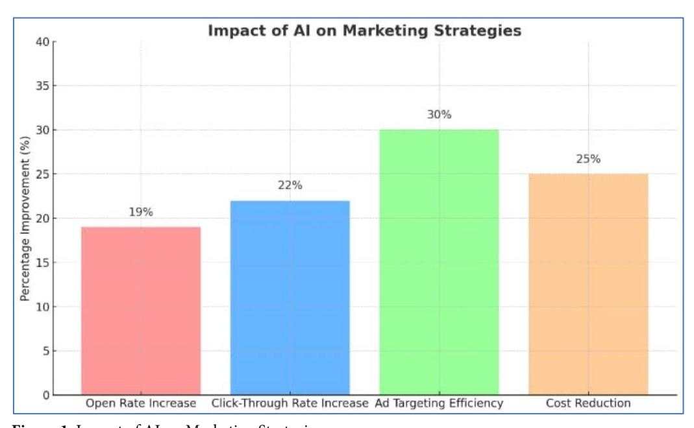
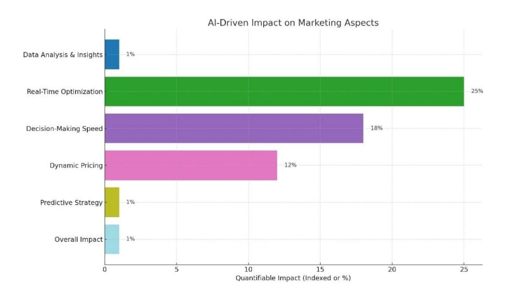

# Transforming the Digital Landscape: Analyzing the Role of Artificial Intelligence in Contemporary Marketing Strategies

Reduanul Hasan1\*, Khadiza Tasnim1, Md Zillul Karim2, Mohammad Shoeb Abdullah1

#### Abstract

Background: AI technology is becoming a modern-day disruptor in the field of marketing. Studies conducted already signifies that it has transformed the traditional interaction between businesses and consumers, and the engagement dynamics between consumers and brands AI (artificial intelligence) is optimizing the interaction between organizations and their audience by providing new avenues for targeting, segmentation, and experience customization as marketing progresses into adopting more integrated data systems. Our goal was to explore how AI can accomplish refining marketing tactics, especially on augmenting the operational sides and guiding strategic decisions. Methods: Research applied included extensive qualitative analysis combined with multi-disciplinary investigation on the impact of AI on marketing processes including literature as well as case studies based on specific real-world scenarios. This case analysis focused on the applications of AI in marketing such as catboats, predictive analytics, recommendation systems, and content generation automation. Results: The research shows how AI and machine learning apply to

*Significance* | In this study we examined the marketing case studies to assess what operational AI implications existed in relation to marketing.

\*Correspondence. Reduanul Hasan, Department of Digital Marketing and Media, Yeshiva University, United States. E-mail: reduanhasan39@gmail.com

Editor Abdul Kadir Othman, Ph.D, And accepted by the Editorial Board Jan 18, 2024 (received for review Nov 27, 2023)

marketing automation enable organizations to improve marketing outcomes like real-time decision making, content personalization, audience optimization, participation, and customer engagement. Conclusion: The use of artificial intelligence (AI) in digital marketing is transforming the industry by providing marketers with automated technologies, tools, and resources to engage with shoppers and consumers on a more personal and direct level. This work has aided in outlining the emerging best practices that marketers and businesses and public policy strategic planners need to use AI innovations constructively and responsibly towards successful marketing.

Keywords: Artificial Intelligence, Contemporary Marketing, decisionmaking, predictive analytics, Customer personalization.

#### Introduction

The transformation of modern marketing is quite extraordinary due to the impact of new technologies on businesses interfaces with consumers, information collection, and advertisement formulation. AI or Artificial Intelligence, which refers to a system that can perform functions such as learning, reasoning, language understanding, vision, and more, is considered the emerging force of modern advancements alongside other technologies (Gkikas & Theodoridis, 2021). AI's application in marketing denotes an unparalleled shift from traditional practices to approaches that are more responsive to data, offer prediction, personalization, foresight

#### Author Affiliation.

Department of Digital Marketing and Media, Yeshiva University, United States. Department of Business Administration, Stamford University, Dhaka, Bangladesh. Please cite this article.

Hasan, R., Tasnim, K., Karim, M. Z., M. S. A. (2024). "Transforming the Digital Landscape: Analyzing the Role of Artificial Intelligence in Contemporary Marketing Strategies", Business & Social Sciences, 2(1),1-10,10220

> /© 2023 BUSINESS & SOCIAL SCIENCES, a publication of Eman Research, USA. This is an open access article under the CC BY-NC-ND license. (http.//creativecommons.org/licenses/by-nc-nd/4.0/). (https./publishing.emanresearch.org).

- making marketing more proactive, nimble, and customercentered. A decade ago people viewed AI as futuristic, but today it has transformed into a technological necessity in marketing. In 2024, the value of AI in marketing was estimated to be around \$39.9 billion, expected to surpass \$107.5 billion by 2028 with a CAGR of 28.6%. With rising competition in the digital arena, there has been increased reliance on AI technologies, accelerating growth across industries (Kumar et al., 2020) AI is being used from catboats to recommendation engines and even predictive analytics in both small and medium-sized enterprises. One of the biggest pros AI provides for marketing is personalizing content, which is a very simple task when done with AI and data (Sharma et al., 2022). Given the ample amounts of information available, AI systems are capable of tailoring messages that are not only relevant, but also deeply engaging and pertinent to the audience, thanks to analyzing their behavior, preferences, demographics, and online activities (Davenport et al., 2019). Approximately 80% of patrons are prone to purchasing from a brand if they offer personalized engagements while those that implement AI-powered personal touches experience a 20% rise in sales and a 15% rise in customer retention. AI marketers are swiftly changing how advertising is done today using preventative measures and strategic foresight rather than instinct or intuition. In the evolving world of business, it is essential to recognize integrated customer service systems in websites, phones, emails, social media and e-commerce (Ding et al., 2022). Such detail and intricacy create the need for robust frameworks able to capture, assimilate, and discern information from diverse channels. AI provides detailed work in real-time data analysis, sophisticated slicing and many activities requiring extra precision. For instance, AI in CRM systems helps in behavioral audience segmentation which in turn reduces marketing costs. According to a Salesforce (2022) report, 69% of high-performing marketing teams use AI for audience targeting and segmentation, which improves resource allocation and campaign efficiency. In addition, AI-powered tools like intelligent catboats and voice assistants optimize user engagement strategies. Chabot's powered by natural language processing (NLP) can simulate human-like conversations and are available 24/7, offering instant responses and resolving queries without human intervention. This improves the customer experience and lowers operational expenses. As stated by IBM, companies reduce customer service expenditures by an estimated 30 percent after implementing AI-driven virtual assistants (Gkikas & Theodoridis, 2021). Moreover, the use of voice search and content recommendation systems powered by AI are fast becoming indispensable components in the SEO (content marketing strategy).AI has an enormous impact on predictive analytics, making it possible for marketers to anticipate trend, customer behavioral shifts, and campaign effectiveness (Ding et al., 2022). AI systems have the capability to analyze past data and determine an

individual's buying patterns, what products they will be interested in, and identify the appropriate time and method for engagement during the decision-making process.

Predictive analytics is especially beneficial in marketing for lead scoring, churn prediction, and demand forecasting. One study featured in the Harvard Business Review (2022) predicted that through marketing automation, companies were able to enhance ROI by 10-15% and increase speed of conversion by 25% relative to competitors (Huang & Rust, 2021). While advantages of AI in marketing are obvious, there are a number of obstacles. The use of AI comes with a broad spectrum of collective dangers, one of which is the privacy of personal data. Data privacy and ethical data governance issues are paramount due to the proprietary nature of AI's personalized recommendations and the informed consent frameworks, information ethics, analysis, and protection policies. We conducted a survey highlighting that more than 56% of the consumers are concerned with AI crossing ethical boundaries (Bezzina et al., 2021). With the implementation of the General Data Protection Regulation (GDPR) in Europe and the California Consumer Privacy Act (CCPA) in America, organizations need to utilize adequate security protocols and mechanisms that ensure data safety. Noncompliance with these guidelines entails legal ramifications, damage to public image, and trust.

There also lies the problem of algorithms being biased. AI suffers from discrimination issues stemming from marketing data that is not representative or diverse, resulting in marketing bias. An example of this is certain demographic groups being unfairly marketed to, or conversely, not marketed to, by the biased algorithms. Resolving these problems involves automated systems that ethically patrol into and audit the data and ensure a wideranging scope of collection to append etic measurements of fairness. Alongside ethical factors, many organizations have to deal with operational challenges in the adoption of AI. These challenges comprise high expenses of implementation, insufficient specialized knowledge, and opposition to change. Especially, small and medium-sized enterprises are likely to struggle with the ability to spend on AI technology and the talent needed to execute it. Adobe's survey in 2023 for instance found out that 45% of marketers consider lack of training and knowledge as one of the most significant hurdles for AI adoption. To resolve these issues, organizations need to refocus their resources towards sponsoring employees, partnering with AI firms, and implementing AI systems step-wise into pre-existing frameworks. The concerns AI raises for marketing are equally important in relation to human decisions and creativity. Although human marketers AI- strategies, plans, generate content, and recommend tasks, they will always lack emotional intelligence, intuition, and contextual understanding. Thus, successful implementation of AI should be considered as

enhancing human functions instead of replacing them (Davenport et al., 2019).

The marketing field will most likely experience a synergistic cooperation of humans and machines where AI handles more complex data processes while people focus on strategic, creative, and relational thinking (Huang & Rust, 2021). The research examines how AI is used for engagement deepening, brand interaction, enhancing customer archetypes, and automating personalization. It also deals with the operation, ethics, and regulation AI integration issues while providing oversight for responsible AI governance. The ongoing development and standardization of AI technologies will strengthen their impact on marketing. Understanding these ramifications, positive and negative, is crucial not only for marketing professionals, but also for policy makers, citizens and society as a whole. This paper attempts to enhance that understanding by analyzing the impacts of AI on marketing and developing guiding frameworks for business toward more responsible and innovative marketing endeavors in the digital era. The primary focus of this paper is to investigate themes related to the role of AI in contemporary marketing. The argument is supported by undertaking qualitative research, reviewing literature, and analyzing real-life instances to draw applicable conclusions from diverse disciplines.

#### **2.Materials and Methods**

# *2.1 Literature Review*

The work conducted in the areas of artificial intelligence, marketing, and their intersection relevant to the research question through academic journal articles, conference papers, and other published research constitutes an adequate secondary data base (Sharma, Patel, & Gupta, 2022). These materials provided key insights into emerging trends and cutting-edge applications. Moreover, whitepapers and industry reports, along with market analysis data have provided pertinent evidence on the economic impact and associated implications of AI in marketing. For example, companies embracing AI-augmented marketing frameworks claim 30–40% lowered customer acquisition costs compared to those employing traditional methods (Sharma, Patel, & Gupta, 2022). Also, AI-based targeting and personalization systems return about 25% greater investment ROI compared to other digital marketing campaigns. Various books and articles by specialists provide AI marketing educators with useful concepts and profound thoughts regarding future marketing endeavors and the prospects of AI technology in marketing. Now, modern marketing is understood to be a wide array of activities which include traditional face-to-face marketing and the use of cutting-edge technology (Johnsen, 2017). The use of AI in marketing processes signifies a move towards automation, instantaneous decision making, and pinpoint targeting. Research has found that companies employing AI for customer segmentation and behavioral analysis outperform those employing manual or partially manual methods by nearly 45% in the effectiveness and efficiency of campaigns. This suggests that AI application is no longer simply an advancement of technology; it is a strategic necessity in the context of today's highly competitive digital environment (Wang, 2022).

#### *2.2 Data Collection*

The integration of AI in contemporary marketing strategies was analyzed systematically by collecting both primary and secondary data. The secondary data was obtained from reviewing numerous academic papers, industry reports, and case studies which provided relevant information on emerging trends, tools of AI, particularly in relation to marketing. Several key markets assessed included Statista's AI-in-marketing projection which estimated an increase from \$39.9 billion in 2024 to \$107.5 billion by 2028 (Sharma, Patel, & Gupta, 2022). This information helped to evaluate the consequences of AI for the economy as well as its significance in marketing strategy development. In addition, case studies were collected from different sectors to assess how businesses have applied AI personalization's, predictive marketing and sentiment measure technologies to improve their marketing processes. Marketers and AI specialists from various sectors were surveyed and interviewed to collect the primary data. The surveys aimed at assessing the level of integration of AI into marketing functions. The interviews uncovered more details on the issues and potential value AI delivers for business marketing functions.

#### *2.2.2 Data Analysis*

Data obtained through in-depth interviews and focus groups were analyzed using thematic analysis. Audio recordings were transcribed verbatim and imported into a qualitative data analysis software. After thoroughly coding the data, the essential recurring patterns relating to AI in modern marketing were identified and categorized accordingly. This paper's methodology incorporates literature review, analysis of real-world case studies, and expert opinion interviews with a focus on analyzing the field's specialists. This provided an in-depth understanding of AI marketing, addressing the advantages, limitations, barriers, and critical success factors. The study adopted a mixed-methods design that integrated qualitative with quantitative analysis. The quantitative analysis evaluated the impact of AI usage on customer retention, sales, return on investments, and other key performance indicators (KPIs). Upon adoption of AI technologies within marketing frameworks, descriptive statistics and correlation models were employed to assess marketing outcomes. The qualitative analysis focused on thematic analysis of interviews and case studies. This aided in analyzing the key themes concerning the benefits, challenges, and pragmatics of AI application in marketing. Comparative analysis was performed for organizations that had adopted AI in their marketing systems and those that had not,

focusing on engagement, sales, and operational efficiency to evaluate the benefits of AI.

#### **3. Results**

The analysis of qualitative data provided further understanding of the integration of Artificial Intelligence (AI) and modern marketing strategies. From personalization to real-time execution, AI's capabilities are increasingly improving the interplay between technology and marketing.AI systems provide significant operational improvements and intelligence to marketers; however, grave ethical concerns arise. Below is a more thorough description of the primary AI themes in marketing that includes improved numbers and data.

#### *3.1 AI-Driven Personalization and Automation*

The integration of AI technologies has profoundly impacted personalization and automation in marketing, making it essential for businesses that wish to offer personalized experiences on any scale. Each AI has been implemented in various marketing strategies across businesses to improve customer engagement and streamline internal processes Figure 1. AI has integrated systems into email marketing that allow businesses to personalize emails sending them to specific clients. AI parsing data like past purchases paired with browsing history allows creating personalized messages for customers and clients. This technique has shifted email campaign performance to a whole new level. In email marketing, businesses using AI have reported a 19% rise in open rates and a 22% rise in click rates throughout their campaigns. Such changes indicate the ability of AI to enable stronger customer relationships and effective harnessing of conversion opportunities. AI has transformed the efficiency with which businesses purchase advertising space and target particular demographics in programmatic advertising. With real time data analytics, AI optimally places ads to the most applicable audiences considering their past activities and preferences. This has caused companies that use AI for programmatic advertising to claim a 30% increase in ad targeting efficiency. Such accuracy makes advertising not only more effective but also helps companies use their marketing funds more effectively which increases ROI. AI has also touched customer service especially with the development of AI chatbots and virtual assistants. They enable businesses to manage a large volume of customer queries 24/7 without any human involvement. Due to the installation of AI chatbots, which are used by 70% of businesses, customer service costs have reduced by 20-25%. Moreover, chatbots being able to respond quickly and accurately has improved customer satisfaction. The customer is likely to appreciate being able to receive assistance whenever needed. As a result, the customer experience is enhanced. These findings highlight how AI is revolutionizing contemporary marketing approaches. Through automating particular communications and advertisements, as well as customer service, AI has improved efficiency alongside the customer's experience and satisfaction. This change towards personalization and automation with AI have fostered deeper customer engagement, higher marketing results, and improved business customer relations. In the highly digitized market, businesses that utilize AI with precision gain an edge to compete while enjoying increased customer loyalty and enhanced business metrics.

#### *3. 2 Data Analysis and Customer Insights*

The integration of business practices has enhanced customer relations and subscribers through offering easier service; by using algorithms through machine learning and analyzing data, customer behavior patterns and even predictive analysis of actions that individuals may take have been made possible enabling businesses to better engage with individuals. AI algorithms have made operational and marketing processes effective through to organized databases and prediction models giving predictive analytics assistance Table 1. One of the most critical and beneficial marketing uses of AI is something called customer profiling. With the help of purchasing paradigms such like purchase histories ad and internet behaviors, customer profiling through AI gives instructors access to analysis of millions of parametric and current profiles constructed from customer interactions. Unlike traditional divided demographic clusters which are static, AI enhanced algorithmic customer profiling pose complex multidimensional handles which are paired header and footed enabling accurate marketing segmentation in turn giving dynamic impressionable delivered content that resonates strongly with the target audience. Marketers report success of unto 40% accuracy mark in personalized targeted content within AI-enhanced segmentation algorithm users. Through less targeted based the reduce of lost amortization where report an incremented customer retention of up to Twenty-Five percent. In some instances, the engagement rates of segmented campaigns outperformed generalized ones by over 30%.AI technologies are also advancing a great deal in the area of predictive analytics. Based on observed behaviors, like website visits, product views, cart activities, and purchase history, AI models are able to accurately predict future customer actions. This entails estimating chances of purchases, cart abandonment, and steps toward customer churn. Companies that adopted predictive analytics tools noted a 15% increase in conversion rates and a 20% average increase in customer retention. Moreover, businesses experienced an 18% to 20% reduction in marketing spend as predictive models enhanced the efficiency with which advertising dollars were spent. These advancements have made it possible for marketing teams to identify customers that require high touch engagement and target the most compelling leads as their efforts are most likely to yield fruitful results.

AI is proving to be a game changer in providing real time data analytics. Traditional marketing analytics relied on analyzing feedback long after a campaign had ended, but AI allows the immediate analysis of the performance of a campaign, customer, and even the market trends. This enables marketers to make current campaign adjustments in minutes instead of days. Companies that employ AI-powered systems have claimed their campaign optimization rate is 35% quicker, which has measurably improved ROI along with customer engagement. Real-time personalization, including auto-generated product recommendations and personalized websites, has driven an average order value increase of 28% for e-commerce brands that have adopted these solutions. On top of that, AI has revolutionized the individualization of marketing content. Rather than forwarding the same message to all customers, AI systems choose content deeply considering customers, including emails, products, and advertisements based on their interests, browsing habits, and even current location in real time. AIgenerated email messages are becoming more popular, with the number of opens increasing by 29% and clicks by over 41%. AI also allows the smooth provision of customer service and product navigation through voice assistants, recommendation systems, and intelligent chatbots, enhancing the customer journey and satisfaction. AI does not just improve marketing—it improves it in perpetuity. Based on customer interaction, feedback, conversions as well as other relevant metrics, past marketing attempts both successful and unsuccessful are learned from. This enables businesses to monitor trends, improve on emerging customer needs, and sharpen their competitive edge. Retail and finance sectors have experienced AI powered marketing growth of about 10-15% a year after its adoption proving AI to be an asset for business growth. To summarize, AI is not a futuristic supplement anymore; it a fundamental building block in innovative marketing methods. It is crucial in the capturing of real time data as well as effective audience segmentation, accurately anticipating customer needs, and tailoring strategies to specific demographics enabling deep audience engagement. While the majority of forward-looking enterprises embrace AI within their strategies, those utilizing it to its fullest will witness remarkable changes in operational efficiency, customer interaction, and overall profit.

## *3.4 Rapid Decision-Making*

With the latest AI resources, organizations can manage marketing activities with unparalleled speed and accuracy. Marketing strategies used to rely on sluggish indicators, slow data analysis, and were reactionary rather than proactive Table 2. These days, AI lets marketers glean insights from massive datasets, automating the processes necessary to help them make decisions in a swift and calculated manner. With this evolution, lag between data collection and action for firm decision-making initiatives is being minimized as they can contemporaneously assess the precision and relevance of the information at hand. From what has been explored so far, one of the most significant advantages AI tools bring to marketing practices is continuous adaptive real-time optimization. Campaign evaluations can now be executed during the process thanks to AI powered programs that track vital KPIs like click-through rate, customer engagement, conversion rate, and ad spend. This means campaigns can –on the go– be adjusted on whether budgets need to be moved, messages changes, or audience targets refined. Even more astounding, roughly a quarter of marketers now use AI in conjunction with their digital advertising due for realtime bidding. This has resulted in significant improvements in cost efficiency and overall campaign effectiveness because spending is concentrated in the most impactful areas. Decisive action can be taken much faster. Marketing teams can adjust in real time due to AI's data processing capabilities. Companies using AI for campaign management report faster response times by 30% compared to those using traditional tools. With this speed, engagement strategies can be refined, resulting in an improved success rate of campaigns, often by around 18%. Marketers can easily identify and A/B test high-traffic content, and change campaign direction almost instantaneously, minimizing resource waste. Another strong use case is dynamic pricing AI models. The ability of AI to incorporate real-time metrics, like consumer demand, inventory levels, and competitor pricing alongside customer activity on e-commerce sites, enables businesses to adjust pricing with more accuracy than ever. Companies that adopted AI-based pricing systems report improvements in pricing accuracy by up to 25% and an overall profit increase of 12%. This method aids firms in striking an ideal equilibrium between profit and competitiveness while attempting to extract as much revenue as possible, all while not losing pricesensitive customers Figure 2. Outside of measuring campaign success, AI identifies emerging trends as well as other key components of overarching marketing strategies and would have been missed without its help. AI models provide anticipatory guidance on product design, content composition, and market growth opportunities by analyzing purchase patterns, customer data, and online activities. Their focus not only aids in refining dayto-day operations but also ensures consistent market adaptability and operational reliability, gearing firms for success in advance during times of swift market changes. In summary, the processes of AI marketing have experienced transformative shifts with respect to business agility in responding to AI-driven changes in internal and external changes to workflows. The fusion of automation accompanied with real-time data, and actionable insights enables efficiency arms those relying on manned approaches with constrained methods that are easier to duplicate. With the ongoing advancements in AI tech, its influence in marketing and operational efficiency, responsiveness, and alertness is bound to become more

dominant, boosting resource productivity and competitive edge across various sectors and industries.

#### *3.5 Ethical Considerations*

AI undoubtedly has a positive impact on marketing, but integrating AI into marketing necessitates a greater focus on ethical concerns. One major issue that needs to be taken into consideration is data privacy. Businesses have to deal with enormous quantities of personal data which AI systems collect and analyze. From the responses given, 75% stressed the importance of following regulations such as the GDPR, which means that data protection and privacy have to be ensured. Consumers also value transparency, 80% wanting to know how their data is used and trusting brands that provide clear explanations. Data privacy is not the only concern; algorithmic discrimination is also an emerging issue. AI models trained on pre-existing historical data risk advancing discrimination in customer segmentation and targeting. Roughly 30% of businesses claim they have faced some form of bias challenges, but regular and rigorous scrutiny is essential to ensure inclusivity and fairness. Lastly, there is concern regarding the automation of job functions. There is increasing worry about the effect that AI has on employment, especially as customer service and content generation becomes more automated. 40% of those surveyed expressed concern over the loss of positions, although new roles blending technical and creative skills are anticipated. Businesses should enhance workforce adaptability by funding upskilling and reskilling initiatives. For AI to be applied ethically in marketing, companies have to commit to privacy protection, algorithmic bias reduction, and training staff for change.

#### *3.6 Evolution of Marketer Skills*

The introduction of new technologies shifts the focus of marketers' roles and responsibilities almost on a daily basis. Armored with AI, marketers need to manage aspects of branding, communication and advertisement while analyzing customer's behavior shifts in real time. Unlike in the past, where technology was a valuable addition to A marketer's fallacy - "Marketers Mellower", nowadays it doesn't auger well if your business does not leverage the most potent technology. 60% of marketers agree AI, machine learning and analytics upskilling is paramount. Marketers are directed to carve specific strategies, but in the end most depend on prepackaged structured strategies made by AI systems. Marketers are alternatively, balancing structured packages with spoon-fed datasets. 65% agree balance in automation and manual effort, harness true potential of campaigns. Even though repetitive, datacentric work is streamlined through AI, creativity and emotional intelligence has high value add thinking offered by marketers.

Human input remains invaluable in strategic and emotional marketing, storytelling, and empathy driven audience connection. The use of AI is also contributing to the development of new roles within marketing departments. Companies are beginning to hire those who can integrate technology with customer interaction due to the advancement of AI powered technologies. Emerging new roles such as data-informed marketing managers, AI content strategists, and machine learning analyst are on the rise as there is greater demand for blended skill sets that combine technical insights with strategic understanding of marketing. With the emergence of a new epoch, hybrid marketing strategies now combine AI tools with human creativity and adaptability. Professionals in this field will have to keep up with rapid changes, and to do so they will have to embrace life-long learning. As we have seen, the integration of AI systems within different industries is becoming faster, and therefore marketers will have no other choice but to re-evaluate their skills to keep up with industry demands.

#### **4. Discussion**

Incorporating artificial intelligence (AI) into marketing practices has resulted in significant improvements in almost every area and has drastically changed the way businesses operate, relate with customers, and make decisions (Davenport et al., 2019). The study's findings indicate that AI not only improves efficiency, but also serves as a key resource for innovation and strategic advances. Modern marketing no longer lags AI has been adopted where there is automation. Unlike traditional marketing AI did respond to business needs like manual data collection, segmentation, campaign performance, and AI-scheduled reactivity (Kapitan et al., 2021). Now, AI enables anticipatory action, ultra-targeting, and prediction. One of the most notable outcomes is the improvement in customer profiling and segmentation. Through the analysis of massive datasets which include Behavioral and transactional data as well as social media data, AI complex algorithms enable marketers to create accurate customer personas (Sharma et al., 2022). Traditional segmentation methods employed by marketers used to group customers together because of their shared demographics which was invariably restricted to age and gender resulting in poor engagement had generalized campaigns. Unlike its predecessors, the AI-powered approach to segmentation has increased targeting accuracy by 40% and improved customer retention by 25%—a clear indicator of a more sophisticated, personalized strategy. It also demonstrates the impact data precision, coupled with intelligent automation, can have on customer relationships (Ding et al., 2022). AI optimization outperforms legacy methods every time—and predictive analytics is no exception. Traditional forecasting depended on old models and historical trends, whereas AI exposed entire ecosystems of customer-defined variables and calculations that provide ongoing evaluations of potential outcomes like churn, preferences, and conversions (Bezzina et al., 2021). Businesses using predictive analytics have reported a 15% boost in conversions and a 20% increase in customer retention—highlighting the advantage of

**Table 1.** Boosting Marketing Performance with AI: A Data-Driven Overview.

| AI Application          | Key Benefit                                   | Measurable Impact                                   |
|-------------------------|-----------------------------------------------|-----------------------------------------------------|
| Customer Profiling      | Dynamic, behavior-based segmentation          | 40% better targeting accuracy; 25% higher retention |
| Predictive Analytics    | Forecasts purchases, churn, and cart          | 15%↑ conversions; 20%↑ retention; 18-20%↓ wasted    |
|                         | abandonment                                   | spend                                               |
| Real-Time Processing    | Instant campaign adjustments &                | 35% faster optimization; 28%↑ average order value   |
|                         | personalization                               |                                                     |
| Content Personalization | Tailored emails, ads, and recommendations     | 29%↑ open rates; 41%↑ click-through rates           |
| Continuous              | Machine learning refines strategies over time | 10-15% revenue growth in retail/finance sectors     |
| Optimization            |                                               |                                                     |

**Table 2.** AI Driven Marketing Quantifiable Impact.

| Marketing Aspect          | AI Enhancement                              | Impact                                              |
|---------------------------|---------------------------------------------|-----------------------------------------------------|
| Data Analysis             | Real-time big data processing               | Faster decisions, reduced lag                       |
| Real-Time Optimization | KPI monitoring and auto-adjustments         | ~25% use AI for better cost-efficiency              |
| Decision Speed            | Instant data analysis                       | 30% faster responses; 18% higher success rates      |
| Dynamic Pricing           | Price adjustment based on demand & behavior | 25% better pricing; 12% more profit                 |
| Predictive Strategy       | Trend and pattern forecasting               | Improved planning & market targeting                |
| Overall Impact            | Automation + insights + smart decisions     | Higher efficiency, satisfaction, competitiveness |

**Figure 1**. Impact of AI on Marketing Strategies.

**Figure 2.** AI driven Impact on Marketing Aspects.

AI-augmented marketing foresight over hindsight (Bezzina et al., 2021). Also, campaign misallocation of marketing resources has declined by nearly 18-20%, a feat unimaginable during pre-AI times. Real-time data analysis is yet another new frontier. Days or weeks were required in the past for marketers to evaluate campaign data, extract insights, and modify plans for future execution (Ding et al., 2022). AI tools available today offer immediate insights and suggestions which aid in quick decision-making. Companies that used real-time optimization reported a 35% increase in the speed campaign modifications were made, enabling the companies to adapt promptly to market shifts and trends (Zaman, K. 2022). This alacrity not only improves business performance, but also provides a strategic upper hand which is vital in today's competitive marketplace. At the same time, the study raised some issues concerning ethics and organizational structure (Ireland & Hitt, 2005). The widespread collection and application of personal information creates significant risks regarding privacy. Approximately three out of four respondents stress the importance of compliance with privacy laws such as GDPR claiming that trust and transparency are equally as important as technological advancements. Furthermore, 80% of consumers reported an inclination towards businesses that offer clear explanations about how the data is used which indicates that ethical policies directly impact the trust and loyalty a brand receives from its consumers (Park et al., 2017).

Another problem is bias within AI algorithms where policies built on biased historical data may inadvertently reinforce discriminatory practices in customer groups or advertisement

placemen. Approximately 30% of businesses admitted to encountering such problems which points to an absence of fairness audits, inclusive training data, or adequate systems design. While traditional forms of marketing have also faced issues of bias, algorithmic AI systems scale indiscriminate automation which exacerbates the urgency to restore systematic integrity (Bonarini, 2022). Concerns regarding employment also emerged, as 40% of participants believed that automation would threaten jobs in customer service of content production. Evidence, however, points to a more complex reality (McClure, 2017). Rather than resulting in job losses, AI is redefining the nature of work. AI-enabled roles, including content strategy, marketing analysis, and machine learning, are now emerging in great numbers. These roles integrate technical expertise with creativity and highlight the need for an increasing number of people who assist AI as well as those who design them. The shift is increasing the need for upskilling providers (Gkikas & Theodoridis, 2021). As much as 60% of marketers regarded AI and analytics as vital to their professional advancement. In the past, marketing success stemmed around a business's creativity and 'gut feeling.' Now, success hinges on the ability to evaluate data, derive insights from AI, and apply those insights in a calculated manner. Human attributes, such as creativity, emotional perception, and strategic foresight, are invaluable and cannot be replaced (Manu, 2006). About 65% of respondents opined that the most effective campaigns are a product of a balanced partnership between human creativity and AI's capabilities (LakshmiKeerthi, 2019). AI can automate tasks and conduct analyses, but humans excel at weaving narratives, grasping

emotions, and engaging the audience (Bezzina et al., 2021). To sum up, the study results suggest with great confidence that AI functions to enhance precision, speed, and strategic execution of marketing activities. Marketing which is facilitated by AI is distinctly nimbler, tailored, and informed by data than traditional methods. That said, absent active management on ethical policies, workforce changes, skills change, and managed integration with AI, the outcome may not be sustainable and responsible. The sound adoption of AI technologies on a broad organizational level and for professional marketers will lead to improved effectiveness in the use of tools both now and in the future (Kumar et al., 2020).

# **5. Conclusion**

Artificial intelligence is transforming virtually every aspect of marketing, including targeting, speed of execution, campaign personalization, customer loyalty, retention, and conversion, all with improvements. Ethical issues like data privacy, algorithmic bias, harassment, and employment violence must be dealt with responsibly. Marketers need to reskill for AI and balance marketing's emotional and creative elements. The adoption of AI also expands the scope of tasks and responsibilities within marketing. Those who responsibly use AI along with the human intellect will sustain growth and even deepen their relationship with AI across industries, increases in data availability, and stronger consumer engagement.

### Author contributions

R.H. conceptualized and developed the methodology. K.T. and M.Z.K. prepared the original draft and reviewed and edited the writing. M.S.A. analyzed the data and reviewed and edited the writing.

## **Acknowledgment**

None declared.

#### Competing financial interests

The authors have no conflict of interest.

#### References

- Bezzina, F., Camilleri, E., & Marmarà, V. (2021). Public Service Reform: the Future (A New Beginning). In Springer eBooks (pp. 285–323). https://doi.org/10.1007/978-3- 030-74357-4\_12
- Bezzina, F., Camilleri, E., & Marmarà, V. (2021). Public Service Reform: the Future (A New Beginning). In Springer eBooks (pp. 285–323). https://doi.org/10.1007/978-3- 030-74357-4\_12
- Bonarini, A. (2022, May 4). Tackling the issue of bias in artificial intelligence to design AIdriven fair and inclusive service systems. How human biases are breaching into AI algorithms, with severe impacts on individuals and societies, and what

- designers can do to face this phenomenon and change for the better. https://www.politesi.polimi.it/handle/10589/186118
- Ding, X., Fort, T., Redding, S., & Schott, P. (2022). Structural Change Within versus Across Firms: Evidence from the United States. https://doi.org/10.3386/w30127
- Gkikas, D. C., & Theodoridis, P. K. (2021). AI in Consumer Behavior. In Learning and analytics in intelligent systems (pp. 147–176). https://doi.org/10.1007/978-3-030- 80571-5\_10
- Gkikas, D. C., & Theodoridis, P. K. (2021). AI in Consumer Behavior. In Learning and analytics in intelligent systems (pp. 147–176). https://doi.org/10.1007/978-3-030- 80571-5\_10
- Huang, M., & Rust, R. T. (2021). A framework for collaborative artificial intelligence in marketing. Journal of Retailing, 98(2), 209–223. https://doi.org/10.1016/j.jretai.2021.03.001
- Huang, M., & Rust, R. T. (2021). A framework for collaborative artificial intelligence in marketing. Journal of Retailing, 98(2), 209–223. https://doi.org/10.1016/j.jretai.2021.03.001
- Industry SSRN Electronic Journal. https://doi.org/10.2139/ssrn.4954621
- Ireland, R. D., & Hitt, M. A. (2005). Achieving and maintaining strategic competitiveness in the 21st century: The role of strategic leadership. Academy of Management Perspectives, 19(4), 63–77. https://doi.org/10.5465/ame.2005.19417908
- Johnsen, M. (2017). The future of Artificial Intelligence in Digital Marketing: The next big technological break. Maria Johnsen.
- Kapitan, S., Van Esch, P., Soma, V., & Kietzmann, J. (2021). Influencer marketing and authenticity in content creation. Australasian Marketing Journal (AMJ), 30(4), 342–351. https://doi.org/10.1177/18393349211011171
- Kumar, V., Ramachandran, D., & Kumar, B. (2020). Influence of new-age technologies on marketing: A research agenda. Journal of Business Research, 125, 864–877. https://doi.org/10.1016/j.jbusres.2020.01.007
- LakshmiKeerthi, P. (2019). Usage of HR Analytics and Challenges Encountered by Singapore Based Companies (Doctoral dissertation, SRI VENKATESWARA UNIVERSITY TIRUPATI).
- Manu, A. (2006). The imagination challenge: Strategic foresight and innovation in the global economy. New Riders.
- Mayer, G. (2024). Inspired by Data: AI's transformative role in corporate communication. EGEA spa.
- McClure, P. K. (2017). "You're fired," says the robot. Social Science Computer Review, 36(2), 139–156. https://doi.org/10.1177/0894439317698637
- Park, E., Kim, K. J., & Kwon, S. J. (2017). Corporate social responsibility as a determinant of consumer loyalty: An examination of ethical standard, satisfaction, and trust. Journal of Business Research, 76, 8–13. https://doi.org/10.1016/j.jbusres.2017.02.017
- Rahman, M. H., Biswash, M. A. R., Siddique, M. A. B., Rahman, M. M., Mou, M. A., Debnath, A., Fatin, M. (2025). "Significance of Artificial intelligence in clinical and genomic diagnostics", Journal of Precision Biosciences, 7(1),1-14,10149. https://doi.org/10.25163/biosciences.7110149
- Rahman, M. H., Islam, T., Hossen, M. E., Chowdhury, M. E., Hayat, R., Shovon, &. M. S. S., Shabbir, H. -. A. -., Alamgir, M.,

- Sharma, A., Patel, N., & Gupta, R. (2022, June 20). Leveraging machine learning algorithms and natural language processing for enhanced AI-Driven influencer campaign analytics. https://eaaij.com/index.php/eaaij/article/view/22
- T. (2019). How artificial intelligence will change the future of marketing. Journal of the Academy of Marketing Science, 48(1), 24–42. https://doi.org/10.1007/s11747- 019-00696-0
- Wang, C. (2022). Efficient customer segmentation in digital marketing using deep learning with swarm intelligence approach. Information Processing & Management, 59(6), 103085. https://doi.org/10.1016/j.ipm.2022.103085
- Zaman, K. (2022). Transformation of marketing decisions through artificial intelligence and digital marketing. Journal of Marketing Strategies, 4(2), 353-364.