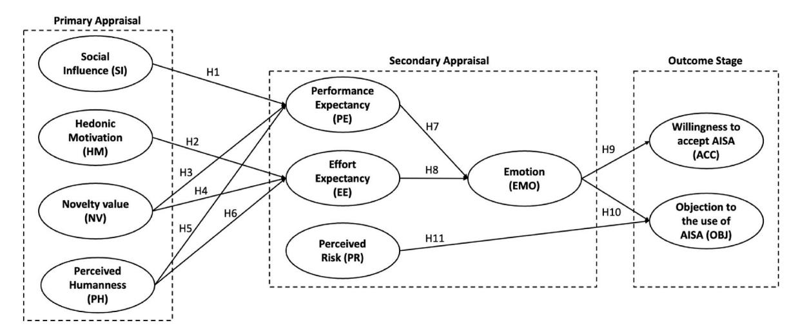
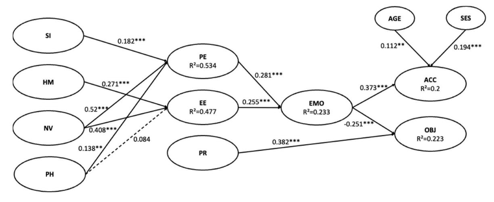
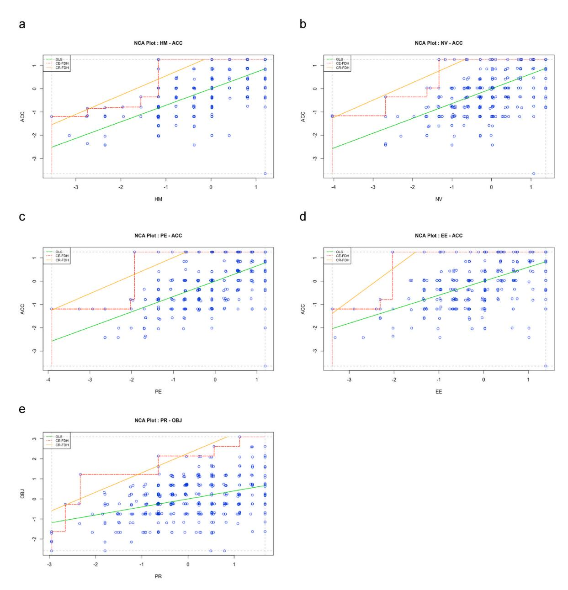

Contents lists available at [ScienceDirect](www.sciencedirect.com/science/journal/09696989)

# Journal of Retailing and Consumer Services

journal homepage: [www.elsevier.com/locate/jretconser](https://www.elsevier.com/locate/jretconser)

# Toward agentic AI: User acceptance of a deeply personalized AI super assistant (AISA)

Marc Hasselwander a,\* [,](https://orcid.org/0000-0002-0852-5093) Varsolo Sunio b [,](https://orcid.org/0000-0002-9781-9412) Oliver Lah a,c,d , Emmanuel Mogaji e

- a *Urban Living Lab Center, Technische Universitat* ¨ *Berlin, Berlin, 10623, Germany*
- b *Science Engineering Management Research Institute and Industrial Engineering Program, University of Asia and the Pacific, 1605, Pasig City, Philippines*
- c *Urban Electric Mobility Initiative (UEMI), a UN-Habitat Action Platform, Berlin, 10437, Germany*
- d *Urban Living Lab Center, Wuppertal Institute for Climate, Environment and Energy, Berlin, 10115, Germany*
- e *Keele Business School, Keele University, Staffordshire, United Kingdom*

#### ARTICLE INFO

#### *Keywords:* AI super assistants (AISA) Agentic AI Human–computer interaction AIDUA model Combined PLS-SEM and NCA Philippines

## ABSTRACT

Recent scholarship underscores the transformative potential of generative AI in shaping consumer decisionmaking, preferences, and overall brand satisfaction. Among these technologies, chatbots and AI voice assistants are increasingly deployed in marketing to influence consumer behavior. A critical question, however, is whether consumers are willing to accept a new generation of such technologies. In July 2025, OpenAI introduced the agent mode of ChatGPT, which represents a shift toward highly personalized, multimodal, and autonomous systems. This study defines these systems as AI super assistants (AISA). Informed by the broader literature on AI adoption and consumer behavior, an adapted AIDUA model with perceived risk is proposed. Survey data from the Philippines (N = 407) was analyzed using combined PLS-SEM and NCA methods. The results show that users appear increasingly confident in their ability to engage with new AI technologies, indicating that they do not feel overwhelmed but instead perceive AISA's new features as manageable. Hedonic motivation, novelty value, performance expectancy, and effort expectancy were identified as necessary conditions for user acceptance, while perceived risk is a necessary condition for objection. These findings offer new insights into user perception toward AISA, with implications for responsible AI design and deployment.

# **1. Introduction**

The rapid development of generative artificial intelligence (GenAI) has fundamentally reshaped how individuals interact with digital technologies ([Dwivedi et al., 2021](#page-11-0)). Within a short span, tools like ChatGPT, DeepSeek, Claude, Google Gemini, and Grok have moved from experimental novelties to mainstream applications, used by hundreds of millions worldwide [\(Niu and Mvondo, 2024;](#page-11-0) [Moharrak and Mogaji,](#page-11-0)  [2025\)](#page-11-0). GenAI systems are increasingly able to generate language, images, and code, enabling users to complete creative and cognitive tasks with unprecedented speed and convenience. This momentum signals not just incremental innovation, but the onset of successive waves of disruption.

Indeed, after internal documents surfaced in May 2025 ([OpenAI, n.](#page-11-0)  [d.](#page-11-0)), OpenAI released the ChatGPT agent mode in July 2025. This next generation of agentic AI systems acts highly autonomous and

multimodal. It is capable of learning user preferences, managing context across platforms, and executing complex digital tasks. Unlike previous GenAI tools that perform isolated functions, these systems integrate the functionality of various AI tools into one cohesive system. Rather than simply reacting to user prompts, they act intelligently on the user's behalf. This includes scheduling meetings, responding to messages, making purchases, coordinating across apps and platforms, and other daily tasks.

This study introduces the term **AI super assistants (AISA)** to describe these novel systems. Conceptually, AISAs resonate with the rise of super apps. Super apps are multifunctional platforms that bundle diverse services into a single interface [\(Hasselwander, 2024\)](#page-11-0). They are very popular in Asia and reflect a growing demand for seamless digital ecosystems [\(Steinberg, 2020\)](#page-12-0). In contrast, super apps have not gained traction in the Global North, largely due to fragmented app landscapes and regulatory constraints (Prud'homme et al., 2023). AISA could offer

*E-mail addresses:* [hasselwander@tu-berlin.de](mailto:hasselwander@tu-berlin.de) (M. Hasselwander), [varsolo.sunio@uap.asia](mailto:varsolo.sunio@uap.asia) (V. Sunio), [oliver.lah@uemi.net](mailto:oliver.lah@uemi.net) (O. Lah), [e.mogaji@keele.ac.uk](mailto:e.mogaji@keele.ac.uk) (E. Mogaji).

\* Corresponding author.

an alternative path by serving as neutral facilitators that provide streamlined access to services across apps without consolidating control. Hence, AISA may become the entry point to an integrated digital experience, even in markets where super apps failed to emerge. Note that in both cases, the term "super" refers to the breadth and integration of various services offered across domains, rather than to market dominance or hierarchical superiority. While the technological shift to AISAs may seem plausible, especially its human implications warrant closer examination.

Current research in AI adoption has focused primarily on discrete tools such as chatbots, AI voice assistants, or customer-facing service robots (e.g., [Gursoy et al., 2019](#page-11-0); [Hasan et al., 2021;](#page-11-0) [Kim et al., 2025](#page-11-0)). These systems are designed for narrow, reactive use. This literature positions generative AI as a powerful choice architect across the customer journey—shaping information intake, framing evaluations, and reinforcing satisfaction and loyalty outcomes [\(Mogaji and Jain,](#page-11-0)  [2024\)](#page-11-0).

The advent of AISA, however, extends this influence from advice to action. AISA would intervene more deeply in users' daily routines, potentially mediating access to information, services, and even social interactions. Complex psychological, ethical, and emotional questions therefore arise that extend beyond what existing studies on conventional

AI applications have explored. It remains unclear how users evaluate systems that operate autonomously in the background, handle deeply personal data, and increasingly take over decision-making in everyday life.

Therefore, this study addresses a critical gap by answering the following question.

RQ: What drivers and barriers shape consumers' acceptance of, and objection to, AISA?

To this end, the Artificially Intelligent Device Use Acceptance (AIDUA) model [\(Gursoy et al., 2019](#page-11-0))—and its extension for GenAI chatbots ([Ma and Huo, 2023](#page-11-0))—provides the conceptual foundation for this study. Rooted in cognitive appraisal theory, AIDUA captures users' cognitive and affective responses to AI technologies. For the AISA context, the model is extended by incorporating perceived risk as an additional explanatory factor. Empirically, partial least squares structural equation modeling (PLS-SEM) and necessary condition analysis (NCA) are applied to survey data from 407 respondents in the Philippines.

The remainder of the article is structured as follows. In the next section, we review the relevant literature and forward testable

**Table 1**  Overview of related studies in the consumer behavior literature.

| Study                          | Context                                 | Type of AI technology              | Sample                    | Target variable             | Model/Theory                             | Methods                                        | Key findings                                                                                                                                                                |
|--------------------------------|-----------------------------------------|---------------------------------------|---------------------------|-----------------------------|------------------------------------------|------------------------------------------------|-----------------------------------------------------------------------------------------------------------------------------------------------------------------------------|
| Kim et al. (2025)              | Luxury retail (South Korea)          | AI assistant                          | N = 270                | Intention to use            | UTAUT                                    | SEM; survey                                    | Effort expectancy, social influence, and facilitating conditions identified as key predictors for consumer adoption.                                                  |
| Al-Fraihat et al., 2023     | Shopping (Jordan)                    | AI assistant                          | N = 380                | Adoption                    | Complexity theory                     | CFA and fsQCA; survey                       | Perceived ease of use, usefulness, humanness, and social presence are required for intention to adopt.                                                                |
| Affandi et al. (2025)       | No specific context (Pakistan)    | AI assistant                          | N = 644                | Intention to reuse       | Dual process theory                   | SEM; survey                                    | Emotional disclosure and higher performance expectations significantly increase reuse intentions.                                                                     |
| Yuan et al. (2022)          | No specific context (China)          | AI assistant                          | N = 210                | Acceptance                  | Dual process theory                   | SEM; survey                                    | Perceived advantages increase utilitarian and hedonic value and acceptance, moderated by social anxiety.                                                              |
| Xiong et al., 2024             | No specific context (China)          | AI assistant                          | N = 926                | Acceptance                  | UTAUT                                    | PLS-SEM; survey                                | Trust and perceived risk in addition to UTAUT constructs determine expectance of AI assistants.                                                                       |
| Schreibelmayr et al. (2023) | Financial sector (Austria)           | AI assistant                          | N = 136                | Intention to use            | TAM and trust theories                | Online experiment with two trust groups  | Initial trust drives perceived usefulness, competence, and understandability, while manipulating the assistant's agency did not affect intention to use.           |
| Arce-Urriza et al. (2025)   | Retail (USA)                            | GenAI chatbot                         | N = 397; N = 414 | Adoption                    | SRAM                                     | Regression analysis; survey in two waves | GenAI enhances consumer perceptions of chatbot usefulness, human-likeness, and familiarity, thereby increasing adoption intentions.                                |
| Gao et al. (2025)              | E-commerce (China)                   | GenAI chatbot                         | N = 315                | Continuance intention    | ECM and TAM                              | SEM; survey                                    | AI chatbots' problem-solving ability increases users' confirmation, cascading into higher satisfaction, perceived ease of use, and trust.                             |
| Ashfaq et al. (2020)        | Customer service (USA)               | GenAI chatbot                         | N = 370                | Continuance intention    | ECM, ISS, TAM                            | PLS-SEM; survey                                | Information and service quality drive satisfaction, while perceived usefulness, ease of use, and enjoyment drive continuance intentions.                           |
| Zuidhof et al. (2024)       | Healthcare                              | Physical intelligent assistants | N = 22                    | Acceptance                  | TAM, UTAUT, DOI                       | Focus groups                                   | Acceptance is shaped by knowledge, clear use cases, ethics, and attitude, as well as social and contextual factors such as design, privacy, and perceived risks.   |
| Niu and Mvondo (2025)       | No specific context (USA)            | Physical intelligent assistants | N = 625                | Acceptance                  | Extended TAM                             | PLS-SEM and fsQCA; survey                   | Perceived intelligence and ease of use increase acceptance, while privacy concerns reduce acceptance.                                                                 |
| This study                     | No specific context (Philippines) | AI super assistant (AISA)       | N = 407                | Acceptance and objection | Modified AIDUA with perceived risk | PLS-SEM and NCA; survey                     | Acceptance requires hedonic motivation, novelty value, performance expectancy, and effort expectancy, while perceived risk is a necessary condition for objection. |

Note: AIDUA = Artificially Intelligent Device Use Acceptance; ECM = Expectation-Confirmation Model; DOI = Diffusion of Innovation; ISS = information system success; SRAM=Service Robot Acceptance Model; TAM = Technology Acceptance Model; UTAUT=Unified Theory of Acceptance and Use of Technology – CFA=Confirmatory Factor Analysis; fsQCA = Fuzzy-Set Qualitative Comparative Analysis; NCA=Necessary Condition Analysis; (PLS-)SEM=(Partial Least Squares) Structural Equation Modeling.

hypotheses. In section [3,](#page-3-0) we detail data and methods used in this study. The PLS-SEM and NCA results are presented in section [4](#page-4-0). We discuss the study results and implications in section [5](#page-8-0). Finally, concluding remarks, limitations, and future research directions are presented in section [6.](#page-9-0)

#### **2. Literature review and hypothesis development**

#### *2.1. Related studies and gap in the literature*

At the time of writing, there are no empirical studies that directly examine consumer responses to AISA. However, related studies investigate earlier generations of AI assistants, offering relevant insights for AISA. The closest antecedents in consumer services and retailing context fall into three streams: (1) voice-centric AI assistants (e.g., Siri, Alexa, Google Assistant, Bixby, Cortana) ([Affandi et al., 2025](#page-10-0); Al-Fraihat et al., 2023; [Xiong et al., 2024](#page-12-0); [Yuan et al., 2022](#page-12-0)), (2) first-wave generative chatbots used in service and shopping contexts ([Arce-Urriza et al., 2025](#page-10-0); [Ashfaq et al., 2020;](#page-10-0) [Gao et al., 2025](#page-11-0)), and (3) embodied or wearable AI assistants such as smart glasses ([Niu and Mvondo, 2025](#page-11-0); [Zuidhof et al.,](#page-12-0)  [2024\)](#page-12-0) ([Table 1](#page-1-0)).

For retail decision journeys, prior findings suggest that AI assistants gain traction when they (i) reduce friction (higher effort expectancy, strong problem-solving), [\(Kim et al., 2025;](#page-11-0) [Gao et al., 2025](#page-11-0)) (ii) add experiential value (e.g., hedonic or novelty value) ([Yuan et al., 2022](#page-12-0); [Affandi et al., 2025](#page-10-0); [Arce-Urriza et al., 2025](#page-10-0)), and (iii) manage privacy and risk while building trust ([Xiong et al., 2024;](#page-12-0) [Schreibelmayr et al.,](#page-11-0)  [2023;](#page-11-0) [Zuidhof et al., 2024](#page-12-0); [Niu and Mvondo, 2025\)](#page-11-0). While the previous literature has focused on different task specific systems, AISA combines these capabilities in one interface, shifting the mechanism of consumer impact to end-to-end task completion and delegation.

A complementary stream examines tailored AI assistants within specific verticals such as luxury retail [\(Kim et al., 2025\)](#page-11-0), financial services [\(Schreibelmayr et al., 2023\)](#page-11-0), or healthcare [\(Zuidhof et al., 2024](#page-12-0)). These studies yield rich, context-bound insights. By contrast, AISA is conceived as cross-domain. It can orchestrate search, comparison, transaction, and post-purchase/service tasks across categories and channels in a single agentic flow.

Across the identified studies, traditional acceptance frameworks—e. g., TAM, UTAUT, ECM, and their extensions—serve as the predominant theoretical foundation [\(Davis et al., 1989](#page-11-0); [Oliver, 1980;](#page-11-0) [Venkatesh et al.,](#page-12-0)  [2003\)](#page-12-0). While these models have been applied effectively across a wide range of applications (e.g., [Soren and Chakraborty, 2024; Hasselwander,](#page-11-0)  [2025;](#page-11-0) see also [Table 1](#page-1-0)), they are often limited by their static structure, assuming linear, rational decision-making [\(Mogaji et al., 2024\)](#page-11-0). Moreover, these models implicitly assume a generally positive attitude toward technology and often overlook skepticism, objection, or perceived negative attributes. This narrow focus on adoption tends to downplay user resistance and critical responses to innovation [\(Heidenreich et al.,](#page-11-0)  [2016\)](#page-11-0).

#### *2.2. The AIDUA model and baseline framework*

In the context of AI, it is argued that traditional acceptance models are insufficient to capture the multidimensional nature of consumer responses, particularly when AI systems perform tasks traditionally handled by humans ([Gursoy et al., 2019](#page-11-0)). In such cases, consumers' responses are shaped not only by rational cost–benefit evaluations but also by emotional factors. To address this gap, [Gursoy et al. \(2019\)](#page-11-0) proposed the Artificially Intelligent Device Use Acceptance (AIDUA) model, grounded in cognitive appraisal theory ([Lazarus, 1991a, 1991b](#page-11-0)).

The AIDUA model conceptualizes acceptance of AI technologies as a dynamic, multi-stage process involving primary appraisal, secondary appraisal, and outcome stage. Users first evaluate external stimuli, including social influence (SI) and hedonic motivation (HM), to assess the personal relevance of the technology. The secondary appraisal then reflects users' evaluation of their coping options and perceived control. In this case, users assess whether the benefits of using an AISA outweighs the perceived costs, drawing on performance expectancy (PE) and effort expectancy (EE) evaluations. Emotion serves as an intervening variable between these appraisals and user behavioral outcomes, such as acceptance (ACC) or objection to the technology (OBJ).

More recently, [Ma and Huo \(2023\)](#page-11-0) refined the AIDUA model for the context of ChatGPT. Their adaptation retains much of the original AIDUA structure but introduces two important changes: (1) it expands the primary appraisal factors by including novelty value (NV) and replacing anthropomorphism with perceived humanness (PH); and (2) it replaces the singular emotional mediator with cognitive and affective attitudes. Given the considerable overlap between their model and the present study's conceptualization of AISAs, Ma and Huo's framework serves as the immediate baseline. Accordingly, we adopt their hypothesized relationships between primary and secondary appraisals (H1–H6). Only the hypothesized path from HM to PE is omitted, as it was not statistically significant in their study.

- **H1**. SI positively and significantly influences EE.
- **H2**. HM positively and significantly influences EE.
- **H3**. NV positively and significantly influences PE.
- **H4**. NV negatively and significantly influences EE.
- **H5**. PH positively and significantly influences PE.
- **H6**. PH negatively and significantly influences EE.

## *2.3. Returning to emotion as a central intervening variable*

While our model builds on the baseline structure by [Ma and Huo](#page-11-0)  [\(2023\),](#page-11-0) we depart from their treatment of cognitive and affective attitudes in favor of a return to emotion (EMO) as the central construct in the secondary appraisal stage [\(Gursoy et al., 2019](#page-11-0)). This theoretical decision reflects the concept of AISAs as highly intelligent and autonomous systems that are likely to elicit immediate reactions. In addition, [Ma and Huo \(2023\)](#page-11-0) reported an insignificant path from effort expectancy to affective attitude, further supporting this decision.

There is robust support in the literature for the use of EMO as a central intervening variable of behavioral intention in contexts of intelligent and human-like technologies. EMO is widely recognized as a rapid, intuitive, and affective mechanism that shapes user evaluations in situations marked by novelty, uncertainty, or limited familiarity ([Djamasbi et al., 2010](#page-11-0); [Loewenstein et al., 2001](#page-11-0)). In the context of AI systems, [Shin \(2021\)](#page-11-0) argues that emotional responses such as anxiety or reassurance play a central role in mediating trust and willingness to engage. Similarly, [Bartneck et al. \(2007\)](#page-10-0) demonstrate that emotional appraisal is a critical determinant of user interaction with social robots and other anthropomorphic agents, where judgments are shaped more by how users feel than what they cognitively believe.

Emotional responses often guide decision-making in situations where users lack prior experience or a clear cognitive framework for evaluating the technology. In such cases, emotion may substitute for deliberative reasoning [\(Kahneman, 2011\)](#page-11-0). This supports the view that affective reactions are not merely incidental but central to decision-making in technology adoption. [Gursoy et al. \(2019\)](#page-11-0) captured this dynamic by modeling EMO as the direct pathway through which PE and EE shape behavioral outcomes. Returning to this formulation allows us to better reflect the affective nature of user-AISA interactions.

Therefore, we adopt Gursoy et al.'s approach and model EMO as the intervening construct linking PE and EE (H7, [H8](#page-3-0)) to both outcome variables ACC and OBJ ([H9](#page-3-0), [H10\)](#page-3-0). These relationships have been confirmed in other AIDUA-based studies (e.g., [Chi et al., 2023;](#page-10-0) [Li et al.,](#page-11-0)  [2024\)](#page-11-0) and supported by similar studies on AI adoption (e.g., [Kim et al.,](#page-11-0)  [2025; Rasheed et al., 2023](#page-11-0)).

**H7**. PE positively and significantly influences EMO.

- **H8**. EE positively and significantly influences EMO.
- **H9**. EMO positively and significantly influences ACC.
- **H10**. EMO negatively and significantly influences OBJ.

#### *2.4. Introducing perceived risk as a new appraisal factor*

In contrast to prior AIDUA-based models, our framework introduces perceived risk (PR) as a novel factor in the secondary appraisal stage. We define perceived risk as users' subjective assessment of potential harm, misuse, or unintended consequences associated with interacting with an AISA. Building on work in technology acceptance and risk perception ([Featherman and Pavlou, 2003; Im et al., 2008\)](#page-11-0), PR is included in secondary appraisal because it shapes users' coping evaluations. In other words, users evaluate whether they feel able to manage potential losses (privacy, autonomy, ethical misuse) given their skills, safeguards, and alternatives.

The inclusion of PR is particularly important in the context of AISAs, which may raise concerns about data privacy, trust, and reliability. Research on human–AI interaction highlights how users experience mixed reactions when engaging with highly autonomous systems ([Grigsby et al., 2025; Gupta and Rathore, 2024](#page-11-0); [Li and Huang, 2020](#page-11-0)). In line with prior research on voice-controlled assistants ([Hasan et al.,](#page-11-0)  [2021\)](#page-11-0) and super apps ([Hasselwander and Weiss, 2024](#page-11-0)), PR is operationalized using items that capture users' concerns about sharing personal information, uncertainty about outcomes, potential for loss, and doubts about the reliability and trustworthiness of the tasks provided.

In our proposed model (Fig. 1), risk perceptions are conceptually distinct from emotional reactions and are treated as deliberative judgments. Although [Loewenstein et al. \(2001\)](#page-11-0) argue that risk-as-feelings often drives decision-making in uncertain contexts, PR is primarily conceptualized as a cognitive assessment. Accordingly, there is no path included from PR to EMO. Instead, it is hypothesized that PR directly increases objection to AISA. This addition ensures that the model accounts not only for users' evaluation of benefits but also for cognitive concerns regarding privacy, uncertainty, and service reliability.

**H11**. PR positively and significantly influences OBJ.

## **3. Data and methods**

# *3.1. Case study*

The Philippines serves as the empirical context for this study. It is a country with one of the highest adoption rates of GenAI globally ([Liu](#page-11-0)  [and Wang, 2024\)](#page-11-0). As an emerging digital society with widespread mobile penetration, strong social media engagement, and a high level of openness toward digital integration and centralized service ecosystems ([Sunio et al., 2023\)](#page-12-0), the Philippines presents an ideal context for exploring user responses to next-generation AI systems.

A recent World Bank study further highlights that countries such as the Philippines, India, Brazil, and Indonesia are playing a central role in the global adoption of GenAI ([Liu and Wang, 2024\)](#page-11-0). Several factors contribute to the Philippines' unique position in global GenAI adoption including a large and digitally literate youth population, high English language proficiency, and a service-oriented digital economy (ibid). In addition, regulatory environments are comparatively less restrictive, allowing new technologies to be adopted and experimented more rapidly than in many Western countries.

### *3.2. Sample and data collection*

The questionnaire was implemented using LimeSurvey. Participants were recruited and incentivized via an online panel of a marketing firm in July 2025. A quota sampling approach was applied based on the most recent Philippine census data from 2023 for gender and age ([World](#page-12-0)  [Bank, n.d.\)](#page-12-0). Quotas were enforced as hard caps with a ±3 percentage-point tolerance. Recruitment was monitored daily and continued until each quota was met. The study targeted individuals with prior experience using GenAI tools such as ChatGPT. A screening question asked participants to confirm their previous use of such tools and briefly describe their experience in one sentence. Respondents who failed attention checks were excluded from the dataset, same as "straightliners" and "speeders". This resulted in a sample of 407 valid responses ([Table 2](#page-4-0)). The incidence rate was 85.1 % and the average completion time 7:58 min (median = 6:22 min).

#### *3.3. Survey design and measures*

Following a brief introduction, personal information of the respondents were surveyed. Due to the quota sampling approach, some participants were screened out at this stage. Eligible participants then received a more detailed explanation of the AISA concept. Considering that the survey took place shortly before the release of OpenAI's ChatGPT agent, they were informed that such intelligent digital assistants are soon to become available. Respondents were then asked to select up to three tasks they would consider delegating to an AISA, choosing from a comprehensive list in randomized order [\(Table 3\)](#page-4-0).

The remaining questions consisted of items measuring the latent constructs on a 5-point Likert scale. We used established measures from the existing literature, adapted to the context of this study [\(Table A1](#page-10-0)).

**Fig. 1.** The proposed research model and hypotheses.

**Table 2**  Socioeconomic profile of respondents.

| Variables            | Categories          | Census in % | Observations (%) |
|----------------------|---------------------|----------------|---------------------|
| Gender               | Female              | 49.2           | 196 (48.1)          |
|                      | Male                | 50.8           | 211 (51.8)          |
| Age                  | 18–24               | 21.6           | 95 (23.3)           |
|                      | 25–34               | 27.2           | 109 (26.8)          |
|                      | 35–44               | 21.6           | 89 (21.9)           |
|                      | 45–54               | 16.9           | 75 (18.4)           |
|                      | 55–65               | 12.7           | 39 (9.6)            |
| Socioeconomic status | Lower class         | –              | 52 (12.8)           |
|                      | Lower middle class  | –              | 158 (38.8)          |
|                      | Middle class        | –              | 179 (44.0)          |
|                      | Upper middle class  | –              | 16 (3.9)            |
|                      | Upper class         | –              | 2 (0.5)             |
| Highest level of     | Currently in school | –              | 36 (8.8)            |
| education            | No grade            | –              | 0 (0)               |
|                      | completed           |                |                     |
|                      | Elementary          | –              | 3                   |
|                      | Highschool          | –              | 50                  |
|                      | College             | –              | 299                 |
|                      | Post-graduate       | –              | 19                  |
| Employment status    | Student             | –              | 50 (12.3)           |
|                      | Employed full-time  | –              | 207 (50.9)          |
|                      | Employed part       | –              | 35 (8.6)            |
|                      | time                |                |                     |
|                      | Self-employed       | –              | 67 (16.5)           |
|                      | Unemployed          | –              | 22 (5.4)            |
|                      | Homemaker           | –              | 17 (4.2)            |
|                      | Retired             | –              | 7 (1.7)             |
|                      | Other               | –              | 2 (0.5)             |

**Table 3**  Tasks that respondents would most likely delegate to an AISA.

| Variables                                                   | Frequency |
|-------------------------------------------------------------|-----------|
| Researching information online                              | 245       |
| Translating texts or conversations                          | 184       |
| Helping with school or work-related tasks                   | 182       |
| Creating or editing documents and presentations             | 148       |
| Managing calendar and reminders                             | 73        |
| Answering or drafting emails and messages                   | 69        |
| Managing smart home devices                                 | 66        |
| Scheduling appointments (e.g. meetings, doctor visits)      | 54        |
| Recommending or managing investments                        | 47        |
| Planning travel (e.g. booking flights, hotels, itineraries) | 26        |
| Daily commute planning                                      | 23        |
| Making online purchases or reorders                         | 20        |
| Other                                                       | 3         |

The items for social influence (4 items), hedonic motivation (3 items), novelty value (4 items), perceived humanness (4 items), performance expectancy (4 items), effort expectancy (4 items), emotion (5 items), willingness to accept (3 items), and objection to use (4 items) were adapted from [Gursoy et al. \(2019\)](#page-11-0) and/or [Ma and Huo \(2023\)](#page-11-0), respectively. For the additionally integrated construct perceived risk, three items were adapted from [Hasan et al. \(2021\)](#page-11-0) in the context of voice-controlled AI assistants, and one item was drawn from a study on super apps ([Hasselwander and Weiss, 2024](#page-11-0)).

Several safeguards were implemented to mitigate common method bias and other biases typical of self-administered surveys. Participants were informed that their answers would remain anonymous and only used for academic purposes. Dependent and independent variables were collected at different parts of the survey to reduce the likelihood of uniform response patterns. Problematic responses were identified using attention checks, a minimum completion time, and pattern-detection criteria. Harman's single-factor test showed that no single factor accounted for the majority of the variance. The first factor explained about 37.9 %, well below the critical threshold of 50 %.

## *3.4. Analytical framework*

To examine the hypothesized sufficiency-based relationships between the latent variables, we apply partial least squares structural equation modeling (PLS-SEM). Compared to covariance-based SEM (CB-SEM), PLS-SEM is more appropriate for smaller samples and predictionoriented aims, such as identifying key latent constructs [\(Hair et al.,](#page-11-0)  [2011\)](#page-11-0). In addition, we use necessary condition analysis (NCA) as a complementary approach ([Dul, 2016](#page-11-0)). Simply put, NCA determines whether certain conditions must reach a minimum threshold (bottleneck) for a specific outcome to occur. If the necessary condition is missing or too low, the desired outcome cannot manifest, regardless of the values of other predictors. Note that necessity and sufficiency follow distinct logics. A variable can be necessary without being sufficient (and vice versa)—and the specific causal pathways (e.g., direct vs. indirect effects) are irrelevant for necessity. The combined use of PLS-SEM and NCA has recently been applied in studies examining technology acceptance (e.g., [Hasselwander, 2025](#page-11-0); [Kayser and Gradtke, 2024\)](#page-11-0). To ensure methodological rigor, we follow the guidelines by [Richter et al. \(2020\)](#page-11-0) as well as [Hair and Alamer \(2022\).](#page-11-0) The analyses were conducted in R (version 4.5.1) using the packages *seminr* and *NCA*. In addition, SmartPLS 4 was used to obtain and report model fit indices.

## **4. Results**

## *4.1. Measurement model*

We begin by evaluating the measurement model, which involves the assessment of indicator reliability, internal consistency, convergent validity, and discriminant validity. Regarding indicator reliability, we identified one item from the objection construct (OBJ1) with a low factor loading, suggesting it did not sufficiently capture the underlying latent construct. This item was removed from further data analysis. However, since three items with satisfactory loadings remain for OBJ, the construct retains adequate coverage and content validity. All other items exceed the recommended threshold of 0.70 [\(Table 4\)](#page-5-0).

Cronbach's Alpha and construct reliability values also exceed the recommended threshold of 0.70 ([Richter et al., 2020\)](#page-11-0), indicating acceptable to high internal consistency across all constructs ([Table 4](#page-5-0)). To assess convergent validity, we examined the Average Variance Extracted (AVE). All constructs demonstrate AVE values above the 0.50 threshold, suggesting that a sufficient proportion of the variance in the items is explained by the corresponding latent construct. This confirms that the items consistently represent their intended theoretical dimensions.

Discriminant validity was evaluated using the Heterotrait-Monotrait (HTMT) ratio of correlations, which is considered a more reliable criterion than earlier methods like Fornell-Larcker and cross-loading comparisons [\(Henseler et al., 2015](#page-11-0)). Values below 0.85 (or 0.9 as a more liberating threshold) are considered evidence that a construct is empirically distinct from other constructs in the model. As shown in [Table 5](#page-5-0), all HTMT values meet this criterion, providing strong support for discriminant validity.

The inner-model VIFs ranged from 1.006 to 2.478, well below the conservative threshold of 3 ([Hair et al., 2019\)](#page-11-0). This suggests that multicollinearity is unlikely to bias the structural model estimates.

The model fit can be considered acceptable, with an SRMR value below the recommended threshold of 0.08 (SRMR = 0.076) and an NFI value of 0.836, which is slightly below the ideal cutoff of 0.90 but still indicates an acceptable level of model fit ([Henseler et al., 2016](#page-11-0)).

# *4.2. Structural model*

After confirming the adequacy of the measurement model, the structural model was estimated to examine relationships among the latent constructs [\(Fig. 2](#page-6-0)).

**Table 4**  Reliability and convergent validity assessment.

| Construct              | Item | Mean | SD    | Loadings | α     | CR    | AVE   |
|------------------------|------|------|-------|----------|-------|-------|-------|
| Social influence       | SI1  | 3.18 | 1.041 | 0.870    | 0.886 | 0.921 | 0.745 |
|                        | SI2  | 3.26 | 1.068 | 0.915    |       |       |       |
|                        | S3   | 3.33 | 1.107 | 0.893    |       |       |       |
|                        | S4   | 3.26 | 1.005 | 0.768    |       |       |       |
| Hedonic motivation     | HM1  | 3.98 | 0.887 | 0.944    | 0.949 | 0.937 | 0.908 |
|                        | HM2  | 4.00 | 0.881 | 0.967    |       |       |       |
|                        | HM3  | 3.98 | 0.888 | 0.948    |       |       |       |
| Novelty value          | NV1  | 3.69 | 0.901 | 0.808    | 0.881 | 0.918 | 0.738 |
|                        | NV2  | 4.02 | 0.862 | 0.876    |       |       |       |
|                        | NV3  | 4.10 | 0.806 | 0.882    |       |       |       |
|                        | NV4  | 4.08 | 0.884 | 0.868    |       |       |       |
| Perceived humanness    | PH1  | 3.48 | 0.970 | 0.884    | 0.911 | 0.937 | 0.789 |
|                        | PH2  | 3.48 | 1.009 | 0.917    |       |       |       |
|                        | PH3  | 3.37 | 0.996 | 0.869    |       |       |       |
|                        | PH4  | 3.33 | 1.078 | 0.881    |       |       |       |
| Performance expectancy | PE1  | 3.98 | 0.888 | 0.876    | 0.909 | 0.936 | 0.785 |
|                        | PE2  | 4.15 | 0.833 | 0.878    |       |       |       |
|                        | PE3  | 4.08 | 0.907 | 0.884    |       |       |       |
|                        | PE4  | 4.04 | 0.902 | 0.905    |       |       |       |
| Effort expectancy      | EE1  | 4.03 | 0.849 | 0.832    | 0.887 | 0.922 | 0.746 |
|                        | EE2  | 3.96 | 0.813 | 0.879    |       |       |       |
|                        | EE3  | 3.98 | 0.869 | 0.901    |       |       |       |
|                        | EE4  | 3.95 | 0.880 | 0.842    |       |       |       |
| Perceived risk         | PR1  | 3.70 | 1.079 | 0.859    | 0.862 | 0.906 | 0.706 |
|                        | PR2  | 3.66 | 0.952 | 0.847    |       |       |       |
|                        | PR3  | 3.34 | 1.035 | 0.819    |       |       |       |
|                        | PR4  | 3.50 | 1.050 | 0.836    |       |       |       |
| Emotion                | EMO1 | 3.77 | 1.031 | 0.769    | 0.860 | 0.899 | 0.641 |
|                        | EMO2 | 3.70 | 1.000 | 0.802    |       |       |       |
|                        | EMO3 | 3.82 | 1.053 | 0.838    |       |       |       |
|                        | EMO4 | 3.93 | 1.006 | 0.817    |       |       |       |
|                        |      |      |       |          |       |       |       |
|                        | EMO5 | 3.82 | 1.033 | 0.775    |       |       |       |
| Willingness to accept  | ACC1 | 3.94 | 0.920 | 0.916    | 0.916 | 0.947 | 0.856 |
|                        | ACC2 | 3.99 | 0.868 | 0.940    |       |       |       |
|                        | ACC3 | 4.00 | 0.862 | 0.920    |       |       |       |
| Objection to use       | OBJ2 | 3.20 | 0.813 | 0.772    | 0.700 | 0.833 | 0.624 |
|                        | OBJ3 | 2.08 | 0.922 | 0.772    |       |       |       |
|                        | OBJ4 | 3.26 | 0.944 | 0.825    |       |       |       |

Note: SD=Standard deviation, α = Cronbach's alpha, CR=Construct reliability, AVE = Average variance extracted.

**Table 5**  Discriminant validity assessment (HTMT ratios).

|     | SI    | HM    | NV    | PH    | PE    | EE    | PR    | EMO   | ACC   | OBJ |
|-----|-------|-------|-------|-------|-------|-------|-------|-------|-------|-----|
| SI  |       |       |       |       |       |       |       |       |       |     |
| HM  | 0.584 |       |       |       |       |       |       |       |       |     |
| NV  | 0.592 | 0.801 |       |       |       |       |       |       |       |     |
| PH  | 0.600 | 0.663 | 0.641 |       |       |       |       |       |       |     |
| PE  | 0.586 | 0.709 | 0.776 | 0.587 |       |       |       |       |       |     |
| EE  | 0.541 | 0.675 | 0.735 | 0.535 | 0.688 |       |       |       |       |     |
| PR  | 0.179 | 0.168 | 0.094 | 0.200 | 0.112 | 0.063 |       |       |       |     |
| EMO | 0.274 | 0.456 | 0.396 | 0.346 | 0.494 | 0.483 | 0.096 |       |       |     |
| ACC | 0.586 | 0.762 | 0.709 | 0.762 | 0.719 | 0.666 | 0.172 | 0.417 |       |     |
| OBJ | 0.395 | 0.501 | 0.428 | 0.501 | 0.416 | 0.427 | 0.517 | 0.343 | 0.501 |     |

Path significance was assessed via bootstrapping with 10,000 resamples. Except for the PH → EE path, all hypothesized relationships exceed the critical t-values for a two-tailed test at the 5 % (*t >* 1.96) and 1 % (*t >* 2.58) significance levels. The non-significant impact of PH on EE suggests that anthropomorphic cues neither reduce anticipated effort nor serve as ease-of-use signals, implying that other factors drive perceived effort. Among the statistically significant antecedents, NV had the strongest effect on PE and EE (*β* = 0.520 and *β* = 0.408, *p <* 0.01). SI on PE (*β* = 0.182, p *<* 0.01) and HM on EE (*β* = 0.271, p *<* 0.01) also showed significant, but smaller effects.

Subsequently, PE and EE significantly influenced EMO (*β* = 0.281 and *β* = 0.255, *p <* 0.01). EMO in turn strongly affected both outcome variables, with a positive effect on ACC (*β* = 0.373, *p <* 0.01) and a negative effect on OBJ (*β* = − 0.251, *p <* 0.01). Notably, the NV → EE path was significant, although the effect on effort expectancy was positive, contrary to hypothesized. We therefore accept [H1, H2](#page-2-0), [H3](#page-2-0), [H5,](#page-2-0) and [H7](#page-2-0) through [H11,](#page-3-0) while [H4](#page-2-0) and [H6](#page-2-0) are rejected [\(Table 6\)](#page-6-0).

Total effects were computed to quantify each antecedent's overall influence on the outcomes via the specified secondary appraisal chain. NV showed the largest total effects on both outcomes (ACC: *β* = 0.093, p *<* 0.01; OBJ: *β* = − 0.063, p *<* 0.01), while SI, HM, and PH had smaller but significant totals in the expected directions.

The model explains substantial variance in the endogenous constructs, with R2 values of 0.534 for PE, 0.477 for EE, 0.233 for EMO, 0.200 for ACC, and 0.223 for OBJ. These values indicate moderate explanatory power for most of the key variables. As part of the model fitting process, control variables were included to assess their influence on the outcome constructs. The results show that AGE (*β* = 0.112, *p <*

Fig. 2. Results of the PLS-SEM model. Note: \*p < 0.1; \*\*p < 0.05; \*\*\*p < 0.01.

 Table 6

 Structural path estimates and hypothesis testing results.

| Path                       | β      | t-value | 2.5 % CI | 97.5 % CI | Result                                  |
|----------------------------|--------|---------|----------|-----------|-----------------------------------------|
| H1: SI → PE                | 0.182  | 3.400   | 0.074    | 0.288     | Accepted                                |
| H2: $HM \rightarrow EE$    | 0.271  | 4.122   | 0.141    | 0.396     | Accepted                                |
| H3: NV $\rightarrow$ PE    | 0.520  | 9.527   | 0.414    | 0.629     | Accepted                                |
| H4: NV → EE                | 0.408  | 6.387   | 0.282    | 0.533     | Rejected (significant but opposite sign |
| H5: $PH \rightarrow PE$    | 0.138  | 2.533   | 0.029    | 0.243     | Accepted                                |
| H6: $PH \rightarrow EE$    | 0.084  | 1.612   | -0.016   | 0.190     | Rejected                                |
| H7: PE $\rightarrow$ EMO   | 0.281  | 4.314   | 0.152    | 0.409     | Accepted                                |
| H8: $EE \rightarrow EMO$   | 0.255  | 3.985   | 0.132    | 0.382     | Accepted                                |
| H9: EMO → ACC              | 0.373  | 7.556   | 0.278    | 0.471     | Accepted                                |
| H10: EMO $\rightarrow$ OBJ | -0.251 | -5.103  | -0.352   | -0.159    | Accepted                                |
| H11: $PR \rightarrow OBJ$  | 0.382  | 8.558   | 0.293    | 0.468     | Accepted                                |
| Total effects              |        |         |          |           |                                         |
| $SI \rightarrow ACC$       | 0.019  | 2.183   | 0.006    | 0.040     | **                                      |
| $SI \rightarrow OBJ$       | -0.013 | -2.229  | -0.027   | -0.004    | **                                      |
| $HM \rightarrow ACC$       | 0.026  | 2.421   | 0.009    | 0.050     | **                                      |
| $HM \rightarrow OBJ$       | -0.017 | -2.015  | -0.038   | -0.005    | **                                      |
| $NV \rightarrow ACC$       | 0.093  | 4.112   | 0.056    | 0.144     | ***                                     |
| $NV \rightarrow OBJ$       | -0.063 | -3.727  | -0.101   | -0.035    | ***                                     |
| $PH \rightarrow ACC$       | 0.022  | 2.162   | 0.005    | 0.045     | **                                      |
| $PH \rightarrow OBJ$       | -0.015 | -2.080  | -0.032   | -0.003    | **                                      |
| $PE \rightarrow ACC$       | 0.105  | 3.226   | 0.049    | 0.176     | ***                                     |
| $PE \rightarrow OBJ$       | -0.071 | -3.290  | -0.118   | -0.034    | ***                                     |
| $EE \rightarrow ACC$       | 0.095  | 3.397   | 0.045    | 0.154     | ***                                     |
| $EE \rightarrow OBJ$       | -0.064 | -2.665  | -0.120   | -0.026    | ***                                     |

Note: p < 0.1; p < 0.05; p < 0.01.

0.05) and SES ( $\beta=0.194, p<0.01$ ) have a significant positive effect on ACC, suggesting that older and higher-status individuals may be more willing to adopt AISA.

GENDER, by contrast, showed no significant direct effect on ACC or OBJ in the baseline specification. To assess its potential moderating role, a PLS multi-group analysis (PLS-MGA) compared female and male subsamples for differences in path coefficients rather than direct effects (Table 7). The analysis indicated small but noticeable shifts in the emotion-related paths. EMO $\rightarrow$ ACC was stronger in the female group, while the negative EMO $\rightarrow$ OBJ effect was stronger in the male group. Both differences were marginal at the 10 % level (p<0.1). No reliable gender difference was observed for PR $\rightarrow$ OBJ (p = 0.2126). At the construct level, explained variance patterns were consistent with these path results, with higher  $R^2$  for ACC in the female subsample ( $R^2_{\rm Female}=0.207;\,R^2_{\rm Male}=0.093)$  and comparable  $R^2$  for OBJ across groups ( $R^2_{\rm Female}=0.24;\,R^2_{\rm Male}=0.222$ ).

To assess the model's out-of-sample predictive power, the holdout-sample-based PLSpredict procedure was employed using k=10 folds and 10 repetitions (Shmueli et al., 2019). All  $Q_{\rm predict\ values}^2$  were greater

than zero (0.213 for INT and 0.205 for OBJ), indicating predictive relevance. Moreover, the root mean squared error (RMSE) values of the PLS-SEM predictions were lower than those of a naïve linear regression benchmark across all predicted indicators. It can therefore be concluded that the model has high predictive power.

Finally, alternative structural model specifications were compared to provide empirical support for the chosen model configuration. Specifically, we compared our model specification, which includes full mediation paths, with a benchmark model that contains direct-only links from the predictor variables to the outcome variables. For both outcome variables, the full mediation model demonstrated lower BIC values compared to the benchmark model , suggesting that the full mediation model provides a superior fit to the data.

## 4.3. Necessary condition analysis

The NCA is performed on the latent variable scores derived from the PLS-SEM model. We applied the Ceiling Regression – Free Disposal Hull (CR-FDH) technique, which is the recommended method for discrete

**Table 7**  Multigroup analysis for gender differences in the outcome stage.

| Path      | Female (n = 211) |         | Male (n = 196) |         | Δβ (F-M) | PLS-MGA p | Sig. | Decision      |
|-----------|------------------|---------|----------------|---------|----------|-----------|------|---------------|
|           | β                | t-value | β              | t-value |          |           |      |               |
| EMO → ACC | 0.455            | 7.444   | 0.305          | 4.078   | 0.15     | 0.0596    | *    | Supported     |
| EMO → OBJ | − 0.174          | − 2.409 | − 0.324        | − 5.015 | 0.15     | 0.0631    | *    | Supported     |
| PR → OBJ  | 0.420            | 7.069   | 0.352          | 5.582   | 0.068    | 0.2126    |      | Not supported |

Note: \*p *<* 0.1; \*\*p *<* 0.05; \*\*\*p *<* 0.01.

**Fig. 3.** (a–e). Scatter plots of predictors with significant medium necessity effects.

data with more than five levels [\(Dul, 2016](#page-11-0)). CR-FDH smoothes the step-like structure of the Ceiling Envelopment FDH (CE-FDH) line by applying a linear regression over the observed data points. The space above the ceiling line represents combinations of predictor and outcome levels that are not empirically observed, and thus indicate zones of infeasibility. In other words, these are areas where the outcome cannot occur unless the condition meets a minimum level.

The strength of necessity is quantified by the effect size (*d*), which

ranges from 0 (no necessity) to 1 (perfect necessity), with thresholds of 0.1, 0.3, and 0.5 indicating small, medium, and large effects, respectively ([Dul, 2016\)](#page-11-0). Fig. 3(a–e) shows the scatter plots of those independent variables that demonstrated at least a medium necessity effect (0.1 ≤ *d*) in relation to ACC or OBJ.

HM, NV, PE, and EE emerge as the necessary conditions for ACC, while PR is a necessary condition for OBJ [\(Table 8\)](#page-8-0). Although EE and PE both reached moderate necessity effect sizes in relation to OBJ (*d* =

**Table 8**  Summary of NCA results.

|     | ACC    |         | OBJ    |         |  |
|-----|--------|---------|--------|---------|--|
|     | CR-FDH | p-value | CR-FDH | p-value |  |
| SI  | 0.000  | 1.000   | 0.042  | 0.796   |  |
| HM  | 0.204  | 0.000   | 0.039  | 0.986   |  |
| NV  | 0.160  | 0.000   | 0.042  | 0.979   |  |
| PH  | 0.000  | 1.000   | 0.013  | 0.981   |  |
| PE  | 0.161  | 0.000   | 0.118  | 0.877   |  |
| EE  | 0.105  | 0.000   | 0.129  | 0.720   |  |
| PR  | 0.000  | 1.000   | 0.267  | 0.000   |  |
| EMO | 0.000  | 1.000   | 0.066  | 0.960   |  |

**Table 9**  Bottleneck analysis results.

| ACC | SI | HM   | NV   | PH | PE   | EE   | PR | EMO |
|-----|----|------|------|----|------|------|----|-----|
| 0   | NN | NN   | NN   | NN | NN   | NN   | NN | NN  |
| 10  | NN | NN   | NN   | NN | NN   | NN   | NN | NN  |
| 20  | NN | NN   | NN   | NN | NN   | NN   | NN | NN  |
| 30  | NN | NN   | NN   | NN | NN   | NN   | NN | NN  |
| 40  | NN | NN   | NN   | NN | NN   | NN   | NN | NN  |
| 50  | NN | 9.0  | 1.8  | NN | 1.2  | 2.8  | NN | NN  |
| 60  | NN | 21.5 | 13.8 | NN | 13.6 | 10.1 | NN | NN  |
| 70  | NN | 34.0 | 25.9 | NN | 26.0 | 17.3 | NN | NN  |
| 80  | NN | 46.5 | 38.0 | NN | 38.3 | 24.6 | NN | NN  |
| 90  | NN | 58.9 | 50.1 | NN | 50.7 | 31.8 | NN | NN  |
| 100 | NN | 71.4 | 62.2 | NN | 63.0 | 39.1 | NN | NN  |

| OBJ | SI | HM   | NV  | PH   | PE   | EE   | PR   | EMO  |
|-----|----|------|-----|------|------|------|------|------|
| 0   | NN | NN   | NN  | NN   | NN   | NN   | NN   | NN   |
| 10  | NN | NN   | NN  | NN   | NN   | NN   | NN   | NN   |
| 20  | NN | NN   | NN  | NN   | NN   | NN   | NN   | NN   |
| 30  | NN | NN   | NN  | NN   | NN   | NN   | NN   | NN   |
| 40  | NN | NN   | NN  | NN   | NN   | NN   | 6.2  | NN   |
| 50  | NN | NN   | NN  | NN   | NN   | NN   | 18.9 | NN   |
| 60  | NN | NN   | NN  | NN   | NN   | NN   | 31.6 | NN   |
| 70  | NN | NN   | NN  | NN   | 13.0 | 14.4 | 44.2 | 7.3  |
| 80  | NN | NN   | NN  | NN   | 29.4 | 32.1 | 56.9 | 16.5 |
| 90  | NN | 18.5 | NN  | NN   | 45.7 | 49.7 | 69.6 | 25.8 |
| 100 | NA | 47.9 | 100 | 30.9 | 62.1 | 67.4 | 82.3 | 35.1 |

0.129 and *d* = 0.118, respectively), their p-values were not statistically significant (*p* = 0.720 and *p* = 0.877). These constructs are therefore not interpreted as reliable necessary conditions.

The results of the bottleneck analysis are shown in Table 9. The bottleneck table indicates which levels of the condition need to be met to achieve certain levels of the outcome ([Dul, 2016](#page-11-0)). While NCA allows for different types of scales, we use a percentage-based scale (0–100 %) to facilitate interpretation across outcome levels. To illustrate, reaching a high level of ACC (e.g., 60 %) requires a minimum of 21.5 in HM, 13.8 in NV, 13.6 in PE, and 10.1 in EE. "NN" indicates that no necessary condition was identified at that outcome level, meaning the predictor is not required to reach that specific degree of the outcome.

## **5. Discussion**

This study offers first insights into how users evaluate and respond to the new generation of AISAs. Results show that primary appraisals play a central role, consistent with earlier findings on AI technologies (e.g., [Arce-Urriza et al., 2025;](#page-10-0) [Ma and Huo, 2023\)](#page-11-0). The significant path from SI to PE indicates that perceived social approval positively shapes expectations of system performance. HM and NV had strong positive effects on both PE and EE, suggesting that users who perceive AISA as enjoyable or novel also view it as more effective and easier to use. PH showed a significant effect on PE but not on EE, which may imply that frequent technology users expect high utility from AISA without

necessarily perceiving it as less effortful.

Notably, the positive impact of NV and HM on EE represents a new finding that contrasts with previous research, where novelty and enjoyment were associated with increased complexity (e.g., [Gursoy](#page-11-0)  [et al., 2019](#page-11-0); [Ma and Huo, 2023](#page-11-0)). This suggests that users no longer perceive novel AI systems as more difficult to use. Instead, their familiarity with GenAI tools appears to foster a sense of confidence and competence. This shift in perception indicates that while AI technologies continue to evolve rapidly, users feel capable of keeping up. User confidence in managing technological change may therefore play a key role in supporting the widespread adoption of AISAs ([Chong et al., 2022\)](#page-10-0).

This finding may also reflect cultural factors. In our sample from the Philippines, many respondents expressed high levels of enthusiasm toward GenAI in their open-ended responses, suggesting a population that is not only accustomed to digital innovations but also excited about the potential of more advanced systems. With GenAI being more present day to day, it thus seems that excitement is increasingly overtaking ethical and privacy concerns [\(Oprea and Bara,](#page-11-0) ˆ 2024).

In the secondary appraisal stage, PE and EE both positively influenced EMO. This supports the idea that cognitive evaluations translate into affective responses. EMO in turn significantly predicted both outcome variables, increasing ACC and reducing OBJ. This highlights the central role of EMO in the adoption process. In line with previous research (e.g., [Hasan et al., 2021;](#page-11-0) [Hasselwander and Weiss, 2024\)](#page-11-0), PR directly increased OBJ, indicating that users with higher concern about data privacy or system reliability are more likely to reject AISA use.

Additionally, the NCA results show which variables are necessary conditions for specific outcomes. To reach higher levels of ACC, users must experience at least moderate levels of HM, NV, PE, and EE. For objection to use, PR was the only necessary condition, reinforcing its role in explaining why users may avoid technologies when perceived risks outweigh perceived benefits.

Unlike previous studies (e.g., [Russo et al., 2025\)](#page-11-0), no gender-based differences have been observed for the general interest in AISAs. However, small gender-related shifts in emotion paths have been identified. These shifts may reflect differences in affective appraisal, privacy salience, and the degree of prior AI exposure of genders in our sample.

Interestingly, older users and those with higher socioeconomic status appear to be more interested in AISA. This contrasts with findings by [Ma](#page-11-0)  [and Huo \(2023\)](#page-11-0), who reported that younger cohorts in China are more likely to adopt ChatGPT. [Li and Sung \(2021\)](#page-11-0) observed no significant effects of socioeconomic variables on attitudes toward AI assistants in a Pakistan-based sample.

This highlights the importance of regional and demographic contexts in GenAI adoption. It may also reflect differing AI use patterns and needs. While younger users lean toward task-specific chatbots (e.g., coding, translation), older users may value the structured support of assistant-like systems.

## *5.1. Theoretical contribution*

This study makes several important contributions to the literature. First, it is one of the first empirical investigation focused on AISA, a novel agentic AI concept introduced in July 2025 with OpenAI's ChatGPT agent release. By introducing this concept to respondents before the actual launch, the study provides early insights into how such systems may be received, offering a foundation for understanding both acceptance and objection.

Second, the study extends the AIDUA framework by integrating PR as a predictor of OBJ. While earlier models better explained acceptance than rejection ([Gursoy et al., 2019; Ma and Huo, 2023\)](#page-11-0), our results show comparable explanatory power for both outcomes. This suggests that including risk perceptions is critical when studying AI systems that may raise concerns about privacy, trust, or loss of control [\(Arce-Urriza et al.,](#page-10-0)  [2025;](#page-10-0) [Oprea and Bara,](#page-11-0) ˆ 2024).

Third, this is among the first AI adoption studies to apply a necessity

logic alongside the usual sufficiency approach. Using NCA, we identify conditions that must reach minimum thresholds for high levels of acceptance or objection to be possible, which standard SEM-based studies cannot reveal (cf. [Table 1](#page-1-0)). Therefore, the NCA results provide important complementary insights to the PLS-SEM paths, offering a more complete account of adoption dynamics in AISA contexts.

Finally, this study addresses a critical gap in the literature by focusing on the Global South. Research on AI adoption remains heavily concentrated in high-income countries (cf. [Hagerty and Rubinov, 2019](#page-11-0)). By surveying users in the Philippines, a country with high digital engagement and GenAI usage, we offer context-specific insights that help globalize the conversation around AI adoption.

#### *5.2. Managerial implications*

Given the strategic importance of the AI market, with OpenAI's user base estimated at around 500 million active users and projected to surpass 1 billion soon ([Paris, 2025](#page-11-0)), the findings of this study offer actionable insights for AI developers and other key stakeholders.

The significant impact of social influence on acceptance suggests that adoption can be supported by mobilizing peer influence and community validation ([Kim et al., 2025;](#page-11-0) [Xiong et al., 2024\)](#page-12-0). AI developers should engage early adopters, tech opinion leaders, and social media influencers to build visibility and establish social proof [\(Joshi et al., 2023](#page-11-0)). Championing women in AI can help address gender imbalances via role-model effects ([Russo et al., 2025\)](#page-11-0). Marketing strategies should highlight the innovative nature of AISA that emphasizes accessibility and confidence, rather than complexity. Since users increasingly perceive novel AI tools as manageable, communication should focus on familiar user experiences and seamless integration. Campaigns that frame AISA as both cutting-edge and easy to adopt may lower perceived barriers and increase user receptiveness.

For an inclusive design of AISAs across ages, genders, ethnicities, and other dimensions, it is important to involve diverse users early and keep feedback channels open [\(Moon, 2023\)](#page-11-0). [Shams et al. \(2025\)](#page-11-0) further recommend to test for bias and accessibility on an ongoing basis across people, data, process, system, and governance.

Clear communication of practical benefits will be critical, especially when compared to the systems that AISA is expected to replace, including browsers, apps, chatbots, voice-controlled AI assistants, and the combination of these tools. Users need to understand not only what AISA can do, but also how it simplifies or improves tasks compared to currently available alternatives. An AISA should be positioned as a deeply personalized assistant that understands and interacts with both users' physical and digital worlds, is available at any time, and autonomously performs tasks in the background without requiring constant user input.

The strong role of perceived risk in driving objection highlights the need for trust-centric design ([Arce-Urriza et al., 2025](#page-10-0); [Oprea and Bara,](#page-11-0) ˆ [2024\)](#page-11-0). Users should feel in control of their data and interactions. Features such as opt-out settings, permission management, and transparent function control can help reduce barriers. Moreover, users must be able to develop trust in the decisions made by the AISA. This requires that its actions remain explainable and easy to understand. AISAs will handle personal data and make autonomous decisions, which increases exposure to privacy, ethical, and reputational risks. To address these concerns, clear frameworks for data governance, algorithmic transparency, and accountability are required.

There are important implications for market entry and localization strategies. While our study focuses on the Philippines, openness to agentic AI tools is likely to vary across regions. Same as with super apps (Prud'homme et al., 2023), emerging markets with mobile-first, serviceoriented economies may leapfrog into advanced AI integration more quickly than developed economies. AI developers should therefore tailor their rollout strategies to local conditions. Technology managers are advised to prioritize high-readiness markets such as the Philippines,

India, or Brazil, while preparing to address regulatory complexity and user skepticism in more fragmented Western markets.

## **6. Conclusion**

This study investigated drivers and barriers for the acceptance of AI Super Assistants (AISAs), a recently launched, more autonomous and proactive extension of previous chatbot systems. Drawing on a sample of 407 GenAI-experienced users from the Philippines, we found an overall high level of interest and enthusiasm toward AISA and the use of agentic AI. Using a combined PLS-SEM and NCA approach, our results illustrate a complex interaction of social, experiential, and risk-based evaluations that shape both willingness to accept and objection to AISA.

Most importantly, our findings suggest that although AI technologies continue to develop at an extraordinary pace, users appear increasingly confident in their ability to engage with these systems. Rather than feeling overwhelmed by new features, many users seem motivated by the possibilities of deeper integration and autonomy offered by AISA. This shift may be a key enabler for the successful user adoption of AISA and similarly advanced systems.

To our knowledge, this study is the first empirical investigation to focus specifically on AISA as a conceptual extension of GenAI chatbots. Moreover, it is one of the first studies to explore AI acceptance in the context of the Philippines, a country with high digital engagement but often underrepresented in AI research. Our results therefore offer a foundational understanding of how such technologies are evaluated by users in emerging digital societies.

Some limitations need to be acknowledged. First, since AISA is a recent product category that has only been launched after the data collection for this study, respondents were asked to evaluate a system that was not yet available. Although we aimed to provide a clear and grounded description, it is possible that some participants may not have fully grasped what using an AISA would mean to them. Second, like most survey-based studies, we model stated behavioral intention rather than actual usage. An intention–behavior gap is likely, where expressed willingness does not always translate into adoption.

There are numerous opportunities for future research to better understand the emerging concept of AISAs. Cross-cultural studies could examine how perceptions vary across regions, especially between more and less digitally saturated societies. In addition, scholars could conduct a deeper analysis of the specific tasks users are willing to delegate to an AISA. Identifying distinct user segments based on task preferences could reveal potential niches for more specialized AISA offerings ([Hasselwander and Weiss, 2025\)](#page-11-0). Finally, future research should also explore the cognitive, neural, and behavioral consequences of interacting with AISAs. Initial findings suggest that even short-term engagement with adaptive AI chatbots may alter decision-making patterns and social perception, making this a critical area of investigation as AISAs become more integrated into users' lives [\(Kosmyna et al., 2025](#page-11-0)).

## **CRediT authorship contribution statement**

**Marc Hasselwander:** Writing – original draft, Visualization, Software, Methodology, Investigation, Formal analysis, Data curation, Conceptualization. **Varsolo Sunio:** Writing – original draft, Conceptualization. **Oliver Lah:** Writing – review & editing, Project administration, Funding acquisition. **Emmanuel Mogaji:** Writing – review & editing, Validation, Supervision.

#### **Funding**

Marc Hasselwander's time is provided through funding from the Gemini project under the European Union's Horizon Innovation Actions program (Grant agreement No. 101103801).

## **Declaration of competing interest**

The authors declare that they have no known competing financial interests or personal relationships that could have appeared to influence the work reported in this paper.

## **Acknowledgements**

The authors are indebted to three anonymous referees for providing detailed and constructive feedback which significantly helped to improve this article.

## **Appendix**

**Table A1**  Overview of constructs and items

| Construct             | Code | Item description                                                                                             | Supporting literature                       |
|-----------------------|------|--------------------------------------------------------------------------------------------------------------|---------------------------------------------|
| Social influence      | SI1  | People who influence my behavior would want me to utilize an AI super assistant                              | Gursoy et al. (2019); Ma and Huo (2023)     |
|                       | SI2  | People whose opinions I value would prefer that I utilize an AI super assistant                              |                                             |
|                       | SI3  | People who are important to me would encourage me to utilize an AI super assistant                           |                                             |
|                       | SI4  | People in my social networks who would utilize GenAI have more prestige than those who                       |                                             |
|                       |      | don't                                                                                                        |                                             |
| Hedonic motivation    | HM1  | I have fun interacting with GenAI                                                                            | Gursoy et al. (2019); Ma and Huo (2023)     |
|                       | HM2  | Interacting with GenAI is fun                                                                                |                                             |
|                       | HM3  | Interaction with GenAI is enjoyable                                                                          |                                             |
| Novelty value         | NV1  | I found using GenAI to be a novel experience                                                                 | Ma and Huo (2023)                           |
|                       | NV2  | Using GenAI is new and refreshing                                                                            |                                             |
|                       | NV3  | Using GenAI satisfied my curiosity                                                                           |                                             |
|                       | NV4  | GenAI made me feel like I was exploring a new world                                                          |                                             |
| Perceived humanness   | PH1  | GenAI's responses feel natural                                                                               | Ma and Huo (2023)                           |
|                       | PH2  | GenAI has a humanlike response                                                                               |                                             |
|                       | PH3  | GenAI's responses do not feel machine-like                                                                   |                                             |
|                       | PH4  | GenAI reacts in a very human way                                                                             |                                             |
| Performance           | PE1  | I would find using an AI super assistant useful in my daily life or work                                     | Gursoy et al. (2019); Ma and Huo (2023)     |
| expectancy            | PE2  | Using an AI super assistant would help me accomplish things more quickly                                     |                                             |
|                       | PE3  | Using an AI super assistant would increase my productivity                                                   |                                             |
|                       | PE4  | An AI super assistant would increase my chances of achieving things that are important to me                 |                                             |
| Effort expectancy     | EE1  | Learning how to use an AI super assistant would be easy for me                                               | Ma and Huo (2023)                           |
|                       | EE2  | My interaction with an AI super assistant would be clear and understandable                                  |                                             |
|                       | EE3  | I would find using an AI super assistant easy                                                                |                                             |
|                       | EE4  | It would be easy for me to become skillful using an AI super assistant                                       |                                             |
| Perceived risk        | PR1  | It is risky to provide personal information to an AI super assistant                                         | Hasan et al. (2021); Hasselwander and Weiss |
|                       | PR2  | There will be much uncertainty associated with providing personal information to an AI super assistant    | (2024)                                      |
|                       | PR3  | There will be much potential loss associated with providing personal information to an AI super assistant |                                             |
|                       | PR4  | I have concerns about the reliability and trustworthiness of the services provided by an AI                  |                                             |
|                       |      | super assistant                                                                                              |                                             |
| Emotion               | EMO1 | Bored-relaxed                                                                                                | Gursoy et al. (2019); Ma and Huo (2023)     |
|                       | EMO2 | Melancholic-contented                                                                                        |                                             |
|                       | EMO3 | Despairing-hopeful                                                                                           |                                             |
|                       | EMO4 | Unsatisfied-satisfied                                                                                        |                                             |
|                       | EMO5 | Annoyed-pleased                                                                                              |                                             |
| Willingness to accept | ACC1 | I am willing to receive an AI super assistant                                                                | Gursoy et al. (2019); Ma and Huo (2023)     |
|                       | ACC2 | I would feel happy to interact with an AI super assistant                                                    |                                             |
|                       | ACC3 | I am likely to interact with an AI super assistant                                                           |                                             |
| Objection to use      | OBJ1 | The information in GenAI tools is processed in a less humanized manner                                       | Gursoy et al. (2019); Ma and Huo (2023)     |
|                       | OBJ2 | The existing problems with GenAI make me take a wait-and-see approach to AI super                            |                                             |
|                       |      | assistants                                                                                                   |                                             |
|                       | OBJ3 | I do not plan to use an AI super assistant                                                                   |                                             |
|                       | OBJ4 | I prefer human contact in service transactions                                                               |                                             |

## **Data availability**

Data will be made available on request.

## **References**

Affandi, S., Ishaq, M.I., Raza, A., Ahmad, R., 2025. AI assistant is my new best friend! Role of emotional disclosure, performance expectations and intention to reuse. J. Retailing Consum. Serv. 82, 104087. [https://doi.org/10.1016/j.](https://doi.org/10.1016/j.jretconser.2024.104087)  [jretconser.2024.104087.](https://doi.org/10.1016/j.jretconser.2024.104087)

Arce-Urriza, M., Chocarro, R., Cortinas, M., Marcos-Matas, G., 2025. From familiarity to acceptance: the impact of Generative Artificial Intelligence on consumer adoption of retail chatbots. J. Retailing Consum. Serv. 84, 104234. [https://doi.org/10.1016/j.](https://doi.org/10.1016/j.jretconser.2025.104234) [jretconser.2025.104234.](https://doi.org/10.1016/j.jretconser.2025.104234)

Ashfaq, M., Yun, J., Yu, S., Loureiro, S.M.C., 2020. I, Chatbot: modeling the determinants of users' satisfaction and continuance intention of AI-powered service agents. Telematics Inf. 54, 101473. <https://doi.org/10.1016/j.tele.2020.101473>.

Bartneck, C., Kanda, T., Ishiguro, H., Hagita, N., 2007. Is the uncanny valley an uncanny cliff?. In: Proceedings of the 16th IEEE International Symposium on Robot and Human Interactive Communication (RO-MAN 2007), pp. 368–373. [https://doi.org/](https://doi.org/10.1109/ROMAN.2007.4415111)  [10.1109/ROMAN.2007.4415111](https://doi.org/10.1109/ROMAN.2007.4415111).

Chi, O.H., Chi, C.G., Gursoy, D., Nunkoo, R., 2023. Customers' acceptance of artificially intelligent service robots: the influence of trust and culture. Int. J. Inf. Manag. 70. <https://doi.org/10.1016/j.ijinfomgt.2023.102623>.

Chong, L., Zhang, G., Goucher-Lambert, K., Kotovsky, K., Cagan, J., 2022. Human confidence in artificial intelligence and in themselves: the evolution and impact of

- confidence on adoption of AI advice. Comput. Hum. Behav. 127. [https://doi.org/](https://doi.org/10.1016/j.chb.2021.107018)  [10.1016/j.chb.2021.107018](https://doi.org/10.1016/j.chb.2021.107018).
- Davis, F.D., Bagozzi, R.P., Warshaw, P.R., 1989. User acceptance of computer technology: a comparison of two theoretical models. Manag. Sci. 35 (8), 982–1003. [https://doi.org/10.1287/mnsc.35.8.982.](https://doi.org/10.1287/mnsc.35.8.982)
- Djamasbi, S., Strong, D.M., Dishaw, M., 2010. Affect and acceptance: examining the effects of positive mood on the technology acceptance model. Decis. Support Syst. 48 (2), 383–394.<https://doi.org/10.1016/j.dss.2009.10.002>.
- Dul, J., 2016. Necessary Condition Analysis (NCA): logic and methodology of "Necessary but Not Sufficient" causality. Organ. Res. Methods 19 (1), 10–52. [https://doi.org/](https://doi.org/10.1177/1094428115584005)  [10.1177/1094428115584005](https://doi.org/10.1177/1094428115584005).
- Dwivedi, Y.K., Hughes, L., Ismagilova, E., Aarts, G., Coombs, C., Crick, T., et al., 2021. Artificial Intelligence (AI): multidisciplinary perspectives on emerging challenges, opportunities, and agenda for research, practice and policy. Int. J. Inf. Manag. 57. [https://doi.org/10.1016/j.ijinfomgt.2019.08.002.](https://doi.org/10.1016/j.ijinfomgt.2019.08.002)
- Featherman, M.S., Pavlou, P.A., 2003. Predicting e-services adoption: a perceived risk facets perspective. Int. J. Hum. Comput. Stud. 59 (4), 451–474. [https://doi.org/](https://doi.org/10.1016/S1071-5819(03)00111-3)  [10.1016/S1071-5819\(03\)00111-3.](https://doi.org/10.1016/S1071-5819(03)00111-3)
- Gao, J., Opute, A.P., Jawad, C., Zhan, M., 2025. The influence of artificial intelligence chatbot problem solving on customers' continued usage intention in e-commerce platforms: an expectation-confirmation model approach. J. Bus. Res. 200, 115661. <https://doi.org/10.1016/j.jbusres.2025.115661>.
- Grigsby, J.L., Michelsen, M., Zamudio, C., 2025. Service ads in the era of generative AI: disclosures, trust, and intangibility. J. Retailing Consum. Serv. 84, 104231. [https://](https://doi.org/10.1016/j.jretconser.2025.104231)  [doi.org/10.1016/j.jretconser.2025.104231](https://doi.org/10.1016/j.jretconser.2025.104231).
- Gupta, R., Rathore, B., 2024. Exploring the generative AI adoption in service industry: a mixed-method analysis. J. Retailing Consum. Serv. 81, 103997. [https://doi.org/](https://doi.org/10.1016/j.jretconser.2024.103997)  [10.1016/j.jretconser.2024.103997.](https://doi.org/10.1016/j.jretconser.2024.103997)
- Gursoy, D., Chi, O.H., Lu, L., Nunkoo, R., 2019. Consumers acceptance of artificially intelligent (AI) device use in service delivery. Int. J. Inf. Manag. 49, 157–169. [https://doi.org/10.1016/j.ijinfomgt.2019.03.008.](https://doi.org/10.1016/j.ijinfomgt.2019.03.008)
- [Hagerty, A., Rubinov, I., 2019. Global AI ethics: a review of the social impacts and ethical](http://refhub.elsevier.com/S0969-6989(25)00399-6/sref17)  [implications of artificial intelligence. arXiv preprint arXiv:1907.07892.](http://refhub.elsevier.com/S0969-6989(25)00399-6/sref17)
- Hair, J., Alamer, A., 2022. Partial Least Squares Structural Equation Modeling (PLS-SEM) in second language and education research: guidelines using an applied example. Res. Method. Appl. Linguist. 1 (3).<https://doi.org/10.1016/j.rmal.2022.100027>.
- Hair, J.F., Ringle, C.M., Sarstedt, M., 2011. PLS-SEM: indeed a silver bullet. J. Market. Theor. Pract. 19 (2), 139–152. [https://doi.org/10.2753/MTP1069-6679190202.](https://doi.org/10.2753/MTP1069-6679190202)
- Hair, J.F., Risher, J.J., Sarstedt, M., Ringle, C.M., 2019. When to use and how to report the results of PLS-SEM. Eur. Bus. Rev. 31 (1), 2–24. [https://doi.org/10.1108/EBR-](https://doi.org/10.1108/EBR-11-2018-0203)[11-2018-0203.](https://doi.org/10.1108/EBR-11-2018-0203)
- Hasan, R., Shams, R., Rahman, M., 2021. Consumer trust and perceived risk for voicecontrolled artificial intelligence: the case of Siri. J. Bus. Res. 131, 591–597. [https://](https://doi.org/10.1016/j.jbusres.2020.12.012)  [doi.org/10.1016/j.jbusres.2020.12.012](https://doi.org/10.1016/j.jbusres.2020.12.012).
- Hasselwander, M., 2024. Digital platforms' growth strategies and the rise of super apps. Heliyon 10 (5), e25856. [https://doi.org/10.1016/j.heliyon.2024.e25856.](https://doi.org/10.1016/j.heliyon.2024.e25856)
- Hasselwander, M., 2025. Who wants to use transport super apps? Insights from combined PLS-SEM and NCA methods. Transport. Res. F Traffic Psychol. Behav. 113, 1–13. <https://doi.org/10.1016/j.trf.2025.04.018>.
- Hasselwander, M., Weiss, D., 2024. Key factors influencing consumer adoption intentions of super apps in Germany. IEEE Access 12, 101985–101998. [https://doi.org/](https://doi.org/10.1109/ACCESS.2024.3431950)  [10.1109/ACCESS.2024.3431950.](https://doi.org/10.1109/ACCESS.2024.3431950)
- Hasselwander, M., Weiss, D., 2025. Consumer preferences for super app services: Ecommerce, social media, and banking dominate. Europ. Res. Manag. Bus. Econom. 31 (2), 100284. <https://doi.org/10.1016/j.iedeen.2025.100284>.
- Heidenreich, S., Kraemer, T., Handrich, M., 2016. Satisfied and unwilling: exploring cognitive and situational resistance to innovations. J. Bus. Res. 69 (7), 2440–2447. <https://doi.org/10.1016/j.jbusres.2016.01.014>.
- Henseler, J., Hubona, G., Ray, P.A., 2016. Using PLS path modeling in new technology research: updated guidelines. Ind. Manag. Data Syst. 116 (1), 2–20. [https://doi.org/](https://doi.org/10.1108/IMDS-09-2015-0382)  [10.1108/IMDS-09-2015-0382](https://doi.org/10.1108/IMDS-09-2015-0382).
- Henseler, J., Ringle, C.M., Sarstedt, M., 2015. A new criterion for assessing discriminant validity in variance-based structural equation modeling. J. Acad. Market. Sci. 43 (1), 115–135. <https://doi.org/10.1007/s11747-014-0403-8>.
- Im, I., Kim, Y., Han, H.J., 2008. The effects of perceived risk and technology type on users' acceptance of technologies. Inf. Manag. 45 (1), 1–9. [https://doi.org/10.1016/](https://doi.org/10.1016/j.im.2007.03.005)  [j.im.2007.03.005](https://doi.org/10.1016/j.im.2007.03.005).
- Joshi, Y., Lim, W.M., Jagani, K., Kumar, S., 2023. Social media influencer marketing: foundations, trends, and ways forward. Electron. Commer. Res. 1–55. [https://doi.](https://doi.org/10.1007/s10660-023-09719-z) [org/10.1007/s10660-023-09719-z.](https://doi.org/10.1007/s10660-023-09719-z)
- [Kahneman, D., 2011. Thinking, Fast and Slow. Farrar, Straus and Giroux](http://refhub.elsevier.com/S0969-6989(25)00399-6/sref32).
- Kayser, I., Gradtke, M., 2024. Unlocking AI acceptance: an integration of NCA and PLS-SEM to analyse the acceptance of ChatGPT. J. Decis. Syst. 1–29. [https://doi.org/](https://doi.org/10.1080/12460125.2024.2443231) [10.1080/12460125.2024.2443231.](https://doi.org/10.1080/12460125.2024.2443231)
- Kim, H.J., Ahn, S., Ye, S., 2025. Exploring AI assistant in luxury brands: how social presence and emotional appeal drive technology adoption. J. Retailing Consum. Serv. 87, 104409.<https://doi.org/10.1016/j.jretconser.2025.104409>.
- [Kosmyna, N., Hauptmann, E., Yuan, Y.T., Situ, J., Liao, X.H., Beresnitzky, A.V., et al.,](http://refhub.elsevier.com/S0969-6989(25)00399-6/sref35) [2025. Your brain on chatgpt: accumulation of cognitive debt when using an ai](http://refhub.elsevier.com/S0969-6989(25)00399-6/sref35) [assistant for essay writing task. arXiv preprint arXiv:2506.08872.](http://refhub.elsevier.com/S0969-6989(25)00399-6/sref35)

- Lazarus, R.S., 1991a. Cognition and motivation in emotion. Am. Psychol. 46 (4), 352–367. <https://doi.org/10.1037/0003-066X.46.4.352>.
- Lazarus, R.S., 1991b. Progress on a cognitive-motivational-relational theory of emotion. Am. Psychol. 46 (8), 819–834. [https://doi.org/10.1037/0003-066X.46.8.819.](https://doi.org/10.1037/0003-066X.46.8.819)
- Li, J., Huang, J.S., 2020. Dimensions of artificial intelligence anxiety based on the integrated fear acquisition theory. Technol. Soc. 63. [https://doi.org/10.1016/j.](https://doi.org/10.1016/j.techsoc.2020.101410) [techsoc.2020.101410.](https://doi.org/10.1016/j.techsoc.2020.101410)
- Li, W., Ding, H., Gui, J., Tang, Q., 2024. Patient acceptance of medical service robots in the medical intelligence era: an empirical study based on an extended AI device use acceptance model. Humanit. Soc. Sci. Commun. 11 (1), 1–13. [https://doi.org/](https://doi.org/10.1057/s41599-024-04028-8)  [10.1057/s41599-024-04028-8.](https://doi.org/10.1057/s41599-024-04028-8)
- Li, X., Sung, Y., 2021. Anthropomorphism brings us closer: the mediating role of psychological distance in User–AI assistant interactions. Comput. Hum. Behav. 118. [https://doi.org/10.1016/j.chb.2021.106680.](https://doi.org/10.1016/j.chb.2021.106680)
- Liu, Y., Wang, H., 2024. Who on Earth is using Generative AI ? (English). Policy Research Working Paper. World Bank Group, Washington, D.C. [http://documents.worldbank.](http://documents.worldbank.org/curated/en/099720008192430535)  [org/curated/en/099720008192430535.](http://documents.worldbank.org/curated/en/099720008192430535)
- Loewenstein, G.F., Weber, E.U., Hsee, C.K., Welch, N., 2001. Risk as feelings. Psychol. Bull. 127 (2), 267–286. [https://doi.org/10.1037/0033-2909.127.2.267.](https://doi.org/10.1037/0033-2909.127.2.267)
- Ma, X., Huo, Y., 2023. Are users willing to embrace ChatGPT? Exploring the factors on the acceptance of chatbots from the perspective of AIDUA framework. Technol. Soc. 75. <https://doi.org/10.1016/j.techsoc.2023.102362>.
- Mogaji, E., Jain, V., 2024. How generative AI is (will) change consumer behaviour: postulating the potential impact and implications for research, practice, and policy. J. Consum. Behav. 23 (5), 2379–2389. <https://doi.org/10.1002/cb.2345>.
- Mogaji, E., Viglia, G., Srivastava, P., Dwivedi, Y.K., 2024. Is it the end of the technology acceptance model in the era of generative artificial intelligence? Int. J. Contemp. Hospit. Manag. 36 (10), 3324–3339. [https://doi.org/10.1108/IJCHM-08-2023-](https://doi.org/10.1108/IJCHM-08-2023-1271)  [1271.](https://doi.org/10.1108/IJCHM-08-2023-1271)
- Moharrak, M., Mogaji, E., 2025. Generative AI in banking: empirical insights on integration, challenges and opportunities in a regulated industry. Int. J. Bank Market. 43 (4), 871–896. <https://doi.org/10.1108/IJBM-08-2024-0490>.
- Moon, M.J., 2023. Searching for inclusive artificial intelligence for social good: participatory governance and policy recommendations for making AI more inclusive and benign for society. Public Adm. Rev. 83 (6), 1496–1505. [https://doi.org/](https://doi.org/10.1111/puar.13648) [10.1111/puar.13648.](https://doi.org/10.1111/puar.13648)
- Niu, B., Mvondo, G.F.N., 2024. I am ChatGPT, the ultimate AI Chatbot! investigating the determinants of users' loyalty and ethical usage concerns of ChatGPT. J. Retailing Consum. Serv. 76.<https://doi.org/10.1016/j.jretconser.2023.103562>.
- Niu, B., Mvondo, G.F.N., 2025. Exploring user acceptance of physical intelligent assistants: a study on AI-powered eyewear. Technol. Forecast. Soc. Change 220, 124300. <https://doi.org/10.1016/j.techfore.2025.124300>.
- Oliver, R.L., 1980. A cognitive model of the antecedents and consequences of satisfaction decisions. J. Mark. Res. 17 (4), 460–469. [https://doi.org/10.1177/](https://doi.org/10.1177/002224378001700405)  [002224378001700405](https://doi.org/10.1177/002224378001700405).
- OpenAI. (n.d.). ChatGPT: H1 2025 strategy [Internal document]. U.S. Department of Justice Exhibit. Available at: [https://www.justice.gov/atr/media/1397596/dl.](https://www.justice.gov/atr/media/1397596/dl)
- Oprea, S.V., Bˆ ara, A., 2024. Exploring excitement counterbalanced by concerns towards AI technology using a descriptive-prescriptive data processing method. Humanit. Soc. Sci. Commun. 11 (1), 1–24. [https://doi.org/10.1057/s41599-024-02926-5.](https://doi.org/10.1057/s41599-024-02926-5)
- Paris, M., 2025. ChatGPT hits 1 billion users? Doubled in Just Weeks' Says Openai CEO. Forbes. Retrieved from. [https://www.forbes.com/sites/martineparis/2025](https://www.forbes.com/sites/martineparis/2025/04/12/chatgpt-hits-1-billion-users-openai-ceo-says-doubled-in-weeks/) [/04/12/chatgpt-hits-1-billion-users-openai-ceo-says-doubled-in-weeks/](https://www.forbes.com/sites/martineparis/2025/04/12/chatgpt-hits-1-billion-users-openai-ceo-says-doubled-in-weeks/).
- Rasheed, H.M.W., Chen, Y., Khizar, H.M.U., Safeer, A.A., 2023. Understanding the factors affecting AI services adoption in hospitality: the role of behavioral reasons and emotional intelligence. Heliyon 9 (6), e16968. [https://doi.org/10.1016/j.](https://doi.org/10.1016/j.heliyon.2023.e16968)  [heliyon.2023.e16968.](https://doi.org/10.1016/j.heliyon.2023.e16968)
- Richter, N.F., Schubring, S., Hauff, S., Ringle, C.M., Sarstedt, M., 2020. When predictors of outcomes are necessary: guidelines for the combined use of PLS-SEM and NCA. Ind. Manag. Data Syst. 120 (12), 2243–2267. [https://doi.org/10.1108/IMDS-11-](https://doi.org/10.1108/IMDS-11-2019-0638) [2019-0638](https://doi.org/10.1108/IMDS-11-2019-0638).
- Russo, C., Romano, L., Clemente, D., Iacovone, L., Gladwin, T.E., Panno, A., 2025. Gender differences in artificial intelligence: the role of artificial intelligence anxiety. Front. Psychol. 16, 1559457.<https://doi.org/10.3389/fpsyg.2025.1559457>.
- Schreibelmayr, S., Moradbakhti, L., Mara, M., 2023. First impressions of a financial AI assistant: differences between high trust and low trust users. Front. Artific. Intellig. 6. [https://doi.org/10.3389/frai.2023.1241290.](https://doi.org/10.3389/frai.2023.1241290)
- Shams, R.A., Zowghi, D., Bano, M., 2025. AI and the quest for diversity and inclusion: a systematic literature review. AI and Ethics 5 (1), 411–438. [https://doi.org/10.1007/](https://doi.org/10.1007/s43681-023-00362-w)  [s43681-023-00362-w.](https://doi.org/10.1007/s43681-023-00362-w)
- Shin, D., 2021. Motivation, social emotion, and the acceptance of artificial intelligence virtual assistants—Trust-based mediating effects. Front. Psychol. 12, 728495. [https://doi.org/10.3389/fpsyg.2021.728495.](https://doi.org/10.3389/fpsyg.2021.728495)
- Shmueli, G., Sarstedt, M., Hair, J.F., Cheah, J.H., Ting, H., Vaithilingam, S., Ringle, C.M., 2019. Predictive model assessment in PLS-SEM: guidelines for using PLSpredict. Eur. J. Market. 53 (11), 2322–2347. [https://doi.org/10.1108/EJM-02-2019-0189.](https://doi.org/10.1108/EJM-02-2019-0189)
- Soren, A.A., Chakraborty, S., 2024. Adoption, satisfaction, trust, and commitment of over-the-top platforms: an integrated approach. J. Retailing Consum. Serv. 76. <https://doi.org/10.1016/j.jretconser.2023.103574>.

- Steinberg, M., 2020. LINE as super app: platformization in East Asia. Soc. Media Soc. 6 (2). <https://doi.org/10.1177/2056305120933285>.
- Sunio, V., Mendejar, J., Nery, J.R., Carlos, J.P., 2023. Generalization of digital innovation for financial inclusion by means of market creation through regulation and governance. Glob. Transit. 5, 29–39. [https://doi.org/10.1016/j.](https://doi.org/10.1016/j.glt.2023.04.001)  [glt.2023.04.001.](https://doi.org/10.1016/j.glt.2023.04.001)
- Venkatesh, V., Morris, M.G., Davis, G.B., Davis, F.D., 2003. User acceptance of information technology: toward a unified view. MIS Q. 425–478. [https://doi.org/](https://doi.org/10.2307/30036540)  [10.2307/30036540.](https://doi.org/10.2307/30036540)
- World Bank. Philippines data 2023. n.d. [Data file]. Retrieved from. [https://data.worl](https://data.worldbank.org/country/philippines) [dbank.org/country/philippines](https://data.worldbank.org/country/philippines).
- Xiong, Y., Shi, Y., Pu, Q., Liu, N., 2024. More trust or more risk? User acceptance of artificial intelligence virtual assistant. Hum. Factors Ergon. Manuf. 34 (3), 190–205. <https://doi.org/10.1002/hfm.21020>.
- Yuan, C., Zhang, C., Wang, S., 2022. Social anxiety as a moderator in consumer willingness to accept AI assistants based on utilitarian and hedonic values. J. Retailing Consum. Serv. 65. [https://doi.org/10.1016/j.jretconser.2021.102878.](https://doi.org/10.1016/j.jretconser.2021.102878)
- Zuidhof, N., Ben Allouch, S., Peters, O., Verbeek, P.P., 2024. Perspectives on the acceptance and social implications of smart glasses: a qualitative focus group study in healthcare. Int. J. Hum. Comput. Interact. 40 (2), 149–159. [https://doi.org/](https://doi.org/10.1080/10447318.2022.2111046)  [10.1080/10447318.2022.2111046.](https://doi.org/10.1080/10447318.2022.2111046)