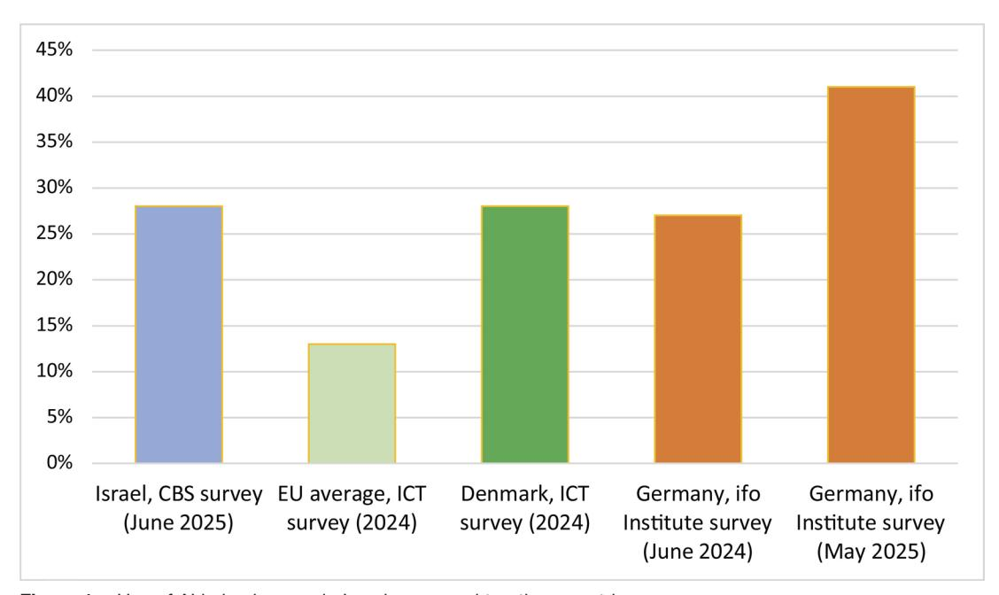
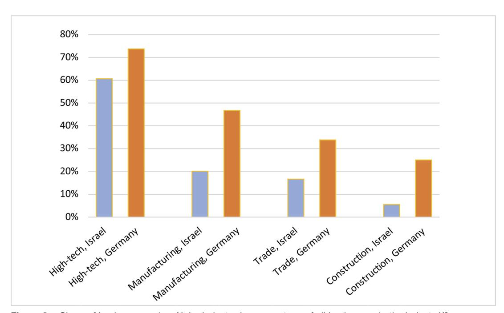
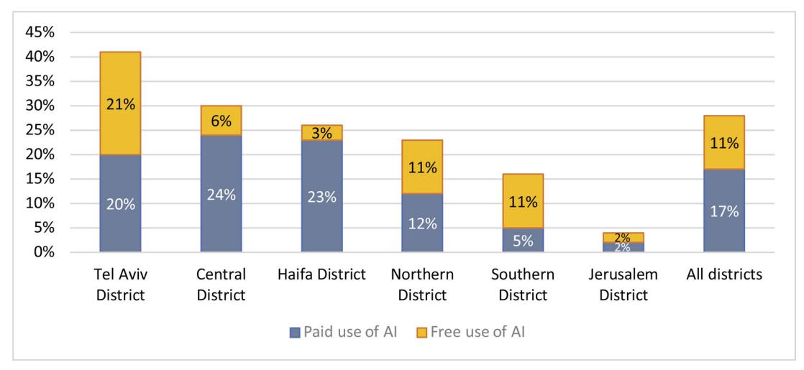
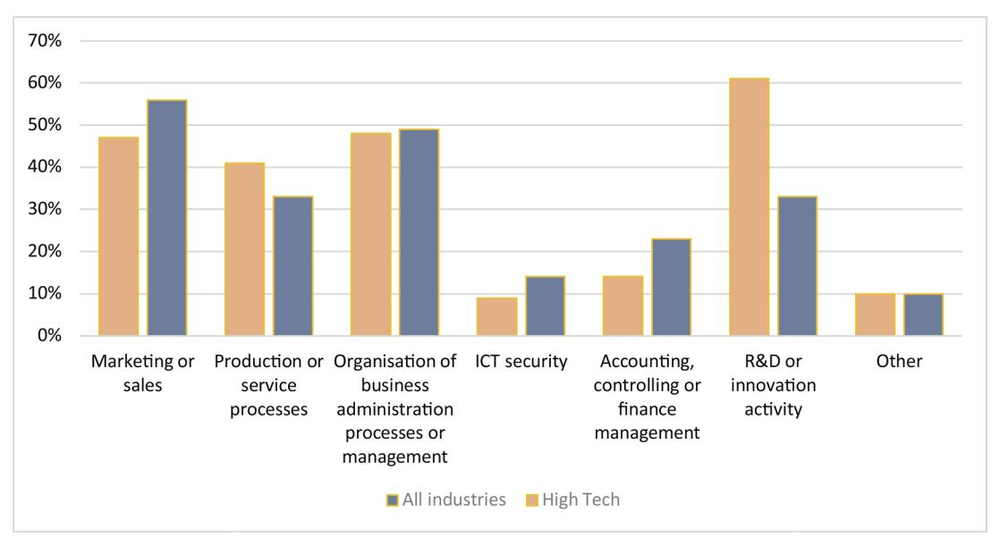
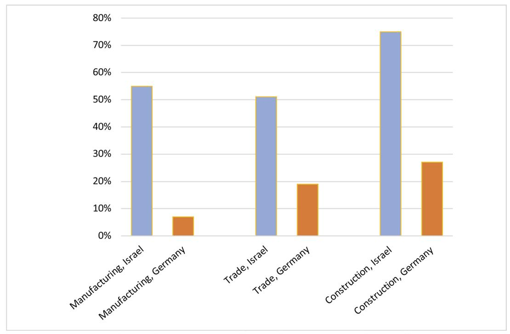

# How businesses adopt AI: Insights from Israel's first comprehensive survey

Received (in revised form): 28th August, 2025

#### Gilad Be'ery Head, Economic Reforms Program, Israel Democracy Institute, Israel

Gilad Be'ery serves as the Head of the Economic Reforms Program at the Israel Democracy Institute. A non-partisan think-and-do tank, the institute harnesses rigorous applied research to educate decision makers and help shape policy, legislation and public opinion. Gilad is also a PhD candidate at the Federmann School of Public Policy, Hebrew University of Jerusalem. His research explores the intersection of economics, society and technology, with an interest in how these dynamics influence policy debates.

Israel Democracy Institute, 4 Pinsker Street, Jerusalem, Israel E-mail: giladbe@idi.org.il

Abstract In recent years, the combination of increasingly accessible artificial intelligence (AI) and the rapid pace of technological development has led to numerous analyses of its potential to make significant changes to labour market dynamics, industrial organisation and macroeconomics. Nevertheless, a considerable gap remains in our knowledge regarding the actual impact of AI. This paper, which focuses on a unique survey conducted by Israel's Central Bureau of Statistics, aims to examine this critical issue by focusing on the Israeli case as part of the global discussions around these issues. The paper addresses three key themes: the effect of AI adoption in businesses on the workforce composition, the influence of AI on disparities between economic sectors, and the barriers to broader and deeper implementation of AI technologies in the private sector. Regarding labour substitution, it appears that although businesses in Israel already make relatively widespread use of AI to perform tasks previously carried out by workers, the effect on overall employment levels remains relatively limited. It is yet to be seen whether a more significant substitution effect will occur in the longer term, or whether the size of the effect was overestimated in previous studies. When it comes to the differential diffusion rates between industries, Israel stands out in international comparison. Israel's high-tech sector demonstrates much higher levels of AI implementation compared to other industries. Relatedly, unequal adoption rates between the geographical centre of the country and its periphery are also significant. The Israeli case thus offers further evidence that AI adoption in the labour market may deepen existing disparities, especially in countries where innovation-based industries attract high proportions of highly skilled employees. Finally, among the different implementation barriers in traditional industries, the lack of knowledge and understanding of AI emerges as a major impediment to adoption. This phenomenon may again point to the human capital imbalances in dual economies. The paper concludes by discussing potential policy takeaways. Such a policy might include promoting the integration of AI in traditional industries, offering more robust lifelong learning frameworks, as well as relevant education reforms. Considering the rapid technological developments in AI, it is also important to continue monitoring this issue regularly with agile yet consistent empirical instruments. This article is also included in The Business & Management Collection which can be accessed at [https://hstalks.com/business/.](https://hstalks.com/business/)

KEYWORDS: artificial intelligence, dual economy, comparative survey analysis, labour market, Israeli economy

DOI: 10.69554/AUHK2304

#### INTRODUCTION

Artificial intelligence (AI) is now seen as a fundamental technology of the current era — similar to the advent of electricity in the 19th century or the Internet at the end of the 20th century.[1](#page-10-0) As noted in several Organisation for Economic Co-operation and Development (OECD) papers[,2,3,4](#page-10-0) AI has the potential to bring about structural change in various areas of the economy and the labour market, driving productivity and growth on the one hand and inequality on the other. In terms of the labour market, the literature indicates two main potential effects of AI[.5,6,7](#page-10-0) One is that of complementarity between AI and human labour. In this scenario, task automation, particularly routine and technical tasks, frees up employees to engage in tasks that have not been automated and that may increase wages and job satisfaction. By contrast, the second possibility is the substitutability of employees by AI. In this scenario, the scale of tasks in which humans are replaced is large enough to make the human worker redundant, and ultimately to lead to significant levels of technological unemployment. The balance between these two forces determines the impact on the labour market: the implications for the employment rate, as well as on the wages of different workers. This paper examines this balance for the current point in time in one specific context: the Israeli economy.

Furthermore, the potential impact of AI is not restricted only to the labour market. The ongoing adoption of AI technologies can also increase existing technological differences between the traditional industries (such as construction, heavy industry and trade) and more technology-oriented sectors (such as high-tech and finance), which in turn can

increase differences in productivity and wage levels[.8,9](#page-10-0)

In June 2025, the Israeli Central Bureau of Statistics (CBS) fielded a questionnaire aimed at examining the use of AI by businesses.[10](#page-10-0) This survey adds several new aspects to the existing discourse in Israel, and in some cases also internationally. First, it asks about actual usage patterns, as opposed to estimated potential usage. Secondly, it reflects the perspective of senior managers, having a broader view of the business, as well as better insights related to certain aspects of adoption (such as understanding the barriers to adoption). Thirdly, this survey also includes questions that did not appear in most similar international surveys — for example, more granular modalities of response to questions about AI usage (paid versus not paid) and its impact on tasks and employment (substitution of routine tasks and employees versus those that involve more thinking). The analysis also seeks to offer comparative insights by situating the results *vis-à-vis* similar surveys in Germany and the European Union (EU). Consequently, this survey contributes not only to Israeli discourse about AI and its socio-economic impact but also to wider, more global discussions.

The main research question it tackles is: what can patterns of use and adoption of AI technologies in the Israeli business sector teach us about the impact of AI adoption on the labour market and inequality, as well as the barriers to AI? Even though this survey is conducted at a specific point in time, it could be potentially relevant more broadly, particularly for countries who share with Israel the characteristics of small and innovation-oriented economies.

## METHODOLOGY

In June 2025, the CBS formulated a survey regarding the use of AI by businesses, following consultations with several bodies, including the Israel Democracy Institute, the Innovation Authority and the Bank of Israel. The questionnaire was inspired by similar surveys in other countries, notably the American Business Trends and Outlook Survey (BTOS),[11](#page-10-0) the ICT usage and e-commerce in enterprises survey of the EU[12](#page-10-0) and the German Leibniz Institute for Economic Research (ifo).[13](#page-10-0) In practice, managers participating in the regular Business Tendency Survey were asked about the use of AI in their company's business operations, including the purposes of its use and its impact. The survey targeted businesses with ten or more employees. The population for this dedicated survey consists of 34,708 businesses, from which a sample of about 1,500 was drawn, with approximately 1,200 complete questionnaires.

The survey estimates were calculated in terms of both businesses and employees. That is, the results reflect the share of businesses that responded out of all businesses within the whole population or sector, and conversely, the share of employment by these businesses. As a result, in the employee-based method, businesses with many employees receive greater weight, in accordance with their share of total employment in the economic or sectoral population. In the analysis of questions where the focal point is labour market impact or where the estimate for a particular response was based on a small number of respondents, preference was given to the employee-based estimate.

Regarding AI's definition, the survey introduced the following definition:

Artificial intelligence systems (AI) are computer systems and software capable of performing tasks typically requiring human intelligence. Examples of AI applications include: machine learning, automated processing of language and

images, virtual agents (such as ChatGPT, Claude, and similar) and autonomous robots.

Despite the wide scope of the definition (which was based on a similar definition in the BTOS survey),[14](#page-10-0) it is important to note that the data shows that when managers reported using AI, this mainly related to content creation, such as text, code, images and audio (about 77 per cent of businesses using AI). This modality closely resembles the usage of generative AI (GenAI) models such as ChatGPT, Claude and the like. The next most common use was machine learning functions (about 26 per cent of businesses using AI). In contrast, only 9 per cent of businesses using AI reported employing AI technologies for automated physical movement (and 16 per cent reported other functions). This means that even though CBS's definition of AI is relatively inclusive, the survey results mainly represent the use of GenAI and its impact.

The survey includes eight questions, some of which are intended for businesses that reported using AI, some for those that did not, and some that are shared (for a detailed questionnaire, see Appendix 2). The first question in the survey addresses whether the business has used AI technologies in the previous six months (with the possible responses being: free of charge, paid, or not used at all). The remaining survey questions focus on three main issues: the nature of AI usage in businesses, the impact of AI use on businesses, future expectations regarding the use of this technology and the barriers to doing so in companies that do not intend to use AI in the near future.

Finally, this paper conducts a comparison between the results of the CBS survey and two other surveys: the European Union ICT survey and the German ifo survey. Even though there are similarities between these surveys, the differences between them should be treated with caution, including wording of questions in the surveys, timing of surveys, whether employment-weighted data is also provided, the exact definition of AI, etc. Throughout the paper, emphasis is placed on when simplistic comparisons between survey results may be somewhat misleading[.15](#page-10-0)

#### FINDINGS

# AI use in the Israeli business sector in international comparison

We begin by examining the following basic question: to what extent is AI used in the business sector in Israel? The survey indicates that 28 per cent of businesses in Israel used AI in the previous six months as part of their business activity. In terms of employees, the proportion is even higher, with 32 per cent of employees working in businesses in which AI is being used.

Figure 1 presents an international comparison of these findings. The data on all EU countries is from a survey on the use of technologies in businesses (referred to as the EU ICT survey) conducted in 2025, in which businesses were asked about the use of AI in 2024. The figure shows that AI use in Israel, as reported in June 2025, is similar to the leading country in the EU in 2024 (Denmark) and is double the EU average. To complete this picture, given the accelerated technological developments in this field, it is also critical to obtain an up-to-date perspective. To this end, we have also added a similar finding from a question asked in a German business survey conducted by ifo in May 2025. This shows that at a more recent point in time, the level of adoption in Israel was lower than in a country with a relatively high technological level such as Germany (28 per cent versus 41 per cent of businesses, respectively). For the sake of comparison, the result from the same German survey from June 2024 is also presented, which indicates the rate of technological change, a 1.5-fold increase in the level of use (from 27 per cent to 41 per cent).[16](#page-10-0) It is important to note that since these international surveys are similar but not identical in terms of their timing and survey methodology, the comparisons should be treated with caution. At the same time, they may offer an approximation of the relative state of adoption of AI in Israel at this time.

Figure 1: Use of AI in businesses in Israel compared to other countries Source: Author's elaboration of CBS AI survey, the EU ICT survey from Eurostat and the ifo survey

#### The Israeli 'dual economy' and AI use

Of course, the disadvantage of a statistical average is that it conceals possible variations across different business sectors. An analysis of the various industries studied in the survey shows that this is indeed the case regarding the use of AI. As can be seen in Figure 2, the level of use in knowledge-intensive industries, such as the high-tech industry, stands at nearly three times that of more traditional industries such as manufacturing, trade and construction. It could be argued that this is a global characteristic of traditional industries, according to which the manual nature of their work processes and the lower level of technology they deploy (on average) result in a lower potential for the use of AI[.17](#page-10-0) Figure 2 shows, however, that even when comparing the same industries at a similar point in time in Israel and Germany (June 2025 and May 2025, respectively), there are differences by a ratio of between 2 and 4.

These discrepancies can be linked to many findings regarding the dual structure of the Israeli economy, which differentiates the high-tech sector from the rest of the economy[,19](#page-11-0) and in particular, the 'digital divide' of non-high-tech industries[.20,21](#page-11-0) As far back as 2020, an OECD study on AI usage found that the usage gaps between the high-tech industry and other industries in Israel were among the largest of the countries within the comparison.[22](#page-11-0) These stark contrasts raise concerns that AI adoption may further widen the gap between industries in Israel and should be noted also by other countries with similar economic structure.

Moreover, this duality is not limited to inequality between industries, it also has a geographic dimension. An examination of AI usage data by businesses across different districts in Israel reveals significant disparities. As can be seen in Figure 3, while approximately 41 per cent of businesses in Tel Aviv district use AI, in Jerusalem district the figure is only around 4 per cent. Furthermore, the figure shows that AI adoption tends to decline progressively the more economically peripheral the region is (typically referring to greater distance from Tel Aviv metropolitan area, which is

Figure 2: Share of businesses using AI, by industry (as percentage of all businesses in the industry)18 Source: Authors' elaboration of CBS AI survey and ifo survey

Figure 3: Share of businesses using AI, by district (as percentage of all businesses in the district) Source: Authors' elaboration of CBS AI survey

home to the majority of Israel's high-tech industry). The notable exception is Jerusalem district, but it is important to remember that Jerusalem is among the poorest cities in Israel, making it socially peripheral.[23](#page-11-0)

This disparity is evident not only at the 'extensive margin' of AI adoption, but also at the 'intensive margin'. Tel Aviv district also has the largest share of paid use of AI (21 per cent) than any other district. While these figures may not be surprising, they indicate that the inequality stemming from the dual structure of Israel's economy has a geographic aspect and that it could widen substantial economic gaps between the centre and the periphery.

## Indications for the impact of AI use on employment

Analyses of the potential impact of AI on the Israeli economy predict significant levels of job and employee replacement. For example, a Taub Center study[24](#page-11-0) found that around 23 per cent of workers in Israel are at higher risk of replacement by AI because they have a high level of exposure and a low level of complementarity to this technology. A Bank of Israel forecast[,25](#page-11-0) which focuses on the effects of GenAI, also produced a

similar estimate of 20 per cent of employees in Israel who are expected to be replaced. At the same time, these studies predict that 30–50 per cent of employees are expected to benefit from technological complementarity. Regarding the two types of impact, there is a great deal of variation between industries, with certain industries being particularly vulnerable to substitutability, including knowledge-intensive industries that have a more educated workforce (such as the finance industry).

The CBS survey provides an initial assessment of the current situation in this regard[.26](#page-11-0) Inspired by the research described, there are two questions in the survey that address the replacement of human roles with artificial intelligence, which were directed only to businesses that reported the use of AI. The first question concerns the transfer of tasks to AI. In this sense, AI is already having a significant impact on the allocation of tasks in businesses: 60 per cent of businesses (in terms of employees[\)27](#page-11-0) that reported using AI responded that certain tasks in the business that were previously performed by humans are now performed by AI. Of these 60 per cent, most said that this relates to 'routine and technical tasks only' (44 per cent); however, there is already a significant share (16 per cent) reporting that AI also performs 'tasks that require thinking'[.28](#page-11-0)

The second question goes a step further and examines whether changes in task allocation are already being reflected in the business's workforce. Here, the impact reported is significantly lower, although not negligible: of the businesses that reported using AI, 9 per cent (in terms of employment) say that it has had an impact on the number of employees in the business, around 5 per cent say that it has had a 'soft' effect of leading to the recruitment of fewer new employees, while the rest say that it has reduced the existing number of employees. At the same time, there is great variation between industries in this context: the trade sector at one extreme reporting a lack of impact on its workforce, while in high-tech, some 10 per cent of businesses (in terms of employment) report a reduction effect on employment (of all types).

It is important to note that in the CBS survey, the reporting is of impact on workforce at the level of individual businesses, and thus the data in terms of employees is the percentage of workers employed in businesses that reported such an impact; however, this does not necessarily mean that they are all affected in the same manner. Consequently, this finding from the CBS survey should be understood as indicating the existence of substitutability among this population of workers, but not the actual substitutability of that whole share of workers.

To compare this data to the potential impact on worker replacement found by the Taub Center study[,29](#page-11-0) we weighted the percentage of employees working in businesses that reported an impact on employment against the percentage of businesses that use AI. The findings are presented in Table 1. It is evident that although the CBS survey already shows significant effects on the characteristics of employment in businesses, mainly in terms of reallocation of tasks, with a smaller impact on the size of the workforce, this current state of affairs is still far from the potential impact. For example, despite businesses employing around 6 per cent of workers in the high-tech industry — a not insignificant share — reporting a reduction in workforce or non-recruitment of new employees due to the use of AI, this is still significantly lower than the estimated potential for substitutability (47 per cent).

A single survey at one point in time, however, is not sufficient to provide solid conclusions. Since AI technology is developing at a rapid pace and, as we have seen, the characteristics of its adoption are dynamic over time, it is certainly possible that it will have even stronger effects on the workforce in the future.

Finally, it is evident that the impact on employment in the high-tech sector is greater. It is likely that this pattern reflects not only the faster rate of adoption in technology industries but also the higher level of substitutability in technological occupations such as software development.

Table 1: Replacement of workers by AI — comparison of potential for substitutability with actual reporting in the CBS AI survey, by industry

| Industry30    | Proportion of employees in businesses that reported a reduction in labour demand due to AI31 | Proportion of workers at high risk of being replaced32 |
|---------------|-------------------------------------------------------------------------------------------------|-----------------------------------------------------------|
| Construction  | 0.4%                                                                                            | 8%                                                        |
| Manufacturing | 3%                                                                                              | 14%                                                       |
| Trade         | 0%                                                                                              | 15%                                                       |
| High-tech     | 6%                                                                                              | 47%                                                       |

Source: Author's elaboration of CBS AI survey and from Debowy *et al*.

In this context, Figure 4 presents the purposes for which businesses use AI. This figure may serve as an indication of occupations within the labour market that face a heightened impact of AI. Across all sectors, the primary uses of AI are in marketing and sales as well as administrative organisation and management. In the high-tech industry specifically, however, there is an increased use of AI for research and development (R&D) and innovation activities. Since in the first place, high-tech has heightened potential for the substitutability effect, the workers in R&D and innovation activities may be especially vulnerable to replacement. At the same time, however, the development of AI is expected to create new demand in the high-tech industry.[33](#page-11-0) It is thus important to continue examining the cumulative effect of these conflicting influences on the growth of the high-tech industry, in terms of both productivity and output, and employment.

## Future AI use in businesses in Israel and barriers to expansion

The survey asked businesses about their intention to use AI over the next six months. Looking ahead, the share of businesses that expect to use AI in the next six months is similar to the share that reported use in the previous six months (27 per cent and 28 per cent, respectively). In terms of employees, however, there is a certain increase when looking toward the future (around 36 per cent compared to 32 per cent over the last six months), which could indicate an expectation of more widespread use in large businesses.

For this question about the future, respondents were also given the 'Don't know' response option, which was selected by 29 per cent of businesses. Not knowing is not only a statement of fact but can also relate to knowledge as a possible barrier for businesses in the implementation of AI. Thus, in a follow-up question for the businesses that responded 'Don't know' or 'No' regarding their expected future use of AI, they were asked why they are not planning such use. Seventy-one per cent responded that this is due to the lack of relevance of AI to their activity. Among the remaining businesses, the single most significant barrier cited was 'lack of knowledge about AI capabilities' (8 per cent). The share that gave this response

Figure 4: Share of businesses using AI for different purposes (as percentage of all businesses using AI) Source: Author's elaboration of CBS AI survey

was especially large among businesses in traditional industries (eg 18 per cent in the trade industry).

Additionally, the reported lack of relevance among businesses in traditional industries in Israel is significantly higher than that reported by their counterparts in Germany. For example, in Israel's manufacturing sector, 55 per cent of businesses believe that AI is not relevant to their operations, compared to only 7 per cent in Germany. Assuming that the business processes of the same industries in different countries are not significantly different, this gap suggests that the lack of knowledge about the capabilities of AI is also evident among those who claim AI is irrelevant to them.

A partial explanation for the gaps shown in Figure 5 may again be linked to the dual nature of the Israeli economy. This duality is also reflected in the fact that a significant portion of Israel's highly skilled, technologically oriented workforce is concentrated in the high-tech sector, while other sectors have a relatively low share of employees with technological expertise.[35,36](#page-12-0) This dynamic may help explain the differences between Germany and Israel regarding the perception among many businesses that AI is not relevant to them. In traditional industries in Israel, the relatively low presence of skilled workers may lead businesses in these sectors to lack awareness of AI capabilities from the outset and, therefore, conclude that AI is not relevant to their operations.

## CONCLUSION AND POLICY IMPLICATIONS

The CBS survey on the use of AI in business offers the first glimpse of its kind into the actual usage of this central technology in the business sector in Israel. The survey indicates significant penetration of AI technologies into the business sector in

Figure 5: Share of businesses in traditional industries that reported AI is not relevant to their business, by industry (as percentage of all businesses in the industry)34 Source: Author's elaboration of CBS AI survey and ifo survey

Israel, but also substantial disparities between industries and great variation in the extent of implementation. Alongside widespread adoption in the high-tech industry, there is a reluctance or delay in adoption in traditional industries, which may also reflect a lack of knowledge on the subject. This finding reinforces previous recommendations according to which innovation policy in Israel should focus not only on the development of new technologies in the high-tech industry, but also on the implementation of existing technologies throughout the rest of the economy.[37](#page-12-0)

From a broader perspective, this finding is relevant to other countries with significant technological gaps. The social implications of these disparities are exacerbated by the observation that inequality in technological knowledge and implementation is not necessarily limited to differences between economic sectors but also overlaps with geographic inequalities. As the discourse about the social implications of 'geographies of discontent'[38,39](#page-12-0) is prevalent in many parts of the developed world, this again could be of wider relevance.

In terms of the labour market, the survey shows that the impact of AI is already evident in the changes in how tasks are distributed within businesses; in a significant number of businesses, certain tasks that were previously performed by humans are now being carried out by AI. There is also reduced demand for workers, albeit on a smaller scale than the estimates given in previous studies regarding the potential replacement of employees by AI. The discrepancy between the share of businesses reporting the use of AI for tasks previously performed by employees and the share of businesses reporting a change in the number of their employees may be due to processes of complementarity as opposed to substitutability.

At this stage, the complementarity effect seems to be more dominant, with AI tending more to complement rather than replace employees. As a result, the structure and

nature of the allocation of work tasks are changing at a faster rate than the demand for labour. The rapid evolution of this technology and the dynamic characteristics of its use, however, require that this insight be restricted solely to the present point in time, as there is considerable uncertainty about future developments. These findings underscore the importance of continuing to systematically monitor developments in real time.

At the same time, the early indications of impact on employment are already signalling the need to consider major reforms in the field of labour market policy. Moves in this direction have been proposed in previous recommendations by international organisations[,40](#page-12-0) including a significant expansion of training for existing employees by employers and the development of lifelong learning policies, in a way that will enable necessary adjustments to be made in the rapidly changing labour market. Alongside this, action must be taken to adapt the education system to the age of AI, and in particular to the development of various capabilities related to the subject — both those that support the development of high-quality AI usage skills, and those that complement such usage, such as critical thinking[.41](#page-12-0)

Finally, in all policy efforts, the difference in AI adoption rates between the high-tech industry and the more traditional industries, as well as between stronger and more vulnerable populations, should be considered. This will ensure that the potential of AI for driving economic growth can be realised in an inclusive manner, both maintaining the leading edge of this innovation-based sector and its contribution to the economy and employment, while ensuring that no one is left behind.

## ACKNOWLEDGMENT

Many thanks to Eitan Ben-Eliya from the Israeli Democracy Institute for his assistance with research and editing with this paper.

## References and Notes

- [1.](#page-1-0) Calvino, F., Haerle, D. and Liu, S. (20025), 'Is Generative AI a General-Purpose Technology?: Implications for Productivity and Policy', Organisation for Economic Co-operation and Development (OECD) Artificial Intelligence Papers, No. 40, available at [https://www.](https://www.oecd.org/content/dam/oecd/en/publications/reports/2025/06/is-generative-ai-a-general-purpose-technology_6c76e7b2/704e2d12-en.pdf) [oecd.org/content/dam/oecd/en/publications/](https://www.oecd.org/content/dam/oecd/en/publications/reports/2025/06/is-generative-ai-a-general-purpose-technology_6c76e7b2/704e2d12-en.pdf) [reports/2025/06/is-generative-ai-a-general-purpose](https://www.oecd.org/content/dam/oecd/en/publications/reports/2025/06/is-generative-ai-a-general-purpose-technology_6c76e7b2/704e2d12-en.pdf)[technology\\_6c76e7b2/704e2d12-en.pdf](https://www.oecd.org/content/dam/oecd/en/publications/reports/2025/06/is-generative-ai-a-general-purpose-technology_6c76e7b2/704e2d12-en.pdf) (accessed 11th August, 2025).
- [2.](#page-1-0) Calvino, F., Reijerink, J. and Samek, L. (2025), 'The Effects of Generative AI on Productivity, Innovation and Entrepreneurship', Organisation for Economic Co-operation and Development (OECD) Artificial Intelligence Papers, No. 39, available at [https://www.oecd.org/content/](https://www.oecd.org/content/dam/oecd/en/publications/reports/2025/06/the-effects-of-generative-ai-on-productivity-innovation-and-entrepreneurship_da1d085d/b21df222-en.pdf) [dam/oecd/en/publications/reports/2025/06/](https://www.oecd.org/content/dam/oecd/en/publications/reports/2025/06/the-effects-of-generative-ai-on-productivity-innovation-and-entrepreneurship_da1d085d/b21df222-en.pdf) [the-effects-of-generative-ai-on-productivity](https://www.oecd.org/content/dam/oecd/en/publications/reports/2025/06/the-effects-of-generative-ai-on-productivity-innovation-and-entrepreneurship_da1d085d/b21df222-en.pdf)[innovation-and-entrepreneurship\\_da1d085d/](https://www.oecd.org/content/dam/oecd/en/publications/reports/2025/06/the-effects-of-generative-ai-on-productivity-innovation-and-entrepreneurship_da1d085d/b21df222-en.pdf) [b21df222-en.pdf](https://www.oecd.org/content/dam/oecd/en/publications/reports/2025/06/the-effects-of-generative-ai-on-productivity-innovation-and-entrepreneurship_da1d085d/b21df222-en.pdf) (accessed 11th August, 2025).
- [3.](#page-1-0) Georgieff, A. (2024), 'Artificial Intelligence and Wage Inequality', Organisation for Economic Co-operation and Development (OECD) Artificial Intelligence Papers, No. 13, available at [https://](https://www.oecd.org/content/dam/oecd/en/publications/reports/2024/04/artificial-intelligence-and-wage-inequality_563908cc/bf98a45c-en.pdf) [www.oecd.org/content/dam/oecd/en/publications/](https://www.oecd.org/content/dam/oecd/en/publications/reports/2024/04/artificial-intelligence-and-wage-inequality_563908cc/bf98a45c-en.pdf) [reports/2024/04/artificial-intelligence-and-wage](https://www.oecd.org/content/dam/oecd/en/publications/reports/2024/04/artificial-intelligence-and-wage-inequality_563908cc/bf98a45c-en.pdf)[inequality\\_563908cc/bf98a45c-en.pdf](https://www.oecd.org/content/dam/oecd/en/publications/reports/2024/04/artificial-intelligence-and-wage-inequality_563908cc/bf98a45c-en.pdf) (accessed 11th August, 2025).
- [4.](#page-1-0) Filippucci, F., Gal, P., Laengle, K. and Schief, M. (2025), 'Macroeconomic Productivity Gains from Artificial Intelligence in G7 Economies', Organisation for Economic Co-operation and Development (OECD) Artificial Intelligence Papers, No. 41, available at [https://www.oecd.org/content/](https://www.oecd.org/content/dam/oecd/en/publications/reports/2025/06/macroeconomic-productivity-gains-from-artificial-intelligence-in-g7-economies_dcf91c3e/a5319ab5-en.pdf) [dam/oecd/en/publications/reports/2025/06/](https://www.oecd.org/content/dam/oecd/en/publications/reports/2025/06/macroeconomic-productivity-gains-from-artificial-intelligence-in-g7-economies_dcf91c3e/a5319ab5-en.pdf) [macroeconomic-productivity-gains-from](https://www.oecd.org/content/dam/oecd/en/publications/reports/2025/06/macroeconomic-productivity-gains-from-artificial-intelligence-in-g7-economies_dcf91c3e/a5319ab5-en.pdf)[artificial-intelligence-in-g7-economies\\_dcf91c3e/](https://www.oecd.org/content/dam/oecd/en/publications/reports/2025/06/macroeconomic-productivity-gains-from-artificial-intelligence-in-g7-economies_dcf91c3e/a5319ab5-en.pdf) [a5319ab5-en.pdf](https://www.oecd.org/content/dam/oecd/en/publications/reports/2025/06/macroeconomic-productivity-gains-from-artificial-intelligence-in-g7-economies_dcf91c3e/a5319ab5-en.pdf) (accessed 11th August, 2025).
- [5.](#page-1-0) Brynjolfsson, E., Li, D. and Raymond, L. R. (2023), 'Generative AI at Work', National Bureau of Economic Research (NBER) Working Paper, available at [https://www.nber.org/system/files/](https://www.nber.org/system/files/working_papers/w31161/w31161.pdf) [working\\_papers/w31161/w31161.pdf](https://www.nber.org/system/files/working_papers/w31161/w31161.pdf) (accessed 11th August, 2025).
- [6.](#page-1-0) Agrawal, A., Gans, J. S. and Goldfarb, A. (2019), 'Artificial Intelligence: The Ambiguous Labor Market Impact of Automating Prediction', *Journal of Economic Perspectives*, Vol. 33, No. 2, pp. 31–50.
- [7.](#page-1-0) Acemoglu, D. and Restrepo, P. (2020), 'The Wrong Kind of AI? Artificial Intelligence and the Future of Labour Demand', *Cambridge Journal of Regions, Economy and Society*, Vol. 13, No. 1, pp. 25–35.
- [8.](#page-1-0) Organisation for Economic Co-operation and Development (OECD) (2020), 'OECD Economic Surveys: Israel 2020', available at [https://www.](https://www.oecd.org/content/dam/oecd/en/publications/reports/2020/09/oecd-economic-surveys-israel-2020_d68c1e17/d6a7d907-en.pdf) [oecd.org/content/dam/oecd/en/publications/](https://www.oecd.org/content/dam/oecd/en/publications/reports/2020/09/oecd-economic-surveys-israel-2020_d68c1e17/d6a7d907-en.pdf) [reports/2020/09/oecd-economic-surveys](https://www.oecd.org/content/dam/oecd/en/publications/reports/2020/09/oecd-economic-surveys-israel-2020_d68c1e17/d6a7d907-en.pdf)[israel-2020\\_d68c1e17/d6a7d907-en.pdf](https://www.oecd.org/content/dam/oecd/en/publications/reports/2020/09/oecd-economic-surveys-israel-2020_d68c1e17/d6a7d907-en.pdf) (accessed 11th August, 2025).
- [9.](#page-1-0) Calvino, F. and Fontenelli, L. (2023), 'A portrait of AI adopters across countries: Firm characteristics,

- assets' complementarities and productivity', Organisation for Economic Co-operation and Development (OECD) Science, Technology and Industry Working Papers, No. 2023/02, available at [https://www.oecd.org/content/dam/oecd/en/](https://www.oecd.org/content/dam/oecd/en/publications/reports/2023/04/a-portrait-of-ai-adopters-across-countries_76004dec/0fb79bb9-en.pdf) [publications/reports/2023/04/a-portrait-of-ai](https://www.oecd.org/content/dam/oecd/en/publications/reports/2023/04/a-portrait-of-ai-adopters-across-countries_76004dec/0fb79bb9-en.pdf)[adopters-across-countries\\_76004dec/0fb79bb9-en.](https://www.oecd.org/content/dam/oecd/en/publications/reports/2023/04/a-portrait-of-ai-adopters-across-countries_76004dec/0fb79bb9-en.pdf) [pdf](https://www.oecd.org/content/dam/oecd/en/publications/reports/2023/04/a-portrait-of-ai-adopters-across-countries_76004dec/0fb79bb9-en.pdf) (accessed 11th August, 2025).
- [10.](#page-1-0) Central Bureau of Statistics (CBS) (2025), 'Adoption of Artificial Intelligence in Businesses Findings from the Varying Topic of the Business Tendency Survey – June 2025', available at [https://www.cbs.gov.il/](https://www.cbs.gov.il/he/mediarelease/DocLib/2025/216/31_25_216e.pdf) [he/mediarelease/DocLib/2025/216/31\\_25\\_216e.pdf](https://www.cbs.gov.il/he/mediarelease/DocLib/2025/216/31_25_216e.pdf) (accessed 11th August, 2025).
- [11.](#page-2-0) Bonney, K., Breaux, C., Buffington, C., Dinlersoz, E., Foster, L. S., Goldschlag, N., Haltiwanger, J. C., Kroff, Z. and Savage, K. (2024), 'Tracking Firm Use of AI in Real Time: A Snapshot from the Business Trends and Outlook Survey', National Bureau of Economic Research (NBER) Working Paper, No. w32319, available at [https://www.nber.org/system/](https://www.nber.org/system/files/working_papers/w32319/w32319.pdf) [files/working\\_papers/w32319/w32319.pdf](https://www.nber.org/system/files/working_papers/w32319/w32319.pdf) (accessed 11th August, 2025).
- [12.](#page-2-0) Eurostat (2025), 'Use of artificial intelligence in enterprises', available at [https://ec.europa.eu/](https://ec.europa.eu/eurostat/statistics-explained/index.php?title=Use_of_artificial_intelligence_in_enterprises) [eurostat/statistics-explained/index.php?title=Use\\_of\\_](https://ec.europa.eu/eurostat/statistics-explained/index.php?title=Use_of_artificial_intelligence_in_enterprises) [artificial\\_intelligence\\_in\\_enterprises](https://ec.europa.eu/eurostat/statistics-explained/index.php?title=Use_of_artificial_intelligence_in_enterprises) (accessed 11th August, 2025).
- [13.](#page-2-0) Licht, T. and Wohlrabe, K. (2024), 'AI Adoption Among German Firms', Center for Economic Studies (CES)/ifo Institute (CESifo) Working Paper Series, No. 11459, available at [https://www.ifo.de/](https://www.ifo.de/DocDL/cesifo1_wp11459.pdf) [DocDL/cesifo1\\_wp11459.pdf](https://www.ifo.de/DocDL/cesifo1_wp11459.pdf) (accessed 11th August, 2025).
- [14.](#page-2-0) Bonney *et al*., ref. 11 above, p. 7
- [15.](#page-3-0) For more details about the methodology of the CBS survey and that of the international surveys to which we are comparing, see Appendix 1.
- [16.](#page-3-0) If we apply this rate of adoption to the EU average, it will have reached 20 per cent in 2025, such that the level of usage in the Israeli business sector would still be higher. Due to the non-linear pace of technological progress, however, such forecasts should be approached with caution. Another point of comparison to the German data is the percentage of businesses that used artificial intelligence in the EU ICT survey, which was conducted during the first half of 2024 in Germany. This rate stands at about 20 per cent, compared to 27 per cent from the ifo survey conducted in June 2024. According to this finding, too, Germany is at the upper part of the distribution of AI use in the EU. The discrepancies between the surveys can be attributed to the different times at which they were carried out and the different methodologies used. In addition, even if we standardise the ifo survey data for 2025 using the relative difference in 2024 between the two surveys (which reduces the estimate by around 25 per cent), the German figure would still be slightly higher than the Israeli figure (31 per cent versus 28 per cent).
- [17.](#page-4-0) Calvino, F., Dernis, H., Samek, L. and Ughi, A. (2024), 'A sectoral taxonomy of AI intensity',

- Organisation for Economic Co-operation and Development (OECD) Artificial Intelligence Papers, No. 30, available at [https://www.](https://www.oecd.org/content/dam/oecd/en/publications/reports/2024/12/a-sectoral-taxonomy-of-ai-intensity_c2baae71/1f6377b5-en.pdf) [oecd.org/content/dam/oecd/en/publications/](https://www.oecd.org/content/dam/oecd/en/publications/reports/2024/12/a-sectoral-taxonomy-of-ai-intensity_c2baae71/1f6377b5-en.pdf) [reports/2024/12/a-sectoral-taxonomy-of-ai](https://www.oecd.org/content/dam/oecd/en/publications/reports/2024/12/a-sectoral-taxonomy-of-ai-intensity_c2baae71/1f6377b5-en.pdf)[intensity\\_c2baae71/1f6377b5-en.pdf](https://www.oecd.org/content/dam/oecd/en/publications/reports/2024/12/a-sectoral-taxonomy-of-ai-intensity_c2baae71/1f6377b5-en.pdf) (accessed 11th August, 2025).
- 18. From the ifo survey, we used the IT services industry as a comparison for Israel's high-tech industry. In Israel, the high-tech sector also includes beyond IT services also the high-tech manufacturing industry as well as financial services (according to the CBS, the AI usage patterns in these knowledge-intensive industries were found to be similar; however, they are too small to be published separately and are therefore reported together with the high-tech industry).
- [19.](#page-4-0) Organisation for Economic Co-operation and Development (OECD), ref. 8 above.
- [20.](#page-4-0) Be'ery, G. and Esperanza, I. (2021), 'The Digital Divide of the Israeli Business Sector: Results of the First ICT Survey by the Israeli Central Bureau of Statistics from an International Comparative Perspective', Ministry of Economy and industry, Strategy and Policy Planning Department, available at [https://www.gov.il/BlobFolder/reports/](https://www.gov.il/BlobFolder/reports/business-technology-intensity/en/pirsomim_Digital-Divide-Israeli-Business.pdf) [business-technology-intensity/en/pirsomim\\_Digital-](https://www.gov.il/BlobFolder/reports/business-technology-intensity/en/pirsomim_Digital-Divide-Israeli-Business.pdf)[Divide-Israeli-Business.pdf](https://www.gov.il/BlobFolder/reports/business-technology-intensity/en/pirsomim_Digital-Divide-Israeli-Business.pdf) (accessed 11th August, 2025).
- [21.](#page-4-0) Golstein-Galperin, R., Be'ery, G., Hartal, S., Kol, A. and Levi, L. (2023), 'A Broader Approach to Innovation – Not Just R&D', The Israel Democracy Institute, Policy Paper 181, available at [https://](https://www.idi.org.il/media/21193/rd-is-not-enough.pdf) [www.idi.org.il/media/21193/rd-is-not-enough.pdf](https://www.idi.org.il/media/21193/rd-is-not-enough.pdf) (accessed 11th August, 2025). (In Hebrew.)
- [22.](#page-4-0) Calvino and Fontenelli, ref. 9 above.
- [23.](#page-5-0) Assaf-Shapira, Y, Gefen, A, Haddad, N, Yaniv, O. (2023), 'Jerusalem: Facts and Trends 2023 – The State of the City and Changing Trends', Jerusalem Institute for Policy Research, available at [https://jerusaleminstitute.org.](https://jerusaleminstitute.org.il/wp-content/uploads/2023/07/2023-%D7%A2%D7%9C-%D7%A0%D7%AA%D7%95%D7%A0%D7%99%D7%99%D7%9A-%D7%90%D7%A0%D7%92%D7%9C%D7%99%D7%AA-%D7%9C%D7%93%D7%99%D7%92%D7%99%D7%98%D7%9C-1.pdf) [il/wp-content/uploads/2023/07/2023-](https://jerusaleminstitute.org.il/wp-content/uploads/2023/07/2023-%D7%A2%D7%9C-%D7%A0%D7%AA%D7%95%D7%A0%D7%99%D7%99%D7%9A-%D7%90%D7%A0%D7%92%D7%9C%D7%99%D7%AA-%D7%9C%D7%93%D7%99%D7%92%D7%99%D7%98%D7%9C-1.pdf) [%D7%A2%D7%9C-%D7%A0%D7%AA%D7%9](https://jerusaleminstitute.org.il/wp-content/uploads/2023/07/2023-%D7%A2%D7%9C-%D7%A0%D7%AA%D7%95%D7%A0%D7%99%D7%99%D7%9A-%D7%90%D7%A0%D7%92%D7%9C%D7%99%D7%AA-%D7%9C%D7%93%D7%99%D7%92%D7%99%D7%98%D7%9C-1.pdf) [5%D7%A0%D7%99%D7%99%D7%9A-%D7%90](https://jerusaleminstitute.org.il/wp-content/uploads/2023/07/2023-%D7%A2%D7%9C-%D7%A0%D7%AA%D7%95%D7%A0%D7%99%D7%99%D7%9A-%D7%90%D7%A0%D7%92%D7%9C%D7%99%D7%AA-%D7%9C%D7%93%D7%99%D7%92%D7%99%D7%98%D7%9C-1.pdf) [%D7%A0%D7%92%D7%9C%D7%99%D7%AA-](https://jerusaleminstitute.org.il/wp-content/uploads/2023/07/2023-%D7%A2%D7%9C-%D7%A0%D7%AA%D7%95%D7%A0%D7%99%D7%99%D7%9A-%D7%90%D7%A0%D7%92%D7%9C%D7%99%D7%AA-%D7%9C%D7%93%D7%99%D7%92%D7%99%D7%98%D7%9C-1.pdf) [%D7%9C%D7%93%D7%99%D7%92%D7%99%-](https://jerusaleminstitute.org.il/wp-content/uploads/2023/07/2023-%D7%A2%D7%9C-%D7%A0%D7%AA%D7%95%D7%A0%D7%99%D7%99%D7%9A-%D7%90%D7%A0%D7%92%D7%9C%D7%99%D7%AA-%D7%9C%D7%93%D7%99%D7%92%D7%99%D7%98%D7%9C-1.pdf) [D7%98%D7%9C-1.pdf](https://jerusaleminstitute.org.il/wp-content/uploads/2023/07/2023-%D7%A2%D7%9C-%D7%A0%D7%AA%D7%95%D7%A0%D7%99%D7%99%D7%9A-%D7%90%D7%A0%D7%92%D7%9C%D7%99%D7%AA-%D7%9C%D7%93%D7%99%D7%92%D7%99%D7%98%D7%9C-1.pdf) (accessed 11th August, 2025).
- [24.](#page-5-0) Debowy, M., Bental, B., Epstein, G., Weinreb, A. and Weiss, A. (2024), 'Artificial Intelligence and the Israeli Labor Market', Taub Center for Social Policy Studies in Israel, available at [https://www.](https://www.taubcenter.org.il/wp-content/uploads/2024/06/AI-2024-ENG-2.pdf) [taubcenter.org.il/wp-content/uploads/2024/06/](https://www.taubcenter.org.il/wp-content/uploads/2024/06/AI-2024-ENG-2.pdf) [AI-2024-ENG-2.pdf](https://www.taubcenter.org.il/wp-content/uploads/2024/06/AI-2024-ENG-2.pdf) (accessed 11th August, 2025).
- [25.](#page-5-0) Bank of Israel (2025), 'Box from the Bank of Israel Annual Report for 2024: The Expected Effect of Generative Artificial Intelligence on Employees: Implications for Labor Market Policy', available at [https://www.boi.org.il/en/](https://www.boi.org.il/en/communication-and-publications/press-releases/box-from-the-bank-of-israel-annual-report-for-2024-the-expected-effect-of-generative-artificial-intelligence-on-employees-implications-for-labor-market-policy/) [communication-and-publications/press-releases/box](https://www.boi.org.il/en/communication-and-publications/press-releases/box-from-the-bank-of-israel-annual-report-for-2024-the-expected-effect-of-generative-artificial-intelligence-on-employees-implications-for-labor-market-policy/)[from-the-bank-of-israel-annual-report-for-2024-the](https://www.boi.org.il/en/communication-and-publications/press-releases/box-from-the-bank-of-israel-annual-report-for-2024-the-expected-effect-of-generative-artificial-intelligence-on-employees-implications-for-labor-market-policy/)[expected-effect-of-generative-artificial-intelligence](https://www.boi.org.il/en/communication-and-publications/press-releases/box-from-the-bank-of-israel-annual-report-for-2024-the-expected-effect-of-generative-artificial-intelligence-on-employees-implications-for-labor-market-policy/)[on-employees-implications-for-labor-market-policy/](https://www.boi.org.il/en/communication-and-publications/press-releases/box-from-the-bank-of-israel-annual-report-for-2024-the-expected-effect-of-generative-artificial-intelligence-on-employees-implications-for-labor-market-policy/) (accessed 11th August, 2025).

- [26.](#page-5-0) It should be noted that the CBS survey focuses on the business sector, while the studies on the potential impact of AI examine all sectors of the economy, including the public sector. In what follows, however, we compare similar industries in a way that eliminates concerns in this regard.
- [27.](#page-5-0) Here we have used a report of CBS data expressed in terms of employees, that is, the proportion of relevant responses presented in a way that gives weight to the size of the business. These data are more suitable for discussing the questions of the impact on employment, both because of the relevance of the scope of employment that may potentially be affected, and because, according to the CBS, these data are more appropriate in cases relating to a small percentage of respondents.
- [28.](#page-6-0) Here we have used a report of CBS data expressed in terms of employees, that is, the proportion of relevant responses presented in a way that gives weight to the size of the business. These data are more suitable for discussing the questions of the impact on employment, both because of the relevance of the scope of employment that may potentially be affected, and because, according to the CBS, these data are more appropriate in cases relating to a small percentage of respondents.
- [29.](#page-6-0) Debowy *et al*., ref. 24 above.
- 30. There are certain differences in the definitions of industries between the two publications. As stated in the note above, in the CBS survey, the hightech industry includes not only high-tech services, but also elite industry and the finance industry. In contrast, the Taub Center's analysis uses the uniform classification of industries in the Israeli economy. For the present comparison, we took the substitutability potential data for the 'Information and Communication' (J) sector as an approximation for comparison with the high-tech and finance sector used by the CBS, and the 'Manufacturing' sector (C) for comparison with the manufacturing industry sector in the CBS publication (even though it does not include elite industry).
- 31. The weighting is required to adjust the estimate of those reporting a reduction in employment for the businesses comprising the entire population of businesses in the various industry sectors (both users and non-users). In the CBS survey, reporting about the impact on the workforce is given at the level of individual businesses, and therefore, the figure in terms of employees relates to the share of workers employed in businesses that reported such an impact; however, this does not mean that all employees in those businesses are at risk of being affected.
- 32. Debowy *et al*., ref. 24 above.
- [33.](#page-7-0) Bank of Israel, ref. 25 above.
- 34. The question about barriers was asked by the CBS only of businesses that responded that they would not use AI in the next six months or that they did not know whether they would do so. Against this background, the data for Israel in the figure weights the share of businesses that answered that AI is not relevant to them by the share of businesses that were

- asked to respond to this question in the first place, in order to give an estimate for the overall population of businesses. This was done in order to create a more precise comparison with the data from Germany.
- [35.](#page-8-0) Ministry of Innovation, Science and Technology/ Ministry of Finance (2022), 'Inter-Ministerial Committee for Increasing Human Capital in High-Tech', available at [https://www.gov.il/BlobFolder/](https://www.gov.il/BlobFolder/news/rfp20221110/he/increasing%20human%20capital%20in%20high%20tech%20Nov%202022.pdf) [news/rfp20221110/he/increasing%20human%20](https://www.gov.il/BlobFolder/news/rfp20221110/he/increasing%20human%20capital%20in%20high%20tech%20Nov%202022.pdf) [capital%20in%20high%20tech%20Nov%202022.pdf](https://www.gov.il/BlobFolder/news/rfp20221110/he/increasing%20human%20capital%20in%20high%20tech%20Nov%202022.pdf) (accessed 11th August, 2025).
- [36.](#page-8-0) Organisation for Economic Co-operation and Development (OECD) (2025), 'OECD Economic Surveys: Israel 2025', available at [https://www.](https://www.oecd.org/content/dam/oecd/en/publications/reports/2025/04/oecd-economic-surveys-israel-2025_18e45b04/d6dd02bc-en.pdf) [oecd.org/content/dam/oecd/en/publications/](https://www.oecd.org/content/dam/oecd/en/publications/reports/2025/04/oecd-economic-surveys-israel-2025_18e45b04/d6dd02bc-en.pdf) [reports/2025/04/oecd-economic-surveys-israel-](https://www.oecd.org/content/dam/oecd/en/publications/reports/2025/04/oecd-economic-surveys-israel-2025_18e45b04/d6dd02bc-en.pdf)[2025\\_18e45b04/d6dd02bc-en.pdf](https://www.oecd.org/content/dam/oecd/en/publications/reports/2025/04/oecd-economic-surveys-israel-2025_18e45b04/d6dd02bc-en.pdf) (accessed 11th August, 2025).
- [37.](#page-9-0) Golstein-Galperin *et al*., ref. 21 above.
- [38.](#page-9-0) Hendrickson, C., Muro, M. and Galston, W. A. (November 2018), 'Countering the Geography of Discontent: Strategies for Left-Behind Places', Brookings Institution, available at [https://www.](https://www.brookings.edu/articles/countering-the-geography-of-discontent-strategies-for-left-behind-places/) [brookings.edu/articles/countering-the-geography-of](https://www.brookings.edu/articles/countering-the-geography-of-discontent-strategies-for-left-behind-places/)[discontent-strategies-for-left-behind-places/](https://www.brookings.edu/articles/countering-the-geography-of-discontent-strategies-for-left-behind-places/) (accessed 11th August, 2025).
- [39.](#page-9-0) Dijkstra, L., Poelman, H. and Rodríguez-Pose, A. (2024), 'The Geography of EU Discontent and the

- Regional Development Trap', *Economic Geography*, Vol. 100, No. 3, pp. 213–245.
- [40.](#page-9-0) Organisation for Economic Co-operation and Development (OECD) (2023), 'OECD Employment Outlook 2023: Artificial Intelligence and the Labour Market', available at [https://www.oecd.org/content/](https://www.oecd.org/content/dam/oecd/en/publications/reports/2023/07/oecd-employment-outlook-2023_904bcef3/08785bba-en.pdf) [dam/oecd/en/publications/reports/2023/07/oecd](https://www.oecd.org/content/dam/oecd/en/publications/reports/2023/07/oecd-employment-outlook-2023_904bcef3/08785bba-en.pdf)[employment-outlook-2023\\_904bcef3/08785bba-en.](https://www.oecd.org/content/dam/oecd/en/publications/reports/2023/07/oecd-employment-outlook-2023_904bcef3/08785bba-en.pdf) [pdf](https://www.oecd.org/content/dam/oecd/en/publications/reports/2023/07/oecd-employment-outlook-2023_904bcef3/08785bba-en.pdf) (accessed 11th August, 2025).
- [41.](#page-9-0) Organisation for Economic Co-operation and Development (OECD), 'What Should Teachers Teach and Students Learn in a Future of Powerful AI?', OECD Education Spotlights, No. 20, available at [https://www.oecd.org/content/](https://www.oecd.org/content/dam/oecd/en/publications/reports/2025/05/what-should-teachers-teach-and-students-learn-in-a-future-of-powerful-ai_4578ec74/ca56c7d6-en.pdf) [dam/oecd/en/publications/reports/2025/05/](https://www.oecd.org/content/dam/oecd/en/publications/reports/2025/05/what-should-teachers-teach-and-students-learn-in-a-future-of-powerful-ai_4578ec74/ca56c7d6-en.pdf) [what-should-teachers-teach-and-students-learn-in](https://www.oecd.org/content/dam/oecd/en/publications/reports/2025/05/what-should-teachers-teach-and-students-learn-in-a-future-of-powerful-ai_4578ec74/ca56c7d6-en.pdf)[a-future-of-powerful-ai\\_4578ec74/ca56c7d6-en.pdf](https://www.oecd.org/content/dam/oecd/en/publications/reports/2025/05/what-should-teachers-teach-and-students-learn-in-a-future-of-powerful-ai_4578ec74/ca56c7d6-en.pdf) (accessed 11th August, 2025).
- [42.](#page-13-0) Eurostat, ref. 12 above.
- [43.](#page-13-0) Licht and Wohlrabe, ref. 13 above.
- [44.](#page-13-0) ifo Institute (2025), 'Companies in Germany Increasingly Relying on Artificial Intelligence', available at [https://www.ifo.de/en/](https://www.ifo.de/en/facts/2025-06-16/companies-germany-increasingly-relying-artificial-intelligence) [facts/2025-06-16/companies-germany-increasingly](https://www.ifo.de/en/facts/2025-06-16/companies-germany-increasingly-relying-artificial-intelligence)[relying-artificial-intelligence](https://www.ifo.de/en/facts/2025-06-16/companies-germany-increasingly-relying-artificial-intelligence) (accessed 11th August, 2025).
- [45.](#page-14-0) For more information, see Central Bureau of Statistics (CBS), ref. 10 above.

# APPENDIX 1: SUMMARY OF THE METHODOLOGIES OF THE INTERNATIONAL SURVEYS INCLUDED IN THE ANALYSIS

## European ICT survey on technology use in businesses

The findings regarding the EU are based on data published by Eurostat,[42](#page-12-0) the EU's statistical office. The data stems from the survey on ICT usage and e-commerce in enterprises. From a total population of approximately 1.54 million businesses located in the EU, about 157,000 participated in the survey sample, covering all member states. As with the CBS survey, this survey also focuses on businesses with at least ten employees. In addition, the estimates were published in business terms only.

In this survey, AI technologies were defined as follows:

Artificial intelligence refers to systems that use technologies such as text mining, computer vision, speech recognition, natural language generation, machine learning and deep learning to gather, use and/or produce data, for example to make predictions, recommendations, or decisions, with varying levels of autonomy.

Artificial intelligence systems can be software based … or embedded in devices …

Finally, the questionnaire included several questions — some addressed to businesses using AI, some to those not using it, and some shared by both groups. The first question addressed whether the business currently uses AI technologies. It was phrased as follows: 'Does your enterprise use any of the following Artificial Intelligence (AI) technologies?'. Respondents were asked to mark 'Yes' or 'No' for six types of AI technologies (eg text mining, speech recognition, image processing, etc.). If the respondent selected 'Yes' for one or more categories, the business was considered to be using AI technologies.

The remaining questions addressed the following topics: the operations of the business in which AI is used, the nature of AI ownership (eg developed in-house, acquired externally, etc.), and the various reasons for not using AI (among businesses that reported no use).

#### German ifo survey

The findings on AI use among businesses in Germany were taken from the ifo Business Climate Survey, conducted by ifo — a German institute for economic research that carries out surveys on a range of economic issues. Each month, thousands of businesses from various sectors of the German economy participate in this survey, which provides a broad representation of the national economy. Although the survey is conducted by a research institute and not an official statistical body, it is considered highly reliable (and even served as inspiration for the Israeli Business Tendency Survey).

In June 2023 and 2024,[43](#page-12-0) and again in May 2025[,44](#page-12-0) businesses were asked questions regarding the use and impact of AI technologies, without defining the term or detailing the nature of the technologies, either within the business itself or in the German economy more broadly. In 2023 and 2024, over 6,000 businesses answered the AI-related questions. The estimates from this survey were published in business terms only.

One recurring question in the survey addressed whether the business is using AI technologies, phrased as follows:

Is your business involved in the use of Artificial Intelligence (AI)?

- 1. AI is currently in use.
- 2. AI use is planned for the future.
- 3. The topic is under internal discussion (but without concrete plans).
- 4. The topic is not relevant/not discussed at all.

In addition, participating businesses in the survey were also asked to assess the productivity potential of AI for the German economy over the next five years, as well as its potential specifically for their own business.

## APPENDIX 2: THE ISRAELI CBS QUESTIONNAIR[E45](#page-12-0)

The following questions concern the use of Artificial Intelligence (AI) in a company over the previous six months.

Artificial Intelligence (AI) systems are computer systems and software capable of performing tasks that typically require human intelligence. Examples of AI applications include: machine learning, automated processing of language and images, virtual agents (including ChatGPT, Claude, and similar tools), and autonomous robots.

- 1. During the past six months, has your business made use of Artificial Intelligence (AI) for product manufacturing, service provision, or in routine operational workflows?
  - a. Yes, which are provided for free only
  - b. Yes, including those that are paid
  - c. No

Respondents who answered (a) or (b) continue to questions 2–7; respondents who answered c continue to question 8.

- 2. Does your enterprise use Artificial Intelligence software or systems for any of the following purposes? (Select all that apply)
  - a. Marketing or sales
  - b. Production or service processes
  - c. Organisation of business administration processes or management
  - d. ICT security
  - e. Accounting, controlling or finance management
  - f. Research and development (R&D) or innovation activity
  - g. Other

- 3. What types or applications of Artificial Intelligence (AI) did this business use? (Select all that apply)
  - a. AI technologies generating written, spoken language or programming codes (natural language generation, speech synthesis), generating pictures, videos, sound/audio (example ChatGPT and same)
  - b. Machine learning (e.g. deep learning) for data analysis
  - c. AI Technologies enabling physical movement of machines via autonomous decisions based on observation of surroundings (autonomous robots, self-driving vehicles, autonomous drones)
  - d. Other:\_\_\_\_\_\_\_
- 4. Did this business use Artificial Intelligence to perform tasks previously done by employees?
  - a. Yes, routine and technical tasks only
  - b. Yes, including tasks that require thinking
  - c. No
  - d. Do not know
- 5. How did the use of Artificial Intelligence affect this business's total employment?
  - a. Increased
  - b. Did not change
  - c. Avoided the recruitment of new employees
  - d. Decreased, Mainly among employees with low skills and education
  - e. Decreased, Mainly among employees with high skills and education

| f. | Other: |
|----|--------|
|    |        |
|    |        |

- 6. To use Artificial Intelligence (AI), what changes did this business make? (Select all that apply)
  - a. Trained current staff to use AI or hired staff trained in AI
  - b. Purchased computing power or specialised equipment (including Cloud)

#### *Be'ery*

- c. Used vendors or consulting services to install or integrate AI
- d. Changed data collection or data management practices
- e. Developed new workflows
- f. Other
- g. None
- 7. During the next six months, do you think this business will be using Artificial Intelligence (AI) in producing goods or services or as part of daily work processes?
  - a. Yes
  - b. No
  - c. Do not know

Only respondents who answered b or c continue to question 8.

- 8. Why does this business not plan to use Artificial Intelligence (AI) during the next six months?
  - a. AI is not applicable to this business
  - b. Too expensive
  - c. Lack of knowledge on the capabilities of AI
  - d. Lack of skilled workforce
  - e. Previous or current use of AI did not meet expectations
  - f. Laws and regulations prevent or restrict use of AI
  - g. Other