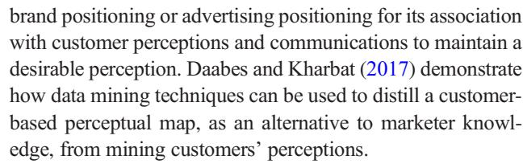

#### CONCEPTUAL/THEORETICAL PAPER

### A strategic framework for artificial intelligence in marketing

Ming-Hui Huang1 & Roland T. Rust 2

Received: 3 March 2020 /Accepted: 29 September 2020 # The Author(s) 2020 / Published online: 4 November 2020

### Abstract

The authors develop a three-stage framework for strategic marketing planning, incorporating multiple artificial intelligence (AI) benefits: mechanical AI for automating repetitive marketing functions and activities, thinking AI for processing data to arrive at decisions, and feeling AI for analyzing interactions and human emotions. This framework lays out the ways that AI can be used for marketing research, strategy (segmentation, targeting, and positioning, STP), and actions. At the marketing research stage, mechanical AI can be used for data collection, thinking AI for market analysis, and feeling AI for customer understanding. At the marketing strategy (STP) stage, mechanical AI can be used for segmentation (segment recognition), thinking AI for targeting (segment recommendation), and feeling AI for positioning (segment resonance). At the marketing action stage, mechanical AI can be used for standardization, thinking AI for personalization, and feeling AI for relationalization. We apply this framework to various areas of marketing, organized by marketing 4Ps/4Cs, to illustrate the strategic use of AI.

Keywords Artificial intelligence . Machine learning . Mechanical AI . Thinking AI . Feeling AI . Strategic AI marketing . Marketing strategy . Standardization . Personalization . Relationalization . Segmentation . Targeting . Positioning . 4Ps . 4Cs

Artificial intelligence (AI) in marketing is currently gaining importance, due to increasing computing power, lower computing costs, the availability of big data, and the advance of machine learning algorithms and models. We see wide applications of AI in various areas of marketing. For example, [Amazon.com](http://amazon.com)'s Prime Air uses drones to automate shipping and delivery. Domino's pizza is experimenting with autonomous cars and delivery robots to deliver pizza to the customer's door. RedBalloon uses Albert's AI marketing platform to discover and reach new customers. Macy's On Call uses natural language processing to provide an in-store

John Hulland and Mark Houston served as Editors for this article.

\* Ming-Hui Huang [huangmh@ntu.edu.tw](mailto:huangmh@ntu.edu.tw)

> Roland T. Rust rrust@rhsmith.umd.edu

- 1 Department of Information Management, College of Management, National Taiwan University, 1, Sec. 4, Roosevelt Rd, Taipei 10617, Taiwan
- 2 Center for Excellence in Service at the Robert H. Smith School of Business, University of Maryland, 3451 Van Munching Hall, College Park, MD 20742, USA

personal assistant to customers. Lexus uses IBM Watson to write its TV commercial scripts, "Driven by Intuition." Affectiva, based on affective analytics, recognizes consumers' emotions while they are watching commercials. Replika, a machine learning-based chatbot, provides emotional comfort to consumers by mimicking their styles of communication. It has even been asserted that AI will change the future of marketing substantially (Davenport et al. [2020](#page-18-0); Rust [2020](#page-19-0)). However, academic marketing research to date provides insufficient guidance about how best to leverage the benefits of AI for marketing impact.

The academic literature on AI in marketing may be sorted into four main types. These are (1) technical AI algorithms for solving specific marketing problems (e.g., Chung et al. [2009;](#page-18-0) Chung et al. [2016](#page-18-0); Dzyabura and Hauser [2011,](#page-18-0) [2019\)](#page-18-0), (2) customers' psychological reactions to AI (e.g., Luo et al. [2019;](#page-19-0) Mende et al. [2019\)](#page-19-0), (3) effects of AI on jobs and society (e.g., Autor and Dorn [2013;](#page-17-0) Frey and Osborne [2017;](#page-18-0) Huang and Rust [2018](#page-18-0)), and (4) managerial and strategic issues related to AI (e.g., Fountaine et al. [2019;](#page-18-0) Huang and Rust [2020\)](#page-18-0).

The fourth literature stream, managerial issues related to AI, is currently dominated by consultants gravitating to the latest hot topic, and largely lacks a solid academic basis, albeit there are some recent studies trying to tackle strategic marketing issues. Examples include unstructured data for various

areas of marketing (Balducci and Marinova [2018](#page-18-0)), analytics for consumer value in healthcare (Agarwal et al. [2020](#page-17-0)), machine learning prediction for mobile marketing personalization (Tong et al. [2020\)](#page-19-0), in-store technology (e.g., robots, smart displays, or augmented reality) for convenience or social presence (Grewal et al. [2020](#page-18-0)), and AI for personalized customer engagement (Kumar et al. [2019](#page-18-0)).

To facilitate the strategic use of AI in marketing, we develop a three-stage framework, from marketing research, to marketing strategy (segmentation, targeting, and positioning, STP), to marketing actions (4Ps/4Cs), for strategic marketing planning incorporating AI. This strategic AI framework is based on a more nuanced perspective of the technical development of AI, existing studies on AI and marketing, and current and future AI applications. It can be used for strategic marketing planning, for organizing the existing AI marketing studies, and for identifying research gaps in AI marketing.

This paper contributes to the strategic application of AI in marketing by developing a framework that guides the strategic planning of AI in marketing in a systematic and actionable manner. It is achieved by bringing together diverse AI literatures on algorithms (e.g., Bauer and Jannach [2018;](#page-18-0) Davis and Marcus [2015](#page-18-0)), psychology (e.g., Lee et al. [2018;](#page-19-0) Leung et al. [2018\)](#page-19-0), societal effects (e.g., Autor and Dorn [2013](#page-17-0); Frey and Osborne [2017\)](#page-18-0), and managerial implications (e.g., Huang et al. [2019](#page-18-0)) to explore what those literatures can tell us about managing AI in marketing. Marketing is an applied field, and using the more foundational literatures to inform marketing practice is an important role for marketing academia. This paper also contributes to strategic marketing research by providing a systematic and rigorous approach to identifying research gaps that bridge strategic AI marketing practice and research.

### Conceptual foundation

# The marketing research–strategy–action cycle

We propose a three-stage strategic planning framework based on the marketing research–marketing strategy–marketing action cycle. Similar cycles have been proposed, such as Deming's [\(1986\)](#page-18-0) plan-do-check-act cycle, but that cycle omits the role of strategy. Our cycle views strategic planning as a circular process, starting from conducting marketing research to understand the market, the firm, the competitors, and the customers; to developing strategies for segmentation, targeting, and positioning; and to designing specific marketing actions to execute the strategy. This cycle does not stop at marketing actions. The execution of marketing actions will feed back to marketing research as market data, which constitutes a continuous cycle for marketing research–strategy–action, as illustrated in Fig. [1.](#page-2-0)

# Multiple AI intelligences

Figure [1](#page-2-0) illustrates that AI can play critical roles in all three strategic marketing stages. It shows that there are multiple AI intelligences that a marketer can leverage: mechanical, thinking, and feeling.

We conceptualize AI as the use of computational machinery to emulate capabilities inherent in humans, such as doing physical or mechanical tasks, thinking, and feeling; the multiple AI intelligence view considers that, rather than treating AI as a thinking machine, AI can be designed to have multiple intelligences, as humans have, for different tasks. Ordered by the difficulty with which AI can address them, there are mechanical, thinking, and feeling AI intelligences (Huang and Rust [2018](#page-18-0); Huang et al. [2019](#page-18-0)).

Mechanical AI is designed for automating repetitive and routine tasks. For example, remote sensing, machine translation, classification algorithms, clustering algorithms, and dimensionality reduction are some current technologies that can be considered mechanical AI.

Thinking AI is designed for processing data to arrive at new conclusions or decisions. The data are typically unstructured. Thinking AI is good at recognizing patterns and regularities in data, for example, text mining, speech recognition, and facial recognition. Machine learning, neural networks, and deep learning (neural networks with additional layers) are some of the current methods by which thinking AI processes data. IBM Watson, expert systems, and recommender systems are some current applications for decision making.

Feeling AI is designed for two-way interactions involving humans, and/or for analyzing human feelings and emotions. Some current technologies include sentiment analysis, natural language processing (NLP), text-to-speech technology, recurrent neural networks (RNN), chatbots for mimicking human speech, embodied and embedded virtual agents for human interactions, and robots with customized hardware for sensing affective signals (McDuff and Czerwinski [2018\)](#page-19-0).

It is important to note two qualifications of this multiple AI intelligences view. First, although we set up three intelligences, the assignment of some applications to a particular intelligence is mainly based on the purpose they are used for. Sometimes those applications may have some elements of more than one intelligence; thus, suggesting that the three intelligences are fuzzy sets (Varki et al. [2000\)](#page-20-0). For example, facial recognition that is trying to identify someone is thinking AI (e.g., customs uses it to identify potential terrorists), while facial recognition that is trying to figure out somebody's emotional state from their facial expression is feeling AI (e.g., advertisers use it to identify audience responses to ads). Second, we do not have true feeling AI yet1 ; thus, the current

1 According to Huang and Rust [\(2018](#page-18-0)), true feeling AI needs to be able to recognize, emulate, and respond appropriately to human emotions.

- **Marketing Action** • Standardization (mechanical AI)
- Personalization (thinking AI)
- Relationalization (feeling AI)

- **Marketing Research** • Data collection (mechanical AI)
- Market analysis (thinking AI)
- Customer understanding (feeling AI)

- **Marketing Strategy** • Segmentation (mechanical AI)
- Targeting (thinking AI)
- Positioning (feeling AI)

Fig. 1 AI and strategic marketing decisions

practice is to use thinking AI to analyze emotional data (e.g., affective analytics) and two-way interactions (e.g., chatbots and social bots). Emotional data are distinct from cognitive data, in that they are contextual, individual-specific, and typically multimodal (speech, gestures, and language). Such data are about the individual in context, meaning that feeling AI needs to incorporate contextual and individual-specific data into modeling the emotional state of an individual.

## Multiple benefits of AI

Each of the AI intelligences can deliver its unique benefit: mechanical AI is best for standardization, thinking AI is good for personalization, and feeling AI is ideal for relationalization (Huang and Rust [2020\)](#page-18-0).

Mechanical AI provides standardization benefits due to its ability to be consistent. In marketing, various forms of mechanical AI have been used to provide a standardization benefit; for example, collaborative robots (cobots) help with packaging (Colgate et al. [1996\)](#page-18-0), drones distribute physical goods, self-service robots deliver service, and service robots automate social presence in frontline (Mende et al. [2019](#page-19-0); van Doorn et al. [2017](#page-20-0)). All these applications aim to generate standardized, consistent, and reliable outcomes.

Thinking AI provides personalization benefits, due to its ability to recognize patterns from data (e.g., text mining, speech recognition, facial recognition). Any marketing functions and activities that can benefit from personalized outcomes should consider thinking AI. The most common applications in marketing are various personalized recommendation systems (Chung et al. [2009](#page-18-0); Chung et al. [2016](#page-18-0)), such as Netflix movie recommendations and Amazon cross-selling recommendations.

Feeling AI provides relationalization benefits (i.e., personalizes relationships), due to its capability to recognize and respond to emotions. Any marketing functions or activities that require interaction and communication, with the goal of relational benefits (e.g., when customer lifetime value is high) should consider feeling AI—one example being customer service. A broad range of marketing functions involves feelings, for example, customer satisfaction, customer complaints, customer moods, and emotions in advertising, etc., and can make use of feeling AI.

### The strategic AI framework

We propose a three-stage strategic framework for using AI in marketing that leverages the three AI intelligences and their

benefits, as shown in Fig. [1](#page-2-0). At the marketing research stage, AI is used for market intelligence, including mechanical AI for data collection, thinking AI for market analysis, and feeling AI for customer understanding.

At the marketing strategy stage, AI is used for the strategic decisions of segmentation, targeting, and positioning. Specifically, mechanical AI is ideal for discovering novel customer preference patterns in unstructured data, thinking AI is ideal for recommending the best segment(s) to target, and feeling AI is ideal for communicating with the targeted customers about the product.2

At the marketing action stage, AI is used for the benefits of standardization, personalization, and relationalization, individually or synergistically. Marketers need to decide which AI intelligence(s) to use for which marketing actions. For example, payment and delivery are functions that can benefit from standardization by using mechanical AI, such as automatic payment and delivery tracking. Digital marketing can benefit from personalization by using thinking AI, such as various recommendation systems. Customer service and frontline customer interaction can benefit from relationalization by using feeling AI, such as social robots greeting customers and conversational AI providing customer service. The discussion of the strategic use of AI in marketing action is organized in terms of the marketing 4Ps/4Cs, to balance both the marketer and customer sides. Table [1](#page-4-0) defines various strategic elements of this strategic AI framework, Table [2](#page-5-0) illustrates marketing actions by using mechanical AI for standardization, thinking AI for personalization, and feeling AI for relationalization, with various examples and current and future scenarios,3 and Table [3](#page-6-0) summarizes the existing literature for using AI in each of the strategic elements. We discuss this three-stage framework in the following sections.

# Marketing research

At this strategic stage, mechanical AI can be used for data collection, thinking AI for market analysis, and feeling AI for customer understanding.

Mechanical AI for data collection Mechanical AI can automate data collection about the market, the environment, the firm, the competitors, and the customers. In the digitally connected world, market data can be easily tracked and monitored. Data sensing, tracking, and collection are routine, repetitive tasks that can be easily automated by mechanical AI.

Existing studies have shown various ways of using mechanical AI for data collection. For example, customer intelligence, including data about consumers, their activities, and their environments, can be collected if they use connected devices (Cooke and Zubcsek [2017\)](#page-18-0), product usage and consumption experience can be visualized with Internet of Things (IoT) (Ng and Wakenshaw [2017\)](#page-19-0), various advanced technologies and analytics can capture unstructured marketing activity data (Balducci and Marinova [2018](#page-18-0)), in-car sensors can track driving behavior for determining insurance premiums (Soleymanian et al. [2019\)](#page-19-0), and retail technologies, such as heat maps, video surveillance, and beacons, can be used for profiling and recognizing retail shoppers (Kirkpatrick [2020\)](#page-18-0). These studies show that, given the repetitive, routine, but high-volume nature of market data, mechanical AI can collect data efficiently at scale.

The data collection capability of mechanical AI is not limited to observable behavioral data; it can also be used to facilitate survey or experimental data collection to capture consumer psychographics, opinions, and attitudes. For example, human administration and supervision of ongoing surveys are no longer required and can be automated. SurveyMonkey and SurveyCake are two commercial survey platforms that automate survey design and data collection.

Thinking AI for market analysis Thinking AI can be used to identify competitors in a well-defined market or outside options in a new market, and to derive insights for a product's competitive advantages (i.e., the way the product can do better than competitors to meet customer demands). For example, supervised machine learning can be used for a mature market where the market structure is stable and known to marketers, whereas unsupervised machine learning can be used for a new market or spotting outside options where the market structure and trends are unstable and unknown to marketers.

In marketing practice, predictive analytics are commonly used to predict volatile market trends and customers' heterogeneous preferences. For example, Gap, the fashion clothing brand, uses it to predict fast fashion trends to better meet customer needs, and Amazon uses it to predict a customer's future orders (i.e., anticipatory fulfilling).

Existing studies have demonstrated various potential uses of thinking AI for market analysis. Automated text analysis can be applied for consumer research (Humphreys and Wang [2018\)](#page-18-0), for marketing insights (i.e., prediction and understanding) (Berger et al. [2019\)](#page-18-0), and for analyzing consumer consideration heuristics (Dzyabura and Hauser [2011](#page-18-0)). Machine learning algorithms and lexicon-based text classification can be used to analyze various social media datasets (Hartmann et al. [2019](#page-18-0)). Also, big data marketing analytics is now a mainstream approach for generating marketing insights (Berger et al. [2019;](#page-18-0) Chintagunta et al. [2016;](#page-18-0) Liu et al. [2016;](#page-19-0) Wedel and Kannan [2016](#page-20-0)).

Specific applications include mapping market structures for large retail assortments using a neural network language

2 The term "product" is used to refer to both tangible goods and intangible services.

3 The two strategic stages, marketing research and marketing strategy, are less relevant for this marketing practice illustration.

Table 1 A strategic framework for AI in marketing

| AI intelligence Strategic decision      | Mechanical AI                                                                                                          | Thinking AI                                                                                         | Feeling AI                                                                                                                              |
|--------------------------------------------|------------------------------------------------------------------------------------------------------------------------|-----------------------------------------------------------------------------------------------------|-----------------------------------------------------------------------------------------------------------------------------------------|
| Marketing research                         | Data collection Automate continuous market and customer data sensing, tracking, collecting, and processing | Market analysis Use marketing analytics to identify competitors and competitive advantages | Customer understanding Use emotional data and customer analytics to understand existing and potential customer needs and wants |
| Marketing strategy (STP)                   | Segmentation Use mechanical AI to identify novel customer preference patterns                                    | Targeting Use thinking AI to recommend the best target segments                               | Positioning Use feeling AI to develop positioning that resonates with customers                                                   |
| Marketing action (4Ps/4Cs) Standardization |                                                                                                                        | Personalization                                                                                     | Relationalization                                                                                                                       |
| Product/Consumer                           | Automate the process and output of meeting customer needs and wants                                                 | Personalize products based on customer preferences                                               | Understand and meet customer emotional needs and wants                                                                               |
| Price/Cost                                 | Automate the process of price setting and payment                                                                   | Personalize prices based on customer willingness to pay                                          | Negotiate price and justify the cost interactively                                                                                   |
| Place/Convenience                          | Automate customer access to product                                                                                 | Personalize frontline interactions                                                                  | Personalize experience for customer engagement                                                                                       |
|                                            | Promotion/Communication Automate communication with customers                                                       | Customize promotional content for personal communication                                         | Tailor communication based on customer emotional preferences and reactions                                                        |

Note. Product includes tangible goods and intangible services

model, by analyzing the co-occurrences of products in shopping baskets (Gabel et al. [2019\)](#page-18-0), detecting copycat mobile apps using a machine learning copycat-detection method (Wang et al. [2018](#page-20-0)), and aiding social media content engineering by employing natural language processing algorithms that discover the associations between social media marketing content and user engagement (Lee et al. [2018](#page-19-0)).

Feeling AI for customer understanding Feeling AI can be used to understand existing and potential customer needs and wants, for example, who they are, what they want, and what their current solutions are. The major distinction between market analysis and customer understanding is that the latter often involves emotional data about customer sentiments, feelings, preferences, and attitudes. Thus, feeling AI can do a better job of understanding customers than mechanical AI and thinking AI, due to its capability of analyzing emotional data.

For existing customers, marketers can use feeling AI to answer the questions of whether they are happy with the product and why. Existing customers' preferences are more stable, and a company has past and current transaction data for a deeper understanding. For example, Affectiva partnered with Ford to create AutoEmotive sentiment analysis, to try to figure out drivers' emotional states.

For potential customers, marketers can use feeling AI to understand what they want and why they are happy with competitors or outside options. Potential customers' needs and wants are more difficult to predict, and their emotional data are less available. In marketing practice, Albert AI, Adgorithm's AI-driven marketing platform, has been used by RedBalloon to discover and reach new customers (Sutton [2018\)](#page-19-0) and by Harley-Davidson to identify high potential customers based on the company's customer relationship management database, personalizing the marketing campaign accordingly (Power [2017](#page-19-0)).

In academic research, existing studies have shown various approaches of using feeling AI to understand customers. For example, the sentiment expressed by consumers in social media (e.g., online reviews, tweets), including explicit and implicit language and discourse patterns, can be analyzed to understand consumer responses using their own language (Hewett et al. [2016;](#page-18-0) Humphreys and Wang [2018](#page-18-0); Ordenes et al. [2017\)](#page-19-0), the interaction between conversational AI and customers can be enhanced by applying analytical mapping to script appropriate response sequences that make customers feel that they have a "conversation" with AI (Avery and Steenburgh [2018](#page-18-0)), consumer consideration heuristics can be understood by machine learning (Dzyabura and Hauser [2011\)](#page-18-0), and customer needs can be identified from user-generated content using convolutional neural network machine learning (Timoshenko and Hauser [2019\)](#page-19-0).

## Marketing strategy (STP)

At this strategic stage, marketers can use AI for the three key strategic decisions: segmentation, targeting, and positioning. However, before proceeding to specific STP decisions, marketers need to decide the overall strategic positioning to guide their STP decisions. Huang and Rust ([2017](#page-18-0)) propose a technology-driven approach to positioning a firm's strategy along the dimensions of standardization–personalization and transaction–relationship. A firm can pursue a commodity

Table 2 Illustrative examples and scenarios of using the three AI intelligences in various areas of marketing organized by 4Ps/4Cs

| 4Ps/4Cs                     | Area of marketing                       | Mechanical AI for standardization                                                                                                                                                                                                                                                         | Thinking AI for personalization                                                                                                                                                                                                                                                                                                                                                                                    | Feeling AI for relationalization                                                                                                                                                                                                                                                                                                              |
|-----------------------------|-----------------------------------------|-------------------------------------------------------------------------------------------------------------------------------------------------------------------------------------------------------------------------------------------------------------------------------------------|--------------------------------------------------------------------------------------------------------------------------------------------------------------------------------------------------------------------------------------------------------------------------------------------------------------------------------------------------------------------------------------------------------------------|-----------------------------------------------------------------------------------------------------------------------------------------------------------------------------------------------------------------------------------------------------------------------------------------------------------------------------------------------|
| Product/ Consumer        | Product/branding                        | • Track and monitor product adoption and acceptance • Tailor Brands automate logo design                                                                                                                                                                                            | • Gap uses predictive analytics for fashion trends • Computing creativity for service innovation • Brand tracking through text analysis • AI diet personalizes diet algorithm for each consumer                                                                                                                                                                                               | • Train bots to have brand personality • Sky uses ML to recommend programs according to the viewer's mood • Real-time conversations with consumers • Replika, a ML chatbot, provides emotional comfort to consumers by mimicking their styles of communication                                                  |
|                             | Customer service                        | • Text-based chatbots handle massive amount of routine cases simulta neously                                                                                                                                                                                                        | • NLP chatbots analyze heterogeneous customer voices (e.g., customers with accents or issues are contextual-dependent)                                                                                                                                                                                                                                                                                 | • NLP chatbots analyze and respond to customer emotions • Cogito's emotional AI analyzes conversation and provides guidance to customer agents                                                                                                                                                                                    |
| Price/Cost                  | Pricing                                 | • Automatic payment • Apple Pay, Google Pay, PayPal, Amazon Payments, and Square                                                                                                                                                                                                    | • Personalized pricing • ML for price optimization by product, channel, and customer                                                                                                                                                                                                                                                                                                                         | • Price negotiation                                                                                                                                                                                                                                                                                                                           |
| Place/ Convenience       | Retailing/frontline                     | • Self-check-in and check-out • Giant grocery's Marty robot identifies hazards • HaiDiLao's robots deliver hotpot soup from kitchen to table side • Robotic kiosks answer routine questions                                                                             | • Macy's On Call (NLP personal shopping app) • Alibaba's FashionAI smart mirrors display complementary items                                                                                                                                                                                                                                                                                           | • Customer greeting robots (e.g., Pepper) interact with customers in the frontline                                                                                                                                                                                                                                                   |
|                             | Distribution/ logistics/ delivery | • Cobots automate packaging • Amazon Prime Air and UPS's drone delivery • IoT automates consumption tracking and order refilling • Self-service                                                                                                                            | • Amazon uses predictive analytics for anticipatory shipping • Domino's pizza uses self-driving cars for delivery                                                                                                                                                                                                                                                                                         | • Amazon Go convenience store uses facial recognition to identify customers                                                                                                                                                                                                                                                             |
| Promotion/ Communication | Advertising/digital marketing        | • Automate targeting and retargeting • Automate media scheduling and buying • Automate consumer webpage browsing using hotlink assignment • Automate real-time posting, bidding, and updating • Automate push content, ad, and notification to consumers' devices | • AI writer creates and personalizes content • Lexus car uses IBM Watson to create commercial script • Kantar's ad analytics help advertisers create content • Albert AI personalizes campaign for Harley-Davidson • Personalized campaign content based on analytical customer profiling • Personalize search using social influence • Tracking and measuring campaigns | • Affectiva tracks audience feeling and personalizes ad messages • Wylei uses predictive AI to create and deliver personalized content for engaging customers • Kia used ML to identify social media influencers for its 2016 Super Bowl campaign • Emotion sensing from post message or conversational content |

Note. The two higher strategic levels, marketing research and marketing strategy, are not included, due to them being less observable from marketing practice

strategy that uses automated/robotic technology for efficiency, a relational strategy that cultivates the existing customers' lifetime value, a static personalization strategy that uses cross-sectional big data analytics (e.g., like-minded customers) for personalization, or an adaptive personalization strategy that uses longitudinal customer data for dynamic personalization over time. This strategic positioning will guide firms' STP decisions. For example, if a firm pursues the static

personalization strategy, the firm may want to have a big, relevant, existing and potential customer database and let unsupervised machine learning explore patterns of preference or purchase behavior as the basis of targeting and positioning. If a firm pursues the adaptive personalization strategy, the firm may want to use supervised machine learning to continue analyzing existing customers' satisfactions/dissatisfactions over time (which may not be big). However, if firms embrace

Table 3 Prior and current AI research organized by the strategic framework

| AI intelligence Strategic decision                  | Mechanical AI                                                                                                                                                                                                                                                                                                                                                                                                                                                                                                                                                                                                                                                                                | Thinking AI                                                                                                                                                                                                                                                                                                                                                                                                                                                                                                                                                                                                                                               | Feeling AI                                                                                                                                                                                                                                                                                                                                                                                                                                                                                                                                                                                                                                                                                                                                                                                                                                                                                                              |
|--------------------------------------------------------|----------------------------------------------------------------------------------------------------------------------------------------------------------------------------------------------------------------------------------------------------------------------------------------------------------------------------------------------------------------------------------------------------------------------------------------------------------------------------------------------------------------------------------------------------------------------------------------------------------------------------------------------------------------------------------------------|-----------------------------------------------------------------------------------------------------------------------------------------------------------------------------------------------------------------------------------------------------------------------------------------------------------------------------------------------------------------------------------------------------------------------------------------------------------------------------------------------------------------------------------------------------------------------------------------------------------------------------------------------------------|-------------------------------------------------------------------------------------------------------------------------------------------------------------------------------------------------------------------------------------------------------------------------------------------------------------------------------------------------------------------------------------------------------------------------------------------------------------------------------------------------------------------------------------------------------------------------------------------------------------------------------------------------------------------------------------------------------------------------------------------------------------------------------------------------------------------------------------------------------------------------------------------------------------------------|
| Marketing research                                  | Data collection • IoT visualizes usage and experience data (Ng and Wakenshaw 2017) • Connected devices collect customer intelligence (Cooke and Zubcsek 2017) • Various online platforms make unstructured big data available for cloud computing to predict sales and consumption (Liu et al. 2016) • Unstructured data for marketing insights (Balducci and Marinova 2018) • Sensors tracking driving behavior provide insurers individual-level driving data (Soleymanian et al. 2019) • Retail tracking technologies, such as heat maps, video surveillance, and Beacons collect in-store shopper data (Kirkpatrick 2020) | Market analysis • IoT reconfigures product and service that shifts boundaries of Things (Ng and Wakenshaw 2017) • NLP and ML map market structures for large retail assortments (Gabel et al. 2019) • Lexicon-based and ML algorithms text mining social media data for marketing research (Hartmann et al. 2019) • Big data marketing analytics for marketing insights (Berger et al. 2019 ; Chintagunta et al. 2016; Liu et al. 2016; Wedel and Kannan 2016) • Analytical and intuitive AI for service analytics (Huang and Rust 2018) • AI for solving marketing problems (Overgoor et al. 2019) | Customer understanding • Deep learning and NLP analyze customer perceptions (Ramaswamy and DeClerck 2018) • Sentiment analysis for social media content understands consumer responses using their own language (Hewett et al. 2016 ; Humphreys and Wang 2018 ; Ordenes et al. 2017). • ML for understanding consumer consideration heuristics (Dzyabura and Hauser 2011) • Convolutional neural network identifies customer needs from user-generated content (Timoshenko and Hauser 2019) • Consumer and smart object in IoT as relationship journey (Novak and Hoffman 2019) • Consumer resistance to personal medical AI (Longoni et al. 2019) • Consumers may not prefer identity-related automated products (Leung et al. 2018) • Anthropomorphized consumer robots increase perceived warmth but decrease liking (Kim et al. 2019) |
| Marketing strategy (STP)                         | Segmentation • Text-mining and ML automatically categorize loan borrowers (Netzer et al. 2019) • Conjoint analysis with sparse learning for consumer preferences in multiple segments (Chen, Iyengar, and Iyengar 2017) • Automated text analysis and correspondence analysis for psychographic consumer segmentation in the art market (Pitt et al. 2020) • Data mining for tourist segments based on the meaning of destinations to consumers (Valls et al. 2018) • Retail big data for micro segment customers (Dekimpe 2020)                                                                                                       | Targeting • ML and causal forests for targeting cancer outreach marketing (Chen et al. 2020) • ML for optimizing the targeting of promotions for new customers (Simester et al. 2020) • ML techniques for field experiments data to identify the best targets for proactive churn programs (Ascarza 2018) • Digital consumer profiling for targeting (Neumann et al. 2019) • Combining statistical and data-mining techniques to target customers (Drew et al. 2001) • Variational Bayes ML segments customers based on retailer-brand and channel (Danaher et al. 2020)                            | Positioning • Data mining for distilling a customer-based perceptual map (Daabes and Kharbat 2017) • Tourism positioning slogans in top destinations emphasize affective component (Gali, Camprubi, and Donaire (2017)                                                                                                                                                                                                                                                                                                                                                                                                                                                                                                                                                                                                                                                                             |
| Marketing Product/ action Consumer (4Ps/4- | Standardization • Consumers may not prefer automated products that are                                                                                                                                                                                                                                                                                                                                                                                                                                                                                                                                                                                                                 | Personalization • Topic modeling and ML for service innovation and design (Antons and                                                                                                                                                                                                                                                                                                                                                                                                                                                                                                                                                               | Relationalization • Train conversational AI to have brand personality (Wilson and Daugherty                                                                                                                                                                                                                                                                                                                                                                                                                                                                                                                                                                                                                                                                                                                                                                                                                       |

related to their identity (Leung

Breidbach 2018)

Liebman et al. [2019\)](#page-19-0) • Deep learning for personalized point-of-interest recommendation

(Guo et al. [2018\)](#page-18-0)

• Adaptive personalization systems (Chung et al. [2009;](#page-18-0) Chung et al. [2016](#page-18-0); Dzyabura and Hauser [2019](#page-18-0); [2018\)](#page-20-0)

• AI personalizes engagement marketing

• AI intelligences can be used to engage customers in the service journey (Huang and Rust [2020](#page-18-0))

(Kumar et al. [2019\)](#page-18-0) • Service interactions can be personalized by "substituting information for interaction" (Glushko

and Nomorosa 2013)

• Video-based automated recommender systems (Lu, Xiao, and Ding 2016)

et al. [2018\)](#page-19-0)

Cs)

Table 3 (continued)

| AI intelligence Strategic decision | Mechanical AI                                                                                                                                                                                                                                                                                                                  | Thinking AI                                                                                                                                                                                                                                                                                                                                                                                                                        | Feeling AI                                                                                                                                                                                                                                                                                                                                                                                                         |
|---------------------------------------|--------------------------------------------------------------------------------------------------------------------------------------------------------------------------------------------------------------------------------------------------------------------------------------------------------------------------------|------------------------------------------------------------------------------------------------------------------------------------------------------------------------------------------------------------------------------------------------------------------------------------------------------------------------------------------------------------------------------------------------------------------------------------|--------------------------------------------------------------------------------------------------------------------------------------------------------------------------------------------------------------------------------------------------------------------------------------------------------------------------------------------------------------------------------------------------------------------|
|                                       |                                                                                                                                                                                                                                                                                                                                |                                                                                                                                                                                                                                                                                                                                                                                                                                    | • Track brand reputation through sentiment analyses social media content (Rust et al. 2020) • Customers perceive AI chatbots to be to be less empathetic (Luo et al. 2019)                                                                                                                                                                                                                             |
| Price/ Cost                        | • Consumers' online WOM can be used to automate price changes based on ML tools (Feng et al. 2019)                                                                                                                                                                                                                    | • Multiarmed bandit algorithms from statistical machine learning dynamically adjusted online prices with incomplete price information (Misra et al. 2019) • Machine learning based on Bayesian inference optimize online pricing with sparse and noisy data (Bauer and Jannach 2018) • Consumers' private information for price personalization (Montes et al. 2019)                              | • Interpersonal likeability would impact the price negotiation outcome in a B2B relationship (Pulles and Hartman 2017)                                                                                                                                                                                                                                                                                    |
| Place/ Convenience                 | • Mechanical AI automates service process (Huang and Rust 2018) • IoT optimizes retail processes (Grewal et al. 2018) • Service robots interact with scale and consistency (Wirtz et al. 2018) • Service robots automate social presence in frontline (Mende et al. 2019; van Doorn et al. 2017) | • Video-based garment recommender (Lu et al. 2016) • Service robots deliver customized experience (Wirtz et al. 2018)                                                                                                                                                                                                                                                                                                     | • Service robots surface acting (Wirtz et al. 2018) • Consumers resistance to medical AI (Longoni et al. 2019) • One-voice strategy for customer en gagement across diverse interfaces enabled by machine-age technologies in a customer journey (Singh et al. 2020)                                                                                                                       |
| Promotion/ Communication           | • Automate classification of social media content and sentiment (Hartmann et al. 2019) • AI automates media buying process (Chen et al. 2019)                                                                                                                                                                      | • Intelligent purchasing, dynamic pricing, targeting, and retargeting (Kietzmann et al. 2018) • Content engineering by ML and NLP (Lee et al. 2018) • Combine ML and NLP to detect copycat apps (Wang et al. 2018) • AI transforms advertising creative processes (i.e., programmatic creative) (Chen et al. 2019) • Personalized mobile marketing strategies center on 4Ps (Tong et al. 2020) | • NLP analyzes social media ad content enhances consumer engagement (Lee et al. 2018) • AI chatbots for outbound sales calls (Luo et al. 2019) • NLP algorithms analyze Facebook messages to examine the association between social media content and user engagement (Lee et al. 2018) • Personalized ad backfires if privacy concern is heightened (Kim, Barasz, and John 2019) |

a data-driven approach to STP, it can rely more heavily on AI to explore the STP possibilities.

In general, this stage of strategic decisions relies more on thinking AI, for its capability of processing data to arrive at new conclusions or decisions. However, it is worth reiterating that the assignment of some applications to a particular intelligence is mainly based on the purpose an application is used for. For example, when thinking AI becomes completely routinized, as is often the case in segmentation applications, it shares many of the characteristics of mechanical AI, because it simply identifies patterns from data routinely and repetitively, without involving much about the purpose of making new decisions (e.g., segmentation but not retargeting).

### Segmentation

Segmentation is to slice a market into pieces, with customers in each piece having unique needs and wants, for example, using gender to slice the shoe market into male and female shoes segments; and using price and quality to slice the air travel market into budget and premium airlines segments. Mechanical AI, especially the various mining and grouping techniques, has the strength of identifying novel patterns from data.

AI segmentation is flexible, in that it can disaggregate the market into segments of one (i.e., each individual customer is a segment) and can aggregate scattered long tails into one

segment. Wang et al. [\(2017\)](#page-20-0) demonstrate that transfer learning can be used to model the tail of the distribution, by learning from the head of the distribution and transferring the learning to the data-poor tail. This flexibility in aggregation and disaggregation allows marketers to find the right size of segment.

Existing studies have shown how data mining can be used to uncover patterns that are difficult for human marketers to see. For example, text-mining and machine learning can be used to automatically process and analyze loan requests to slice borrowers into good customers (those will pay back the loan) and bad customers (those will not) (Netzer et al. [2019\)](#page-19-0), automated text analysis and correspondence analysis can be used for psychographic consumer segmentation in the art market (Pitt et al. [2020](#page-19-0)), data mining can be used to obtain tourist segments based on the meaning of destinations to consumers, that is better than the classic clustering methods (Valls et al. [2018\)](#page-19-0), and retail customers can be micro-segmented based on their preferences for personalized recommendation (Dekimpe [2020\)](#page-18-0).

### Targeting

Targeting is choosing the right segment(s) on which to focus the firm's marketing actions. Slicing the market is more mechanical and can be done automatically by mechanical AI, given the relevant data. However, choosing the right segment requires domain knowledge, judgement, and intuition. Various technologies and analytics have been used for targeting, such as search engines using keywords searched and browsing history to target search consumers, and social media platforms using interests, content, and connections to target social media consumers (Liu [2020](#page-19-0)). The representative AI for this decision is recommendation engines that can recommend various potential targets for marketing managers' final verdict, and predictive modeling that can be used to choose which segment to target.

Existing studies show that various thinking AI can be used for this purpose. Examples include targeting customers using a combination of statistical and data-mining techniques (Drew et al. [2001\)](#page-18-0), screening and targeting cancer outreach marketing using machine learning and causal forests (Chen et al. [2020\)](#page-18-0), optimizing promotion targeting for new customers using various machine learning methods (Simester et al. [2020\)](#page-19-0), identifying the best targets for proactive churn programs from field experimental data using machine learning techniques (Ascarza [2018](#page-17-0)), and profiling digital consumers for targeting using online browsing data (Neumann et al. [2019](#page-19-0)).

### Positioning

Positioning bridges product attributes and customer benefits by finding a competitively advantageous position for the product in customers' minds. This term is often associated with

Compared with the mechanical-based segmentation and the thinking-based targeting, positioning is more about speaking to customers' hearts, typically as a positioning statement or slogan in promotional communication. Gali et al. [\(2017](#page-18-0)) find that tourism positioning slogans in top destinations tend to emphasize the affective component.

Some successful positioning statements help brands to occupy a unique position in customers' minds and thus succeed in the market for a long time. For example, Nike's "Just do it," Apple computer's "Be different," and McDonalds' "I'm loving it" all communicate with customers by speaking to their hearts. Feeling AI, such as feeling analytics, is ideal for this strategic decision to help develop compelling slogans by understanding what resonates with target customers.

Academic research on this decision is sparse, indicating a research gap for using feeling AI to create compelling positioning.

# Marketing action

At this strategic stage, marketers can use mechanical AI for standardization, thinking AI for personalization, and feeling AI for relationalization (Huang and Rust [2020](#page-18-0)). Depending on which benefit is desirable, a marketer can use multiple AI intelligences individually or collectively. We illustrate the use of AI intelligences in various areas of marketing with examples and current and future scenarios, and support the illustration using the existing literature. The discussion is organized by marketing 4Ps (product, price, place, and promotion) (Kotler and Keller [2006](#page-18-0)) and the corresponding 4Cs (consumer, cost, convenience, and communication) (Lauterborn [1990](#page-18-0)) to emphasize that the 4P actions need to be able to deliver consumer benefits.

### Product (consumer)

Product (consmer) actions include goods and services as offerings to meet the consumer's needs and wants. Such actions typically include product design, packaging, branding, and returns, and the associated customer services in these activities. We illustrate this decision using product/branding and customer service, with product/branding representing the "product" side and customer service representing the "consumer" side. Product and branding are related in that branding is the identity (e.g., name, symbol, logo) of a product. We put them together to maintain the simplicity of the table.

Product/branding focuses on product creation (including tangible goods R&D and production, and service innovation and process) and branding (i.e., the identity of a product).

Mechanical AI can be used for product/branding actions that can benefit from standardization. For example, brand logo design can be automated by a decision-tree like machine learning using multiple-choice questions, allowing small budget marketers to have AI-assisted branding (Avery [2018](#page-17-0)). Product adoption and acceptance can be tracked and monitored automatically. While enjoying the standardization benefit of mechanical AI, one existing study is cautious about automating product decisions, when those products are related to consumers' identity (Leung et al. [2018](#page-19-0)).

Thinking AI can be used for product/branding actions that can benefit from personalization. For example, marketing analytics can predict market trends for product design that cater more precisely to target customers' preferences, big data analytics can be used to inform product development to quickly adapt to consumer trends and changing preferences (Dekimpe [2020\)](#page-18-0), topic modeling can advance service innovation and design (Antons and Breidbach 2018), adaptive systems can be used to personalize service to each consumer's preference (Chung et al. [2009;](#page-18-0) Chung et al. [2016;](#page-18-0) Dzyabura and Hauser [2019](#page-18-0); Liebman et al. [2019\)](#page-19-0), and deep learning can be used to personalize point-of-interest recommendations (Guo et al. [2018\)](#page-18-0).

Feeling AI can be used for product/branding actions that can benefit from relationalization. For example, conversational AI can be trained to have brand personality to interact with customers (Wilson and Daugherty [2018](#page-20-0)), machine learning can recommend TV programs based on the viewer's mood, brands can track their reputation through text and sentiment analyses tweets, reviews, and social media posts (Rust et al. [2020\)](#page-19-0), and chatbots can mimic customers' communication style to provide emotional support. Kumar et al. [\(2019\)](#page-18-0) provide a systematic exploration about the role of AI in personalized engagement marketing, an approach to create, communicate, and deliver personalized offering to customers. Huang and Rust ([2020](#page-18-0)) show that feeling AI can be used to engage customers in service interaction.

From the consumer side, existing studies further show that customers have varying responses and attitudes toward using AI products. For example, consumers may be resistant to personal medical AI (Longoni et al. [2019\)](#page-19-0), identity-based consumption automation (Leung et al. [2018\)](#page-19-0), and anthropomorphized consumer robots (Kim et al. [2019;](#page-18-0) Mende et al. [2019\)](#page-19-0). These studies put a boundary condition for marketers when using AI in the product/branding actions to generate positive customer responses.

Customer service is emotionally charged, yet is also costly. A marketer can handle customer service using the three AI intelligences to balance the cost/satisfaction tradeoff in serving customers.

Mechanical AI, such as text-based chatbots, is widely used online to handle a massive amount of routine customer service. Most customer questions can be answered by such bots. As long as such automation is not related to customers' identity (Leung et al. [2018\)](#page-19-0), it is easy to implement, cost-efficient, and scales up easily.

Thinking AI, such as natural language processing chatbots, can handle more diversified customers and idiosyncratic issues (e.g., multicultural customers with accents and contextual-dependent complaints). This is an AI version of the old telephone menu, except that customers are talking to chatbots, rather than human customer service agents. Although a recent study shows that customers may not feel comfortable yet about talking to chatbots (Luo et al. [2019\)](#page-19-0), with the wider acceptance of AI and the further advance of chatbots, we can expect the acceptance to increase over time.

Feeling AI, such as Cogito's emotional AI systems, can analyze the pace of speaking, energy and empathy, and common errors of conversations, and gives in-call guidance to customer service agents in call centers that make the conversations more natural and engaging.

### Price (cost)

Price (cost) action includes the tasks of payment, price setting, and price negotiation, which is the cost that the consumer pays for the product.

The payment task is routine and can be handled best by mechanical AI. Apple Pay, Google Pay, PayPal, Amazon Payments, and Square are some popular automatic payment methods for online marketers.

The price setting task is calculation-intensive and analytical, which is the strength of thinking AI. Misra et al. [\(2019](#page-19-0)) demonstrate that multiarmed bandit algorithms from statistical machine learning can dynamically adjust online prices in realtime, even if price information is incomplete. Bauer and Jannach ([2018](#page-18-0)) show that a machine-learning framework based on Bayesian inference can optimize online pricing even when data are updated frequently, and are sparse and noisy. Prices can also be personalized by incorporating consumer online WOM (Feng et al. [2019](#page-18-0)) and consumers' private personal information (Montes et al. [2019](#page-19-0)). Dekimpe ([2020](#page-18-0)) proposes that retailers can use big data to optimize dynamic bestresponse pricing algorithms that consider consumer choices, competitor actions, and supply parameters.

The price negotiation task is interactive; thus, feeling AI is in a better position to undertake this task. Pulles and Hartman [\(2017\)](#page-19-0) hypothesize that interpersonal likeability would impact the price negotiation outcome in a B2B relationship, suggesting that interaction, communication, and sentiment may be critical for price negotiation.

### Place (convenience)

Place (convenience) is the way that the consumer can access the product. We discuss two broad categories of place action: Retailing and frontline, virtually or physically, in which interactions play a key role; and distribution, logistics, and delivery, in which convenience is the key.

Retailing/frontline is the area of marketing that most employs embodied AI (i.e., robots) to facilitate frontline interactions.

Mechanical AI can be used to automate backend marketing processes and frontend interactions. In the backend, service processes can be automated (Huang and Rust [2018\)](#page-18-0) and retail processes can be optimized using IoT (Grewal et al. [2018](#page-18-0)). In the frontend, service robots can interact with scale and consistency (Wirtz et al. [2018](#page-20-0)), and can automate social presence in the frontline (Mende et al. [2019;](#page-19-0) van Doorn et al. [2017](#page-20-0)). Frontline service robots are common; for example, Giant grocery uses the robot Marty to identify hazards in store (e.g., detecting milk spilled on the floor) and HaiDiLao hotpot uses robots to deliver soup base from kitchen to table side. Grocery shopping is typically repeat purchase, which does not involve too much interaction, communication, and emotion, and thus using mechanical AI to automate the marketing function is desirable.

At the thinking level, due to the direct customer contact nature of retailing, AI is used to facilitate in-store shopping for individual customers. Amazon Go, an experimental grocery store, uses facial recognition technology to identify and remember each customer, Macy's On Call, a mobile shopping personal aid, provides in-store information to help customers locate items they are looking for, and Alibaba's FashionAI system uses smart mirrors in sales floor and changing rooms to display items that each customer selects and suggests complementary items.

Feeling AI can be used to enhance interaction and engagement. For example, service robots can easily do surface acting (Wirtz et al. [2018](#page-20-0)), and "one-voice" AI can enhance customer engagement by integrating various interfaces involved in a customer's journey (Singh et al. [2020](#page-19-0)). At the feeling level, various embodied robots are used to engage customers and optimize their experience. For example, Pepper robots are used by Marriott to greet and interact with customers. Hotels and travel typically involve more interactions and more emotions, and thus feeling AI naturally suits. Nevertheless, marketers need to be cautious, in that anthropomorphized robots are found to increase perceived warmth but decrease liking (Kim et al. [2019\)](#page-18-0); thus, in the case of embodied frontline robots, marketers need to take the appearance of robots into consideration.

Distribution/logistics/delivery is an area of marketing in which many functions and processes can be highly automated; including packaging, inventory, warehousing, supply chain, logistics, and delivery, to provide convenience benefits to customers.

Tasks in distribution are mostly mechanical, routine, and repetitive; thus, the standardization benefit of mechanical AI fits well. We have seen cobots for packaging, drones for delivery, IoT for consumption tracking and order refilling, and self-service technologies for delivering service to customers directly. Such standardization provides a convenience benefit to customers.

Moving up to the thinking AI level, we have seen that a customer's future orders and refills can be anticipated by predictive analytics, and ordered products can be delivered to customers using autonomous cars equipped with facial recognition technology (e.g., [JD.com](http://jd.com) and Domino's use selfdriving cars for delivery).

So far, feeling AI is not as widely used as the other two AI intelligences for this marketing action, due to distribution's mechanical and thinking nature.

### Promotion (communication)

Promotion (communication) is the marketing communications between the consumer and the marketer. It can include personal selling, traditional mass media advertising, and more commonly nowadays direct marketing, database marketing, and digital marketing (social media marketing, mobile marketing, search engine optimization, etc.). All these can benefit from AI intelligences.

Mechanical AI is ideal for automating various repetitive, routine, and data intensive functions of promotion (Huang and Rust [2018](#page-18-0)). Most of these are about promotional media planning and executions. Examples include automating advertising media planning, scheduling, and buying; automating search campaigns execution, keywords researching, and bidding; automating social media targeting, retargeting, and posting. Especially considering the real-time nature of digital marketing, such automation greatly aids marketers' efforts in the labor-intensive, hightime-pressure process.

Thinking AI has great potential for promotion content creation and personalization. For example, AI content writers can facilitate the generation of ad or post content. A recent example was a Lexus car commercial that used IBM Watson to create the "Driven by Intuition" commercial script. Content can be personalized and optimized to different customer profiles at different locations and different times. Kantar Analytics uses content analytics to help advertisers create content that shortens the idea-to-value time and maximizes content effectiveness (Gopinath [2019](#page-18-0)).

Feeling AI can be used to track real-time customer response to promotional messages (like, dislike, disgusted, funny, etc.) and then adjust what to deliver and what to emphasize in both media and content. At the feeling level, more real-time

and accurate emotion sensing from posted messages can better engage customers and provide a better interaction experience (Hartmann et al. [2019;](#page-18-0) Lee et al. [2018](#page-19-0)).

### Managerial implications

Our framework provides a roadmap for marketers to implement various AI intelligences in marketing, strategically and systematically. Table [4](#page-12-0) summarizes the managerial implications of the framework by contrasting current marketing practice with the emerging AI-enabled marketing practice. The two practices should be viewed as two ends of a continuum, with more AI intelligences expected to be used for more strategic elements at the three stages over time. We discuss these implications below.

# Implications for marketing research

At this stage, marketers need to decide (1) how to use AI to identify competitors (including competitors in the same industry and outside options) and to understand competitive advantages (i.e., the way the product can do better to meet customers' needs), and (2) how to use AI to discover and understand existing and potential customers (i.e., who they are, what they want, and what their current solutions are) and to understand their preferences and feelings. For firms that embrace a theory-driven approach to marketing strategies, data and intelligences resulting from this stage play a critical role.

Data collection Currently, surveys, experiments, interviews, panels, and sales data are still the major approaches for marketers to obtain data, even though the administration of these methods can be partially automated or facilitated by technology. Surveys and experimental methods tend to be more theory driven, while other methods tend to be more data driven. Marketers often also rely on thirty-party syndicated data (e.g., YouGov), especially for external data that are difficult for the firm to collect. These data are typically delayed, out of context, and ad hoc, meaning that they are collected periodically, after the fact (after consumption has occurred), and not during data generation.

By contrast, emerging practices automate most of the data collection by connecting technology (e.g., IoT, social networking sites, mobile apps), sensor technology (e.g., remote sensing, detection), and wearable technology (e.g., smart watch, Fitbit). These mechanical AI approaches track and capture real-time data when they are occurring. Thus, the data are in context, about the customer, and during the consumption experience. Such spontaneous data collection tends to be more data driven, but if theories can be developed priori to guide and update the continuous data collection, they can be theory driven as well.

Market analysis Current market analysis, although marching toward machine learning-based analysis rapidly, still relies heavily on statistical analysis to analyze structured data for marketing insights. It is also common for firms to purchase third-party data and analysis, especially for external market and competitor analysis. Such analysis tends to be standardized across firms (with limited degree of customization), and thus the insights derived from it are less useful for deriving a unique value proposition. Firms also monitor and analyze first-party data, especially for firm marketing resource analysis and for existing customer analysis for which internal data are available.

By contrast, big data and machine learning-based analytics are the emerging approach for marketing insights. Online reviews, opinions, and behaviors all can be mined, and data can be in text, image, audio, or video. When the question at hand is clear (e.g., a mature brand), supervised machine learning can be used to conduct theory-driven analysis, whereas when the question at hand is unclear (e.g., a new brand), unsupervised machine learning can be applied to obtain data-driven insights. Balducci and Marinova ([2018](#page-18-0)) offer a detailed description of various methods of analyzing unstructured data in marketing. More advanced approaches to marketing analysis include using deep learning methods such as predictive analytics, computational creativity, personalization algorithms, and natural language processing systems, to come up with intuitive suggestions for marketing strategies.

Customer understanding Current practice relies heavily on focus groups to gain qualitative insights about customers. Focus groups are time consuming and labor intensive, not to mention not representative. Marketers also observe customers' behaviors and choices, and their reactions to promotions to understand their preferences and the underlying reasons.

By contrast, data about customers' feelings, moods, and emotions can be obtained directly from customers' interaction with AI (e.g., conversational bots), rather than inferred from psychometrics, using conversational bots and analyzed using feeling analytics (e.g., posts on social media, voice recordings of customer interactions, and chat transcripts). Feeling analytics can identify customer insights with scale and cost-efficiently. Given that emotional data are personal and in context, understanding customers in context provides richer insights about who they are and what they like.

## Implications for marketing strategy (STP)

At this stage, marketers can leverage the three AI intelligences for segmentation, targeting, and positioning, respectively. For firms that embrace a data-driven approach to marketing strategy, this stage may play a bigger role than conclusions derived from marketing research.

Table 4 Managerial and research implications based on the three-tier strategic framework

|                               | Current practice                                                                                                               | Emerging practice                                                                                                                              | Future research                                                                             |  |
|-------------------------------|--------------------------------------------------------------------------------------------------------------------------------|------------------------------------------------------------------------------------------------------------------------------------------------|---------------------------------------------------------------------------------------------|--|
|                               |                                                                                                                                |                                                                                                                                                |                                                                                             |  |
| Data collection               | • Scattered surveys, experiments, interviews, panels, sales (e.g., scanner data), and syndicated data (e.g., TNS)        | Marketing research • Integrated multiple sources of data collected automatically by mechanical AI (e.g., IoT, sensors, and wearables) | How would privacy and data security affect marketing's use of AI for data collection? |  |
|                               | • Semi-structured behavioral big data • Data are delayed, out of context, and ad hoc                                        | • Unstructured behavioral, opinion, and sentiment data • Data are real-time, during a customer's                                         |                                                                                             |  |
|                               |                                                                                                                                | experience, and in context                                                                                                                     |                                                                                             |  |
| Market analysis               | • Statistical analysis for structured data • Theory-driven hypothesis testing                                               | • Big data analytics for unstructured data • Data-driven exploration                                                                        | How to balance data- and theory-driven market analysis?                                  |  |
| Customer understand ing | • Qualitative focus groups for customer insights • Observe customer behavior, choice, and reactions to marketing actions | • Feeling analytics for customer insights with scale • Understand customers in their own words and expression                            | What algorithms and models are needed for feeling AI?                                    |  |
|                               | • Psychometrics for inferring customer thinking and feeling                                                                 | • Direct insights from customer interactions with conversational AI                                                                         |                                                                                             |  |
|                               |                                                                                                                                | • Deep learning and NLP for contextual customer thinking and feeling                                                                        |                                                                                             |  |
|                               |                                                                                                                                |                                                                                                                                                |                                                                                             |  |
| Segmentation                  | • Segment based on a few variables a priori • Aggregate customer equity model (e.g.,                                        | Marketing strategy (STP) • Discover novel segments based on unlimited number of variables                                                | How best to visualize segmentation?                                                         |  |
|                               | acquisition rate, churn rate)                                                                                                  | • Individual customer lifetime value model (i.e., segmentation of one)                                                                      |                                                                                             |  |
| Targeting                     | • Target segments • Trade off target segment size and effectiveness                                                         | • Target individuals more • Flexible targeting and retargeting (aggregate and disaggregate)                                              | What happens when the customer is AI?                                                    |  |
| Positioning                   | • Human judgment and intuition                                                                                                 | • AI-based optimization of positioning                                                                                                         | How should marketers and AI collaborate, to resonate with customers?                  |  |
|                               |                                                                                                                                |                                                                                                                                                |                                                                                             |  |
| Product/ Consumer          | • Conjoint analysis decides attribute levels • Market testing                                                               | Marketing action (4Ps/4Cs) • Mechanical AI automates service and product process                                                         | How is AI best used in developing new products to meet customer needs                    |  |
|                               | • Aggregate sales as customer adoption • Product life cycle                                                                 | • Thinking AI for product innovation • Feeling AI for service interaction                                                                   | and wants?                                                                                  |  |
| Price/                        | • Price menu on websites or apps                                                                                               | • Customer value • Mechanical AI automates price setting and                                                                                | How to manage AI-based price nego                                                           |  |
| Cost                          | • Segment-based price discrimination • Humans handle price negotiations                                                     | updating                                                                                                                                       | tiation?                                                                                    |  |
|                               |                                                                                                                                | • Thinking AI personalizes pricing                                                                                                             |                                                                                             |  |
| Place/                        | • Self-service/physical distribution                                                                                           | • Feeling AI negotiates and bids prices • Mechanical AI automates distribution, logistics,                                                  | How to manage customer                                                                      |  |
| Convenience                   | • Unskilled labor provides homogeneous shopping assistance                                                                  | and delivery • Thinking AI personalizes shopping                                                                                            | disengagement due to place automation?                                                   |  |
|                               | • Frontline employees' variable emotional labor                                                                                | • Feeling AI interacts with customers                                                                                                          |                                                                                             |  |
| Promotion/ Communication   | • Skilled labor-intensive media planning • Relying on creative executives' talent                                           | • Mechanical AI automates promotional executions and media planning                                                                         | How to use AI to build strong relational bonds?                                          |  |
|                               | • Delayed response to customer reactions to promotions                                                                      | • Thinking AI for content creativity • Feeling AI for emotion sensing and reaction                                                          |                                                                                             |  |

Segmentation The current approach relies on the marketer's intuition and domain knowledge to choose a limited number of segmentation variables with which to slice the market, such as demographics, psychographics, and behavioral variables. Such an approach sees customers as aggregate, not individual. For example, some customer equity models focus on segmenting customers based on their acquisition and churn rates, and do not see them as individually unique (e.g., Blattberg and Deighton [1996;](#page-18-0) Gupta et al. [2004\)](#page-18-0). Artificial personas thus are often applied to these segments to help

marketers make the aggregate segments more personal and relatable.

By contrast, when data mining is used to segment the market, it no longer requires marketers to decide segmentation variables on an a priori basis, because unsupervised machine learning can discover the patterns itself. A virtually unlimited number of variables can be used to slice the market in a novel way that often goes beyond any pattern that human marketers can see. It is like the customer lifetime value model, in which each customer is valuable in some way. The Target store

knowing a daughter is pregnant before her father knows, by mining the daughter's purchase patterns, is a classic example.

Targeting Currently targeting mostly uses marketers' subjective judgment, based on the resources, the competitive advantage of the firm, and the value of the segment to the firm. It is typically at the segment level (not individual level), and often trades off segment size for effectiveness.

By contrast, after very refined segmentation, it is thinking AI's turn to recommend the best segment(s) to target. It is very well likely to be a segment of one, since personalization is the strength of thinking AI. With the capability to slice the market in unlimited ways and at the individual customer level, targeting in emerging practice is more commonly at the individual customer level. For example, online ads use cookies to target individual customers by following them around, wherever they go on the Internet. The new targeting also is flexible, because it can aggregate individual customers into a segment, if they have similar preferences (e.g., like-minded customers recommendation, aggregating long-tail customers even when each individual customer may not be valuable), or it can disaggregate a segment, if heterogeneity within the segment becomes manifest. Targeting involves not just identifying segments but also determining whether they should be pursued. Whether they should be pursued or not is a matter of predicting the outcome if they pursue, and prediction at the individual level is only scalable with the help of AI.

### Positioning

Positioning is currently a human task, for it involves judgment, intuition, and creativity that machines are not particularly good at it yet (Davis and Marcus [2015;](#page-18-0) Schoenick et al. [2017\)](#page-19-0). Kelly [\(2019\)](#page-18-0) argues that creativity is not just about novelty but is also about social acceptability. A novel idea has to be accepted by community to be deemed as creative. Because creativity is socially embedded, a good positioning is in the eye of the targeted customers. Although we have seen an increasing number of examples of AI participating in the creative process, for example using AI to compose its own music and to write short stories, there is still a long way to go for AI to be as creative as humans while still maintaining strategic relevance. For example, the script of the 2018 Lexus car "Driven by Intuition" TV commercial was created by AI by applying the machine learning approach. Lexus fed machines with award-winning luxury ads, Lexus brand data, and emotion data, that were shown to connect with viewers, to tell the story about how Lexus generated the new ES executive saloon car. The commercial appears to have face validity as a luxury car commercial. However, this commercial may not be very strategic because the ad has an unclear customer segmentation and ambiguous positioning (Rust and Huang [2020\)](#page-19-0). This real-world example illustrates that positioning can be expected to be a human-AI collaboration for the immediate future.

## Implications for marketing action

At this stage, marketers can leverage the three AI intelligences for the 4Ps to serve the 4Cs. The key questions to answers are which AI to use and how to use it for marketing actions.

Product The current practice for product decisions is to use conjoint analysis to decide what levels of product attributes to include in product development, use test markets to decide whether and to what degree the product will be accepted, and use aggregate sales results after the launch of the product as a proxy for customer feedback.

The emerging practice is to use mechanical AI to automate production and service process (e.g., Huang and Rust [2020](#page-18-0)), use thinking AI, such as cognitive technology, to facilitate product research and development (which is currently more common in drug development), and use feeling AI, such social robots and conversational bots, to interact with customers, from which they obtain real-time, first-hand customer feedback about the product. Such a process can become an adaptive loop that improves the product continuously based on customer feedback.

Price The current practice is to list prices on retail stores, websites, or mobile apps, set the prices discriminately, based on segments, and have salespeople handle price negotiations. Price menus offline are difficult and labor intensive to change, and price menus online, though easier to update, are also easier to be compared. Price setting typically requires careful and extensive calculation, taking various factorsinto consideration. Price negotiationismore of an art than a science, especially for big ticket items.

The emerging practice is to use mechanical AI to automate price setting and changes, thinking AI for price personalization, and feeling AI for price negotiation. Price updating is a simple routine task, price setting can be achieved by the powerful calculating machine, thinking AI, and can be personalized taking individual customers' preferences and sensitivity into consideration. Price negotiation can be done when feeling AI detects customer reactions to the offered price in real-time.

Place The current practice relies on self-service to automate routine delivery and labor-intensive physical distribution for ordering processing, materials handling, and delivery; unskilled labor at the frontline to offer homogeneous assistance, and frontline employees for emotional labor.

Distribution, logistics, and delivery can mostly be automated with mechanical AI, and is a fast-growing emerging practice, for example, product tracking systems for firms to track where the product is in the supply chain, and for customers to track when they can expect to receive the product. Thinking

AI, such as personal shopping assistants, has been used to assist customers about where to find the product. Feeling AI, such as conversational bots, can be used to display emotions in service interaction without the need to actually experience emotions (Wirtz et al. [2018\)](#page-20-0).

Promotion The media planning part of promotion has a higher degree of automation by mechanical AI, due to the repetitive nature of the task. The content creation part of promotion, though having a lower degree of automation, is increasingly handled by thinking AI, such as AI writers, to generate content on its own, or to stimulate human creativity. Customers' reactions to promotion are still mostly measured using traditional marketing research methods. The emerging practice is to use feeling AI, such as feeling analytics, to sense, react, and adjust promotions in realtime based on customers' emotional reactions.

### Directions for future research

The framework lays out a stage-by-stage circular process for using different AI intelligences in marketing. It provides rich implications for future research based on the use of AI intelligences. We discuss these implications, organized by the three AI intelligences. The last column of Table [4](#page-12-0) illustrates one example research question for each element.

# Marketing research

When mechanical AI is used for data collection, it makes both the competition and the customer more transparent, making the governance of privacy issues more central to marketers. When thinking AI is used for market analysis, it turns theorydriven marketing research into data-driven, resulting in a debate about whether a data or theory approach to marketing research should be embraced. When feeling AI is used for customer understanding, it is as if AI can really understand emotions, when we don't have true emotional machines yet. These issues give rise to various future research topics.

& How would privacy and data security affect marketing's use of AI for data collection? When mechanical AI is used to collect and integrate multiple sources of real-time, incontext consumer data, the risk of privacy infringement and the consequences of a data breach are much higher. It is more difficult to keep such "all-in-one" data anonymous, and consumers are more sensitive to data sharing and data breaches. We have seen the public outcry when Facebook permitted the unauthorized licensing of 30 million user accounts to Cambridge Analytica, with its brand reputation plummeting dramatically in two weeks (Rust et al. [2020\)](#page-19-0). In the AI age, both competition and customers become more transparent, due to AI's data collection

- capability. How should privacy and data security be handled? The existing studies suggest that both data and consumer characteristics need to be considered. It has been shown that some types of data are more sensitive, such as personal data, financial data, health data, or medical records. Agarwal et al. ([2020\)](#page-17-0) urge healthcare organizations to find ways of protecting patient privacy as a competitive advantage, because healthcare consumers are especially weak in protecting their own data. It has also been shown that some consumers are more sensitive to data sharing. Thomaz et al. [\(2020\)](#page-19-0) identify two types of consumers who vary in willingness to share information. They advise that marketers need to understand which type of consumers they are dealing with when providing personalization. Some methods of protecting marketing data have been proposed (Schneider et al. [2017](#page-19-0), [2018\)](#page-19-0). Future research will need to explore more delicate approaches to handle the ubiquitous data collected by AI.
- & How to balance data- and theory-driven market analysis? Traditional market research has the strength of hypothesis testing, whereas the emerging machine learning approach to analyzing unstructured big data has the merit of data exploration. How to balance the two approaches of inquiry and benefit from them? The Silicon Valley viewpoint is that prediction, driven by data, is everything. Balducci and Marinova ([2018\)](#page-18-0) show a data-driven approach to marketing management and research and Ma and Sun ([2020](#page-19-0)) argue for machine learning methods for marketing research, while Lehmann [\(2020](#page-19-0)) proposes a method to blend theory and data in the evolving world of marketing research. These practices and studies suggest that AI will expand the role of exploration in the development of theory; thus, investigating how the two approaches can be balanced, integrated, or blended would allow marketing to leverage the benefit of data-driven market analysis.
- & What algorithms and models are needed for feeling AI? Much of the progress in technical algorithms has been made in the area of deep learning neural networks, applied to thinking AI problems, such as personalized advertising. The current neural network-based machine learning is mainly for prediction, rather than for understanding. We need algorithms to understand emotions and react to emotions appropriately (Rust and Huang [2020\)](#page-19-0). There are different ways to understand emotions, such as understanding emotions in written language (text-based sentiment analysis), in oral conversation (natural language processing), or in facial expression (facial recognition). Although there is some work already in using thinking AI to analyze emotional data (e.g., affective analytics), with respect to facial recognition and natural language processing, models in this area are still fairly rudimentary.

# Marketing strategy

For the three strategic elements of segmentation, targeting, and positioning, mechanical AI can slice the market based on virtually an unlimited number of variables, thinking AI can recommend the target, even if it is a segment of AI customers, or a combination of AI and human customers, and feeling AI can team up with marketers to come up with creative positioning that touches consumers' hearts. We discuss these implications.

- & How best to visualize segmentation? The emerging AI approach to segmentation can be based on an unlimited number of variables. This creates a challenge as to how best to visualize for marketers to make sense of these multidimensional segmentation results for targeting. Thinking AI can easily decipher such complexity, but human marketers may not. Earlier studies have attempted to visually display three-dimensional segmentation and positioning from a larger set of variables (e.g., Donthu and Rust [1989](#page-18-0); Rust et al. [1992\)](#page-19-0). There are some existing tools, but they are not designed for STP decisions. We need better and friendlier human-computer interfaces to summarize and display those extremely high dimensional results to inform human marketers.
- & What happens when the customer is AI? Alexa and Siri are not the only AI that can potentially buy things. Increasingly, customers use AI as their agents for information collection, price negotiation, or purchase. When it becomes more real that marketers will be catering to nonhuman customers (Rust [1997,](#page-19-0) [2020\)](#page-19-0) or a combination of humans and AI as customers, how AI customers would behave, and how marketers should serve them are both pertinent issues. Are customer emotions still pertinent? Will rational decision making become the only route to decisions? How will AI customers change the scope of consumer research?
- & How should marketers and AI collaborate, to resonate with customers? Positioning requires creativity and empathy about the preferred way that a customer would like to see a product. AI can optimize a positioning recommendation, but may not be mature enough to resonate with customers, given that we do not have true feeling AI yet. Thus, for the time being, it is important to explore the best approaches to marketer-AI collaboration for a positioning that resonates with customers. This is a question that involves exploring the role of AI intelligences in creativity; for example, to what extent should marketers let machines be creative on their own (e.g., the Lexus commercial example), or use them as creative support? What will be consumers' attitudes toward machine-generated creativity? What will decide the acceptance or rejection of machine creativity?

# Marketing action

For the four strategic elements of 4Ps/4Cs, as illustrated in Table [4,](#page-12-0) all three AI intelligences can be applied to each element. We illustrate one research question for each of the elements, highlighting the level of AI intelligence that is likely to help the most.

- & How is AI best used in developing new products to meet customer needs and wants? Thinking AI can be innovative and creative, but it may not be straightforward as to whether the new products will meet customer needs and wants, because many of those needs and wants are implicit, rather than explicit. This is the challenge of converting product attributes into consumer benefits. Rogers' ([1962](#page-19-0)) diffusion of innovation theory suggests that both consumer and product innovativeness matter for new product acceptance. AI, with its capability to find patterns and regularities in data that otherwise would be hard to see, can be used to uncover consumers' implicit needs and wants, and match those needs and wants to products at different stages of lifecycle. For example, for the earlier stages of product lifecycle, AI may play a bigger role, because consumers' needs and wants tend to be implicit, whereas for the latter stages, human marketers may play a bigger role, because those needs and wants become more explicit.
- & How to manage AI-based price negotiation? Negotiating price to achieve price personalization can be expected to be more common and increasingly at the individual level (e.g., price bidding). The price discrimination literature (e.g., Montes et al. [2019](#page-19-0)) tends to view pricing as a process of marketers setting the price and consumers reacting to the price. In AI-based price negotiation, the process is dynamic and real-time. We have seen the popularity for technology giants to use AI for price negotiation, such as Google's search keywords bidding and Facebook's ad bidding for reaching the desirable customers. What will be the new mechanisms and methods for pricing when AI is used to negotiate prices more widely?
- & How to manage customer disengagement due to place automation? The goal of the place decision is to provide the customer a convenience benefit. When the entire place process is automated, which is increasingly common these days, there is no human-to-human contact, and thus it is likely for customers to become less engaged with the brand. How to avoid customer disengagement while striving to provide convenience? Are there ways to mitigate the part that is lost?
- & How to use AI to build strong relational bonds? When two-way communications and interactions are made easier and richer by AI, how are trust and commitment affected by interacting with AI? What will be gained, and what will be lost? Customers may have changed by interacting with

AI. For example, when AI does more thinking, will customers think less when they may feel more? To what extent does the advance of AI, from mechanical, to thinking, to feeling, lead to customers feeling more, at the expense of thinking, such as accepting fake news on social media at face value?

### Current limitations of AI

Our strategic framework illustrates applications of multiple AI intelligences to various areas of marketing at different strategic decision stages. These applications are not without limitations. We discuss the major limitations of applying the three AI intelligences to marketing for marketers to use AI more wisely.

Although current mechanical AI has the strong capability of collecting and integrating multiple sources of data autonomously, very often contexts of the data are lost, creating problems in modeling, especially for emotional data. The automated process of data collection also makes customer intimacy less achievable because it is machines talking to machines.

Non-contextual data Many data collected by mechanical AI are non-contextual. This is especially the case for emotional data because such data are about the individual in context, meaning modeling the emotional state of a consumer requires contextual and individual-specific data. Contextual data are often lost during interaction. One Dell AI expert said at a frontline service conference in 2019 that it is not that difficult to model emotions (meaning using the existing machine learning approach), but the difficulty lies in that emotional data are difficult to capture, and thus are not analyzed. For example, in a customer service interaction, the content and sentiment of the conversations are recorded, but not the context of the conversations. When an angry and frustrated customer calls, his way of talking may be different, depending on whether he is alone or with a group of friends, whether the weather is gloomy or sunny, or whether the traffic is jammed or smooth. Even if voice analytics can detect the sentiment of his voice, it cannot provide guidance to the customer agent as to why the customer is angry, and what the best way to respond is (Rust and Huang [2020\)](#page-19-0).

Machine to machine interactions Or communications are predicted to be the key emerging technology-enabled interactions in digital environments (Yadav and Pavlou [2020](#page-20-0)). Examples include an ATM getting authorization from the bank for a cash withdrawal, and a refrigerator sensor sending inventory information to a vendor via IoT. Mechanical AI plays an important role in those routine interactions; however, it may come at the cost of customer intimacy (e.g., Treacy and Wiersma [1997\)](#page-19-0). To be able to figure out the customer side of strategy requires customer data, collected and compiled by mechanical AI, which is the only methodology that is powerful enough and scalable enough to capture individual-level data. When customers are removed from the interactions, it is more challenging for marketers to remain intimate with customers. Machineto-machine interactions and communications will be a new form of customer interactions that calls for more future studies to tell marketers how to approach them, and how to keep a balance between operational efficiency and customer intimacy.

## Limitations of thinking AI

Current thinking AI, though powerful, may not be neutral and transparent, which can result in biased recommendations or entail unintended consequences.

Opaque AI How thinking AI comes up with a certain recommendation often is not transparent to human marketers. The current dominant machine learning approach to AI designs machines to learn via a mapping mechanism (i.e., map input pairs (X,Y) to output Y=F(X)), not via cognitive reasoning (Lewis and Denning [2018](#page-19-0)). This results in the output being unexplainable because it does not answer the "why" question. Thus, there is a need for scholars to develop explainable AI so that thinking AI can be used for trustworthy and fair marketing exchanges (Rai [2020\)](#page-19-0). Opaque AI also results in liability issues. If AI output is not transparent, when AI goes wrong, marketers who use the AI are likely to be held accountable. The accountability issue has emerged since the first fatal accident of an autonomous car. Thus, marketers, as AI users, when using thinking AI for strategic decisions, need to strive to use the most explainable AI, rather than just the most powerful AI, to keep the exchanges transparent to both the marketer and the customer.

AI biases Thinking AI is not neutral. If data input is erroneous or biased, output is likely to be biased too. However, biased input is not the only way AI bias can occur. For example, it has been shown that for loan decisions, discriminatory results can occur even if there is no bigotry programmed into the system, and the system only seeks to maximize profit (Ukanwa and Rust [2020\)](#page-19-0). Researchers have also shown that gender bias can occur without any conscious (or unconscious) attempt to produce a biased outcome—using only an unbiased algorithm (Lambrecht and Tucker [2019](#page-18-0)).

Marketing researchers have addressed some issues, such as managers and management education underpreparing the next

generation for feeling and emotional intelligence (Huang and Rust [2018;](#page-18-0) Huang et al. [2019](#page-18-0)), and IoT may impose constraints and restrictions on consumer journeys (Hoffman and Novak [2018](#page-18-0); Novak and Hoffman [2019\)](#page-19-0). Thus, in using thinking AI for market analysis, for targeting, and for personalized marketing actions, marketers need to be aware of the potential AI biases and have better knowledge about how AI learns to avoid AI biases.

# Limitations of feeling AI

Although using feeling AI for two-way interactions involving humans and for analyzing human feelings and emotions is common in marketing due to the high-touch nature of many marketing functions (e.g., frontline interactions, customer service, and emotional ad appeals), we don't yet have true emotional machines that can recognize, act, and react to human emotions appropriately. The substitutive use of mechanical and thinking AI for feeling AI may generate some unintended consequences.

Technology unreadiness The fact that marketers are using "lower" intelligence AI for feeling functions (i.e., using mechanical AI to capture emotional data and using thinking AI to analyze emotional data) may inflate the perceived capability of AI to assist marketers in understanding customer emotions. For example, marketers may overly rely on such feeing AI to interact with customers, resulting in customer disengagement. Srinivasan et al. ([2016](#page-19-0)) find that higher levels of customer activity on social media lead to disengagement (i.e., Facebook unlikes). Unlikes, as affective responses, may imply that customer responses may be polarized more easily if technologies (social media in their study) are not able to interact with customers appropriately.

Customer unreadiness Another consideration is that customers may not be ready for interacting with feeling AI. Luo et al. ([2019](#page-19-0)) find that many customers hang up on call-out marketing chatbots once they realize they are talking to bots. The Technology Readiness Index surveyed what people think about AI in the workplace and only 10% consider feeling AI to have the biggest impact in the past 5 years on their jobs, indicating that customers are not aware that AI can "have" feelings and may constitute a threat to their jobs (Espino [2019\)](#page-18-0).

### Contributions and conclusions

The most disruptive aspect of AI is that it replaces and improves upon human thinking capability. One of the most revolutionary characteristics of modern thinking AI is its ability to personalize by analyzing big data in an automatic way. This creates a quantum leap in marketing's ability to target individual customers. Marketing primarily requires thinking intelligence and feeling intelligence. Until now there has been only limited ability of technology to help with those things. Now as thinking AI is advancing rapidly, it is gaining the ability to assume many of the thinking tasks in marketing. Eventually will even assume many of the feeling tasks in marketing, as AI develops further. Such efforts are already underway by researchers.

We see that marketers who cannot wait for technology to sufficiently advance use mechanical AI and thinking AI for feeling tasks, due to true feeling AI not being ready yet. We also see that AI intelligences may not be used in the most effective way (e.g., collecting customer data indiscriminately or accepting AI recommendation blindly). Thus, we develop this strategic framework to help marketers leverage the benefits of multiple AI intelligences for marketing impact. In this framework, we lay out the ways in which various AI intelligences can be used in marketing research, marketing strategy (STP), and marketing action (4Ps/4Cs). It shows the strategic roles that AI can play in marketing, as well as points out the limitations of current AI, to help marketers use AI wisely.

Funding This research was supported by grants (106-2410-H-002-056- MY3 and 107–2410-H-002-115-MY3) from the Ministry of Science and Technology, Taiwan.

Open Access This article is licensed under a Creative Commons Attribution 4.0 International License, which permits use, sharing, adaptation, distribution and reproduction in any medium or format, as long as you give appropriate credit to the original author(s) and the source, provide a link to the Creative Commons licence, and indicate if changes were made. The images or other third party material in this article are included in the article's Creative Commons licence, unless indicated otherwise in a credit line to the material. If material is not included in the article's Creative Commons licence and your intended use is not permitted by statutory regulation or exceeds the permitted use, you will need to obtain permission directly from the copyright holder. To view a copy of this licence, visit [http://creativecommons.org/licenses/by/4.0/](https://doi.org/).

### References

Agarwal, R., Dugas, M., Gao, G., & Kannan, P. K. (2020). Emerging technologies and analytics for a new era of value-centered marketing in healthcare. Journal of the Academy of Marketing Science, 48(2), 9–23.

Ascarza, E. (2018). Retention futility: Targeting high-risk customers might be ineffective. Journal of Marketing Research, 55(1), 80–98.

Autor, D. H., & Dorn, D. (2013). The growth of low-skill service jobs and the polarization of the US labor market. American Economic Review, 103(5), 1553–1597.

Avery, J. (2018). Tailor brands: Artificial intelligence-driven branding. Harvard Business School Case 519–017, (August).

- Avery, J., & Steenburgh, T. (2018). HubSpot and motion AI: Chatbotenabled CRM. Harvard Business School case 518-067, February.
- Balducci, B., & Marinova, D. (2018). Unstructured data in marketing. Journal of the Academy of Marketing Science, 46(4), 557–590.
- Bauer, J., & Jannach, D. (2018). Optimal pricing in e-commerce based on sparse and noisy data. Decision Support Systems, 106(February), 53–63.
- Berger, J., Humphreys, A., Ludwig, S., Moe, W. W., Netzer, O., & Schweidel, D. A. (2019). Uniting the tribes: Using text for marketing insight. Journal of Marketing, 84(1), 1–25.
- Blattberg, R. C., & Deighton, J. (1996). Manage marketing by the customer equity test. Harvard Business Review, 74(4), 136–144.
- Chen, Y., Lee, J. Y., Sridhar, S., Mittal, V., McCallister, K., & Singal, A. G. (2020). Improving cancer outreach effectiveness through targeting and economic assessments: Insights from a randomized field experiment. Journal of Marketing, 84(3), 1–27.
- Chintagunta, P., Hanssens, D. M., & Hauser, J. R. (2016). Editorial— Marketing science and big data. Marketing Science, 35(3), 341–342.
- Chung, T. S., Wedel, M., & Rust, R. T. (2016). Adaptive personalization using social networks. Journal of the Academy of Marketing Science, 44(1), 66–87.
- Chung, T. S., Rust, R. T., & Wedel, M. (2009). My mobile music: An adaptive personalization system for digital audio players. Marketing Science, 28(1), 52–68.
- Colgate, E., Wannasuphoprasit, W., & Peshkin, M. (1996). Cobots: Robots for collaboration with human operators. In Proceedings of the ASME Dynamic Systems and Control Division, New York, 58, 433-439.
- Cooke, A. D. J., & Zubcsek, P. P. (2017). The connected consumer: Connected devices and the evolution of customer intelligence. Journal of the Association for Consumer Research, 2(2), 164–178.
- Daabes, A. S. A., & Kharbat, F. F. (2017). Customer-based perceptual map as a marketing intelligence source. International Journal of Economics and Business Research, 13(4), 360–379.
- Davenport, T., Guha, A., Grewal, D., & Bressgott, T. (2020). How artificial intelligence will change the future of marketing. Journal of the Academy of Marketing Science, 48(2), 24–42.
- Davis, E., & Marcus, G. (2015). Commonsense reasoning and commonsense knowledge in artificial intelligence. Communications of the ACM, 58(9), 93–103.
- Dekimpe, M. (2020). Retailing and retailing research in the age of big data analytics. International Journal of Research in Marketing, 37, 3–14.
- Deming, W. E. (1986). Out of the Crisis. Cambridge: Massachusetts Institute of Technology, Center for Advanced Engineering Study.
- Donthu, N., & Rust, R.T. (1989). Estimating geographic customer densities using kernel density estimation. Marketing Science, 8(2), 191– 203.
- Drew, J. H., Mani, D. R., Betz, A. L., & Datta, P. (2001). Targeting customers with statistical and data-mining techniques. Journal of Service Research, 3(3), 205–219.
- Dzyabura, D., & Hauser, J. R. (2011). Active machine learning for consideration heuristics. Marketing Science, 30(5), 757–944.
- Dzyabura, D., & Hauser, J. R. (2019). Recommending products when consumers learn their preferences weights. Marketing Science, 38(3), 365–541.
- Espino, A. (2019). Artificial intelligence: A snapshot into the future. The National Technology Readiness Survey, [https://rockresearch.com/](https://rockresearch.com/artificialntelligence-napshotuture/) [artificial-intelligence-snapshot-future/.](https://rockresearch.com/artificialntelligence-napshotuture/)
- Feng, J., Li, X., & Zhang, X. (2019). Online product reviews-triggered dynamic pricing: Theory and evidence. Information Systems Research, 30(4), 1107–1123.
- Fountaine, T., McCarthy, B., & Saleh, T. (2019). Building the AIpowered organization. Harvard Business Review, July–August, 63–73.

- Frey, C. B., & Osborne, M. A. (2017). The future of employment: How susceptible are jobs to computerisation? Technological Forecasting and Social Change, 114(January), 254–280.
- Gabel, S., Guhl, D., & Klapper, D. (2019). P2V-MAP: Mapping market structures for large retail assortments. Journal of Marketing Research, 56(4), 557–580.
- Gali, N., Camprubi, R., & Donaire, J. A. (2017). Analyzing tourism slogans in top tourism destinations. Journal of Destination Marketing & Management, 6(3), 243–251.
- Gopinath, D. (2019). Human + machine: How content analytics delivers unsurpassed value to advertisers. MSI Lunch Lecture, (Sept 25).
- Grewal, D., Motyka, S., & Levy, M. (2018). The evolution and future of retailing and retailing education. Journal of Marketing Education, 40(1), 85–93.
- Grewal, D., Noble, S. M., Roggeveen, A. L., & Nordfalt, J. (2020). The future of in-store technology. Journal of the Academy of Marketing Science, 48(2), 96–113.
- Guo, J., Zhang, W., Fan, W., & Li, W. (2018). Combining geographical and social influences with deep learning for personalized point-ofinterest recommendation. Journal of Management Information Systems, 35(4), 1121–1153.
- Gupta, S., Lehmann, D. R., & Stuart, J. A. (2004). Valuing customers. Journal of Marketing Research, 41(1), 7–18.
- Hartmann, J., Huppertz, J., Schamp, C. P., & Heitmann, M. (2019). Comparing automated text classification methods. International Journal of Research in Marketing, 36(1), 20–38.
- Hewett, K., Rand, W., Rust, R. T., & van Heerde, H. (2016). Brand buzz in the echoverse. Journal of Marketing, 80(3), 1–24.
- Hoffman, D. L., & Novak, T. P. (2018). Consumer and object experience in the internet of things: An assemblage theory approach. Journal of Consumer Research, 44(6), 1178–1204.
- Huang, M. H., & Rust, R. T. (2017). Technology-driven service strategy. Journal of the Academy of Marketing Science, 45(6), 906–924.
- Huang, M. H., & Rust, R. T. (2018). Artificial intelligence in service. Journal of Service Research, 21(2), 155–172.
- Huang, M. H., & Rust, R. T. (2020). Engaged to a robot? The role of AI in service. Journal of Service Research, 109467052090226. [https://](https://doi.org/10.1177/1094670520902266) [doi.org/10.1177/1094670520902266.](https://doi.org/10.1177/1094670520902266)
- Huang, M. H., Rust, R. T., & Maksimovic, V. (2019). The feeling economy: Managing in the next generation of artificial intelligence (AI). California Management Review, 61(4), 43–65.
- Humphreys, A., & Wang, R. (2018). Automated text analysis for consumer research. Journal of Consumer Research, 44(6), 1274–1306.
- Kelly, S. D. (2019). What computers can't create. MIT Technology Review, 122(2), 68–75.
- Kim, S. Y., Schmitt, B. H., & Thalmann, N. M. (2019). Eliza in the uncanny valley: Anthropomorphizing consumer robots increases their perceived warmth but decreases liking. Marketing Letters, 30(1), 1–12.
- Kirkpatrick, K. (2020). Tracking shoppers. Communications of the ACM, 63(2), 19–21.
- Kotler, P., & Keller, K. L. (2006). Marketing Management. Pearson Prentice Hall: Upper Saddle River.
- Kumar, V., Rajan, B., Venkatesan, R., & Lecinski, J. (2019). Understanding the role of artificial intelligence in personalized engagement marketing. California Management Review, 61(4), 135– 155.
- Lambrecht, A., & Tucker, C. (2019). Algorithmic bias? An empirical study of apparent gender-based discrimination in the display of STEM career ads. Management Science, 65(7), 2966–2981.
- Lauterborn, B. (1990). New marketing litany: Four Ps passé: C-words take over. Advertising Age, 61(41), 26.

- Lee, D., Hosanagar, K., & Nair, H. S. (2018). Advertising content and consumer engagement on social media: Evidence from Facebook. Management Science, 64(11), 5105–5131.
- Lehmann, D. R. (2020). The evolving world of research in marketing and the blending of theory and data. International Journal of Research in Marketing, 37(1), 27–42.
- Leung, E., Paolacci, G., & Puntoni, S. (2018). Human versus machine: Resisting automation in identity-based consumer behavior. Journal of Marketing Research, 55(6), 818–831.
- Lewis, T. G., & Denning, P. J. (2018). Learning machine learning. Communications of the ACM, 61(12), 24–27.
- Liebman, E., Saar-Tsechansky, M., & Stone, P. (2019). The right music at the right time: Adaptive personalized playlists based on sequence modeling. MIS Quarterly, 43(3), 765–786.
- Liu, X. (2020). De-targeting to signal quality. International Journal of Research in Marketing, 37(2), 386–404.
- Liu, X., Singh, P. V., & Srinivasan, K. (2016). A structured analysis of unstructured big data by leveraging cloud computing. Marketing Science, 35(3), 363–388.
- Longoni, C., Bonezzi, A., & Morewedge, C. K. (2019). Resistance to medical artificial intelligence. Journal of Consumer Research, 46, 629–650.
- Luo, X., Tong, S., Fang, Z., & Qu, Z. (2019). Frontiers: Machines versus humans: The impact of AI chatbot disclosure on customer purchases. Marketing Science, 38(6), 937–947.
- Ma, L., & Sun, B. (2020). Machine learning and AI in marketing Connecting computing power to human insights. International Journal of Research in Marketing. [https://doi.org/10.1016/j.](https://doi.org/10.1016/j.ijresmar.2020.04.005) [ijresmar.2020.04.005.](https://doi.org/10.1016/j.ijresmar.2020.04.005)
- McDuff, D., & Czerwinski, M. (2018). Designing emotionally sentient agents. Communications of the ACM, 61(12), 74–83.
- Mende, M., Scott, M. L., van Doorn, J., Grewal, D., & Shanks, I. (2019). Service robots rising: How humanoid robots influence service experiences and elicit compensatory consumer responses. Journal of Marketing Research, 56(4), 535–556.
- Misra, K., Schwartz, E. M., & Abernethy, J. (2019). Dynamic online pricing with incomplete information using multiarmed bandit experiments. Marketing Science, 38(2), 226–252.
- Montes, R., Sand-Zantman, W., & Valletti, T. (2019). The value of personal information in online markets with endogenous privacy. Management Science, 65(3), 1342–1362.
- Netzer, O., Lemaire, A., & Herzenstein, M. (2019). When words sweat: Identifying signals for loan default in the text of loan applications. Journal of Marketing Research, 56(6), 960–980.
- Neumann, N., Tucker, C. E., & Whitfield, T. (2019). Frontiers: How effective is third-party consumer profiling? Evidence from field studies. Marketing Science, 38(6), 918–926.
- Ng, I. C. L., & Wakenshaw, S. Y. L. (2017). The internet-of-things: Review and research directions. International Journal of Research in Marketing, 34(1), 3–21.
- Novak, T. P., & Hoffman, D. L. (2019). Relationship journeys in the internet of things: A new framework for understanding interactions between consumers and smart objects. Journal of the Academy of Marketing Science, 47, 216–237.
- Ordenes, F. W., Ludwig, S., De Ruyter, K., & Grewal, D. (2017). Unveiling what is written in the stars: Analyzing explicit, implicit, and discourse patterns of sentiment in social media. Journal of Consumer Research, 43(6), 875–894.
- Pitt, C. S., Bal, A. S., & Plangger, K. (2020). New approaches to psychographic consumer segmentation: Exploring fine art collectors using artificial intelligence, automated text analysis and correspondence analysis. European Journal of Marketing. [https://doi.org/10.1108/](https://doi.org/10.1108/EJM-01-2019-0083) [EJM-01-2019-0083.](https://doi.org/10.1108/EJM-01-2019-0083)

- Power, B. (2017). How Harley-Davidson used artificial intelligence to increase New York sales leads by 2,930%. Harvard Business Review digital article, (may 30), https://hbr.org/2017/05/howharley-davidson-used-predictive-analytics-to-increase-new-yorksales-leads-by-2930.
- Pulles, N. J., & Hartman, P. (2017). Likeability and its effect on outcomes of interpersonal interaction. Industrial Marketing Management, 66, 56–63.
- Rai, A. (2020). Explainable AI: from black box to glass box. Journal of the Academy of Marketing Science, 48(1), 137–141.
- Rogers, E. M. (1962). Diffusion of innovations (1st ed.). New York: Free Press of Glencoe.
- Rust, R. T. (1997). The dawn of computer behavior: Interactive service marketers will find their customer is not human. Marketing Management, 6(fall), 31-34.
- Rust, R. T. (2020). The future of marketing. International Journal of Research in Marketing, 37(1), 15–26.
- Rust, R. T., & Huang, M. H. (2020). The feeling economy: How artificial intelligence is creating the era of empathy. Palgrave-Macmillan.
- Rust, R.T., Kamakura, W.A., & Alpert, M.I. (1992). Viewer preference segmentation and viewing choice models for network television. Journal of Advertising, 21(1), 1–8.
- Rust, R. T., Rand, W., Huang, M. H., Stephen, A. T., Brooks, G., & Chabuk, T. (2020). Real-time brand reputation tracking using social media. Working paper.
- Schneider, M. J., Jagpal, S., Gupta, S., Li, S., & Yu, Y. (2017). Protesting customer privacy when marketing with second-party data. International Journal of Research in Marketing, 34(3), 593–603.
- Schneider, M. J., Jagpal, S., Gupta, S., Li, S., & Yu, Y. (2018). A flexible method for protecting marketing data: An application to point-ofsale data. Marketing Science, 37(1), 153–171.
- Schoenick, C., Clark, P., Tafjord, O., Turney, P., & Etzioni, O. (2017). Moving beyond the Turing test with the Allen AI science. Communications of the ACM, 60(9), 60–64.
- Simester, D., Timoshenko, A., & Zoumpoulis, S. I. (2020). Targeting prospective customers: Robustness of machine-learning methods to typical data challenges. Management Science, 66(6), 2495–2522.
- Singh, J., Nambisan, S., Bridge, R. G., & Brock, J. (2020). One-voice strategy for customer engagement. Journal of Service Research, 1– 24. [https://doi.org/10.1177/1094670520910267.](https://doi.org/10.1177/1094670520910267)
- Soleymanian, M., Weinberg, C. B., & Zhu, T. (2019). Sensor data and behavioral tracking: Does usage-based auto insurance benefit drivers? Marketing Science, 38(1), 21–43.
- Srinivasan, S., Rutz, O. J., & Pauwels, K. (2016). Paths to and off purchase: Quantifying the impact of traditional marketing and online consumer activity. Journal of the Academy of Marketing Science, 44(4), 440–453.
- Sutton, D. (2018). How AI helped one retailer reach new customers. Harvard Business Review, (may 28), [https://hbr.org/2018/05/how](https://hbr.org/2018/05/howielpedne-etailer-eachewustomers)[ai-helped-one-retailer-reach-new-customers](https://hbr.org/2018/05/howielpedne-etailer-eachewustomers).
- Thomaz, F., Salge, C., Karahanna, E., & Hulland, J. (2020). Learning from the dark web: Leveraging conversational agents in the era of hyper-privacy to enhance marketing. Journal of the Academy of Marketing Science, 48(2), 43–63.
- Timoshenko, A., & Hauser, J. R. (2019). Identifying customer needs from user-generated content. Marketing Science, 38(1), 1–20.
- Tong, S., Luo, X., & Xu, B. (2020). Personalized mobile marketing strategies. Journal of the Academy of Marketing Science, 48(2), 64–78.
- Treacy, M., & Wiersema, F. (1997). The Discipline of Market Leaders. Reading, MA: Perseus.
- Ukanwa, K., & Rust, R. T. (2020). Discrimination in service. Working paper.
- Valls, A., Gibert, K., Orellana, A., & Anton-Clave, S. (2018). Using ontology-based clustering to understand the push and pull factors

- for British tourists visiting a Mediterranean coastal destination. Information & Management, 55, 145–159.
- van Doorn, J., Mende, M., Noble, S., Hulland, J., Ostrom, A., Grewal, D., & Petersen, A. (2017). Domo arigato Mr. Roboto: Emergence of automated social presence in organizational frontlines and customers' service experiences. Journal of Service Research, 20(1), 43–58.
- Varki, S., Cooil, B., & Rust, R. T. (2000). Modeling fuzzy data in qualitative marketing research. Journal of Marketing Research, 37(4), 480–489.
- Wang, Q., Li, B., & Singh, P. V. (2018). Copycats vs. original mobile apps: A machine learning copycat-detection method and empirical analysis. Information Systems Research, 29(2), 273–291.
- Wang, Y. X., Ramanan, D., & Hebert, M. (2017). Learning to model the tail. 31st conference on neural information processing systems (NIPS).

- Wedel, M., & Kannan, P. K. (2016). Marketing analytics for data-rich environments. Journal of Marketing, 80(6), 97–121.
- Wilson, H. J., & Daugherty, P. R. (2018). Collaborative intelligence: Humans and AI are joining forces. Harvard Business Review, July–August, 114–123.
- Wirtz, J., Patterson, P. G., Kunz, W. H., Gruber, T., Lu, V. N., Paluch, S., & Martins, A. (2018). Brave new world: Service robots in the frontline. Journal of Service Management, 29(5), 907–931.
- Yadav, M. S., & Pavlou, P. A. (2020). Technology-enabled interactions in digital environments: A conceptual foundation for current and future research. Journal of the Academy of Marketing Science, 48(2), 132–136.

Publisher's note Springer Nature remains neutral with regard to jurisdictional claims in published maps and institutional affiliations.

