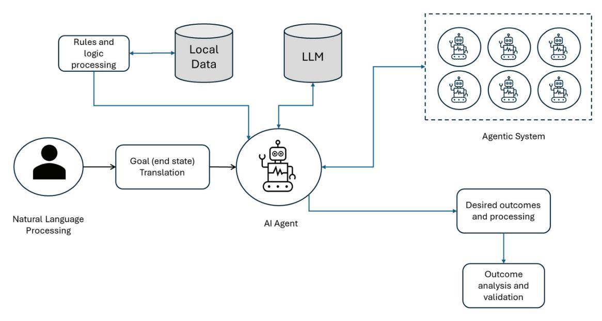
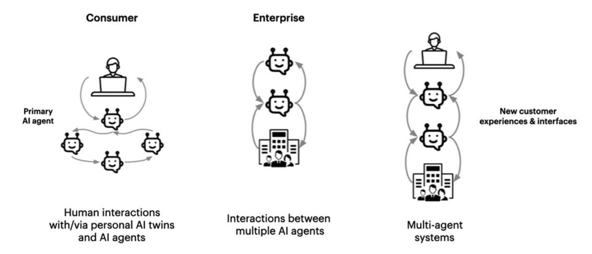
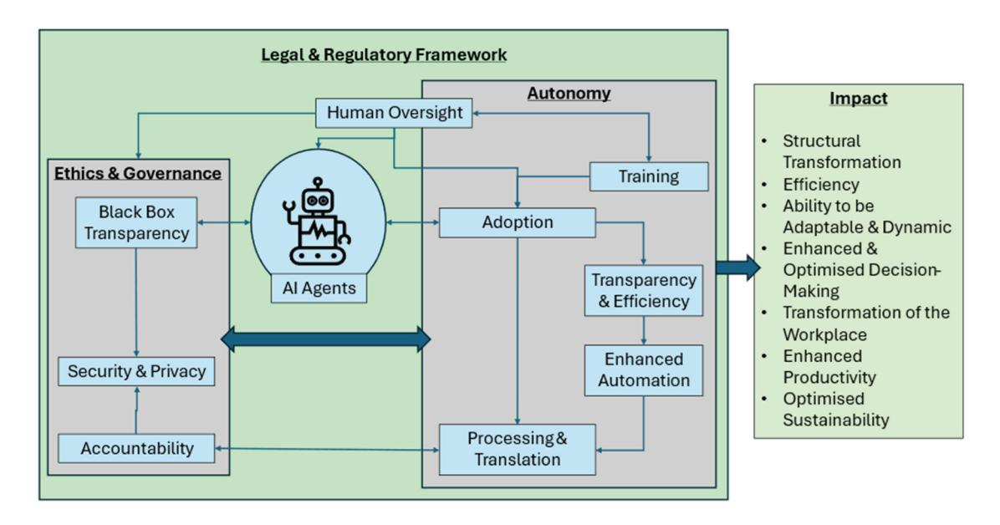

# **Journal of Computer Information Systems**

**ISSN: 0887-4417 (Print) 2380-2057 (Online) Journal homepage: [www.tandfonline.com/journals/ucis20](https://www.tandfonline.com/journals/ucis20?src=pdf)**

# **AI Agents and Agentic Systems: A Multi-Expert Analysis**

**Laurie Hughes , Yogesh K. Dwivedi , Tegwen Malik , Mazen Shawosh , Mousa Ahmed Albashrawi , Il Jeon , Vincent Dutot , Mandanna Appanderanda , Tom Crick , Rahul De' , Mark Fenwick , Senali Madugoda Gunaratnege , Paulius Jurcys , Arpan Kumar Kar , Nir Kshetri , Keyao Li , Sashah Mutasa , Spyridon Samothrakis , Michael Wade & Paul Walton**

**To cite this article:** Laurie Hughes , Yogesh K. Dwivedi , Tegwen Malik , Mazen Shawosh , Mousa Ahmed Albashrawi , Il Jeon , Vincent Dutot , Mandanna Appanderanda , Tom Crick , Rahul De' , Mark Fenwick , Senali Madugoda Gunaratnege , Paulius Jurcys , Arpan Kumar Kar , Nir Kshetri , Keyao Li , Sashah Mutasa , Spyridon Samothrakis , Michael Wade & Paul Walton (2025) AI Agents and Agentic Systems: A Multi-Expert Analysis, Journal of Computer Information Systems, 65:4, 489-517, DOI: [10.1080/08874417.2025.2483832](https://www.tandfonline.com/action/showCitFormats?doi=10.1080/08874417.2025.2483832)

**To link to this article:** <https://doi.org/10.1080/08874417.2025.2483832>

| Published online: 24 Apr 2025.           |
|------------------------------------------|
| Submit your article to this journal      |
| Article views: 9020                      |
| View related articles                    |
| View Crossmark data                      |
| Citing articles: 65 View citing articles |

# Al Agents and Agentic Systems: A Multi-Expert Analysis

Laurie Hughesa, Yogesh K. Dwivedib,c, Tegwen Malikd, Mazen Shawoshb,c, Mousa Ahmed Albashrawib,c, Il Jeone, Vincent Dutotf, Mandanna Appanderandag, Tom Crickh, Rahul Def, Mark Fenwickl, Senali Madugoda Gunaratnegea, Paulius Jurcysk, Arpan Kumar Karl, Nir Kshetrim, Keyao Lia, Sashah Mutasaa, Spyridon Samothrakisn, Michael Wadeo, and Paul Waltonp

aSchool of Business and Law, Edith Cowan University, Joondalup, Australia; bISOM Department, KFUPM Business School, King Fahd University of Petroleum & Minerals, Dhahran, Saudi Arabia; cIRC for Finance and Digital Economy, King Fahd University of Petroleum and Minerals (KFUPM), Dhahran, Saudi Arabia; dDigital Futures for Sustainable Business & Society Research Group, School of Management, Swansea University Bay Campus, Wales, UK; eDepartment of Nano Engineering and Department of Nano Science and Technology, SKKU Advanced Institute of Nanotechnology (SAINT), Sungkyunkwan University (SKKU), Suwon, Republic of Korea; fMétis Lab, EM Normandie, Paris, France; gInfosys Limited, Bengaluru, India; hSchool of Education, Swansea University, Swansea, UK; †Indian Institute of Management Bangalore, Bangalore, India; jFaculty of Law, Kyushu University, Fukuoka, Japan; kVilnius University Law Faculty, Vilnius, Lithuania; iSchool of Artificial Intelligence, Indian Institute of Technology Delhi, New Delhi, India; mBryan School of Business and Economics, The University of North Carolina at Greensboro, USA; nInstitute for Analytics and Data Science, University of Essex, UK; oTONOMUS Global Center for Digital and Al Transformation, IMD Business School, Lausanne, Switzerland; pCapgemini, Surrey, UK

### **ABSTRACT**

The emergence of AI agents and agentic systems represents a significant milestone in artificial intelligence, enabling autonomous systems to operate, learn, and collaborate in complex environments with minimal human intervention. This paper, drawing on multi-expert perspectives, examines the potential of AI agents and agentic systems to reshape industries by decentralizing decision-making, redefining organizational structures, and enhancing cross-functional collaboration. Specific applications include healthcare systems capable of creating adaptive treatment plans, supply chain agents that predict and address disruptions in real-time, and business process automation that reallocates tasks from humans to AI, improving efficiency and innovation. However, the integration of these systems raises critical challenges, including issues of attribution and shared accountability in decision-making, compatibility with legacy systems, and addressing biases in AI-driven processes. The paper concludes that while agentic systems hold immense promise, robust governance frameworks, cross-industry collaboration, and interdisciplinary research into ethical design are essential. Future research should explore adaptive workforce reskilling strategies, transparent accountability mechanisms, and energy-efficient deployment models to ensure ethical and scalable implementation.

### **KEYWORDS**

Al agents; agentic Al; agentic system; autonomous agent; cognitive agent; intelligent agent; OpenAl operator; smart agent; virtual assistant

### Introduction

The recently announced \$500 billion investment in the Stargate Project from technical partners: Arm, Microsoft, NVIDIA, Oracle, and OpenAI, supported by the US government to build new AI infrastructure and capability, highlights the significant resources allocated to artificial intelligence (AI) technology. AI technology is evolving at breakneck speed, offering transformational capabilities to organizations looking to deliver greater levels of efficiency and automation. The emergence of AI agents marks a significant milestone in the development of AI technology characterized by autonomous, self-learning technology that combines advanced reasoning capabilities with the ability to act independently in dynamic environments. Nvidia's Jenson Huang revealed at CES 2025 a vision for AI agents declaring that the

technology is a "multi-trillion-dollar" opportunity.2 The recent launch of the Chinese AI agent-Manus and announcement in the US of OpenAIs new AI agent -"Operator," illustrates the rapid transformative progress in this space.3,4 Operator is driven by a new model called Computer-Using Agent (CUA), which integrates GPT-40 with enhanced reasoning through reinforcement learning.3 The CIO of Goldman Sachs has stated that companies at the forefront of technology will begin to use AI agents as if they were employees, where organizations will hire and train AI agents to be part of hybrid human-AI teams.5 Unlike traditional AI, which operates within the confines of predefined rules, AI agents are empowered by large language models (LLMs) and other AI frameworks that are capable of interacting, reasoning, and adapting in real-time to achieve specific goals

autonomously. These systems can engage in natural language communication, collaborate with other agents, and make autonomous decisions that enable them to execute complex workflows without constant human oversight.[6](#page-26-5)[,7](#page-26-6)  The potential of AI agents to transform industries is profound, offering innovative solutions to problems across diverse sectors, from business process automation to smart city management.[8,](#page-26-7)[9](#page-26-8) OpenAI estimates that \$175 billion in global capital is ready to be invested in AIrelated projects and infrastructure, emphasizing the need for significant expansion through strategic partnerships. This investment is particularly crucial for the development and deployment of AI agents, which require advanced infrastructure to function autonomously and efficiently.[10](#page-26-9) Deloitte's Technology, Media & Telecommunications (TMT) 2025 predictions report underscores the growing importance of AI agents in the coming years, projecting that 50% of the organizations currently using generative AI (GenAI) will implement AI agents by 2027.[11](#page-26-10)

As organizations pursue higher levels of automation, the adoption and integration of AI agents and agentic systems hold considerable potential for business transformation. These systems can automate complex tasks, improve decision-making processes, and facilitate collaboration among human workers and digital agents, potentially reshaping business operations across sectors.[12](#page-26-11) As AI agents enhance in capability, speed, and cost-efficiency, it may become more feasible and competitive to shift tasks traditionally performed by humans to AI agents.[13](#page-26-12)[,14](#page-26-13) The rapid growth in the development and deployment of these agents could result in their widespread use across commercial, scientific, governmental, and personal domains.[15](#page-26-14) For example, in industries such as healthcare, agentic systems can not only analyze patient data but also generate treatment plans and coordinate care among medical teams, enhancing both efficiency and patient outcomes.[16](#page-26-15) In the field of business process automation, agentic systems can automate end-to-end workflows, from employee onboarding to supply chain management, adapting in real-time to disruptions and continuously optimizing operations.[9](#page-26-8) In supply chain management, AI agents can autonomously identify bottlenecks, predict future demand based on real-time data, and adjust supply chain operations accordingly. This level of automation not only reduces human error but also empowers organizations to adapt quickly to market changes. In customer service, intelligent agents can handle queries, resolve issues, and even engage in complex negotiations, all while learning from each interaction to improve service quality. In contrast to simpler architectures, AI agents are capable of generating high-quality content, decrease review cycle times by as much as 60%, navigate across multiple systems and synthesize data gathered from various sources.[7](#page-26-6) The continuous learning capabilities of these systems enable them to offer tailored solutions that evolve alongside customer needs, fostering deeper customer relationships based on pre-defined outcome-focused goals. Through the integration of reasoning, planning, and execution, AI agents represent a bridge between content generation and action-based execution, contributing to both business process automation and intelligent decision-making.

However, the adoption of AI agents presents several challenges, particularly around issues of trust, ethical concerns, accountability in the event of failure, and the integration of these systems into existing organizational structures. As these systems begin to assume more complex roles, questions arise regarding their culpability, transparency, and potential biases. Trust in the decisions made by AI agents, especially in critical areas like healthcare or financial decision-making, is a key concern[.6](#page-26-5)[,17](#page-26-16) Moreover, the introduction of these systems could lead to significant shifts in the workforce, requiring new skill sets and redefining traditional roles that rely on manual decisionmaking or routine processing[.18,](#page-26-17)[19](#page-26-18) Most organizations have legacy systems that are not built to interact with cutting-edge AI technologies. The integration process is likely to require significant investments in system upgrades, data cleaning, and cross-functional collaboration. Moreover, aligning AI-driven decisions with the values and objectives of the organization, while maintaining human oversight where necessary—will require organizations to carefully define the boundaries of automation and establish mechanisms for continual feedback and improvement to retain confidence in an agent focused decision-making context[.20](#page-26-19)[,21](#page-26-20) Organizations will need to address these challenges by developing robust frameworks for ethical AI use, ensuring transparent decision-making processes, and investing in workforce reskilling to foster collaboration between humans and intelligent agents.

Whilst the academic literature has developed an emerging discourse on the continued widespread adoption of GenAI, detailing the transformation impact, trust, and ethical dilemmas on many aspects of industry and society,[22](#page-26-21)[–24](#page-27-0) the topic of AI agents is relatively unexplored. Researchers have yet to analyze AI agents in the context of their autonomous decision-making capabilities, ethical and trust considerations, impact on the workforce, governance, and the complex challenges organizations face when integrating these systems into existing structures. This gap in the academic discourse has led to a reliance on practice-based sources such as

**Table 1.** Contributors and section titles.

| Sec # | Title                                                                       | Contributors                                         |
|-------|-----------------------------------------------------------------------------|------------------------------------------------------|
|       | Title, Abstract, Keywords                                                   | Lead Authors                                         |
| 1.    | Introduction                                                                | Lead Authors                                         |
| 2.    | Background to Agentic Systems                                               | Lead Authors                                         |
| 3.    | Overview of Expert Contributions                                            | Lead Authors                                         |
| 3.1.  | Contribution 1: Aspects of Agency in AI                                     | Rahul De' & Mandanna Appanderanda                    |
| 3.2.  | Contribution 2: Redefining Industry Structures and Business Processes       | Arpan Kar                                            |
| 3.3.  | Contribution 3: Transformation of Employment Landscapes and Evolving Skills | Spyros Samothrakis                                   |
| 3.4.  | Contribution 4: Leadership, Decision-Making, and Workplace Culture          | Keyao Li, Senali Madugoda Gunaratnege, Sashah Mutasa |
| 3.5.  | Contribution 5: Long-Term Industry Transformation and Economic Impacts      | Nir Kshetri                                          |
| 3.6.  | Contribution 6: Sustainability Factors and Environmental Impact             | Michael Wade                                         |
| 3.7.  | Contribution 7: Governance and Control                                      | Paul Walton                                          |
| 3.8.  | Contribution 8: Legal Implications of Agentic Systems                       | Mark Fenwick and Paulius Jurcys                      |
| 3.9.  | Contribution 9: Societal Trust and Information Integrity                    | Tom Crick                                            |
| 4.    | Discussion                                                                  | Lead Authors                                         |
| 5.    | Conclusion                                                                  | Lead authors                                         |
|       | References and Formatting                                                   | Lead Authors                                         |

McKinsey, IBM, and Gartner Group, and content creators such as Medium and Rundown AI for comment and background on the role and impact of AI agents on organizations and existing decision making. As AI agents continue to evolve, understanding their role in shaping business practices, societal interactions, and workforce dynamics will become increasingly critical for researchers and practitioners alike.

Recognizing the significant potential impact of AI agent-related technologies, this study aims to bridge this gap within the literature by offering much needed perspective on a range of AI agent-related topics. In alignment with previous studies that have discussed emerging technology focused topics and their impact on organizations,[22,](#page-26-21)[25](#page-27-1) this editorial adopts an expert perspective approach. [Table 1](#page-3-0) details the list of contributions outlining the article structure and individual topics. The contributors were selected from industry and academia via an expert sampling approach. This entailed the deliberate selection of participants based on their recognized expertise of the topic. This approach ensures that the contributor perspectives are highly informed, provide deep, specialized insights and due to their extensive knowledge and experience, contributions can help uncover subtle trends, challenges, and opportunities that might ordinarily be overlooked.

The next section presents a background to AI agents and agentic systems where we offer a definition of this new technology. The subsequent sections discuss the individual perspectives regarding the impact of AI agents and agentic systems on existing practice, detailing the many challenges and decision-making implications. The Discussion section presents a synthesis of the expert contributions where we compare and contrast the expert views with the existing literature and present a framework that offers additional perspective. Subsequent sections outline a proposed research agenda and detail the implications for practice. The paper is concluded in the final section.

# **Background to AI agents and agentic systems** *Evolution of AI agents*

Agency in the context of AI refers to the extent to which an AI system can independently act in the world to achieve long-term goals, requiring minimal human intervention or detailed instructions on how to carry out those actions.[26](#page-27-2) The term "AI agent" has been referenced extensively in the literature. Early research by Castelfranchi[26](#page-27-2) examined AI agents from a cognitive perspective, highlighting their goal-oriented and autonomous characteristics. Similarly, the terms "autonomous agents" and "intelligent agents" have been widely used to describe AI systems that function independently of human intervention to perform key organizational tasks.[27](#page-27-3)[,28](#page-27-4) AI agents are also recognized for their ability to adapt to dynamic environments and collaborate with other agents or humans.[15](#page-26-14)

The early phase of AI, which was based on deterministic algorithms, had limitations in flexibility and adaptability. The introduction of GenAI models, such as GPT-4, marked a significant breakthrough in content creation by enabling machines to generate coherent text, images, and code based on LLM architectures. However, GenAI systems typically operate in isolation, producing outputs without the ability to act upon them or collaborate with other systems.[29](#page-27-5) In contrast, AI agent-based systems integrate the generative capabilities of GenAI

with autonomous decision-making and execution, enabling interaction with their environments, collaboration with other agents, and continuous refinement of actions based on feedback.[29](#page-27-5)[–31](#page-27-6) The key transformational differentiator of AI agent technology is its ability to autonomously make goal-oriented decisions, adapt to dynamic environments, and collaborate with other agents or humans, thereby driving efficiency, innovation, and scalability across industries. While AI agents are an extension of GenAI, models like GPT-4, despite excelling in content creation, do not autonomously execute the actions required to implement the solutions they generate. AI agents combine generative capabilities with the ability to act on outputs, autonomously performing tasks, collaborating across systems, and optimizing operations.[6,](#page-26-5)[7](#page-26-6) These systems excelled at generating coherent and contextually relevant outputs, but they typically operated in isolation, generating content without the ability to act on those outputs or collaborate with other systems.[29](#page-27-5) This limitation confined them to tasks that required content generation rather than real-time decision-making or execution based on generated outputs.

The development of AI agents represents a further leap, integrating reasoning, planning, and execution with GenAI's generative capabilities. AI agents can interact with their environments, collaborate with other agents, and adapt their actions based on feedback. Unlike earlier systems, AI agents are characterized by their autonomy, ability to learn from experiences, and capacity for coordination, enabling them to handle complex and dynamic tasks.[9](#page-26-8)[,16](#page-26-15) These systems do more than just generate content—they autonomously execute actions, refine strategies, and collaborate in real-time. Compared to traditional AI and GenAI, AI agents offer superior functionality, adaptability, and operational independence. Traditional AI is focused on predefined tasks and is limited by its rigid, rule-based structure, which hinders its ability to adapt to new situations or learn from feedback. For example, a chessplaying AI is optimized only for the rules of chess and cannot extend its capabilities to other domains. GenAI, while powerful in content generation, operates in isolation, producing outputs without taking action or collaborating on their execution. For instance, a GenAI system that creates marketing copy requires human intervention for implementation. In contrast, AI agents combine generative capabilities with reasoning, decision-making, and execution. These systems can operate autonomously within dynamic environments, adjusting in realtime and collaborating effectively. For instance, an AI agent could not only generate a marketing campaign but also deploy it, monitor its performance, and adjust strategies based on live data and feedback.[7](#page-26-6),[30](#page-27-7) Ultimately, AI agents bridge the gap between content creation and autonomous execution, positioning them as a more advanced subset of AI that mimics human-like agency and reasoning in complex, real-world scenarios.

### *AI agent and agentic systems definition*

The concept of AI agents is defined by several interrelated capabilities that enable autonomous, intelligent systems to operate effectively across a range of tasks and environments. One of the defining features of such systems is their autonomy, which allows them to make decisions and take actions independently without constant human intervention. This autonomy is critical to their function, as it empowers them to operate continuously and efficiently, even in complex, dynamic settings[.6,](#page-26-5)[30](#page-27-7) Another important aspect of agentic AI is hierarchical reasoning, which involves employing modular frameworks to tackle tasks that require both highlevel planning and real-time execution. This capability is exemplified in systems like Hierarchical Language Agents,[15](#page-26-14) where the agent can manage multiple levels of decision-making, from strategic planning to the detailed execution of tasks, allowing it to handle complex scenarios effectively. In addition to these features, adaptability is a key attribute of agentic systems. These systems are designed to learn from their experiences, refine their decision-making processes, and respond to feedback in order to improve performance in everchanging environments. This adaptability enables them to handle unforeseen situations and continuously evolve their strategies to better meet their goals.[32](#page-27-8)

Russell and Norvig[26](#page-27-2) define an intelligent agent as an entity that perceives its environment through interactions with its environment, able to sense, reason and act purposefully to maximize its performance. Agency is closely linked with autonomy—the degree that an entity can operate without human intervention, driven by internal states rather than external commands or programming[.28](#page-27-4) The literature has utilized a number of definitions to describe AI agents. Chan et al.[24](#page-27-0)  described agents as AI systems that can independently operate in the real world to achieve long-term objectives, with minimal human intervention or explicit instructions on how to accomplish these tasks. They further define AI agents as the extent to which the system's actions are defined, the extent to which its

actions are focused on achieving specific goals, the level of direct influence the system has on the world, and the system's ability to accomplish objectives over extended periods of time.[32](#page-27-8) Ruan et al.[32](#page-27-8) defines AI agents as a program that employs AI techniques to perform tasks that typically require human-like intelligence. These tasks include reasoning, decision-making, problem-solving, learning from experience, and interacting with the environment in ways that mimic human actions.[33](#page-27-9) Numerous studies reference the goaloriented nature of AI agents, emphasizing their capacity to autonomously pursue specific objectives by processing data, making decisions, and executing actions in alignment with predefined goals.[6,](#page-26-5)[16](#page-26-15)[,34](#page-27-10) The study by Baird and Maruping[35](#page-27-11) also referenced the goal aspect of AI agents and suggested that AI agents are increasingly tasked with managing activities that involve unclear requirements and are responsible for pursuing the best possible outcomes in uncertain situations. Based on these AI agent led discussions within the literature, we define AI agents as:

AI agents are autonomous technologies, designed to perform tasks, make decisions, and interact with their environment to achieve specific predefined goals, with minimal human intervention.

Generally, the literature tends not to differentiate between agentic AI and AI agents, where articles seem to use the terms interchangeably.[7,](#page-26-6)[15](#page-26-14) The term "agentic systems" is more widely referenced in the practice-based literature, where articles use this term and the term AI agents interchangeably or offer a variation in meaning based on complexity and scale.[36](#page-27-12)[–39](#page-27-13) Consequently, the addition of the term "system" in "agentic systems" denotes a more complex and interconnected network that possess enhanced capabilities when compared to stand alone AI agents. The practice-based literature also references variations on the AI agent theme, for example, vertical AI agents,[40](#page-27-14) denoting an AI agent-based structure, but tailored for specific contexts, industries or business functions, such as legal, healthcare, or supply chain[.41](#page-27-15) This study follows the complexity mantra where we use the AI agent term to denote a single agent entity and agentic system to denote a more complex interconnected structure that performs specific business functions.

### *AI agent architectural model*

Agentic systems present a significant improvement in collaborative functionality, overcoming the limitations of isolated systems by enabling multiple agents to work together. This collaboration is enhanced by the ability to leverage external data sources or tools, allowing the system to tackle problems that would be difficult for a single agent to solve alone. By working in coordination, agentic systems can collectively solve more complex problems and achieve higher efficiency.[7](#page-26-6)[,29](#page-27-5)

[Figure 1](#page-5-0) depicts a proposed AI agent and agentic system architecture and model illustrating the components and flow of data within the system. The model includes a goal translation component, which takes the high-level goals of the system and translates them into actionable tasks, ensuring that the AI agent's actions

**Figure 1.** AI agent architecture.

align with the user-defined objectives in making decisions and determining the steps needed to reach those outcomes. The AI agent relies on rules and logic processing to structure decision-making and ensure that actions are taken within a framework, allowing the AI agent to operate autonomously and rationally within the goal orientated constraints.

The model depicts the use of LLM and local data to provide the relevant information to inform decisions and adapt the agent's actions to changing conditions. The model includes an interface to an agentic system network that depicts the AI agent forming part of a wider agent network that would perform a range of interdependent autonomous functions within the organization.[7](#page-26-6)[,29](#page-27-5) The outcome analysis function ensures that the outcomes of the AI agent processing are validated against the defined goals. This function could be human based but could also be agent led where the outcomes are assessed and validated.

### **Overview of expert contributions**

The impact from AI agents is discussed in each of the contribution sections. [Table 2](#page-7-0) presents the key highlights and areas of focus of each of the expert contributions.

# **Contribution 1: Aspects of agency in AI – Rahul De' & Mandanna Appanderanda**

Agentic systems, with autonomy, reasoning, and learning capabilities are the very definition of AI.[42](#page-27-16) As there is a resurgence in agentic AI, we delve into some issues of particular concern for developers and users of systems. We distinguish developers, those who build, integrate, and manage AI systems, and users, those who deploy them for their own or for their customers' use. This distinction is important as it reflects different priorities and policies for such systems.

Agency of AI systems is defined as 'the ability to act.'[43](#page-27-17) As agentic AI is deployed by both developers and users, the questions of agency arise, leading to aspects of delegation, collaboration, responsibility, and accountability. Agency is not a binary concept, in the sense that entities have agency or not, it is multi-dimensional, defining a range of agencies attributable to systems, and humans. For example, a system that makes autonomous decisions for users may not have full agency to do so, where the different aspects of decisions may have been defined by prior design and methods of training, by the developers, and by the conditions of use by the clients. We highlight a few issues of agency from the perspective of developers and users, in different domains.

### *Bias*

An agentic system handling a transaction may not appear to have any bias with respect to that specific transaction, but when overlapped with multiple transactions, traces of bias may appear. For example, one system designed for loan approvals showed no bias when assessed independently for gender or race. But when groups were compared across output decisions, approvals for Asian males was high compared to Black males. In agentic systems such biases will go unnoticed unless retrospective monitoring and processing is done on all decisions collectively. Both developers and users have to monitor systemic responses, to expose hidden biases.

# *Security vulnerabilities*

AI agents can be susceptible to adversarial attacks. By using techniques of prompt injection or jailbreak, rogue actors can replicate approvals or rejections within transactions, leading to unexpected behaviors. Also, adversarial attackers may be able to poison the memory of the AI system, eventually leading to larger AI risks. For example, an AI agent managing a smart home system could be tricked by manipulated voice commands to unlock doors or disable security systems, posing significant security risks. In such a situation the responsibility of the vulnerability can be potentially attributed to the system designers, the homeowners, and also the agentic software, based on a concept of shared agency.

### *Data privacy*

Training of AI agents often requires access to large datasets, which can include sensitive personal information. A healthcare AI agent that accesses patient records to provide medical recommendations must ensure that this data is protected from unauthorized access and breaches, and is also available legally, as defined by the region in which it is being used. As developers may build healthcare agents in multiple regions around the world, with different local laws, they must be conscious of the laws of the user's region, where the system will be deployed. Agency calculations must include aspects of multiple regulations and laws pertaining to data privacy.

| <b>TIL</b> 0 | c           |            |           |           |
|--------------|-------------|------------|-----------|-----------|
| Table 2.     | Contributor | nianliants | and areas | of focus. |

| Contribution                                                                      | Key Focus Areas                                                                                   | Highlights                                                                                                                                                                                                                                                                                                                                                                                                                                               |
|-----------------------------------------------------------------------------------|---------------------------------------------------------------------------------------------------|----------------------------------------------------------------------------------------------------------------------------------------------------------------------------------------------------------------------------------------------------------------------------------------------------------------------------------------------------------------------------------------------------------------------------------------------------------|
| Contribution 1: Aspects of Agency in Al                                           | Definition, Bias, Security, Privacy, Transparency, Environmental Impact, Shared Responsibility | <ul> <li>Al agency is multi-dimensional, involving developers, users, and systems.</li> <li>Key concerns: bias, security vulnerabilities, and data privacy.</li> <li>Shared responsibility for transparency, accountability, and oversight.</li> <li>Energy consumption raises sustainability issues.</li> <li>Research needs: shared agency, limiting liabilities, and</li> </ul>                                                                       |
| Contribution 2: Redefining Industry Structures and Business Processes          | Organizational Restructuring, Process Automation, Industry Impact                              | <ul> <li>bias mitigation.</li> <li>GAIAS reduces managerial roles, creates flatter hierarchies, and enables dynamic teams.</li> <li>Decision-making becomes faster and decentralized.</li> <li>Reduces search, agency, and coordination costs across industries.</li> <li>Requires teams for ethical oversight, bias mitigation, and compliance.</li> <li>Research: Impacts of GAIAS on structures and interconstituted potagonal potagonals.</li> </ul> |
| Contribution 3: Transformation of Employment Landscapes and Evolving Skills | Employment Displacement, New Skills, Failure Modes                                             | organizational networks.  Agentic systems could automate repetitive and mid-level roles, demanding workforce reskilling.  Failure modes include lack of embodied cognition and compositional reasoning.  Workers must adapt to interacting with and guiding Al systems ("herding agents").  Research: Benchmarking Al failures and studying long-                                                                                                        |
| Contribution 4: Leadership, Decision- Making, and Workplace Culture            | Leadership Challenges, Collaboration, Workplace Transformation                                 | <ul> <li>term job transformations.</li> <li>Al agents streamline decisions, but leaders must manage ethical/cultural impacts.</li> <li>Fosters decentralized decision-making and flexible, collaborative team dynamics.</li> <li>Risk of eroding workplace culture and social connections.</li> <li>Research: Cultural integration, social/psychological</li> </ul>                                                                                      |
| Contribution 5: Long-Term Industry Transformation and Economic Impacts         | Industry Adoption, Productivity, Economic Impacts                                                 | <ul> <li>impacts, and hybrid team leadership.</li> <li>Agentic Al addresses adoption barriers like bias, hallucinations, and transparency.</li> <li>Neuro-symbolic Al fosters trust through explainable decision-making.</li> <li>Enhances productivity via deeper automation (e.g., IT security threat mitigation).</li> <li>Research: Productivity gains and cross-industry compar-</li> </ul>                                                         |
| Contribution 6: Sustainability Factors and Environmental Impact                | Environmental Sustainability, Energy Efficiency                                                   | <ul> <li>isons of Al mechanisms.</li> <li>Al agents can optimize resources and prioritize environmental goals in decision-making.</li> <li>Training/deployment requires significant energy, raising sustainability concerns.</li> <li>Advocates for renewable energy, smaller models, and multi-agent systems.</li> <li>Research: Metrics for environmental impact and frame-</li> </ul>                                                                 |
| Contribution 7: Governance and Control                                            | Governance Frameworks, Risk Mitigation, Ethical Oversight                                      | <ul> <li>works for sustainable Al design.</li> <li>Governance focuses on decision-making oversight, accountability, and handling exceptions.</li> <li>Challenges include fast-paced decisions, interconnected agent complexity, and autonomous software development.</li> <li>Research: Models for integrating agentic systems into governance frameworks and automating governance</li> </ul>                                                           |
| Contribution 8: Legal Implications of Agentic Systems                          | Liability, Legal Personhood, IP Ownership, Privacy                                             | <ul> <li>reliably.</li> <li>Challenges in assigning liability for autonomous decisions; proposes limited legal personhood for Al.</li> <li>IP frameworks need adaptation for Al-generated works.</li> <li>Privacy-by-design and global cooperation on data protection standards are critical.</li> <li>Research: Interdisciplinary collaboration to address legal, ethical, and IP challenges.</li> </ul>                                                |
| Contribution 9: Societal Trust and Information Integrity                       | Transparency, Bias Mitigation, Public Engagement                                               | <ul> <li>Trust in agentic systems depends on transparency, ethical use, and civic engagement.</li> <li>Risks: Algorithmic biases, decision opacity, and erosion of public confidence.</li> <li>Public education on Al literacy is essential to foster trust and informed decision-making.</li> <li>Research: Longitudinal studies on trust evolution and codesigned societal frameworks.</li> </ul>                                                      |

# *Transparency and explainability*

AI agents often operate as "black boxes," making it difficult to understand their decision-making processes. For example, a financial AI agent that approves or denies loan applications may not provide clear reasons for its decisions, leaving applicants in the dark. This puts the onus on developers to provide some explanations of the outputs, and on the client to ensure applicants are advised and guided on system use. Agency for providing rationales and endorsement of decisions of the system are shared between the developers, the clients, and the applicants.

# *Environmental impact*

Training and deploying AI agents require substantial computational resources, contributing to energy consumption and carbon emissions. The environmental cost is attributable to both training large models, and their subsequent use. As deployment of agentic AI becomes more prevalent, there will be a need for accountability and control. Aspects of agency will play a role in oversight and monitoring of AI.

### *Research agenda*

In the context of the issues related to developers and users of agentic AI, several research issues emerge that require deeper analysis.

- (1) There is a need to understand sharing of agency between developers, users, and AI systems. Extending prior work,[35](#page-27-11)[,43](#page-27-17) the concepts of delegation and agency must be understood in the light of highly complex, enterprise-scale agentic AI systems.
- (2) Developers typically face warranty demands from users, whereas the norm in software models is to provide no or very limited warranties. Developers and integrators are `stuck in the middle,' of having to provide assurances and indemnity from harmful decisions by the AI. There is a need to develop theory about limiting warranties and liabilities for both developers and users of agentic AI.

# **Contribution 2: Redefining industry structures and business processes—Arpan Kar**

In AI literature, there has been a lot of deliberation surrounding the role of AI in decision automation versus decision augmentation. It has been established that for many of the deep learning based complex AI models, typically the system outcomes were better for decision augmentation where there was a human intervention. For example, there was evidence in the space of computer vision for detecting defects in materials in factory process automation, where a human agent in symbiosis with AI had better outcomes in predicting different types of defects than either a solo acting human agent or a completely automated AI driven process. Reasons for better outcomes were typically attributed toward different factors like lack of critical thinking capabilities and adaptivity of these systems. GenAI enhances information processing capabilities through ecosystem sensing, natural language processing and natural language generation[.44](#page-27-18)

Generative AI driven Agentic Systems (GAIAS) are expected to have unique functional affordances due to the specific features they are likely to possess, up and beyond what AI or GenAI can provide. Extending LLMs in GenAI[44](#page-27-18) by including decision making capabilities and action generation, these technologies will demonstrate autonomy, objective oriented behavior, environment scanning capabilities, flexibility and adaptability to changes, reasoning capabilities, natural language comprehension and generation, and the ability to interact with other systems to undertake complex logical tasks even involving automated decision making with minimal human oversight while adapting to dynamic environments. These systems could operate both within firms to automate internal business processes as well as in online platforms on which multiple organizations are connected as business networks.

# *Impact within firms*

Within firms, we envision the role of agentic systems to enhance decision automation in a massive way. This may largely reduce managerial intervention thereby reducing the need for middle management. Activities like process monitoring could potentially be enabled by agentic systems in a very effective manner. GAIAS could enable movement toward automation in complex industrial processes which may affect industry structures as well. Automation using LLMs has already been achieved for many industrial processes like marketing automation and query resolution.[45](#page-27-19) Within firms, this process automation would implicate lower needs for manpower for not only repetitive work but also processes which require decision making based on structured and unstructured data. Further, human intervention and hence the need for managerial input would also be expected. Within an organization, this would mean not only reduction of workforce, but also reduction of hierarchies due to reduced needs of supervision across different levels of the firm. Some roles may have completely digital managers, where the scope of work is rather structured. The hierarchies within organizations which start adopting GAIAS would likely become flatter. Decision-making becomes faster, coordination costs would be reduced, agency problems would be lower and organizations may shift toward flatter structures with fewer layers with increased agility. Further, we envision organization structures to become more fluid beyond the functional silos. GAIAS could enable dynamic team formation based on organizational needs, project load on individual contributors and skills needed for fulfilling project deliverables. GAIAS can match employees to tasks, monitor free time and load on team members, encouraging cross-functional and project-based teams rather than static functional departments with higher agility. Therefore, skill requirements within organizations would evolve quickly with increasing needs for professionals who could be individual contributors and have deep skill in knowledge intensive areas rather than for generalists. Decision making is also likely to become decentralized and faster with GAIAS generated nudges based on multiple sources of data, when human decision augmentation is needed. However, organizations adopting GAIAS need dedicated teams to oversee ethics, fairness, bias mitigation, regulatory compliance, and transparent use of GAIAS.

### *Impact across industries*

GAIAS systems can be deployed in digital platforms and in inter-organizational information systems. The impact on the platforms and industries can be viewed effectively through the lens of transaction cost economics. From the lens of transaction cost economics, we envision that the adoption of GAIAS in digital platforms which are industry aligned to impact search costs, agency costs, and coordination costs[.46](#page-27-20) Because GAIAS are intelligent, they can significantly reduce search costs and automate the process of searching for a suitable supplier of product or service in these platforms once a requirement is documented. The platforms may also create mechanisms to generate elaborate documentation of requirements based on prompts and connect buyers and suppliers effectively based on fitment, after automatically analyzing a very diverse set of criteria for prequalification on both sides automatically. Further, GAIAS will enable reduction of agency costs as recommendation of transactable relationships will be made based on actual data, and non-relationship specific deviations (like corruption in purchase processes) may be lowered significantly. The systems could prompt decision makers for selection of partners in online purchases and generate detailed synopsis of past transactions, experiences and capability specific information. Further we envision GAIAS would significantly reduce coordination costs if a firm ends up contracting with multiple vendors or service providers. It could automatically oversee contract enforcement and help in creating smart contracts along with technologies like blockchain. This may reduce coordination between multi-party agreements and how the parties fulfill obligations through smart prompts and technology enforced monitoring. Further the use of GAIAS is expected to increase industry concentration because the platform creators and key players are expected to control the data and flow of information. These organizations would generate above-average profits and dominate networks that encompass the majority of customers within the industry.

### *Research directions*

We envision GAIAS would automate and impact the way organizations create managerial supervision through organization structures. While overall structures may become flatter, it would be useful to study how GAIAS adoption would impact individual firms in terms of organization structure to enhance firm productivity. Further GAIAS may enable automation of interactions and policy implementation in large networks. It would be good to study how GAIAS adoption could enhance agility and resilience of firms operating in large networks. The exploration of how teams could use GAIAS in organizations to collaborate with other teams across other organizations through interorganization information systems would also be a useful research direction. Further research could study how GAIAS would impact industry structure and concentration, along with influence on industry productivity and impact on other firms in industry.

# **Contribution 3: Transformation of employment landscapes and evolving skills—Spyros Samothrakis**

### *Perspective*

Speculating on the employment impact of a future technology is hard because one has to perform some kind of out-of-distribution prediction. No society has undergone the changes this new technology is going to bring, nor have we seen this technology in action. Thus, in the best case, what one can do is use analogies with events that have already taken place. The promise of agentic technologies is that they have the potential to automate a large part of the everyday drudgery that information and knowledge workers have been performing in a modern corporate setting. Thus, one can draw an analogy with the proliferation of computeraided design (CAD) use by mechanical engineers; quoting Manske and Wolf[47](#page-27-21) "the traditional three-way task split into design, detail design and draftsmen is developing toward a two-way split into design and draftsmen." The detail designers were no longer needed, as the implementation details started being automatically generated by machines.

The idea of removing the implementation layer of programs is not new and can be traced back to the history of programming languages, with visual programming[48](#page-27-22) being the historical apex of this line of thinking. The goal has always been to ignore details and focus on communicating the overall abstract task, as if describing the task to another human. One can expect to give very high-level instructions to another human (e.g. "remove my friend Tim from this image") and expect them to be followed, with reasonable defaults filling in any gaps and some back-and-forth to fill any necessary details. Successful agentic systems promise to replicate this procedure and replace low-level interaction with high level instructions. One can also think of agentic systems as very high-level compilers, that take humanreadable language as input and transform it to precise machine instructions. If they are successful, one can then attempt to circumvent/automate all "detailed" programming jobs and focus on the big picture.

What could it potentially look like to be an operator of such a system; unlike programming, dealing with agents that have the capacity to act at the level envisioned by agentic systems would be more like herding, with users manipulating and correcting their agents in a virtual environment until certain results are achieved. The analogies with CAD and herding would require a level of sophistication from these agents that might just not be present in their current (or future) iterations. We hypothesize that this is due to the failure modes of agents, and we highlight two potential such problems.

### *Lack of embodied cognition*

A major problem with AI agents is their inability to deal with the physical world, which might spill over to the virtual space in which they normally operate. It has been argued that access to the body is necessary to create an understanding of the world similar to the way a human does,[49](#page-27-23) and thus to make mistakes the same way a human does. In a sense, agentic systems are "brains in a vat"[50](#page-27-24) of a very alien type and have learnt to act and perform tasks in very different ways than any human. To bridge the gap would require another translation layer from "human English" to "LLM/Agentic English." It would change the nature of employment, but not lead in any widespread loss of jobs, with older software engineers, project managers, and the rest of the IT workforce just becoming fluent in the new tech. Given the lack of understanding in the types of mistakes an agent would perform, one might end up in a situation where there is constant checking and double checking, making any productivity gains meaningless.

# *Inability to compose and reason*

A second major issue would be the quality of these agents. There are multiple benchmarks on which LLMs are currently being evaluated[,51](#page-27-25)[,52](#page-27-26) but their level of overall ability remains under question. While there is no consensus on whether or not there are fundamental constraints on the current approaches, two potential problems come from issues these systems face around compositionality and reasoning.[53](#page-27-27) For employment purposes, it will be crucial to understand how often these systems fail when faced with longer tasks that require operating under previously unseen scenarios and if they are capable of declaring their lack of ability to perform a task. If it is more like self-driving cars (where a failure can be catastrophic), then again, we might not see their full deployment due to trust issues.

# *Research directions*

We have shaped our discussion around failure modes. If failure modes do not become transparent, it is not clear if agentic systems will have the fate of visual programming; something that on the outside looks like a good idea, but due to severe limitations can never become truly popular[.54](#page-27-28) If one can communicate and instruct these systems in the same way as one does to a fellow coworker, with limitations coming only from the medium of communication, then we might see something akin to the industry adoption of CAD tools playing out. Research directions in studying the impact of these systems would need to concentrate on these failure modes and would require deep technical work that goes beyond speculation, potentially creating benchmarks where agentic systems are expected to fail the same way as humans, not at all, or declare their lack of knowledge.

# **Contribution 4: Leadership, decision-making, and workplace culture—Keyao Li, Senali Madugoda Gunaratnege & Sashah Mutasa**

AI agents have the potential to transform the nature of work and workplaces by reshaping work organization, enhancing decision-making processes, and redefining collaboration and team dynamics.[9](#page-26-8) However, organizations are currently deploying agentic systems without clear, evidence-based guidelines, often leading to adverse outcomes such as reduced job satisfaction among workers.[18](#page-26-17) We examine the influence of AI agent-based systems on decision-making processes, workplace culture, collaborative dynamics, and leadership development. It also highlights key considerations for future research to ensure the effective and beneficial integration of agentic systems in the workplace.

### *Decision-making within the organization*

AI agents can revolutionize decision-making by automating key business processes and functions within the organization, allowing managers to focus on strategic decisions. These scalable, goal-driven systems process will enable autonomous interaction within networks to deliver real business value.[55](#page-27-29) Integrated into ERP systems like SAP or Oracle Fusion, AI agents can enhance predictive, data-driven decision-making across finance, HR, sales, and supply chains. Agentic systems will enhance business processes, automating existing processes by analyzing data, identifying patterns, develop actionable insights and improve collaborative decisionmaking. They also reduce human error and cognitive biases, which is especially crucial in fields like healthcare, where accuracy is vital. However, challenges arise from the reliance on LLMs and algorithms, which may introduce bias and errors, potentially leading to unfair outcomes in areas like hiring and lending. Accountability for poor decisions remains unclear, raising ethical concerns and trust issues. To mitigate these risks, organizations must adopt explainable AI (XAI) to ensure transparency and build trust.[56](#page-27-30) By prioritizing accountability, fairness, and transparency, organizations can maximize the benefits of agentic systems while minimizing risks, fostering sustainable and ethical innovation.

### *Workplace culture and collaborative dynamics*

The integration of AI agents and agentic systems into organizational settings has the potential to reshape workplace culture by influencing shared values, norms, and standards.[56](#page-27-30) Role-based agent design, autonomous interagent strategies, and flexible task management, along with advanced features such as AutoGen (which facilitates conversational agents) and ChatDev (which deploys multiple AI agents with specific roles), enable flatter organizational structures. This fosters a new level of flexibility and collaboration while supporting decentralized decision-making, enhancing innovation and inclusivity. For instance, in product development processes, repetitive tasks can be assigned to AI agents, allowing employees to focus on creative, strategic, and collaborative activities. This reduces employee workloads and empowers all staff, regardless of hierarchy, to contribute to decisionmaking. However, challenges may arise if the implementation of agentic systems does not align with existing organizational culture and practices. Imposing such systems within traditional hierarchical cultures without re-engineering processes or effectively managing employee resistance could lead to rejection by top management, workflow interruptions, employee conflicts, and ultimately, implementation failure. Agentic systems also enhance collaborative dynamics by streamlining workflows and autonomously delegating tasks. For example, in organizing a marketing campaign, marketing, finance, and design teams can collaborate seamlessly through a centralized agentic system that integrates data from multiple sources. This enables teams to stay focused, share ideas effortlessly, and work toward a common goal, reducing delays and miscommunication. Despite these advantages, agentic systems may negatively affect interpersonal interactions and the cultural "cognitive layer," potentially weakening human-driven cultural cohesion. Therefore, organizations must strike a balance between leveraging AI systems and preserving the human elements of workplace culture to ensure successful integration and long-term harmony.

### *Leadership impact*

With their enhanced goal focused capabilities, AI agents can accelerate business process definition by effectively executing multistep workflows to achieve defined goals. To fully leverage these advanced capabilities and gain a competitive edge, business leaders play a pivotal role. It is essential to establish clear business goals and detailed requirements that guide these systems in producing outputs that align with the organization's objectives. Leaders must develop the foresight and strategic acumen to anticipate market needs and predict future demands. Equally critical is their ability to translate strategic visions into

actionable objectives, critically evaluate the AI systems' outputs and provide constructive feedback to drive continuous improvement.

While powerful, AI agents and agentic systems are unlikely to entirely replace humans in decision-making. A more realistic scenario involves human experts collaborating with intelligent AI systems, leveraging combined strengths to unlock new possibilities and achieve optimized outcomes. Therefore, a key aspect of future leadership will be to promote, manage, and assess the effectiveness of human-intelligent system collaboration. This becomes especially critical in the context of global IT management, where human-intelligent teams are often geographically dispersed. Future leaders will not only require skills in evaluating and coordinating hybrid teams but also in providing motivational and emotional support, tackling the negative effects such as reduced social connections resulting from virtual collaboration.[57](#page-27-31) Despite its promises, challenges such as ethical considerations, data security, and the impact on worker experience and mental health remain significant concerns. Future leadership development should prioritize examining leaders' skills that will foster positive synergies within human-intelligent teams in an AI centric economy.

# *Research directions*

Implementing AI agents within existing business processes is inherently complex and may disrupt both workplace dynamics and the employee experience. To achieve successful adoption and fully realize their potential in enhancing decision-making and fostering a positive workplace culture, thoughtful design and strategic planning are essential.[58](#page-27-32) Future research should focus on addressing the following critical areas:

- ● Social and psychological impacts: Investigate the effects of AI agents on human decision-makers, ensuring that their integration supports, rather than undermines, human well-being.
- Cultural Integration: Explore strategies for integrating AI agents and agentic systems while preserving the symbolic and cognitive layers of workplace culture, maintaining a balance between technological and human-driven elements.
- Redefining Work Design: Examine how leaders can design meaningful work and supportive environments that empower employees to thrive, even as intelligent agents reduce human autonomy in certain tasks.

# **Contribution 5: Long-term industry transformation and economic impacts–Nir Kshetri**

# *Facilitating industry-wide AI adoption and advancing transformation processes*

Agentic AI is poised to further transform industries already undergoing change through predictive and generative AI. We identify three key mechanisms by which the arrival of agentic AI can lead to a wider and deeper adoption of AI among organizations, leading to transformation of key industries. First, major barriers to the adoption of GenAI include concerns about hallucinations, transparency, bias, privacy, and security.[59,](#page-28-0)[60](#page-28-1)  These issues have fueled public skepticism and led to reluctance and resistance among organizations to implement AI technologies.[59](#page-28-0) For instance, a KPMG survey of UK tech leaders found that six-in-ten considered the accuracy of results and the potential for hallucinations as their biggest concerns when adopting generative AI tools. Boards are also worried about errors in underlying data skewing the model's outputs, with 53% expressing concerns. Additionally, half of the boards highlighted cybersecurity issues as a significant worry.[59](#page-28-0) Agentic AI can overcome these barriers by ensuring adaptive, secure, and reliable solutions. In fields like healthcare, for instance, understanding AI decisions is essential. For this reason, radiologists hesitate to use AI for medical image analysis due to the black box nature of the technology.[59](#page-28-0) Neuro-symbolic AI enhances agentic systems by combining symbolic logic with neural networks, enabling transparent decisionmaking and reasoning from limited data, thereby addressing complex challenges such as this in dynamic environments.[61](#page-28-2) Neuro-symbolic AI thus provides the transparency needed to build trust and facilitate implementation in these domains.[61](#page-28-2)

Second, training GenAI necessitates substantial computing power and incurs significant costs. Research is shifting toward creating smaller, more efficient, and scalable AI models. Rather than increasing model size, the future of AI may focus on enhancing efficiency and intelligence, making models more powerful, costeffective, and applicable across a wider range of industries.[62](#page-28-3) Agentic AI systems are smaller and energyefficient, requiring less computing power to train, reducing costs, and supporting eco-friendly practices.[63](#page-28-4)

Third, some analysts argue that the diminishing returns from successive LLM iterations suggest that this technology is approaching the peak of its S-curve[.60](#page-28-1) Note that the technology S-curve is a valuable framework for understanding how new technologies replace older ones at the industry level[.64](#page-28-5) As LLMs enter the maturity and

decline phases of their product life cycle, agentic AI may emerge as their successor and facilitate the transformation of key industries.

### **Enhancing productivity and efficiency**

Despite significant investments in AI, economists are concerned about insignificant impact at the macro level.65 For instance, Acemoglu (2024) 65 focused on the first two channels of total factor productivity (TFP) effects. TFP reflects advancements in technology, automation, and innovation that drive economic growth beyond simple increases in labor or capital. The Acemoglu65 study predicted that within the next 10 years, the total impact on TFP growth should be no more than 0.66%, or approximately a 0.064% annual increase in TFP growth.

At the macro level, AI-based productivity gains can arise from four mechanisms:66 (1) automation allows AI to take over specific tasks, reducing costs; (2) task complementarity enhances productivity in tasks that remain partially automated by increasing the marginal product of labor; (3) deepening of automation improves the efficiency of already-automated tasks; (4) creation of new tasks introduces entirely novel functions enabled by AI, which can significantly enhance productivity across the entire production process.

Agentic AI is expected to amplify these effects, resulting in more significant economic impacts than earlier AI generations. Agentic AI is expected to surpass earlier AI generations in both task automation (1) and the depth of automation achieved (3). In the context of deepening automation, Acemoglu66 provides the example that GenAI can optimize automated IT security processes. However, in IT security, an automation solution is used to execute a single security task such as detecting security issues.67 Agentic AI enables much deeper automation by managing a large number of tasks. Agentic AI autonomously manages and mitigates security threats in real time by leveraging generative AI to analyze alert data and take action. It enables rapid threat containment by instantly identifying and responding to risks without human input.68 By handling time-consuming Tier 1 (e.g., first line of defense, such as identifying cyber threats requiring further investigation) and Tier 2 (e.g., deeper analysis of escalated incidents, more in-depth review of threat intelligence, and taking actions to contain a security breach) tasks, it reduces the burden on security operations teams, allowing them to focus on more strategic activities like threat hunting. Additionally, Agentic AI tailors its responses to the specific needs of the business, ensuring critical threats are addressed while minimizing false positives. This

leads to faster, more efficient, and contextually accurate security operations.68

# Improving business performance via customer satisfaction and loyalty

By delivering better customer service, AI agents enhance customer satisfaction, drive sales growth, elevate brand reputation, and contribute to improved business outcomes, all while maintaining high service quality and responsiveness.69 Unlike traditional LLMs, which are constrained by their training data, agentic AI can call multiple tools to perform complex functions.70 For example, in customer service, AI agents can use multiple tools to gather customer information, store it in a CRM, raise support tickets, and troubleshoot problems.71 AI agents optimize customer service by managing a wide range of tasks such as replying to inquiries and solving problems.70 Agentic AI improves customer satisfaction by delivering personalized, efficient interactions and proactive problem-solving, while also empowering users through responsive and tailored service. 72,73 An example of this is its ability to refine risk assessments and revolutionize customer engagement in the financial sector by offering tailored financial coaching and empowering users with better decision-making tools.69

Conversational AI agents can also be used to offer 24/7 availability, addressing customer inquiries outside of typical business hours without the logistical and financial challenges of staffing overnight shifts. This constant accessibility boosts customer satisfaction, captures leads, and allows businesses to interact with global customers across various time zones.70

### **Future research**

Different industries, such as financial services, healthcare, telecommunications, and transportation, face unique pain points74 that require tailored solutions, with agentic AI offering distinct opportunities to address these challenges. These industries may therefore vary in the strengths of different mechanisms noted above, leading to distinct agentic AIbased productivity gains tailored to their specific needs and challenges. A potential area for future research could be comparing the influence of these mechanisms on agentic AI-based productivity gains across key industries.

Prior researchers Acemoglu65; Acemoglu and Restrepo66 have noted that automation is a key mechanism through which various types of AI, including agentic AI, predictive AI, and generative AI, drive economic productivity gains. In this regard,

future research could also compare Agentic AI with predictive AI and generative AI regarding the extent, nature, and depth of automation and their effects on productivity gains.

# **Contribution 6: Sustainability factors and environmental impact—Michael Wade**

Agentic AI presents a compelling case study in the complex interplay between technological advancement and environmental sustainability. While offering the potential for significant environmental benefits, the inherent energy demands of agentic AI necessitate a critical examination of the full lifecycle of its impacts.

### *The good news . . .*

One of the most promising aspects of agentic AI lies in its capacity for programmed sustainability. Unlike human agents, whose actions may be driven by a complex interplay of motivations, AI agents can be explicitly designed to prioritize environmental considerations in their decision-making processes. This inherent capability allows for optimization of resource utilization, development of novel solutions to sustainability challenges, and promotion of responsible consumption patterns.[73](#page-28-14) For instance, recent research highlights the potential of autonomous AI-powered systems to optimize energy consumption in buildings and industrial processes.[75](#page-28-16)

# *The bad news . . .*

However, the environmental impact of agentic AI can be significant. The largest concern arises from the substantial energy requirements for training and operating complex models. LLMs demand vast computational resources, contributing to increased energy consumption and associated greenhouse gas emissions[.76](#page-28-17) These negative impacts raise critical questions regarding the source of energy used for AI operations and the potential for optimizing energy efficiency in model training and usage.

### *Factors to consider . . .*

The sustainability of agentic AI is contingent on several key factors. First, the programming and optimization objectives of the AI agent directly influence its environmental impact. If sustainability is not explicitly defined as a primary consideration, the agent will prioritize other factors, leading to unsustainable outcomes. Research by Bender et al.[77](#page-28-18) emphasizes the importance of incorporating ethical and social considerations, including sustainability, into the design and deployment of AI systems. Second, assessing the overall environmental impact necessitates considering the sustainability of the person, system, or process that the AI agent replaces. If the thing being replaced was inherently unsustainable, the net environmental benefit of the AI agent might be positive, even considering its energy consumption. For instance, despite consuming large amounts of energy, video production using AI can be more than 100 times less harmful to the environment than employing traditional methods.

# *Recommendations to balance agentic AI benefits with environmental concerns . . .*

To harness the potential of agentic AI while mitigating its environmental impact, several recommendations can be put forward. First, AI agents should be explicitly programmed to consider environmental impact as a key factor in their decision-making processes. This can be achieved through the integration of environmental impact metrics into the agent's reward function. For example, an AI-enabled travel booking agent could be programmed to minimize the environmental impact of travel along with other considerations, such as cost, duration, and mode. Second, linking agents together in interconnected systems can optimize resource utilization and minimize overall environmental impact. This approach, often referred to as multi-agent systems, allows for collaborative decision-making and resource sharing among agents. Agriculture contributes about 11% of total greenhouse gas emissions. This impact can be reduced when AI agents suggest actions that combine and analyze data from fields, farm equipment, and satellites. Third, utilizing smaller, simpler models for tasks where feasible can reduce energy consumption without compromising functionality. This reduction can be achieved through techniques such as model compression and knowledge distillation. Finally, transitioning to renewable energy sources for AI training and operation is paramount to achieving true sustainability. Recent studies highlight the significant potential of renewable energy sources to power AI infrastructure and reduce carbon emissions.[78](#page-28-19)

## *In conclusion . . .*

Agentic AI presents a unique opportunity to address pressing environmental challenges. However, it is crucial to acknowledge and address the potential environmental costs associated with its development and deployment. By prioritizing sustainability in

programming, optimizing energy efficiency, and promoting the use of renewable energy sources, we can ensure that agentic AI contributes to a more sustainable future. The path forward lies in striking a balance between harnessing the transformative power of AI and minimizing its environmental footprint.

### Future research

Further research is needed to fully understand and address the environmental impact of agentic AI. This research includes investigating the energy efficiency of different agentic AI models and training methods, developing standardized metrics for measuring the environmental footprint of agentic AI systems, and exploring the potential of novel approaches such as federated learning and edge computing to reduce energy consumption. Additionally, research should focus on developing frameworks and guidelines for incorporating sustainability considerations into the design and deployment of agentic AI systems, ensuring that these powerful technologies are harnessed to the benefit of both the organization and the planet.

# Contribution 7: Agentic systems and governance—Paul Walton

Governance is about decision-making. Since agentic systems can make decisions, the relationship between agentic systems and governance is complex. We can distinguish the following perspectives:

- (1) governance of the development and implementation of agentic systems (for example: "governance measures should be in place to ensure effective oversight of the supply of AI systems, with clear lines of accountability across the AI life cycle."79;
- (2) use of agentic systems to support 1 above;
- (3) the redefinition of organizational governance to incorporate the capabilities of agentic systems.

As yet, 3 is immature and is a subject for research, so the focus in this article is 1 and 2 and the challenges posed by the implementation of agentic systems. These challenges raise a number of fundamental questions about governance.

### **Ethics**

The translation of ethical principles into the detail of AI governance is difficult. 80 Two of the AI principles (using the EU version of the principles) relate directly to governance:

- Human agency & oversight: The objective of agentic systems is more autonomy. How should human oversight apply when there is the capability of more AI autonomy? At what stage in the lifecycle should human oversight apply in the development and use of agentic systems?
- Accountability: How does the decision-making of agentic systems integrate into systems of accountability in the organization? Indeed, what does accountability mean in terms of agentic systems? This touches bullet point 3 above.

### Regulation

The regulation of AI is processing apace (for example, the EU AI Act is being implemented) and often requires an assessment of the level of risk. 81; How can the level of risk of agentic systems be established reliably?

### Pace of decision-making

One objective of agentic systems is to make decisions faster. But if decisions are made faster, then the consequences of those decisions may materialize faster. At what stages in the development and use of agentic systems do various controls need to be introduced to enable effective mitigation, in a timely fashion, of any unexpected consequences?

### **Complexity of decision-making**

It may be difficult for humans to understand the actions of one AI agent. But when the decisions of different agents are interconnected, the level of complexity will increase. Given the inherent lack of transparency of AI, how will humans be able to understand enough to make effective decisions (and given the previous point, in time for unexpected consequences to be mitigated)? This challenge will be compounded as decision-making is transferred from humans to agentic systems and, as a result, humans become deskilled.

### **Handling** exceptions

A standard challenge with complex systems (of any kind) is handling exceptions: what to do when the system encounters something it cannot deal with. In

the case of agentic systems, what is required to enable humans to make decisions that the system is unable to make? How can humans develop sufficient understanding quickly enough to take over?

### *Autonomous software engineering*

GenAI already has a strong foothold in software engineering so the use of agentic systems for software engineering[80](#page-28-21) is a natural step. If this process extends to the development of agentic systems by other agentic systems, then the assurance and governance issues above will be amplified.

### *Assurance*

All forms of AI require an updated approach to assurance.[79](#page-28-20) But what role should agentic systems provide in the assurance of agentic systems or other AI?

## *Implementation*

There are a number of different governance mechanisms available to organizations to address these questions. A reliable implementation requires comprehensive answers to the following questions:

- What are the risks, and what is their potential impact?
- In order to mitigate the risks sufficiently, at what stage in the process definition, development and use case lifecycle does the mitigation need to be applied?
- What form of governance is needed at that stage and what information is needed to inform the decision-making?
- Can any form of this governance be automated reliably?
- What are the impacts of these forms of governance on the policies, processes, information requirements, commercial arrangements, skills and culture of the organization?

# *Research directions*

By changing the nature of decision-making, the advent of agentic systems confirms the fundamental impact of AI on governance. The following research directions will elucidate this impact:

● How can the operating model and governance of organizations be modeled and analyzed to incorporate AI agents and their relationship with humans as a decision-making component?

- How do the ethical principles for AI apply to potential uses of agentic systems in different cultures?
- What are the risks of agentic systems for organizations and what forms of governance does the mitigation of these risks imply?
- How can these forms of governance be automated reliably?

# **Contribution 8: Legal implications of agentic systems—Mark Fenwick & Paulius Jurcys**

The emergence of agentic systems presents profound legal questions that span multiple fields of law, disrupting traditional categories and approaches. As such, these technological developments require a reexamination of legal frameworks and the development of new paradigms that address the unique characteristics of such systems.

Historically, the law has trailed behind technological advancements, often struggling to keep pace with rapid innovation. The rise of AI-powered agentic systems is ushering in unprecedented forms of social relationships that were previously inconceivable. As a result, legal practitioners and regulators are confronted with intricate challenges that demand a meticulous analysis of these complex, new social realities. Navigating this landscape requires a deep understanding of how AImediated interactions transform traditional relational paradigms, necessitating thoughtful and adaptive legal frameworks.

# *Liability & personhood*

The autonomous nature of agentic systems challenges traditional legal models that rely on human agency for assigning responsibility. When these systems run with minimal human intervention, existing liability frameworks—such as strict liability for manufacturers or vicarious liability for employers—prove inadequate. For instance, determining liability in harm caused by AI agents raises novel questions about attribution and whether responsibility lies with the AI agent's owner, provider of an underlying agentic system, or the AI agent itself.

One proposed solution is granting agentic systems a form of legal personhood, similar to corporate personhood, enabling them to form contracts and assume legal responsibility for their acts and omissions.[82](#page-28-23) However, this would require defining specific boundaries and limitations of their rights. Unlike corporations or human persons, agentic systems raise unprecedented questions about their capacity for self-determination and the extent of their decision-making authority. Their ability to learn and evolve introduces novel legal considerations. For example, should an entity's legal status change as its capabilities expand?

Practical implementation would require additional legal mechanisms. First, algorithmic transparency tools, including explainable AI and comprehensive audit trails, would enable stakeholders to attribute responsibility for system decisions. These mechanisms would need to balance transparency with the protection of proprietary information. Second, frameworks would be required to ensure these systems maintain sufficient assets or insurance to meet legal obligations, similar to corporate capital requirements. Access to justice provides a strong justification for such measures, but implementation would be costly.

In addition, the implications of legal personhood extend to fundamental questions about legal agency and representation. How would agentic systems conclude contracts, and how would they participate in legal proceedings when disputes arise? Any legal framework would need to engage with the characteristics of such systems while protecting fundamental rule of law values, such as legal certainty, transparency, and procedural and substantive fairness.

# *Creativity & intellectual property*

Agentic systems also challenge conventional notions of authorship and ownership in intellectual property law. When these systems start independently generating creative works, current legal frameworks which typically exclude non-human entities from holding Intellectual Property (IP) rights—create significant ambiguities. This limitation potentially impedes innovation and fails to account for the unique nature of AI-generated intellectual properties.

To address these challenges, legal scholars have proposed several solutions, including specific IP categories for AI-generated works or implementing shared rights between developers and users. These approaches could better reflect the collaborative nature of human-AI interactions while providing clear guidelines for ownership. The development of such frameworks must consider the economic incentives necessary to promote innovation while ensuring equitable access to AI-generated IP.

Using copyrighted material in training datasets further complicates IP considerations, necessitating robust licensing frameworks to prevent infringement. This aspect requires particular attention as it intersects with existing copyright law and whether fair use doctrines might be extended to cover training.

# *Data & privacy*

The effectiveness of agentic systems relies heavily on processing vast amounts of personal and sensitive information, raising significant privacy and data security concerns. While existing regulations like the CCPA in California, GDPR, and EU AI Act provide frameworks for data protection AI risk management, the inherent opacity of many agentic systems complicates compliance with lawfulness, transparency, and consent requirements.

Addressing these challenges requires embedding privacy-by-design principles into system architecture, implementing explicit consent mechanisms, and enhancing data sovereignty to grant individuals greater control over their personal information. As data collection and processing technologies evolve, it is necessary to build systems that keep humans in the decision-making loop and maintain agentic systems with guardrails that humans, not machines, define. These measures must balance innovation with robust privacy protection. Furthermore, the cross-border nature of data flows needs international cooperation to establish consistent privacy standards and workable enforcement mechanisms.

Crucially, as public trust in technology and technology companies declines, we need to revisit questions of data ownership and move away from the current enterprise-centric approach that continues to place ownership rights over data in the hands of the companies developing the technology rather than the individuals from whom the data is collected. In a digital age—where a person's personal data is central to their identity, a different more human-centric approach to data ownership might be preferable[.83](#page-28-24)

### *Interdisciplinary solutions*

We are now observing a striking shift in how people and organizations interact, as we communicate not only *with* AI agents but also *through* them. Multi-agentic ecosystems, where multiple AI agents operate alongside one another, are increasingly common—both in B2C and complex enterprise settings such as supply chain management (see [Figure 2](#page-18-0) below). It appears likely that these multi-agent systems will replace traditional Software-as-a-Service (SaaS) platforms, upending familiar business models and legal frameworks. Crucially, multi-agent environments compel us to revisit every

**Figure 2.** Emerging AI Agent ecosystem.

corner of the law, paving the way for new legal structures and standards governing interactions mediated by AI agents.

### *Research directions*

Successfully addressing the legal implications of agentic systems requires interdisciplinary collaboration between technologists, lawyers, and policymakers. As these systems continue to reshape the technological landscape, the proactive deployment of legal frameworks becomes essential to ensure such systems contribute to societal well-being while upholding fundamental rights and rule of law values. The intersection of technology and law demands ongoing dialogue amongst stakeholders and careful consideration of how traditional legal principles should adapt to such change. The legal solutions developed will significantly influence the trajectory of AI systems and their integration into society.

# **Contribution 9: Societal trust and information integrity—Tom Crick**

Trust and ethical considerations are central to the successful deployment of agentic systems in the workplace. Ethical dilemmas include biases in decision-making processes, fairness in hiring practices, and data protection challenges. Agentic systems must be designed to ensure responsible use and mitigate biases that could negatively impact diversity and inclusion. For example, leveraging these systems for diversity-focused hiring practices requires robust safeguards against algorithmic discrimination. Furthermore, organizations must balance human judgment with AI-driven recommendations to address ethical challenges in decision-making. Transparency and accountability mechanisms are crucial to maintaining trust and ensuring that agentic systems align with organizational values and societal norms[.15](#page-26-14)[,84](#page-28-25)

AI systems that can pursue complex goals with limited direct supervision are more likely to be effective and usable if we can ethically and responsibly integrate them into society.[85](#page-28-26) However, as agentic AI systems become increasingly embedded into society, culture and the economy, the co-creation of tractable models for the safeguarding and preservation of societal trust and information integrity becomes a critical challenge.[86](#page-29-0),[87](#page-29-1) Trust is foundational for the acceptance of AI systems, but it is predicated on transparency, accountability, and ethical deployment.[88](#page-29-2),[89](#page-29-3) This is increasingly problematic considering emerging societal discourse, understanding and acceptability regarding diverse AI tools and technologies, with the potential for the lack of prominence and importance of civic society engagement and meaningful inclusion of diverse citizen voices.[90](#page-29-4)

Building on previous work across AI research, policy and practice,[22](#page-26-21),[91](#page-29-5) one of the primary concerns associated with the emergence of agentic systems is their potential to further erode societal trust (and thus individual agency) through opaque decision-making processes, and lack of independent accountability and auditability.[17](#page-26-16) Verifiable openness and transparency is critical for trust, trustworthiness and effective governance,[92](#page-29-6) but many agentic systems operate as "black boxes," where their training data/models, internal logic and decision-making pathways remain largely

inaccessible to government and regulators, but especially to end-users. This opacity can lead to skepticism, especially in contexts such as workforce recruitment, healthcare, financial services and education, where algorithmically determined automated decision-making (with no human "in the loop") can significantly impact individuals' lives. Recent work indicates that public attitudes clearly value interpretability but also prioritize accuracy in AI tools and systems[.93](#page-29-7)

More broadly, fostering information integrity poses a parallel challenge, as agentic systems increasingly serve as intermediaries in data synthesis, content generation, and decision-making.[22,](#page-26-21)[87](#page-29-1) These systems have the capability to ingest and analyze vast datasets and generate context-specific insights or solutions, but their outputs are only as reliable as the data on which they are trained.[85](#page-28-26) Ethical considerations are thus central to fostering societal trust in agentic systems. Bias in decision-making processes remains a persistent issue, particularly in areas such as recruitment and hiring, where algorithms risk perpetuating existing societal inequalities.[89](#page-29-3) For instance, in the context of employment (especially under relevant legislation in the UK or EU), agentic systems designed to enhance diversity, and inclusion would need to include mechanisms to detect, monitor and potentially mitigate a range of algorithmic biases. Additionally, these systems must be able to operate under legal and regulatory frameworks that balance automation with human oversight, mitigating risks associated with over-reliance on autonomous outputs.[85](#page-28-26),[86](#page-29-0) The UK's National AI Strateg[y94](#page-29-8) called for robust measures to ensure explainability in AI systems, urging the adoption of "Algorithmic Impact Assessments" as a means of systematically evaluating biases, risks, and potential harms associated with agentic outputs. Wider transparency initiatives, such as those proposed in the UK's AI Opportunities Action Plan,[95](#page-29-9) can help bridge this gap by providing accessible information about the capabilities, limitations, and ethical safeguards of agentic systems; for example, a public repository to promote algorithm transparency and help UK public sector organizations provide clear information about the algorithmic tools they use and for what purpose.[96](#page-29-10) However, implementation remains inconsistent across sectors, creating gaps in public confidence and acceptability.[17](#page-26-16)

Effective governance and regulation of agentic systems will likely demand adaptive, sector-specific approaches. The UK Government's 2023 pro-innovation approach to AI regulation indicates that the UK does not intend to enact "horizontal" AI regulation in the near future. Instead, it supports a "principles-based framework" for existing sector-specific regulators to interpret and apply to the development and use of AI within their domains.[97](#page-29-11) For example, the UK's Regulatory Horizons Council has advocated for regulatory sandboxes that allow for experimentation and refinement of governance models, balancing responsible research and innovation with societal safeguards; for example, in medical devices.[98](#page-29-12) International cooperation will also be critical, given the cross-jurisdictional nature of AI technologies, products and services. Harmonization between emerging UK legislation and regulations, the EU AI Act, and other global frameworks can help establish co-created, citizen-centered standards for ethical deployment, ensuring that agentic systems contribute positively to wider public benefit and societal well-being.[90](#page-29-4)[,93](#page-29-7)

Meaningful and sustained citizen and societal engagement plays a central role in addressing these challenges and building trust and accountability. Many individuals lack an understanding of how agentic systems function, leading to misconceptions and mistrust[.90](#page-29-4)[,93](#page-29-7) Indeed, complex and technical terminology is problematic for fostering meaningful public debate and discourse; not only do we expect citizens to be digitally competent and capable, but we now expect them to be AI literate, without any broad agreement on what "AI" actually entails. New approaches to education and skills interventions[99](#page-29-13) focused on developing these new societal literacies and competences can better empower the public to critically evaluate AI-generated content, and to have more agency in reducing their susceptibility to misinformation and disinformation (which threatens the integrity of digital ecosystems, whether generated unintentionally or maliciously) and fostering informed decision-making.

## *Research directions*

To help address some of these challenges, short and medium-term research efforts should prioritize the development of adaptable interdisciplinary frameworks that integrate technical, ethical, and sociological perspectives. Future studies should also focus on quantifying trust in agentic systems, exploring how transparency and accountability mechanisms influence public perceptions, and investigating the longer-term social, cultural and economic impacts of widespread adoption. Additionally, the funding of large-scale representative longitudinal studies to examine the evolution of trust and information integrity across different demographic and geographic contexts can provide important guidance for developing and scaling agentic systems responsibly. It is imperative that research initiatives

are explicitly co-created and co-designed with the public alongside academia, industry, and policymakers, so as to generate tractable and actionable insights for the future development of useful and usable citizen-centered agentic systems.

### Discussion

The discourse surrounding AI agents is evolving rapidly, highlighting a realization of the transformational potential of the technology and the potential impact at an industrial and societal level. The contributions in this study outline the perspectives of the invited expert contributors and shared understanding of AI agents as autonomous, goal-driven technology, capable of interacting with their environment to perform complex tasks. These systems embody a significant advancement from previous iterations of AI by incorporating autonomy, collaboration, and learning abilities far beyond existing capability. The following synthesis explores some of the key aspects in the context of the wider literature.

The concept of agency, especially in relation to AI agents, has been a focal point across multiple contributions, with each highlighting the systems' autonomous nature and goal-oriented characteristics. In Contribution 1, the authors discuss the multifaceted nature of agency, emphasizing that agency in AI is not binary but rather exists along a continuum. AI agents, as posited by Dattathrani and De', 43 are systems capable of acting autonomously to achieve long-term goals, but their actions are shaped by prior design and training methodologies. The discussions in Contribution 1 align with existing literature26 and extend it by introducing the notion of shared agency, where developers and users bear joint responsibility for the decisions made by the AI agents. Moreover, the importance of monitoring for biases and security vulnerabilities is highlighted as critical to ensuring the systems' reliability and ethical application. The accountability of AI agents is addressed in several contributions, particularly in Contribution 6, where the unresolved question of who is responsible for poor decisions raises significant ethical concerns and trust issues. This specific aspect has been widely referenced in the literature, where studies have posited ultimate ownership of poor decisions and advocated for greater levels of explainability in AI systems. 15,56,94

The potential of AI agents to transform organizational structures is explored in Contribution 2 & 3, where the integration of AI agents in business environments is seen as a significant driver of efficiency and transformation of business processes. AI agents are envisioned to not only automate decision-making but also reshape industry structures by reducing the need for middle

management and enabling flatter hierarchies. This view aligns with research by Kushwaha and Kar45 and builds on transaction cost economics46 to predict that AI agents will reduce search, agency, and coorwithin industries. However, Contribution 2 extends this discourse by considering the implications for workforce roles. As businesses adopt these systems, skill requirements are likely to shift toward more knowledge-intensive tasks, and roles traditionally reliant on human decision-making may be reshaped or in some cases rendered obsolete. This transition process, as discussed in Contribution 3, necessitates not only a workforce reskilling to accommodate new capabilities in AI and human collaboration but also a recognition of AI agents' inability to deal with the physical world. This will likely necessitate a new level of agent and human interaction where workers are trained and are cognizant of the types of mistakes an agent would perform within specific contexts. The self-learning and reinforcement learning capabilities of AI agents, along with their continuous refinement of actions based on feedback, underscore the need for ongoing enhancements to the worker and AI agent feedback loop. 6,16

The long-term implications of widespread AI agent adoption and potential for deeper and broader integration across industries are significant. Contribution 5 discusses how AI agent technology can address some of the many barriers to widespread adoption of existing forms of AI, namely-hallucinations, transparency, bias, privacy, and security. 59,60 The findings of a KPMG's UK survey as outlined in Woollacott60 further highlight these challenges, showing that boards are concerned about the accuracy of AI outputs and potential cybersecurity risks. However, agentic AI, which incorporates technologies such as neuro-symbolic AI, offers a promising solution to these issues. By combining symbolic logic with neural networks, neuro-symbolic AI enhances transparency and provides more reliable decision-making, particularly in high-stakes environments like healthcare, where understanding AI decisions is critical.61 This addresses the "black box" issue and can foster greater trust in AI adoption, thereby facilitating greater industry adoption.

A critical area of concern discussed in Contribution 4 revolves around the leadership challenges posed by AI agents, particularly in the context of informed decisionmaking and organizational culture. These goal-orientated systems are expected to streamline decision-making, but their integration into traditional hierarchical structures raises questions about the loss of human oversight and the risks of over-reliance on automated systems.18 As AI agents take on more responsibility, business leaders will

need to manage not only strategic decisions but also the trust and safety aspects as well as ethical and cultural implications of new AI-driven processes. 17,100 This aligns with Tubadji et al.101 and Rana et al.,102 where adoption rates of AI were directly impacted by cultural and ethical factors. Decision makers need to be ethically minded when adopting AI agents to ensure transparency, accountability, and mitigation of biases. It is essential to recognize and address biases by employing effective data management practices, implementing algorithms responsibly, and launching proactive bias mitigation initiatives. 103 Although the topic of AI ethics has featured prominently in the literature, 89,90 Contribution 9 outlined the ethical dilemmas inherent in AI agents, calling for robust ethical frameworks to ensure that AI agents are deployed responsibly, with a particular focus on societal trust and fairness. The high levels of autonomy and reduced levels of human validation in AI agent processing introduce new levels of ethical dilemmas, highlighting the need for responsible trade-offs and adherence to formal governance ethical controls. 104,105

The legal and regulatory landscape surrounding AI agents remains underdeveloped, as explored in *Contribution 8* but also referenced in *Contribution 1* in the context of agency authority. The autonomous nature of these systems poses unique challenges for liability and accountability, as traditional legal frameworks are illequipped to handle the complexities of AI-driven decision-making. The authors suggest that AI agents should be granted a form of legal personhood, akin to corporate entities, to facilitate liability and accountability in the event of system failure. This aligns with aspects of the literature that discuss the complexities of agent

governance and agent autonomy namely: Fenwick and Jurcys82 and Cihon106 that highlight the urgent need for new legal frameworks that can accommodate the autonomy and evolving capabilities of AI agents. The use of AI agents introduces new complexities for decision-makers, particularly regarding liability for failures, as these systems involve higher levels of automation and reduced human oversight. As *Contribution 8* notes, addressing these issues is paramount for the continued development and deployment of AI systems across various sectors, including healthcare, finance, and security.

An accurate environmental impact of increasing levels of use of AI agents is not yet known, but what is clear is that they are likely to require vast resources for their training and processing. Contribution 6 details some of the environmental considerations of AI agents, emphasizing the substantial energy consumption required for training and deploying AI models. While AI agents offer potential benefits in optimizing resource use and reducing waste, they also present challenges related to sustainability. The analysis in Contribution 6 aligns with existing literature on green AI76 but offers novel insights into how these systems could be programmed to prioritize sustainability goals. This focus on environmental impact is critical as AI adoption expands globally, necessitating efforts to balance technological innovation with ecological responsibility. The recommendation for AI agents to be explicitly designed to consider sustainability in their decision-making processes is novel and could help to reduce environmental impact.

The proposed framework in Figure 3 synthesizes the key elements from the expert contributions and perspectives on AI agents and agentic systems. AI agents are valued for their autonomous capabilities. It is,

Figure 3. Al agent adoption framework.

therefore, essential that any framework carefully accounts for their ability to act independently. The autonomy of AI agents is shaped by various factors such as design choices, which refer to how the system is programmed and structured, training methods, which affect how the agent learns and adapts over time, and the context in which they are deployed, as different environments and use cases can require different levels of autonomy. These factors contribute to varying degrees of shared agency among stakeholders, meaning that the responsibility and control over the agent's actions can be distributed between the AI, its developers, and the users, depending on the design and deployment circumstances. This variation is critical in understanding how AI systems interact with and influence different components within the system.

It is critical for an AI agent framework to address the complexity of legal and regulatory challenges, as these systems introduce a myriad of risks related to accountability and liability due to their autonomous nature.[107](#page-29-21) Current liability models, such as strict liability and vicarious liability, are somewhat inadequate for situations where harm arises from decisions made by AI agents. We posit the need for some form of licensed legal personhood,[82](#page-28-23) akin to corporate entities, enabling AI agents to enter contracts and bear responsibility with adequate levels of human oversight. The implementation of such legal recognition would necessitate practical mechanisms, including algorithmic transparency tools to trace decision-making processes, as well as financial safeguards like insurance or asset reserves to ensure that obligations are met. These measures would aim to uphold accountability while maintaining core legal principles. AI agents have the potential to disrupt existing IP frameworks due to their autonomous creation abilities.[6,](#page-26-5)[7](#page-26-6) Traditional IP law excludes non-human entities from holding rights, thereby creating significant issues when agentic systems independently generate creative works. Therefore, it is recommended that new IP categories be introduced to accommodate AI agent generated works or that shared rights between developers and users be established to reflect the collaborative nature of human-AI agent interactions.

Within the legal and regulatory framework, ethical and governance considerations in areas such as transparency, security, privacy, and accountability are complex.[22](#page-26-21)[–24,](#page-27-0)[59,](#page-28-0)[92](#page-29-6) AI systems can make decisions with minimal levels of explainability. This opacity can undermine trust in AI agents, especially in critical applications where decisions have significant consequences. As such, both developers and users share the responsibility to ensure these systems offer transparent and interpretable processes. This approach is essential to ensure that AI agents can be held responsible for their actions while upholding ethical standards and promoting fair practices. AI agents face vulnerabilities like adversarial attacks and data privacy challenges. Developers and users must collaborate to mitigate these risks, ensuring secure, privacy-compliant systems, particularly in domains where sensitive personal data is involved.[61](#page-28-2)

The autonomy of AI agents is another critical aspect. AI agents and agentic systems enhance decision-making by combining automation and augmentation, allowing for more efficient and effective operations. Evidence from industrial settings suggests that outcomes improve significantly when AI works symbiotically with human agents, leveraging the AI's reasoning capabilities and adaptability. However, it is crucial to ensure that mindful human oversight is an integral element of the process.[20,](#page-26-19)[21](#page-26-20) This oversight will help ensure the technology's responsible use and foster trust in AI agent-based systems. AI agents must be trained in alignment with ethical and transparency standards, but human users must also be equipped with the skills and training to be able to process and translate AI agent interactions and outputs as well as their development.[19](#page-26-18) This will require the creation of new interfaces and translation layers that will enable users to easily interact with AI agents.

Critical adoption barriers exist for GenAI, including issues such as hallucinations, transparency, bias, privacy, and security concerns. However, by integrating neuro-symbolic AI which combines symbolic logic with neural networks, AI agents can offer improved transparency and reasoning capabilities. This enhancement fosters trust, particularly in industries like healthcare, where understanding AI decision-making is essential. Furthermore, agentic AI models are more efficient, compact, and cost-effective, requiring less computational power for training. These advantages not only promote broader industry adoption but also support sustainable, eco-friendly practices.

The capability of AI agent technology extends the scope of automation beyond earlier AI generations by managing and optimizing complex, multi-step goalorientated workflows autonomously. An example of this can be found in IT security where AI agents can not only detect threats but also mitigate them in realtime. This enhanced level of automation amplifies productivity gains by allowing human workers to focus on strategic activities, thereby positively impacting automation and productivity levels.

As AI agents become ubiquitous, determining when and how human oversight applies throughout their lifecycle will be critical. For example, should oversight be constant, periodic, or triggered by specific events? It is important to establish who or what is accountable for decisions made by AI agents. This can be challenging, especially when agentic systems become integral to organizational processes.

The proposed framework depicts the impact for industry and organizations from the widespread adoption of AI agent technology. AI agents have the potential to fundamentally reshape both organizational structures and industry frameworks delivering real impact to organizations[.8](#page-26-7)[,9](#page-26-8)[,57](#page-27-31)  The technology will enable flatter more focused organization hierarchies, engender dynamic team structures, and create enhanced levels of agility by automating decisionmaking processes and reducing the need for current levels of supervision and oversight. On an industry-wide scale, AI agents will reduce transaction, search, and coordination costs by intelligently linking stakeholders, managing contracts, and streamlining inter-organizational workflows[.9](#page-26-8)  This transformation will enhance operational efficiency but may also concentrate power within dominant platforms that control critical data flows. AI agents are particularly adept at adjusting to dynamic environments through advanced ecosystem sensing and reasoning capabilities. However, to harness this adaptability effectively, their integration must be accompanied by robust oversight focused on ethics, fairness, and regulatory compliance. Striking the right balance between autonomy and human intervention is crucial to mitigate biases and ensure the equitable deployment of these systems across organizations and industries. Optimizing sustainability through programmed decision-making offers a distinctive advantage in promoting sustainability by embedding environmental considerations directly into AI agent decision-making capability. Unlike human agents, whose decisions may be influenced by various competing interests, AI agents can optimize resource usage, reduce energy consumption, and foster more sustainable practices. For instance, AI-powered systems can significantly lower energy consumption in buildings and industrial processes by automating and optimizing operations. Additionally, multi-agent systems, such as those in agriculture, can integrate data from satellites, fields, and machinery to minimize greenhouse gas emissions and enhance resource efficiency, contributing to more sustainable outcomes.

### *Research agenda*

# *Examining the impact of agency in AI systems on organizational decision-making*

The integration of AI agents in organizations has been suggested to facilitate faster, decentralized decisionmaking with minimal human oversight.[9](#page-26-8) However, a key concern arises from the distribution of agency between developers, users, and AI systems. As AI systems begin to assume more autonomous roles, decisionmaking responsibility may shift away from humans, leading to uncertainties regarding accountability and agency delegation. While previous research emphasizes the need to understand agency dynamics, particularly in highly complex systems,[43](#page-27-17) the practical implications of agency delegation in real-world organizational settings remain under-explored. Further, as AI systems autonomously make decisions, the concept of shared agency between humans and AI needs careful consideration to ensure ethical and effective decision-making practices.

*Proposition 1.* Future research should explore how agency is shared between developers, users, and AI systems within organizations, particularly in decisionmaking contexts. This exploration should focus on the ethical, legal, and operational implications of delegated decision-making authority in AI-driven processes.

# *Investigating the role of AI agents in overcoming barriers to AI adoption*

AI agent systems hold the promise of addressing key barriers hindering the broader adoption of AI, particularly issues related to transparency, bias, and security.[59](#page-28-0) While generative AI has advanced content generation, AI agents combine these capabilities with decision-making and execution, making them more suited for real-time, adaptive problemsolving.[6](#page-26-5) However, challenges regarding trust in AI's autonomous decision-making, especially in critical areas like healthcare and finance, continue to impede widespread adoption. There remains a gap in understanding how AI agents can overcome these barriers while maintaining the ethical standards necessary for public trust.

*Proposition 2.* Research should focus on how AI agents can be designed to enhance transparency, address biases, and ensure security in decision-making processes, particularly in industries where trust and accuracy are paramount, such as healthcare and finance.

# *Assessing the economic impact of agentic AI on productivity and workforce dynamics*

The adoption of AI agents is expected to drive significant productivity gains, particularly by automating complex, data-driven tasks and optimizing operations.[65](#page-28-6) However, concerns remain regarding the impact on the workforce, particularly in terms of job displacement and the need for new skill sets. Previous studies on AI adoption have highlighted the potential for increased productivity but also pointed to the uneven distribution of these gains across industries and sectors.[66](#page-28-7) As AI agents become more integrated into organizations, its ability to enhance productivity by automating decision-making and streamlining business processes could reshape industry structures and workforce requirements.

*Proposition 3.* Future research should investigate how agentic AI affects labor markets, focusing on both the displacement of jobs and the creation of new roles that require more advanced skills. Additionally, studies should explore how agentic AI can improve productivity at the organizational level and across industries.

# *The role of agentic AI in enhancing sustainability and reducing environmental impact*

AI agent technology holds promise for optimizing resource usage and promoting sustainable practices within organizations.[108](#page-29-22) However, the environmental costs of training and deploying AI models, including energy consumption and carbon emissions, remain a significant concern.[76](#page-28-17) Despite the substantial computational resources required, AI systems can be programmed to prioritize environmental considerations, thereby improving energy efficiency and contributing to sustainability efforts. This dual focus on technological advancement and sustainability has been under-explored in the literature, especially with the growing need to balance AI's benefits with its environmental footprint.

*Proposition 4.* Research should explore how AI agents can be specifically programmed to enhance sustainability by optimizing resource use and minimizing environmental impacts. Studies should also examine the feasibility of integrating renewable energy sources into AI agent training and operation to reduce carbon emissions.

# *Developing governance frameworks for AI agents in multi-agent systems*

As AI agents evolve into interconnected systems, they increasingly need to collaborate with other agents, posing significant governance challenges.[29](#page-27-5) The governance of AI agents and agentic systems, particularly within complex multi-agent environments, is not only a technical issue but also a critical factor in determining the ethical and practical success of these systems. Existing research has emphasized the need for strong governance structures that address the unique risks of agentic systems, including accountability, security, and transparency.[79](#page-28-20) The introduction of AI agents in multiagent systems could result in new dynamics of cooperation and competition that may require entirely new regulatory and governance approaches. The impact from AI agents failing or mis-interpreting goal-based requirements, could be catastrophic if appropriate governance are not in place to adequately validate outputs.

*Proposition 5.* Future research should focus on developing governance frameworks for AI agents in multiagent systems. This research should examine the implications of shared decision-making authority, legal accountability, transparency in complex, interconnected AI environments and validation of outputs.

# *Implications for practice and policy*

As AI agents continue to evolve, policymakers are advised to prioritize the development of frameworks that support AI adoption while addressing core concerns such as transparency, accountability, and trust. The transparency challenges posed by AI systems, especially when they function as black boxes, require regulations that ensure AI decisions are explainable and traceable.[59](#page-28-0)[,60](#page-28-1) Policies should push for the integration of explainable AI (XAI) across sectors like healthcare, finance, and customer service to build public trust and ensure ethical use of AI.

### *Practice Implication 1*

Companies adopting AI agents must implement robust mechanisms for transparency, including audit trails and explainability features, to gain consumer and regulatory confidence. For instance, businesses in healthcare can use neuro-symbolic AI to provide clear rationales for medical decisions, thereby alleviating concerns over black-box models.

With the widespread deployment of AI agents, traditional organizational structures will need to evolve to accommodate more decentralized decision-making processes. As AI agents reduce the need for managerial oversight and flatten organizational hierarchies,[12](#page-26-11) businesses will need to develop new governance models that integrate AI-driven decision-making without compromising accountability. Governance must also focus on mitigating biases inherent in AI systems[.35](#page-27-11)

### *Practice Implication 2*

Organizations should reframe their leadership and management models to facilitate collaboration between AI agents and human leaders. This may involve creating specialized roles to oversee AI systems, ensuring that they operate within ethical boundaries while enhancing operational efficiency.

As AI agents assume more decision-making and operational responsibilities, there will be significant shifts in the workforce. AI systems will reduce the demand for manual tasks and administrative roles but increase the need for professionals skilled in AI oversight, development, and ethics.[19](#page-26-18) Policymakers should support education and reskilling programs to equip the workforce with the necessary skills to collaborate with AI agents effectively.

# *Practice Implication 3*

Companies must invest in continuous employee development programs that focus on AI literacy and handson experience with agentic systems. They should also prioritize training managers and HR professionals to work alongside AI agents to optimize productivity while minimizing job displacement concerns.

As AI agents gain autonomy, legal and regulatory frameworks will need to evolve to address questions of liability, intellectual property, and privacy. Traditional models of liability—such as strict and vicarious liability—may not suffice when AI agents operate independently, especially when their decisions lead to harm.[82](#page-28-23) Legal frameworks should consider granting AI agents a form of legal personhood, allowing them to take on legal responsibilities similar to corporate entities.

### *Practice Implication 4*

Organizations deploying AI agents should engage in proactive legal risk assessments to ensure that their AI systems comply with emerging legislation and best practices. They must develop clear liability structures and incorporate mechanisms for holding both human operators and AI systems accountable for their actions.

## **Conclusions**

AI agents are transformative tools capable of reshaping industries, from automating routine tasks to enhancing decision-making processes. These systems, defined by their autonomy and goal-oriented capabilities, are increasingly viewed as essential for businesses aiming to streamline operations and improve efficiency. However, as AI agents take on more responsibility in decision-making, a number of challenges emerge, particularly around issues of trust, ethics, and accountability. The complexity of integrating these systems into existing organizational frameworks necessitates careful planning and a balance between automation and human oversight.

The integration of AI agents and agentic AI in organizations holds considerable potential for business transformation, especially in sectors such as healthcare, finance, and customer service, where AI's ability to analyze data and take action autonomously is highly beneficial. Despite these opportunities, challenges such as transparency, bias, and privacy concerns must be addressed to ensure the ethical deployment of AI agents. Future research must continue to examine the impact of these systems, particularly in terms of their influence on organizational structures, employment landscapes, and decision-making processes. Additionally, as AI agents become more embedded in industries, their long-term economic impacts, both in terms of productivity and workforce adaptation, must be rigorously studied.

This study offers a unique perspective from a number of invited expert contributors on the potential impact of AI agent technology. This research provides a starting point for understanding the intersection of AI agents with organizational behavior and industry transformation, while also highlighting the need for ongoing adaptation in legal and ethical frameworks to accommodate the growing role of autonomous systems in decisionmaking. In light of the complexities introduced by AI agents, organizations and policymakers alike must develop robust frameworks that not only foster innovation but also mitigate risks associated with bias, accountability, and trust.

# **Disclosure statement**

No potential conflict of interest was reported by the author(s).

# **Author contributions**

CRediT: **Laurie Hughes:** Conceptualization, Formal analysis, Validation, Methodology, Investigation, Resources, Project administration, Writing – review & editing, Writing – original draft; **Yogesh K. Dwivedi:** Conceptualization, Formal analysis, Validation, Methodology, Investigation, Resources, Project administration, Supervision, Writing – review & editing, Writing – original draft; **Tegwen Malik:**  Conceptualization, Formal analysis, Validation, Methodology, Investigation, Resources, Project administration, Writing – review & editing, Writing – original draft; **Mazen Shawosh:** Conceptualization, Formal analysis, Validation, Methodology, Investigation, Resources, Project administration, Writing – review & editing, Writing – original draft; **Mousa Ahmed Albashrawi:** Conceptualization, Formal analysis, Validation, Methodology, Investigation, Resources, Project administration, Writing – review & editing, Writing – original draft; **Il Jeon:** Conceptualization, Formal analysis, Validation, Methodology, Investigation, Resources, Project administration, Writing – review & editing, Writing – original draft; **Vincent Dutot:** Conceptualization, Formal analysis, Validation, Methodology, Investigation, Resources, Project administration, Writing – review & editing, Writing – original

draft; **Mandanna Appanderanda:** Writing – review & editing, Writing – original draft; **Tom Crick:** Writing – review & editing, Writing – original draft; **Rahul De':** Writing – review & editing, Writing – original draft; **Mark Fenwick:** Writing – review & editing, Writing – original draft; **Senali Madugoda Gunaratnege:** Writing – review & editing, Writing – original draft; **Paulius Jurcys:** Writing – review & editing, Writing – original draft; **Arpan Kumar Kar:** Writing – review & editing, Writing – original draft; **Nir Kshetri:** Writing – review & editing, Writing – original draft; **Keyao Li:** Writing – review & editing, Writing – original draft; **Sashah Mutasa:** Writing – review & editing, Writing – original draft; **Spyridon Samothrakis:** Writing – review & editing, Writing – original draft; **Michael Wade:** Writing – review & editing, Writing – original draft; **Paul Walton:** Writing – review & editing, Writing – original draft.

# **References**

- 1. OpenAI. Announcing the stargate project. [2025](#page-1-10)  [accessed 2025 Jan 22]. [https://openai.com/index/](https://openai.com/index/announcing-the-stargate-project/?utm_source=www.therundown.ai%26utm_medium=newsletter%26utm_campaign=openai-s-500b-stargate-project%26_bhlid=5e6489f6f883999d45b1f7384578f0895fc7eb1b)  [announcing-the-stargate-project/?utm\\_source=www.](https://openai.com/index/announcing-the-stargate-project/?utm_source=www.therundown.ai%26utm_medium=newsletter%26utm_campaign=openai-s-500b-stargate-project%26_bhlid=5e6489f6f883999d45b1f7384578f0895fc7eb1b)  [therundown.ai&utm\\_medium=newsletter&utm\\_cam](https://openai.com/index/announcing-the-stargate-project/?utm_source=www.therundown.ai%26utm_medium=newsletter%26utm_campaign=openai-s-500b-stargate-project%26_bhlid=5e6489f6f883999d45b1f7384578f0895fc7eb1b)  [paign=openai-s-500b-stargate-project&\\_bhlid=](https://openai.com/index/announcing-the-stargate-project/?utm_source=www.therundown.ai%26utm_medium=newsletter%26utm_campaign=openai-s-500b-stargate-project%26_bhlid=5e6489f6f883999d45b1f7384578f0895fc7eb1b) [5e6489f6f883999d45b1f7384578f0895fc7eb1b.](https://openai.com/index/announcing-the-stargate-project/?utm_source=www.therundown.ai%26utm_medium=newsletter%26utm_campaign=openai-s-500b-stargate-project%26_bhlid=5e6489f6f883999d45b1f7384578f0895fc7eb1b)
- 2. The Rundown. Nvidia rings in 'age of AI agentics'. [2025](#page-1-11)  [accessed 2025 Jan 8]. [https://www.therundown.ai/p/](https://www.therundown.ai/p/nvidia-rings-in-age-of-ai-agentics)  [nvidia-rings-in-age-of-ai-agentics](https://www.therundown.ai/p/nvidia-rings-in-age-of-ai-agentics).
- 3. OpenAI. Introducing Operator. [2025](#page-1-12) [accessed 2025 Mar 13]. [https://openai.com/index/introducing](https://openai.com/index/introducing-operator/)[operator/](https://openai.com/index/introducing-operator/).
- 4. Manus. Leave it to Manus. [2025](#page-1-13) [accessed 2025 Mar 19]. [https://manus.im/.](https://manus.im/)
- 5. Goldman Sachs. What to expect from AI in 2025: hybrid workers, robotics, expert models. [2025](#page-1-14) [accessed 2025 Jan 26]. [https://www.goldmansachs.com/insights/](https://www.goldmansachs.com/insights/articles/what-to-expect-from-ai-in-2025-hybrid-workers-robotics-expert-models)  [articles/what-to-expect-from-ai-in-2025-hybrid-work](https://www.goldmansachs.com/insights/articles/what-to-expect-from-ai-in-2025-hybrid-workers-robotics-expert-models)  [ers-robotics-expert-models](https://www.goldmansachs.com/insights/articles/what-to-expect-from-ai-in-2025-hybrid-workers-robotics-expert-models).
- 6. Schwartz S, Yaeli A, Shlomov S. Enhancing trust in llm-based AI automation agents: new considerations and future challenges. Proceedings of the Thirty-Second International Joint Conference on Artificial Intelligence; Macao; [2023.](#page-2-0)
- 7. McKinsey. Why agents are the next frontier of generative AI. [2024](#page-2-1) [accessed 2024 Nov 23]. [https://www.](https://www.mckinsey.com/capabilities/mckinsey-digital/our-insights/why-agents-are-the-next-frontier-of-generative-ai)  [mckinsey.com/capabilities/mckinsey-digital/our](https://www.mckinsey.com/capabilities/mckinsey-digital/our-insights/why-agents-are-the-next-frontier-of-generative-ai)[insights/why-agents-are-the-next-frontier-of-genera](https://www.mckinsey.com/capabilities/mckinsey-digital/our-insights/why-agents-are-the-next-frontier-of-generative-ai)  [tive-ai](https://www.mckinsey.com/capabilities/mckinsey-digital/our-insights/why-agents-are-the-next-frontier-of-generative-ai).
- 8. Wan H, Zhang J, Suria AA, Yao B, Wang D, Coady Y, Prpa M. Building llm-based ai agents in social vertual reality. Extended Abstracts of the CHI Conference on Human Factors in Computing Systems; [2024.](#page-2-2) p. 1–7.
- 9. Guan Y, Wang D, Chu Z, Wang S, Ni F, Song R, Zhuang C. Intelligent agents with llm-based process automation. In: Proceedings of the 30th ACM SIGKDD Conference on Knowledge Discovery and Data Mining; Barcelona; [2024](#page-2-3) Aug; p. 5018–5027.
- 10. OpenAI. AI in America OpenAI's economic blueprint. [2024](#page-2-4) [accessed 2025 Jan 14]. [https://cdn.openai.com/](https://cdn.openai.com/global-affairs/ai-in-america-oai-economic-blueprint-20250113.pdf)  [global-affairs/ai-in-america-oai-economic-blueprint-](https://cdn.openai.com/global-affairs/ai-in-america-oai-economic-blueprint-20250113.pdf)[20250113.pdf.](https://cdn.openai.com/global-affairs/ai-in-america-oai-economic-blueprint-20250113.pdf)

- 11. Deloitte. TMT predictions 2025. [2024](#page-2-5) [accessed 2025 Jan 19]. [https://www2.deloitte.com/us/en/insights/](https://www2.deloitte.com/us/en/insights/industry/technology/technology-media-and-telecom-predictions.html#generative-ai)  [industry/technology/technology-media-and-telecom](https://www2.deloitte.com/us/en/insights/industry/technology/technology-media-and-telecom-predictions.html#generative-ai)[predictions.html#generative-ai](https://www2.deloitte.com/us/en/insights/industry/technology/technology-media-and-telecom-predictions.html#generative-ai).
- 12. Kanbach DK, Heiduk L, Blueher G, Schreiter M, Lahmann A. The GenAI is out of the bottle: generative artificial intelligence from a business model innovation perspective. Rev Manag Sci. [2024](#page-2-6);18(4):1189–1220. doi: [10.1007/s11846-023-00696-z .](https://doi.org/10.1007/s11846-023-00696-z)
- 13. Shen Y, Song K, Tan X, Li D, Lu W, Zhuang Y. Hugginggpt: solving ai tasks with ChatGpt and its friends in hugging face. 37th International Conference on Neural Information Processing Systems; New Orleans; [2024](#page-2-7). p. 36.
- 14. Wu Q, Bansal G, Zhang J, Wu Y, Zhang S, Zhu E, Wang C. Autogen: enabling next-gen llm applications via multi-agent conversation framework. Conference on Language Modeling; Philadelphia; [2024.](#page-2-7)
- 15. Chan A, Ezell C, Kaufmann M, Wei K, Hammond L, Bradley H, Anderljung M. Visibility into AI agents. The 2024 ACM Conference on Fairness, Accountability, and Transparency; Rio de Janeiro; [2024](#page-2-8) June; p. 958–973.
- 16. Liu J, Yu C, Gao J, Xie Y, Liao Q, Wu Y, Wang Y. Llmpowered hierarchical language agent for real-time human-ai coordination. 23rd International Conference on Autonomous Agents and Multi-Agent Systems; Auckland, NZ; [2023](#page-2-9).
- 17. Vanneste BS, Puranam P. Artificial intelligence, trust, and perceptions of agency. Acad Manag Rev. [2024;](#page-2-0)(ja): amr–2022. doi: [10.5465/amr.2022.0041 .](https://doi.org/10.5465/amr.2022.0041)
- 18. Dennis AR, Lakhiwal A, Sachdeva A. AI agents as team members: effects on satisfaction, conflict, trustworthiness, and willingness to work with. J Manag Inf Syst. [2023;](#page-2-10)40 (2):307–337. doi: [10.1080/07421222.2023.2196773 .](https://doi.org/10.1080/07421222.2023.2196773)
- 19. Prasad Agrawal K. Organizational sustainability of generative AI-Driven optimization intelligence. J Comput Inf Syst. [2023](#page-2-10); 1–15. doi: [10.1080/08874417.2023.](https://doi.org/10.1080/08874417.2023.2286540)  [2286540](https://doi.org/10.1080/08874417.2023.2286540) .
- 20. Madan R, Ashok M. AI adoption and diffusion in public administration: a systematic literature review and future research agenda. Gov Inf Q. [2023](#page-2-11);40(1):101774. doi: [10.1016/j.giq.2022.101774](https://doi.org/10.1016/j.giq.2022.101774) .
- 21. World Economic Forum. AI value alignment: how we can align artificial intelligence with human values. [2024](#page-2-11) [accessed 2025 Jan 9]. [https://www.](https://www.weforum.org/stories/2024/10/ai-value-alignment-how-we-can-align-artificial-intelligence-with-human-values/)  [weforum.org/stories/2024/10/ai-value-alignment](https://www.weforum.org/stories/2024/10/ai-value-alignment-how-we-can-align-artificial-intelligence-with-human-values/)[how-we-can-align-artificial-intelligence-with-human](https://www.weforum.org/stories/2024/10/ai-value-alignment-how-we-can-align-artificial-intelligence-with-human-values/)[values/](https://www.weforum.org/stories/2024/10/ai-value-alignment-how-we-can-align-artificial-intelligence-with-human-values/).
- 22. Dwivedi YK, Kshetri N, Hughes L, Slade EL, Jeyaraj A, Kar AK, Baabdullah AM, Koohang A, Raghavan V, Ahuja M, Albanna H. Opinion paper: "So what if ChatGPT wrote it?" multidisciplinary perspectives on opportunities, challenges and implications of generative conversational AI for research, practice and policy. Int J Inf Manag. [2023;](#page-2-12)71:102642. doi: [10.1016/j.ijin](https://doi.org/10.1016/j.ijinfomgt.2023.102642)  [fomgt.2023.102642](https://doi.org/10.1016/j.ijinfomgt.2023.102642) .
- 23. Ferrell OC, Harrison DE, Ferrell LK, Ajjan H, Hochstein BW. A theoretical framework to guide AI ethical decision making. AMS Rev. 2024;14(1–2):53–67. doi: [10.1007/s13162-024-00275-9 .](https://doi.org/10.1007/s13162-024-00275-9)

- 24. Manresa A, Sammour A, Mas-Machuca M, Chen W, Botchie D. Humanizing GenAI at work: bridging the gap between technological innovation and employee engagement. J Manag Psychol. [2024](#page-4-0); doi: [10.1108/](https://doi.org/10.1108/JMP-05-2024-0356)  [JMP-05-2024-0356](https://doi.org/10.1108/JMP-05-2024-0356) .
- 25. Von Foerster H, von Foerster H. On self-organizing systems and their environments. In: Understanding. New York (NY): Springer; [2003.](#page-3-1) p. 1–19.
- 26. Russell SJ, Norvig P. Artificial intelligence: a modern approach. 4th ed. Harlow (UK): Pearson; [2021.](#page-3-2)
- 27. Muscettola N, Nayak PP, Pell B, Williams BC. Remote agent: to boldly go where no AI system has gone before. Artif Intel. [1998](#page-3-3);103(1–2):5–47. doi: [10.1016/S0004-](https://doi.org/10.1016/S0004-3702(98)00068-X)  [3702\(98\)00068-X .](https://doi.org/10.1016/S0004-3702(98)00068-X)
- 28. Wooldridge M, Jennings NR. Intelligent agents: theory and practice. Knowl Eng Rev. [1995](#page-3-3);10(2):115–152. doi: [10.1017/S0269888900008122 .](https://doi.org/10.1017/S0269888900008122)
- 29. IBM, com. What is a multiagent system? [2024](#page-3-4) [accessed 2025 Mar 15]. [https://www.ibm.com/think/topics/mul](https://www.ibm.com/think/topics/multiagent-systems)  [tiagent-systems](https://www.ibm.com/think/topics/multiagent-systems).
- 30. Nvidia. NVIDIA and Partners launch agentic AI blueprints to automate work for every enterprise. [2025](#page-4-1)  [accessed 2025 Mar 14]. [https://blogs.nvidia.com/blog/](https://blogs.nvidia.com/blog/agentic-ai-blueprints/)  [agentic-ai-blueprints/](https://blogs.nvidia.com/blog/agentic-ai-blueprints/).
- 31. Medium. AI agents: how to build digital workers. 2024 [accessed 2024 Dec 7]. [https://medium.com/@alfredo](https://medium.com/@alfredosone/ai-agents-how-to-build-digital-workers-4fe68bb20348)  [sone/ai-agents-how-to-build-digital-workers-](https://medium.com/@alfredosone/ai-agents-how-to-build-digital-workers-4fe68bb20348)[4fe68bb20348](https://medium.com/@alfredosone/ai-agents-how-to-build-digital-workers-4fe68bb20348).
- 32. Chan A, Salganik R, Markelius A, Pang C, Rajkumar N, Krasheninnikov D, Maharaj T. Harms from increasingly agentic algorithmic systems. Proceedings of the 2023 ACM Conference on Fairness, Accountability, and Transparency; Chicago; [2023](#page-4-2) June; p. 651–666.
- 33. Ruan J, Chen Y, Zhang B, Xu Z, Bao T, Mao H, Zhao R. Tptu: task planning and tool usage of large language model-based ai agents. NeurIPS 2023 Foundation Models for Decision Making Workshop; New Orleans; [2023.](#page-5-1)
- 34. Castelfranchi C. Modelling social action for AI agents. Artif Intel. [1998](#page-5-2);103(1–2):157–182. doi: [10.1016/S0004-](https://doi.org/10.1016/S0004-3702(98)00056-3)  [3702\(98\)00056-3](https://doi.org/10.1016/S0004-3702(98)00056-3) .
- 35. Baird A, Maruping LM. The next generation of research on is use: a theoretical framework of delegation to and from agentic is artifacts. Manag Inf Syst Q. [2021](#page-5-3);45 (1):315–341. doi: [10.25300/MISQ/2021/15882](https://doi.org/10.25300/MISQ/2021/15882) .
- 36. Harvard Business Review. What is agentic AI and How will it change work? [2024](#page-5-4) [accessed 2025 Jan 20]. [https://hbr.org/2024/12/what-is-agentic-ai-and-how](https://hbr.org/2024/12/what-is-agentic-ai-and-how-will-it-change-work)[will-it-change-work](https://hbr.org/2024/12/what-is-agentic-ai-and-how-will-it-change-work).
- 37. IBM.com. Agentic AI: 4 reasons why it's the next big thing in AI research. 2024 [accessed 2025 Jan 20]. [https://www.ibm.com/think/insights/agentic-ai.](https://www.ibm.com/think/insights/agentic-ai)
- 38. IBM.com. What are AI agents? 2024 [accessed 2024 Nov 19]. [https://www.ibm.com/think/topics/ai-agents.](https://www.ibm.com/think/topics/ai-agents)
- 39. Techwards. What are AI agents? 2024 [accessed 2025 Jan 20]. [https://www.linkedin.com/pulse/what-ai](https://www.linkedin.com/pulse/what-ai-agents-agentic-series-24-techwards-xgtue/)[agents-agentic-series-24-techwards-xgtue/.](https://www.linkedin.com/pulse/what-ai-agents-agentic-series-24-techwards-xgtue/)
- 40. Google. Vertical AI agents - AI agents built for specific use cases. [2024](#page-5-5) [accessed 2025 Jan 21]. [https://cloud.](https://cloud.google.com/solutions/vertical-ai-agents)  [google.com/solutions/vertical-ai-agents](https://cloud.google.com/solutions/vertical-ai-agents).
- 41. Medium. The rise of vertical AI agents: transforming enterprises with specialized intelligence. [2024](#page-5-6) [accessed

- 2025 Jan 21]. [https://medium.com/@piyushka](https://medium.com/@piyushkashyap045/the-rise-of-vertical-ai-agents-transforming-enterprises-with-specialized-intelligence-26722b43d55c) [shyap045/the-rise-of-vertical-ai-agents-transforming](https://medium.com/@piyushkashyap045/the-rise-of-vertical-ai-agents-transforming-enterprises-with-specialized-intelligence-26722b43d55c)[enterprises-with-specialized-intelligence-](https://medium.com/@piyushkashyap045/the-rise-of-vertical-ai-agents-transforming-enterprises-with-specialized-intelligence-26722b43d55c)[26722b43d55c](https://medium.com/@piyushkashyap045/the-rise-of-vertical-ai-agents-transforming-enterprises-with-specialized-intelligence-26722b43d55c).
- 42. Russell SJ, Norvig P. Artificial intelligence: a modern approach. Harlow (UK): Pearson; [2016.](#page-6-0)
- 43. Dattathrani S, De' R. The concept of agency in the era of artificial intelligence: dimensions and degrees. Inf Syst Front. [2023;](#page-6-1)25(1):29–54.
- 44. Kar AK, Varsha PS, Rajan S. Unravelling the impact of generative artificial intelligence (GAI) in industrial applications: a review of scientific and grey literature. Global J Flexible Syst Manag. [2023;](#page-8-0)24(4):659–689. doi: [10.1007/s40171-023-00356-x](https://doi.org/10.1007/s40171-023-00356-x) .
- 45. Kushwaha AK, Kar AK. MarkBot–a language modeldriven chatbot for interactive marketing in post-modern world. Inf Syst Front. [2024;](#page-8-1)26(3):857–874. doi: [10.](https://doi.org/10.1007/s10796-021-10184-y) [1007/s10796-021-10184-y .](https://doi.org/10.1007/s10796-021-10184-y)
- 46. Nagle F, Seamans R, Tadelis S. Transaction cost economics in the digital economy: a research agenda. Strateg Organ. [2020](#page-9-0); 14761270241228674. doi: [10.](https://doi.org/10.2139/ssrn.3661856)  [2139/ssrn.3661856](https://doi.org/10.2139/ssrn.3661856) .
- 47. Manske F, Wolf H. Design work in change: social conditions and results of CAD use in mechanical engineering. IEEE Trans Eng Manag. [1989;](#page-10-0)36 (4):282–292.
- 48. McIntyre DW, Burnett MM. Visual programming. Computer. [1995;](#page-10-1)28(3):14–16.
- 49. Lakoff G, Johnson M. Philosophy in the flesh: the embodied mind and its challenge to western thought. New York (NY): Basic Books; [1999.](#page-10-2)
- 50. Putnam H. Brain in a vat. Reason, Truth and History. Cambridge (UK); [1981.](#page-10-3) p. 1–21.
- 51. Austin J, Odena A, Nye M, Bosma M, Michalewski H, Dohan D, Jiang E, Cai C, Terry M, Le Q, et al. Program synthesis with large language models. [2021](#page-10-4). *arXiv preprint* arXiv:2108.07732.
- 52. Chen M, Tworek J, Jun H, Yuan Q, Pinto HPDO, Kaplan J, Edwards H, Burda Y, Joseph N, Brockman G, et al. Evaluating large language models trained on code. [2021.](#page-10-4) *arXiv preprint* arXiv:2107.03374.
- 53. Xu Z, Shi Z, Liang Y. Do large language models have compositional ability? An investigation into limitations and scalability. ICLR 2024 Workshop on Mathematical and Empirical Understanding of Foundation Models; Vienna, Austria; [2024](#page-10-5).
- 54. Green TRG, Petre M. Usability analysis of visual programming environments: a 'cognitive dimensions' framework. J Visual Lang Comput. [1996;](#page-10-6)7(2):131–174. doi: [10.1006/jvlc.1996.0009](https://doi.org/10.1006/jvlc.1996.0009) .
- 55. Horasis. Agentic AI nexus: when machines decide. [2024](#page-11-0) [accessed 2024 Dec 30]. [https://horasis.org/agentic-ai](https://horasis.org/agentic-ai-nexus-when-machines-decide/)[nexus-when-machines-decide/](https://horasis.org/agentic-ai-nexus-when-machines-decide/).
- 56. Ma H, Su M. Whom to sue? liability of unaccountability in AI decisions. Organizational Dyn. [2024](#page-11-1);101123:101123. doi: [10.1016/j.orgdyn.2024.101123 .](https://doi.org/10.1016/j.orgdyn.2024.101123)
- 57. Marabelli M, Lirio P. AI and the metaverse in the workplace: DEI opportunities and challenges. Personnel Rev, Ahead-Of-Print(ahead-Of-Print). [2024](#page-12-0); doi: [10.1108/](https://doi.org/10.1108/PR-04-2023-0300)  [PR-04-2023-0300](https://doi.org/10.1108/PR-04-2023-0300) .
- 58. Larson L, DeChurch LA. Leading teams in the digital age: four perspectives on technology and what they

- mean for leading teams. Leadersh Q. [2020](#page-12-1);31 (1):101377. doi: [10.1016/j.leaqua.2019.101377](https://doi.org/10.1016/j.leaqua.2019.101377) .
- 59. Chakravorti B. Twelve persistent risks of AI that are driving skepticism. Harvard business review. [2024](#page-12-2) May 3. [https://hbr.org/2024/05/ais-trust-problem.](https://hbr.org/2024/05/ais-trust-problem)
- 60. Woollacott E. AI hallucinations, accuracy still top concerns for UK tech leaders as adoption continues. IT Pro. [2024](#page-12-3) Aug 28. [https://www.itpro.](https://www.itpro.com/technology/artificial-intelligence/ai-hallucinations-accuracy-still-top-concerns-for-uk-tech-leaders-as-adoption-continues)  [com/technology/artificial-intelligence/ai-hallucina](https://www.itpro.com/technology/artificial-intelligence/ai-hallucinations-accuracy-still-top-concerns-for-uk-tech-leaders-as-adoption-continues) [tions-accuracy-still-top-concerns-for-uk-tech-lea](https://www.itpro.com/technology/artificial-intelligence/ai-hallucinations-accuracy-still-top-concerns-for-uk-tech-leaders-as-adoption-continues) [ders-as-adoption-continues](https://www.itpro.com/technology/artificial-intelligence/ai-hallucinations-accuracy-still-top-concerns-for-uk-tech-leaders-as-adoption-continues).
- 61. Fetch.ai. Neurosymbolic AI agents: where classical meets cutting-edge. Fetch.ai. [2023](#page-12-4) Sep 14. [https://med](https://medium.com/fetch-ai/neurosymbolic-ai-agents-where-classical-meets-cutting-edge-9d965db0f3ee)  [ium.com/fetch-ai/neurosymbolic-ai-agents-where-clas](https://medium.com/fetch-ai/neurosymbolic-ai-agents-where-classical-meets-cutting-edge-9d965db0f3ee)  [sical-meets-cutting-edge-9d965db0f3ee](https://medium.com/fetch-ai/neurosymbolic-ai-agents-where-classical-meets-cutting-edge-9d965db0f3ee).
- 62. Wadhwa V. The next wave of AI won't be driven by LLMs. Here's what investors should focus on instead. Fortune. [2024](#page-12-5) Oct 18. [https://fortune.com/2024/10/18/](https://fortune.com/2024/10/18/next-wave-ai-llms-investor-focus-tech/)  [next-wave-ai-llms-investor-focus-tech/.](https://fortune.com/2024/10/18/next-wave-ai-llms-investor-focus-tech/)
- 63. Zhang R, Tang S, Liu Y, Niyato D, Xiong Z, Sun S, Han Z. Toward agentic AI: generative information retrieval inspired intelligent communications and networking. arXiv preprint arXiv:2502.16866. [2025](#page-12-6):1–7.
- 64. Christensen CM. Exploring the limits of the technology S-curve, part 1: component technologies. POM. [1992](#page-12-7);1 (4):334–357. doi: [10.1111/j.1937-5956.1992.tb00001.x](https://doi.org/10.1111/j.1937-5956.1992.tb00001.x) .
- 65. Acemoglu D. The simple macroeconomics of AI. Econ Policy. Advance online publication. [2024](#page-13-0);40 (121):13–58. doi: [10.1093/epolic/eiae042](https://doi.org/10.1093/epolic/eiae042) .
- 66. Acemoglu D, Restrepo P. Artificial intelligence, automation, and work. In: Agrawal A, Gans J Goldfarb A, editors. The economics of artificial intelligence: an agenda. Chicago (IL): University of Chicago Press; [2019](#page-13-1). p. 197–236.
- 67. SentinelOne. What is security automation? Types & best practices. Cybersecur 101/Serv. [n.d.](#page-13-2) [accessed 2024 Dec 21]. [https://www.sentinelone.com/cybersecur](https://www.sentinelone.com/cybersecurity-101/services/what-is-security-automation/#:~:text=Security%2520automation%2520is%2520a%2520modern%2520approach%2520that%2520allows%2520you%2520to,compliance%2520management%252C%2520and%2520improved%2520ROI)  [ity-101/services/what-is-security-automation/#:~:text=](https://www.sentinelone.com/cybersecurity-101/services/what-is-security-automation/#:~:text=Security%2520automation%2520is%2520a%2520modern%2520approach%2520that%2520allows%2520you%2520to,compliance%2520management%252C%2520and%2520improved%2520ROI)  [Security%20automation%20is%20a%20modern%](https://www.sentinelone.com/cybersecurity-101/services/what-is-security-automation/#:~:text=Security%2520automation%2520is%2520a%2520modern%2520approach%2520that%2520allows%2520you%2520to,compliance%2520management%252C%2520and%2520improved%2520ROI) [20approach%20that%20allows%20you%20to,compli](https://www.sentinelone.com/cybersecurity-101/services/what-is-security-automation/#:~:text=Security%2520automation%2520is%2520a%2520modern%2520approach%2520that%2520allows%2520you%2520to,compliance%2520management%252C%2520and%2520improved%2520ROI)  [ance%20management%2C%20and%20improved%](https://www.sentinelone.com/cybersecurity-101/services/what-is-security-automation/#:~:text=Security%2520automation%2520is%2520a%2520modern%2520approach%2520that%2520allows%2520you%2520to,compliance%2520management%252C%2520and%2520improved%2520ROI) [20ROI.](https://www.sentinelone.com/cybersecurity-101/services/what-is-security-automation/#:~:text=Security%2520automation%2520is%2520a%2520modern%2520approach%2520that%2520allows%2520you%2520to,compliance%2520management%252C%2520and%2520improved%2520ROI)
- 68. Monnie K. Agentic AI: a new way to accelerate your security operations. ReliaQuest blog. [2024](#page-13-3) Oct 29 [accessed 2024 Dec 21]. [https://www.reliaquest.com/](https://www.reliaquest.com/blog/agentic-ai-new-way-to-accelerate-security-operations/)  [blog/agentic-ai-new-way-to-accelerate-security](https://www.reliaquest.com/blog/agentic-ai-new-way-to-accelerate-security-operations/)[operations/](https://www.reliaquest.com/blog/agentic-ai-new-way-to-accelerate-security-operations/).
- 69. Garvey K, Gupta P, Propson D, Zhang BZ, Sims H. How agentic AI will transform financial services with autonomy, efficiency and inclusion. Emerging technologies. [2024](#page-13-4) Dec 2. [https://www.weforum.org/stories/](https://www.weforum.org/stories/2024/12/agentic-ai-financial-services-autonomy-efficiency-and-inclusion/)  [2024/12/agentic-ai-financial-services-autonomy-effi](https://www.weforum.org/stories/2024/12/agentic-ai-financial-services-autonomy-efficiency-and-inclusion/)  [ciency-and-inclusion/](https://www.weforum.org/stories/2024/12/agentic-ai-financial-services-autonomy-efficiency-and-inclusion/).
- 70. Blackmore A. The cost-saving power of conversational AI agents in modern business. Medium. [2024](#page-13-5) June 26. [https://alanblackmore.medium.com/the-cost-saving](https://alanblackmore.medium.com/the-cost-saving-power-of-conversational-ai-agents-in-modern-business-0c8c66f38e1d)[power-of-conversational-ai-agents-in-modern-busi](https://alanblackmore.medium.com/the-cost-saving-power-of-conversational-ai-agents-in-modern-business-0c8c66f38e1d) [ness-0c8c66f38e1d.](https://alanblackmore.medium.com/the-cost-saving-power-of-conversational-ai-agents-in-modern-business-0c8c66f38e1d)
- 71. Mamgain D. Agentic AI in action: how it's revolutionizing customer service. Kommunicate. [2024](#page-13-6) Dec 9. [https://www.kommunicate.io/blog/agentic-ai/.](https://www.kommunicate.io/blog/agentic-ai/)

- 72. Aisera. Impact of agentic AI on business efficiency & ROI. [2024](#page-13-7) Mar 15 [accessed 2024 Dec 14]. [https://](https://aisera.com/blog/agentic-ai-roi/)  [aisera.com/blog/agentic-ai-roi/.](https://aisera.com/blog/agentic-ai-roi/)
- 73. Akkiraju P, Beshar S, Korn H, Tutika A, DeSilva E, Gyra C. The state of the AI agents ecosystem: the tech, use cases, and economics. Insight Partners; [2024](#page-13-7) Dec 17. [https://www.insightpartners.com/ideas/state](https://www.insightpartners.com/ideas/state-of-the-ai-agent-ecosystem-use-cases-and-learnings-for-technology-builders-and-buyers/)[of-the-ai-agent-ecosystem-use-cases-and-learnings](https://www.insightpartners.com/ideas/state-of-the-ai-agent-ecosystem-use-cases-and-learnings-for-technology-builders-and-buyers/)[for-technology-builders-and-buyers/.](https://www.insightpartners.com/ideas/state-of-the-ai-agent-ecosystem-use-cases-and-learnings-for-technology-builders-and-buyers/)
- 74. Goot A, Kuk J. The executive's guide to agentic AI: enhancing workflows to unlock high-value potential. WillowTree. [2024](#page-13-8) Dec 19. [https://www.willowtreeapps.](https://www.willowtreeapps.com/insights/agentic-ai-enhancing-workflows) [com/insights/agentic-ai-enhancing-workflows](https://www.willowtreeapps.com/insights/agentic-ai-enhancing-workflows).
- 75. Whittlestone J, Nyrup R, Alexandrova A, Cave S. The role and limits of principles in AI ethics: towards a focus on tensions. Proc AAAI Conf Artif Intel. [2019](#page-14-0);37(11):13677–13685.
- 76. Patterson D, Gonzalez J, Le Q, Liang C, Munguia L-M, Rothchild D, Dean J. Carbon emissions and large neural network training. [2021.](#page-14-1) *arXiv preprint arXiv*:2104.10350.
- 77. Bender EM, Gebru T, McMillan-Major A, Shmitchell S. On the dangers of stochastic parrots: can language models be too big? Proceedings of the 2021 ACM Conference on Fairness, Accountability, and Transparency 1; [2021.](#page-14-2) p. 610–623.
- 78. Tabbakh A, Al Amin L, Islam M, Mahmud GMI, Chowdhury IK, Mukta MSH. Towards sustainable AI: a comprehensive framework for green AI. Discover Sustainability. [2024](#page-14-3);5(1):408. doi: [10.1007/s43621-024-](https://doi.org/10.1007/s43621-024-00641-4) [00641-4](https://doi.org/10.1007/s43621-024-00641-4) .
- 79. UK Department for Science, Innovation and Technology. Introduction to AI assurance. [2024](#page-15-0). [https://assets.publishing.service.gov.uk/media/](https://assets.publishing.service.gov.uk/media/65ccf508c96cf3000c6a37a1/Introduction_to_AI_Assurance.pdf) [65ccf508c96cf3000c6a37a1/Introduction\\_to\\_AI\\_](https://assets.publishing.service.gov.uk/media/65ccf508c96cf3000c6a37a1/Introduction_to_AI_Assurance.pdf) [Assurance.pdf.](https://assets.publishing.service.gov.uk/media/65ccf508c96cf3000c6a37a1/Introduction_to_AI_Assurance.pdf)
- 80. Blackman R. A practical Guide to building ethical AI. [2020](#page-15-1) Oct 15. [https://hbr.org/2020/10/a-practical-guide](https://hbr.org/2020/10/a-practical-guide-to-building-ethical-ai)[to-building-ethical-ai.](https://hbr.org/2020/10/a-practical-guide-to-building-ethical-ai)
- 81. Yee L, Chui M, Roberts R, Xu S. McKinsey Quarterly. [2024](#page-15-2) Jul. [https://www.mckinsey.com/capabilities/](https://www.mckinsey.com/capabilities/mckinsey-digital/our-insights/why-agents-are-the-next-frontier-of-generative-ai)  [mckinsey-digital/our-insights/why-agents-are-the](https://www.mckinsey.com/capabilities/mckinsey-digital/our-insights/why-agents-are-the-next-frontier-of-generative-ai)[next-frontier-of-generative-ai](https://www.mckinsey.com/capabilities/mckinsey-digital/our-insights/why-agents-are-the-next-frontier-of-generative-ai).
- 82. Fenwick M, Jurcys P. From cyborgs to quantified selves: augmenting the right to privacy with user-centric data and design. JIPITEC. [2022](#page-16-0);13(1):20–31.
- 83. Jurcys P, Earp BD, Fenwick M, Greenwald A, Mann SP, Loikkanen V. Who owns my AI twin? Lights and shadows of data ownership in a New world of simulated identities. [2024](#page-17-0) [accessed 2024 Dec 28]. [https://papers.ssrn.com/sol3/papers.cfm?](https://papers.ssrn.com/sol3/papers.cfm?abstract_id=4940663)  [abstract\\_id=4940663.](https://papers.ssrn.com/sol3/papers.cfm?abstract_id=4940663)
- 84. Andreoni M, Lunardi WT, Lawton G, Thakkar S. Enhancing autonomous system security and resilience with generative AI: a comprehensive survey. IEEE Access; Vol. 12. [2024;](#page-18-1) p. 109470–109493.
- 85. Shavit Y, Agarwal S, Brundage M, Adler S, O'Keefe C, Campbell R, Robinson DG. Practices for governing agentic AI systems. OpenAI; [2023](#page-18-2) [accessed 2025 Jan 5]. [https://cdn.openai.com/papers/practices-for-govern](https://cdn.openai.com/papers/practices-for-governing-agentic-ai-systems.pdf) [ing-agentic-ai-systems.pdf.](https://cdn.openai.com/papers/practices-for-governing-agentic-ai-systems.pdf)

- 86. Jones E. Keeping an eye on AI. Ada Lovelace Institute; [2023](#page-18-3) [accessed 2025 Jan 5]. [https://www.adalovelacein](https://www.adalovelaceinstitute.org/report/keeping-an-eye-on-ai/)  [stitute.org/report/keeping-an-eye-on-ai/](https://www.adalovelaceinstitute.org/report/keeping-an-eye-on-ai/).
- 87. Afroogh S, Akbari A, Malone E, Kargar M, Alambeigi H. Trust in AI: progress, challenges, and future directions. Humanit Soc Sci Commun. [2024](#page-18-3);11 (1). doi: [10.1057/s41599-024-04044-8 .](https://doi.org/10.1057/s41599-024-04044-8)
- 88. Ryan M. In AI we trust: ethics, artificial intelligence, and reliability. Sci Eng Ethics. [2020;](#page-18-4)26(5):2749–2767. doi: [10.1007/s11948-020-00228-y .](https://doi.org/10.1007/s11948-020-00228-y)
- 89. Omrani N, Rivieccio G, Fiore U, Schiavone F, Agreda SG. To trust or not to trust? An assessment of trust in ai-based systems: concerns, ethics and contexts. Technol Forecast Soc Change. [2022](#page-18-4);181:121763. doi: [10.](https://doi.org/10.1016/j.techfore.2022.121763)  [1016/j.techfore.2022.121763 .](https://doi.org/10.1016/j.techfore.2022.121763)
- 90. Reid OF, Colom A, Modhvadia R. What do the public think about AI? Ada Lovelace institute. [2023](#page-18-5) [accessed 2025 Jan 5]. [https://www.adalovelaceinstitute.org/evi](https://www.adalovelaceinstitute.org/evidence-review/what-do-the-public-think-about-ai/)  [dence-review/what-do-the-public-think-about-ai/.](https://www.adalovelaceinstitute.org/evidence-review/what-do-the-public-think-about-ai/)
- 91. Dwivedi YK, Hughes L, Ismagilova E, Aarts G, Coombs C, Crick T, Duan Y, Dwivedi R, Edwards J, Eirug A, et al. Artificial intelligence (AI): multidisciplinary perspectives on emerging challenges, opportunities, and agenda for research, practice and policy. Int J Inf Manag. [2021](#page-18-6);57:101994. doi: [10.1016/j.ijin](https://doi.org/10.1016/j.ijinfomgt.2019.08.002)  [fomgt.2019.08.002 .](https://doi.org/10.1016/j.ijinfomgt.2019.08.002)
- 92. Lahusen C, Maggetti M, Slavkovik M. Trust, trustworthiness and AI governance. Sci Rep. [2024;](#page-18-7)14(1). doi: [10.1038/s41598-024-71761-0 .](https://doi.org/10.1038/s41598-024-71761-0)
- 93. Nussberger AM, Luo L, Celis LE, Crockett MJ. Public attitudes value interpretability but prioritize accuracy in artificial intelligence. Nat Commun. [2022](#page-19-0);13(1). doi: [10.](https://doi.org/10.1038/s41467-022-33417-3)  [1038/s41467-022-33417-3](https://doi.org/10.1038/s41467-022-33417-3) .
- 94. UK Government. National AI strategy. [2021](#page-19-1) [accessed 2025 Jan 5]. [https://www.gov.uk/government/publica](https://www.gov.uk/government/publications/national-ai-strategy)  [tions/national-ai-strategy](https://www.gov.uk/government/publications/national-ai-strategy).
- 95. UK Government. Artificial intelligence (AI) opportunities action plan: terms of reference. [2024](#page-19-2) [accessed 2025 Jan 5]. [https://www.gov.uk/government/publica](https://www.gov.uk/government/publications/artificial-intelligence-ai-opportunities-action-plan-terms-of-reference)  [tions/artificial-intelligence-ai-opportunities-action](https://www.gov.uk/government/publications/artificial-intelligence-ai-opportunities-action-plan-terms-of-reference)[plan-terms-of-reference.](https://www.gov.uk/government/publications/artificial-intelligence-ai-opportunities-action-plan-terms-of-reference)
- 96. UK Government. Find out how algorithmic tools are used in public organisations. [2024](#page-19-3) [accessed 2025 Jan 5]. [https://www.gov.uk/algorithmic-transparency](https://www.gov.uk/algorithmic-transparency-records)[records.](https://www.gov.uk/algorithmic-transparency-records)
- 97. UK Government. A pro-innovation approach to AI regulation. [2023](#page-19-4) [accessed 2025 Jan 5]. [https://www.](https://www.gov.uk/government/publications/ai-regulation-a-pro-innovation-approach/white-paper)

- [gov.uk/government/publications/ai-regulation-a-pro](https://www.gov.uk/government/publications/ai-regulation-a-pro-innovation-approach/white-paper)[innovation-approach/white-paper](https://www.gov.uk/government/publications/ai-regulation-a-pro-innovation-approach/white-paper).
- 98. Regulatory Horizons Council. The regulation of artificial intelligence as a medical device. [2022](#page-19-5) [accessed 2025 Jan 5]. [https://www.gov.uk/government/publica](https://www.gov.uk/government/publications/regulatory-horizons-council-the-regulation-of-artificial-intelligence-as-a-medical-device)  [tions/regulatory-horizons-council-the-regulation-of](https://www.gov.uk/government/publications/regulatory-horizons-council-the-regulation-of-artificial-intelligence-as-a-medical-device)[artificial-intelligence-as-a-medical-device](https://www.gov.uk/government/publications/regulatory-horizons-council-the-regulation-of-artificial-intelligence-as-a-medical-device).
- 99. Ward R, Phillips O, Bowers D, Crick T, Davenport JH, Hanna P, Hayes A, Irons A, Prickett T. Towards a 21st Century personalised learning skills taxonomy. 2021 IEEE Global Engineering Education Conference (EDUCON); [2021.](#page-19-6) p. 344–354. doi: [10.1109/edu](https://doi.org/10.1109/educon46332.2021.9453883)  [con46332.2021.9453883 .](https://doi.org/10.1109/educon46332.2021.9453883)
- 100. Miehling E, Ramamurthy KN, Varshney KR, Riemer M, Bouneffouf D, Richards JT, Geyer W. Agentic AI needs a systems theory. [2025](#page-21-1). *arXiv preprint arXiv:2503.00237*.
- 101. Tubadji A, Denney T, Webber DJ. Cultural relativity in consumers' rates of adoption of artificial intelligence. Econ Inq. [2021;](#page-21-2)59(3):1234–1251.
- 102. Rana NP, Pillai R, Sivathanu B, Malik N. Assessing the nexus of generative AI adoption, ethical considerations and organizational performance. Technovation. [2024;](#page-21-2)135:103064. doi: [10.1016/j.technovation.2024.](https://doi.org/10.1016/j.technovation.2024.103064) [103064](https://doi.org/10.1016/j.technovation.2024.103064) .
- 103. Acharya DB, Kuppan K, Divya B. Agentic AI: autonomous intelligence for complex goals–A comprehensive survey. IEEE Access; Vol. 13. [2025;](#page-21-3) p. 2.
- 104. Manzini A, Keeling G, Alberts L, Vallor S, Morris MR, Gabriel I. The code that binds us: navigating the appropriateness of human-ai Assistant relationships. Proceedings of the AAAI/ACM Conference on AI, Ethics, and Society; San Jose, California; Vol. 7. [2024](#page-21-4) Oct; p. 943–957.
- 105. Porter Z, Habli I, McDermid J, Kaas M. A principles-based ethics assurance argument pattern for AI and autonomous systems. AI Ethics. [2024;](#page-21-4)4 (2):593–616. doi: [10.1007/s43681-023-00297-2](https://doi.org/10.1007/s43681-023-00297-2) .
- 106. Cihon P. Chilling autonomy: policy enforcement for human oversight of AI agents. 41st International Conference on Machine Learning, Workshop on Generative AI and Law; Vienna, Austria; [2024](#page-21-5).
- 107. Gasser U, Almeida VA. A layered model for AI governance. IEEE Internet Comput. [2017;](#page-22-0)21(6):58–62. doi: [10.1109/MIC.2017.4180835 .](https://doi.org/10.1109/MIC.2017.4180835)
- 108. Muniandi B. AI-Driven Energy Management Systems for Smart Buildings. Power System Technol. [2024](#page-24-0);48 (1):322–337. doi: [10.52783/pst.280](https://doi.org/10.52783/pst.280).