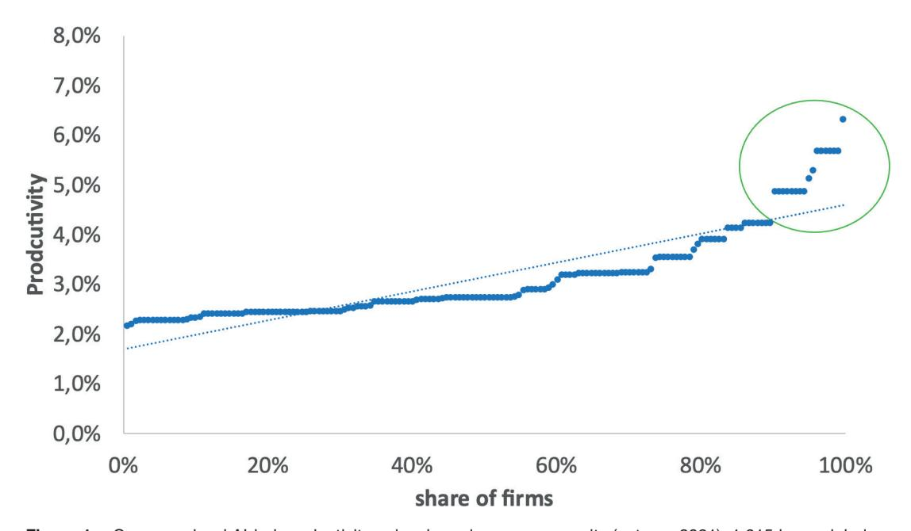
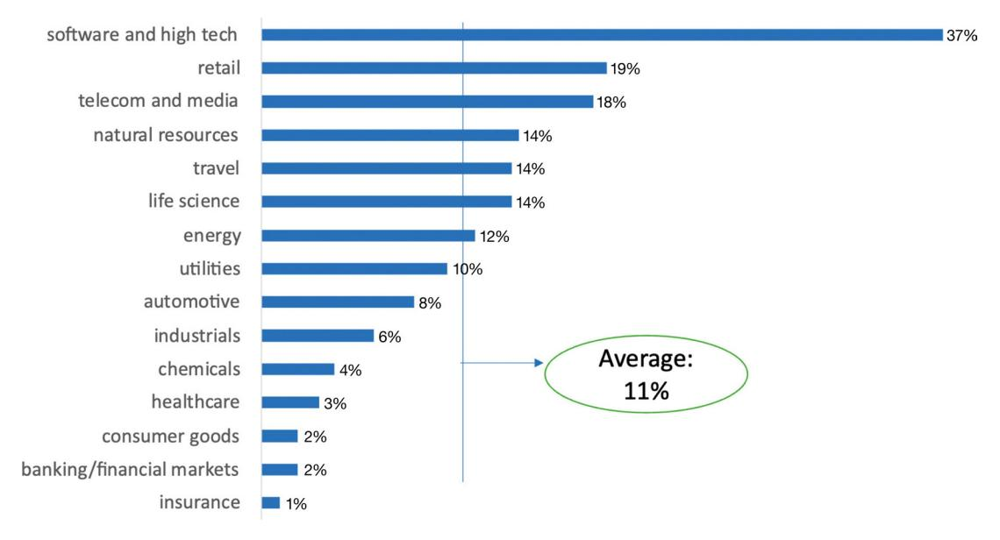

# Inside the successful make-up of 'AI-first' organisations

Received (in revised form): 31st March, 2024

# Jacques Bughin

Chief Executive Officer, MachaonAdvisory, Belgium

Dr Jacques Bughin is currently Chief Executive Officer of Machaon Advisory, specialising in digital technology economics and top management consultancy. Previously, he was a senior partner at McKinsey & Co. and leader of the McKinsey Global Institute. He collaborates with multiple institutions, from the United Nations (UN), the Science and Technology Options Assessment (STOA) Board of the European Parliament to the Portulans Institute and the Accenture Research Board. He has been a professor of management practices and is now a senior adviser to private equity companies, Fortino Capital and Antler. He has published widely on technology and AI, in among others Sloan Management Review, Harvard Business Review, Technovation, Frontiers in Artificial Intelligence and European Business Review.

MachaonAdvisory, Avenue Montana 24 1180, Bruxelles, Belgium E-mail: bughinjacquesrenejean@gmail.com; jacquesbughin@machaonadvisory.com

Abstract The corporate adoption of artificial intelligence (AI) technologies has been rapid in recent years, but the stumbling block is how those investments translate into attractive returns. This paper provides a systematic analysis of key success factors tied to the total productivity gains generated by global companies out of their AI factory programmes. Successful AI transformation necessitates a multifaceted approach, encompassing strategic pivot, robust data and AI governance, augmented human capital programme and a commitment to innovation.

KEYWORDS: artificial intelligence, corporate transformation, capabilities, strategic change, AI factory, total productivity growth

DOI: 10.69554/WPNS5765

#### INTRODUCTION

The beginnings of artificial intelligence (AI) can be traced back to the pioneering concepts of Alan Turing. The word 'artificial intelligence' was actually coined when Minsky and McCarthy hosted a Dartmouth summer research project in 1956. At that time, however, AI was essentially expert systems that lacked learning capabilities, and AI stagnated. The alternative to expert systems was quickly recognised as neural networks, but insufficient processing power made the idea impractical until the digital revolution about ten years ago[.1](#page-7-0)

Today, artificial neural networks and deep learning (DL) are the cornerstones of most applications under the AI label. They underpin robotic process automation (RPA) software for business process automation, or natural language processing (NLP) for any form of content generation. Innovation in AI technology has also continued unabated, including major breakthroughs such as foundational models in NLP based on transformers, which have become extremely accurate in recent years.[2,3](#page-7-0)

With those major improvements in AI technologies, companies took notice and sought to use AI for new business opportunities. While digital native companies such as Meta (previously known as Facebook), Amazon, Apple, Netflix and Alphabet (GOOG) (previously known as Google) (FAANGs) have often been quoted as the precursors in using AI, traditional companies have also been rushing to adopt AI.

The stumbling block, however, is how investments in AI have translated into attractive returns. As Marco Iansiti and Karim Lakhani[4](#page-7-0) explain in their book *Competing in the Age of AI*, the key issue may be that most incumbents have adopted AI technology without the fundamental goal of restructuring the core of the business towards an AI-first operating architecture and supporting this new model with an agile organisation that enables the ability to change.

One must recognise that the transition to the AI-first model is often uncomfortable because it reflects a fundamental reorientation of organisation and strategy[.5](#page-7-0) Yet, when done right, it often pays off significantly: notable examples include Lockheed Martin, Banco Bilbao Vizcaya Argentaria (BBVA), Moderna and EQT Ventures, each demonstrating AI-first organisations to benefit from AI. This new organisational model is the one that, for example, helped Moderna to accelerate the development of a COVID-19 vaccine in a matter of months rather than a decade; it is also the one that enabled EQT, a major private equity company, to make a strong stream of investments using the MotherBrain AI model architecture and reallocating the time of its employees to the most attractive deals sorted out by AI. As another example, this is the model that propelled BBVA from a regional bank to a global brand[.6](#page-7-0)

Apart from a use case approach, there is no *systematic e*vidence of the validity of the AI-first organisation and its priority drivers. We report on one such approach in this research and derive the general lessons for

management for maximising success of AI transformation.

## STUDY SCOPE

The scope of the study covers companies that are already using AI, and the data was collected via an executive survey, which is consistent with much of the literature on the use of AI by companies.[7](#page-7-0) The survey was conducted in autumn 2021 in most of the G-20 countries. Companies are large with revenues of more than US\$1bn, as they tend to adopt AI more quickly.[8](#page-7-0) Following the emerging AI-first organisation literature[,9,10](#page-7-0) the questionnaire included questions on the components of the AI operating model (data, technology platform, data science skills) and organisational design (see Table 1). The final sample contains 1,615 global companies, with major household names (Coca Cola, Charles Schwab, Samsung, Siemens, L'Oreal, Diageo, to name a few), and responses were successfully tested for absence of bias, with a common factor of less than 20 per cent of the total answers variance. Our analyses have covered two main questions:

Question 1: What has been the gains of adopting AI? And how are gains distributed among companies? Question 2: How is the AI-first model linked to AI gain?

### RESULTS

Compiling the data, the answer to the first question is presented in Figure 1, where companies are ranked from low to high total productivity impact out of AI. On average the productivity gains associated with AI were estimated to be 2.7 per cent, in line with other company-level studies of productivity gains from AI use[.11,12](#page-7-0) What Figure 1 shows, however, is that there is a widespread distribution of impact, but

especially a tail (just above 10 per cent of companies) where productivity gains have been slightly more exponential (above the rank trend line), reaching almost 7 per cent gains per year.

Who are these tail companies? Industry matters of course. As Figure 2 illustrates, the high-tech sector has the largest share of companies with 'outsized' productivity gains; at the other extreme, financial companies (banks and insurance) have the smallest share of over-AI achievers. But still, we find that there remains a big difference between companies within the same industry.

To test our question 2, Table 1 computes the average scores of companies on the Technical and organisational dimensions (and their lower order components) of an AI-centric organisation. It is striking that the average incumbent organisation is typically far from the frontier of those components. For example, data lakes are present in only 32 per cent of organisations, and data is accurate and sufficient in only 28 per cent

of organisations. In terms of organisational components, the C-suite is often not fully responsible for the shift to AI, and innovation is clearly decoupled from AI in the majority of organisations.

Our regression results reported in Table 2, which associate total productivity gains to these components, provide the basis for answering question 2. The reader will notice that the results are solid, and statistically significant. In fact, based on the results, Table 2 suggests the following insight.

# Before the AI journey: The art of strategic renewal

Before any AI journey, a majority element is strategy. Remember that all companies in the sample have built an AI strategy. But they might differ in the way strategy is developed, from a pure perseverance of the past, or a major pivotal change. We find that a powerful sign of AI-first organisation and of large productivity gain out of AI

Figure 1: Company-level AI-led productivity gains, based on survey results (autumn 2021), 1,615 large global companies, productivity gains derived from revenue costs and gains evolutions over three years Source: Author

Figure 2: Productivity leaders, percentage\* per year based on survey results (autumn 2021), 1,615 large global companies; \*portion of companies whose AI productivity gains is above the trend line shown in Figure 1 Source: Author

is that companies use AI for strategic renewal. This mirrors the success observed in digital transformations through major pivots.[13](#page-7-0) The case of the *New York Times* transitioning to a 'reader-first paradigm' exemplifies the synergy between strategic renewal and AI adoption, notably through a personalised paywall model fostering reader engagement[.14](#page-7-0)

## During the AI journey: Mastering the components of an AI-first organisation

One finds clear evidence that AI architecture is necessary, but not sufficient to scale productivity from AI — rather a corporation mastering the various components of the organisation may boost 4.5 per cent extra productivity per year. This order of magnitude of impact is remarkable and fits with the high end of productivity change capture out of AI by the fringe companies. Further, the fringe companies in the sample are on average twice closer to the frontier than other corporations, making the link between the fringe success and AI-first organisation.

### MANAGERIAL GUIDANCE

We already have mentioned the need to develop an appropriate strategy pivot, as AI *per se* radically changes the forces at work and capabilities to compete. The detail of the regression analysis identifies five factors that explain the bulk of the productivity uplift and are thus of high priority for every executive to master in their journey for an AI-first in their organisation.

# Responsible AI/data governance is the key refinery for your data

Accurate, clean and diverse data is a key ingredient for machine learning (ML) algorithms. It is not exactly news that without accurate data, AI is really challenged. But more and more, the real moat seems to be linked to two other capabilities: first, mastering methodologies such as data and machine learning operations (MLOps), which facilitates the systematic management of data, including its sourcing, storage, traceability and use, thus ensuring its effectiveness as a strategic asset. Secondly, strong data management often needs to be coupled with a

Table 1: AI-centric organisation components, average of sample organisations

| AI data centric architecture | What foundational elements do you have in place to support your AI strategy?             | Percentage |
|------------------------------|---------------------------------------------------------------------------------------------|------------|
|                              | Cloud infrastructure, developer runs                                                        | 49%        |
|                              | Data platform                                                                               | 49%        |
|                              | Algorithm frameworks                                                                        | 38%        |
|                              | Robust and accurate data set                                                                | 28%        |
|                              | Data lakes                                                                                  | 32%        |
|                              | AL technology tools to manage data                                                          | 46%        |
|                              | Integration capabilities of multiple sources of data                                        | 49%        |
| Enabled organisation         | What organisational elements are in place to enable the AI centric operations?           | Percentage |
|                              | C-suite clearly accountable for new AI model                                                | 38%        |
|                              | Organisation of data supporting business decision and responsible AI framework installed | 57%        |
|                              | Organisational process in place to scale ML across the enterprise                        | 55%        |
|                              | Organisation used MLOps as methodology to produce and scale ML models                    | 47%        |
|                              | Ecosystem built for data, developers, research and design (R&D) and data science talents | 52%        |
|                              | Innovation is integrated with the new AI model                                              | 39%        |
|                              | Holistic talent model in place to scale, retain and develop AI talent/culture            | 53%        |

Source: Author, based on survey results (autumn 2021), 1,615 large global companies, (more than US\$1bn sales)

strong, responsible AI strategy — establishing a robust framework for ethical AI use, transparency, privacy and unbiased results.

#### *Case in point*

Many companies are developing a dedicated ethics committee to support responsible AI, including IBM and Axon. Schneider Electric has appointed its first Chief AI Officer to drive its responsible AI strategy. Adobe has created an AI ethics policy, as has Sony, to ensure the ethical compliance of its AI software development[.15](#page-7-0)

## Engage in a major enterprise upskilling

Contrary to fears of AI-induced job displacement, human capital remains essential to the success of AI-first organisations. This

includes three levels: (1) AI training for leaders and employees; (2) a proactive data science talent strategy from recruitment to retention; and (3) a sufficiently large pool of competencies around AI, ie developers/ coders/engineers and AI scientists. In fact, a comprehensive analysis of people skills and AI suggests that the successful adoption of AI requires an alignment of skills across the workforce[.16](#page-7-0)

#### *Case in point*

Organisations such as BBVA emphasise the integration of different skills, including data scientists, software engineers and business translators, highlighting the symbiotic relationship between human expertise and AI technologies. Another example is the speed with which Accenture has established

Table 2: Marginal effect on productivity, estimates

| Dimension 1: Architecture                               | Dimension 2: Organisation |                                                                                                |       |
|---------------------------------------------------------|---------------------------|------------------------------------------------------------------------------------------------|-------|
| Cloud infrastructure, developer runs                    | −0.03%                    | CEO sponsoring and accountability                                                              | 0.60% |
| Data platform                                           | 0.17%                     | Organisation of data supporting business decision and responsible AI framework installed | 0.58% |
| Algorithm frameworks                                    | 0.12%                     | Organisation used MLOps as methodology to produce and scale ML models                       | 0.17% |
| Robust and accurate data set                            | 0.17%                     | Innovation is integrated with the new AI model                                              | 0.32% |
| Data lakes                                              | −0.08%                    | Mandatory training                                                                             | 0.46% |
| AL technology tools to manage data                      | −0.05%                    | Holistic talent model in place to scale, retain and develop AI talent/culture               | 1.48% |
| Integration capabilities of multiple sources of data | 0.24%                     | AI ecosystem play                                                                              | 0.80% |
| Total                                                   | 0.54%                     | Total                                                                                          | 4.41% |

Notes: 1) Marginal probability based on average of other factors; 2) only variables which are significant included in the estimates; 3) Ordered probit based on five categories: 0, 1–10, 10–30, 30–50, 50+ over three years; 4) log likelihood: −728 pseudo R2 = 0.212; 5) controls include industry, headquarter location, company size, profitability and growth

Source: Author

a major centre of excellence in India, with 1,600 employees, to develop and master generative AI (GenAI). It has also trained more than 40,000 employees in AI-related skills that can support the centre.

## Embrace radical innovation

Incremental innovations tend to evolve along known technology trajectories and therefore produce only small improvements[.17](#page-7-0) In contrast, radical innovations rely on the pioneering recombination of previously unconnected trajectories, which, although risky, can lead to significant change if successful. Finally, AI itself can be the catalytic tool to find radically new ideas, such as how AI has been used to develop new cancer diagnoses through computer vision, or how AI algorithms have radically changed the content industry through generative AI.[18](#page-7-0)

#### *Case in point*

Tesla's self-driving cars recombine technologies from automotive, sensor-based safety systems, communications and AI. Another example is John Deere, which as a leading agricultural machinery provider has been extending its equipment sales to services, *de facto* using AI to revolutionise old-fashioned farming practices. This includes computer vision tools that identify and spray weeds in the field, significantly reducing the amount of herbicide used and creating major benefits for customers.[19](#page-8-0)

## AI ecosystem should be the new black

The competitive landscape has been rapidly shifting to an ecosystem of multiple players[.20](#page-8-0) In fact, given the speed of change and global reach of AI technologies, one key benefit of the ecosystem approach is to reciprocate access to assets/capabilities that companies would not have otherwise. The ecosystem play is like a sports team, where all parties contribute to build value before sharing it.

From our findings above, best AI-first companies are those busy shaping a possible reinforcing network of parties with the goal that the ecosystem thrives, and thus all parties benefit. In this setting, the primary aim is to focus on complementarity, even if other parties in the ecosystem can be competitors when it comes to share value. In AI hightech, ecosystem is becoming the base case of competition: IBM cooperates with the likes of Microsoft, Salesforce or Celonis, and Amazon Web Services (AWS). Google's AI ecosystem started with the release of TensorFlow on Apache to any user and offering infrastructure tools such as Google Cloud to scale secured AI applications from everywhere.

But non-tech incumbent companies also are eagerly building AI ecosystems as part of their journey to become AI-led organisations.

#### *Case in point*

McDonald's AI-first vision is AI as core engine to support excellent customer service. Through the development of its ecosystems with AI vendors, McDonald's utilises predictive analytics to optimise menu offerings, drive sales and improve operational efficiency across its global chain of restaurants.

Another case is Siemens, which not only became a major innovator in the 'digital twin' approach but shifted its digital closed strategy to an AI ecosystem posture early in the last decade. In particular, Siemens gave up its early ICT initiatives and adopted cloud services and infrastructure with Microsoft Azure and AWS. Siemens also launched MindSphere, an open cloud-based ecosystem which hosts own and third-party data retrieved from industrial equipment with Internet of Things (IoT) that can be analysed using digital apps developed, mostly, by third-parties[.21](#page-8-0) Siemens AI Lab also serves as a hub for AI-related research and development activities, both within the company and for third parties, providing location space and an accelerator ecosystem that offers AI designers resources from intellectual property (IP) libraries to full toolkits with real working designs. This ecosystem play has greatly boosted Siemens' growth, with significant AI implementation

across industries such as healthcare, energy, transport, logistics and processing.

## Sponsor the AI transformation

Stijn Viane once reported Jack Welch's statement that 'when the pace of change inside an institution becomes slower than the pace of change outside, the end is near'.[22](#page-8-0) To avoid this fate, the pace of change needs to be accelerated, and the responsibility and enabler lies with leadership, which provides the legitimacy for change and success.

A leader's role in securing and driving the transition to AI is typically seen through the habits of: (1) treating AI initiatives as value drivers rather than costs to get started; (2) clarifying roles and responsibilities around the AI investment strategy; and (3) leading the creation of a culture and organisational structure that supports the AI-first operating model.

#### *Case in point*

Thermo Fisher Scientific is one of the largest life sciences/semiconductor companies. It has made significant progress in integrating AI into its operations, for example in genomics through its Amira-Avizo and PerGeos softwares (which both use DL neural networks to improve image processing capabilities), and in the semiconductor industry through the Helios 5 L Wafer DualBeam (which has advanced AI automation capabilities for process monitoring).[23](#page-8-0)

These technological advances may only have been made possible so quickly by a change in leadership dynamics. In R&D leaders are shifting their roles, delegating to AI to provide timely information through pattern recognition, while placing a greater emphasis on empathy and empowerment as key leadership attributes. Thermo Fisher's leadership also encourages innovation among its employees, making creativity one of the company's core values, while the company

launched a major leadership development programme, providing mentorship from senior leaders and engaging participants in key AI initiatives to prepare them for nearterm leadership roles within the company.

# CONCLUSIONS

We have provided solid evidence across a sample of the largest global companies that embracing AI can support major productivity uplift. But the journey can bring good or bad results, depending on whether an organisation is serious in establishing an AI factory. The latter is what we called an 'AI transformation'. Based on the collected evidence and case studies, we claim that this transformation necessitates a multifaceted approach, encompassing strategic alignment, robust data governance, human capital empowerment, trust-building measures and a commitment to radical innovation.

Only by embracing these key success factors can organisations harness the transformative potential of AI, driving sustainable growth and competitive advantage in an increasingly digitised landscape.

# References

- [1](#page-0-0). Haenlein, M. and Kaplan, A. (2019), 'A brief history of artificial intelligence: On the past, present, and future of artificial intelligence', *California Management Review*, Vol. 61, No. 4, pp. 5–14.
- [2.](#page-0-0) Haque, M., Shahidul, M., Choi, S., Kwak, S., Okilly, A. H. and Baek, J. (2023), 'A Fast Loss Model for Cascode GaN-FETs and Real-Time Degradation-Sensitive Control of Solid-State Transformers', *Sensors*, Vol. 23, No. 9, 4395.
- [3.](#page-0-0) Bughin, J. (2023), 'Does artificial intelligence kill employment growth: The missing link of corporate AI posture', *Frontiers of Artificial Intelligence*, Vol. 6, 1239466.
- [4.](#page-1-0) Iansiti, M. and Lakhani, K. R. (2020), *Competing in the Age of AI: Strategy and Leadership when Algorithms and Networks Run the World*, Harvard Business Press, Massachusetts.
- [5.](#page-1-0) Bughin, J. and Gjepali, I. (September 2023), 'Now it is time for ai transformation', The European Business Review, available at https://www. europeanbusinessreview.com/now-it-is-time-for-aitransformation/ (accessed).

- [6](#page-1-0). Chung, V., Gomes, M., Rane, S., Singh, S. and Thomas, R. (October 2020), 'Reimagining customer engagement for the AI bank of the future', McKinsey & Co., available at https://www. mckinsey. com/industries/financial-services/our-insights/ reimagining-customer-engagement-for-the-ai-bankof-the-future (accessed).
- [7](#page-1-0). Raj, M. and Seamans, R. (2019), 'Artificial Intelligence, Labor, Productivity, and the Need for Firm-Level Data', in Agrawal, A., Ganes. J. and Goldfarb, A., *The Economics of Artificial Intelligence: An Agenda*, University of Chicago Press, Chicago, pp. 553–565.
- [8](#page-1-0). Zolas, N., Kroff, Z., Brynjolfsson, E., McElheran, K., Beede, D., Buffington, C., Goldschlag, N., Foster, L. and Dinlersoz, E. (December 2020), 'Advanced technologies adoption and use by us firms: Evidence from the annual business survey', National Bureau of Economic Research, available at https://www.nber. org/papers/w28290 (accessed).
- [9](#page-1-0). Karim, R., Dersin, P., Galar, D., Kumar, U. and Jarl, H. (2021), 'AI Factory – A Framework for Digital Asset Management', 31st European Safety and Reliability Conference (ESREL), Angers, France, 19th–23rd September, pp. 1160–1167.
- [10.](#page-1-0) Fountaine, T., McCarthy, B. and Saleh, T. (2019), 'Building the AI-powered organization', *Harvard Business Review*, Vol. 97, No. 4, pp. 62–73.
- [11.](#page-1-0) Damioli, G., Van Roy, V. and Vertesy, D. (2021), 'The impact of artificial intelligence on labor productivity', *Eurasian Business Review*, Vol. 11, No. 1, pp. 1–25
- [12.](#page-1-0) Czarnitzki, D., Fernández, G. P. and Rammer, C. (2023), 'Artificial intelligence and firm-level productivity', *Journal of Economic Behavior & Organization*, Vol. 211, pp. 188–205.
- [13.](#page-3-0) Van Zeebroeck, N., Kretschmer, T. and Bughin, J. (2021), 'Digital "is" strategy: The role of digital technology adoption in strategy renewal', *IEEE Transactions on Engineering Management*, Vol. 70, No. 9, pp. 3183–3197.
- [14.](#page-3-0) Bakke, N. A. and Barland, J. (2022), 'Disruptive innovations and paradigm shifts in journalism as a business: From advertisers first to readers first and traditional operational models to the AI factory', *SAGE Open*, Vol. 12, No. 2.
- [15.](#page-4-0) Lu, Q., Zhu, L., Xu, X., Whittle, J., Zowghi, D. and Jacquet, A. (2024), 'Responsible AI pattern catalogue: A collection of best practices for AI governance and engineering', *ACM Computing Surveys*, Vol. 56, No. 7, pp. 1–3.
- [16.](#page-4-0) Bessen, J. E. (2016), 'How computer automation affects occupations: Technology, jobs, and skills', *Journal of Economic Perspectives*, Vol. 30, No. 3, pp. 3–30.
- [17](#page-5-0). Dosi, G. (1982), 'Technological paradigms and technological trajectories: A suggested interpretation of the determinants and directions of technical change', *Research Policy*, Vol. 11, No. 3, pp. 147–162.
- [18.](#page-5-0) Grashof, N. and Kopka, A. (2023), 'Artificial intelligence and radical innovation: An opportunity

## *Inside the successful make-up of 'AI-first' organisations*

- for all companies?', *Small Business Economics*, Vol. 61, No. 2, pp. 771–797.
- [19.](#page-5-0) Perry, T. S. (2020), 'John Deere's quest to solve agricultures deep-learning problems', *IEEE Spectrum*, Vol. 57, No. 2, p. 04.
- [20.](#page-5-0) Adner, R. (2017), 'Ecosystem as structure: An actionable construct for strategy', *Journal of Management*, Vol. 43, No. 1, pp. 39–58.
- [21](#page-6-0). Franco, S. F., Graña, J. M., Flacher, D. and Rikap, C. (2023), 'Producing and using artificial
- intelligence: What can Europe learn from Siemens's experience?', *Competition & Change*, Vol. 27, No. 2, pp. 302–331.
- [22.](#page-6-0) Viaene, S. (March/June 2018), 'Orchestrating organisational agility', *Ivey Business Journal*, pp. 1–4.
- [23.](#page-6-0) Liang, J. and Al-Walai, S. (2021), 'Impact of Artificial Intelligence on Management and Leadership in Research & Development: A Case Study of Thermo Fisher Scientific', *Electronic Journal of Business Ethics and Organization Studies*, Vol. 24, No. 2, pp. 43–50.