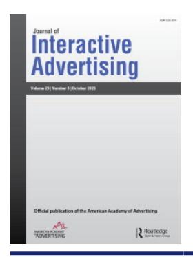

## **Journal of Interactive Advertising**

**ISSN: 1525-2019 (Online) Journal homepage: [www.tandfonline.com/journals/ujia20](https://www.tandfonline.com/journals/ujia20?src=pdf)**

# **Advertising in the Age of Agentic AI: Call for Research**

#### **Jooyoung Kim**

**To cite this article:** Jooyoung Kim (2025) Advertising in the Age of Agentic AI: Call for Research, Journal of Interactive Advertising, 25:3, 215-221, DOI: [10.1080/15252019.2025.2557107](https://www.tandfonline.com/action/showCitFormats?doi=10.1080/15252019.2025.2557107)

**To link to this article:** <https://doi.org/10.1080/15252019.2025.2557107>

| Published online: 09 Oct 2025.          |
|-----------------------------------------|
| Submit your article to this journal     |
| Article views: 3832                     |
| View related articles                   |
| View Crossmark data                     |
| Citing articles: 4 View citing articles |

#### Editorial

### **Advertising in the Age of Agentic AI: Call for Research**

Jooyoung Kim

University of Georgia, Athens, Georgia, USA

Agentic artificial intelligence (AI) is rapidly transforming the advertising process within the AI-powered search environment. The shift from search to dialogue, together with the rise of answer engines and zero-click interactions, is prompting a rethinking of what influence means and how it operates in AI-mediated exchanges. These transformations carry important implications for media planning, invite reinterpretation of classic persuasion theories, and encourage a redefinition of interactive advertising in the AI era. For scholars, theoretical adaptation to these evolving connected dynamics is no longer optional—it is necessary.

Advertising has traditionally been understood as a physical artifact placed within media. The key elements of this process—*what* the ad is, *where* it appears, *when* it runs, *who* places it, and *how* it reaches the audience (the so-called 4W1H)—were historically determined by advertisers and media companies. The rise of ad networks and exchanges marked a turning point. In these systems, advertisers (demand side) and media (supply side) bid for placements in real time, automating the mechanics of delivery. Yet even in this automated environment, core advertising decisions remained human-driven and agency-guided.

That is now changing. With AI rapidly permeating the advertising ecosystem, the 4W1H process is being reconfigured. Not only the *where*, *when*, *who*, and *how*, but also the *what*—the content and format of the ad—can now be generated, selected, and optimized by AI systems. Ad creation, placement, targeting, and evaluation are increasingly handled by intelligent agents in real time, not as isolated functions but as part of an integrated, synthetic process. The institution of the ad agency—once central to strategy, creative development, and media planning—is being redefined. Agentic AI systems, "designed to autonomously make decisions and act, with the ability to pursue complex goals with limited supervision" (Finn and Downie [2025,](#page-7-0) par. 7), are now beginning to simulate human judgment at scale. They integrate data, generate content, make decisions, and execute campaigns autonomously. In doing so, they replicate—and often surpass—functions previously reserved for human creative teams, strategists, and planners. This transformation is rapid, ongoing, compounding, and consequential. What Vinge (1993) and Kurzweil [\(2005](#page-7-1)) once envisioned as a distant *singularity* for human society may already be emerging—near, or even nearer with AI (Kurzweil [2024](#page-7-2)). The singularity describes a transformative point at which AI surpasses human intelligence, enabling exponential self-improvement, unpredictable social consequences, and a merging of human and machine agency. Its defining features include autonomous decision-making, recursive learning, and systemic reconfiguration of human activity. In this sense, the *advertising singularity* may also be near.

This transformational shift demands a serious response from the advertising research community. If the advertising process is shifting in practice, our academic approaches must evolve in turn. We are called not only to keep pace, but to lead—to anticipate, theorize, and guide. Our research must account for the emerging dynamics of communication, persuasion, and interaction in AI-mediated environments.

This editorial is written in that mindset. It discusses several key transformations driven by agentic AI and raises questions about how we, as scholars, might reframe our approaches. While not comprehensive or prescriptive, it offers a directional perspective—especially for those studying interactive advertising—as the field adapts to, integrates with, and evolves in parallel to agentic AI systems.

#### **From Search to Dialogue**

Control over how consumers find and interpret information is no longer centered in traditional digital media that surface content through lists of links—it is shifting to AI systems that generate direct answers. In the past, consumers actively screened and compared organic and sponsored results when searching for goods and services. Brands and media outlets competed for attention through carefully crafted messages and optimized placements, and search engine optimization became one of the most critical marketing competencies of the digital era. Traditional search relied on keywords; now, it is increasingly conversational. With the advancement of large language models and generative AI, conversational search represents a distinct evolution—one that mimics natural dialogue and interprets meaning across multiple turns. Unlike conventional search sessions, which begin and end with discrete queries, conversational systems retain contextual memory. They build on prior exchanges to personalize responses and sustain ongoing dialogue (OpenAI [2024](#page-7-3)).

At the same time, search is expanding beyond text into multimodal domains. Google Lens allows users to query by uploading images, whereas other systems extend search into audio, video, and immersive formats (Kumar [2020](#page-7-4); Malik [2025\)](#page-7-5). Soon, pointing to an object in augmented reality or humming a tune could trigger AI to deliver contextual results. In such cases, persuasion will depend on presence within multimodal experiences, not just text-based queries. Persuasion thus becomes less about one-off exposures and more about co-created meaning between consumers and intelligent artificial agents such as *agentic AI*.

Evolving large language model-based systems illustrate this shift toward agency. They respond autonomously and adapt to prompts, but current systems such as ChatGPT 5 do not yet initiate actions or pursue long-term goals independently. Their agency is therefore bounded, limited to communicative and interpretive functions. However, even within these bounds, they already mediate how consumers encounter brand messages, compare products, and process persuasive cues. As advances in memory, tool integration, and multi-agent collaboration expand these capabilities, the trajectory points toward a fully agentic AI ecosystem. When used by (or for) consumers and brands, this environment becomes one where influence is continuously co-created through the mediation of intelligent agents.

#### **Rise of Answer Engines, Zero-Click Search, and Generative Engine Optimization**

These shifts converge in the rise of the answer engine—AI systems that synthesize contextual responses rather than simply listing results. Google AI Overviews, Bing Copilot, and Amazon AI-generated review summaries exemplify this model, enabling users to focus immediately on key points (Patton [2024\)](#page-7-6). Together with this shift, zero-click search is accelerating, as users increasingly obtain what they need directly from AI outputs, bypassing publishers and advertisers entirely. In traditional search, advertisers sought visibility through ad slots such as banners or sponsored results, with success tied to placement on the results page. In an answer engine, however, users may never see those ads or click through to a site. Instead, they consume the synthesized answer directly in the AI output. The most valuable form of visibility now comes from being represented or cited within the AI response—sometimes referred to as "position zero" (Carter [2025\)](#page-7-7).

This shift introduces a new frontier for advertising strategy: generative engine optimization (GEO). Unlike traditional search engine optimization, which focuses on structured keywords and backlinks, GEO involves shaping the data ecosystems from which generative AI draws its responses. Brands must now think about how to be accurately and favorably represented in AI-generated outputs—by providing structured product feeds, embedding metadata, crafting authoritative content, and engaging in semantic optimization. As generative engines become gatekeepers of visibility and influence, GEO emerges as a critical practice for ensuring brand presence and narrative control within synthesized content environments. This evolution requires scholars and practitioners alike to reconsider how influence is established, measured, and maintained in AI-mediated interactions—where visibility is no longer clicked into, but generated.

#### **Redefining Influence and Interactive Advertising in the Agentic AI Ecosystem**

The rise of answer engines and zero-click search is more than a technical shift—it marks the redefinition of how influence is created and how advertising must be understood. Traditional search emphasized visibility, traffic, and metrics such as clicks and views. In AI-mediated environments, persuasion unfolds instead through synthesized responses, dialogue, and relational trust with intelligent agents. For advertisers, the central question becomes: What does persuasion mean when consumers interact primarily with an AI agent rather than the ad itself? Classic metrics like reach and click-throughs lose much of their power in zero-click contexts. What matters now is whether brand cues are embedded in the informational

ecosystems from which AI draws and whether they are surfaced convincingly in conversation.

This shift inevitably reframes advertising itself. Traditional definitions emphasized mediation, brand initiation, target audiences, sponsorship, and persuasive intent (e.g., Dahlen and Rosengren [2016;](#page-7-8) Kerr and Richards [2021\)](#page-7-9). Advertising continues to exist, but the ways it is initiated, mediated, and experienced are increasingly filtered and reshaped by intelligent agents. In the agentic AI ecosystem, each of these anchors can be reinterpreted as follows:

- *Mediated communication*: Advertising is still mediated, but the mediator in agentic AI environments is the AI itself. Intelligent systems filter, summarize, and even generate brand content, shifting mediation away from publishers and platforms to AI interfaces that determine which cues surface in dialogue.
- *Brand-inspired communication*: Advertising has traditionally been brand-initiated; the messages originated directly from advertisers who purchased placements and controlled delivery. In the agentic AI ecosystem, however, initiation is increasingly refracted through algorithmic processes. Brands do not always determine when or how messages appear; instead, they *inspire* communication by seeding the ecosystem with structured data (e.g., product feeds, APIs [application programming interfaces]), creative assets (e.g., images, taglines, videos), and symbolic cues such as logos, slogans, and design motifs. Intelligent systems then draw on and recombine these resources—often in real time—to generate persuasive outputs that still reflect the brand identity, even though initiation flows through AI rather than direct advertiser choice.
- *Target audience*: Audience targeting is no longer based on static segmentation. The AI agents construct audiences situationally in real time, tailoring outputs based on conversational context, history, and user-specific cues. In this setting, the "audience" is fluid, emergent, and shaped through dialogue with the agent.
- *Sponsorship*: The sponsored nature of advertising remains. It continues to be defined by payment, though the mechanisms of sponsorship are evolving. For instance, Google is experimenting with sponsored links within its search generative experience, showing how payment still underpins visibility even as formats change.
- *Persuasive intent*: Persuasion continues to anchor advertising, but its mechanisms are

changing. Influence can now flow through AI-curated summaries and comparisons, where meaning is prioritized by systems but enacted in the behavioral choices of users. Looking ahead, fully agentic systems may even perform the action component themselves—anticipating preferences and, with user permission, implementing choices on behalf of consumers. Persuasive intent in advertising must therefore be embedded within this evolving flow of influence.

Taken together, these transformations also reshape what we mean by interactive advertising. From its inception, the *Journal of Interactive Advertising* (*JIA*) recognized interactivity broadly, encompassing human– machine–human, human–machine, human–message, and even machine–machine communication (Leckenby and Li [2000](#page-7-10)). Early work emphasized user-initiated actions such as clicking or scrolling—reflecting consumer control over format and content—but the original framing anticipated much broader possibilities. Today, interactivity is no longer about discrete actions; it unfolds through dialogic exchange and co-created meaning. Interaction is sustained not only by user input but also by the responsiveness, memory, personalization, and simulated social presence of the agent.

Redefining interactive advertising in this way requires moving beyond traditional engagement metrics like clicks or dwell time toward relational outcomes such as trust, perceived presence, relevance, and consumer–agent connectedness. In short, interactive advertising is no longer defined by what consumers do with ads but by how persuasion flows through adaptive, AI-mediated interaction. A working definition of interactive advertising in the context of *agentic AI* can therefore be proposed as follows: *brand-inspired communication experience mediated by AI agents and directed toward emergent audiences identified by AI, where persuasion develops through ongoing interaction in a connected message ecosystem*. By communication *experience*, I emphasize that advertising in the AI era is not only about messages being transmitted, but about the relational and adaptive encounters (i.e., experience) users have with intelligent agents. In this sense, the consumer's experience of dialogue, responsiveness, and personalization becomes integral to how persuasion develops. By *connected message ecosystem*, I refer to the broader environment in which brand messages circulate—spanning traditional, digital, and AI-based systems, with the agentic AI ecosystem as one vital and expanding component.

#### **Revisiting Persuasion Theories in the AI Era**

The AI-mediated environments challenge traditional assumptions about persuasion. Metrics such as reach, frequency, and click-throughs—once proxies for exposure and influence—are less reliable when interactions occur through synthesized answers and conversational dialogue. What matters now is whether a brand's informational, emotional, and relational cues are captured and delivered convincingly by AI. Classic theories of persuasion still provide important insight, but they must be revisited and extended to account for the dynamics of agentic, conversational mediation. Recent *JIA* articles highlight four themes that remain central, yet each demands fresh interpretation as AI reshapes how persuasion unfolds.

#### *Emotion Matters—But Now It Is Engineered*

Emotional storytelling and social presence have long been shown to outperform purely rational appeals in shaping attitudes and behaviors (Brinson, Holiday, and George [2024](#page-7-11); Gross, Cui, and von Wangenheim [2023\)](#page-7-12). What changes in the AI era is not the importance of emotion but the way it is produced. Emotion is no longer only the outcome of human creativity; it can now be algorithmically tuned in real time, adjusted to context, and tailored to the individual user's conversational journey. This approach challenges us to revisit both emotional advertising theory and the classic distinction between transformational and informational appeals. In AI-mediated contexts, rational and affective cues are not delivered in isolation but blended seamlessly by systems designed to optimize persuasion moment by moment.

Social presence adds another layer to this rethinking. Evidence suggests that persuasion depends less on personalization alone and more on whether the AI is experienced as a responsive, relational partner. Even virtual influencers demonstrate that authenticity need not be anchored in biological humanity; it can be constructed interactionally, through the flow of dialogue, cues of responsiveness, and signals of trust. In short, emotion still matters—but it now emerges from the engineered interplay of algorithms, interaction, and relational presence.

#### *Perceived Relevance Remains Central—But Is Socially Negotiated with AI*

Classic theories of information processing (e.g., elaboration likelihood model) and flow (Csikszentmihalyi [2000\)](#page-7-13) suggest that persuasion deepens as audiences invest more attention, curiosity, and cognitive effort. In AI-mediated environments, however, involvement is not something the user alone brings to the interaction—it is co-constructed through the dialogue between human and agent. The system shapes how information is presented, when cues of curiosity are introduced, and how attention is sustained across turns of conversation.

Cognitive load theories, such as the limited capacity model of motivated mediated message processing (LC4MP; Lang [2000\)](#page-7-14), remind us that humans can only process so much information at a time. Yet AI systems have the potential to augment this capacity by contextualizing, filtering, and sequencing information in ways that lighten the user's burden. This invites us to "imagine" extensions such as an expanded capacity model (EC4MP) or augmented capacity model (AC4MP) frameworks that recognize how AI support can increase people's ability to process persuasive messages by scaffolding comprehension. For example, the elaboration likelihood model might be reinterpreted in this light: With the help of AI, even users who are either low in involvement or limited in ability may be encouraged or empowered, respectively, to process information more deeply. A non-tech-savvy parent searching for a laptop for a child entering a graphic design program may feel overwhelmed by technical jargon. An AI assistant can guide the search conversationally—clarifying terms, comparing options, and highlighting relevant trade-offs—thus raising the parent's level of elaboration and enabling a more informed decision.

Recent research on control and personalization reinforces this point. While granting users more control once seemed a straightforward way to boost engagement, studies now show that control in itself no longer guarantees persuasion (Brinson, Holiday, and George [2024](#page-7-11); Hu and Wise [2024\)](#page-7-15). What matters instead is whether personalization feels socially and contextually appropriate within the exchange. An AI that responds smoothly, respects social norms, and adapts to context is more persuasive than one that merely delivers customized facts. In this sense, relevance today is less a property of the message itself than an outcome of social negotiation between user and AI agent—an emergent product of co-constructed attention, augmented capacity, and contextually sensitive responsiveness.

#### *Transparency Is a Double-Edged Sword—But Delivery Matters Most*

For decades, scholars have debated how consumers recognize and respond to persuasion attempts. The CARE model (Van Reijmersdal et al. [2023](#page-7-16)) distinguishes between content-driven recognition—such as noticing a brand logo or product mention—and disclosure-driven recognition, where a message is explicitly labeled as "sponsored." In traditional media, disclosure often took the form of a label, disclaimer, or tag, a static marker designed to separate advertising from editorial content. Conversational and AI-mediated environments complicate this picture. Here, disclosure is not a static sign but a performative act woven into dialogue. A voice assistant might announce, "Here are sponsored options," or an AI agent may note, "This recommendation is promoted by brand X." How such transparency is introduced—its tone, timing, and placement—shapes whether the message feels trustworthy or manipulative. In interactive contexts, disclosure must feel like a natural part of the exchange rather than a disruption to it. Recent research (e.g. Brinson, Holiday, and George [2024\)](#page-7-17) using persuasion knowledge model (Friestad and Wright [1994\)](#page-7-18) suggests that recognizing a message as advertising does not always undermine its effectiveness. On the contrary, when recognition is mediated through a sense of social presence, awareness can strengthen trust, signaling honesty and openness rather than manipulation. Similarly, research on psychological reactance and the stimulus–organism–response model reminds us that resistance often arises less from the recognition of persuasion itself than from the way it is delivered (Alhelaly, Dhillon, and Oliveira [2025\)](#page-6-0). A clumsy or intrusive disclosure can trigger irritation and skepticism, whereas a well-integrated disclosure can maintain conversational flow and support perceptions of authenticity.

In short, transparency remains essential in the AI era—but it is no longer about whether disclosure exists. It is about how it is performed within the flow of human–AI interaction. The challenge for advertisers is to design disclosures that are socially smooth, contextually appropriate, and interactionally trustworthy.

#### *Engagement Is Relational, Not Transactional*

Engagement has long been framed in transactional terms: consumers respond to advertising by clicking, sharing, or making a purchase, and advertisers interpret these behaviors as evidence of returned value. Social exchange theory (e.g., Ju and Lou [2022\)](#page-7-19) has often underpinned this logic, suggesting that relationships are sustained through reciprocity—consumers give attention or loyalty in exchange for informational or emotional benefits.

In the age of agentic AI, however, reciprocity takes on a new form. Here, the exchange is not simply between consumer and brand but mediated by the AI system itself. Consumers "repay" AI-generated value not by directly rewarding the advertiser but through data trails, repeated queries, and continued reliance on the agent. Engagement is algorithmic: loyalty accrues to the system, which in turn shapes how and when brands are represented in responses. At the same time, theories of parasocial interaction remind us that engagement extends beyond transactions into relationships. Consumers form bonds not only with human influencers but also with virtual influencers and AI agents, whose responsiveness, memory, and anthropomorphic cues create a sense of social presence (Byun and Ahn [2023](#page-7-20)). These relationships may be weaker than human connections but can still sustain attention and shape attitudes when designed to feel authentic.

Finally, privacy considerations remain central. Studies (e.g., Bright, Logan, and Lim [2022](#page-7-21)) using privacy calculus theory and privacy protection motivation theory show that consumers constantly weigh the risks and benefits of personal information disclosure. Yet in AI-mediated environments, much of this disclosure is implicit or ambient: personal information flows into the system through conversational exchanges, contextual data, or background settings. Privacy thus becomes less an individual calculation and more a relational negotiation, embedded in trust toward the AI system and the brands it represents.

#### **Future Research Agenda**

The reinterpretation of classic theories in AI-mediated environments opens several new lines of inquiry that point toward a broader research agenda, as follows:

- *Emotional engineering and authenticity*: Do algorithmically generated emotions persuade as effectively as human-crafted storytelling? Under what conditions does perceived authenticity whether human or machine-produced—amplify or constrain their impact?
- *Augmented cognitive capacity and relational relevance:* How does the ability of AI to scaffold attention, filter information, and provide contextual explanations (as in proposed EC4MP or AC4MP extensions) reshape elaboration processes? Can conversational smoothness and co-constructed involvement outweigh traditional variables such as user control?

- *Transparency as dialogue:* What forms of disclosure—whether spoken, visual, or multimodal—best sustain trust in conversational environments? How do timing, tone, and integration into the flow of dialogue determine whether disclosure builds credibility or provokes skepticism?
- *Engagement as relational trust:* In AI-mediated environments, engagement could be conceptualized across emotional, cognitive, and behavioral dimensions. Emotional engagement involves trust, social presence, and parasocial bonds; cognitive engagement centers on relevance, comprehension, and processing effort; and behavioral engagement reflects repeat use, loyalty, and brand choice. Future research can ask these key questions: How do responsiveness, memory, and adaptiveness shape emotional trust and parasocial bonds? Can algorithmic reciprocity enhance cognitive elaboration or behavioral loyalty? Finally, how should engagement be measured when loyalty is directed as much toward the AI agent as the brand?
- *Privacy, autonomy, and implicit data exchange:* How do users interpret and negotiate the often ambient or invisible disclosures of personal data within AI interactions? What strategies can minimize reactance while preserving trust and perceived autonomy?
- *Ethical design and responsibility:* How should advertising research account for the ethical implications of AI mediation—such as algorithmic bias, manipulation, lack of accountability, and the potential erosion of user agency? What frameworks can ensure that persuasion remains transparent and fair?
- *Global perspectives and cultural contexts:* How do cultural and language differences, regulatory regimes, and varying levels of AI adoption shape the ways in which interactive advertising evolves across regions? What lessons can be learned from global contexts where trust, privacy expectations, and persuasion norms differ significantly?
- *Cross-theory integration:* Can a unified framework capture the emotional (affect and presence), cognitive (information load and elaboration), relational (trust and reciprocity), ethical (privacy and transparency), and behavioral (choice and loyalty) dimensions of persuasion when mediated by agentic AI?
- *Measurement and methods:* Rather than focusing solely on traditional outcomes such as exposure

or click-through rates, researchers will need to examine, for example, *AI visibility* (how brands appear within generative responses), *AI-mediated persuasion* lift (how persuasion outcomes differ when mediated by AI agents), and *relational presence* (how users perceive the social responsiveness and trustworthiness of intelligent systems). Operationalizing these concepts will demand interdisciplinary collaboration—particularly with computer scientists, data engineers, and human–computer interaction researchers. Methods may include real-time prompt-response testing, large-scale content analysis of AI-generated outputs, and experimental designs that assess persuasion, memory, and user interaction within conversational or multimodal contexts. Building valid and scalable measures across these domains is essential for advancing the study of advertising in agentic AI systems.

#### **Mapping the Connected Dynamics in the AI-Verse**

The shift to AI-mediated persuasion signals a systemic reconfiguration of advertising. Influence is no longer tied to static exposures but emerges through adaptive interactions between users, brands, and intelligent systems. To respond effectively, advertising research must expand its toolkit, updating models, revisiting concepts, developing new constructs, and, ultimately, building and testing existing or new theories. Meeting this challenge requires interdisciplinary collaboration, without which it will be impossible to comprehensively understand how agentic systems operate, influence, and evolve in the context of advertising. As advertising becomes conversational, multimodal, and autonomous, researchers are called not only to describe these transformations but also to guide them.

The soon-to-come environment, which I would call the *AI-verse*, is a digital space where agentic AI tools and platforms, both backend and frontend, are interoperably networked across the agentic AI ecosystem to deliver continuity of intelligence, system-wide interoperability, and adaptive integration into everyday life. Such an environment demands research approaches that reflect this complexity and fluidity. The task ahead is to map the connected flows through which persuasion will be co-constructed in the AI-verse.

#### **References**

Alhelaly, Y., G. Dhillon, and T. Oliveira. [2025](#page-5-0). "The Impact of Privacy Intrusiveness on Individuals' Responses and

- Engagement toward Personalization in Online Interactive Advertising." *Journal of Interactive Advertising* 25 (1): 38–60. <https://doi.org/10.1080/15252019.2024.2440318>.
- Bright, L. F., K. Logan, and H. S. Lim. [2022](#page-5-1). "Social Media Fatigue and Privacy: An Exploration of Antecedents to Consumers' Concerns Regarding the Security of Their Personal Information on Social Media Platforms." *Journal of Interactive Advertising* 22 (2): 125–140. [https://doi.org/](https://doi.org/10.1080/15252019.2022.2051097) [10.1080/15252019.2022.2051097.](https://doi.org/10.1080/15252019.2022.2051097)
- Brinson, N. H., S. Holiday, and J. L. George. [2024](#page-4-0). "Response to Advertising Delivered by Voice Assistants: The Mediating Role of Persuasion Knowledge, Perceived Control, Social Presence, and Privacy Concerns." *Journal of Interactive Advertising* 24 (4): 344–367. [https://doi.org/](https://doi.org/10.1080/15252019.2024.2391381) [10.1080/15252019.2024.2391381.](https://doi.org/10.1080/15252019.2024.2391381)
- Byun, K. J., and S. J. Ahn. [2023](#page-5-2). "A Systematic Review of Virtual Influencers: Similarities and Differences between Human and Virtual Influencers in Interactive Advertising." *Journal of Interactive Advertising* 23 (4): 293–306. [https://](https://doi.org/10.1080/15252019.2023.2236102) [doi.org/10.1080/15252019.2023.2236102.](https://doi.org/10.1080/15252019.2023.2236102)
- Carter, Emily. [2025.](#page-2-0) "What Is Position Zero (P0): Your Guide to SEO Gold." WebFX Blog, August 12 Accessed August 31 2025. [https://www.webfx.com/blog/seo/what](https://www.webfx.com/blog/seo/what-is-position-zero/)[is-position-zero/](https://www.webfx.com/blog/seo/what-is-position-zero/)
- Csikszentmihalyi, M. [2000.](#page-4-1) "The Contribution of Flow to Positive Psychology." In *The Science of Optimism and Hope: Research Essays in Honor of Martin E. P. Seligman*, edited by J. E. Gillham, 387–395. Philadelphia, PA: Templeton Foundation Press.
- Dahlen, M., and S. Rosengren. [2016](#page-3-0). "If Advertising Won't Die, What Will It Be? Toward a Working Definition of Advertising." *Journal of Advertising* 45 (3): 334–345. <https://doi.org/10.1080/00913367.2016.1172387>.
- Finn, T., and A. Downie. [2025](#page-1-0). "Agentic AI vs. Generative AI." IBM Think. Accessed September 15, 2025. [https://](https://www.ibm.com/think/topics/agentic-ai-vs-generative-ai#7281538) [www.ibm.com/think/topics/agentic-ai-vs-generative](https://www.ibm.com/think/topics/agentic-ai-vs-generative-ai#7281538)[ai#7281538](https://www.ibm.com/think/topics/agentic-ai-vs-generative-ai#7281538).
- Friestad, M. S., and P. Wright. [1994.](#page-5-3) "The Persuasion Knowledge Model: How People Cope with Persuasion Attempts." *Journal of Consumer Research* 21 (1): 1–31. [https://doi.org/10.1086/209380.](https://doi.org/10.1086/209380)
- Gross, J., Z. Cui, and F. von Wangenheim. [2023.](#page-4-2) "How to Make Influencer Advertising Engaging on Instagram: Emotional Storytelling in Sponsored Posts." *Journal of Interactive Advertising* 23 (4): 388–408. [https://doi.org/10.](https://doi.org/10.1080/15252019.2023.2211579) [1080/15252019.2023.2211579](https://doi.org/10.1080/15252019.2023.2211579).

- Hu, X., and K. Wise. [2024.](#page-4-3) "Disentangling Control and Personalization: Exploring the Effects of Ad Choice and Ad Personalization in Digital Advertising Effectiveness." *Journal of Interactive Advertising* 24 (3): 265–288. [https://](https://doi.org/10.1080/15252019.2024.2375970) [doi.org/10.1080/15252019.2024.2375970.](https://doi.org/10.1080/15252019.2024.2375970)
- Ju, I., and C. Lou. [2022](#page-5-4). "Does Influencer–Follower Relationship Matter? Exploring How Relationship Norms and Influencer–Product Congruence Affect Advertising Effectiveness across Product Categories." *Journal of Interactive Advertising* 22 (2): 157–177. [https://doi.org/10.](https://doi.org/10.1080/15252019.2022.2087809) [1080/15252019.2022.2087809](https://doi.org/10.1080/15252019.2022.2087809).
- Kerr, G., and J. Richards. [2021](#page-3-1). "Redefining Advertising in Research and Practice." *International Journal of Advertising* 40 (2): 175–198. [https://doi.org/10.1080/02650487.2020.1](https://doi.org/10.1080/02650487.2020.1769407) [769407.](https://doi.org/10.1080/02650487.2020.1769407)
- Kumar, K. [2020](#page-2-1). "Song Stuck in Your Head? Just Hum to Search." *Google*, October 15. [https://blog.google/products/](https://blog.google/products/search/hum-to-search/) [search/hum-to-search/](https://blog.google/products/search/hum-to-search/).
- Kurzweil, R. [2005.](#page-1-1) *The Singularity is Near*. New York: Viking Books.
- Kurzweil, R. [2024.](#page-1-2) *The Singularity Is Nearer: When We Merge With AI*. Viking.
- Lang, A. [2000](#page-4-4). "The Limited Capacity Model of Mediated Message Processing." *Journal of Communication* 50 (1): 46–70. [https://doi.org/10.1111/j.1460-2466.2000.](https://doi.org/10.1111/j.1460-2466.2000.tb02833.x) [tb02833.x.](https://doi.org/10.1111/j.1460-2466.2000.tb02833.x)
- Leckenby, J. D., and H. Li. [2000](#page-3-2). "From the Editors: Why We Need the Journal of Interactive Advertising." *Journal of Interactive Advertising* 1 (1): 1–3. [https://doi.org/10.1080/](https://doi.org/10.1080/15252019.2000.10722039) [15252019.2000.10722039.](https://doi.org/10.1080/15252019.2000.10722039)
- Malik, A. [2025.](#page-2-2) "Google Tests Audio Overviews for Search Queries." *TechCrunch*, June 13. [https://techcrunch.](https://techcrunch.com/2025/06/13/google-tests-audio-overviews-for-search-queries/) [com/2025/06/13/google-tests-audio-overviews-for-search](https://techcrunch.com/2025/06/13/google-tests-audio-overviews-for-search-queries/)[queries/](https://techcrunch.com/2025/06/13/google-tests-audio-overviews-for-search-queries/).
- OpenAI [2024](#page-2-3). "Memory and new controls for ChatGPT." February 13. [https://openai.com/index/memory-an](https://openai.com/index/memory-and-new-controls-for-chatgpt/) [d-new-controls-for-chatgpt/](https://openai.com/index/memory-and-new-controls-for-chatgpt/)
- Patton, S. [2024.](#page-2-4) "Microsoft 365 Copilot Year In Review | 2024" *Microsoft Tech Community*." December 26. [https://](https://techcommunity.microsoft.com/blog/microsoft365copilotblog/microsoft-365-copilot-year-in-review2024/4359781) [techcommunity.microsoft.com/blog/microsoft365copilotblog/](https://techcommunity.microsoft.com/blog/microsoft365copilotblog/microsoft-365-copilot-year-in-review2024/4359781) [microsoft-365-copilot-year-in-review–2024/4359781](https://techcommunity.microsoft.com/blog/microsoft365copilotblog/microsoft-365-copilot-year-in-review2024/4359781)
- Van Reijmersdal, E. A., E. Brussee, N. Evans, and B. W. Wojdynski. [2023.](#page-5-5) "Disclosure-Driven Recognition of Native Advertising: A Test of Two Competing Mechanisms." *Journal of Interactive Advertising* 23 (2): 85–97. <https://doi.org/10.1080/15252019.2022.2146991>.