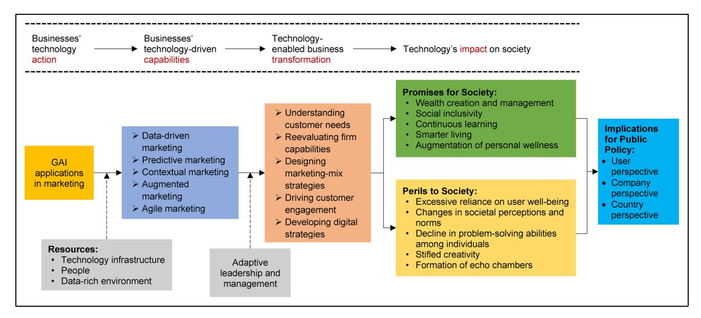

# Generative AI in Marketing: Promises, Perils, and Public Policy Implications

Journal of Public Policy & Marketing 2025, Vol. 44(3) 309-331 © The Author(s) 2024

Article reuse guidelines: sagepub.com/journals-permissions DOI: 10.1177/07439156241286499 journals.sagepub.com/home/ppo

V. Kumar 🕞, Philip Kotler, Shaphali Gupta, and Bharath Rajan 🕒

#### **Abstract**

By evaluating the pattern of generative AI (GAI) use by businesses in marketing, this study aims to understand the subsequent impact on society and develop policy implications that promote its beneficial use. To this end, the authors develop an organizing framework that contends that the usage of GAI models by businesses for marketing purposes creates promises and perils for society through a specific business process. This business process is represented by the action  $\rightarrow$  capabilities  $\rightarrow$  transformation  $\rightarrow$  impact link in the proposed framework. Additionally, the authors find that the level of technology infrastructure, skilled personnel, and data access moderates the influence of GAI on businesses' ability to develop technology-driven capabilities. Furthermore, adaptive leadership and management strategies moderate the impact of these capabilities on technology-enabled business transformations. This research is the first study to critically evaluate the use of GAI in marketing from a public policy perspective. The study concludes with an agenda for future research.

#### **Keywords**

generative Al, Marketing 5.0, resources, capabilities, public policy implications, society, organizing framework Submitted January 12, 2024

The advent of new technologies always brings about significant transformations in both the business world and society, which holds for generative AI (GAI) as well. GAI is an artificial intelligence technique that leverages knowledge gained from existing content through a process called training, which ultimately leads to the creation of a statistical model. By utilizing this statistical model, the technology can generate new content by predicting the expected response. GAI, which falls under the umbrella of deep learning, employs supervised, unsupervised, and semisupervised machine learning approaches to generate novel instances of data based on the probability distribution learned from existing data. The output of this technology encompasses natural language elements such as speech, text, images, audio, and video. Unlike previous models, GAI exhibits flexibility regarding input types, accepting prompts in the form of text, speech, and more.

Although GAI models have been in existence since the late 1990s, 2022 was a pivotal year for GAI due to the release of ChatGPT by OpenAI. Since then, multiple interfaces such as Gemini, Copilot, Claude, and Hugging Face have been developed. The widespread interest in GAI platforms can be attributed to their user-friendly nature, which allows users of all technical backgrounds to easily harness GAI capabilities, thereby presenting great implications for business, education,

and society, among others (Gordon, Carrigan, and Hastings 2011; Kshetri et al. 2023).

The potential of GAI is demonstrated through its capacity to independently generate fresh content by learning from extensive datasets. By imitating human creativity, GAI has unlocked immense business opportunities and has achieved remarkable results (Chui et al. 2023). Further, GAI has the potential to revolutionize marketing by automating content creation, personalization, and customer engagement, in addition to infusing innovation and creativity into business actions. As a result, companies are beginning to use GAI models for performing regular business functions. Table 1 presents a sample of these uses by businesses.

V. Kumar is Professor of Marketing and Goodman Academic-Industry Partnership Professor, Goodman School of Business, Brock University, Canada; Chang Jiang Scholar, HUST, China; Distinguished Fellow, Prin. L. N. Welingkar Institute of Management Development and Research (WeSchool), India, and Distinguished Fellow, MICA, India (email: vk@brocku.ca). Philip Kotler is Professor Emeritus of Marketing, Kellogg School of Management, Northwestern University, USA (email: p-kotler@kellogg.northwestern.edu). Shaphali Gupta is Mani Ayer Chair Professor of Marketing, MICA, India (email: shaphali.gupta@micamail.in). Bharath Rajan is Associate Dean, Research, Prin. L. N. Welingkar Institute of Management Development and Research (WeSchool), India (email: bharath.rajan@welingkar.org).

Table 1. Popular Uses of GAI for Regular Business Functions.

| Business Tasks                        | Exemplar GAI Applications                              |
|---------------------------------------|--------------------------------------------------------|
| Task automation                       | UiPath, Tray.ai, Zapier                                |
| Schedule management                   | Clockwise, Reclaim, Trevor                             |
| Email management                      | SaneBox, EmailTree, SmartWriter, Saleshandy         |
| Transcription                         | Trint, TranscribeMe, Otter, Sonix                      |
| Chatbots                              | ChatGPT, Bard, Bing, Jasper                            |
| Writing and analyzing code            | GitHub Copilot, OpenAI Codex, Cody, PolyCoder       |
| Conducting research                   | Mendeley, Zotero, Scite, Consensus                     |
| Learning and education                | Carnegie Learning, Querium, Duolingo, Cognii        |
| Creating and editing audio            | Resound, Adobe Podcast, Cleanvoice, Listnr          |
| Creating and editing video            | Runway, Pictory, Vizard.ai, Vidyo.ai                   |
| Creating and editing images           | Midjourney, Stable Diffusion, Lexica, Adobe Firefly |
| Creating and editing presentations | Pitch, Gamma, Tome, Beautiful.ai                       |

Source: Authors' compilation.

GAI also poses complex challenges that require a balancing act between "doing good" and "doing just." One of the foremost concerns relates to the potential misuse of this technology for malicious purposes. For example, deepfake videos created by GAI can be used to spread misinformation or manipulate public opinion (Jones 2023). Additionally, there are legal and ethical implications surrounding issues of intellectual property and copyright when GAI generates content that closely resembles existing works. This indicates the need for balancing innovation with the protection of individuals' rights and societal values.

Considering this, we investigate the promises and perils of GAI for society through its usage for marketing purposes. To achieve this, we propose an organizing framework that (1) considers the GAI models being used in marketing, (2) identifies the models' impact on technology and business transformations, and (3) traces the marketing impact of GAI on public policy. Based on this, we also advance public policy implications of GAI from the perspectives of users, companies, and countries.

This study contributes to the following areas. First, this study addresses the call for understanding the public policy implications of GAI (e.g., Luckett 2023; Sætra 2023) by adopting a unique perspective of bridging the gap between marketing and public policy through the lens of GAI implementations. Such an approach is expected to serve as a roadmap to catalyze further investigations in this crucial area of research. Second, this is the first marketing study to investigate the promises and perils of GAI's use in marketing from a public policy standpoint. By using the marketing function as a vantage point, this study adds to our understanding of marketing's role in shaping

society. Third, this study advances that the usage of GAI models creates promises and perils through a specific business process. This business process is represented by the action → capabilities → transformation → impact link represented in our proposed framework. The identification of such a business process is an important contribution of this study by establishing that businesses' GAI implementations will impact society (i.e., promises and perils) primarily through business strategy (i.e., business capabilities and business transformations). Fourth, by combining inputs from the academic and practitioner perspectives of using GAI in marketing onto a single platform, the proposed organizing framework aids in establishing a better understanding of the public policy implications of GAI. Finally, the development of a future research agenda opens three substreams of research to study the public policy implications of GAI at the user level, the company level, and the country level. The identification of research agendas in these three substreams is expected to spur additional investigations to further our understanding of GAI's impact on society.

# Related Literature

The field of GAI has witnessed a steady emergence of scientific research (e.g., Epstein et al. 2023; Fischer 2023; Luckett 2023; Stokel-Walker and Van Noorden 2023). However, in terms of marketing, the exploration of GAI is still in its nascent stages. Table 2 presents select studies in marketing on the topic of GAI.

The extant scholarly knowledge of GAI in business and marketing emerges from two broad areas: editorials and original research articles. First, the editorials contribute significantly to the discourse on GAI, draw attention to the use of GAI in marketing, and propose research agendas. Here, the editorials have advocated for the use of GAI in marketing education (Guha, Grewal, and Atlas 2024), ethical and responsible advertising practices (Huh, Nelson, and Russell 2023), marketing practices and processes (Kshetri et al. 2023), consumer studies (Paul, Ueno, and Dennis 2023), and academic research in marketing (Peres et al. 2023). Considering the nascency of GAI and the recency of its use in mainstream marketing, the editorials serve as a valuable guidepost in understanding the current and future trajectory of GAI.

Second, among the original research articles, there is a clear focus on exploring the various ways in which GAI can be applied. These articles have explored GAI's use in understanding labor productivity (Brynjolfsson, Li, and Raymond 2023), uncovering the prospects and challenges in multiple disciplines (Ooi et al. 2023), managing content marketing (Wahid, Mero, and Ritala 2023), improving marketing functions (Thakur and Kushwaha 2024), and managing social media marketing (Zhou et al. 2023). Irrespective of the specific focus of these studies, most of them develop future research agendas for GAI. This indicates the potential for further advancements in this area. Further, numerous marketing studies also examine the advantages and

Table 2. Review of Selected Literature on GAI in Business and Marketing.

| Study                                      | Background/ Context Study      | Key Area(s)/Variable(s) Studied                                                                                                                                                                    | Nature of Study | Key Findings                                                                                                                                                                                                                                                                         | Key Contributions                                                                                                                                                     | mplications? Public Policy Advances I |
|--------------------------------------------|--------------------------------------|-------------------------------------------------------------------------------------------------------------------------------------------------------------------------------------------------------|--------------------|--------------------------------------------------------------------------------------------------------------------------------------------------------------------------------------------------------------------------------------------------------------------------------------|-----------------------------------------------------------------------------------------------------------------------------------------------------------------------|------------------------------------------------|
| Brynjolfsson, Li, and Raymond (2023) | Business, labor studies           | Investigates the impact of GAI on the job.                                                                                                                                                         | Empirical          | Finds that the AI model disseminates workers and helps newer workers move down the experience curve. increases employee retention, and the best practices of more able improves customer sentiment, may lead to worker learning. Also finds that AI assistance  | increase productivity, with large heterogeneity in effects across Suggests that access to GAI can workers.                                                   | No                                             |
| Guha, Grewal, and Atlas (2024)       | education Marketing               | marketing educators, students, methods of GAI tool usage by Investigates the reasons for and and managers.                                                                                   | Conceptual         | shape and improve the future of Argues that GAI can significantly marketing education.                                                                                                                                                                                         | Proposes an agenda for continued educators can and should use research into how marketing GAI.                                                               | No                                             |
| Huh, Nelson, and Russell (2023)      | Advertisement, technology         | utilizing GAI in advertisements at both micro and macro levels. problems and solutions for Presents potential research                                                                       | Conceptual         | advertising and proposes directions for research development on the Sheds light on some of the most important emerging research problems relating to GAI in topic.                                                                                                    | Calls for research promoting the responsible advertising and use of GAI for ethical and social good.                                                         | No                                             |
| Kshetri et al. (2023)                   | Marketing                            | facilitators and barriers to the use Outlines the current state of GAI in marketing. Discusses the of GAI in marketing.                                                                      | Conceptual         | personalizing content and offerings more personally relevant than that produced by earlier generations of and argues that marketing content generated by GAI is likely to be insights generated by GAI in Highlights the effectiveness of digital technologies. | Advances propositions related to the effect of GAI on marketing implications for research and processes and marketing outcomes and discusses practice. | No                                             |
| Ooi et al. (2023)                       | multi-industry Technology,        | Explores the use of GAI tools in a marketing, health care, human resources, education, banking, sustainable IT management). retailing, manufacturing, and variety of industries (i.e., | Conceptual         | Contends that GAI is a double-edged sword that can bring about positive and negative impacts across all levels of society and industry.                                                                                                                                     | Provides multidisciplinary insights agendas of GAI in specific challenges, and research on the opportunities, industries.                                 | No                                             |
| Dennis (2023) Paul, Ueno, and           | technology Marketing,             | benefits and potential pitfalls of Discusses multidimensional using GAI in marketing.                                                                                                           | Conceptual         | Lists specific benefits and pitfalls of GAI in marketing.                                                                                                                                                                                                                         | Outlines a future research agenda in ChatGPT and consumer studies.                                                                                              | No                                             |
| Peres et al. (2023)                     | technology research, Marketing | Explores how ChatGPT and other research, teaching, and business forms of GAI affect academic practice.                                                                                       | Conceptual         | Identifies the need and opportunity bigger, long-term implications of GAI for research, teaching, and for a deeper discussion of the business practice.                                                                                                                  | threats of GAI and identifies Advances opportunities and ideas for future research projects.                                                                 | No                                             |
| Thakur and                                 | Marketing                            | Conducts a systematic literature                                                                                                                                                                      | Analytical         | Finds four main thematic clusters                                                                                                                                                                                                                                                    | Emphasizes potential future                                                                                                                                           | No                                             |

| Table 2. (continued)                 |                                 |                                                                                                                                        |                    |                                                                                                                                                                                                                                          |                                                                                                                                                                                       |                                                |
|--------------------------------------|---------------------------------|----------------------------------------------------------------------------------------------------------------------------------------|--------------------|------------------------------------------------------------------------------------------------------------------------------------------------------------------------------------------------------------------------------------------|---------------------------------------------------------------------------------------------------------------------------------------------------------------------------------------|------------------------------------------------|
| Study                                | Background/ Context Study | Key Area(s)/Variable(s) Studied                                                                                                     | Nature of Study | Key Findings                                                                                                                                                                                                                             | Key Contributions                                                                                                                                                                     | mplications? Public Policy Advances I |
| Kushwaha (2024)                   |                                 | review of research on AI in marketing.                                                                                              |                    | on AI in marketing: (1) data mining that represent the recent research support systems, (2) big data and GAI in marketing, (3) AI-enabled commerce, and (4) chatbots and and deep learning in decision marketing tech. | research areas that build on the established thematic clusters.                                                                                                                    |                                                |
| Wahid, Mero, and Ritala (2023) | Marketing                       | challenges of using GAI in content Understand the benefits and marketing.                                                        | Conceptual         | GAI can complement, augment, or even replace content marketers' Outlines three contexts in which work.                                                                                                                          | study how GAI affects content Proposes a research agenda to creation, digital marketing platforms, and customer engagement.                                               | No                                             |
| Zhou et al. (2023)                | Marketing, social media      | by Twitter users concerning the Investigates the initial posts made relationship between ChatGPT and marketing.               | Empirical          | related to ChatGPT and monitors Determines the primary themes their popularity over time.                                                                                                                                          | tweets related to ChatGPT and Identifies ten distinct clusters of marketing and examines these implications for marketing academia and practice. themes. Also outlines | No                                             |
| This study                           | Marketing, public policy     | develops policy implications that threats of GAI in marketing and Evaluates the opportunities and promote its beneficial use. | Conceptual         | businesses can acquire through GAI technology-driven capabilities that Develops an organizing framework → → transformation → impact link to arrive at the that focuses on the action capabilities adoption.   | Highlights potential avenues for future research in GAI and suggests being cautiously optimistic.                                                                            | Yes                                            |

disadvantages of GAI, suggesting that not everything about GAI is likely to be promising.

One significant observation is the lack of focus on public policy implications in all the marketing studies conducted. Given the influential role of marketing in shaping both businesses and societies, it is crucial to consider the public policy implications of marketing actions. This study aims to address this gap by examining the potential benefits and risks of using GAI in marketing from a public policy perspective. In doing so, this study contributes to the research agenda by aligning with the identified public policy implications.

# Theoretical Background

To develop the proposed framework in this study, we use the resources and capabilities theory as the theoretical foundation. The resources and capabilities theory, contained in the resourcebased view, offers that a firm's competitive edge and enhanced performance arise from its distinct resources and capabilities (Barney 1991). The dynamic capabilities theory, a later development of the resources and capabilities theory, focuses on how an organization acquires and deploys its resources to better match the demands of the market environment. Formally, a dynamic capability is defined as "the capacity of an organization to purposefully create, extend, or modify its resource base" (Helfat et al. 2009, p. 1). The main functions of this theory are to (1) continuously sense environmental changes that could impact markets and technologies, (2) respond to the changes by combining and transforming available resources in newer combinations, and (3) select the configuration of capabilities that can deliver the best value to customers and capture economic profit (Teece 2009). Subsequently, the adaptive marketing capabilities approach prompts organizations to adopt an "outside-in" orientation, wherein the management "steps outside the boundaries and constraints of the company as it is and looks first to the market" (Day 2011, p. 187).

In the context of GAI, the resources and capabilities theory can be applied to understand how organizations utilize GAI tools as valuable assets to improve their innovation, decision-making processes, and operational efficiency. Owing to the dynamic nature of GAI, companies are required to adjust to swiftly changing technological environments to design and deliver their offerings. Here, access to sophisticated AI tools and the cultivation of organizational competencies necessary for their effective application may play a crucial role in determining the impact of GAI use in marketing.

# Methodology

Considering the preceding background, this study aims to understand better the promises, perils, and policy implications of GAI use in the marketing function. To achieve this objective, this study develops an organizing framework using data from literature reviews, popular press articles, and interviews with managers. Scholars have recognized the effectiveness of such an approach in understanding phenomena that have been less researched (e.g., Hall and Rist 1999; Rajan, Salunkhe, and Kumar 2023; Salunkhe, Rajan, and Kumar 2023). The details of the data collection that drives the framework development are described here.

#### Literature Review

From prior studies (also presented in Table 2), we extracted data on using GAI in business and marketing. To formulate public policy implications, we also examined the advantages and obstacles of GAI adoption in other research articles. This provided us with important information and insights into the extent and characteristics of GAI implementation.

#### Popular Press Articles

By analyzing popular press articles (i.e., business magazines, industry reports, and consulting reports), we obtained updates on the use of GAI in marketing. They provided valuable insights into different perspectives, emerging trends, and challenges in implementing and using GAI in marketing.

#### Managerial Interviews

We conducted in-depth interviews with 42 senior C-suite executives enrolled in an executive education program at an elite business school. Of the 42 executives, 31 represented international firms (i.e., presence in more than one country), and 11 represented domestic firms (i.e., present in only one country). The respondents we interviewed ranged from 48 to 65 years of age, had 17 to 22 years of education, and had 20 to 38 years of work experience. The executives who participated in the study worked in organizations ranging from small and medium-sized enterprises to *Forbes* Global 2000 companies that belonged to sectors such as financial services, technology, telecommunications, automotive, retailing, restaurants, and hospitality, among others.

The interviews lasted 35 to 40 minutes and were divided into two parts. In the first part, participants gave an overview of their company, including their organization, main business area, target market(s), use of technology, and competitive environment. These insights provided valuable information about each organization's operations with new-age technologies. In the second part, respondents shared their experiences with GAI in their internal teams. The purpose of this part was to gather information on the public policy implications of GAI implementation. The discussion was organized around three main areas: (1) respondents' viewpoints on the role and importance of GAI to their business, (2) specific ways GAI was used in their daily business actions, and (3) respondents' opinions on factors interacting with GAI usage. Respondents

were encouraged to share relevant experiences and insights related to the study's focus on GAI.

# Promises and Perils of GAI: An Organizing Framework

Based on the inputs from the academic and practitioner communities, we propose an organizing framework to examine the marketing implementation and impact of GAI on public policy. We discuss the development of the framework and the components of this framework in this section.

The proposed framework centers on the societal impact of GAI use by businesses in marketing activities. The central premise of this framework is that the manner of GAI usage by companies influences the technology's promises and perils. That is, how companies adopt and implement GAI models will influence how this technology will impact society. This brings into focus the capabilities businesses develop because of GAI adoption, and how business transformations are influenced by GAI adoption. Specifically, when companies use GAI models, it first affects their ability to develop business capabilities (i.e., practice data-driven marketing, use predictive techniques, be more contextual, augment their existing marketing structures, and be more agile). These capabilities then enable companies to transform by (1) understanding their user needs better, (2) reevaluating what they can accomplish, (3) designing their marketing mix better, (4) engaging with their customers more rewardingly, and (5) developing appropriate digital strategies. In discussing the impact of GAI models on promises and perils for society, we posit that the usage of GAI models creates promises and perils through a specific business process. Research conceptualizes a business process as "a complete, dynamically coordinated set of activities or logically related tasks that must be performed to deliver value to customers or to fulfill other strategic goals" (Trkman 2010, p. 125; see also Strnadl 2006). In the current study context, the business process is represented by the action  $\rightarrow$  capabilities  $\rightarrow$  transformation  $\rightarrow$  impact link represented in our proposed framework. In other words, we believe that the businesses' GAI implementations will impact society (i.e., promises and perils) primarily through business strategy (i.e., business capabilities and business transformations).

This framework advances that business actions on value-creating technologies can translate to technology-driven capabilities for the organization (e.g., Pandza 2011). These capabilities can then lead to business transformations that are technology-driven (e.g., Protogerou, Caloghirou, and Lioukas 2012). In this regard, Kumar (2018) offers that transformations in organizations can be propelled through the introduction of advanced technologies, such as the new-age technologies. Subsequently, technology-led business transformations are expected to have an impact on society (e.g., Schallmo, Williams, and Boardman 2017; Van Veldhoven and Vanthienen 2022). Additionally, this framework identifies moderators that affect the GAI implementation, which subsequently

influences the promises and perils of GAI. Figure 1 presents the proposed framework for examining the public policy implications of GAI.

# Businesses' Technology Actions

Here, we review the following four popular types of GAI models used by companies to execute several business functions: large language models (LLMs), large vision models (LVMs), generative adversarial networks (GANs), and convolutional neural networks (CNNs). Table 3 lists these models along key parameters such as complexity, training and computational requirements, scalability, accuracy/efficiency, interpretability, robustness, generalizability, and maintenance. We provide a brief discussion of these four models, with a focus on aspects that have implications for public policy issues.

Large language models. LLMs are advanced AI models designed to understand and generate humanlike text using transformers, a type of deep learning. They process large amounts of text data and undergo extensive training with sophisticated algorithms to learn language patterns. The term "large" refers to the size of their parameters and the computational resources needed. These models have various marketing uses, such as natural language processing, text generation, translation, summarization, and question-answering. They can be customized for specific tasks or used as versatile models for different business applications.

Their promise notwithstanding, LLMs do present some negative consequences for businesses and society. First, LLMs are trained on data generated by humans, which means they can reflect our biases.2 Consequently, there are instances where LLMs may produce offensive or harmful outputs. Academic research on GAI models has found (1) the presence of bias (e.g., Caliskan, Bryson, and Narayanan 2017); (2) social biases relating to gender, race, religion, and other social constructs (e.g., Wan et al. 2023); (3) users' writing and thinking being influenced through opinionated outputs (Jakesch et al. 2023); and (4) left-leaning bias (in politics) that can impact policy making (Motoki, Neto, and Rodrigues 2024; Rozado 2023). However, recent studies suggest that LLMs, specifically ChatGPT, exhibit less political bias than previously reported, potentially due to model updates (Fujimoto and Takemoto 2023). Second, LLMs pose concerns such as fictionalizing information as they struggle to distinguish truth from falsehood, being prompted into providing private information (e.g., email addresses, phone numbers), and reproducing large chunks of text verbatim (e.g., Carlini et al. 2022). Finally, studies also find LLMs to perform poorly in tasks involving logical reasoning, such as understanding natural language inference (Liu et al. 2023). Research has identified a phenomenon called

&lt;sup>1 Companies are also known to include other GAI models such as liquid state machines, multimodal transformer models, and recurrent neural networks. However, we do not discuss these models in this study.

OpenAI itself acknowledges that ChatGPT is not immune to biases and stereotypes, and its model tends to favor Western perspectives (OpenAI 2024).

Figure 1. Organizing Framework of This Study.

hallucination, where LLMs like ChatGPT generate unverifiable statements (Bang et al. 2023).

Large vision models. Like how LLMs process textual data, LVMs are specially created to understand and interpret visual information. Using neural networks with many parameters, LVMs apply the concepts of deep learning to analyze and comprehend visual content. These models are designed to learn hierarchical structures on their own from large datasets, thereby allowing them to find complex patterns and make connections within images. LVMs also use attention mechanisms to focus on important areas in images, like human attention. Additionally, LVMs utilize transfer learning3 for faster training and improved performance, making them highly efficient.

LVMs are used for recognizing and classifying objects (e.g., searching and displaying items in an online retail environment), describing images (e.g., analyzing and interpreting medical imaging reports such as X-rays and MRIs), generating and manipulating images (e.g., content creation and editing, safer operation of autonomous vehicles), and identifying objects or tracking movements in images (e.g., identifying defective items in a production line), among other uses. Popular applications such as OpenAI's CLIP and Google's Vision Transformer undergo extensive training, enabling them to possess remarkable abilities in comprehending and producing visual representations for a diverse array of concepts.

Like LLMS, LVMs also suffer from issues such as perpetuating social biases (Brinkmann, Swoboda, and Bartelt 2023) and hallucinations (Wang et al. 2023). Further, recent research has uncovered issues of plagiarism in the creation of images using

Generative adversarial networks. GANs employ a pair of neural networks (a generator and a discriminator) to produce fresh data closely resembling the data on which they were trained (Goodfellow et al. 2014). Consider the following analogy of a writer (generator) and a literary critic (discriminator). The writer aims to create authentic works that fool the critic, while the critic aims to improve at spotting fake writing. Over time, the writer gets better at creating genuine pieces, and the critic becomes more skilled at detecting fakes. This process leads to a strong alignment between the writer's creations and the critic's judgment. In this regard, the components of GANs are trained iteratively in a competitive manner, to produce data that is almost indistinguishable from real data. GANs have been used for generating lifelike images, replicating artistic styles, translating images, improving text authenticity, and enhancing medical imaging. Despite their success in generating realistic data, training GANs is challenging due to issues with stable convergence and effective training (e.g., Mescheder, Nowozin, and Geiger 2017).

A major issue with GANs is the generation of deepfakes,4 which poses significant risks, including the spread of falsehoods, harm to individuals, and the potential to exert undue influence on electoral processes. In 2019, Phillip Wang

tools such as Midjourney and DALL-E 3 (Marcus and Southen 2024). Additionally, the interpretability of findings from LVMs is a significant issue (De Mijolla et al. 2020; Zhang and Zhu 2018), prompting calls for evaluating interpretability in a human-centric way to ensure relevance to human users (Kim et al. 2022).

&lt;sup>3 Transfer learning refers to the ability of a system to recognize and apply knowledge and skills learned in previous tasks to novel tasks (Pan and Yang 2009).

&lt;sup>4 Deepfakes constitute an AI-based technology that revolves around the production and manipulation of audio and video content, to present it as authentic, despite its fabrication or alteration.

Table 3. Business Actions of GAI Based on Model Type.

| Perils                               | displacement as a content at scale. Can spread and May lead to job misinformation accountability, amplify biases, Present issues transparency. overreliance. and harmful inequalities. reinforcing related to leading to result of consent, societal Spread and • • • • | Are vulnerable to misclassification Can spread and concerns about attacks causing environmental privacy issues. amplify biases, accountability or erroneous consumption, Present data Require high Pose ethical inequalities. and human reinforcing adversarial leading to leading to behavior. negative impacts. societal energy rights. • • • • • | misclassification attacks causing Have potential or erroneous vulnerable to adversarial behavior. Can be • •                                                |
|--------------------------------------|----------------------------------------------------------------------------------------------------------------------------------------------------------------------------------------------------------------------------------------------------------------------------------------------------------------------------------------------|-----------------------------------------------------------------------------------------------------------------------------------------------------------------------------------------------------------------------------------------------------------------------------------------------------------------------------------------------------------------------------------------------------------------------------------------------|----------------------------------------------------------------------------------------------------------------------------------------------------------------------------------------|
| Promises                             | with disabilities innovation and text-to-speech creativity for technologies. Help people humanlike and other Generate assistive content through writing. Inspire text. • • •                                                                                                              | finding visually similar images. autonomous imaging, and surveillance. recognizing Assist with accurately. Can aid in high-focus creativity. tasks like Facilitate Excel at medical driving, images artistic • • • •                                                                                                                                                           | Can augment Can create Generate new and content. realistic images. diverse • • •                                                                         |
| Maintenance                          | integrate fresh data to rectify biases and and languages, and Regular updates are performance. necessary to enhance                                                                                                                                                                                                        | types and detection Continuous updates are essential for enhancing their emerging image capabilities and adjusting to techniques.                                                                                                                                                                                                                                                                                        | systems, addressing enhance generation bias and improving content diversity. Regular updates                                                                               |
| Generalizability                     | generalizability, these models can perform well on a variety of tasks beyond their training data. Exhibiting high                                                                                                                                                                                                             | various visual tasks and exhibit a strong ability to generalize, proving Typically, these models analysis of datasets. to be efficient in                                                                                                                                                                                                                                                                                      | content that is similar to their training data, models can produce The generalizability is unfamiliar content. moderate as these but struggle with                   |
| Robustness                           | but are susceptible to moderate robustness adversarial inputs or biased training data. These models have                                                                                                                                                                                                                         | The models' effectiveness and robustness depend on the specific training generally perform well methods and models in various conditions used; however, they and with images of varying quality.                                                                                                                                                                                                                      | and diversity of training The model's robustness is affected by the quality data, impacting the overall results.                                                           |
| Interpretability                     | interpretable, AI systems internal workings, which are often considered Due to their complex "black boxes." are not easily                                                                                                                                                                                                    | The level of interpretability can differ among models, enabling analysis at each layer, while others still transparency in their with certain models process of deriving lack complete conclusions.                                                                                                                                                                                                                   | is often seen as complex process of these entities difficult to understand and opaque, making it and interpret their The decision-making decisions.                  |
| Accuracy/Efficiency                  | language processing abilities that make understanding and impressive natural These models have them efficient in humanlike text. generating                                                                                                                                                                             | components present models often excel consistent level of categorizing visual in identifying and accuracy, these Demonstrating a in images.                                                                                                                                                                                                                                                                              | generate incredibly their effectiveness lifelike images or videos, although These models can may differ.                                                                |
| Scalability                          | handle large amounts of data and complex making them highly tasks with ease, These models can scalable.                                                                                                                                                                                                                       | ever-increasing image diverse visual data models effectively Capable of seamless scalability, these resolutions and handle the formats.                                                                                                                                                                                                                                                                                  | diverse set of data, its As the model is exposed improves significantly, level of effectiveness. to a larger and more moderate to high resulting in a performance |
| Examples                             | Transformers), T5 Representations ChatGPT-4, BERT (Bidirectional Encoder from                                                                                                                                                                                                                                                 | DALL-E, ResNet, VGGNet                                                                                                                                                                                                                                                                                                                                                                                                                     | CycleGAN StyleGAN,                                                                                                                                                                  |
| Applications Marketing Typical | Natural language including text generation, translation, processing answering question                                                                                                                                                                                                                                     | Image recognition, detection object                                                                                                                                                                                                                                                                                                                                                                                                     | Image generation, drug discovery, video creation, and synthesis                                                                                                               |
| Model Type AI                  | LLMs                                                                                                                                                                                                                                                                                                                                         | LVMs                                                                                                                                                                                                                                                                                                                                                                                                                                          | GANs                                                                                                                                                                                   |

Table 3. (continued)

|                                      | for misuse in    | identity theft or | surveillance. | May generate     | harmful or     | inappropriate | content. | Present ethical | concerns about | consent and | human rights. | Can spread and | amplify biases, | leading to | reinforcing | societal | inequalities. | Require                   | significant               | computational             | resources, which       | can be expensive    | and                      | environmentally  | unsustainable.     | Are prone to | overfitting of     | data, leading to | poor           | generalization. | Provide decisions | that are difficult | to interpret, and | so may lead to | erroneous | choices. | Can spread and | amplify biases, | leading to | reinforcing | societal | inequalities. |
|--------------------------------------|------------------|-------------------|---------------|------------------|----------------|---------------|----------|-----------------|----------------|-------------|---------------|----------------|-----------------|------------|-------------|----------|---------------|---------------------------|---------------------------|---------------------------|------------------------|---------------------|--------------------------|------------------|--------------------|--------------|--------------------|------------------|----------------|-----------------|-------------------|--------------------|-------------------|----------------|-----------|----------|----------------|-----------------|------------|-------------|----------|---------------|
| Perils                               |                  |                   |               | •                |                |               |          | •               |                |             |               | •              |                 |            |             |          |               | •                         |                           |                           |                        |                     |                          |                  |                    | •            |                    |                  |                |                 | •                 |                    |                   |                |           |          | •              |                 |            |             |          |               |
| Promises                             | training data to | give better       | output.       | Can enhance • | the quality of | images and    | videos.  |                 |                |             |               |                |                 |            |             |          |               | Excel at •             | recognizing               | patterns in               | images.                | Can capture •    | complex                  | patterns and     | structures in      | images.      | Can be robust • | to translations, | rotations, and | other           | variations in     | images.            |                   |                |           |          |                |                 |            |             |          |               |
| Maintenance                          |                  |                   |               |                  |                |               |          |                 |                |             |               |                |                 |            |             |          |               | Regular updates are       | necessary to stay         | current with the          | latest                 | advancements in     | image and video          | processing and   | integrate new data | types.       |                    |                  |                |                 |                   |                    |                   |                |           |          |                |                 |            |             |          |               |
| Generalizability                     |                  |                   |               |                  |                |               |          |                 |                |             |               |                |                 |            |             |          |               | These models are          | versatile, effective, and | adaptable to diverse      | visual tasks and data  | types.              |                          |                  |                    |              |                    |                  |                |                 |                   |                    |                   |                |           |          |                |                 |            |             |          |               |
| Robustness                           |                  |                   |               |                  |                |               |          |                 |                |             |               |                |                 |            |             |          |               | These models are durable, | excel in diverse          | environments, and         | manage images and      | videos of different | resolutions and clarity. |                  |                    |              |                    |                  |                |                 |                   |                    |                   |                |           |          |                |                 |            |             |          |               |
| Interpretability                     |                  |                   |               |                  |                |               |          |                 |                |             |               |                |                 |            |             |          |               | These models excel in     | interpretability with     | layer-wise activation and | filter analysis.       |                     |                          |                  |                    |              |                    |                  |                |                 |                   |                    |                   |                |           |          |                |                 |            |             |          |               |
| Accuracy/Efficiency                  |                  |                   |               |                  |                |               |          |                 |                |             |               |                |                 |            |             |          |               | Images and videos are     | often recognized and      | categorized with a        | high level of accuracy | by these models.    |                          |                  |                    |              |                    |                  |                |                 |                   |                    |                   |                |           |          |                |                 |            |             |          |               |
| Scalability                          |                  |                   |               |                  |                |               |          |                 |                |             |               |                |                 |            |             |          |               | With enhanced             | hardware, these           | models can handle         | higher resolutions     | and increased       | complexity,              | showcasing their | scalability.       |              |                    |                  |                |                 |                   |                    |                   |                |           |          |                |                 |            |             |          |               |
| Examples                             |                  |                   |               |                  |                |               |          |                 |                |             |               |                |                 |            |             |          |               | AlexNet,                  | GoogLeNet                 |                           |                        |                     |                          |                  |                    |              |                    |                  |                |                 |                   |                    |                   |                |           |          |                |                 |            |             |          |               |
| Applications Marketing Typical |                  |                   |               |                  |                |               |          |                 |                |             |               |                |                 |            |             |          |               | Image and video           | recognition,              | object                    | detection              |                     |                          |                  |                    |              |                    |                  |                |                 |                   |                    |                   |                |           |          |                |                 |            |             |          |               |
| Model Type AI                  |                  |                   |               |                  |                |               |          |                 |                |             |               |                |                 |            |             |          |               | CNNs                      |                           |                           |                        |                     |                          |                  |                    |              |                    |                  |                |                 |                   |                    |                   |                |           |          |                |                 |            |             |          |               |

Source: Authors' compilation.

Figure 2. Faces of People That Do Not Exist. Notes: Generated on January 2, 2024, at [https://www.thispersondoesnotexist.com/.](https://www.thispersondoesnotexist.com/) The underlying code that made this possible, titled StyleGAN, was developed by Nvidia (Karras, Laine, and Aila 2019).

developed the AI-powered website This Person Does Not Exist. Figure 2 presents a sample of this output. Each time the page is refreshed, a GAN renders hyperrealistic portraits of completely fake people. GANs also present privacy concerns whereby synthetically generated data can be utilized for training other AI models without obtaining necessary consent. Additionally, with improvements in GANs, there is a potential for job displacement to occur.

Convolutional neural networks. CNNs have been developed to handle visual data, like images and videos, by mimicking how the human brain processes visual information. They use interconnected "neurons" arranged in 3D volumes to identify edges, textures, and spatial relationships. These models are used for tasks like emotion interpretation, image captioning, machine translation, and predicting trends in finance and weather.

CNNs offer several advantages. First, they can extract features from raw data without the need for preprocessing or manual feature engineering (Vinyals and Le 2015). Second, CNNs excel in spatial awareness, making them ideal for tasks like image and video analysis. Finally, CNNs can be easily scaled to handle various data formats, making them versatile and practical.

CNNs can transform sectors, but public policy concerns arise. Biases from training data can lead to discrimination in facial recognition, loan approvals, and health care diagnoses. Robust data protection frameworks and responsible AI development practices are crucial in the handling of personal data. These measures protect privacy and prevent misuse. Understanding the decisionmaking processes of CNNs is challenging, making accountability difficult. Transparency is necessary to address this issue.

The models discussed thus far represent the technologyrelated actions that businesses can undertake to implement GAI in their regular functioning. Reviewing the importance of these GAI models is necessary to better understand their role in influencing corporate marketing actions and their subsequent effects on society. Here, we argue that the GAI tools provide corporations with the "muscle" to develop certain business capabilities. When such capabilities get transformed into business actions, they ultimately reflect on society. This transformative potential of GAI models can be seen in the following quotes from our interviews:

Generative AI allows us to tap into the endless possibilities of creativity by generating unique and original content that we may have never thought of before. It challenges us to think outside the box and experiment with new ideas, ultimately leading to groundbreaking campaigns that capture the attention of our audience in a way that traditional methods cannot. (chief technology officer, global financial services company)

With the help of generative AI, we can stay one step ahead in a fastchanging digital world. It enables us to predict what our consumers want and like and provide them with timely and meaningful content. (senior vice president, marketing, global consumer packaged goods company)

The moderating effect of resources. Research has shown that intangible resources such as human capital, knowledge, and employee experience serve as antecedents for capability development (Gupta et al. 2021; Kotha, Zheng, and George 2011; Marsh and Stock 2006; McKelvie and Davidsson 2009; Montealegre 2002) and that tangible antecedents influence business capabilities directly and in interaction with intangible antecedents (Schriber and Löwstedt 2015). Recent research has advanced the notion that AI capability comprises tangible resources (e.g., data, technology, basic resources), intangible resources (e.g., interdepartmental coordination, organizational change capacity, and risk proclivity), and human resources (e.g., technical skills and business skills) (Mikalef and Gupta 2021). Therefore, we contend that when GAI is used for business actions, the tangible and intangible resources of a business such as technology infrastructure, the personnel involved, and the presence of a data-rich environment moderate the development of business capabilities. This can be observed in the following comment from one of the respondents:

Utilizing generative AI models within our marketing approach goes beyond simply having the technology at our disposal. It necessitates a thoughtful distribution of company resources, such as enhancing data quality, increasing computing capabilities, and fostering talent growth. (Country director, infrastructure, hospitality conglomerate)

# Businesses' Technology-Driven Capabilities

A crucial element of these GAI actions is their capacity to adjust and develop alongside the constantly evolving digital environment. From a marketing standpoint, GAI can be employed to analyze extensive customer data, enabling businesses to acquire valuable insights into consumer behavior and preferences. Subsequently, this information can be leveraged to design focused marketing campaigns that resonate with the

Table 4. Technology-Driven Capabilities of Businesses via GAI Use.

| Businesses Due to GAI Use Capabilities Developed by Technology-Driven | Description                                                                                                                                                                                                                                                                                                                                                    | Typical GAI Models Used                                                                                                                                                                                                       | mpanies mplar Cases by Co Exe                                                                                                                                                                                                                                                                                                                                                                                                                               |
|-----------------------------------------------------------------------------|----------------------------------------------------------------------------------------------------------------------------------------------------------------------------------------------------------------------------------------------------------------------------------------------------------------------------------------------------------------|-------------------------------------------------------------------------------------------------------------------------------------------------------------------------------------------------------------------------------|-------------------------------------------------------------------------------------------------------------------------------------------------------------------------------------------------------------------------------------------------------------------------------------------------------------------------------------------------------------------------------------------------------------------------------------------------------------------|
| Data-driven marketing                                                       | By using GAI, businesses can analyze user data, purchase records, browsing patterns, and relationships with customers over time. demographics to create personalized messages that build trust and strong                                                                                                                                          | Recommender systems using collaborative filtering, natural language generation models, recurrent neural networks, GANs                                                                                                  | generated 120,000 images in 11 days without to engage with various branded components, eight minutes on the platform (Ostwal 2023). Coca-Cola's GAI program, which allowed fans paid ads, with users spending an average of                                                                                                                                                                                                                           |
| Predictive marketing                                                        | marketing campaigns, thereby increasing their Predictive marketing uses algorithms to analyze data are used to create predictive models for behavior. These models strengthen targeted search engines, and customer behavior. The data from diverse sources like social media, forecasting future trends and consumer chances of success. | Deep learning models such as CNNs or recurrent neural networks, GANs, probabilistic graphical models                                                                                                                    | with complex issues (Bamberger et al. 2023). operations, saving 280 seconds per chat and 73,000 agent hours in one quarter. This has given agents more time to help customers Jet Blue has used GAI to improve its chat                                                                                                                                                                                                                               |
| Contextual marketing                                                        | campaigns by understanding how consumers Businesses can create personalized marketing interact with their brands. This is possible tailored experiences for each customer. using GAI, which allows for unique and                                                                                                                                  | networks, context-aware recommender systems, sequence-to-sequence models with attention Reinforcement learning models, graph neural mechanisms                                                                       | integrates them into the online environment, Seedtag's AI platform, Liz, enables brands and agencies to create personalized and tailored enhancing user experience (Seedtag 2023). optimizes advertisements and seamlessly surrounding page-level context. This creative content that matches the                                                                                                                                               |
| Augmented marketing                                                         | enabling marketers to personalize ads, suggest products, and develop interactive experiences GAI algorithms create captivating content, based on individual preferences.                                                                                                                                                                              | generation models, content creation transformers such as GPT, interactive recommender systems, GANs, variational autoencoders; natural language AI-powered augmented reality (AR) and virtual reality experiences | projector screen that displays text in front of with social anxiety in intense social situations. the user's eye. Using audio-to-text software, It combines GAI and AR to assist individuals has a camera, a microphone, and an internal during difficult conversations. The eyepiece RizzGPT is an eyepiece that uses AR to help the glasses generate and show appropriate responses on the screen of the AR glasses (Frandino 2023). |
| Agile marketing                                                             | The inclusion of GAI within the agile marketing rapidly conceive, design, build, and validate decentralized, cross-functional teams to products and marketing campaigns. process enables the utilization of                                                                                                                                        | Generative design systems, AI-powered content generation tools, natural language processing models                                                                                                                      | Watson, the company has effectively analyzed Watson to enhance its application discovery Mitsui Chemicals Inc. has used GAI and IBM process. By integrating over 5 million data expansion of their dictionary, increasing it these data alongside a dedicated product dictionary. This has led to a substantial points from external sources into IBM nearly tenfold (IBM 2023).                                                          |

Notes: We refer readers to Kumar and Kotler (2024) for additional details.

intended audience. However, from a public policy standpoint, such business capabilities could benefit and hurt society.

In addition, companies are currently emphasizing their development as well as the development of society, rather than solely focusing on growth. This thought is espoused in the concept of responsibility management (e.g., Carroll et al. 2020; Waddock, Bodwell, and Graves 2002). As society progresses toward higher levels of literacy and improved incomes, previously untapped segments become new avenues for growth. Moreover, brands are acknowledging the importance of nurturing and developing the markets in which they compete. With the advancements relating to the internet and technology, companies are constantly being scrutinized, particularly in terms of their ethical practices. By adopting an inclusive and sustainable marketing approach, companies can address this issue (e.g., Gordon, Carrigan, and Hastings 2011; Sheth and Parvatiyar 2021). When firms utilize technology to invest back into society, progress can be accelerated, and opportunities can be created for all. We believe this intersectionality of technology, marketing, and societal well-being presents important public policy implications (positive and negative).

A new marketing approach. In this regard, Marketing 5.0 has been presented as a concept that can foster togetherness and connections for humanity. Here, Marketing 5.0 is defined as "the application of human-mimicking technologies to create, communicate, deliver, and enhance value across the customer journey" (Kotler, Kartajaya, and Setiawan 2021, p. 6). This concept is an amalgam of three interconnected applications—predictive marketing, contextual marketing, and augmented marketing—and two fundamental organizational disciplines: data-driven marketing and agile marketing. Table 4 provides the technology-driven capabilities developed by businesses when using GAI, along with exemplar cases.

The Marketing 5.0 approach holds great promise in helping marketers overcome modern challenges such as the generation gap, wealth disparity, and the digital divide. By adopting Marketing 5.0, marketers can effectively generate, communicate, distribute, and enhance value for customers while striking a balance between human intelligence and computer intelligence, thus ensuring a harmonious coexistence (Kumar and Kotler 2024). This was observed from the following respondent quotes:

Gen AI has completely revolutionized our experience in every aspect. The skills and abilities we have gained from using AI models have completely transformed the way we work, come up with new ideas, and stay competitive. By automating repetitive tasks and accurately predicting market trends, AI has opened up endless opportunities for us, allowing us to flourish in this age of digital revolution. (Senior vice president, sales and marketing, national retailer)

Our organizational transformation has been revolutionized by Gen AI models. They have allowed us to make our workflows more efficient, allocate resources more effectively, and encourage innovation within our company. These advancements are not only changing the

way we do business, but they are also influencing the future of our industry. (Vice president, design and innovation, global technology company)

The moderating effect of adaptive leadership and management. When new processes are instituted in businesses, leadership theories and styles are important. For instance, Meuser et al. (2016) examined 49 leadership approaches/theories and found the following six leadership approaches to be the most popular: transformational leadership, charismatic leadership, strategic leadership, leadership and diversity, participative/shared leadership, and the trait approach to leadership. While each of the leadership styles is endowed with positives and negatives, for the current study context, we believe the adaptive leadership style to be crucial.

In this regard, the adaptive leadership theory presents a different perspective by shifting the attention from individuals as leaders or followers and instead highlighting the significance of a dynamic and flexible leading-following process (DeRue 2011). This theory emphasizes the interactive and contextually embedded nature of leading and following within groups while challenging traditional notions of leadership such as individualism, hierarchy, and one-directionality. In this regard, adaptive leadership can alter fundamental rules, reshape various aspects of the organization, and redefine the roles and responsibilities of individuals within it. With GAI posing new opportunities and possibilities for businesses to grow and thrive, an adaptive leadership and management style would serve as an ideal approach to guide the implementation of GAI to create a meaningful impact. This thought was also captured through the following quote from our interviews:

Implementing generative AI models for our marketing actions requires more than just technical prowess. It requires adaptability and flexibility from our leadership to steer through the complexities of evolving commercial, technological, and societal landscapes. That is why we believe in leading with agility so that we can inspire creativity and transform challenges into opportunities. (Chief operating officer, global financial services company)

# Technology-Enabled Business Transformation

The transformative power of GAI not only positions it as a promising value-creating technology but also holds significant implications for improving the quality of human lives. We believe that GAI can bring about positive changes in businesses and enhance human lives in five key areas: understanding customer needs, reevaluating firm capabilities, designing marketing-mix strategies, driving customer engagement, and developing digital strategies. Table 5 presents the transformations in these five key areas, along with select examples of company actions.

Research has demonstrated that AI can streamline processes, revolutionize organizations, and introduce novel forms of business. Additionally, it has the potential to generate value for the advancement of sustainable and prosperous societies (Pappas

Table 5. Technology-Enabled Transformations via GAI Use.

| Transformation                           | Description                                                                                                                                                                                                                                                      | Typical GAI Models Used                                                                                                                                                                                    | Exemplar Cases                                                                                                                                                                                                                                                                                                                                                                                                                                                                                                                                                                                                                                                                                                                                                                                                                                     |
|------------------------------------------|------------------------------------------------------------------------------------------------------------------------------------------------------------------------------------------------------------------------------------------------------------------|------------------------------------------------------------------------------------------------------------------------------------------------------------------------------------------------------------|----------------------------------------------------------------------------------------------------------------------------------------------------------------------------------------------------------------------------------------------------------------------------------------------------------------------------------------------------------------------------------------------------------------------------------------------------------------------------------------------------------------------------------------------------------------------------------------------------------------------------------------------------------------------------------------------------------------------------------------------------------------------------------------------------------------------------------------------------|
| Understanding customer needs          | Using AI to extract insights from customer data, GAI plays a significant role in generating humanlike content and responses, enhancing the process.                                                                                               | GPT models, transformer models such as Bidirectional Encoder Representations from Transformers (BERT), XLNet, conditional transformer language model, text-to-text transfer; DALL-E         | Amazon's GAI feature provides a concise paragraph on product detail pages, highlighting key features and sentiments from all customer reviews of the product. This will enhance the customer review experience and enable quick purchase decisions.                                                                                                                                                                                                                                                                                                                                                                                                                                                                                                                                                                           |
| Reevaluating firm capabilities        | When integrating GAI, firms should consider (1) understanding GAI's potential applications, (2) forming a skilled team, (3) investing in infrastructure and tools, (4) collaborating with experts, and (5) fostering an innovative culture. | GANs, variational autoencoders, GPT, BERT                                                                                                                                                               | Levi Strauss's GAI tool enhances the diversity of employees with technical expertise and addresses overlooked issues. It promotes effective communication and collaboration among teams, leading to a positive impact on employee retention (Harreis et al. 2023).                                                                                                                                                                                                                                                                                                                                                                                                                                                                                                                                                            |
| Designing marketing-mix strategies | With GAI, businesses can now analyze and adapt to rapidly changing consumer preferences, improving their marketing strategies in an unpredictable landscape. This can be done by focusing on the marketing-mix elements.                       | Recommendation systems, GANs, natural language processing models such as GPT and BERT                                                                                                                | Product: Toyota's GAI text-to-image feature generates prototype images of the company's electric vehicle models (Dreibelbis 2023). Price: Uber Freight's GAI tool helps shippers access on-demand insights using natural language, ask questions about their journey, and pose transit queries (Uber Freight 2023). Place: Wendy's GAI tool improves drive-through ordering by quickly handling customer questions and accurately processing food orders, even if the items are described differently than on the menu (Spessard 2023). Promotion: The Fashion Innovation Agency uses AI to transform fashion shows and catwalks using tools like Midjourney and Stable Diffusion. This technology allows the agency to create captivating looks for a model (Zwieglinska 2023). |
| Driving customer engagement           | GAI enhances personalized and meaningful interactions with customers, improving their overall experience and boosting brand loyalty and customer retention rates.                                                                                 | GPT models, recommendation systems                                                                                                                                                                         | Rammas, a GAI tool developed by the Dubai Electricity and Water Authority, provides 24-7 customer support and helps resolve customer service request issues. (Khaleej Times 2023).                                                                                                                                                                                                                                                                                                                                                                                                                                                                                                                                                                                                                                                  |
| Developing digital strategies         | GAI enhances companies' online presence by improving digital strategies, including content creation and customer engagement, leading to success in the digital realm.                                                                             | While there are no specific GAI models for digital strategy creation, businesses utilize various AI techniques to analyze data, generate insights, and improve their digital strategies. | WPP and Mondelez collaborated on a Cadbury campaign in India featuring a popular Indian actor, Shah Rukh Khan. Using AI, they made 130,000 customized social media ads for local stores, saving costs. With existing footage and AI-generated scripts, they achieved 94 million video views on a reduced ad budget (McKay 2023).                                                                                                                                                                                                                                                                                                                                                                                                                                                                                        |

Notes: We refer readers to Kumar and Kotler (2024) for additional details.

et al. 2018). Moreover, innovation triggered by digital transformation causes fundamental changes in the industrial structure and economic system, which have both positive and negative impacts on the technology and society sectors (Yoo and Yi 2022). In this regard, studies have emphasized the necessity for novel digital business models to possess not only accuracy and efficiency but also the ability to surpass economic requirements. These models should also tackle societal issues and create shared values that have a positive impact on companies, organizations, consumers, and the general public (Porter and Kramer 2018). We also found support for this thought from our managerial interviews through the following quotes:

Gen AI models that assist in various job functions are more than just tools; they have the potential to ignite significant changes in both business and society. As leaders, we have to utilize this transformative power and bring about positive transformations that can truly make a difference in people's lives. (Country director, global consumer packaged goods company)

We firmly believe that generative AI serves us in two ways—improving our efficiency and profitability and empowering us to drive positive societal impact. By leading with purpose and innovating with empathy, we work toward developing technological advancements that contribute to the greater good. In all our actions, we always emphasize the need to build a future where technology is harnessed as a force for positive change, driven by a commitment to social responsibility. (Executive vice president, strategy, global financial services company)

# Technology's Impact on Society

GAI implementations, through their influence on business operations and performance, impact society. Here, we discuss the promises and perils of GAI to society.

#### **Promises for Society**

We believe that GAI has the most to offer in terms of wealth creation and management, social inclusivity, continuous learning, smarter living, and augmentation of personal wellness. These aspects have the potential to improve human lives and society.

Wealth creation and management. GAI is revolutionizing the accessibility of wealth creation and management for individuals. By harnessing the power of artificial intelligence, GAI offers individuals more effective, efficient, and personalized finance solutions, enabling them to accomplish their financial objectives. Numerous GAI tools, such as Attri AI, Finimize, Wealthfront, WealthBuddy, and Acorns, have gained popularity in this domain. These applications primarily assist individuals in the following two key areas.

First, the GAI tools play a crucial role in making financial advice accessible to all. One way they achieve this is by tailoring financial planning to individual needs. By analyzing personal financial data and goals, these tools can generate personalized investment plans, budgeting strategies, and

guidance on managing debt. This democratizes sophisticated financial planning, ensuring that it is not limited to those who can afford human advisers. Additionally, GAI-driven platforms offer automated investing options, allowing investment decisions to be made based on predefined parameters. This simplifies the investment process and makes it more accessible for beginners, thus removing the barriers that may deter individuals from traditional investment channels. We observed this from the following managerial quote:

In a world where financial literacy is key to prosperity, generative AI serves as a guiding light. Through offering customized financial guidance that caters to specific needs, we enable individuals from diverse backgrounds to reach their aspirations and create a better future. (Director, product development, global financial services company)

Second, GAI revolutionizes investment management and decision-making processes. By harnessing the capabilities of advanced AI tools, individuals can benefit from precise market analysis and predictions based on extensive financial data analysis. This enables them to make well-informed investment choices by identifying significant patterns and trends. Consequently, individuals can achieve greater returns and effectively mitigate risks. Moreover, these tools empower individuals to optimize their investment portfolios, ensuring that they are constantly aligned with their specific goals and risk tolerance levels. Ultimately, this dynamic approach enhances portfolio performance and maximizes overall returns. When a large section of the population benefits from this technology, the positive effect spreads throughout society. We observed this from the following managerial quote:

With generative AI, investment decisions are no longer driven by gut feelings; they're guided by data-driven insights and predictive analytics. Using technology, we can empower investors to make informed decisions, mitigate risks, and capitalize on opportunities for the benefit of society. With generative AI, it's about augmenting human intelligence with AI automation to achieve superior financial outcomes. (Vice president, marketing, global financial services company)

Social inclusivity. The evolution of GAI is occurring at an accelerated rate, not solely in terms of its technical prowess but also in its potential to tackle social hurdles, notably inclusivity. Here, we discuss three distinct avenues where GAI is actively fostering positive change.

First, GAI addresses the accessibility gap by providing a broader audience with access to goods and services. One way it achieves this is through AI-powered image recognition tools such as Seeing AI and Aipoly, which can describe scenes and objects, enabling individuals who are blind or have low vision to engage with visual content. Additionally, GAI offers real-time captioning and sign language translation tools like Ava, Otter.ai, and SignAll, which transcribe spoken words into text and translate sign language into spoken language and vice versa. These tools are invaluable for individuals who are deaf

or hard of hearing. Moreover, GAI serves as a tutor and personalized learning platform that caters to individual needs and learning styles, supporting students with dyslexia, ADHD, and other learning disabilities. For instance, tools like Lexalytics and Readable analyze text difficulty and provide suggestions for modifications, while platforms like Lumosity offer personalized learning games.

Second, promoting diversity and inclusion is one of the key roles of GAI, as it can effectively address bias and contribute to the development of inclusive offerings. By analyzing hiring data, AI algorithms can detect potential biases related to race, gender, and other factors, enabling companies to create more diverse and inclusive workforces by eliminating unconscious biases from the recruitment process. Additionally, tools like Textio and Workable can examine job descriptions and provide suggestions on language that attracts a broader pool of candidates. In the same vein, tools such as Microsoft's Inclusive Design toolkit can generate design prototypes that cater to a wider range of abilities and needs, ensuring that websites, apps, and physical spaces are accessible and usable for everyone.

Finally, GAI translation tools empower marginalized societies by eliminating language barriers and ensuring access to information and services. This is especially beneficial for refugees, immigrants, and Indigenous communities. The expanding language capabilities of platforms like Google Translate and DeepL enhance the effectiveness of these tools. Additionally, AI algorithms analyze medical data, enabling personalized treatment plans and early disease detection, even in remote areas with limited health care resources. This significantly improves health outcomes for underserved communities (Bragazzi et al. 2023). These thoughts were observed in the following quote from our interviews:

Generative AI is a valuable tool in our collective quest for social inclusivity. It utilizes technology to amplify a wide range of voices, promote inclusiveness, bring about positive transformations, and open doors for marginalized communities. Through these efforts, our company works toward creating a fairer and more equal world that benefits everyone. (Vice president, marketing, global financial services company)

Continuous learning. GAI has proven to be highly advantageous in the realm of continuous learning. Its ability to foster adaptive and dynamic learning systems allows for significant advancements in this area, as described next.

First, personalized learning can be enhanced through the utilization of GAI models, as they enable the creation of adaptive content. This means that GAI can generate learning materials that are specifically tailored to meet the unique requirements, learning preferences, and existing knowledge of everyone. Additionally, the use of GAI tools allows for real-time adjustments according to the learner's proficiency levels, thereby providing genuine and sustained support throughout the learning journey. By utilizing GAI, it becomes possible to assess the progress of learning and suggest the most optimal next actions,

resulting in the development of dynamic learning paths that continuously captivate and challenge individuals. Additionally, GAI-driven tutors can deliver immediate feedback, address inquiries, and provide guidance, thereby creating a personalized learning encounter with a dedicated instructor.

Second, GAI revolutionizes the way knowledge is obtained by providing equal access to information, surpassing traditional educational systems. An exemplary feature of GAI is its ability to translate educational resources into various languages, thereby enabling a broader global audience to acquire knowledge. This inclusive approach ensures that learners in developing nations can access the most up-to-date information in their preferred language. Moreover, GAI caters to diverse learning preferences and abilities by offering multiple formats such as audio, video, and interactive simulations. Consequently, individuals with disabilities or distinct learning styles can benefit from these adaptable learning options. Furthermore, GAI facilitates the creation of concise and focused learning modules that can be conveniently integrated into busy schedules. This allows individuals to engage in continuous learning by acquiring knowledge in manageable portions throughout the day. Ultimately, GAI strives to make education more accessible and feasible for all individuals.

Finally, GAI can enhance learning through virtual reality and augmented reality experiences. By immersing learners in interactive environments, GAI can create engaging games and challenges that not only make learning enjoyable but also serve as a source of motivation. This approach is especially beneficial for individuals of all ages who thrive when actively participating in their learning process. In addition to individual learning experiences, GAI also supports group learning dynamics. By connecting individuals with like-minded peers, GAI fosters collaborative learning environments. Furthermore, it provides personalized feedback on group projects, ensuring that each member receives tailored guidance. Through these means, GAI facilitates effective group learning and encourages the development of collaborative skills. These aspects emerged through our interviews in the following quote:

It's crucial to adopt generative AI to stay competitive in a constantly evolving world. This technology shifts the learning approach from being fixed to being adaptable, allowing us to constantly improve our knowledge through iteration, experimentation, and refinement. This is where our efforts in ensuring the personalization of content, inclusive and equitable access to learning, and smart use of technology help us spark new ideas and perspectives that drive progress. (Senior director, learning and development, global telecommunications company)

Smarter living. The advent of GAI holds immense potential to transform the way we live, offering a smarter, more efficient, and personalized experience for everyone in society. One of its remarkable capabilities lies in its ability to tailor solutions to individuals, ensuring that their needs and preferences are met. For instance, GAI can seamlessly integrate with smart homes, adjusting lighting, temperature, and entertainment

according to individual preferences and routines. Moreover, it can learn from usage patterns and optimize these settings to enhance comfort and energy efficiency. Additionally, AI-powered assistants can analyze personal health data, generate personalized fitness plans, suggest dietary recommendations, and even predict potential health risks. Furthermore, GAI can customize learning paths for each learner, adapting to their unique strengths and weaknesses. This personalized approach not only enhances overall learning outcomes but also keeps learners engaged throughout their educational journey.

GAI can also enhance our way of life by assisting in the management of resources and infrastructure. Take smart cities, for example. GAI can analyze traffic patterns, forecast energy requirements, and optimize the allocation of resources within cities. This can result in decreased congestion, reduced emissions, and improved public services. In addition, GAI can play a crucial role in disaster response by analyzing weather patterns, predicting natural disasters, and aiding authorities in effectively preparing and evacuating citizens. Furthermore, GAI can optimize energy production and consumption, encourage recycling, reduce waste, and contribute to a more sustainable way of living. These thoughts were expressed in the following manager quote:

Generative AI possesses an incredible ability to blur the boundaries between what is possible and what is impossible, making it a truly transformative force. It allows us to envision a future where every-day concerns such as health care, education, and entertainment are not only fused but also completely reimagined. This technology is paving the way for a world that is more interconnected, fair, and satisfying for everyone involved. (Vice president, strategy and development, global health care technology company)

Augmentation of personal wellness. Personal wellness is on the verge of a transformative shift with the advent of GAI, which has the potential to revolutionize the way individuals receive support, engage in tailored experiences, and benefit from proactive monitoring. This is set to make a significant impact on three key aspects of our daily lives.

First, GAI plays a crucial role in providing personalized support and therapy solutions. Various AI-powered chatbots, including Elomia, Pi, and Woebot, are available to offer emotional support around the clock. These chatbots simulate therapeutic sessions, fostering healthy conversations encouraging individuals to reflect on their emotions. Pi, for instance, acts as a friendly chat companion, providing a platform for individuals to express themselves and receive emotional support. Replika mimics the speaking style and personality of its users, creating a unique and personalized experience. Additionally, Earkick serves as an anxiety tracker, assisting individuals in logging and working through difficult emotions (O'Sullivan 2023). GAI also can create immersive virtual environments tailored to address specific needs and anxieties, aiding in the management of phobias, posttraumatic stress disorder, and social skills (e.g., Best et al. 2023; Tielman et al. 2017). Furthermore, GAI algorithms can analyze data from wearables and sensors to identify indicators of stress, anxiety, or sleep disturbances (e.g., Abd-Alrazaq et al. 2023; Jacobson and Feng 2022). This information can then be utilized to generate personalized relaxation techniques, meditation prompts, or sleep music, enhancing the well-being of individuals.

Second, GAI enables personalized wellness experiences through its support of adaptive meditation sessions. By utilizing GAI tools such as Guided, Neomind, and Dreambience, individuals can generate guided meditations that adapt in real time to their mood, preferences, and biofeedback, thereby enhancing the practice of relaxation and mindfulness. Moreover, GAI can analyze an individual's fitness level, goals, and limitations, resulting in the creation of dynamic workout routines that evolve alongside their progress, ensuring continuous motivation and engagement. Additionally, GAI can generate personalized meal plans and recipes, and even provide suggestions for grocery lists based on an individual's dietary needs, preferences, and health data, simplifying the process of making healthy eating choices (Edsall, Cook, and Upadhyaya 2023).

Finally, GAI also plays a significant role in fostering personal well-being by facilitating creative expression and emotional release. For instance, platforms such as MuseNet or Jukebox enable users to engage in collaborative efforts with AI to produce one-of-a-kind music compositions or art pieces, thereby nurturing their creative expression and providing an outlet for emotional release. Additionally, GAI apps like Reflectly and Jumble Journal can offer tailored journaling prompts and even coauthor narratives that are influenced by an individual's emotions and experiences. This not only encourages self-reflection but also aids in the processing of challenging emotions, ultimately contributing to personal growth and well-being. We observed these aspects from the following sample quote from our interviews:

Generative AI is revolutionizing the way individuals manage their well-being by customizing health care, encouraging mindfulness, and instilling healthier habits. It goes beyond simply addressing sickness; it embraces a comprehensive approach to health that emphasizes prevention and proactive self-care. With this technology, we're seeing that people are taking charge of their wellness journey like never before. (Country director, global health care company)

#### Perils to Society

Our perspective on the societal dangers is that GAI has a significant negative influence on society. Research has identified various risks associated with GAI, including the displacement of jobs, violation of privacy, unauthorized utilization of content without giving credit to its creators, and even hallucinations (e.g., Fischer 2023), among other concerns. Here, we explore the more nuanced societal threats that arise at the cross-roads of individual and collective well-being.

Excessive reliance of GAI on user well-being. The utilization of GAI tools has yielded numerous advantages; however, it is

crucial to recognize the worrisome impact they can have on human connections. If individuals start depending on GAI tools for companionship, emotional support, or validation, they may discover themselves becoming more and more secluded, which could potentially give rise to a variety of mental health problems. Prolonged social isolation can intensify feelings of anxiety, depression, and profound loneliness among users. While GAI interactions excel at providing fact-based information or instructions based on their input, they lack the spontaneity and unpredictability that we have grown accustomed to in authentic conversations. Despite their constant accessibility, GAI chatbots may eventually leave users feeling dissatisfied due to their superficial and repetitive nature, ultimately resulting in further isolation or complete disengagement from these platforms (Wilson 2023).

Despite its value, GAI cannot fully substitute for the emotional support and understanding provided by human relationships. This leads to unfulfilled emotional needs that GAI cannot adequately address. AI cannot genuinely empathize and comprehend the complexities of human emotions, making it unable to replicate the depth and complexity of human connections. While GAI may serve as a temporary solution or source of information, it cannot replace authentic human interaction for overall well-being. It is important to recognize the limitations of GAI and prioritize meaningful relationships for emotional health. These points were expressed through the following sample quote from our interviews:

User experiences can be greatly enhanced by the potential of generative AI, but it is crucial to strike a careful balance for the well-being of individuals. Although it can offer valuable assistance and valuable information, relying too heavily on automated systems may disregard the unique requirements and desires of each user, resulting in disinterest or potential harm. Additionally, blindly relying on generative AI algorithms for important decisions can erode trust, amplify biases, and neglect the overall needs of our users. (Senior vice president, personal products, global consumer goods company)

Changes in societal perceptions and norms. The use of GAI chats, with their expectation of immediate availability, has the potential to negatively impact existing relationships. This is because users may become impatient when they switch back to interacting with real people, leading to frustration and strain in future human relationships. The discrepancy between the response times of GAI and the actual availability of humans exacerbates this issue, making it even more challenging to maintain healthy interactions.

In addition to the strain on relationships, there is also a risk of misunderstandings due to the limitations of GAI platforms. These platforms currently struggle to incorporate nonverbal cues such as body language and intonation, which are essential for understanding human interaction (Salah, Al Halbusi, and Abdelfattah 2023). As a result, relying too heavily on GAI tools for communication can lead to the loss of nuanced social cues, impairing users' ability to accurately interpret these cues when engaging in more human interaction. This further highlights the potential drawbacks of relying solely on GAI for communication purposes. These sentiments were echoed in the following sample quote from our interviews:

We understand the importance of digital distractions in our capacity to build strong, meaningful relationships with others. Relying too much on automated interactions can diminish empathy, intimacy, and the crucial human aspects that support meaningful connections. That's why we emphasize (through our offerings) the importance of finding a balance between technological advancements and human connection to maintain the depth and authenticity of our interactions. (Vice president, marketing, global retailer)

A decline in problem-solving abilities among individuals. Prolonged reliance on AI-driven solutions can potentially result in a diminished capacity for critical thinking and a reduced ability to identify problems (Dwivedi et al. 2023). The regular use of AI may lead individuals to become accustomed to receiving information without actively analyzing, questioning, or evaluating it. However, accurately recognizing and framing problems is a vital initial step in effective problem-solving. Individuals who heavily rely on AI may find themselves less skilled in this aspect as they may neglect this critical step and instead turn to AI for solutions.

Similarly, excessive dependence on GAI can result in users lacking in-depth knowledge, thereby limiting their understanding to surface-level information and preventing them from truly enhancing their comprehension. By relying solely on AI to solve problems, users may overlook the benefits of actively engaging in the problem-solving process, which often leads to a deeper grasp of fundamental principles and concepts. Embracing mistakes and learning from them is an integral part of the learning journey, and if AI constantly provides solutions, users may unintentionally bypass these valuable opportunities for growth and development.

Additionally, the prevalence of fast AI solutions has led to a preference for short-term learning, focusing on immediate information rather than long-term, in-depth learning and the development of problem-solving skills. This overreliance on quick solutions is particularly worrisome for younger users and students as it may hinder the cultivation of essential problemsolving abilities necessary for academic and career achievements. These aspects were observed in the following sample quote from our interviews:

Being at the forefront of utilizing generative AI in our industry, we acknowledge that relying solely on automated solutions can undermine people's belief in their problem-solving skills, hindering their ability to adapt and grow in challenging situations. With our solutions, we prioritize methods that foster active participation, experimentation, and continuous learning. By doing so, we ensure that technology enhances human intelligence rather than replacing it. (Senior director, product development, global telecommunications company)

A stifling of creativity. GAI can also harm creativity. Creativity is defined as the generation of novel and useful ideas in any field

(Amabile et al. 1996). The term "novelty" refers to the creation of original content that has not been encountered before, while "usefulness" refers to the development of content that is relevant, valuable, and applicable in a specific context. Achieving a balance between these two aspects in AI models is a complex task (Mukherjee and Chang 2023). This is because, unlike traditional rule-based systems, AI models learn from the examples they encounter during their training phase and do not have access to a predefined set of rules that distinguish between facts and fiction. This can result in the generation of creative content that either deviates too far from practical constraints, known as hallucination, or remains too rigidly within the boundaries of existing data, known as memorization. Considering these challenges, relying on GAI for ideas can potentially hinder creativity. Regular use of AI for creative inspiration or solutions may lead to a dependence on AI, making it difficult for users to generate original ideas. This can suppress personal creativity and original thinking. Additionally, excessive reliance on AI outputs can lead to a homogenization of creative outputs. This point was captured through the following sample quote from our interviews:

Being the leaders in this field, we understand that generative AI can never fully substitute the distinct human capacity to imagine, brainstorm, and pioneer. Its widespread influence poses a threat to the natural flow and unexpected discoveries that are crucial for nurturing genuine creativity. We are constantly watchful to prevent this threat, ensuring that creativity and innovation are never unintentionally suppressed. (Chief strategy officer, global financial technology company)

The formation of echo chambers. Echo chambers pose a risk of reinforcing existing biases in the training data, which can then be perpetuated by AI-generated content (e.g., Alemohammad et al. 2023; Houde et al. 2020). Overusing GAI tools for creative inspiration can unintentionally contribute to the perpetuation of these biases in new creative works. By relying too heavily on these tools, GAI users may choose to limit their involvement in creative challenges, hindering their growth as creative individuals. Engaging in and overcoming creative challenges is crucial for personal growth in the creative field. However, an excessive reliance on AI tools may lead to decreased engagement with these challenges, ultimately impeding creative development. It is important to recognize that creativity extends beyond the realms of arts and entertainment, playing a vital role in problem-solving across various domains. We observed this through the following sample quote from our interviews:

It is evident that generative AI algorithms have a big impact on the stuff we see and the opinions we come across. Sometimes, without even realizing it, they make us stick to our own beliefs and preferences, which can isolate us in a little bubble of information and stop us from thinking critically and having meaningful conversations. But, as a responsible technology-driven company, we avoid this problem by being open about how our algorithms work and creating platforms that encourage different perspectives. (Chief technology officer, global insurance service provider)

## Implications and Future Research

Until now, we discussed the proposed organizing framework concerning the promises and perils of GAI for society. We next advance public policy implications arising from these promises and perils along the following three perspectives: users, companies, and countries. Along with these implications, we also identify potential lines of future research that can be considered.

## Public Policy Implications from the User Perspective

The advent of GAI brings forth exciting prospects as well as significant hurdles for individual users. To effectively tackle these implications, public policy must adapt and address them, guaranteeing that this technology bestows advantages and enables individuals while simultaneously minimizing potential risks. The following crucial areas warrant attention.

First, the unethical use of GAI to create deepfakes is a significant concern. Moreover, GAI possesses the capability to customize content according to individual preferences, which has the potential to strengthen prevailing biases and establish echo chambers wherein users are solely exposed to information that validates their preexisting convictions. Policy makers must develop explicit guidelines and regulations to prevent the malicious exploitation of GAI, guaranteeing that it does not transform into a means of spreading misinformation or causing harm. This leads to the following research questions:

**RQ1:** What laws or regulations can be created to stop GAI systems from misusing data or granting them unauthorized access?

**RQ2:** Which design components are essential to guarantee that GAI systems encourage moral behavior in interactions between humans and machines?

**RQ3:** What modifications are required to make GAI models that best represent user autonomy and diversity of information?

Second, the safeguarding of individual privacy within the realm of GAI is imperative. The process of training GAI models often necessitates a vast amount of data, which raises concerns regarding user privacy and the collection and utilization of personally identifiable information. The ability of GAI to produce highly realistic text based on user inputs poses a potential risk of inadvertently revealing sensitive personal data. Furthermore, as GAI generates original content, questions arise regarding authorship, copyright, and accountability for any harmful or malicious content produced by these models. It is therefore crucial for public policies to address issues such as data protection, consent mechanisms, and the responsible management of user-generated content to prevent the misuse of GAI for activities such as identity theft or unauthorized access to private information. This leads to the following research questions:

RQ4: What best practices can be created to help users decide how ethically their data is being used?

RQ5: In the event of a privacy breach, what recourse mechanisms can be created to allow users to regain control over their data?

# Public Policy Implications from the Company Perspective

Companies in a variety of industries face a variety of public policy implications from the use of GAI. With the increasing sophistication and widespread adoption of these technologies, the following can become pressing issues for policy makers to address.

First, the job market is poised to experience significant changes due to the emergence of GAI, and policy makers must acknowledge the potential economic impact of this technology. Policy makers must proactively prepare for shifts in employment patterns and develop strategies to adapt the workforce, facilitate reskilling initiatives, and foster job creation in response to the automation of specific tasks through GAI. In this regard, it is important to recognize that GAI models can inherit and amplify biases present in the training data, which can result in discriminatory outcomes in critical areas such as loan applications, hiring practices, and health care. Additionally, the accessibility and technical requirements associated with utilizing GAI tools may exacerbate existing inequalities and further marginalize vulnerable communities. To address these challenges, social policies should be implemented to promote education and training programs that equip individuals with the necessary skills to thrive in an environment where GAI plays a prominent role. This leads to the following research questions:

RQ6: How can AI systems be developed and applied so that, rather than just replacing laborers, they enhance human abilities and boost productivity?

RQ7: How can AI help people access more economic opportunities? In particular, how can it help lower language barriers and promote technologies that allow for remote work and democratize access to the digital economy?

RQ8: How can GAI tools be used in education and training programs to promote basic competency and better prepare workers in high-risk industries for future changes in the labor market?

Second, the utilization of GAI tools presents a significant obstacle for companies in terms of transparency. The blending of human and machine-generated content creates an environment of doubt and susceptibility to false information. To uphold consumer trust and prevent manipulation, it becomes imperative for companies to implement clear labeling and disclaimers. Additionally, the establishment of comprehensive data governance policies and regular AI audits becomes vital to prevent the perpetuation of social inequalities and legal complications. This leads to the following research questions:

RQ9: What policies and guidelines can businesses implement to make it clear how they obtain and use data?

RQ10: What safeguards can businesses put in place to make sure that any offensive or harmful content that upholds social injustices is either eliminated or does not exist in the training data?

RQ11: What kinds of procedures and courses can businesses offer to make sure that workers utilize AI tools in a morally and ethically responsible manner?

Finally, the increasing dependence of companies on GAI for decision-making raises concerns about accountability. The identification of responsible parties for biased outputs or errors caused by AI is a pressing issue. It is now imperative to establish robust internal control mechanisms and incident response protocols. These measures are essential not only to mitigate risks but also to foster trust with regulators and consumers, ensuring transparency and accountability in the use of AI technology. This leads to the following research questions:

RQ12: When using GAI tools, who is responsible for biased outputs or AI-driven errors?

RQ13: How and to whom do businesses need to report errors caused by AI or biased outputs?

# Public Policy Implications from the Country's Perspective

Governments must address a plethora of ethical, legal, and social issues as GAI develops to maximize its benefits and minimize its risks.

First, with regard to company actions driven by the GAI use in marketing, the reflection on country governance is important to consider. When businesses use advanced AI capabilities, they assume prominence in influencing public discussions and exerting control over information dissemination across national boundaries. For instance, several U.S. states, including Washington, New Jersey, and California, are encouraging exploration and discussion of the emerging capabilities of GAI, while being watchful of the risks involved (Stone 2024). To address these potential risks and ensure the ethical advancement and implementation of this technology, it is imperative to foster a discussion on establishing responsible governance frameworks. This leads to the following research question:

RQ14: What laws, regulations, and actions can the government take to deliver more of the benefits of GAI? What kind of usage thresholds ought to be set?

Second, the issue of national security necessitates thorough attention. The emergence of GAI in producing deepfake videos and other forms of deceptive content poses a significant risk to societies. To counteract these manipulations, governments should allocate resources toward developing advanced technologies that can detect and combat such threats. Additionally, legislative bodies must enact laws that discourage malicious individuals from exploiting these capabilities for detrimental purposes. This leads to the following research question:

**RQ15:** What laws, regulations, and actions can the government take to better protect users, companies, and citizens against possible abuses of GAI?

The proposed framework explores how the GAI tools, when used for marketing purposes, influence the promises and perils of society. This is achieved by tracing the action  $\rightarrow$  capabilities → transformation → impact link represented in the proposed framework. The importance of this link lies in the recognition that the implementation of GAI in marketing leads to the development of business capabilities and thereafter aids businesses in their transformation. While such a process may serve businesses, this study focused on how this process impacts society. That is, what promises and perils for society does the use of GAI for marketing purposes create? Based on the identification of the promises and perils, this study also advances a research agenda for this line of research. We find that the promises of GAI to society include creating wealth, expanding access to information to a wider audience, instilling a process of continuous learning, ensuring smarter living, and presenting a way to improve personal wellness. All these are made possible by businesses that harness GAI for innovation, efficiency, and promoting creativity.

Regarding the perils to society from the use of GAI in marketing, we find that the ethical dilemmas related to misinformation and digital manipulation are critical. With AI-generated content becoming increasingly difficult to differentiate from human-produced material, there is a heightened risk of misuse, such as the dissemination of false information and the creation of deepfake videos. These activities pose a threat to democratic systems, erode public confidence in the media, and infringe on individual privacy. Therefore, it is imperative to establish strong regulatory measures and ethical standards to address and minimize these risks. Moreover, other perils such as overreliance on GAI, changes in societal perceptions, a decline in human processing potential, and the perpetuation of biases are of concern.

In conclusion, although the utilization of GAI by businesses offers great potential for advancement and economic prosperity, we find that the notable obstacles and dangers to society are more significant. Resolving these concerns necessitates a joint endeavor involving policy makers, businesses, academia, and civil society to guarantee that the advantages of AI are shared while minimizing its negative effects. Here, we hope our research agenda will guide future investigations in this area. Through promoting the responsible development and implementation of AI, society can leverage the revolutionary capabilities of GAI while protecting against its possible risks.

#### **Acknowledgments**

The authors thank the *JPP&M* review team for their valuable guidance during the revision process. They also thank several colleagues for providing valuable feedback during the execution of this study and thank Renu for copyediting the manuscript before acceptance.

#### **Author Contributions**

All authors contributed equally to the preparation of this article.

#### Joint Editors in Chief

Jeremy Kees and Beth Vallen

#### **Special Issue Editors**

Shintaro Okazaki, Yuping Liu-Thompkins, Dhruv Grewal, and Abhijit Guha

#### **Declaration of Conflicting Interests**

The author(s) declared no potential conflicts of interest with respect to the research, authorship, and/or publication of this article.

#### **Funding**

The author(s) received no financial support for the research, authorship, and/or publication of this article.

#### **ORCID iDs**

V. Kumar https://orcid.org/0000-0002-6603-310X Bharath Rajan https://orcid.org/0000-0003-3015-5401

#### References

Abd-Alrazaq, Alaa, Rawan AlSaad, Manale Harfouche, Sarah Aziz, Arfan Ahmed, Rafat Damseh, and Javaid Sheikh (2023), "Wearable Artificial Intelligence for Detecting Anxiety: Systematic Review and Meta-Analysis," *Journal of Medical Internet Research*, 25, e48754.

Alemohammad, Sina, Josue Casco-Rodriguez, Lorenzo Luzi, Ahmed Imtiaz Humayun, Hossein Babaei, Daniel LeJeune, Ali Siahkoohi, and Richard G. Baraniuk (2023), "Self-Consuming Generative Models Go MAD," arXiv, https://doi.org/10.48550/arXiv.2307.01850.

Amabile, Teresa M, Regina Conti, Heather Coon, Jeffrey Lazenby, and Michael Herron (1996), "Assessing the Work Environment for Creativity," *Academy of Management Journal*, 39 (5), 1154–84.

Bamberger, Simon, Nicholas Clark, Sukand Ramachandran, and Veronika Sokolova (2023), "How Generative AI Is Already Transforming Customer Service," BCG (July 6), https://www.bcg.com/publications/2023/how-generative-ai-transforms-customer-service.

Bang, Yejin, Samuel Cahyawijaya, Nayeon Lee, Wenliang Dai, Dan Su, Bryan Wilie, Holy Lovenia, Ziwei Ji, Tiezheng Yu, and Willy Chung (2023), "A Multitask, Multilingual, Multimodal Evaluation of ChatGPT on Reasoning, Hallucination, and Interactivity," arXiv, https://doi.org/10.48550/arXiv.2302.04023.

Barney, Jay (1991), "Firm Resources and Sustained Competitive Advantage," *Journal of Management*, 17 (1), 99–120.

Best, Paul, Sengul Kupeli-Holt, John D'Arcy, Adam Elliot, Michael Duffy, and Tom Van Daele (2023), "Low-Cost Virtual Reality to Support Imaginal Exposure Within PTSD Treatment: A Case Report Study Within a Community Mental Healthcare Setting," Cognitive and Behavioral Practice, 31 (4), 577–94.

Bragazzi, Nicola Luigi, Andrea Crapanzano, Manlio Converti, Riccardo Zerbetto, and Rola Khamisy-Farah (2023), "The Impact of

Generative Conversational Artificial Intelligence on the Lesbian, Gay, Bisexual, Transgender, and Queer Community: Scoping Review," Journal of Medical Internet Research, 25, e52091.

- Brinkmann, Jannik, Paul Swoboda, and Christian Bartelt (2023), "A Multidimensional Analysis of Social Biases in Vision Transformers," in Proceedings of the IEEE/CVF International Conference on Computer Vision. IEEE, 4914–23.
- Brynjolfsson, Erik, Danielle Li, and Lindsey R. Raymond (2023), "Generative AI at Work," National Bureau of Economic Research Working Paper 31161,<https://doi.org/10.3386/w31161>.
- Caliskan, Aylin, Joanna J. Bryson, and Arvind Narayanan (2017), "Semantics Derived Automatically from Language Corpora Contain Human-Like Biases," Science, 356 (6334), 183–86.
- Carlini, Nicholas, Daphne Ippolito, Matthew Jagielski, Katherine Lee, Florian Tramer, and Chiyuan Zhang (2022), "Quantifying Memorization Across Neural Language Models," arXiv, [https://](https://doi.org/10.48550/arXiv.2202.07646) [doi.org/10.48550/arXiv.2202.07646](https://doi.org/10.48550/arXiv.2202.07646).
- Carroll, Archie B., Nancy J. Adler, Henry Mintzberg, François Cooren, Roy Suddaby, R. Edward Freeman, and Oliver Laasch (2020), "What 'Are' Responsible Management? A Conceptual Potluck," in Research Handbook of Responsible Management, Oliver Laasch, Roy Suddaby, R. Edward Freeman, and Dima Jamali, eds. Edward Elgar Publishing, 56–71.
- Chui, Michael, Eric Hazan, Roger Roberts, Alex Singla, and Kate Smaje (2023), "The Economic Potential of Generative AI," McKinsey (June 14), [https://www.mckinsey.com/capabilities/](https://www.mckinsey.com/capabilities/mckinsey-digital/our-insights/the-economic-potential-of-generative-ai-the-next-productivity-frontier) [mckinsey-digital/our-insights/the-economic-potential-of-generative-ai](https://www.mckinsey.com/capabilities/mckinsey-digital/our-insights/the-economic-potential-of-generative-ai-the-next-productivity-frontier)[the-next-productivity-frontier.](https://www.mckinsey.com/capabilities/mckinsey-digital/our-insights/the-economic-potential-of-generative-ai-the-next-productivity-frontier)
- Day, George S. (2011), "Closing the Marketing Capabilities Gap," Journal of Marketing, 75 (4), 183–95.
- De Mijolla, Damien, Christopher Frye, Markus Kunesch, John Mansir, and Ilya Feige (2020), "Human-Interpretable Model Explainability on High-Dimensional Data," ArXiv, [https://doi.org/10.48550/](https://doi.org/10.48550/arXiv.2010.07384) [arXiv.2010.07384](https://doi.org/10.48550/arXiv.2010.07384).
- DeRue, D. Scott (2011), "Adaptive Leadership Theory: Leading and Following as a Complex Adaptive Process," Research in Organizational Behavior, 31, 125–50.
- Dreibelbis, Emily (2023), "Toyota Is Using Generative AI to Design New EVs," PC Magazine (June 21), [https://www.pcmag.com/](https://www.pcmag.com/news/toyota-is-using-generative-ai-to-design-new-evs) [news/toyota-is-using-generative-ai-to-design-new-evs.](https://www.pcmag.com/news/toyota-is-using-generative-ai-to-design-new-evs)
- Dwivedi, Yogesh K., Nir Kshetri, Laurie Hughes, Emma Louise Slade, Anand Jeyaraj, Arpan Kumar Kar, Abdullah M. Baabdullah, Alex Koohang, Vishnupriya Raghavan, and Manju Ahuja (2023), "'So What If ChatGPT Wrote It?' Multidisciplinary Perspectives on Opportunities, Challenges and Implications of Generative Conversational AI for Research, Practice and Policy," International Journal of Information Management, 71, 102642.
- Edsall, Danny, Justin Cook, and Jagadish Upadhyaya (2023), "Gen AI Goes Grocery Shopping," Deloitte Insights (August 22), [https://](https://www2.deloitte.com/us/en/insights/industry/retail-distribution/future-of-fresh-food-sales/gen-ai-grocery-industry-technology.html) [www2.deloitte.com/us/en/insights/industry/retail-distribution/futur](https://www2.deloitte.com/us/en/insights/industry/retail-distribution/future-of-fresh-food-sales/gen-ai-grocery-industry-technology.html) [e-of-fresh-food-sales/gen-ai-grocery-industry-technology.html](https://www2.deloitte.com/us/en/insights/industry/retail-distribution/future-of-fresh-food-sales/gen-ai-grocery-industry-technology.html).
- Epstein, Ziv, Aaron Hertzmann, Memo Akten, Hany Farid, Jessica Fjeld, Morgan R. Frank, Matthew Groh, Laura Herman, Neil Leach, Robert Mahari, Alex "Sandy" Pentland, Olga Russakovsky, Hope Schroeder, and Amy Smith (2023), "Art and the Science of Generative AI," Science, 380 (6650), 1110–11.

- Fischer, Joel E. (2023), "Generative AI Considered Harmful," in Proceedings of the 5th International Conference on Conversational User Interfaces, 7, [https://doi.org/10.1145/3571884.3603756.](https://doi.org/10.1145/3571884.3603756)
- Frandino, Nathan (2023), "AI-Powered Monocle Seeks to Add Sparkle to Dull Human Chats," Reuters (May 25), [https://www.reuters.com/](https://www.reuters.com/technology/ai-powered-monocle-seeks-add-sparkle-dull-human-chats-2023-05-25/) [technology/ai-powered-monocle-seeks-add-sparkle-dull-human-cha](https://www.reuters.com/technology/ai-powered-monocle-seeks-add-sparkle-dull-human-chats-2023-05-25/) [ts-2023-05-25/](https://www.reuters.com/technology/ai-powered-monocle-seeks-add-sparkle-dull-human-chats-2023-05-25/).
- Fujimoto, Sasuke and Kazuhiro Takemoto (2023), "Revisiting the Political Biases of ChatGPT," Frontiers in Artificial Intelligence, 6, 1232003.
- Goodfellow, Ian, Jean Pouget-Abadie, Mehdi Mirza, Bing Xu, David Warde-Farley, Sherjil Ozair, Aaron Courville, and Yoshua Bengio (2014), "Generative Adversarial Nets," Advances in Neural Information Processing Systems, 27.
- Gordon, Ross, Marylyn Carrigan, and Gerard Hastings (2011), "A Framework for Sustainable Marketing," Marketing Theory, 11 (2), 143–63.
- Guha, Abhijit, Dhruv Grewal, and Stephen Atlas (2024), "Generative AI and Marketing Education: What the Future Holds," Journal of Marketing Education, 46 (1), 6–17.
- Gupta, Shaphali, Agata Leszkiewicz, V. Kumar, Tammo Bijmolt, and Dimitriy Potapov (2021), "Digital Analytics: Modeling for Insights and New Methods," Journal of Interactive Marketing, 51 (August), 26–43.
- Hall, Amy L. and Ray C. Rist (1999), "Integrating Multiple Qualitative Research Methods (or Avoiding the Precariousness of a One-Legged Stool)," Psychology & Marketing, 16 (4), 291–304.
- Harreis, Holger, Theodora Koullias, Roger Roberts, and Kimberly Te (2023), "Generative AI: Unlocking the Future of Fashion," McKinsey & Company (March 8), [https://www.mckinsey.com/industries/retail/](https://www.mckinsey.com/industries/retail/our-insights/generative-ai-unlocking-the-future-of-fashion) [our-insights/generative-ai-unlocking-the-future-of-fashion](https://www.mckinsey.com/industries/retail/our-insights/generative-ai-unlocking-the-future-of-fashion).
- Helfat, Constance E., Sydney Finkelstein, Will Mitchell, Margaret Peteraf, Harbir Singh, David Teece, and Sidney G. Winter (2009), Dynamic Capabilities: Understanding Strategic Change in Organizations. John Wiley & Sons.
- Houde, Stephanie, Vera Liao, Jacquelyn Martino, Michael Muller, David Piorkowski, John Richards, Justin Weisz, and Yunfeng Zhang (2020), "Business (Mis)Use Cases of Generative AI," arXiv, [https://](https://doi.org/10.48550/arXiv.2003.07679) [doi.org/10.48550/arXiv.2003.07679](https://doi.org/10.48550/arXiv.2003.07679).
- Huh, Jisu, Michelle R. Nelson, and Cristel Antonia Russell (2023), "ChatGPT, AI Advertising, and Advertising Research and Education," Journal of Advertising, 52 (4), 477–82.
- IBM (2023), "Combining Generative AI with IBM Watson, Mitsui Chemicals Starts Verifying New Application Discovery for Agility and Accuracy," IBM Newsroom (May 25), [https://newsroom.ibm.](https://newsroom.ibm.com/2023-05-25-Combining-Generative-AI-with-IBM-Watson) [com/2023-05-25-Combining-Generative-AI-with-IBM-Watson](https://newsroom.ibm.com/2023-05-25-Combining-Generative-AI-with-IBM-Watson),- Mitsui-Chemicals-Starts-Verifying-New-Application-Discovery-for-Agility-and-Accuracy.
- Jacobson, Nicholas C. and Brandon Feng (2022), "Digital Phenotyping of Generalized Anxiety Disorder: Using Artificial Intelligence to Accurately Predict Symptom Severity Using Wearable Sensors in Daily Life," Translational Psychiatry, 12 (1), 336.
- Jakesch, Maurice, Advait Bhat, Daniel Buschek, Lior Zalmanson, and Mor Naaman (2023), "Co-Writing with Opinionated Language Models Affects Users' Views," in Proceedings of the 2023 CHI Conference on Human Factors in Computing Systems. ACM, 1–15.

- Jones, Nicola (2023), "How to Stop AI Deepfakes from Sinking Society and Science," Nature, 621 (7980), 676–79.
- Karras, Tero, Samuli Laine, and Timo Aila (2019), "A Style-Based Generator Architecture for Generative Adversarial Networks," in Proceedings of the IEEE/CVF Conference on Computer Vision and Pattern Recognition. IEEE, 4401–10.
- Khaleej Times (2023), "Dubai: Dewa Announces Pilot use of ChatGPT to Boost Capabilities of Its Virtual Employee," (May 9), [https://](https://www.khaleejtimes.com/business/tech/dubai-dewa-announces-pilot-use-of-chatgpt-to-boost-capabilities-of-its-virtual-employee) [www.khaleejtimes.com/business/tech/dubai-dewa-announces](https://www.khaleejtimes.com/business/tech/dubai-dewa-announces-pilot-use-of-chatgpt-to-boost-capabilities-of-its-virtual-employee)[pilot-use-of-chatgpt-to-boost-capabilities-of-its-virtual-employee](https://www.khaleejtimes.com/business/tech/dubai-dewa-announces-pilot-use-of-chatgpt-to-boost-capabilities-of-its-virtual-employee).
- Kim, Sunnie S.Y., Nicole Meister, Vikram V. Ramaswamy, Ruth Fong, and Olga Russakovsky (2022), "HIVE: Evaluating the Human Interpretability of Visual Explanations," in European Conference on Computer Vision. Springer, 280–98.
- Kotha, Reddi, Yanfeng Zheng, and Gerard George (2011), "Entry into New Niches: The Effects of Firm Age and the Expansion of Technological Capabilities on Innovative Output and Impact," Strategic Management Journal, 32 (9), 1011–24.
- Kotler, Philip, Hermawan Kartajaya, and Iwan Setiawan (2021), Marketing 5.0: Technology for Humanity. John Wiley & Sons.
- Kshetri, Nir, Yogesh K. Dwivedi, Thomas H. Davenport, and Niki Panteli (2023), "Generative Artificial Intelligence in Marketing: Applications, Opportunities, Challenges, and Research Agenda," International Journal of Information Management, 75, 102716.
- Kumar, V. (2018), "Transformative Marketing: The Next 20 Years," Journal of Marketing, 82 (4), 1–12.
- Kumar, V. and Philip Kotler (2024), Transformative Marketing: Combining New Age Technologies and Human Insights. Palgrave MacMillan, Springer Nature.
- Liu, Hanmeng, Ruoxi Ning, Zhiyang Teng, Jian Liu, Qiji Zhou, and Yue Zhang (2023), "Evaluating the Logical Reasoning Ability of ChatGPT and GPT-4," arXiv, [https://doi.org/10.48550/arXiv.2304.](https://doi.org/10.48550/arXiv.2304.03439) [03439](https://doi.org/10.48550/arXiv.2304.03439).
- Luckett, Jonathan (2023), "Regulating Generative AI: A Pathway to Ethical and Responsible Implementation," Journal of Computing Sciences in Colleges, 39 (3), 47–65.
- Marcus, Gary and Reid Southen (2024), "Generative AI Has a Visual Plagiarism Problem," IEEE Spectrum (January 6), [https://spectrum.](https://spectrum.ieee.org/midjourney-copyright) [ieee.org/midjourney-copyright.](https://spectrum.ieee.org/midjourney-copyright)
- Marsh, Sarah J. and Gregory N. Stock (2006), "Creating Dynamic Capability: The Role of Intertemporal Integration, Knowledge Retention, and Interpretation," Journal of Product Innovation Management, 23 (5), 422–36.
- McKay, Chris (2023), "Big Brands Experiment with Generative AI for Advertising," Maginative (August 18), [https://www.maginative.](https://www.maginative.com/article/big-brands-experiment-with-generative-ai-for-advertising/) [com/article/big-brands-experiment-with-generative-ai-for-advertising/.](https://www.maginative.com/article/big-brands-experiment-with-generative-ai-for-advertising/)
- McKelvie, Alexander and Per Davidsson (2009), "From Resource Base to Dynamic Capabilities: An Investigation of New Firms," British Journal of Management, 20, S63–80.
- Mescheder, Lars, Sebastian Nowozin, and Andreas Geiger (2017), "The Numerics of Gans," Advances in Neural Information Processing Systems, 30.
- Meuser, Jeremy D., William L. Gardner, Jessica E. Dinh, Jinyu Hu, Robert C. Liden, and Robert G. Lord (2016), "A Network Analysis of Leadership Theory: The Infancy of Integration," Journal of Management, 42 (5), 1374–403.

- Mikalef, Patrick and Manjul Gupta (2021), "Artificial Intelligence Capability: Conceptualization, Measurement Calibration, and Empirical Study on Its Impact on Organizational Creativity and Firm Performance," Information & Management, 58 (3), 103434.
- Montealegre, Ramiro (2002), "A Process Model of Capability Development: Lessons from the Electronic Commerce Strategy at Bolsa de Valores de Guayaquil," Organization Science, 13 (5), 514–31.
- Motoki, Fabio, Valdemar Pinho Neto, and Victor Rodrigues (2024), "More Human Than Human: Measuring ChatGPT Political Bias," Public Choice, 198 (1), 3–23.
- Mukherjee, Anirban and Hannah H. Chang (2023), "Managing the Creative Frontier of Generative AI: The Novelty-Usefulness Tradeoff," California Management Review (July), 1–14.
- Ooi, Keng-Boon, Garry Wei-Han Tan, Mostafa Al-Emran, Mohammed A Al-Sharafi, Alexandru Capatina, Amrita Chakraborty, Yogesh K. Dwivedi, Tzu-Ling Huang, Arpan Kumar Kar, and Voon-Hsien Lee (2023), "The Potential of Generative Artificial Intelligence Across Disciplines: Perspectives and Future Directions," Journal of Computer Information Systems (published online October 5), https://doi.org/10.1080/08874417.2023.2261010.
- OpenAI (2024), "Is ChatGPT Biased?" (accessed August 21, 2024), <https://help.openai.com/en/articles/8313359-is-chatgpt-biased>.
- Ostwal, Trishla (2023), "Coca-Cola's Holiday Campaign Gets a Generative AI-Powered Makeover," AdWeek (November 17), [https://www.adweek.com/brand-marketing/coca-cola-holiday](https://www.adweek.com/brand-marketing/coca-cola-holiday-campaign-create-real-magic-cards/)[campaign-create-real-magic-cards/](https://www.adweek.com/brand-marketing/coca-cola-holiday-campaign-create-real-magic-cards/).
- O'Sullivan, Isobel (2023), "Why AI Therapy Chatbots Are the Ultimate Ethical Dilemma," Tech.co (October 31), [https://tech.co/](https://tech.co/news/ai-therapy-chatbots-ethical-risks) [news/ai-therapy-chatbots-ethical-risks.](https://tech.co/news/ai-therapy-chatbots-ethical-risks)
- Pan, Sinno Jialin and Qiang Yang (2009), "A Survey on Transfer Learning," IEEE Transactions on Knowledge and Data Engineering, 22 (10), 1345–59.
- Pandza, Krsto (2011), "Why and how Will a Group Act Autonomously to Make an Impact on the Development of Organizational Capabilities?" Journal of Management Studies, 48 (5), 1015–43.
- Pappas, Ilias O., Patrick Mikalef, Michail N Giannakos, John Krogstie, and George Lekakos (2018), "Big Data and Business Analytics Ecosystems: Paving the Way Towards Digital Transformation and Sustainable Societies," Information Systems and e-Business Management, 16 (3), 479–91.
- Paul, Justin, Akiko Ueno, and Charles Dennis (2023), "ChatGPT and Consumers: Benefits, Pitfalls and Future Research Agenda," International Journal of Consumer Studies, 47 (4), 1213–25.
- Peres, Renana, Martin Schreier, David Schweidel, and Alina Sorescu (2023), "On ChatGPT and Beyond: How Generative Artificial Intelligence May Affect Research, Teaching, and Practice," International Journal of Research in Marketing, 40 (2), 269–75.
- Porter, Michael E. and Mark R. Kramer (2018), "Creating Shared Value: How to Reinvent Capitalism—and Unleash a Wave of Innovation and Growth," in Managing Sustainable Business: An Executive Education Case and Textbook., Gilbert G. Lenssen and N. Craig Smith, eds. Springer, 323–46.
- Protogerou, Aimilia, Yannis Caloghirou, and Spyros Lioukas (2012), "Dynamic Capabilities and Their Indirect Impact on Firm Performance," Industrial and Corporate Change, 21 (3), 615–47.

Rajan, Bharath, Uday Salunkhe, and V. Kumar (2023), "Understanding Customer Engagement in Family Firms: A Conceptual Framework," Journal of Business Research, 154, 113342.

- Rozado, David (2023), "The Political Biases of ChatGPT," Social Sciences, 12 (3), 148.
- Salah, Mohammed, Hussam Al Halbusi, and Fadi Abdelfattah (2023), "May the Force of Text Data Analysis Be with You: Unleashing the Power of Generative AI for Social Psychology Research," Computers in Human Behavior: Artificial Humans, 1 (2), 100006.
- Salunkhe, Uday, Bharath Rajan, and V. Kumar (2023), "Understanding Firm Survival in a Global Crisis," International Marketing Review, 40 (5), 829–68.
- Schallmo, Daniel, Christopher A. Williams, and Luke Boardman (2017), "Digital Transformation of Business Models—Best Practice, Enablers, and Roadmap," International Journal of Innovation Management, 21 (8), 1740014.
- Schriber, Svante and Jan Löwstedt (2015), "Tangible Resources and the Development of Organizational Capabilities," Scandinavian Journal of Management, 31 (1), 54–68.
- Seedtag (2023), "Seedtag Launches Industry First Generative AI Capability for Contextual Dynamic Creatives," press release (May 17), [https://www.prnewswire.com/news-releases/seedtag-launches](https://www.prnewswire.com/news-releases/seedtag-launches-industry-first-generative-ai-capability-for-contextual-dynamic-creatives-301827150.html)industry-fi[rst-generative-ai-capability-for-contextual-dynamic](https://www.prnewswire.com/news-releases/seedtag-launches-industry-first-generative-ai-capability-for-contextual-dynamic-creatives-301827150.html)[creatives-301827150.html](https://www.prnewswire.com/news-releases/seedtag-launches-industry-first-generative-ai-capability-for-contextual-dynamic-creatives-301827150.html).
- Sheth, Jagdish N. and Atul Parvatiyar (2021), "Sustainable Marketing: Market-Driving, Not Market-Driven," Journal of Macromarketing, 41 (1), 150–65.
- Spessard, Matt (2023), "AI and Beyond: Wendy's New Innovative Restaurant Tech," Wendy's (June 2), [https://www.wendys.com/](https://www.wendys.com/blog/how-wendys-using-ai-restaurant-innovation) [blog/how-wendys-using-ai-restaurant-innovation.](https://www.wendys.com/blog/how-wendys-using-ai-restaurant-innovation)
- Stokel-Walker, Chris and Richard Van Noorden (2023), "What ChatGPT and Generative AI Mean for Science," Nature, 614 (7947), 214–16.
- Stone, Adam (2024), "How Should Government Guide the Use of Generative AI?" Government Technology (March), [https://www.](https://www.govtech.com/artificial-intelligence/how-should-government-guide-the-use-of-generative-ai) govtech.com/artifi[cial-intelligence/how-should-government-guide](https://www.govtech.com/artificial-intelligence/how-should-government-guide-the-use-of-generative-ai)[the-use-of-generative-ai](https://www.govtech.com/artificial-intelligence/how-should-government-guide-the-use-of-generative-ai).
- Sætra, Henrik Skaug (2023), "Generative AI: Here to Stay, but for Good?" Technology in Society, 75, 102372.
- Strnadl, Christoph F. (2006), "Aligning Business and IT: The Process-Driven Architecture Model," Information Systems Management, 23 (4), 67–77.
- Teece, David J. (2009), Dynamic Capabilities and Strategic Management: Organizing for Innovation and Growth. Oxford University Press.
- Thakur, Jyoti and Bijay Prasad Kushwaha (2024), "Artificial Intelligence in Marketing Research and Future Research Directions: Science Mapping and Research Clustering Using Bibliometric Analysis," Global Business and Organizational Excellence, 43 (3), 139–55.

- Tielman, Myrthe L., Mark A. Neerincx, Rafael Bidarra, Ben Kybartas, and Willem-Paul Brinkman (2017), "A Therapy System for Post-Traumatic Stress Disorder Using a Virtual Agent and Virtual Storytelling to Reconstruct Traumatic Memories," Journal of Medical Systems, 41, 125.
- Trkman, Peter (2010), "The Critical Success Factors of Business Process Management," International Journal of Information Management, 30 (2), 125–34.
- Uber Freight (2023), "Uber Freight Insights AI: Bringing the Power of Generative AI to Enterprise Shippers," (September 28), [https://](https://www.uberfreight.com/blog/uber-freight-insights-ai/) [www.uberfreight.com/blog/uber-freight-insights-ai/](https://www.uberfreight.com/blog/uber-freight-insights-ai/).
- Van Veldhoven, Ziboud and Jan Vanthienen (2022), "Digital Transformation as an Interaction-Driven Perspective Between Business, Society, and Technology," Electronic Markets, 32 (2), 629–44.
- Vinyals, Oriol and Quoc Le (2015), "A Neural Conversational Model," arXiv,<https://doi.org/10.48550/arXiv.1506.05869>.
- Waddock, Sandra A., Charles Bodwell, and Samuel B. Graves (2002), "Responsibility: The New Business Imperative," Academy of Management Perspectives, 16 (2), 132–48.
- Wahid, Risqo, JoelMero, and Paavo Ritala (2023), "Written by ChatGPT, Illustrated byMidjourney: Generative AI forContentMarketing,"Asia Pacific Journal of Marketing and Logistics, 35 (8), 1813–22.
- Wan, Yixin, George Pu, Jiao Sun, Aparna Garimella, Kai-Wei Chang, and Nanyun Peng (2023), "'Kelly Is a Warm Person, Joseph Is a Role Model': Gender Biases in LLM-Generated Reference Letters," arXiv, [https://doi.org/10.](https://doi.org/10.48550/arXiv.2310.09219) [48550/arXiv.2310.09219](https://doi.org/10.48550/arXiv.2310.09219).
- Wang, Junyang, Yiyang Zhou, Guohai Xu, Pengcheng Shi, Chenlin Zhao, Haiyang Xu, Qinghao Ye, Ming Yan, Ji Zhang, and Jihua Zhu (2023), "Evaluation and Analysis of Hallucination in Large Vision-Language Models," arXiv, [https://doi.org/10.](https://doi.org/10.48550/arXiv.2308.15126) [48550/arXiv.2308.15126](https://doi.org/10.48550/arXiv.2308.15126).
- Wilson, Jim (2023), "Over-Reliance on Generative AI Top Ethical Concern for Workers: Report," Canadian HR Reporter (September 6), [https://www.hrreporter.com/focus-areas/automation-ai/](https://www.hrreporter.com/focus-areas/automation-ai/over-reliance-on-generative-ai-top-ethical-concern-for-workers-report/379412) [over-reliance-on-generative-ai-top-ethical-concern-for-workers-report/](https://www.hrreporter.com/focus-areas/automation-ai/over-reliance-on-generative-ai-top-ethical-concern-for-workers-report/379412) [379412.](https://www.hrreporter.com/focus-areas/automation-ai/over-reliance-on-generative-ai-top-ethical-concern-for-workers-report/379412)
- Yoo, Inhye and Chan-Goo Yi (2022), "Economic Innovation Caused by Digital Transformation and Impact on Social Systems," Sustainability, 14 (5), 2600.
- Zhang, Quan-shi and Song-chun Zhu (2018), "Visual Interpretability for Deep Learning: A Survey," Frontiers of Information Technology & Electronic Engineering, 19 (1), 27–39.
- Zhou, Wenkai, Chi Zhang, Linwan Wu, and Meghana Shashidhar (2023), "ChatGPT and Marketing: Analyzing Public Discourse in Early Twitter Posts," Journal of Marketing Analytics, 11 (4), 693–706.
- Zwieglinska, Zofia (2023), "How Fashion Brands Are Using Generative AI," Glossy (March 28), [https://www.glossy.co/](https://www.glossy.co/fashion/how-generative-ai-will-impact-fashion/) [fashion/how-generative-ai-will-impact-fashion/.](https://www.glossy.co/fashion/how-generative-ai-will-impact-fashion/)