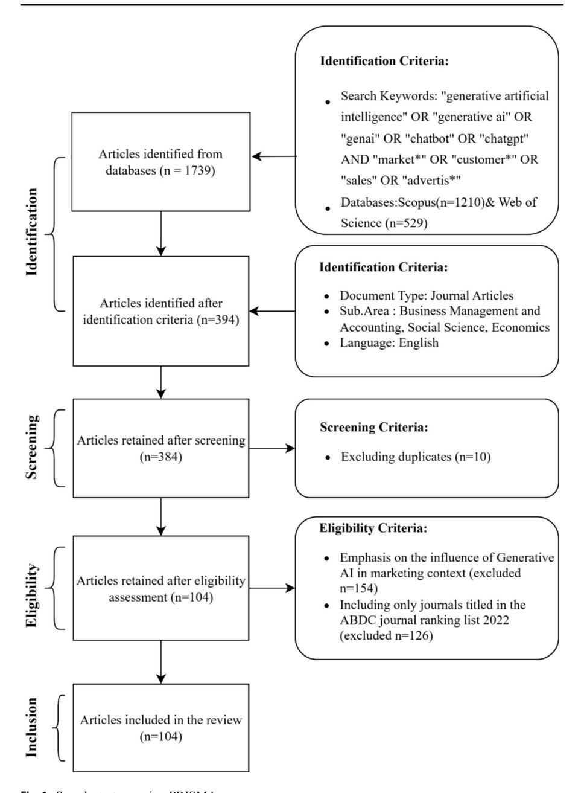
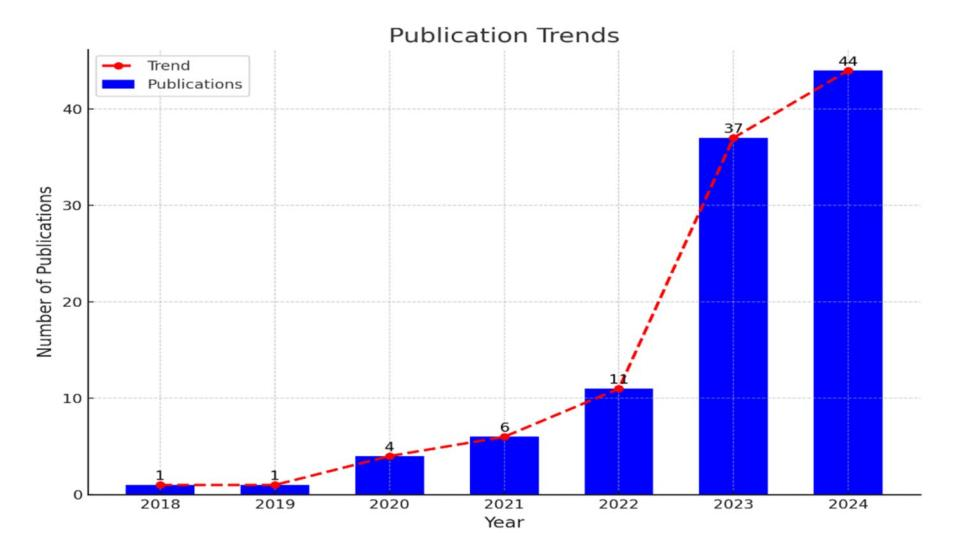
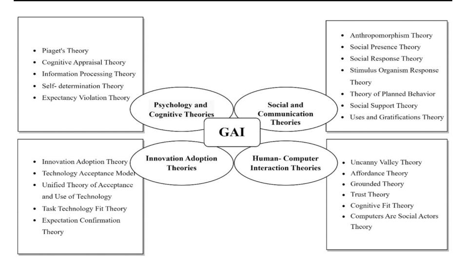

# **Transforming marketing landscapes: a systematic literatur[e](http://crossmark.crossref.org/dialog/?doi=10.1007/s11301-025-00486-9&domain=pdf) review of generative AI using the TCCM model framework**

**Akshara Prasanna1 · Bijay Prasad Kushwaha[1](http://orcid.org/0000-0001-5086-3400)**

Received: 4 March 2024 / Accepted: 15 January 2025 © The Author(s), under exclusive licence to Springer Nature Switzerland AG 2025

### **Abstract**

This study systematically reviews Generative AI in the marketing domain. It synthesizes fndings from 104 peer-reviewed articles indexed in Scopus and Web of Science and ranked by ABDC. Applying the TCCM framework examines key theories, contexts, characteristics, and methodologies within the marketing domain. It identifes four theoretical domains: psychology and cognitive theories, social and communication theories, innovation adoption theories, and human– computer interaction theories to understand Generative AI's impact on marketing. The study proposes future research directions across four themes: novel theoretical perspectives, unexplored research settings, original constructs and relationships, and innovative data and methods. It summarises potential research questions derived from the TCCM framework. Based on the fndings, a conceptual framework is proposed for Generative AI in marketing research, integrating contributions from both this study and prior research. These variables are essential for guiding future research in the feld of Generative AI in marketing.

**Keywords** Generative AI · Artifcial intelligence · TCCM model · Anthropomorphism · Systematic literature review

**JEL Classifcation** O15 · O33 · M10

### **1 Introduction**

In the contemporary digitalization landscape, technological advancements have become central to reshaping daily life, with artifcial intelligence (AI) emerging as a frontrunner in transforming various facets of our daily lives (Gursoy et al. [2023\)](#page-32-0).

Akshara Prasanna akshara.p2022@vitstudent.ac.in; aksharap23@gmail.com

1 VIT Business School, Vellore Institute of Technology, Vellore 632014, India

\* Bijay Prasad Kushwaha bijayrsm@gmail.com; bijayprasad.kushwaha@vit.ac.in

Generative artifcial intelligence (Generative AI) is one of the most groundbreaking and forward-thinking AI advancements in recent years (Kushwaha et al. [2021\)](#page-32-1). This discipline encompasses the development of intelligent machines capable of simulating human cognitive abilities (Pentina et al. [2023](#page-33-0)). This remarkable technology possesses the extraordinary potential to completely transform and reshape every aspect of modern life, as it can engage in complex cognitive processes such as thinking, reasoning, and decision-making, much like human beings. (Dwivedi et al. [2023a](#page-31-0), [b](#page-31-1)). Generative AI represents a category of artifcial intelligence technology characterized by machine learning systems that can produce several types of content, such as text, images, or code (Ramesh and Chawla [2022\)](#page-33-1). These systems typically respond to user prompts by generating content that simulates human-like output (Schuetzler et al. [2020\)](#page-33-2). The integration of Generative AI models is becoming more prevalent in online tools and chatbots, enabling users to input questions or instructions, with the AI generating responses that closely resemble human language (Dipaola et al. [2018](#page-31-2)). Acar ([2024\)](#page-30-0) underscores that Generative AI can transform marketing education by improving learning processes and resolving long-standing pedagogical challenges. The benefts span cost efectiveness, personalized approaches, and fostering creativity while calling for a thoughtful and strategic implementation approach. Similarly, Zhang and Prebensen [\(2024](#page-34-0)) explore the distinguishability and efcacy of tourism marketing materials created by ChatGPT versus traditional marketers, revealing that AI-generated content can achieve comparable levels of textual fuency and attractiveness, advocating for a co-creation relationship between AI and marketers. Bilgihan et al. ([2024\)](#page-31-3) provide a structured Generative AI marketing model, emphasizing personalization, customer engagement, and decision-making optimization while addressing ethical considerations in AI integration.

Generative AI chatbots utilize advanced deep learning and natural language processing (NLP) techniques to provide human-like text responses, showcasing improved natural language understanding (NLU) capabilities, reduced biases, and enhanced contextual comprehension (Jiang et al. [2023](#page-32-2); Srivastava and Prabhakar [2019](#page-34-1)). A signifcant portion of organizations, around 60 percent among AI adopters, now regularly integrate Generative AI into various functions, refecting its widespread adoption and utility. These chatbots leverage sophisticated deep learning methodologies, particularly relying on GPT (Generative Pre-trained Transformer) models, to interpret user input, context, and intent, crafting suitable and contextually ftting textual replies (Koc et al. [2023](#page-32-3)).

GAI ofers practical tools for creative tasks across industries, like marketing and content creation. As organizations increasingly leverage Generative AI in their marketing endeavors, they unlock new dimensions of creativity and efciency (Kar et al. [2023](#page-32-4)). This transformative technology opens new horizons by infusing marketing strategies with unique efciency and innovation (Saydam et al. [2022](#page-33-3)). Sands et al. ([2024\)](#page-33-4) provide six principles for responsible advertising using AI, emphasizing transparency, ethical guidelines, and accountability to balance innovation with responsible practices. The integration of AI allows for the automation of tasks that conventionally necessitate human cognitive abilities, paving the way for enhanced decision-making, personalized customer experiences, and

streamlined processes within the marketing domain (Orchard and Tasiemski [2023\)](#page-33-5). Companies can enhance human creativity and spur innovation through Generative AI, restructuring operations, crafting compelling marketing initiatives, identifying fraud, and producing lifelike virtual agents (Bakkouri et al. [2022\)](#page-30-1). With the right applications and data, businesses can explore new avenues, mitigate risks, update production, and automate tasks, resulting in groundbreaking solutions and costefective outcomes (Korzynski et al. [2023](#page-32-5)). It helps organizations achieve their goals within a shorter period. Chatbots driven by artifcial intelligence are designed to engage in conversations that mimic human interactions through NLP (Fu et al. [2023](#page-31-4)). Through NLP, these AI chatbots can comprehend written human language, allowing them to function autonomously to a signifcant extent (Ameen et al. [2022;](#page-30-2) Calvaresi et al. [2023\)](#page-31-5) Chatbots with these anthropomorphic characteristics will signifcantly impact the modern business world (Youn and Cho [2023\)](#page-34-2).

The utilization of Generative AI in marketing has received considerable scholarly and practical attention due to its fast advancement. Knowing the current state of research and identifying areas that need further investigation is crucial to develop an agenda for future investigations. Hence, the current article systematically reviews Generative AI's research landscapes in marketing, using the TCCM (Theory, Context, Characteristics, and Methodology) framework to evaluate and classify the existing studies. Further, it analyses the theoretical foundations, practical uses, unique features, and research methods that have infuenced the existing literature. The study provides a comprehensive overview of the current research and a solid basis for developing a unifed framework to direct future studies in this area. This study aims to achieve three main objectives: to analyze the current state of Generative AI research in marketing, to identify areas for further investigation, to identify the gaps and opportunities for future inquiry, and to propose a conceptual framework to enhance the knowledge in this area. Formulating potential research questions and establishing a conceptual framework aims to provide novel perspectives and methodologies to enhance the feld.

The outcomes of this study ofer a thorough overview of the current research and future research directions for researchers of Generative AI within the marketing domain. This aids them in identifying gaps in research by being aware of the existing works in this feld and planning their forthcoming studies. Moreover, the fndings of the TCCM framework furnish the readers with various theories, contexts, characteristics, and methodologies employed in previous studies. Consequently, they can better understand the existing literature on Generative AI in marketing and its implications from this study.

## **2 Generative artifcial intelligence in marketing**

The emergence of Generative AI represents a signifcant shift set to drive the adoption of AI on a large scale in businesses. Generative AI includes AI systems' remarkable abilities to create fresh content across diferent mediums, including text, images, and various media formats (Dogru et al. [2023](#page-31-6)). The advancements in Generative AI have signifcantly impacted various organisational functions,

with marketing being one of the key areas that have greatly benefted. Generative AI is considered a groundbreaking innovation in industries that depend on heavily on well-crafted written materials to efectively communicate with customers and stakeholders, like marketing and advertising (Peres et al. [2023\)](#page-33-6). Generative AI emerges as a powerful force reshaping the marketing landscape, fundamentally transforming how businesses engage with their target audience. The industry experiences a paradigm shift driven by powerful tools like GPT-3 in an everevolving marketing environment (Dwivedi et al. [2023a\)](#page-31-0). These advanced models open up unprecedented opportunities for marketers to revolutionize content creation, personalize customer interactions, and refne decision-making processes (Srivastava and Prabhakar [2019](#page-34-1)). This article examines the wide-ranging impacts of Generative AI on marketing, analyzing its applications while addressing the ethical considerations and challenges of this technological evolution. By navigating these complexities and adopting responsible practices, marketers can unlock the full potential of Generative AI, paving the way for the creativity and efectiveness of their campaigns.

Generative AI is an essential tool, signifcantly infuencing customer perspectives within the business landscape. This transformative technology enables personalized experiences, enhances communication, boosts efciency, and brings both opportunities and challenges (Ngai et al. [2021](#page-33-7)). Businesses' strategic deployment of Generative AI, coupled with a persistent commitment to transparency, ethical considerations, and a customer-centric approach, promises to meet and exceed customer expectations (Koc et al. [2023](#page-32-3); Block and Kuckertz [2024\)](#page-31-7). This strategic approach enables businesses to enhance customer perceptions and create continuing relationships with an increasingly tech-savvy and discerning customer base. As Generative AI evolves, businesses that use it responsibly and address challenges proactively are well-positioned to remain competitive and lead in a dynamic market environment (Chen et al. [2021](#page-31-8)).

# **3 Methodology**

In conducting the systematic literature review, we applied a mixed-method approach to examine the role of Generative AI in marketing and consumer behavior. Data were extracted from both Scopus and Web of Science using a comprehensive set of keywords, including "generative artifcial intelligence" OR "generative ai" OR "genai" OR "chatbot" OR "chatgpt" AND "market\*" OR "customer\*" OR "consumer\*" OR "sales" OR "advertis\*". We adhered to rigorous inclusion and exclusion criteria to mitigate potential biases, ensuring that only high-quality and relevant studies were included. Only peer-reviewed studies published in ABDC-ranked journals specifcally focused on Generative AI applications in marketing were included; non-peer-reviewed studies or those unrelated to marketing were excluded. The selection process was transparently documented using a PRISMA fow diagram (Fig. [1\)](#page-4-0), underscoring the thoroughness and integrity of our review.

Our methodological choices signifcantly impact the interpretation of our results. The study combined bibliometric analysis with the TCCM (theory, context,

**Fig. 1** Search strategy using PRISMA

characteristics, methodology) framework to systematically assess the literature, identifying the theoretical foundations, contextual infuences, and methodological trends. The combination of bibliometric analysis and the TCCM framework provides a holistic view of the research landscape, identifying not only the current state of

knowledge but also gaps and future research directions (Donthu et al. [2021;](#page-31-9) Paul and Rosado-Serrano [2019\)](#page-33-8). The bibliometric analysis highlights the evolution and trends in Generative AI research within marketing, allowing us to map the development of this feld. The TCCM framework ofers insights into the theoretical foundations, contextual applications, and methodological approaches guiding future research endeavors (Paul et al. [2023\)](#page-33-9).

### **4 Results and interpretation**

### **4.1 Publication trends**

The publication trends shown in Fig. [2](#page-5-0) highlight the increasing interest and research activities in Generative AI within the marketing feld, emphasizing its transformative possibilities. The frst study by Balasudarsun et al. [\(2018](#page-30-3)) studied the role of AI chatbots on platforms like Facebook Messenger, highlighting their ability to enhance customer engagement. Luo et al. [\(2019](#page-33-10)) broadened this exploration by examining how customers respond to AI chatbots psychologically and behaviorally, emphasizing the importance of transparency and human-like attributes in building trust and infuencing purchasing decisions.

The signifcant rise in publications in 2024, accounting for 42.3% of all research, refects the growing recognition of Generative AI's transformative potential across various industries. This increase can also be associated with the widespread adoption of advanced tools like ChatGPT, which have popularized generative capabilities and stimulated academic interest in their applications within marketing. Sectors such as hospitality, tourism, and e-commerce have actively integrated this technology to provide personalized customer experiences, optimize operations, and

**Fig. 2** Publication trends

maintain a competitive advantage (Flandrin et al. [2021](#page-31-10)). For example, advanced recommendation systems and automated customer support are transforming the online shopping experience (Yoon and Yu [2022\)](#page-34-3). The upward trend signals a shift from early exploratory studies to practical, real-world applications, emphasizing the growing complexity and importance of Generative AI in marketing.

### **4.2 Sources of generative AI in marketing articles**

Table [1](#page-7-0) shows a detailed analysis of journals that have published articles on Generative AI in marketing, along with key bibliometric indicators that refect the impact and quality of these publications. Most of these journals are Q1 journals, indicating their high ranking and infuence in the academic community, and high H-index values further validate their role in disseminating infuential research. The *Journal of Business Research* is the top-cited journal, with a total citation of 712 across three articles. This underscores its pivotal role in advancing research on Generative AI. The article by Chung et al. ([2020\)](#page-31-11), with 641 citations, demonstrates how chatbots enhance brand interaction and service in luxury fashion retail. This highlights the potential of Generative AI to foster personalized customer experiences and brand loyalty. *Marketing Science* is the second-highest journal in citation count, with 687 citations and 1 article. The study by Luo et al. ([2019\)](#page-33-10) in this journal identifed the importance of strategic communication and transparency in building consumer trust and acceptance of AI chatbots. These fndings emphasize the necessity of targeting market segments and leveraging experiential learning for successful adoption. The *International Journal of Information Management*, with 609 citations across two articles, contributes signifcantly to understanding the broader implications of Generative AI in information management and its practical applications in marketing. *Electronic Commerce Research and Applications* journal is the most productive journal in this review, with four published articles. Each study in this journal investigates various facets of using chatbots in customer service, from intelligent knowledge bases and service recovery strategies to the anthropomorphic characteristics of AI and their communication styles. The focus on optimizing chatbot interactions to improve customer experience indicates a growing recognition of the importance of AI in enhancing e-commerce platforms. Several other journals, like the *Journal of Retailing and Consumer Services* and the *Journal of Marketing*, feature prominently, with signifcant contributions by exploring the role of AI-driven marketing tools in infuencing consumer behavior, enhancing operational efciency, and driving innovative marketing strategies. The high impact and quality of the publications in these top-tier journals underscores the academic and practical signifcance of Generative AI in marketing, showcasing its diverse applications and growing impact in the digital marketing landscape.

Based on the publication trend *Computers in Human Behavior, Journal of Internet Commerce, Technology in Society, International Journal of Human–Computer Interaction, Electronic Commerce Research, International Journal of Contemporary Hospitality Management, IEEE Transactions on Engineering Management, Journal of Theoretical and Applied Electronic Commerce Research* and *Journal of* 

**Table 1** Sources of generative AI in marketing articles

| Journal                         | TP TC | TC/TP  | H-index | Quartile | SJR  | ABDC | Author(s)                                                                       |
|---------------------------------|----------|--------|---------|----------|------|------|---------------------------------------------------------------------------------|
| J. Bus. Res                     | 3 712 | 237.33 | 236     | Q1       | 2.9  | A    | Chung et al. (2020), (Kull et al. al. (2021), Darani et al. (2023)              |
| Mark. Sci                       | 1 687 | 687    | 145     | Q1       | 7.59 | A*   | (Luo et al. (2019)                                                              |
| Manage Int J Inf             | 2 609 | 304.5  | 152     | Q1       | 4.91 | A*   | Wang et al. (2022) (Dwivedi et al. (2023a, b),                               |
| J. Retail. Consumer. Serv       | 1 230 | 230    | 120     | Q1       | 2.54 | A    | Rese et al. (2020)                                                              |
| Mark J                       | 1 161 | 161    | 268     | Q1       | 10.8 | A*   | Miao et al. (2022)                                                              |
| Internet Res                    | 3 141 | 47     | 101     | Q1       | 1.65 | A    | Cheng et al. (2022), Chen et al. (2021), Lee et al. (2022)                      |
| Manag Inf Syst J             | 1 136 | 136    | 161     | Q1       | 3.06 | A*   | Schuetzler et al. (2020)                                                        |
| J. Internet Commer              | 2 122 | 61     | 36      | Q1       | 1.19 | B    | Han (2021), Zhang et al. (2023)                                                 |
| Manag Mark. Ind.          | 1 101 | 101    | 161     | Q1       | 2.66 | A*   | Kushwaha et al. (2021)                                                          |
| Technol. Soc                    | 2 72  | 36     | 69      | Q1       | 1.49 | C    | Windasari (2021), Koc et al. (2023) Selamat and                              |
| Electron Commer Res Appl        | 4 69  | 17.25  | 91      | Q1       | 1.31 | C    | Ngai et al. (2021), Song et al. (2022), Fu et al. (2023), Zhu et al. (2023a) |
| Tour. Rev                       | 1 56  | 56     | 48      | Q1       | 1.88 | B    | Carvalho and Ivanov (2024)                                                      |
| Comput. Hum. Behav              | 3 53  | 17.66  | 226     | Q1       | 2.46 | A    | Wu Konya-Baumbach et al. (2023), Jiang et al. (2023),Lin and (2023)       |
| Mark Int. J. Res.            | 1 50  | 50     | 115     | Q1       | 3.9  | A*   | Peres et al. (2023)                                                             |
| Int J Hum-Comput Int            | 2 44  | 22     | 83      | Q1       | 0.88 | B    | Jin and Youn (2023), Song and Shin (2022)                                       |
| Int. J. Advert                  | 1 43  | 43     | 74      | Q1       | 2.08 | A    | Lou et al. (2022)                                                               |
| Eur J Inf Syst                  | 1 35  | 35     | 119     | Q1       | 2.48 | A*   | Vassilakopoulou et al. (2023)                                                   |
| Electron. Commer. Res           | 2 33  | 16.5   | 46      | Q1       | 0.7  | A    | Martinez (2022), Dinh and Park (2023) Klein and                              |
| Manag Int. J. Contemp. Hosp. | 2 26  | 13     | 113     | Q1       | 2.5  | A    | (Dwivedi et al. (2023a, b), Law et al. (2023)                                   |
| Mark J. Financ. Serv.        | 1 24  | 24     | 25      | Q2       | 0.46 | B    | Lappeman et al. (2023)                                                          |
| Asian J. Bus. Res               | 1 20  | 20     | 8       | Q2       | 0.29 | C    | Balasudarsun et al. (2018)                                                      |
| Int J Consum Stud               | 1 19  | 19     | 88      | Q1       | 1.75 | A    | Shin et al. (2023)                                                              |
| Serv. Bus                       | 1 13  | 13     | 39      | Q1       | 0.9  | B    | Camilleri and Troise (2023)                                                     |
|                                 |          |        |         |          |      |      |                                                                                 |

| _             |  |
|---------------|--|
| Ö             |  |
| ĕ             |  |
| $\equiv$      |  |
| П             |  |
| -=            |  |
| Ξ             |  |
| 5             |  |
| õ             |  |
| _             |  |
| $\overline{}$ |  |
| <u>u</u>      |  |
| 9             |  |
| ā             |  |
|               |  |

| Journal                                      | TC | TP       | H-index TC/TP | Quartile | SJR  | ABDC | Author(s)                                     |
|----------------------------------------------|----|----------|------------------|----------|------|------|-----------------------------------------------|
| Manag. Rev Public                         | 11 | 11 1  | 87               | Q1       | 2.16 | A    | Maragno et al. (2022)                         |
| Manag IEEE Trans Eng                      | 10 | 5 2   | 103              | Q1       | 1    | A    | Sharma et al. (2022), Alsharhan et al. (2023) |
| J. Hosp. Tour. Res                           | 9  | 9 1   | 84               | Q1       | 1.36 | A    | Dogru et al. (2023)                           |
| J. Hosp. Tour. Technol                       | 8  | 8 1   | 42               | Q1       | 1.46 | B    | Zhu et al. (2023c)                            |
| Mark J. Interact.                         | 8  | 8 1   | 120              | Q1       | 4.09 | A    | Pavone et al. (2023)                          |
| J. Theor. Appl. Electron. Commer. Res        | 8  | 4 2   | 39               | Q1       | 0.77 | B    | Bălan (2023), Silva et al. (2023)             |
| Mark Electron.                            | 7  | 7 1   | 49               | Q1       | 1.55 | A    | Zhang et al. (2022)                           |
| Foresight                                    | 5  | 5 1   | 36               | Q2       | 0.48 | C    | Dhiman and Jamwal (2023)                      |
| Mark J. Res. Interact.                    | 5  | 2.5 2 | 50               | Q1       | 2.83 | B    | Jin and Eastin (2023), Zhu et al. (2023a)     |
| Asia Pac. J. Inf. Syst                       | 4  | 4 1   | 6                | Q3       | 0.18 | C    | Lim et al. (2020)                             |
| J Organ Behav                                | 3  | 3 1   | 205              | Q1       | 3.8  | A*   | Bankins et al. (2024)                         |
| J. Bus. Strategy                             | 3  | 3 1   | 45               | Q2       | 0.45 | B    | Kumar et al. (2023)                           |
| Mark. Commun J.                           | 2  | 2 1   | 56               | Q1       | 1.01 | B    | David-Ignatief et al. (2023)                  |
| Manag Tour                                | 1  | 1 1   | 236              | Q1       | 3.56 | A*   | Zhang et al. (2024)                           |
| Mark Eur J                                | 0  | – 1   | 146              | Q1       | 1.63 | A*   | Alabed et al. (2024)                          |
| Consumer Behavior in Tourism and Hospitality | 0  | – 1   | –                | –        | –    | B    | Nguyen et al. (2023)                          |
| Mark J. Serv.                             | 0  | – 1   | 119              | Q1       | 1.58 | A    | Youn and Cho (2023)                           |
| J. Organ. End User Comput                    | 0  | – 1   | 43               | Q2       | 0.59 | B    | Li et al. (2023)                              |
| Ann. Tour. Res                               | 0  | – 1   | 201              | Q1       | 3.43 | A*   | Meng et al. (2023)                            |
| Manag Glob. J. Flex. Syst.                | 0  | – 1   | 40               | Q1       | 1.07 | A    | Kar et al. (2023)                             |

*Research in Interactive Marketing* are the most productive journals of 2023 having two to three publications. Interestingly, 49% of the journals in this dataset have published only one article, of which 51% were published in 2023 and 2024, refecting the growing interest in this emerging feld. The *Journal of Business Research* and *Electronic Commerce Research and Applications* stand out for their consistent contributions, publishing at least one article annually since 2020.

## **4.3 Phase # 1 TCCM framework: theory (T)**

Table [2](#page-10-0) categorizes and quantifes the theories used in the 104 articles focusing on Generative AI in marketing research. It reveals a signifcant reliance on theoretical frameworks, with 66 articles (63%) grounded in theory, highlighting the importance of theoretical underpinnings in understanding Generative AI's role in marketing. However, the 38 articles (37%) lacking explicit theoretical frameworks suggest that there is still room for exploratory and descriptive studies in this rapidly evolving feld. The frequent use of Anthropomorphism Theory in six articles underscores the profound impact of human-like features in AI on consumer interactions and perceptions. This theory suggests that when AI mimics human traits, it can signifcantly enhance user engagement and trust, as noted by Klein and Martinez ([2022\)](#page-32-12). This trend points to an increasing acknowledgment of the psychological subtleties in human-AI interactions, especially regarding how consumers connect with and accept AI technologies. Social Presence Theory (SPT) is utilized in fve articles, which could indicate the importance of the chatbot's perceived presence in afecting user experience (Schuetzler et al. [2020](#page-33-2)). This theory suggests that the more socially present an AI feels, the more efective it is in engaging users, thereby enhancing satisfaction and loyalty. This underscores the critical role of perceived social presence in the design and implementation of AI-driven marketing tools. Innovation Adoption and Social Response Theory are used in 4 articles, which suggest that these theories are central to understanding how consumers adopt and respond to chatbot technologies, highlighting the importance of designing AI that aligns with consumer expectations and social norms (Kushwaha et al. [2021;](#page-32-1) Kull et al. [2021\)](#page-32-6). The application of Uncanny Valley Theory highlights the fne balance needed when designing AI that is human-like but not unsettling. This theory, along with the Technology Acceptance Model (TAM) and Unifed Theory of Acceptance and Use of Technology (UTAUT), is mostly used in e-commerce and service sector studies, emphasizing the factors that infuence user acceptance and the usability of AI technologies. These theories highlight the complexities of human-technology interactions and the importance of user-friendly design in enhancing the adoption of Generative AI (Song and Shin [2022](#page-34-8); Shin et al. [2023](#page-33-15)). The application of Afordance Theory, Cognitive Appraisal Theory, and Grounded Theory illustrates a comprehensive approach to examining the varied efects of Generative AI. These theories explore user perceptions and interactions with AI, emotional responses, and contextual infuences, highlighting the complex relationship between technology design, user perception, and context (Vassilakopoulou et al. [2023](#page-34-9); Shin et al. [2023](#page-33-15); Maragno et al. [2022\)](#page-33-16). The use of diverse theories in these studies emphasizes the complexity of integrating

| Theory                                                    | % N articles | Author (s)                                                                                                                                                 |
|-----------------------------------------------------------|-----------------|------------------------------------------------------------------------------------------------------------------------------------------------------------|
| Without theory                                            | 37 38        |                                                                                                                                                            |
| With theory                                               | 63 66        |                                                                                                                                                            |
| Total                                                     | 100 104      |                                                                                                                                                            |
| Anthropomorphism theory                                   | 6 6          | Wu (2023), David-Ignatief Martinez (2022) Cheng et al. (2022), Camilleri and Troise (2023), Lin and et al. (2023), Youn and Cho (2023), Klein and |
| Social presence theory (SPT)                              | 5 5          | Schuetzler et al. (2020), Konya-Baumbach et al. (2023), Dinh and Park (2023), Youn and Cho (2023), Alsharhan et al. (2023)                              |
| Innovation adoption theory                                | 4 4          | Zhang et al. (2023), Li et al. (2023), Kushwaha et al. (2021), Camilleri and Troise (2023)                                                                 |
| Social response theory                                    | 4 4          | Kull et al. (2021), Song et al. (2022), Zhu et al. (2023a), Cheng et al. (2022)                                                                            |
| Uncanny valley theory                                     | 4 4          | Song and Shin (2022), Shin et al. (2023), Lou et al. (2022), Law et al. (2023)                                                                             |
| M) Technology acceptance model (TA                     | 5 3          | Rese et al. (2020), Bălan (2023), Alsharhan et al. (2023)                                                                                                  |
| Unifed theory of acceptance and use of technology (UTAUT) | 3 3          | Bankins et al. (2024), Shin et al. (2023), Law et al. (2023)                                                                                               |
| Afordance theory                                          | 3 3          | Vassilakopoulou et al. (2023), Bankins et al. (2024), Camilleri and Troise (2023)                                                                          |
| Cognitive appraisal theory                                | 3 3          | Shin et al. (2023), Pavone et al. (2023), Law et al. (2023)                                                                                                |
| Grounded theory                                           | 2 2          | Maragno et al. (2022), Li et al. (2023)                                                                                                                    |
| Model) Stimulus organism response theory (SOR          | 2 2          | Zhu et al. (2023a), Chen et al. (2021)                                                                                                                     |
| Trust theory                                              | 2 2          | Kushwaha et al. (2021), Li et al. (2023)                                                                                                                   |
| Task- technology ft theory (TTF)                          | 2 2          | Jiang et al. (2023), Dhiman and Jamwal (2023)                                                                                                              |
| Expectation confrmation theory (ECT)                      | 2 2          | Miao et al. (2022) Dhiman and Jamwal (2023),                                                                                                            |
| Expectancy violation theory (EVT)                         | 2 2          | Song et al. (2022), Zhang et al. (2022)                                                                                                                    |
| Cognitive ft theory (CFT)                                 | 2 2          | Chen et al. (2021), Camilleri and Troise (2023)                                                                                                            |
| Computers-are-social-actors (CASA) theory                 | 2 2          | Jin and Eastin (2023), Alsharhan et al. (2023)                                                                                                             |
| Theory of planned behavior (TPB)                          | 1 1          | Dwivedi et al. (2023a, b)                                                                                                                                  |
| Social support theory                                     | 1 1          | Lee et al. (2022)                                                                                                                                          |
| Piaget's theory                                           | 1 1          | Jin and Youn (2023)                                                                                                                                        |

| (continued) Table 2               |                 |                                |
|--------------------------------------|-----------------|--------------------------------|
| Theory                               | % N articles | Author (s)                     |
| Self- determination theory (SDT)     | 1               | Dinh and Park (2023) 1      |
| Information processing theory        | 1               | Zhang et al. (2022) 1       |
| Theory of disruptive debottlenecking | 1               | Dwivedi et al. (2023a, b) 1 |
| Uses and gratifcations theory (UGT)  | 1               | Rese et al. (2020) 1        |

**Fig. 3** Classifcation of theories used

Generative AI into marketing. These theoretical frameworks not only lay a solid foundation for understanding consumer- AI interactions but also inform the creation of more advanced, user-focused AI technologies. The reliance on these theories refects the need to address the psychological, social, and technological dimensions of Generative AI, ensuring its integration into marketing is efective and ethical.

The articles that are reviewed and published in journals represent a diverse range of theoretical foundations. To facilitate comprehension, we have organized the commonly used theories in Generative AI in marketing studies under four themes: psychology and cognitive theories, social and communication theories, innovation adoption theories, and human–computer interaction theories. These categories are illustrated in Fig. [3.](#page-12-0)

### **4.3.1 Theme # 1 psychology and cognitive theories**

Psychology and cognitive theories play a crucial role in guiding the use of Generative AI in marketing by providing detailed insights into user behavior and interactions. For instance, Piaget's Theory, which focuses on cognitive development stages, can be used to customize AI interfaces for various user demographics. This approach allows marketing AI to adjust its complexity depending on whether it is dealing with a younger or older audience, ensuring the content remains engaging and easy to understand (Jin and Youn [2023\)](#page-32-11). The Cognitive Appraisal Theory examines users' emotional responses to various stimuli, crucial for crafting AI-generated content that emotionally connects with users. This could involve a Generative AI system analyzing users' real-time reactions to an advertisement and modifying its tone or message to ensure a positive user experience (Shin et al. [2023\)](#page-33-15). The Information Processing Theory signifcantly impacts how Generative AI systems manage and present information, guaranteeing optimal understanding for users (Zhang et al. [2022\)](#page-34-12). The

progress of AI-powered experiences that promote users' autonomy and engagement is shaped by the Self-Determination Theory (Dinh and Park [2023\)](#page-31-15). Applying the Expectancy Violation Theory can optimize the efcacy of AI responses by aligning them with consumers' expectations, enhancing the total marketing infuence (Song et al. [2022\)](#page-34-6).

### **4.3.2 Theme # 2 social and communication theories**

When using Generative AI for marketing purposes, it is crucial to incorporate social and communication theories to create engaging and relatable interactions. These theories provide a foundation for understanding and enhancing how AI can interact with users, ensuring that the technology meets and exceeds marketing objectives. The theories grouped under this theme are particularly relevant in the context of Generative AI, as they guide the design and implementation of AI systems that can efectively communicate and connect with users. Anthropomorphism is essential as it attributes human characteristics or behavior to non-human entities, such as animals or objects (Cai et al. [2022](#page-31-19)). By giving AI human-like characteristics, marketers can foster a stronger connection and build trust with users, making the interactions feel more personal and engaging (Cheng et al. [2022](#page-31-13)). Social Presence Theory enhances the communication experience by promoting a relationship that resembles human interaction (Schuetzler et al. [2020\)](#page-33-2). By fostering a sense of human presence in AI interactions, marketers can create a more immersive and satisfying user experience. Generative AI marketing involves designing AI that engages users in a personalized and responsive manner, strengthening customer relationships and building loyalty (Johnson and Hong [2023;](#page-32-19) Theres et al. [2023](#page-34-14)). The Stimulus-Organism-Response Theory infuences how AI responds to user stimuli to enhance engagement, suggesting that AI can be programmed to react to user inputs to increase interaction quality and satisfaction (Zhu et al. [2023b](#page-34-15)). AI systems can dynamically adjust their responses based on user behavior, resulting in more personalized and efective marketing interactions (Liu et al. [2023\)](#page-33-21). The Theory of Planned Behavior is crucial for crafting persuasive AI messaging, as it aids in designing communications that infuence user decisions and behaviors, essential for efective marketing (Dwivedi et al. [2023b](#page-31-1)). By anticipating and understanding user intentions, AI can create messages that more efectively drive desired outcomes, like purchase or content engagement. The Social Support Theory highlights the importance of AI in ofering valuable assistance and enhancing user satisfaction through perceived helpfulness and support (Lee et al. [2022\)](#page-32-7). Marketing involves creating AI systems that deliver timely, relevant customer support, improving their experience and fostering loyalty. Uses and Gratifcation Theory is crucial for customizing AI content to cater to users' precise requirements and preferences in marketing scenarios. This theory suggests that by understanding what users seek from interactions, AI can deliver highly personalized content by understanding user desires (Rese et al. [2020](#page-33-11)). Generative AI marketing translates to developing AI systems that adjust content and interactions based on individual preferences, resulting in more efective and engaging marketing campaigns. The thorough incorporation of theories enhances Generative AI's delicate and efcient utilization in marketing initiatives. Incorporating social and

communication theories into Generative AI for marketing provides a framework for designing AI systems that are efective, engaging, and relatable, guiding the development of interactions that build strong user connections, enhance satisfaction, and efciently achieve marketing goals.

### **4.3.3 Theme # 3 innovation adoption theories**

In applying Generative AI in marketing, understanding user acceptance and adoption is paramount. Innovation adoption theories serve as valuable frameworks in this regard. The Innovation Adoption Theory delineates users' sequential phases, aiding marketers in tailoring strategies for diferent user segments (Zhang et al. [2023](#page-34-5)). This theory is particularly useful for marketers, as it allows them to tailor their strategies for diferent user segments based on their position in the adoption cycle. For instance, early adopters might require diferent engagement tactics than those in the later stages of adoption. The Technology Acceptance Model assesses users' perceptions of the simplicity and utility of Generative AI and heavily infuences their adoption decisions (Rese et al. [2020](#page-33-11)). By understanding these factors, marketers can develop Generative AI systems that are more user-friendly and efectively highlight their practical advantages, promoting broader adoption. The Unifed Theory of Adoption and Use of Technology integrates various factors impacting users' acceptance, providing a comprehensive framework (Shin et al. [2023](#page-33-15)). This theory helps marketers identify and address the diverse elements that afect user decisions, such as social infuence, facilitating conditions, and user experience with technology. Task-Technology Fit Theory ensures the seamless alignment of Generative AI with marketing tasks, optimizing its efectiveness (Jiang et al. ([2023\)](#page-32-2). This alignment is crucial for ensuring that the AI tools meet user expectations and enhance marketing eforts' efciency and efectiveness. These theories collectively guide marketers in strategically implementing and enhancing the adoption of Generative AI in marketing practices. They help understand the user journey, address perceptions and barriers, and ensure that AI tools are efectively integrated into marketing tasks, ultimately leading to more successful marketing outcomes.

### **4.3.4 Theme # 4 human–computer interaction theories**

Human–computer interaction (HCI) ideas are essential in creating user experiences when implementing Generative AI in marketing. These theories provide insights into user behavior, preferences, and the psychological aspects of interacting with AI, ensuring that Generative AI systems are designed to meet user needs efectively. The HCI theories grouped under this theme are particularly relevant to Generative AI in marketing, as they guide the creation of user-friendly, engaging, and trusty AI interfaces. The Uncanny Valley Theory pertains to the discomfort experienced by users when Generative AI exhibits a high degree of human likeness (Lou et al. [2022](#page-33-14)). It guides designers in developing AI interfaces that strike a delicate balance between resembling humans and avoiding feelings of discomfort. By avoiding the uncanny valley, marketers can ensure their AI tools are engaging and comfortable

for users, enhancing the overall user experience. Afordance Theory shapes the design of AI interfaces, guaranteeing that users can efortlessly comprehend and engage with Generative AI systems (Bankins et al. [2024\)](#page-30-6). In the context of marketing, this means creating AI tools that are easy to use, thereby increasing user adoption and satisfaction. Grounded Theory facilitates comprehension of user behaviors and preferences, guiding the creation of AI systems customized to user requirements (Maragno et al. [2022\)](#page-33-16). This customization is key to creating efective marketing tools that resonate with users and drive engagement. The application of Trust Theory is crucial in cultivating user assurance in Generative AI, promoting clear communication and dependable performance in AI systems (Li et al. [2023\)](#page-32-18). In marketing, trust is crucial as it encourages users to interact with AI tools, leading to higher adoption rates and more efective marketing strategies. Cognitive Fit Theory assures that the interaction between users and Generative AI is congruent with users' cognitive processes, optimizing usability (Chen et al. [2021](#page-31-8)). For marketers, this means designing AI tools that are not only easy to use but also align with how users think and process information, enhancing the efectiveness of marketing campaigns. The Computers Are Social Actors Theory recognizes users' psychological inclination to perceive computers as social beings, infuencing the development of AI interfaces that enable seamless and captivating interactions (Reeves and Nass [1996](#page-33-22)). Leveraging this psychological inclination can lead to more natural and engaging user experiences, driving user interaction and satisfaction (Jin and Eastin [2023](#page-32-15)). These theories in HCI collectively enhance the efcient incorporation and exploitation of Generative AI in applications that prioritize user needs.

### **4.4 Phase # 2 TCCM framework: context (C)**

Our study summarizes the research context used in Generative AI in marketing research, detailed in Table [3.](#page-15-0) We analyzed 104 articles, revealing a strong focus on the tourism industry, followed by the fashion, hotel, and retail sectors. E-commerce

**Table 3** Context used in generative AI in marketing studies

| Industry/ Country/ Online platforms | Articles                                                                                                       |
|-------------------------------------------|----------------------------------------------------------------------------------------------------------------|
| Tourism                                   | Dwivedi et al. (2023a), Carvalho & Ivanov 2024), Jin and Youn (2023), Dogru et al. (2023)                   |
| Fashion                                   | Chung et al. (2020), Rese et al. (2020), Jin and Youn (2023)                                                   |
| Hotel                                     | Jin and Youn (2023), Nguyen (et al. 2023)                                                                      |
| Retail                                    | Chung et al. (2020), Kumar et al. (2023),Zhu et al. (2023a)                                                    |
| E-commerce                                | Konya-Baumbach et al. (2023), Zhu et al. (2023a), Zhang et al. (2022), Fu et al. (2023), Zhu et al. (2023b) |
| China                                     | Luo et al. (2019), Cheng et al. (2022), Lee et al. (2022), Jiang et al. (2023), Zhu et al. (2023a, b,c)     |
| US                                        | Han (2021), Kull et al. (2021), Lou et al. (2022), Wang et al. (2022), Shin et al. (2023)                   |

platforms are crucial in Generative AI research, with signifcant contributions from China and the US.

### **4.4.1 Tourism**

Integrating Generative AI into the tourism sector has facilitated and personalized various operations. Automated content generation enables the system to produce captivating descriptions of destinations and virtual tours, enhancing user engagement and experience (Dwivedi et al. [2023b](#page-31-1)). AI chatbots ofer tailored recommendations and language translations, making travel more accessible and personalized for visitors. This technology optimizes dynamic pricing strategies and customizes travel itineraries based on individual preferences, signifcantly enhancing customer satisfaction and operational efciency (Dwivedi et al. [2023a\)](#page-31-0). Furthermore, Generative AI enhances crisis communication and trend prediction, crucial for maintaining service quality and responding to market changes efectively (Dogru et al. [2023](#page-31-6)). By leveraging enhanced visuals, promotional materials become more engaging, fundamentally transforming the travel industry by delivering visually appealing, personalized, and seamless experiences to service providers and passengers. These advancements indicate a shift towards more customer-centric and efcient tourism operations.

### **4.4.2 Fashion**

Generative AI is crucial in fashion since it greatly contributes to design innovation, pattern development, and personalization. AI algorithms enable designers to investigate innovative concepts and produce complicated patterns, ultimately promoting originality and diversity in fashion collections (Dogru et al. [2023\)](#page-31-6). This technology facilitates customized client experiences by analyzing individual preferences, enabling more tailored and engaging interactions (Dwivedi et al. [2023a](#page-31-0)). Virtual try-on tools improve the online purchasing experience, making it more interactive and tailored to customer needs. Generative AI plays a crucial role in fashion supply chain management by accurately forecasting trends and assisting in content creation, which leads to more sustainable and efcient processes. By leveraging Generative AI, fashion frms can optimize their design processes and stay ahead of trends, ensuring they remain adaptable and competitive in a rapidly evolving industry. These advancements highlight the transformative potential of Generative AI in marketing the fashion industry more innovative, customer-centric, and efcient.

### **4.4.3 Hotel**

Generative AI transforms the hotel industry by simplifying guest interactions through AI-powered chatbots that provide tailored recommendations and support. These AI-driven in-room assistants signifcantly enhance guest experiences by ofering personalized information and insider tips, making stays more enjoyable and customized. Generative AI algorithms improve operational efciency by

accurately predicting demand, optimizing pricing strategies, and assisting with room assignments. This ensures that resources are used efectively and guest needs are met promptly (Jin and Youn [2023](#page-32-11)). This technological advancement leads to smoother operations and improved decision-making and boosts client satisfaction by creating a more efcient and personalized hospitality environment (Carvalho and Ivanov [2024\)](#page-31-14). The ability of Generative AI to adapt and respond to individual guest preferences and operational challenges highlights its transformative impact on the hospitality industry, making it more dynamic and responsive to both market demands and guest expectations (Xin et al. [2021\)](#page-34-16). This shift towards AI-driven personalization and efciency underscores the importance of innovative technologies in enhancing the overall guest experience and operational performance in the hotel sector (Jin and Youn 2024).

### **4.4.4 Retail**

Generative AI transforms the retail industry by signifcantly enhancing customer experiences and operational efciency (Zhu et al. [2023c](#page-34-10)). AI-powered recommendation engines analyze vast amounts of data to provide personalized suggestions, improving the shopping experience and increasing customer satisfaction (Rese et al. [2020](#page-33-11)). Generative AI-driven chatbots further elevate customer interaction by providing instant support and facilitating seamless transactions, making the shopping process more engaging and efcient (Chung et al. [2020](#page-31-11)). Generative AI algorithms optimize inventory management by accurately predicting demand and preventing stock issues, which ensures that retailers can meet customers' needs without overstocking. Innovations such as visual search and virtual try-on technologies are revolutionizing product discovery, seamlessly integrating online and in-store shopping experiences, and ofering a new level of convenience and personalization (Liu et al. [2023](#page-33-21)). These advancements enable retailers to create a more efcient, engaging, and dynamic environment, transforming industry interactions, operations, and decision-making processes (Kumar et al. [2023](#page-32-17)). The adoption of Generative AI in retail underscores the shift towards a more data-driven, customer-centric approach, highlighting its potential to redefne traditional retail models and enhance overall business performance,

### **4.4.5 E‑commerce**

AI-driven recommendation engines enhance user engagement by ofering tailored product suggestions that align with individual preferences, thereby increasing the likelihood of purchases and customer satisfaction (Zhu et al. [2023b](#page-34-15)). Realtime customer support through Generative AI-powered chatbots ensures shoppers receive immediate assistance, enhancing their overall experience and fostering brand loyalty. Visual search and virtual try-on features enrich the online shopping experience more interactive and personalized, helping customers make better purchasing decisions (Zhang et al. [2022\)](#page-34-12). Generative AI algorithms also play a critical role in optimizing pricing strategies, managing inventory levels efciently, and fraud detection, which collectively improves operational efciency

and security (Zhu et al. [2023a](#page-34-7)). By accurately predicting market trends, refning user interfaces, and assisting in content creation, Generative AI enhances the overall competitiveness of e-commerce platforms. This technological integration streamlines operations and creates a more engaging and efcient shopping journey, ultimately leading to higher customer satisfaction and improved business performance (Konya- Baumbach et al. 2023). The adoption of Generative AI in e-commerce exemplifes a shift towards more intelligent, responsive, and usercentric online retail environments.

### **4.4.6 Countries**

Substantial investments in research drive China's leadership in Generative AI studies, proactive government initiatives prioritizing AI, and the presence of top-tier academic institutions. These factors, combined with robust industry collaborations and a thriving tech ecosystem, underscore China's strategic focus on enhancing global competitiveness (Lee et al. [2022\)](#page-32-7). This comprehensive and concerted efort has positioned China as a prominent contributor to Generative AI research on national and international fronts. The synergy between government, academia, and industry in China facilitates innovative research and rapid implementation, reinforcing its dominant position in the AI landscape (Jiang et al. [2023\)](#page-32-2). Similarly, the United States maintains its prominent position in Generative AI research through renowned universities and leading technology companies, which foster creativity and attract top talent (Han [2021](#page-32-8)). The United States excels in AI innovation due to supportive policies and initiatives that drive groundbreaking research, further cementing its leadership in this feld (Shin et al. [2023\)](#page-33-15). The interplay between public policy, educational excellence, and industry innovation in both countries highlights their strategic approaches to sustaining and advancing their dominance in Generative AI research, showcasing their pivotal roles in shaping the future of AI technology globally.

### **4.5 Phase # 3 TCCM framework: characteristics / variables used in generative AI in marketing studies**

Table [4](#page-19-0) organizes the most dominant characteristics and variables from Generative AI marketing studies into categories like consumer perception, customer outcomes, customer response, branding, and customer touchpoints, along with the articles. Table [4](#page-19-0) categorizes the most dominant variables studied by the researchers over past studies. Along with the articles, we grouped them under diferent headings, such as consumer perception, customer outcomes, customer response, branding, and customer touchpoints. Diferent authors have used these variables in each group as antecedents, mediators, moderators, and outcomes, depending on the nature of the study.

Table 4 Characteristics/ variables used in generative AI in marketing studies

| Characteristics / Variables                                                                                    | Author(s)                                                                                                                                                                                |
|----------------------------------------------------------------------------------------------------------------|------------------------------------------------------------------------------------------------------------------------------------------------------------------------------------------|
| Consumer perception Perceived enjoyment Perceived ease of use Anthropomorphism Perceived usefulness            | Selamat and Windasari (2021), Konya-Baumbach et al. (2023), Shin et al. (2023), Han (2021), David-Ignatieff et al. (2023), Fu et al. (2023), Li et al. (2023), Klein and Martinez (2022) |
| Perceived risk  Customer outcomes  Trust  Reliance  Resistance                                                 | Cheng et al. (2022), (Lappeman et al. (2023), Song and Shin (2022), Jiang et al. (2023)                                                                                                  |
| Customer response/ attitude Chatbot usage intention Shopping intention Purchase intention Behavioral intention | Rese et al. (2020), Alsharhan et al. (2023), Chen et al. (2021), Lee et al. (2022), Jin and Youn (2023), Jin and Eastin (2023)                                                           |
| Branding Brand- self-distance Brand engagement Brand affiliation Brand intimacy Brand trustworthiness          | Kull et al. (2021), Lin and Wu (2023), Kumar et al. (2023)                                                                                                                               |
| Consumer touchpoint Information quality Service quality Communication quality Communication competence         | Kushwaha et al. (2021), Zhu et al. (2023a), Chung et al. (2020)                                                                                                                          |

#### 4.5.1 Consumer perception

The relationship between consumer perception variables in the context of Generative AI is interconnected and is essential for user acceptance. Perceived enjoyment, perceived ease of use, anthropomorphism, perceived usefulness, and perceived risk are commonly used antecedents in Generative AI-related marketing research to evaluate the effectiveness of chatbot service interactions. The user's perception of ease of use is closely related to their level of enjoyment, as a smooth and seamless experience can greatly enhance overall enjoyment (Shin et al. 2023). Anthropomorphism attributing more human-like qualities to Generative AI is associated with higher perceived enjoyment and ease of use, particularly when the Generative AI exhibits relatable human characteristics (Selamat and Windasari 2021). Perceived ease of use influences the perception of Generative AI's usefulness, as a user-friendly system is deemed more practical (Fu et al. 2023).

The link between perceived usefulness and enjoyment emphasizes that users enjoy Generative AI experiences that efectively meet their needs (Han [2021\)](#page-32-8). However, perceived risk can be a potential deterrent, afecting enjoyment, ease of use, and usefulness perceptions (Klein and Martinez [2022](#page-32-12)). The perceived risk signifcantly impacts consumer trust toward chatbots; if the risk is less, customers will trust and adopt chatbot services (Jiang et al. [2023](#page-32-2)). Recognizing and managing these relationships is crucial for designing Generative AI systems that align with user expectations, fostering positive perceptions and acceptance.

### **4.5.2 Customer outcomes**

The complex and ever-changing relationship between customer outcomes in Generative AI marketing, such as trust, reliance, and resistance, highlights the complicated relationships. Building trust with customers is crucial for the success of any AI system (Cheng et al. [2022\)](#page-31-13). Trust is considered an antecedent that impacts the customer's reliance on trust and resistance to change, which are the outcome variables. This can be achieved by ensuring that the AI is seen as trustworthy, transparent, and consistently reliable, fostering a positive relationship with users (Lappeman et al. [2023](#page-32-14)). As trust strengthens, customers become more dependent on Generative AI-driven recommendations and interactions (Cheng et al. [2022\)](#page-31-13). Nevertheless, there might be some resistance if a breach of trust or dissatisfaction arises, resulting in uncertainty and a reluctance to adopt the Generative AI fully (Jiang et al. ([2023\)](#page-32-2). The delicate balance emphasized here points out the signifcance of continuous enhancements and ethical deliberations in AI marketing implementations.

### **4.5.3 Customer response/ attitude**

Several key outcome variables, including chatbot usage, shopping, purchase, and behavioral intentions, infuence the customer response and attitude towards Generative AI in marketing. These constructs help researchers and marketers understand and forecast how consumers may engage with Generative AI technologies and how these interactions infuence consumer behavior toward products or services (Chen et al. [2021\)](#page-31-8). Chatbot usage intention refers to the customers' willingness and inclination to engage with AI-powered chatbots (Rese et al. [2020](#page-33-11)). Shopping intention is the consumers' likelihood to engage in shopping, which can be infuenced by the infuence of Generative AI technologies that assist the users to navigate and explore products on e-commerce platforms easily (Alsharhan et al. [\(2023](#page-30-4)). Personalized recommendations of Generative AI will enhance the purchase intention outcome, and behavioral intentions are infuenced by antecedents like perceived usefulness and ease of use of Generative AI technologies (Jin and Youn [2023\)](#page-32-11). This ofers valuable insights into how Generative AI can improve consumer engagement and decision-making processes.

### **4.5.4 Branding**

Branding-related variables used in Generative AI in marketing studies include brand self-distance, engagement, afliation, intimacy, and trustworthiness. These variables explore the relationship between customers and brands in the context of Generative AI-driven marketing strategies. The degree of separation customers perceive between the brand and themselves, infuenced by personalized content, is refected in brand-self distance (Kull et al. [2021\)](#page-32-6). The extent of customer involvement and interactions enabled by Generative AI determine the brand engagement and the sense of connection and belongingness evolved through these engagements, resulting in brand afliation. A deep emotional connection arises through the use of Generative AI technologies, which are explained in the concept of brand intimacy. These connections signifcantly infuence how consumers perceive a brand's trustworthiness, showcasing the wide-ranging efects of Generative AI on brand-consumer relationships (Kumar et al. ([2023](#page-32-17)).

### **4.5.5 Consumer touchpoint**

Touchpoints refer to the specifc instances when businesses and customers interact during the customer's journey. These instances have a substantial impact on both the customer's experience and their image of the brand. Businesses may enhance their customer journey by strategically identifying and highlighting important interaction places on a map, allowing them to take advantage of timely opportunities (Chung et al [2020\)](#page-31-11). Social media, online advertisements, digital marketing content, peer referrals, product catalogs, e-commerce, etc., are some examples of customer touchpoints. Information quality, service quality, communication quality, and competence infuence customer touchpoints while using Generative AI in marketing. Information quality ensures the content is more reliable, informative, and meets the user's needs (Zhu et al. [2023b](#page-34-15)). Service quality emphasizes the excellence and reliability of the services ofered by Generative AI and evaluates how well these services meet customer expectations and deliver value. Communication quality is another crucial factor in that the messages conveyed by Generative AI are easily understandable and align with the brand's communication standards (Chung et al. [2020\)](#page-31-11). The ability of the Generative AI system to interact in a manner perceived as socially competent is considered the technology's communication competence. Kushwaha et al. [\(2021](#page-32-1)) identifed touchpoints and specifc factors, like perceived risk, brand trustworthiness, and sensory appeal, as antecedents in Generative AI in marketing studies. All these factors defne the customer experience at various touchpoints, infuencing satisfaction and trust in Generative AI-driven marketing interactions.

**Table 5** Methods used in articles on Generative AI in marketing research

| Method                            | N articles | %  |
|-----------------------------------|------------|----|
| Quantitative                      | 57         | 55 |
| Survey (including questionnaires) | 21         | 20 |
| Experiment                        | 36         | 35 |
| Qualitative                       | 19         | 18 |
| Interview                         | 6          | 6  |
| Case study                        | 2          | 2  |
| Thematic analysis                 | 11         | 6  |
| Mixed                             | 2          | 2  |
| Others                            | 26         | 25 |

Bold indicates types of research

### **4.6 Phase # 4 TCCM framework: methodologies (M)**

Table [5](#page-22-0) summarises the research design characteristics of the articles reviewed for the study, presenting the number of articles and the percentage of each method's representation. The reviewed articles on Generative AI in marketing predominantly utilize quantitative methods, with 55% (57 out of 104) favoring this approach. This preference underscores the industry's reliance on numerical data and statistical analysis in Generative AI research, especially within fashion brands and the tourism sector. Survey-based approaches are utilized in 21 articles by which the researchers collected data through standardized questionnaires, and 36 articles adopted experimental designs, often incorporating Social Presence Theory to examine the psychological efects of Generative AI in social interactions. Qualitative methods were applied in 19 articles, employing interviews, case studies, and thematic analysis. Thematic analysis, used in 11 of these studies, proved essential for identifying patterns and themes within qualitative data, providing depth that quantitative methods alone might not capture. The use of a mixed-method approach was less common, seen in only 2 articles, suggesting a potential area for further research that combines the strengths of both qualitative and quantitative approaches. Twenty-six articles employed a range of unspecifed methodologies, refecting the methodological diversity within the feld. This analysis highlights the dominant research methods and points to opportunities where future studies could beneft from employing more integrated and varied approaches.

### **5 Future research directions**

This extensive literature review has given us deep insight into Generative AI's various theoretical aspects and practical uses in marketing. While there are diferent viewpoints in the existing literature regarding the applicability and value of

**Table 6** Potential research questions of generative AI in marketing based on the TCCM framework

### TCCM framework Potential research questions

### Novel theoretical perspectives (Theory) *Anthropomorphism theory:*

How do generative AI's anthropomorphic qualities afect consumer engagement and decisionmaking?

Can human-like generative AI features afect the emotional connection between consumers and brands?

How do diferent demographic groups respond to anthropomorphism in marketing Generative AI?

### *TAM & UTAUT:*

How do generative AI tools' perceived usefulness and ease of use infuence marketers' adoption intentions?

What is the role of social infuence in the acceptance of Generative AI technology among consumers in diferent marketing contexts?

How do generative AI-integrated marketing technologies impact marketing professionals' job roles and skill requirements?

*Social presence theory:*

How does the social presence of generative AI chatbots afect customer satisfaction and loyalty in digital marketing?

How does generative AI's perceived social presence impact consumer engagement on online marketing platforms?

How does the social presence of Generative AI in e-commerce impact purchasing behaviors and choice-making processes?

*Theory of planned behavior:*

How do consumers' attitudes toward Generative AI in marketing afect their actual use of technology?

What role does the perceived behavioral control over Generative AI tools play in marketers' decision to implement these technologies in their marketing strategies?

| Table 6 (continued)                    |                                                                                                                                         |  |  |  |
|----------------------------------------|-----------------------------------------------------------------------------------------------------------------------------------------|--|--|--|
| TCCM framework                         | Potential research questions                                                                                                            |  |  |  |
| Unexplored research settings (Context) | Tourism:                                                                                                                                |  |  |  |
|                                        | How can generative AI be utilized to tailor marketing strategies for a better personalised experience in the tourism sector?      |  |  |  |
|                                        | How can generative AI create engaging and SEO friendly marketing content in tourism?                                                 |  |  |  |
|                                        | How can generative AI boost sustainable tourism through customized advertising and marketing?                                        |  |  |  |
|                                        | Fashion:                                                                                                                                |  |  |  |
|                                        | What role does generative AI play in tailoring fashion recommendations to elevate customer shopping experiences?                  |  |  |  |
|                                        | How can generative AI forecast fashion trends and customer preferences efectively?                                                   |  |  |  |
|                                        | Hotel:                                                                                                                                  |  |  |  |
|                                        | How can generative AI transform content creation for hotel marketing?                                                                |  |  |  |
|                                        | How can generative AI forecast hotel booking trends to inform marketing strategies?                                                  |  |  |  |
|                                        | E-commerce:                                                                                                                             |  |  |  |
|                                        | How can generative AI automate and improve content creation for e-commerce, such as product descriptions, images, and videos?     |  |  |  |
|                                        | How can generative AI efectively anticipate and adjust to real-time consumer trends on e-commerce platforms?                      |  |  |  |
| Original constructs and relationships  | Consumer perception:                                                                                                                    |  |  |  |
| (Characteristics)                      | How does employing generative AI in marketing afect consumer perceptions and brand authenticity?                                  |  |  |  |
|                                        | Customer outcomes:                                                                                                                      |  |  |  |
|                                        | What impact does generative AI have on the efectiveness and efciency of marketing campaigns in terms of ROI and conversion rates? |  |  |  |
|                                        |                                                                                                                                         |  |  |  |

*Customer response/attitude:*

consumer decision-making? *Consumer touchpoint:*

satisfaction?

What are the psychological efects of customized marketing generated by generative AI on

How can generative AI optimize customer experiences at digital touchpoints (websites and mobile apps) to improve engagement and

| TCCM framework                            | Potential research questions                                                                                                                  |
|-------------------------------------------|-----------------------------------------------------------------------------------------------------------------------------------------------|
| Innovative data and methods (Methodology) | Quantitative methodology:                                                                                                                     |
|                                           | Experimental                                                                                                                                  |
|                                           | How does generative AI-generated content afect consumer purchase intentions compared to human-generated content?                        |
|                                           | Does the personalization of generative AI enhance the efectiveness of email marketing campaigns in terms of open rates and conversions? |
|                                           | Survey                                                                                                                                        |
|                                           | What is the correlation between changes in brand perception and engagement with generative AI-driven marketing campaigns?               |
|                                           | Qualitative methodology:                                                                                                                      |
|                                           | Interviews                                                                                                                                    |
|                                           | How do consumers perceive the authenticity of marketing content produced by Generative AI?                                                 |
|                                           | What ethical concerns are linked with the adoption of Generative AI in marketing?                                                          |
|                                           | Case studies                                                                                                                                  |
|                                           | What challenges and experiences are marketers facing when incorporating generative AI into their strategies?                            |
|                                           | Mixed-method approach:                                                                                                                        |
|                                           | What impact does generative AI have on consumer decision-making processes in online shopping environments?                              |

Generative AI, the fndings revealed many unexplored and promising areas that deserve further research. Future studies should use the provided research topics and questions to create and experimentally evaluate propositions and hypotheses, emphasizing theory development. In line with previous evaluations, future research suggestions are organized using the TCCM framework. The future research agenda is categorized into four areas: novel theoretical perspectives(theory), unexplored research settings (context), original constructs and relationships (characteristics), and innovative data and methods (methodology). Table [6](#page-23-0) provides a concise overview of potential research questions derived from the TCCM framework, followed by a thorough discussion of future research directions.

### **5.1 Novel theoretical perspectives**

Future research studies of Generative AI in marketing will determine the extent and signifcance of a theory based on the unique research questions, study setting, and the advancing capabilities of Generative AI technologies. However, this study found a few notable theories for their wide-ranging relevance and capacity to provide valuable insights in the age of Generative AI in marketing. TAM and UTAUT are crucial theories for understanding the adaptability of Generative AI tools by consumers and marketers, highlighting the importance of examining factors infuencing acceptance and resistance as these technologies become more sophisticated. For example, future research could investigate how perceived usefulness and ease of use afect marketers' adoption intentions and how social infuence impacts the acceptance of Generative AI among consumers in diferent marketing contexts. Human-like interactions emphasize the need for anthropomorphism theory, which gives a clear understanding of consumer views on Generative AI traits. This theory is crucial for understanding consumer perceptions of human-like interactions with Generative AI. It provides insights into how anthropomorphic qualities of Generative AI afect consumer engagement, decision-making, and emotional connections with brands. Research could explore how diferent demographic groups respond to anthropomorphism in marketing Generative AI and how these features impact consumer trust and brand loyalty. The SOR model assesses the impact of Generative AI on consumer responses and emphasizes its signifcance for customized marketing. It examines how stimuli from Generative AI afect consumer emotions and behaviors, highlighting the signifcance of these technologies in enhancing marketing strategies. The changing trust of customers in Generative AI is examined through the trust theory and is important for understanding how trust in Generative AI afects consumer behavior and decision-making. Future research could investigate the factors infuencing trust in Generative AI and how marketers can build and maintain this trust through transparent and ethical practices. Afordance theory suggests a way to enhance Generative AI marketing techniques by identifying the possibilities and limitations of Generative AI technologies. It provides a framework by identifying the possibilities and limitations of Generative AI technologies. It provides a framework for exploring how Generative AI can leveraged to create more efective and innovative marketing strategies. CASA theory is a crucial theory that analyses human-AI-social interactions and is essential for designing engaging Generative AI experiences. It investigates how social cues from Generative AI, such as conversational style and tone, afect consumer engagement and satisfaction (Jin and Eastin [2023\)](#page-32-15). Research could explore how Generative AI can emulate human social behaviors to foster more meaningful and personalized consumer interactions. The intersection of these theories suggests a multidisciplinary research approach, which is best suited for a comprehensive understanding of the complex dynamics of Generative AI in marketing. By integrating insights from various theoretical perspectives, future research can navigate the rapidly advancing technological landscape and shifting consumer expectations, ultimately enhancing the efectiveness and ethical implementation of Generative AI in marketing practices.

### **5.2 Unexplored research settings**

The study identifed a major gap in the research of Generative AI in marketing between developed and developing countries, with the latter receiving comparatively less focus. This gap highlights the urgent need for cross-cultural and international research to investigate how cultural diferences afect the integration and efectiveness of Generative AI in marketing strategies. Future research must thoroughly examine the impact of cultural elements on marketing strategies and the adaptation of Generative AI technology to diferent cultural backgrounds. Future studies should explore how Generative AI can tailor marketing strategies for a more personalized experience in the tourism sector, including creating engaging and SEO-friendly marketing content and boosting sustainable tourism through customized advertising and marketing. Generative AI could generate personalized travel itineraries and dynamic pricing strategies that adapt to individual preferences, enhancing customer satisfaction and operational efciency (Dogru et al. [2023\)](#page-31-6). Similarly, research should investigate the role of Generative AI in tailoring fashion recommendations to elevate customer shopping experiences, including forecasting fashion trends and customer preferences efectively. Generative AI can help designers explore innovative concepts and create complex patterns, ultimately promoting originality and diversity in fashion collections. The virtual try-on tools powered by Generative AI can make online shopping more interactive and personalized (Dwivedi et al. [2023a\)](#page-31-0). The hotel industry can beneft signifcantly from Generative AI by transforming content creation for marketing purposes. Future research should focus on how Generative AI can forecast hotel booking trends to inform marketing strategies, enhancing guest satisfaction through personalized recommendations and efcient resource utilization (Jin and Youn [2023](#page-32-11)). In the e-commerce sector, Generative AI has the potential to revolutionize operations by automating and improving content creation for product descriptions, images, and videos (Dwivedi et al. [2023b\)](#page-31-1). Future studies should explore how Generative AI can efectively anticipate and adjust to real-time consumer trends on e-commerce platforms, enhancing user engagement and increasing sales through AI-powered recommendation engines and real-time customer support (Zhu et al. [2023c\)](#page-34-10). Additionally, cross-cultural research is essential to understand how Generative AI can be adapted to various cultural contexts, examining consumer insights from advanced and emerging markets to identify creative marketing opportunities (Cheng et al. [2022;](#page-31-13) David-Ignatief et al. [2023\)](#page-31-18).

### **5.3 Original constructs and relationships**

The conceptual framework presented in Fig. [4](#page-28-0) ofers an organized structure for examining the efects of Generative AI in marketing, making it a valuable area for future research. This framework integrates variables derived from previous studies and new contributions from the author, categorized under antecedents, mediators, moderators, and outcomes. These variables are further grouped into

**Fig. 4** A conceptual framework for generative AI in marketing research

individual-related, organizational and environmental-related, product or servicerelated, and technology-related themes. According to the conceptual framework, certain antecedent factors, like an individual's technology enthusiasm, can enhance the perceived benefts, such as the usefulness or friendliness of Generative AI, and act as mediators in this relationship. These mediators have a signifcant impact on the outcome variables like customer trust and customer satisfaction (Jin and Youn [2023](#page-32-11)). The framework also highlights the role of moderators that can infuence or strengthen these relationships. Privacy concerns can be used as an obvious representation of a factor that can alter the intensity or the nature of the relationship between those antecedents and outcomes. For example, high privacy concerns could potentially diminish the otherwise positive impact of Generative AI's perceived ease of use on customer satisfaction.

The variables proposed in this framework in Fig. [4](#page-28-0) are instrumental in guiding future research within the domain of Generative AI in marketing. By incorporating existing and new variables, the study intends to expand upon established knowledge and suggest new directions for investigations, emphasizing the feld's evolving nature. These combined elements create a strong platform for academic inquiry, ofering a proactive approach to the potential infuence of Generative AI on marketing strategies and outcomes. The proposed framework can generate hypotheses for empirical testing, fostering a deeper understanding of the dynamics involved in integrating Generative AI in the marketing context.

This framework opens several avenues for future research, such as exploring how the use of Generative AI in marketing shapes consumer perceptions and infuences brand authenticity. Other areas of interest include evaluating its impacts on the efectiveness and efciency of marketing campaigns, particularly in terms of return

on investment (ROI) and conversion rates. Researchers could also examine the psychological efects of AI-generated personalized marketing on consumer-decision making and investigate how generative AI can enhance customer experiences across digital touchpoints, ultimately boosting engagement and satisfaction. These inquiries underscore the potential of Generative AI to revolutionize marketing practices, ofering valuable insights for academics and industry.

### **5.4 Innovative data and methods**

This study fnds that most existing research on Generative AI in marketing relies heavily on either quantitative or qualitative studies, with only 2% employing a mixed-method approach. This indicates a signifcant opportunity for future studies to adopt more comprehensive methodologies that combine quantitative and qualitative research strengths. For instance, longitudinal studies integrating extensive qualitative observations with empirical quantitative hypothesis testing can provide a deeper understanding of the phenomena. Quantitative methodologies, such as experimental designs, are essential for assessing how Generative AI-generated content infuences consumer purchase intentions compared to human-generated content and determining whether the personalization of Generative AI can enhance the efectiveness of email marketing campaigns in terms of open rates and conversions. Surveys can further explain the correlation between changes in brand perception and engagement with Generative AI-driven marketing campaigns.

Qualitative methodologies, including interviews and case studies, are invaluable for exploring consumer perceptions of the authenticity of marketing content produced by Generative AI and investigating the ethical concerns associated with the adoption of Generative AI in marketing. Case studies, in particular, can provide detailed insights into marketers' challenges and experiences when incorporating Generative AI into their strategies. Combining quantitative and qualitative techniques, a mixed-method approach is crucial for gaining a holistic view of Generative AI's impact on marketing. For example, such an approach can help understand the efects of Generative AI on consumer decision-making processes in online shopping environments, ofering a more detailed perspective on how Generative AI technologies infuence consumer behavior and marketing efectiveness. This comprehensive approach will address the existing research gap and enhance the theoretical and practical understanding of Generative AI's role in transforming marketing practices.

### **6 Conclusion**

This study provides a systematic review of the current state of Generative AI research in marketing using the TCCM framework, ofering a comprehensive overview of the theories, contexts, characteristics, and methodologies that underpin this feld. The fndings highlight the signifcant potential of Generative AI to transform marketing practices, ofering new opportunities for personalization, engagement,

and efciency. However, the review also identifes several challenges and ethical considerations that must be addressed to ensure the responsible use of Generative AI in marketing. By integrating the fndings from the literature review with the TCCM framework, we propose a conceptual framework that can guide future studies in this feld. This framework includes variables such as individual-related, organizational and environmental-related, product or service-related, and technology-related themes, ofering a structured approach to studying the impact of Generative AI on marketing. The study also proposes several future research directions, emphasizing the need for cross-cultural studies, mixed-method approaches, and longitudinal studies to capture the long-term efects of Generative AI on marketing practices. The outcome of this study provides a robust foundation for advancing knowledge in the feld of Generative AI in marketing, ofering valuable insights for researchers, marketers, and businesses. By addressing the gaps and opportunities identifed in this study, future research can contribute to a deeper understanding of the dynamics involved in integrating into marketing strategies, ultimately driving innovation and efciency in the feld.

**Funding** No funding received for this research.

**Data availability** The authors collected the data used in this study and are available with the corresponding authors on demand.

### **Declarations**

**Confict of interest** We have no conficts of interest to disclose.

### **References**

Acar OA (2024) Commentary: reimagining marketing education in the age of generative AI. Int J Res Mark 41(3):489–495. <https://doi.org/10.1016/j.ijresmar.2024.06.004>

Alabed A, Javornik A, Gregory-Smith D, Casey R (2024) More than just a chat: a taxonomy of consumers' relationships with conversational AI agents and their well-being implications. Eur J Mark 58(2):373–409. <https://doi.org/10.1108/EJM-01-2023-0037>

Alsharhan A, Al-Emran M, Shaalan K (2023) Chatbot adoption: a multiperspective systematic review and future research agenda. IEEE Trans Eng Manag.<https://doi.org/10.1109/TEM.2023.3298360>

Ameen N, Sharma GD, Tarba S, Rao A, Chopra R (2022) Toward advancing theory on creativity in marketing and artifcial intelligence. Psychol Mark 39(9):1802–1825

Bakkouri BE, Raki S, Belgnaoui T (2022) The role of chatbots in enhancing customer experience: literature review. Procedia Comput Sci 203:432–437. <https://doi.org/10.1016/j.procs.2022.07.057>

Bălan C (2023) Chatbots and voice assistants: digital transformers of the company-customer interface—a systematic review of the business research literature. J Theor Appl Electron Commer Res 18(2):995–1019. <https://doi.org/10.3390/jtaer18020051>

Balasudarsun NL, Sathish M, Gowtham K (2018) Optimal ways for companies to use facebook messenger chatbot as a marketing communication channel. Asian J Bus Res 8(2):1–17. [https://doi.org/10.](https://doi.org/10.14707/ajbr.180046) [14707/ajbr.180046](https://doi.org/10.14707/ajbr.180046)

Bankins S, Ocampo AC, Marrone M, Restubog SL, Woo SE (2024) A multilevel review of artifcial intelligence in organizations: Implications for organizational behavior research and practice. J Organ Behav 45(2):159–182. <https://doi.org/10.1002/job.2735>

- Bilgihan A, Dogru T, Hanks L, Line N, Mody M (2024) The GAI marketing model: a conceptual framework and future research directions. Int J Hosp Manag 123:103929. [https://doi.org/10.1016/j.ijhm.](https://doi.org/10.1016/j.ijhm.2024.103929) [2024.103929](https://doi.org/10.1016/j.ijhm.2024.103929)
- Block J, Kuckertz A (2024) What is the future of human-generated systematic literature reviews in an age of artifcial intelligence? Manag Rev Q 74:1–6
- Cai D, Li H, Law R (2022) Anthropomorphism and OTA chatbot adoption: a mixed methods study. J Travel Tour Mark 39(2):228–255.<https://doi.org/10.1080/10548408.2022.2061672>
- Calvaresi D, Ibrahim A, Calbimonte JP, Fragniere E, Schegg R, Schumacher MI (2023) Leveraging intertourists interactions via chatbots to bridge academia, tourism industries and future societies. J Tour Futur 9(3):311–337. <https://doi.org/10.1108/JTF-01-2021-0009/FULL/PDF>
- Camilleri MA, Troise C (2023) Live support by chatbots with artifcial intelligence: a future research agenda. Serv Bus 17(1):61–80.<https://doi.org/10.1007/s11628-022-00513-9>
- Carvalho I, Ivanov S (2024) ChatGPT for tourism: applications, benefts and risks. Tour Rev 79(2):290– 303.<https://doi.org/10.1108/TR-02-2023-0088>
- Chen JV, Le HT, Tran ST (2021) Understanding automated conversational agent as a decision aid\_ matching agent's conversation with customer's shopping task. Internet Res 31(4):1376–1404. [https://doi.](https://doi.org/10.1108/INTR-11-2019-0447) [org/10.1108/INTR-11-2019-0447](https://doi.org/10.1108/INTR-11-2019-0447)
- Cheng X, Bao Y, Zarifs A, Gong MJ (2022) Exploring consumers' response to text-based chatbots in e-commerce: the moderating role of task complexity and chatbot disclosure. Internet Res 32(2):496– 517.<https://doi.org/10.1108/INTR-08-2020-0460>
- Chung M, Ko E, Joung H, Kim SJ (2020) Chatbot e-service and customer satisfaction regarding luxury brands. J Bus Res 117:587–595. <https://doi.org/10.1016/j.jbusres.2018.10.004>
- Darani MM, Mirahmad H, Raoofpanah I, Groening C (2023) Managerial responses to online communication: the role of mimicry in afecting third-party observers' purchase intentions. J Bus Res 166:113979.<https://doi.org/10.1016/j.jbusres.2023.113979>
- David-Ignatief A, Buzeta C, De Pelsmacker P, Ben DahmaneMouelhi N (2023) This embodied conversational agent looks very human and as old as I feel! The efect of perceived agent anthropomorphism and consumer-agent age diference on brand attitude. J Mark Commun. [https://doi.org/10.](https://doi.org/10.1080/13527266.2023.2199026) [1080/13527266.2023.2199026](https://doi.org/10.1080/13527266.2023.2199026)
- Dhiman N, Jamwal M (2023) Tourists' post-adoption continuance intentions of chatbots: integrating task–technology ft model and expectation–confrmation theory. Foresight 25(2):209–224. [https://](https://doi.org/10.1108/FS-10-2021-0207) [doi.org/10.1108/FS-10-2021-0207](https://doi.org/10.1108/FS-10-2021-0207)
- Dinh CM, Park S (2023) How to increase consumer intention to use Chatbots? An empirical analysis of hedonic and utilitarian motivations on social presence and the moderating efects of fear across generations. Electron Commer Res 6:1–41. <https://doi.org/10.1007/s10660-022-09662-5>
- Dipaola S, Gabora L, McCaig G (2018) Informing artifcial intelligence generative techniques using cognitive theories of human creativity. Procedia Comput Sci 145:158–168. [https://doi.org/10.1016/j.](https://doi.org/10.1016/j.procs.2018.11.024) [procs.2018.11.024](https://doi.org/10.1016/j.procs.2018.11.024)
- Dogru T, Line N, Mody M, Hanks L, Abbott JA, Acikgoz F, Assaf A, Bakir S, Berbekova A, Bilgihan A, Dalton A (2023) Generative artifcial intelligence in the hospitality and tourism industry: developing a framework for future research. J Hosp Tour Res 10:10963480231188664. [https://doi.org/10.](https://doi.org/10.1177/10963480231188663) [1177/10963480231188663](https://doi.org/10.1177/10963480231188663)
- Donthu N, Kumar S, Mukherjee D, Pandey N, Lim WM (2021) How to conduct a bibliometric analysis: an overview and guidelines. J Bus Res. <https://doi.org/10.1016/j.jbusres.2021.04.070>
- Dwivedi YK, Kshetri N, Hughes L, Slade EL, Jeyaraj A, Kar AK, Baabdullah AM, Koohang A, Raghavan V, Ahuja M, Albanna H (2023a) "So what if ChatGPT wrote it?" Multidisciplinary perspectives on opportunities, challenges and implications of generative conversational AI for research, practice and policy. Int J Inf Manage 71:102642.<https://doi.org/10.1016/j.ijinfomgt.2023.102642>
- Dwivedi YK, Pandey N, Currie W, Micu A (2023b) Leveraging ChatGPT and other generative artifcial intelligence (AI)-based applications in the hospitality and tourism industry: practices, challenges and research agenda. Int J Contemp Hosp Manag 36(1):1–12. [https://doi.org/10.1108/](https://doi.org/10.1108/IJCHM-05-2023-0686) [IJCHM-05-2023-0686](https://doi.org/10.1108/IJCHM-05-2023-0686)
- Flandrin P, Hellemans C, Van der Linden J, Van de Leemput C (2021) Smart technologies in hospitality:efects on activity, work design and employment. a case study about chatbot usage.In: Proceedings of the 17th"Ergonomie et Informatique Avancée" conference. [https://doi.org/10.1145/](https://doi.org/10.1145/3486812.3486838) [3486812.3486838](https://doi.org/10.1145/3486812.3486838)
- Fu J, Mouakket S, Sun Y (2023) The role of chatbots' human-like characteristics in online shopping. Electron Commer Res Appl 61:101304.<https://doi.org/10.1016/j.elerap.2023.101304>

- Gursoy D, Li Y, Song H (2023) ChatGPT and the hospitality and tourism industry: an overview of current trends and future research directions. J Hosp Market Manag 32(5):579–592. [https://doi.org/10.](https://doi.org/10.1080/19368623.2023.2211993) [1080/19368623.2023.2211993](https://doi.org/10.1080/19368623.2023.2211993)
- Han MC (2021) The impact of anthropomorphism on consumers' purchase decision in chatbot commerce. J Internet Commer 20(1):46–65.<https://doi.org/10.1080/15332861.2020.1863022>
- Jiang Y, Yang X, Zheng T (2023) Make chatbots more adaptive: Dual pathways linking human-like cues and tailored response to trust in interactions with chatbots. Comput Hum Behav 138:107485. [https://](https://doi.org/10.1016/j.chb.2022.107485) [doi.org/10.1016/j.chb.2022.107485](https://doi.org/10.1016/j.chb.2022.107485)
- Jin E, Eastin MS (2023) Birds of a feather fock together: matched personality efects of product recommendation chatbots and users. J Res Interact Mark 17(3):416–433. [https://doi.org/10.1108/](https://doi.org/10.1108/JRIM-03-2022-0089) [JRIM-03-2022-0089](https://doi.org/10.1108/JRIM-03-2022-0089)
- Jin SV, Youn S (2023) Social presence and imagery processing as predictors of chatbot continuance intention in human-AI-interaction. Int J Hum-Comput Interact 39(9):1874–1886. [https://doi.org/10.](https://doi.org/10.1080/10447318.2022.2129277) [1080/10447318.2022.2129277](https://doi.org/10.1080/10447318.2022.2129277)
- Johnson EK, Hong SC (2023) Instagramming social presence: a test of social presence theory and heuristic cues on instagram sponsored posts. Int J Bus Commun 60(2):543–559. [https://doi.org/10.1177/](https://doi.org/10.1177/2329488420944462) [2329488420944462](https://doi.org/10.1177/2329488420944462)
- Kar AK, Varsha PS, Rajan S (2023) Unravelling the impact of generative artifcial intelligence (GAI) in industrial applications: a review of scientifc and grey literature. Glob J Flex Syst Manag 24(4):659– 689.<https://doi.org/10.1007/s40171-023-00356-x>
- Klein K, Martinez LF (2022) The impact of anthropomorphism on customer satisfaction in chatbot commerce: an experimental study in the food sector. Electron Commer Res 23(4):2789–2825. [https://](https://doi.org/10.1007/s10660-022-09562-8) [doi.org/10.1007/s10660-022-09562-8](https://doi.org/10.1007/s10660-022-09562-8)
- Koc E, Hatipoglu S, Kivrak O, Celik C, Koc K (2023) Houston, we have a problem!: the use of ChatGPT in responding to customer complaints. Technol Soc 74:102333. [https://doi.org/10.1016/j.techsoc.](https://doi.org/10.1016/j.techsoc.2023.102333) [2023.102333](https://doi.org/10.1016/j.techsoc.2023.102333)
- Konya-Baumbach E, Biller M, von Janda S (2023) Someone out there? A study on the social presence of anthropomorphized chatbots. Comput Hum Behav 139:107513. [https://doi.org/10.1016/j.chb.2022.](https://doi.org/10.1016/j.chb.2022.107513) [107513](https://doi.org/10.1016/j.chb.2022.107513)
- Korzynski P, Mazurek G, Altmann A, Ejdys J, Kazlauskaite R, Paliszkiewicz J, Wach K, Ziemba E (2023) Generative artifcial intelligence as a new context for management theories: analysis of Chat-GPT. Cent Eur J Manag 31(1):3–13.<https://doi.org/10.1108/cemj-02-2023-0091>
- Kull AJ, Romero M, Monahan L (2021) How may I help you? Driving brand engagement through the warmth of an initial chatbot message. J Bus Res 135:840–850. [https://doi.org/10.1016/j.jbusres.](https://doi.org/10.1016/j.jbusres.2021.03.005) [2021.03.005](https://doi.org/10.1016/j.jbusres.2021.03.005)
- Kumar A, Gupta N, Bapat G (2023) Who is making the decisions? How retail managers can use the power of ChatGPT. J Bus Strategy 45(3):161–169. <https://doi.org/10.1108/JBS-04-2023-0067>
- Kushwaha AK, Kumar P, Kar AK (2021) What impacts customer experience for B2B enterprises on using AI-enabled chatbots? Insights from big data analytics. Ind Mark Manag 98:207–221. [https://](https://doi.org/10.1016/j.indmarman.2021.08.011) [doi.org/10.1016/j.indmarman.2021.08.011](https://doi.org/10.1016/j.indmarman.2021.08.011)
- Lappeman J, Marlie S, Johnson T, Poggenpoel S (2023) Trust and digital privacy: willingness to disclose personal information to banking chatbot services. J Financ Ser Mark 28(2):337–357. [https://doi.org/](https://doi.org/10.1057/s41264-022-00154-z) [10.1057/s41264-022-00154-z](https://doi.org/10.1057/s41264-022-00154-z)
- Law R, Lin KJ, Ye H, Fong DKC (2023) Artifcial intelligence research in hospitality: a state-of-the-art review and future directions. Int J Contemp Hosp Manag 36(6):2049–2068. [https://doi.org/10.1108/](https://doi.org/10.1108/IJCHM-02-2023-0189) [IJCHM-02-2023-0189](https://doi.org/10.1108/IJCHM-02-2023-0189)
- Lee CT, Pan LY, Hsieh SH (2022) Artifcial intelligent chatbots as brand promoters: a two-stage structural equation modeling-artifcial neural network approach. Internet Res 32(4):1329–1356. [https://](https://doi.org/10.1108/INTR-01-2021-0030) [doi.org/10.1108/INTR-01-2021-0030](https://doi.org/10.1108/INTR-01-2021-0030)
- Li J, Wu L, Qi J, Zhang Y, Wu Z, Hu S (2023) Determinants afecting consumer trust in communication with ai chatbots: the moderating efect of privacy concerns. J Organ End User Comput 35(1):1–24. <https://doi.org/10.4018/JOEUC.328089>
- Lim Y, Lim J, Cho N (2020) An experimental comparison of the usability of rule-based and natural language processing-based chatbots. Asia Pac J Inf Syst 30(4):832–846. [https://doi.org/10.14329/](https://doi.org/10.14329/APJIS.2020.30.4.832) [APJIS.2020.30.4.832](https://doi.org/10.14329/APJIS.2020.30.4.832)
- Lin JS, Wu L (2023) Examining the psychological process of developing consumer-brand relationships through strategic use of social media brand chatbots. Comput Hum Behav 140:107488. [https://doi.](https://doi.org/10.1016/j.chb.2022.107488) [org/10.1016/j.chb.2022.107488](https://doi.org/10.1016/j.chb.2022.107488)

- Liu Y, Cai L, Ma F, Wang X (2023) Revenge buying after the lockdown: based on the SOR framework and TPB model. J Retail Consum Serv 72:103263. [https://doi.org/10.1016/J.JRETCONSER.2023.](https://doi.org/10.1016/J.JRETCONSER.2023.103263) [103263](https://doi.org/10.1016/J.JRETCONSER.2023.103263)
- Lou C, Kang H, Tse CH (2022) Bots versus humans: how schema congruity, contingency-based interactivity, and sympathy infuence consumer perceptions and patronage intentions. Int J Advert 41(4):655–684. <https://doi.org/10.1080/02650487.2021.1951510>
- Luo X, Tong S, Fang Z, Qu Z (2019) Frontiers: machines versus humans: the impact of artifcial intelligence chatbot disclosure on customer purchases. Mark Sci 38(6):937–947. [https://doi.org/10.1287/](https://doi.org/10.1287/mksc.2019.1192) [mksc.2019.1192](https://doi.org/10.1287/mksc.2019.1192)
- Maragno G, Tangi L, Gastaldi L, Benedetti M (2022) AI as an organizational agent to nurture: efectively introducing chatbots in public entities. Public Manag Rev 25(11):2103–2165. [https://doi.org/](https://doi.org/10.1080/14719037.2022.2063935) [10.1080/14719037.2022.2063935](https://doi.org/10.1080/14719037.2022.2063935)
- Meng LM, Li T, Huang X (2023) Double-sided messages improve the acceptance of chatbots. Ann Tour Res 102:103644.<https://doi.org/10.1016/j.annals.2023.103644>
- Miao F, Kozlenkova IV, Wang H, Xie T, Palmatier RW (2022) An emerging theory of avatar marketing. J Mark 86(1):67–90. <https://doi.org/10.1177/0022242921996646>
- Ngai EW, Lee MC, Luo M, Chan PS, Liang T (2021) An intelligent knowledge-based chatbot for customer service. Electron Commer Res Appl 50:101098. <https://doi.org/10.1016/j.elerap.2021.101098>
- Nguyen VT, Phong LT, Chi NTK (2023) The impact of AI chatbots on customer trust: an empirical investigation in the hotel industry. CBTH 18(3):293–305.<https://doi.org/10.1108/CBTH-06-2022-0131>
- Orchard T, Tasiemski L (2023) The rise of Generative AI and possible efects on the economy. Econ Bus Rev 9(2):9–26.<https://doi.org/10.18559/ebr.2023.2.732>
- Paul J, Rosado-Serrano A (2019) Gradual Internationalization versus born-global/international new venture models: a review and research agenda. Int Market Rev. [https://doi.org/10.1108/](https://doi.org/10.1108/IMR-10-2018-0280) [IMR-10-2018-0280](https://doi.org/10.1108/IMR-10-2018-0280)
- Paul J, Khatri P, Kaur Duggal H (2023) Frameworks for developing impactful systematic literature reviews and theory building: what, why and how? J Decis Syst. [https://doi.org/10.1080/12460125.](https://doi.org/10.1080/12460125.2023.2197700) [2023.2197700](https://doi.org/10.1080/12460125.2023.2197700)
- Pavone G, Meyer-Waarden L, Munzel A (2023) Rage against the machine: experimental insights into customers' negative emotional responses, attributions of responsibility, and coping strategies in artifcial intelligence-based service failures. J Interact Mark 58(1):52–71. [https://doi.org/10.1177/10949](https://doi.org/10.1177/10949968221134492) [968221134492](https://doi.org/10.1177/10949968221134492)
- Pentina I, Hancock T, Xie T (2023) Exploring relationship development with social chatbots: a mixedmethod study of replika. Comput Hum Behav 140:107600
- Peres R, Schreier M, Schweidel D, Sorescu A (2023) Editorial: on ChatGPT and beyond: How generative artifcial intelligence may afect research, teaching, and practice. Int J Res Mark 40(2):269–275. <https://doi.org/10.1016/j.ijresmar.2023.03.001>
- Ramesh A, Chawla V (2022) Chatbots in marketing: a literature review using morphological and Cooccurrence analyses. J Interact Mark 57(3):472–496. <https://doi.org/10.1177/10949968221095549>
- Reeves B, Nass C (1996) The media equation: How people treat computers, television, and new media like real people. Cambridge University Press, Cambridge, pp 19–36
- Rese A, Ganster L, Baier D (2020) Chatbots in retailers' customer communication: how to measure their acceptance? J Retail Consum Serv 56:102176.<https://doi.org/10.1016/j.jretconser.2020.102176>
- Sands S, Campbell C, Ferraro C, Demsar V, Rosengren S, Farrell J (2024) Principles for advertising responsibly using generative AI. Organ Dyn 53(2):101042. [https://doi.org/10.1016/j.orgdyn.2024.](https://doi.org/10.1016/j.orgdyn.2024.101042) [101042](https://doi.org/10.1016/j.orgdyn.2024.101042)
- Saydam MB, Arici HE, Koseoglu MA (2022) How does the tourism and hospitality industry use artifcial intelligence? A review of empirical studies and future research agenda. J Hosp Market Manag 31(8):908–936. <https://doi.org/10.1080/19368623.2022.2118923>
- Schuetzler RM, Grimes GM, Scott Giboney J (2020) The impact of chatbot conversational skill on engagement and perceived humanness. J Manag Inf Syst 37(3):875–900. [https://doi.org/10.1080/](https://doi.org/10.1080/07421222.2020.1790204) [07421222.2020.1790204](https://doi.org/10.1080/07421222.2020.1790204)
- Selamat MA, Windasari NA (2021) Chatbot for SMEs: integrating customer and business owner perspectives. Technol Soc 66:101685. <https://doi.org/10.1016/j.techsoc.2021.101685>
- Sharma S, Singh G, Islam N, Dhir A (2022) Why do SMEs adopt artifcial intelligence-based chatbots? IEEE Trans Eng Manag 71:1773–1786. <https://doi.org/10.1109/TEM.2022.3203469>
- Shin H, Bunosso I, Levine LR (2023) The infuence of chatbot humour on consumer evaluations of services. Int J Consum Stud 47(2):545–562.<https://doi.org/10.1111/ijcs.12849>

- Silva FA, Shojaei AS, Barbosa B (2023) Chatbot-based services: a study on customers' reuse intention. J Theor Appl Electron Commer Res 18(1):457–474. <https://doi.org/10.3390/jtaer18010024>
- Song SW, Shin M (2022) Uncanny valley efects on chatbot trust, purchase intention, and adoption intention in the context of E-commerce: the moderating role of avatar familiarity. Int J Hum-Comput Interact 40(2):441–456. <https://doi.org/10.1080/10447318.2022.2121038>
- Song M, Du J, Xing X, Mou J (2022) Should the chatbot "save itself" or "be helped by others"? The infuence of service recovery types on consumer perceptions of recovery satisfaction. Electron Commer Res Appl 55:101199. <https://doi.org/10.1016/j.elerap.2022.101199>
- Srivastava S, Prabhakar T (2019) Hospitality of chatbot building platforms. In: Proceedings of the 2nd ACM SIGSOFT international workshop on software qualities and their dependencies. [https://doi.](https://doi.org/10.1145/3340495.3342751) [org/10.1145/3340495.3342751](https://doi.org/10.1145/3340495.3342751)
- Theres C, Strohmeier S, Theres C, Strohmeier S (2023) Consolidating the theoretical foundations of digital human resource management acceptance and use research: a meta-analytic validation of UTAUT. Manag Rev Quart 2023:1–33.<https://doi.org/10.1007/S11301-023-00367-Z>
- Vassilakopoulou P, Haug A, Salvesen LM, Pappas IO (2023) Developing human/AI interactions for chatbased customer services: lessons learned from the Norwegian government. Eur J Inf Syst 32(1):10– 22.<https://doi.org/10.1080/0960085X.2022.2096490>
- Wang X, Lin X, Shao B (2022) How does artifcial intelligence create business agility? Evidence from chatbots. Int J Inf Manage 66:102535. <https://doi.org/10.1016/j.ijinfomgt.2022.102535>
- Xin G, Hui G, Jianfeng W, Qifeng W (2021) Digital competitiveness of tourism SMEs. Turk J Comput Math Edu (TURCOMAT) 12(11):1707–1714. <https://doi.org/10.17762/TURCOMAT.V12I11.6105>
- Yoon J, Yu H (2022) Impact of customer experience on attitude and utilization intention of a restaurant-menu curation chatbot service. J Hosp Tour Technol 13(3):527–541. [https://doi.org/10.1108/](https://doi.org/10.1108/jhtt-03-2021-0089) [jhtt-03-2021-0089](https://doi.org/10.1108/jhtt-03-2021-0089)
- Youn K, Cho M (2023) Business types matter: new insights into the efects of anthropomorphic cues in AI chatbots. J Serv Mark 37(8):1032–1045. <https://doi.org/10.1108/JSM-04-2022-0126>
- Zhang Y, Prebensen N (2024) Co-creating with ChatGPT for tourism marketing materials. Ann Tour Res Empir Insights.<https://doi.org/10.31219/osf.io/nvbyj>
- Zhang T, Feng C, Chen H, Xian J (2022) Calming the customers by AI: investigating the role of chatbot acting-cute strategies in soothing negative customer emotions. Electron Mark 32(4):2277–2292. <https://doi.org/10.1007/s12525-022-00596-2>
- Zhang JJ, Følstad A, Bjørkli CA (2023) Organizational factors afecting successful implementation of chatbots for customer service. J Internet Commer 22(1):122–156. [https://doi.org/10.1080/15332861.](https://doi.org/10.1080/15332861.2021.1966723) [2021.1966723](https://doi.org/10.1080/15332861.2021.1966723)
- Zhang J, Chen Q, Lu J, Wang X, Liu L, Feng Y (2024) Emotional expression by artifcial intelligence chatbots to improve customer satisfaction: underlying mechanism and boundary conditions. Tour Manag.<https://doi.org/10.1016/j.tourman.2023.104835>
- Zhu J, Jiang Y, Wang X, Huang S (2023a) Social- or task-oriented: how does social crowding shape consumers' preferences for chatbot conversational styles? J Res Interact Mark 17(5):641–662. [https://](https://doi.org/10.1108/JRIM-01-2022-0007) [doi.org/10.1108/JRIM-01-2022-0007](https://doi.org/10.1108/JRIM-01-2022-0007)
- Zhu Y, Zhang J, Liang J (2023b) Concrete or abstract: How chatbot response styles infuence customer satisfaction. Electron Commer Res Appl 62:101317.<https://doi.org/10.1016/j.elerap.2023.101317>
- Zhu Y, Zhang R, Zou Y, Jin D (2023c) Investigating customers' responses to artifcial intelligence chatbots in online travel agencies: the moderating role of product familiarity. J Hosp Tour Technol 14(2):208–224. <https://doi.org/10.1108/JHTT-02-2022-0041>

**Publisher's Note** Springer Nature remains neutral with regard to jurisdictional claims in published maps and institutional afliations.

Springer Nature or its licensor (e.g. a society or other partner) holds exclusive rights to this article under a publishing agreement with the author(s) or other rightsholder(s); author self-archiving of the accepted manuscript version of this article is solely governed by the terms of such publishing agreement and applicable law.

