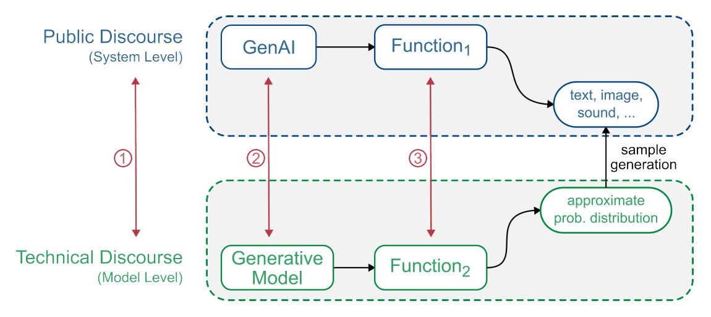

# Towards a Definition of Generative Artificial Intelligence.

Raphael Ronge∗1 , Markus Maier†1 , and Benjamin Rathgeber‡1

#### Abstract

The concept of Generative Artificial Intelligence (GenAI) is ubiquitous in the public discourse, yet rarely defined precisely. We clarify main concepts that are usually discussed in connection to GenAI and argue that one ought to distinguish between the technical and the public discourse. In order to show its complex development and associated conceptual ambiguities, we offer a historicalsystematic reconstruction of GenAI and explicitly discuss two exemplary cases: the generative status of the Large Language Model BERT and the differences between protein structure predictions from AlphaFold 2 and 3. Our analysis shows that there is no unique and unambiguous definition of GenAI based on a purely technical account of the term. Following this conclusion, we argue that the public discourse is not simply a less complex way of speaking, but instead transcends its technical basis. As a means to structure this newly emerging discussion landscape we introduce a non-exhaustive list of four central aspects of GenAI: (multi-)modality, interaction, flexibility, and productivity. These dimensions constitute a first step towards defining GenAI beyond its technical basis.

Keywords— Generative Artificial Intelligence, Generative Models, Definition of GenAI, Conceptual Analysis, History of AI, Philosophy of AI

#### Acknowledgements

We would like to thank all members of the Munich School of Philosophy reading group for their insightful discussions and constructive feedback on an earlier version of this manuscript. RR and MM are grateful to the faculty of philosophy at Caltech for their hospitality and for providing a venue for the presentation and discussion of this work with the members of the AI and explainability reading group.

1Department of Philosophy of Nature and Technology, Munich School of Philosophy, Kaulbachstraße 31a, 80539 M¨unchen, Germany

∗ [raphael.ronge@hfph.de,](mailto:raphael.ronge@hfph.de) ORCiD: [0009-0003-6133-1911](https://orcid.org/0009-0003-6133-1911)

†[markus.maier@hfph.de,](mailto:markus.maier@hfph.de) ORCiD: [0000-0003-1854-9416](https://orcid.org/0000-0003-1854-9416)

‡[benjamin.rathgeber@hfph.de](mailto:benjamin.rathgeber@hfph.de)

# 1 Introduction

Generative Artificial Intelligence (GenAI) is pushing the boundaries of what many people thought was possible for artificial systems. New applications are being released at a dizzying pace, regularly outperforming each other in terms of the latest industry standards. Recently, OpenAI announced its latest model "o3", which appears to surpass human expertise in coding and other complex tasks (Jones [2025\)](#page-13-0), as tested against various state-of-the-art benchmarks (see, e.g., Rein et al. [2023;](#page-14-0) Jones [2024\)](#page-13-1).[1](#page-1-0) Search volume for the term "generative AI" surged in the second half of 2022 (Google Trends [2024\)](#page-13-2) – around the same time that ChatGPT and Stable Diffusion were launched, sparking a huge public debate about the capabilities of these systems. Since then, GenAI has quickly found its way into academic publications and panels, media coverage and opinion pieces, and funded research projects.

In this context, it should be of paramount importance to have an accurate understanding of the meaning of GenAI. However, little attempt has been made to define this term precisely. Instead, participants in the discourse are often content to name a few exemplary systems and leave the rest to implicit background knowledge and intuition. While it is true that there are some clear cases of GenAI – such as ChatGPT or Stable Diffusion – there is no further agreement, or even systematic discussion, of a set of common properties that could serve as a basis for further investigation. With the present work, we contribute to filling this conceptual vacuum.

In section [2](#page-1-1) we discuss the need for a precise understanding of the concept of GenAI. As we will argue, this has a direct impact on important societal issues such as (1) the legislative process regulating GenAI, and (2) the development of moral positions and ethical reflection. We also comment on the complex relationship between public perception of GenAI and future technological developments.

Section [3](#page-2-0) explores different strategies that might be considered to arrive at a more precise definition of GenAI. First, we analyze the current discussion landscape around GenAI [\(3.1\)](#page-3-0) and argue that one should distinguish between technical and public/semi-technical discourse. As we show, the term "Generative Artificial Intelligence" does not appear in any of the relevant technical publications that laid the foundation for the current success of GenAI – be it on Generative Adversarial Networks (GANs) (Goodfellow, Pouget-Abadie, et al. [2014\)](#page-12-0), Variational Autoencoders (VAEs) (Kingma and Welling [2022\)](#page-13-3), Diffusion (Sohl-Dickstein et al. [2015;](#page-14-1) Ho, Jain, and Abbeel [2020\)](#page-13-4), or other models. Instead, these publications only mention generative models. The exact relationship between generative models and GenAI remains unclear, however, and is not addressed in the technical literature. This suggests that there is a discrepancy between technical and public discourse. In order to structure this landscape, we trace the technical [\(3.2.1\)](#page-5-0) and conceptual [\(3.2.2\)](#page-6-0) history of the term GenAI and conclude that while both are converging today, neither historical strand provides a sufficient basis for a precise definition of GenAI. Furthermore, by analyzing the generative status of the Large Language Model BERT and the differences between the protein structure predictions of AlphaFold 2 and 3, we find that there is no clear technical definition of GenAI that takes into account the publicly relevant functionalities of these systems [\(3.3\)](#page-7-0). We conclude that both the historical and technical approaches to defining GenAI are inadequate.

Based on this insight, in section [4](#page-8-0) we give a first approximation to a functionally relevant definition of GenAI. The main goal of this paper is to present a non-exhaustive list of four aspects of GenAI that are central to the public debate, but not captured by a purely technical discourse: (multi-)modality, interaction, flexibility and productivity. (Multi-)modality explores the importance of GenAI being able to work with modalities accessible to humans, e.g. receiving natural language prompts and producing relevant images based on that input. Interaction refers to the important capabilities of GenAI to enable intuitive interactions between user and system. A third key aspect is the unprecedented flexibility of GenAI. Due to its (multi-)modality and intuitive interaction, GenAI is predestined to be applied to a wide variety of problems in different circumstances. Finally, productivity (in both professional and personal contexts) is central to the public discourse on GenAI, as these systems promise to enable significant productivity gains through easily accessible interactions for their users. Of course, this list can only be a starting point for further discussions and a deeper exploration of GenAI. But we believe it is a necessary and important step towards a more precise understanding of this important concept.

Finally, in section [5](#page-11-0) we conclude our analysis of GenAI. As an outlook, we put it in the context of current public debates about creativity (of and with AI) and its possible implications for discussions about Artificial General Intelligence.

# 2 Motivation

The main goal of the present work is to propose a set of four central aspects – (multi-)modality, interaction, flexibility, and productivity – that characterize GenAI and its relevance in the current debate. This is necessary, as we will argue in section [3,](#page-2-0) for at least three reasons:

1For a critical overview of evaluation benchmarks for GenAI, we refer the interested reader to McIntosh et al. [2024.](#page-13-5)

- 1. The current discussion landscape is divided into technical, semi-technical, and public discourses on GenAI, which are only partially related [\(3.1\)](#page-3-0).
- 2. There is no historically unified and precise concept of GenAI [\(3.2\)](#page-5-1).
- 3. A technically unambiguous definition of GenAI does not exist. And even in cases where there is no ambiguity involved, the technical level does not do justice to the public perception and use of the term [\(3.3\)](#page-6-1).

For this reason, we propose a first approximation of the term GenAI that aims to capture the publicly relevant dimensions of these systems. In particular, this goes beyond existing attempts in the semi-technical discourse to define GenAI based on the technical idea of generative models.

In the following, we will first explain why a more precise understanding and use of the term GenAI is necessary and desirable in the current discourse. After all, it could be argued that there are many terms based on technological research and widely used in the public domain that do not have and do not need a precise definition. No one would expect the term "computer" to have a precise definition that distinguishes it from various kinds of programmable machines. Moreover, one might continue, it is not surprising that there are differences in the meaning of the term GenAI between technical and public discourse. The same is true for other terms that are translated from the technical domain into the public domain. Defining a term based on public discourse does not directly influence technical research. Such a definition is not particularly useful for experts, who typically think and communicate about their field of research at a different granularity and with concepts in mind that do not enter the public discourse. In other words, technical innovation occurs independently of the conceptual precision of public discourse.

This line of argument, while legitimate, misses the main point of our proposal. We are not primarily focused on the significance (or lack thereof) of a missing definition of GenAI for the technical discourse in isolation. On the contrary, the technical and public discourses can never be completely separated, and the technical level is indirectly influenced by the public discourse. It is this interaction between the different levels of discourse and the broader social significance of the term GenAI that we are interested in. From this perspective, there are at least two important functions of a precise definition of a concept like GenAI.

- (1) Definitions serve as basic reference points that help prevent misunderstandings and enable precision in communication, even in everyday discussions. As such, they can reduce ambiguity and ensure that everyone is on the same page. In this way, they improve the quality of general discourse by providing reliable points of reference. A refined public discourse can, for example, positively influence the technical research of experts by enabling them to structure, relate and communicate their research more effectively.
- (2) Definitions help identify when concepts are being misapplied or confused, and help avoid common misunderstandings that can lead to flawed reasoning. They can reveal important nuances that a casual understanding of a concept might miss. For example, consider the value of clear definitions of "correlation" versus "causation" in helping people – especially non-experts – avoid common reasoning errors. In this sense, conceptual precision carries over into better general understanding and conceptual clarity beyond the purely technical domain. Importantly, increased clarity with respect to the concept of GenAI can have concrete and practical implications for our discussions of its potentials and limits, as well as the associated dangers. It reduces the risk of serious misunderstandings in the public domain and the attractiveness of utopian, as well as dystopian, narratives.

As a result, there is still value in defining a concept that is widely used in the public domain. Such a functional definition, being partly independent of a technical definition, might even be necessary in cases where the public concept is too far removed from its technical basis. As we will argue, this is the case for GenAI.

Crucially, this need for conceptual precision stems from the fact that the public discourse is not a closed system, but influences both moral and legal considerations. The public's perception of new concepts like GenAI, and the hopes, fears, and concerns associated with them, shape our moral views and ethical discussions. In turn, new innovations with enormous transformative potential must be addressed by lawmakers. While a purely technical definition is helpful, they must de facto respond to public perceptions of the concept in question. To be able to do this, a definition (of the public concept) is needed to enable precise communication and conceptual clarity in the legislative process. As such, a more precise understanding of GenAI (and not AI in general) is important, as it helps to gauge the socially relevant question of the ethical and legal treatment of GenAI compared to other forms of AI.

At this point, the circle between technical and public discourse closes, as the laws and moral judgments that rely on an accurate public understanding of GenAI in turn influence future technological applications. A definition of technically based public concepts therefore influences the technical debates and developments of the future.

# 3 Background

The following section serves the purpose of underpinning our argument that a functional and publicly relevant definition of GenAI is necessary. In particular, we will show that neither a historical analysis of the concept, nor a purely technical definition, are sufficient for a precise understanding of GenAI as it is needed today. First, we analyze the current state of the debates surrounding GenAI and identify a public, semi-technical and technical level of discourse. Second, we will give a short history of GenAI models as well as the term itself to illustrate the fuzziness that surrounds both. Third, we will show that a technical definition of GenAI is inherently problematic with the help of two case studies.

## 3.1 Discussion Landscape

In order to shed some light on the concept of GenAI and its usage, it is helpful to explain and clarify some common concepts that are often discussed in the context of GenAI and to locate where or rather by whom different concepts are used. As such, the current section serves the purpose to introduce important terminology and to orient the reader. As depicted in Fig. [1,](#page-3-1) the conceptual pairs we chose span a discussion landscape regarding the understanding and usage of the term GenAI.

Figure 1: An overview of the current GenAI discussion landscape. The numerically labeled pairs are discussed in the continuous text.

(1) Public vs. Technical Discourse There exists a tremendous difference between the public discourse on GenAI and its technical dimension. We will refer to publications that deal exclusively with computer scientific discussions and technical innovations as technical discourse (see, e.g., Generative Adversarial Networks (GANs) (Goodfellow, Pouget-Abadie, et al. [2014\)](#page-12-0), Variational Autoencoders (VAEs) (Kingma and Welling [2022\)](#page-13-3), Diffusion (Sohl-Dickstein et al. [2015;](#page-14-1) Ho, Jain, and Abbeel [2020\)](#page-13-4)). Participants in the technical discourse do not use the term GenAI, but refer to generative models (see the next section). The term GenAI is exclusively used in the public and semi-technical discourse and often functions as a collective term. By public and semi-technical discourse we refer to a rather broad spectrum, which ranges from popular scientific communication by journalists to researchers from other disciplines such as philosophy (see, e.g., Zohny, McMillan, and King [2023\)](#page-15-0) or the social sciences (see, e.g., Bail [2024\)](#page-12-1) talking about GenAI. Furthermore, it also includes communication by experts aimed at a broader audience (see, e.g., Gozalo-Brizuela and Garrido-Merchan [2023\)](#page-13-6). As such, the public and semi-technical discourse comprise communication about GenAI by experts and non-experts aimed at non-experts and the term GenAI is used whenever there is the need to communicate something general about systems such as ChatGPT or Stable Diffusion. This tentative differentiation explicitly delineates the boundary between communication for a broader audience based on the term GenAI and communication for a technical, discipline-specific audience, where the term GenAI is not used.

Table [1](#page-4-0) depicts the main differences between public, semi-technical, and technical discourse regarding GenAI. Depending on the specific discourse, one can identify three distinct groups of participants: (1) Laypeople, who do not have any significant knowledge of GenAI; (2) Informed discourse participants with a basic understanding of GenAI and its technical basis; (3) Experts in the field of (generative) AI. Note that there can be considerable overlap between the public and semi-technical discourses, where the latter can be understood as a mediator between the public and the technical domain. While both, the public and semi-technical discourses, use the term GenAI, the underlying ideas are not identical. In particular, when attempting to define GenAI, informed participants typically address the model level, equating GenAI with the instantiation of a generative model. The article on regulation of LLMs by Hacker, Engel and Mauer [\(2023,](#page-13-7) 1113-1114) is a typical example of a contribution to the semi-technical discourse, as they try to discuss the technical foundations of GenAI models and equate GenAI with (the instantiation of) generative models. As we will show later, this narrow understanding of GenAI, based solely on its technical foundation, cannot do justice to the phenomenon at hand.

This distinction between a narrow, technical discourse and a broad, public discourse is partly mirrored by the distinction between the model level and the system level of GenAI as introduced in a recent paper by Feuerriegel and colleagues: Whereas the model level refers to the underlying technical implementation (e.g., GPT4), the system level refers to the embedding of the model functionality into a larger infrastructure (e.g., ChatGPT) (Feuerriegel et al. [2024,](#page-12-2) 112). Following this classification, we argue that the term GenAI is mostly used for functionally relevant discussions at a system level as part of the public discourse. These discussions are only occasionally tied back to technical features at the model level in the semi-technical discourse.

| Discourse      | Participants         | Usage of "GenAI"                                    |
|----------------|----------------------|-----------------------------------------------------|
| Public         | Laypeople, Informed, | Only system-level functionality is addressed,       |
|                | Experts              | no reference to technical basis                     |
| Semi-technical | Informed, Experts    | System-level and model-level can be addressed,      |
|                |                      | definition of "GenAI" in terms of generative models |
| Technical      | Experts              | Only model-level is addressed,                      |
|                |                      | no usage of "GenAI"                                 |

Table 1: Distinction between public, semi-technical, and technical discourse regarding GenAI.

(2) Generative AI vs. Generative Model As discussed above, the term GenAI is exclusively discussed in the public and semi-technical discourse, whereas the technical discourse instead refers to generative models. It is therefore essential to have a basic understanding of both concepts and why they are not to be used synonymously.

Generative models model the joint probability distribution of class and observation, from which the class can then be calculated (Jebara [2004,](#page-13-8) 18-22). In other words, a generative model is a statistical model that tries to approximate the underlying probability distribution given a set of data samples (observations) and can be used, in the case of GenAI, to create (generate) new, random instances of this learned probability distribution (Ng and Jordan [2001\)](#page-14-2). In contrast to discriminative models, which are often used for classification tasks such as object recognition or spam detection (Sarker [2021\)](#page-14-3), generative models can be used to synthesize new data instances by approximating the underlying ground-truth reality of a class of observations.[2](#page-4-1) Since good performance by machine learning models on generative tasks strongly correlates with larger networks and training data sets,[3](#page-4-2) it is considerably more resource intensive than discriminative modeling (Kaplan et al. [2020,](#page-13-9) 18-19).

In a semi-technical setting – e.g., technically informed researchers writing for a broader or interdisciplinary audience – GenAI is usually understood to somehow refer to generative models (Hacker, Engel, and Mauer [2023\)](#page-13-7), but this relationship is often not specified further. Feuerriegel and colleagues define GenAI as "generative modeling that is instantiated with a machine learning architecture" and can therefore "create new data samples based on learned patterns." (Feuerriegel et al. [2024,](#page-12-2) 112)[4](#page-4-3) This definition attempt makes it apparent that generative modeling and GenAI are deeply intertwined, but not identical concepts – generative models are not limited to AI and have been discussed and used long before the concept of GenAI emerged, as we will explicitly discuss in section [3.2.2](#page-6-0) below. Still, it seems that GenAI necessarily includes some generative modeling capacity in the sense that the output of such a system has to meet the same criteria as the output of a generative model – namely novelty and usefulness (Foster [2019,](#page-12-3) 10). However, as we will try to show in the following, this generative aspect is not sufficient to serve as the sole basis for a precise definition of GenAI. In fact, it is not even unambiguous on a technical level.

In sum, we note that every GenAI has to produce new and useful output, but the relationship to generative models is not as clear as one might think. This, in turn, necessitates our discussion of functionally relevant aspects of GenAI that cannot be reduced to a purely technical description.

(3) Functions of GenAI vs. Functions of Generative Models The terms GenAI and generative model are closely connected. Both describe applications that (ultimately) produce new data points of textual, visual, auditory, ... data. However, the generative function that both terms fulfil is a very different one. In the following, we want to clarify this connection. In the public discourse, generative in Generative AI refers to the generation of new text, images, sounds, or similar modalities (see, e.g., Gartner [2024;](#page-12-4) Coursera [2024;](#page-12-5) Fruhlinger [2023\)](#page-12-6) and GenAI is thus often characterized by means of its system level functionality: "Often, Generative AI models are marked by their wider scope and greater autonomy in extracting patterns within large datasets. In

2 In practice, many AI systems employ both discriminative and generative models in tandem (IBM [2024\)](#page-13-10).

3 In recent years, more powerful computers, increased dataset and model sizes and refined training has led to a tremendous growth of Deep Learning in general (Goodfellow, Bengio, and Courville [2016,](#page-12-7) 18-26).

4Note that this is practically identical to the definition of a Deep Generative Model (Ruthotto and Haber [2021\)](#page-14-4).

particular, LLMs' capability for smooth general scalability enables them to generate content by processing a varying range of input from several domains." (Novelli et al. [2024,](#page-14-5) 2)

The term generative in generative model on the other hand refers to its function of describing "how a dataset is generated, in terms of a probabilistic model. By sampling from this model, we are able to generate new data." (Foster [2019,](#page-12-3) 2) The result of a generative model (by sampling) is typically a new data instance which ties it to generative of GenAI, but only indirectly and not necessarily.

As we will show in the following, generative modeling as the technical basis of GenAI was not designed and developed with the intention of creating generative systems as they are discussed today. This implies that the generativity of GenAI systems differs in important aspects from the one of generative models and thus demands a new conceptual framework for defining significant parts of current AI systems.[5](#page-5-2)

## 3.2 Historical-Systematic Reconstruction

Given the complicated state of the current discussion landscape, one might look for historical antecedents that could function as guardrails for formulating a definition of GenAI.

In what follows, we will analyze the historical emergence of (1) the technical foundation of GenAI – namely, generative models instantiated with a machine learning architecture – and (2) the term GenAI itself. We will retrospectively identify important turning points among the many approaches, programs, and ideas, on the basis of which a more or less coherent story can be told. This narrative is necessarily selective and does not claim to be exhaustive. While the models that form the technical basis of GenAI have been around for a long time, the term itself is much younger. It was only the performance advances in relevant functionality for a broader audience that made the term GenAI necessary to communicate the concept to the public.

The main goal of this section is to convey to the reader that even if we focus exclusively on these historical developments, there is no single common thread that could serve as a precise definition of GenAI.

#### 3.2.1 Technical Reconstruction

Although the success and public reception of today's GenAI solutions is unprecedented, AI models attempting something similar have been around for a long time. In the following, we present a history of GenAI and how this technology has led to the current state-of-the-art.

The present success of GenAI can be traced back to Artificial Neural Networks (NNs). However, until the rise of NNs, various other methods were used with the aim of producing similar results.

The first attempts that can be associated with GenAI date back to the late 1960s and early 1970s. The first ancestors of today's GenAI algorithms typically were expert systems (ES). They were based on rules explicitly specified by humans, which eliminates the need for training, but allows only for very limited capabilities. Programs designed to generate text can only generate pre-defined sentences or phrases (e.g., ELIZA by Joseph Weizenbaum [\(2020\)](#page-15-1)). Drawing-ESs can only generate human-defined shapes (see, e.g., AARON by Harold Cohen [\(1995\)](#page-12-8)), and ESs built for composition can only generate melodies according to predetermined rules (see, e.g., Zaripov and Russell [1969\)](#page-15-2). The limitations of all three ESs are of a different nature. ELIZA can only generate answers for a limited area of knowledge and even then only on the basis of a certain set of rules (Weizenbaum [2020,](#page-15-1) 15). For the domains of art and music, both systems had strict aesthetic rules, based on which they could compose elements (e.g., shapes and notes) (Zaripov and Russell [1969,](#page-15-2) 129). Unlike today, it is not possible for all three systems to adapt their output to descriptive inputs (so-called prompts).

In the years that followed, technical progress in the field of GenAI was made primarily in the area of Natural Language Processing (NLP). Expert Systems were followed by models that can learn the statistical sequence of words (and phrases) in a language. Hidden Markov Models (HMM), for example, became increasingly important for these NLP tasks from the 1980s onwards, thanks to computer technology that allowed for their training (Jiang [2010,](#page-13-11) 589-590). The next great leap forward was achieved with the help of long short-term memory (LSTM) models (Hochreiter and Schmidhuber [1997\)](#page-13-12). These models were the first NNs capable of generating text of any substantial quality. LSTMs as well as HMMs generate text autoregressively. Both share this functionality with today's popular transformer models. A significant advancement in natural language processing occurred in 2017 when a team of researchers developed this so-called transformer architecture (Vaswani et al. [2017\)](#page-14-6). The innovation introduced by Transformers is an "attention mechanism". Unlike its predecessors, this attention mechanism can map complex relationships within a text. Due to increased computing power, it is now possible to use questions as input, which are answered in real time by a transformer model (e.g. GPT).

On the image generation side, the first major breakthrough came in 2014 with Generative Adversarial Networks (GANs) (Goodfellow, Pouget-Abadie, et al. [2014\)](#page-12-0). One reason for this delay in comparison to NLP is the sheer size and complexity of image data. In the training process of GANs, two neural networks are cleverly combined to improve each other. After training, one of the NNs is used to generate new images from noise. A disadvantage of

5We are grateful to an anonymous reviewer for stressing this point.

this type of image generation is that it has no incentive to be 'creative' (Creswell et al. [2018,](#page-12-9) 63). This problem was solved in 2022 by so-called Diffusion Models (e.g. Stable Diffusion) (Rombach et al. [2022\)](#page-14-7). Unlike GANs, Diffusion Models do not attempt to generate an image from noise in a single step. Instead, they have been trained to extract (previously superimposed) noise from real images in many small steps. When given pure noise as input, the noise is reduced until an image is produced. This process can be controlled by text prompts to create specific images [\(ibid.,](#page-14-7) 10687).

At this point, it is worth emphasizing once again that the term "Generative AI" itself is not used in the technical discourse, as can be evidenced by the fact that it never appeared in this presentation of the technical history of the concept. In the following, we will instead trace the evolution of the term GenAI itself, which is partly independent of its modern technical basis.

#### 3.2.2 Conceptual Reconstruction

It is by no means the case that the term GenAI has always been used in its current form – term and meaning have only grown together over the years. This historical convergence still leads to inaccuracies in meaning today. As such, it is instructive to sketch the history of the term GenAI here.

The term "Generative Artificial Intelligence" itself only emerged in the mid-2010s. To our knowledge it was first used explicitly in Zant [\(2010\)](#page-15-3) – however, in a context that has nothing to do with the current meaning and understanding of the concept. Related terms such as "generative model" and "generative learning" can be found in connection with AI methods such as hidden Markov models and Bayesian networks already in the early 2000s (see, e.g., Ng and Jordan [2001;](#page-14-2) Jebara [2004\)](#page-13-8). But, as mentioned before, one should not conflate the concepts of GenAI and generative models. The connection between both terms was discussed in section [3.1](#page-3-0) above.

Term and phenomenon had their first real point of contact in 2014 thanks to the development of Generative adversarial nets (GANs) (Goodfellow, Pouget-Abadie, et al. [2014\)](#page-12-0). While the term "Generative AI" is not used, these generative nets describe an AI approach which is capable of generating images of noteworthy quality for the first time [\(ibid.\)](#page-12-0). This has familiarized people beyond the purely technical domain of computer science with the concept of image generation and the adjective generative.

A year later, the term "Generative Artificial Intelligence" reappears in a publication by Tony Veale [\(2015\)](#page-14-8). However, Veale is not concerned with a precise definition of GenAI, nor is he interested in delineating GenAI as a field of computer science research. He employs the term "GenAI" on a single occasion, utilizing it as a catch-all designation to broadly explain the rationale behind the intrinsic interest of his research [\(ibid.,](#page-14-8) 5). The problem of lack of definition and precision persisted, although use was very sporadic at the time. Another example can be found in 2017 in an article on AI applications in astronomy (Castelvecchi [2017,](#page-12-10) 17). Again, the focus is not on AI, but on astronomy and how image generation methods can support it. And again, GenAI is used as a catch-all term to summarize different approaches regardless of their exact design.

The fact that the term "Generative AI" was introduced from outside the field rather than from within it is also indicated by the fact that it does not appear in the most influential AI papers on the subject. The paper on GANs was mentioned above. The seminal 2017 paper on transformers, now synonymous with successful text generation, does not mention GenAI (see Vaswani et al. [2017\)](#page-14-6) once. Even in 2022, in the development paper of Stable Diffusion, one of the most successful image generation algorithms ever, only the technical basics of generative models are discussed, but the approach is not directly related to GenAI (Rombach et al. [2022\)](#page-14-7).

As we have shown, there is a conceptual history of the term "Generative AI" that is not identical to its technical history. While both obviously converged to the point where we now refer to certain systems as GenAI, the historical convergence did not result in a unique and unambiguous meaning for GenAI as it is used today.

## 3.3 Exemplary Reconstruction

The genesis of the term makes it clear that GenAI is not congruent with a specific technical system or model, but in its current use represents a cross-section of existing technologies. To demonstrate the inadequacy of a purely technical definition of GenAI, we will analyze two different case studies. The analysis of the Large Language Model (LLM) BERT will show that it is not as easy as one might think to determine whether a given system contains or constitutes a generative model in the technical sense. The second case study of AlphaFold 2 and 3, on the other hand, suggests that even in cases where the technical dimension is unambiguous, there are reasons to extend the narrow, purely technical notion of GenAI in order to accommodate the actual practice and intuition of researchers working with these systems.

#### Case Study 1: BERT

BERT, which stands for Bidirectional Encoder Representations from Transformers (Devlin et al. [2019\)](#page-12-11), was introduced by Google in 2018 and is one of the classical machine learning models in the context of NLP. After its release it quickly surpassed traditional models such as LSTM models and constituted the state-of-the-art system for a variety of NLP related benchmarks (Rogers, Kovaleva, and Rumshisky [2020,](#page-14-9) 842). BERT is sometimes considered as an early example of GenAI, but at first glance it does not seem to include a generative component in a technical sense. While it shares some central architectural features with current LLM models such as GPT (e.g., both are transformer-based models), it is – as its name already suggests – bidirectional, meaning that it considers both left and right context of a given token. Unlike GPT, which predicts each token unidirectional based on the previous token, it is not autoregressive. Indeed, the vanilla BERT model was not built to generate text, but to excel at other NLP related tasks such as classification, understanding or translation.

Despite this fact, researchers quickly noticed that it is still possible to use BERT to generate text without changing its core architecture. This is surprising, since BERT – by design – is a so-called "encoder-only" system, which should not be able to generate text in any straightforward manner (see Footnote 4 in Devlin et al. [2019\)](#page-12-11). A possible explanation for this unintentional functionality is that in order to train a bidirectional model such as BERT, the developers relied on introducing a "Masked Language Model" (MLM) during pre-training. For technical details on MLMs, we refer the interested reader to the relevant literature (see, e.g., Chapter 11 in Jurafsky and Martin [2023\)](#page-13-13). The important point to be made in the context of our argument is that there is an ongoing debate in the literature if – and how – BERT (or MLMs in general) could be represented and understood as generative models in disguise (Wang and Cho [2019;](#page-15-4) Goyal, Dyer, and Berg-Kirkpatrick [2022;](#page-13-14) Torroba Hennigen and Y. Kim [2023\)](#page-14-10).

Apparently, the seemingly easy task to decide if a specific system includes or constitutes a generative model is far from trivial. Against this background, it is questionable if it makes much sense to exclusively rely on a narrow and technical definition of GenAI based on generative models. It is unquestionable that the technical dimension constitutes the basis of any GenAI, but if a system has the necessary functionality to produce novel and useful outputs – to generate – it is irrelevant for most people if it includes a generative model in the technical sense. In order to emphasise this point, we will in the following consider the example of AlphaFold 2 and 3.

#### Case Study 2: AlphaFold

The AlphaFold project revolves around the central problem of predicting the three-dimensional structure of proteins from their amino-acid sequences. The problem of protein folding is by no means new. Since 1994 there exists a biennial competition for protein structure prediction – the Critical Assessment of Structure Prediction (CASP) –, which has been dominated by deep-learning-based approaches in recent years. While AlphaFold is not the only such approach to the prediction of tertiary structure of proteins (see, e.g., Baek et al. [2021;](#page-12-12) Callaway [2022\)](#page-12-13), it is of particular interest for our purposes because of its latest two versions: While AlphaFold 2 predicts the threedimensional structure of proteins from their amino-acid sequences, AlphaFold 3 is "capable of predicting the joint structure of complexes including proteins, nucleic acids, small molecules, ions and modified residues" (Abramson et al. [2024,](#page-12-14) 493). On a technical level, AlphaFold 3 adds a diffusion model to the underlying structure of AlphaFold 2. This added diffusion model leads AlphaFold 3 and structurally similar systems (Lin and AlQuraishi [2023;](#page-13-15) J. Lee, J. Kim, and P. Kim [2023\)](#page-13-16), as opposed to AlphaFold 2, to sometimes be labeled as GenAI (see, e.g., Erdmann, Schumann, and von Lindern [2024;](#page-12-15) Oldfield [2023;](#page-14-11) Schwaller [2023\)](#page-14-12). This constitutes a prime example of what we call semi-technical discourse on GenAI: both system and model-level are addressed, but the definition of GenAI only relies on generative models. However, as we have argued in section [3.1,](#page-4-4) equating a generative model (in this case a diffusion model) with GenAI does not do justice to the phenomenon at hand. Below, we will explicate this point with a discussion regarding the (actually relevant) functionalities of AlphaFold 2 and AlphaFold 3.

Unlike with BERT, there is no technical uncertainty about the nature of the generative model structures of AlphaFold 2 and AlphaFold 3 (AlphaFold 3 includes a generative model component, AlphaFold 2 does not). However, this does not necessarily mean their differences in technical structures would be represented in the broader discourse. For the debate among practicing researchers of biology and medicine it is mostly irrelevant if a generative model was only added in AlphaFold 3. In personal communication, researchers confirmed this intuition and stated that AlphaFold 2 already generated novel and useful output s for their intents and purposes. The upgrade to AlphaFold 3 is not to be downplayed and, as mentioned above, adds additional capabilities that were not present on AlphaFold 2, but it is in the perception of practicing scientists not necessarily a paradigm shift with respect to its generative capabilities but rather an extension of the already existing generated content. The same phenomenon is observable in research papers on the use of AlphaFold 2, where the authors write that AlphaFold 2 "generates models of protein structures" (Thornton, Laskowski, and Borkakoti [2021,](#page-14-13) 1666) or that AlphaFold 2 "may have [...] success in novel [emphasis added] protein design" (Laurents [2022,](#page-13-17) 4). This reference to the generative capabilities of systems that lack a generative model component indicates a confusion in the debate that is independent of any technical ambiguities. In other words, the technical structure of AI systems is not a necessary condition for them to be perceived as GenAI.

Our case studies serve the purpose of conveying two important points regarding GenAI. First, we have shown with the example of BERT that the technical configuration of GenAI, despite its crucial role as a basis for GenAI models and systems, is itself part of an ongoing debate in the technical literature. As such, relying on a purely technical definition of GenAI based on generative models – as is common practice in the semi-technical discourse – is not unambiguous and can be problematic. Second, based on our discussion of AlphaFold 2 and AlphaFold 3, we argued that even if there is a clear-cut difference in generative modeling capabilities, this is not necessarily reflected in the relevant functionalities and the associated discourse. Our case study made this explicit by revealing a tension between the narrow, semi-technical definition of GenAI based on generative models and the actual attribution of generative capabilities regardless of the technical basis. The following section aims to elucidate the aforementioned confusion by presenting a number of functionally relevant aspects which can help to structure and clarify the public discourse on GenAI.

# 4 Aspects of GenAI

As we have shown in the previous sections, the technical, semi-technical, and public discourses on GenAI are not isomorphic. Rather, the public dimension transcends the technical in certain important ways. Our goal in this section is to analyze this incongruity and to propose a set of four aspects – (multi-)modality, interaction, flexibility, and productivity – that help to structure this debate by picking out relevant functional characteristics of GenAI that cannot be settled within a purely technical discourse. This is necessary because, as we have shown above, the narrow, semi-technical definition of GenAI based solely on generative models is unsatisfactory. As such, these aspects can be understood as a first step towards defining GenAI beyond its technical basis.

Importantly, we do not claim that this list is exhaustive or that the four aspects are mutually exclusive. Rather, we propose these different dimensions in order to span the public discussion landscape on GenAI and help to allocate oneself in this abstract space.

## 4.1 (Multi-)Modality

The modalities of GenAI significantly determine the debates about it. Looking at the public discourse, three modalities are commonly associated with GenAI: text (language or code), image (or video) and sound (music or speech). In addition, authors usually provide little technical information, preferring to mention a few well-known exemplary models such as GPT or DALL-E (see, e.g., Singleton [2024;](#page-14-14) Coursera [2024;](#page-12-5) Eliassi-Rad [2024;](#page-12-16) Satariano [2024\)](#page-14-15).

Discussions about modalities did not arise with GenAI, but have always been important in the technical debate, as different modalities require different technical approaches. Various fields of AI research are solely focused on a single modality. For example, NLP deals with language (text and speech), while Computer Vision is obviously focused on image and video data. In the public discourse on GenAI, however, these more technical distinctions are largely irrelevant. Instead, the debate is mainly driven by the ability of GenAI to handle and interact with humanly accessible modalities, e.g. to receive natural language input and produce relevant images based on this input. An AI that performs well on tasks for such modalities may be perceived as intelligent or even threatening to humans.

This emotional response to GenAI is due, at least in part, to our tendency to anthropomorphize AI models. Anthropomorphism in this case "describes the tendency to imbue the real or imagined behavior of [AI models] with humanlike characteristics, motivations, intentions, or emotions" (Epley, Waytz, and Cacioppo [2007,](#page-12-17) 864). This has been prevalent in AI research and its public perception from the beginning (see, e.g., Lighthill [1972;](#page-13-18) Rosenblatt [1961\)](#page-14-16) and is not necessarily related to GenAI (Salles, Evers, and Farisco [2020\)](#page-14-17). However, the reasons why humans anthropomorphize machines are complex. As Epley et al. [\(2007\)](#page-12-17) explain, there are three psychological factors to consider: we infer the mental states of others from an anthropocentric perspective, we are motivated to "explain and understand the behavior of other agents" [\(ibid.,](#page-12-17) 864), and we have a "desire for social contact" [\(ibid.,](#page-12-17) 864). While all three are applicable to all types of AI, the first two are particularly relevant to GenAI. Its multi-modality makes it easy to take an anthropocentric perspective and interpret the AI's actions as human. In addition, anthropomorphism is a coping mechanism of humans "[to reduce] uncertainty in contexts in which alternative non-anthropomorphic models of agency do not exist" [\(ibid.,](#page-12-17) 871). The complexity and capabilities of state-of-the-art GenAI models seem to facilitate an anthropomorphic perspective.[6](#page-8-1)

This also means that AI models that deal with multiple modalities, but are used for "non-human" tasks such as data analysis, are usually not seen as a threat or competition to humans in public discourse. Instead, they are perceived as powerful tools, not as intelligent machines. This distinction suggests that modalities are an important factor in the perception of AI systems as GenAI – but only if they include humanly accessible modalities such as natural language, images, or sounds.

To further illustrate this point, think back to our AlphaFold case study above. We showed that there is a relatively clear technical distinction between the non-generative AlphaFold 2 and the generative AlphaFold 3. To

6We are grateful to an anonymous reviewer for emphasizing this point.

the practicing scientist, however, AlphaFold 2 generates new data – in this case, the 3D structure of proteins. In the public debate, on the other hand, neither AlphaFold 2 nor AlphaFold 3 are considered GenAI. We argue that one reason for this is the modalities of both AlphaFold versions: They do not generate text, images, or sound, and are therefore considered by the layman to be little more than powerful tools. The same applies to other examples such as DeepBlue[7](#page-9-0) and AlphaGo[8](#page-9-1) . Both generate new data, but not in the form of text, image, or sound data, but new game moves. The modalities that an AI system can process are obviously important in assessing whether a system is considered GenAI in public discourse – as opposed to the exact details of its technical functionality. Looking at the history (see section [3.2\)](#page-5-1), it is clear that text, image or sound output is not necessarily associated with GenAI, as there were AI models that produced results similar to GPT or DALL-E long before the concept of GenAI, such as ELIZA (Weizenbaum [2020\)](#page-15-1), AARON (Cohen [1995\)](#page-12-8), or compositions by Zaripov (Zaripov and Russell [1969\)](#page-15-2). While modalities have always been an important factor in discussions of AI, GenAI is distinguished by the central importance of processing multiple modalities.

Today, output (whether speech, code, music, voices, images, or video) can be influenced and modified at will by text prompts. Even AIs that were originally limited to text, such as the GPT series, can process visual input with the GPT4 version (OpenAI [2023\)](#page-14-18). Does this mean that the only difference between earlier AI models and today's GenAI is multi-modality? The answer is no. The boundaries of multi-modality are fluid and quickly blur as we move away from large language or image models. Malinowski and Fritz's Visual Question Answering (VQA) tool is a good example. The user can ask (via text prompts) for the position of objects in a scene and receive a text-based answer. Although VQA fulfills all the above conditions (images and text questions as input and text answers as output (Malinowski and Fritz [2014\)](#page-13-19)), it would hardly be classified as GenAI. The reason is that its input and output are very rudimentary and based on predefined categories [\(ibid.,](#page-13-19) 8). Thus, the classification as GenAI seems to be based not only on the modalities of an AI. It is also the flexibility within and interaction with these modalities that is important for an AI model to be labeled as GenAI.

While multi-modality is not a new invention and is present in earlier AI applications, it is central to the public interest in GenAI. By combining modalities that are accessible to humans, multi-modality is an important step towards a seamless integration of AI systems into our lives and forms the basis of other important aspects of GenAI, such as interaction and productivity.

## 4.2 Interaction

An important feature that distinguishes GenAI from other types of AI is its intuitive interaction capabilities. Today, the AI systems that fall under the term GenAI are particularly accessible to laypeople. Other types of AI are not excluded from intuitive interaction, but models that deal with humanly recognizable text, images and sound are predestined to be integrated into easily accessible systems. This interactive accessibility is in no small part thanks to our tendency to anthropomorphize GenAI models. One could argue that GenAI models "are designed with anthropomorphic features in the hope that this will facilitate understanding [...], promote [their] acceptance, increase [their] effectiveness" (Salles, Evers, and Farisco [2020,](#page-14-17) 90). Because of the human-accessible modalities of GenAI described above, it is particularly easy for computer scientists to design these anthropomorphic features.

The clearest example of this phenomenon are language models (see, e.g., OpenAI [2023;](#page-14-18) Narang and Chowdhery [2024\)](#page-13-20). There are two processes at work. First, language models are tasked with generating human-readable text as output (either in conversation, or as translations, etc.). Second, while they are not inherently capable of handling human-readable input, the better they can handle diverse, complex input, the more likely they are to be adopted. This interaction process is supercharged when the AI's input and output are (partially) of the same modality, and the output of one generation cycle can be used as input for the next.

This principle can also be seen in GenAI models that deal with sound (see, e.g., Radford et al. [2023\)](#page-14-19). Any model that works with speech input/output must, by definition, be able to work with human language. The ease of interaction for the layperson is least obligatory for image generation tools (see, e.g., Rombach et al. [2022\)](#page-14-7). The connection between textual input and visual output is not as direct as for language models. However, the second process of language models also applies to image generation: the easier it is to use, the more users there will be. An image generation tool that requires a tabular description of which parts of an image should be filled with which objects loses its appeal and even its usefulness.

In addition to the ease of interaction described above, there is another important factor about GenAI that enhances its interaction capabilities: models typically considered as GenAI are applicable to their own output. It is possible to use their output as input for the next generation cycle. This is necessary for the conversational capabilities of text generation models, but image generators are also capable of adapting their generated images based on new prompts. This iterative self-application is a cornerstone of GenAI models. It differs from the selfreference or recursion known from other types of AI. Self-application is somewhat external because it is mediated

7 [ibm.com/history/deep-blue](https://www.ibm.com/history/deep-blue) (visited on 01/15/2025).

8[deepmind.google/technologies/alphago](https://deepmind.google/technologies/alphago/) (visited on 01/15/2025).

by interaction with users. Conversely, self-application is grounded in the modalities used by GenAI and massively influences their interaction capabilities.

The above examples show an important circle that leads to easily accessible GenAI. First, as mentioned in the previous section, the modalities of AI models called GenAI are humanly understandable modalities. Second, this makes it easy for laypeople to interact with them. Third, easy interaction contributes massively to their popularity. Finally, this popularity forces developers to support ever better interaction capabilities. For example, by broadening the scope of the model and building so-called "foundation models" (see next section [4.3\)](#page-10-0) that can work on a variety of tasks (Bommasani et al. [2021,](#page-12-18) 3). This, in turn, increases the humanly accessible modalities (see step one) and their usefulness for everyday problems. While interaction with AI systems is not specific to GenAI, we argue that it is an important and central aspect of it.

## 4.3 Flexibility

One can observe an explosion of AI coverage – especially with respect to GenAI – in the public domain (see, e.g., Singleton [2024;](#page-14-14) Coursera [2024;](#page-12-5) Eliassi-Rad [2024;](#page-12-16) Satariano [2024\)](#page-14-15). As we have seen in the historical overview, technological development, while accelerating, is a gradual process. Technological progress brings new possibilities, but neither the ideas nor the applications are particularly new. What has changed massively is the scope of currently developed systems, which introduces an unprecedented flexibility for users. New text-generating GenAI models are known as "foundation models", which are capable of simulating conversations on any conceivable topic. GPT and similar models can simulate the writing style of any author while being able to solve complex math problems, play games, etc. Again, flexibility points to an anthropomorphic understanding of GenAI. What developers are striving for is human-like flexibility that exhibits human cognitive characteristics.

While interaction plays a crucial role in the accessibility of GenAI, earlier models such as ELIZA (Weizenbaum [2020\)](#page-15-1) were also able to simulate conversation in English. However, earlier models were much more limited in their knowledge. ELIZA had to be retrained (given a new set of rules) for conversations other than as a therapist. A similar trend can be seen with image-generating models. Although the first models in this area appeared much later, their limitations were not as pronounced as for text generation. Today, however, their flexibility is often even greater. They are now capable of producing an unimaginable number of unique images and are no longer limited to generating photorealistic human portraits, as StyleGAN was a few years ago (Karras, Laine, and Aila [2018\)](#page-13-21). Open source applications like Stable Diffusion can be fine-tuned to generate images in niche art styles or in the styles of specific artists. This ties into our expectation of creativity with respect to these models.

This change is partly due to the increase in computing power that made these extensions possible. In large part, however, this new flexibility was a conscious design decision by the developers. Instead of publishing a model for a specific task, developers designed models that can be finetuned for specific tasks later on. This led, among other things, to the creation of GPT: a Generative Pretrained Transformer.

## 4.4 Productivity

There is one fact about GenAI that is not directly related to the models or their inputs and outputs, but to the way people use these new systems for professional and personal tasks: productivity. The public debate is already predicting large productivity gains from the use of GenAI (Brynjolfsson, Li, and Raymond [2023;](#page-12-19) Chui et al. [2023;](#page-12-20) World Economic Forum [2024\)](#page-15-5). This is not to say that GenAI systems are the only ones capable of improving productivity. On the contrary, specialized AI models have been able to do this for years in their respective domains: predictive maintenance, spam filters, automated investments. In itself, GenAI is no more productive than other types of AI. There is no a priori difference in the way it produces its outputs or processes its inputs that would make it more productive than other AI models.

What makes GenAI a superior candidate for productivity improvement is a combination of the aspects we have introduced above, as they allow people to use GenAI systems in a variety of settings and to apply them to a variety of problems. Ease of interaction, (multi-)modality, and flexibility support the foundational nature of the models and ensure their application in a variety of different contexts. These three aspects, combined with the new capabilities of GenAI, may enable productivity gains (with varying intensity) in interaction with GenAI for a variety of sectors (Brynjolfsson, Li, and Raymond [2023\)](#page-12-19) and almost any field of work "from banking to life sciences" (Chui et al. [2023\)](#page-12-20). It is these socially relevant expectations that make productivity a natural candidate for inclusion in our set of central aspects. Notably, productivity gains are not limited to economic metrics, but also include improved creative output or other non-work-related tasks. For example, artists are already beginning to use GenAI systems in their work, creating new workflows and never-before-seen products (for a discussion of possible GenAI use cases, see, e.g., Vigliensoni, Perry, and Fiebrink [2022\)](#page-15-6).

We are aware that this interpretation of productivity separates this aspect from the other three, as it posits productivity as a result of interaction, (multi-)modality, and flexibility. Nevertheless, we believe that productivity is an important feature of GenAI that captures its unique status among other types of AI.

It is interesting to observe that widespread productivity in turn requires greater flexibility and interactive capabilities of GenAI, which links it back to the other aspects we have introduced. In this sense, these four dimensions influence and reinforce each other, further substantiating our claim that they pick out some relevant structural features in the current GenAI discussion landscape.

# 5 Conclusion and Outlook

In the previous sections we have tried to work out central distinctions and differentiations regarding the concept of GenAI, both historically (see section [3.2\)](#page-5-1) and systematically (see section [3.1\)](#page-3-0). We have identified various, sometimes contradictory, sources and contexts that are repeatedly used in the field, which may explain why a systematic definition of GenAI is still lacking. We have shown that there is no single, unambiguous concept for understanding GenAI: it is not possible to find an exhaustive list of necessary and sufficient conditions for characterizing GenAI, as there are always counterexamples that elude a uniform characterization. A purely technical definition does not do justice to the multiple layers and complexities of public discourse (see section [3.3\)](#page-6-1). This does not mean, however, that there is nothing to be said about this discourse and its various aspects. To structure the discussion, we have identified four main features (see section [4\)](#page-8-0) – (multi-)modality, interaction, flexibility, and productivity – that can be used to distinguish GenAI from other forms of AI, and thus represent a first step toward defining GenAI. In doing so, we want to enable a more precise discussion of GenAI and its implications for future technological developments, as well as its influence on socially relevant questions of morality and ethics and, by extension, governing laws.

These aspects may also serve as an explanation for the fascination of GenAI and the associated hype in the public domain. GenAI opens up a total field of possibilities that can be utilized both in a private as well as an economic context. As Foster [\(2019,](#page-12-3) 3) pointed out, due to its generative capabilities, GenAI is not deterministic but randomly open to "individual samples generated by the model."

Because it is not only focused on one function, but contains an unprecedented freedom to be used in different contexts, it approaches a status that seems qualitatively different from more traditional AI applications, and for the first time hints at Artificial General Intelligence (AGI). Even if the concept of AGI and related predictions of future technological development are sometimes considered problematic or unscientific (Altmeyer et al. [2024;](#page-12-21) Fjelland [2020\)](#page-12-22), it is undeniable that (1) the prospect of such systems arouses considerable public interest and that (2) current GenAI is the closest candidate for such systems. In this sense, our four aspects can be understood as describing a spectrum: the better an AI fulfills these different aspects, the closer it is to AGI. Importantly, this framing of a potential convergence of GenAI towards a state of AGI is far from fictional scenarios about dystopian nightmares of AI taking over control – or a utopia where AI solves all of humanities problems for that matter. Instead, it tries to focus the debate on the actual functionalities and potential risks of current GenAI systems and the way they already influence our private and working life.

From this perspective, one might interject that what is missing from this characterization of AGI is the aspect of creativity. The relationship between creativity and computers in general (Boden [2004\)](#page-12-23) and AI in particular (Boden [1998\)](#page-12-24) goes back at least several decades. So why does it not appear explicitly in our set of central aspects of GenAI? While we believe that creativity – or the expectation of creativity – in GenAI is implicit in our other four aspects, we agree that it deserves a deeper discussion. We intend to explore the role and interplay of creativity and GenAI in future work. At this point, we are content to give a brief outlook on why we think creativity is highly relevant to a discussion of GenAI.

In the area of (multi-)modality and multi-functionality (interaction, flexibility, productivity), there is a variety of different applications that open up the realm of creativity in an unprecedented way to a large part of the world's population. It combines a dynamic, user-oriented process with the effective creation of a useful and new product (Zhou and D. Lee [2024\)](#page-15-7). The four aspects we have developed can be described as a form of "collaborative creativity" (Kaufman and Sternberg [2019,](#page-13-22) Part IV) between humans and AI systems. In this realm of possibilities and potentials, GenAI is a unique and novel mode of operation and clearly detached from earlier reductionist misconceptions about machine creativity (Schmidhuber [2010\)](#page-14-20). It is not tailored to a specific process, but rather to a multifunctional range of applications that redefines the interface between humans and AI. It shapes a new intersection between the real and the digital world, a paradigm shift that has already arrived in public discourse: "While each of these architectures – GANs, autoregressive networks, and diffusion models – sits on a bedrock of mathematical rigor, their real-world applicability extends far beyond sterile equations." (Corbeel [2023\)](#page-12-25)

The aspects of (multi-)modality, interaction, flexibility, and productivity that we have proposed in this article are attempts to map exactly this interface. As such, they help to clarify what function and relevance GenAI has beyond its technical foundation, and they help to systematize our discussions about where GenAI might lead in the future.

# References

- Abramson, Josh et al. (2024). "Accurate structure prediction of biomolecular interactions with AlphaFold 3". In: Nature. doi: [10.1038/s41586-024-07487-w](https://doi.org/10.1038/s41586-024-07487-w).
- Altmeyer, Patrick et al. (2024). "Position: Stop Making Unscientific AGI Performance Claims". In: Proceedings of the 41st International Conference on Machine Learning. Vienna, Austria.
- Baek, Minkyung et al. (2021). "Accurate prediction of protein structures and interactions using a threetrack neural network". In: Science 373.6557, 871–876. doi: [10.1126/science.abj8754](https://doi.org/10.1126/science.abj8754).
- Bail, Christopher A. (2024). "Can Generative AI improve social science?" In: Proceedings of the National Academy of Sciences 121.21, e2314021121. doi: [10.1073/pnas.2314021121](https://doi.org/10.1073/pnas.2314021121).
- Boden, Margaret A. (1998). "Creativity and Artificial Intelligence". In: Artificial Intelligence 103.1, 347– 356. doi: [https://doi.org/10.1016/S0004-3702\(98\)00055-1](https://doi.org/https://doi.org/10.1016/S0004-3702(98)00055-1).
- — (2004). The Creative Mind. London and New York: Routledge.
- Bommasani, Rishi et al. (2021). On the Opportunities and Risks of Foundation Models. arXiv: [2108 .](https://arxiv.org/abs/2108.07258v3) [07258v3 \[cs.LG\]](https://arxiv.org/abs/2108.07258v3). url: <http://arxiv.org/pdf/2108.07258v3>.
- Brynjolfsson, Erik, Danielle Li, and Lindsey Raymond (2023). "Generative AI at Work". In: NBER Working Paper Series. doi: [10.3386/w31161](https://doi.org/10.3386/w31161).
- Callaway, Ewen (2022). "AlphaFold's new rival? Meta AI predicts shape of 600 million proteins". In: Nature 611, 211–212. doi: [10.1038/d41586-022-03539-1](https://doi.org/10.1038/d41586-022-03539-1).
- Castelvecchi, Davide (2017). "Astronomers explore uses for AI-generated images". In: Nature 542.7639, 16–17. doi: [10.1038/542016a](https://doi.org/10.1038/542016a).
- Chui, Michael et al. (2023). "The economic potential of generative AI: The next productivity frontier". In: McKinsey & Company.
- Cohen, Harold (1995). "The further exploits of AARON, painter". In: Stanford Humanities Review 4.2, 141–158.
- Corbeel, Brecht (2023). What is the difference between GANs, autoregressive networks, and diffusion models? Medium. url: [https://medium.com/@brechtcorbeel/what- is- the- difference- between](https://medium.com/@brechtcorbeel/what-is-the-difference-between-gans-autoregressive-networks-and-diffusion-models-8494410dc84e)[gans-autoregressive-networks-and-diffusion-models-8494410dc84e](https://medium.com/@brechtcorbeel/what-is-the-difference-between-gans-autoregressive-networks-and-diffusion-models-8494410dc84e) (visited on 06/04/2024).
- Coursera (2024). Generative AI Examples and How the Technology Works. url: [https://www.coursera.](https://www.coursera.org/articles/generative-ai-examples) [org/articles/generative-ai-examples](https://www.coursera.org/articles/generative-ai-examples) (visited on 04/23/2024).
- Creswell, Antonia et al. (2018). "Generative Adversarial Networks: An Overview". In: IEEE Signal Processing Magazine 35.1, 53–65. doi: [10.1109/MSP.2017.2765202](https://doi.org/10.1109/MSP.2017.2765202).
- Devlin, Jacob et al. (2019). BERT: Pre-training of Deep Bidirectional Transformers for Language Understanding. arXiv: [1810.04805 \[cs.CL\]](https://arxiv.org/abs/1810.04805).
- Eliassi-Rad, Tina (2024). Just Machine Learning. Santa Fe Institute. url: [https : / / santafe . edu /](https://santafe.edu/events/Community-Lecture-just-machine-learning) [events/Community-Lecture-just-machine-learning](https://santafe.edu/events/Community-Lecture-just-machine-learning) (visited on 06/17/2024).
- Epley, Nicholas, Adam Waytz, and John T. Cacioppo (2007). "On seeing human: a three-factor theory of anthropomorphism". In: Psychological Review 114.4, 864–886. doi: [\url{10.1037/0033-295X.114.](https://doi.org/\url{10.1037/0033-295X.114.4.864}) [4.864}](https://doi.org/\url{10.1037/0033-295X.114.4.864}).
- Erdmann, Elena, Florian Schumann, and Jakob von Lindern (2024). Alphafold: Endlich eine KI, die wirklich hilft. Zeit. url: [https://www.zeit.de/digital/2024-05/alphafold-google-kuenstliche](https://www.zeit.de/digital/2024-05/alphafold-google-kuenstliche-intelligenz-molekuele-dna)[intelligenz-molekuele-dna](https://www.zeit.de/digital/2024-05/alphafold-google-kuenstliche-intelligenz-molekuele-dna) (visited on 06/13/2024).
- Feuerriegel, Stefan et al. (2024). "Generative AI". In: Business & Information Systems Engineering 66.1, 111–126. doi: [10.1007/s12599-023-00834-7](https://doi.org/10.1007/s12599-023-00834-7).
- Fjelland, Ragnar (2020). "Why general artificial intelligence will not be realized". In: Humanities and Social Sciences Communications 7.10. doi: [10.1057/s41599-020-0494-4](https://doi.org/10.1057/s41599-020-0494-4).
- Foster, David (2019). Generative Deep Learning: Teaching Machines to Paint, Write, Compose, and Play. 1st ed. Sebastopol CA: O'Reilly.
- Fruhlinger, Josh (2023). Was ist Generative AI? Computerwoche. url: [https://www.computerwoche.](https://www.computerwoche.de/a/was-ist-generative-ai,3614061) [de/a/was-ist-generative-ai,3614061](https://www.computerwoche.de/a/was-ist-generative-ai,3614061) (visited on 04/23/2024).
- Gartner (2024). Generative AI: What Is It, Tools, Models, Applications and Use Cases. url: [https :](https://www.gartner.com/en/topics/generative-ai) [//www.gartner.com/en/topics/generative-ai](https://www.gartner.com/en/topics/generative-ai) (visited on 04/23/2024).
- Goodfellow, Ian, Yoshua Bengio, and Aaron Courville (2016). Deep Learning. Cambridge, Massachusetts: MIT Press.
- Goodfellow, Ian, Jean Pouget-Abadie, et al. (2014). "Generative Adversarial Nets". In: Z. Ghahramani et al., eds. Advances in Neural Information Processing Systems. Vol. 27. Curran Associates, Inc.

- Google Trends (2024). Generative AI. URL: https://trends.google.de/trends/explore?date=today% 205-y&q=generative%20AI (visited on 06/05/2024).
- Goyal, Kartik, Chris Dyer, and Taylor Berg-Kirkpatrick (2022). "Exposing the Implicit Energy Networks behind Masked Language Models via Metropolis–Hastings". In: *International Conference on Learning Representations*.
- Gozalo-Brizuela, Roberto and Eduardo C. Garrido-Merchan (2023). ChatGPT is not all you need. A State of the Art Review of large Generative AI models. arXiv: 2301.04655 [cs.LG].
- Hacker, Philipp, Andreas Engel, and Marco Mauer (2023). "Regulating ChatGPT and other Large Generative AI Models". In: 2023 ACM Conference on Fairness, Accountability, and Transparency. New York, NY, USA: ACM, 1112–1123. DOI: 10.1145/3593013.3594067.
- Ho, Jonathan, Ajay Jain, and Pieter Abbeel (2020). "Denoising diffusion probabilistic models". In: Advances in neural information processing systems 33, 6840–6851.
- Hochreiter, Sepp and Jürgen Schmidhuber (1997). "Long short-term memory". In: *Neural computation* 9.8, 1735–1780. DOI: 10.1162/neco.1997.9.8.1735.
- IBM (2024). What Is an AI Model? URL: https://www.ibm.com/topics/ai-model (visited on 06/04/2024).
- Jebara, Tony (2004). Machine Learning: Discriminative and Generative. Vol. 755. The Springer International Series in Engineering and Computer Science. Boston, MA: Springer. DOI: 10.1007/978-1-4419-9011-2.
- Jiang, Hui (2010). "Discriminative training of HMMs for automatic speech recognition: A survey". In: Computer Speech & Language 24.4, 589–608. DOI: 10.1016/j.csl.2009.08.002.
- Jones, Nicola (2024). AI now beats humans at basic tasks —- new benchmarks are needed, says major report. DOI: 10.1038/d41586-024-01087-4. URL: https://www.nature.com/articles/d41586-024-01087-4 (visited on 01/15/2025).
- — (2025). How should we test AI for human-level intelligence? OpenAI's o3 electrifies quest. DOI: 10. 1038/d41586-025-00110-6. URL: https://www.nature.com/articles/d41586-025-00110-6 (visited on 01/15/2025).
- Jurafsky, Daniel and James H. Martin (2023). Speech and Language Processing. An Introduction to Natural Language Processing, Computational Linguistics, and Speech Recognition. Stanford University and University of Colorado at Boulder. URL: https://web.stanford.edu/~jurafsky/slp3/ed3bookfeb3\_2024.pdf.
- Kaplan, Jared et al. (2020). Scaling Laws for Neural Language Models. arXiv: 2001.08361 [cs.LG].
- Karras, Tero, Samuli Laine, and Timo Aila (2018). A Style-Based Generator Architecture for Generative Adversarial Networks. arXiv: 1812.04948 [cs.NE].
- Kaufman, James C. and Robert J. Sternberg, eds. (2019). *The Cambridge Handbook of Creativity*. 2nd ed. Cambridge: Cambridge University Press. DOI: 10.1017/9781316979839.
- Kingma, Diederik P and Max Welling (2022). Auto-Encoding Variational Bayes. arXiv: 1312.6114 [stat.ML].
- Laurents, Douglas V. (2022). "AlphaFold 2 and NMR Spectroscopy: Partners to Understand Protein Structure, Dynamics and Function". In: Frontiers in molecular biosciences 9, 906437. DOI: 10.3389/fmolb.2022.906437.
- Lee, J.S., J. Kim, and P.M. Kim (2023). "Score-based generative modeling for de novo protein design". In: Nat Comput Sci 3, 382–392. DOI: 10.1038/s43588-023-00440-3.
- Lighthill, James (1972). Artificial Intelligence: A General Survey. Cambridge University.
- Lin, Yeqing and Mohammed AlQuraishi (2023). Generating Novel, Designable, and Diverse Protein Structures by Equivariantly Diffusing Oriented Residue Clouds. arXiv: 2301.12485 [q-bio.BM].
- Malinowski, Mateusz and Mario Fritz (2014). "A Multi-World Approach to Question Answering about Real-World Scenes based on Uncertain Input". In: Z. Ghahramani et al., eds. Advances in Neural Information Processing Systems. Vol. 27. Curran Associates, Inc.
- McIntosh, Timothy R. et al. (2024). Inadequacies of Large Language Model Benchmarks in the Era of Generative Artificial Intelligence. arXiv: 2402.09880 [cs.AI].
- Narang, Sharan and Aakanksha Chowdhery (2024). Pathways Language Model (PaLM): Scaling to 540 Billion Parameters for Breakthrough Performance. Google. URL: https://research.google/blog/pathways-language-model-palm-scaling-to-540-billion-parameters-for-breakthrough-performance/ (visited on 04/25/2024).

- Ng, Andrew and Michael Jordan (2001). "On Discriminative vs. Generative Classifiers: A comparison of logistic regression and naive Bayes". In: T. Dietterich, S. Becker, and Z. Ghahramani, eds. Advances in Neural Information Processing Systems. Vol. 14. MIT Press.
- Novelli, Claudio et al. (2024). Generative AI in EU Law: Liability, Privacy, Intellectual Property, and Cybersecurity. Working Paper. doi: [10.2139/ssrn.4694565](https://doi.org/10.2139/ssrn.4694565). url: [https://ssrn.com/abstract=](https://ssrn.com/abstract=4694565) [4694565](https://ssrn.com/abstract=4694565).
- Oldfield, Jim (2023). Researchers use generative AI to design novel proteins. Science X. url: [https :](https://phys.org/news/2023-05-generative-ai-proteins.html) [//phys.org/news/2023-05-generative-ai-proteins.html](https://phys.org/news/2023-05-generative-ai-proteins.html) (visited on 05/23/2024).
- OpenAI (2023). GPT-4 Technical Report. arXiv: [2303.08774 \[cs.CL\]](https://arxiv.org/abs/2303.08774).
- Radford, Alec et al. (2023). "Robust Speech Recognition via Large-Scale Weak Supervision". In: Andreas Krause et al., eds. Proceedings of the 40th International Conference on Machine Learning. Vol. 202. Proceedings of Machine Learning Research. PMLR, 28492–28518.
- Rein, David et al. (2023). GPQA: A Graduate-Level Google-Proof Q&A Benchmark. arXiv: [2311.12022](https://arxiv.org/abs/2311.12022) [\[cs.AI\]](https://arxiv.org/abs/2311.12022).
- Rogers, Anna, Olga Kovaleva, and Anna Rumshisky (2020). "A Primer in BERTology: What We Know About How BERT Works". In: Transactions of the Association for Computational Linguistics 8, 842– 866. doi: [10.1162/tacl\\_a\\_00349](https://doi.org/10.1162/tacl_a_00349).
- Rombach, Robin et al. (2022). "High-Resolution Image Synthesis With Latent Diffusion Models". In: Proceedings of the IEEE/CVF Conference on Computer Vision and Pattern Recognition (CVPR), 10684–10695. doi: [10.1109/CVPR52688.2022.01042](https://doi.org/10.1109/CVPR52688.2022.01042).
- Rosenblatt, Frank (1961). Principles of Neurodynamics. Perceptrons and the Theory of Brain Mechanisms. Cornell Aeronautical Laboratory, Inc.
- Ruthotto, Lars and Eldad Haber (2021). "An introduction to deep generative modeling". In: GAMM-Mitteilungen 44.2, e202100008. doi: [https://doi.org/10.1002/gamm.202100008](https://doi.org/https://doi.org/10.1002/gamm.202100008).
- Salles, Arleen, Kathinka Evers, and Michele Farisco (2020). "Anthropomorphism in AI". In: AJOB Neuroscience 11.2, 88–95. doi: [10.1080/21507740.2020.1740350](https://doi.org/10.1080/21507740.2020.1740350).
- Sarker, Iqbal H. (2021). "Machine Learning: Algorithms, Real-World Applications and Research Directions". In: SN Computer Science 2.160. doi: [10.1007/s42979-021-00592-x](https://doi.org/10.1007/s42979-021-00592-x).
- Satariano, Adam (2024). Mistral, a French A.I. Start-Up, Is Valued at \$6.2 Billion. The New York Times. url: [https://www.nytimes.com/2024/06/11/business/mistral- artificial- intelligence](https://www.nytimes.com/2024/06/11/business/mistral-artificial-intelligence-fundraising.html)[fundraising.html](https://www.nytimes.com/2024/06/11/business/mistral-artificial-intelligence-fundraising.html) (visited on 06/17/2024).
- Schmidhuber, J¨urgen (2010). "Formal Theory of Creativity, Fun, and Intrinsic Motivation (1990–2010)". In: IEEE Transactions on Autonomous Mental Development 2.3, 230–247. doi: [10.1109/TAMD.2010.](https://doi.org/10.1109/TAMD.2010.2056368) [2056368](https://doi.org/10.1109/TAMD.2010.2056368).
- Schwaller, Fred (2023). Generative-AI: Dreaming up proteins. Deutsche Welle. url: [https://www.dw.](https://www.dw.com/en/generative-ai-inventing-proteins-is-changing-medicine/a-66356415) [com/en/generative- ai- inventing- proteins- is- changing- medicine/a- 66356415](https://www.dw.com/en/generative-ai-inventing-proteins-is-changing-medicine/a-66356415) (visited on 05/23/2024).
- Singleton, Tom (2024). New AI tools much hyped but not much used, study says. BBC News. url: [https:](https://www.bbc.com/news/articles/c511x4g7x7jo) [//www.bbc.com/news/articles/c511x4g7x7jo](https://www.bbc.com/news/articles/c511x4g7x7jo) (visited on 06/17/2024).
- Sohl-Dickstein, Jascha et al. (2015). "Deep Unsupervised Learning using Nonequilibrium Thermodynamics". In: Francis Bach and David Blei, eds. Proceedings of the 32nd International Conference on Machine Learning. Vol. 37. Proceedings of Machine Learning Research. Lille, France: PMLR, 2256–2265.
- Thornton, Janet M., Roman A. Laskowski, and Neera Borkakoti (2021). "AlphaFold heralds a data-driven revolution in biology and medicine". In: Nature Medicine 27.10, 1666–1669. doi: [10.1038/s41591-](https://doi.org/10.1038/s41591-021-01533-0) [021-01533-0](https://doi.org/10.1038/s41591-021-01533-0).
- Torroba Hennigen, Lucas and Yoon Kim (2023). "Deriving Language Models from Masked Language Models". In: Anna Rogers, Jordan Boyd-Graber, and Naoaki Okazaki, eds. Proceedings of the 61st Annual Meeting of the Association for Computational Linguistics (Volume 2: Short Papers). Toronto, Canada: Association for Computational Linguistics, 1149–1159. doi: [10.18653/v1/2023.acl-short.](https://doi.org/10.18653/v1/2023.acl-short.99) [99](https://doi.org/10.18653/v1/2023.acl-short.99).
- Vaswani, Ashish et al. (2017). "Attention is All you Need". In: Ulrike von Luxburg et al., eds. Advances in neural information processing systems 30. Vol. 30. Red Hook, NY: Curran Associates Inc.
- Veale, Tony (2015). "Unnatural Selection: Seeing Human Intelligence in Artificial Creations". In: Journal of Artificial General Intelligence 6.1, 5–20. doi: [10.1515/jagi-2015-0002](https://doi.org/10.1515/jagi-2015-0002).

- Vigliensoni, Gabriel, Phoenix Perry, and Rebecca Fiebrink (2022). "A small-data mindset for generative AI creative work". In: Generative AI and HCI - CHI 2022 Workshop, May 10, 2022, Online.
- Wang, Alex and Kyunghyun Cho (2019). "BERT has a Mouth, and It Must Speak: BERT as a Markov Random Field Language Model". In: Antoine Bosselut et al., eds. Proceedings of the Workshop on Methods for Optimizing and Evaluating Neural Language Generation. Minneapolis, Minnesota: Association for Computational Linguistics, 30–36. doi: [10.18653/v1/W19-2304](https://doi.org/10.18653/v1/W19-2304).
- Weizenbaum, Joseph (2020). Die Macht der Computer und die Ohnmacht der Vernunft. 15th ed. Frankfurt am Main: Suhrkamp.
- World Economic Forum (2024). Leveraging Generative AI for Job Augmentation and Workforce Productivity: Scenarios, Case Studies and a Framework for Action. url: [https : / / www . weforum .](https://www.weforum.org/publications/leveraging-generative-ai-for-job-augmentation-and-workforce-productivity/) [org / publications / leveraging - generative - ai - for - job - augmentation - and - workforce](https://www.weforum.org/publications/leveraging-generative-ai-for-job-augmentation-and-workforce-productivity/)  [productivity/](https://www.weforum.org/publications/leveraging-generative-ai-for-job-augmentation-and-workforce-productivity/) (visited on 01/22/2025).
- Zant, Colin Martijn van der (2010). Generative AI: A neo-cybernetic analysis. Groningen. url: [https:](https://research.rug.nl/en/publications/generative-ai-a-neo-cybernetic-analysis) [//research.rug.nl/en/publications/generative-ai-a-neo-cybernetic-analysis](https://research.rug.nl/en/publications/generative-ai-a-neo-cybernetic-analysis) (visited on 01/22/2025).
- Zaripov, R. Kh. and J. G. K. Russell (1969). "Cybernetics and Music". In: Perspectives of New Music 7.2, 115. doi: [10.2307/832298](https://doi.org/10.2307/832298).
- Zhou, Eric and Dokyun Lee (2024). "Generative artificial intelligence, human creativity, and art". In: PNAS Nexus 3.3, 1–8. doi: [10.1093/pnasnexus/pgae052](https://doi.org/10.1093/pnasnexus/pgae052).
- Zohny, Hazem, John McMillan, and Mike King (2023). "Ethics of generative AI". In: Journal of Medical Ethics 49.2, 79–80. doi: [10.1136/jme-2023-108909](https://doi.org/10.1136/jme-2023-108909).