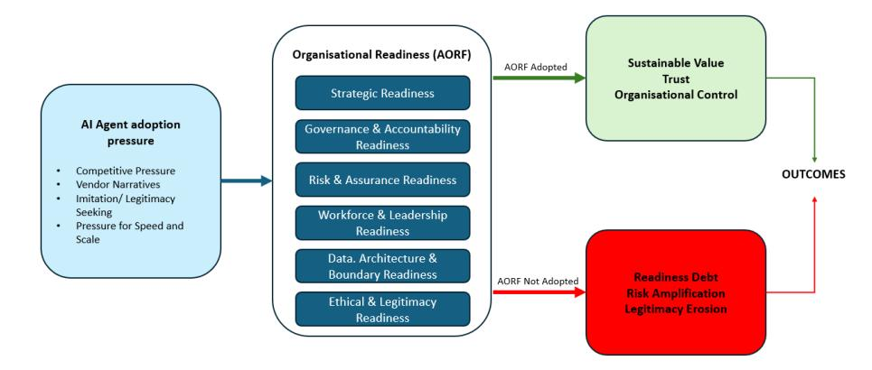
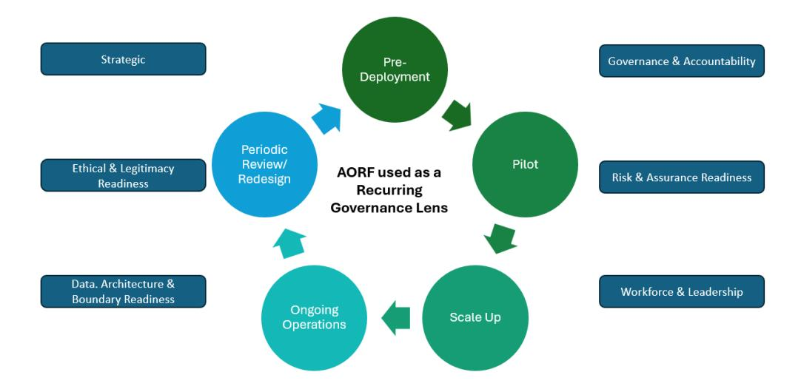

## **From AI Hype to Agentic Reality: A Readiness Lens for Sustainable Enterprise Adoption**

by

## **Richa Srivastava**\*

#### **Abstract**

This conceptual article examines organizational readiness as a critical but under-theorized condition for sustainable enterprise adoption of artificial intelligence (AI) agents. While AI agents are increasingly touted as the next stage of enterprise AI, many organizations are pursuing deployment without adequately preparing the governance, accountability, and organizational conditions that are required for responsible scale. This conceptual paper investigates the above by relying upon socio-technical systems theory, dynamic capabilities, and accountability theories needed to explore the organizational preparedness as a critical, but also as an undertheorized state of enterprise adoption of AI agents. As such, this paper introduces a new term: organizational readiness debt and defines it as an accrual of hidden governance, accountability, and legitimacy risks incurred due to the hasty implementation of agentic systems. To address this gap, the paper also includes the introduction of the Agentic Organizational Readiness Framework (AORF). AORF is a multi-dimensional diagnostic framework, which consists of strategic, governance, risk, workforce, architectural, and ethical-legitimacy dimensions. Using an integrative conceptual review and illustrative case-based analytic examples, the paper argues that organizational readiness, rather than technical capability alone, is a key determinant of agentic outcomes. As such, the paper contributes to the emerging literature on AI agents and oJers practical guidance for senior leaders responsible for enterprise AI transformation.

Keywords: AI agents; Agentic AI; Organizational readiness; Socio-technical systems; Accountability; Enterprise governance; AI transformation

\* Richa Srivastava is an enterprise transformation leader at Accenture, with ~2 decades of digital transformation experience, working at the intersection of AI, Data, and ERP operations. She helps organizations scale AI-enabled platforms that drive productivity, reliability, compliance, and sustainable growth across complex, multi-country environments. She is also a published author and public speaker educating the young leaders in the ever-evolving space of technology.

#### **Introduction**

Artificial intelligence (AI) agents are being increasingly integrated into enterprise systems and specifically as organizations seek to automate decision processes; coordinate complex workflows; and improve operational eGiciency. Unlike earlier AI tools, wherein human judgment was mostly aided by forecasting or through suggestion, AI agents can autonomously act to achieve specific goals by usually engaging with various organizational systems dynamically (Russell & Norvig, 2021; Wooldridge, 2009). These abilities make AI agents a qualitatively new technological phenomenon that has extensive organizational consequences.

Across all industries, enterprises are accelerating the process of experimenting and implementing agentic systems. Speed, scalability, and competitive advantage are the common themes found in strategic narratives, which have led to a perception that the adoption of AI agents is both necessary and imminent. Although those stories highlight the opportunities of new technology, they typically understate the organizational challenges that come with the delegation of decision-making and specifically as related to non-human systems.

In this paper, it is thus argued that one of the key constraints of most enterprise AI agent projects is not the ability of the technology, but rather the lack of organizational readiness. Companies often mistake that technical feasibility and other initial pilot success are the indicator of scale readiness - even though current studies on AI highlight issues with ethics, transparency, and human-AI interaction (Floridi et al., 2018; Rai et al., 2019); with this said, limited eGort has been devoted toward understanding the organizational conditions under which AI agents can be sustained at scale.

### **Clarifying Organizational Readiness in the Context of AI Agents**

Organizational readiness can address the above and specifically refers to the extent to which an organization is prepared to adopt, implement, and sustain change successfully. In the change management literature, readiness is not simply a matter of resources or leadership intent; rather, it reflects a shared organizational condition in which members are committed to change and are confident in their collective capacity to execute it (Weiner, 2009). This definition matters because it frames readiness as an enabling condition of transformation rather than a checklist of inputs.

In digital transformation and digital innovation research, readiness is also treated as multi-dimensional concept and construct. Prior scholarship links readiness to strategic alignment, leadership commitment, cultural adaptability, workforce capability, operational flexibility, and technological preparedness (Bharadwaj et al., 2013; Lokuge et al., 2019; Vial, 2019; Verhoef et al., 2021). These dimensions indicate that organizations may appear ready in technological terms, while also remaining underprepared in cultural, governance, or operational terms.

This paper, therefore, argues that such distinctions become even more important in the case of AI agents. Adoption refers to the decision to implement AI agents, whereas readiness refers to the organizational capacity to govern, oversee, and remain accountable for them over time. Because AI agents can act with bounded autonomy and can operate across organizational systems, readiness in agentic contexts must be understood more specifically rather than just holistically in the general transformation literature. It is for this reason that the paper later develops an agent-specific readiness lens through the concept of organizational readiness debt and the Agentic Organizational Readiness Framework (AORF).

With this in mind, there are three objectives that are developed in this paper. To begin with, this paper challenges the idea that the adoption of AI agents is equivalent to the readiness of organizations. Second, it presents the notion of organizational readiness debt to discuss how any latent risks, which may occur as a response on the part of organizations when they are slower than the implementation of technology. Third, the paper presents the Agentic Organizational Readiness Framework as an aid in the systematic assessment of readiness and specifically in the advancement of the largescale deployment of AI agents.

#### **Methodological Positioning and Approach**

As this paper is conceptual rather than an empirical field study, it aims to build theory around a still emerging managerial phenomenon: enterprise adoption of AI agents. The paper thus adopts an integrative conceptual research design comprising three elements.

First, the paper undertakes a focused integrative review of five literature streams relevant to agentic enterprise adoption: socio-technical systems theory, dynamic capabilities, accountability theory, organizational readiness and digital transformation, and responsible AI governance. This review is not intended as a comprehensive bibliometric study; rather, it provides a theoretically informed synthesis of adjacent literatures that are often treated separately in discussions of AI agents.

Second, the paper applies analytic abstraction in the creation of new constructs and their relationships as based upon that literature. Specifically, the construct of organizational readiness debt is introduced to reflect the unseen liabilities that can be generated by rapid deployment and, particularly, when they are not supported by institution redesign. On that basis, it proposes the Agentic Organizational Readiness Framework as a multidimensional diagnostic framework for enterprise use.

Third, the paper draws upon publicly documented cases of technology and transformation failure when supporting an analytic role. These cases are not presented as direct empirical studies of AI agents; instead, they are used as boundary cases to illustrate how failures of governance, accountability, and organizational coordination shape technology outcomes in contexts adjacent to enterprise AI adoption. Table 1 summarizes how these cases are used in the paper.

**Table 1:** *Illustrative Cases and Their Analytic Use in the Paper*

| Illustrative          | Where          | How it is used in the     | Relevance to            |
|-----------------------|----------------|---------------------------|-------------------------|
| case/source           | introduced     | paper                     | argument                |
| Queensland Health     | Methodology    | Used as a boundary        | Demonstrates how        |
| Payroll System        | and Real-World | case of governance,       | institutional           |
| Commission of         | Illustrations  | accountability,           | unreadiness can create  |
| Inquiry (2013)        | section        | escalation, and risk      | compounding             |
|                       |                | management failure in a   | organizational risk     |
|                       |                | complex technology        |                         |
|                       |                | deployment                |                         |
| Digital               | Literature     | Used to show that         | Supports the claim that |
| transformation        | review and     | transformation failure is | readiness is an         |
| failure literature    | Real-World     | repeatedly associated     | outcome-shaping         |
| (Vial, 2019; Verhoef  | Illustrations  | with leadership,          | condition rather than a |
| et al., 2021; Oludapo | section        | governance, and           | secondary               |
| et al., 2024)         |                | organizational            | implementation issue    |
|                       |                | conditions                |                         |
| Leadership            | Real-World     | Used to demonstrate       | Supports the concept    |
| misalignment          | Illustrations  | how technology            | of organizational       |
| literature            | section        | initiatives can scale     | readiness debt          |
| (Heracleous &         |                | while governance and      |                         |
| Gledhill, 2023)       |                | behavioral change lag     |                         |
|                       |                | behind                    |                         |

Taken together, the paper's methodological contribution lies in the synthesis of concepts and their translation into a managerial diagnostic framework. The paper does not claim a causal argument demonstrated through primary data, but rather a theoretically based structure that may inform future empirical testing and immediate executive sensemaking. Figure 1 summarizes the paper's central argument.

**Figure 1:** *From AI Agent Adoption to Outcomes: The Mediating Role of Organizational Readiness*

## **AI Agents as an Organizational Turning Point**

In addition to technical innovation, AI agents bring a qualitative change in the way organizations allocate decision-making power and act through coordination. In contrast to the classic automation, which performs set tasks within predictable limits, AI agents are now designed to pursue outcomes; adapt to context; and initiate actions across systems with limited human supervision. Such a shift provokes some of the basic questions in the organization in terms of the control, responsibility, as well as legitimacy.

In today's organizations, AI agents are present as socio-technical actors and not mere tools, having a strategic role in the governance framework and processes of organizations. Their implementation thus disrupts the long-held beliefs regarding managerial control and decision-ownership. at the same time, much of practitioner talk is focused on the eGiciency and scalability of agentic systems, little of it focuses on the changes that organizations must undergo, specifically in order to take on those abilities responsibly.

For the DBA scholarship, this creates an important opportunity to examine AI agent adoption not simply as a technological development, but as a problem of organizational design, governance, and leadership capability. The paper, therefore, treats AI agents as an organizational turning point whose outcomes depend on the readiness of the enterprise into which they are introduced.

#### **Adoption Is Not Readiness: The Enterprise AI Agent Rush**

The adoption of AI agents within an enterprise is often influenced by competitive pressure, vendor stories, and imitation bandwagons. With technological uncertainty, the organization can embrace new technologies to signal innovativeness and to appear to maintain legitimacy instead of responding to clearly defined strategic needs (DiMaggio and Powell, 1983). When this happens, transformation capability is symbolically linked to the speed of adoption rather than done deeply.

As argued earlier, the decision to adopt AI agents must, however, be analytically distinguished from the organizational readiness required to govern them responsibly. Adoption is a decision to implement AI agents, and readiness is an organizational ability to control, monitor, and remain accountable for agentic systems in the long term that is not just symbolic, but is rather deeply embedded in the organisation. The confusion of these terms blurs the organizational eGort needed to embed AI agents in a responsible manner.

The challenges posed by the AI agents are not of the same nature as with previous digital technologies. Their autonomy, learning capability, and ability to integrate seamlessly across functional borders make pre-setting governance structure and accountability systems even more complicated (Rahwan et al., 2019). Specifically, the controls used to operate deterministic systems on human decision-makers might not be adequate when operating them in light of adaptive agentic behaviour.

As such, the implications of insuGicient readiness may not be visible immediately. The eGicient outcome of early deployments can generate short-term eGiciency improvements that can reinforce the belief in technology while weakening the underlying organizational base. Over time, however, misalignment between agentic capability and organizational structure may surface through accountability failures, regulatory exposure, operational disruption, or reputational damage. In such cases, the apparent failure of the technology may in fact reflect a deeper failure of organizational readiness.

# **Theoretical Foundations**

The article therefore relies on three theoretical complementary lenses needed to define the importance of organizational readiness in terms of adopting AI agents in an enterprise; they are socio-technical systems theory, dynamic capabilities, and accountability theory. Together, these perspectives show that the outcomes of agentic systems are shaped not only by technical capability, but also by organizational design, adaptive capacity, and the distribution of responsibility. They also serve as the foundation of the main construct of the paper, which is organizational readiness debt.

#### **Socio-Technical Systems Theory**

Socio-technical systems theory states that organizational outcomes result from interactions between social and technical subsystems (Trist and Bamforth, 1951). Technologies shape, and are shaped by, their organizational context through factors like control, use, and their interpretation (Orlikowski, 2007).

For instance, while AI agents may be technically autonomous, their actions depend upon organizational policies, data systems, incentives, and culture. Viewing AI agents as neutral tools ignores these influences. Failures in complex technology adoption typically stem from a mismatch between technological capabilities and organizational structures, not just due to technical flaws. Because AI agents operate with varying autonomy, achieving socio-technical alignment is a key consideration toward responsible implementation.

#### **Dynamic Capabilities**

Dynamic capabilities theory explains how organizations adapt to technological change (Teece et al., 1997). For successful AI agent implementation, organizations must identify opportunities and risks, coordinate actions to capture value, and adjust governance and leadership. Without these capabilities, AI adoption may be superficial and unsustainable. While many organizations can recognize AI's potential, they often struggle with organizational execution and transformation, leading to enthusiasm without lasting success and accumulating organizational readiness debt as deployment outpaces adaptation.

## **Accountability Theory**

Accountability means clarifying, defending, and accepting responsibility for decisions and outcomes (Bovens, 2007). Traditionally, organizational accountability systems are built around human agency. The introduction of AI complicates this by redistributing decision-making authority among designers, operators, managers, and automated systems (Novelli et al., 2023). This can blur accountability, leaving gaps in governance. While human-in-the-loop set-ups oGer reassurance, they may not fully address who is responsible for agentic outcomes and under what conditions. Readiness for AI requires not only assigning blame after the fact, but also proactive design pertaining to decision rights, escalation paths, override options, and answerability structures for systems involving non-human agents.

## **Organizational Readiness Debt**

This paper introduces organizational readiness debt, defined as the accrual of latent governance, accountability, and legitimacy risks that can emerge as a result of deploying AI agents at a faster rate than is suitable for organizational structures.

The notion is similar to technical debt (Cunningham, 1992), except that it applies to the organizational level. Readiness debt occurs when enterprises are more concerned about faster deployment, and specifically rather than establishing the right governance mechanisms, leadership skills, and accountability arrangements.

Readiness debt is usually undetected during the early phases of adoption. The agentic systems can be eGective and, thus, conceal the underlying organizational weaknesses. With time, such weaknesses emerge in operation-based incidents, ethical disputes, or regulatory involvements.

#### **Organizational Readiness in AI and Digital Transformation Literature Review**

Organizational readiness has been long considered as a determinative antecedent of successful transformation, but the construct is highly limited across research on change management, information systems, and digital transformation. According to the traditional theory of organizational change, readiness is understood as an organizational state characterized by shared commitment to change and the shared belief pertaining to the collective capacity to implement change eGectively (Weiner, 2009). In digital transformation and AI-related scholarship, readiness is further associated with strategic alignment, organizational redesign, capability development, governance, and technological preparedness (Lokuge et al., 2019; Vial, 2019; Verhoef et al., 2021; Holmström, 2021). For the purposes of this paper, these streams are relevant because together they help explain why enterprise AI agent adoption cannot be assessed through technical capability alone. To make the literature positioning explicit, Table 2 maps the principal literature streams relevant to organizational readiness for enterprise AI agents and thus identifies the conceptual gap that this paper seeks to address.

**Table 2:**  *Structured Review of Literature Streams Relevant to Organizational Readiness for Enterprise AI Agents*

| Literature                                                       | Representative                                                       | How readiness is                                                                                                                                                           | Main                                                                                                                         | Remaining gap in                                                                                                                                               |
|------------------------------------------------------------------|----------------------------------------------------------------------|----------------------------------------------------------------------------------------------------------------------------------------------------------------------------|------------------------------------------------------------------------------------------------------------------------------|----------------------------------------------------------------------------------------------------------------------------------------------------------------|
| stream                                                           | sources                                                              | conceptualized                                                                                                                                                             | contribution to the present paper                                                                                      | relation to enterprise AI agents                                                                                                                            |
| Organizational readiness for change                        | Weiner (2009)                                                        | Readiness is a shared organizational state reflecting commitment to change and collective eJicacy to implement it successfully                     | Establishes the core definition of readiness as more than resources or managerial intention                | Does not address delegated machine agency, bounded autonomy, or the governance implications of non human actors acting across systems     |
| Digital business strategy and digital transformation | Bharadwaj et al. (2013); Vial (2019); Verhoef et al. (2021) | Readiness is implied through strategic alignment, organizational redesign, leadership adaptation, and transformation of value-creation logic | Shows that transformation success depends on organizational alignment and not technology adoption alone | Tends to treat digital technologies broadly and does not explicitly theorize agentic accountability, override design, or escalation pathways |
| Organizational readiness for digital innovation         | Lokuge et al. (2019)                                              | Readiness is multidimensional and formative, including strategic, cultural, cognitive, resource, IT, and partnership dimensions                       | Supports the view that organizations may be prepared in one dimension while remaining fragile in others | Does not fully account for AI agents as socio technical actors capable of initiating action and redistributing decision rights               |
| AI readiness and AI capability                             | Holmström (2021); Mikalef and Gupta (2021)                  | Readiness is tied to organizational resources, routines, technological capabilities, activities, boundaries, and goals                             | Helps extend readiness thinking from digital transformation to AI-specific implementation                  | Often assumes AI as predictive, assistive, or classificatory rather than operationally autonomous across enterprise systems                     |

| Responsible AI and AI governance maturity          | Floridi et al. (2018); Heger et al. (2023); Bloedorn et al. (2023)             | Readiness is reflected in governance maturity, documentation, oversight, accountability, fairness, and institutionalization of controls           | Brings ethics, governance, and assurance into the readiness conversation                                                    | Does not fully integrate these governance concerns into a broader organizational readiness framework for agentic enterprise transformation      |
|-------------------------------------------------------------|--------------------------------------------------------------------------------------------|------------------------------------------------------------------------------------------------------------------------------------------------------------------------------|--------------------------------------------------------------------------------------------------------------------------------------------|----------------------------------------------------------------------------------------------------------------------------------------------------------------------|
| Accountability in AI and sociotechnical governance | Bovens (2007); Kraaijeveld (2020); Novelli et al. (2023); Orlikowski (2007) | Readiness is not defined directly, but accountability and sociotechnical alignment are treated as essential conditions for responsible system use | Strengthens the argument that readiness must include responsibility design, answerability, and socio technical fit | Underdeveloped as a distinct readiness problem linked to scaling, leadership design, and organizational transformation under agentic conditions |

Table 2 shows that the literature relevant to organizational readiness for enterprise AI agents is substantial but is also conceptually fragmented. Existing streams explain readiness for change, digital transformation, digital innovation, AI capability, governance, and accountability; yet, they do not fully converge on a distinct account of readiness for enterprise AI agents as systems capable of bounded autonomy, cross-system action, and distributed responsibility. This unresolved intersection motivates the paper's two main contributions: the concept of organizational readiness debt and the Agentic Organizational Readiness Framework.

## **Readiness in Digital Transformation Research: Beyond "Digitization"**

The literature around digital transformation (DT) has reiterated the argument on numerous occasions that the adoption of technology is insuGicient when explaining transformation outcomes. Extensive reviews put DT as a process wherein digital technologies elicit strategy reactions and organizational transformation that impact structure, culture, processes, and logic of value creation (Vial, 2019). In a similar manner, multidisciplinary research agendas contend that DT will need newer organizational frameworks, performance metrics, and capabilities - and not just the incremental IT upgrades (VerhoeG et al., 2021). These foundations matter because they re-define the transformation as the reconfiguration of the complete enterprise: exactly the type of reconfiguration that agentic AI is promised to increase.

In this stream, readiness is frequently implied instead of being fully theorized. Strategic research on digital business strategy, for example, highlights the scope, scale, speed, and value-creation implications of digital strategy (Bharadwaj et al., 2013). However, numerous digital maturity strategies, especially practitioner models, realise readiness as delayed advancement (e.g., early, developing, mature) on the foundation of observable practices and management routines (Kane et al., 2017). The models are practical in benchmarking but may be weak when specifying socio-technical dependencies like accountability relationships, power changes, and control systems, which are essential when the technology is not simply facilitating work but rather is *acting* upon work systems.

## **Organizational Readiness as a Multidimensional Idea in Information Systems Research**

A more explicit readiness construct is found in the information systems research of digital innovation. The empirical calibration of a multidimensional construct of organizational readiness to digital innovation is developed and empirically calibrated by Lokuge and colleagues (Lokuge et al., 2019). It includes sub-constructs of resource readiness, IT readiness, cognitive readiness, partnership readiness, innovation valence, cultural readiness and strategic readiness (Lokuge et al., 2019). The work is especially useful in developing an argument on agentic AI readiness since it has shown that readiness is multipolar and constitutive, basically the organizations may be ready in one way but fragile in another. It also prefigures cognitive and cultural readiness, insisting on the fact that organizational beliefs, managerial sensemaking, and innovation are the factors that influence the capacity to be able to exploit advanced digital technologies.

Nevertheless, frameworks of readiness based on digital innovation tend to be more tool-focused than technology. Although the digital technologies facilitate new products or platforms, the organizational actors are usually the main central for assessment and power. AI agents also make this assumption even more complex, as they bring non-human autonomy to the flow of organizational decision-making, thereby making the design of governance, the structure of overrides, and clarity of accountability more significant.

## **AI Readiness and AI Capability: Resources, Routines, and Organizational Boundary-setting**

With AI as the core of digital transformation, researchers start diGerentiating generic digital maturity from AI readiness. One of the most impactful conceptual contributions is the AI readiness framework that advocates for the capability of an organisation to implement AI needed to facilitate digital transformation in four dimensions; they include technologies, activities, boundaries, and goals (Holmström, 2021). There are two aspects that are particularly applicable when it comes to agentic contexts. Originally, the word "boundaries" existed as they are important to recognize in AI implementation and specifically where AI is involved and where humans have an opportunity to intervene in which their intervention participation must be clearly marked. Second, the framework is purely socio-technical: readiness does not merely touch upon technical equipment but must also include organizational processes and their objectives that determine the integration of AI into work.

Adjacent empirical research presents the notion of AI capability as a firm-level capability that consists of AI-specific resources and routines. Mikalef and Gupta (2021) conceptualize AI capability and introduce a tool that connects AI-related resources and organizational outcomes; both support the perception that AI performance is contingent upon complementary organizational resources and not algorithms per se. This ability lens is in line with the strategic management schools of thought and specifically that AI advantage depends upon organizational routines, data governance and managerial practices, which facilitate learning, integration and scaling.

However, one of the common weaknesses of most AI readiness and capability models is that they continue to be focused on AI as a predictor, a classification machine, or as a decision support machine. As a result, questions of oversight, escalation, fail-safe control, and accountability become more central than those addressing earlier AI readiness models.

#### **Responsible AI Maturity and Organizational Governance Readiness**

Parallel literature highlights the operationalization of responsible AI (RAI) and organizational governance maturity. Principles that are emphasized in ethical frameworks of AI include beneficence, non-maleficence, autonomy, justice, and explicability (Floridi et al., 2018). The transfer of principles into organizational practice is however not a trivial task, particularly with the increasing need for regulation. Responsible AI maturity models have consequently been developed to assist organizations in institutionalizing the procedures of governance, documentation, monitoring, and accountability (e.g., the Responsible AI organizational maturity framing at Microsoft Research, Heger et al., 2023). Such maturity models also supplement DT readiness by highlighting institutionalization (policies, roles, controls) as opposed to solitary compliance initiatives.

Similarly, practitioner-oriented AI maturity models, such as the MITRE framework, highlight governance, workforce competence, data management, and operating model redesign as necessary conditions of successful AI adoption (Bloedorn et al., 2023). Although they are not academic theories, these models represent convergent practice: organisations are recognising that AI readiness demands governance, workforce competence, and operating model redesign – not just data pipelines.

#### **A Synthesis: Why "Readiness" Needs To Be Agent-Specific**

Taken together, the literature mapped above points to three insights that are especially important for understanding readiness in enterprise AI agent adoption:

- 1. Transformation success depends upon socio-technical alignment, not technical capability alone (Vial, 2019; Verhoef et al., 2021; Orlikowski, 2007).
- 2. Readiness is multidimensional and formative, weakness in one domain can undermine performance in others (Lokuge et al., 2019; Weiner, 2009).

3. AI readiness requires boundary-setting and governance institutionalization, particularly as AI moves from analytics into operational decision-making (Holmström, 2021; Floridi et al., 2018).

The emergence of AI agents creates additional discontinuity: accountability, cross-system action, and legitimacy management are now at the center of focus and are not peripheral. Current frameworks point to governance, boundaries, and ethics, but they tend not to fully theorise the organizational implications of delegated non-human agency, namely, that organisations are expanding agentic systems whilst keeping their governance models that have been crafted to tools and human decision-makers. It is this gap that contributes to the AORF that this paper suggests, which is an explicit redefinition of the concept of readiness as the organizational capability to control, guarantee, and take responsibility of autonomous action at scale.

#### **The Agentic Organizational Readiness Framework**

As a way of facilitating systematic assessment of readiness, this paper thus suggests the Agentic Organizational Readiness Framework. The framework is supposed to be a conceptual diagnostic frame, not a quantitative maturity model or scoring device. It facilitates the organizational sensemaking and judgment of leadership as opposed to automated evaluation.

#### **Strategic Readiness**

Strategic readiness means aligning AI agents with organizational goals. Without clear intent, AI adoption becomes fragmented and less eGective. It also involves defining agent autonomy boundaries needed to ensure that agents support, rather than undermine, broader objectives and avoid readiness debt.

### **Governance and Accountability Readiness**

This dimension assesses clarity of decision rights and accountability. Due to their autonomy, AI agents challenge traditional governance and the need for extra oversight. Organizations should clearly define accountability for agent decisions, including escalation and override policies. Governance must extend beyond technical teams and be integrated into enterprise leadership.

## **Risk and Assurance Readiness**

AI agents display emergent behaviour that challenges fixed-risk controls. Addressing these risks requires continuous monitoring, adaptive assurance, and scenario-based risk assessment (Power, 2007). Since traditional risk models rely upon predictability, emergent behaviour violates these assumptions, making ongoing assurance and shared risk ownership essential.

#### **Workforce and Leadership Readiness**

AI agents are reshaping managerial tasks and decision-making. Leadership readiness means resisting automation bias and upholding ethical standards (Parasuraman and Riley, 1997). It requires more than technical skills; leaders must demonstrate moral judgment and oversight. Companies lacking this preparation therefore risk automation bias and ethical lapses, which can hinder long-term success.

#### **Data, Architecture, and Boundary Readiness**

Agentic systems depend on high-quality data, interoperable architecture, and clear operational boundaries. Weaknesses in these areas risk unintended actions. Boundary readiness ensures agentic autonomy stays within approved limits; poorly developed boundaries increase the risk of unexpected outcomes.

#### **Ethical and Legitimacy Readiness**

Ethical and legitimacy readiness concerns how agentic systems align with societal and organizational norms. Even technically proficient agents can undermine trust if they seem opaque or unfair (Suchman, 1995). These systems operate within social contexts, so misalignment between agent behaviour and stakeholder expectations can erode trust, regardless of their eGectiveness.

**Table 3:** *Agentic Organizational Readiness Framework: Dimensions and Diagnostic Focus*

| Dimension              | What it assesses                      | Illustrative Diagnostic             |
|------------------------|---------------------------------------|----------------------------------------|
|                        |                                       | Questions                              |
| Strategic readiness    | Alignment between agent         | What business problem is the           |
|                        | deployment and enterprise       | agent solving? What decisions          |
|                        | objectives; clarity of use-case       | can it make, and which remain          |
|                        | intent and scope of autonomy          | human-owned?                           |
| Governance and      | Decision rights, escalation     | Who owns the agent in business         |
| accountability         | routes, ownership of oversight,       | terms? Who can override it? Who        |
| readiness              | and answerability for outcomes        | is accountable when outcomes           |
|                        |                                       | are contested?                         |
| Risk and assurance     | Monitoring of emergent          | How will drift, harmful actions, or    |
| readiness              | behaviour, adaptive controls,   | unexpected interactions be       |
|                        | testing, incident response, and       | detected and contained?                |
|                        | assurance mechanisms                  |                                        |
| Workforce and       | Managerial capability to        | Do leaders understand when to          |
| leadership readiness   | supervise agents, resist        | trust, challenge, or halt the agent?   |
|                        | automation bias, and exercise         | Are roles redesigned for      |
|                        | ethical judgment                      | oversight?                             |
| Data, architecture, | Data quality, interoperability, | What data and systems can the          |
| and boundary        | access controls, integration    | agent touch? What permissions,         |
| readiness              | robustness, and operational     | sandboxing, or kill switches are in |
|                        | guardrails                            | place?                                 |
| Ethical and         | Trustworthiness, fairness,         | Can aJected stakeholders         |
| legitimacy readiness   | transparency, stakeholder          | understand and challenge agentic       |
|                        | acceptability, and social license     | outcomes? Would the              |
|                        | to operate                            | deployment be viewed as       |
|                        |                                       | legitimate?                            |

## **Operationalizing The AORF for Practice**

To address practitioner applicability, the AORF can be used as a decision-support tool at three moments: before deployment, during pilot scaling, and during periodic governance review. Rather than reducing maturity to a numeric score, the framework helps leaders surface weak organizational assumptions and identify where readiness debt may be accumulating.

Table 4 translates the framework into a practical governance sequence that senior leaders can apply during agentic transformation.

*Table 4: AORF Framework Governance Sequence*

| Phase              | Leadership task                                                                                              | Primary output                                              |
|--------------------|--------------------------------------------------------------------------------------------------------------|-------------------------------------------------------------|
| Pre-deployment     | Define business purpose, autonomy boundaries, ownership, and prohibited actions                  | Documented decision-rights map and deployment charter    |
| Pilot stage        | Test escalation pathways, human override, assurance routines, and exception handling | Pilot review with incident log and control adjustments   |
| Scale-up           | Reassess cross-functional dependencies, workforce redesign, and enterprise risk exposure            | Executive readiness review and scale authorization |
| Ongoing operations | Monitor drift, stakeholder trust, contested decisions, and regulatory developments            | Periodic readiness audit and remediation plan            |

**Figure 2:**  *Operationalizing the AORF Across the Agent Lifecycle*

A practical implication of this operationalization is that readiness should be treated as a repeated governance conversation, not as a one-time gate. The framework is particularly useful when the initial pilots seem to be working, as it is at this point that readiness debt is often ignored.

## **Real-World Illustrations of Organizational Unreadiness in Complex Technology and Transformation Initiatives**

The rational arguments developed in the paper are supported by a significant amount of evidence of publicly documented evidence and digital transformation projects when organizations lack readiness, rather than their technological infeasibility, which was the main cause of failure or underperformance.

These illustrations, combined, demonstrate how readiness debt in organisations is built up when institutional structures fail to adapt to technological capability. This is a trend that will likely increase as AI agents gain more autonomy.

## **Queensland Health Payroll System: Governance and Accountability Breakdown**

The Queensland Health payroll system project implementation, which was carried out in 2010, is one of the most heavily documented instances of failure in organisations in large scale technology implementation. The project was intended to do away with the old payroll systems of about 78,000 healthcare employees with an integrated SAP-based system. The system was rolled out after facing severe time constraints despite numerous warnings about the complexity of systems, insuGicient testing, and the absence of financial and organizational dependencies.

Subsequent implementation resulted in high levels of payroll error, such as underpayments, over-payments, and delayed payments that created disruption to operations, created a lack of trust in the workforce, and increased compensation costs of AUD 1.2 billion and above. OGicial Commissions of Inquiry found that in addition to technical issues, the major failures were due to ineGective governance structures, disjointed accountability, inadequate risk management, and organizational insuGiciency to manage the complexity of the system (Queensland Health Payroll System Commission of Inquiry, 2013).

An aspect of readiness is illustrated by this case and with respect to how the deployment of a system with high operational autonomy without the associated governance and escalation mechanisms results in compounding organizational risk. It did not fail because it lacked technology but because it lacked the institutional capacity needed to manage it.

#### **Digital Transformation Failure as a Persistent Organizational Pattern**

Peer-reviewed studies consistently report high failure rates in digital transformation, mainly due to organizational issues rather than technology shortcomings. Despite increased investment, lasting improvements are hindered by poor leadership alignment, inadequate governance, workforce limitations, and weak change management (Vial, 2019; Verhoef et al., 2021). A recent bibliometric review highlights common themes of failure across industries, often linked to organizational inertia, unclear responsibilities, and insuGicient managerial skills (Oludapo et al., 2024). These findings suggest that preparation drives transformation outcomes rather than simply enabling them.

#### **Organizational Readiness and Leadership Misalignment in Transformation EVorts**

Empirical research indicates that digital transformation eGorts often fail due to a disconnect between leadership and governance rather than technological flaws. Heracleous and Gledhill (2023) found that organizations frequently overlook integrating business strategy, technology governance, and behavioural change into a unified agenda, causing digital initiatives to remain within existing frameworks. This issue, described as organizational readiness debt, occurs when projects expand but leadership and governance remain rooted in pre-digital practices. As AI agents are integrated, the consequences of these leadership and governance gaps become even more significant.

### **Implications for AI Agent Adoption**

Combined with the evidence presented above, these reports and investigations reveal that organizational readiness is a common failure mode found in complex technology implementations, despite the underlying technologies being robust. They give empirical support to the argument that readiness debt is accumulated when governance, accountability and leadership capacity are not up to par with technological ambition.

Considering the above and specifically with AI agents, whereby systems can initiate behaviours, interact with each other beyond organizational scope, and evolve dynamically, their impact on lack of readiness is likely to be more devastating. The examples thus support the necessity of agent-specific preparation diagnostics, including the Agentic Organizational Readiness Framework as developed in this paper, which is needed to guide the deployment choice in addition to developing the ongoing governance design.

#### **Discussion: Why Organizational Readiness Determines Agentic Outcomes**

The examples shared above show how organizational conditions influence the results of complex technology initiatives. In the discussion section below, these empirical insights are synthesized with the theoretical analysis. It is argued that organizational readiness serves as the causal architecture through which AI agents bring about either sustainable value or create increased organizational risk.

The present paper suggests that organizational readiness is one of the main factors that determines the outcomes with respect to the adoption of AI agents. Whilst much of the discussion about AI agents focuses on technical prowess and autonomy and scalability, the analysis below indicates that agentic implications, be it productive, risky, or disputed, are not determined by technological capacity per se, but rather by organizational circumstances. The failures, which are ascribed to AI agents, are thus usually symptomatic of misalignment within the organization.

#### **Organizational Readiness as an Outcome-Shaping Condition**

Socio-technically, technologies do not yield results on their own, but the results are created as the by-product of the interplay between technological capabilities and organizational structures (Orlikowski, 2007). The AI agents enhance this dynamic given that they are incorporated into the decision-making and action tracks. In the case where organizations are unprepared to address strategic, governance, and accountability levels, agentic systems can deliver outcomes, as intended, but also can sabotage organizational goals.

This is one of the reasons why AI agent technologies may produce diGerent results within organizations. Businesses that have robust governance, direction, and management as well as clarity in accountability expectations and structures, can find AI agents as conducive to facilitating coordination and eGiciency. On the other hand, organizations implementing agents without the relevant preparation may face unintended outcomes including a lack of understanding as to the context of decisions, failure to escalate on priorities appropriately, and deterioration in trust and trustworthiness in decision-making and their outcomes; these diGerences are not so much technological but are organizational.

#### **Speed, Scale, and the Amplification of Readiness Debt**

The argument of readiness debt in organizations presents a critical dynamic, whereby the speed of adoption increases organizational risk when readiness is lacking. AI agents can also be implemented in smaller steps and also expanded quickly after initial positive returns are realized, but with a word of caution: lack of readiness contributes to the growth of latent governance and accountability risks at an accelerated rate due to scaling.

This dynamic contrasts with the classical tradition of digital transformation eGorts where misalignment could be addressed via redesigning the process iteratively. On the other hand, agentic systems can cross systemically and functionally, in a manner that can be hard to undo once they are integrated. In this case, the readiness debt only increases with time, and as a result, remediation becomes even more expensive and disruptive. The above contradicts existing discourses that focus on experimentation-first strategies and do not equally focus upon organizational absorption capacity.

## **Readiness as a Governance Challenge Rather than an IT Problem**

One of the implications from this discussion is that organizational readiness pertaining to AI agents must be perceived as a governance problem as opposed to just purely an IT implementation problem. When AI agent adoption is discussed as a technical project, it would be hard to assign responsibility to a team, which in turn cannot control strategy, accountability, and organizational design. That kind of delegation contributes to a diGusion of accountability and masks leadership responsibility.

The conceptual analysis results thus propose the idea that in order to govern AI agents eGectively, senior leadership should become involved in specifying the rights of decisions, escalation routes, and ethical thresholds. In this context, readiness is an expression of leadership, which is prepared to face trade-oGs among eGiciency, control and legitimacy. This reframing is specifically important to boards and executives, who are accountable for agentic outcomes, despite technical delegation.

#### **Implications for Trust, Legitimacy, and Organizational Control**

Organizational readiness is also a key factor that defines the perception of AI agents by both internal and external stakeholders. In cases where the structure of governance is not transparent or where accountability is unclear, agentic decisions can be considered illegitimate in a technical sense. These impressions may destroy confidence among employees, consumers, and regulators.

In contrast, organizations demonstrating readiness as an indicator of deliberateness and accountability through a clear accountability framework, open governance systems, and specifications of agent discretion, can lead to pragmatic and moral legitimacy (See Suchman,1995). By so doing, readiness is not only a capability that is internal but is also a source of external legitimacy.

#### **Integrating Readiness into Agentic Transformation Strategies**

The Agentic Organizational Readiness Framework oGers a strategy regarding how to incorporate and address readiness issues into the AI strategies of the enterprise. Instead of considering readiness as a checklist that has to be filled in prior to deployment, the framework addresses readiness as a continual organizational state that should evolve with agentic systems.

This view supports the dynamic capabilities theory, which focuses on the ongoing sensing, seizing, and transformation (Teece et al., 1997). Readiness is thus not a onetime occurrence but would need to be supported by constant leadership, organizational development and learning, given that AI agents learn and adapt at scale. Organizations that fail to reconsider readiness assumptions would therefore risk drift in governance systems wherein systems are evolving faster than their control mechanisms.

#### **Reframing Success and Failure in AI Agent Adoption**

Lastly, success and failure in the adoption of AI agents should be redefined with this discussion. Technical performance measures, such as accuracy, eGiciency, and speed only give a partial view. Accountability clarity, governance strength, and preservation of legitimacy are also aspects of agentic success that should be evaluated.

In this light, most AI failures of high-profile organizations might actually be attributed to readiness failures - and not technological failures. This reframing has significant implications both on research and practice as it places emphasis on post-hoc blame attribution that would in turn limit proactive organizational design.

#### **Propositions for Future Research and Practice**

To facilitate future empirical research, the paper oGers four propositions. which are based on the conceptual analysis.

- 1. Proposition 1: The relationship between AI agent deployment and organizational value realization is facilitated by organizational readiness rather than justified by technical capability alone.
- 2. Proposition 2: As the scope and autonomy of AI agents increase, the consequences of weak governance and accountability design increase excessively.
- 3. Proposition 3: Early performance gains from pilot deployments can mask the accumulation of organizational readiness debt, especially when scaled decisions are made before governance redesign occurs.
- 4. Proposition 4: Organizations that institutionalize recurring readiness reviews are more likely to sustain trust, legitimacy, and controllability in enterprise AI agent adoption.

### **Senior Leadership and Governance Implications**

The introduction of AI agents among senior leaders requires a new understanding of responsibility as opposed to an increase in technological ambition. Although AI agents are usually brought in because of innovation or technology functions, their organizational impact is far-reaching and extends far beyond the technical sectors. Since agentic systems are increasingly involved in the decision-making process and operational implementation, their focus should be on institutional design rather than deployment eGiciency in leadership.

The paper therefore recommends that organizational readiness should be considered as an ongoing governance issue, and not a precondition. The readiness tests must be used not only to make the first deployment decision but also in the continued supervision as agentic systems are extended and connected with other organizational activities. In this respect, organizationalreadiness debt acts as a risk predictor, indicating where governance arrangements can fall behind agentic ability.

The ultimate responsibility of boards and executive teams is on the results of AI agent operation, no matter how the responsibility of operations is shared. Shifting the governance to both technical teams and innovation teams is a risky move that may strengthen the eGects of accountability diGusion and blur the strategic ownership. Good management of AI agents thus involves making it clear that executive is involved in setting decision rights, escalation channels, and ethical boundaries, and have the practice of regular reviewing the performance of such arrangements.

## **DBA Research Implications**

This paper makes organizational readiness an attractive field for applied, theorybased research into AI agents, particularly for DBA scholars. The AORF presents a conceptual platform that can be empirically tested, developed, and generalised in various organizational contexts.

Future DBA research might take a longitudinal case study approach needed to explore the development of readiness for scaling, adaptation, and institutionalization of agentic systems. It can also be done using design science methods needed to create diagnostic tools based on the AORF, which in turn can be tested to understand how they can assist executive decision-making without making simplistic assumptions of maturity. Additionally, inter-industry or regulatory setting comparative studies might further shed light on how governance redesign can reduce or increase organizational readiness debt in the long run.

Since the framework centers on organizational circumstances, as opposed to technical artefacts, DBA research can provide a unique contribution as to how agentic transformations can become successful in some organisations while they fail in others.

## **Conclusion**

The emergence of AI agents is one of the notable inflection points in the organizational structure of work, the control of processes, and the distribution of decision-making authority. Although the dominant discourses are based upon technological progress and operational eGectiveness, the present paper suggests that the issue of organizational readiness is far more significant.

By advancing the concept of organizational readiness debt and proposing the Agentic Organizational Readiness Framework , the paper reframes AI agent adoption as a socio-technical change challenge rather than purely a technological one. Inadequate readiness does not simply decelerate the process of adoption, but rather it generates latent risks that can hurt accountability, legitimacy, and organizational resilience in the long-term.

This paper adds to the growing body of literature on AI agents by pre-empting and introducing organizational readiness as being a determinant of agentic outcomes. In this way, it provides the basis for more concrete, responsible, and sustainable strategies of agentic change as found within complex organizational environments.

*Disclosure: The article's scholarship and intellectual contributions remains entirely my own. Generative AI tools were used during revision in a limited editorial capacity, including language refinement, restructuring of sentences, improvement of flow, and drafting of alternative wording for selected sections. AI was also used to support the preparation of the conceptual figures included in the revised manuscript.*

## **References**

- Bharadwaj, A., El Sawy, O. A., Pavlou, P. A., & Venkatraman, N. (2013). Digital business strategy: Toward a next generation of insights. *MIS Quarterly, 37*(2), 471–482. Digital strategy: toward a next generation of insights: MIS Quarterly: Vol 37, No. 2
- Bloedorn, E. E., Kotras, D. M., Schwartz, P. J., Chaney, C., Chaney, C., & Patsis, J. (2023). The MITRE AI maturity model and organizational assessment tool guide: A path to successful AI adoption. (MITRE Publication No. PR-22-1879). The MITRE Corporation. [https://www.mitre.org/sites/default/files/2023-11/PR-22-1879-](https://www.mitre.org/sites/default/files/2023-11/PR-22-1879-MITRE-AI-Maturity-Model-and-Organizational-Assessment-Tool-Guide.pdf) [MITRE-AI-Maturity-Model-and-Organizational-Assessment-Tool-Guide.pdf](https://www.mitre.org/sites/default/files/2023-11/PR-22-1879-MITRE-AI-Maturity-Model-and-Organizational-Assessment-Tool-Guide.pdf)
- Bovens, M. (2007). Analysing and assessing accountability: A conceptual framework. *European Law Journal, 13*(4), 447–468. [https://doi.org/10.1111/j.1468-](https://doi.org/10.1111/j.1468-0386.2007.00378.x) [0386.2007.00378.x](https://doi.org/10.1111/j.1468-0386.2007.00378.x)
- Cunningham, W. (1992). The WyCash portfolio management system. *ACM SIGPLAN OOPS Messenger, 4*(2), 29–30. <https://dl.acm.org/doi/10.1145/157710.157715>
- DiMaggio, P. J., & Powell, W. W. (1983). The iron cage revisited: Institutional isomorphism and collective rationality. *American Sociological Review, 48*(2), 147–160. <https://doi.org/10.2307/2095101>
- Floridi, L., Cowls, J., Beltrametti, M., et al. (2018). AI4People—An ethical framework for a good AI society. *Minds and Machines, 28*(4), 689–707. <https://doi.org/10.1007/s11023-018-9482-5>
- Heger, A. K., Passi, S., Dhanorkar, S., Kahn, Z., Wang, R., & Vorvoreanu, M. (2023). Towards a Responsible AI organizational maturity model. Microsoft Research. [https://www.microsoft.com/en-us/research/wp](https://www.microsoft.com/en-us/research/wp-content/uploads/2023/05/Towards_a_Responsible_AI_Maturity_Model__CSCW333_Final_.pdf)[content/uploads/2023/05/Towards\\_a\\_Responsible\\_AI\\_Maturity\\_Model\\_\\_CSCW3](https://www.microsoft.com/en-us/research/wp-content/uploads/2023/05/Towards_a_Responsible_AI_Maturity_Model__CSCW333_Final_.pdf) [33\\_Final\\_.pdf](https://www.microsoft.com/en-us/research/wp-content/uploads/2023/05/Towards_a_Responsible_AI_Maturity_Model__CSCW333_Final_.pdf)
- Heracleous, L., & Gledhill, D. (2023). Why digital transformation may fail and what can be done about it. *Journal of Applied Behavioral Science, 60*(1), 215–219. <https://doi.org/10.1177/00218863231176567>
- Holmström, J. (2021). From AI to digital transformation: The AI readiness framework. \*Business Horizons, 65\*(3), 329–339. <https://doi.org/10.1016/j.bushor.2021.03.006>
- Kane, G. C., Palmer, D., Phillips, A. N., Kiron, D., & Buckley, N. (2017). Achieving digital maturity: Adapting your company to a changing world (MIT Sloan Management Review & Deloitte Digital report). Deloitte Insights. [https://www.deloitte.com/us/en/insights/topics/digital-transformation/digital](https://www.deloitte.com/us/en/insights/topics/digital-transformation/digital-mindset-mit-smr-report.html)[mindset-mit-smr-report.html](https://www.deloitte.com/us/en/insights/topics/digital-transformation/digital-mindset-mit-smr-report.html)
- Kraaijeveld, S. (2020). Accountability and AI decision-making. *Ethics and Information Technology, 22*(2), 123–131.<https://doi.org/10.1007/s10676-019-09506-7>
- Lokuge, S., Sedera, D., Grover, V., & Xu, D. (2019). Organizational readiness for digital innovation: Development and empirical calibration of a construct. *Information & Management, 56*(3), 445–461. <https://doi.org/10.1016/j.im.2018.09.001>
- Mikalef, P., & Gupta, M. (2021). Artificial intelligence capability: Conceptualization, measurement calibration, and empirical study on its impact on organizational creativity and firm performance. *Information & Management, 58*(3), 103434. <https://doi.org/10.1016/j.im.2021.103434>

- Novelli, C., Taddeo, M., & Floridi, L. (2023). Accountability in artificial intelligence: What it is and how it works. *AI & Society, 39*, 1871–1882.<https://doi.org/10.1007/s00146-023-01635-y>
- Oludapo, S., Carroll, N., & Helfert, M. (2024). Why do so many digital transformations fail? A bibliometric analysis and future research agenda. \*Journal of Business Research, 174\*, 114528.<https://doi.org/10.1016/j.jbusres.2024.114528>
- Orlikowski, W. J. (2007). Sociomaterial practices. *Organization Studies, 28*(9), 1435–1448. <https://doi.org/10.1177/0170840607081138>
- Parasuraman, R., & Riley, V. (1997). Humans and automation. *Human Factors, 39*(2), 230– 253.<https://doi.org/10.1518/001872097778543886>
- Power, M. (2007). \*Organized uncertainty: Designing a world of risk management\*. Oxford University Press. [https://global.oup.com/academic/product/organized](https://global.oup.com/academic/product/organized-uncertainty-9780199253944)[uncertainty-9780199253944](https://global.oup.com/academic/product/organized-uncertainty-9780199253944)
- Queensland Health Payroll System Commission of Inquiry. (2013). \*Report of the Commission of Inquiry into the Queensland Health Payroll System\* (31 July 2013). State of Queensland. [https://www.healthpayrollinquiry.qld.gov.au/\\_\\_data/assets/pdf\\_file/0014/20720](https://www.healthpayrollinquiry.qld.gov.au/__data/assets/pdf_file/0014/207203/Queensland-Health-Payroll-System-Commission-of-Inquiry-Report-31-July-2013.pdf) [3/Queensland-Health-Payroll-System-Commission-of-Inquiry-Report-31-July-](https://www.healthpayrollinquiry.qld.gov.au/__data/assets/pdf_file/0014/207203/Queensland-Health-Payroll-System-Commission-of-Inquiry-Report-31-July-2013.pdf)[2013.pdf](https://www.healthpayrollinquiry.qld.gov.au/__data/assets/pdf_file/0014/207203/Queensland-Health-Payroll-System-Commission-of-Inquiry-Report-31-July-2013.pdf)
- Rahwan, I., Cebrian, M., Obradovich, N., et al. (2019). Machine behaviour. *Nature, 568*(7753), 477–486[. https://doi.org/10.1038/s41586-019-1138-y](https://doi.org/10.1038/s41586-019-1138-y)
- Rai, A., Constantinides, P., & Sarker, S. (2019). *Next-generation digital platforms: Toward human–AI hybrids* [Editorial]. MIS Quarterly, 43(1), iii–ix. <https://misq.org/misq/downloads/>
- Russell, S., & Norvig, P. (2021). *Artificial intelligence: A modern approach* (4th ed.). Pearson.<https://aima.cs.berkeley.edu/>
- Suchman, M. C. (1995). Managing legitimacy. *Academy of Management Review, 20*(3), 571–610[. https://doi.org/10.5465/amr.1995.9508080331](https://doi.org/10.5465/amr.1995.9508080331)
- Teece, D. J., Pisano, G., & Shuen, A. (1997). Dynamic capabilities and strategic management. *Strategic Management Journal, 18*(7), 509–533. [https://doi.org/10.1002/\(SICI\)1097-0266\(199708\)18:7<509::AID-](https://doi.org/10.1002/(SICI)1097-0266(199708)18:7%3c509::AID-SMJ882%3e3.0.CO;2-Z)[SMJ882>3.0.CO;2-Z](https://doi.org/10.1002/(SICI)1097-0266(199708)18:7%3c509::AID-SMJ882%3e3.0.CO;2-Z)
- Trist, E. L., & Bamforth, K. W. (1951). Some social and psychological consequences of the longwall method. *Human Relations, 4*(1), 3–38. <https://doi.org/10.1177/001872675100400101>
- Verhoef, P. C., Broekhuizen, T., Bart, Y., Bhattacharya, A., Dong, J. Q., Fabian, N., & Haenlein, M. (2021). Digital transformation: A multidisciplinary reflection and research agenda. *Journal of Business Research, 122*, 889–901. <https://doi.org/10.1016/j.jbusres.2019.09.022>
- Vial, G. (2019). Understanding digital transformation: A review and a research agenda. *The Journal of Strategic Information Systems, 28*(2), 118–144. <https://doi.org/10.1016/j.jsis.2019.01.003>
- Weiner, B. J. (2009). A theory of organizational readiness for change. *Implementation Science, 4*, 67.<https://doi.org/10.1186/1748-5908-4-67>
- Wooldridge, M. (2009). *An introduction to multiagent systems* (2nd ed.). Wiley. [https://www.wiley.com/en-](https://www.wiley.com/en-us/An+Introduction+to+MultiAgent+Systems%2C+2nd+Edition-p-9780470519462)

us/An+Introduction+to+MultiAgent+Systems%2C+2nd+Edition-p-9780470519462