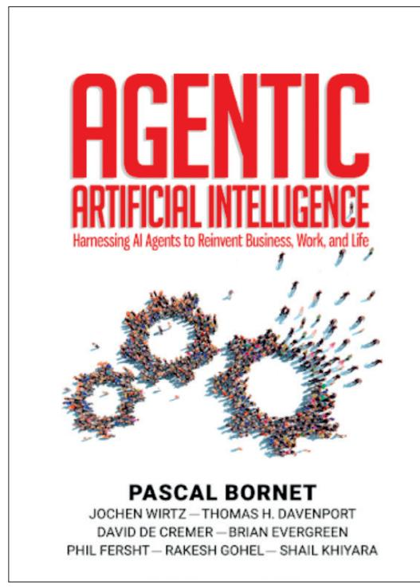

# Book excerpt: The Birth of Agentic AI: A Convergence of Powers

Received (in revised form): 9th October 2025)

# Jochen Wirtz

Vice Dean MBA Programs and Professor of Marketing, National University of Singapore, Singapore

Jochen Wirtz is Vice Dean MBA Programs and Professor of Marketing at the National University of Singapore. He is a leading authority on services marketing and management with over 200 publications. His 20-plus books include *'*Agentic Artificial Intelligence: Harnessing AI Agents to Reinvent Business, Work, and Life' (2025), 'Services Marketing: People, Technology, Strategy (9th edition, 2022), and Essentials of Services Marketing' (4th edition, 2023). With translations and adaptations for over 28 countries and regions and combined sales of over 1.2 million copies, they have become globally leading services marketing textbooks.

NUS Business School, 15 Kent Ridge Drive, Singapore 119245, Singapore E-mail: jochen@nus.edu.sg; LinkedIn: https://www.linkedin.com/in/jochenwirtz/

## Pascal Bornet

Expert, author and keynote speaker on artificial intelligence, USA

Pascal Bornet is an award-winning expert, author and keynote speaker on artificial intelligence (AI) and automation, with over 2 million social media followers. Regularly ranked as one of the top 10 global AI and automation experts, he developed his expertise through over 20 years at McKinsey and Ernst & Young (EY) implementing AI initiatives for hundreds of organisations worldwide. Pascal advocates for making our world more human through technology. He authored best-sellers 'Intelligent Automation'*, '*Agentic AI' and 'Irreplaceable', and his work has been featured in Forbes, Bloomberg and *The Times*. He lectures at universities and advises companies and startups.

E-mail: pascalbornet@gmail.com

Abstract This paper is an excerpt from 'Agentic Artificial Intelligence: Harnessing AI Agents to Reinvent Business, Work, and Life' by Bornet *et al*. (DOI: 10.1142/14380). It examines how agentic artificial intelligence (AI) has emerged from the convergence of two previously independent technological streams: the rapid evolution of large language models (LLMs) and the maturation of automation technologies, from early robotic process automation (RPA) to contemporary intelligent automation. The excerpt traces the historical development of both streams, illustrating how advances in neural networks, transformerbased language models and workflow automation have progressively removed barriers between 'understanding' and 'doing'. It discusses the significance of early LLM-based agent frameworks, such as Modular Reasoning, Knowledge, and Language (MRKL), ReAct and Toolformer, which introduced mechanisms for tool use, reasoningaction loops and external system interaction. The excerpt also provides an overview of the fastgrowing agentic AI market, outlining emerging categories of platforms and agent types. As a whole, the excerpt provides foundational context for understanding how agentic AI systems have become technically feasible and why they represent a new phase in AI capability. This article is also included in The Business & Management Collection which can be accessed at [https://hstalks.com/business/.](https://hstalks.com/business/)

KEYWORDS: AI, artificial intelligence, GenAI, agentic AI, corporate digital responsibility, services marketing, service management

DOI: 10.69554/NBCA6191

## INTRODUCTION

Picture yourself in a meeting room with a group of business leaders. Someone inevitably asks the question we have heard hundreds of times: 'If AI is so smart, why can't it just figure out what needs to be done and do it?'

This question gets to the heart of what is missing in today's AI landscape. To understand why this capability has been so elusive — and how it is finally becoming possible — we need to explore how distinct technological streams have converged to create something entirely new: agentic artificial intelligence (agentic AI).

Agentic AI is not the result of just one innovation. It is a fusion of multiple advancements — from voice assistants to selfdriving technology to AI-driven application programming interfaces (APIs). However, two technological streams stand out as the most critical in making agentic AI a reality:

- The rise of large language models.
- The evolution of workflow automation, now known as intelligent automation.

#### A TALE OF TWO TECHNOLOGIES

The story of agentic AI is not a simple, linear progression. Instead, it is more like watching two rivers flow separately for miles before finally meeting to form something more powerful than either could be alone.

Let us start with a story that illustrates why this convergence matters. In 2022, we were working with a global manufacturing company that was struggling with customer service efficiency. They had already implemented an advanced chatbot powered by a large language model that could understand and respond to customer queries with remarkable accuracy. They had also deployed robotic process automation (RPA) bots that could execute complex sequences of actions in their backend systems. Yet something was missing — the bridge between understanding and doing.

Their customer service representatives still had to act as human bridges, taking the chatbot's recommendations and manually triggering the appropriate automated workflows. It was a glimpse of what was possible if these technologies could work together directly, and it helped us understand why the convergence of these technologies would be so transformative.

## THE FIRST STREAM: THE PATH TO LARGE LANGUAGE MODELS (LLMs)

The journey of AI that led to today's language models began in 1997, and we were there to witness it. The world watched in amazement as IBM's Deep Blue defeated chess champion Garry Kasparov. We remember the headlines: 'Machine Beats Man!' But here is what most people missed — Deep Blue was more like a savant than a genius. It could play chess brilliantly but could not even explain its own moves. Try asking it to play checkers, and you would have better luck teaching a fish to ride a bicycle.

This limitation bothered us and many others in the field. Surely, we thought, there must be a better way to create intelligent systems. The breakthrough came from an unexpected direction — neural networks. Now, when we explain neural networks, we like to use a simple analogy: imagine teaching a child about animals. You do not start by giving them a rulebook about fur, tails and the number of legs. Instead, you

show them examples: 'This is a dog. This is a cat. This is a bird.' The child's brain naturally learns to recognise patterns and make generalisations.

#### The neural network revolution

The beauty of neural networks is that they learn in a similar way. But they needed three ingredients to reach their full potential: vast amounts of data (think millions of examples), significant computing power (imagine thousands of high-end computers working together) and sophisticated architectures (the clever ways we organise these artificial brain cells).

We remember the excitement in the AI community when these elements finally came together in the 2010s. It was like watching the first flight of the Wright brothers — suddenly, something that seemed impossible became reality. Systems could recognise images, understand speech and process language with unprecedented accuracy.

#### The emergence of language models

But the real magic happened in language processing. Let us take you back to the old days of language AI — it was like trying to teach a computer to understand Shakespeare by giving it a dictionary and a grammar book. The results were about as wooden as you would expect.

Then came 2017, and with it, a breakthrough that changed everything: the transformer architecture. Imagine giving an AI not just the ability to look up words but also to understand context, grasp meaning and see how ideas connect. It was like upgrading from a pocket calculator to a mathematician's brain.

The scaling laws we discovered during this period still amaze us. As these models grew larger and were trained on more data, something magical happened — they developed abilities nobody had programmed into them. It was like watching evolution happen in fast-forward. GPT-3, released in 2020, shocked us. Here was a system that could write code, solve math problems and even engage in philosophical discussions tasks it was never explicitly trained to do.

When ChatGPT arrived in 2022, it felt like reaching the summit of a mountain we had been climbing for decades. Finally, we had an AI that could engage in genuine dialogue, reason through problems and explain its thinking in ways that made sense to humans. But there was still one crucial limitation — it could only suggest actions, not take them.

# THE SECOND STREAM: THE EVOLUTION OF AUTOMATION

While all this was happening in the AI world, another revolution was quietly unfolding in the realm of automation. We have had a front-row seat to this evolution, watching it transform from simple screen-scraping tools to sophisticated digital workers.

#### The rise of robotic process automation

In the early 2000s, much of business was still manual or relied on disparate IT systems that did not talk to each other. Forward-thinking teams started using scripts and macros to automate repetitive computer tasks — for example, a macro to copy data from an Excel file into a mainframe application every night.

In the early 2010s, we actively participated in the birth of RPA. Think of it as software tools that mimic the actions of a human on a computer: clicking, typing, copy-pasting and reading screens. It sounds simple, but it was revolutionary. For the first time, we could have computers work alongside humans, using the same tools and interfaces we use.

Essentially, an RPA 'robot' is a piece of software programmed to follow a series of steps — log into a system, retrieve some data, perform a calculation and input results elsewhere — just like a human would, but

faster and without fatigue. RPA became popular because it targeted low-hanging fruit: all those mundane, rules-based tasks that office workers repeatedly do.

Businesses eagerly embraced RPA to reduce errors and free employees from drudgery. We saw banks, insurers and hospitals deploy RPA bots to handle activities like data entry, invoice processing, report generation and database updating. For instance, one insurance client of ours used RPA to automatically transfer policy data from e-mails into their legacy system what used to take a team of people all day now happens reliably in minutes.

However, these early RPA solutions had limitations. They were fragile — if a single screen changed or an exception occurred (such as a missing field), the robot would get confused. RPA robots had no intelligence or judgment; they strictly followed the script. We often had to step in and update the bot or handle edge cases manually. In essence, RPA was process-driven automation, good for structured tasks with clear rules, but not adaptable when things deviate from the norm.

## The evolution to intelligent automation

The next step was even more exciting combining RPA with machine learning — what we named intelligent automation or hyperautomation. To stay competitive, RPA tools started adding AI capabilities so that they could handle more complex, unstructured work. Think of it this way: RPA is great at doing tasks, but it lacks any thinking. So, companies began to augment RPA with AI technologies — machine learning (ML), natural language processing (NLP) and computer vision — to create automation that could interpret information and make simple decisions.

In practical terms, this meant an automated workflow could, for example, read an e-mail from a customer (using NLP), decide what the request is about (using an

AI classifier) and then trigger the appropriate RPA process to handle it. The automation was no longer blind and rigid; it became context-aware to a degree.

As automation grew more capable, we started aiming beyond single tasks toward end-to-end process automation. Instead of just automating steps in isolation, the goal became to automate an entire workflow or business process from start to finish.

For example, for a retail company, we helped automate the order-to-cash process: from receiving an online order, verifying inventory, processing payment and scheduling shipment to updating the finance records. Multiple RPA robots, interfaces and AI models worked in concert, passing tasks along like an assembly line, with humans only monitoring or handling exceptions. When done right, the entire process runs on its own.

By the early 2020s, many businesses had achieved a high degree of automation in routine processes. We observed what we call the automation plateau: most of the straightforward tasks were already automated, and the bottleneck became the decision points and dynamic situations that still needed a human in the loop. Traditional automation could go no further because it lacked the adaptability and higher-level reasoning required beyond well-defined rules.

And now, we arrive at the present moment — the convergence of these two powerful streams. It is like watching two puzzle pieces finally click together. Language models provide the brain — the ability to understand, reason and plan. Automation technologies provide the hands— the ability to execute actions in the real world. When both converge, we get agentic AI — in essence, intelligent digital workers.

This combination is what makes agentic AI possible, and we are thrilled to be part of this revolution. We are watching AI systems evolve from passive tools into active partners that can both understand what needs to be done and actually do it.

# BIRTH OF THE FIRST LLM-BASED AI AGENTS

AI research and development in the last few years have rapidly advanced the capabilities of AI agents. LLMs such as GPT-3 and GPT-4, which initially functioned as sophisticated prediction engines for text, are now being augmented with the ability to plan actions and use tools. This means instead of just completing a sentence, they can decide to perform a web search, execute a calculation, call an API or invoke another piece of software as part of answering a question or accomplishing a task.

One of the first LLM-based AI agent frameworks was Modular Reasoning, Knowledge and Language (MRKL) in 2022.[1](#page-6-0) It focused on modular reasoning, where LLMs interact with predefined tools such as 'search' and 'lookup' to retrieve information and answer queries. The framework separated reasoning from acting, relying on external modules for discrete reasoning tasks.

The field evolved rapidly then with the introduction of ReAct,[2](#page-6-0) which brought the concept further by enabling AI to intermix reasoning steps with actions. The model generated a thought process (a reasoning trace) and could take an action such as querying a database or using an API, then continued reasoning with the new information. This synergy between reasoning and acting helped the AI adjust its plan on the fly and handle more complex tasks. In experiments, ReAct greatly reduced the AI's tendency to hallucinate incorrect facts by letting it check a source (such as a Wikipedia API) before answering. It also made the AI's decision process more transparent and interpretable, since you could follow its stepby-step reasoning[.3](#page-6-0)

Toolformer (2023) was a breakthrough AI model that taught itself to use external tools like calculators, web search and translators. This addressed a key weakness of LLMs, which struggled with arithmetic and real-time facts due to their reliance on static training data. By deciding when

and how to call external tools, Toolformer enhanced accuracy in calculations and question-answering[.4](#page-6-0)

These advances have led to the emergence of highly capable AI agents that can handle multi-step tasks. For example, you might have heard of experimental systems such as AutoGP[T5](#page-6-0) or BabyAGI[,6](#page-6-0) which gained popularity among enthusiasts. These are essentially wrapper agents around LLMs designed to autonomously pursue goals: they take a high-level goal from a user and then generate sub-tasks, execute them (often by issuing tool commands or even writing and running code), check the results and iterate until the goal is achieved. While these are cutting-edge experiments and sometimes brittle (prone to getting confused or stuck), they illustrate the direction of agentic AI.

In parallel, frameworks like LangChain[7](#page-6-0) and Semantic Kernel[8](#page-6-0) emerged to enhance these capabilities, making it easier for LLMs to interact with external APIs, databases and other systems. Suddenly, agents were not just working in isolation — they were connecting with the digital world, performing tasks such as automating workflows, retrieving information or controlling applications.

The invention of function calling within LLMs pushed this even further.[9](#page-6-0) It allowed agents to interact precisely with external systems by running specific functions or scripts as part of their reasoning process. This breakthrough meant agents could not only plan and think but also act in highly targeted and efficient ways.

The research reinforced this evolution. Research on Gorilla[10](#page-6-0) demonstrated how models could learn to use tools effectively, while studies from Microsoft[,11](#page-6-0) Stanfor[d12](#page-6-0) and Tencen[t13](#page-6-0) revealed that collaborative agents — multiple agents working together — achieved even greater success.

By 2023, the rise of platforms available to enterprises such as AutoGen[,14](#page-6-0) Google Cloud Vertex AI[15](#page-6-0) and Crew.ai[16](#page-6-0) took these concepts mainstream, creating environments where LLM-driven agents could thrive. By incorporating automation capabilities, LLMs have transformed from mere text processors into the foundation of systems capable of reshaping how tasks are performed, how decisions are made and how technology interacts with the world.

# THE BOOMING LANDSCAPE: TODAY'S AI AGENT MARKET

Market projections indicate that the market will grow at an incredible 44 per cent per year by 2030[.17](#page-6-0) We are thrilled to see the agentic AI market booming because it confirms what we have long believed — AI agents are not just a passing trend; they're the future of how businesses and individuals will operate.

The fact that Gartner projects that one in three enterprise software applications will integrate agentic AI by 2028 also signals a fundamental shift in how companies approach automation, decision making and productivity.[18](#page-6-0) But what excites us most is Sequoia Capital's projection that AI agents could address a US\$10tn market, combining both global services and software markets.[19](#page-7-0)

The agentic AI market is new, explosive, and highly competitive.[20](#page-7-0) Hundreds of vendors are already offering agent platforms, while both startups and major companies are racing to develop AI agents across industries[.21](#page-7-0)

Because this market is evolving rapidly in many directions, it can be difficult to navigate. To make it easier to understand, we like to break it down into three main categories:

• First are customisable platforms that let professionals and organisations build their own agents. These platforms can be used across business industries and functions. They range from no-code solutions such as Bea[m22](#page-7-0) and Relevance.ai[23](#page-7-0) to lowcode platforms such as UiPat[h24](#page-7-0) and Microsoft's Agent Builder[,25](#page-7-0) Crew.a[i26](#page-7-0)

- and ServiceNow[27](#page-7-0) to full programming frameworks such as Langchai[n28](#page-7-0) and AutoGen.[29](#page-7-0) These tools let businesses create agents tailored to their specific needs and processes.
- Second are the generalist agents, such as OpenAI's Operator[,30](#page-7-0) Anthropic's Computer Us[e31](#page-7-0) and Google's Project Mariner[.32](#page-7-0) These are more versatile, capable of handling a wide range of tasks and adapting to different contexts. Think of them as intelligent digital assistants that seamlessly navigate multiple systems, understand complex goals and execute tasks directly through the screen — no complex integrations required. In our view, the 'ChatGPT moment' of agentic AI will come from the evolution of this category of agents, as they will become widely available to both consumers and companies.
- Third are the specialist agents, such as Google or OpenAI Deep Research (specialised in research), Agentforce (specialised in sales and customer relationships)[33](#page-7-0) or Hippocratic AI (specialised in agents for healthcare).[34](#page-7-0) Some of these agents specialise in specific functions across industries (horizontal agents), while others are tailored to a single industry's unique needs (vertical agents).[35](#page-7-0) Most of these are ready-to-use agents focused on specific tasks whether it is analysing legal documents, optimising marketing campaigns or conducting notarial work. You can find hundreds of these specialised agents on marketplaces such as agent.ai,[36](#page-7-0) each designed to excel at a particular function.

Finally, these technologies are now being integrated into physical AI ranging from autonomous vehicles to humanoids in factories and service robots. Virtually every robot manufacturer is working on this integration and we can expect an explosion of use cases for physically embodied agentic AI.[37](#page-7-0)

#### NOTE

This paper is an excerpt from Bornet, P., Wirtz, J., Davenport, T., Cremer, D., Evergreen, B., Fersht, P., Gohel, R. and Khiyara, S. (2025), 'Agentic Artificial Intelligence: Harnessing AI Agents to Reinvent Business, Work, and Life', World Scientific Publishing, Singapore, DOI: 10.1142/14380 (see Figure 1).

Figure 1: The cover of 'Agentic Artificial Intelligence: Harnessing AI Agents to Reinvent Business, Work, and Life'

# References

- [1.](#page-4-0) Karpas, E., Abend, O., Belinkov, Y., Lenz, B., Lieber, O., Ratner, N., Shoham, Y., Bata, H., Levine, Y., Leyton-Brown, K., Muhlgay, D., Rozen, N., Schwartz, E., Shachaf, G., Shalev-Scwatz, S., Sashua, A. and Teneholz, M. (2022), 'MRKL Systems: A modular, neuro-symbolic architecture that combines large language models, external knowledge sources and discrete reasoning', arXiv, available at [https://arxiv.](https://arxiv.org/abs/2205.00445) [org/abs/2205.00445](https://arxiv.org/abs/2205.00445) (accessed 9th October, 2025).
- [2.](#page-4-0) Yao, S., Zhao, J., Yu, D., Du, N., Shafran, I., Narasimhan, K. and Cao, Y. (2022), 'ReAct: Synergizing Reasoning and Acting in Language Models', arXiv, available at [https://arxiv.org/](https://arxiv.org/abs/2210.03629v3) [abs/2210.03629v3](https://arxiv.org/abs/2210.03629v3) (accessed 9th October, 2025).
- [3.](#page-4-0) *Ibid*.

- [4](#page-4-0). Schick, T., Dwivedi-Yu, J., Dessi, R., Raileanu, R., Lomeli, M., Zettlemoyer, L., Cancedda, N. and Scialom, T. (2023), 'Toolformer: Language Models Can Teach Themselves to Use Tools', arXiv, available at <https://arxiv.org/abs/2302.04761>(accessed 9th October, 2025).
- [5](#page-4-0). Wikipedia contributors (2025), 'AutoGPT', available at <https://en.wikipedia.org/wiki/AutoGPT> (accessed 9th October, 2025).
- [6](#page-4-0). Nakajima, Y. (2024), 'Impact of BabyAGI', Yohei Nakajima, available at [https://yoheinakajima.com/](https://yoheinakajima.com/impact-of-babyagi/) [impact-of-babyagi/](https://yoheinakajima.com/impact-of-babyagi/) (accessed 9th October, 2025).
- [7](#page-4-0). LangChain (2025), 'Introduction', available at <https://python.langchain.com/docs/introduction/> (accessed 9th October, 2025).
- [8](#page-4-0). Microsoft (2024), 'semantic-kernel', GitHub, available at [https://github.com/microsoft/semantic](https://github.com/microsoft/semantic-kernel)[kernel](https://github.com/microsoft/semantic-kernel) (accessed 9th October, 2025).
- [9](#page-4-0). OpenAI (2024), 'Function calling', OpenAI Platform Documentation, available at [https://platform.openai.](https://platform.openai.com/docs/guides/function-calling) [com/docs/guides/function-calling](https://platform.openai.com/docs/guides/function-calling) (accessed 9th October, 2025).
- [10.](#page-4-0) Patil, S. G., Zhang, T., Wang, X. and Gonzalez, J. E. (2023), 'Gorilla: Large Language Model Connected with Massive APIs', arXiv, available at [https://arxiv.](https://arxiv.org/abs/2305.15334) [org/abs/2305.15334](https://arxiv.org/abs/2305.15334) (accessed 9th October, 2025).
- [11.](#page-4-0) Microsoft (2024), 'AutoGen', Microsoft Research, available at [https://www.microsoft.com/en-us/](https://www.microsoft.com/en-us/research/project/autogen/) [research/project/autogen/](https://www.microsoft.com/en-us/research/project/autogen/) (accessed 9th October, 2025).
- [12.](#page-4-0) Park, J. S., O'Brien, J. C., Cai, C. J., Ringel Morris, M., Liang, P. and Bernstein, M. S. (2023), 'Generative Agents: Interactive Simulacra of Human Behavior', arXiv, available at [https://arxiv.org/](https://arxiv.org/abs/2304.03442) [abs/2304.03442](https://arxiv.org/abs/2304.03442) (accessed 9th October, 2025).
- [13.](#page-4-0) Li, J., Zhang, Q., Yu, Z., Fu, Q. and Ye, D. ( 2024), 'More Agents Is All You Need', arXiv, available at <https://arxiv.org/abs/2402.05120>(accessed 9th October, 2025).
- [14.](#page-4-0) Microsoft (2024), 'AutoGen', GitHub, available at <https://microsoft.github.io/autogen/stable/> (accessed 9th October, 2025).
- [15.](#page-4-0) The Batch (2024), 'All About Google's Vertex AI Agent Builder', deeplearning.ai, available at [https://www.deeplearning.ai/the-batch/all-about](https://www.deeplearning.ai/the-batch/all-about-googlesvertex-ai-agent-builder/)[googlesvertex-ai-agent-builder/](https://www.deeplearning.ai/the-batch/all-about-googlesvertex-ai-agent-builder/) (accessed 9th October, 2025).
- [16.](#page-4-0) CrewAI (2024), 'CrewAI Launches Multi-Agentic Platform to Deliver on the Promise of Generative AI for Enterprise', GlobeNewswire, available at [https://www.globenewswire.com/](https://www.globenewswire.com/news-release/2024/10/22/2966872/0/en/CrewAI-Launches-Multi-Agentic-Platform-to-Deliver-on-the-Promise-ofGenerative-AI-for-Enterprise.html) [news-release/2024/10/22/2966872/0/en/CrewAI-](https://www.globenewswire.com/news-release/2024/10/22/2966872/0/en/CrewAI-Launches-Multi-Agentic-Platform-to-Deliver-on-the-Promise-ofGenerative-AI-for-Enterprise.html)[Launches-Multi-Agentic-Platform-to-Deliver-on](https://www.globenewswire.com/news-release/2024/10/22/2966872/0/en/CrewAI-Launches-Multi-Agentic-Platform-to-Deliver-on-the-Promise-ofGenerative-AI-for-Enterprise.html)[the-Promise-ofGenerative-AI-for-Enterprise.html](https://www.globenewswire.com/news-release/2024/10/22/2966872/0/en/CrewAI-Launches-Multi-Agentic-Platform-to-Deliver-on-the-Promise-ofGenerative-AI-for-Enterprise.html) (accessed 9th October, 2025).
- [17.](#page-5-0) Statista (2025), 'Market value of agentic artificial intelligence (AI) worldwide 2024 with a forecast for 2030 (in billion U.S. dollars)', available at [https://](https://www.statista.com/statistics/1552183/global-agentic-ai-market-value/) [www.statista.com/statistics/1552183/global-agentic](https://www.statista.com/statistics/1552183/global-agentic-ai-market-value/)[ai-market-value/](https://www.statista.com/statistics/1552183/global-agentic-ai-market-value/) (accessed 9th October, 2025).
- [18.](#page-5-0) Coshow, T. (2024), 'Intelligent Agent in AI', Gartner, available at [https://www.gartner.com/en/](https://www.gartner.com/en/articles/intelligent-agent-in-ai)

#### *Wirtz and Bornet*

- [articles/intelligent-agent-in-ai](https://www.gartner.com/en/articles/intelligent-agent-in-ai) (accessed 9th October, 2025).
- [19](#page-5-0). Huang, S. and Grady, P. (2024), 'Generative AI's Act o1: The Reasoning Era Begins', Sequoia Capital, available at [https://sequoiacap.com/article/](https://sequoiacap.com/article/generative-ais-act-o1/) [generative-ais-act-o1/](https://sequoiacap.com/article/generative-ais-act-o1/) (accessed 9th October, 2025).
- [20.](#page-5-0) Wilkinson, L. (2025), 'Enterprises eye agentic AI despite readiness gaps and security concerns', CIO Dive, available at [https://www.ciodive.com/news/](https://www.ciodive.com/news/enterprise-AI-agent-agentic-autonomous-strategy-challenges/738172/) [enterprise-AI-agent-agentic-autonomous-strategy](https://www.ciodive.com/news/enterprise-AI-agent-agentic-autonomous-strategy-challenges/738172/)[challenges/738172/](https://www.ciodive.com/news/enterprise-AI-agent-agentic-autonomous-strategy-challenges/738172/) (accessed 9th October, 2025).
- [21.](#page-5-0) Deslandes, N. (2024), '2025 Informed: The Year of Agentic AI', TechInformed, available at [https://](https://techinformed.com/2025-informed-the-year-ofagentic-ai/) [techinformed.com/2025-informed-the-year](https://techinformed.com/2025-informed-the-year-ofagentic-ai/)[ofagentic-ai/](https://techinformed.com/2025-informed-the-year-ofagentic-ai/) (accessed 9th October, 2025).
- [22.](#page-5-0) Beam AI (2025), 'Self-Learning AI Agents for Enterprise Operations', available at<https://beam.ai/> (accessed 9th October, 2025).
- [23.](#page-5-0) Relevance AI (2025), 'Build teams of AI agents that deliver human-quality work', available at [https://](https://relevanceai.com/) [relevanceai.com/](https://relevanceai.com/) (accessed 9th October, 2025).
- [24.](#page-5-0) UiPath (2025), 'Build a path to agentic automation with UiPath Agent Builder', available at [https://](https://www.uipath.com/product/agent-builder) [www.uipath.com/product/agent-builder](https://www.uipath.com/product/agent-builder) (accessed 9th October, 2025).
- [25.](#page-5-0) Microsoft (2025), 'Overview of Copilot Studio agent builder', available at [https://learn.microsoft.com/](https://learn.microsoft.com/en-us/microsoft-365-copilot/extensibility/copilot-studio-agent-builder) [en-us/microsoft-365-copilot/extensibility/copilot](https://learn.microsoft.com/en-us/microsoft-365-copilot/extensibility/copilot-studio-agent-builder)[studio-agent-builder](https://learn.microsoft.com/en-us/microsoft-365-copilot/extensibility/copilot-studio-agent-builder) (accessed 9th October, 2025).
- [26.](#page-5-0) CrewAI (2025), available at <https://www.crew.ai> (accessed 9th October, 2025).

- [27.](#page-5-0) ServiceNow (2025), 'Virtual Agent', available at [https://www.servicenow.com/products/virtual](https://www.servicenow.com/products/virtual-agent.html)[agent.html](https://www.servicenow.com/products/virtual-agent.html) (accessed 9th October, 2025).
- [28.](#page-5-0) Langchain (2025), available at [https://www.](https://www.langchain.com/) [langchain.com/](https://www.langchain.com/) (accessed 9th October, 2025).
- [29.](#page-5-0) AutogenAI (2025), available at<https://autogenai.com> (accessed 9th October, 2025).
- [30.](#page-5-0) OpenAI (2025), 'Introducing Operator', available at <https://openai.com/index/introducing-operator/> (accessed 9th October, 2025).
- [31.](#page-5-0) Anthropic (2025), 'Computer Use', available at [https://docs.anthropic.com/en/docs/build-with](https://docs.anthropic.com/en/docs/build-with-claude/computer-use)[claude/computer-use](https://docs.anthropic.com/en/docs/build-with-claude/computer-use) (accessed 9th October, 2025).
- [32.](#page-5-0) Google DeepMind (2024), 'Project Mariner', available at [https://deepmind.google/technologies/](https://deepmind.google/technologies/project-mariner/) [project-mariner/](https://deepmind.google/technologies/project-mariner/) (accessed 9th October, 2025).
- [33.](#page-5-0) Salesforce (2025), 'Agentforce', available at [https://](https://www.salesforce.com/agentforce/) [www.salesforce.com/agentforce/](https://www.salesforce.com/agentforce/) (accessed 9th October, 2025).
- [34.](#page-5-0) Hippocratic AI (2025), available at [https://www.](https://www.hippocraticai.com/) [hippocraticai.com/](https://www.hippocraticai.com/) (accessed 9th October, 2025).
- [35.](#page-5-0) Dignan, L. (2024), 'Agentic AI: Three Themes to Watch in 2025', Constellation Research, available at [https://www.constellationr.com/blog-news/insights/](https://www.constellationr.com/blog-news/insights/agentic-ai-three-themes-watch-2025) [agentic-ai-three-themes-watch-2025](https://www.constellationr.com/blog-news/insights/agentic-ai-three-themes-watch-2025) (accessed 9th October, 2025).
- [36.](#page-5-0) Agent.ai (2025), available at <https://agent.ai/> (accessed 9th October, 2025).
- [37.](#page-5-0) Wirtz, J. and Stock-Homburg, R. (2025), 'Generative AI Meets Service Robots', *Journal of Service Research*, Vol. 28, No. 4, pp. 527–543.