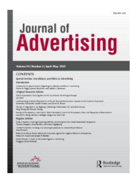
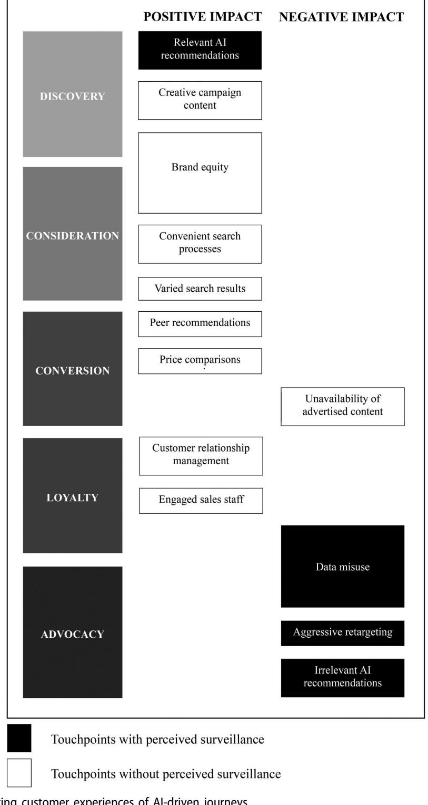

# **Journal of Advertising**

**ISSN: 0091-3367 (Print) 1557-7805 (Online) Journal homepage: [www.tandfonline.com/journals/ujoa20](https://www.tandfonline.com/journals/ujoa20?src=pdf)**

# **Understanding Customer Responses to AI-Driven Personalized Journeys: Impacts on the Customer Experience**

**Kimberley Hardcastle, Lizette Vorster & David M. Brown**

**To cite this article:** Kimberley Hardcastle, Lizette Vorster & David M. Brown (2025) Understanding Customer Responses to AI-Driven Personalized Journeys: Impacts on the Customer Experience, Journal of Advertising, 54:2, 176-195, DOI: [10.1080/00913367.2025.2460985](https://www.tandfonline.com/action/showCitFormats?doi=10.1080/00913367.2025.2460985)

**To link to this article:** <https://doi.org/10.1080/00913367.2025.2460985>

| © 2025 The Author(s). Published with license by Taylor & Francis Group, LLC. |  |  |
|---------------------------------------------------------------------------------|--|--|
| Published online: 20 Mar 2025.                                                  |  |  |
| Submit your article to this journal                                             |  |  |
| Article views: 48064                                                            |  |  |
| View related articles                                                           |  |  |
| View Crossmark data                                                             |  |  |
| Citing articles: 57 View citing articles                                        |  |  |

## **Understanding Customer Responses to AI-Driven Personalized Journeys: Impacts on the Customer Experience**

Kimberley Hardcastlea , Lizette Vorsterb , and David M. Brownc

a Northumbria University, Newcastle-upon-Tyne, United Kingdom; b Aarhus University, Aarhus, Denmark; c Heriot-Watt University, Edinburgh, United Kingdom

#### **ABSTRACT**

Within advertising, the *customer journey* concept helps explain how customer perceptions and behaviors evolve through seller–customer interactions. The concept has developed to reflect omni-channel marketing but neglects the emergence of algorithmically personalized advertisements. This study therefore explores impacts upon customer experiences of artificial intelligence (AI)-driven recommendations and personalized advertisements by analyzing customer perceptions of tensions between the personalization and customer empowerment inherent within AI-driven advertising. By combining semi-structured phenomenological interviews with Customer Journey Mapping, we capture experiences and behaviors across multiple touchpoints. Our findings show how technological limitations of AI mediate brand– customer relationships and influence customer behaviors. The study contributes theoretically by critically contextualizing AI-driven advertising within broader ethical debates, emphasizing practitioners' responsibilities to combine technological advancements with consumer autonomy.

The digital customer journey is shaped by artificial intelligence (AI) data-driven technologies that personalize consumer–brand interactions across curated touchpoints (Brown and Thompson [2023](#page-17-0); Dong et al. [2024;](#page-18-0) Kietzmann, Paschen, and Treen [2018](#page-18-0)). Computational advertising strategies such as recommendation engines and personalization techniques underpin this approach (Bjørlo, Moen, and Pasquine [2021](#page-17-0); Gao, Liu, and Wu [2010\)](#page-18-0), leveraging customer data (Gao and Liu [2023](#page-18-0)) but with inconsistently satisfying outcomes, often driving customer ambivalence (Gil de Zu�n~iga, Goyanes, and Durotoye [2024](#page-18-0); Lee [2018\)](#page-19-0). Effective personalized experiences can strengthen consumer–brand relationships, satisfaction, and loyalty (Shin et al. [2020](#page-19-0)). Based on prior behaviors and predicted preferences, algorithms aim to streamline customer journeys, improving decision-making efficiency (Jannach and Jugovac [2019\)](#page-18-0). However, personalization can undermine consumer autonomy, shielding consumers from alternative products or brands (Husairi and Rossi [2024](#page-18-0); Wertenbroch et al. [2020\)](#page-20-0) through repetitive recommendations misaligned to customers' evolving needs (Gil de Zu�n~iga, Goyanes, and Durotoye [2024](#page-18-0); Lee [2018;](#page-19-0) Obiegbu and Larsen [2024](#page-19-0)). This tension raises ethical concerns about trading customer autonomy for convenience (Nersessian and Mancha [2021;](#page-19-0) Boerman, Kruikemeier and Zuiderveen Borgesius [2017](#page-17-0)).

Touchpoints enabled by AI bring real-time personalization (Batat [2019\)](#page-17-0), predictive recommendations, and automated customer support (Kumar et al. [2019](#page-18-0)). Customers experience differing levels of awareness, engagement, and loyalty (Barbosa, Saura, and Bennett [2024\)](#page-17-0), and the value generated by customer-firm engagement contributes to "customer journey value" (Hollebeek et al. [2023\)](#page-18-0). Customers' sense of "journeying" may be reinforced by AI-automated advertising, chatbots and robots, virtual assistants, internet of things, and augmented/virtual/mixed reality (Rana et al. [2022](#page-19-0)).

**CONTACT** Lizette Vorster lizette.vorster@cc.au.dk Department of English, School of Communication and Culture, Aarhus University, Room 456, 1481, Jens Chr. Skous Vej 4, DK-8000 Aarhus C, Denmark.

Kimberley Hardcastle (PhD, Northumbria University) is an Assistant Professor in Marketing, Newcastle Business School, Northumbria University. Lizette Vorster (PhD, Coventry University) is an Assistant Professor in Strategic Business Communications, Department of English, School of Communication and Culture, Aarhus University.

David M. Brown (PhD, Northumbria University) is an Associate Professor in Marketing, Heriot-Watt University.

� 2025 The Author(s). Published with license by Taylor & Francis Group, LLC.

This is an Open Access article distributed under the terms of the Creative Commons Attribution License ([http://creativecommons.org/licenses/by/4.0/\)](http://creativecommons.org/licenses/by/4.0/), which permits unrestricted use, distribution, and reproduction in any medium, provided the original work is properly cited. The terms on which this article has been published allow the posting of the Accepted Manuscript in a repository by the author(s) or with their consent.

However, algorithmic personalization may impede consumer exploration and spontaneity.

Prior studies of technical advancements and applications of AI in personalized advertising (e.g., Dong et al. [2024;](#page-18-0) Yalcin et al. [2022\)](#page-20-0) demonstrate how recommendation systems and algorithms leverage machine learning to provide personalized recommendations from past behavior and preferences (e.g., Batmaz et al. [2019\)](#page-17-0). They have also explored computational advertising strategies, such as personalization and recommendation algorithms, across diverse contexts, including retail (De Keyser et al. [2021](#page-17-0)), hospitality/servicescapes (Wang et al. [2025](#page-20-0)), social media (Walrave et al. [2018\)](#page-20-0), streaming services, and e-commerce (Benlian, Titah, and Hess [2012](#page-17-0)). In exploring how AI-driven touchpoints shape consumer decisionmaking pathways, however, studies have focused on context-specific benefits rather than the impacts upon customer journey experiences.

This study explores how AI-enabled technologies shape customer journeys, sequential touchpoints, and customer– brand interactions, highlighting the importance of brands balancing personalization with consumer choice and autonomy in their digital touchpoint strategies to avoid customer frustration and improve satisfaction, empowerment, and retention. This gap necessitates deeper examination of digital customer journeys, and specifically of recommendation algorithms and personalized advertising. Moreover, understanding consumer–brand interaction dynamics is critical because customers increasingly disengage due to message noise and distortion (Hardcastle, Edirisingha, and Cook [2024\)](#page-18-0). By mapping consumers' responses throughout their technological interactions, this study explores how data-driven personalized advertising impacts consumer behavior.

To address this gap, we ask the following research questions:

- 1. How do AI-driven recommendation algorithms within customer journeys influence customers' brand engagement?
- 2. How do AI-driven recommendation algorithms impact the tension between personalized content and consumer control at various touchpoints?

This study offers several contributions: First, it analyzes consumer perceptions of and responses to recommendation algorithms and their impacts upon customer journey experiences; second, it critiques the role of perceived surveillance within customer journey experiences by mapping consumer perceptions of and responses to dataveillance ([Figure 1](#page-3-0)); third, by focusing on customer experiences of data-driven technologies within the customer journey, it complements extant understanding of technological advancements and consumer autonomy. This study also contributes theoretically by exploring consumer responses to personalized advertising, suggesting more ethical approaches for practitioners to navigate digital age complexities.

#### **Theoretical Background**

#### *The Customer Journey*

Lemon and Verhoef [\(2016](#page-19-0)) foundational framework described the *customer journey* as a dynamic process comprising pre-purchase, purchase, and post-purchase stages. Further developments emphasized the growing complexity of online and offline touchpoints in shaping customer experiences, and the cognitive, emotional, and behavioral dimensions shaping brand satisfaction and loyalty (Hardcastle et al. [2025](#page-18-0)). This integrated perspective reconceptualizes the customer decisionmaking process—previously considered a linear progression—as foundational within individuals' navigation of complex, multidimensional journeys (Lynch and Barnes [2020\)](#page-19-0) and digitally connected brand engagement (Swaminathan et al. [2020\)](#page-20-0). Technology has enabled instantaneous information access, reshaping customer–brand interaction, and customer journey navigation (Araujo et al. [2020](#page-17-0)). Moreover, the customer journey provides a robust framework for studying customer experiences and enables tailored marketing strategies (Wolny and Charoensuksai [2014\)](#page-20-0). Customer experience is multidimensional, encompassing cognitive, emotional, social, and physical responses to companies (Følstad and Kvale [2018\)](#page-18-0). Recommendation algorithms and personalized advertising have reshaped customer journeys; thus, their impact upon brand engagement requires clarification (Araujo et al. [2020](#page-17-0)). This technological evolution drives a shift from linear to nonlinear pathways, balancing customer autonomy and algorithmic control, personalization and privacy (Dwivedi et al. [2021\)](#page-18-0).

#### *Customer Journey Linearity vs. Nonlinearity*

Integrated AI data-driven technologies have made customer journeys nonlinear, multifaceted, and dynamic (Micheaux and Bosio [2019](#page-19-0)), characterized by iterative loops, detours, and simultaneous interactions across various digital and physical channels (Purmonen, Jaakkola, and Terho [2023](#page-19-0)). Customers sinuously navigate touchpoints, often revisiting earlier stages through influences such as algorithmic recommendations, peer-generated

**Figure 1.** Factors impacting customer experiences of AI-driven journeys.

content, and context-specific needs (Jabbar, Akhtar, and Dani [2020](#page-18-0)). Technologies driven by AI, while capable of tracking and influencing customer behavior, introduce challenges in accurately representing these nonlinear pathways (Roy et al. [2025](#page-19-0)). For example, real-time data analytics and cross-channel integration offer unprecedented insights into customer actions, but simplify behaviors into predictive patterns, overlooking contextual and emotional factors (Obiegbu and Larsen [2024\)](#page-19-0). These dynamic, nonlinear customer journeys driven by AI raise questions concerning the balance between customer autonomy and the algorithmic systems which increasingly mediate these interactions.

### *Role of Customer Autonomy vs. Algorithmic Mediation*

The traditional perspective of customer decision-making emphasizes autonomy, portraying customers as rational, independent actors making informed choices from preferences and available information (Simonson [2005\)](#page-20-0). However, AI-driven personalization has shifted this paradigm, with algorithms such as recommendation engines narrowing customer options and influencing preferences (Lemon and Verhoef [2016\)](#page-19-0). This shift introduces a critical debate: To what extent do customers retain autonomy in an environment of AI-mediated choices? Algorithmic mediation can enhance satisfaction by streamlining decision-making through targeted content but may erode autonomy as customers may unknowingly rely on systems that predetermine their options (Laitinen and Sahlgren [2021](#page-18-0); Nersessian and Mancha [2021\)](#page-19-0). One must also question what constitutes a fair balance between facilitating personalized experiences and maintaining customer freedom (Shams, Brown, and Hardcastle [2025](#page-19-0)), whereby customer benefits outweigh risks to autonomy and data privacy.

#### *Personalization vs. Privacy*

Customer journey personalization now defines datadriven strategies, leveraging individual-level information to create tailored experiences. Using customer data, brands can create seamless interactions across touchpoints, from relevant product recommendations to context-aware advertisements (Larke, Kilgour, and O'Connor [2018\)](#page-19-0). This personalization streamlines customer decision-making, instilling recognition and loyalty (Weippert [2024;](#page-20-0) Weidig, Weippert, and Kuehnl [2024\)](#page-20-0), but challenges customer privacy. Within customer journeys, data collection, analysis and utilization may feel intrusive or opaque (Ostrom et al. [2021\)](#page-19-0), generating frustration or mistrust, particularly where personalization is ethically dubious or violates data security expectations. Additionally, hyperpersonalized journeys risk alienating customers by being too predictive and manipulative or constituting *perceived surveillance*, defined as "the feeling of being watched, listened to or having personal data recorded" (Strycharz and Segijn [2022](#page-20-0), 576).

The tension between personalization and privacy thus reshapes customer journeys twofold. First, while personalized experiences can enhance satisfaction and loyalty, they risk undermining trust if customers perceive opacity or manipulation (Kang and Namkung [2019\)](#page-18-0). Second, touchpoints that trigger data privacy concerns may prompt customers to withdraw or disengage. Therefore, balancing personalization with privacy is essential for creating effective, respectful customer journeys (Kawaf, Montgomery, and Thuemmler [2024](#page-18-0)). Finally, when the algorithms that generate recommendations deliver irrelevant or inaccurate content, customers perceive their data privacy being spent unnecessarily for meaningless outcomes (Shin [2020](#page-19-0)). This disconnect between privacy, relevance, and algorithmic performance necessitates high functionality within algorithmic recommendation systems.

### *Personalized Advertising and Algorithmic Recommendation Systems*

Through data-driven algorithms, marketers personalize advertising, penetrate background "noise" and target customers accurately, reducing advertising spend (Yun et al. [2020](#page-20-0)). They can deliver relevant content, offers, and recommendations that enhance engagement and streamline decision-making. Programmatic and personalized advertising use AI to target consumers with content that is relevant to individuals' needs and interests (Deng et al. [2019\)](#page-17-0). When consumers perceive digital advertising as personalized, particularly within social networking sites, they usually perceive it as more relevant and unintrusive (Sussman, Bright, and Wilcox [2023](#page-20-0)). Furthermore, their self-brand connection, intention to click, and positive word-of-mouth usually increase (De Keyzer, Dens, and De Pelsmacker [2022](#page-17-0)). However, this fundamentally restructures the customer journey by integrating dynamic, real-time touchpoints shaped by self-referential communication, anthropomorphic design and adaptive system characteristics. For example, personalization can manifest through individual-level recommendations, social-level cues such as peer comparisons, or situation-based adaptations that respond to specific contexts or needs (Cavdar Aksoy et al. [2021\)](#page-17-0).

We know that personalized advertising shapes how consumers encounter products and services online, leveraging sophisticated recommendation algorithms and AI-powered engines (Yalcin et al. [2022](#page-20-0)). These systems harness machine learning techniques that analyze vast amounts of data, enabling personalized endorsements based on consumers' past behavior and preferences (Deng et al. [2019\)](#page-17-0). These algorithms continuously refine their predictions to the consumer's tastes (Marchand and Marx [2020\)](#page-19-0). However, this advanced personalization creates a feedback loop whereby user choices, influenced by algorithmic suggestions, are fed back into the system as new data, perpetuating, and reinforcing specific behavioral patterns (Sadagopan and Fellow [2019\)](#page-19-0). This approach raises concerns about the

extent to which consumer autonomy and choice is genuinely preserved.

The reliance on feedback loops in recommendation systems can restrict exposure to narrower options, limiting consumer experience and creating "echo chambers" (Liu and Cong [2023;](#page-19-0) Sadagopan and Fellow [2019\)](#page-19-0). Therefore, these approaches, while powerful, highlight critical implications for customer experiences. As customers navigate increasingly tailored journeys, communication methods and modes influence their satisfaction and perceptions of control and trust. As these technologies evolve and intersect, brands can innovate and differentiate themselves further, influencing decision-making throughout the customer journey (Reddy [2022\)](#page-19-0).

#### *Impact of Evolving AI Data-Driven Strategies on Customer Journeys*

Brands use AI to achieve and maintain competitive advantage (Love, Matthews, and Zhou [2020\)](#page-19-0). Srinivasan and Sarial-Abi ([2021](#page-20-0)) explain the risks to brand reputation of using technological tools such as AI, noting their fail rate. Integrating data-driven strategies, particularly AI and machine learning, profoundly impacts the customer journey structure and experience (Reddy [2022](#page-19-0)), moreover data-driven strategies significantly enhance the connectivity and relevance of customer journey touchpoints (Lundin and Kindstro€m [2024](#page-19-0)). Systems using AI, powered by high-volume real-time data, enable brands to deliver precise recommendations, targeted advertisements, and tailored content across channels. For example, AI-powered recommendation systems might analyze consumers' browsing histories, suggesting relevant products at the pre-purchase stage, dynamic pricing or loyalty rewards at the purchase stage, then personalized post-purchase follow-ups such as upselling or proactive customer support.

#### *Touchpoint Transformation*

*Touchpoints* are "points of human, product, service, communication, spatial, and electronic interaction collectively constituting the interface between an enterprise and its customers over the course of customers' buying cycles" (Dhebar [2013](#page-18-0), p. 200). Evolving technological capabilities often merge touchpoints, creating a seamless journey with indistinct transitions between stages (De Keyser et al. [2020;](#page-17-0) Purmonen, Jaakkola, and Terho [2023\)](#page-19-0). For example, retargeting strategies can reengage customers who abandoned a cart, reorienting them to the purchase stage. Similarly, algorithms can predict dormant needs from past behavior, activating touchpoints before the customer is aware. This interconnectedness enhances convenience and satisfaction, anticipating and fulfilling customer needs while reducing effort.

Touchpoint proliferation can challenge cross-channel consistency and coherence. Customers frequently move between online and offline environments, using multiple platforms and devices (Verhoef et al. [2017](#page-20-0)). Data-driven strategies must therefore ensure that personalization is synchronized to avoid fragmented experiences, such as contradictory website and application recommendations. Inconsistencies disrupt journey fluidity, frustrating customers and reducing trust in the brand's ability to deliver a cohesive experience.

#### *Frustration Points*

When algorithms fail to meet consumer expectations, delivering irrelevant or overly intrusive recommendations, customers may perceive that their privacy has been compromised without adequate benefit (Gutierrez et al. [2019\)](#page-18-0). Moreover, these frustration points often stem from the inherent limitations of algorithmic systems, not the brand itself. Whereas data-driven strategies excel at identifying patterns, they sometimes struggle to account for the contextual or emotional dimensions of consumer decision-making (Akter et al. [2019\)](#page-17-0). For example, algorithms may misinterpret situational factors, such as retargeting customers with advertisements for already bought single-purchase products, thereby diminishing relevance and frustrating the customer. The opacity of recommendation creation exacerbates these issues because customers may distrust systems that offer no rationale for recommendations.

When these tools fail, customers blame brands rather than the tools for negative consumption experiences (Srinivasan and Sarial-Abi [2021](#page-20-0)). Overreliance on AI to automatically create content and provide recommendations may result in underrepresenting already marginalized consumer groups (Yun et al. [2020](#page-20-0)). Pellandini-Sim�anyi ([2024](#page-19-0)) found that underdeveloped algorithms can discriminate against customers with certain profiles, risking bias and potentially discriminatory outcomes (Kordzadeh and Ghasemaghaei [2022](#page-18-0)).

Whereas recommendation algorithms aim to empower customers, they risk undermining *customer autonomy*—the customer's ability to decide without undue external influence (Coffin [2022](#page-17-0))—through algorithmic opacity and mechanisms such as feedback loops (Savolainen and Ruckenstein [2024](#page-19-0)). Some recent studies have extended customer autonomy, distinguishing between *actual autonomy* and *perceived autonomy*, the latter being the customer's subjective sense of their ability to make decisions (Hyman, Kostyk, and Trafimow [2023;](#page-18-0) Wertenbroch et al. [2020](#page-20-0)). Algorithm usage further demonstrates this point because they can narrow customer choices, reinforcing existing preferences (Burton, Stein, and Jensen [2020\)](#page-17-0). Customers may consequently occupy a filter bubble, wherein their exposure to innovative ideas and diverse perspectives is limited to options based on past behaviors, leading to consumer frustration and a sense of diminished control (Hyman, Kostyk, and Trafimow [2023](#page-18-0)).

To date, AI data-driven strategies have redefined customer journeys, creating unprecedented personalization and engagement opportunities while introducing new sources of friction. As touchpoints multiply and interconnect, the potential for seamless, contextually relevant experiences grows. However, algorithm limitations, privacy, and cross-channel consistency highlight the need for more comprehensive journey design. By addressing these evolving dynamics, both researchers and practitioners can better understand and shape the future of customer journeys in the age of AI and big data.

#### **Methodology**

To explore customer responses to AI-driven personalized journeys, we undertook semi-structured phenomenological interviews, eliciting comprehensive accounts and descriptions and avoiding presuppositions (Hammersley and Gomm [1997](#page-18-0)). This approach helped consistency with the accepted evaluation criteria of qualitative research (Guba, Lincoln, and Denzin [1994](#page-18-0)): *Credibility* (truthfulness of findings), *transferability*  (intercontextual applicability of findings), *dependability*  (repeatability of findings), and *confirmability* (traceability of findings to respondent comments). The project (submission reference number: 45220) received ethical approval from the Northumbria University ethics board (IRB equivalent).

#### *Accessing Customer Journeys*

Accessing participants' digital trace data is challenging (Strycharz and Segijn [2022\)](#page-20-0), so we captured consumption experiences from their recollections of their consumption journeys and online activities. Our multi-method qualitative study adopts Customer Journey Mapping (CJM) to map digital activity from their perspective. A growing number of studies adopt CJM to compare different consumption experiences and means of engagement across varied participant samples (Bradley et al. [2021](#page-17-0); Schulz, Shehu, and Clement [2019](#page-19-0); Silva et al. [2021](#page-19-0)). Schulz, Shehu, and Clement [\(2019\)](#page-19-0) and Silva et al. ([2021\)](#page-19-0) created journey templates with a range of touchpoints from which participants mapped their consumption experiences and decisions. We adopted this approach. Participants completed a CJM template before interview, mapping a recent purchase, and detailing all touchpoints experienced on route to brand discovery and purchase. Integrating customer journey maps with interview data enhances analytical depth and facilitates triangulation and validation of the research findings (Lemon and Verhoef [2016](#page-19-0)). The interview guide can be found in the web appendix.

#### *Sample and Interview Strategy*

We adopted seed and snowball sampling, drawing from adult customers with at least two active social media accounts who had recently (within the past 60 days) purchased from a brand online. We captured a diversity of ages, genders, ethnicities, and customer experiences, across both WEIRD (Western, Educated, Industrialized, Rich and Democratic – Henrich, Steven, and Ara [2010\)](#page-18-0) and non-WEIRD marketplaces (see [Table 1](#page-7-0) for participant detail.) Each participant interview lasted 30–60 minutes.

#### *Interview Structure and Conduct*

Interview questions explored themes including the use of technology for purchases, awareness around AI and algorithm capabilities, awareness and recall of brands and their distinctive assets, and customer decisionmaking. To stimulate discussion during interviews, CJMs were used. Referring to touchpoints improved participant recall of customer journey experiences (Bradley et al. [2021\)](#page-17-0).

#### *Analysis*

Interviews were audio-recorded and transcribed with participants' permission. We used thematic analysis (Braun and Clarke [2006\)](#page-17-0), familiarizing ourselves with the data through multiple readings, generating initial codes (see Web Appendix), then developing and refining themes. [Table 2](#page-7-0) details the thematic analysis process. The 20 CJMs were subjected to individual and comparative analysis as a singular dataset and in comparison to the interview dataset. This multi-method approach helped participants recall where, when, and if

**Table 1.** Participant details.

| Name     | Age   | Gender | Occupation                                      | Ethnicity      | Resident country | Marketplaces discussed          |
|----------|-------|--------|-------------------------------------------------|----------------|------------------|---------------------------------|
| Sadie    | 25–34 | Female | Lecturer                                        | Irish          | UK               | Ireland þ United Kingdom        |
| Faith    | 35–44 | Female | Internal auditor                                | South African  | Ireland          | Ireland                         |
| Nicola   | 25–34 | Female | Financial services trainee                      | Irish          | Ireland          | Ireland                         |
| Anne     | 25–34 | Female | Senior risk and advisory services consultant    | Nigerian       | Ireland          | Ireland þ Nigeria               |
| Nell     | 25–34 | Female | Risk and advisory services consultant           | Chinese        | Ireland          | Ireland þ China                 |
| Greg     | 25–34 | Male   | Corporate finance manager                       | South African  | Ireland          | Ireland þ South African         |
| Kevin    | 45–64 | Male   | Graphic designer                                | South African  | Ireland          | Ireland þ South African         |
| Ronan    | 18–24 | Male   | Banker                                          | Irish          | Ireland          | Ireland                         |
| Vicky    | 25–34 | Female | Communications student                          | American       | Denmark          | Denmark                         |
| Emil     | 25–34 | Male   | Procurement coordinator                         | Danish         | Denmark          | Denmark                         |
| Nathalia | 18–24 | Female | Student                                         | Latin American | USA              | United Kingdom þ United States  |
| Sam      | 25–34 | Female | Procurement specialist and small business owner | British        | England          | United Kingdom                  |
| Andrew   | 18–24 | Male   | Graduate ambassador                             | British        | England          | United Kingdom                  |
| Mike     | 45–64 | Male   | Associate professor                             | British        | Scotland         | United Kingdom                  |
| Ellen    | 25–34 | Female | Enterprise industries sales consultant          | British        | Australia        | Australia                       |
| Sophie   | 18–24 | Female | Student/ supermarket employee                   | Czech          | England          | United Kingdom þ Czech Republic |
| Pam      | 45–64 | Female | Community care officer                          | British        | England          | United Kingdom                  |
| Tom      | 35–44 | Male   | Employment coordinator                          | British        | England          | United Kingdom                  |
| Paul     | 35–44 | Male   | Quality and teaching excellence coordinator     | British        | England          | United Kingdom                  |
| Emma     | 25–34 | Female | Police officer                                  | British        | England          | United Kingdom                  |

**Table 2.** Thematic analysis process (adapted from Braun and Clarke [2006](#page-17-0)).

| Phase                          | Description of the process                                                                                                                                                                                                      | Iterative process throughout analysis Assigning data to refined concepts to illustrate meaning at individual and collective level                                                                                                                                                                                                     |  |  |
|--------------------------------|---------------------------------------------------------------------------------------------------------------------------------------------------------------------------------------------------------------------------------|---------------------------------------------------------------------------------------------------------------------------------------------------------------------------------------------------------------------------------------------------------------------------------------------------------------------------------------------|--|--|
| 1. Familiarizing with the data | Transcribing, reading, and re-reading data, noting initial ideas Importing data into NVivo data management tool                                                                                                           |                                                                                                                                                                                                                                                                                                                                             |  |  |
| 2. Generating initial codes    | Coding interesting features of data in a systematic fashion across entire data set, collating data relevant to each code                                                                                                  | Refining and distilling abstract concepts used by consumers, focusing on themes such as AI-driven customer journey, frustrations with AI, and dataveillance                                                                                                                                                                        |  |  |
| 3. Searching for themes        | Collating codes into potential themes, gathering all data relevant to each potential theme                                                                                                                                   | Re-ordering, coding, and annotating through NVivo, using mind maps to assist data visualization and researcher fieldnotes                                                                                                                                                                                                             |  |  |
| 4. Reviewing themes            | Checking themes work in relation to coded extracts (Level 1) and entire data set (Level 2), generating a thematic map of analysis                                                                                         | Assigning data to refined concepts to illustrate meaning in mediated and lived experiences described by consumers, ensuring themes accurately reflect data                                                                                                                                                                         |  |  |
| 5. Defining and naming themes  | Ongoing analysis to refine specifics of each theme, and overall story the analysis tells; generating clear definitions and names for each theme                                                                           | Explanatory accounts, extrapolating deeper meaning, drafting summary statements and analytical memos through NVivo, using previously completed Customer Journey Mapping to assist deeper meaning Assigning meaning, generating themes and concepts, and exploring inherent contradictions in behavior and descriptions |  |  |
| 6. Producing report            | Final opportunity for analysis Selection of compelling extract examples, final analysis of selected extracts, relating back to analysis to research question and literature, producing scholarly report of analysis | Synthesizing all NVivo analytical memos and researcher fieldnotes gathered throughout data collection Visuals collated through hierarchy charts and mind maps for data representation                                                                                                                                              |  |  |

they encountered specific touchpoints, and the motivations behind their consumption decisions.

#### **Findings**

Our findings demonstrate the nuances of participant consumption experiences across five themes relating to the phases of CJMs: (1) discovery in AI-driven customer journeys; (2) value-adding factors during consideration; (3) ostensible autonomy driving conversion; (4) loyalty despite perceived surveillance; and (5) advocacy and fostering customer engagement.

Each theme relates to our research questions:

- (1) How do AI-driven recommendation algorithms within customer journeys influence customers' brand engagement?
- (2) How do AI-driven recommendation algorithms impact the tension between personalized content and consumer control at various touchpoints?

#### *Discovery in AI-Driven Customer Journeys*

Our findings reveal how automated recommendations shape the discovery phase: AI positively influences new brand discovery in unplanned customer journeys. When a customer's attention is seized by targeted advertising from unknown brands, they are more likely to notice the brand and seek more information about it (Karpinska-Krakowiak [2021\)](#page-18-0). Ellen, for example, was exposed to an unprompted Instagram advertisement for an unfamiliar Australian brand, Bondi Boost. After seeing it, she explored the brand's Instagram profile, website and customer reviews without purchasing. After another retargeted Instagram advertisement with a special offer, Ellen was converted, purchasing the product directly from the brand website.

Similarly, Paul encountered a Facebook carousel advertisement showcasing various shoe brands and was drawn to Nike sneakers, despite not actively seeking to buy shoes. Opting to visit Nike's website instead of the third-party retailer's advertisement, he found the product out-of-stock. A subsequent search through various retailers yielded no results, until Schuh targeted him with a Facebook advertisement for the sneakers, prompting a purchase on Schuh's website. Notably, Paul could not recall whether the original advertisement was from Schuh, highlighting that in multi-brand advertisements, well-known brands like Nike may overshadow the advertiser.

Our study shows that customers demand increasingly personalized, relevant content. Although brands use AI-automation to personalize recommendations and improve customer engagement, there is a risk associated with brands overrelying on algorithmic suggestions to achieve engagement goals.

Although AI-automated recommendations demonstrate remarkable capabilities, limitations in their understanding of nuanced customer needs are evident. Customers feel that recommendations are increasingly inaccurate, as illustrated by Emma:

I was looking for a wedding dress and got an ad for a wedding dress that 99.9% of the time is going to be a [generic] dress I absolutely hate … I don't think the AI is intuitive enough.

Similarly, Vicky noted the irrelevant recommendation based on her gender and age:

I think Facebook [targeting strategy] is more demographic … I'll get all kinds of ads that they think apply to me. Like apparently it really thinks I'm into Bridgerton and I've seen the show. It just sends me so many Bridgerton ads and it drives me crazy.

Another notes frustration with repetitive targeting:

I get a lot of ads, and it would all be the same thing, with specifically Shein where every second post is an ad for them, and it's all the same (Nicola).

Greg disabled online advertisements through frustration:

I switched off targeted online ads … I received irrelevant ads that I thought was done on purpose. I received random ads, for example how to clean your toilet. And it's not stuff I Googled … I was really annoyed. OK so you're showing me these ads about if your breath stinks … and I just thought, rather not let me use your service if I don't [want to] use personal ads. I thought that was a cheap trick.

Participants consistently reject generic or repetitive recommendations, instead expecting brands to use AI-derived insights for tailored recommendations and enticements to engage. These frustrations with repetition and algorithmic quality reflect the need for human attributes such as creativity, intuition, and empathy in deciphering and meeting the diverse requirements of target audiences. This mirrors Vakratsas and Wang's ([2020\)](#page-20-0) suggestion that computational methods be used to enhance creativity instead of being the sole generator of advertising content.

#### *Value-Adding Factors during Consideration*

There is an expectation that AI could render traditional brand strategies obsolete (Yalcin et al. [2022](#page-20-0)). However, our study reveals that, rather than AI displacing established brand strategies, traditional strategies are actively augmenting brand equity in digital customer journeys. While this approach emerges in the discovery phase, it is more prevalent in the consideration phase. Recognizable, coherent brand elements help brands to withstand challenges posed by AI-automation, but disadvantage less well-resourced brands, as noted by Ronan:

With very small brands they either have to be really well placed in the shop or online in order to grab your attention.

Furthermore, as Emil discusses, brand strength may accelerate them through the customer journey, reducing resource-heavy demands upon the brand to inform and persuade:

A good brand might help me make a decision, for instance like we talked about is if there are two brands with the same price and one brand I know, I've used it before, or it has a good reputation, ok I will take that.

While personalization can streamline decision-making, fostering recognition and loyalty (Weippert [2024;](#page-20-0) Weidig, Weippert, and Kuehnl [2024\)](#page-20-0), brand equity is salient for customers. However, not only established brands benefit during the consideration phase. As Nell recounts her initial exposure to an unknown brand, distinctive advertising can attract consumers' attention:

I used to slaughter brands on Instagram, [for] like Instagram ads and all of that. But for some reason their ad really caught my attention that day … their introduction was just very captivating. Normally I just allow the ad to like play and just ignore.

Recommendation algorithms, while effective in exposing new customers to unfamiliar brands during the discovery and consideration phases, are not the sole drivers of attention. In the consideration phase, quick and efficient search processes, relevant results, and a variety of choices also play pivotal roles (Gao and Liu [2023\)](#page-18-0). We uncover a notable value-adding factor, wherein participants express willingness to compromise on privacy in exchange for fast search results. Many respondents preferred streamlined online experiences, emphasizing an aversion to prolonged searches, and a strong desire for simplicity and immediate access. Most participants swiftly accept cookies to expedite entry into websites, foregoing indepth scrutiny of terms and conditions, and highlighting customers' prioritization of speed, convenience and simplicity (Alexander and Kent [2022](#page-17-0)). Sam expressed that he "would like it more simple, just to be able to press a button and find it straight away," thereby suggesting that he might tolerate some of the lack of control arising from cookies to benefit from their ease-of-use and time-saving benefits.

Other consumers make more arbitrary decisions around accepting cookies, however, often driven by environmental factors such as time available at the point of usership. For example, Kevin found that "I tend to disable all the cookies and don't accept, but I have accepted if I'm getting impatient," whereas Ronan admitted that "I usually accept them and sometimes reject. I don't put too much thought into it." Despite all participants being broadly aware of the potential advantages and disadvantages of accepting cookies, the propensities for accepting or rejecting cookies were diverse, and inconsistent even at the individual level.

The second value-adding factor during the consideration phase is variety. As brands harness automation to engage audiences, the symbiotic relationship between automation and human interaction has produced a nuanced interplay between speed, convenience, and choice, redefining the parameters of customer decisionmaking. Bjørlo, Moen, and Pasquine [\(2021\)](#page-17-0) note that AI enhances the customer experience by reducing search "costs" (i.e., time/effort). Here, convenience of accessing diverse options outweighs stricter privacy protection. As evidenced by Faith's response when queried about the risk of data breach, she regarded this consideration less influential to her behavior than convenience:

No, because it's still convenient, there's lots of products you can get on Amazon that I can't see in my shops close to me because of the small population in the country that I'm living in.

Thus, potential negative experiences yield less impact than convenience of variety.

Nevertheless, whereas participants value effortless customer journeys, this quality is only value-adding when AI-driven advertising is competent:

I would say it over-saturates things … pushes too much information out—it should push out information where it matters and to people who actually care about it (Nathalia).

When deemed invasive or too aggressive, AI-driven advertising reduces brand engagement and risks journey abandonment.

Customers' shallow engagement with legal disclaimers around data-use should not justify unethical dataveillance practices or deprioritize maintenance of brands' data management and safeguarding policies and activities (Knight and Vorster [2023\)](#page-18-0). Ethically oriented brands should therefore simplify engagement with data disclaimers and safeguarding practices.

#### *AI or Peer Recommendations Driving Conversion*

During the conversion phase, participants unanimously opposed brands exploiting customers or misusing data. Sadie contextualized the phenomenon by describing automated advertising that exaggerated brands' ethical credentials:

[It is important to show what it is] … your brand is doing so that as customers we can say, actually, I don't like that, I don't like that you've done that. I'm not gonna choose to spend my money with you instead of being duped into thinking that they're doing something good when they're not.

Also demonstrated by Ellen, perceived exploitation results in negative sentiments toward AI-driven customer journeys, potentially impacting other brands:

I'm very, very easily influenced to [accept] discounts … How does it influence in seconds? I think it's wrong with that [type of control] the buying journey implements.

This point indicates that customers are more sensitive to data misuse in this phase because the convenience of accessing relevant results is inapplicable. This sensitivity impacts their selection or avoidance of specific brands and shopping altogether. Additionally, because customers are sensitive to data misuse and privacy neglect, AI-automation for personalized advertising and recommendations should prompt reflection by practitioners.

Our data also reveal some participants falsely perceiving control (in the following quotes). Whereas participants perceive autonomy in their decision-making, they are heavily influenced by AI recommendations and personalization:

To a point [I have been influenced by AI] yes. I think there's probably stuff that I've been kind of guided towards, certain kinds of promotions or offers. (Tom)

I feel like more or less they do [influence me], whether I know it or not, because subconsciously I feel like it's being done all day, every day. (Nathalia)

Not really sure [how much AI influences my decisions] to be honest. Sometimes you're watching these apps' ads and you want this product, but you don't really need it. It's just because they're saying it's good or they give certain value to that product and make you want to agree with them. (Nell)

It influences me a lot more than I admit that it does, I think they call it subliminal messaging and with AI basically taking over social media, it's become so easy to pop in there a little hidden message you don't notice, but you know in hindsight, it plants a little seed, I think, but I won't be bullied into a decision. (Kevin)

Conversely, some participants feel overwhelmed and powerless when making purchase decisions. Customers experience decision fatigue when choices are too numerous or complex to make confidently. Moreover, bombardment by targeted advertising creates a sense of resignation and feeling overwhelmed, being unable to make sense of the options (Kawaf, Montgomery, and Thuemmler [2024\)](#page-18-0). Resultingly, participants reported passively accepting brand recommendations, rather than seeking information to make their own decisions:

a large choice can overwhelm consumers. A lot of time I finish [shopping] quite quickly, realizing I didn't think [or stop to ask] questions now. (Sam)

I like having a choice, but there is sometimes too much, then you just find yourself scrolling through everything [which] is just overwhelming. (Paul)

The sheer volume of content induces apathy, where customers ignored advertising altogether. Disengagement was apparent because participants felt their choices were irrelevant or that they were being forced to submit to brands' influence.

Where consumers are unsure about a choice, they exhibit other value-adding factors relevant to the conversion phase: *peer recommendations* and *price*. Our findings show that, for most participants, peer recommendations dominate the conversion phase—sometimes even for brands they actively avoid:

I saw this influencer, who … had a dress on and I loved it. I know I hate this brand. But it looks so good on her, it fits amazing. I buy it, it comes, it's awful. It is way too big on the top. I'm like it did not look like that on her and I was explaining this to my friends at the weekend and they were like, "But she only ever shows you the front. At the back she probably has it like pulled in and clipped in to like look perfect" and I was like, "oh, that's exactly it." But I didn't listen to myself. And I didn't think. (Sadie)

Here an influencer recommendation was sufficiently impactful to promote the consumer's affective response above their cognitive response, overturning a rational reaction to the brand that was derived from negative previous experiences.

However, recommendations do not always supplant cognitive elements of the decision-making process and customer journey, and stimulate rational, cognitive processes amongst some consumers (Mishra, Singh, and Koles [2021](#page-19-0)). For example, Mike demonstrated that, after considering peer and influencer recommendations, he would proceed to price comparisons: When researching hiking boots, a search returned an unmanageable number of suggested products, so he asked for recommendations from a Facebook group of long-distance walkers. Receiving numerous recommendations of Hoka boots, he read others' online reviews of Hoka, viewed their product range on their website, and sought further recommendations from a medical website. Having chosen Hoka, the searched online for competitive deals before ordering product from Hoka's website.

Similarly, Nicola wanted to buy a mattress. She searched options online, sought friends' and family members' opinions, reviewed prices, then chose the cheapest retailer with reliable delivery in Dublin. Thus, brand selection is almost always influenced by peer recommendations, followed by price. In this context, AI could potentially help recommend peer reviews and promotional offers. However, to ensure AI-driven recommendations present the brand as the best choice, brands could potentially be persuaded to skew the knowledge provided to the customers by removing negative reviews and better competitor offers. Both examples support the Caydar Aksoy et al. (2021) assertion that personalization may manifest as individual-level recommendations and social-level cues via peer recommendations and reviews.

#### *Loyalty Despite Perceived Surveillance*

When progressing to the loyalty phase, privacy concerns are prevalent amongst participants, who resented the extent of information stored by brands. Specific concerns included unease about potential intrusion into personal communications for future targeting purposes:

Using personal information, personal text messages, personal calls, they shouldn't be doing that … they definitely do listen to you, for example you have a conversation about candles & you'll get an ad for Yankee candles pop-up … I think it's awful that they can manipulate customers and decision-making, it's disgusting really. (Emma)

The tension between the desire for customization and the awareness of surveillance practices highlights a critical juncture in customer attitudes (Coffin [2022](#page-17-0)). Participant responses emphasize the need for a careful balance between technological advancements and preserving individuals' privacy rights within brand–customer interactions.

Other participants were unsure how much control they had over the process, questioning the accuracy and ethics of the recommendations received. This concern brought distrust and skepticism toward brands and their advertising strategies, potentially impacting their decisions. Some participants, like Nell, felt pigeonholed into categories of preferences, limiting their options to a predetermined set until they were unable to escape and make independent choices:

Sometimes if I want to buy certain products and it keeps on [suggesting] similar products in an advertisement, I would be annoyed … It feels like you're encouraging me to consume, but I don't really want to be [made to feel] like that, like kind of forced.

A prevailing view is that such practices are unacceptable, highlighting a fundamental expectation of privacy within customer interactions. This supports comments by Liu and Cong ([2023](#page-19-0)) and Sadagopan and Fellow ([2019\)](#page-19-0) on echo chambers hindering consumer experience.

Our findings suggest further customer–brand interaction experiences throughout the customer journey support relationships and loyalty. This relationship may prevent customer journey abandonment and migration to competitors, even where better competitors offers are recommended. In one example, Kevin explained how his contact lens supplier had canceled an order through stock shortages, but that he would continue buying from them:

There are other online contact lens providers I could try, but I stick to one company until they really p�ss me off before moving on. But I think in this case it is literally just a matter of stock and I think what also softens the blow a little is their communication afterwards. They were quite on the ball in sending me an e-mail to say listen, we don't have stock, we are expecting delays. So they did keep me in the loop.

In this instance, the potentially deleterious effects of service failure upon customer loyalty have been mitigated, and possibly eliminated, through effective, empathetic communication of service recovery. Greg explains that personalization of such communications can further counteract customer churn and damage to loyalty:

I immediately received an e-mail with tracking information. That e-mail felt very personal, and so I had a very positive digital experience … and then I received an e-mail afterwards requesting me to rate their product online, which as far as I remember I did and I gave them a good rating … so they targeted me very well and I think their whole digital customer journey was excellent. I would buy it from them again.

The AI-driven recommendations can hinder sales staff efficacy or customer retention during repeat purchases (Libai et al. [2020\)](#page-19-0). Sophie initially chose to buy shoes directly from Barbour because she believed them a quality manufacturer brand. Although AI helps brands to direct existing customers as they search products, these customers can encounter logistical errors (e.g., "sold out" stock that appears in search results). After twice trying unsuccessfully to order due to stock unavailability, Sophie used her knowledge of alternative outlets to buy the product via AI-driven recommendations, necessitating the salesperson to agree that she shop elsewhere. This outcome underpins the necessity of ensuring AI-driven recommendations and targeted advertising are integrated with those of other stakeholders, such as retailers.

Similarly, AI-driven recommendations from her regular brands frustrated Sadie, who perceived deliberate false advertising:

It annoys me when they put up ads of different things and then you go in and they're sold out. So then when you go down and say "but we think you might also like … " I'm like "No, I liked what you showed me on your ad, but it's sold out. So you've tricked me to come in here," and generally I will click out there and I'm like, "No, I was tricked, you're not getting my purchase" and that does frustrate me.

Luring prospects with attractive offers, building desire, then offering a less attractive substitute one once the customer feels committed is a common sales ploy referred to by Cialdini ([2007](#page-17-0)) as "the Low-Ball Technique." Regardless of whether AI-driven targeted advertisements are designed to exploit this technique purposely, consumers appear sensitive to it and it appears to result in negative affect amongst consumers.

#### *Advocacy and Fostering Customer Engagement*

The advent of AI-driven recommendations has initiated a shift in customer–brand engagement, producing brand advocacy through sponsored advertisements, and suggested content in mobile applications. Greg aptly captured this phenomenon:

I get targeted emails from Spotify and I'm delighted to receive them … Whether it's AI or machine learning or, you know, the social media algorithms … I think that was used to target me. But I feel like there's a sort of human element to creating that, whatever it was.

Here, the intersection of AI-driven recommendations and personalized content delivery is substantiated, shaping how customers interact with advertisements (Yalcin et al. [2022](#page-20-0)). This instance highlights the capacity of AI-powered branding to disrupt habitual disengagement patterns. It provides an account of the shifting dynamics and the enhanced efficacy of AIdriven advertising strategies in capturing and retaining customer attention.

Conversely, general concerns around perceived surveillance and dataveillance are corroborated. Perceived surveillance, as reported by participants, enables personalized experiences, yet raises questions about the extent of dataveillance. Kevin discusses this concern:

It also depends on, to what extent they use it. How deep they delve into my personal information. Cos I know we have GDPR that protects us which allows us to give permission for them to use it or not, but … It's like I said it's uncomfortable to know that you're being listened to. But then the thing, I suppose, it's the way going forward, it's something we'll have to get used to … I think there might be negative impact or rather negative connotations. I suppose it all comes down to how they use the data that they gather. That would be a strong, I think, effect on how they are perceived.

Our data support the fear of perceived surveillance, whereby customers worry that their devices are prying in terms of their conversations and social media content to make targeted recommendations.

I couldn't say it was 100% trustworthy I don't know coz they listen to what you say and they know what you're doing. Clearly they listen to what you are saying. (Pam)

We posit that it is essential for brands to consider privacy concerns and serve as consumer rights advocates: First, ensuring that consumers do not share data or expose themselves to data theft and misuse in their quest for convenient, streamlined and customized content; and second, in the brand's customer data collection practices. Cheah et al. [\(2022](#page-17-0)) note that 92% of customers uninstall retail apps and withdraw from online engagement with brands when concerned about data privacy and security. Our participants feel uncomfortable with brands' ability to protect their privacy, impacting negatively upon brand–customer relationships and engagement. Sadie explains:

I think AI is everywhere now and lots of people don't really understand what AI is. And I think that's an issue. It's something people are scared of, especially the older generation because of that lack of understanding of what it is and how it works, but I think that also now people think they understand it but don't … I worry about the ethical aspects of what they're doing and how they're doing it, and the transparency … it doesn't worry me, per se, because I think everywhere is moving towards it, and I don't think we can get away from it. But I do think there needs to be accountability and ethical standards that are met and transparent so you know what your organization or your company is doing.

Strycharz and Segijn ([2022](#page-20-0)) "Dataveillance Effects in Advertising Landscape (DEAL)" framework conceptualizes that "surveillance episodes" include exposure to advertisements due to previously spoken or searched terms. These episodes can elicit perceptions of surveillance, resulting in advertising responses and surveillance responses. Furthermore, they note the value of investigating cognitive, behavioral, and affective surveillance responses to understand consequences of perceived surveillance. Thus, Strycharz and Segijn [\(2022\)](#page-20-0) called for research exploring perceived surveillance and its impact on advertising efficacy. Our work corroborates the framework. Greg, for example, perceived surveillance when bombarded by content related to "listened to" conversations, producing affective responses of frustration and annoyance; and behavioral responses of disabling and ignoring advertisements (advertising response). Although participants Vicky and Faith are aware of the obvious surveillance by brands they frequently buy from—through surveillance-related content in their feeds—the recommendations are often met with interest and clicked on. Sadie and Nicola note cognitive arousal based on visual and esthetic appeals, mitigating negative perceived surveillance response and enticing them to click on advertisements.

Once trust is broken, the brands' ability to engage customers is damaged, ultimately hindering customers' willingness to repurchase, and especially to advocate positively for the brand. Hence, we present ethical guidelines to develop responsible advertising strategies. They are intended to safeguard customer well-being via privacy considerations in AI-automated marketplaces, and manage customer concerns about dataveillance (see Table 3).

#### **Discussion**

Our data confirm that brands use AI-driven recommendations to nudge customers along the journey, aligning with Love, Matthews, and Zhou [\(2020\)](#page-19-0) observation of technology adoption for consumer engagement and competitive advantage. However, our study reveals that many customers have a limited understanding of how AI data-driven technologies shape their choices through hyper-nudges from discovery to advocacy. This limitation becomes apparent in the tension between wanting personalized content and giving up control.

Participants believe AI tailors search results and sponsored content based upon their online and offline behaviors often via device listening, sparking concern and negative reactions. However, even though customers increasingly perceive hyper-personalized customer journeys as intrusive or opaque (Ostrom et al. [2021](#page-19-0)), relevant recommendations and search results influence expectations of data security. Despite privacy concern, hyper-personalized journeys hold higher violation thresholds for data security in the first two stages of the customer journey than the last three. Therefore, participants readily sacrifice privacy for instant, varied search results but deny AI's influence on their journey, especially during the conversion stage, reinforcing concerns about diminished control.

Our research demonstrates the impact of recommendation algorithms and personalized advertising on brand engagement, as requested by Araujo et al. ([2020\)](#page-17-0). We extract important factors for adding value to the customer journey, which brands can use to generate value through specific foci for customer-firm engagement and anchor antecedents of customer journeys with improved value.

As illustrated in [Figure 1,](#page-3-0) customers rely heavily on numerous value-adding factors in different customer journey stages. Brand equity, for example, influences discovery and consideration, whereas peer recommendations and price impact decision-making in the conversion stage. The study shows that participants value customer relationship management (e.g., through engaged sales staff) to boost loyalty, whereas mediated,

**Table 3.** Ethical guidelines for safeguarding customers and their practical implications.

Ethical guideline for safeguarding customers Practical implications

*Enforce*

Review how and where your AI-informed customer data are gathered, and what it captures

Integrate AI automation as a component of advertising strategies and not the only means of reaching customers

*Empower*

editable format

Have a disclaimer that AI-automated advertisements can reduce autonomy Ensure disclaimer is accessible to all consumers, prominent, and written in

Simplify routes to managing or disabling cookies and other tracking technology

Inform customers why they received certain advertising content upon request (i.e., which information about them was used for segmentation and targeting)

Refrain from too many retargeting attempts that can be met with negative customer responses for being too aggressive or manipulative *Engage*

Establish customer relationship management initiatives, such as loyalty programs but not as purely retargeting or cross-selling strategies Provide customers easy access to their stored data, potentially in an

Provide multiple opportunities for customer to opt out of varied combinations of brand advertising, such as retargeting advertisements, personalized recommendations, social media sponsored advertisements, promotional emails and newsletters

Requirement for regular monitoring

Mapping of data collection decisions to data usage decisions Ensure only legally allowed customer data are retained Adhere to data retention and disposal laws in all affected jurisdictions Develop and implement customer data protection policies for the brand Align data protection policies to laws, industry standards and customer expectations

Ensure interdepartmental alignment of policy

Develop complementary marketing communication and customer engagement strategies which are hierarchically "above" AI automation

plain language

Embed user-friendliness within cookie functionality to empower customers

Provision to customers of a transparent rationale should increase customer awareness and acceptance of ethical usage of cookies

Proportionality of response (e.g., to incomplete transactions) should inform retargeting strategy and prevent excessive intrusion

Ethical CRM strategies should adopt a Customer Lifetime Value perspective to avoid cynical short-term opportunism Access and transparency reduce litigation risk and ethical contraventions

Respond to the omni-channel nature of contemporary customer journeys by facilitating multi-layered customer control

Have a customer well-being helpline for customers who have questions Place the well-being of all customers, including the vulnerable, at the heart of strategy

personalized content is appreciated in the advocacy stage. Moreover, brands illustrating ethical data usage in customer engagement increase customer retention probability. While these customer value-adding factors emerged from our study, they warrant further study and replication for more nuanced development.

Relying on AI-automated recommendations to direct customers to the brand without ensuring product availability motivated participants to abandon the brand. Adopting AI to create awareness and aid discovery, but neglecting other touchpoints, detracts from the brand's ability to retain the customer at the end of their journey.

In AI-informed customer journeys, the loyalty and advocacy stages are largely abandoned. Although customers are happy with purchases, they rarely provide feedback or advocate brand loyalty. Participants dislike aggressively retargeted content for brands they bought from or considered on their journey. Whether customers fully comprehend the technical aspects of AI-driven recommendations or not, they feel over-targeted and pressured to consume, to the point of disengagement and possible brand abandonment (Chen and Jai [2021](#page-17-0)).

Few participants responded to post-purchase prompts from the brand. Hence, the neglect of loyalty and advocacy stages is problematic, particularly for less equitable brands or those uncompetitive on price. Although it is tempting to bolster the retargeting advertisement budget share to increase continued support, loyalty and advocacy building components of advertising strategies should be maintained. Moreover, with more strategic use of echo chambers (Liu and Cong [2023;](#page-19-0) Sadagopan and Fellow [2019](#page-19-0)), brands should avoid exploiting insights from dataveillance and filter AI-driven peer recommendations.

[Figure 1](#page-3-0) notes occurrences of perceived surveillance by participants, as well as other factors that also contain AI-driven data, (e.g., varied search results). [Figure 1](#page-3-0) also notes participants' perceptions of surveillance that enhanced or diminished their brand experiences. Although perceived surveillance can be positive in the form of relevant recommendations, most surveillance perceptions were negative. Based on our data reflected in [Figure 1,](#page-3-0) we invite future studies to investigate the factors more deeply and across more contexts.

### **Managing Concerns about Dataveillance and Customer Relationships**

While there is increasing awareness of dataveillance (Strycharz and Segijn [2022\)](#page-20-0) and unwillingness to share personal information (Boerman, Kruikemeier, and Zuiderveen Borgesius [2021](#page-17-0)), most participants believe they manage how their data are obtained. Simultaneously, the benefits of improved access to variety, convenient shopping, and speedy delivery outweigh customer concerns around data collection and usage. For example, despite a desire to keep their online behavior private, most participants accept all cookies willingly without reading the details. For most, dataveillance includes being asked for personal information, smart devices listening to conversations, accepting cookies, and searching for something resulting in increased targeted advertisements.

Whereas participants confidently articulated awareness of dataveillance and perceived surveillance, uncertainty and ignorance surfaced when exploring the intricacies of algorithms and cookies. Participants hesitated when questioned on these digital technologies and their capabilities, reflecting their uncertainty toward the inner workings of dataveillance. Moreover, participants are unaware of emerging developments in AI such as analysis of facial expressions, tone of voice, and content analysis of background environments to aid dataveillance intelligence. As AI offers new means of dataveillance often perceived as extremely invasive, customer concern may increase. Our data reveal the need for a closer examination of the dynamic relationship between customer awareness and understanding of technology and how brands consider and safeguard their digital privacy while developing AI-integrated advertising strategies.

Usage of AI to enhance advertising strategies is unavoidable, and unethical misuse of customer data is increasingly problematic and illegal in numerous marketplaces. Although participants do not necessarily understand how AI gathers information (Teo [2024](#page-20-0)), they regard ethical data usage as important when choosing a brand. Moreover, they increasingly recognize their legal right to privacy and expect data safeguarding. When they feel their information is compromised, they abandon purchases and abandon the brand.

This study highlights that overreliance on AI-automation in customer journeys detracts from brands' customer retention in the loyalty and advocacy stages. Furthermore, the understanding importance of balancing personalization with consumer choice and autonomy to avoid friction and frustration on the customer journey is essential. Our participants want personalized recommendations, but this desire can limit customer autonomy (Husairi and Rossi [2024](#page-18-0); Wertenbroch et al. [2020\)](#page-20-0). Moreover, it potentially excludes alternative options and can turn customer journeys into echo chambers (Liu and Cong [2023](#page-19-0); Sadagopan and Fellow [2019](#page-19-0)), contradicting participant expectations of varied results. Finding the middle ground between personalization and autonomy remains challenging for brands. Paired with customer expectations of ethical data usage and the legal challenges of dataveillance, brand– customer relationship-building is critical in creating and maintaining competitive advantage.

#### **Practical and Theoretical Contributions**

We offer data to support the DEAL framework (Strycharz and Segijn [2022](#page-20-0)) by mapping consumer perceptions of and responses to dataveillance. Our findings suggest that consumers are increasingly aware of and concerned about how their data are collected and used, which has significant implications for marketers and policymakers. By supporting the DEAL framework, our study offers practical guidelines for designing personalized advertising strategies that respect consumer privacy and enhance trust. We also offer ethical guidelines for working with customer data that consider well-being and the practical implications of these recommendations. The three means to safeguard customers—*Enforce*, *Empower* and *Engage*—are in [Table 3.](#page-13-0)

[Table 3](#page-13-0) supports the debate on the provision of AI-driven insights in advertising strategies (Dwivedi et al. [2021](#page-18-0)) via ethical guidelines and practical implications. Brands that bypass ethical considerations (i.e., do not enforce ethics/legal means of obtaining insights from dataveillance) risk disengagement. Not only do they neglect the legality of their AI-automated recommendations and personalized advertisements, but they fail to empower customers in managing discomfort with perceived surveillance. Without addressing this or safeguarding customer privacy rights, brands damage their customer relationships. Thus, even if brands then engage customers and offer access to their data to address concerns, the relationship and trust is already damaged.

Contrastingly, socially responsible brands with ethical AI-informed advertising practices can significantly enhance their customer relationships and build their capacity for positive interactions in the latter stages of the customer journey. Adopting this approach illustrates the required impetus to take ownership of the technology employed to gather and process customer data to bolster advertising reach. Applying enforcing guidelines could see brands regain autonomy of their customer engagement, retention ability, and their data tracking, collecting, processing and recommendation capabilities. This outcome is achievable by monitoring how and where AI-informed customer data are gathered and used and by developing customer data protection policies. Improved understanding and control of the AI-automated process will boost brands' ability to manage recommendations and complement creativity. This approach can enhance personalization capabilities to meet customer demand for more tailored content (Kozinets [2022\)](#page-18-0).

Brands and their advertising partners may empower customers by imbuing advertising materials with transparency about AI impacts, such as disclaimers about how AI-automated advertisements can reduce autonomy and enabling customers to opt out of the journey. This strategy could help manage perceived surveillance (Strycharz and Segijn [2022\)](#page-20-0) and any negative responses. Firms should facilitate customer control of their data by simplifying cookie management and other tracking technology. When customers request information, firms should explain what personal information was used for segmentation and targeting, and how this use impacts displayed advertisements. Firms should limit retargeting advertising attempts, thereby negating potential customer sentiments of being aggressively targeted or manipulated. Empowering customers thus should help customers improve their autonomy in decision-making (Nersessian and Mancha [2021](#page-19-0)), improve brand–customer relationships (Love, Matthews, and Zhou [2020](#page-19-0)), and increase customer perceptions of ethical brand practices (Knight and Vorster [2023\)](#page-18-0). This effect in turn improves the likelihood of positive customer responses and further brand engagement.

Brands may boost customer engagement by (re-) establishing customer relationship management initiatives, such as loyalty programs. Additionally, to engage customers, firms may provide easy, editable data access, inviting them to rectify inaccuracies and enrich detailed information for more authentic personalized recommendations. Advertisers may provide different options (e.g., entire body of advertising content, pre-set combinations or tick list for each option) by inviting opt-in or opt-out of advertising content at multiple points. They may introduce helplines for customers who require more information, guidance or peace of mind about their digital consumption and interactions with the brand. In turn, supporting De Keyzer, Dens, and De Pelsmacker [\(2022](#page-17-0)), improved customer engagement would improve positive brand sentiments, improving brand engagement, repurchases, and advocacy.

By examining how consumers interact with and perceive these technologies, our findings enhance the understanding of their impact on brand–customer relationships (Love, Matthews, and Zhou [2020\)](#page-19-0), providing a critical perspective which complements extant research on the technical and ethical aspects of AI in advertising (Segijn, Voorveld, and Ali Vakeel [2021](#page-19-0)). Additionally, by applying the customer journey framework, this research introduces a novel perspective, illustrating how personalized advertising influences consumers at different stages of their digital interactions. This approach emphasizes the need for a balanced integration of technological advancements and consumer rights within recommendation systems. The study offers insights into the impact of data privacy and algorithmic transparency upon consumer autonomy, trust, and engagement. Adding to Boerman, Kruikemeier, and Zuiderveen Borgesius ([2021\)](#page-17-0), and Strycharz and Segijn [\(2022](#page-20-0)), by examining how these factors influence consumer behavior, our research outlines the ethical dimensions of personalized advertising. This contribution is particularly significant in the context of growing consumer awareness and concern about data privacy, emphasizing the need for responsible, transparent and trustworthy AI practices.

Finally, this study sought to address a significant theoretical gap in understanding the customer journey within the context of digital advertising, particularly focusing on the impacts of recommendation algorithms and personalized advertising on customer experience. By mapping consumers' responses throughout their interactions with these technologies, our research provides a comprehensive understanding of how personalized advertising influences consumer behavior and perceptions. This approach offers a unique and necessary perspective yet to be addressed in extant literature. Our findings reveal that, whereas recommendation algorithms can enhance customer experience through tailored content, they present significant challenges through repetitive recommendations, algorithmic inaccuracy, and opacity. These issues, in turn, affect consumer trust and engagement, underscoring the complexity of implementing effective personalized advertising strategies.

#### **Limitations and Future Research**

This study has some limitations: first, the focus on recommendation algorithms limits generalizability to other types of AI technologies in advertising. Future research should explore the impacts of various AI applications including generative AI, facial recognition, voice analysis, and background content analysis—upon customer autonomy in brand decision-making. Additionally, our study was constrained by the lack of full access to cookies data, which, along with stricter digital customer protection laws in regions such as the European Union, poses challenges for brands in data collection and retention. Future studies should examine how these regulatory environments affect consumer engagement and advocacy. Additionally, other aspects of digital legislation and their related implications can offer more nuanced insights into customer interactions with brands and their AI-automated strategies (e.g., harmful content for vulnerable customers, misinformation and violating fundamental human rights (Breton [2022](#page-17-0))).

Further research is also needed to examine the algorithmic biases and ethical implications of emerging technologies, extending the scope of ethical guidelines for brands and advertisers. We know that algorithms are only as insightful as the data on which they are trained, making them susceptible to biases present in the input data (Airoldi and Rokka [2022](#page-17-0)). Thus, the challenge persists in developing algorithms that can comprehend and respond to the intricacies of human emotions, customer contexts, and evolving customer preferences.

A valuable avenue for future research would be to explore the long-term effects of AI-driven personalized advertising on customer loyalty and brand advocacy across different stages of the customer journey. Specifically, investigating how consumers' evolving perceptions of trust and control, as influenced by recommendation algorithms, shape their sustained engagement with brands, and could provide deeper insights into the sustainability of AI-driven strategies. This focus could help determine whether personalized experiences lead to lasting positive outcomes for brands or if they risk alienating consumers due to overreliance on algorithmic nudging.

Expanding the sample size and comparing AI-automated advertising practices across different marketplaces could provide a more comprehensive understanding of human-technology interaction and its impact upon brand–customer relationships. Finally, empirical testing and practical application of the proposed ethical framework could enhance our insights into the interplay between AI and consumer autonomy, shedding light on how these dynamics influence customer well-being and their willingness to share personal information for personalized recommendations.

#### **Disclosure Statement**

No potential conflict of interest was reported by the authors.

**ORCID**

Kimberley Hardcastle http://orcid.org/0000-0002-6553- 4180

Lizette Vorster http://orcid.org/0000-0003-4017-7313 David M. Brown http://orcid.org/0000-0003-0275-8723

#### **References**

- Airoldi, M., and J. Rokka. [2022](#page-16-0). "Algorithmic Consumer Culture." *Consumption Markets & Culture* 25 (5): 411– 28. <https://doi.org/10.1080/10253866.2022.2084726>.
- Akter, S., R. Bandara, U. Hani, S. F. Wamba, C. Foropon, and T. Papadopoulos. [2019](#page-5-0). "Analytics-Based Decision-Making for Service Systems: A Qualitative Study and Agenda for Future Research." *International Journal of Information Management* 48:85–95. [https://doi.org/10.](https://doi.org/10.1016/j.ijinfomgt.2019.01.020) [1016/j.ijinfomgt.2019.01.020.](https://doi.org/10.1016/j.ijinfomgt.2019.01.020)
- Alexander, B., and A. Kent. [2022.](#page-9-0) "Change in Technology-Enabled Omnichannel Customer Experiences in-Store." *Journal of Retailing and Consumer Services* 65:102338. <https://doi.org/10.1016/j.jretconser.2020.102338>.
- Araujo, T., J. R. Copulsky, J. L. Hayes, S. J. Kim, and J. Srivastava. [2020](#page-2-0). "From Purchasing Exposure to Fostering Engagement: Brand–Consumer Experiences in the Emerging Computational Advertising Landscape." *Journal of Advertising* 49 (4): 428–45. [https://doi.org/10.](https://doi.org/10.1080/00913367.2020.1795756) [1080/00913367.2020.1795756](https://doi.org/10.1080/00913367.2020.1795756).
- Barbosa, B., J. R. Saura, and D. Bennett. [2024](#page-1-0). "How Do Entrepreneurs Perform Digital Marketing across the Customer Journey? A Review and Discussion of the Main Uses." *The Journal of Technology Transfer* 49 (1): 69–103. <https://doi.org/10.1007/s10961-022-09978-2>.
- Batat, W. [2019.](#page-1-0) *Experiential Marketing: Consumer Behavior, Customer Experience and The 7Es*. 1st ed. Oxford: Routledge.
- Batmaz, Z., A. Yurekli, A. Bilge, and C. Kaleli. [2019.](#page-2-0) "A Review on Deep Learning for Recommender Systems: challenges and Remedies." *Artificial Intelligence Review*  52 (1): 1–37. <https://doi.org/10.1007/s10462-018-9654-y>.
- Benlian, A., R. Titah, and T. Hess. [2012](#page-2-0). "Differential Effects of Provider Recommendations and Consumer Reviews in e-Commerce Transactions: An Experimental Study." *Journal of Management Information Systems* 29 (1): 237– 72. <https://doi.org/10.2753/MIS0742-1222290107>.
- Bjørlo, L., Ø. Moen, and M. Pasquine. [2021.](#page-1-0) "The Role of Consumer Autonomy in Developing Sustainable AI: A Conceptual Framework." *Sustainability* 13 (4): 2332. [https://doi.org/10.3390/su13042332.](https://doi.org/10.3390/su13042332)
- Boerman, S. C., S. Kruikemeier, and F. J. Zuiderveen Borgesius. [2017](#page-1-0). "Online Behavioral Advertising: A Literature Review and Research Agenda." *Journal of Advertising* 46 (3): 363–376. [https://doi.org/10.1080/](https://doi.org/10.1080/00913367.2017.1339368) [00913367.2017.1339368.](https://doi.org/10.1080/00913367.2017.1339368)
- Boerman, S. C., S. Kruikemeier, and F. J. Zuiderveen Borgesius. [2021](#page-14-0). "Exploring Motivations for Online Privacy Protection Behavior: Insights from Panel Data." *Communication Research* 48 (7): 953–77. [https://doi.org/](https://doi.org/10.1177/0093650218800915) [10.1177/0093650218800915](https://doi.org/10.1177/0093650218800915).

- Bradley, C., L. Oliveira, S. Birrell, and R. Cain. [2021.](#page-6-0) "A New Perspective on Personas and Customer Journey Maps: Proposing Systemic UX." *International Journal of Human-Computer Studies* 148:102583. [https://doi.org/10.](https://doi.org/10.1016/j.ijhcs.2021.102583) [1016/j.ijhcs.2021.102583](https://doi.org/10.1016/j.ijhcs.2021.102583).
- Braun, V., and V. Clarke. [2006](#page-6-0). "Using Thematic Analysis in Psychology." *Qualitative Research in Psychology* 3 (2): 77–101. <https://doi.org/10.1191/1478088706qp063oa>.
- Breton, T. [2022.](#page-16-0) "Sneak Peek: How the Commission Will Enforce the DSA & DMA." March 20. [https://www.linke](https://www.linkedin.com/pulse/sneak-peek-how-commission-enforce-dsa-dma-thierry-breton/)[din.com/pulse/sneak-peek-how-commission-enforce-dsa](https://www.linkedin.com/pulse/sneak-peek-how-commission-enforce-dsa-dma-thierry-breton/)[dma-thierry-breton/](https://www.linkedin.com/pulse/sneak-peek-how-commission-enforce-dsa-dma-thierry-breton/)
- Brown, D. M., and A. Thompson. [2023.](#page-1-0) *Essentials of Marketing: Theory and Practice for a Marketing Career*. Abingdon: Routledge.
- Burton, J. W., M. K. Stein, and T. B. Jensen. [2020](#page-6-0). "A Systematic Review of Algorithm Aversion in Augmented Decision Making." *Journal of Behavioral Decision Making* 33 (2): 220–39. [https://doi.org/10.1002/](https://doi.org/10.1002/bdm.2155) [bdm.2155](https://doi.org/10.1002/bdm.2155).
- Cavdar Aksoy, N., E. Tumer Kabadayi, C. Yilmaz, and A. Kocak Alan. [2021.](#page-4-0) "A Typology of Personalisation Practices in Marketing in the Digital Age." *Journal of Marketing Management* 37 (11-12): 1091–122. [https://](https://doi.org/10.1080/0267257X.2020.1866647) [doi.org/10.1080/0267257X.2020.1866647.](https://doi.org/10.1080/0267257X.2020.1866647)
- Cheah, J. H., X. J. Lim, H. Ting, Y. Liu, and S. Quach. [2022](#page-12-0). "Are Privacy Concerns Still Relevant? Revisiting Customer Behaviour in Omnichannel Retailing." *Journal of Retailing and Consumer Services* 65:102242. [https://doi.](https://doi.org/10.1016/j.jretconser.2020.102242) [org/10.1016/j.jretconser.2020.102242](https://doi.org/10.1016/j.jretconser.2020.102242).
- Chen, H. S., and T. M. Jai. [2021](#page-14-0). "Trust Fall: Data Breach Perceptions from Loyalty and Non-Loyalty Customers." *The Service Industries Journal* 41 (13–14): 947–63. [https://doi.org/10.1080/02642069.2019.1603296.](https://doi.org/10.1080/02642069.2019.1603296)
- Cialdini, R. B. [2007.](#page-12-0) *Influence: The Psychology of Persuasion*. New York City: Harper Business Books.
- Coffin, J. [2022](#page-5-0). "Asking Questions of AI Advertising: A Maieutic Approach." *Journal of Advertising* 51 (5): 608– 23. <https://doi.org/10.1080/00913367.2022.2111728>.
- De Keyser, A., Y. Bart, X. Gu, X., S. Q. Liu, S. G. Robinson, and P. K. Kannan. [2021](#page-2-0). "Opportunities and Challenges of Using Biometrics for Business: Developing a Research Agenda." *Journal of Business Research* 136: 52–62. [https://doi.org/10.1016/j.jbusres.2021.07.028.](https://doi.org/10.1016/j.jbusres.2021.07.028)
- De Keyser, A., K. Verleye, K. N. Lemon, T. L. Keiningham, and P. Klaus. [2020](#page-5-0). "Moving the Customer Experience Field Forward: introducing the Touchpoints, Context, Qualities (TCQ) Nomenclature." *Journal of Service Research* 23 (4): 433–55. [https://doi.org/10.1177/](https://doi.org/10.1177/1094670520928390) [1094670520928390.](https://doi.org/10.1177/1094670520928390)
- De Keyzer, F., N. Dens, and P. De Pelsmacker. [2022](#page-4-0). "How and When Personalized Advertising Leads to Brand Attitude, Click, and WOM Intention." *Journal of Advertising* 51 (1): 39–56. [https://doi.org/10.1080/0091](https://doi.org/10.1080/00913367.2021.1888339) [3367.2021.1888339.](https://doi.org/10.1080/00913367.2021.1888339)
- Deng, S., C.-W. Tan, W. Wang, and Y. Pan. [2019](#page-4-0). "Smart Generation System of Personalized Advertising Copy and Its Application to Advertising Practice and Research." *Journal of Advertising* 48 (4): 356–65. [https://doi.org/10.](https://doi.org/10.1080/00913367.2019.1652121) [1080/00913367.2019.1652121](https://doi.org/10.1080/00913367.2019.1652121).

- Dhebar, A. [2013](#page-5-0). "Toward a Compelling Customer Touchpoint Architecture." *Business Horizons* 56 (2): 199–205. <https://doi.org/10.1016/j.bushor.2012.11.004>.
- Dong, B., M. Zhuang, E. Fang, and M. Huang. [2024.](#page-1-0) "Tales of Two Channels: digital Advertising Performance between AI Recommendation and User Subscription Channels." *Journal of Marketing* 88 (2): 141–62. [https://](https://doi.org/10.1177/00222429231190021) [doi.org/10.1177/00222429231190021.](https://doi.org/10.1177/00222429231190021)
- Dwivedi, Yogesh K., Laurie Hughes, Elvira Ismagilova, Gert Aarts, Crispin Coombs, Tom Crick, Yanqing Duan, Rohita Dwivedi, John Edwards, Aled Eirug, et al. [2021](#page-2-0). "Artificial Intelligence (AI): Multidisciplinary Perspectives on Emerging Challenges, Opportunities, and Agenda for Research, Practice and Policy." *International Journal of Information Management* 57:101994. [https://](https://doi.org/10.1016/j.ijinfomgt.2019.08.002) [doi.org/10.1016/j.ijinfomgt.2019.08.002.](https://doi.org/10.1016/j.ijinfomgt.2019.08.002)
- Følstad, A., and K. Kvale. [2018.](#page-2-0) "Customer Journeys: A Systematic Literature Review." *Journal of Service Theory and Practice* 28 (2): 196–227. [https://doi.org/10.1108/](https://doi.org/10.1108/JSTP-11-2014-0261) [JSTP-11-2014-0261](https://doi.org/10.1108/JSTP-11-2014-0261).
- Gao, Y., and H. Liu. [2023.](#page-1-0) "Artificial Intelligence-Enabled Personalization in Interactive Marketing: A Customer Journey Perspective." *Journal of Research in Interactive Marketing* 17 (5): 663–80. [https://doi.org/10.1108/JRIM-](https://doi.org/10.1108/JRIM-01-2022-0023)[01-2022-0023](https://doi.org/10.1108/JRIM-01-2022-0023).
- Gao, M., K. Liu, and Z. Wu. [2010.](#page-1-0) "Personalisation in Web Computing and Informatics: Theories, Techniques, Applications, and Future Research." *Information Systems Frontiers* 12 (5): 607–29. [https://doi.org/10.1007/s10796-](https://doi.org/10.1007/s10796-009-9199-3) [009-9199-3](https://doi.org/10.1007/s10796-009-9199-3).
- Gil de Zu�n~iga, H., M. Goyanes, and T. Durotoye. [2024.](#page-1-0) "A Scholarly Definition of Artificial Intelligence (AI): Advancing AI as a Conceptual Framework in Communication Research." *Political Communication* 41 (2): 317–34. [https://doi.org/10.1080/10584609.2023.2290497.](https://doi.org/10.1080/10584609.2023.2290497)
- Guba, E. G., Y. S. Lincoln, and N. K. Denzin. [1994](#page-6-0). *Handbook of Qualitative Research*, 105–17. California: Sage.
- Gutierrez, A., S. O'Leary, N. P. Rana, Y. K. Dwivedi, and T. Calle. [2019](#page-5-0). "Using Privacy Calculus Theory to Explore Entrepreneurial Directions in Mobile Location-Based Advertising: Identifying Intrusiveness as the Critical Risk Factor." *Computers in Human Behavior* 95: 295–306. [https://doi.org/10.1016/j.chb.2018.09.015.](https://doi.org/10.1016/j.chb.2018.09.015)
- Hammersley, M., and R. Gomm. [1997.](#page-6-0) "Bias in Social Research." *Sociological Research Online* 2 (1): 7–19. [https://doi.org/10.5153/sro.55.](https://doi.org/10.5153/sro.55)
- Hardcastle, K., P. Edirisingha, and P. Cook. [2024.](#page-2-0) "Identifying Sources of Noise within the Networked Interplay of Marketing Messages in Social Media Communication." *International Journal of Internet Marketing and Advertising* 20 (2): 164–87. [https://doi.](https://doi.org/10.1504/IJIMA.2024.137920) [org/10.1504/IJIMA.2024.137920](https://doi.org/10.1504/IJIMA.2024.137920).
- Hardcastle, K., P. Edirisingha, P. Cook, and M. Sutherland. [2025.](#page-2-0) "The co-Existence of Brand Value co-Creation and co-Destruction across the Customer Journey in a Complex Higher Education Brand." *Journal of Business Research* 186: 114979. [https://doi.org/10.1016/j.jbusres.2024.114979.](https://doi.org/10.1016/j.jbusres.2024.114979)
- Henrich, J., J. H. Steven, and N. Ara. [2010.](#page-6-0) "Most People Are Not WEIRD." *Nature* 466 (7302): 29. [https://doi.org/](https://doi.org/10.1038/466029a) [10.1038/466029a](https://doi.org/10.1038/466029a).
- Hollebeek, L. D., S. Urbonavicius, V. Sigurdsson, R. Arvola, and M. K. Clark. [2023](#page-1-0). "Customer Journey Value: A

- Conceptual Framework." *Journal of Creating Value* 9 (1): 8–26. <https://doi.org/10.1177/23949643231157155>.
- Husairi, M. A., and P. Rossi. [2024](#page-1-0). "Delegation of Purchasing Tasks to AI: The Role of Perceived Choice and Decision Autonomy." *Decision Support Systems* 179: 114166. <https://doi.org/10.1016/j.dss.2023.114166>.
- Hyman, M. R., A. Kostyk, and D. Trafimow. [2023](#page-6-0). "True Consumer Autonomy: A Formalization and Implications." *Journal of Business Ethics* 183 (3): 841–63. [https://doi.org/](https://doi.org/10.1007/s10551-022-05114-0) [10.1007/s10551-022-05114-0](https://doi.org/10.1007/s10551-022-05114-0).
- Jabbar, A., P. Akhtar, and S. Dani. [2020.](#page-3-0) "Real-Time Big Data Processing for Instantaneous Marketing Decisions: A Problematization Approach." *Industrial Marketing Management* 90:558–69. [https://doi.org/10.1016/j.indmar](https://doi.org/10.1016/j.indmarman.2019.09.001)[man.2019.09.001.](https://doi.org/10.1016/j.indmarman.2019.09.001)
- Jannach, D., and M. Jugovac. [2019.](#page-1-0) "Measuring the Business Value of Recommender Systems." *ACM Transactions on Management Information Systems*), 10 (4): 1–23. [https://](https://doi.org/10.1145/3370082) [doi.org/10.1145/3370082](https://doi.org/10.1145/3370082).
- Kang, J. W., and Y. Namkung. [2019.](#page-4-0) "The Role of Personalization on Continuance Intention in Food Service Mobile Apps: A Privacy Calculus Perspective." *International Journal of Contemporary Hospitality Management* 31 (2): 734–52. [https://doi.org/10.1108/](https://doi.org/10.1108/IJCHM-12-2017-0783) [IJCHM-12-2017-0783](https://doi.org/10.1108/IJCHM-12-2017-0783).
- Karpinska-Krakowiak, M. [2021](#page-8-0). "Women Are More Likely to Buy Unknown Brands than Men: The Effects of Gender and Known versus Unknown Brands on Purchase Intentions." *Journal of Retailing and Consumer Services* 58:102273. [https://doi.org/10.1016/j.jretconser.2020.102273.](https://doi.org/10.1016/j.jretconser.2020.102273)
- Kawaf, F., A. Montgomery, and M. Thuemmler. [2024](#page-4-0). "Unpacking the Privacy–Personalisation Paradox in GDPR-2018 Regulated Environments: consumer Vulnerability and the Curse of Personalisation." *Information Technology & People* 37 (4): 1674–95. [https://doi.org/10.1108/ITP-04-](https://doi.org/10.1108/ITP-04-2022-0275) [2022-0275.](https://doi.org/10.1108/ITP-04-2022-0275)
- Kietzmann, J., J. Paschen, and E. Treen. [2018](#page-1-0). "Artificial Intelligence in Advertising: How Marketers Can Leverage Artificial Intelligence along the Consumer Journey." *Journal of Advertising Research* 58 (3): 263–7. [https://doi.](https://doi.org/10.2501/JAR-2018-035) [org/10.2501/JAR-2018-035.](https://doi.org/10.2501/JAR-2018-035)
- Knight, H., and L. Vorster. [2023](#page-9-0). *Digital Marketing in Practice: Design, Implement and Measure Effective Campaigns*. London: Kogan Page.
- Kordzadeh, N., and M. Ghasemaghaei. [2022](#page-5-0). "Algorithmic Bias: review, Synthesis, and Future Research Directions." *European Journal of Information Systems* 31 (3): 388– 409. [https://doi.org/10.1080/0960085X.2021.1927212.](https://doi.org/10.1080/0960085X.2021.1927212)
- Kozinets, R. V. [2022](#page-15-0). "Algorithmic Branding through Platform Assemblages: core Conceptions and Research Directions for a New Era of Marketing and Service Management." *Journal of Service Management* 33 (3): 437–52. [https://doi.org/10.1108/JOSM-07-2021-0263.](https://doi.org/10.1108/JOSM-07-2021-0263)
- Kumar, V., B. Rajan, R. Venkatesan, and J. Lecinski. [2019](#page-1-0). "Understanding the Role of Artificial Intelligence in Personalized Engagement Marketing." *California Management Review* 61 (4): 135–55. [https://doi.org/10.1177/](https://doi.org/10.1177/0008125619859317) [0008125619859317](https://doi.org/10.1177/0008125619859317).
- Laitinen, A., and O. Sahlgren. [2021.](#page-4-0) "AI Systems and Respect for Human Autonomy." *Frontiers in Artificial Intelligence* 4: 705164. <https://doi.org/10.3389/frai.2021.705164>.

- Larke, R., M. Kilgour, and H. O'Connor. [2018](#page-4-0). "Build Touchpoints and They Will Come: transitioning to Omnichannel Retailing." *International Journal of Physical Distribution & Logistics Management* 48 (4): 465–83. [https://doi.org/10.1108/IJPDLM-09-2016-0276.](https://doi.org/10.1108/IJPDLM-09-2016-0276)
- Lee, M. K. [2018](#page-1-0). "Understanding Perception of Algorithmic Decisions: Fairness, Trust, and Emotion in Response to Algorithmic Management." *Big Data & Society* 5 (1). [https://doi.org/10.1177/2053951718756684.](https://doi.org/10.1177/2053951718756684)
- Lemon, K. N., and P. C. Verhoef. [2016](#page-2-0). "Understanding Customer Experience throughout the Customer Journey." *Journal of Marketing* 80 (6): 69–96. [https://doi.](https://doi.org/10.1509/jm.15.0420) [org/10.1509/jm.15.0420](https://doi.org/10.1509/jm.15.0420).
- Libai, B., Y. Bart, S. Gensler, C. F. Hofacker, A. Kaplan, K. Kotterheinrich, € and E. B. Kroll. [2020](#page-11-0). "Brave New World? On AI and the Management of Customer Relationships." *Journal of Interactive Marketing* 51 (1): 44–56. [https://doi.org/10.1016/j.intmar.2020.04.002.](https://doi.org/10.1016/j.intmar.2020.04.002)
- Liu, J., and Z. Cong. [2023](#page-5-0). "The Daily Me versus the Daily Others: How Do Recommendation Algorithms Change User Interests? Evidence from a Knowledge-Sharing Platform." *Journal of Marketing Research* 60 (4): 767–91. <https://doi.org/10.1177/00222437221134237>.
- Love, P. E., J. Matthews, and J. Zhou. [2020](#page-5-0). "Is It Just Too Good to be True? Unearthing the Benefits of Disruptive Technology." *International Journal of Information Management* 52:102096. [https://doi.org/10.1016/j.ijinfomgt.](https://doi.org/10.1016/j.ijinfomgt.2020.102096)  [2020.102096](https://doi.org/10.1016/j.ijinfomgt.2020.102096).
- Lundin, L., and D. Kindstrom. € [2024.](#page-5-0) "Managing Digitalized Touchpoints in B2B Customer Journeys." *Industrial Marketing Management* 121:88–99. [https://doi.org/10.](https://doi.org/10.1016/j.indmarman.2024.07.004) [1016/j.indmarman.2024.07.004.](https://doi.org/10.1016/j.indmarman.2024.07.004)
- Lynch, S., and L. Barnes. [2020](#page-2-0). "Omnichannel Fashion Retailing: examining the Customer Decision-Making Journey." *Journal of Fashion Marketing and Management: An International Journal* 24 (3): 471–93. [https://doi.org/10.1108/JFMM-09-2019-0192.](https://doi.org/10.1108/JFMM-09-2019-0192)
- Marchand, A., and P. Marx. [2020](#page-4-0). "Automated Product Recommendations with Preference-Based Explanations." *Journal of Retailing* 96 (3): 328–43. [https://doi.org/10.](https://doi.org/10.1016/j.jretai.2020.01.001) [1016/j.jretai.2020.01.001.](https://doi.org/10.1016/j.jretai.2020.01.001)
- Micheaux, A., and B. Bosio. [2019](#page-2-0). "Customer Journey Mapping as a New Way to Teach Data-Driven Marketing as a Service." *Journal of Marketing Education* 41 (2): 127– 40.<https://doi.org/10.1177/0273475318812551>.
- Mishra, R., R. K. Singh, and B. Koles. [2021.](#page-10-0) "Consumer Decision-Making in Omnichannel Retailing: Literature Review and Future Research Agenda." *International Journal of Consumer Studies* 45 (2): 147–74. [https://doi.](https://doi.org/10.1111/ijcs.12617) [org/10.1111/ijcs.12617.](https://doi.org/10.1111/ijcs.12617)
- Nersessian, D., and R. Mancha. [2021](#page-1-0). "From Automation to Autonomy: legal and Ethical Responsibility Gaps in Artificial Intelligence Innovation." *Michigan Technology Law Review* 27 (1): 55. [https://doi.org/10.36645/mtlr.27.1.](https://doi.org/10.36645/mtlr.27.1.from) [from.](https://doi.org/10.36645/mtlr.27.1.from)
- Obiegbu, C. J., and G. Larsen. [2024](#page-1-0). "Algorithmic Personalization and Brand Loyalty: An Experiential Perspective." *Marketing Theory*. [https://doi.org/10.1177/](https://doi.org/10.1177/14705931241230041) [14705931241230041](https://doi.org/10.1177/14705931241230041).
- Ostrom, Amy L., Joy M. Field, Darima Fotheringham, Mahesh Subramony, Anders Gustafsson, Katherine N. Lemon, Ming-Hui Huang, and Janet R. McColl-

- Kennedy. [2021](#page-4-0). "Service Research Priorities: managing and Delivering Service in Turbulent Times." *Journal of Service Research* 24 (3): 329–53. [https://doi.org/10.1177/](https://doi.org/10.1177/10946705211021915) [10946705211021915.](https://doi.org/10.1177/10946705211021915)
- Pellandini-Sim�anyi, L. [2024](#page-5-0). "Algorithmic Classifications in Credit Marketing: How Marketing Shapes Inequalities." *Marketing Theory* 24 (2): 211–32. [https://doi.org/10.1177/](https://doi.org/10.1177/14705931231160828) [14705931231160828.](https://doi.org/10.1177/14705931231160828)
- Purmonen, A., E. Jaakkola, and H. Terho. [2023](#page-2-0). "B2B Customer Journeys: Conceptualization and an Integrative Framework." *Industrial Marketing Management* 113:74– 87. [https://doi.org/10.1016/j.indmarman.2023.05.020.](https://doi.org/10.1016/j.indmarman.2023.05.020)
- Rana, J., L. Gaur, G. Singh, U. Awan, and M. I. Rasheed. [2022](#page-1-0). "Reinforcing Customer Journey through Artificial Intelligence: A Review and Research Agenda." *International Journal of Emerging Markets* 17 (7): 1738– 58. [https://doi.org/10.1108/IJOEM-08-2021-1214.](https://doi.org/10.1108/IJOEM-08-2021-1214)
- Reddy, S. R. B. [2022.](#page-5-0) "Enhancing Customer Experience through AI-Powered Marketing Automation: Strategies and Best Practices for Industry 4.0." *Journal of Artificial Intelligence Research* 2 (1): 36–46.
- Roy, S. K., B. L. Dey, D. M. Brown, A. Abid, C. Apostolidis, M. Christofi, and S. Tarba. [2025](#page-3-0). "Business Model Innovation through AI Adaptation: The Role of Strategic Human Resources Management." *British Journal of Management*. [https://doi.org/10.1111/1467-8551.12894.](https://doi.org/10.1111/1467-8551.12894)
- Sadagopan, S. M., and M. Fellow. [2019.](#page-4-0) "Feedback Loops and Echo Chambers: How Algorithms Amplify Viewpoints." *The Conversation* 4.
- Savolainen, L., and M. Ruckenstein. [2024](#page-5-0). "Dimensions of Autonomy in Human–Algorithm Relations." *New Media & Society* 26 (6): 3472–90. [https://doi.org/10.1177/](https://doi.org/10.1177/14614448221100802) [14614448221100802.](https://doi.org/10.1177/14614448221100802)
- Schulz, P., E. Shehu, and M. Clement. [2019](#page-6-0). "When Customers Can Return Digital Products: Influence of Firm-and Customer-Induced Communication on the Returns and Profitability of News Articles." *International Journal of Research in Marketing* 36 (3): 454–70. [https://](https://doi.org/10.1016/j.ijresmar.2019.01.003) [doi.org/10.1016/j.ijresmar.2019.01.003.](https://doi.org/10.1016/j.ijresmar.2019.01.003)
- Segijn, C. M., H. A. Voorveld, and K. A. Ali Vakeel. [2021](#page-16-0). "The Role of Ad Sequence and Privacy Concerns in Personalized Advertising: An Eye-Tracking Study into Synced Advertising Effects." *Journal of Advertising* 50 (3): 320–9. <https://doi.org/10.1080/00913367.2020.1870586>.
- Shams, S. R. M., D. M. Brown, and K. Hardcastle. [2025](#page-4-0). *Sustainable Marketing: Marketing Strategy for People, Planet and Profit*. London: Springer. ISBN: 978-3-031- 79129-1.
- Shin, D. [2020](#page-4-0). "How Do Users Interact with Algorithm Recommender Systems? The Interaction of Users, Algorithms, and Performance." *Computers in Human Behavior* 109:106344. [https://doi.org/10.1016/j.chb.2020.](https://doi.org/10.1016/j.chb.2020.106344) [106344](https://doi.org/10.1016/j.chb.2020.106344).
- Shin, M., K. J. Back, C. K. Lee, and Y. S. Lee. [2020](#page-1-0). "Enhancing Customer-Brand Relationship by Leveraging Loyalty Program Experiences That Foster Customer-Brand Identification." *International Journal of Contemporary Hospitality Management* 32 (12): 3991– 4016. [https://doi.org/10.1108/IJCHM-06-2020-0550.](https://doi.org/10.1108/IJCHM-06-2020-0550)
- Silva, J. H., G. H. Mendes, P. A. C. Miguel, M. Amorim, and J. G. Teixeira. [2021.](#page-6-0) "Customer Experience Research: intellectual Structure and Future Research Opportunities."

- *Journal of Service Theory and Practice* 31 (6): 893–931. <https://doi.org/10.1108/JSTP-08-2020-0193>.
- Simonson, I. [2005.](#page-4-0) "Determinants of Customers' Responses to Customized Offers: Conceptual Framework and Research Propositions." *Journal of Marketing* 69 (1): 32– 45. [https://doi.org/10.1509/jmkg.69.1.32.55512.](https://doi.org/10.1509/jmkg.69.1.32.55512)
- Srinivasan, R., and G. Sarial-Abi. [2021.](#page-5-0) "When Algorithms Fail: Customers' Responses to Brand Harm Crises Caused by Algorithm Errors." *Journal of Marketing* 85 (5): 74–91. [https://doi.org/10.1177/0022242921997082.](https://doi.org/10.1177/0022242921997082)
- Strycharz, J., and C. M. Segijn. [2022.](#page-4-0) "The Future of Dataveillance in Advertising Theory and Practice." *Journal of Advertising* 51 (5): 574–91. [https://doi.org/10.](https://doi.org/10.1080/00913367.2022.2109781) [1080/00913367.2022.2109781](https://doi.org/10.1080/00913367.2022.2109781).
- Sussman, K. L., L. F. Bright, and G. B. Wilcox. [2023.](#page-4-0) "Digital Consumer Engagement: examining the Impact of Native Advertising Exposure in a Social Network." *Journal of Research in Interactive Marketing* 17 (4): 544– 61. [https://doi.org/10.1108/JRIM-10-2021-0265.](https://doi.org/10.1108/JRIM-10-2021-0265)
- Swaminathan, V., A. Sorescu, J. B. E. Steenkamp, T. C. G. O'Guinn, and B. Schmitt. [2020](#page-2-0). "Branding in a Hyperconnected World: Refocusing Theories and Rethinking Boundaries." *Journal of Marketing* 84 (2): 24– 46. <https://doi.org/10.1177/0022242919899905>.
- Teo, S. A. [2024.](#page-14-0) "How to Think about Freedom of Thought (and Opinion) in the Age of AI." *Computer Law & Security Review* 53:105969. [https://doi.org/10.1016/j.clsr.](https://doi.org/10.1016/j.clsr.2024.105969) [2024.105969.](https://doi.org/10.1016/j.clsr.2024.105969)
- Vakratsas, D., and X. Wang. [2020](#page-8-0). "Artificial Intelligence in Advertising Creativity." *Journal of Advertising* 50 (1): 39– 51. <https://doi.org/10.1080/00913367.2020.1843090>.
- Verhoef, Peter C., Andrew T. Stephen, P. K. Kannan, Xueming Luo, Vibhanshu Abhishek, Michelle Andrews, Yakov Bart, Hannes Datta, Nathan Fong, Donna L. Hoffman, et al. [2017.](#page-5-0) "Consumer Connectivity in a Complex, Technology-Enabled, and Mobile-Oriented World with Smart Products." *Journal of Interactive Marketing* 40 (1): 1–8. [https://doi.org/10.1016/j.intmar.](https://doi.org/10.1016/j.intmar.2017.06.001) [2017.06.001](https://doi.org/10.1016/j.intmar.2017.06.001).

- Walrave, M., K. Poels, M. L. Antheunis, E. Van den Broeck, and G. van Noort. [2018.](#page-2-0) "Like or Dislike? Adolescents' Responses to Personalized Social Network Site Advertising." *Journal of Marketing Communications* 24 (6): 599–616. [https://doi.org/10.1080/13527266.2016.1182938.](https://doi.org/10.1080/13527266.2016.1182938)
- Wang, P., L. Wu, L. Gao, and A. S. Mattila. [2025](#page-2-0). "The Servicescape and Its Impact on Consumer Satisfaction: A Meta-Analysis." *Psychology & Marketing* 42 (3): 799–816. <https://doi.org/10.1002/mar.22152>.
- Weidig, J., M. Weippert, and C. Kuehnl. [2024](#page-4-0). "Personalized Touchpoints and Customer Experience: A Conceptual Synthesis." *Journal of Business Research* 177: 114641. <https://doi.org/10.1016/j.jbusres.2024.114641>.
- Weippert, M. [2024.](#page-4-0) "The Scope and Intensity of Personalised Omnichannel Customer Journeys: A Conceptualisation Integrating Experts' and Consumers' Perspectives." *Journal of Marketing Management* 40 (11-12): 877–909. [https://](https://doi.org/10.1080/0267257X.2024.2388088) [doi.org/10.1080/0267257X.2024.2388088](https://doi.org/10.1080/0267257X.2024.2388088).
- Wertenbroch, Klaus, Rom Y. Schrift, Joseph W. Alba, Alixandra Barasch, Amit Bhattacharjee, Markus Giesler, Joshua Knobe, Donald R. Lehmann, Sandra Matz, Gideon Nave, et al. [2020](#page-1-0). "Autonomy in Consumer Choice." *Marketing Letters* 31 (4): 429–39. [https://doi.](https://doi.org/10.1007/s11002-020-09521-z) [org/10.1007/s11002-020-09521-z.](https://doi.org/10.1007/s11002-020-09521-z)
- Wolny, J., and N. Charoensuksai. [2014](#page-2-0). "Mapping Customer Journeys in Multichannel Decision-Making." *Journal of Direct, Data and Digital Marketing Practice* 15 (4): 317– 26. [https://doi.org/10.1057/dddmp.2014.24.](https://doi.org/10.1057/dddmp.2014.24)
- Yalcin, G., S. Lim, S. Puntoni, and S. M. van Osselaer. [2022](#page-2-0). "Thumbs up or down: Consumer Reactions to Decisions by Algorithms versus Humans." *Journal of Marketing Research* 59 (4): 696–717. [https://doi.org/10.1177/](https://doi.org/10.1177/00222437211070016) [00222437211070016.](https://doi.org/10.1177/00222437211070016)
- Yun, J. T., C. M. Segijn, S. Pearson, E. C. Malthouse, J. A. Konstan, and V. Shankar. [2020.](#page-4-0) "Challenges and Future Direction of Computational Advertising Measurement Systems." *Journal of Advertising* 49 (4): 446–58. [https://](https://doi.org/10.1080/00913367.2020.1795757) [doi.org/10.1080/00913367.2020.1795757](https://doi.org/10.1080/00913367.2020.1795757).