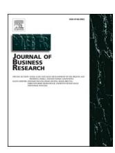
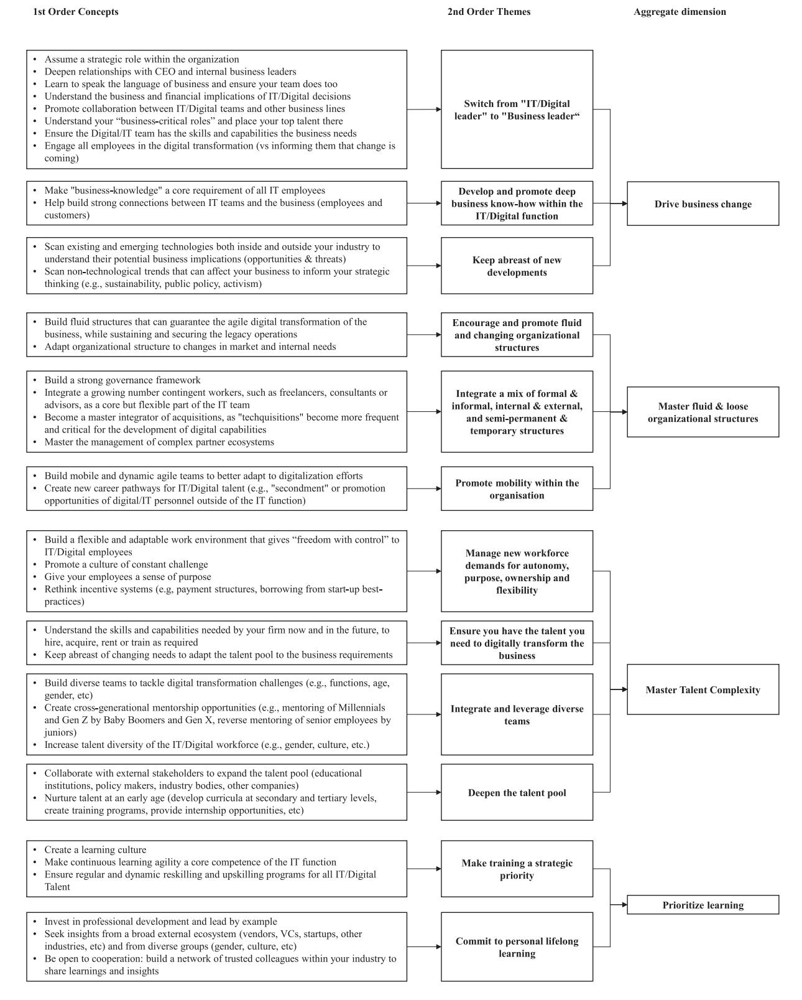
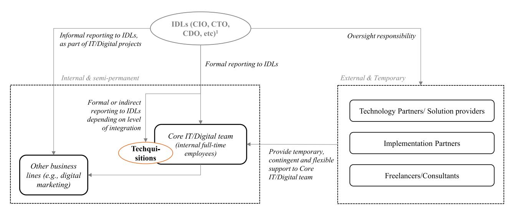

Contents lists available at [ScienceDirect](www.sciencedirect.com/science/journal/01482963)

# Journal of Business Research

journal homepage: [www.elsevier.com/locate/jbusres](https://www.elsevier.com/locate/jbusres)

# Managing digital transformation: The view from the top

Jorge Fernandez-Vidal a,\* , Francesco Antonio Perotti b,d , Reyes Gonzalez c , Jose Gasco c

- a *Department of Strategy, IE Business School & University of Alicante, Spain*
- b *Department of Management, University of Turin, Italy*
- c *Department of Management, University of Alicante, Spain*
- d *Department of Management, University of Agder, Norway*

#### ARTICLE INFO

#### *Keywords:* Digital Transformation Corporate Transformation Corporate strategy Digital strategy Talent management

#### ABSTRACT

Digital Transformation is upending businesses everywhere. While there is ample research on this topic, there is a clear gap when it comes to understanding the changing talent management role of senior executives in digital transformation processes and the demands of individual employees. This article relies on 23 in-depth interviews with senior managers who are leading all or some of the digital transformation efforts of their respective organizations. Our research, using a grounded theory approach, identifies four key activities (and 37 sub-activities or themes) stemming from the new managerial needs and talent management practices arising from DT processes. We branded these key activities "Drive business change", "Master fluid & loose organizational structures", "Master Talent Complexity", and "Prioritize learning". This paper aims to provide an overview into the thinking and managerial practices of senior executives in a digital transformation context and complements the limited number of studies that examine the intersection between managerial actions and digital transformation. It also provides a conceptual framework that captures the key managerial demands arising from digital transformation processes and identifies key actions made by senior executives as part of these processes, which can be leveraged by both scholars and practitioners alike.

## **1. Introduction**

Digital transformation (DT) is completely redefining businesses across the world. Established companies from every industry, of all shapes and forms, are encouraged to transform their business models, typically leveraging digital technologies, to remain competitive in their respective markets ([Fitzgerald et al., 2014;](#page-11-0) D'[Ippolito et al., 2019](#page-11-0); Subramaniam, & [Piskorski, 2020; Kraus et al., 2021; Verhoef et al.,](#page-12-0)  [2021\)](#page-12-0).

The process of digitisation and the adoption of new technologies in companies involve a series of changes, which require different managerial capabilities and the development of new human resource management practices [\(Benson et al., 2002; Sousa](#page-11-0) & Rocha, 2019; [Bresciani](#page-11-0)  [et al., 2021a\)](#page-11-0). Many practitioners argue that the present and future of IT is Bimodal [\(Mao et al., 2019\)](#page-12-0). That is, IT/Digital is split into two distinct parts. One is more traditional and slow-moving and deals with the management and upgrade of the existing IT/Digital infrastructure. The other, which is more agile and experimental, leverages new technologies to respond to new business and customer demands ([Su et al., 2016;](#page-12-0)  [Haffke et al., 2017](#page-12-0)). As such, the entrenched and deeply ingrained human resources practices of legacy businesses need to change and adapt, but also need to somehow co-exist with new human resources management practices more suitable to digital environments. Therefore, the human dimension plays a critical role in any digitalization and transformation strategy ([Tabrizi et al., 2019](#page-12-0)).

Some studies have explored how firms need to adapt and upgrade their internal capabilities to succeed in their DT efforts ([Ferraris et al.,](#page-11-0)  [2019; Muninger et al., 2019;](#page-11-0) [Bresciani et al., 2021a](#page-11-0); [Verhoef et al.,](#page-12-0)  [2021\)](#page-12-0). More specifically, a number of studies have explored the changing role of managers and the adoption of new figures, like that of chief digital officers ([Kunisch et al., 2020; Singh et al., 2020; Firk et al.,](#page-11-0)  [2021\)](#page-11-0). Other studies highlighted the demanding role of top managers in the digital age and concluded that they engage in three key actions: understanding digitalization, setting the formal context for a digital transformation, and leading change ([Wrede et al., 2020](#page-12-0)). Thus, digital environments lead to the redefinition of the responsibilities and activities of top managers, who need to be increasingly sensitive to digital technologies and proactive in managing the changes brought about by

*E-mail addresses:* [jfernandezv@faculty.ie.edu](mailto:jfernandezv@faculty.ie.edu) (J. Fernandez-Vidal), [francescoantonio.perotti@unito.it](mailto:francescoantonio.perotti@unito.it) (F. Antonio Perotti), [mr.gonzalez@ua.es](mailto:mr.gonzalez@ua.es) (R. Gonzalez), [jl.](mailto:jl.gasco@ua.es)  [gasco@ua.es](mailto:jl.gasco@ua.es) (J. Gasco).

<https://doi.org/10.1016/j.jbusres.2022.07.020>

Available online 27 July 2022 Received 11 January 2022; Received in revised form 1 July 2022; Accepted 6 July 2022

0148-2963/© 2022 The Authors. Published by Elsevier Inc. This is an open access article under the CC BY-NC-ND license([http://creativecommons.org/licenses/by](http://creativecommons.org/licenses/by-nc-nd/4.0/)[nc-nd/4.0/](http://creativecommons.org/licenses/by-nc-nd/4.0/)).

\* Corresponding author.

their adoption (Singh & [Hess, 2017; Eden et al., 2019; Correani et al.,](#page-12-0)  [2020\)](#page-12-0). However, there is a clear gap when it comes to understanding the changing talent management role of senior executives in DT processes and the demands of individual employees [\(Singh et al., 2020; Wrede](#page-12-0)  [et al., 2020](#page-12-0)). In spite of the critical role played by managers in digital organizations, a "view from the top" about the key changing talent demands is missing. Therefore, to the best of the authors' knowledge, there is an outstanding opportunity to study and shed light on the strategic, organizational, and human-resource management changes caused by individual-level actions [\(Eisenhardt et al., 2010; Barney,](#page-11-0) & Felin, 2013).

From this premise, we aim to address this research gap by focusing on the new and changing demands of IT & Digital leaders (IDLs) -chief technology officer, chief digital officer, chief transformation officer, digital innovation officer, head of digital strategy, etc.- and the talent management practices and strategies they are implementing in their DT journeys (Mansfeld et al., 2010; Singh, & [Hess, 2017; Singh et al., 2020](#page-11-0)). We do so from a novel angle, inductively exploring the practical experience of IDLs to shed some light on the perception from the top and distil the key managerial changes brought about by DT.

Our study is rooted on the resource-based view of the firm ([Penrose,](#page-12-0)  [1959; Wernerfelt, 1984; Barney, 1986\)](#page-12-0) and defends that, among all the resources that can provide firms with a sustained competitive advantage ([Clulow, 2007](#page-11-0)), human capital is certainly the most important one when it comes to DT. While many resource-based view studies assume that corporate resources will endure over time ([Dunford et al., 2003](#page-11-0)), we take the view that, when it comes to DT, the volatility and dynamism of individual or collective human resources preclude them from being regarded as sources of sustainable competitive advantage ([Barney,](#page-11-0)  [1991\)](#page-11-0). However, we believe that the implementation of certain management best-practices can become a strategic resource that brings a real sustainable competitive advantage to firms. While these management best-practices are naturally context specific, we have identified certain key activities of IDLs in DT endeavours that we believe present a relevant blueprint for other IDLs and can be a source of interesting insights for researchers. From our empirical analysis, we found that DT processes have resulted in certain key managerial changes that fundamentally redefine the roles and responsibilities of IDLs. These individuals, more than ever, take charge of driving real business change. They are expected to master fluid and loose organizational structures, navigate an increasingly complex talent ecosystem and prioritize learning, in a context where reskilling and upskilling have become strategically imperative.

DT presents an opportunity for organisations to transform their business model, go-to-market strategy, organizational structure, and operational processes, with digital technologies as a necessary but insufficient enabler ([Westerman et al., 2011; Gurbaxani](#page-12-0) & Dunkle, 2019; [Balakrishnan](#page-12-0) & Das 2020). The existing literature on DT revolves primarily around this notion of enterprise-wide changes and how organizations can leverage digital technologies to drive change and create value. To dwell on this view, we explore how DT is implemented in organisations and the role played by managers, by focusing on the most valuable capabilities required from managers in the digital age.

Our paper aims to contribute to the limited literature on the role of IDLs in DT journeys. In particular, we supplement the growing body of literature on DT in organizations by: a) providing an interesting insight into the managerial practices and needs of senior executives [\(Davis](#page-11-0) & Olson, 1987; Wysocki & [Young, 1990; Kunisch et al., 2020; Singh et al.,](#page-11-0)  [2020\)](#page-11-0); b) complementing the limited knowledge about the intersection between managerial actions and digital transformation ([Balakrishnan](#page-10-0) & [Das, 2020; Wrede et al., 2020\)](#page-10-0); and c) developing a conceptual framework of the key managerial demands arising from legacy businesses' DT (Singh & [Hess, 2017; Verhoef et al., 2021\)](#page-12-0). In addition to these important theoretical contributions, our findings represent valuable support for managers undertaking DT in their companies.

After this introduction, the article is structured as follows. First, we provide a comprehensive overview of the existing DT literature, by

focusing on managers' roles in digital organizations and the capabilities required of them. Second, we describe the methodology used in the study. Then, we present the results of our empirical investigations. From our findings, we develop a thorough discussion aimed at filling the above-mentioned research gaps. Finally, we close the conceptual loop by describing our research contributions, implications, and conclusions.

#### **2. Literature review**

#### *2.1. Defining digital transformation*

Digital transformation (DT) represents a paradigm shift that affects industries and companies across the world [\(Fitzgerald et al., 2014;](#page-11-0)  [Ferraris et al., 2019; Broekhuizen et al., 2021\)](#page-11-0). It is even believed to have a positive influence on societal development [\(Popkova et al.,](#page-12-0)  [2022\)](#page-12-0). For this reason, it has attracted the interest of numerous researchers and practitioners in the last decade who have attempted to understand its nature and characteristics.

In his review of the literature, [Vial \(2019\)](#page-12-0) described DT as a process that generates strategic and operational changes in companies as a result of the opportunities and threats raised by digital technologies. Other authors highlighted how DT relates to the adoption of cutting-edge technologies by agile organizations, with the aim of radically improving their performance and expanding their horizons ([Bresciani](#page-11-0)  [et al., 2021a;](#page-11-0) [Kraus et al., 2021; Westerman et al., 2011\)](#page-11-0). Similarly, [Fitzgerald et al. \(2014\)](#page-11-0) depicted DT as a practical implementation of digital technologies to improve customer experience and engagement, make operations simpler, strengthen business models or generate new business opportunities. In turn, [Appio et al. \(2021\)](#page-10-0) argue that providing a comprehensive definition of DT is challenging because it is a multifaceted and multidimensional phenomenon. In spite of these challenges, it is worth exploring some of these dimensions.

From a strategic point of view, [Matt et al. \(2015\) and Broekhuizen](#page-12-0)  [et al. \(2021\)](#page-12-0) highlighted the inherent complexity of DT and its potential to reshape a company, from an organizational, operational, and business model perspective. [Hess et al \(2016\)](#page-11-0) looked at the core strategic dimensions of DT and the fundamental, and company-wide, strategic questions arising from DT programs. In a comprehensive literature review, [Kraus et al. \(2021\)](#page-11-0) suggested that a strategy focused only on DT was clearly insufficient, and emphasized the strategic nature of DT and its inherent links to the broader strategic ecosystem of the company. Accordingly, DT is seen as a strategic priority for most companies and leads organizations to become more agile and reconsider their business models and operational approach [\(Hess et al., 2016;](#page-11-0) [Bresciani et al.,](#page-11-0)  [2021a; Ferraris et al., 2021; Kraus et al., 2021; Shams et al., 2021](#page-11-0)).

From a market perspective, DT is seen as a tool to contest disruptionor create it- by leveraging digital technologies. As a result of this, firms' value propositions are reformulated, entry barriers are lowered and digital and physical products co-exist in the market, with more or less harmony [\(Mithas et al., 2013; Barrett et al., 2015](#page-12-0); [Bresciani et al.,](#page-11-0)  [2021b\)](#page-11-0). There is a clear interplay between business model innovation and DT, with DT leading to the reformulation and adaptation of firms' business models across industries (D'[Ippolito et al., 2019\)](#page-11-0). While DT clearly alters competitive dynamics, it also generates profound changes in consumer behaviour and expectations [\(Fitzgerald et al., 2014;](#page-11-0)  [Schwertner, 2017; Correani et al., 2020; Khanra et al., 2021](#page-11-0)). Therefore, even though the changes triggered by DT are naturally linked to the adoption of digital technologies and the digitalization of organizations ([Westerman et al., 2011; Khanra et al., 2020; Verhoef et al., 2021\)](#page-12-0), its implications are not strictly limited to this aspect [\(Tabrizi et al., 2019;](#page-12-0)  [Vial, 2019](#page-12-0)).

#### *2.2. Digital transformation in organizations: The important role of managers*

The implementation of DT in organizations has been widely studied

([Saldanha, 2019; Vial, 2019;](#page-12-0) D'[Ippolito et al., 2019; Crupi et al., 2020;](#page-11-0)  [Appio et al., 2021; Fernandez-Vidal et al., 2022\)](#page-11-0). The holistic and complex nature of DT requires companies to have a well-defined business strategy that provides them with a clear blueprint to guide their transformation efforts. According to [Matt et al. \(2015\)](#page-12-0), DT strategies should involve four key dimensions: (a) the strategic use of new technologies; (b) the changes in value creation brought about by new technologies; (c) the changes in organizational structures, processes, and capabilities; and (d) the financial implications of the whole DT, both in terms of "pressure to act" and resources required to fund the DT endeavour. While these dimensions may be common across organizations and sectors, there is no single approach that applies to all DT efforts ([Hess et al., 2016; Appio et al., 2021](#page-11-0)). As a result, the strategic and organizational changes triggered by DT are boundless ([Westerman](#page-12-0) & [Bonnet, 2015; Gurbaxani](#page-12-0) & Dunkle, 2019) and usually result in the redefinition or reconfiguration of a company's entire business model (D'[Ippolito et al., 2019](#page-11-0)).

As such, DT can lead to the reconsideration of a company's value proposition, value creation and value capture strategies ([Alberti-Alh](#page-10-0)[taybat et al., 2019; Rachinger et al., 2019; Vaska et al., 2021; Verhoef](#page-10-0)  [et al., 2021](#page-10-0)). Naturally, this has a profound impact on a company's organisational structure and the roles, skills and capabilities required from top managers and employees (Gurbaxani & [Dunkle, 2019; Balak](#page-11-0)rishnan, & [Das, 2020](#page-11-0)). Furthermore, successful DT requires companies to pivot toward more flexible and agile structures, and to adapt to fastchanging digital environments (Gurbaxani & [Dunkle, 2019](#page-11-0); [Bresciani](#page-11-0)  [et al., 2021a](#page-11-0); [Ferraris et al., 2021; Verhoef et al., 2021\)](#page-11-0). DT leads to a fundamental workforce transformation that requires companies to rethink their talent management practices [\(Eden et al., 2019; Sousa](#page-11-0) & [Rocha, 2019; Porfírio et al., 2021](#page-11-0)). Given the emerging current that links emotional well-being and happiness at work with entrepreneurship and intellectual capital creation [\(Usai et al., 2020](#page-12-0)), the role of managers in building the right cultural environment becomes more important than ever before [\(Firk et al., 2021; Wrede et al., 2020](#page-11-0)). Therefore, it is essential that top managers have the right transformation leadership skills to drive the business change required by DT [\(Matt et al., 2015;](#page-12-0)  Singh & [Hess, 2017; Tabrizi et al., 2019](#page-12-0)).

The role of managers is critical in ensuring the success of organisations. In the context of DT, managers are in charge of setting the strategic direction of the business' transformation and are responsible for guiding and coordinating the multiple organizational and operational changes resulting from the adoption of new digital technologies [\(Singh](#page-12-0) & Hess, [2017; Kunisch et al., 2020](#page-12-0); [Bresciani et al., 2021a](#page-11-0)). Managers need to understand the impact of existing or emerging digital technologies to identify opportunities and challenges and pivot the company's strategy accordingly (Gurbaxani & [Dunkle, 2019; Singh et al., 2020; Wrede et al.,](#page-11-0)  [2020\)](#page-11-0). This strategic shift is far from being straight forward, but managers can leverage multiple strategic tools that can guide their decisionmaking process ([Fernandez-Vidal et al., 2022](#page-11-0)). This strategic shift is usually accompanied by an organisational shift. DT leads to greater complexity and higher demands of leaders and employees ([Schwarz](#page-12-0)[müller et al, 2018; Firk et al., 2021\)](#page-12-0). As such, managerial roles need to be redefined and new managerial figures - like that of the chief digital officer (CDO) - emerge to help navigate a more complex and technical environment (Horlacher & [Hess, 2016; Cortellazzo et al., 2019; Sousa](#page-11-0) & [Rocha, 2019](#page-11-0)).

In digital organizations, the role of IDLs has become increasingly vital. These senior executives are expected to be business strategists and change-makers, ensuring the effective transformation of existing businesses and enabling or even building new ones ([Chakravarty et al., 2013;](#page-11-0)  Weill & [Woerner, 2013; Horlacher](#page-11-0) & Hess, 2016; Singh & Hess, 2017). Scholars have investigated the changing corporate roles and responsibilities of IDLs, focusing in particular on the CDOs, perhaps due to the position's novelty and relevance to multiple DTs [\(Schwarzmüller et](#page-12-0)  [al, 2018; Singh et al., 2020; Wrede et al., 2020\)](#page-12-0). CDOs are expected to work across functions and build a more collaborative environment –

both vertically and horizontally [\(Matt et al., 2015; Singh](#page-12-0) & Hess, 2017; [Kunisch et al., 2020](#page-12-0)). In a typical case, CDOs promote the integration of new technologies in the organisation and drive the digital transition. They are also expected to act as digital evangelists, inspiring people, selling an exciting vision, and facilitating change. Lastly, their role requires a strong coordination and collaboration effort with the broader management team, to address any of the issues or roadblocks natural to any DT process (Singh & [Hess, 2017; Tabrizi et al., 2019; Firk et al.,](#page-12-0)  [2021; Porfírio et al., 2021\)](#page-12-0).

In summary, it is clear that IDLs, and human capital more broadly, play a fundamental role in DT. Building on the resource-based view of the firm ([Penrose, 1959; Wernerfelt, 1984; Barney, 1986](#page-12-0)), we believe human capital, or perhaps more specifically, the right human capital management best-practices can develop into a differentiating and strategic resource that brings a real sustainable competitive advantage to firms. However, for this to happen, the role and function of top managers in the digital age must change. Naturally, as their role changes, so do the skills and capabilities required from top managers.

## *2.3. Skills and capabilities in the digital age*

Understandably, the challenges originating from digital technologies and DT processes demand new skills and capabilities from managers ([Schwarzmüller et al., 2018; Verhoef et al., 2021\)](#page-12-0).

There seems to be some academic consensus around some of the main skills and capabilities required by managers in the digital age: organizational agility, technical know-how, and emotional intelligence to deal with the talent aspects of a corporate transformation ([Singh](#page-12-0) & [Hess, 2017; Cortellazzo et al., 2019; Sousa](#page-12-0) & Rocha, 2019; Usai et al., [2020\)](#page-12-0). First, managers in the digital age need to be agile, by anticipating market opportunities resulting from digital technologies and taking advantage of them with speed and flexibility. In this way, organisations can respond to new customer demands and market competition [\(Chak](#page-11-0)[ravarty et al., 2013; Schwarzmüller et al., 2018; Bresciani et al., 2021a](#page-11-0); [Shams et al., 2021](#page-12-0)). In an age of substantial disruption, managers are expected to be high-speed decision makers and excellent problem solvers (Singh & [Hess, 2017; Cortellazzo et al., 2019; Sousa](#page-12-0) & Rocha, [2019; Verhoef et al., 2021\)](#page-12-0). The inability of IDLs to manage change effectively is one of the main reasons why DT initiatives fail [\(Correani](#page-11-0)  [et al., 2020\)](#page-11-0), thus reinforcing the need of IDLs to become effective change agents. Second, managing disruptive change requires strong technical and digital capabilities (within the management team or the organisation) and a deep understanding of how digital technologies can be applied or leveraged by the company to improve its competitiveness ([Cortellazzo et al., 2019; Ferraris et al., 2019; Scuotto et al., 2021;](#page-11-0)  [Verhoef et al., 2021\)](#page-11-0). Third, DT leads to new organisational structures and ways of working. As such, managers need to have a strong degree of emotional and social intelligence to manage change in their organisations (Singh & [Hess, 2017; Cortellazzo et al., 2019; Usai et al., 2020](#page-12-0)), as well as strong networking and communication capabilities ([Eden et al.,](#page-11-0)  2019; Sousa & [Rocha, 2019; Verhoef et al., 2021\)](#page-11-0).

While it is widely understood that the role of managers is fundamental in any DT process (Singh & [Hess, 2017; Cortellazzo et al., 2019](#page-12-0)), our understanding of their own perceptions is rather limited ([Singh](#page-12-0)  [et al., 2020; Wrede et al., 2020; Kraus et al., 2021; Verhoef et al., 2021](#page-12-0)). Even though some studies have explored the role of top managers in the digital age, only a few have addressed the self-perceived new talent and skill demands of top managers [\(Wrede et al., 2020](#page-12-0)). Accordingly, this study contributes to mitigating this research gap by exploring the view from the top. We seek to understand the new and changing demands of top management roles and the talent management practices and strategies they are implementing in their DT journeys. In the process, we aim to inductively build theory based on the practical experience of IDLs.

## **3. Methodology**

Given our goal of understanding the changing nature of top managers in DT journeys, we carried out an inductive, grounded theory style study, to observe this phenomenon from a novel and insightful point of view. This enabled us to build theoretical explanations that would not have been possible with traditional deductive methods [\(Baiyere et al.,](#page-11-0)  [2020; Bovey and Hede, 2001](#page-11-0)).

We followed the Gioia methodology, as it is a well-established and proven methodological approach to build theory inductively using qualitative data [\(Gioia et al., 2013; Bovey and Hede, 2001; Gioia, 2021](#page-11-0)).

#### *3.1. Data collection*

In pursuing our research question (i.e., what are the new and changing demands of top management roles and the talent management practices and strategies they are implementing in their DT journeys?), we collected data through semi-structured interviews. Specifically, our empirical study relies on 23 in-depth interviews with senior managers, either leading their companies' transformation (i.e., CEOs) or leading all or some of the DT efforts of their respective organizations (e.g., Chief Information Officers, Chief Digital Officer, Director of Digital Transformation). We used a combination of two sampling methods: purposive sampling and chain referral sampling [\(Patton, 2015\)](#page-12-0). Purposive sampling, which is one of the most common sampling strategies, selects interviewees based on some preselected criteria relevant for the study. Chain referral sampling, which is considered a derivation of purposive sampling, leverages the network of participants or interviewees already selected for the study, as they are asked to refer the researcher to other professionals who could potentially contribute to the study [\(Mack et al.,](#page-11-0)  [2005\)](#page-11-0).

Our selection criteria were very straight forward. We had four basic criteria across the following dimensions: geography, business size, business state, and participant seniority. First, we were interested in businesses operating in the Iberian Peninsula (Portugal and Spain). Like many researchers before us, we were concerned with ensuring some form of cultural integrity, or at least the avoidance of a clear cultural bias (Pelzang, & [Hutchinson, 2018\)](#page-12-0); therefore, we opted to study companies in countries with a similar cultural background. Second, we wanted to study relatively large corporations, due to their complexity so we set an arbitrary minimum size of 500 employees. Third, we wanted to study mature legacy business – not start-ups – so we selected companies founded before the dot-com era (i.e., 1999). Fourth, we wanted to interview senior managers and we only selected participants that were either C-Level (i.e., CEO, CIO, CTO, CDO, etc) themselves or reported directly to C-Level executives. All these executives worked in areas relevant to our study (e.g., IT, Digital, Innovation, Transformation, etc.). We did not focus on a specific sector or set of sectors; rather, we were interested in interviewing professionals from a range of businesses with different origins, business models and competitive positions, which ensures an appropriate level of disparity between companies ([Eisenhardt,](#page-11-0)  [1989; Flyvbjerg, 2006](#page-11-0)). Table 1 provides a high-level description of the firms and interviewees included in our study.

Interviews were requested via email, LinkedIn or telephone call and were conducted in person, via videocall or via phone call from March 2021 to October 2021. The interviews were conducted using a semistructured guideline. The questions revolved around their personal perceptions – and experiences – of the changes required in managerial roles and practices as part of their DT efforts. Each interview lasted between ~ 40 and ~ 120 min, and the authors returned to 7 interviewees on multiple occasions to discuss our evolving analysis and conclusions. While the interviews were not recorded, the authors took written notes and summarized the key takeaways before the end of each interview to ensure an accurate documentation of the discussion.

Lastly, we relied on the [Glaser and Strauss \(1967\)](#page-11-0) model of theoretical saturation to define the boundaries of our sampling strategy and we finished our interview process when we considered that we could not find additional insights ([Saunders et al., 2018](#page-12-0)).

## *3.2. Data analysis*

We followed the principles of grounded theory (Glaser & [Strauss,](#page-11-0)  [1967; Lincoln](#page-11-0) & Guba, 1985) and used the methodology of [Gioia et al.](#page-11-0)  [\(2013\),](#page-11-0) to ensure the scholarly rigor of our qualitative analysis.

In the first phase, we identified first-order themes using an open coding procedure (Strauss & [Corbin, 1998\)](#page-12-0). We looked for emerging themes regarding the new and changing demands of top management roles and the talent management practices and strategies they are implementing in their DT journeys in each interview. We looked for similarities and differences in the emerging themes (similar to [Strauss](#page-12-0)  [and Corbin](#page-12-0)'s [1998] concept of axial coding) and reduced them to a block of 37 core themes.

In the second phase, we looked for higher-order concepts that could help us describe and explain the emerging themes we had identified

**Table 1**  Summary and high-level description of Respondents.

| Firm  | Industry           | Founded in year | Number of employees | Interviewee position                                  |
|-------|--------------------|-----------------|---------------------|-------------------------------------------------------|
| BAN-1 | Banking            | Before 1950     | 5,000–10,000        | Chief Technology Officer                              |
| BAN-2 | Banking            | 1976–2000       | >100,000            | Head of IT Transformation                             |
| BAN-3 | Banking            | Before 1950     | 5,000–10,000        | Head of Digital Banking                               |
| BAN-4 | Banking            | Before 1950     | 5,000–10,000        | Managing Director                                     |
| INS-1 | Insurance          | Before 1950     | 5,000–10,000        | Head of Digital & Innovation                          |
| CPG-1 | Consumer goods     | 1950–1975       | 10,000–50,000       | Chief Information Officer                             |
| CPG-2 | Consumer goods     | Before 1950     | 50,000–100,000      | Chief Information Officer                             |
| CPG-3 | Consumer goods     | Before 1950     | 1,000–5,000         | Chief Technology Officer                              |
| CPG-4 | Consumer goods     | Before 1950     | 50,000–100,000      | Head of Digital & IT                                  |
| CPG-5 | Consumer goods     | Before 1950     | 50,000–100,000      | Head of Analytics                                     |
| CPG-6 | Consumer goods     | Before 1950     | 10,000–50,000       | Global E-Commerce Director                            |
| AGR-1 | Agriculture        | 1976–2000       | <1,000              | CEO                                                   |
| AGR-2 | Agriculture        | 1950–1975       | 1,000–5,000         | CEO                                                   |
| RET-1 | Retail             | Before 1950     | 10,000–50,000       | Global E-Commerce and Digital Transformation Director |
| BUI-1 | Building Materials | Before 1950     | 10,000–50,000       | IT & R&D Director                                     |
| TEL-1 | Telecommunications | Before 1950     | >100,000            | Digital Transformation Director                       |
| TEL-2 | Telecommunications | Before 1950     | >100,000            | Head of Learning & Development, Digital               |
| TEL-3 | Telecommunications | 1976–2000       | 50,000–100,000      | Head of Technology & Design                           |
| ENE-1 | Energy             | Before 1950     | 10,000–50,000       | Chief Digital & Information Officer                   |
| ENE-2 | Energy             | Before 1950     | 10,000–50,000       | Head of Digital Transformation                        |
| ENE-3 | Energy             | 1976–2000       | 10,000–50,000       | Director of Transformation                            |
| ENE-4 | Energy             | Before 1950     | 10,000–50,000       | Director of Innovation                                |
| PHA-1 | Pharmaceuticals    | Before 1950     | 1,000–5,000         | Chief Technology Officer                              |

**Table 2**  Sample data supporting the interpretation of 2nd order themes.

| Aggregate Conceptual category Exemplary quote dimension                                                                                                                                                                                                                                                                                                                                                                                                                                                                                                                                                                                                                                                                                                                                                                                                                                                                                                                                                                                                                                                                                                                                                                                                                                                                                                                                                                                                                                                                                                                                                               |
|--------------------------------------------------------------------------------------------------------------------------------------------------------------------------------------------------------------------------------------------------------------------------------------------------------------------------------------------------------------------------------------------------------------------------------------------------------------------------------------------------------------------------------------------------------------------------------------------------------------------------------------------------------------------------------------------------------------------------------------------------------------------------------------------------------------------------------------------------------------------------------------------------------------------------------------------------------------------------------------------------------------------------------------------------------------------------------------------------------------------------------------------------------------------------------------------------------------------------------------------------------------------------------------------------------------------------------------------------------------------------------------------------------------------------------------------------------------------------------------------------------------------------------------------------------------------------------------------------------------------------------|
| Master Fluid & Loose Encourage and promote We need to manage a two Organizational fluid and changing speed IT, a legacy business Structures organizational structures that supports our old core and a new IT that houses our new digital, analytical or product development capabilities…and those structures are alive; one shrinks and the other grows as we replace our legacy infrastructure for new ones. Some people are needed today but not tomorrow. Juggling those balls is hard. (CPG-3) I have changed our hierarchical structure so many times in the last 5 years that I have stopped counting. I used to worry about this, but I do not anymore! People are much more adaptable than what most of us think. (ENE-2) We have come a long way, in fact, a lot of our teams do not even have a formal organizational structure and have the freedom to define it themselves or not…we find that works very well in delivery teams. (CPG-4) Integrate a mix of formal For each full-time & informal, internal & employee at ENE-2, we external, and semi probably have anywhere permanent & temporary between 4 and 5 structures freelancers or consultants. Managing that complexity of people that come and go is extremely difficult. We need a strong governance structure, that honestly is still work-in-progress for us. Do not get me wrong, this makes sense as it gives us flexibility to hire freelancers and consultants |

**Table 2** (*continued* )

| Aggregate dimension | Conceptual category                         | Exemplary quote                                                                                                                                                                                                                                                                                                                                                                                                                                                                                        |
|------------------------|---------------------------------------------|--------------------------------------------------------------------------------------------------------------------------------------------------------------------------------------------------------------------------------------------------------------------------------------------------------------------------------------------------------------------------------------------------------------------------------------------------------------------------------------------------------|
|                        | Promote mobility within the organisation | strong teams, have agile teams that can work together and learn as they work. We all have needed to adapt to this new way of working. (TEL-2) Many of our young digital employees want to experience other roles in the organization. The reality is that in TEL-3, people switch easily from Sales to Marketing, or from Finance to Strategy, or                                                                                                               |
|                        |                                             | from Business Development to Sales; however, IT people always stay at IT. Of course, a lot of people, especially older ones, are perfectly fine with it; but I feel an increased pressure to give some of our talented employees a shot at being CEO one day- and they know it won't happen if                                                                                                                                                                        |
| Prioritize learning    | Make training a strategic priority       | they stay in IT their whole careers. (TEL-3) Most IT profiles are extremely expensive, so we need to learn to upskill and reskill- as someone who is supposed to manage our IT talent, that is my main focus at the moment. How                                                                                                                                                                                                                                                |
|                        |                                             | do I build an organization or team that can constantly learn? (TEL-2) I am convinced that the most critical things for a CIO these days are a) define what the business & IT strategy is (and I used the word business on purpose!); and b) decide which skills and                                                                                                                                                                                                      |
|                        |                                             | capabilities you need. You can teach, hire, rent or buy those capabilities, but a good IT leader needs to know what is required today and what will be required tomorrow and the day after tomorrow. (TEL                                                                                                                                                                                                                                                                         |
|                        | Commit to personal lifelong learning     | 1) As a leader, you have to be constantly learning and re learning if you do not want to be left behind. You would have thought that at certain senior levels, your study days were behind you. Quite the opposite. You need to be constantly learning and recycling your knowledge or you will fail as a leader. (PHA 1) All CIOs today need to be up-to-date with emerging technologies as we know that technological developments can quickly |
|                        |                                             | disrupt our business. I go to digital conferences from (continued on next page)                                                                                                                                                                                                                                                                                                                                                                                                                  |

**Table 2** (*continued* )

| Aggregate dimension | Conceptual category | Exemplary quote                                                                                                                                                                                                                                                                                                                                                                                                                                                                     |
|------------------------|---------------------|-------------------------------------------------------------------------------------------------------------------------------------------------------------------------------------------------------------------------------------------------------------------------------------------------------------------------------------------------------------------------------------------------------------------------------------------------------------------------------------|
|                        |                     | multiple industries, talk to academics, start-ups, vendors, etc. I need to be on the street all the time. (ENE-1) I have been in this industry for a long time and you would be surprised how much I talk to my peers from XXX, YYY or ZZZ [key competitors]. We exchange ideas, talk about vendors and recently talk a lot about AAA [a digital disruptor]…we have the same problems and are fighting the same enemies. (BAN-2) |

([Gioia et al., 2013\)](#page-11-0). We distilled the core changes required into managerial roles and talent management practices and built a thematic framework across related conceptual categories (see [Table 2](#page-4-0) as a sample fo the data we used to build our framework).

In the final step, once we had a set of themes and concepts – along the lines of [Glaser and Strauss](#page-11-0)' (1967) "theoretical saturation" - we condensed the 2nd order concepts into aggregate dimensions ([Gioia](#page-11-0)  [et al., 2013\)](#page-11-0). Then, with the resultant empirically grounded theoretical framework, we went back to 7 interviewees and to our empirical quotes to revise and fine-tune our framework.

#### **4. Findings**

Our thematic analysis served as a foundation to improve our understanding of the key changing demands of IDLs in their management of DT processes. [Fig. 1](#page-6-0) shows the resulting framework and the four key activities stemming from the new managerial needs and talent management practices arising from DT processes. We branded these key activities "Drive business change", "Master fluid & loose organizational structures", "Master talent complexity", and "Prioritize learning".

These activities synthesise the evidence from our study and address the key changing demands of IDLs from different perspectives: a change management perspective, an organizational perspective, a talent management perspective, and an individual-capability perspective. What follows is a more detailed description of these key activities.

## *4.1. Drive business change*

Our data analysis clearly indicates that IDLs are expected to drive business change. While previously IDLs were primarily seen as having a support role in the organisation ([Saldanha, 2019\)](#page-12-0), now they are expected to have a strategic role, oriented towards creating value in the business and driving change in the organisation. As explained by the Chief Information Officer of a large consumer goods company:

*Our role was seen as operational in the past, critical, but operational. We were a support function, like legal or finance. Now we are a strategic function, what we do impacts our business strategy from top to bottom. This is the real change for me. (CPG-2)* 

As a result, IDLs are forced to switch from being simply "IDLs" to being "Business leaders". They are expected to assume a strategic role within the organization. This may not come as a surprise for many scholars, as this shift in the role of IDLs has long been identified ([Damanpour, 1991; Smith,](#page-11-0) & Tushman, 2005). However, it is interesting to note that several of our respondents have highlighted that this was mostly a clich´e in the past but is now a reality: "*now you are either part of*  *the business or you are out. Of course, we used to say that we were 'part of the business*́ *all the time, but it was clearly not true*" (CPG-1).

To drive this business change, our respondents highlighted the need to deepen the relationship between IDLs and other internal business leaders (with the CEO being the most critical one) and promote effective collaboration between IT & Digital teams and other business areas. All employees need to be part of the DT, in fact, there is no real distinction between a DT and a business transformation [\(Mazzone, 2014; Wade](#page-12-0)  [et al., 2019; Shakina et al., 2021; Fernandez-Vidal et al., 2022](#page-12-0)). Given that employees tend to resist change processes (Bovey & [Hede, 2001](#page-11-0)), it is the critical responsibility of senior executives to secure the support and commitment of their employees [\(Yukl, 2010; Venus et al., 2019](#page-12-0)). IDLs play a key role in this change management process by signalling their personal commitment, involving a large set of employees in the DT, and building trust and commitment ([Wrede et al., 2020](#page-12-0)).

Linked to this change management process, our data reveals that IDLs and the broader IT & Digital teams need to learn how to speak the language of business and understand the business and financial implications of their technical decisions. In some cases, the lines between IT/ Digital and the business are blurry or non-existent, as highlighted by this banking executive:

*In some parts of our bank, technology is actually the business -not just something that supports the business. So, our role has become central in growing the business and responding to disruptors. (BAN-4)* 

Interestingly, some of our respondents have put the need for "technical expertise" and "business expertise" in IT & Digital teams on a par, arguing that an adequate level of "business expertise" was now a prerequisite for most IT & Digital functions. Therefore, IDLs need to place their top talent in the business-critical roles, to maximise the strategic and business impact of the IT & Digital function.

IDLs need to ensure that the IT & Digital teams have the skills and capabilities the business needs. As discussed, these skills and capabilities include both technical knowledge (in whatever area of expertise is required, IT architecture, analytics, artificial intelligence, app development, etc.) and business knowledge, which has become a core requirement of all IT & Digital employees. To ensure IT & Digital employees have an adequate business understanding, IDLs believe they need to help build strong connections between IT & Digital teams and the business (e. g., by interacting with sales teams or customers directly).

In a rapidly moving business environment, where digital challengers constantly seek ways to disrupt incumbents [\(Teixeira, 2019; Zaki, 2019](#page-12-0)), our interviewees stressed the need they had to keep abreast of new technical and business developments. On the one hand, IDLs must scan existing and emerging technologies both inside and outside their industry to understand their potential business implications. IDLs need to understand the business opportunities and threats brought about by technology. On the other hand, given their broader strategic role in the organization, IDLs are also required to understand non-technological trends that could affect their business to inform their strategic thinking.

As a summary, in the words of the Chief Information Officer of a global consumer goods company: "*If you are not helping to grow the business you are not doing your job*" (CPG-1).

### *4.2. Master fluid & loose organizational structures*

The impact of DT on organizational structures has been studied by multiple scholars [\(Hess et al., 2016; Fenech et al., 2019; Gurbaxani](#page-11-0) & [Dunkle, 2019](#page-11-0)). Our findings, in line with other studies, suggest that DT processes lead to more fluid and dynamic organizational structures ([Verhoef et al., 2021\)](#page-12-0).

Our interviewees stressed the importance of building fluid structures that could support the agile DT of the business -while at the same time sustaining and securing the legacy operations. This means, that hierarchical structures become flatter, less rigid, and less clear. It also means that they are more dynamic, adapting and changing in line with the

**Fig. 1. Changing Practices from IDLs as part of DT.** Source: Own elaboration.

market and business needs. While some studies suggest that changing organisational structures can lead to stress and lower employee morale ([DeGhetto et al., 2017](#page-11-0)), several of our interviewees seemed to be relaxed about this, for instance:

*"I have changed our hierarchical structure so many times in the last 5 years that I have stopped counting. I used to worry about this, but I do not anymore! People are much more adaptable than what most of us think." (ENE-2)* 

In some cases, there is actually no structure per se and some teams "*do not even have a formal organizational structure and have the freedom to define it themselves or not*" (CPG-4). This appears to be increasingly common in certain settings ([Westerman et al, 2014\)](#page-12-0), but our findings suggest that this is the exception rather than the norm in large legacy organisations.

When it comes to talent management, our data reveals the substantial complexity of DT processes. We found that IDLs need to integrate a mix of formal/informal, internal/external, and semi-permanent/ temporary structures. To facilitate the understanding of this complex ecosystem, Fig. 2 includes a visual description of a typical IT & Digital talent ecosystem in a DT.

To deal with this complex talent and delivery ecosystem, IDLs recognise the need to build strong governance frameworks. All of our respondents manage or oversee a mix of resources: some formal -their direct reports- and some informal -resources of other business units that play an active role in DT projects; some internal -hired by the companyand some external -freelancers, consultants or advisors; some semipermanent -part of the core business- and others temporary -contingent upon the changing needs of the business. Our analysis suggests that this intricate structure, while certainly challenging to manage, results from the changing and unpredictable technological needs of the business and the difficulties that certain legacy businesses have in attracting the kind of internal talent they need, in a context of talent scarcity [\(Michaels](#page-12-0)  [et al., 2001](#page-12-0)). Given the preferences of Millennials and Gen Zs, it looks like many workers would opt for remote, freelance and temporary work ([Strack et al., 2021\)](#page-12-0), so being able to manage these resources effectively and getting value out of their work appears to be a critical skill to be mastered by IDLs.

One element of increasing importance for IDLs is that of "techquisitions". Acquisitions have been frequently used as a capability development tool ([Bradley et al., 2018](#page-11-0)) and they have become a relevant strategic tool of legacy firms as part of their DTs ([Cuatrecasas, 2019;](#page-11-0)  [Fernandez-Vidal et al., 2022](#page-11-0)). Our analysis suggests that IDLs need to master the integration of acquisitions. As such, they need to ensure that the acquiring company effectively benefits from the new digital skills and capabilities of the acquired business. To this aim, IDLs also need to determine the extent to which these "techquisitions" need to be integrated as part of the core business or maintain their independency. Multiple studies show that legacy firms fail at integrating acquisitions ([Christensen et al., 2011; Kenny, 2020\)](#page-11-0), risk killing innovation in smaller firms when they are integrated as part of the core business [\(Dezi](#page-11-0)  [et al., 2018\)](#page-11-0) and lose some or most of the critical talent they wished to acquire and retain ([Chao et al., 2020\)](#page-11-0). In the words of one of interviewees, for some firms this appears to be still work-in-progress:

*"Acquisitions are becoming very common. We need new capabilities that we do not have in house and ENE-1 has done a few acquisitions to be able to compete with new digital business models. Integrating these new teams -and deciding how much to integrate them!- is a lot of work and we are still learning how to do it." (ENE-1)* 

Lastly, one interesting development highlighted by some of our respondents was the need to rethink mobility within the organisation. On the one hand, the changing needs of the business and the emergence of new technologies means that IDLs need to build mobile and dynamic agile teams that can be shifted and redeployed to different areas as the needs of the company evolve. It therefore becomes critical to build a mindset of flexibility and adaptability ([Ferraris et al., 2021; Manlio](#page-11-0)  [et al., 2021; Shams et al., 2021](#page-11-0)). Perhaps legacy firms need to work more like start-ups, where roles and structures are frequently redefined. On the other hand, it appears that some Millennials and Gen Zs also wish to get experience in other areas of the company. While, in the past most IT/ Digital employees stayed their whole careers in the IT/Digital function, younger employees show an interest in exploring other roles outside of the IT/Digital function, perhaps to gain new skills, round up their profiles or advance in their careers.

*"Many of our young digital employees want to experience other roles in the organization. The reality is that in TEL-3, people switch easily from Sales to Marketing, or from Finance to Strategy, or from Business Development to Sales; however, IT people always stay in IT. Of course, a lot of people, especially older ones, are perfectly fine with it; but I feel an increased pressure to give some of our talented employees a shot at being CEO one day- and they know it won't happen if they stay in IT their whole careers." (TEL-3)* 

## *4.3. Master talent complexity*

Our data analysis reveals that workforce demands have changed, and digital talent in particular demands more autonomy, purpose, ownership, and flexibility. These are hardly novel findings as previous studies have identified these demands (Keller & [Meaney, 2017a; Strack et al.,](#page-11-0)  [2021\)](#page-11-0). Our analysis builds on prior research and portrays certain actions taken by IDLs to meet the demands of digital talents.

We observed that IDLs build flexible and adaptable work environments that give "freedom with control" to IT/Digital employees. At a

**Fig. 2. IT & Digital Talent Ecosystem in a DT.** Source: Own elaboration.

time when talented employees have multiple employment options available to them and companies need to compete for talent [\(Alam](#page-10-0) & [Joshi, 2021](#page-10-0)), IDLs are obliged to provide an attractive work environment if they wish to attract and retain talent. The demand for flexibility and freedom from younger generations has been widely documented and the Covid-19 pandemic seems to have accelerated this trend, with the explosion of remote work ([Strack et al., 2021](#page-12-0)). Our respondents are aware of this and strive to build work environments where employees have autonomy, ownership of their work and flexibility.

However, we noted that this was not enough, and IDLs also promote a culture of constant challenge. Some of our respondents opt to do so by creating "Centres of Excellence" or high-performance teams (composed of the company's top talent), where employees learn from each other, challenge each other, and feel empowered to solve problems and develop new solutions. Given the disproportionate impact of top IT/ Digital talent in the organisation [\(Jacobs et al., 2020](#page-11-0)), it is natural that IDLs attempt to create opportunities for their top talent to shine. In the words of one of our respondents "*the real cracks [sic] want to be challenged and cracks attract other cracks. Great people want to solve really hard problems, if not, they get bored and leave*" (CPG-3).

On top of these demands, employees appear to increasingly care about purpose and leaders need to effectively take this into account if they want to attract and retain the right talent. This is consistent with other studies ([Dhingra et al., 2021](#page-11-0)) and there is little doubt that this has become a demand IDLs pay attention to. As stated by one of our interviewees:

*"I graduated in the early 1990 s, in the middle of a crisis in Spain, and at that time I was just happy to have any job. I do not think any of us at the time thought about purpose. If you wanted purpose you went to work for an NGO or became a doctor, not for an IT department. Now kids can choose and are better educated and informed about the world. And if they can choose, they will choose a job that is aligned to their values and has a positive impact. Period!" (PHA-1)* 

As expected, talent demands also touch upon financial incentives. Our data highlights the need for IDLs to rethink the incentive systems of their teams. Perhaps unique to the IT/Digital function, given the boom of software-driven start-up unicorns [\(Curwen, 2019\)](#page-11-0), certain employees are demanding payment structures akin to those of start-ups. They are no longer satisfied with a base salary and a bonus but would like to have access to the substantial financial rewards that come to entrepreneurs that launch successful digital products. As discussed by one of our respondents "*ABC and DEF, two of my top digital product owners, have asked me many times why we can't pay them like start-ups do, with shares or huge bonuses if their apps are successful…but we are a traditional bank*…*our HR team is not ready for that*" (BAN-1). While legacy companies may have a hard time replicating the incentive structures of start-ups, our analysis suggests that IDLs need to think about creative ways of re-structuring their incentive systems if they wish to compete successfully with startups in the war for talent.

We also observed that talent management is a dynamic occupation for IDLs these days. In a context dominated by changing needs, we found that IDLs need to understand the skills and capabilities required by the business, now and in the future. This information should guide their hiring, acquiring, renting, and training decisions.

Luckily for top management, the availability of flexible, temporary, and on-demand workers provides management with the flexibility required to adapt to the changing needs of the business ([Fuller et al.,](#page-11-0)  [2020\)](#page-11-0). The IDLs we interviewed recognise the need to have the discipline to question and identify the specific IT/Digital talent needs of the business.

With flatter structures that require bringing together a mix of business, social and technical skills -often in Agile teams-, IDLs need to put together teams of diverse skills and capabilities, functions and knowledge areas, and backgrounds. Not only because diversity is important at multiple levels ([Ng and Burke, 2005;](#page-12-0)[Lorenzo et al., 2018](#page-11-0)), but because transformational initiatives need to bring together real cross-functional teams, such as Scrum masters, product owners, developers, UX/UI designers, IT architects, or business experts, among others ([Rigby et al.,](#page-12-0)  [2016\)](#page-12-0). Often, these teams will also be formed by a combination of employees, contractors, and freelancers, which adds an additional layer of management complexity.

While Agile teams are supposed to be self-organizing and selfmanaging ([Rigby et al., 2016](#page-12-0)), following some pre-defined best-practices ([Goodpasture, 2010](#page-11-0)), our analysis evidences that IDLs spend a lot of time organizing and overseeing Agile teams, as well as mentoring Agile leaders, addressing roadblocks and solving problems within these teams. According to our respondents, this is mostly the result of "*long adaptation times*" (ENE-3), "*very immature organizations when it comes to Agile*" (CPG-5) or "*coping with our own version of Agile instead of going for the real thing*" (CPG-3).

Furthermore, IDLs highlighted the need to create cross-generational mentorship opportunities (cross-mentorship among seniors and juniors) to better integrate teams, disseminate knowledge and best-practices and create more cohesive and efficient teams. This was highlighted by several respondents as a critical way to integrate teams and upskill and reskill workers.

IDLs are not strangers to the need to achieve some form of gender balance in their teams. Our respondents claimed that this was one of their hardest challenges. It could be a function of critical mass, as one interviewee put it: "*when I studied Computer Science, we were over 80 students in my class, and we only had 2 women*" (INS-1). Despite the challenge, several of our respondents claimed that this was a strategic priority for them. When asked to explain how they plan to go about it, the answer was simple but apparently effective: "*it just simply takes more time to recruit female candidates, but we think this time investment is worth it*" (INS-1).

Our analysis also shows that IDLs and their teams play an active role in expanding the talent pool. In a context of talent scarcity ([Keller](#page-11-0) & [Meaney, 2017b\)](#page-11-0), IDLs recognize the need to proactively look for ways to deepen their access to talent. They take it upon themselves to recruit and attract personnel and use multiple strategies to do so. This is consistent with the findings of [Alam and Joshi \(2021\)](#page-10-0), who argue that talent recruitment, retention and development is no longer left to human resources in many organisations. It has become a job for IDLs too.

To deepen the talent pool, several of our respondents have built partnerships with educational institutions, public or industry bodies, and even competitors. For example, an executive at a large bank (BAN-3) worked with a regional university to build a targeted master's in digital marketing where the bank offered internship opportunities to the top students and several IDLs from the bank gave masterclasses and lectures in the program. On a similar note, an executive in a global telecommunications company (TEL-3) was involved in the design of a scholarship program for postgraduate students targeting primarily IT & Digital areas, with the students being offered a full-time job at the company if they performed well in the program. In another example, a large consumer goods company (CPG-5) worked with a regional government in Spain to train and attract digital talent to the region and the company.

Some of our sample firms go as far as engaging with talent at a very early age and help develop curricula with high-school students -with IT/ Digital personnel volunteering in local schools- or professors -in IT/ Digital/Engineering university programs- and build training programs (sometimes connected to gaming related events like Datathons or Hackathons) for young university students. For instance, an executive at an energy firm (ENE-2), coordinates several strategic agreements with two national universities to exchange knowledge, help develop more industry-targeted academic programs and attract interns -and future talent- to the firm.

#### *4.4. Prioritize learning*

There are significant skills gaps in the most in-demand tech areas (automation, cloud, cybersecurity, data management, devops, etc) and these gaps are expected to become more severe over time. As such, companies need to create a learning culture and make training a strategic priority [\(Illanes et al., 2018\)](#page-11-0).

Our respondents place an enormous importance on the reskilling -training employees for new roles-, and upskilling -training employees within existing roles- of IT/Digital talent. As such, we identify "continuous learning agility" as a core competence that IDLs need to develop. Our analysis clearly suggests that top managers need to ensure that they have up-to-date and regular reskilling and upskilling programs for their digital talent. In the words of one of our interviewees:

*"Most IT profiles are extremely expensive, so we need to learn to upskill and reskill- as someone who is supposed to manage our IT talent, that is my main focus at the moment. How do I build an organization or team that can constantly learn?" (TEL-2)* 

But we found that it was not all about training others. Several IDLs we interviewed have expressed their personal commitment to lifelong learning- "*you need to be constantly learning and recycling your knowledge or you will fail as a leader*" (PHA-1). As such, we highlight the need for IDLs to seek insights and ideas from a broad external ecosystem -such as vendors, VCs, or startups-; in their words, they feel the need to *"*…*be on the street all the time*" (ENE-1). This includes the need to be open to cooperation and build a network of colleagues and confidantes that can be a source of learning, thought partnership and insights. The importance of collaboration and resource sharing has been highlighted by several studies ([Crupi et al., 2020; Papa et al., 2020; Chierici et al.,](#page-11-0)  [2021\)](#page-11-0), arguing that there is a positive link between these sharing practices and innovation.

## **5. Discussion**

As we have seen in the previous sections, the digital revolution has had a significant impact on every organisation from the customer, business model, market, and strategic perspectives [\(Ferraris et al., 2019](#page-11-0); [Vial, 2019; Appio et al., 2021](#page-12-0)). Indeed, DT has reshaped the role of IT/ Digital, which no longer simply serves as a support function of the business, but leverages new technologies to redefine existing business models and invent new ones ([Su et al., 2016; Haffke et al., 2017; Mao](#page-12-0)  [et al., 2019; Correani et al., 2020\)](#page-12-0). Consequently, the role of top managers has also been redefined at all levels [\(Su et al., 2016; Haffke et al.,](#page-12-0)  [2017; Mao et al., 2019; Sousa](#page-12-0) & Rocha, 2019).

Our research aims to enrich the existing body of literature by offering new insights on the specific skills and capabilities required from IDLs in the digital age, levering the views of senior executives currently involved in the transformation of their companies. From our empirical analysis, we firstly present the key role of IDLs in leading DTs and, grounded in the resource-based view of the firm, we defend the importance of human capital as the main resource in a DT process ([Penrose, 1959; Barney, 1991; Fenech et al., 2019; Sousa](#page-12-0) & Rocha, 2019; [Verhoef et al., 2021](#page-12-0)). Then, we outline four key changing demands of IDLs in their management of DT implementation in established organizations: "Drive business change", "Master fluid & loose organizational structures", "Master Talent Complexity", and "Prioritize learning".

Prior studies support our findings. IDLs in digital organizations are primarily responsible for understanding new technologies and advancing tangible applications in current or new businesses [\(Matt](#page-12-0)  et al., 2015; Horlacher & Hess, 2016; Singh & [Hess, 2017; Del Giudice](#page-12-0)  [et al., 2021\)](#page-12-0). Then, they drive business change and adapt the company's strategy and organisational structure ([Wrede et al., 2020\)](#page-12-0). In order to succeed, managers leverage their emotional and social intelligence, their networks and their communication capabilities [\(Cortellazzo et al., 2019;](#page-11-0)  [Eden et al., 2019; Usai et al., 2020; Verhoef et al., 2021](#page-11-0)).

Previous research stressed how businesses need to be agile in this dynamic environment ([Schwarzmüller et al., 2018](#page-12-0); [Bresciani et al.,](#page-11-0)  [2021a;](#page-11-0) [Shams et al., 2021](#page-12-0)). From our empirical analysis, we claim that IDLs' mastering of fluid and loose structures supports organisational agility in DT. Hence, this becomes a critical capability for IDLs who are used to operating in flat and flexible organizational structures ([West](#page-12-0)[erman et al., 2014; Hess et al., 2016; Gurbaxani](#page-12-0) & Dunkle, 2019).

From our findings, we also highlighted another critical skill for IDLs, that of mastering talent complexity. Prior studies document the profound changes in work design that result from DT processes and highlight the importance of managing talent wisely -and differently- in these processes [\(Schwarzmüller et al., 2018; Eden et al., 2019](#page-12-0)). The workplace changes arising from DT are so substantial, that managers are required to understand the new talent demands and ensure that their organizations have the right digital and business talent to succeed ([Singh](#page-12-0) & Hess, [2017; Cortellazzo et al., 2019; Fuller et al., 2020; Scuotto et al., 2021](#page-12-0)). Furthermore, this mastering of talent complexity is also shown in the integration and leverage of knowledge disseminated across multidisciplinary and heterogeneous working teams; which becomes a critical skill for IDLs ([Rigby et al., 2016; Lorenzo et al., 2018; Schwarzmüller et al.,](#page-12-0)  [2018; Del Giudice et al., 2021\)](#page-12-0). Lastly, DT forces companies to deepen their talent pool and, as part of the new management demands, IDLs are expected to master the attraction, development and retention of talent to expand the quality and depth of their teams ([Tabrizi et al., 2019;](#page-12-0) [Ver](#page-12-0)[hoef et al., 2021;](#page-12-0) [Kraus et al., 2021\)](#page-11-0).

Another critical capability for IDLs we observed involves learning. In this regard, successful digital managers make it a strategic priority to build a culture of learning that constantly expands and updates the available internal skills and capabilities ([Vey et al., 2017; Illanes et al.,](#page-12-0)  [2018\)](#page-12-0).

Concluding, this research aims to contribute to the growing body of literature on DT, by considering a relevant but underexplored topic. In fact, whereas prior studies focus on multiple business-related aspects of corporate digitalization [\(Hess et al., 2016;](#page-11-0) [Verhoef et al., 2021;](#page-12-0) [Bresciani](#page-11-0)  [et al., 2021b](#page-11-0); [Kraus et al., 2021\)](#page-11-0), there are few studies that look at the role of senior executives in DT efforts [\(Singh et al., 2020; Wrede et al.,](#page-12-0)  [2020\)](#page-12-0). This is despite the critical role of senior executives, as key decision-makers, and strategists (Finkelstein & [Hambrick, 1996](#page-11-0)). Therefore, we focused on an understudied and relevant area of research, which complements the existing literature from an unexplored "view from the top" and has both theoretical and managerial implications.

#### *5.1. Theoretical implications*

For scholars, this study provides an interesting insight into the thinking and managerial practices of a group of senior executives amid the DT of their businesses. First, our work builds on a long stream of studies that have looked at the changing role of IDLs [\(Lacha, 1980;](#page-11-0)  Nolan, 1981; Davis & [Olson, 1987; Wysocki](#page-11-0) & Young, 1990; Claver & [Gonzalez, 1992\)](#page-11-0), at a time when IDLs have substantially different responsibilities and work in a very challenging and demanding environment.

Second, our research builds on and complements the limited number of studies that examine the intersection between managerial actions and digital transformation. It builds on the work of [Wrede et al. \(2020\)](#page-12-0), who carried out one of the first studies to shed some light on the roles, responsibilities, and actions of top managers in DT processes. It complements the work of [Balakrishnan and Das \(2020\),](#page-10-0) who looked at certain managerial actions associated with DT, albeit focusing primarily on how firms reorganize to implement DT. It also adds to the work of [Loonam](#page-11-0)  [et al. \(2018\),](#page-11-0) who studied the main commercial, organizational, technological, and strategic managerial actions firms take when introducing DT initiatives. Our study complements this literature by focusing on the organizational and talent management aspects of these transformations and how senior executives respond to the changing demands arising from DT. In the process, our research enriches the growing body of

knowledge about the human-resource and organizational aspects of digital transformations and points out several areas of future research. Accordingly, this study also contributes to the conceptual understanding of DT, by examining DT from an understudied angle. DT is a complex (Appio et al., 2021), multidimensional [\(Zangiacomi et al., 2020](#page-12-0)) and multifaceted phenomenon [\(Vial, 2019; Broekhuizen et al., 2021](#page-12-0)) and our research adds a novel contribution that should help scholars further our collective understanding of DT.

Third, we developed a conceptual framework of the key managerial demands arising from DTs and identified key actions senior executives take to meet these demands and conduct successful DTs ([Singh](#page-12-0) & Hess, [2017; Verhoef et al., 2021\)](#page-12-0). By doing so, we offer valuable insights about the specific roles, responsibilities, and actions of IDLs in DT journeys and provide evidence of the changing nature of IDLs' roles in DT journeys. We believe that our framework provides an initial understanding that can be improved and complemented with future research, particularly because the role of IDLs is far from static and it is likely to change as the business and market context changes.

Fourth, we aim to make a novel contribution to [Hambrick and Ma](#page-11-0)son'[s \(1984\)](#page-11-0) upper echelon theory, as the contributions to this field are rather scarce in the digitalization arena, with some very recent exceptions [\(Wrede et al., 2020\)](#page-12-0). Our framework and insights can help upper echelon scholars comprehend IDLs, as a vehicle to understanding their digital strategies.

#### *5.2. Managerial implications*

For practitioners, this paper provides top management with a comprehensive perspective of the key challenges faced by executives in their DT journeys. First, our analysis provides IDLs with a broad list of actions undertaken by their peers in likely similar contexts. We trust this would be particularly relevant for IDLs leading DT efforts in large legacy businesses, but we think it can also provide interesting and useful insights to IDLs working in other contexts (e.g., public sector organizations, mid-sized enterprises, etc.). While we understand that our study, given its intrinsic limitations, may not be exhaustive or entirely applicable in other cultural or economic contexts, we believe that the practices highlighted in our study can serve as a collection of ideas or reflections to inform the thinking and practices of other IDLs.

Second, our framework also provides leaders with a tool to support their talent management practices by providing a comprehensive view of the demands (of and from) DT. We believe that this framework could help top managers execute DT more successfully and source, engage, develop, and retain digital talent.

Third, while we hope and trust that, to a large extent, our framework will resonate with most IDLs, we hope it can also serve as "food-forthought" for managers involved in the hectic and relentless work of DT. All of the managers we interviewed complained about the lack of time they had to "think", and they welcomed the opportunity to sit back and reflect on these critical topics. We hope our framework can help other managers reflect on their leadership and somehow contribute to their managerial toolkit.

# **6. Conclusions**

We started from the identification of a gap in the skills and competences required of managers in the digital era, and carried out a series of interviews with senior managers currently involved in digitalisation processes in legacy businesses. Our conclusions offer a "view from the top" of digital organizations and highlight four key capabilities demanded of managers, in order to succeed in digitalizing and integrating new technologies in current or new businesses.

## *6.1. Limitations and further research*

To conclude, it is worth noting that our study has several limitations.

First, our sampling strategy and the relatively small sampling size limits the generalization of our findings. Second, our study is based on the views and perceptions of a collection of IDLs, and their views may not be entirely objective. We have mitigated this by looking for collective themes (i.e., themes that were discussed by several respondents) and testing our conclusions with several interviewees, but this does not automatically validate all of our results.

We do, however, hope that our insights and framework can serve as a basis for further research by other scholars. We trust that this paper can complement the existing literature, and open future areas of research.

Given the highly practical nature of DT we think there are multiple avenues for future studies across a number of knowledge areas, such as change management, organizational management, people management, talent management, or learning management. The following list can serve as an example or direction of potential future research questions in areas that are currently understudied (Appio et al., 2021; [Verhoef et al.,](#page-12-0)  [2021\)](#page-12-0):

- How can managers be more effective in driving change in DT contexts?
- How can managers better integrate the wide range of structures highlighted in this study (i.e., formal/informal, internal/external, and semi-permanent/temporary) into an effective organizational structure?
- How can managers effectively oversee the constant reskilling and upskilling of their teams to ensure their companies have the technical and digital capabilities they require?
- How can managers and firms collaborate with external ecosystems to expand the talent pool and nurture talent – particularly for the most novel and pressing knowledge areas?
- How strong is the link between DT and learning? How can firms, particularly incumbent or legacy firms, use training as a strategic lever?

Lastly, we think our study can be challenged and complemented by exploring our insights in other cultural contexts or in other organisational settings, or by dwelling on some of the broad themes we have presented in our study. Also, we believe that quantitative research on these topics would complement our qualitative results.

#### **CRediT authorship contribution statement**

**Jorge Fernandez-Vidal:** Writing – review & editing, Writing – original draft, Resources, Methodology, Investigation, Formal analysis, Data curation, Conceptualization. **Francesco Antonio Perotti:** . **Reyes Gonzalez:** Writing – review & editing, Supervision, Resources, Methodology. **Jose Gasco:** Writing – review & editing, Supervision, Methodology.

## **Declaration of Competing Interest**

The authors declare that they have no known competing financial interests or personal relationships that could have appeared to influence the work reported in this paper.

## **References**

Alam, T., & Joshi, S. (2021). Leader as Talent Manager. In Dool, R., Leaderocity: Leading at the Speed of Now. Business Expert Press, New Jersey, USA.

[Alberti-Alhtaybat, L. V., Al-Htaybat, K., & Hutaibat, K. \(2019\). A knowledge](http://refhub.elsevier.com/S0148-2963(22)00624-5/h0010) [management and sharing business model for dealing with disruption: The case of](http://refhub.elsevier.com/S0148-2963(22)00624-5/h0010)  Aramex. *[Journal of Business Research, 94](http://refhub.elsevier.com/S0148-2963(22)00624-5/h0010)*, 400–407.

[Appio, F. P., Frattini, F., Petruzzelli, A. M., & Neirotti, P. \(2021\). Digital Transformation](http://refhub.elsevier.com/S0148-2963(22)00624-5/h0015)  [and Innovation Management: A Synthesis of Existing Research and an Agenda for](http://refhub.elsevier.com/S0148-2963(22)00624-5/h0015)  Future Studies. *[Journal of Product Innovation Management, 38](http://refhub.elsevier.com/S0148-2963(22)00624-5/h0015)*(1), 4–20.

[Balakrishnan, R., & Das, S. \(2020\). How do firms reorganize to implement digital](http://refhub.elsevier.com/S0148-2963(22)00624-5/h0020) transformation? *[Strategic Change, 29](http://refhub.elsevier.com/S0148-2963(22)00624-5/h0020)*(5), 531–541.

- Baiyere, A., Salmela, H., & Tapanainen, T. (2020). Digital transformation and the new logics of business process management. European Journal of Information Systems, 29 (3), 238–259.
- Barney, J. B. (1986). Strategic factor markets: Expectation, luck and business strategy. Management Science, 32(10), 1231–1241.
- Barney, J. B. (1991). Firm resources and sustained competitive advantage. *Journal of Management*, 17(1), 99–120.
- Barney, J. A. Y., & Felin, T. (2013). What are microfoundations? *Academy of Management Perspectives*, 27(2), 138–155.
- Barrett, M., Davidson, E., Prabhu, J., & Vargo, S. L. (2015). Service innovation in the digital age. MIS quarterly, 39(1), 135–154.
- Benson, A. D., Johnson, S. D., & Kuchinke, K. P. (2002). The use of technology in the digital workplace: A framework for human resource development. Advances in Developing Human Resources, 4(4), 392–404.
- Bovey, W. H., & Hede, A. (2001). Resistance to organizational change: The role of cognitive and affective processes. *Leadership and Organization Development Journal*, 22(8), 372–382.
- Bradley, C., Hirt, M., & Smit, S. (2018). Strategy Beyond the Hockey Stick: People, Probabilities, and Big Moves to Beat the Odds. New Jersey, USA: Wiley.
- Bresciani, S., Ferraris, A., Romano, M., & Santoro, G. (2021a). Agility for Successful Digital Transformation. Digital Transformation Management for Agile Organizations: A Compass to Sail the Digital World (167–188). Emerald Publishing Limited.
- Bresciani, S., Huarng, K. H., Malhotra, A., & Ferraris, A. (2021b). Digital transformation as a springboard for product, process and business model innovation. *Journal of Business Research*, 128, 204–210.
- Broekhuizen, T. L. J., Broekhuis, M., Gijsenberg, M. J., & Wieringa, J. E. (2021). Digital Business Models: A Multi-Disciplinary and Multi-Stakeholder Perspective. *Journal of Business Research*, 122, 847–852.
- Chakravarty, A., Grewal, R., & Sambamurthy, V. (2013). Information technology competencies, organizational agility, and firm performance: Enabling and facilitating roles. *Information systems research*, 24(4), 976–997.
- Chao, J., Kaetzler, B., Lalani, N., & Lynch, L. (2020). Talent retention and selection in M&A. Retrieved from McKinsey & Company. https://www.mckinsey.com/business -functions/m-and-a/our-insights/talent-retention-and-selection-in-m-and-a.
- Chierici, R., Tortora, D., Del Giudice, M., & Quacquarelli, B. (2021). Strengthening digital collaboration to enhance social innovation capital: An analysis of Italian small innovative enterprises. *Journal of Intellectual Capital*, 22(3), 610–632.
- Christensen, C. M., Alton, R., Rising, C., & Waldeck, A. (2011). *The Big Idea: The New M&A Playbook*. Harvard Business Review.
- Claver, E., & Gonzalez, R. (1992). Exigencias para la nueva dirección del sistema de información. Cuadernos de Ciencias Económicas y Empresariales, 23, 77–88.
- Clulow, V. (2007). The resource based-view and value: The customer-based view of the firm. Journal of European Industrial Training, 31(1), 19–35.
- Correani, A., De Massis, A., Frattini, F., Petruzzelli, A. M., & Natalicchio, A. (2020). Implementing a digital strategy: Learning from the experience of three digital transformation projects. *California Management Review*, 62(4), 37–56.
- Cortellazzo, L., Bruni, E., & Zampieri, R. (2019). The role of leadership in a digitalized world: A review. Frontiers in psychology, 10, 1938.
- Crupi, A., Del Sarto, N., Di Minin, A., Gregori, G. L., Lepore, D., Marinelli, L., et al. (2020). The digital transformation of SMEs-a new knowledge broker called the digital innovation hub. *Journal of Knowledge Management*, 24(6), 1263–1288.
- Cuatrecasas, P. (2019). Go Tech, Or Go Extinct: How Acquiring Tech Disruptors Is the Key to Survival and Growth for Established Companies. USA: Berkeley Street Press.
- Curwen, P. (2019). Are these unicorns ready to fly?: A regular column on the information industries. Digital Policy, Regulation and Governance, 21(4), 438–440.
- Davis, G., & Olson, M. (1987). Management Information Systems. New York, USA: McGraw Hill.
- Damanpour, F. (1991). Organizational innovation: A meta-analysis of effects of determinants and moderators. Academy of Management Journal, 34(3), 555–590.
- DeGhetto, K., Russell, Z. A., & Ferris, G. R. (2017). Organizational Change, Uncertainty, and Employee Stress: Sensemaking Interpretations of Work Environments and the Experience of Politics and Stress, Power, Politics, and Political Skill in Job Stress. Research in Occupational Stress and Well Being, 15, 105–135.
- Del Giudice, M., Scuotto, V., Papa, A., Tarba, S. Y., Bresciani, S., & Warkentin, M. (2021).
  A Self-Tuning Model for Smart Manufacturing SMEs: Effects on Digital Innovation.
  Journal of Product Innovation Management, 38(1), 68–89.
- Dezi, L., Battisti, E., Ferraris, A., & Papa, A. (2018). The link between mergers and acquisitions and innovation: A systematic literature review. *Management Research Review*, 41(6), 716–752.
- Dhingra, N., Samo, A., Schaninger, B., & Schrimper, M. (2021). Help your employees find purpose—or watch them leave. Retrieved from *McKinsey & Company*. https://www.mckinsey.com/business-functions/people-and-organizational-performance/our-ins ights/help-your-employees-find-purpose-or-watch-them-leave.
- D'Ippolito, B., Petruzzelli, A. M., & Panniello, U. (2019). Archetypes of incumbents' strategic responses to digital innovation. *Journal of Intellectual Capital*, 20(5), 622–679.
- Dunford, B. B., Snell, S. A., & Wright, P. M. (2003). *Human Resource and the Resource Based View of the Firm* (pp. 1–35). School of Industrial and Labour Relations: Center for Advanced of Human Resource Studies, Cornell University, Ithaca, NY.
- Eden, R., Jones, A. B., Casey, V., & Draheim, M. (2019). Digital transformation requires workforce transformation. MIS Quarterly Executive, 18(1), 4.
- Eisenhardt, K. M. (1989). Building theories from case study research. Academy of Management Review, 14(4), 532–550.
- Eisenhardt, K. M., Furr, N. R., & Bingham, C. B. (2010). CROSSROADS-Microfoundations of performance: Balancing efficiency and flexibility in dynamic environments. *Organization Science*, 21(6), 1263–1273.

- Fenech, R., Baguant, P., & Ivanov, D. (2019). The changing role of Human Resource Management in an era of digital transformation. *Journal of Management Information and Decision Sciences*, 22(2), 1–10.
- Fernandez-Vidal, J., Gonzalez, R., Gasco, J., & Llopis, J. (2022). Digitalization and corporate transformation: The case of European oil & gas firms. *Technological Forecasting and Social Change*, 174, Article 121293.
- Ferraris, A., Degbey, W. Y., Singh, S. K., Bresciani, S., Castellano, S., Fiano, F., et al. (2021). Microfoundations of Strategic Agility in Emerging Markets: Empirical Evidence of Italian MNEs in India. *Journal of World Business*, 101272.
- Ferraris, A., Mazzoleni, A., Devalle, A., & Couturier, J. (2019). Big data analytics capabilities and knowledge management: Impact on firm performance. *Management Decision*, 57(8), 1923–1936.
- Finkelstein, S., & Hambrick, D. (1996). Strategic leadership: Top executives and their effects on organizations. Eagan, MN: West Publishing Company.
- Firk, S., Hanelt, A., Oehmichen, J., & Wolff, M. (2021). Chief Digital Officers: An Analysis of the Presence of a Centralized Digital Transformation Role. *Journal of Management Studies*, 58(7), 1800–1831.
- Fitzgerald, M., Kruschwitz, N., Bonnet, D., & Welch, M. (2014). Embracing digital technology: A new strategic imperative. MIT Sloan Management Review, 55(2), 1.
- Flyvbjerg, B. (2006). Five misunderstandings about case-study research. Qualitative Inquiry, 12(2), 219–245.
- Fuller, J., Raman, M., Bailey, A., Vaduganathan, N., et al. (2020). Building the ondemand workforce. Published by Harvard Business School and BCG.
- Glaser, B. G., & Strauss, A. L. (1967). The Discovery of Grounded Theory: Strategies for Qualitative Research. Chicago, USA: Aldine.
- Gioia, D. (2021). A systematic methodology for doing qualitative research. The Journal of Applied Behavioral Science, 57(1), 20–29.
- Gioia, D. A., Corley, K. G., & Hamilton, A. L. (2013). Seeking qualitative rigor in inductive research. Organizational Research Methods, 16(1), 15–31.
- Goodpasture, J. C. (2010). Project Management the Agile Way: Making it Work in the Enterprise. Plantation, Florida, USA: J. Ross Publishing.
- Gurbaxani, V., & Dunkle, D. (2019). Gearing Up For Successful Digital Transformation. MIS Quarterly Executive, 18(3).
- Haffke, I., Kalgovas, B., & Benlian, A. (2017). Options for Transforming the IT Function Using Bimodal IT. MIS Quarterly Executive, 16(2).
- Hambrick, D. C., & Mason, P. A. (1984). Upper echelons: The organization as a reflection of its top managers. Academy of Management Review, 9(2), 193–206.
- Hess, T., Matt, C., Benlian, A., & Wiesböck, F. (2016). Options for formulating a digital transformation strategy. MIS Quarterly Executive, 15(2).
- Horlacher, A., & Hess, T. (2016). What does a Chief Digital Officer do? Managerial tasks and roles of a new C-level position in the context of digital transformation. In 2016 49th Hawaii International Conference on System Sciences (HICSS)(pp. 5126-5135). IEEE.
- Illanes, P., Lund, S., Mourshed, M., & Tyreman, M. (2018). Retraining and reskilling workers in the age of automation. Retrieved from *McKinsey & Company*. https://www.mckinsey.com/featured-insights/future-of-work/retraining-and-reskilling-workers-in-the-age-of-automation.
- Jacobs, P., Hjartar, K., Lamarre, E., & Vinter, L. (2020). It's time to reset the IT talent model. MIT Sloan Management Review, 61(3), 1–6.
- Keller, S., & Meaney, M. (2017a). Leading Organizations: Ten Timeless Truths. London, UK: Bloomsbury Publishing.
- Keller, S., & Meaney, M. (2017b). Attracting and retaining the right talent McKinsey. Retrieved from McKinsey & Company. https://www.mckinsey.com/business-functions/people-and-organizational-performance/our-insights/attracting-and-retaining-the-right-talent.
- Kenny, G. (2020). Don't Make This Common M&A Mistake. Harvard Business Review.
  Khanra, S., Dhir, A., Islam, A. N., & Mäntymäki, M. (2020). Big data analytics in healthcare: A systematic literature review. Enterprise Information Systems, 14(7), 878–912.
- Khanra, S., Dhir, A., Parida, V., & Kohtamäki, M. (2021). Servitization research: A review and bibliometric analysis of past achievements and future promises. *Journal of Business Research*, 131, 151–166.
- Kraus, S., Jones, P., Kailer, N., Weinmann, A., Chaparro-Banegas, N., & Roig-Tierno, N. (2021). Digital transformation: An overview of the current state of the art of research. SAGE Open.
- Kunisch, S., Menz, M., & Langan, R. (2020). Chief digital officers: An exploratory analysis of their emergence, nature, and determinants. Long Range Planning, forthcoming, Article 101999
- Lacha, J. M. (1980). Organización de la función informática. Boletín de Estudios Económicos., 110, 271–293.
- Lincoln, Y. S., & Guba, E. G. (1985). Naturalistic inquiry. Beverly Hills, CA: Sage. Loonam, J., Eaves, S., Kumar, V., & Parry, G. (2018). Towards digital transformation: Lessons learned from traditional organizations. Strategic Change, 27(2), 101–109.
- Lorenzo, R., Voigt, N., Tsusaka, M., Matt Krentz, M., & Abouzahr, K. (2018). How Diverse Leadership Teams Boost Innovation. The Boston Consulting Group: Retrieved from. https://www.bcg.com/publications/2018/how-diverse-leadership-teams-boost-innovation.
- Mack, N., Woodsong, C., & MacQueenm, K. M. (2005). Qualitative research methods: A data collector's field guide. North Carolina, USA: Family Health International.
- Manlio, D. G., Scuotto, V., Papa, A., Tarba, S. Y., Bresciani, S., & Warkentin, M. (2021).
  A Self-Tuning model for smart manufacturing SMEs: Effects on digital innovation.
  The Journal of Product Innovation Management, 38(1), 68–89.
- Mansfeld, M. N., Hölzle, K., & Gemünden, H. G. (2010). Personal characteristics of innovators—an empirical study of roles in innovation management. *International Journal of Innovation Management*, 14(6), 1129–1147.

- [Mao, H., Gong, Y., Liu, S., Zhang, Y., & Li, K. \(2019\). Adoption and risk management of](http://refhub.elsevier.com/S0148-2963(22)00624-5/h0365)  [bimodal IT outsourcing service: Review and directions for future research.](http://refhub.elsevier.com/S0148-2963(22)00624-5/h0365)  *[International Journal of Internet and Enterprise Management, 9](http://refhub.elsevier.com/S0148-2963(22)00624-5/h0365)*(2), 144–159.
- [Matt, C., Hess, T., & Benlian, A. \(2015\). Digital transformation strategies.](http://refhub.elsevier.com/S0148-2963(22)00624-5/h0370) *Business & [information systems engineering, 57](http://refhub.elsevier.com/S0148-2963(22)00624-5/h0370)*(5), 339–343.
- Mazzone, D. M. (2014). *[Digital Or Death: Digital Transformation: The Only Choice for](http://refhub.elsevier.com/S0148-2963(22)00624-5/h0375)  Business to Survive Smash and Conquer*[. Mississauga, Canada: Smashbox Consulting](http://refhub.elsevier.com/S0148-2963(22)00624-5/h0375) [Inc.](http://refhub.elsevier.com/S0148-2963(22)00624-5/h0375)
- [Michaels, E., Handfield-Jones, H., & Axelrod, B. \(2001\).](http://refhub.elsevier.com/S0148-2963(22)00624-5/h0380) *The War for Talent*. Cambridge, [MA: Harvard Business Review Press.](http://refhub.elsevier.com/S0148-2963(22)00624-5/h0380)
- [Mithas, S., Tafti, A., & Mitchell, W. \(2013\). How a firm](http://refhub.elsevier.com/S0148-2963(22)00624-5/h0385)'s competitive environment and [digital strategic posture influence digital business strategy.](http://refhub.elsevier.com/S0148-2963(22)00624-5/h0385) *MIS quarterly*, 511–536.
- [Muninger, M. I., Hammedi, W., & Mahr, D. \(2019\). The value of social media for](http://refhub.elsevier.com/S0148-2963(22)00624-5/h0390)  [innovation: A capability perspective.](http://refhub.elsevier.com/S0148-2963(22)00624-5/h0390) *Journal of Business Research, 95*, 116–127.
- [Ng, E. S. W., & Burke, R. J. \(2005\). Person-organization fit and the war for talent: Does](http://refhub.elsevier.com/S0148-2963(22)00624-5/h0395)  [diversity management make a difference?](http://refhub.elsevier.com/S0148-2963(22)00624-5/h0395) *International Journal of Human Resource [Management, 16](http://refhub.elsevier.com/S0148-2963(22)00624-5/h0395)*(7), 1195–1210.
- Nolan, R. L. (1981). *[Es preciso un nuevo estilo para la direcci](http://refhub.elsevier.com/S0148-2963(22)00624-5/h0400)*´ *on del departamento de informatica.* ´ *[Harvard-Deusto Business Review](http://refhub.elsevier.com/S0148-2963(22)00624-5/h0400)* (2nd Quarter,, pp. 61–74).
- [Papa, A., Chierici, R., Ballestra, L. V., Meissner, D., & Orhan, M. A. \(2020\). Harvesting](http://refhub.elsevier.com/S0148-2963(22)00624-5/h0405) [reflective knowledge exchange for inbound open innovation in complex](http://refhub.elsevier.com/S0148-2963(22)00624-5/h0405)  [collaborative networks: An empirical verification in Europe.](http://refhub.elsevier.com/S0148-2963(22)00624-5/h0405) *Journal of Knowledge [Management, 25](http://refhub.elsevier.com/S0148-2963(22)00624-5/h0405)*(4), 669–692.
- Patton, M. Q. (2015). *Qualitative research & [evaluation methods: Integrating theory and](http://refhub.elsevier.com/S0148-2963(22)00624-5/h0415)  practice* [\(Fourth ed.\). Los Angeles, London, New Delhi, Singapore, Washington DC:](http://refhub.elsevier.com/S0148-2963(22)00624-5/h0415)  [SAGE](http://refhub.elsevier.com/S0148-2963(22)00624-5/h0415).
- [Pelzang, R., & Hutchinson, A. M. \(2018\). Establishing Cultural Integrity in Qualitative](http://refhub.elsevier.com/S0148-2963(22)00624-5/h0420)  [Research: Reflections From a Cross-Cultural Study.](http://refhub.elsevier.com/S0148-2963(22)00624-5/h0420) *International Journal of Qualitative [Methods, 17](http://refhub.elsevier.com/S0148-2963(22)00624-5/h0420)*, 1–9.
- Penrose, E. T. (1959). *[The Theory of the Growth of the Firm](http://refhub.elsevier.com/S0148-2963(22)00624-5/h0425)*. New York, NY: Wiley.
- [Popkova, E. G., De Bernardi, P., Tyurina, Y. G., & Sergi, B. S. \(2022\). A theory of digital](http://refhub.elsevier.com/S0148-2963(22)00624-5/h0430)  [technology advancement to address the grand challenges of sustainable](http://refhub.elsevier.com/S0148-2963(22)00624-5/h0430)  development. *[Technology in Society, 68](http://refhub.elsevier.com/S0148-2963(22)00624-5/h0430)*, Article 101831.
- [Porfírio, J. A., Carrilho, T., Felício, J. A., & Jardim, J. \(2021\). Leadership characteristics](http://refhub.elsevier.com/S0148-2963(22)00624-5/h0435)  and digital transformation. *[Journal of Business Research, 124](http://refhub.elsevier.com/S0148-2963(22)00624-5/h0435)*, 610–619.
- [Rachinger, M., Rauter, R., Müller, C., Vorraber, W., & Schirgi, E. \(2019\). Digitalization](http://refhub.elsevier.com/S0148-2963(22)00624-5/h0440)  [and its influence on business model innovation.](http://refhub.elsevier.com/S0148-2963(22)00624-5/h0440) *Journal of Manufacturing Technology [Management](http://refhub.elsevier.com/S0148-2963(22)00624-5/h0440)*.
- [Rigby, D. K., Sutherland, J., & Takeuchi, H. \(2016\). Embracing Agile.](http://refhub.elsevier.com/S0148-2963(22)00624-5/h0445) *Harvard Business [Review](http://refhub.elsevier.com/S0148-2963(22)00624-5/h0445)*.
- Saldanha, T. (2019). *Why Digital Transformations Fail*[. The surprising Disciplines of How](http://refhub.elsevier.com/S0148-2963(22)00624-5/h0450)  [to Take Off and Stay Ahead: Berrett-Koehler Publishers, Oakland, California, USA.](http://refhub.elsevier.com/S0148-2963(22)00624-5/h0450)
- [Saunders, B., Sim, J., Kingstone, T., Baker, S., & Waterfield, J. \(2018\). Saturation in](http://refhub.elsevier.com/S0148-2963(22)00624-5/h0455) [qualitative research: Exploring its conceptualization and operationalization.](http://refhub.elsevier.com/S0148-2963(22)00624-5/h0455) *Quality [and Quantity, 52](http://refhub.elsevier.com/S0148-2963(22)00624-5/h0455)*(4), 1893–1907.
- [Schwarzmüller, T., Brosi, P., Duman, D., & Welpe, I. M. \(2018\).](http://refhub.elsevier.com/S0148-2963(22)00624-5/h0460) *How does the digital [transformation affect organizations? Key themes of change in work design and leadership.](http://refhub.elsevier.com/S0148-2963(22)00624-5/h0460)  [mrev management revue, 29](http://refhub.elsevier.com/S0148-2963(22)00624-5/h0460)*(2), 114–138.
- [Schwertner, K. \(2017\). Digital transformation of business.](http://refhub.elsevier.com/S0148-2963(22)00624-5/h0465) *Trakia Journal of Sciences, 15*  [\(1\), 388](http://refhub.elsevier.com/S0148-2963(22)00624-5/h0465)–393.
- [Scuotto, V., Nicotra, M., Del Giudice, M., Krueger, N., & Gregori, G. L. \(2021\).](http://refhub.elsevier.com/S0148-2963(22)00624-5/h0470)  [A microfoundational perspective on SMEs](http://refhub.elsevier.com/S0148-2963(22)00624-5/h0470)' growth in the digital transformation era. *[Journal of Business Research, 129](http://refhub.elsevier.com/S0148-2963(22)00624-5/h0470)*, 382–392.
- [Shakina, E., Parshakov, P., & Alsufiev, A. \(2021\). Rethinking the corporate digital divide:](http://refhub.elsevier.com/S0148-2963(22)00624-5/h0475)  [The complementarity of technologies and the demand for digital skills.](http://refhub.elsevier.com/S0148-2963(22)00624-5/h0475) *Technol. [Technological Forecasting and Social Change, 162](http://refhub.elsevier.com/S0148-2963(22)00624-5/h0475)*, Article 120405.
- [Shams, R., Vrontis, D., Belyaeva, Z., Ferraris, A., & Czinkota, M. R. \(2021\). Strategic](http://refhub.elsevier.com/S0148-2963(22)00624-5/h0480)  [agility in international business: A conceptual framework for](http://refhub.elsevier.com/S0148-2963(22)00624-5/h0480) "agile" multinationals. *[Journal of International Management, 27](http://refhub.elsevier.com/S0148-2963(22)00624-5/h0480)*(1), Article 100737.
- [Singh, A., & Hess, T. \(2017\). How Chief Digital Officers promote the digital](http://refhub.elsevier.com/S0148-2963(22)00624-5/h0485)  [transformation of their companies.](http://refhub.elsevier.com/S0148-2963(22)00624-5/h0485) *MIS Quarterly Executive, 16*(1), 202–220.
- [Singh, A., Klarner, P., & Hess, T. \(2020\). How do chief digital officers pursue digital](http://refhub.elsevier.com/S0148-2963(22)00624-5/h0490)  [transformation activities? The role of organization design parameters.](http://refhub.elsevier.com/S0148-2963(22)00624-5/h0490) *Long Range Planning, 53*[\(3\), Article 101890.](http://refhub.elsevier.com/S0148-2963(22)00624-5/h0490)
- [Smith, W. K., & Tushman, M. L. \(2005\). Managing strategic contradictions: A top](http://refhub.elsevier.com/S0148-2963(22)00624-5/h0495)  [management model for managing innovation streams.](http://refhub.elsevier.com/S0148-2963(22)00624-5/h0495) *Organization Science, 16*(5), 522–[536](http://refhub.elsevier.com/S0148-2963(22)00624-5/h0495).
- Sousa, M. J., & Rocha, A. ´ [\(2019\). Skills for disruptive digital business.](http://refhub.elsevier.com/S0148-2963(22)00624-5/h0500) *Journal of Business [Research, 94](http://refhub.elsevier.com/S0148-2963(22)00624-5/h0500)*, 257–263.
- Strack, R., Kov´ acs-Ondrejkovic, O., Baier, J., Antebi, P., Kavanagh, K., & Lopez ´ Gobernado, A. (2021). Decoding Global Ways of Working. Retrieved from *BCG & The Network.* [https://www.bcg.com/publications/2021/advantages-of-remote-work-fl](https://www.bcg.com/publications/2021/advantages-of-remote-work-flexibility)  [exibility.](https://www.bcg.com/publications/2021/advantages-of-remote-work-flexibility)
- Strauss, A. L., & Corbin, J. M. (1998). *[Basics of qualitative research: Techniques and](http://refhub.elsevier.com/S0148-2963(22)00624-5/h0510)  [procedures for developing grounded theory](http://refhub.elsevier.com/S0148-2963(22)00624-5/h0510)* (3rd ed.). Thousand Oaks: SAGE [Publications Inc.](http://refhub.elsevier.com/S0148-2963(22)00624-5/h0510)
- [Su, N., Levina, N., & Ross, J. W. \(2016\). The long-tail strategy of IT outsourcing.](http://refhub.elsevier.com/S0148-2963(22)00624-5/h0515) *MIT [Sloan Management Review, 57](http://refhub.elsevier.com/S0148-2963(22)00624-5/h0515)*(2), 81.

- [Subramaniam, M., & Piskorski, M. \(2020\). How Legacy Businesses Can Compete in the](http://refhub.elsevier.com/S0148-2963(22)00624-5/h0520) Sharing Economy. *[MIT Sloan Management Review, 61](http://refhub.elsevier.com/S0148-2963(22)00624-5/h0520)*(4), 31–37.
- [Tabrizi, B., Lam, E., Girard, K., & Irvin, V. \(2019\). Digital transformation is not about](http://refhub.elsevier.com/S0148-2963(22)00624-5/h0525)  technology. *[Harvard Business Review, 13](http://refhub.elsevier.com/S0148-2963(22)00624-5/h0525)*, 1–6.
- Teixeira, T. (2019). *[Unlocking the Customer Value Chain: How Decoupling Drives Consumer](http://refhub.elsevier.com/S0148-2963(22)00624-5/h0530)  Disruption*[. New York, USA: Penguin Random House](http://refhub.elsevier.com/S0148-2963(22)00624-5/h0530).
- [Usai, A., Orlando, B., & Mazzoleni, A. \(2020\). Happiness as a driver of entrepreneurial](http://refhub.elsevier.com/S0148-2963(22)00624-5/h0535) [initiative and innovation capital.](http://refhub.elsevier.com/S0148-2963(22)00624-5/h0535) *Journal of Intellectual Capital, 21*(6), 1229–1255.
- [Vaska, S., Massaro, M., Bagarotto, E. M., & Dal Mas, F. \(2021\). The digital transformation](http://refhub.elsevier.com/S0148-2963(22)00624-5/h0540)  [of business model innovation: A structured literature review.](http://refhub.elsevier.com/S0148-2963(22)00624-5/h0540) *Frontiers in Psychology, 11*[, 3557.](http://refhub.elsevier.com/S0148-2963(22)00624-5/h0540)
- [Venus, M., Stam, D., & van Knippenberg, D. \(2019\). Visions of change as visions of](http://refhub.elsevier.com/S0148-2963(22)00624-5/h0545) continuity. *[Academy of Management Journal, 62](http://refhub.elsevier.com/S0148-2963(22)00624-5/h0545)*(3), 667–690.
- [Verhoef, P. C., Broekhuizen, T., Bart, Y., Bhattacharya, A., Dong, J. Q., Fabian, N., et al.](http://refhub.elsevier.com/S0148-2963(22)00624-5/h0550)  [\(2021\). Digital transformation: A multidisciplinary reflection and research agenda.](http://refhub.elsevier.com/S0148-2963(22)00624-5/h0550)  *[Journal of Business Research, 122](http://refhub.elsevier.com/S0148-2963(22)00624-5/h0550)*, 889–901.
- [Vey, K., Fandel-Meyer, T., Zipp, J. S., & Schneider, C. \(2017\). Learning](http://refhub.elsevier.com/S0148-2963(22)00624-5/h0555) & Development in [Times of Digital Transformation: Facilitating a Culture of Change and Innovation.](http://refhub.elsevier.com/S0148-2963(22)00624-5/h0555)  *[International Journal of Advanced Corporate Learning, 10](http://refhub.elsevier.com/S0148-2963(22)00624-5/h0555)*(1), 22–32.
- [Vial, G. \(2019\). Understanding digital transformation: A review and a research agenda.](http://refhub.elsevier.com/S0148-2963(22)00624-5/h0560)  *[Journal of Strategic Information Systems, 28](http://refhub.elsevier.com/S0148-2963(22)00624-5/h0560)*(2), 118–144.
- [Wade, M., Macaulay, J., Noronha, A., & Barbier, J. \(2019\).](http://refhub.elsevier.com/S0148-2963(22)00624-5/h0565) *Orchestrating Transformation: [How to Deliver Winning Performance with a Connected Approach to Change](http://refhub.elsevier.com/S0148-2963(22)00624-5/h0565)*. Lausanne, [Switzerland: DBT Center Press](http://refhub.elsevier.com/S0148-2963(22)00624-5/h0565).
- [Weill, P., & Woerner, S. L. \(2013\). The Future of the CIO in a Digital Economy.](http://refhub.elsevier.com/S0148-2963(22)00624-5/h0570) *MIS [Quarterly Executive, 12](http://refhub.elsevier.com/S0148-2963(22)00624-5/h0570)*(2).
- [Wernerfelt, B. \(1984\). A resource-based view of the firm.](http://refhub.elsevier.com/S0148-2963(22)00624-5/h0575) *Strategic Management Journal, 5*  [\(2\), 171](http://refhub.elsevier.com/S0148-2963(22)00624-5/h0575)–180.
- Westerman, G., Calm´[ejane, C., Bonnet, D., Ferraris, P., & McAfee, A. \(2011\).](http://refhub.elsevier.com/S0148-2963(22)00624-5/h0580) *Digital [transformation: A roadmap for billion-dollar organizations](http://refhub.elsevier.com/S0148-2963(22)00624-5/h0580)* (pp. 1–68). MIT Sloan [Management: MIT Center for Digital Business and Capgemini Consulting](http://refhub.elsevier.com/S0148-2963(22)00624-5/h0580).
- [Westerman, G., & Bonnet, D. \(2015\). Revamping your business through digital](http://refhub.elsevier.com/S0148-2963(22)00624-5/h0585) transformation. *[MIT Sloan Management Review, 56](http://refhub.elsevier.com/S0148-2963(22)00624-5/h0585)*(3), 10.
- [Westerman, G., Bonnet, D., & McAfee, A. \(2014\). The nine elements of digital](http://refhub.elsevier.com/S0148-2963(22)00624-5/h0590) transformation. *[MIT Sloan Management Review, 55](http://refhub.elsevier.com/S0148-2963(22)00624-5/h0590)*(3), 1–6.
- [Wrede, M., Velamuri, V. K., & Dauth, T. \(2020\). Top managers in the digital age:](http://refhub.elsevier.com/S0148-2963(22)00624-5/h0595)  [Exploring the role and practices of top managers in firms](http://refhub.elsevier.com/S0148-2963(22)00624-5/h0595)' digital transformation. *[Managerial and Decision Economics, 41](http://refhub.elsevier.com/S0148-2963(22)00624-5/h0595)*(8), 1549–1567.
- Wysocki, R., & Young, J. (1990). *[Information Systems: Management principles in action](http://refhub.elsevier.com/S0148-2963(22)00624-5/h0600)*. Ney [Work: Wiley](http://refhub.elsevier.com/S0148-2963(22)00624-5/h0600).
- Yukl, G. A. (2010). *Leadership in organizations* [\(\(7th ed.\).\). Upper Saddle River N.J:](http://refhub.elsevier.com/S0148-2963(22)00624-5/h0605)  [Prentice Hall.](http://refhub.elsevier.com/S0148-2963(22)00624-5/h0605)
- [Zaki, M. \(2019\). Digital transformation: Harnessing digital technologies for the next](http://refhub.elsevier.com/S0148-2963(22)00624-5/h0610)  generation of services. *[Journal of Services Marketing, 33](http://refhub.elsevier.com/S0148-2963(22)00624-5/h0610)*(4), 429–435.
- [Zangiacomi, A., Pessot, E., Fornasiero, R., Bertetti, M., & Sacco, M. \(2020\). Moving](http://refhub.elsevier.com/S0148-2963(22)00624-5/h0615) [Towards Digitalization: A Multiple Case Study in Manufacturing](http://refhub.elsevier.com/S0148-2963(22)00624-5/h0615)". *Production [Planning and Control, 31](http://refhub.elsevier.com/S0148-2963(22)00624-5/h0615)*(2–3), 143–157.

Jorge Fernandez-Vidal is an Adjunct Professor of Strategy at IE Business School (Spain) and works as an Investment Director at Liechtenstein Group. Prior to this, he was a Senior Vice President at McKinsey & Company, and Global Head of Transformation at Galp, among others. His current research is focused on business transformations. He holds a PhD from the University of Alicante (Spain).

Francesco Antonio Perotti is currently a PhD Candidate in Business and Management at the University of Turin, in Italy, and at the University of Agder, in Norway. He conducts research in knowledge management in economic organisations, the implementation of circular business models in sustainable companies, and digital transformation in the workplace. He is a reviewer in prestigious academic journals and presents his research in conferences in Europe.

Reyes Gonzalez is Professor of Business Management at the University of Alicante (Spain), with 30 years of teaching experience in different fields of Business and Management. Her current research interest is Digitalization and Business. She is author or co-author of 7 books and more than 100 papers published in International Journals. She has presented more than 75 papers at international conferences, like ECIS, EMCIS, MCIS, BMIS and MIC. She has participated in projects granted by the EU, and the Spanish Ministry of Industry, Commerce and Tourism.

Jose Gasco is Professor of Business Management, and Head of the Research Institute of Tourism at the University of Alicante (Spain). His current research interests include Tourism and Human Resources Management. He is author or co-author of 10 books and more than 120 papers published in International Journals. He has presented more than 75 papers at international conferences, in relationship with different fields of Business. He has been Head of more than 40 projects between the University and different Industries.