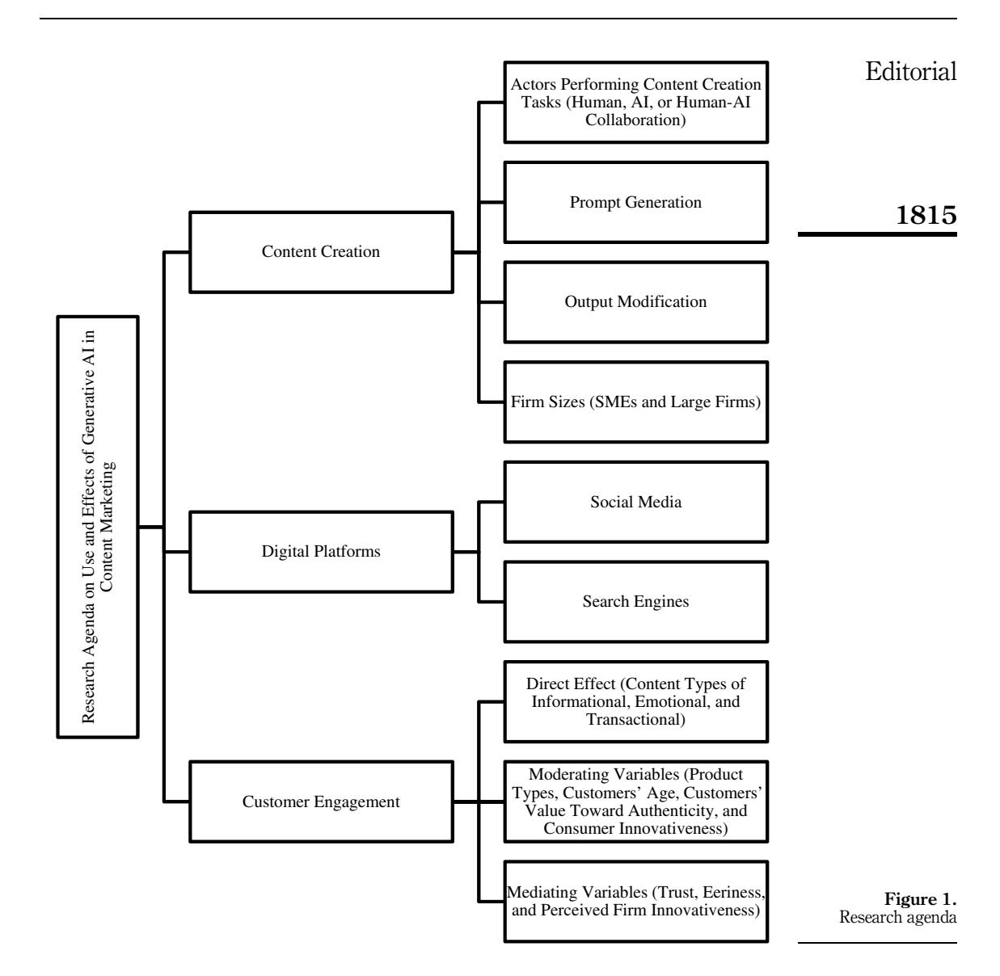

# Editorial: Written by ChatGPT, illustrated by Midjourney: generative AI for content marketing

Editorial

1813

#### 1. Introduction

Generative artificial intelligence (AI) represents a new generation of AI technologies that produces new digital content based on user-inserted prompts (De Cremer *et al.*, 2023). Via generative AI, users can simply tell the AI tool the type and nature of the outputs they want (e.g. a compelling email to potential customers, a summary of benefits of a product category or a sketch of a visual design), and the AI will generate the requested outputs. What is more, many of the generative AI tools are "conversational"—they allow the user to provide additional specifications and requests, based on which the output is further refined. Examples of generative AI applications include: (1) ChatGPT for writing texts (e.g. social media posts and website content), (2) Dall-E and Midjourney for creating realistic images and visual art, (3) Steve AI for producing videos and animations and (4) Boomy for making original music. These platforms have encountered great enthusiasm and record-breaking technology adaptation curves (e.g. within only one week of its launch, ChatGPT acquired more than a hundred million users, see Dowling and Lucey, 2023). The reasons for this enthusiasm are the wide-ranging accessibility of these platforms, user-friendly application interfaces, quick responses by the tools and users' perceived quality of the output.

ChatGPT and other generative AI applications are all about content generation, and thus they are particularly valuable for content marketing. Content marketing can be generally defined as the identification, creation and dissemination of valuable and digitized content to engage customers, with the final goal of enhancing marketing performance (Hollebeek and Macky, 2019; Holliman and Rowley, 2014; Terho *et al.*, 2022). To illustrate the value of generative AI in content creation, consider for example a business-to-business marketing software firm that wants to create content on Instagram. The firm can ask ChatGPT to write a caption with this prompt: "Write me a story about typical failures in online marketing and use the perspective of a small business owner." For the visual, the user may request Dall-E to create an image with the input of: "A picture in an abstract style of an unhappy business owner." Almost instantly, ChatGPT and Dall-E generate the outputs, and the user can further iterate with those until feasible content is created. It is clear that generative AI will change content marketing outcomes, given the efficiency, creativity and short production time involved in using these tools.

Although promising for content marketers, scholars have argued that AI could also provide suboptimal or even harmful implications for them (De Bruyn et al., 2020), and more recently, about challenges with generative AI for content quality, validation and intellectual property, for instance (Dwivedi et al., 2023). It also remains unclear what are the implications of generative AI for individual marketing professionals and organizational practices in

Asia Pacific Journal of Marketing and Logistics Vol. 35 No. 8, 2023 pp. 1813-1822 © Emerald Publishing Limited 1355-5855 DOI 10.1108/APJML-10-2023-994

Ethics approval: This article does not contain any studies with human participants performed by any of the authors. Therefore, no ethical approval or informed consent is needed.

*Conflict of interest:* The authors declare no competing interests.

APJML 35,8

**1814**

different contexts; after all, it is expected that generative AI tools will change all types of creative and knowledge work (De [Cremer](#page-7-0) *et al.*, 2023).

To understand the benefits and challenges of using generative AI in content marketing, we propose a research agenda to study how generative AI affects content creation, digital marketing platforms (e.g. social media and search engines) and customer engagement. The research agenda contributes to the content marketing literature by clearly outlining the three contexts in which generative AI can complement, augment or even replace content marketers' work, and by proposing a set of urgent research questions in this area.

# **2. Research agenda**

Literature on content marketing and social media content [\(Hollebeek](#page-7-0) and Macky, 2019; [Liadeli](#page-8-0) *et al.*, 2022; [Terho](#page-9-0) *et al.*, 2022; [Wahid](#page-9-0) *et al.*, 2023) is typically concerned about content creation processes, digital platforms where content is distributed and how content can influence customer engagement. Following this convention, we propose a research agenda on the use and effects of generative AI in content marketing focusing on three overarching facets of content creation, digital platforms and customer engagement. [Figure](#page-2-0) 1 depicts the research agenda framework.

# *2.1 The use of generative AI for content creation*

*2.1.1 Content creation tasks performed by generative AI and human labor.* In content marketing, content delivered to customers needs to be valuable, relevant, compelling ([Hollebeek](#page-7-0) and Macky, 2019) and frequent (Taiminen and [Karjaluoto,](#page-9-0) 2017). To ascertain that the content meets the requirements, content creation is often treated as a joint process involving several departments in an organization ([Terho](#page-9-0) *et al.*, 2022). Content marketers may collaborate with experts (e.g. interviewing top engineers who master particular topics) to create informational and knowledge-laden content (J€arvinen and [Taiminen,](#page-8-0) 2016). Marketers also append visual illustrations to make the whole content more attractive [\(Wahid](#page-9-0) and [Gunarto,](#page-9-0) 2022), where the design of the illustrations can be done by in-house design teams or external design agencies.

With the arrival and utilization of generative AI, the conventional content creation is likely to be augmented and transformed in multiple ways. For instance, generative AI may diminish or replace the experts' role as a source and creator of high quality content; consider, for instance, the ultra-realistic high definition "photographs" generated by the Midjourney AI tool. Indeed, generative AI may further take over (some of) the design teams' responsibility, where the production of images, animations, audio and videos is all or partly exercised by generative AI. In this current environment, we need to understand which content creation activities are performed by generative AI and which by humans to keep the whole content marketing effective and efficient. This aspect is a fundamental question of human–AI collaboration, and might lead to augmentation, automation or both (see also Raisch and [Krakowski,](#page-9-0) 2021). An approach to uncover the knowledge is by proposing the following research question (RQ): *What tasks are undertaken by generative AI, humans or a combination of both in content creation?*

*2.1.2 Prompt generation and output modification.* Specific to the generative AI's outputs, their quality depends on the prompts constructed by users (Van Dis *et al.*, [2023\)](#page-9-0). New job roles such as "prompt engineers" and tasks such as "prompt engineering" are increasingly mentioned among practitioners as the next generation skills.Thus, the RQrelating to content marketing is: *How can marketers design effective prompts for different content marketing purposes?* Content marketing studies need to document aspects considered by content marketers when developing generative AI prompts for content creation. After prompt

formulation, the next critical issue is assessing and implementing the output of generative AI. Sometimes, AI-generated content lacks accuracy (e.g. texts created by ChatGPT suffer from "hallucination effects" where the texts seem credible while in fact they are incorrect, see [Shen](#page-9-0) *et al.*, 2023) and displays visible flaws (e.g. hands looked deformed in a Midjourneyproduced image, see [Bhaimiya,](#page-7-0) 2023). There is also a possibility of a mismatch between AIgenerated content and creators' nuanced needs (Suh *et al.*, [2021\)](#page-9-0). Considering these weaknesses, content marketers need to evaluate AI-generated content and possibly modify it to ensure accuracy, quality and relevancy. Therefore, the RQs are: *How do marketers interpret and assess the appropriateness of AI-generated content for their content marketing? To what extent and how do marketers modify AI-generated content?*

*2.1.3 Firm sizes and their application of generative AI for content creation.* Large firms tend to have sufficient resources to develop successful content marketing strategies [\(Wahid](#page-9-0) *et al.*, [2022a](#page-9-0)). Opposing such a size advantage, SMEs encounter problems in exercising effective content due to their limited capabilities ([Kraus](#page-8-0) *et al.*, 2019). Research has also uncovered that SMEs tend to focus more on running their core business activities, and as such, they have limited time to formulate valuable content fortheir customers [\(Taiminen](#page-9-0) and [Karjaluoto,](#page-9-0) 2015). As indicated before, generative AI tools are relatively easy to operate and they are excellent for idea generation and instant content creation ([Pavlik,](#page-8-0) 2023). Generative AI can then potentially remove SMEs' knowledge and time limitations, therefore providing SMEs a lower barrier to entry to compete with larger industry incumbents. Appropriately implemented, generative AI may function as a powerful tool for SMEs to combat their larger firm counterparts. Pertaining to this outlook, we may inquire: *How can SMEs use generative AI to complement their sparse resources in content creation?* Additionally, given the discrepancies in resources and sizes, large firms and SMEs may create content using generative AI differently. For instance, while large firms can hire experts to check the accuracy of texts written by ChatGPT, SMEs may neglect this expert verification due to economic reasons. To this possibility, we may advance the RQ of: *How does generative-AIassisted content creation differ in large companies and SMEs?*

### *2.2 AI-generated content on digital platforms*

*2.2.1 Social media.* Content marketing and social media content scholars [\(Haenlein](#page-7-0) *et al.*, 2020; [Holliman](#page-8-0) and Rowley, 2014; [Wahid](#page-9-0) *et al.*, 2023) have strongly recommended avoiding the "onesize-fits-all" approach for content marketing on social media. Each medium has its own infrastructure and culture ([Voorveld](#page-9-0) *et al.*, 2018). For instance, while TikTok specializes in short videos, Twitter serves mostly as an arena for textual content. Due to this rationale, one type of content may succeed in one platform but fail in others (Wahid and [Gunarto,](#page-9-0) 2022). Grounded on this, AI-generated content may cause losses in one medium but generate benefits in others—due to reasons such as one social media application may be more capable than others in identifying whether content is created by humans or machines, and consequently, the particular social media's algorithm may favor human-produced content more than AI-created content, for example. Some platforms might also get crowded out by AI-generated content, effectively lowering the value of all content, or alternatively making unique and high quality content even more valuable. Informed by these prospects, we suggest the following question: *In which social media platform does generative AI bring the most benefits when used for content marketing?*

*2.2.2 Search engines.* Search engines such as Google and Bing may also be able to detect whether a piece of contentis AI-generated or human-made.The detection of AI-generated content could be due to its characteristics of being generic [\(Houde](#page-8-0) *et al.*, 2020) or containing misinformation [\(Pavlik,](#page-8-0) 2023). For instance, if attributed as machine-generated, search engines may consider the content as spam. Because of this and the search engines' algorithm which prioritizes quality over spammy content [\(Erdmann](#page-7-0) *et al.*, 2022), search engines may rank AIgenerated content last, and thus AI-generated content may adversely impact search engine optimization. Alternatively, AI-generated content might be tailored to fare well in terms of search engine optimization when appropriately prompted. We need to investigate this negative outlook because search engine optimization links with content marketing—being found by search engines is one form of content marketing strategy [\(Wahid](#page-9-0) *et al.*, 2023). The RQ for the investigation is: *What are the implications of AI-generated content on search engine optimization?*

*2.3 Relationships between AI-generated content and customer engagement* According to [Harmeling](#page-7-0) *et al.* (2017, p. 316), customer engagement is "*a customer's voluntary resource contribution to a firm's marketing function, going beyond financial patronage*". Examples of customer engagement include social media likes, word of mouth, reviews and feedback ([Harmeling](#page-7-0) *et al.*, 2017; [Meire](#page-8-0) *et al.*, 2019; [Pansari](#page-8-0) and Kumar, 2017). Customer engagement is imperative for businesses as it can affect gross advertising revenue, customer lifetime value and sales ([Kanuri](#page-8-0) *et al.*, 2018; [Meire](#page-8-0) *et al.*, 2019; [Saboo](#page-9-0) *et al.*, 2016). Streams of research on content marketing and social media content [\(Hollebeek](#page-7-0) and Macky, 2019; [Liadeli](#page-8-0) *et al.*, [2022](#page-8-0); [Terho](#page-9-0) *et al.*, 2022; [Wahid](#page-9-0) *et al.*, 2023) usually investigated how content can influence customer engagement. Motivated by this tradition and the effect of customer engagement on business performance, it would be necessary to examine the relationship between AI-generated content and customer engagement.

*2.3.1 Direct effects of AI-generated content on customer engagement.* Content marketing and social media contentresearch typically segregate content into three overarching types of informational, emotional and transactional [\(DeVries](#page-7-0) *et al.*, 2012; [Meire](#page-8-0) *et al.*, 2019;[Tellis](#page-9-0) *et al.*, [2019;](#page-9-0) [Wahid](#page-9-0) *et al.*, 2023). Informational content refers to the pieces of content that carry organizations' information-related messages in a nonpromotional fashion [\(Wahid](#page-9-0) *et al.*, [2023\)](#page-9-0). Examples of informational content include general information, news and tutorial ([Dolan](#page-7-0) *et al.*, 2019; [Wahid](#page-9-0) *et al.*, 2022b). Emotional content is those organizations' messages that are laden with affective elements aiming to elicit emotional or sensory experiences ([Meire](#page-8-0) *et al.*, 2019). Entertainment, charity and humor fall under the category of emotional content [\(Shahbaznezhad](#page-9-0) *et al.*, 2021; Wahid and [Gunarto,](#page-9-0) 2022). In the case of transactional content, it relates to content that is loaded with transactional messages, such as giveaways, donations and promotions [\(Shahbaznezhad](#page-9-0) *et al.*, 2021; [Wahid](#page-9-0) *et al.*, 2022b).

Generative AI can facilitate the creation of informational (e.g. ChatGPT writes a tutorial), emotional (e.g. Dall-E draws a funny image for memes), and transactional (e.g. ChatGPT creates texts for promotions) content. However, bearing in mind that generative AI has several weaknesses, content that is generated by the tool may affect customer engagement. For instance, AI-generated content is often inaccurate ([Pavlik,](#page-8-0) 2023). Imagine an organization that publishes an AI-generated social media post containing misinformation. Likes on the content may drop, and comments may escalate because customers react to the particular content negatively. Also, AI-generated content might be generic and boring ([Houde](#page-8-0) *et al.*, 2020). Thus, AI-generated emotional content may lack the necessary "human touch" that could lead to lower engagement. Alternatively, some AI tools might be able to help creating content that is even more engaging than the traditional content; the question remains open, and might vary across different content types and AI tools.Therefore, we need to empirically inquire these different possibilities via asking: *Do AI-generated content types of informational, emotional and transactional affect customer engagement?*

*2.3.2 Moderating variables on the relationship between AI-generated content and customer engagement.* Studies suggested that product types require different content strategies ([Dessart,](#page-7-0) 2017). Customers of high-involvement products actively search for information, and thus, firms' content should be information-laden (Barreto and [Ramalho,](#page-7-0) 2019). On the other hand, customers of low-involvement products engage more with visual cues and often neglect the information (Barreto and [Ramalho,](#page-7-0) 2019). This customer behavior signals that product types may moderate the relationship between AI-generated content and customer engagement. As an illustration, consider a healthy food brand as a high-involvement product, sharing an Instagram post with a lengthy caption explaining the benefits of vitamin C for skin. Customers of high-involvement products actively seek information to minimize risks [\(Dholakia,](#page-7-0) 2001), and imagine if they discoverthat the Instagram caption about vitamin C is generated by ChatGPT. As ChatGPToften produces incorrect information ([Pavlik,](#page-8-0) 2023), customers may disengage with the AI-generated content due to the likely misinformation and risks. Simultaneously, pictures fabricated by AI sometimes are imperfect (e.g. hands have a deformed look). If content marketers share the AI-generated pictures without alterations, customers of low-involvement products may disengage with AI-generated content because they care about visual cues. Content marketing scholars should empirically investigate these possibilities by advancing the RQ: *Do product types (low versus high involvement; and hedonic versus utilitarian) moderate the relationship between AI-generated content and customer engagement?*

In their exploratory survey, [Sands](#page-9-0) *et al.* (2022) found that younger customers are more receptive toward emerging technologies than older generations. Therefore, similar as for other emerging technologies, younger generations may have more positive sentiments toward generative AI than older people. Thus, we may propose the following RQ: *Doescustomers' age moderate the relationship between AI-generated content and customer engagement?*

Further, [Kreuzbauer](#page-8-0) and Keller (2017) suggested that human-made products have higher authenticity than machine-made products. The scholars also indicated that customers who seek authenticity favor more human-made than machine-produced products. Based on this insight, it is possible that customers' value toward authenticity negatively moderates the effect of AI-generated content on customer engagement. In particular, when customers' value toward authenticity is high, customer engagement with AI-generated content reduces due to the low authenticity attached to AI-generated content. It would be essential to inspect such a possibility with this RQ: *Doescustomers' value toward authenticity moderate the relationship between AI-generated content and customer engagement?*

Consumer innovativeness may also interact with AI-generated content in affecting customer engagement. Consumer innovativeness corresponds to consumers' tendency to consume new products or services ([Roehrich,](#page-9-0) 2004). Consumers with high innovativeness like to enjoy new technologies (Bhadauria and [Chennamaneni,](#page-7-0) 2022), and because of this, consumer innovativeness positively influences technology adoption (Lee *et al.*, [2021\)](#page-8-0). Underpinned by the same notion, due to the novelty of generative AI, consumers with high innovativeness may engage more with content created by generative AI than consumers with low innovativeness. The RQ for the hypothesis is: *Does consumer innovativeness moderate the relationship between AI-generated content and customer engagement?*

*2.3.3 Mediating variables on the relationship between AI-generated content and customer engagement.* The first mediation variable is trust. Chatbot research (Luo *et al.*, [2019\)](#page-8-0) suggested that humans perceive chatbots as less empathetic and knowledgeable. Because of this, customers have low trust toward chatbots—especially in highly critical services which eventually lowers customerretention ([Mozafari](#page-8-0) *et al.*, 2022). In line with this reasoning, as generative AI often spawns flawed and erroneous outputs [\(Pavlik,](#page-8-0) 2023), customers may distrust AI-generated content. This situation may cause negative effects on customer engagement. The second mediating construct is eeriness. In their extensive study, [Mende](#page-8-0) *et al.* [\(2019\)](#page-8-0) showed that customers experience a feeling of eeriness when they know that they are served by service robots. The explanation is that customers feel threatened by the robots. Eeriness eventually affects customers' perceptions and behavior. Customers may also experience eeriness when they view machine-made content. Customers may feel unease because nowmachines act human-like and they can take over human jobs in content creation. This may lead to an increase or decrease in customer engagement.The third mediating factor is perceived firm innovativeness. The concept of perceived firm innovativeness refers to a consumer's perception of a firm's capability to offer creative, novel and impactful solutions and ideas [\(Kunz](#page-8-0) *et al.*, 2011). Research ([Manchanda](#page-8-0) and Deb, 2021) has confirmed that perceived firm innovativeness positively mediates the relationship between a firm's innovative offerings and attitude. Considering generative AI's newness, organizations that deploy generative AI to create content may be perceived as innovative. Accordingly, AIgenerated content may influence perceived firm innovativeness, and perceived firm innovativeness affects customer engagement. All in all, we may test these three potential mediating effects by proposing the RQ of: *Do (1) trust, (2) eeriness and (3) perceived firm innovativeness mediate the relationship between AI-generated content and customer engagement?*

| Overarching theme                                                        | Specific topic                                                                                                          | Research questions                                                                                                                                                                                                                                                                                                                                                                                                                             | Editorial                                                                                  |
|--------------------------------------------------------------------------|-------------------------------------------------------------------------------------------------------------------------|------------------------------------------------------------------------------------------------------------------------------------------------------------------------------------------------------------------------------------------------------------------------------------------------------------------------------------------------------------------------------------------------------------------------------------------------|--------------------------------------------------------------------------------------------|
| The use of generative AI for content creation                         | Content creation tasks performed by generative AI and human labor Prompt generation and output modification | What tasks are undertaken by generative AI, humans, or a combination of both in content creation? How can marketers design effective prompts for different content marketing purposes? How do marketers interpret and assess the appropriateness of AI-generated content for their content marketing?                                                                                                                  | 1819                                                                                       |
|                                                                          | Firm sizes and their application of generative AI for content creation                                            | To what extent and how do marketers modify AI-generated content? How can SMEs use generative AI to complement their sparse resources in content creation? How does generative-AI-assisted content creation differ in large companies and                                                                                                                                                                                     |                                                                                            |
| AI-generated content on social media and search engines               | Social media                                                                                                            | SMEs? In which social media platform does generative AI bring the most benefits when                                                                                                                                                                                                                                                                                                                                                     |                                                                                            |
|                                                                          | Search engines                                                                                                          | used for content marketing? What are the implications of AI-generated                                                                                                                                                                                                                                                                                                                                                                       |                                                                                            |
| Relationships between AI generated content and customer engagement | Direct effects                                                                                                          | content on search engine optimization? Do AI-generated content types of informational, emotional and transactional affect customer engagement?                                                                                                                                                                                                                                                                                        |                                                                                            |
|                                                                          | Moderating variables Mediating variables                                                                             | Do (1) product types (low versus high involvement; and hedonic versus utilitarian), (2) customers' age, (3) customers' value toward authenticity and (4) consumer innovativeness moderate the relationship between AI-generated content and customer engagement? Do (1) trust, (2) eeriness and (3) perceived firm innovativeness mediate the relationship between AI-generated content and customer engagement? | Table 1. Directions for future research on generative AI for content marketing |

# **3. Conclusion**

Google, Microsoft and other influential technology companies are investing massively in generative AI ([Leswing,](#page-8-0) 2022). Such investment is likely to promote both adoption and competition over this novel technology. As a result, providers and varieties of digital content (e.g. texts, pictures, videos, and audio) of generative AI will grow in number and quality. As we live in "the era of content"—where content is king and content is everywhere—we predict that the usage of generative AI for content marketing is both inevitable as it is transformative. The research agenda formulated in this article responds to the urgent theoretical, managerial and societal needs to investigate the opportunities and drawbacks of deploying generative AI for content marketing (see the summary of the future research directions in [Table](#page-6-0) 1).

**Risqo Wahid, Joel Mero and Paavo Ritala**

# **References**

- Barreto, A.M. and Ramalho, D. (2019), "The impact of involvement on engagement with brand posts", *Journal of Research in Interactive Marketing*, Vol. 13 No. 3, pp. 277-301, doi: [10.1108/JRIM-01-](https://doi.org/10.1108/JRIM-01-2018-0013) [2018-0013](https://doi.org/10.1108/JRIM-01-2018-0013).
- Bhadauria, V.S. and Chennamaneni, A. (2022), "Do desire, anxiety and personal innovativeness impact the adoption of IoT devices?", *Information and Computer Security*, Vol. 30 No. 5, pp. 730-750, doi: [10.1108/ICS-07-2021-0096](https://doi.org/10.1108/ICS-07-2021-0096).
- Bhaimiya, S. (2023), "'Plasticky, hyper-realistic': If you fell for the viral, AI-generated image of Pope Francis in a white puffer, here are the tell-tale signs", Insider, available at: [https://www.](https://www.businessinsider.com/viral-image-pope-francis-generated-by-ai-fooled-social-media-2023-3?r=US&IR=T) [businessinsider.com/viral-image-pope-francis-generated-by-ai-fooled-social-media-2023-3?](https://www.businessinsider.com/viral-image-pope-francis-generated-by-ai-fooled-social-media-2023-3?r=US&IR=T) r5[US&IR](https://www.businessinsider.com/viral-image-pope-francis-generated-by-ai-fooled-social-media-2023-3?r=US&IR=T)5T
- De Bruyn, A., Viswanathan, V., Beh, Y.S., Brock, J. K.-U. and Von Wangenheim, F. (2020), "Artificial intelligence and marketing: pitfalls and opportunities", *Journal of Interactive Marketing*, Vol. 51, pp. 91-105, doi: [10.1016/j.intmar.2020.04.007](https://doi.org/10.1016/j.intmar.2020.04.007).
- De Cremer, D., Bianzino, N.M. and Falk, B. (2023), "How generative AI could disrupt creative work", *Harvard Business Review*, available at: [https://hbr.org/2023/04/how-generative-ai-could-disrupt](https://hbr.org/2023/04/how-generative-ai-could-disrupt-creative-work#:~:text=In%20this%20scenario%2C%20generative%20AI,less%20new%20art%20and%20content)creative-work#:∼:text5[In%20this%20scenario%2C%20generative%20AI,less%20new%](https://hbr.org/2023/04/how-generative-ai-could-disrupt-creative-work#:~:text=In%20this%20scenario%2C%20generative%20AI,less%20new%20art%20and%20content) [20art%20and%20content](https://hbr.org/2023/04/how-generative-ai-could-disrupt-creative-work#:~:text=In%20this%20scenario%2C%20generative%20AI,less%20new%20art%20and%20content)
- De Vries, L., Gensler, S. and Leeflang, P.S.H. (2012), "Popularity of brand posts on brand fan pages: an investigation of the effects of social media marketing", *Journal of Interactive Marketing*, Vol. 26 No. 2, pp. 83-91, doi: [10.1016/j.intmar.2012.01.003.](https://doi.org/10.1016/j.intmar.2012.01.003)
- Dessart, L. (2017), "Social media engagement: a model of antecedents and relational outcomes", *Journal of Marketing Management*, pp. 1-25, doi: [10.1080/0267257X.2017.1302975.](https://doi.org/10.1080/0267257X.2017.1302975)
- Dholakia, U.M. (2001), "A motivational process model of product involvement and consumer risk perception", *European Journal of Marketing*, Vol. 35 Nos 11/12, pp. 1340-1362, doi: [10.1108/](https://doi.org/10.1108/EUM0000000006479) [EUM0000000006479.](https://doi.org/10.1108/EUM0000000006479)
- Dolan, R., Conduit, J., Frethey-Bentham, C., Fahy, J. and Goodman, S. (2019), "Social media engagement behavior: a framework for engaging customers through social media content", *European Journal of Marketing*, Vol. 53 No. 10, pp. 2213-2243, doi: [10.1108/EJM-03-2017-0182](https://doi.org/10.1108/EJM-03-2017-0182).
- Dowling, M. and Lucey, B. (2023), "ChatGPT for (finance) research: the bananarama conjecture", *Finance Research Letters*, Vol. 53, 103662, doi: [10.1016/j.frl.2023.103662](https://doi.org/10.1016/j.frl.2023.103662).
- Dwivedi, Y.K., Kshetri, N., Hughes, L., Slade, E.L., Jeyaraj, A., Kar, A.K., Baabdullah, A.M., Koohang, A., Raghavan, V., Ahuja, M., Albanna, H., Albashrawi, M.A., Al-Busaidi, A.S., Balakrishnan, J., Barlette, Y., Basu, S., Bose, I., Brooks, L., Buhalis, D. and Wright, R. (2023), "So what if ChatGPT wrote it?" multidisciplinary perspectives on opportunities, challenges and implications of generative conversational AI for research, practice and policy", *International Journal of Information Management*, Vol. 71, 102642, doi: [10.1016/j.ijinfomgt.2023.102642.](https://doi.org/10.1016/j.ijinfomgt.2023.102642)
- Erdmann, A., Arilla, R. and Ponzoa, J.M. (2022), "Search engine optimization: the long-term strategy of keyword choice", *Journal of Business Research*, Vol. 144, pp. 650-662, doi: [10.1016/j.jbusres.](https://doi.org/10.1016/j.jbusres.2022.01.065) [2022.01.065](https://doi.org/10.1016/j.jbusres.2022.01.065).
- Haenlein, M., Anadol, E., Farnsworth, T., Hugo, H., Hunichen, J. and Welte, D. (2020), "Navigating the new era of influencer marketing: how to be successful on Instagram, TikTok, & Co", *California Management Review*, Vol. 63 No. 1, pp. 5-25, doi: [10.1177/0008125620958166.](https://doi.org/10.1177/0008125620958166)
- Harmeling, C.M., Moffett, J.W., Arnold, M.J. and Carlson, B.D. (2017), "Toward a theory of customer engagement marketing", *Journal of the Academy of Marketing Science*, Vol. 45 No. 3, pp. 312-335, doi: [10.1007/s11747-016-0509-2.](https://doi.org/10.1007/s11747-016-0509-2)
- Hollebeek, L.D. and Macky, K. (2019), "Digital content marketing's role in fostering consumer engagement, trust, and value: framework, fundamental propositions, and implications", *Journal of Interactive Marketing*, Vol. 45, pp. 27-41, doi: [10.1016/j.intmar.2018.07.003](https://doi.org/10.1016/j.intmar.2018.07.003).

- Holliman, G. and Rowley, J. (2014), "Business to business digital content marketing: marketers' perceptions of best practice", *Journal of Research in Interactive Marketing*, Vol. 8 No. 4, pp. 269-293, doi: [10.1108/JRIM-02-2014-0013](https://doi.org/10.1108/JRIM-02-2014-0013).
- Houde, S., Liao, V., Martino, J., Muller, M., Piorkowski, D., Richards, J., Weisz, J. and Zhang, Y. (2020), "Business (mis)use cases of generative AI", arXiv:2003.07679). arXiv, available at: [http://arxiv.](http://arxiv.org/abs/2003.07679) [org/abs/2003.07679](http://arxiv.org/abs/2003.07679)
- J€arvinen, J. and Taiminen, H. (2016), "Harnessing marketing automation for B2B content marketing", *Industrial Marketing Management*, Vol. 54, pp. 164-175, doi: [10.1016/j.indmarman.2015.07.002](https://doi.org/10.1016/j.indmarman.2015.07.002).
- Kanuri, V.K., Chen, Y., Sridhar, S. and Hari) (2018), "Scheduling content on social media: theory, evidence, and application", *Journal of Marketing*, Vol. 82 No. 6, pp. 89-108, doi: [10.1177/](https://doi.org/10.1177/0022242918805411) [0022242918805411.](https://doi.org/10.1177/0022242918805411)
- Kraus, S., Gast, J., Schleich, M., Jones, P. and Ritter, M. (2019), "Content is king: how SMEs create content for social media marketing under limited resources", *Journal of Macromarketing*, Vol. 39 No. 4, pp. 415-430, doi: [10.1177/0276146719882746.](https://doi.org/10.1177/0276146719882746)
- Kreuzbauer, R. and Keller, J. (2017), "The authenticity of cultural products: a psychological perspective", *Current Directions in Psychological Science*, Vol. 26 No. 5, pp. 417-421, doi: [10.](https://doi.org/10.1177/0963721417702104) [1177/0963721417702104.](https://doi.org/10.1177/0963721417702104)
- Kunz, W., Schmitt, B. and Meyer, A. (2011), "How does perceived firm innovativeness affect the consumer?", *Journal of Business Research*, Vol. 64 No. 8, pp. 816-822, doi: [10.1016/j.jbusres.2010.](https://doi.org/10.1016/j.jbusres.2010.10.005) [10.005.](https://doi.org/10.1016/j.jbusres.2010.10.005)
- Lee, Y., Lee, S. and Kim, D.-Y. (2021), "Exploring hotel guests' perceptions of using robot assistants", *Tourism Management Perspectives*, Vol. 37, 100781, doi: [10.1016/j.tmp.2020.100781.](https://doi.org/10.1016/j.tmp.2020.100781)
- Leswing, K. (2022), *Why Silicon Valley Is So Excited about Awkward Drawings Done by Artificial Intelligence*, CNBC, available at: [https://www.cnbc.com/2022/10/08/generative-ai-silicon-valleys](https://www.cnbc.com/2022/10/08/generative-ai-silicon-valleys-next-trillion-dollar-companies.html)[next-trillion-dollar-companies.html](https://www.cnbc.com/2022/10/08/generative-ai-silicon-valleys-next-trillion-dollar-companies.html)
- Liadeli, G., Sotgiu, F. and Verlegh, P.W.J. (2022), "A meta-analysis of the effects of brand owned social media on social media engagement and sales", *Journal of Marketing*, doi: [10.1177/](https://doi.org/10.1177/00222429221123250) [00222429221123250.](https://doi.org/10.1177/00222429221123250)
- Luo, X., Tong, S., Fang, Z. and Qu, Z. (2019), "Frontiers: machines vs Humans: the impact of artificial intelligence chatbot disclosure on customer purchases", *Marketing Science*, Vol. 38 No. 6, pp. 937-947, doi: [10.1287/mksc.2019.1192.](https://doi.org/10.1287/mksc.2019.1192)
- Manchanda, M. and Deb, M. (2021), "On m-commerce adoption and augmented reality: a study on apparel buying using m-commerce in Indian context", *Journal of Internet Commerce*, Vol. 20 No. 1, pp. 84-112, doi: [10.1080/15332861.2020.1863023.](https://doi.org/10.1080/15332861.2020.1863023)
- Meire, M., Hewett, K., Ballings, M., Kumar, V. and Van Den Poel, D. (2019), "The role of marketergenerated content in customer engagement marketing", *Journal of Marketing*, Vol. 83 No. 6, pp. 21-42, doi: [10.1177/0022242919873903.](https://doi.org/10.1177/0022242919873903)
- Mende, M., Scott, M.L., Van Doorn, J., Grewal, D. and Shanks, I. (2019), "Service robots rising: how humanoid robots influence service experiences and elicit compensatory consumer responses", *Journal of Marketing Research*, Vol. 56 No. 4, pp. 535-556, doi: [10.1177/0022243718822827.](https://doi.org/10.1177/0022243718822827)
- Mozafari, N., Weiger, W.H. and Hammerschmidt, M. (2022), "Trust me, I'm a bot repercussions of chatbot disclosure in different service frontline settings", *Journal of Service Management*, Vol. 33 No. 2, pp. 221-245, doi: [10.1108/JOSM-10-2020-0380](https://doi.org/10.1108/JOSM-10-2020-0380).
- Pansari, A. and Kumar, V. (2017), "Customer engagement: the construct, antecedents, and consequences", *Journal of the Academy of Marketing Science*, Vol. 45 No. 3, pp. 294-311, doi: [10.1007/s11747-016-0485-6.](https://doi.org/10.1007/s11747-016-0485-6)
- Pavlik, J.V. (2023), "Collaborating with ChatGPT: considering the implications of generative artificial intelligence for journalism and media education", *Journalism and Mass Communication Educator*, Vol. 78 No. 1, pp. 84-93, doi: [10.1177/10776958221149577](https://doi.org/10.1177/10776958221149577).

- Raisch, S. and Krakowski, S. (2021), "Artificial intelligence and management: the automationaugmentation paradox", *Academy of Management Review*, Vol. 46 No. 1, pp. 192-210.
- Roehrich, G. (2004), "Consumer innovativeness", *Journal of Business Research*, Vol. 57 No. 6, pp. 671-677, doi: [10.1016/S0148-2963\(02\)00311-9.](https://doi.org/10.1016/S0148-2963(02)00311-9)
- Saboo, A.R., Kumar, V. and Ramani, G. (2016), "Evaluating the impact of social media activities on human brand sales", *International Journal of Research in Marketing*, Vol. 33 No. 3, pp. 524-541, doi: [10.1016/j.ijresmar.2015.02.007](https://doi.org/10.1016/j.ijresmar.2015.02.007).
- Sands, S., Ferraro, C., Demsar, V. and Chandler, G. (2022), "False idols: unpacking the opportunities and challenges of falsity in the context of virtual influencers", *Business Horizons*, Vol. 65 No. 6, pp. 777-788, doi: [10.1016/j.bushor.2022.08.002](https://doi.org/10.1016/j.bushor.2022.08.002).
- Shahbaznezhad, H., Dolan, R. and Rashidirad, M. (2021), "The role of social media content format and platform in users' engagement behavior", *Journal of Interactive Marketing*, Vol. 53, pp. 47-65, doi: [10.1016/j.intmar.2020.05.001](https://doi.org/10.1016/j.intmar.2020.05.001).
- Shen, Y., Heacock, L., Elias, J., Hentel, K.D., Reig, B., Shih, G. and Moy, L. (2023), "ChatGPT and other large language models are double-edged swords", *Radiology*.
- Suh, M.(M)., Youngblom, E., Terry, M. and Cai, C.J. (2021), "AI as social glue: uncovering the roles of deep generative AI during social music composition", *Proceedings of the 2021 CHI Conference on Human Factors in Computing Systems*, pp. 1-11, doi: [10.1145/3411764.3445219](https://doi.org/10.1145/3411764.3445219).
- Taiminen, H.M. and Karjaluoto, H. (2015), "The usage of digital marketing channels in SMEs", *Journal of Small Business and Enterprise Development*, Vol. 22 No. 4, pp. 633-651, doi: [10.1108/](https://doi.org/10.1108/JSBED-05-2013-0073) [JSBED-05-2013-0073.](https://doi.org/10.1108/JSBED-05-2013-0073)
- Taiminen, K. and Karjaluoto, H. (2017), "Examining the performance of brand-extended thematiccontent: the divergent impact of avid- and skim-reader groups", *Computers in Human Behavior*, Vol. 72, pp. 449-458, doi: [10.1016/j.chb.2017.02.052](https://doi.org/10.1016/j.chb.2017.02.052).
- Tellis, G.J., MacInnis, D.J., Tirunillai, S. and Zhang, Y. (2019), "What drives virality (sharing) of online digital content? The critical role of information, emotion, and brand prominence", *Journal of Marketing*, Vol. 83 No. 4, pp. 1-20, doi: [10.1177/0022242919841034.](https://doi.org/10.1177/0022242919841034)
- Terho, H., Mero, J., Siutla, L. and Jaakkola, E. (2022), "Digital content marketing in business markets: activities, consequences, and contingencies along the customer journey", *Industrial Marketing Management*, Vol. 105, pp. 294-310, doi: [10.1016/j.indmarman.2022.06.006](https://doi.org/10.1016/j.indmarman.2022.06.006).
- Van Dis, E.A.M., Bollen, J., Zuidema, W., Van Rooij, R. and Bockting, C.L. (2023), "ChatGPT: five priorities for research", *Nature*, Vol. 614 No. 7947, pp. 224-226, doi: [10.1038/d41586-023-00288-7](https://doi.org/10.1038/d41586-023-00288-7).
- Voorveld, H.A.M., Van Noort, G., Muntinga, D.G. and Bronner, F. (2018), "Engagement with social media and social media advertising: the differentiating role of platform type", *Journal of Advertising*, Vol. 47 No. 1, pp. 38-54, doi: [10.1080/00913367.2017.1405754](https://doi.org/10.1080/00913367.2017.1405754).
- Wahid, R.M. and Gunarto, M. (2022), "Factors driving social media engagement on Instagram: evidence from an emerging market", *Journal of Global Marketing*, Vol. 35 No. 2, pp. 169-191, doi: [10.1080/08911762.2021.1956665](https://doi.org/10.1080/08911762.2021.1956665).
- Wahid, R., Karjaluoto, H. and Taiminen, K. (2022a), "Customer engagement enhancement on Instagram: strategies for small and medium enterprises", *Sustainable Business Concepts and Practices*, pp. 1450-1453.
- Wahid, R., Karjaluoto, H. and Taiminen, K. (2022b), "How to engage customers on TikTok?".
- Wahid, R., Karjaluoto, H., Taiminen, K. and Asiati, D.I. (2023), "Becoming TikTok famous: strategies for global brands to engage consumers in an emerging market", *Journal of International Marketing*, Vol. 31 No. 1, pp. 106-123, doi: [10.1177/1069031X221129554](https://doi.org/10.1177/1069031X221129554).