# Martech for 2025

### by Scott Brinker and Frans Riemersma

Sponsored by:

### Authors

Scott Brinker is the editor of the [chiefmartec](https://chiefmartec.com/) blog, covering the intersection of marketing and technology for over 15 years. He serves as the vice president of platform ecosystem at HubSpot. He is also the author of the best-selling book Hacking Marketing and co-author of The New Automation Mindset. He jointly produces the [MartechMap](https://martechmap.com/) marketing technology landscape with Frans.

Frans Riemersma founded [MartechTribe](https://www.martechtribe.com/), a company specializing in Martech research and benchmarking. With 30+ years in consultancy, he combines qualitative expertise with quantitative Martech data on stacks, vendors, and requirements in a proprietary Martech Data Warehouse. He is the author of A Small Book on Customer Technology and co-author of Marketing Tech Monitor, Customer Technology Sector Trends, and Hello Firstname. In collaboration with Scott, he also coproduces the [MartechMap,](https://martechmap.com/) an overview of the marketing technology landscape.

### Sponsors

This report is sponsored by [GrowthLoop,](https://www.growthloop.com/) [Hightouch](https://hightouch.com/), [MetaRouter](https://www.metarouter.io/), [Progress,](https://www.progress.com/) and [SAS](https://www.sas.com/en_gb/home.html#).

### Content

| Introduction                                                                                                                                                                                                                                                                                                       | 1                           |
|--------------------------------------------------------------------------------------------------------------------------------------------------------------------------------------------------------------------------------------------------------------------------------------------------------------------|-----------------------------|
| 1. How AI is Reshaping the Marketing and                                                                                                                                                                                                                                                                           |                             |
| Martech Environment                                                                                                                                                                                                                                                                                                | 6                           |
| GenAI Boosts Martech Growth in 5 Segments The First 3 Segments: Indie Tools, Incumbent and Challenger Platforms                                                                                                                                                                                              | 7 10                     |
| The 4th Segment: Instant Software The 5th Segment: Service-as-a-Software                                                                                                                                                                                                                                        | 17 25                    |
| 2. Foundations for an AI Strategy                                                                                                                                                                                                                                                                                  | 29                          |
| The Evolving Universal Data Layer The (Underdeveloped) Universal Content Layer API Composability as AI Agent Building Blocks                                                                                                                                                                                 | 29 33 36              |
| 3. How Marketers Are Using GenAI Today                                                                                                                                                                                                                                                                             | 43                          |
| Popular Martech GenAI Use Cases New AI Tools vs. AI Embedded in Current Martech Tools Frequency of GenAI Tool Usage by Use Case Generative AI Policy and Impact on Usage Demographics of Survey Respondents                                                                                            | 44 49 54 59 62  |
| Five Perspectives on Martech for 2025                                                                                                                                                                                                                                                                              | 64                          |
| GrowthLoop: End-to-End Marketing on Your Data Cloud with AI Hightouch: Why the Next Wave Beyond CDPs is AI Decisioning Metarouter: A CDP's Best Friend: "Shifting Left" Data Quality Progress: Lessons of Composability for Marketing Operations SAS: Filling the Gaps in Governance for Generative AI | 64 74 86 93 101 |

### Introduction

We are absolutely at a place where, if AI development completely stopped, we would still have 5-10 years of rapid change absorbing the capabilities of current models and integrating them into organizations and social systems.

I don't think development is going to stop, though.

– Ethan Mollick, The Wharton School

Is AI overhyped? Yes.

Is AI a massive disruptor? Also yes.

The logic to that seeming paradox is Amara's Law: we tend to overestimate the effect of a technology in the short run and underestimate its effect in the long run.

Pets.com and Webvan, epically failed dot-com businesses from the late 1990's, overestimated e-commerce in the short run. At the peak of the dot-com boom in 1999, worldwide e-commerce transactions totaled ~\$100 billion, a mere 0.3% of the world's GDP.

But by the end of 2018, global ecommerce totaled ~\$25.6 trillion1 — B2B and B2C combined — a whopping 29.7% of the ~\$86.2 trillion2 global GDP.

Amazon went from being a \$5 billion company in 2001, its future deeply discounted by Wall Street, to now being the 5th largest company in the world with a market cap of \$1.8 trillion.

How many of you, back in 1999 expected Amazon to reach that scale? Did you invest? Did you hold on to your investment through the dot-com crash?

1 <https://unctad.org/fr/isar/news/global-e-commerce-hits-256-trillion-latest-unctad-estimates>

2 <https://www.statista.com/statistics/268750/global-gross-domestic-product-gdp/>

And if so, are you reading this report from your boat with a shoddy connection in the tropics, three months after we published it?3

That's Amara's Law.

Amara's Law has repeated itself time and again throughout the history of technology. Grand expectations when a new innovation first appears, quickly hyped to an extreme. Disappointment when those expectations fail to materialize quickly. But steadily the technology grows, improves, and is adopted in more and more applications. Until one day, years later, its scale and impact far exceeds the grandest expectations that we hoped for at its beginning.

If you were to visualize Amara's Law on a graph, it would look a little like — or a lot alike — Gartner's famous Hype Cycle:

#### The Hype Cycle

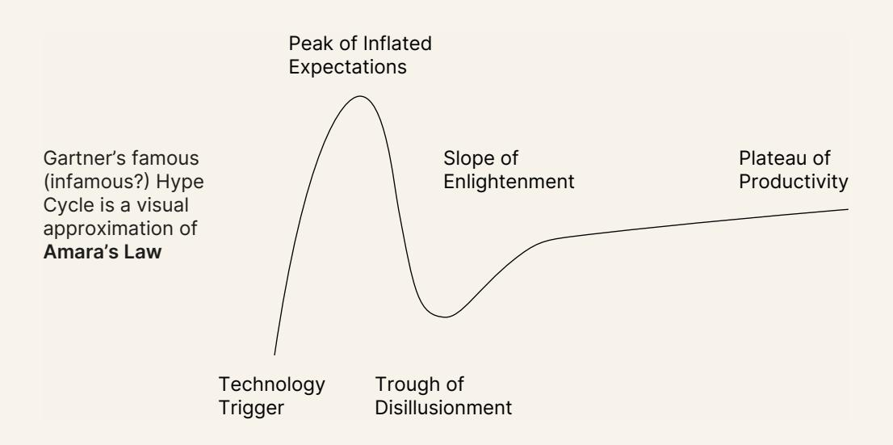

Source: Gartner/chiefmartec

The thing to remember about the Hype Cycle, of course, is that it's a measure of hype — not a measure of the underlying technology. While the hype bobs wildly up and down, the technology behind it steadily marches forward.

3 A nod to JP Castlin's excellent [Strategy in Praxis](https://strategyinpraxis.substack.com/) newsletter.

#### The Hype Cycle and Technology Development

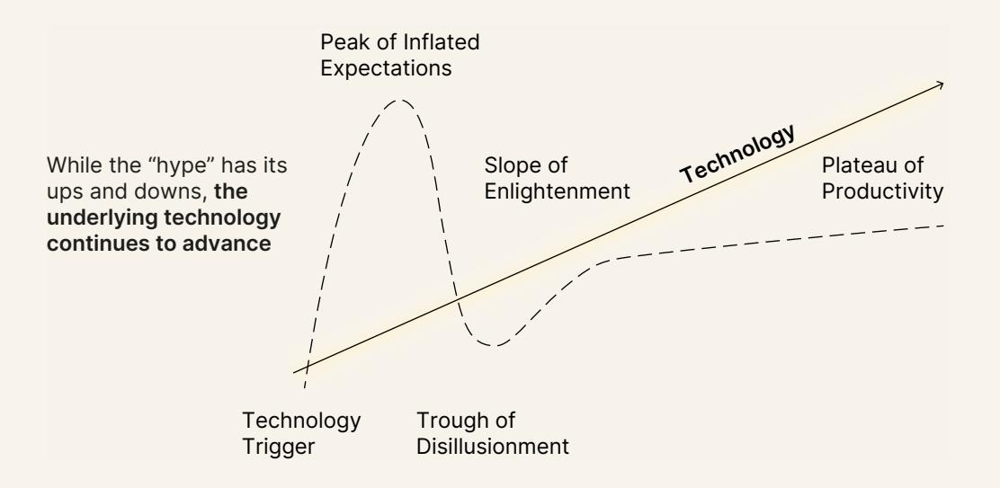

Source: chiefmartec

The only difference with Amara's Law is that "Plateau of Productivity" isn't the summit. It's a stop along the way, followed by another climb upwards — often with its own squiggly hype curve — followed by another, and another, and so on. That ascent over decades took us from the 3-ton mainframes of the 1960's to having 10 million times more computing power in the palm of your hand with today's mobile phones.

As you've no doubt surmised, this is the journey we're on with AI.

But there are a couple of key differences this time.

First, the rate of change is much, much faster. In previous reports, we described this as the compression of the Hype Cycle. A pattern that used to take 5-10 years to play out, from technology trigger to productivity plateau, now happens in half that time. ChatGPT is barely 2 years old, yet it already has over 200 million users per week.

Second, AI is not really a single Hype Cycle, but a multitude of them, all at different stages, many entangled with each other. "Generative AI" is a massively large field with different use cases all at different stages of maturity. All of them inherit advances in the rapidly improving foundation models from OpenAI, Anthropic, Google, Meta, etc. Yet they each have their own technology innovations wrapped around them.

#### Applications of Generative AI

#### Prompt to ChatGTP:

"Generate a tree diagram for me of the many different ways in which generative AI is being applied."

And generative AI itself is just one part of a larger AI universe, where the myriad of machine learning (ML) techniques and applications have been advancing for years. Useful applications of ML are already embedded in almost every software product you use today. With greater scale of data and computing power, the capabilities of ML continue to grow at the exponential rate of Moore's Law.

All of this combines to make it very difficult to say, "AI is overhyped." Some of it is, for sure. But much of it is already being deployed throughout marketing, with new functionality and use cases continually being added to the repertoire of modern marketing.

Quoting Ethan Mollick, one of the leading observers of AI's evermorphing abilities, even "if AI development completely stopped, we would still have 5-10 years of rapid change absorbing the capabilities of current models and integrating them into organizations and social systems."

But it's not going to stop.

Welcome to Martech for 2025.

### 1. How AI is Reshaping the Marketing and Martech Environment

It's like riding a roller coaster, isn't it?

Being a marketer in this AI era brings a flood of mixed emotions. The thrill of an exhilarating new ride. The nervous excitement from not knowing what's around the next curve. The anxiety as you consider the possibility that the whole thing might just fly off the rails — and possibly take your career with it.

Yet you've already purchased your ticket, climbed on the trolley, and are being dragged up the lift hill. Too late to turn back now.

AI is reshaping marketing and martech. And while we're not prone to hyperbole, we do believe there will be significant real-world changes that marketers and marketing operations leaders will have to face with this technology in 2025.

So while consciously avoiding a bunch of bull-slinging, here's the martech environment for AI that we see now and expect in the year ahead.

# GenAI Boosts Martech Growth in 5 Segments

#### Number of Martech Software Apps Since 2011

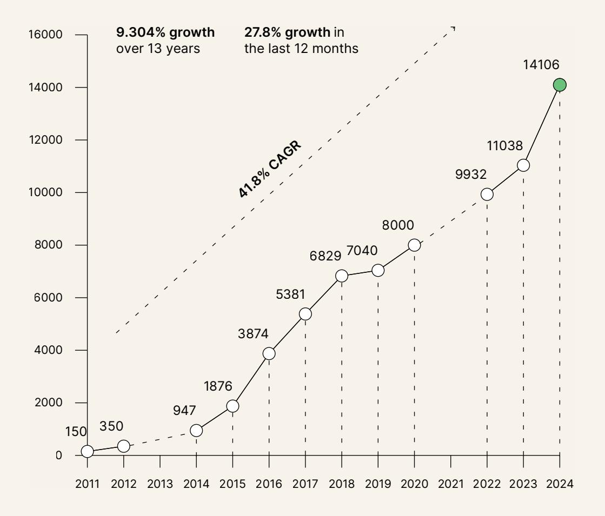

Source: chiefmartec & MartechTribe

In our [State of Martech 2024](https://chiefmartec.com/wp-content/uploads/2024/05/state-of-martech-2024-report.pdf) report in May of this year, we revealed our (in)famous marketing technology landscape had grown a whopping 27.8% from 2023 to 2024. The total number of martech tools we tracked grew from 11,038 to 14,108 in just one year.

The vast majority of this growth came from an explosion of AI-powered specialist tools in the "long tail" of the market:

#### New Al Products in 2024

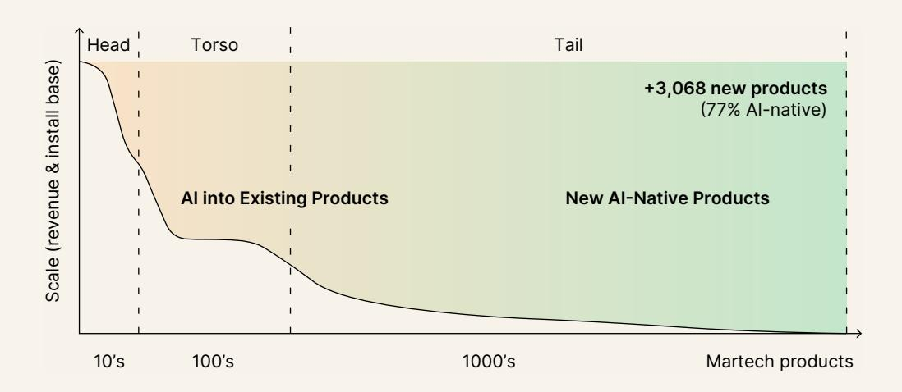

Source: chiefmartec & MartechTribe

Top 14 New GenAl Based Tools in Martech

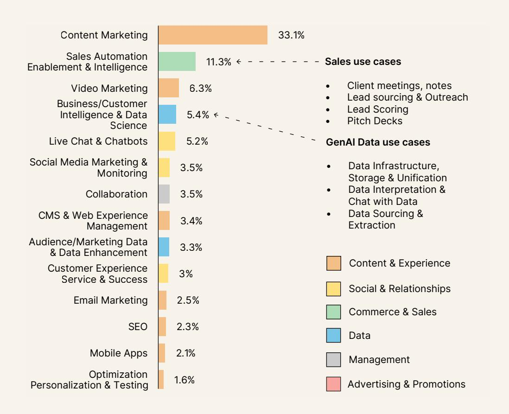

Source: MartechTribe

We tracked 2,324 new AI-native products, most of them in the content marketing and sales automation categories. And that didn't include hundreds of custom GPTs in OpenAI's GPT Store focused on marketing use cases. Consolidation continued to happen elsewhere in the market. But the number of new martech solutions being tracked far exceeded the number that went away.

The martech landscape continues to be a seeming paradox of simultaneous consolidation on one end of the spectrum and new growth on the other. As F. Scott Fitzgerald famously wrote, "The test of a first-rate intelligence is the ability to hold two opposed ideas in the mind at the same time, and still retain the ability to function."

That's been the martech motto.

But will AI ultimately break that pattern?

# The First 3 Segments: Indie Tools, Incumbent and Challenger Platforms

Of course, it's not just new martech products providing AI functionality to marketers.

The past year has seen a frantic rush by existing martech companies to add new AI capabilities to their products. Adobe, HubSpot, Microsoft, Salesforce, SAS, etc. all added a slew of new features with generative AI — as well as more features leveraging good, old-fashioned analytical AI with machine learning.

Through one lens, this sets up a repeat of the age-old struggle of startups vs. incumbents. The "head" of the martech long tail — the dominant martech platforms of the past decade — and the thinly stretched "tail" of new martech startups are competing as they always have. AI just happens to be the field of battle today.

But we think there's an important nuance here.

#### Indie Tools, Challenger and Incumbent Platforms

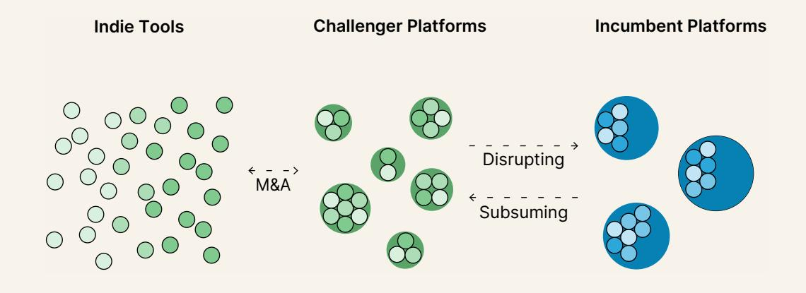

Source: chiefmartec & MartechTribe

Only a relatively small percentage of these AI-native startups are intentionally trying to compete with the incumbents. Most are just experimenting with what generative AI engines from OpenAI, Google, Anthropic, Meta, and others now make possible. They're building small, stand-alone tools that complement existing platforms by automating or augmenting tasks that marketers have done manually around those platforms.

#### Examples include:

- [Headlime](https://headlime.com/) AI-powered marketing copywriting with templates
- [browse.ai](https://www.browse.ai/) AI-powered web site scraper for data and monitoring
- [tl;dv](https://tldv.io/) AI-powered notetaker for Zoom, Google Meet, MS Teams
- [Vizly](https://vizly.fyi/) AI-powered data analysis and visualization
- [Howler AI](https://www.howler.media/) AI-powered personalized intro lines for sales reps
- [SpeakAI.co](https://speakai.co/) AI-powered transcription and translation

We call these indie tools because many of them have little or no institutional VC funding. (It's remarkable how much can be built so quickly with so little investment now — a point we'll come back to in a little bit.)

Not only are most indie tools not trying to compete with the large incumbent platforms. Many are actually seeking to leverage and integrate with them in their ecosystems. Hugh Durkin, the founder of AppMarketplace.com, a service that tracks app ecosystems across B2B platforms, has [reported an explosion of "AI" tools](https://www.linkedin.com/posts/hughdurkin_lots-of-well-deserved-hype-around-hubspots-activity-7251589275769556993-Yh3S/) added to these marketplaces this year.

#### Non-AI vs. AI Apps

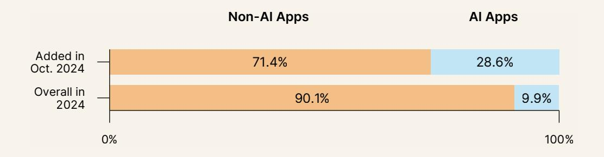

Source: Hugh Durkin, AppMarketplace.com, October 2024

To help visualize the incredible scale of this AI-native indie tool space, we produced a special genAI version of our Marketing Technology Landscape earlier this year that highlights the collection of these indie tools that we discovered over the past year. You can browse an [interactive PDF](https://app-na1.hubspotdocuments.com/documents/5912805/view/875768891?accessId=85e1cb) version here.

#### 2024 MarTech GenAI Landscape

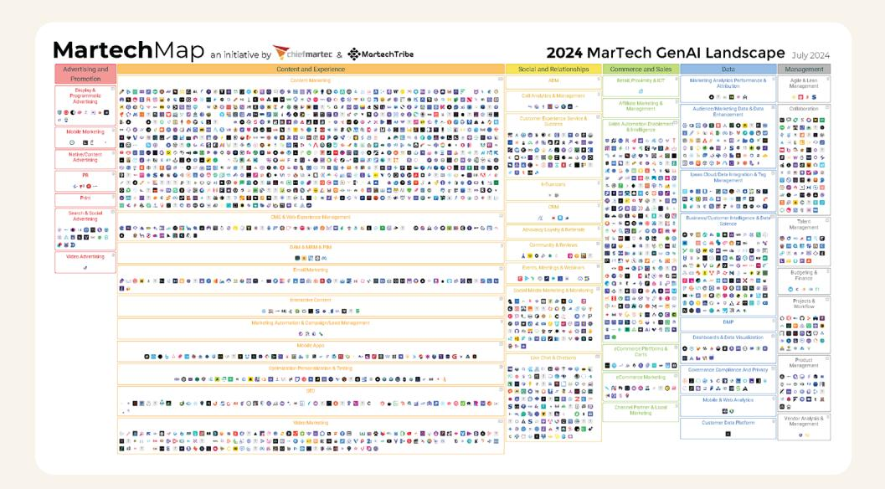

Source: [2024 MarTech GenAI Landscape](https://app.hubspot.com/documents/5912805/view/875768891?accessId=85e1cb), chiefmartec & MartechTribe

However, some of these AI startups are intentionally seeking to disrupt the major martech incumbents. Andreesen Horowitz published a barnburner of a blog post in July called ["Death of a Salesforce": Why](https://a16z.com/ai-transforms-sales/)  [AI Will Transform the Next Generation of Sales Tech](https://a16z.com/ai-transforms-sales/) that speaks to the strategy of these challenger platforms:

We believe AI will so fundamentally reimagine the core system of record and the sales workflows that no incumbent is safe.

Instead of a text-based database, the core of the next sales platform will be multi-modal (text, image, voice, video), containing every customer insight from across the company. An AI-native platform will be able to extract

more insight from a customer and their mindset than we could ever piece together with the tools we have today.

Sales workflows will fundamentally change. With AI, sales teams will no longer need to spend endless hours researching new leads or prepping for calls — AI will be able to do it in seconds. Reps won't have to suss out the readiness of potential customers because AI will have automatically compiled a ranked list of primed buyers, and will keep it constantly updated. Need personalized marketing collateral for a deal? Your AI wingman will produce whatever assets you need and feed you live tips while you're on a call to help you close.

The examples they cite are [Clay](https://www.clay.com/) for prospecting data intelligence, [11x](https://www.11x.ai/)  for autonomous AI agents serving as inbound and outbound SDRs, [Naro](https://www.narohq.com/) for sales enablement, [Day](https://day.ai/) as an AI-native CRM, and [People.ai](http://People.ai) for a new generation of salesforce automation ("salesforce" as the employees in a company responsible for selling, not the blue cloud SaaS pioneer).

The advantage these AI-native challenger platforms have is that they can rethink everything — data models, workflows, user interface, pricing and package, etc. — for a new AI-powered world. They are not constrained by technical backward compatibility or the dynamics of Clayton Christensen's [Innovator's Dilemma](https://en.wikipedia.org/wiki/The_Innovator%27s_Dilemma) biasing their business model choices.

However, these challengers have their own disadvantages to overcome. Most are incomplete and require integrations with multiple other products to cover the capabilities customers require. Because they have small user bases, they often have access to small amounts of data to train their AI features.

In contrast, the incumbents they're targeting have large user bases and are deeply integrated in those customers' tech stacks. Displacing these incumbents — à la rip-and-replace — is a daunting proposition, especially given that these challenger platforms carry existential risk: 90% of startups fail.4

4 <https://startupgenome.com/article/the-state-of-the-global-startup-economy>

Where challenger platforms gain a tailwind is when the fundamental nature of the category may change as a result of AI — a true paradigm shift. For instance, competing with existing DXPs such as Adobe, Optimizely, and Sitecore is a hard uphill climb… unless websites themselves shift to become something very different. If avatar agents or dynamic content canvases engage customers outside of traditional web pages and site navigation, the very nature of a DXP gets disrupted. That opens the door for a new generation of martech leaders.

The role that AI agents could play in disrupting how work gets done and customer experiences get delivered will likely open many such doors.

But the incumbents are not standing still.

Salesforce's bold moves with [Agentforce](https://www.salesforce.com/agentforce/) and [Generative Canvas.](https://www.salesforce.com/blog/generative-canvas-lightning/) HubSpot's [Breeze](https://www.hubspot.com/products/artificial-intelligence?hubs_content-cta=product-spotlight&hubs_content=www.hubspot.com#below-header-breeze_wf_header_splash) co-pilots and agents, and co-founder Dharmesh Shah's [agent.ai](https://agent.ai/) (a "professional network for AI agents"). Microsoft's [embedding of Copilot](https://learn.microsoft.com/en-us/microsoft-cloud/dev/copilot/copilot-for-dynamics365) throughout their Dynamics product suite. Adobe's [GenStudio](https://business.adobe.com/products/genstudio-for-performance-marketing.html) is a seamless AI-driven content supply chain.

#### Indie Tools, Challenger and Incumbent Platforms

| Indie Tools                                                                                   | Challenger Platforms                                                                   | Incumbent Platforms                                                                                                   |
|-----------------------------------------------------------------------------------------------|----------------------------------------------------------------------------------------|-----------------------------------------------------------------------------------------------------------------------|
| M&A                                                                                           | Disrupting Subsuming                                                                |                                                                                                                       |
| Thousands of stand-alone AI specialist tools that do one thing                          | New AI-native platforms that aspire to disrupt existing platform incumbents      | Dominant martech platforms rapidly embedding AI features in their products, organically and via acquisitions |
| Advantages Creatively use AI to do one thing really, really well with specialization | Designed from the ground up with new AI paradigms, free from innovator's dilemma | Large user bases, deeply embedded in tech stacks, big cash flows/reserves, huge amounts of data for training |
| Disadvantages Limited resources and scale, low defensibility                            | Hard to dislodge incumbents, viability risk, limited data                           | Constrained by backwards compatibility and existing revenue structures                                          |

Source: chiefmartec & MartechTribe

As Sonya Huang and Pat Grady of Sequoia Capital recently wrote in an article, [Generative AI's Act o1: The Agentic Reasoning Era Begins](https://www.sequoiacap.com/article/generative-ais-act-o1/), "The classic battle between startups and incumbents is a horse race between startups building distribution and incumbents building product. Can the young companies with cool products get to a bunch of customers before the incumbents who own the customers come up with cool products?"

The incumbents are moving quickly to build cool AI capabilities. They are also leveraging their equity and capital reserves to acquire hot indie tools and rising challenger platforms to make non-linear jumps forward. And they're already leveraging their large customer bases — their distribution — to roll out that new AI functionality at scale to shut out the challengers before they get their foot through the door.

One could easily assume that the incumbent platforms will come out on top.

Yet the incumbents have hurdles to overcome that aren't about the technology per se. Clay Christensen's [Innovator's Dilemma](https://en.wikipedia.org/wiki/The_Innovator%27s_Dilemma) will be a real struggle for them to balance their commitments and expectations with existing customers — and the reliable financial engine of their existing pricing and packaging — with new product paradigms and new pricing models. (Dharmesh Shah, the co-founder and CTO of HubSpot, has shown one way of escaping that dilemma by producing products such as [ChatSpot](https://do2.chatspot.ai/)  and, more recently, [Agent.ai](https://agent.ai/) adjacent to HubSpot's core platform.)

#### Shifts in Pricing Models

|                      | Seats                              | Usage                                      | Outcomes                             |
|----------------------|------------------------------------|--------------------------------------------|--------------------------------------|
| model                | SaaS                               | IaaS/PaaS                                  | service-as-a-software                |
| product form         | applications                       | services                                   | AI agents                            |
| aligned to           | employees                          | compute/ data resources                 | goals                                |
| costs                | fixed, based on number of users | variable, based on resource utilization | variable, based on outcome demand |
| cost-related risk | underutilization                   | poor optimization or forecasting        | miscalculated value or demand     |

Source: chiefmartec

But the bigger hurdle for them may simply be mindset and their ability — or inability — to truly imagine how this new world will differ from the old one.

To quote a bit more from Huang and Grady:

Twenty years ago the on-prem software companies scoffed at the idea of SaaS. "What's the big deal? We can run our own servers and deliver this stuff over the internet too!" Sure, conceptually it was simple. But what followed was a wholesale reinvention of the business. EPD went from waterfalls and PRDs to agile development and AB testing. GTM went from top-down enterprise sales and steak dinners to bottoms-up PLG and product analytics. Business models went from high ASPs and maintenance streams to high NDRs and usage-based pricing. Very few on-prem companies made the transition.5

What if AI is an analogous shift? Could the opportunity for AI be both selling work and replacing software?

So who will win? It's not clear. And practically speaking, it's not a strictly zero-sum game in the near-term.

For 2025, we believe most marketers will benefit from all three:

- Leverage the new AI features being released by your existing incumbent platform(s).
- Adopt indie tools that complement those platforms and let you experiment with new AI capabilities quickly and inexpensively.
- And keep an open mind to creative new approaches championed by AI challenger platforms. Whether they ultimately succeed as companies or not, they are likely augurs of the future.

5 Holy acronym city, Batman! EPD = enterprise product development. PRD = product requirements document. GTM = go-to-market. PLG = product-led growth. ASP = average selling price. NDR = net dollar retention. AB = version A and version B of something, being tested against each other.

# The 4th Segment: Instant Software

But true disruption often comes at you from an angle you aren't expecting. While commercial incumbent and challenger platforms are battling it out, we believe one of AI's biggest impacts will be the explosion of custom "software" in businesses of all sizes — not just enterprises.

#### Custom Apps

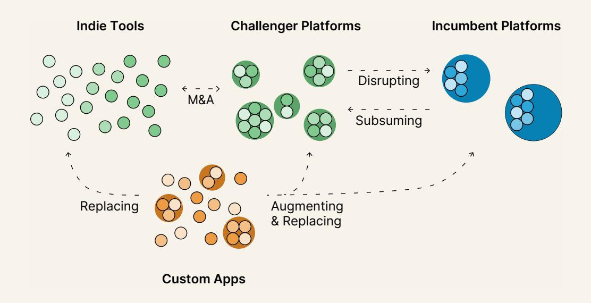

Source: chiefmartec & MartechTribe

We put "software" in scare quotes because, increasingly, people will create software programs through AI without even realizing it. (Should we call it "instant software" in a nod to the magic of "instant coffee" just add water, or in this case, just add intent?)

But first, let's acknowledge that even conscious custom software development is on the rise.

While public LLM services have become extremely popular — ChatGPT, Claude, Gemini, etc. — they are generic in their reasoning and training data.

To harness their power in one's own digital operations and customer experiences, businesses need to tailor them to their proprietary data and context-specific logic.

Tailoring can be done through a variety of methods: training one's own model, fine tuning an existing model, and/or using RAG (retrievalaugmented generation). RAG, which is the most common method today, looks up data from internal databases and feeds it behind-thescenes into the prompts given to the LLM engine. The LLM generates its response using that retrieved data as input, augmenting its own generic knowledge. Hence, retrieval-augmented generation. RAG implementations may also check or manipulate the output from the LLM to provide further guardrails on the end result.

All of this is done by building custom software to connect these pieces together, often using Python, which has become the preferred programming language for AI.

These custom generative AI implementations can be run stand-alone or incorporated into larger software apps. We often see teams follow a hack-pack-stack progression here. Quickly test an idea in a stand-alone fashion (hack). If proven feasible, build it the "right" way and deploy it into production (pack). If it delivers sustained value, optimize it for longterm maintainability (stack).

#### The Hack-Pack-Stack Progression

| Hack  | best-of-speed | Test an idea quickly to determine if it is technically feasible and if it will deliver the intended value/outcome; an experiment   |
|-------|---------------|------------------------------------------------------------------------------------------------------------------------------------------|
| Pack  | best-of-need  | Once the idea is validated — if successfully addresses a clear need — implement it the proper way and deploy it in full production |
| Stack | best-of-breed | Refactor into a scalable, low-maintenance version and integrate it into the ecosystem of your tech stack (your digital ops "DNA")  |

Source: chiefmartec & MartechTribe

AI coding assistants, such as [GitHub Copilot,](https://github.com/features/copilot) [Gemini Code Assist](https://cloud.google.com/products/gemini/code-assist), [Amazon Q Developer](https://aws.amazon.com/q/developer/), [Cursor,](https://www.cursor.com/) and more, are accelerating the speed and quality of proper software development. Combined with the rise of composability with APIs and organization-wide accessibility of data through cloud data warehouses, companies are more willing and able to build pieces of custom software as part of their overall digital operations.

As an extreme example, the fintech giant [Klarna](https://www.klarna.com/uk/?grs=%2F&grr=empty) announced earlier this year that they were ditching Salesforce and Workday to build their own custom CRM and HCM applications using AI and composable cloud services.6 While there's been skepticism about the wisdom of such a "build it all yourself" strategy, the fact that such a move is even conceivable is a testament to both the improved economics of custom development and the perceived business advantage of more tailored digital operations in the AI era.

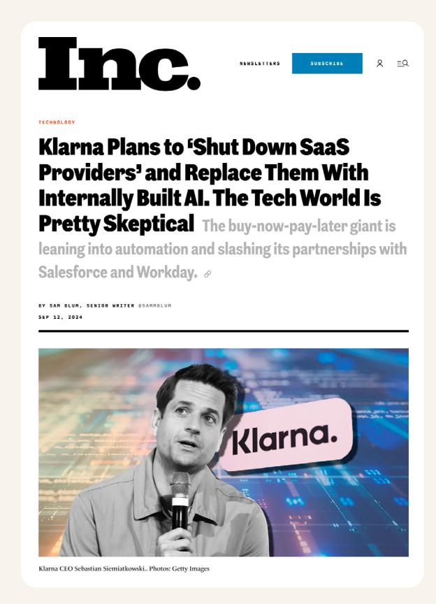

Source: www.inc.com/

6 [https://www.inc.com/sam-blum/klarna-plans-to-shut-down-saas-providers-and](https://www.inc.com/sam-blum/klarna-plans-to-shut-down-saas-providers-and-replace-them-with-ai.html)[replace-them-with-ai.html](https://www.inc.com/sam-blum/klarna-plans-to-shut-down-saas-providers-and-replace-them-with-ai.html)

What should you build vs. buy? Largely it's a question of comparative advantage.

Where commercial companies in the market have greater experience and expertise in building a particular kind of product or platform, it's often most economically rational — in both direct costs and opportunity costs — to buy.

Where can your company generate unique value from its experience and expertise expressed in software? Those may be a candidate for building. It's where the expertise in your company — for those specialized needs — is greater than the more generalized expertise in the market at large with commercially packaged products.

#### The Technology Hype Cycle

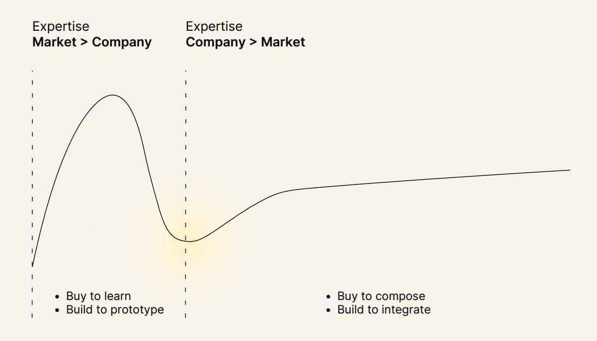

Source: MartechTribe

As a new technology winds its way up and down the Hype Cycle — as a number of AI capabilities currently are — the rationale for building vs. buying often evolves. In the early stages of the technology, we buy to learn from those companies who have specialized in the technology. If we build, it's often to prototype exploratory ideas.

In later stages, we buy to acquire viable and proven capabilities that we can then compose into our business operations and customer experiences. We build the unique components that leverage our domain expertise and integrate everything together.

But the greatest quantity of custom software ahead won't be built by professional developers. It will be apps, automations, and analyses created by business users through "no-code" interfaces and AI.

We've already seen an explosion of such citizen development, as Gartner labeled it, over the past 10 years. Products such as [Airtable](https://www.airtable.com/) (database apps), [Webflow](https://www.webflow.com) (web apps), and [Workato](https://www.workato.com) (workflow automation) have empowered business ops teams — including marketing operations and revops — to self-serve many of their own custom software needs.

Gartner predicted that by 2025, 70% of new applications developed by organizations will use low-code or no-code technologies, up from less than 25% in 2020, that are "driving the increase of citizen development, and notably the function of business technologists who report outside of IT departments and create technology or analytics capabilities for internal or external business use."7

And that prediction was made before the genAI revolution broke out.

Now, we have a whole new wave of no-code AI agent builders, such as [Google's Vertex AI Agent Builder](https://cloud.google.com/products/agent-builder), [Relevance AI,](https://relevanceai.com/agents) and [Kore.ai](http://Kore.ai).

But even with no-code tools, these are all explicitly created software "programs." Business users might not think of themselves as developers, but they recognize that they are building an app, an automation, or an agent when they use those tools.

However, when you ask an AI agent to do something for you and it creates a custom program on-the-fly to execute it — completely behind-the-scenes, and by default not visible to the user who made the request — is that custom software? We would argue that it is.

7 [https://www.gartner.com/en/newsroom/press-releases/2021-11-10-gartner-says](https://www.gartner.com/en/newsroom/press-releases/2021-11-10-gartner-says-cloud-will-be-the-centerpiece-of-new-digital-experiences)[cloud-will-be-the-centerpiece-of-new-digital-experiences](https://www.gartner.com/en/newsroom/press-releases/2021-11-10-gartner-says-cloud-will-be-the-centerpiece-of-new-digital-experiences)

The AI agent is, in a very real sense, a software developer. (Albeit one without a love for pizza and Star Wars.)

#### The Democratization of Marketing Technology

Source: chiefmartec

Such automatic or even ambient creation of software programs by AI agents will be faster and cheaper by orders of magnitude than any software development process that came before. And because the interface of these AI agents will be accessible to any business user, the number of people triggering the creation of these dynamic programs will asymptotically be everyone in the company — and, through customer-facing agents, potentially many more.

Beyond the millions of human-built no-code apps, there will be billions of AI agent dynamic programs. This explosion of unseen custom "software" has already begun, and we expect it will accelerate in 2025 as AI agents proliferate.

#### The Hypertail

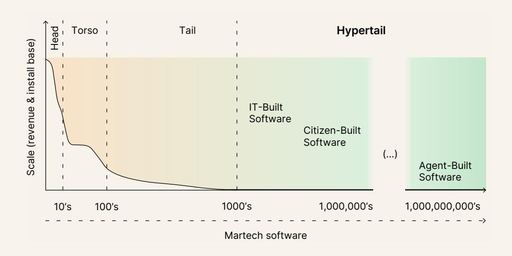

Source: chiefmartec

This will change the composition of tech stacks. Not only will companies draw from the long tail of commercial applications, such as those we catalog in the ever-bulging [marketing technology landscape.](https://martechmap.com/) They will complement and augment them — and in some cases replace them with a growing quantity of custom "software" that they build for their unique operations and customer experiences.

If the commercial martech landscape has been a "long tail" distribution — a small number of major martech vendors in the head and torso, followed by a large number of martech startups, specialists, and challengers in the tail — we see this explosion of custom IT-built, citizen-built, and agent-built software as an effectively infinite extension of software choice.

We call this a hypertail distribution.

With due respect to Klarna's decision to ditch major commercial platforms to roll their own, we actually expect that most tech stacks will incorporate both commercial and custom software. Commercial platforms that help aggregate and orchestrate custom software providing cohesion and governance to the plethora of apps, agents,

and automations operating in this "big ops" environment — will be especially valuable as coordinating centers of gravity.

#### Custom vs. Commercial Software

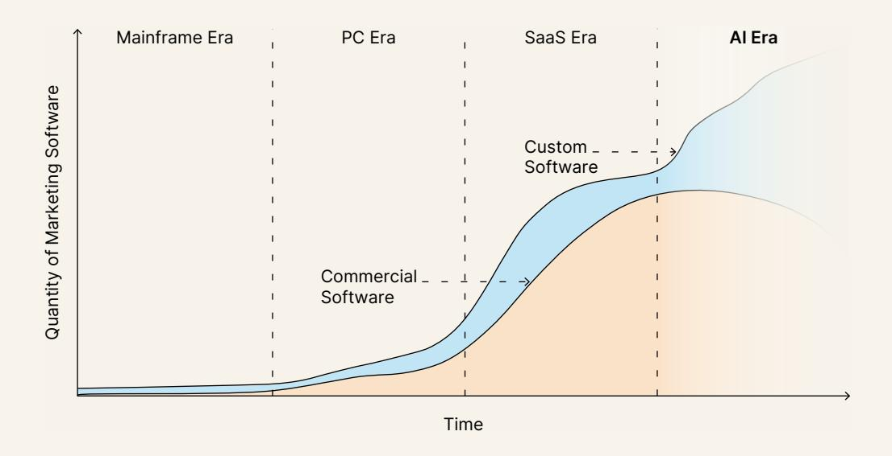

Source: chiefmartec

However, we suspect this may be the turning point where the number of commercial apps in the tech stack peaks and future growth of the stack — which overall we think could be exponential — will come from custom software, a cornucopia of custom apps, agents, and automations.

# The 5th Segment: Service-as-a-Software

But wait, there's more.

So much software to date has been tools to help people do their work better, whether through increased efficiency or greater creative range or applying their talents to digital assets, data, experiences, media, etc. that inherently required a digital interface.

Software has been an assist to labor.

But with the rise of agentic AI capabilities — where a new generation of AI-powered software can actually do more of the work autonomously or with minimal supervision — it's becoming possible for software to increasingly serve as labor.

#### Services-as-Software

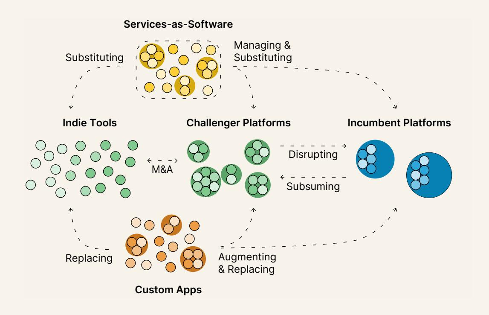

Source: chiefmartec & MartechTribe

That is the gateway to a much, much larger disruption than challenger platforms vs. incumbent platforms in the software industry. As Grady and Huang from Sequoia Capital noted (emphasis our own):

The cloud transition was software-as-a-service. Software companies became cloud service providers. This was a \$350B opportunity.

Thanks to agentic reasoning, the AI transition is serviceas-a-software. Software companies turn labor into software. That means the addressable market is not the software market, but the services market measured in the trillions of dollars.

The race is on to reinvent every nook of that multi-trillion dollar services market by providing more services wrapped through AI agents and software interfaces. The clever term for this is service-as-a-software, the new kind of "SaaS."

Existing marketing services will certainly be impacted by this, as you can expect current agencies and a new wave of challenger agencies to leverage AI to change the economics, speed, and scale of the services they have historically provided: market research, audience segmentation, media planning and purchasing, creative production (if not the creative itself), etc.

But there will also be new kinds of AI-powered service providers that essentially replace both internal software products and the labor required to use them. Instead of in-house tools and talent, there will be options to purchase outsourced "outcomes" from these providers.

Why buy a set of content distribution tools, and hire and train a team to use them, if a highly cost-efficient (thanks to AI) service provider can do the work for you quickly, easily, effectively — and may only charge you for successful outcomes such as views, engagements, click-throughs, leads, purchases, etc.?

For martech and marketing operations, these new kinds of serviceas-a-software options will change the make-up of tech stacks and the processes orchestrated around them.

#### The Hyperscalers

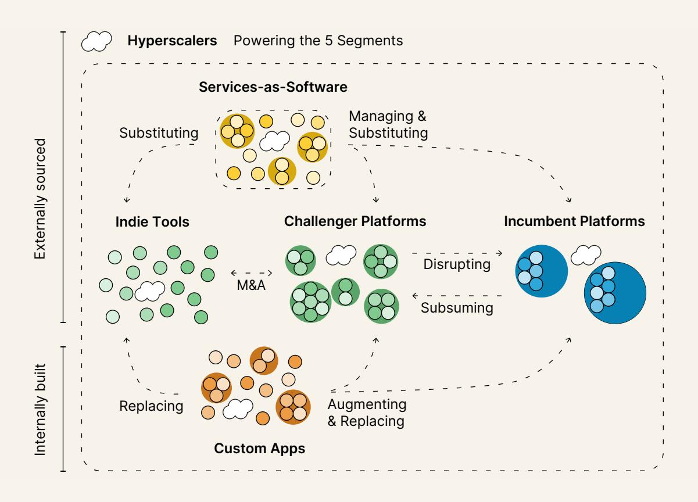

Source: chiefmartec & MartechTribe

As venture capitalist Tomasz Tunguz recently [wrote,](https://tomtunguz.com/services-as-vector-sor/) "When AI products are sold as services, they replace in-house labor. This changes internal processes. When the internal processes change, the opportunity to replace the system of record arises because the existing workflows are no longer relevant."

Service-as-a-software options will, in a very real sense, be both complements and competitors to software companies and internally-built custom software.

This is not a far-future prediction. Production instances of these software-as-a-service solutions are already in-market, such as [Sierra.](http://Sierra.ai) [ai](http://Sierra.ai) for "outsourced" customer service interactions (using a pay-perresolution pricing model). We expect to see many more in the year ahead.

With this full view of the five segments of martech solutions in the AI era, it's worth pointing out that all of them are powered by the hyperscalers: Amazon AWS, Google Cloud Platform, and Microsoft Azure. This opens up interesting opportunities to use those underlying infrastructure providers as a more explicit substrate for coordinating across one's internal and external stack.

This is essentially the pattern that has emerged with cloud data warehouses (and cloud data lakes and cloud data lakehouses): a common substrate of data and software APIs that enable marketers to mix and remix insights and functionality across their organization in novel use cases.

### 2. Foundations for an AI Strategy

# The Evolving Universal Data Layer

"You can't have an AI strategy without a data strategy."

A number of highly respected experts across the industry have expressed that opinion over the past year, and we agree with them wholeheartedly. Your data is what turns generic AI algorithms with both generative AI and classic machine learning (ML) — into differentiated and relevant capabilities that give your business a competitive advantage.

From a martech stack perspective, the key to this is a universal data layer that aggregates data from all the different applications in your stack and makes it available for any other app to use.

For many companies, this is being accomplished with a cloud data warehouse (CDW) or cloud data lakehouse (CDL) — the latter being able to handle both structured data, as classic data warehouses have, and unstructured data, which has typically been stored in a more open data lake. Hence the "lakehouse" portmanteau.

While some marketing organizations are using customer data platforms (CDPs) or other "data clouds" as a shared data layer, with more marketing-specific capabilities, more and more of those solutions now actually sit on top of a cloud data warehouse/lakehouse. These are often called "composable CDPs" because they operate on data that is composed from other data storage sources.

In our [State of Martech 2024](https://chiefmartec.com/wp-content/uploads/2024/05/state-of-martech-2024-report.pdf) report, 71% of the martech and marketing ops professionals who took our survey on composability reported that they have a cloud data warehouse/data lake in their martech stack, such as Snowflake, Databricks, Google BigQuery, Amazon Redshift, etc.

Out of those, 61.3% said that more than 50% of the apps in their martech stack were integrated with it.

### Do you use a cloud data warehouse/data lake with your martech stack?

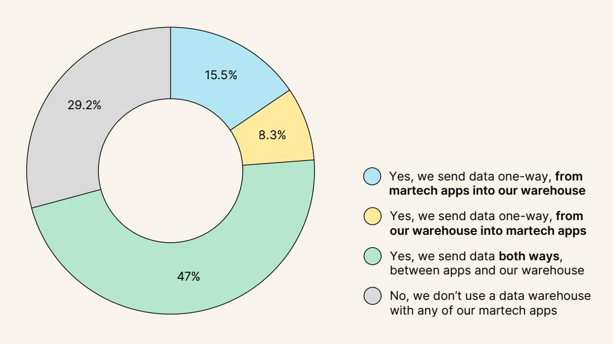

Source: 2024 Martech Composability Survey, chiefmartec & MartechTribe

The advantage of a non-marketing-specific cloud data warehouse/ lakehouse layer is that it can span the entire organization. This is a huge unlock for marketing, as it gives marketers access to data from customer touch points that are managed by other departments: sales, customer service, finance, digital product operations, etc. These broader datasets provide richer customer insights and can be used to power better marketing campaigns and customer experiences.

These cloud data warehouses/lakes/lakehouses are the backbone of what has become known as the "modern data stack" for organizations. The stack also includes tools for ingesting data, transforming data, cleaning data, enriching data, governing data, and feeding data into tools for data science, business intelligence, machine learning, and front-line business applications.

#### The Circular Data Ecosystem

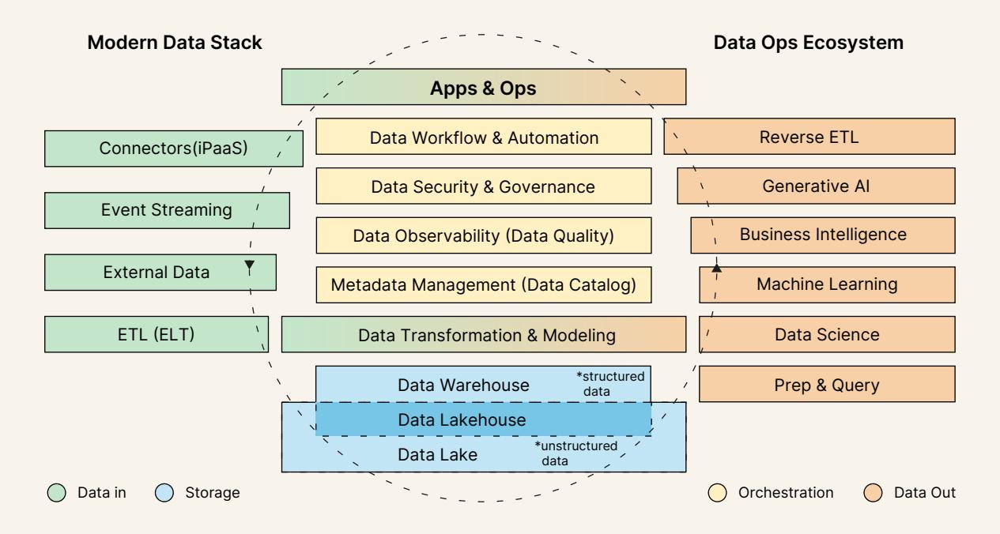

Source: chiefmartec

That last piece — feeding data from the modern data stack into applications such as CRMs, marketing automation platforms (MAPs), digital experience platforms (DXPs), etc. that directly engage or support customer interactions — makes this more of a circular data ecosystem. Those apps are both generating data that is pushed into the universal data layer as well as pulling other aggregated and processed data out from it.

#### Modern Data Stacks

| Data       | Past              | Present                    |
|------------|-------------------|----------------------------|
| location   | on prem           | cloud                      |
| format     | structured >      | structured & unstructured  |
| acess      | few users >       | many users & apps          |
| data flow  | 1-way (linear)    | 2-way (circular)           |
| use case   | analytics >       | analytics & operations     |
| data usage | low utilization → | high utilization           |
| interface  | code (SQL)        | UI & AI for business users |
| challenge  | big data          | big ops                    |

Source: chiefmartec

This evolution of the data layer has catalyzed many changes. By moving data into the cloud, it's become easier to integrate with all our cloud-based applications. The capacity to deal with both structured and unstructured data lets us unlock greater value with generative AI engines, which are exceptional at processing such unstructured data. Enabling many apps, and through them many users, to leverage more data in their work. Going from a linear one-way data flow, where most data would "sink" into storage only to be used for backwards-looking analytics, if at all, to now a circular, two-way data flow that integrates data with our front-line apps and operations.

Because we're utilizing our data in more ways, we extract more value from it. And now, more and more use cases for that data are delivered with AI — whether embedded in existing apps, new stand-alone tools, custom "software" that we create ourselves, or service-as-a-software solutions from outsourced providers.

Of course, managing this broader data ecosystem and all of the apps and ops activities that are interacting with it has become a challenge of its own. Whereas a previous decade wrestled with big data, we believe the mission of this new AI-powered era is to wrangle "big ops" — taming the scale and complexity of all the apps, agents, and automations interacting with this data.

#### Big Data vs. Big Ops

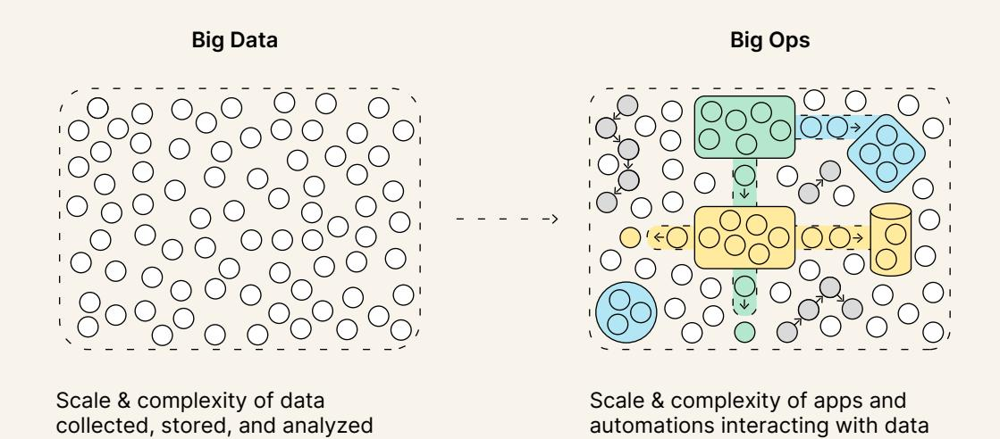

Source: chiefmartec

# The (Underdeveloped) Universal Content Layer

Yet for all the advances of the modern data stack, it's largely been focused on customer data and business operations data. Far less has happened with content "data".

#### The Current Personalization Stack

Data is Real-Time Unlike Mass Customizing Content

Content Layer (simplified)

Largely fragmented & manual process

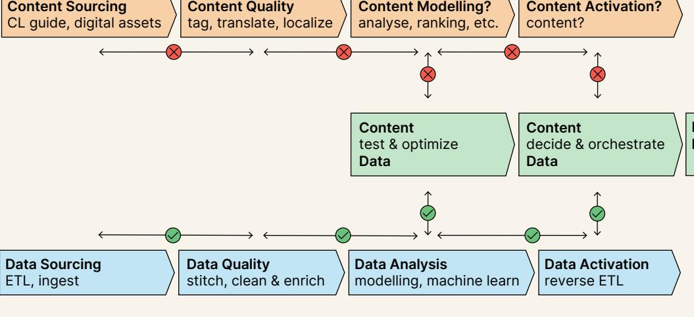

Largely integrated & automated process

Data Layer (simplified)

Source: MartechTribe & Rasmus Houlind

Content Activation? Hyper Personalize Yes, we have tools such as digital asset management (DAM) to store brand and campaign assets, such as images and videos, or Product Information Management systems (PIM) to store product information. We have content management systems (CMS), whether tightly integrated with a digital experience platform (DXP) or separated as so-called "headless" CMS. And we have master data management (MDM) platforms to own the definitions for a range of entities and messages in our business.

But many of these components have not been well-integrated together. They're often connected in a fragile point-to-point fashion to serve specific use cases. We only connect them to customer data in the late stages of campaigns or customer experiences to deliver limited personalization.

And that's not even considering all of the "content" that businesses have that lives outside of those official repositories, scattered across Google Drives, Word documents, internal wikis, and a plethora of indie content creation and curation tools in the cloud, sometimes stored by their agencies.

In all fairness, it's been harder to organize and leverage all that content across the organization than the comparatively wellstructured, API-accessible data associated with customers and our business operations. We didn't have the technology to harness this content in more advanced ways, so there was little incentive to invest in a "modern content stack" to the same degree as the modern data stack.

#### Until now.

Generative AI has the ability to absorb this vast treasure trove of content and synthesize it into a wide range of creative new use cases. We believe the greatest opportunity is rendering more holistically-personalized customer engagement, where personalized content and experiences seamlessly blend both our deep knowledge about the customer (via the modern data stack) and the true "personality" of our brand from relevant content (via a new modern content stack).

#### The Future Personalization Stack

Scaling Real-Time Content with GenAI Content Master Files

Data Layer - Largely ML (simplified)

Source: MartechTribe

Analogous to the master files of creative assets from which context-specific derivatives are currently produced, we can envision a "master file" LLM — or really a multi-modal model — tuned on the content that represents the brand's core identity and personality. This genAI "brand master file" or "brand LLM" orchestrates the universal content layer at its foundation.

In turn, there may be campaign-specific variations from this brand model that inherit the core identity and personality but then fine-tune to the characteristics of the campaign.

While such a modern content stack to power hyper-personalization like this is at best nascent today, we expect to see significant innovation in such a universal content layer in 2025.

# API Composability as AI Agent Building Blocks

Try to fill in the blank here:

" are to AI agents as data is to AI models."

The answer, if you haven't already guessed, is APIs.

Data — gobs and gobs and gobs of data — feed the training of ever more powerful LLMs. OpenAI's GPT-4 model was reportedly trained on more than a petabyte of data. (A petabyte, which is 1,000 terabytes, is roughly the equivalent of 223,000 full-length DVDs. That's about half of all the movies that have ever been made, including classics such as The Empire Strikes Back and not-so-classics such as Jay & Silent Bob Strike Back.)

Data powers AI models.

AI agents leverage those data-powered AI models, but they add a powerful capability on top of them: the ability to use tools and take actions. While AI models can "talk" the talk, suggesting actions for us humans to go do, AI agents can actually "walk" the walk and take actions directly themselves.

This action-orientation is resulting in a new generation of AI models called LAMs, large action models, a label that rhymes with LLMs, large language models. Cobus Greyling produced [a useful summary of the](https://cobusgreyling.medium.com/large-action-models-9aabb5e25b55)  [differences between them:](https://cobusgreyling.medium.com/large-action-models-9aabb5e25b55)

#### Large Language Models & Large Action Models

| Feature                   | Large Language Model (LLM)                                              | Large Action Model (LAM)                                                                                      |
|---------------------------|-------------------------------------------------------------------------|---------------------------------------------------------------------------------------------------------------|
| Primary Function          | Processes and generates natural language (text)                      | Executes actions and decisions in real-world or simulated tasks                                         |
| Core Task                 | Text generation, language understanding, answering queries        | Performing tasks, interacting with tools, and decision-making                                           |
| Examples                  | GPT-4, BERT, T5                                                         | xLAM, AlphaGo, ReAct                                                                                          |
| Key Applications          | Chatbots, translation, summarization, content generation          | Autonomous agents, robotics control, task completion                                                       |
| Training Data             | Massive text corpora (e.g., books, websites, documents)              | Specialized datasets that include actions, outcomes, or decisions                                       |
| Architecture Focus     | Text processing, sequence prediction, context understanding       | Action-oriented, combining reasoning & decision-making strategies                                       |
| Output Type               | Natural language text (e.g., paragraphs, responses)                  | Actions, decisions, or task completions (e.g., API calls, moves)                                        |
| Example Use Case          | Writing an article, answering questions in a customer support bot | Controlling a robot to stack blocks autonomously                                                           |
| Example Use Case          | Summarizing scientific research papers                               | Generating the correct sequence of steps to complete a function-call                                    |
| Interaction with Tools | Limited, requires fine-tuning or integration for specific tasks   | Designed to handle tool usage and decision-making in real time                                          |
| Performance Benchmarks | NLP benchmarks like SuperGLUE, SQuAD                                 | Agent performance benchmarks like Berkeley Function-Calling                                             |
| Generalizability          | Highly general, handles a wide variety of language-based tasks    | Task-specific, often fine tuned for specific domains or toolsets                                        |
| Illustration              | LLM: A chatbot providing movie recommendations based on reviews   | LAM: A home assistant autonomously adjusting lights based on user preferences and current conditions |

Source: <https://cobusgreyling.medium.com/>

How do the LAMs and AI agents actually take actions? Some will simulate human use of a computer — mouse movements, button clicks, text input, and "reading" the output. This is what Anthropic's latest [Claude 3.5 Sonnet](https://www.anthropic.com/news/developing-computer-use)  [release in October](https://www.anthropic.com/news/developing-computer-use) enabled. It's kind of a next-generation approach to robotic process automation (RPA).

But simulating humans is messy and computationally expensive compared to letting AI agents work in their native digital tongue by calling APIs. As described earlier, AI agents can generate small software programs on-thefly behind the scenes to take many of their actions. For software programs, the easiest and most direct way to get things done is to call the APIs of other software programs.

A recent report by Workato, [Behind the Hype: The 2024 State of LLMs in](https://www.workato.com/the-connector/2024-state-of-llm-report-intro/)  [Business Processes,](https://www.workato.com/the-connector/2024-state-of-llm-report-intro/) revealed that nearly half of business leaders (n=1,000 in North America) see APIs as the best way to leverage generative AI in their business processes — significantly more than through conversation chat interfaces or RPA-like user interface simulations.

APIs have the benefit of being well-defined, versioned, predictable in the format of their input and output, and able to be accessed — and paid for in a more granular fashion.

In the future, which method to use generative AI in business processes do you believe will be best for your organization?

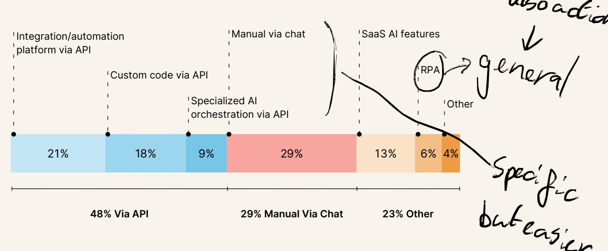

Source: [The 2024 State of LLMs in Business Processes Report,](https://www.workato.com/the-connector/2024-state-of-llm-report-intro/) Workato

Note: n>1,000

This is why APIs are to AI agents what data is to AI models.

The good news is that we're already on the road to support agents with APIs by leaning into increased "composability" in our tech stacks.

#### Degrees of Composability

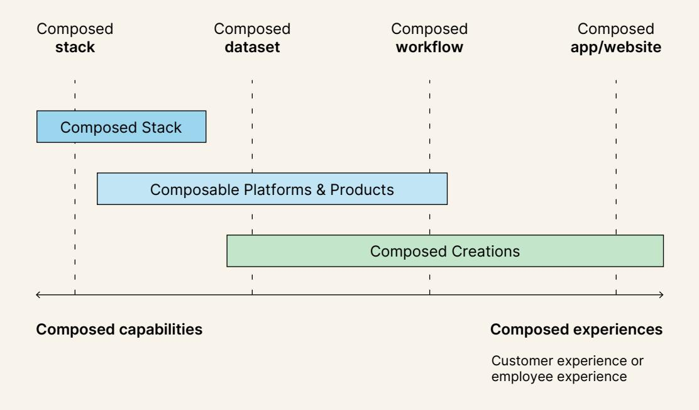

Source: chiefmartec

Back in May, we published the [The State of Martech 2024 report,](https://chiefmartec.com/wp-content/uploads/2024/05/state-of-martech-2024-report.pdf) which did a deep dive into the rise of composability in martech stacks. We know, "composable" has become a buzzword in martech these past few years, with composable CDPs, composable DXPs, and such. But the essence of composability has been around in technology for decades. It's the ability to take different pieces from your tech environment data from multiple sources, APIs from multiple platforms and services — and combine them together into new workflows or customer experiences.

In a very real sense, all software is composed, using programming frameworks and code libraries. But for many years, composing new digital creations required technical skills.

#### Spectrum of Composability

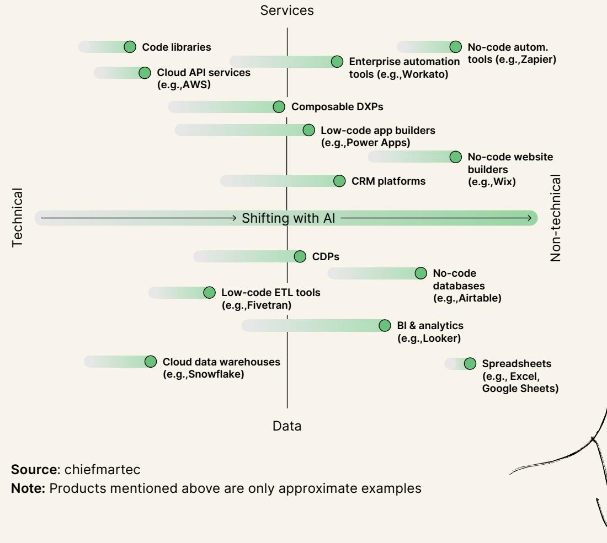

One of the powerful effects of AI is a shifting of the skills required to use such composability to empower less technical users. More and more composition of workflows and experiences can be achieved through visual interfaces or natural language requests to AI co-pilots and agents.

This in turn has made APIs and open data models more important to martech buyers. In our [State of Martech 2024 survey](https://chiefmartec.com/wp-content/uploads/2024/05/state-of-martech-2024-report.pdf) this past spring, 83.9% of the participants said APIs were important or very important when evaluating martech products. With the rise of AI agents and automation in the year ahead, this will be more true than ever.

However, while most martech products have certainly improved their API coverage over the past few years, only 17.3% of the platforms marketers have at the center of their stack are rated as having great API coverage, enabling marketing ops to do everything they want via APIs.

### How important are APIs when you're evaluating a new martech product?

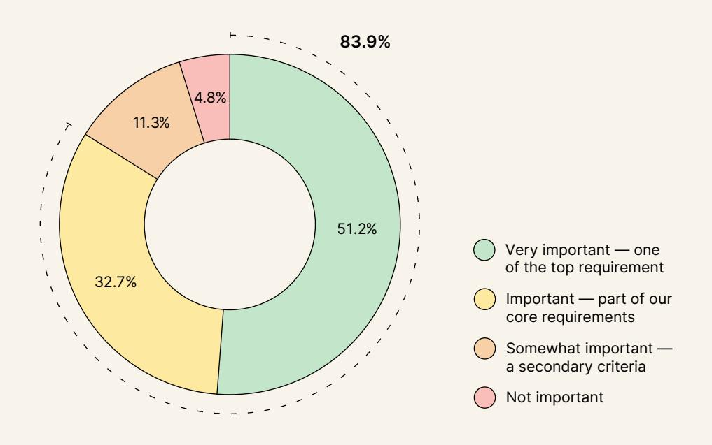

Source: 2024 Martech Composability Survey, chiefmartec & MartechTribe

### How complete are the APIs for that platform at the center of your stack?

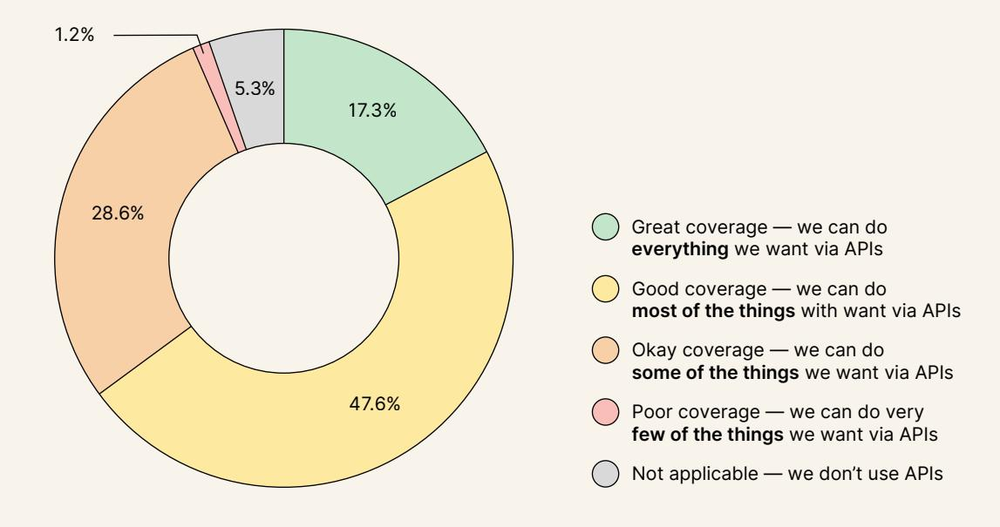

Source: 2024 Martech Composability Survey, chiefmartec & MartechTribe

Our advice to martech vendors: seize this opportunity for competitive advantage. Having better APIs for your product is a way to distinguish yourself from your competitors. You can enable your customers to do more automations — and soon more AI agent magic — by providing great programmatic interfaces to your product's functionality.

Because increasingly, your users aren't just going to be humans. They're going to be automations and agents operating on behalf of humans. But just as your closed/lost or churn risk increases if a human user can't work with your product, you can expect the same risk will rise if their "artificial users" can't either.

Now, some martech vendors might be worried that enabling greater API access to their functionality will reduce the usage of their humanoriented UI. Since human attention is extremely limited and highly valuable, there is an incentive to want to catch and hold on to as much of it as possible. It might be tempting to say, "No, you can only unlock the power of our product by giving us your full attention as a human in our UI."

For most products, we think that would be a mistake of Innovator's Dilemma magnitude.

Yes, human attention is valuable. But it's not the only source of value for a vendor. As an army of AI agents thunders across the field, those vendors who are able to empower such artificial users will have greater usage than those who don't. In the Age of AI, usage will be even more important than UI. Increasingly, this will be how most martech products monetize.

The Age of AI will also be the Age of APIs, and we expect to see that play out in practice in martech stacks over the year ahead.

### 3. How Marketers Are Using Generative AI Today

Generative AI is moving faster than any other technology we've seen before: the pace by which its foundational capabilities are evolving, the speed by which those capabilities are being added to new and existing products across the martech landscape, and the rate by which marketers are adopting — or at least experimenting with — these new capabilities in their work.

Adoption curves used to be measured in years. With generative AI, adoption is growing in months or even weeks.

Among the many challenges this presents, it's hard to report the real adoption of genAI at any given moment in time. It's like the Heisenberg uncertainty principle in quantum mechanics, a trade-off between measuring the position vs. the velocity of a particle. In our case, the deeper and more detailed one looks at how genAI is being used at any one time (position), the more likely that data will already be out of date by the time the survey is completed (velocity).

This has led most surveys of genAI adoption to stay fairly high-level, e.g., is it being used — in any context — in marketing and sales vs. IT, legal, finance, HR, etc., to show that larger trend over time.

We decided to go in the other direction and dig into the more granular use cases in marketing and martech. In October, we completed one of the most in-depth surveys of how marketers are currently using generative AI across different martech categories and product segments.

While this data is more likely to change quickly with high variance, we believe it is directionally relevant for understanding genAI adoption in martech headed into 2025 — adoption across all these martech categories is only going to grow. Inclusive of a diverse mix of B2B and B2C industries, we surveyed 283 respondents globally.

# Popular Martech GenAI Use Cases

Let's start with 50+ popular use cases across 49 martech subcategories where generative AI is being adopted:

#### Most Used GenAI Use Cases

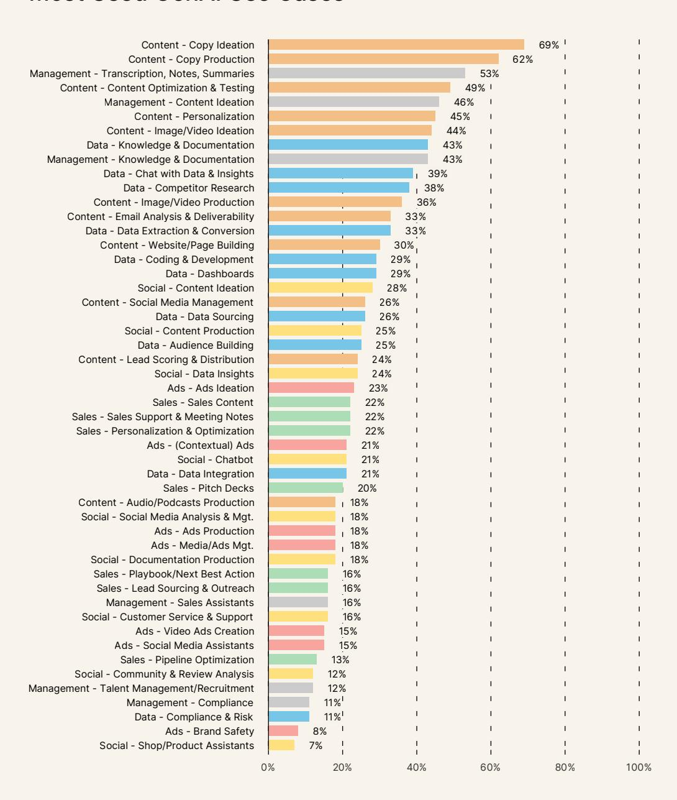

Not surprisingly, content ideation (69%) and content copy production (62%) were the two most popular use cases. Those have been the easiest ways for people to get started with tools such as ChatGPT, Claude, and Gemini, as well as early pre-ChatGPT products such as Jasper and Copy.ai.

Many of the other Top 12 use cases are related to accelerating marketing's content development pipeline: content optimization and testing (49%), broader content ideation (46%), image/video content ideation (44%), and image/video content production (36%).

#### Content ideation and production are 7 out of the top 12 use cases in marketing

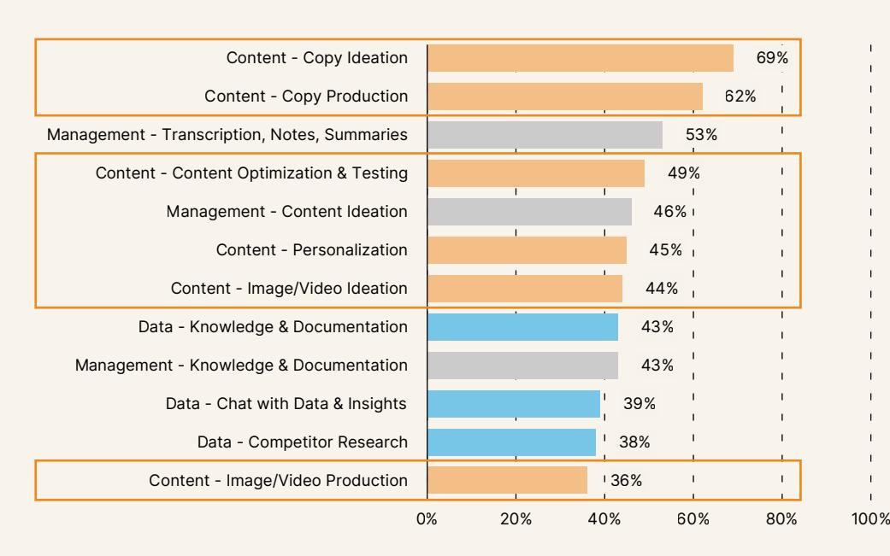

The #3 use case — transcription, notes, and summarization of meetings (53%) — was also one that predated ChatGPT. Zoom launched meeting transcriptions in 2018. Companies like Gong built entire businesses around the underlying capability to quickly and cheaply transcribe calls. The cost of this capability has plummeted, making it universally available. Not just for calls, but summaries of support tickets, deal notes, email threads, etc.

As genAI has exploded the amount of content in the world, the parallel ability to reduce that flood of content down to its essence and key

points for quick human consumption has proven to be extremely useful and appreciated. (This summarization capability also poses a challenge to marketers as their target prospects and customers start using it to collapse marketing's perfectly crafted emails and web pages into short bulleted highlights.)

#### Empowering marketers to more easily find and consume more data and information are 5 of the top 12 use cases

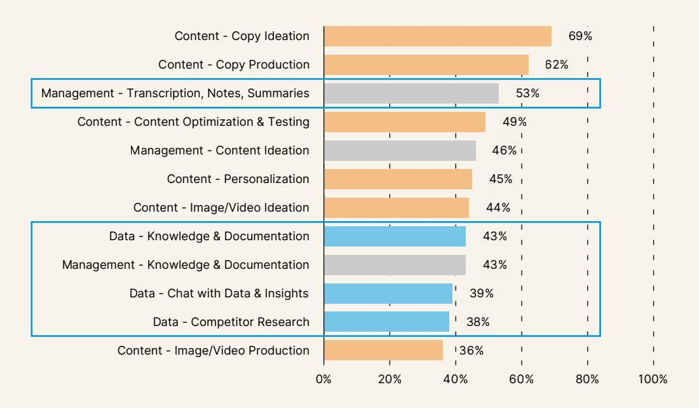

The next most popular cluster of use cases — which kind of includes such summarization — is using generative AI to more easily find and consume data. Better search functionality across databases, documents, and knowledge bases (43% each in management tools and data tools). The ability to engage with analytics by asking questions in natural language, so-called "chat with your data" functionality (39%) is gaining popularity quickly, accelerating the democratization of at least simple, self-service data analysis. Competitive research (38%) has also gotten a boost from genAI, to both collect and synthesize large quantities of competitive content.

Adoption of other use cases starts to trail off from there. But there's still a tremendous amount of experimentation with genAI in different martech tools, albeit distributed across more categories.

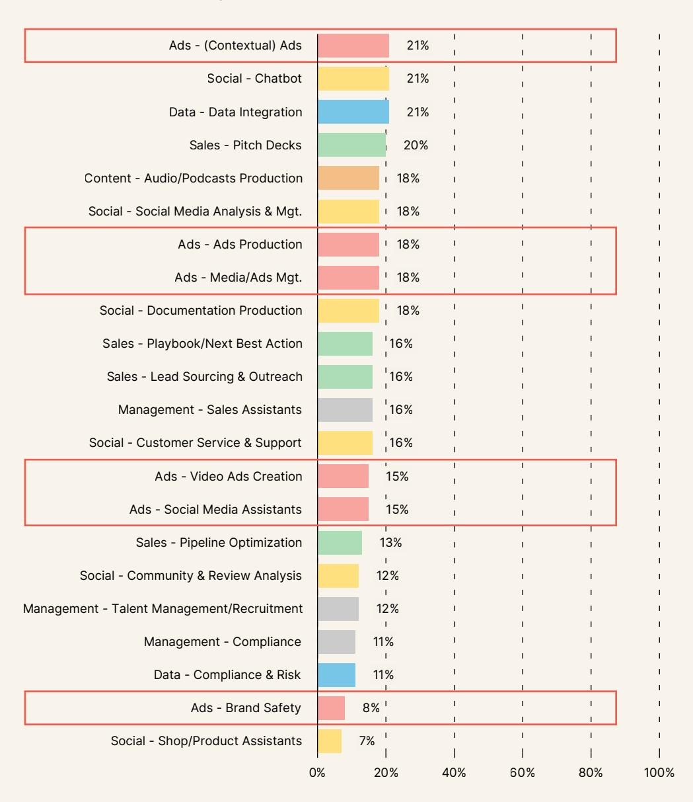

We found it a little surprising that advertising-related use cases showed some of the lowest adoption in this survey — 6 out of the bottom 22 categories. We have several hypotheses as to why. We surveyed more marketers than advertising agencies or creative freelancers. Marketers may not have as much visibility into the evolution of ad production that they've outsourced. Marketers may still be uncomfortable turning over more of the "craft" of advertising to AI. Or, it's possible that they are actually using AI without even realizing it (e.g., Google's Performance Max, Facebook's Advantage+).

With all the innovation happening in the advertising space, however take [Adobe GenStudio](https://business.adobe.com/products/genstudio-for-performance-marketing.html) for one — we expect those adoption numbers will grow significantly in 2025.

If we aggregate respondents using any use case within the six top-level categories of our [MartechMap](https://martechmap.com/), this is the distribution of adoption of genAI use cases reported:

#### GenAI Adoption Agregated by (AIDARI) Category

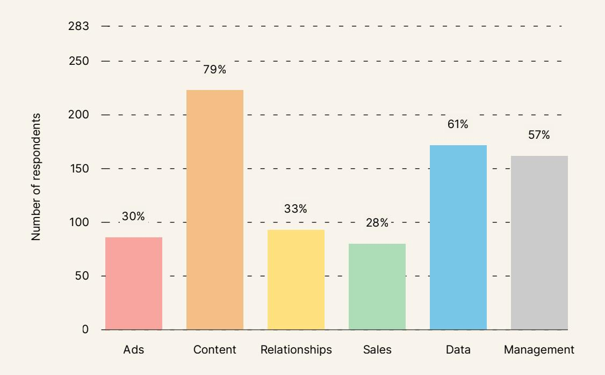

Source: 2024 GenAI Survey, chiefmartec & MartechTribe Note: 816 GenAI use cases were mentioned by the 283 respondents of this survey.

Content, data, and management use cases are the dominant buckets — at least for the audience of marketers who participated in this survey with us. As mentioned earlier, ad agencies would likely index on Ads use cases more, and we expect sales organizations are leaning into Sales and Relationships genAI use cases at a higher rate too.

# New AI Tools vs. AI Embedded in Current Martech Tools

As we covered earlier in this report, one of the interesting tug-of-wars happening within the context of AI is existing martech vendors rapidly embedding AI features in their products and platforms, while brand-new, AI-native startups are popping up by the hundreds to complement or challenge them.

#### How do you use GenAI?

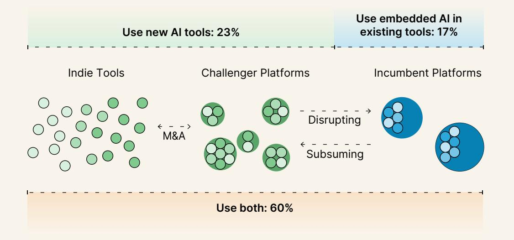

Source: chiefmartec & MartechTribe

We were curious about the relative adoption of new AI tools vs. embedded AI in existing tools for these different generative AI use cases. Overall, while 23% of the usage by respondents was exclusively with new AI tools, and 17% was exclusively with embedded AI in existing tools, the majority — 60% — were using both.

Here's a more detailed breakdown by category, ordered by popularity of use cases adopted with embedded AI in existing martech products:

#### Adoption of AI Tools (embedded tools and/or new tools)

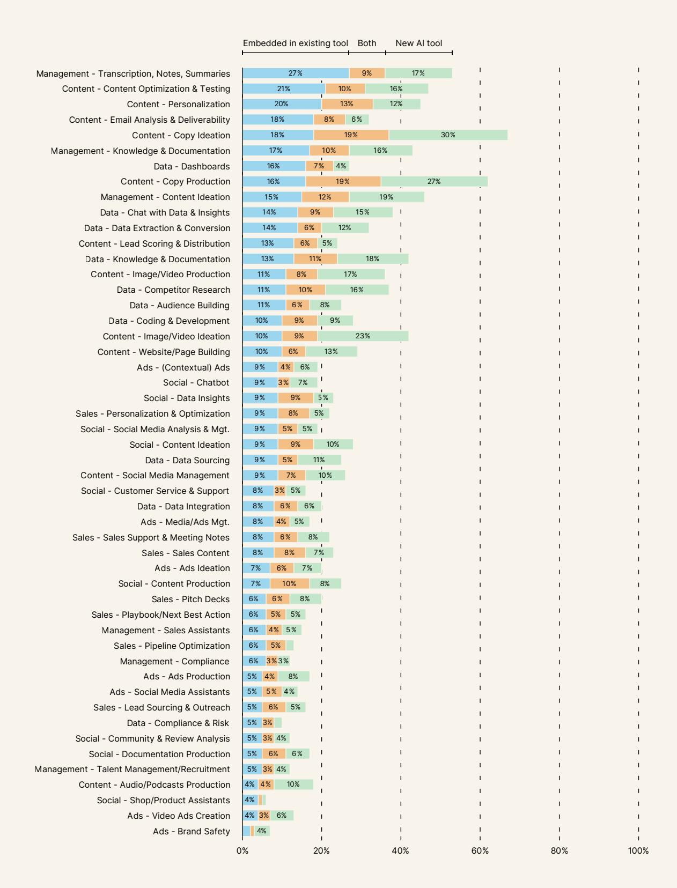

The distribution is similar to the overall popularity of use cases, but with some interesting twists. That the top one is transcription, notes, and summaries (27% using embedded AI, 17% using new tools, and 9% using both) makes sense — again, widely popular tools before the ChatGPT revolution, such as Zoom, already provided this capability. Large sales engagement platforms, such as HubSpot Sales Hub, Salesloft, Outreach, etc., also added this capability.

The next top two use cases for embedded AI were content optimization & testing (31% using embedded AI, either with or without new tools) and content personalization (33%, embedded and both). The existing martech tools in these categories include CMS, DXP, and marketing automation products that are used to create campaign landing pages.

And then the next use case was email analysis & deliverability (26% using embedded or both), functionality that is often part of major email service provider (ESP), marketing automation (MAP), and customer engagement platform (CEP) products.

It's logical that as CMSs, DXPs, MAPs, ESPs, and CEPs — crikey, talk about an alphabet soup! — enhanced their products over the past year with generative AI features that a significant percentage of marketers would start to take advantage of them. In many cases, these genAI powered enhancements slipped naturally into their current workflow in their existing toolset.

The 5th most common use case, copy ideation (37% embedded or both) obviously had a lot of new AI tool adoption — <cough> ChatGPT <cough>. But the fact that it showed up significantly with embedded usage in existing tools is a testament to how easy it has been for current martech vendors to incorporate things like OpenAI's GPT-4 API into their product experiences for this sort of creative text generation.

The last two in the Top 10 we'll call out are #7 dashboards (23% embedded or both) and #10 "chat with data" (23% embedded or both). These are also categories where marketers have had existing analytics tools that they've been using, often deeply integrated into their workflows and operations. As those products added new genAI features — the most common being the ability to ask for a report or a specific answer from a dataset with a natural language query — they were often presented in the UI in a highly discoverable fashion, encouraging marketers to try them.

If we reorder the list to sort by the popularity of using new AI tools indie tools and challenger platforms — we see this reshuffling:

#### Adoption of AI Tools (new tools and/or embedded tools)

The top 10 use cases are again mostly about content (6 out of the top 10 categories) and data, but weighted more towards the production of content, including image and video content. There has been a wave of cool AI image generation and video indie tools over the past two years, which we see in these results (ideation tools at 2.4%, production tools at 2.2%).

Top 10 Use Cases Embedded Tools vs. New Indie/Challenger Tools

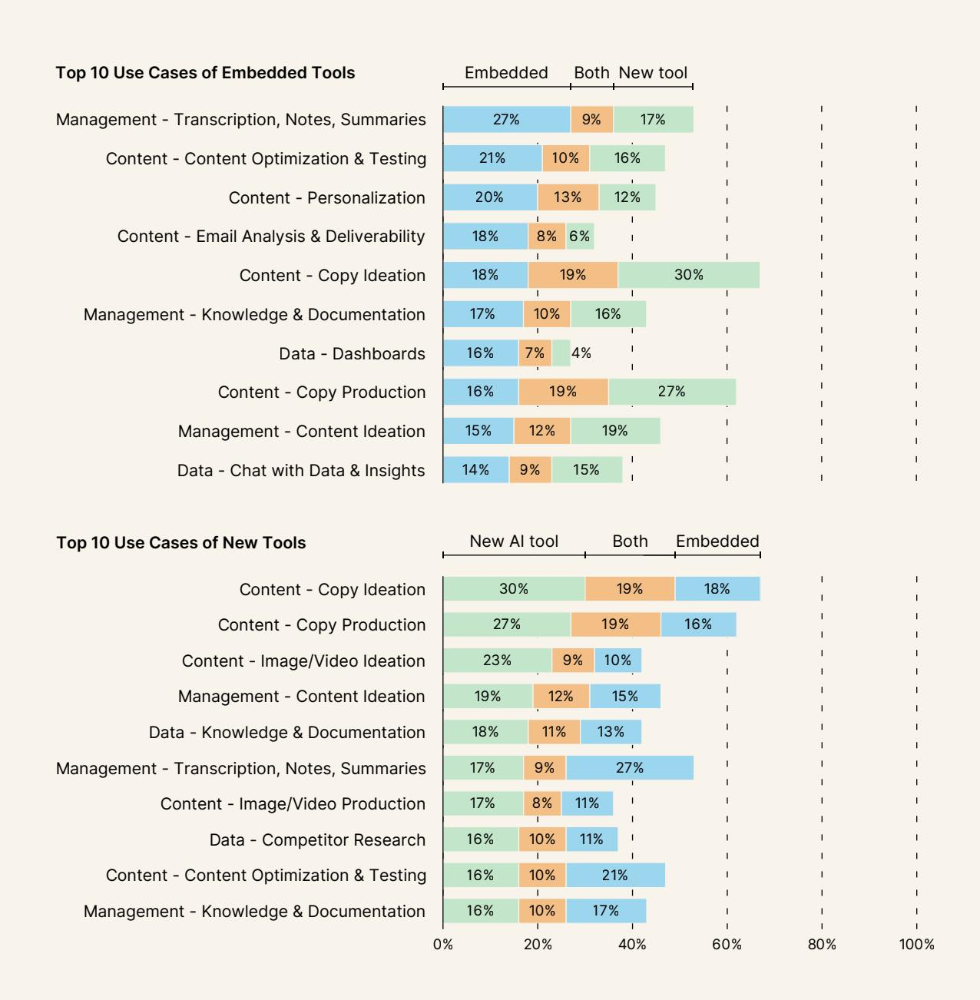

# Frequency of GenAI Tool Usage by Use Case

But, as any martech stack manager knows well, adoption isn't binary. An adopted product can be purchased, but not really used; used, by only occasionally; or used frequently, as an integral part of people's regular work habits.

As part of our survey, we asked about the frequency of usage of these different categories of genAI tools — daily/weekly, monthly, no longer using, or not tried (yet). Here are the results sorted by those most frequently used daily or weekly:

#### Frequency of GenAI Tool Usage by Use Case and Category

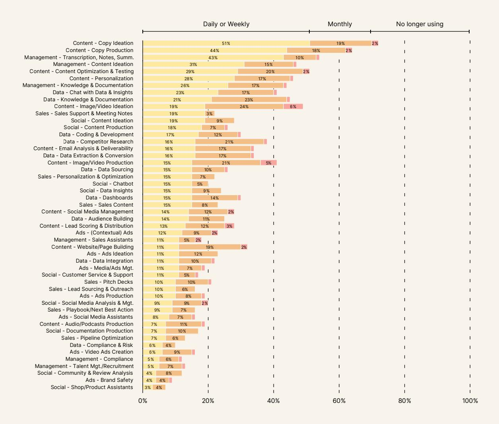

For the most part, the top 10 categories of tools used daily or weekly are consistent with their overall popularity. However, the next few ranked categories show several notable differences.

While using genAI in social media has relatively low adoption overall, those marketers who are using it for ideation or production in that context use it frequently. The same goes for using genAI for coding & development and data sourcing.

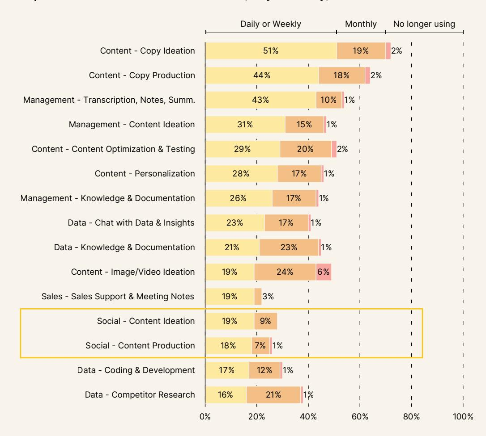

Top 15 GenAI Use Cases Most Often Used (daily or weekly)

This is likely reflective of more specific jobs in marketing: social media managers, app and web developers, and data analysts. Not everyone needs those tools, but those who do, use them regularly.

Relatively few categories had significant responses of people "no longer using" tools that they had previously tried to adopt. This shows

how sticky genAI is, even on such an accelerated adoption curve. The only two with even noticeable drop-off were image/video ideation and creation.

Top 5 GenAI Use Cases Martekers Used but Abandoned

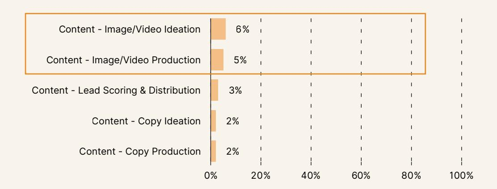

Source: 2024 GenAI Survey, chiefmartec & MartechTribe

While early versions of genAI image creation tools certainly delivered an initial "wow, cool!" factor — the first release of DALL-E, for example they were hard to control for precise design and often produced weird artifacts, e.g., people with three arms and 7-fingered hands. This likely accounts for their relatively larger tried-but-stopped-using contingents.

However, the state of the art with generative AI image generation has advanced significantly over the past year. [Midjourney](https://www.midjourney.com/home), [Adobe Firefly](https://www.adobe.com/products/firefly.html), [Flux,](https://fluxaiimagegenerator.com/) [Recraft,](https://www.recraft.ai/) and more are now highly capable and regularly used by artists and designers, even if only to rapidly prototype ideas for clients. If it's been a while since you've tried.

AI generated video is still in its formative stages, but as models such as OpenAI's [Sora](https://openai.com/index/sora/) become available, we expect these use cases will gain considerable adoption in 2025.

Finally, if we sort the list by the use cases that marketers have not tried yet, we get a sense of where new opportunities to apply generative AI exist:

#### Use Cases That Marketers Have Not Tried (Yet)

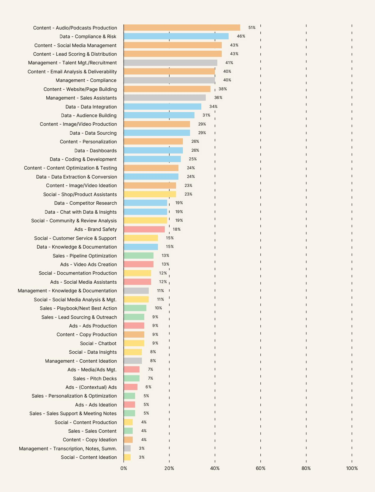

The top yet-to-be-tried use case, audio/podcast production, is somewhat surprising, as there are a number of excellent genAI tools that turn text into high-quality audio: [ElevenLabs](https://elevenlabs.io/), [Murf,](https://murf.ai/) and [WellSaid](https://wellsaidlabs.com/) to name a few. This is a terrific way to repurpose or remix existing text content such as blog posts into multi-modal content. It's an easy way to generate voice overlays. And it also works well for producing translated versions of podcasts and audio tracks.

If you haven't yet tried Google's [NotebookLM](https://notebooklm.google/) to turn large amounts of content — blog posts, PDFs, YouTube videos, whole websites, Google Docs, etc. — into snappy podcasts with multiple synthetic (but realistic sounding!) hosts discussing the key points and perspectives within, you should check it out immediately. Beyond "chat with your data", this is more like listening to your data chat with itself. Fascinating.

# Generative AI Policy and Impact on Usage

We also asked respondents if they had a policy in place for how generative AI could/should be used within their organization. The results were about 50/50 — 48% had no policy in place, leaving individual teams free to decide acceptable uses. A bare majority, 52%, had a genAI policy.

#### Do you have a GenAI policy?

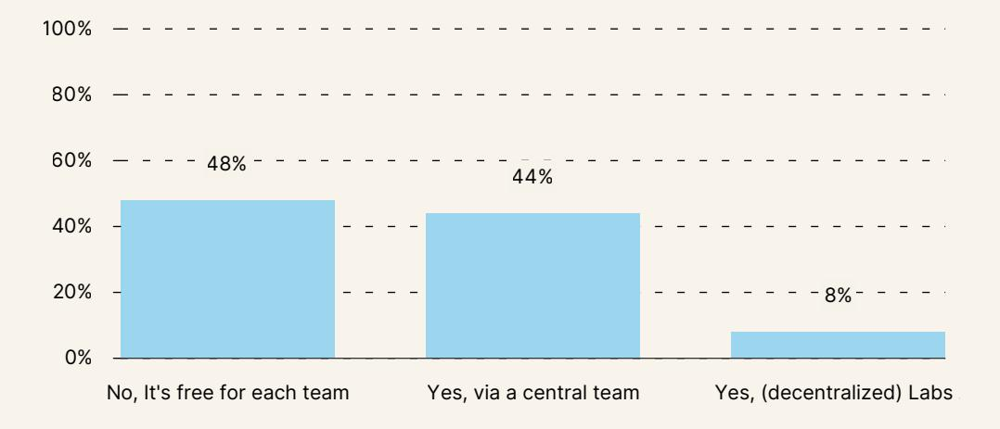

Source: 2024 GenAI Survey, chiefmartec & MartechTribe

Most of those with a policy had it set by a centralized team that spanned departments across the organization. A small number had a policy controlled by a decentralized "AI labs" function that limited AI to a separate team experimenting in a more sandboxed fashion.

The presence or absence of a policy showed material effects on genAI use case adoption. For example, when we asked people why they stopped using generative AI tools, the most common answer — other than the maddeningly vague "Other" — was that it didn't save time (35%). Compliance reasons for stopping were cited only 12% overall.

#### Why did you stop using GenAl tools?

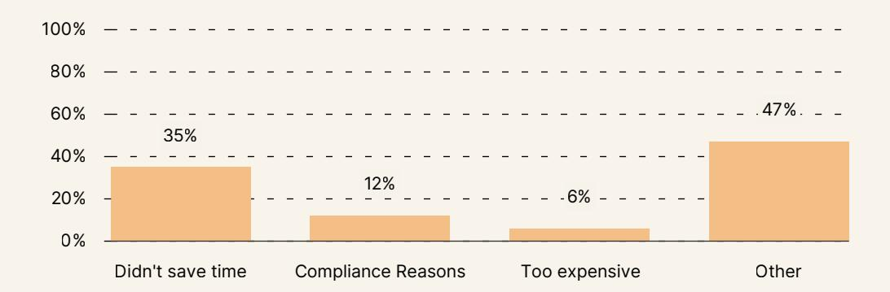

Source: 2024 GenAl Survey, chiefmartec & MartechTribe

But when we segment the answers to why people would stop using generative AI tools based on having or not having a genAI policy, some interesting differences appear.

Naturally, stopping for compliance reasons had a substantial delta: 8% for those without a policy vs. 19% for those with one.

More interesting was that those with a genAl policy were more likely to stop using a tool because it was too expensive (14% vs. 3% for those without a policy), suggesting that a governance framework helped raise awareness and/or enforced guidelines around the cost of genAl usage.

### And do you have a GenAl policy?

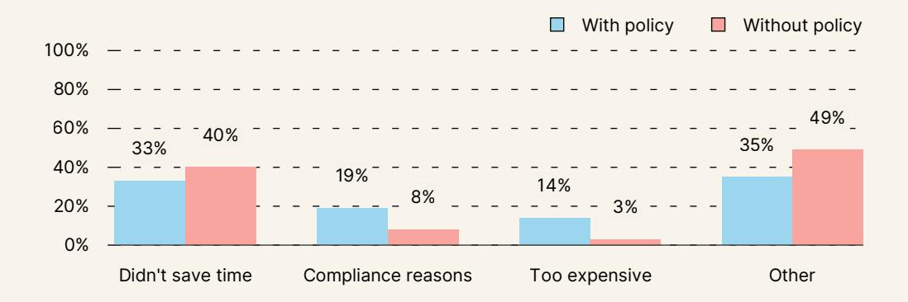

Those with a policy were less likely to give the indeterminate "other" reason for stopping usage as well — 35% with vs. 49% without — also signaling a sharper understanding of genAI and when to use it. That explanation of greater AI maturity is also bolstered by the data that those with a policy were less likely to say a use case wasn't saving them time: 33% with vs. 40% without.

### What GenAI type are you using? Do you have a GenAI Policy?

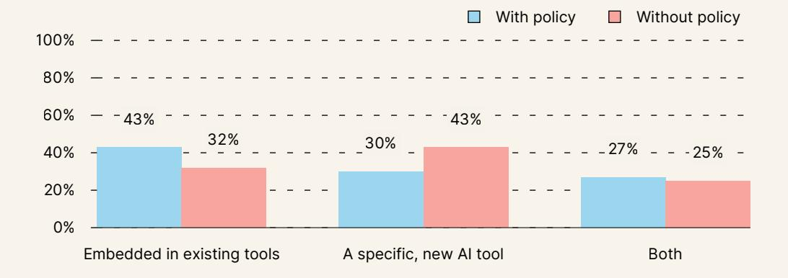

Source: 2024 GenAI Survey, chiefmartec & MartechTribe

One other difference worth noting: those with a policy were more likely to use genAI embedded in existing martech products and platforms (43% with vs. 32% without). Inversely, those without a policy were more likely to use stand-alone, specific AI tools (43% without vs. 30% with).

It would make sense that those without a formal generative AI policy yet are still experimenting with isolated and/or inexpensive tools there's no shortage of free generative AI tools on the Internet. As a company matures their AI strategy and operations, they'd be more likely to adopt genAI capabilities in their primary martech products and platforms, with clearer governance.

# Demographics of Survey Respondents

Which industry does your company operate in?

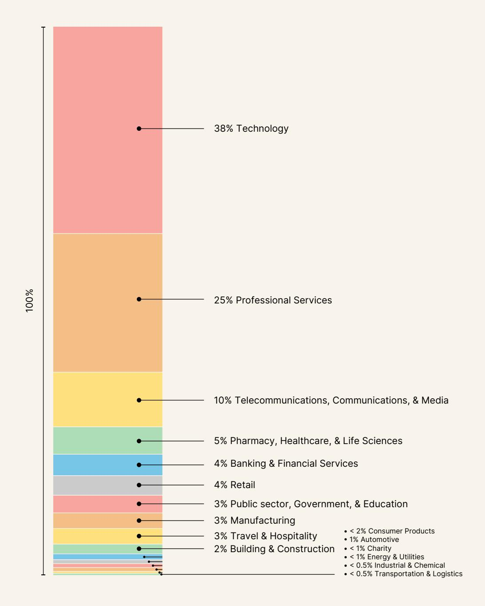

#### What is your role?

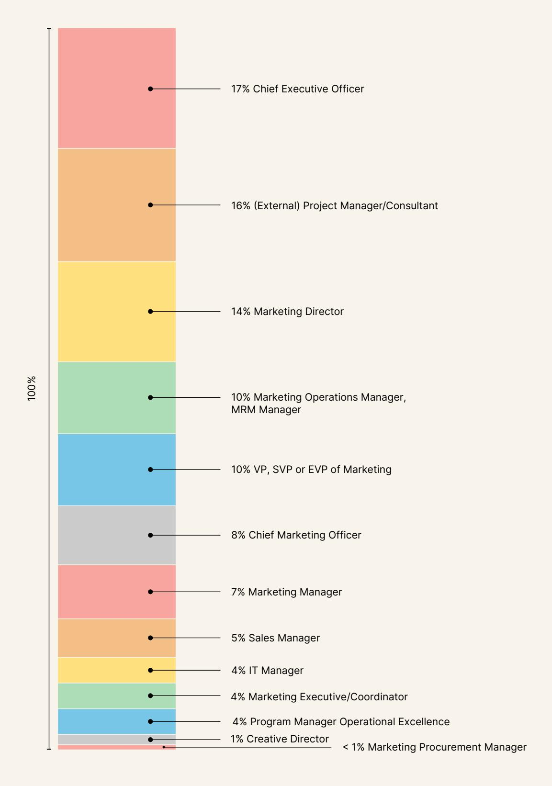

### 4. Five Perspectives on Martech for 2025

# End-to-End Marketing on Your Data Cloud with AI

A conversation with Chris O'Neill, CEO of GrowthLoop. The following is an edited transcript of our discussion.

Chris, we're so excited you're joining us. You took over as CEO of GrowthLoop earlier this year. Could you start by telling us a bit about GrowthLoop and your background? You've done fascinating work in this industry from a number of different angles.

GrowthLoop is a data and AI platform that helps enterprise teams get more value out of their customer data by launching highly targeted, impactful campaigns directly from their data cloud. Our tool helps teams ingest, organize, and activate data across any marketing or sales destination. After re-ingesting campaign results back into the cloud, our AI engine can analyze those results and make recommendations on how to improve future campaigns. We call this The Loop, and it helps marketing teams launch faster, smarter, and more powerful campaigns that ultimately drive real business outcomes.

In terms of my background. I've been in this game for a while. I was really fortunate to be at Google for about 10 years, from 2005 to 2015.

I've had a variety of roles since, leading teams at other tech companies including Glean, Xero, and Evernote. I also serve on the board of Gap, given my interest and background in retail.

It was a really nice run at Google, and I'm happy to be back in the marketing technology world. I found myself back in this space because of the GrowthLoop team and the promise of what artificial intelligence can unlock for enterprise marketers.

During my time at Google, martech was essentially born. I witnessed Google go from kind of an afterthought to being, of course, an important part of every marketer's arsenal. It was also the early days of machine learning, and we started to see what it could really do for the industry. I see the same promise now with AI and its incredible potential to transform our field.

Similar to that time period when you were leading Google Canada, and martech was taking off, we're now in another major wave of innovation and transformation with AI. How similar or different is it this time? And what lessons should we bring with us?

That time at Google was really a story of movement in media, from analog to digital.

If you think about artificial intelligence, it's not a new concept. It's been around for a long time. In fact, it was coined in the 70s at my alma mater, Dartmouth College.

There are three required conditions for any big leap in artificial intelligence.

- 1. The availability of near- or real-time, high-quality data.
- 2. Task-specific algorithms
- 3. Courage. It takes courage from practitioners to say, "There's a better way to do things, and we're going to try it."

So, if you think about Google in the early 2000s and 2010s, it was applying machine learning and artificial intelligence to advertising. Historically, media mix was determined by gut and feel. It was much simpler then, but as channels proliferated and we had actual data to

quantify the impact, that all changed.

You had the availability of real-time data, both on the demand side and the supply side for advertising. You had task-specific algorithms that would measure if we served ads, and if people responded, clicked through, or took an action downstream. And then you had a lot of courageous people.

Those were the folks I enjoyed working with the most: courageous, ambitious people who were bold enough to try something new by leaning into digital instead of newspapers and TV.

Those conditions have existed, whether you're talking about Moneyball with baseball, AlphaGo, or self-driving cars. It comes down to the availability of data, task-specific algorithms, and courageous practitioners who push the edge of what's possible.

So that's the backdrop and similarities of what happened at Google back then.

So, what's different, what's changed, and why are we seeing so much excitement? Why am I so excited? There are three driving forces:

The first goes back to the growth and adoption of the cloud data warehouse. Over the last 10 years, more teams have seen the value in centralizing their data in platforms like Redshift, Snowflake, BigQuery, or Databricks. That's huge.

The second is the rise of composability in martech, or the ability to have tools that serve a specific function and can plug and play with one another. With a composable tech stack, you're not locked into one system and one vendor. Instead, you can mix and match and have best-of-breed tools that fit your specific needs.

The third, and arguably the biggest, is the rise of agentic AI — the ability to have autonomous or semi-autonomous agents do specific tasks like data ingestion or data scoring. These agents can also manage outcome-specific tasks, such as building audiences or customer journeys. In other words, name an outcome you'd like from a campaign, and the AI can generate the audience or journey that will deliver that outcome.

We're starting to see some seismic forces, these tidal waves of innovation happening in the form of data clouds, composability, and an agentic AI boom.

Speaking of courage, a category of martech that's had an absolutely meteoric rise over these past five to eight years is composable CDPs. But that category is now going through interesting shifts given what's happening with AI. How do you see the category evolving?

I think a lot of change has happened, but at the same time, there hasn't been much change at all.

What I mean by that is you had the formation of SaaS and stand-alone systems of record. It started with monolithic systems that each sat within a different area of the business: finance had NetSuite, HR had Workday, and marketing had ExactTarget and Salesforce.

But now there are more channels and more cross-channel orchestration opportunities to talk to different customer segments in different ways, meeting each customer where they are. Teams had to bring these systems and data together, not just optimize within a particular silo. This drove the need for a new kind of system of record called a Customer Data Platform, or CDP.

Traditional CDP development was very important at that time. Now that seems to be fading in favor of composability and the gravity of the data clouds. That's what is most exciting to me. It's not just that the data lives there in the cloud. There are obvious cost advantages, security advantages, and agility advantages to keeping data in fewer places. And that's why we're seeing the beginning and continued boom with the data cloud.

But now we have the ability to use artificial intelligence at every step of the way. Agents will be really good at analyzing data and thinking of data schema and those sorts of things. We're already experimenting with that (and seeing success) in our product.

Next, how can we orchestrate customer journeys intelligently? How can we extract the right information, get suggestions, and act upon them? How can we figure out the right permutations of the best journeys, determined by the outcome that you care most about:

preventing churn, acquiring a new segment, navigating a category slowdown.

I see a world where there's outcome orientation and AI agents that serve that objective, in partnership with humans who bring their own level of ingenuity and creativity.

I believe these things will come together to create audiences, to orchestrate across surfaces, and — most importantly — understand what's working so it can, in proverbial "Moneyball" terms, do more of what works and do less of what doesn't. And then start it all over again with more suggestions.

It's definitely a compelling picture you're painting. Can we get more concrete about how this is working today? Can you explain "The Loop" and how your customers are using it?

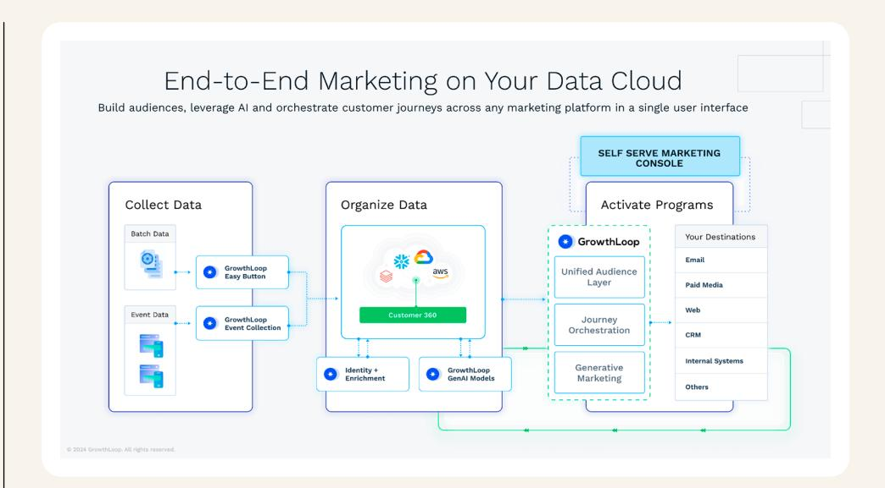

Whether you use BigQuery, Snowflake, Redshift, or Databricks, we're native to those cloud environments.

Artificial intelligence is going to have a multiplying effect on both the amount and quality of campaigns marketing teams will run using the data in the cloud. Very tactically, you can say, 'Create some interesting campaigns or audience ideas for me.' Or you might type

very specifically, 'We are lagging in customer consumer electronics in the West. Come up with some interesting audiences that might help me address this top-level business objective.' And out pops, in mere seconds, a whole bunch of audiences built from your own first-party data in the cloud.

Then you can say, "Let's act on this, this, and this. We're going to test this through 5% or 1% holdout to understand what the true incrementality is." You then set the campaign journey up to send an email, serve up personalized in-app messaging, whatever it is. The journeys can be simple or as elaborate as they need to be to achieve the goal.

You launch those campaigns across your channels. And then you re-ingest the performance from the various platforms back into the data warehouse. We have a dashboard, which is basically a lightweight business intelligence tool that reports in business terms, that details what happened across campaigns. Suppose you're trying to change consumer electronics sales in the West and launched a set of campaigns across various channels. You can use this intelligence tool to see whether you actually moved the needle. Should you do more of the things that work? Should you shift your approach?

The audience creation is where we started — just getting marketers unrestricted access to their first-party data for campaign creation. It's the beginning of The Loop. But thinking about how you orchestrate and optimize into the different downstream surfaces is something we're training AI on right now by using all sorts of different LLMs. We're earlier in that journey, but have some brave customers, some courageous customers, who are with us on that journey and having fun with it.

#### Let's talk a bit more about this hot subject around AI agents and agentic capabilities. From your perspective, what's real and what is hype?

Well, there's definitely no shortage of hype. Let's be clear about that. But there are a lot of real solutions deployed in market now.

For example, Glean uses agents for internal knowledge discovery.

You can index and understand all the information that lives inside your company so you can know what your company knows. I helped launch Glean out of stealth and had so much fun. That team is doing really great and I'm so proud of them.

There's another company I'm involved with called Ema. They use persona-oriented agents to augment horizontal workflows tailored to a specific persona or a specific vertical use case.

I think you're going to see a lot more agents serving tasks and outcomes. We'll start with tasks because that's where the semiautonomous or the purely autonomous nature of agents can really have an outsized impact. There's a lot of grunt work or not-sexy work that needs to happen just to make sure data is in the right place. I also see a role for it governing data processes, making sure that agents are behaving and that your governance models are being enforced.

That's where I'm seeing interesting players think through task orientation and then outcome orientation. So we're creating audiences that way now. And then we're working on journeys and decisioning and campaigns. Then the real magic starts when you can optimize across all of those different outcomes with a higher-order business outcome in mind, such as churn or customer lifetime value.

As Bezos wrote about Amazon, a company's job is to maximize its intrinsic value, which is really the discounted cash flows. If you want to roll all the way up to enterprise value, that's how I see the full game being played.

AI is now added on top of so many other innovations that marketers already have to deal with. So it's almost like a plane that you need to upgrade while flying it. Do you have any tips and tricks, ideas, or observations around this?

My advice: it has to start with the data.

The expression we've used for a long time that came straight from our CTO, Tameem Iftikhar, and is starting to take hold: you don't have an AI strategy if you don't have a data strategy. You have to get the

data in the right place. You have to have governance. Without that, the rest doesn't really matter.

So I think that that's where it starts. That's my first bit of advice.

I also think there needs to be a shift away from splashy demos to more of a focus on outcomes. You can't test for wow factors. I think that's the phase we've been in with AI — you got me with the "wow".

But how do you show me the "how" and the "now" of the impact of AI? That's the era that we're moving into. People need to be clear about the outcomes they're trying to achieve. What is a specific business problem you're seeking to solve and utility you're looking to get from these models or tools?

And then really demand to know how the AI tool can scale. It's one thing to do a fun one-off demo. But if it doesn't scale to meet your compliance and your data and your governance requirements, then it just doesn't work. It's not worth it.

So that's where I think we are right now. We're in that "show me" phase.

Earlier you mentioned good data and courage. We love that you're combining technology on the one hand and human factors on the other. What organizational changes are going to be necessary for businesses to unlock the potential here?

Yeah, I think a bunch about this. When we engage in conversations with senior executives, I'd say the wiser ones ask this question: How do I bring about change?

First, I'll come back to acknowledge that the data assets themselves are incredibly valuable and you have to invest in them and remove potential silos or barriers that exist. The data has to flow and there has to be clarity of ownership over that. You have to assign clear accountability. This game begins and ends around the data.

Then I encourage cross-functional behavior. So if you think of Amazon's two-pizza team concept, part of the beauty of that model

is that they bring a designer, an analyst, a product person, and an engineer together as a small team to build things quickly in iterative cycles.

This concept of agile software development also applies to business. There've been times in my career when I've used agile for everything down to legal queues. It's not perfect, but it's surprisingly robust.

What I'm really getting after — and hoping to coach people through is to take an outcome work-back orientation. And then adopt an agile software development mindset to pursue those outcomes, knowing that you may not get it right the first time.

Part of what we talk about with The Loop is we want people to get through their first Loop as quickly as possible, even if the learnings or the lift isn't as dramatic as they might hope. But the expectation is that by going through and learning, the results will compound. You're going to do more experiments and you're going to learn faster. It's iterative in nature. And the beauty of these tools is they're cost effective in that iteration.

You go through loops from hypothesis all the way through to outcome very quickly.

The last thing I'd say to business leaders is to encourage a culture where it is okay to fail. When you're doing this, the courage part is creating time and space to allow people to experiment so they can find better ways. Often they're not Eureka things. They're compounding little things. That's the nature of this. So the mindset isn't, "Eureka we're going to all of a sudden unearth some silver bullet that we've never known before." It's a game of compounding small differences and small benefits.

I think that's true in life, and it's certainly true in marketing. It's all those unsexy things that can be compounded in those little insights. I get to act upon more with more speed and more force. That's how I coach people and think about this with change management.

#### For marketers facing all this change, all this opportunity, all this challenge for 2025, what parting advice would you give them?

I would say, carve out room, budget, and energy for experimentation.

Think big, but start small. It doesn't need to involve betting the farm.

This concept of agile marketing is real.

And the goal is to think about marketing as an investment, not a cost center, that delivers very quantifiable and real ROI.

### Why the Next Wave Beyond CDPs is AI Decisioning

A conversation with Tejas Manohar, CEO of Hightouch. The following is an edited transcript of our discussion.

#### Can you start by telling us a little about Hightouch and your background before founding the company?

Before founding Hightouch, I was one of the first ten engineers at Segment, one of the companies that helped initially define the Customer Data Platform (CDP) category. Back then, nearly a decade ago, the idea of a CDP was still new, and the space was just starting to take shape. While building at Segment, I saw firsthand how hard it was for enterprises to manage and use customer data effectively — especially at scale. Those challenges stuck with me and inspired the vision for Hightouch and the Composable CDP: a more flexible, scalable way for businesses to activate their customer data.

You've certainly shaken up the CDP landscape. A couple of years ago, you wrote a viral post that was titled, "Friends Don't Let Friends Buy a CDP." Quite the barn burner, as I recall. What was your thesis, and is it still relevant today?

So, first off, the thesis is very relevant today.

The thesis at a high level was that instead of CDPs being a new data source in a company, where it's a database that has all your

customer information built explicitly for marketing and customerfacing purposes, companies should invest in a data platform that they can use across the whole business.

So many companies are already making this kind of investment with Snowflake, Databricks, Google BigQuery, or one of those cloud data warehouse technologies. The CDP should be a software layer that sits directly on top of that data and makes it available for marketing teams to access with an audience builder, start activating across their channels, orchestrate journeys, and understand how their campaigns perform.

The CDP should be a marketing layer on top of the data warehouse.

Why must companies have a CDP directly on top of the data warehouse or data platform? Well, it's because of the problems I saw at Segment.

There's always been demand in the CDP space. Everyone has wanted a CDP. Who wouldn't want a database that has all your customer information and lets you use it any which way?

The problem comes with implementing it and getting to that golden state where marketing teams can access all the data in one system. In a small company scale, let's say like a Shopify store or a smaller, simpler e-commerce brand; it's pretty feasible to implement something like Segment or a traditional CDP, where you get all your data into this new system in a nice format, like users and the events that they've taken on your website and so forth.

But when you start going to more complicated businesses, like an enterprise with in-store purchases and 10 years of legacy systems. Or just like companies with complicated business models, like financial services companies with tons of different products, B2B consumers, B2C consumers, and households with multiple accounts. It becomes really difficult to represent all that data in a CDP. Most CDPs have an opinion of how your data should look, just like any SaaS system. Whereas a data warehouse is entirely flexible.

Also, with stand-alone CDPs, it's just a lot of work for a marketing

team to ask IT, data, and engineering teams to get all their data into that new system — especially when there is likely already an initiative at any company of that scale to get all their data into a system designed to be the company-wide data platform, such as a cloud data warehouse.

So the idea behind a composable CDP was if we really want to achieve a source of truth in a single platform across the business, the only way is to invest in the one that's taking off across the data and IT world, which are these cloud data warehouses.

While this concept sounded great 10 years ago, when I was working at Segment and helping create the CDP space there, it simply wasn't possible. The maturity of cloud data warehouse solutions and their adoption wasn't there. But at this point, it's pretty clear that's the standard that all companies are adopting and moving towards.

It's time to marry the worlds of marketing and IT in the data warehouse.

#### The phrase Composable CDP definitely caught on. Overall, composability has become a rallying cry — if not a buzzword — in the martech industry. What makes a product truly composable?

Composable is being used in many different ways across different categories of martech. In some spaces, like CMS, it's associated with the concept of "headless." Sometimes people say, "Oh, is a Composable CDP kind of like a headless CDP?" Actually, quite the opposite. We probably emphasize the UI features for marketers much more than other CDPs because that's one of our biggest value props.

In the space of CDPs, composable is a generational shift but with a few core attributes.

First, composable solutions need to sit directly on top of the data warehouse. Data should not be copied. They should be able to sit directly on the data warehouse and operate on it, reading and writing from that system.

Two, composable CDP solutions should be agnostic to your company's data format and schemas. For example, traditional CDPs all have an opinion of how your data should look–they put it into users and events. Maybe there's a product collection over here you can use for some product recommendation features. Maybe there's an account entity in some companies like Segment with B2B customers. Either way, traditional CDPs have a predefined list of ways to work with your data.

With the Composable CDP, it needs to operate directly on top of whatever table structures and formats you have in your data warehouse. That's a crucial distinction that creates a huge advantage in delivering value quickly: the ability to sit on top of your data in its existing format, not going and asking people to reformat it, which is a long upfront effort as well as continuous effort.

Third, CDP is not really a single set product; it's a set of use cases. CDPs are known for collecting data, resolving that into identities, helping marketers access it, and helping marketers activate that data across all their channels. Activation is the end goal, right? You want to use that data to personalize experiences across marketing, service, your website, ads, etc.

However, not every company needs to follow the same linear path to get there. Some companies are happy with their workflow today in those areas. Maybe they have Google Analytics that they're satisfied with for now for data collection or existing ETL processes. Maybe they have an SQL query they're happy with for identity resolution, or they're using a third party like Neustar, and they just don't want to change that right now.

A key feature of a Composable CDP is that you should be able to just buy the components that make sense for your business. At Hightouch, we offer solutions in each of those product categories. Still, many of our customers just use us for activation or audience building because that's what they need while their IT teams sort out the rest, like event collection or identity resolution. It's composable. You pick what you want and just pay for what you want.

Looking at that view of multiple different components that you can deliver to customers, you recently released a product for AI Decisioning. What is this, and why was it a natural next step for you?

I'm glad you asked about this because AI Decisioning has been my personal project with the team for over a year now. We just came out to market, but it's really getting us excited about the long-term vision of Hightouch.

AI Decisioning is a software platform. It's offered by Hightouch, but it sits parallel to a CDP. You don't have to use Hightouch as your CDP in order to use AI Decisioning. You can buy it even if you're a customer of another CDP – ActionIQ or, Salesforce or Adobe or Treasure Data — or no CDP at all, and you're doing it all in-house. You can set AI Decisioning on top of any data platform.

Now, what does it do? To date, when marketers want to determine which customers receive which campaign, they have to do that by hand for the most part. They're building audiences. Even with a platform like Hightouch that helps them build audiences with much richer access to data through the data warehouse, marketers still have to make those audiences and still have to build those journeys.

The idea of AI Decisioning is to turn marketing into a higher-level, strategic, outcome-oriented process where marketers can come in and input the goals into the system. "I want to drive customers towards downloading my mobile app. I want to drive them towards doing cross-sells. I want to drive them towards booking more business trips with us." Weight these goals based on how important they are to the business.

Then, give the system a set of different actions you're willing to take with the customer. With Hightouch, we integrate with 300+ systems at this point. So you can put in email campaigns that you have in Salesforce Marketing Cloud, Braze, or Iterable. You can put in offers you're willing to give customers in an offer management or a loyalty system, etc.

You then provide the system with access to customer data to learn from. AI Decisioning then decides which customers should receive which actions and does automatic experimentation at a high scale

to figure out the optimal combination to balance and achieve your business goals.

We're focusing on lifecycle marketers in particular right now, but this can apply to any marketing practice that has a large amount of data. Marketers can think more about the outcomes they want to drive in the business and the data they can serve the AI to make those correlations, and then let the AI drive more of the tactics and execution.

#### Can you share a few real-world use cases or examples of such AI Decisioning in practice?

I'm happy to. Unfortunately, I cannot name customers right now when I share these use cases, but I can talk about them in a fairly concrete way.

One example is that we have a very large retailer using AI Decisioning, a Fortune 1000 type company. For them, a lot of their sales happen in-store. So, while all the rage right now is e-commerce and digital, this business differentiates more through in-store experiences. That's their competitive advantage that they want to leverage.

So, they have certain things that they know will get customers back in the store. That's not the area they make the most money in, but they know if they get the customer in the store more frequently, they make more money. They want to drive customers to take actions that correlate with higher store visits and thus higher LTVs, like checking their offer book on the mobile app, activating an offer, or using an in-store service that is unique to their business that their competitors don't offer.

This company had been trying different campaigns to drive in-store behaviors for years. They've run campaigns on email, mobile push, and SMS to try to persuade customers to take some of these strategic actions. These campaigns were effective. They were doing holdout tests to prove this.

However, the problem is that the results, like the conversion rate from these campaigns, started to plateau. So that's when they decided to

try AI Decisioning on the problem. They loaded up all the campaigns that they had previously built to drive these strategic actions, particularly the in-store services.

With AI Decisioning, then analyzing the customer data and doing experimentation to figure out which campaigns resonate with which customers and at what frequency, we were actually able to drive a 50% performance increase compared to the manual marketing efforts they had been optimizing by hand for years.

Now, will that taper off over time? Potentially. But we're still estimating growth in the 30-40% range, which is quite impactful for a company of their scale.

#### What kind of AI is this? Are we talking about classic AI, machine learning, or is this generative AI?

So, it's not generative AI at its core. While there are opportunities for generative AI in AI Decisioning, AI Decisioning is about being scientifically rigorous with data and reacting to new data quickly and at scale. The best technology for this is actually reinforcement learning.

The core of AI Decisioning is a reinforcement learning system with some pretty fancy back-end engineering and orchestration around it. It's not like a typical data science workflow where we build a model, you know, one-off for a customer by hand. It's an automated system that creates reinforcement learning models on a per-customer basis.

The important thing about reinforcement learning is that the system can take action on customers, learn from how customers react to those actions, and incorporate that learning into how we handle the rest of the customers. Overall, we're using machine learning to do high scale experimentation and using things like contextual bandits in the architecture.

Is there a role for generative AI somewhere in that AI Decisioning process? Where do you see that coming in?

There are two very exciting opportunities that we see for generative AI in the framework of AI Decisioning.

Ok, so here's an example for opportunity number one. Let's say you're trying to get customers to download your mobile app. You load in a hundred different emails to AI Decisioning with different offers and discounts.

At a basic level, you would think machine learning would recognize Email\_A is different than Email\_B, but that's it, right? What we've started to do is use generative AI to create more features on the emails (or push notifications, or whatever) — about the text itself, or the offers in the messages. So we can compare these emails at a deeper level. We think about them at a deeper level, the same way Spotify thinks about music recommendations at a deeper level – a wider set of characteristics that are similar across songs and why you might like others that share those characteristics.

So our first, simple use case of generative AI is creating more features on the content and actions you're willing to send to customers so that AI Decisioning can get more intelligent on the recommendations faster. And this approach can apply to more things than just content and customer actions. There are a lot of interesting use cases of using that genAI on unstructured data like, let's say, customer support tickets. Some of our customers are doing this in-house today.

Opportunity number two is to use generative AI to actually help personalize.

Today, AI Decisioning is looking at everything about your customer base, trying to optimize your marketing orchestration towards a certain goal, and coming up with these correlations, such as customers in rural areas like this email or customers with these other characteristics convert really well on this goal of yours. And when it finds these correlations that impact marketing orchestration, we act on those correlations to choose the right contact strategy for the customer.

Now, imagine a world where AI Decisioning realizes a correlation and then suggests creating more content specifically for that correlation.

It could generate a prompt jam-packed with information from the data about what's working and what's not working.

You give that prompt to your email marketing team or your brand designer and have them iterate on it. Or potentially we could integrate directly with companies like Typeface. Maybe ChatGPT will be great at generating creative by that point. You start automatically coming up with new creative and new content that you feed back in the AI Decisioning system.

To be clear, this second opportunity is not us specializing in creative generation but instead looking at the data and understanding the patterns of what creative and content you should make next. It's almost like a sidekick brain for the marketer.

#### If you go back to today's state of AI Decisioning, if you want to implement it effectively, what do you need to have in place? Data readiness upstream? API accessibility downstream?

So one thing I should make clear is what use cases work really well for AI Decisioning and what use cases don't. We need a clear feedback loop and we need high scale to optimize things with AI Decisioning.

If you don't have enough customers, it doesn't matter how valuable they are. Maybe you're in the hyper luxury segment, and you make a lot of revenue, but you don't have enough customers, and you don't have enough actions we can optimize, enough customers clicking through on the emails or doing things on your website, then there's just not high enough scale for AI Decisioning to learn.

The more data you have, the faster the system can learn and the more effective it can be. As a result, the use cases that are really good for AI Decisioning are at high-scale enterprises, typically B2C companies, that have a strong digital motion, in contrast to B2B companies that are more sales-led.

In addition, AI Decisioning is best for campaigns that you're running over a long period of time, such as evergreen marketing and business initiatives. How do I get customers to download my app?

How do I get them to activate their first offer? How do I get them instore more? Those are likely to be top initiatives at your company for the long term.

Compare that to initiatives that are more seasonal or one-off, which could be very high-value but that aren't a great fit for AI Decisioning. Like dropping a new product line and partnering with a huge celebrity. Seasonal one-off examples would be things like acing marketing for Black Friday week or for Christmas, when shoppers are going to be going crazy. Those types of campaigns don't work as well with AI Decisioning, which needs a tight feedback loop and the ability to experiment with customers over a longer period of time due to the nature of reinforcement learning.

Back to your question, what do you need to actually use AI Decisioning in an enterprise?

First, you need a use case that fits the criteria: a high-scale use case that's evergreen. Second, you need some level of data maturity at the company. The reality is that AI Decisioning is only as smart as the underlying data we have to make the correlations.

If you are doing high-scale, evergreen campaigns with manual audience segmentation in Salesforce Marketing Cloud today, we can often lift that performance just with the data that is in those platforms with AI Decisioning, optimizing towards just something simple like purchase. But to really get value and see a big lift from the system, you need more data about your customers – like what they're doing on your website. If you're in financial services, maybe it's third-party data from like an Acxiom. But you need to have more data, and you need it in a somewhat central place. It doesn't have to be a 10-year investment you've made in Snowflake. But it does have to be somewhere where you can give us a centralized view of data about your customers. We've even had some customers start to plug in AI Decisioning into another CDP.

Lastly, you need a good amount of content. Orchestration and experimenting on how we orchestrate content can only be as valuable as the content itself, and different content needs to provide a higher lift in order for this orchestration stuff to be valuable.

That is one of the bigger and more interesting bottlenecks. If you have five emails that are mostly the same, how much incrementality are we actually going to be able to drive by changing who we're sending what?

#### Are there trust issues with letting AI Decisioning run without a human in the loop? How do you mitigate that?

One option is to always start with a small use case. For example, start with just 10% of the customer base, or start with a use case that isn't going to blow your business if it stops working tomorrow. Most of that is psychological, but it is something we see our customers do as they're starting to roll this out.

But trust, in my opinion, really comes from visibility — from understanding what's working. And there are three layers of it in our system.

The first level of visibility is at an initiative level. So in AI Decisioning, the AI doesn't just look at your data and marketing and start going crazy. You have to configure the system for it to operate. You create this concept of flows – where each flow is a different initiative. So one flow is pushing customers to in-store services. One flow is getting customers to download the mobile app. One flow is for cross-sells. You say how much these flows are worth to you. You put in all the actions that could help drive your desired outcome. And then AI Decisioning starts operating and balancing between them.

You start getting visibility into these flows by running an A/B test. How does AI Decisioning perform versus your manual marketing or versus a holdout? Is it statistically significant? What's the actual incrementality?

The second level of insight is at an operations level, so you can understand what the AI is doing and the patterns it's finding. So you can look in the platform and see, for example, that AI Decisioning is pushing towards these five email campaigns versus these other 15 that aren't as effective. So the things that are working well are what the AI sends more of, and the things that are not working well, the AI sends less of, and you get visibility into that.

Now, the third level of insight is reasoning. Reasoning is all about showing why decisions are made. So, you know, a particular email campaign is not being sent so much. Why? One reason might be because it's just not effective. It's not the greatest thing to hear as a marketer, but we have to hear it sometimes. We can also surface other insights, though, like campaigns or offers that are being sent to customers with certain characteristics or attributes. And that's where you can often get insights that you can feed back into your content and creative.

#### For marketers thinking about 2025, what's one closing piece of advice you would give them for the year ahead?

My big advice to marketers is to get closer to your data team.

I don't think the future of marketing is that everyone needs to start operating and thinking like a data analyst or a data scientist. But I think some of the real unlocks we're going to have in marketing and marketing technology are going to be on the data side over the coming years.

I lump data, machine learning, and AI all together. It's really one problem. So get closer to the data folks at your company, learn more about their world, talk to them, give them real context into some of the top business challenges you're having, and let them give you their real opinion on how you could approach them and try new data technologies like AI Decisioning.

In order to try these new technologies, you don't have to overhaul or rewrite how you do martech today. Pick a use case that would be impactful to your business and would be a good proof point. Give it a try, and you might unlock a new paradigm for your company.

# A CDP's Best Friend: "Shifting Left" Data Quality

A conversation with Greg Brunk, Head of Product and co-founder of MetaRouter. The following is an edited transcript of our discussion.

#### Welcome, Greg. Can you start by telling our audience a little about MetaRouter and your role there?

Absolutely. MetaRouter is a customer data company. We primarily focus on server-side tag management use cases and customer data infrastructure use cases. The core founding principle of the business is that enterprises should own their own data. We really believe that strongly and built our entire business around that idea.

So obviously, tag management and customer data are not necessarily new concepts. But where MetaRouter really focuses is on the private cloud, fully owned, fully secure, first-party approach to the problem.

I'm the head of product and also a co-founder of the business. So I'm responsible for R&D and what we build and don't build, and how we go about it.

For those that are not deep in tag management or maybe even serverside tag management, can you give a quick history and the shift to server-side tech? Why did that shift happen?

The original concept of a tag was probably popularized first by Google Analytics. It was the idea that if you have a use case for data coming

off of your website, there needs to be a mechanism with which to collect that data and then integrate it into a platform.

That was originally created as an analytics function. And then as other use cases around the Internet with advertising, marketing, and personalization started coming online, everybody developed their own tags. These tags were really just third-party JavaScript that runs on your digital properties and collects information.

What happened from a historical standpoint — and this pertinent to us and our story — is that the use cases and vendors involved got so prolific that sites started to get really bogged down with the amount of third-party JavaScript that was in place.

What helped us get our business off the ground several years ago was an incident with a Fortune 25 retailer that had a third-party tag ship some malignant code on accident to their tag, and it actually took the site down. They lost tens of millions of dollars in revenue overnight.

So they had a very strong interest to say, how do we still enable these use cases, whether it's analytics or advertising or marketing, but do it in a way that doesn't require third-party code? So we can uphold standards around safety and security and reliability and speed and performance of our site.

That was a top-down executive mandate that we now have seen pretty commonly across the industry where it's like: just get rid of the third-party code. Find another way to do this. That was our initial founding use case. Then how do we integrate with Facebook, Google, Salesforce, Adobe, your data warehouse, and all these downstream destinations without actually requiring you to put third-party technology on the page. And still do it in a way that preserves the same kind of match and efficacy that those tags otherwise had.

#### You also refer to your platform as a customer data infrastructure. Is that a broader concept covering more use cases? Other use cases?

For sure. Server-side tag management is definitely a core use case for us, but having a central collection of customer data, like behavioral data about what your users are doing on your site and applications, is

something we enable.

We let companies fully own that data collection and integration. They may have compliance reasons that they want to do that. They may have performance reasons. They may want to facilitate mitigation from one platform to another. There are a lot of reasons why people really want to own their data, not necessarily just for distributing it through third-party mechanisms.

That's where we play. Native and composable CDPs are very common destinations for us to power. We are also heavily involved in retail media network efforts. There's publisher media networks. Anybody that's trying to commercialize their data in ways that are sort of outside of the core company KPIs. It's the same data, and we help route that data securely and effectively.

We're also in use cases like anonymous-to-known matching across domains, because our technology helps aggregate and centralize third-party identities into the first-party data feed.

And then the last space where I would say customer data infrastructure is really important is in high-compliance industries. And that's a big tailwind for us where it's not just an advantage to handle data securely through your own private cloud, it's absolutely critical in order to maintain HIPAA compliance or PCI compliance.

So we tend to operate in those spaces really well because our entire platform can deploy inside your private cloud. And that is like a very high level checkbox that some industries have to check that then waterfalls down through other infosec processes.

#### Your marketing team has come up with a catchy phrase calling MetaRouter "a CDP's best friend." Why is that?

I would say that's really a piece of technology that we built that we call the "sync injector."

It's kind of a silly name, but nothing has ever been as effective at describing it. And so we've never rebranded it, and it's stuck. It's actually something we are in the process of patenting. Essentially what

it does is when a new user lands on the page, we will sync with all the different downstream vendors that you want to integrate data with including into a CDP that you want to activate audiences into or run reporting against for campaign optimization or attribution modeling.

We centralize those identities and then enrich them into the firstparty data feed. We'll go out and get Facebook IDs, Google IDs, TradeDesk IDs, Pinterest IDs, and X IDs and build a first-party cookie set. Then that entire set of anonymous identities is enriched into the data feed so that when we're building profiles in CDP, which is really common for us, we'll collect the data and identify the users and build out those profiles automatically.

What that means is if you have a million users in an audience that you've built in your CDP, but only a hundred thousand of them have a known hash email or PII identifiers, we provide IDs for the other 900,000 that are still addressable.

So MetaRouter helps CDPs tell an anonymous-to-known story and be able to activate much larger audience segments and get significantly more activation reach downstream because we now have these anonymous identifiers. MetaRouter is now often white-labeled in CDPs as the tech that's doing that anonymous ID collection. It makes those CDPs significantly more effective.

We have a couple of standalone CDPs that use our tech for data collection. We also have several composable players where really the integration from MetaRouter's standpoint is to the data warehouse, and then the CDP runs on top of the warehouse. We work really closely with both of them and have had great relationships with them.

#### What's your perspective on the growth of cloud data warehouses and lakehouses in marketing? How do you see this changing the martech stack?

I think we're pretty far into that maturity curve. I can't think of an enterprise that doesn't have one or many significant data warehouse investments. But your warehouse is only as good as the data that's in it.

That is the largest challenge that we see with the adoption of composable use cases, really actualizing the value of your data warehouse. If the data is structured poorly, if it doesn't have the right identifiers, if you've got to do tons of data loops, trying to get compliance, if you have access problems, if you have reverse ETL problems, getting the data back out, if you have tracking problems, getting the data in, real-time problems with optimizing your queries, etc.

Ultimately at the end of the day, if it's strong, well-structured, wellenriched data that you can trust living in your warehouse from the get go, you're going to be able to activate the use cases for it. And there are lots and lots of those use cases. What MetaRouter aims to do is allow you to shift a lot of that complexity left essentially.

Rather than loading unstructured data and then doing a bunch of ETL operations to clean up that data, strip out non-compliant data, enrich identity into that data, and so on, what we try to do is, in real-time, take care of those jobs. So that by the time the data arrives in the warehouse, it's of extremely high quality. It's already been structured. It's already been enriched. We get it right as it's in transit, so by the time it arrives in your warehouse, you can just query it and get the value out of it.

#### Data quality is becoming more and more important. How do we make sure data is good and trustworthy? How do we govern it?

There's often a misconception that data quality is just about structural quality. Like is normalized and that your schemas are well-structured and optimized for query efficiency. But there's a lot more to quality.

High quality data means data you can trust. Therefore infosec, compliance, and privacy need to be considered. Not just for legal reasons, but because it's more effective to talk to users that actually want to talk to you instead of retargeting users that don't.

But broaden your definition of quality. How identified and attributable are your datasets? How good is your anonymous-to-known tracking, so you can get a full picture of user behavior? Do you have an understanding of cross-domain interactions? Can you securely enrich

from your loyalty system or from your CRM? Is your data consistent, whether you're tracking from your mobile app or pulling in offline data from offline sources? All of that is a part of data quality.

Aside from getting all that data and leveraging it in marketing and marketing operations around our core business, you note that companies are increasingly interested in directly monetizing their data too. What are you seeing?

There is often an opportunity for anyone who has first party data to think about commercializing it. I think it was a McKinsey article I saw recently that said that's going to be a \$190 billion industry by 2028.

A good example is retail media. Amazon, Walmart, Target, and others have been doing this very well for a while. But there aren't wellestablished standards and practices across the industry yet.

There's a small subset of players that are making a ton of money doing it. But they're keeping their competitive advantage of how they're doing that very close to the vest, because obviously that's a big competitive advantage for them. They're not writing articles around the right infrastructural approach, the right strategic approach, the right products you have to have in place, the right data sets that you should be tracking. So everybody has to build their way through their own data maturity curve in retail media.

#### Any closing advice you'd like to give to marketing and marketing ops teams preparing for next year?

We would encourage everyone to own their data feeds. If you still find yourself in a place where you're delegating most of the management, processing, and collection of your data to a third-party.

Data is leaving your ecosystem to go to somebody else to then manage it, analyze it, structure it, deliver it into use cases. That's not going to scale well with what the industry is doing with browsers, what the public is doing with regulation. You do not want to be scrambling to adapt to those changes.

The more you can own your own data collection, routing, transformation, delivery, hydration, all those different steps that allow you to take on advertising and marketing and analytics efforts, the better. Invest in owning it.

I think a key criteria that's important when considering new vendors is: do they allow you to run this in your own cloud? What's the technical overhead for running this in your own cloud? That will future-proof you as the industry continues to change.

The other kind of big one is, as a business, make sure you own and understand your unknown-to-known strategy. First-party data is really important, but it's not always easy to turn all data into known first-party data. You need a strategy for unknown data. Make sure you get your hands on and fully own the identities that are used in programmatic and unknown spaces.

It's difficult for your entire measurement strategy to be based only on known customer data because that might be a very small percentage. Being able to identify users, understand them and how you're interacting with them in the paid media landscape or in the advertising landscape or marketing landscape is really important.

# Lessons of Composability for Marketing Operations

A conversation with Sara Faatz, Director, Technology Community Relations at Progress Software. The following is an edited transcript of our discussion.

#### Hi, Sara. Can you tell us about Progress and your role there?

Sure! Progress is a software company that has been around for a little more than 40 years. Our software enables our customers to develop, deploy and manage responsible AI-powered applications and experiences.

I lead the Digital Experience Technology Community Relations team. We are one arm of the GTM team and focus predominantly on strategic awareness and advocacy for all of the products within the Digital Experience business unit.

Within our business unit, we have a number of products that enable you to build modern digital experiences including Sitefinity — our advanced CMS and digital experience platform; Telerik & Kendo UI user interface components and controls (think of things like grids, charts graphs, drop down menus that you see in web, mobile and desktop apps — we build those widgets), and MOVEit (a managed file transfer solution). And we recently acquired ShareFile, a SaaS-native, AI-powered, document-centric collaboration tool.

Congratulations! One of the things that brought us together for this interview was a shared appreciation of composability. It's become quite the rallying cry or buzzword in martech lately, but there's quite a long history of composability in software more broadly. In plain English, how would you describe composability?

Did you play with blocks as a kid? Legos or even Bristle Blocks? If you did — if you built anything with them — you were a pioneer in the composability space. Congratulations! LOL.

In all seriousness, composability allows you to "compose" or build a stack, an application, a platform or an experience with a variety of different components. Those components could be application elements in containers, they could be complete platforms (and those platforms themselves could be composable) or they could be other applications altogether. You can mix and match and combine different elements to ensure your stack or experience is customized to your needs.

You had a beautiful chart in the report last year that resonated with me. It showed the different layers of composability, highlighting the composable stack, composable platforms and products, and compose creations.

Composability isn't just one thing. It is a way of doing things.

So in the context of marketing and martech, where's composability useful? We hear labels and buzzwords like composable CDPs, composable DXPs. What makes them composable?

If you think about a composable CDP, it allows you to collect data from multiple sources and leverage your existing data infrastructure. It doesn't require data duplication. You can use that data in different applications in your stack.

A composable DXP leverages APIs and data connections to allow you to build a modular application and make it multichannel. You want it accessible via all the different digital touch points that your audience might use. So you're going to want to have that same seamless, streamlined experience across desktop, mobile, maybe

wearables, your point of sales. Bringing those modular capabilities across all those digital touch points is what makes it composable.

I would zoom out and just talk about the stack itself. In order for it to be effective, it needs to be connected. Composable martech stacks are greater than the sum of their parts. Meaning your marketing automation platform, your CRM, your CDP, your DXP, your data analytics tools, our platforms — all are far more powerful when they're connected.

With a composable infrastructure, you can upgrade, you can update, and you can replace certain components without having to rearchitect from scratch. So you can choose the software components that are best for you at any given time, selecting best-of-need as opposed to best-of-breed. That ensures that you're building a system that accomplishes your specific goals.

#### We love the best-of-need! So you'd say that a martech stack is a kind of a composable marketing infrastructure?

Yes — absolutely. I think this is a really good way to think about it. At least it resonates well with my geek mind.

If we can agree that any kind of infrastructure at the base level is comprised of people, process and technology – and then look at what is necessary for a martech stack, it is easy to have a dotted line to the composable marketing infrastructure moniker.

A stack is comprised of connected tools and technology ideally selected or managed by subject matter experts, which help establish your process and workflows. It stores, produces, publishes, analyses and measures your data and assets.

Your martech stack is the heart of your marketing infrastructure.

So composability has been a concept in software development for a long time, right? In what ways do software engineers compose programs?

In application development, we think of composability as an architectural approach. We use modular and reusable components. This allows us to go live with applications quickly. It allows us to upgrade or update portions of the application easily. And it means we can change a component or an element of the application without disrupting the entire application.

We use things like software development kits, libraries, or components, like I had mentioned earlier. Think of them as ingredients as you're building out a larger application.

#### Are lessons from composability in software development applicable to the work of marketers and marketing operation people? Similar principles, design patterns?

 For sure. There are quite a few, but I guess the first design pattern that comes to mind is Domain-driven Design. The basic principle of this is that no matter how cool the tech stack is that you have used to build an application, if your application does not address the problems or the domain of the end-user, it will fail. It's critically important to have an understanding of the problem space the application is being built to address – this is the domain expertise. That domain expertise then drives the architecture of the application — as opposed to letting the technology itself being the sole driver for how it is created.

This goes back to the idea of best-of-need as opposed to best-ofbreed. You will build and architect a composable system or stack that solves your specific problem as opposed to just going with something that technically sounds cool.

A best practice I would call out would be your API strategy. This has long been considered a best practice in the development space for a lot of the same reasons we see in the martech space — seamless integrations, security and governance enhancements, scalability.

In the report we did earlier this year, it was nice to see that so many martech and marketing ops leaders have elevated the evaluation of a product's API as one of their key criteria.

We love the domain-driven design approach. This whole cohort of marketing technologists, people who have one foot in the tech world and one foot in the marketing world, bring that sort of domain expertise from marketing applied to technical solutions.

### Right?

When you think about the human side of software, humans use software, yet it's shocking how much we don't think about the enduser. We talk about the end-user, but really understanding them requires a domain-driven design approach.

It's easy to get caught up in cool technology. Shiny object syndrome is real. But putting humans first is what will set you apart.

Let's talk about the age-old build vs. buy argument in marketing and technology. Given the increasing support for composability in the martech space, has this changed the calculus for when we should build, when we should buy? Or maybe more accurately, what we should build vs. what we should buy?

 This answer is: it depends. I know some people say that's a cop out, but it really isn't.

There was a time when the only way to get the solution you needed was to build. However building can take a lot of time. It takes money and resources on the front end to build it. And then it takes more resources on the back end to maintain it. There are a lot of longterm opportunity costs.

Technology has come a very long way and there are now not only a lot of solutions available (just look at the MartechMap), but there are a lot of flexible options. In many cases, there isn't necessarily a need to build from scratch.

With a composable approach, we can take the best parts and pieces and build out from there. You can compose a stack that is unique to your business needs and unique to your customer needs.

#### How do you see composability applying in the use of new generative AI tools such as LLMs?

 Would it be too much to suggest any stack that has data of any kind also has a composable AI platform?

Within that composable AI platform, you would have model flexibility. You don't want to be tied down to one specific model — vectorizing all of your content can get very expensive. You'll want an easy way to access the knowledge model. You will want a multi-modal query engine that allows you to look at all kinds of data. And you will want a platform that will allow you to ingest data as is and can harmonize the data. Ultimately looking for an AI data platform that is able to scale, govern and grow with your data and AI needs.

One of my colleagues suggested we take a Renaissance approach to AI — that we build a polymath architecture.

And I loved that description. A polymath was a great thinker of the Renaissance who excelled in several fields. Maybe we should start calling the people who manage composable systems polymaths.

So consider polymath architecture a composed architecture that leverages multiple LLMs and composes them into one platform. It creates specialized and specific LLMs that allow us to get to a successful output easily.

Maybe an easier way to think about it is as a kind of a choose-yourown-adventure game within your AI platform. With each action taken or each input given, it triggers a response that could trigger another action or response. So you have this web of LLMs within that AI platform that, when added to your composable CDP, for example, or used in combination with the data within your martech stack, could provide some really, really powerful insights, outputs, and actionable information.

A lot of marketers are being asked to consider all sorts of use cases for this technology, some perhaps more realistic than others. What do you see as practical use cases for marketers today? Which ones are you still skeptical about?

There are a number of practical uses — personalization, segmentation, A/B testing, user journeys — all of these can benefit from AI implementation. And a lot of tools available have it built in already.

Using AI to optimize tasks like tagging or creating metadata is also very practical and readily available.

And that's just the tip of the iceberg.

But I don't believe AI for AI's sake is the right approach.

If you ask what I'm skeptical about, I think at the core it is the potential for people to blindly trust it.

I think AI output is only as good as the data that's being fed to it. I mean, we find ourselves in our AI era, but not everybody's ready for it. They're excited about it, but that doesn't mean they're ready. If your data isn't clean, you're going to have a problem.

AI is a powerful tool, but as the advanced species, humans can't forfeit their critical thinking. We need to keep humans in the loop. We need to trust but verify. We need to be hyper vigilant about the data we are feeding it. We need to be able to look at any output, especially where we are right now with the technology and say, "before I take action on this, I need to understand, is this accurate?"

#### How do you think that AI will impact the relationship between marketing and IT? Are there some things that you believe marketing and marketing ops should be able to do themselves?

 It definitely doesn't hurt the relationship. I think it probably helps, because with a composable AI platform you can establish governance and guardrails that will enable less technical people to become citizen developers.

You both have talked about this in reports and articles. There's a lot of information out there that could be actioned on, but there are only so many hours in the day. And when those tasks could only be accessed by dedicated tech experts, they often were deprioritized.

If we can accurately put the data into people's hands in a way that they can easily self-serve that information, then it becomes a great relationship. IT and marketing want to live in harmony, but they don't want to have to rely on each other 100%.

It's like a loosely coupled architecture for the organization.

#### Any closing advice you'd give to marketers, marketing ops teams as they prepare for 2025?

 It's hard to believe it's almost 2025! I have just a few pieces of advice — in no particular order:

- Composability should continue to be a key consideration in your marketing infrastructure. Composability equals greater flexibility and affords faster time to market and faster time to promising business outcomes. If you've built your martech stack in with a composable architecture, and you're using composable parts and pieces, that makes change a lot easier.
- Focus on what is best for your business and your needs. Take a domain-driven approach and put humans at the center of the stack.
- AI for AI's sake is not the right answer. Find practical ways to leverage the technology for greater productivity gains.
- With that, I would say don't be afraid to experiment and don't be afraid to change if things aren't working. This is something not just for 2025. It's just something to live by.

### Filling the Gaps in Governance for Generative AI

A conversation with Jonathan Moran, Head of Martech Solutions Marketing at SAS. The following is an edited transcript of our discussion.

Welcome back, Jon, our returning champ from SAS, where he's the head of MarTech Solutions Marketing. Jonathan, welcome back! For the folks who don't know you yet, what's the span of martech solutions at SAS and what's your role at the company?

SAS is traditionally known for data management and analytics. We've been in the space for over 40 years.

But not as well known are our solution lines that include martech and adtech. On the martech side, we have a multichannel marketing hub that includes capabilities like audience creation, journey management, channel activation. On the adtech side, we have a firstparty, sell-side ad server. So SAS as an organization has been in the martech space for about 23 years.

I've been in the company about half of that time. My title, head of martech solutions marketing is pretty self-explanatory, but I do a little bit of everything from messaging, to analyst work, to presentations, to being able to talk with you guys, which is one of my favorite parts of the job.

#### Thank you so much. We would like to start with a spicy topic. Is generative AI a bubble? Why and why not?

Wow, what a question.

I don't know if it's a bubble in that it'll fully burst, but I think it is a bit overhyped currently, given its span of capability, particularly within martech. When organizations move beyond foundational use cases in marketing, things like audience and content creation, recommendations, classifications, tone adjustments on content and copy, etc., into more enhanced use cases, such as business decisions and workflows, and then journeys and more immersive use cases, to operate a piece of software from a chat or some sort of interactive experience, I think we'll then see genAI move out of what Gartner and others like to call the trough of disillusionment into that plateau of productivity.

So, um, will the bubble deflate or is it deflating? Yes, I think so. Given the current value that brands are receiving versus the data, the processing, the technology, the power cost required to operate the technology effectively.

I'd like to push on the economics of genAI. We're used to seeing the costs of computing decrease over time. Is that expected with GenAI too? Or are the ways in which those costs are perhaps being subsidized right now, a gap that we're going to have to close first?

Short answer is yes. I do think that computing costs with generative AI will decrease. This has been the case with almost every technology in history up to this point.

But you know, if we think about the three largest costs related to generative AI, compute resources are probably number one, right? Training large AI models requires computational power and involves thousands of GPUs or TPUs running for weeks or even months. And these resources are expensive. They can cost millions of dollars.

Then there's data acquisition and management. High quality and diverse data sets are crucial for generative AI and creating effective models. So gathering, curating, storing these data sets can be very costly, especially when dealing with those large volumes of data.

And then one aspect that people don't typically think about as much is energy consumption. The energy required for training and running these models is significant. Large scale model training can consume enormous amounts of electricity, contributing to high operational costs and environmental concerns as well.

So you've got these costs, but then you've got other costs. R&D costs, model maintenance and update costs, infrastructure costs, compliance and legal costs. So yeah, there's a ton of costs associated with genAI. And right now, I don't think that those GenAI costs are being subsidized by corporate investments, VC funds, grants, cloud service providers, or open source in the broader tech community to the degree that they would need to be for most companies to turn a significant profit or see significant return on generative AI investments.

#### Are there any use cases for generative AI where you think the economics or the ROI will make sense in the short-term versus the long-term?

If we look at it from a simple math perspective, the ROI must outweigh the cost or expense. So that means the incremental improvements to these foundational use cases are not going to get us there. I think it must be more of a paradigm shift where we see business processes change as a result of generative AI.

And I think we're starting to see that. For example, if you can monetize or assign value to an enhanced use case of creating a high number of journeys or decision flows and demonstrate the cost savings of embedding generative AI to help produce those flows and show that it outweighs the expense. Then greater investments will start making sense.

However, I don't think that's going to happen until both costs come down and we see improved integration of generative AI into martech solutions beyond just those foundational use cases that we talked about.

#### SAS recently produced a report called [Marketers and GenAI: Diving](https://www.sas.com/en/offers/dive-shallow.html) [into the Shallow End,](https://www.sas.com/en/offers/dive-shallow.html) which is kind of a provocative title. Why are we in the shallow end and how do we swim beyond it?

As we were thinking about the title and creating the report, I think it's really a perfect metaphor for where we are today with generative AI. As we all know, really bad things can happen when you dive into the shallow end of a swimming pool.

The same kind of thing can happen when you yell "squirrel!" as a shiny object and go after generative AI initiatives just because it's what all the cool kids are doing. You will, as an organization, undoubtedly run into issues.

What we saw in the research was of the 300 or so marketers we surveyed is that if you don't have a lot of processes in place around the use of traditional AI — which we're going to talk about a little more as we move on — then you're certainly going to have a problem with generative AI.

That was a great report. One of the things that leaped out at us was how few companies reported having a comprehensive GenAI governance framework, around 7%. And few had a high level of training around any such governance, which was even lower, at 5%. What should such a comprehensive governance framework actually cover?

Before we get into the framework, I want to key in on some points you made about the research and some of the interesting data points that it highlighted. For example, 85% of all marketing personas that participated in the research said that they used generative AI daily. IT personas, 81%. Finance personas, 75%. So we're seeing generative AI being used across personas in an organization.

Then we look at some of the stats, of 7% with a governance framework, 5% with a high level of training around generative AI governance and monitoring. Only 9% of organizations are fully prepared to comply with generative AI regulations. So what that indicates is there's a major gap between usage and readiness. That creates concern for organizations, but also outside of organizations.

And it creates risk. We see that show up when we ask about concerns regarding the usage of genAI in your organization. The top three concerns that came back: data privacy, security, and governance. All three of those were higher than ethics, accuracy, bias, costs, trust, etc.

What this screams to me is that enablement and education are needed in the short-term. And a framework is needed in the longer term that allows organizations to ensure that generative AI as an emerging technology is used in the proper way.

So you asked what should be in such an enabling framework? I've got 10 things. I don't know if it makes sense to go through all 10, but I will summarize.

You've got to have a scope and objectives for generative AI usage. You've got to have ethical guidelines that include transparent communication about how AI is making decisions and generating outputs. You've got to make sure privacy and data protection are in place. How are you handling data that's used with generative AI? How are you complying with laws, regulations around collection, storage, usage, that sort of thing.

There's QA, you've obviously got to test and make sure that when you're using generative AI and assigning it to different use cases that there's accuracy in the output and what it's doing. We discussed legal and compliance training and education, good governance.

A lot of this framework really focuses on the different ways you can govern the use of generative AI within and across departments in the organization. You want a continuous improvement process, so generative AI usage continues to get better with its usage in your organization.

And that's all on top of what we've been doing already, right? There's not only generative AI. What's happening with the classic AI of machine learning, predictive analytics? Are we neglecting the opportunity there by over-indexing on generative AI?

I think to some degree, yes, we are.

How so? There are similarities, but traditional AI is basically a problem solver where generative AI, at least right now, is more of an assistant. So if we focus too heavily on the assistant aspect of things without first solving the problem, we obviously run into issues.

I'll provide an example. Traditional AI is used to detect patterns and behavior in order to drive things like product recommendations. Generative AI is then used to create content which you can attach to those recommendations. So if we focus just on the content without determining who, what, when, and how a product recommendation should go out, then we miss the mark.

We kind of put the cart before the horse, so to speak. So I think the best approach, at least for now, is to use both, but at an appropriate cadence without over focusing on one over the other.

#### So is that how you see generative AI and classic AI intersecting? How can they work together?

They absolutely will work together and should work together. I think a great example that we commonly talk about at SAS is customer journey optimization.

Customer journey optimization applies reinforcement learning, which is the traditional type of artificial intelligence. It collects and contextualizes data, shows that data to an algorithm, and then allows that algorithm to learn and recommend customer engagement actions.

Such reinforcement learning differs from standard supervised learning or propensity-based targeting by not just relying on historical data for model training. Instead, it learns from experience data, trial-and-error testing and that sort of thing. That allows marketers to leverage the entire body of customer journey analytical methods in a more efficient, appropriate, and systematic manner. With CJO, marketers learn more in less time.

It essentially guides consumers to conversion events versus forcing them down a pre-defined path that a brand might set. So using that type of artificial intelligence for reinforcement learning for customer journey optimization and then appending generative AI allows you to really create customer experience with the right patterns and the appropriate content tone to really delight consumers versus making them feel like they are being marketed to.

#### What would be the closing advice you would want to give to marketers and marketing ops teams as they prepare for the year ahead?

It's interesting. I think in martech now we're kind of seeing history repeat itself to some degree. Martech moves in cycles, right? So we're getting back to brands really just wanting to provide exceptional customer experience. Sometimes it's through simple martech techniques, like creating the right type of audiences, activating them with the appropriate insights, and that sort of thing.

So my main advice to marketers would be: stay focused. Focus on what really matters in martech, which is increasing customer value through creation and activation of exceptional customer journeys.

There are so many distractions. You guys know this. You know, terminology changes. We're gonna call the customer data platform, the data collaboration platform now. Data changes. We're gonna remove third-party cookies. Just kidding. No, we're not.

And then it's technology changes. Oh, here comes generative AI. Well, generative AI is an AI. They've been around for a long time, but they're kind of the new shiny object right now. It's easy to get distracted. It's easy to get stuck in the mire, trying to solve for things that might not need solving at this point in time.

So, you know, my closing advice to marketers would be to stay strategic.

### Stay connected

[chiefmartec.com](http://chiefmartec.com) [linkedin](https://www.linkedin.com/in/sjbrinker/)

[martechtribe.com](https://www.martechtribe.com/) [linkedin](https://www.linkedin.com/in/fransriemersma/?originalSubdomain=nl)

[martechmap.com](https://martechmap.com/)