# The State of Martech 2025

by Scott Brinker and Frans Riemersma

Sponsored by:

# Authors

Scott Brinker has been dubbed "the godfather of martech" by *AdAge*. As the editor of the [chiefmartec](https://chiefmartec.com/) blog, he has covered the intersection of marketing and technology for over 17 years. He also serves as the vice president of platform ecosystem at HubSpot. He authored the best-selling book *Hacking Marketing* and co-authored The *New Automation Mindset*, and he holds graduate degrees in computer science and business from Harvard and MIT. He jointly produces the [MartechMap](https://martechmap.com/) marketing technology landscape with Frans.

Frans Riemersma founded [MartechTribe](https://www.martechtribe.com/), a company specializing in Martech research and benchmarking. With 30+ years in consultancy, he combines qualitative expertise with quantitative Martech data on stacks, vendors, and requirements in a proprietary Martech Data Warehouse. He is the author of *A Small Book on Customer Technology* and co-author of *Marketing Tech Monitor*, *Customer Technology Sector Trends*, and *Hello Firstname*. In collaboration with Scott, he also co-produces the [MartechMap,](https://martechmap.com/) an overview of the marketing technology landscape.

# Sponsors

This report is sponsored by [GrowthLoop](https://www.growthloop.com/), [Hightouch](https://hightouch.com/), [MetaRouter,](https://www.metarouter.io/) [MoEngage](https://www.moengage.com/) [Progress](https://www.progress.com/), and [SAS.](https://www.sas.com/en_us/home.html)

# Insights from Our Sponsors

*"Even before the democratization of AI, garbage in, garbage out was the [mantra that we all understood. If your](#page-117-0)  data is not in great shape, if it's not stored properly, if you don't know what you have, your agent's not going to perform."*

*– Sara Faatz*

*"We think of AI more like a Tony Stark Iron Man suit than replacing humans. A lot of folks are into black box ML, [they just do it for you. There are times](#page-82-0)  and places for ML and reinforcement learning to predict things. But there's something magical about human ingenuity."*

*– Chris O'Neill*

*"One of the aspects of the future is going to be customers' own agents or third-party agents as actors within those customer journeys. So it's not just about platforms offering more intelligent decisioning and optimization, but also that [platforms need to be more open and](#page-108-0)  interoperable to enable third-party agents."* 

*– Raviteja Dodda*

*"As data grows in complexity, interpreting it and making sense of it can be an added challenge that many organizations don't account for enough. I've seen organizations that have a lot of data, but they [don't have a subject matter expert, a](#page-125-0)  single person or team of people who actually understand the data."*

*– Jonathan Moran*

*"I don't see a world where a marketer can be completely nontechnical anymore. I don't see any [examples of marketing leaders that](#page-98-0)  aren't speaking often about data, if not infrastructure."*

*– Greg Brunk*

*["Just giving a marketing team access](#page-89-0)  to a bunch of data is only half the battle. Even if you have access to build these audiences, your real goal is to send effective, efficient, personalized experiences to your customers. And there's still a lot in between there."*

*– Tejas Manohar*

# Content

| Introduction 1. Evolution of the Martech Landscape |    |  |
|-------------------------------------------------------|----|--|
|                                                       |    |  |
| A Long-Anticipated Consolidation Begins               | 12 |  |
| Where the Martech Growth Happened                     | 17 |  |
| Martech Is Loved, Slightly More This Year             | 24 |  |
| Tech Stacks Are Expanding Again Too                   | 28 |  |
| 2. AI & Martech Stack Survey                          | 32 |  |
| AI Adoption Approach in Marketing                     | 33 |  |
| Current AI Usage in Marketing Activities              | 35 |  |
| AI Integration with the Martech Stack                 | 36 |  |
| Core Platforms in the Martech Stack                   | 38 |  |
| Customer Data Warehouse Integration                   | 40 |  |
| AI Tools Working with Cloud Data                      | 42 |  |
| Stand-Alone AI Marketing Assistants                   | 43 |  |
| Built-In AI Assistants in Martech Products            | 44 |  |
| Unstructured Data Analysis with AI                    | 45 |  |
| LLM/Agentic AI in Marketing Workflows                 | 46 |  |
| AI Automation Products in Marketing                   | 47 |  |
| API Integration of AI Features                        | 48 |  |
| AI-Powered Low-Code/No-Code Marketing Apps            | 49 |  |
| Customer-Facing AI Agents                             | 50 |  |
| 3. The AI Transformation of Marketing & Martech       | 52 |  |
| The Liminal Evolution of the Martech Stack            | 52 |  |
| From the Long Tail to the Hypertail                   | 60 |  |
| AI Agents and Managing a Dynamic Martech Stack        | 66 |  |
| The (Near) Future of Marketing in an AI World         | 72 |  |
| You Are the Differentiator                            | 77 |  |

| 4. Six Perspectives on the State of Martech                  | 78  |
|--------------------------------------------------------------|-----|
| Compound Marketing: Accelerating Gains with AI-Boosted       |     |
| Experimentation Loops - GrowthLoop                           | 78  |
| Benefits of an Independent AI Decisioning Layer in a         |     |
| Composable Stack - Hightouch                                 | 85  |
| Data Infrastructure Is the Key to Rationalizing Your Martech |     |
| Stack for AI - MetaRouter                                    | 94  |
| A Time of Marketing Reinvention: From Ideation, Through      |     |
| Workflow, To Customer Engagement - MoEngage                  | 104 |
| Why AI Is Still About Humans Building for Humans             |     |
| - Progress                                                   | 113 |
| The Critical Middle: Bridging the Gap Between the Data and   |     |
| the Channel - SAS                                            | 121 |

# Introduction

First it was unicorns. Startups valued at \$1 billion or more.

Now it's sparkles. AI sparkles everywhere.

And trolls. Because, well, The Internet. Now with AI crazy.

Unicorns. Sparkles. Trolls. Is it just us, or is martech starting to sound suspiciously like a *My Little Pony* episode? Which reminds us of the old VC joke about a naïve kid eagerly digging through a giant pile of manure exclaiming, "There must be a pony in here somewhere!"

But guess what? There *is* a pony in here. A whole AI-generated herd of them.

To be sure, Gartner's beloved and bemoaned Hype Cycle has gone hyperactive. But while there's no shortage of hype around AI, the striking dynamic in our field right now is how quickly reality keeps catching up. There used to be a multi-year distance between the peak of inflated expectations for a new innovation and its eventual plod up the plateau of productivity. Nowadays, that distance has collapsed to months.

AI is changing marketing and martech, and it is changing it fast.

Moore's Law had been the gold standard of exponential growth in technology for decades, with computing power doubling approximately every 24 months. On multiple dimensions, foundational AI models are now improving faster than Moore's Law. *More than 3X faster.* The capabilities of LLMs are doubling approximately every 7 months.

It's exhilarating. But also exhausting.

Because Moore's Law gave birth to Martec's Law, the challenging juxtaposition that while technology changes exponentially, organizations change logarithmically. That creaking sound you hear is you and your team being stretched between those two rapidly diverging curves. It's like a yoga class taught by Genghis Khan.

#### Martec's Law

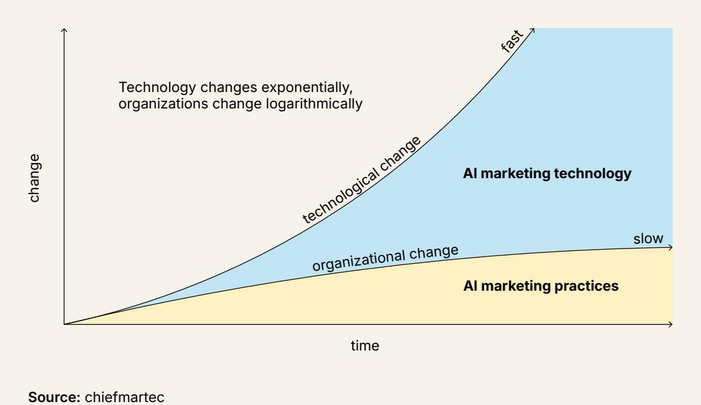

We began our last report, *Martech for 2025*, quoting Ethan Mollick's estimate that if AI development stopped where it was, we'd still have 5-10 years of work ahead to absorb it into our current organizations and social systems. Now, just half a year later, Mollick has revised his position, saying, "If Al development stopped today (and no indication that is happening), we have *a couple of decades* of figuring out how to integrate it into work, education, & life." *(emphasis emphatically ours)*

Chalk that up as another Moore's Law-like exponential. From 5-10 years of work to absorb these new capabilities to now 20+ years to do so. Your backlog of organizational change just doubled in the past six months.

Of course, the punchline is that AI development is *most certainly not stopping today.*

So take a deep breath. We empathize. Everyone's in the same boat as the AI tide rises.

And, hey, spare a little sympathy for us too. Being an analyst in this maelstrom is like being a referee at a rugby riot. If we're too conservative in our write-up,

it will be out of date by the time the proverbial ink dries. If we're too forwardlooking, we'll be accused of hype-mongering. Well, at least until a few months later, when in hindsight we could go from numbskulls to Nostradamus overnight. ("Frans and Scott *were* right about that after all. Maybe we shouldn't have pilloried them on LinkedIn.")

It's a tough gig for you and us both. But a damn fascinating one.

So to hem as close as possible to a pragmatic balance, we'll start this report with an update on the purely empirical and (in)famous Marketing Technology Landscape. Now in its 15th year. Wow. That's twice as long as most celebrity marriages.

We won't keep you in suspense. It grew. Again. It's now up to 15,384 solutions. But inside that numbing number are very interesting dynamics of real consolidation, a new generation of AI-natives, a global phenomenon, and a rising tide of user sentiment. We'll peel back the layers of what's happening there for you.

#### Martech Landscapes 2011-2025

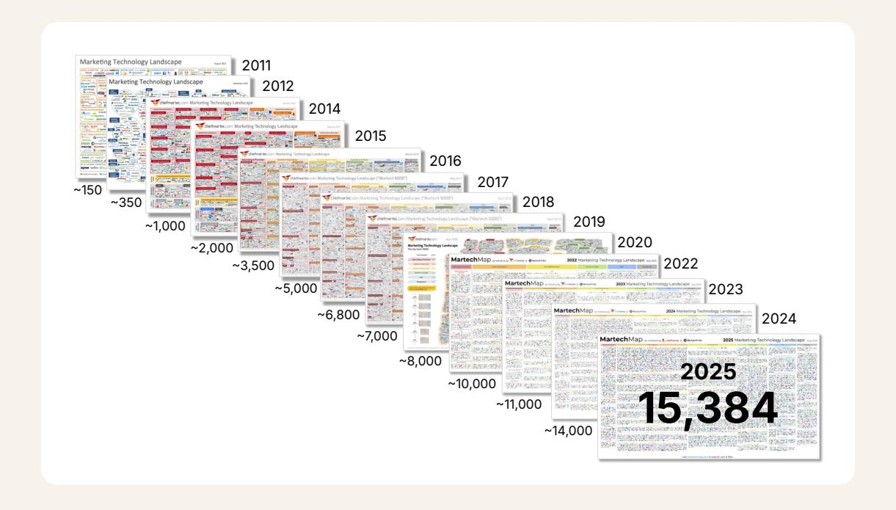

Source: chiefmartec

Note: The Martech Landscape is the result of a collaborative research project between chiefmartec and MartechTribe (MartechMap)

We'll then review our recent survey of how AI is being integrated into martech stacks. "Agentic" is certainly the buzzword du jour. But there are a number of practical use cases where agentic AI is appearing in controlled marketing workflows, at least with early adopters.

(For the cool kids, the latest lingo is "MCP", which stands for Model Context Protocol. It's a new standard for how AI agents can communicate with each other, use software tools, and reference external data sources. Created by Anthropic, it's now been embraced by Google, Microsoft, OpenAI, and hundreds of others. It's actually a promising leap forward for more standardized integration across apps and agents.)

The more mainstream adoption is with AI assistants. 87.5% of our respondents reported they use them in their marketing now. That crossed the chasm fast, eh?

#### The High Speed Evolution of AI

From LLMs to Agents to Integrated MCP Systems

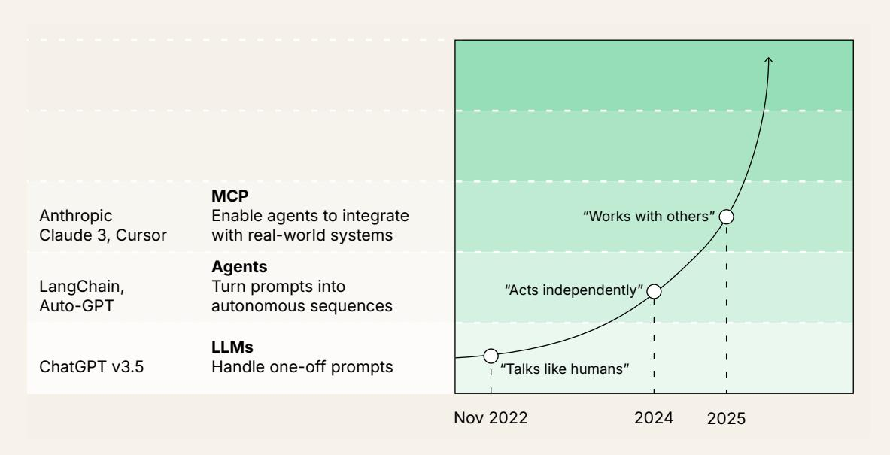

Source: MartechTribe

And in the less-sexy-but-incredibly-important category, the majority of our respondents (56%) now have their martech stacks integrated with a cloud data warehouse/lakehouse. And the majority of those (60%) run custom

and/or commercial AI apps or agents directly on that data layer. Harnessing unstructured data in marketing is a big part of this.

We will follow that with our perspectives on several larger trends in martech. We'll disclaim right now that this will by no means be comprehensive. There's just too much happening to explain it all in a single report. So we'll lean into a few big ones that we find most significant.

#### A couple of the ones we'll discuss:

How are martech stacks evolving with the proliferation of AI? In short: incredibly malleable *systems of context* underpinned by multiple *systems of knowledge*. 1 While a swarm of new AI agents and assistants will be operating in this environment, we believe many of the core martech acronyms platforms — CRM, MAP, DXP, DAM, etc. — still have a foundational role to play in anchoring and orchestrating AI.

In our last report, we introduced the concept of the *hypertail*. For years, we've described the distribution of commercial software in the Marketing Technology Landscape as a "long tail" — a few very large and popular platforms in the head, a few hundred category leaders in the torso, and a long, long, loooong tail of startups and more specialized niche products.

Beyond the commercial landscape, there's always been the option for businesses to build their own custom software solutions. For most companies, that represented a small amount of their tech stack — if any at all — because custom software was expensive to develop and maintain, requiring engineering skills that weren't readily at the disposal of most marketing teams.

But the rise of low-code/no-code platforms over the past 5-10 years has steadily changed that equation, making it easier, faster, and cheaper to build, giving rise to "citizen developers" who could increasingly scratch their own itch by creating lightweight apps and automations.

1 We originally labeled systems of knowledge as systems of truth. Admittedly, truth has a better ring to it. But it didn't accurately reflect that a lot of these systems of knowledge are layered on top of each other in ways that deliver derivatives of truth. Also, truth implies a level of accuracy that's still aspirational in a lot of datasets. It's more truthiness, which doesn't have quite the same halo. We told people who objected on philosophical grounds to us using truth in the first place, and wanted us to use a different word, "Sorry, we Kant." But, hey, it turns out we can.

## The Martech Long Tail (Commercial Software) and Hypertail (Custom Software)

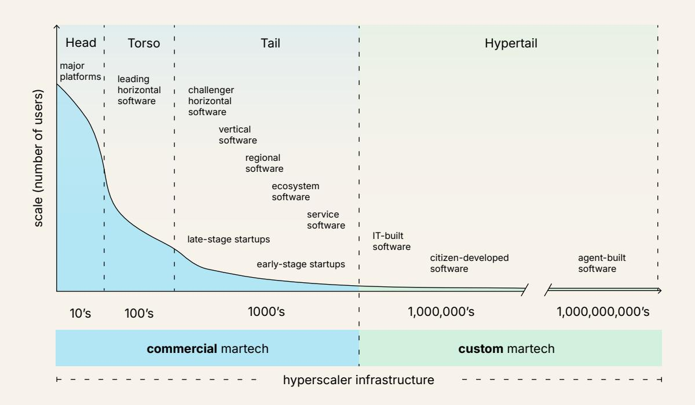

Source: chiefmartec

As with nearly everything else it touches, AI is having a massive multiplier effect on this. It's accelerating software creation at a blindingly fast rate. Professional developers now rave about "vibe coding" — whipping up new programs in a matter of hours that used to take days or weeks to construct.

For citizen developers it's an even bigger boon. If they can describe something in a natural language prompt, the AI can build it for them. True, today that works best for simple apps and automations. But this is Clay Christensen's classic pattern of disruptive innovation: serving the underserved with simple use cases, and then steadily climbing up the hill to more advanced ones. In our last report, we called this "instant software" — just add ideas.

And it gets wilder. Popular AI assistants such as ChatGPT, Claude, and Gemini — that have millions of non-technical subscribers — are often creating software programs behind the scenes to do the bidding of their users *without those users even knowing that software was built and run on their behalf.*

The result? Not millions but *billions* of custom software programs proliferating companies' digital operations. Probably trillions, many blinking in and out of existence on demand.

That is the hypertail.

If you thought martech was interesting before, you ain't seen nothin' yet.

In addition to our own views on these fascinating changes, we interviewed executives from our six sponsors (*thank you!*) to get their perspectives. What are they seeing with their customers? How are their strategies adapting to this new world? What's stoking their imagination — or their amygdala?

[Compound Marketing: Accelerating Gains with AI-Boosted](#page-82-0)  [Experimentation Loops](#page-82-0) *[Chris O'Neill, CEO, GrowthLoop](#page-82-0)*

[Benefits of an Independent AI Decisioning Layer in a Composable](#page-89-0)  [Stack](#page-89-0)

*[Tejas Manohar, CEO, Hightouch](#page-89-0)*

[Data Infrastructure Is the Key to Rationalizing Your Martech Stack](#page-98-0)  [for AI](#page-98-0)

*[Greg Brunk, Head of Product, MetaRouter](#page-98-0)*

[A Time of Marketing Reinvention: From Ideation, Through](#page-108-0)  [Workflow, to Customer Engagement](#page-108-0) *[Raviteja Dodda, CEO, MoEngage](#page-108-0)*

[Why AI Is Still About Humans Building for Humans](#page-117-0) *[Sara Faatz, Director of Technology Community Relations,](#page-117-0)  [Progress](#page-117-0)*

[The Critical Middle: Bridging the Gap Between the Data](#page-125-0)  [and the Channel](#page-125-0) *[Jonathan Moran, Head of Martech Solutions Marketing, SAS](#page-125-0)*

We also want to thank [G2](https://www.g2.com/) for sharing ratings data on the companies in the martech landscape with us, the analysis of which you'll be able to read in our first section.

And also [Goldcast](https://www.goldcast.io/), who generously provided the virtual events platform where we hosted the #MartechDay online sessions that covered the content of this report. Throughout the month of May 2025, you can still watch them all — our scintillating keynote and all six of the expert interviews above — on-demand by going to [martechday.com](https://martechday.registration.goldcast.io/events/a4f5fe1c-e3d6-4128-b11c-e30442c9c5cd?utm_source=chiefmartec).

May the vibes be with you.

Scott Brinker Editor, chiefmartec

Frans Riemersma Founder, MartechTribe

# 1. Evolution of the Martech Landscape

We have been obsessively studiously mapping the landscape of commercial marketing technology products for 15 years now. From 150 products in 2011 to now over 15,000 — a 100X explosion — it's been astounding to witness such exponential growth. The nature of software markets changed before our eyes, as barriers to entry dropped to near zero. Anyone with an idea and an AWS account could become a global software vendor overnight.

Okay, okay, that's an exaggeration. But not much of one.

Marketing was one of the first disciplines transformed by cloud software abundance. But soon every function in business sprouted landscapes of hundreds to thousands of solutions. Sales, finance, IT, HR, and legal. Not to mention a plethora of vertical-specific apps for restaurants, hotels, healthcare providers, financial advisors, and so on.

But it's not just the explosive growth of the martech landscape that's been a wonder (or horror?) to behold. It's also been fascinating to observe wave upon wave of technological trends crash across our industry these past 15 years, a stormy ocean relentlessly pounding the sand castles of everyone's martech stacks.

The mobile wave. The CDP wave. The platform ecosystem wave. The cloud data warehouse wave. Now, of course, the AI wave, which feels like a tsunami in comparison.

But if we can't stem the tide, we might as well ride the surf, however gnarly it may be.2

2 With apologies for not only a massively overextended metaphor, but also a non-surfer's attempt to wield Surfanese like a kook.

# The 2025 Marketing Technology Landscape

Let's cut to the chase.

Here's the latest version of the martech landscape, absolutely unreadable to the naked eye:

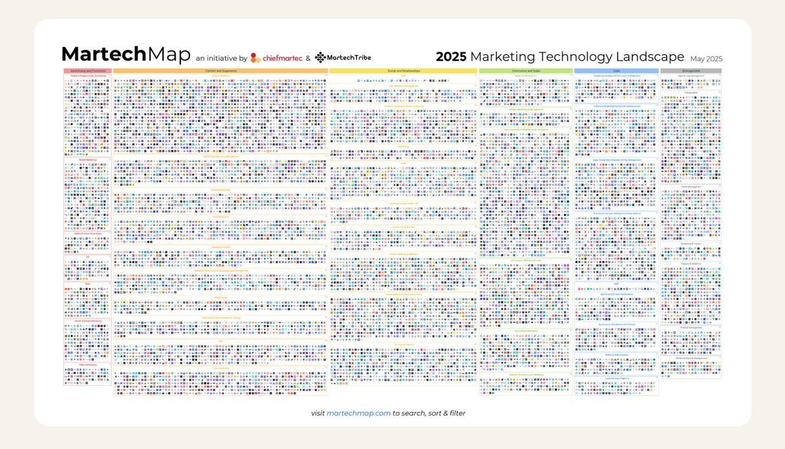

Source: MartechMap, a collaborative research project between chiefmartec and MartechTribe

(Want to be able to actually read this? Surf on over to [martechmap.com](http://martechmap.com) where you can zoom, search, and filter across the entire landscape. Hours of fun for the whole family playing logo memory.)

The number of solutions mapped this year grew once again — *surprised?* — to a grand total of 15,384. That's up 9% from the 14,106 we mapped in 2024.

Looking back from the beginning, that's 10,156% growth over the past 14 years at an average 39.2% compound annual growth rate (CAGR). Or, more simply put: 100X growth.

#### **Number of Martech Software Apps Since 2011**

Source: chiefmartec & MartechTribe

Now, before you accuse us of sandbagging this by including anything thrown our way with a URL and a favicon, we'll disclose that we actually evaluated over 11,000 new submissions this year, out of which only 2,489 made the cut. We disqualified 80% of the candidates.

If you've done the math — 14,106 (last year) + 2,489 (new this year)  $\neq$  15,384 (current total) — you've already realized that we also removed 1,211 products. Yes, every year we meticulously check all of the products on the landscape and excise those that have gone away, either happily through an acquisition or unhappily by going out of business.3

We're sorry to say that 84% of them exited unhappily, simply ceasing operation.

Happily or unhappily, these exits amounted to 8.6% churn of the products that we included last year. That doesn't sound as earth-shattering as saying 1,211 products went away, but that's the nature of a small percentage of a large population. It is probably less churn than most people anticipated (frankly, including us).

But where the churn came from you may find surprising...

&lt;sup>3 If there was an 80's sci-fi movie about martech starring Arnold Schwarzenegger, he would probably have a catchphrase like, "You've been consolidated." (Sorry, too soon for the recently departed?)

# A Long-Anticipated Consolidation Begins

Last year's landscape made a huge leap, from 11,038 products in 2023 to 14,106 in 2024. The credit (or blame) for that sudden re-acceleration of martech growth fell squarely on the shoulders of AI. 77% of the new products added last year were AI-native.

It was springtime for martech, as a thousand AI startups blossomed!

But as they say, easy come, easy go. You might expect that most of the 1,211 products that churned out of the martech landscape this past year were from that cohort of brand new AI-natives that would struggle to get a foothold in an insanely crowded market. If you'd asked us, that would have been our guess.

We guessed wrong. The majority of the products removed — 774 — were born before the ChatGPT inflection point of November 2022 that triggered the great AI-native martech boom.

#### Martech Products Removed

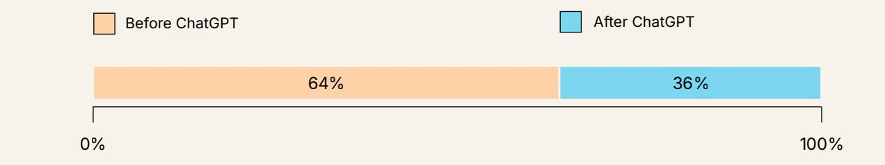

Source: chiefmartec & MartechTribe

To be sure, many of the smaller AI-native products from the past year had a higher churn rate than we've traditionally seen with first-year startups in this space. 321 of the 3,068 new tools from last year went away.

But it was the disappearance of 774 martech products from the pre-GenAI landscape that is the more notable signal to us. Granted, some of these were happy exits by acquisition. Some were less happy exits by acquisition, as 2010's-era martech companies that never quite found a path to revenue that matched the heady valuations at which they had raised capital were sold at disappointing multiples.

#### Journey of a Martech Venture

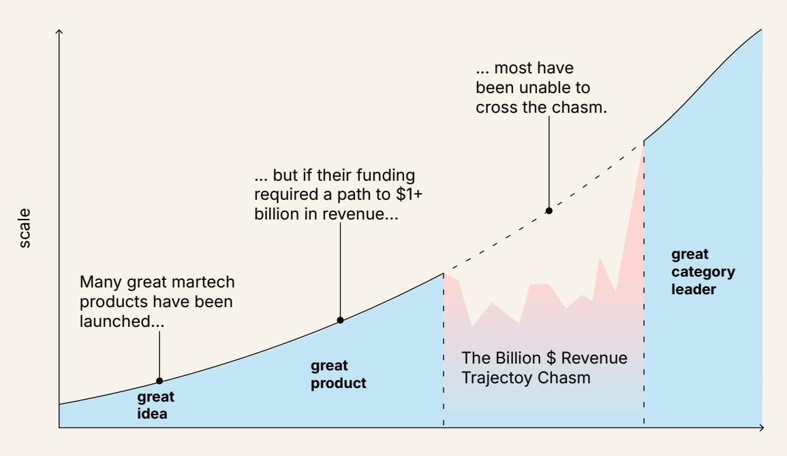

journey of a martech venture

Source: chiefmartec

The consolidation that happened with customer data platforms (CDPs) this past year is probably the most talked about example of this. ActionIQ, Lytics, and mParticle were some of the headliners. To be sure, several of these CDP acquisitions were happy ones, as embedding CDP capabilities more natively in major customer engagement platform (CEP) products makes a lot of sense for more unified marketing campaigns and customer experience management — especially as those platforms need to get savvier about data-powered opportunities with Al. But others were not as happy.

Key Highlights & Insights from Our Sponsor

#### metarouter

"Much of the consolidation you're seeing is about how to take AI and supercharge those core goals of the CDP so we avoid that trough of disillusionment where there was so much pointy-clicky, so much warehouse setup, and so much pipelining and API integration and data cleanup."

Greg Brunk

Read Interview

Downward pressure on M&A valuations is inevitable in a market where the sellers outnumber the buyers by at least two orders of magnitude. While 2024 saw quite a few martech and adtech acquisitions — 259 tracked by the legendary martech investment bank LUMA Partners — that represented only a small fraction of the martech firms that have been pitching and positioning themselves for an exit.

#### Quarterly M&A Transactions (Q1 2020-Q1 2025)

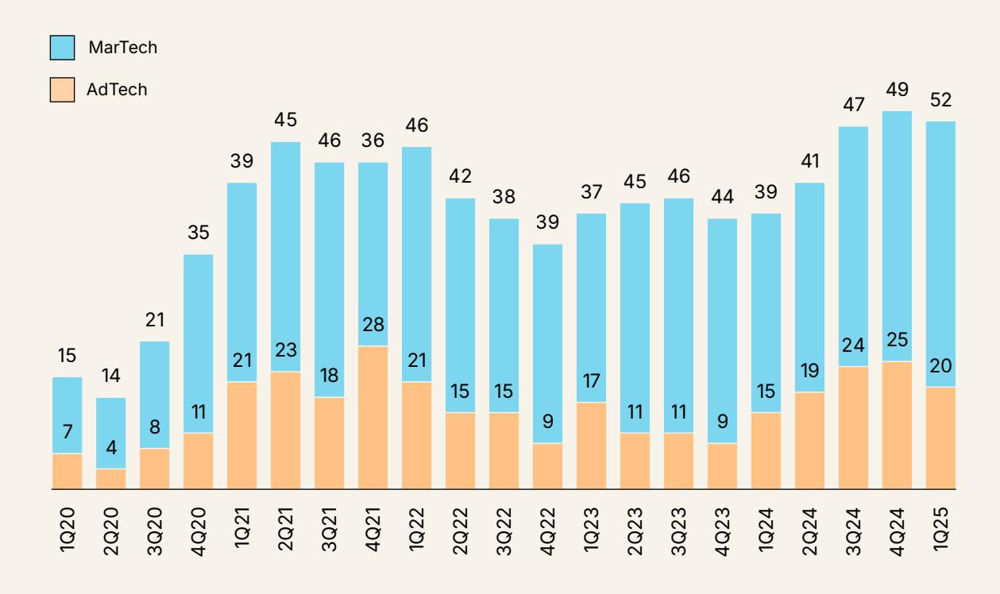

Source: LUMA Partners, PitchBook, FRED (Market data as of 12/31/2024)

(It's worth noting that not all of these acquisitions resulted in martech products being removed from the landscape. In many cases, especially with private equity deals, the new owner kept the acquired company's products on the market.)

But while it is clearly a buyer's market for those shopping for an entire martech company, there is only so much acquisition capacity in the market as a whole. Integrating a martech stack may have its challenges, but integrating martech companies is downright difficult. Most martech firms looking for an exit will not find one.

It's a game of musical chairs, but with a 10:1 ratio of players to chairs.

However, those who don't find a seat won't necessarily vanish overnight. SaaS businesses are hard to kill. If they keep their COGS in check (cloud infrastructure costs do continue to drop); if they reign in engineering expenses (AI coding couldn't come at a better time); and if they get really disciplined with their go-to-market investments ("show don't tell" how martech can boost marketing outcomes), they can carry on for quite some time. Customers who are satisfied with their products won't leave until they have a reason.

This buys time for these companies to develop options:

- Recalibrate to operate profitably at steady-state
- Continue to invent and innovate with new AI possibilities you don't have to be an AI-native startup to find amazing ways to leverage the frontier of AI capabilities
- Shift their business model into a services play savvy martech expertise is going to be in high demand for the foreseeable future — potentially even becoming an inverted *service-as-software* provider on the back of their core technology
- Keep the door open for M&A opportunities that could appear down the road, especially if they're successful with any of the moves above

Now, of course, some will give up and either shut down or operate at a bare minimum until the last of their subscription revenue dries up. The latter will be martech zombies, and sadly, that will be a thing. But on the continuum between breakthrough success and dead-martech-walking, there is a wide spectrum of near-term positions on the curve. And they're not all bad.

Even if *half* of today's martech landscape went away in the next 2 years which would be an extraordinarily rapid exodus — there would still be ~7,500 existing martech solutions soldiering on.

And, hey, not everyone on today's martech landscape is in dire straits.4

Martech is more critical to marketing success than ever, and overall spending in the sector continues to grow, not shrink. There are hundreds of strong

4 The Sultans of SaaS? With apologies to Mark Knopfler.

martech companies — from category leaders in the head and torso to innovative startups ascending their way up the long tail — that are thriving in this environment by delivering real value for customers.

It is a tough, crowded market. But there are winners. And we believe there's room for more.

For better and worse, we believe this is the beginning of a major cycle of renewal across the martech landscape. We use the word "renewal" rather than "consolidation" not as a euphemism, but because we genuinely believe that while many older generation martech companies will fade away in time, a new generation of Al-era startups are bursting enthusiastically onto the scene.

# The Martech Long Tail (Commercial Software) and Hypertail (Custom Software)

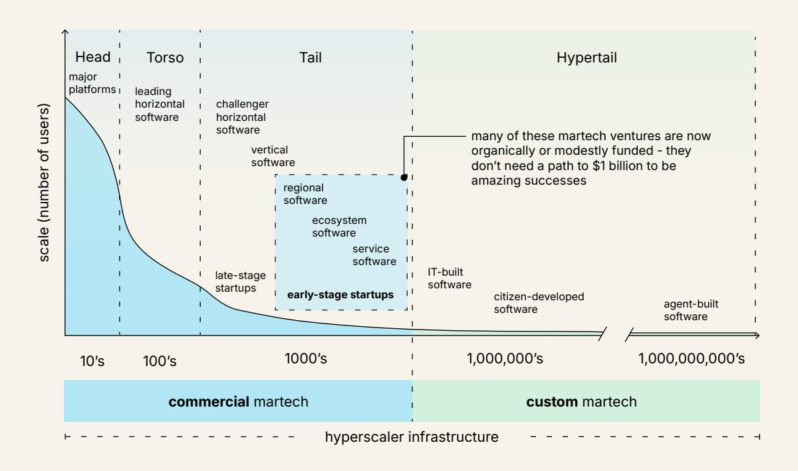

Source: chiefmartec

Will the net number of products on the martech landscape grow or shrink in the next several years, as old players leave and new players arrive? That is the question.5

The honest answer is: we don't know. It's a complex system, and anyone who claims to be able to predict the future with any precision is, in our humble opinion, either selling something or smoking something.

But we are noticing that more and more of the new entrants into the martech long tail are either organically funded or have raised only a modest amount of capital. The truth is you don't necessarily *need* a lot of capital to build something of value in this environment, and AI is only making that more true every month now.

The head and the torso may remain out of reach for most companies without more significant funding. But if success is redefined as a profitable business with happy customers and happy employees, we think there will be many successful martech ventures ahead.

But enough about the exits. Let's look at the entrants…

# Where the Martech Growth Happened

The first thing we'd note is that growth is happening everywhere across the martech landscape. If we start by analyzing the growth rate of the six toplevel categories — *Advertising & Promotion, Content & Experience, Social & Relationships, Commerce & Sales, Data,* and *Management* — we see that three of them grew by about 10%, one by 9%, and two by almost 7%.

None of them shrank. And the fact that they all grew by about 7-10% is testament to the fact that startups are experimenting in every corner of marketing technology. There's not one "hot category." The whole field is hot.

This is a shift from last year, where growth was more concentrated in the *Commerce & Sales* and *Content & Experience* categories, which grew by 47% and 35% respectively. Granted, overall growth in martech products last year was a mind-blowing 28% vs. merely 9% this year.

5 To grow or not to grow, that is the question. Whether 'tis nobler in the mind to suffer the slings and arrows of outrageous stacks or to take an audit against a sea of apps and by negotiating rationalize them.

### Growth Rate by Martech Category in 2025

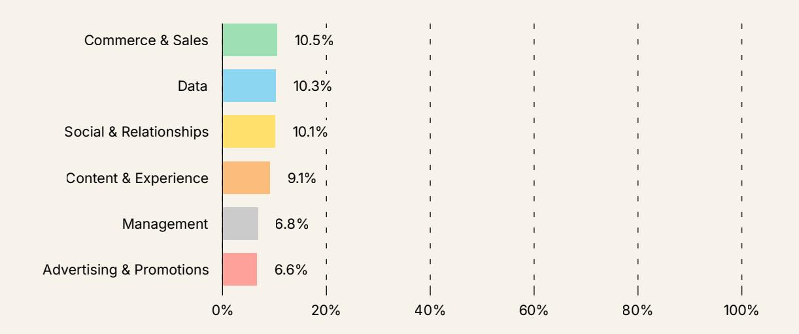

Source: chiefmartec & MartechTribe

#### Growth Rate by Martech Category in 2024

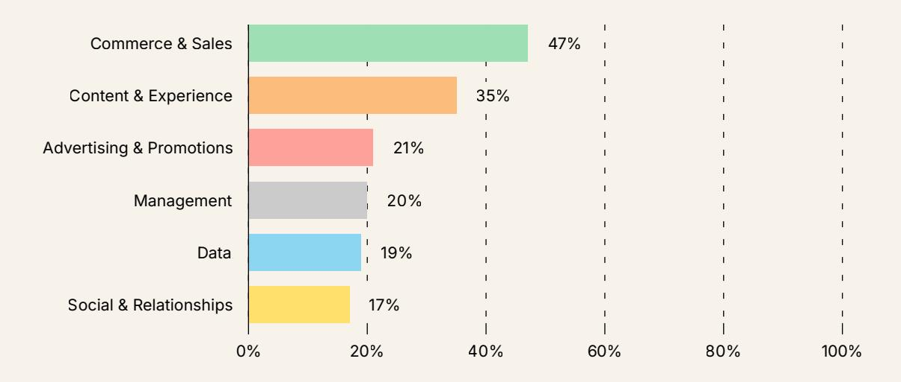

Source: chiefmartec & MartechTribe

As we noted earlier, GenAI was responsible for much of the explosive growth last year. So it made sense that *Commerce & Sales* and *Content & Experience* saw the greatest number of additions. Emails, websites, ecommerce, personalization, creative asset production, customer support, etc. were the most obvious places to apply generative AI's new capabilities.

Here are the absolute number of tools in each category for the past three years to give you a greater sense of the magnitude of growth over the past 24 months:

#### YOY Total Number of Products by Martech Category

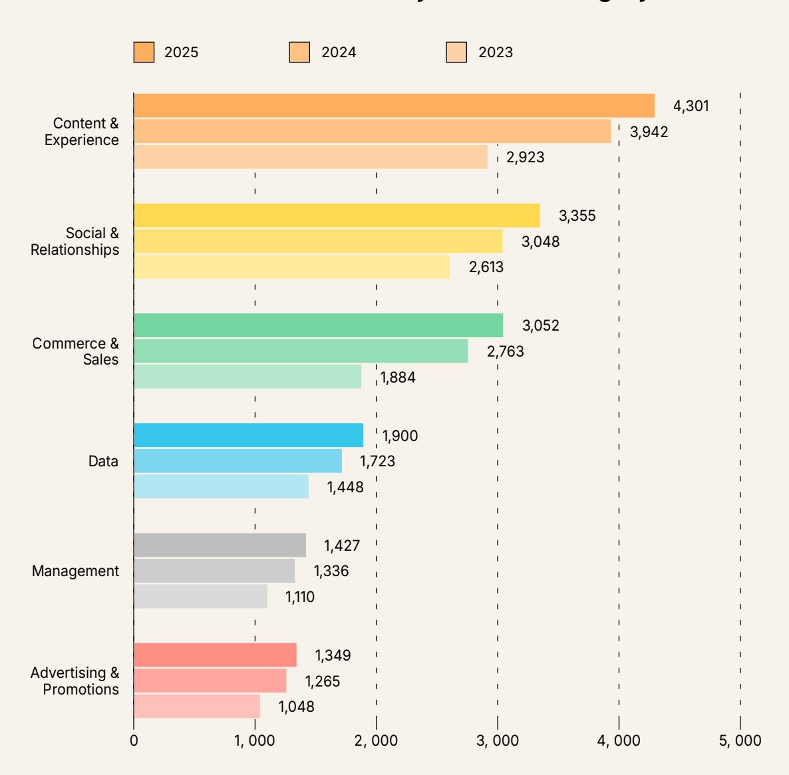

Source: chiefmartec & MartechTribe

If we dig into the subcategories of each of these — which are still extremely large tents under which many, many more specialized sub-subcategories exist — we can see where the frothiest innovation has been happening.

Here are the top 10 subcategories, as ranked by their total number of products, showing their growth since 2023:

### YOY Total Number of Products by Martech Subcategory

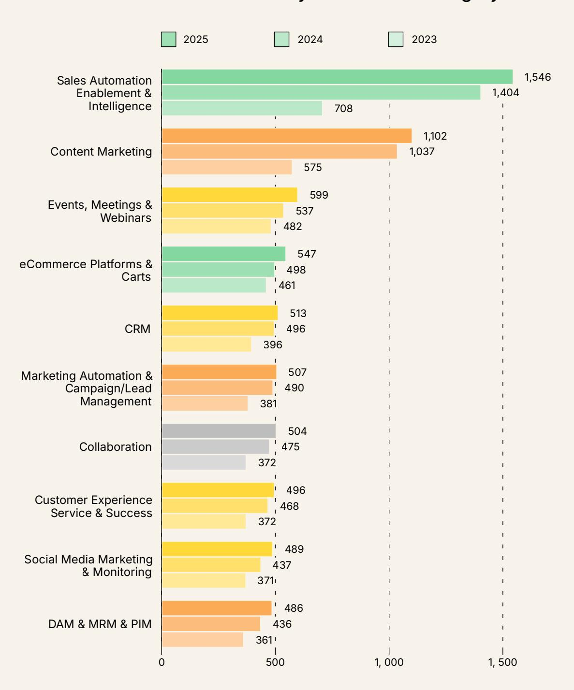

Source: chiefmartec & MartechTribe

*Sales Automation, Enablement & Intelligence* — an admittedly oversized bucket in which we've dropped pretty much anything related to sales teams — more than doubled from 2023 to 2025. This was partly due to the suitability of genAI for so many sales-related tasks, but also because of the accelerating movement of salestech to modernize sales the way martech modernized marketing.

(We have long included this subcategory in the martech landscape because marketing teams often need to work with — or at least coordinate with — many of these sales tools. You know, for sales and marketing alignment.)

*Content Marketing*, which is the subcategory where most creative production and distribution products are placed, saw the second-largest growth, nearly doubling from 575 tools to 1,102. Whatever you want to create, *there's an app for that.*

Although more modest in scale in absolute numbers, the *SEO* subcategory had the highest percentage of growth of all — an eyebrow-raising 24% expanding from 212 to 262 products. It's certainly ironic, given all the "SEO is dead" talk of the past year, with AI assistants and search answer agents disrupting the traditional organic search chain. But in martech as in life, when one door closes, another one opens. Optimizing your content for AI services — what some are calling AIO, but we've left under the SEO umbrella for now is now on the rise. New products such as [Otterly.ai](http://Otterly.ai) and [RankRaven.io](http://RankRaven.io) are two examples.

Only a handful of the 49 subcategories didn't grow or experienced slightly negative growth:6

- DMP (0%)
- Budgeting & Finance (-1%)
- Video Advertising (-1%)
- Agile & Lean Management (-2%)
- Product Management (-4%)
- Vendor Analysis & Management (-6%)
- Native/Content Advertising (-8%)
- ABM (-10%)

6 Surprisingly, "negative growth" is not technically an oxymoron. It's a legit way to express the contraction of a metric. But it still *sounds* like an oxymoron.

"Where in the world are all these martech products coming from?" you might wonder.

Great question. The answer is: pretty much all over.

#### Global Distribution of Martech Company Headquarters

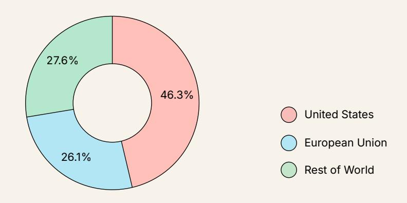

Source: chiefmartec & MartechTribe

The US continues to have the largest quantity of martech companies headquartered within its borders. But they're not all based in the Bay Area. To be sure, San Francisco and Silicon Valley still have a heavy concentration of martech ventures — and startups in general — but many are spread across other major cities such as Atlanta, Austin, Boston, Chicago, Denver, Los Angeles, New York, and Seattle.

However, Europe has had a vibrant martech scene for over 10 years, and it continues to grow. With 4,006 identified martech companies this year headquartered in the European Union, it is equal to more than half (56%) of the prodigious quantity of US martech. We believe European martech ventures have a meaningful advantage in competing regionally that helps buoy this number even in the face of tremendous global competition. There are different leading solutions in martech categories across France, Germany, Spain, and Romania.

The rest of the world accounts for another 4,251 martech products. Because Scott is based in North America and Frans in Europe, we suspect that we inadvertently undercount solutions in other regions, especially in Asia and Latin America, where we're just not as close to the markets. [We welcome](https://martechmap.com/contributors)  [contributions of products we missed at MartechMap.com.](https://martechmap.com/contributors)

To clarify, we did not include the non-EU European countries — such as the UK, Switzerland, Norway, Turkey, etc. — in our count of EU martech products. The total of all European countries — EU and non-EU — is 6,103. That's 85.6% as much as US-headquartered solutions. Martech is most definitely a global phenomenon.

Here's a view of the top 10 countries, ranked by their count of headquartered martech companies:

Top 10 Countries for Martech Company Headquarters

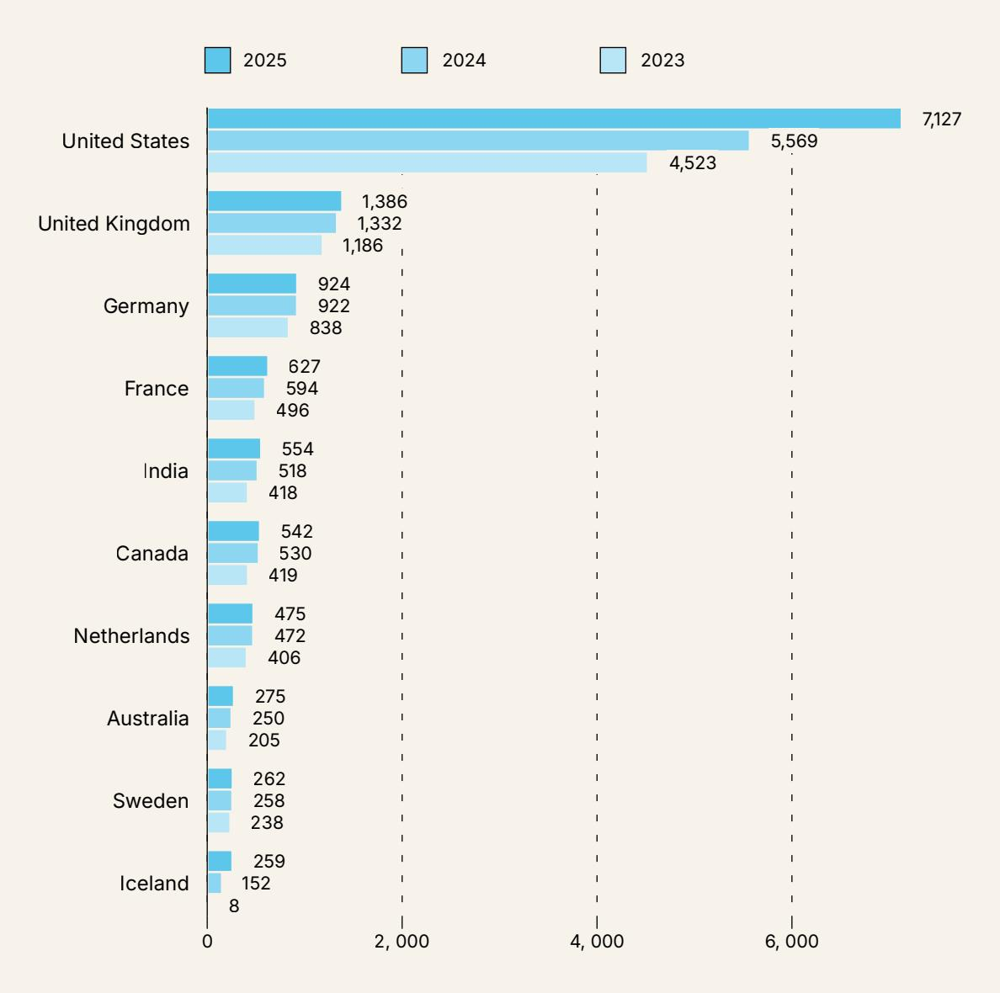

Source: chiefmartec & MartechTribe

The acceleration of new martech products in the US — 28% from 2024 to 2025, and 58% over the past two years — is remarkable.

Outside the EU, India, Canada, and Australia also have notable clusters of martech companies.

Iceland, admittedly, is… surprising.7

# Martech Is Loved, Slightly More This Year

Thanks to the groovy team at [G2,](https://www.g2.com/) the leading review site of business software and services, who share their ratings data with us on most of the products in our landscape, we can provide you with an updated analysis of how people are generally feeling about their martech products.

The *tl;dr*: they're feeling pretty good.

On the standard marketplace ratings scale, 1-5, from despised to delighted, the average rating of martech products has steadily ticked up these past couple of years, from 4.36 in 2023 to 4.42 in 2025.

### Global Ratings of Martech Products

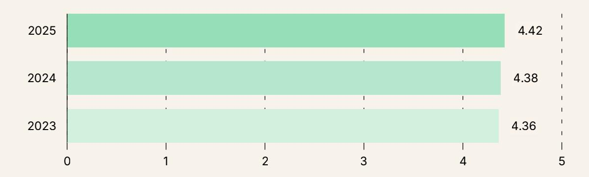

Source: chiefmartec & MartechTribe in partnership with G2

7 Scott is planning a fact-finding mission this summer to investigate. Although we're skeptical that the Blue Lagoon is where all these Icelandic martech apps are hiding.

In previous years, we'd noticed that smaller martech companies — those that get beyond 1-10 people in a metaphorical or literal garage — tend to earn higher ratings than the products from larger, more established companies. Granted, it's not a dramatic difference, from a high of 4.43 to a low of 4.18. But it's significant enough to warrant comment. Whether it's because these smaller companies are new startups gunning to disrupt status quo behemoths with a better experience or simply because they've found a niche in which they passionately serve their customers in a way that earns them a little extra love, small can be beautiful.

If you've done the math on the global averages, you'd also conclude that most of the martech companies on the landscape must have between 11-50 employees. With some leeway that public data on employee counts is often pretty sketchy for SMBs below 500 employees, it is true: the "long tail" of martech is a vast sea of small companies. With the growing leverage of AI, we expect that long tail to remain both vibrant and viable.

#### Global Ratings in 2025 by Company Size

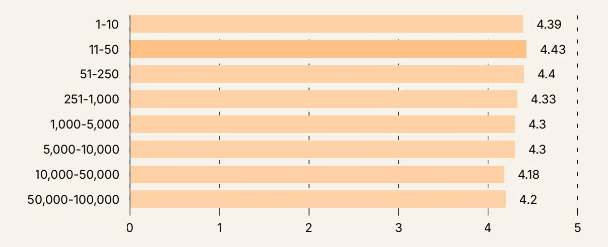

Source: chiefmartec & MartechTribe in partnership with G2

We've also seen a steady increase in ratings for younger martech companies. Those founded 5 years ago generally have a higher rating on average than those founded 10, 15, or 20 or more years ago. Are we getting better at building martech products from inception? Do younger companies simply gain some benefit from the agility of youth? Do older companies fall into the trap of not adapting quick enough or taking their position for granted? You decide.

#### Average Global Company Ratings by Year of Establishment

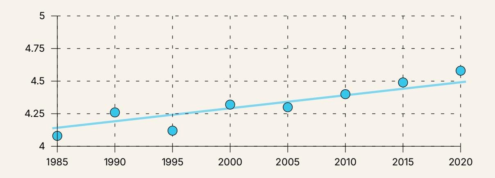

Source: chiefmartec & MartechTribe

While the overall global ratings climb was a mere 1% bump, a number of martech subcategories improved by more. *Product Management* subcategory ratings increased the most, by 3.2%.

### Growth Rate of Ratings by Martech Subcategory (2023-2025)

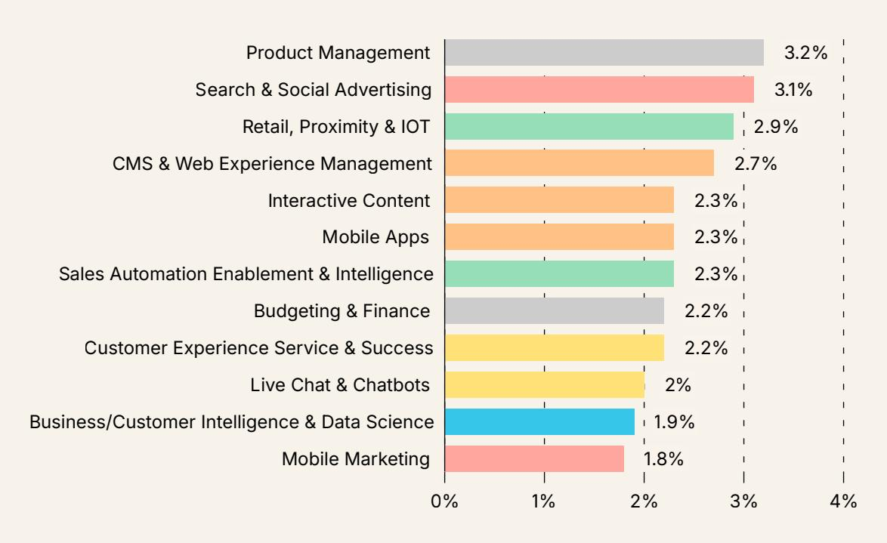

Source: chiefmartec & MartechTribe in partnership with G2

Granted, a 3.2% improvement in average ratings isn't exactly worth shouting from the rooftops about. But it's better than going in the opposite direction. The *ABM* and *Ecommerce Marketing* subcategories registered microscopic drops of 0.003 and 0.006 average rating points. *Mobile & Web Analytics* slid more noticeably, down 0.023 average rating points.

Coming back to the distribution of martech products around the world, we can see there are some small differences in average rating based on the country in which the martech company is headquartered. India actually tops the chart, with their products having an average rating of 4.52. Here are the rest of the top 10:8

#### Average Rating by Country 2025

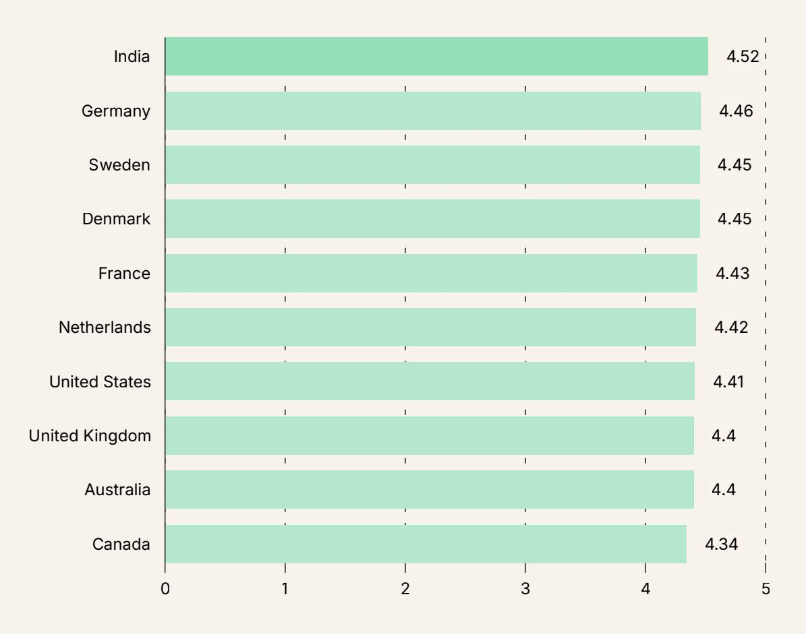

Source: chiefmartec & MartechTribe in partnership with G2

8 We decided to not call out the countries with the lowest martech ratings, so as to avoid unnecessary hassles when passing through immigration at their airports.

# Tech Stacks Are Expanding Again Too

It's not just the martech landscape that's growing.

According to recent empirical data from [Zylo](https://zylo.com/), a leading SaaS management platform that helps companies keep track of all their many software subscriptions, tech stacks reversed their trend of consolidation in 2024 and started to expand again. Granted, not by much. The average tech stack grew just 2%, from 269 or 275 apps.

But still. After shrinking significantly the past two years, down 17% from a peak of 325 apps on average in 2021 to 269 by 2023, the reversal is notable — if only because the narrative of chainsaw-wielding9 CFOs ruthlessly slashing SaaS products from the budget has been widely (and loudly) touted.

Now, that's not to say that products in the stack *weren't* cut. Just that more new ones were added than old ones removed. New AI products almost certainly deserve the credit (or blame) for this.

### Average Number of Apps in Tech Stacks (2021-2024)

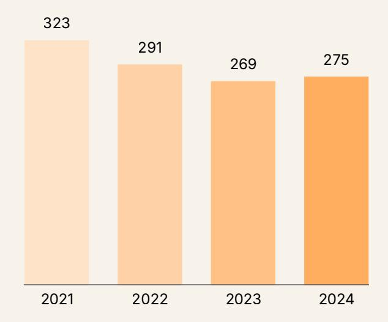

Source: Zylo, 2025 SaaS Management Index Report

9 Metaphorically speaking. At least we hope metaphorically speaking.

Zylo further broke out the average number of apps in tech stacks for companies of different sizes, from small businesses (less than 500 employees) with an average of 152 apps to large enterprises (10,000+ employees) with an average of 660 apps.

Since some companies have more than their fair share of apps, Zylo also shared the median as well as the mean for each of these segments. Overall, the median is 19% less than the mean, 224 apps instead of 275.

Key Highlights & Insights from Our Sponsor

*"Enterprise companies have many different martech tools that show customers many different things on many different channels. So, it's helpful to have a layer upstream where you can connect to all of them."* 

*Tejas Manohar*

[Read Interview](#page-89-0)

#### SaaS Portfolio Size and Spend

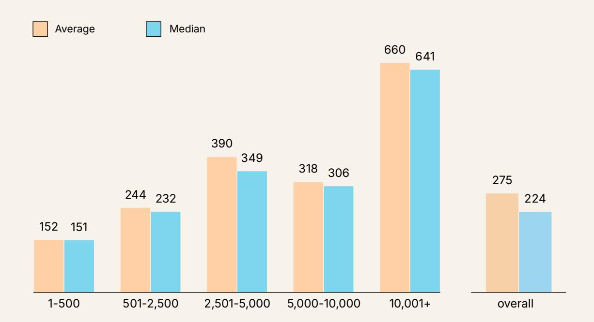

Source: Zylo, 2025 SaaS Management Index Report

It's important to note that Zylo's data covers all software subscriptions across the business, not just marketing and martech. Other departments may have been the culprits. But based on the anecdotes we've seen and heard, this slight expansion seems directionally right for martech stacks too.

While not as quantified as the Zylo dataset, a recent *2025 State of Your Stack Survey* run by MarTech.org, chiefmartec, and the MarketingOps community validated this trend in marketing: the majority of the respondents reported using more martech tools today than they did two years ago.

## Is your organization using more martech tools today than it did two years ago?

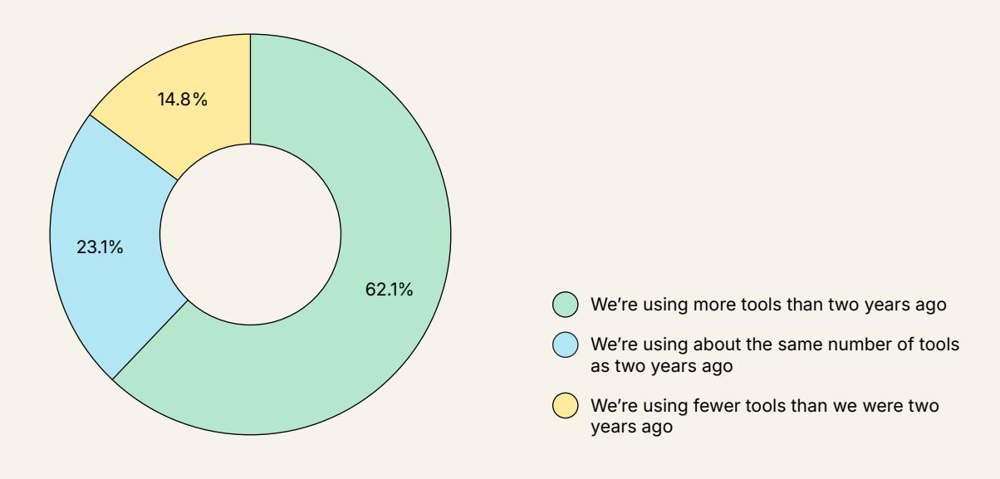

Source: 2025 State of Your Stack Survey, MarTech.org, chiefmartec & MarketingOps community

By the way, while we of all people would never hold anyone to predictions about the future, we were curious to hear the best guesses of our six executive interviewees to the question: *Do you think AI will cause martech stacks to grow or shrink?*

"In theory, they should shrink considerably. Most applications in martech stacks are point-and-click interfaces. And in theory, AI agents, agentic flows will make it so you don't need point-andclick interfaces in five years." – *Greg Brunk*

"Short term, expect to grow. Medium to long term, I expect strong potential for consolidation" – *Raviteja Dodda*

"In the beginning, they'll likely grow a little. Over time, there's going to be an opportunity to optimize the stack, leveraging AI, and it will start to shrink the stack." – *Sara Faatz*

"Grow. Grow first, then probably shrink." – *Tejas Manohar*

"Shrink, I think." – *Jonathan Moran*

"Oh, let's hope that they shrink. These Frankenstacks have got to go over time." – *Chris O'Neill*

We'll put those in our time capsule and revisit in a couple of years.

In the meantime, this is a good segue to examine how AI is fitting into the martech stack today…

# 2. AI & Martech Stack Survey

We surveyed 96 martech and marketing operations leaders in Q1 2025 on the emerging architecture and use cases of AI in the martech stack. Participants spanned a range of organization sizes (38 SMB, 28 mid-market, 30 enterprise) and business models (52% B2B, 14% B2C, and 34% both B2B and B2C).

In our last report in December 2024, *Martech for 2025*, we analyzed the different generative AI use cases that marketers had adopted. Not surprisingly, the largest adoption by far was for content ideation (69%) and content copy production (62%), followed by meeting transcriptions, notes, and summaries (53%).

#### Most Used GenAI Use Cases in 2024

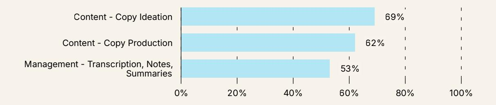

Source: chiefmartec & Martechtribe, Martech for 2025, n=283

However, these use cases last year were mostly handled by stand-alone AI products: large AI assistants, such as OpenAI ChatGPT, Anthropic Claude, and Google Gemini; AI note-takers, such as Fathom, Fireflies.ai, and Otter.ai; and AI copywriting tools such as Jasper, Copy.ai, and Writer. We also saw these features embedded in larger martech products, such as Gong, HubSpot, Zoom.

But for the most part, these AI features were used by individuals and not architecturally baked into larger marketing operations processes or workflows.

In our research this time, we wanted to better understand where and how AI was being more deeply incorporated in the martech stack, especially the role of AI agents and agentic workflows with martech composability.

# AI Adoption Approach in Marketing

At the highest level, 72% companies still see themselves in the experimental/ pilot stage with AI (32%) or having deployed it for limited use in specific workflows (40%).

## How would you describe your company's approach to AI adoption in marketing?

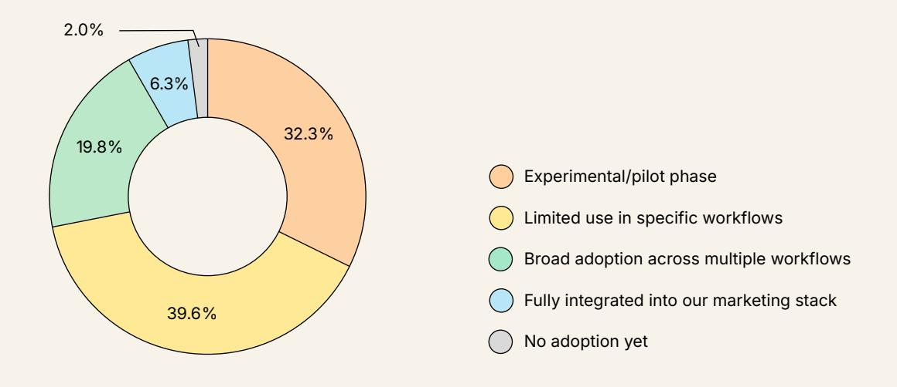

Source: 2025 AI & Martech Stack Survey, chiefmartec & MartechTribe

There wasn't a tremendous difference in this distribution based on the size of the organization, although SMBs were more likely to have advanced to broad adoption of AI across multiple workflows or fully integrated into their martech stack: 34% SMBs in comparison to 14% for mid-market or 27% for enterprise. Mid-market respondents were the furthest behind in production use, with 70% reporting they were still in the experimental or pilot stage. Caught between the greater agility of SMBs and the greater resources of enterprises?

However, there was a more noticeable difference between B2C companies and B2B and both B2B/B2C companies. Our B2C participants were more than twice as likely to be only in the experimental stage with AI (61.5%) than our B2B (26%) and B2B/B2C (30.3%) participants. None of the B2C companies reported broad adoption or having AI fully integrated into their stack.

## How would you describe your company's approach to AI adoption in marketing?

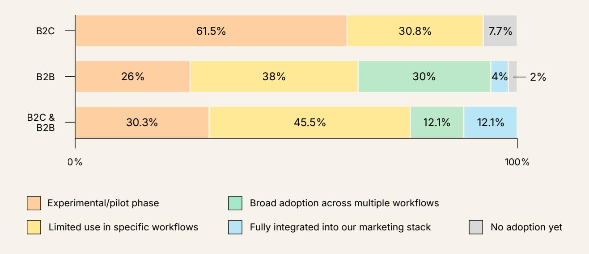

Source: 2025 AI & Martech Stack Survey, chiefmartec & MartechTribe

Synthesizing these results with other adoption data that has been published in recent months, we would draw the technology diffusion curve of AI in marketing roughly like this:

### Approximate Diffusion of AI Technology in Marketing

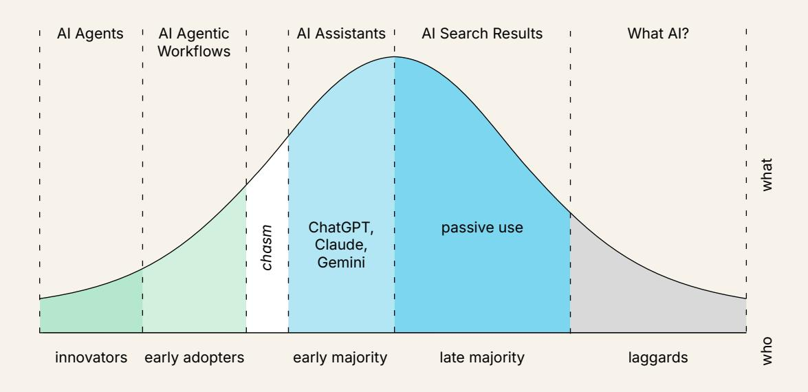

Source: chiefmartec, March 2025

AI assistants and stand-alone AI tools have crossed the chasm to the early majority of marketers that now regularly use them. AI agent and AI agent workflows are still on the other side with innovators and early adopters. But given the accelerated adoption rates we're seeing across the AI field, we believe they could very well cross the chasm by the end of this year.

# Current AI Usage in Marketing Activities

As noted above, content production continues to lead AI use cases by a wide margin for 78.1% of our respondents. It's great to see these features starting to be embedded in more automated processes.

## In which marketing activities are you consciously using AI tools or features?

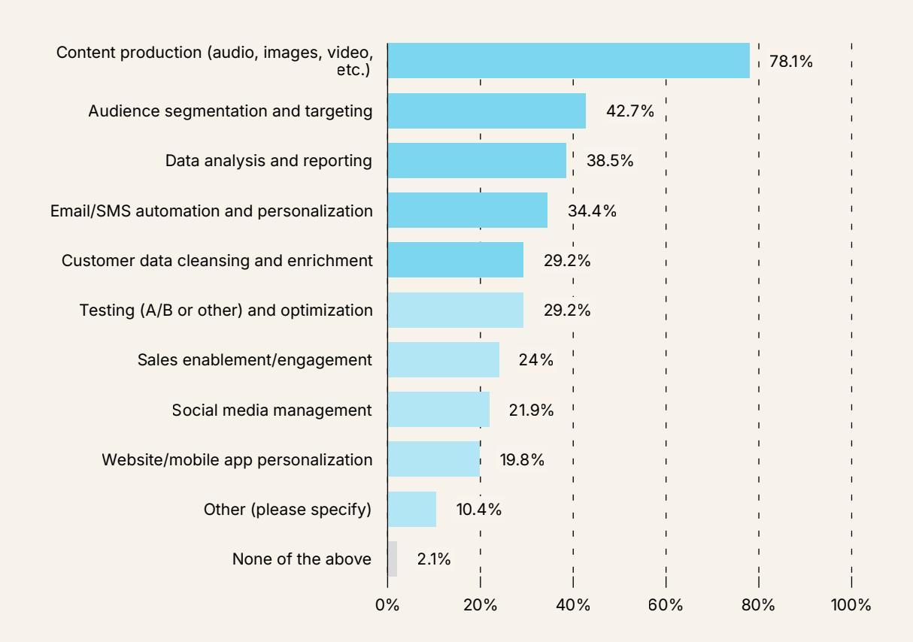

The next most common use case was for audience segmentation and targeting (42.7%), which includes leveraging features integrated into major ad platforms such as Google and Meta. Rounding out the top 5 were data analysis and reporting (38.5%), email/SMS automation and personalization (34.4%), and a tie between customer data cleansing and enrichment (29.2%), and testing (A/B or other) and optimization (29.2%).

It's encouraging to see a fairly wide distribution of use cases, given that many of these are innovators and early adopters.

B2B companies are proportionally using AI more in data enrichment, email personalization, and sales enablement and engagement. B2C businesses are more likely to use it for testing and optimization in campaigns and web/app experiences. And the majority of companies with both B2B/B2C components to their business use AI in data analysis and reporting.

# AI Integration with the Martech Stack

Of course, the eternal question in martech is: how well does it integrate? The answer, for those who have tried, is essentially a 60/40 split — 59% report most AI tools integrate well with their current platforms or only encounter minor challenges; 41% faced significant integration hurdles or flat out determined they don't integrate well.

## How seamlessly has AI integrated with your existing martech stack?

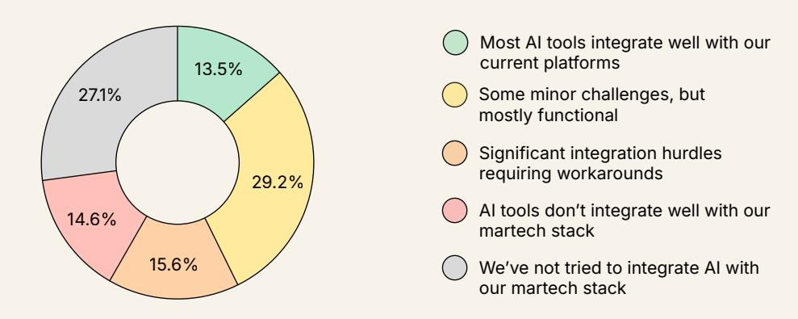

Based on anecdotal discussions with marketing ops professionals, the reasons why AI doesn't integrate well is more a function of closed or outdated martech platforms in their current tech stack than it is the new AI tools they want to bring in.

(Is now a good time for us to remind martech vendors of the critical importance of openness in today's environment? Your customers need that flexibility.)

B2B organizations generally had greater success with integrating AI into their martech stacks than B2C companies, 54% vs. 36%.

## How seamlessly has AI integrated with your existing martech stack?

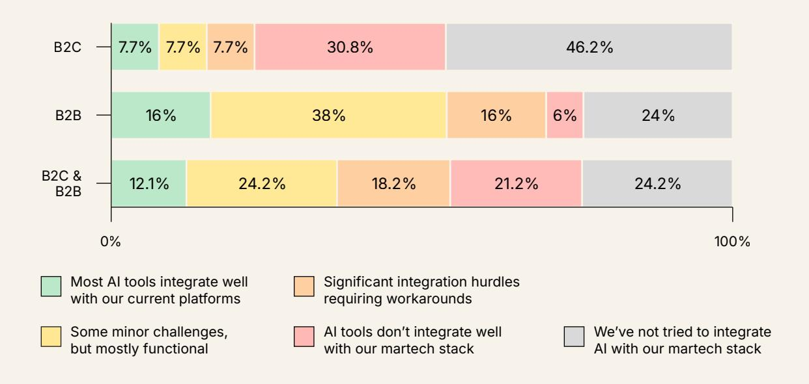

Source: 2025 AI & Martech Stack Survey, chiefmartec & MartechTribe

We saw a similar gap between B2B and B2C adoption of AI in our survey of AI use cases in last December's *Martech for 2025* report.

Why the difference? One explanation may be that B2C marketers need to know a little about a lot of different customers, while B2B marketers must know a lot about a smaller set. The value of connecting more systems — i.e., connecting more data points on each customer account — has arguably had more immediate impact, given higher message intensity and granularity that's typical in the B2B buyer's journey.

# Core Platforms in the Martech Stack

We revisited a question from our Martech Composability Survey run last year, as part of our *State of Martech 2024* report, asking which platform marketers considered to be the "center" of their martech stack. This is the system that they tend to organize and orchestrate most marketing activities around.

## Which platform do you consider to be the "center" of your martech stack?

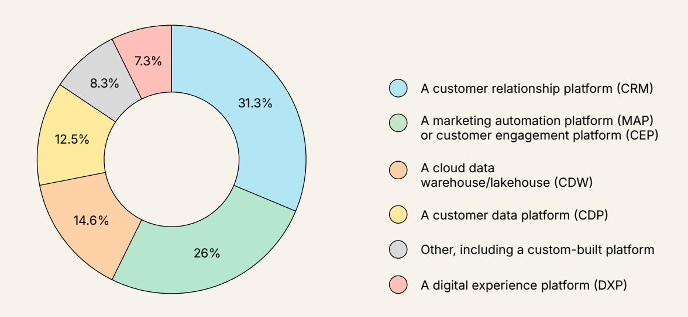

Source: 2025 AI & Martech Stack Survey, chiefmartec & MartechTribe

However, the answer to this question differs significantly between B2B and B2C companies. 42% of B2B companies cite a CRM as being the center of their stack, while only 8% of pure B2C businesses do. Almost perfectly splitting the difference, 24% of B2B/B2C companies claim a CRM at the center.

Pure B2C companies are more likely to cite a marketing automation (MAP) or customer engagement platform (CEP) as the center of their stack (39%) — or a cloud data warehouse/lakehouse (39%). The rise of the cloud data warehouse is remarkable in this segment, and it's dislodged customer data platforms (CDPs) as the center of the stack at most B2C and B2B/B2C companies, where only 8% and 21% respectively report a CDP at the center of their stack.

Comparing the data from 2024 to 2025, it's notable that for B2C and joint B2B/B2C companies, the percentage of respondents identifying a CDP as the center of their platform (17.4%) dropped below not only MAP/CEP platforms (26.1%), but also both cloud data warehouses (23.9%) and CRMs (19.6%).

A drop from first place to fourth place over the span of a year is a pretty big swing and speaks to the tremendous disruption in the CDP category. Now, this isn't to say that CDP functionality isn't still important. We think it's more important than ever. But the capabilities of CDPs are being pulled either upstream towards the cloud data warehouse with composable CDPs or downstream into the engagement layer with mergers/acquisitions with MAPs and CEPs.

One other interesting observation in this data was a 5X increase in the number of B2B companies reporting that the center of their stack was "other, including a custom-built platform" — from 2% in 2024 to 10% in 2025. (B2C and joint B2C/B2B companies stayed approximately the same: 7.5% last year, 6.5% this year.)

### The "Center" of the Martech Stack - B2B Companies

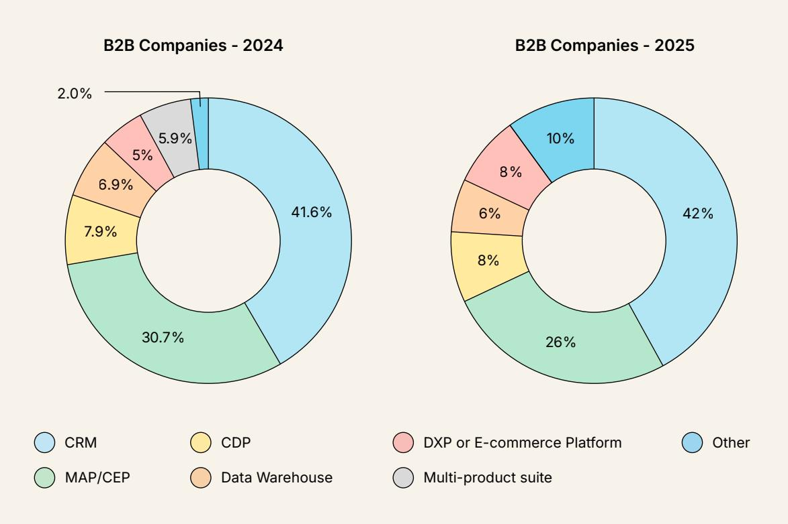

Source: 2024 Martech Composability Survey and 2025 AI & Martech Stack Survey, chiefmartec & Martechtribe

#### The "Center" of the Martech Stack - B2C & B2B/B2C Companies

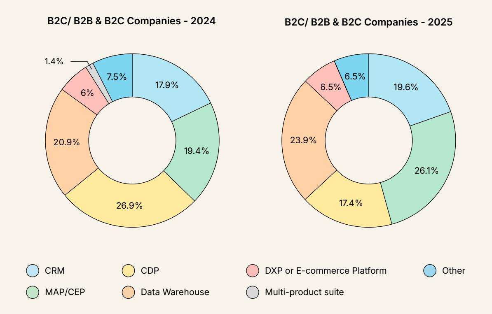

Source: 2024 Martech Composability Survey and 2025 AI & Martech Stack Survey, chiefmartec & Martechtribe

# Customer Data Warehouse Integration

We are at the point where the majority (56.2%) of our respondents — which, to be fair, skew towards more advanced martech and marketing operations professionals — have integrated their martech stack with a cloud data warehouse/lakehouse.

## Do you have a customer data warehouse/lakehouse integrated with your martech stack?

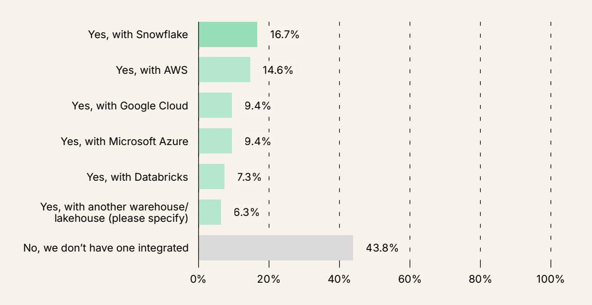

Source: 2025 AI & Martech Stack Survey, chiefmartec & MartechTribe

It's worth noting that essentially all pure B2C businesses (92%) reported a martech integrated warehouse or lakehouse, as have the vast majority (80%) of enterprise companies. On the other end of the scale, only 34% of SMBs have. Although for 1/3 of SMBs, those with 250 or fewer employees, to

have implemented and integrated a warehouse/lakehouse in their marketing operations is a testament to the wide diffusion of universal data layer architectures.

For those who have integrated one, Snowflake and AWS are the most popular data platforms, with 30% and 26% share respectively. Databricks, Google BigQuery, and Microsoft Azure are pretty evenly distributed for the rest. A couple cited using Teradata or Oracle.

Key Highlights & Insights from Our Sponsor

*"This is where I feel the biggest unlock is going to be, unstructured data. There's a lot of unstructured data that is present in marketing."*

*Raviteja Dodda*

[Read Interview](#page-108-0)

# AI Tools Working with Cloud Data

For those with a cloud data warehouse/lakehouse implemented, 59.4% now have AI tools directly working with that data, either commercial products (17.4%), custom-built apps/agents (13.0%), or both (29.0%).

Do you have AI tools, either commercial products or custombuilt apps/agents, that work directly with data in your cloud data warehouse/lakehouse?

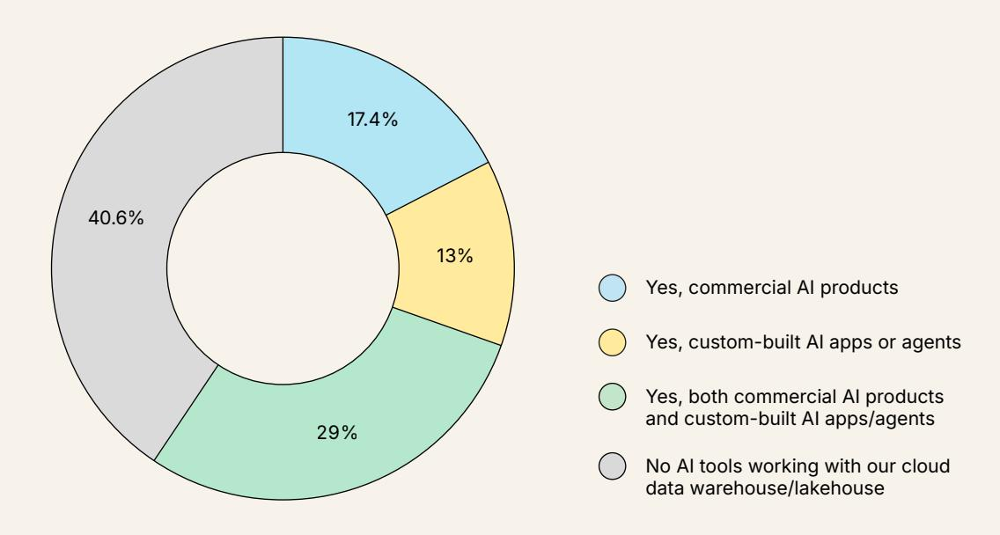

Source: 2025 AI & Martech Stack Survey, chiefmartec & MartechTribe

B2C businesses were less likely than B2B or joint B2B/B2C companies to use AI directly with their warehouse data — 56% compared to 75%. Enterprise companies were more likely (43%) to build custom apps or agents for this AI data work, even if they also used commercial products, than SMBs (32%).

# Stand-Alone AI Marketing Assistants

Shifting to more front-line marketing work, we confirmed that standalone AI assistants are now widely used by 87.5% of the participants in our survey. Although enterprise marketers trailed with only 76.7% adoption — while a perfect 100% of SMB respondents said they had adopted one or more AI assistants in marketing.

 These are the AI assistants that our six executive interviewees said they preferred:

Greg Brunk: Gemini Raviteja Dodda: Gemini Sara Faatz: Microsoft Copilot Tejas Manohar: ChatGPT Jonathan Moran: ChatGPT10 Chris O'Neill: ChatGPT

#### Are you using any stand-alone AI assistants in marketing?

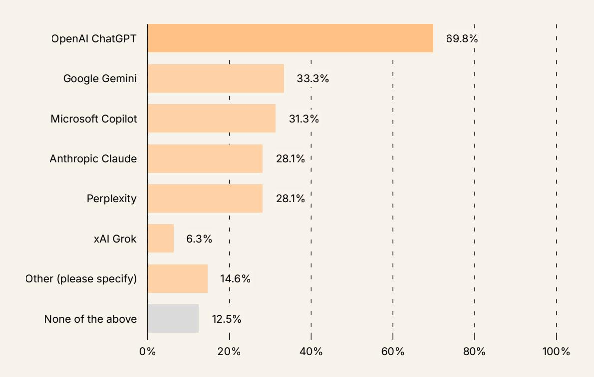

10*"I do like ChatGPT primarily because of ChuckGPT."* — *Jonathan Moran*

ChatGPT was by far the most popular, with more than twice as much adoption (69.8%) than its nearest competitor. Google Gemini, Microsoft Copilot, and Anthropic Claude were all roughly tied for 2nd place with 33.3%, 31.3%, and 28.1% adoption respectively.

It is notable that Perplexity, a challenger search answer engine up against Google, earned 28.1% adoption among our participants. Elon Musk's xAI Grok hasn't broken through though, with only 6.3% adoption. We'll leave that without comment (demonstrating remarkable restraint). In the other "Other" category, Midjourney, Writer, and a variety of custom assistants showed up.

# Built-In AI Assistants in Martech Products

Are you using any agents, copilots, or other AI assistants — a dialog box where you can ask questions or make requests of the software — built into your current martech products?

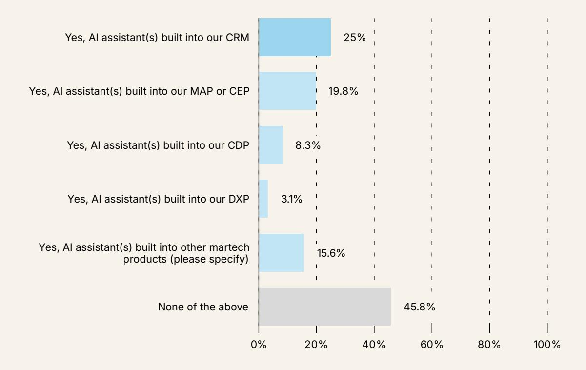

AI assistants built into major martech platforms, often called copilots, have also proliferated over the past year. The majority of our respondents (54.2%) said they were using one or more of these in their work. They're most commonly used in CRM and MAP/CEP platforms.

Respondents indicated a diverse range of "Other" martech products with builtin AI assistants, including Asana, Bitscale, Freshdesk, Glide, Gong, and Zapier, as well as analytics tools.

# Unstructured Data Analysis with AI

Of course, AI is only as good at the data we feed into it. One of the most exciting developments in martech is greater collection and productive use of *unstructured* data. LLM models are particularly good at summarizing and distilling insights from this kind of data: call recordings, meeting transcripts, emails, survey responses, social media posts, and more.

## Are you currently using AI to capture, analyze, and use any unstructured customer data in your martech stack?

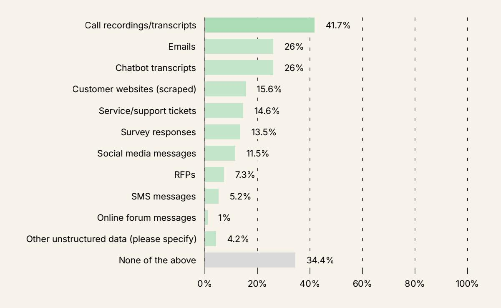

Harnessing unstructured data opens up tremendous opportunities for innovation within marketing operations and customer experience delivery.

65.6% of our respondents are already using AI to capture, analyze, and leverage one or more kinds of unstructured data in their martech stack. Call recordings/transcripts are the most commonly used, with 41.7% adoption (53% among SMBs). But emails and chatbot transcripts are tied in second place, used by 26% of respondents (32% among SMBs).

Service/support tickets, survey responses, and social media messages are also each being used with AI by about 1 in 6 respondents.

A novel use has also emerged with companies scraping the websites of their customers, for acquiring customer intelligence and buyer intent signals. 15.6% of respondents are doing this today (slightly more, 20%, in B2B).

# LLM/Agentic AI in Marketing Workflows

Are you using LLMs or agentic AI in any of your marketing workflows or automations?

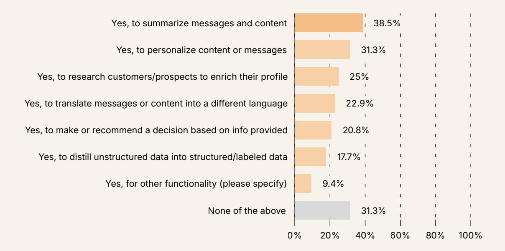

Several of the use cases for unstructured data were revealed by the responses to this question, asking about LLMs or agentic AI being used in marketing workflows or automations. 68.7% of survey participants had one or more use cases implemented. The most common was using AI to summarize messages and content (38.5%), followed by using it to personalize messages or content (31.3%). Essentially working more intelligently with incoming and outgoing customer communications.

Using AI in workflows to enrich customer profiles has become increasingly popular in B2B businesses, implemented by 36% of our B2B respondents (versus 25% adoption overall).

It's also worth noting that enterprises were significantly more likely to have implemented AI workflows/automations for translating messages or content: 40% compared to 22.9% overall. Given that enterprises are more likely to be in multiple geographical markets, this makes sense — and is a testament to the fact that such translation technologies have matured to the point where they are reliable in more automated workflows.

# AI Automation Products in Marketing

What products, if any, are you using for AI automation or agentic workflows in marketing?

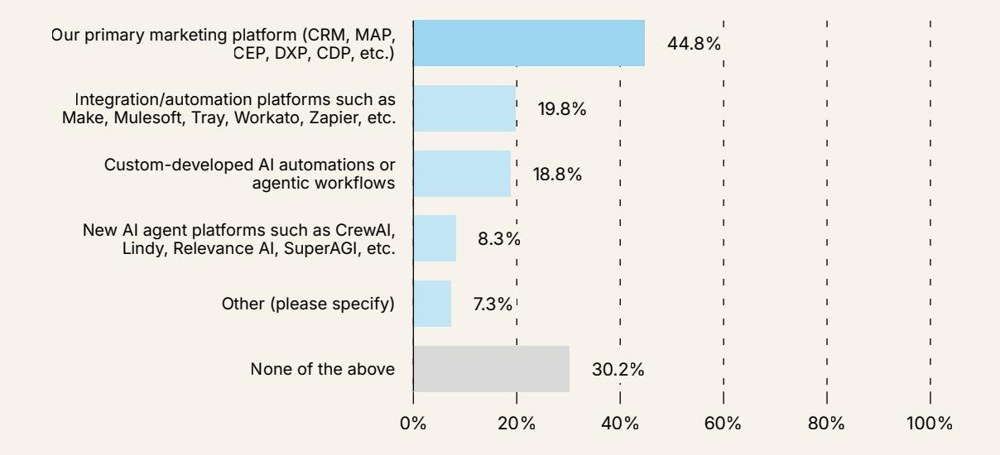

How are marketers implementing these AI-powered automations and

workflows? The most common approach (44.8%) is using their primary marketing platform whether it was a CRM, MAP/CEP, CDP. For enterprises, this is an even more prevalent approach (63%).

Dedicated integration/automation platforms (19.8%), such as Make, Mulesoft, Tray, Workato, Zapier, etc., and custom-developed AI automations or agentic workflows (18.8%) are the next most common approaches. SMBs are slightly more likely (26%) to use a dedicated integration or automation platform, which we attribute to the popularity of Make and Zapier in that segment.

*"If you have AI agents crawling around your composable stack, that allows your stack to morph and fit the needs of each individual user. AI agents have an ability to make your composable stack that much more dynamic." Sara Faatz* Key Highlights & Insights from Our Sponsor

[Read Interview](#page-117-0)

# API Integration of AI Features

Given that custom development of AI-powered functionality in the martech stack is happening, it's not surprising that a correlated number of respondents (45.9%) acknowledge using APIs for this purpose — although only 9.4% say they are using APIs extensively vs. 36.5% using them only for specific use cases. But another 33.3% expect to be leveraging APIs for AI-related implementations.

API adoption was pretty similar across B2B and B2C companies. However, it's worth noting that SMBs were significantly more likely to report using APIs for AI functionality — a full 55%, with 18% stating that they use them *extensively* for this purpose. Agility and the willingness to push the envelope with more custom AI implementations could be a significant advantage for SMBs. And with low-code/no-code tools we expect that capability will be within reach of more small businesses than ever.

## Are you currently using APIs to integrate AI-driven features into your martech stack?

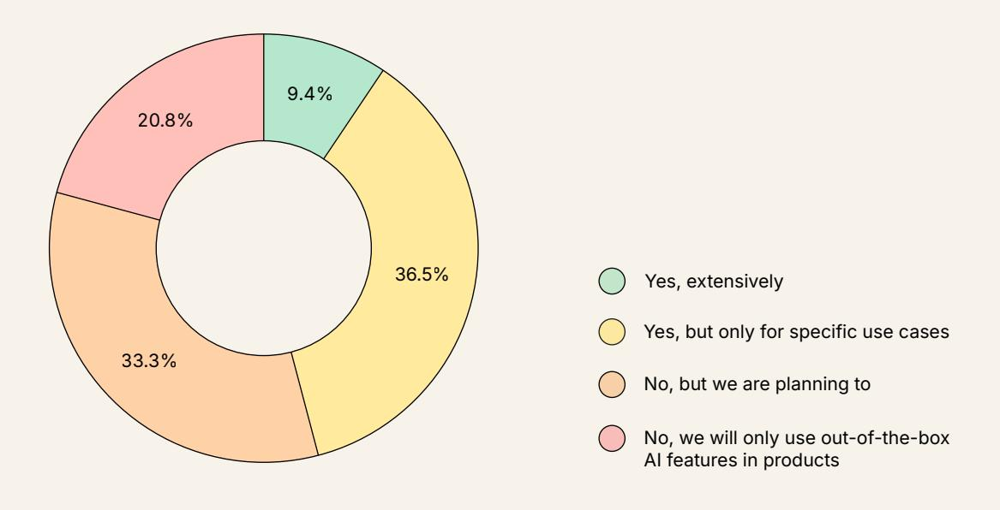

Source: 2025 AI & Martech Stack Survey, chiefmartec & MartechTribe

# AI-Powered Low-Code/No-Code Marketing Apps

However, when it comes to using AI-powered low-code/no-code tools such as Airtable, Bolt, Glide, Lovable, and Replit — for building custom apps, only about 1 in 4 respondents said they were doing so.

Given how impressive these tools are, and how remarkably easy they are to use, we were somewhat surprised by their low showing in this survey. However, SMBs appeared again to be embracing this capability at a slightly higher rate than enterprises, 29% compared to 20%.

Are you using any AI-powered tools to create low-code/nocode apps in marketing, such as Airtable, Bolt, Glide, Lovable, Replit, etc.?

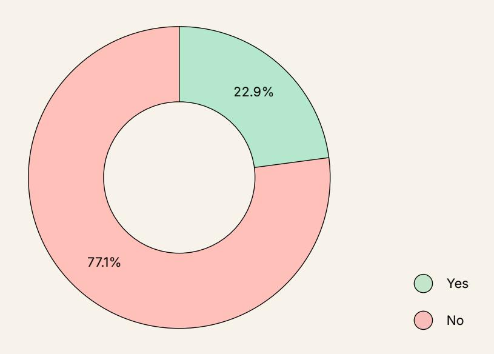

Source: 2025 AI & Martech Stack Survey, chiefmartec & MartechTribe

# Customer-Facing AI Agents

Finally, we asked marketers about where they were currently having AI agents interact directly with customers. For the majority of our respondents (55.2%), the answer was, "Ah, no."

The most common use case was a chatbot AI agent on their website (36.5%). Admittedly, there's probably some fuzziness in this answer in distinguishing having a chatbot on their website vs. an AI agent chatbot. We also suspect that if we had surveyed customer service or support professionals, we may have seen evidence of higher adoption of AI agent chatbots.

While all but one of our respondents said they weren't using an AI agent to proactively call prospects or customers, 12.5% said they were letting AI agents proactively send emails and texts. In B2B businesses, this was slightly more common at 20%.

## Are you using any AI agents that are interacting directly with customers?

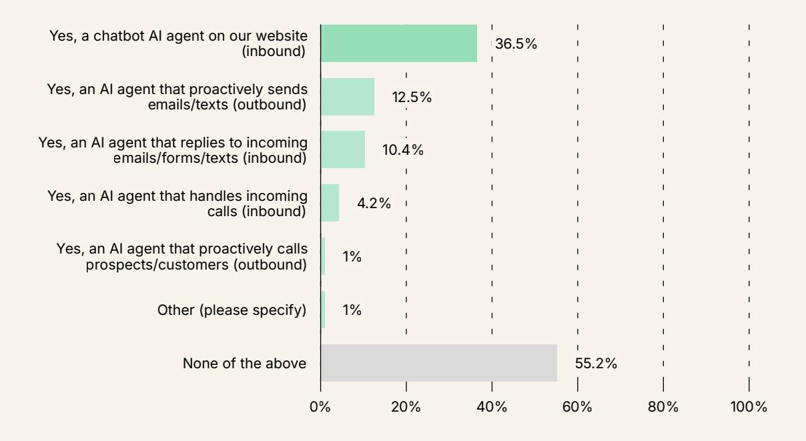

Source: 2025 AI & Martech Stack Survey, chiefmartec & MartechTribe

It will be fascinating to see how adoption in these use cases advances over the rest of this year — and the secondary effects with buyers that result.

# 3. The AI Transformation of Marketing & Martech

"We are building the plane as we fly it — and redesigning the cockpit."

That's what ChatGPT blithely proposed as a metaphor for the ways in which AI is changing both marketing and martech. A little cliché, perhaps. But that's what you get when you train on all the bad writing ever published on the Internet. (Admittedly, some of which was ours.)

Nonetheless, it's a fair summary of the current state of martech.

While the laws of time and space preclude us from covering more than a fraction of what's afoot, we'll offer our perspective on four topics that we think are especially relevant:

- The evolving structure of the martech stack
- The evolving nature of the "hypertail" of custom software
- The evolving shifts in marketing operations with AI agents
- The evolving roles in marketing as AI does more jobs-to-be-done

Evolving this. Evolving that. More evolution than a Darwin seminar. But with marketing instead of finches and tortoises.

# The Liminal Evolution of the Martech Stack

When contemplating how martech stacks will be transformed in an AI world, it's easy to slip into fantastical thinking. *SaaS is dead! Agents will do everything! Just think it and your brain waves will make it so!* And honestly, the exponential advancement of AI could very well make all those things true. In time.

But as Arya defiantly said to the god of death in *Game of Thrones*, "Not today."

The reality is that we're entering a liminal period — the in-between phase of a transformation, where both the old and the new will coexist for some time. How long that period will last is hard to say. But we're quite certain it will be measured in years, not months. Because as you know, organizations do not change exponentially.11

Most existing systems will remain essential for two reasons.

First, they're where existing business logic is defined and run — the reams and reams of data structures, processes, rules, and experiences for customers and employees. In organizations of any real scale, this sea of business logic is large, complicated, and crucial to the day-to-day operations of the firm. It's neither wise nor practical for most companies to rip-and-replace all that massive machinery in one fell swoop.

It's far more reasonable to start by adding new AI components into your existing environment. Let AI first augment the systems and processes you have today. Then, as their reliability and your understanding of how to wield them matures, steadily shift more responsibility from the old to the new. Think Ship of Theseus instead of buying a brand new yacht.12

Second, while the ability for AI agents to dynamically adapt to the needs of individual customers and employees on-the-fly is their most promised superpower, this adaptability must be balanced by consistency for the business overall. There needs to be a shared reality across the business enforced by standardized data and processes — or there is no business, just a dream that was Rome.

Many of the existing systems at the core of marketing (and the rest of the business) — what we have historically called "systems of record" — are wellsuited to provide that solid foundational reality. At least for now.

11This is why we started with Martec's Law and Ethan Mollick's quote in our introduction. Economists would probably cite O-ring models to explain the constraints on organizational change. In layperson's terms, it simply means a chain is only as strong as its weakest link. When a system fails because of a weak link, even though it has amazing links elsewhere in the chain, everyone goes, "Ohhhhhh."

12 The Ship of Theseus is a philosophical paradox and thought experiment that asks: if all the parts of an object are replaced over time, does it remain the same object? In the classic example, the ship of Theseus undergoes continuous repair, with planks replaced until none of the original remain. The question is then whether the repaired ship is still the same as the original.

As a conceptual model of a martech stack blending the old and the new, we offer the following illustration:

### Old Meets New: Martech Stack Integration

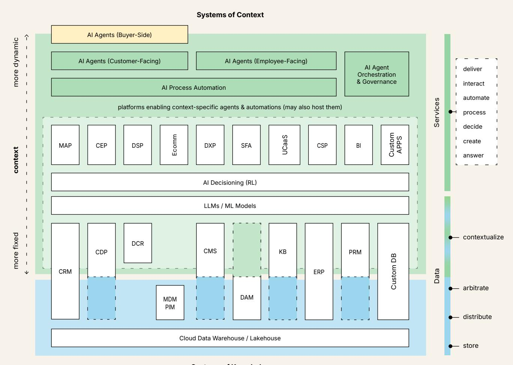

Systems of Knowledge

Source: chiefmartec

#### Acronym Decoder Ring:

AI-Artificial Intelligence; BI-Business Intelligence; CDP-Customer Data Platform; CEP-Customer Engagement Platform; CMS-Content Management System; CRM-Customer Relationship Management; CSP-Customer Success Platform; DAM-Digital Asset Management; DB-Database; DCR-Data Clean Room; ERP-Enterprise Resource Planning; KB-Knowledge Base; LLM-Large Language Model (e.g. GPT-4); MAP-Marketing Automation Platform; ML-Machine Learning; MDM-Master Data Management; PIM-Product Information Management; PRM-Partner Relationship Management; RL-Reinforcement Learning; SFA-Sales Force Automation; DSP-Demand-Side Platform (advertising); UCaaS-Unified Communications as a Service; DXP-Digital Experience Platform; XTC-New Wave Band

We've divided the stack into two domains: *systems of knowledge* that own and manage the data of a business's shared reality and *systems of context* that govern, decide, and deliver content, information, and experiences for customers and employees.

Systems of knowledge include many platforms that have traditionally been called systems of record. We prefer "knowledge" as a broader term because there's more happening here than just record-keeping. With AI, many of these platforms are able to intelligently distill and derive more insights from the raw data that is piped through them than they were just a few years ago.

The lowest level this domain is responsible for storing and distributing the data-fied embodiment of that knowledge. As revealed in our survey results in the last chapter, cloud data warehouses and lakehouses increasingly serve as that bedrock, a universal data layer.

The upper part of the domain takes more proactive responsibility for arbitrating what is "good" and permissible. These are platforms such as CRM, DAM, MDM, and ERP (see the legend in our illustration for a guide to acronym city) that serve as the sources of truth for different facets of a firm's operations: customers, assets, products, inventory, etc.

Many upper-level systems of knowledge start to bleed into systems of context by organizing or framing the data in a way that best serves more situational needs. Most CDPs — or CDP-like functionality embedded in other platforms play this role. (It is, in our opinion, still a valuable one.)

Systems of context are where most interactions with employees and customers (and, yes, their respective AI agents) happen. We call these systems of context because, especially with AI, they increasingly adapt to the context in which the user — employee or customer — is interacting with them.

Platforms classically known as systems of engagement — MAP, CEP, DXP, DSP, ecommerce, etc. — are the anchor tenants of this domain, along with platforms generally used for internal-only work, such as BI, project management, productivity suites, and workflow automation.

These core platforms of the martech stack tend to be *more fixed* in how they manage that context, with predefined rules, interfaces, and workflows. This

is not necessarily a bad thing, as that structure provides consistency and cohesion — the shared reality of how the business operates.

### Fixed Structure Meets Dynamic Context

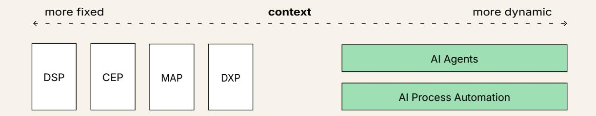

Source: chiefmartec

In contrast, the new generation of AI agents and assistants that are emerging create and serve context in a *more dynamic* fashion. For instance, users may be able to describe what they want in a natural language prompt, and the AI will figure out how to do it — often with the benefit of contextual data about the user and their task being automatically piped in behind the scenes. (Retrieval Augmented Generation, or RAG, is the method you'll often hear as the way we feed these agents relevant data for handling those requests.)

These AI agents and assistants can often be thought of as wrappers around the core systems of context and systems knowledge. They can act across these different systems — through APIs, "computer use" (where the agent interacts with the UI of a system as a human would), and new agent integration standards such as Anthropic's Model Context Protocol (MCP) and Google's new Agent2Agent (A2A) protocol.

Because of the way they seamlessly act across different products and platforms in your stack, AI agents are kind of like the next generation of iPaaS and workflow automation.

Such AI agents and assistants may be customer-facing or employee-facing. They can be a part of your stack or accessed as an external service. They can be stand-alone, contained within an agent-building platform such as CrewAI or agent.ai, or embedded within one of your core systems, such as with Salesforce's Agentforce or HubSpot's Breeze AI. They can persist, or they can be created on-demand and vanish when their task is done.

### Buyer-Side AI Agents

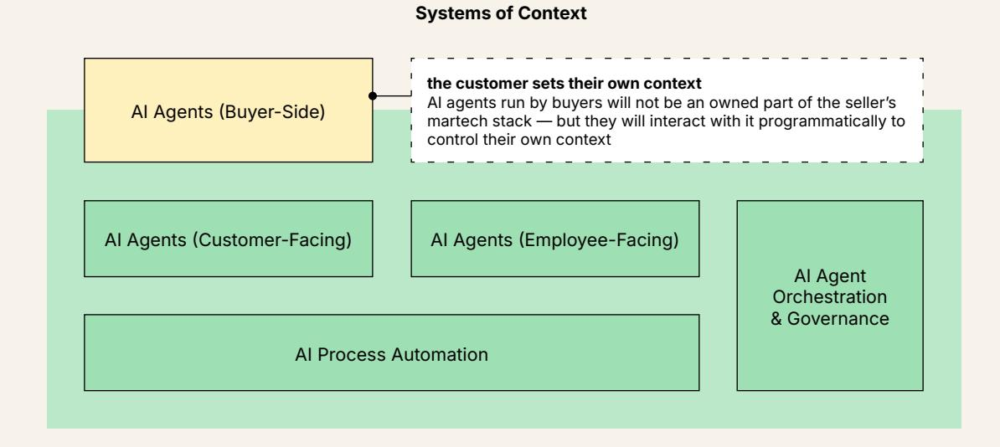

Source: chiefmartec

It's also worth highlighting the idea of *buyer-side AI agents* that we put in the upper left corner. These are agents owned by or operating on behalf of your customers. You don't control them — although you can choose how you engage with them. We placed them on the outer edge of the martech stack because while they don't belong to you, they will be interacting with your systems more and more frequently. It's going to be important to factor them into your architecture and operations.

The last layer in the systems of context domain that we want to point out in the middle are AI platforms that help make decisions. David Raab, founder of the CDP Institute, once summed up the three layers of marketing technology as data, decisions, and delivery. For a long time, the decision-making machinery was typically embedded with a data system such as a CDP or in a delivery platform such as a MAP, CEP, ESP, or DXP to do personalization, recommendations, and A/B or multivariate testing.

Now, we are seeing LLMs and machine learning (ML) models being called as more independent services in the stack — being leveraged as a part of "agentic" workflows to make decisions with greater intelligence and autonomy. Like AI agents and assistants, they work more openly across the stack.

In this decision-making cluster of capabilities in the stack, we've called out *AI Decisioning* (RL). This recognizes a new category of products from vendors such as Aampe, Hightouch, and OfferFit that apply a branch of machine learning known as "reinforcement learning" to let AI agents intelligently learn which offers work best with which customers. They're asymptotically approaching the dream of delivering the right message, at the right time, on the right channel, to the right person — for every individual in your universe.

Three notes about our conceptual model of this evolving martech stack:

First, you don't necessarily need all of the types of products shown. We included many just to demonstrate where we think they fit in the stack if you do have them. Our higher level mantra remains: buy only the martech you need.

Second, vice versa, we weren't exhaustive in identifying all possible types of products that you might have in your stack. Account-based marketing (ABM)? Social media management (SMM)? Enterprise data catalog (EDC)? All legit if you have it and use it. We'll leave it as an exercise for the reader to decide where to place them in our illustration.

### Two Faces of the Same System: Stack vs. Graph View

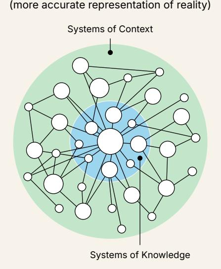

graph view

Source: chiefmartec

Third, we've drawn it as a stack — blocks on top of other blocks, neatly packed together — because it's easier to grasp the conceptual relationship between the components in that view. And this is how tech stacks have been drawn since time immemorial. But a more realistic view would be that of a graph, with nodes and edges representing the different technologies and the connections between them.

In this graph view, "composability" can be understood as the ability to easily connect different components together in any subgraph configuration you want — like atoms being bonded together to form more complex molecules. (We've talked about this over the past couple of years as the dual forces of *atomization* of more individual martech components and *aggregation* of data, workflow, UI, and governance across those components. AI is amplifying both of these.)

We began this section by mocking the claim that SaaS is dead. (If we had a nickel for every time something in martech was proclaimed dead… well, let's just say we wouldn't need sponsors for our research, which we'd more frequently conduct from a tropical beach.) Hopefully you've seen why these core systems are likely to still be important in the martech stack for some time.

That said, SaaS products are definitely evolving as a result of AI, from their pricing (instead of seats, we're shifting to more usage-based and outcomebased pricing) to their user experience (more AI agents and assistants built-in, with more dynamic user interfaces).

#### From SaaS Era to AI Era

|                | SaaS Era                                                                                                      | AI Era                                                                                                        |
|----------------|---------------------------------------------------------------------------------------------------------------|---------------------------------------------------------------------------------------------------------------|
| User Interface | multi-step screens, menus, buttons, dropdowns; the more complex the software, the more complex the UI   | natural language interfaces (typed or spoken); complex software can be controlled through a simple UI   |
| Business Logic | fixed application logic; workflows and customer journeys that are hardwired and deterministic           | dynamically-generated application logic, workflows and customer journeys that adapt to context          |
| Data           | every application had its own silo of (mostly) structured data; integration and data quality challenges | structured and unstructured data integrated through a universal data layer; AI synthesizes data quality |

Source: chiefmartec

We will see a steady morphing from how things worked in the SaaS Era to the new ways they'll work in the AI Era — even as the products-formerly-knownas-SaaS remain an integral part of the stack.

But the commercial software landscape is only the tip of the tail…

# From the Long Tail to the Hypertail

*"I'm increasingly convinced that the ability to build applications is being democratized in front of our eyes. Factors like creativity, data or taste – not necessarily technical skills or a massive budget – will become the deciding forces behind the next hit products."*

*– Kyle Poyar, Growth Unhinged*

The commercial martech landscape has always been a "long tail" distribution, ordered by their relative scale of approximately the number of users who have adopted them.

There are a small number of major martech platforms in the head, mostly by public companies, such as Adobe, Braze, HubSpot, Microsoft, Oracle, Salesforce, and Zeta, with billions of dollars in revenue. A few hundred category leaders that have achieved \$100 million or more in annual revenue. And a long tail of thousands of more specialized applications, including vertical market software, regional product leaders, ecosystem-specific apps, productized solutions from service providers, and early-stage and late-stage startups.

However, as we described in our [Martech for 2025](https://chiefmartec.com/2024/12/martech-for-2025-a-brand-new-108-page-report-on-ai-use-cases-stack-foundations-and-market-structure/) report back in December, this commercial long tail of martech software bleeds into a rapidly expanding *hypertail* of custom-built software. These include IT-built apps, but also citizen developer built apps by marketing ops professionals and marketing power users.

#### The Martech Long Tail and Hypertail

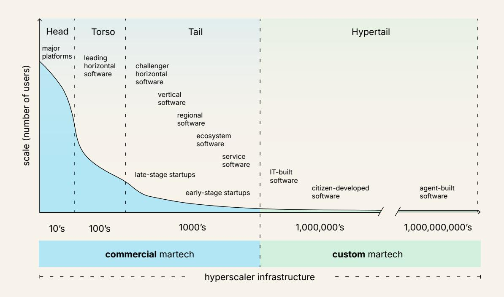

Source: chiefmartec

The recent explosion of AI-powered software development environments, such as [Amazon Q Developer,](https://aws.amazon.com/q/developer/) [Cursor,](https://www.cursor.com/) [GitHub Copilot,](https://github.com/features/copilot) and [Windsurf](https://codeium.com/windsurf), are accelerating professional app development significantly. Code is being written faster — often on the order of 35–45% faster.13 Since there is no lack of ideas on the backlog of things to be built, this AI acceleration results in more apps being created.

"Today, more than a quarter of all new code at Google is generated by AI, then reviewed and accepted by engineers," said Google CEO Sundar Pichai in the company's [Q3 earning's call last October](https://abc.xyz/2024-q3-earnings-call/). "This helps our engineers do more and move faster."

More impressive, in our opinion, is the latest generation of AI-powered lowcode/no-code app builder platforms that citizen developers such as marketing ops professionals and newly christened "go-to-market engineers"14 can use

13 McKinsey Digital, [Unleashing developer productivity with generative AI](https://www.mckinsey.com/capabilities/mckinsey-digital/our-insights/unleashing-developer-productivity-with-generative-ai#/)

14 A marketing technologist by any other name would smell as sweet.

to create web and mobile apps almost entirely with natural language prompts, by simply describing what they want. [Bolt](https://bolt.new/), [Lovable](https://lovable.dev/), and [Replit](https://replit.com/) are three of the most popular app builders right now.

These platforms are further multiplying the number of custom apps proliferating throughout the tech stack. As just one point on the curve, Replit founder and CEO Amjad Masad recently told Kyle Poyar that Replit users have made more than 2 million apps in the past six months — all without needing to write a single line of code.15

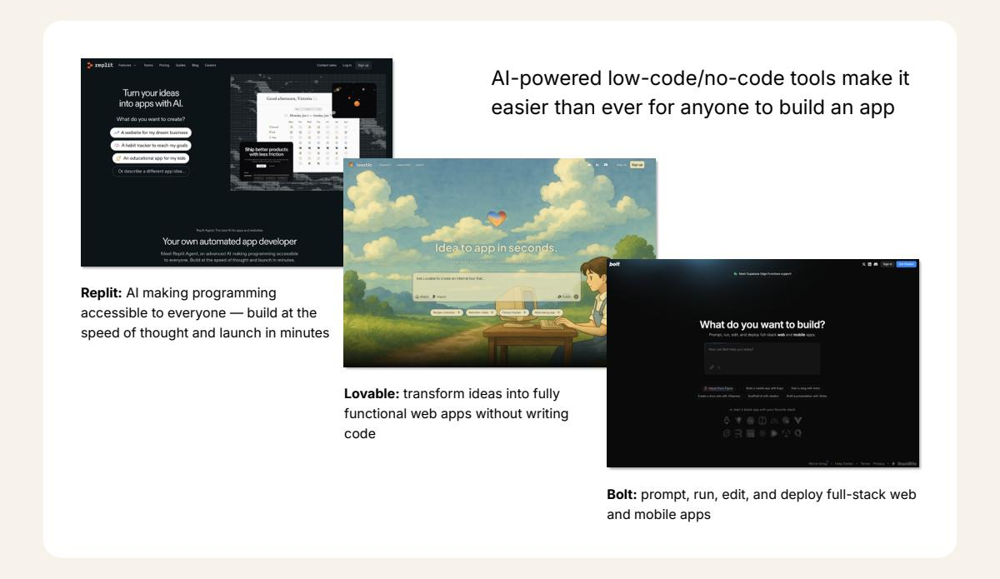

Source: chiefmartec

In February of this year, Andrej Karpathy, a co-founder of OpenAI, introduced the term "vibe coding" to describe the approach of amateur and professional programmers building software with these tools. "You fully give into the vibes, embrace exponentials, and forget that the code even exists," he posted on X. "It's not really coding — I just see things, say things, run things, and copy-paste things, and it mostly works."

Only a few years ago, this would have sounded crazy to most software engineers. But when someone like Karpathy, a world-renowned computer

15 Growth Unhinged with Kyle Poyar, [The new way to build software](https://www.growthunhinged.com/p/replit-growth-journey)

scientist and practicing developer states it, you have to recognize that the nature of software creation is fundamentally changing.

As Karpathy stated a couple of years ago, "The hottest new programming language is English."

Source: Andrej Karpathy on X

The embrace, enablement, and growth of more custom-built software in martech and marketing operations is also revealed with the increased prevalence of product management tools such as Jira, Aha!, Pendo, and ProductBoard as official parts of the martech stack. In comparing the stacks of overperforming companies — those with higher revenue per employee ratios — we see that the prevalence of product management tools has nearly doubled in stacks defined from before 2020 to those defined after 2020, from 23% to 42%.

Self-reported maturity for the usage of product management tools in martech still remains low. This could be because, with the doubling of the prevalence of these tools, there are a lot more "newbies" wielding them, at least in the context of marketing. It could also be that the product management use cases in marketing are simply less advanced than full-scale product development.

It's also probably not coincidental that the *Product Management* category of products on our martech landscape saw the highest percentage increase in G2

ratings, up 3.2%, this past year. More development, commercial or custom, is more opportunity to appreciate the value of good product management tools.

#### Product Management Tools Maturity Self-Assessment

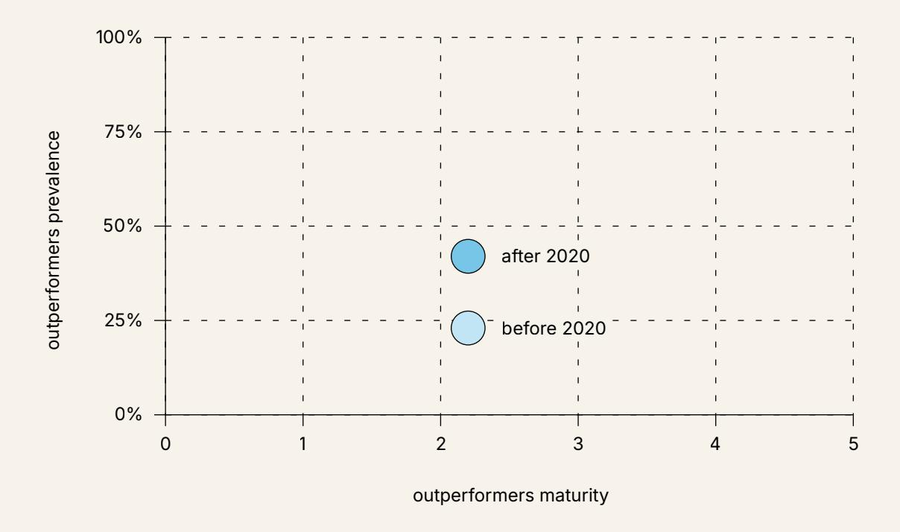

Source: MartechTribe

On the farthest end of the hypertail are AI agents and assistants that generate programs and run them *without the humans they serve even knowing that code was created and executed on their behalf!*

For example, we asked ChatGPT to create a stacked area chart of the market capitalization of the 10 most valuable companies in the world each year, from 2000 to 2024, categorized by tech companies vs. all other categories.

It quickly did our bidding, pulling the data from the web and rendering the chart. *Voilà!*

But behind the scenes, it actually wrote and executed a Python program to make this happen. Had we not clicked on the tiny icon to view its analysis, we would have never even known about this little piece of custom software

that got blinked into existence for us — a minute, just-in-time, and essentially unseen micro-app.

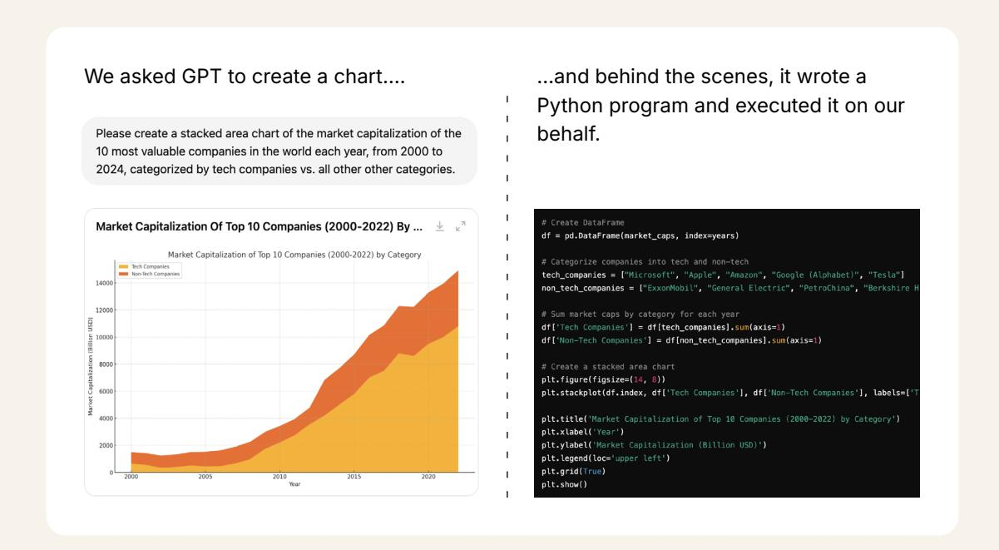

Source: chiefmartec & MartechTribe

Admittedly, this was a very simple piece of custom software. But as AI coding models continue to improve — which they are, quite rapidly — we can expect the sophistication of these "instant software" micro-apps to grow. And the number of them will multiply, all below the visible surface of our martech stacks.

That is why the hypertail will consist not of millions of custom software apps, but billions, trillions — in truth, an uncountable number of them.

Naturally, this raises questions about how to manage such a dynamic and fluid martech stack…

# AI Agents and Managing a Dynamic Martech Stack

Martech is going from being *complicated* to being *complex*.

Those two words sound like synonyms. But here we mean them as technical concepts that are fundamentally different from each other. To explain this distinction and what it means for the future of marketing operations, we want to use the Cynefin framework.

#### The Cynefin Framework

#### long loops

#### Complex

- Many independent parts that interact with each other
- Dynamic system ecosystem, continuously evolving
- Can manage discernable causes and effects, but impossible to predict exact behaviors and outcomes

#### Complicated

- Many precisely interconnected parts in a large system
- Only an expert can understand how they fit and flow together through careful analysis
- However, the way the system works is deterministic and predictable when understood

#### Chaotic

- Unable to discern causes and effects in this environment, regardless of one's expertise
- Mostly unmanageable beyond immediate action/reaction
- Unpredictable behaviors and outcomes

Clear

- Simple machine or machine-like process, easy to operate
- Most people can intuitively understand how it works
- Perfectly predictable behaviors and outcomes — always works the same way

short loops

Source: chiefmartec

Note: Cynefin framework originally created by Dave Snowden

Created by Dave Snowden in 1999, the Cynefin framework describes four different kinds of environments in which sense-making occurs — clear, complicated, complex, and chaotic — in a 2x2 matrix.

Starting from the lower right, a "clear" sense-making environment is where cause and effect are directly and obviously linked. Do *x* and *y* will happen. It's almost a perfectly predictable machine. Anyone can intuitively understand how it works.

We used a picture of a manual juice squeezer as a visual metaphor. Take half a citrus fruit, squeeze and twist it on the juicer, get juice. Not a lot of debugging or advanced analytics required. In marketing, an example might be a simple, fixed automation such as sending a standard "welcome" email to someone who signs up for your newsletter.

Moving to the upper right, we enter the "complicated" space. In a complicated environment, there are now many moving parts, intricately interconnected. Things still work deterministically, but they follow a much more windy path. Instead of do *x* and *y* will happen, it's more like: do *a* and then *x*, *y,* or *z* will happen depending on steps and branches between *a-z*. Only an expert who really understands the architecture of a complicated system can comprehend the intricate decision logic between cause and effect. To a non-expert, the outcome may seem random. But it's not.

The visual metaphor we chose here is a Ferrari. It is a precision-crafted machine with many interconnected pieces. They do work together in a predictable fashion. However, while it's fairly easy to get behind the wheel and drive one,16 if something breaks and the car stops running, it may not be so easy to figure out why. You will likely need a trained and experienced Ferrari mechanic to diagnose and repair it.17

In marketing, we think the martech stack as a whole — at least how it's been structured and operated to date — is a quintessential example of a complicated system. The logic for how your stack works is deterministic, a function of how all of the different platforms and apps within it have been programmed, configured, and integrated. But because the overall system is so large and has so many interconnected parts, it can be difficult for a non-expert

16"Easy" if you have an obscene amount of money — or a reckless disregard for property laws.

17 This will also cost you an obscene amount of money

to understand why it behaves certain ways. You really need a trained and experienced marketing ops professional.18

Now things get interesting when we move to the upper left, from complicated to "complex." In a complex environment, there are also many, many different and interrelated parts. But they have greater independence, and the way they interact is more dynamic and probabilistic. To be sure, there is still cause and effect. But it's impossible to perfectly predict a specific cause resulting in a specific effect.

Our visual metaphor here is a rainforest. It's an ecosystem of many different flora and fauna that interact with each other in all sorts of fascinating ways. Causes beget effects, which serve as causes for other effects, which cause other things… and so on in the great circle of life.

People can definitely impact a rainforest — sadly, usually not for the better. But we can also be stewards of the ecosystem and engage, at least directionally, with causes and effects in context. For instance, if you pull a sleeping tiger's tail, we can't guarantee precisely what will happen next. But odds are it's not going to be pleasant.

#### From Complicated to Complex

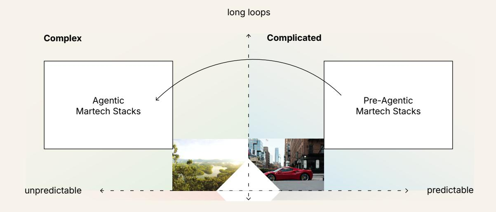

Source: chiefmartec

18 This will cost you a lot of money too. But you'll get a much higher return on your investment. And it won't be seen as a midlife-crisis cry for help.

In marketing, the introduction of LLMs and increasingly autonomous AI agents makes martech *complex* in this way. The outputs of LLMs are, for all practical purposes, probabilistic. The same prompt will not give you the same answer every time. It may give you something similar. But that's not the same. If those outputs are used to make decisions or trigger outcomes, then the chain of what happens next is also probabilistic, even if specific steps within the chain follow more deterministic *if-x-then-y* rules.

Most AI agents rely on these LLMs and their reasoning engines to power their autonomous decisions and actions. They become more independent. They increasingly have the ability to interact with each other, through protocols like MCP and A2A. And the number of different agents — small and large, stand-alone and embedded, commercial and custom — operating in stacks is growing.

The resulting martech stack becomes more like a rainforest than a Ferrari.

It is an ecosystem more than a machine.

This is not inherently a bad thing! In fact, a rainforest-like stack can be much more adaptable, powerful, and scalable. It can evolve more organically. But it does require marketing operations to evolve beyond building and maintaining piles and piles of rigid, linear processes:

- Embrace a more modular, loosely-coupled architecture for the stack, favoring open and interoperable apps and platforms — i.e., composable martech
- Enhance mechanism of "observability" streaming logs, dashboards, and anomaly alerts to identify when probabilistic outcomes are drifting out of expected boundaries
- Engage in more safe-to-fail experiments, where new AI agents and agentic capabilities are tested in small, limited pilots to learn how they (probabilistically) behave
- Institute human-in-the-loop checkpoints for larger decisions, such as audience selection or budget allocation to guard against biased or runaway behaviors — trust but verify
- Build cross-functional "sense-maker" pods of small, empowered teams that include marketing ops, data engineering, AI/ML, and compliance to evaluate and interpret emergent behaviors and make adjustments on-the-fly

- Invest in greater data maturity, especially with your underlying data infrastructure and data pipelines to validate incoming data quality, label drift, and output coherence
- Promote a culture of experimentation: reward teams for uncovering unexpected failure modes or novel wins, not just "hitting targets"

To finish up our explanation of the Cynefin framework, the fourth sensemaking environment, in the lower left corner, is "chaotic." This is where there's simply no time to methodically consider all possible causes and effects or how they interrelate. Instead, with limited information and a ticking clock, you have to take action quickly, as best you can. The outcome is not predictable. But hopefully with the right heuristic, you'll do alright.

The visual metaphor here is a building on fire. Head for the exit as quickly as you can. Save the detailed analysis for the fire marshal investigating it later.

In marketing, you could say that a completely unmanaged martech stack, with many chefs in the kitchen and near zero governance, is essentially a chaotic environment.

It's important to emphasize that a complex environment is not an unmanaged environment. It's just more probabilistic than we've been used to with martech these past couple of decades.

We still want and need to orchestrate experiences for employees and customers in a complex stack. But instead of a single master "orchestrator" in the stack, we're likely to see multiple tools — apps, agents, platforms — that orchestrate different contextual experiences for those users.

For a while, we were converging towards large SaaS marketing

Key Highlights & Insights from Our Sponsor

*"Customer journey mapping was absolutely deterministic. With those predefined paths that brands designed and then pushed customers or prospects to take. But AI is changing the game here, and it's allowed probabilistic journey mapping to occur with high levels of confidence and correctness."*

*Jonathan Moran*

[Read Interview](#page-125-0)

platforms and leading iPaaS and workflow automation platforms being the two

kinds of orchestrators. Those platforms are still a big part of the martech stack and will certainly be major orchestrators of AI agents.

#### Digital Ops Orchestration

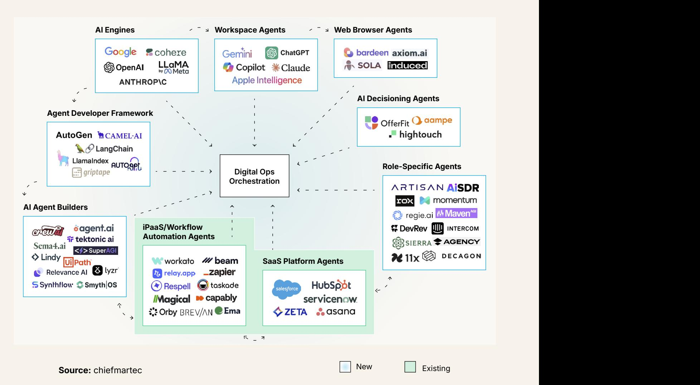

But there are now many new categories of AI agents coming on the scene. The big AI assistants-turned-agents such as ChatGPT, Claude, and Gemini. Rolespecific agents such as 11x, Rox, and Sierra. AI agent builders such as CrewAI and agent.ai. Web browser-based agents such as Bardeen, Induced, and Sola. And plenty of frameworks, such as LangChain, Camel.ai, and AutoGPT for software developers to build their own agents.

Things are going to be more complex. Again, that's not necessarily bad. But it is different.

It's more like a jazz improvisation than a precisely scored Bach concerto. Actually, more like a multitude of improvising jazz trios playing in parallel across the organization, rather than one full symphony orchestra with a single maestro conductor.

This is the era of Big Ops — managing a spectacular volume, variety, and velocity of apps, agents, and automations, all simultaneously operating and interacting across the organization.

It's also why the future of marketing operations and martech management is bright.

# The (Near) Future of Marketing in an AI World

*"The factory of the future will have only two employees, a man and a dog. The man will be there to feed the dog. The dog will be there to keep the man from touching the equipment." – Warren G. Bennis (circa 1990)*

"What's my role in this?"

It's a question many people are asking about their future with AI, and marketing is no exception. Scenarios such as *The Matrix* and *Terminator* movie franchises aside, we are optimistic that AI will usher us into a new golden age of creative marketing rather than reduce it to a soulless set of algorithms crunching away unattended in the cloud.

Let's start by grossly oversimplifying marketing into three buckets of work:

- Strategy and creative.
- Production and analysis.
- Martech and marketing ops.

Strategy and creative have always been what people think of when they think of marketing. It's the work we put on a pedestal. And for good reason. It is the

"star stuff" that differentiates one company from another. It's marketers' most visible contribution to the success of the firm.

That said, while it's the most valued work in marketing, strategy and creative haven't been where most of marketers' time and energy has been spent.

Instead, most of the calories in marketing have gone into the second bucket: production and analysis. It's taken a tremendous amount of labor to produce and analyze our strategic and creative ideas. It's not particularly sexy work though, neither enjoyed nor valued as much as the strategy and creative it's responsible for actually bringing to life. Nobody wins an award for Best Image Cropper and Tagger of the Year.

And, of course, we have martech and marketing ops. While you, dear reader, are likely to be someone who already appreciates the impact and leverage of the work done in this bucket — self-selection bias from downloading a copy of *The State of Martech 2025* — most marketing orgs have historically underinvested in these teams and capabilities. Great marketing ops work has rarely received the same recognition as a creative campaign. (Even though the latter often relies on the former to succeed.)

Here's how we see AI shifting the balance.

Most of the acceleration and automation that AI is enabling is in production and analysis. It's getting easier, faster, and cheaper to produce the creative ideas we conceive of and analyze their outcomes. A campaign that used to take weeks to implement with multiple, specialized contributors might now only take days, or even hours, for a marketing generalist augmented with state-ofthe-art AI tools.

By itself, this is a massive efficiency gain. Some companies will simply pocket that gain and call it a day — and short-sightedly fail to grasp the much bigger advantage this has to offer.

#### The AI Impact

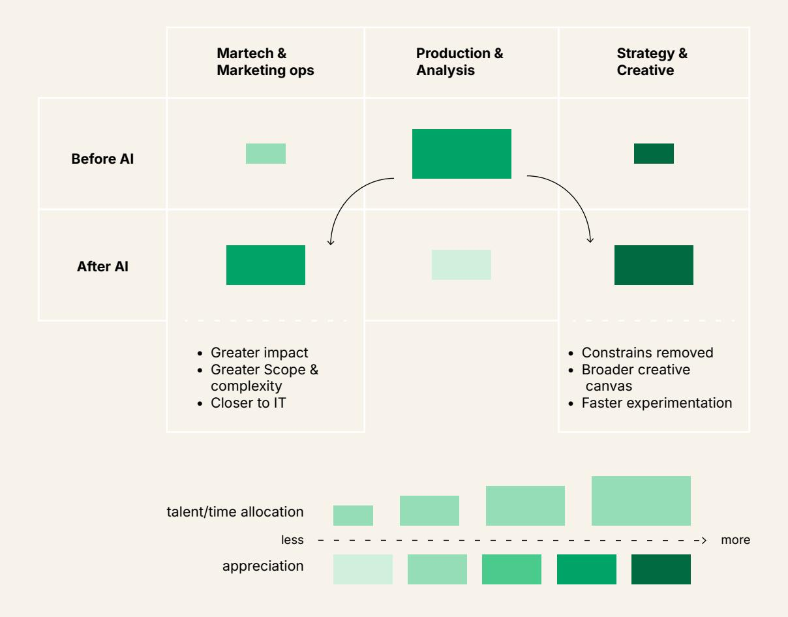

Source: chiefmartec

The real value of shrinking the time/money/talent costs of marketing production is the reduction of those costs as a constraint to more — and more ambitious — creative experimentation.

Marketing thrives on experimentation. We can rarely know in advance whether a new idea will work or not. All we can do is try it. If it does work, we double down on it. If it doesn't, we toss in on the scrap heap and move on to the next. The number of successful ideas we win with is a function of two variables:

*(# of ideas tried) x (% of ideas that work) = (# of winning ideas)*

By making production dramatically faster/cheaper/easier, we can significantly expand the (*# of ideas tried*) variable in our equation. Even if our (*% of ideas that work*) remains the same, the (*# of winning ideas*) we successfully launch goes up.19

And it's not just about more ideas being tried. The creative scope we have to play with is also expanding tremendously. With AI, a generalist marketer can use natural language interfaces to do everything from app development to video creation. If you can describe it, you can create it. Directionally, that's where we're headed.

Key Highlights & Insights from Our Sponsor

*"The best teams are trying to remove a lot of the manual processes and the redundancies and the kind of soulsucking work that no one really wants to do. They're really, really fixated on speed. They're obsessed with experimentation, but not just for its own sake."*

 *– Chris O'Neill*

[Read Interview](#page-82-0)

Together, increasing your volume, velocity, and variety of experimentation creates a powerful competitive advantage.20

However, note carefully that while AI *technology* enables faster/cheaper/easier experimentation, you also need your *people* and *processes* to adapt to a more democratized and accelerated way of operating in order to actually unlock this superpower.

To paraphrase lyricist Benrie Taupin: "agile marketing" aren't just pretty words to say. While agile marketing methods are less talked about today than five years ago, they're more relevant than ever. Small, empowered, crossfunctional teams (which may be embodied in an AI-augmented generalist marketer). Fast, iterative implementations (see: experimentation) with tight feedback loops. Continuous learning. Clear and transparent prioritization in a swiftly moving stream.

Agile and AI are an epic peanut-butter-and-chocolate combination.

19Along with, hopefully, our year-end bonus.

20 Big Data → Big Ops → Big Experimentation?

### AI Adoption Across Levels of Marketing Agility

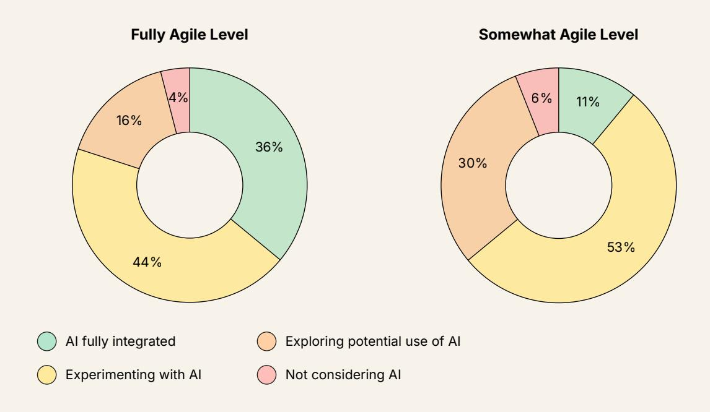

Source: AgileSherpas, State of Agile Marketing 2025, n=430

The recent *State of Agile Marketing 2025* report from agile marketing pioneer Andrea Fryrear of AgileSherpas shows the strong correlation between agile and AI success. Marketing teams that are fully agile are 3X more likely to have already fully integrated AI into their work compared to those who are only "somewhat agile"21 — 36% vs. 11%.

Finally, in the third bucket, we also expect martech and marketing ops will rise in importance and stature in this AI era. They're responsible for architecting and operating the underlying technology that enables these capabilities for the rest of marketing in a well-governed fashion. The scope and complexity of marketing operations will grow — but so will the value that can be achieved through its leverage.

Because more and more of the infrastructure for data and AI will span beyond the marketing department — which is a huge benefit to marketers who need to think beyond the campaign — we expect there will be much closer collaboration with IT. More of the martech function may even migrate to IT. But the blurring of those boundaries is the sign of our transition to a much more powerful generation of marketing and martech that has begun.

21Everyone is at least "somewhat agile" because "un-agile" (i.e., lumbering) isn't a great self image.

# You Are The Diferentiator

There used to be a saying in academic computer science that "AI was anything that wasn't yet possible." Because as soon as it was possible, they stopped calling it AI. It became machine learning or neural networks.

AI was always the frontier.

Now, AI more often refers to everything that *is* possible. More possibilities than any of us could count, with more and more appearing on the horizon every week.

Marketing will be — as it always has been — the art of pursuing what's possible but hasn't yet been done to attract, engage, and delight your customers.

This is your frontier.

We asked the six executives in our sponsors' expert interview to describe the future of AI and marketing:

"Risk-prone." – Greg Brunk "Ubiquitous." – Raviteja Dodda "Human-centric." – Sara Faatz "Powerful." – Tejas Manohar "Promising." – Jonathan Moran "Compound." – Chris O'Neill

# Compound Marketing: Accelerating Gains with AI-Boosted Experimentation Loops

*Interview with Chris O'Neill CEO, GrowthLoop*

Hey, Chris, welcome. We are so delighted to have you back for #MartechDay. For those who aren't already familiar with you, can you give us the elevator pitch for GrowthLoop?

Great to be back with you, Scott and Frans. It's always a pleasure. GrowthLoop was founded as a pioneer of activating customer data to drive impact.

AI is, of course, changing so much about the world. Certainly marketing is no exception. But the changes are different from those of the past in important ways.

In the past, think of TV and Internet and mobile. Those were changes of how we consumed marketing. AI is now revolutionizing how we create marketing. It's a supply-side phenomenon. GrowthLoop is transforming the application of agentic AI to the data cloud so that marketers can drive compounding growth faster.

You use the word "compound." You recently released a framework for leveraging AI in marketing programs and campaigns that you call compound marketing. Can you walk us through it?

We believe it's the beginning of a new category. I'll walk you through it. I've been a disciple of Warren Buffett and fascinated with the concept of compound interest for a long time. I think Albert Einstein is the person credited with calling compound interest the eighth wonder of the world.

The difference between 1% gain in a month or a quarter versus a 1% gain in a week or even a day is enormous. It's not just about driving gains *per se*. It's about driving faster gains. The steps, of course, matter. But it's the iteration cycle that matters at least as much.

The same principle can be applied to marketing. Marketing campaigns and programs are completed in cycles with testing, then learning and iterating using the results. If that learning happens sooner, the improvements can be made earlier and start to compound.

So the compounding, it's not just about any one step being faster, but the relationship between those steps? Tell me a little bit more about this compounding effect, because this is fascinating. An eighth wonder of marketing?

That's right! There are a number of phases going on. People understand and appreciate that data itself has to be the starting point. Putting the data into a data cloud, creating a single source of truth, that's where this starts. Then it's the democratization of that data, meaning that marketers can access the data directly. Without that democratization, I go to my data team and say, "I have this idea for an audience. Is it interesting? Is it small or big or is it the right size?" Then, there's back and forth. There's lots of SQL coding. Sometimes that takes days, sometimes weeks, sometimes longer.

But with agentic AI combined with a single source of truth in the data cloud, each of those steps can be improved and expedited.

Our innovation early on was this concept of a loop, that the marketing cycle does not consist of only discrete steps. They're actually very connected to one another despite the fact that the tools and the processes themselves have been fragmented, overly manual, and overly slow. We've basically taken a point of view from the very beginning of bringing all these steps together.

The concept is not discrete steps. It's a loop. It's a system. And now along

comes AI and you can apply AI at every step of the way. And that's fantastic. That's where we are right now.

If you can apply agentic AI to either remove or automate certain steps and then apply it to say, hey, who are we going to talk to? What are we going to say to them, and in what order? And how do we then optimize and learn from whatever we do so that we can bring those results back and do even better next time through? That's where it gets really exciting.

Love the way in which you're emphasizing this as a loop. In marketing, we have a tendency to imagine customer engagement as a linear journey. In reality, it's loops within loops. You can definitely see AI's role in this. What about the people and processes around this technology?

We think of AI more like a Tony Stark Iron Man suit than replacing humans. A lot of folks are into black box ML, they just do it for you. There are times and places for ML and reinforcement learning to predict things. In fact, the best of the best will always have those fueling propensity models at discrete points along the way.

There'll definitely be a time and place for that. But there's something magical about human ingenuity. I've been inside lots of different companies, and I've just seen what gets crowded out is the strategy and the creativity and the human ingenuity. Primarily because we're spending so much time making these different tools, trying to talk to one another, and then trying to get results from one system or the other. It's just so much "work of the work" that crowds out the magic of humans.

We think AI is more of an "and" function to enhance human ingenuity not "or." And that's different than some people who seem to think that it's all just going to be fed into a black box and magic happens. I don't think that's going to be the case anytime soon.

Let's talk about those humans. So in the beginning of data strategy and data preparation, with the expertise required here to make the collaboration happen between marketing, IT and data teams, what guidance would you offer for getting that right?

There was a time not so long ago where there was considerable tension between the data teams and the marketing teams. There has to be reconciliation between those teams, and I'm seeing that happen a lot now.

There's actually another vector, and that is the finance team. I am really keen both with our teams and in companies to see the CMO and the CFO, marketing and finance, become BFFs.

At the simplest level, we talk about growth and lifetime value. More generally, what's the return on this thing called marketing, right? For so long, it's been difficult. So it's viewed as a cost center with unaccountable results a lot of times. And to be clear, some of marketing is focused on brand, and it doesn't lend itself to purely quantitative results. But if you can change the paradigm and say, look, this is what we're doing and these are the returns that we can show you, that changes the mindset and the relationship between the CMO and the CFO.

That resonates a lot. Would you say that all data collaboration is converging in the cloud now? How are marketing teams operationalizing this universal data layer? What are the best performing teams doing that others should learn from?

One of the things we realized from the beginning was, we're not going to try to build the functionality of a data cloud ourselves. Why would we do that? That was a fundamental assumption behind GrowthLoop. That the data cloud (or lake or warehouse) is the customer data platform.

The best teams are trying to remove a lot of the manual processes and the redundancies and the kind of soul-sucking work that no one really wants to do. They're really, really fixated on speed. They're obsessed with experimentation, but not just for its own sake.

But experiments can also be expensive in terms of opportunity cost and often real cost as well. So it's being thoughtful about how and where to experiment. The best teams know what they're trying to accomplish. They know where they're going, and then it becomes speed of iteration.

That's the insight that led us to compound marketing. The best are obsessed with velocity. If I think of a golden thread throughout, it is iteration speed.

#### As you developed your product with this framework in mind, what have you done to help marketers apply this framework in practice?

It is a framework that drove our system development. This graphic sums it up:

It starts with the data in your data cloud. We apply agents to learn from that first-party data. It's trained on transactional lifetime value data, previous campaigns, etc. The more data in the data cloud, the better.

Secondly, an audience agent to determine audiences. What would be an interesting set of people to interact with from a loyalty perspective, or from just a lifecycle perspective? Maybe we're doing an acquisition-related campaign. Agents go in and use multiple different models to discover who would be the most interesting prospects and customers to interact with.

Third (where I think a lot of the magic and true alpha in our product takes place) is on the journeys. To identify not only who, but also what we are going to do with that audience. Is it an SMS, a mobile app, an email, a paid campaign, and in what sequence? And how will we experiment and do A/B testing across the journey?

Journeys have gotten crazily complex. And that sounds scary, but it's very easy for agents to think through that. We can help marketers guide that now

with natural language — just describe what you're trying to accomplish and the agent builds it.

We believe that the marketer should stay in control, though. Agents can suggest interesting ideas that then get approved by the marketer and activated. Or these suggestions are edited or modified by the marketer first before activation.

If you think about the concept of a command center or control tower, there's all these different tools that have a role to play. But orchestrating across all these channels takes time, especially if you're using multiple tools, as most enterprises are. How do you streamline the ability to take all that good thinking and make it happen across all those different platforms?

I call it the Andre Iguodala phenomenon. For those not familiar with basketball, Andre Iguodala, historically one of the best players, in my opinion, on the Golden State Warriors. He was one of the very first people to win the MVP of the NBA Finals by being the "sixth man"; meaning he wasn't one of the five starting players.

I often thought about why he was so effective and why he was so valuable to the Golden State Warriors. If I had to distill it down, when Andre Iguodala was on the floor, everyone else was better. Everyone was just better in some way.

I think of that as what we do. We make these other tools better by infusing more intelligence in them and stitching the outcomes of their work together from this command center, this control tower, orchestrating it.

You then feed those learnings right back into your data cloud and the cycle continues. So that's really what this is about from a product perspective. And again, we believe in a world where there's a studio at the heart of this, where these agents come to work, if you will, and then we put them to work. And then we learn in that command center that I'm describing.

It's not about SaaS. It's about results as a service or RaaS.

#### Ready for a lightning round? One word, one sentence responses?

Let's go.

#### What's your go-to AI buzzword?

Agentic.

Your favorite AI assistant? ChatGPT, Claude, Gemini, something else?

I use them all to be clear, but my go-to is ChatGPT.

AI agents autonomously sending, replying to emails. Are you a fan, a stan, or not a fan?

I have to go with stan. But with some supervision.

Do you think AI will cause martech stacks to grow or shrink?

Oh, let's hope that they shrink. These Frankenstacks have got to go over time.

What's the most surprising use of AI in marketing you've seen recently?

By recently, I mean last week. We've been toying with how much to build or partner around creative generation. I think the creative generation is the most exciting thing to watch.

You can see a world where you have ads and messaging that is literally created bespoke for one person.

In one word, how would you describe the future of AI and marketing?

Compound

# Benefits of an Independent AI Decisioning Layer in a Composable Stack

*Interview with Tejas Manohar CEO, Hightouch*

Welcome, Tejas. We're delighted to have you back for #MartechDay. For those who aren't already familiar with you, can you give us the elevator pitch for Hightouch?

Hightouch is a software company in the marketing technology space. Our vision is to help companies use data and AI to grow their businesses and deliver personalized, effective customer experiences.

We offer two major solutions. One is a composable CDP, which sits directly on top of a company's data warehouse. The other is an AI Decisioning platform, a newer product of ours, which allows marketing teams to build AI agents that can achieve their business goals, like getting in-store customers to shop online or buy new categories.

By the way, congratulations on your Series C funding earlier this year. You have been a leader in the composable CDP space. But tell us more about this second product for AI decisioning. What *is* AI decisioning?

Composable CDP is all about two things:

First, we help companies get a really strong data foundation in a data warehouse or data lake because we believe that's the future source of truth

for enterprise companies, not just for marketing but for everything in a business.

Second, give marketing teams really easy access to that data. So if they wanted to find out how many customers abandoned a cart in the last month or who shopped in one category but not another, they could just go in and answer those questions really easily with an audience builder, send the data to different marketing or ad tools, all without having to loop in engineers. No SQL or that kind of jazz. It's just easy for marketers to put their data to work.

Now with AI Decisioning, we're still pursuing the same vision as the Composable CDP. The point of all this data stuff was so you could send the right message to the right customer, at the right time, and deliver really personalized, effective marketing. The goal of AI Decisioning is the same. But we believe there's a new paradigm that's going to be unlocked by AI, specifically agentic AI, for how marketing teams actually go about sending that optimal message to each customer.

The paradigm of AI Decisioning is goal-based. You create AI agents instead of audiences or journeys. Each agent works to optimize marketing decisions toward their specific goals. For example, I want in-store customers to start shopping online, or I want customers to start booking delivery orders, or I want customers to open my app more frequently. You tell the agent your goal.

Then, you give us a set of actions that it can take. It could be hundreds of email templates, different offers you're willing to send, or different marketing ideas. The agent then figures out how to achieve your goal by delivering the best possible experience(s) to each customer. The agent is doing marketing on your behalf.

That's the idea of AI Decisioning. We're really trying to unlock a new way of marketing, agentic marketing.

How did you come to the conclusion this was the next direction to go in? Was there a pattern you started to identify with your customers?

One aspect of our philosophy of approaching business and product at Hightouch is that we don't want to just build tools. We're always trying to understand what our customers are ultimately trying to achieve.

Many companies have been looking for an audience builder or a way to activate data from their data warehouses. We are successfully selling them tools to do this and growing very fast. We're used by all sorts of enterprises, like the NBA, Aritzia, PetSmart, and GameStop.

But while we were doing this, we realized something. Just giving a marketing team access to a bunch of data is only half the battle. Even if you have access to build these audiences, your real goal is to send effective, efficient, personalized experiences to your customers. And there's still a lot in between there. You have to decide what the best audience is to create. How did this audience I just created actually perform in the market? Did I pair it with the right content? Did I engage these customers at the right time?

Marketers have many decisions to make. They're more empowered to make them when they have access to a lot of data, which Composable CDPs unlock. But making the optimal decision is still difficult, and it can be an arduous and scary process.

So we were sitting down with our customers and trying to figure out how do you go about making the best audiences. How do you go about building the best journeys? Where do you come up with the ideas for ways to use this data? How do you run A/B tests and experiments to iterate on using data in the best way?

We felt there had to be a new paradigm eventually where AI could allow us to do this a lot faster, a lot more accurately, and a lot more granularly, where AI could be picking the best treatment, the best message, the best timing for each customer versus building these more generalized journeys that can't possibly account for everything going on, with all these manual rules, flow charts, and data filters.

Our team was playing around with predictive models to see if we could build an audience of customers likely to buy. But then, if you know which customers are likely to buy, what marketing do you send them?

We kept iterating until we came up with this model of building a system that pursues that goal. You tell it the goal. And it agentically figures out the best way to achieve it by combining multiple tactics, whether it's experimentation, propensity models, reinforcement learning — which kind of ties it all together — even LLMs for some of the reasoning in the wild.

That's the opportunity we see with agentic marketing: making marketing much more goal-based and allowing the machines to figure out the best models and approaches to achieve it.

David Raab, the founder of the CDP Institute, who originally coined the concept of a CDP, said that martech stacks have three layers: data, decisioning, and delivery. In reality, the decisioning part has often been bundled with the delivery in marketing automation platforms, DXPs, and customer engagement platforms. Do you see that changing?

#### Two things here:

First, we think that marketers need a new way to make those decisions, right? There's not a shortage of tools where you can encode decisions, but the paradigms we have today to decide what's best to send customers are mostly around rules. You have to go into a tool, whether it's an engagement platform, an ESP, or a DXP, and you manually define rules. For instance, customers who recently abandoned a cart should see this. Or customers who previously booked five hotel stays for business should see this versus people who booked vacations. Customers who've been to Europe before should see this other thing.

Or we have very specific machine learning models that answer one question, but not the whole question. So predictive models, like this customer has a 70% chance of buying a product from us, so let's offer them a coupon. Do they need the coupon? I don't know. Is that the best economic decision? I don't know. There's a lot that the ML model didn't answer. It's answering only one very specific thing.

That's the state of the world today. Our core belief is that marketers need a new decisioning platform that is agentic. It's goal-based, and it can have multiple goals. It can balance your business outcome that you're driving

towards, but also reduce unsubscribes and opt-outs. It can determine how expensive different decisions are for your business.

Second, to achieve a consistent customer experience, we think it's important to be able to make these decisions across many channels. When we look at enterprise martech stacks in reality, we see a lot of different tools that are showing customers different things on different channels. So the second most important thing of making these decisions more intelligently with agentic AI is making them consistently across many channels. That's why we have built a decisioning product that's upstream and integrates with all those channels and tools downstream.

Lastly, to make the best decisions, you need to sit on top of the best data and as much data as possible. That's why we think we're uniquely positioned to solve this problem, as a company that sits directly on top of our customers' data warehouses and data lakes. That's where the raw data and existing data science models that companies are building live. We want to unlock more functionality with it.

#### Can you talk more about the advantages to the company — and to the customer — to pulling decisioning into its own independent platform?

First and foremost, the reason people adopt our software isn't just to unify the decisions. It's to make better decisions. AI agents that can make the best decision for each customer. It's almost like having a marketer per customer. These AI agents need to be not just customizable to your business, but also trustworthy. So visibility, observability, understanding what's going on, having good guardrails, and governance are key. A dedicated decisioning platform can do that really well.

As to why it should be done upstream, it's really two things.

Enterprise companies have many different martech tools that show customers many different things on many different channels. So, it's helpful to have a layer upstream where you can connect to all of them. You can even make decisions across different business units that might use different ESPs, and so on.

Again, we sit directly on top of a lot of data. When you work with a channel

tool, you often have to refine the data you send to that tool, whether it's Salesforce, Adobe, or Braze. You often don't put all your data into those systems.

But ChatGPT has kind of proven to everyone that the more data you can feed these machine learning or AI models, no matter the architecture, the stronger they are. The same is true when you're building agentic AI for your own business. You want to feed it as much of your own data as you can: data from finance, point-of-sale, marketing, your product, and vehicle telemetry. I'm talking to all sorts of companies with all sorts of data these days.

And there's no better place to do that than the data warehouse. We're building a technology to help people make really intelligent marketing decisions, which is most important. But it needs to be done upstream because of the reality of fragmentation in martech stacks and the need to sit more directly on top of the data.

You're like Switzerland across heterogeneous tech stacks. Would you say this is analogous to iPaaS and workflow automation tools of a previous generation? Many systems of engagement have their own integration and automation features, but we still see a lot of enterprise martech stacks that also have standalone automation tools, such as Workato or Zapier. But instead of automation or integration, it's now AI Decisioning?

It's analogous. And I would say even an analogy that's squarely in marketing technology is the CDP, right? Every email tool, DXP, any sort of system in martech, etc., they all have a database where you can put traits about customers. But do you have all the data in each of the systems? Probably not. Can you get all of the data in each of the systems? Maybe not due to a variety of factors, such as how they price or the schemas they make you squeeze the data into.

It's like: put all your user features here, put all your events that users are taking here. But what about my products, or store inventory, or last month's financial statements? Where's the rest of this information going to go? Probably not in your DXP or your ESP. That information is in an upstream database, usually a data warehouse. Maybe a CDP as well. But it's not going to be squeezed into every tool in your business stack. And I think that's what

we saw in iPaaS, what we saw in CDPs, what we've seen across the history of martech.

What are the challenges with an independent decisioning layer in the stack? What would a company need to do or have in place to be successful a standalone AI Decisioning platform?

Some level of data maturity is always required to do anything with data. Whether you're doing traditional data-driven marketing or using AI Decisioning and AI agents, you need a baseline level of data maturity.

What do I mean by data maturity? I don't mean a perfect data platform. You know, no company has that. If we required that, we would have no customers and no business. *<laughs>*

What I mean is that you have enough data in one place to build reasonable audiences from it. If you can build audiences with it, if you can pull lists of interesting customers to upload into your ESP today from your data warehouse, then AI can now mine a lot of interesting insights from this data for you.

So, getting data into one place is required. That's why we're excited about offering both a Composable CDP and AI Decisioning products. Because for our customers who don't have all the data in a data warehouse yet, we can help with that. Our events product can help you collect data from the web or your APIs, or mobile apps, and get it into the warehouse in the first place. Our identity resolution product can help you stitch together data across different tables and different objects in your data warehouse.

That said, I wouldn't over-index on trying to perfect your data before you do projects. That's a common misconception I see at enterprise companies, where people think of it too sequentially, which can cause a lot of delays in achieving the outcomes that you want as a business.

So technically, you don't need your Composable CDP to use your AI Decisioning product. But are there advantages to more closely coupling them if you use both?

Correct. We strongly believe that the decisioning layer needs to sit on top of all the data, but we also strongly believe that all your data shouldn't be locked away in a SaaS solution.

No SaaS tool, including Hightouch, should be the source of truth for your data. You should get all your data into a data platform that you own, something like Snowflake, Databricks, Google Cloud BigQuery, or Azure. What's important is that you have one of them and use it across all your business for analytics, personalization, and reporting. Use one set of data across everything in your business.

I really believe that decisioning should be done in a composable way that sits directly on top of all that data in your warehouse rather than being isolated to the data in only one of those channel tools. That's our overall perspective.

#### Before we wrap, we want to do a fun lightning round with you, if you're willing to play along.

I'm open to it.

#### What is your go-to AI buzzword?

Probably agents or agentic. I actually don't like the word agentic, but I started using it more. It's gotten a little more familiar over the last few months, but agents is probably my go-to buzzword.

#### What's your favorite AI assistant? ChatGPT, Claude, Gemini, something else?

I primarily use ChatGPT.

#### AI agents, autonomously sending, replying to emails. Are you a fan, a stan, or not a fan?

Not a fan of autonomously replying to emails. Drafting is okay.

#### Do you think AI will cause martech stacks to grow or shrink?

Grow. Grow first, then probably shrink.

#### What's the most surprising use of AI in marketing you've seen recently?

I'll share a surprising insight that I've seen recently with one of our customers, WHOOP, the wearable fitness band. They sell swimming accessories, different themed bands for wearable devices, and stuff like that.

And they found these interesting correlations, like, what's the second sport someone plays if they play one sport? So, for example, they found that karate practitioners often do swimming as a recovery exercise. All these weird patterns that I never imagined were able to optimize some of their marketing and squeeze out extra performance on their e-commerce sales. That's probably the weirdest insight I've seen recently.

Last one, in one word, how would you describe the future of AI in marketing?

Powerful.

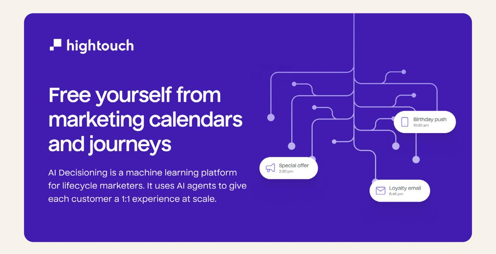

# Data Infrastructure Is the Key to Rationalizing Your Martech Stack for AI

*Interview with Greg Brunk Head of Product, MetaRouter*

Welcome, Greg. It's so great to have you here at #MartechDay 2025. For those who aren't familiar with you yet, can you give us a short elevator pitch on MetaRouter?

MetaRouter is a data collection and integration infrastructure that is primarily designed to give enterprises full control in a first-party context of their data for all their use cases. We aim to be a consolidation point and a central collection point, where all kinds of things can be enforced before going into downstream marketing and media and analytics use cases.

We help companies enforce compliance to normalize data quality, to strip out sensitive data that isn't relevant to certain use cases, to do a lot of transformation and obfuscation of certain things to adhere to infosec policies. We then manage the delivery and integration of that data in a compatible way to things like CDPs, paid media ecosystems, data warehouses, and analytics platforms.

We primarily work across use cases like tagging, server-side tagging. We also work a lot in retail media and in CDP and data warehouse development projects. Anywhere marketing and media data is consumed, we aim to be a highly-controlled, first-party, enterprise-owned central infrastructure for getting their data into those use cases.

So MetaRouter is often positioned as infrastructure in the martech stack. If you divide martech products into infrastructure and applications, what's the distinction between them and how do they relate to each other?

I think the easiest distinction is that infrastructure tends to be a broader buy across use cases, and an application tends to be bought for a point solution or a small number of specific use cases. You generally want to look at infrastructural investments if there's a lot of repeatability of that investment across a number of different goals for the business or the marketing organization.

What's important about infrastructure products is that generally they tend to be more technical. And so you need to have a higher engagement with the IT organization or your technical teams when considering them.

As you buy more and more applications, they tend to add a lot of duplication and complexity for the business, because now you have multiple planes where you're thinking about things like infosec and compliance. You're thinking about security across a number of different data pipelines or whatever it is to power those applications.

So as businesses start to encounter those problems, where they have a lot of inconsistencies across the way that applications are consuming data, or a lot of inconsistencies in what they're seeing in those applications, or a lot of risk spreading across those applications, then they start thinking about infrastructure as a means to consolidate and have a smaller set of places where they have to do those things.

That's a great segue from that. Talking about infrastructure and the ability to bring in new use cases, is AI changing the kind of martech applications that leverage MetaRouter's infrastructure?

For sure. We integrate with very few tools that don't have some nascent AI story now.

One that's really interesting. We've been working with a personalization tool that does sponsored product recommendations on the page. They've developed a solution where they balance the highest bid of the different brands buying into that sponsored product ecosystem with propensity

to convert that's trained very heavily on an ML base solution. They need a certain amount of training ahead of time, and then they can kind of understand what brands and what SKUs the customer is most likely to be interested in based on their models and behavioral data.

And so there's this kind of hybrid bid that they supply based on a combination of propensity to convert and highest bid. It ends up delivering like 600% return on advertising spend that they've been able to demonstrate consistently across several Fortune 50 organizations.

I thought that was pretty impressive. It's largely an ML use case. It's not completely novel. It's not generative AI, although there actually is some cool generative AI stuff and how the sort of the information comes back to the page and gets leveraged in other use cases.

But what is really cool about it is that it's small. I think use cases are really powerful when you don't try to plug all of your dreams into them. If you just say, I want this particular banner to have slightly better performance with a slightly better conversion of the products that I show.

They wouldn't say that's a small problem to solve, but it's a small use case in the broader market atmosphere of things. And that's where I think you see the higher spikes, like 600% better performance type of numbers. You throw your power at a small decision and then you can see some pretty dramatic results.

So are these small changes that you just mentioned — and the flexible relationship between infrastructure and applications — the evolution of composability in a martech stack? What does it make possible?

I think yes. I think AI will affect composability because the true definition of composability is the idea that you have the modular ability to attach use cases to your data warehouse.

So in my understanding, it's always been kind of warehouse-first. Then you have modularity to attach to these use cases. You don't have vendor lock-in, and you don't have data silos. You try to avoid those problems and design for interoperability as the business's needs and demands evolve, as

budgets get spent in different places, as new initiatives come online. You can compose new use cases pretty easily on top of your data.

And so the composition of that is a classic space for agentic infrastructure to come in and obfuscate the complexity of composing those new use cases, right? And that's why I think you'll see companies like Hightouch who are crushing it and saying, I will automate using agentic technology, the ability for you to go in and get this insight and then use reverse ETL to activate it into downstream use cases and capitalize on it.

Composability with agentic makes a ton of sense. Because if I have an agentic solution, an agent that wants to go accomplish a goal, but the data lives somewhere inside of, let's say, Adobe, behind their walled garden, the agent is impotent. It can't do anything, right?

And so that's where, if you own all the data end-to-end, which is very much part of MetaRouter's story, we want to help you collect and deliver the data and provide a world in which you do own it end-to-end. You can then start to explore what an agent looks like when it goes across your data ecosystem and starts composing use cases. You can ideally give it humanreadable goals and it will provide modular infrastructure to accomplish those goals.

#### What are other technologies that you would consider infrastructure in the martech stack, and maybe broader than just martech, but used by marketing?

Obviously the warehouse, I would consider infrastructure. Generally your data transit layer. So message queues and APIs layers and ecosystems within a business are often infrastructure. The identity ecosystem, I would generally consider infrastructure.

And that goes back to my original definition. Do things service a broad number of use cases? If you're making a massive investment in a warehouse, because they're not cheap, or you're making a massive investment in a data onboarder, because those guys are not cheap either, you better be using them across several use cases. If you're just buying it for one thing, just to enhance your CDP or something like that, you're missing out significantly.

These tools are aimed to consolidate across the goals of the business, across media and how you're spending with your agency, across your retail media ecosystem, across your CDP and your individual enterprise marketing goals, and across the way you're doing messaging with your existing customers and activating your loyalty database.

Anything that aims to be the data plane across those, like the warehouse or your identity ecosystem. Those tools need to service a broad number of use cases for their costs to make sense. And they're priced because they know that they have that broad, sticky footprint across your organization.

Cloud data warehouses are a great example of multi-use-case infrastructure. With the companies you work with, have warehouses become pretty universal at this point? Or are there alternative approaches still out there?

In SMB, you still see a lot of direct-to-direct use cases, where they haven't decided to land everything in an in-house warehouse or lakehouse first. But in the enterprise spaces where we operate, it's pretty ubiquitous.

But there's a huge maturity curve in how universally used those tools are within the organization. I think it's been a boon for us that the warehouse buy often comes with dreams and visions. And then there's the long tail of reality of implementation. Data engineering and all kinds of things to actually make it useful for the business and deliver data to all the places where it actually gets used.

So you have a lot of people with very large and expensive investments in this space not getting the value they want out of it. And that's a space that MetaRouter aims to come in, bookending around the warehouse and helping provide the best possible data into it and then providing the best usage of that data in your various different application stacks.

Ideally, you deploy that infrastructure in the cloud right next to your warehouse. So it is in a protected first-party ecosystem, that the business has competitive protection, security protection, legal protection, on both the warehouse and the ecosystems around it.

That's the world that we operate in. In three years, I haven't encountered a

business that doesn't have a warehouse or lakehouse investment. But there is a huge maturity curve discrepancy in how they're being used.

Between infrastructure and applications, how do you see the division of responsibilities evolving between IT and engineering teams versus marketing operations and martech teams?

It's probably not a controversial take to say that those worlds are increasingly blurred.

You look back at Walmart Connect in 2006, and they were doing a ton of really advanced technology at the time to try and solve marketing goals. That whole organization rolled up to the CMO, Stephen Quinn, at the time. And they pioneered a lot of stuff, what is now considered retail media, personalization, server-side tagging, in-house attribution and modeling, and stuff like that.

So I think the standards were set a long time ago that marketers need to be increasingly technical, and technical teams need to be increasingly concerned with making sure they're delivering infrastructure that solves the actual marketing goals of the business.

In terms of how the division of responsibility is evolving, I don't see a world where a marketer can be completely non-technical anymore. I don't see any examples of marketing leaders that aren't speaking often about data, if not infrastructure. But certainly speaking to the complexities and use cases and power of data very specifically.

One thing that maybe gets missed is that both sides sometimes assume they need to talk to the other side without context. Marketing teams may assume IT is not going to care about the use case. So they just boil it down to, "I need this data point in this place. If you could get me that, thank you." They don't take the time to say, "Hey, we have these goals around segmentation, which is going to drive the business forward in the following ways."

I think you'd be surprised at how much IT teams want to know that stuff and how much better decisions they'll make. And not just IT, but more

broadly engineering, anyone in a technical space helping with that. They're motivated by understanding how the code they're writing or the infrastructure they're deploying is actually going to move the needle for the business. It's a really motivating thing to understand.

Likewise, IT teams need to be willing to share the technical complexities with the marketers. Because as they gain more technical understanding that collaboration is just going to get better.

Those worlds need to blend a bit, and both sides need to make investments in subject matter expertise on the other side of the table. Otherwise they're not going to make good decisions.

#### What are the strengths each of those teams should bring to the table?

The marketing team needs to be really good at articulating the ultimate goal that the infrastructure they're asking for is going to accomplish for the business.

That can actually help you make better decisions. It's kind of like if you have a hypothesis with a bunch of like-minded people, there can be an echo chamber. But when you realize, well, I have to prove this to that negative engineering dude, then it forces you to go through the rigor to develop a defensible position on why we need to do this and why this is the right investment for the business. And I think that that's really good.

And IT needs to think about repeatability, about security, about whether the individual thing being asked for is supportive of larger goals, the scale of the infrastructure they're being asked to deploy or the pipelines they're being asked to deploy, and making sure they can accomplish in a way that's compatible with the rest of the stack.

And that's where MetaRouter plays. We give IT teams the toolset to have an enterprise-wide, secure data feed so that when marketers come and say, "Hey, we just bought this new personalization tool!", you can say, "Cool, here's the enterprise-approved data set that will train it."

Last year, we talked about how MetaRouter is "a CDP's best friend." This past year though, there's been a lot of reshuffling in the CDP space. I'm curious, what's your take on that?

We have a lot of friends in the category. I think there's no question we've seen consolidation. And I think it wouldn't be surprising for anyone to hear that CDP as a category didn't deliver on all of its promises.

What we found was there's kind of a trough of disillusionment where you'd buy a CDP for like three things, it takes you a year and a half to get the first one actualized, and then nobody has the energy to do the other two. This created a lot of churn in the space, which created an opportunity for consolidation.

At the same time, I think a lot of the consolidation has been opportunistic. At the end of the day, marketers are never going to stop needing to understand their audiences. They're never going to stop needing to have the ability to build and optimize segments and understand campaign performance. Those are still super critical goals for the business.

I think much of the consolidation you're seeing is about how to take AI and supercharge those core goals of the CDP so we avoid that trough of disillusionment where there was so much pointy-clicky, so much warehouse setup, and so much pipelining and API integration and data cleanup and ID compression and all of these different things that were needed before it was really a useful tool.

That's why you see agentic companies and other AI companies coming in and buying these CDPs. Because it's a huge investment to build a whole segmentation ecosystem like CDPs did. And the AI guys still need that as a backbone and a place for users to come in and engage with the audiences and decide where they want to spend against them and use them in different use cases.

So I think there's a nice future for CDP in an agentic world that reduces some of the barriers that I think slowed CDPs down from being as valuable as they could have been within enterprises.

We want to close this with a new lightning round where we ask you a series of questions for just a one word or one sentence answer. You ready?

Yeah.

#### What's your go-to AI buzzword?

Propensity.

#### Your favorite AI assistant, ChatGPT, Claude, Gemini, something else?

Truthfully, I don't use them a ton. The one I use the most is probably Gemini, only because it does such a good job synthesizing information in the search results. And I still go to Google when I have a question. And so I end up using it accidentally all the time because it's actually quite good at synthesizing the first fifteen pages into a reasonable answer.

#### AI agents autonomously sending, replying to emails. Are you a fan, a stan, or not a fan?

I recognize the forum that I'm in. Not a fan. You know, personal touch is important.

I'm also just generally not a huge fan of email. You know, I think the millennials just aren't responding to them in the way that previous generations did. And so I think that space doesn't need innovation in that way. I think innovation should be happening outside of that space.

#### Do you think AI will cause martech stacks to grow or shrink?

In theory, they should shrink considerably. Most applications in martech stacks are point-and-click interfaces. And in theory, AI agents, agentic flows will make it so you don't need point-and-click interfaces in five years.

#### What's the most surprising use of AI in marketing you've seen recently?

Maybe not the most interesting use case but the most interesting stat. I saw Accenture said that 79% of all ad buying was AI-driven right now. That surprised me. That seems high, but if that's really true, that's crazy.

#### In one word, how would you describe the future of AI and marketing?

Risk-prone.

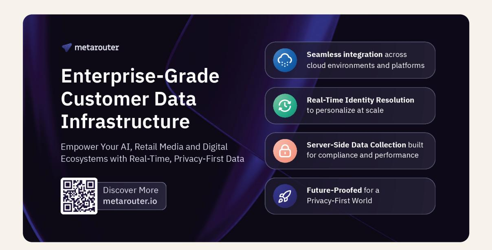

# A Time of Marketing Reinvention: From Ideation, Through Workflow, To Customer Engagement

*Interview with Raviteja Dodda CEO, MoEngage*

Welcome back, Ravi. We are excited to have you back again for #MartechDay 2025. For those who aren't already familiar with you, can you give us the elevator pitch for MoEngage?

I'm the co-founder and CEO of MoEngage. I've been running this company for close to 11 years since founding.

We are a customer engagement platform primarily focused on consumer/ B2C businesses. We help consumer brands and the marketing and product teams within those organizations and empower them to build strong customer relationships at scale.

If you look at many of our customers, there's a large Fortune 500 and global brands across various verticals like retail, financial services, and others who have large customer bases. We help them enable hyper-personalization and engagement at scale.

For years, martech has been categorized broadly into systems of record and systems of engagement. CDPs on one side, customer engagement platforms on the other. Is that framing still relevant, or is there a different way of looking at it?

I wouldn't necessarily agree with that definition because if you look at many of the popular modern customer engagement platforms, including MoEngage, they have a system of record or an embedded CDP capability within their platform. The data might be there, in the CEP, or it has access to the data in the warehouse.

We have also seen, especially in the last two years, how warehouses can be CDPs. And, of course, you still have standalone CDPs. What is the system of record can be kind of confusing today, right?

Some now emphasize that you should not have multiple copies of data. That's something a lot of CDP vendors evangelize. But when it comes to real-time engagement in customer micro-moments, the CEP platforms need to have access to data in real time, which basically means that we should maintain copies of some data to optimize those engagements.

So I think the system of record is going to be in multiple places. The warehouse is an important part of it. But systems of engagement like MoEngage will have a good amount of record keeping in them as well.

Do you think cloud data warehouses, lakehouses, lakes, have become a universal data layer for many of your customers? And has that changed their martech stack? Has it changed things for marketers?

I think the whole data view is more data lakes. There's obviously a lot of architectural improvements that are happening in the lakehouse with the Iceberg sort of formats and interoperability that's happening across the data layer, not just structured warehouses.

Adoption of cloud data warehouses and data lakes are growing significantly. We are seeing that across our customer base, as more companies use these warehouses to activate data through platforms like MoEngage.

One thing that we observed is that many of these data warehouse deployments still primarily hold a lot of profiling data, like demographics and transactions. But they often don't hold the behavioral data that your customers are exhibiting on your websites and mobile apps, such as people searching for certain products, viewing certain products, and sort

of those interactions. But the behavioral data still probably has only a small percentage of our customers actually ingesting it in the warehouse.

The second thing is that data views are becoming important for brands to consider as an alternative to a standalone CDP. Brands are looking at whether they should have a standalone CDP or invest into a warehouse as a CDP, which can execute use cases beyond marketing.

But there are also concerns, by the way. If you look at a marketing application getting access to the database, they will need to query the data there. And when data is queried, it also has a cost. It's not free when you're creating or querying data on the warehouse because that's how they're priced. The more data you query, the more you pay to the data warehouse vendor.

So there are a lot of challenges with regards to predictability of cost when you're using a data warehouse for activation in a zero-copy fashion. And so we are seeing that data teams are not sure about giving access to marketers to query at any point of time. Where does that cost get attributed to? Because the cost today often goes to data and engineering teams, whereas this is being used by marketing teams, which is a different spend.

So these are things that people don't like about that model. Product marketing can talk about all the good things. But there are some things that aren't so good when you actually see it deployed in a given enterprise.

Zero-copy doesn't mean zero-cost. So as we've got growing data infrastructure that marketing is able to tap into, how much wrangling is required to really use this more diverse span of data in marketing programs and campaigns? Do you need a lot of ETL processes? Or is AI starting to help marketers with data prep, data quality?

I think on this question, there's a lot that's changing quickly, every week, every day.

The ETL part of data has definitely evolved quite a bit, especially in the last year. Marketing cloud platforms investing into reverse ETL and more integrations, as well as pure-play ETL and reverse ETL platforms that are enabling greater scalability.

I'm sure with AI and MCP and all the interfaces that are coming up, it's going to be easier for applications to get access to more data and context. I think that's something we're going to see changing, probably in the next six months, where interoperability of data and context is going to be more seamless.

The next part I would say though, as we have been investing in building multiple AI agents and assistants at MoEngage, is that AI is only as good as it can understand the data. Today, you have all your attributes and events, any sort of data about your customers. The problem is that a lot of this data does not have proper metadata. And that becomes a challenge.

For example, we launched a segment assistant product. And for it to really work and create segments, it needs to understand the underlying data for you to then be able to say, give me the segment of customers who have affinity towards a certain category of products. To create that segment for you, it needs to know the metadata or context about the data in your platform or warehouse.

That's the reason I think you probably need a separate AI agent to enrich the data about your data. That's the solution that we have come to.

#### What about unstructured data? Is that becoming a bigger part of the equation for marketers now that AI might be able to help them leverage it?

This is where I feel the biggest unlock is going to be, unstructured data. There's a lot of unstructured data that is present in marketing. It could be your images. It could be your email templates.

We believe that it's easier with AI to understand, say, a given image. What is the incentive being offered through this image? What sort of products are being included in an image? We are able to automatically label and add context to many of these campaigns and interactions that are being served to customers, thereby being able to better understand what customers would be interested in, their preferences, their interests, the sort of content they might engage with more.

So I think there's going to be a significant unlock here with greater data enrichment. Because if you take a lot of recordings of customer behavior,

you just give it to AI, and it can automatically understand what the customer is trying to do without having to manually instrument all that data. A lot of unique use cases are going to be served with unstructured data.

#### What have been the constraints of building, maintaining, and evaluating customer journeys, and what is the effect of AI on this?

This is definitely an interesting question. All the platforms are talking about creating AI journeys with prompts. Everyone has this nice thing, just give a prompt and then it creates a journey. But I feel the problem is people don't know what they don't know.

What we feel is one of the biggest constraints is the inspiration of use cases. So today, if marketers know that they want to execute a given use case or a given opportunity, the AI that can make it easy to create a journey is going to help. But it's important for brands and marketing teams to know what are the different use cases that they should consider implementing. That's where AI should be leveraged more, to help brainstorm relevant use cases for a given brand and recommend use cases they could consider implementing.

The other thing with customer journeys is that one of the aspects of the future is going to be customers' own agents or third-party agents as actors within those customer journeys. So it's not just about platforms offering more intelligent decisioning and optimization, but also that platforms need to be more open and interoperable to enable third-party agents.

#### Are you seeing any changes in tactics or the efficacy of different channels, marketing channels as a result of AI, directly, indirectly?

I believe that return on marketing spend, which includes both programs and people, can be significantly increased. Not just incrementally, but a step change increase over the next few years by leveraging all these AI capabilities that are emerging now.

In terms of channels, I think inbound channels like app content and web content are becoming a center of focus for customers and brands again. Because you already have the customer's full attention when they're on your mobile app or on your website, showing relevant content to them,

which could be a product, a proposition, an offer, or even just the next best experience. And with AI your content production is far easier now. So you're able to do a lot more experimentation.

I expect more utilization of paid channels. There's a lot more first-party data for paid channels now, which makes them more intelligent. And there's a lot of AI optimization on creatives. So that's going to drive more utilization of paid channels.

We're also seeing significant growth in messaging channels like WhatsApp and RCS, which is supported on Android today and is going to be supported on iOS.

Would you say there's been, perhaps as a function of all this data and tech, maybe too much emphasis on quantifiably trying to predict customers versus truly understanding them? As marketers, how do we bring richer customer insights into marketing, creative, and strategy with all these new tools?

Giving a bunch of customer interactions with a brand to an LLM, they actually can generate a good summary and provide insights about customers. For example, for Domino's, just looking at all a customer's viewed menu items, the LLM is able to understand whether this customer is a vegetarian or a non-vegetarian.

AI can help marketers better understand their customers and their preferences, which can inspire more innovative strategy and ideation on marketing teams. With scalable understanding of each individual customer, a richer understanding, there's opportunity to optimize the right incentives or offers that can be provided to them.

We have a hypothesis that most of the calories in marketing have historically gone to production and analysis, a lot of which had to be done manually, more than strategy and creative. If AI is able to take on more of that work, how do you think the profession of marketing will evolve?

I expect marketing teams to focus more on strategy and broader CX strategy, identifying more opportunities to engage with customers,

including understanding better the voice of the customer and more rapid iteration of customer journeys. I believe more effort and bandwidth will go towards that.

I also believe that the workflow of campaigns will change. Today a lot of workflow in terms of the planning and the strategy happens outside the platforms that they execute on. Marketers come to platforms to execute, not to ideate and brainstorm and plan.

I believe that as platforms become more intelligent, you will develop more campaign ideas within them. Today, I use Gemini and other stand-alone AI products to do a lot of ideation. Soon, the platforms where the marketing campaigns actually happen will enable that sort of ideation.

So where they're ideating, they're identifying how many customers would be engaged with a given campaign, understanding budgets and all of that. It's then easy to assign execution to agents, which will do much of the work in terms of creating the campaign or journey, creating assets or creatives. The whole workflow will be reinvented.

Content production and creative production is still a challenge at this point of time. But even in just the past few weeks I've seen improvements in AI with regards to image generation, creative generation. It will be solved a lot more in the coming months.

And AI-driven decisioning and experimentation is going to be embedded across all aspects of this, which will enable marketers to do a lot more creative and focus more on the strategy.

We'll wrap up with a fun lightning round. You know, the general rules of the game, either one word or a short sentence or two answer. Let's start with what's your favorite go-to AI buzzword?

It's currently MCP.

Your favorite AI assistant, ChatGPT, Claude, Gemini, something else?

Gemini Live. It's pretty interesting. You can use Gemini Live to brainstorm, ideate, and it can even speak in so many languages. Even my five-year-old

son is able to chat with it.

#### AI agents autonomously sending, replying to emails. Are you a fan, a stan, or not a fan?

I am a fan, considering the number of emails that you can expect in my inbox, which are unread for a CEO. So I'm definitely a fan.

#### Do you think AI will cause more tech stacks to grow or shrink?

It's not going to be a short answer, but I'll try. Short term, they expect to grow. Obviously, there is going to be a proliferation of more AI point solutions for different specific use cases. Medium to long term, I expect strong potential for consolidation because it's not about building a product. The distribution is always a challenge and companies will start hitting the ceiling once they come to a decent amount of scale. And I think consolidation is going to happen.

But regardless of the number of tools, I think the nature of the stack is going to change. That's my belief.

#### What's the most surprising use of AI in marketing you've seen recently?

One I saw recently. We have seen deep fakes raise ethical concerns, but there are a few marketers who are experimenting with AI-generated avatars that can deliver personalized video messages dynamically, speaking in a specific language that each individual customer understands. That's something that we have seen with a fashion brand in Asia.

#### In one word, how would you describe the future of AI in marketing?

Ubiquitous. It's going to be everywhere. From ideation to planning to marketing budget optimization to measurement and then continuous feedback loops, it's going to be everywhere.

I believe we are getting to that holy grail of an intelligent platform that's fully context aware, leveraging the comprehensive customer data that it has access to and the channel insights across all inbound, outbound, paid channels, and so on, and deploys highly context-aware, intelligent

experiences across the customer journey, which enables brands to be taking a customer backward approach to acquisition, retention, and even reactivation.

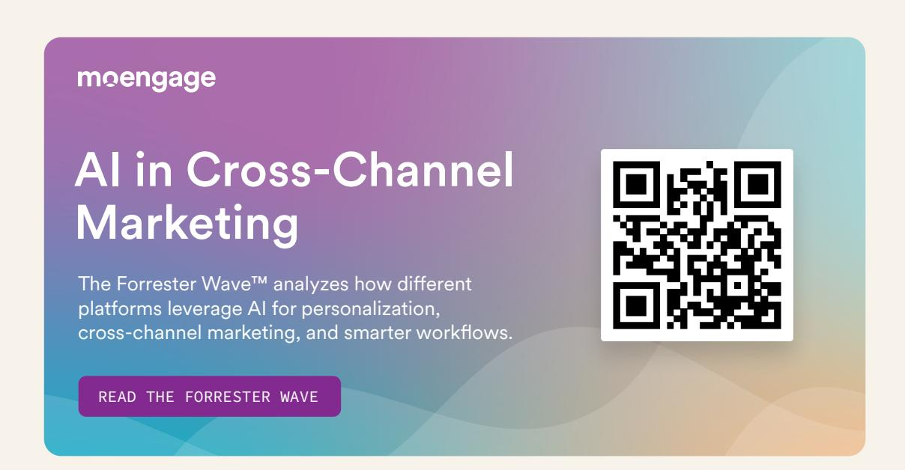

# Why AI Is Still About Humans Building for Humans

*Interview with Sara Faatz Director of Technology Community Relations, Progress*

Welcome, Sara. It's so great to have you back here for #MartechDay 2025. For those who aren't already familiar with you, can you give us a short elevator pitch on Progress and your role there?

Thank you. I'm really excited to be here with you. For those who don't know us, Progress is a software company that's been around for a little more than forty years. Our software enables our customers to develop, deploy and manage responsible AI-powered applications and experiences.

I sit in our Digital Experience business unit, where we have a number of products that enable you to build modern digital experiences, including Sitefinity, which is our advanced CMS and digital experience platform; Sitefinity Insight, our CDP; and then we have a host of developer tools, document collaboration, and file transfer solutions as well.

Since Progress offers products that let people build software and websites, let's start by asking: is AI changing the build vs. buy equation in martech or for company technology and operations more broadly?

Buy vs. build has always been good fodder for martech folks. But I think the proliferation and democratization of AI brings that conversation to the forefront in a very meaningful way.

AI in many cases makes building easier, and we're seeing people start to take advantage of that. At the most basic level, they're using AI as a pair coding partner, helping to write foundational code and automate processes. And on the other end of the spectrum, they're starting to deploy agents for far more complex development tasks.

Does that mean the need to buy solutions goes away? Absolutely not. There's still going to be benefits to buying, particularly when it comes to complex integrations, privacy issues, maintenance of the software, versioning, compatibility. There's an opportunity cost to all of that.

But what it does mean is that what people buy and what they might build might change as well. So for vendors like us who are selling solutions, it becomes that much more important for us to take advantage of AI as well and to adapt to the changing needs of our customers, to evolve our software, to provide solutions that fill the gaps that are still going to exist.

It's an exciting time, especially if you thrive in an environment of experimentation and innovation. But I think buy vs. build is still going to be a debate that we will always have.

#### For the things that people are building, websites, web apps, etc., do you see any behavioral shifts happening as a function of AI? Changes in how we build?

Absolutely. Humans are curious by nature, and developers who are building those experiences are no different. They've been experimenting and exploring with AI to help them do their jobs just like everybody else has. In a lot of cases, they've been the early adopters.

At the end of the day, they still want to create and they still want to build. They use AI to help write code, to debug their code, to comment their code, and even have AI agents build the foundation of the app or the website. And this ultimately gives them more time to build and create, to push the boundaries of technology.

It's an exciting time to be a developer because there are a lot of new innovations that are going to come from the evolution of their craft.

If we switch to the consumers of the websites and these web apps, across your customers, are you seeing any changes in the design or implementation of their customer journeys as a result of AI?

Oh, 100%. I mean, there was a time when marketers thought we had some semblance of control over the customer journey. We would optimize the journey based on driving people to our sites. And then we had all sorts of paths and places we could direct them to from there, helping them find their way to the action we wanted them to take. Download a trial, request a demo, buy now.

But now, in some cases, the journey ends before it begins. What do I mean by that? With AI, people may never actually make it to your site because they're able to get the information they need or want from an agent or an LLM output. Zero-click search is probably one of the biggest catalysts of change we've seen in a very long time, particularly from a journey perspective.

So we need to be rethinking how to build customer journeys and build them as unique as the people who take them, right? Maybe this means hyper-personalization is going to have its time in the sun. Regardless, it is becoming imperative to build human-centric individualized journeys. And that's something that's happening right now.

For those who do reach the website, they more and more see chatbots there. But the experience hasn't always been that great. Are they getting better with Gen AI? What makes a good chatbot versus a bad one?

Are they getting better? I think for sure. But what makes a good one versus a bad one is the data. We'd be remiss if we didn't say data makes a good one or a bad one. But also how do you build the bot? How is it structured?

From a data perspective, even before the democratization of AI, garbage in, garbage out was the mantra that we all understood. If your data is not in great shape, if it's not stored properly, if you don't know what you have, your agent's not going to perform. Similarly, if you haven't built an agent or a bot in a way that pulls that data in the right way, if your bot isn't built with responsible, transparent AI in mind, the result is going to be a dud bot.

We still have work to do, but they are definitely getting better. And I think with agentic AI, we will improve quality. I think we're starting to see that already.

For two decades, marketers have been creating websites for two audiences: human visitors and the Googlebot for SEO. It was just one bot, but it was an important one. Are we now on the cusp of a bot visitor explosion? Not just new AI search tools like Perplexity and ChatGPT Search, but also web browser agents such as OpenAI's Operator working on behalf of individual customers when they come to our websites. Is this a thing and how should websites adapt to it?

Without question, this is a thing. The interesting thing to me is that quality content and unique thought, which were key components of any good SEO strategy to begin with, become that much more important in this new world. You still need to create content on your websites that is designed for people.

Now it's just that much more critical to understand your ICP and probably at a deeper level than the standard personas most marketing teams build. You need to understand them in a way that predicts questions that they're going to ask and create websites that make those answers discoverable by AI agents and search solutions — but also make it interesting and relevant to humans when they are ultimately served this content via any channel.

So how do you create that content that the AI solution is going to pull, but somebody would still want to read? You have to recognize that the customer journey is not linear. Your customer or prospect is in the driver's seat. We need to accept that, and we need to build experiences that resemble the choose-your-own-adventure game with content that puts people on a path.

We have to rethink content strategies across the board. Rethink from the beginning and create content that AI agents and search tools are attracted to, but that people also want to read and consume and get them to move on from wherever they are in that one answer question.

Let's shift gears and talk a bit about martech behind the scenes. We talked about the importance of composability in our interview last year. How does this intersect with AI agent mania?

Most high performance stacks are composable. They're comprised of the elements that you need and want for your organization. They have a combination of buy and build.

But as you mentioned in an article you published earlier this spring, AI agents can create software experiences on-the-fly. They can create hyperpersonalized, hyper-contextualized experiences in real time. So if you have AI agents crawling around your composable stack, that allows your stack to morph and fit the needs of each individual user.

AI agents have an ability to make your composable stack that much more dynamic. So I think it's playing a huge role and I'm really excited. We're just on the cusp right now of what that's going to look like. I think if we have this conversation a year from now, we'll be looking back and saying, we had no idea this is where we were going to be.

The engines of AI are arguably commodities. So for companies to differentiate, it's the data and their processes wrapped around it. But data quality has long been a challenge for marketing teams. How are we doing and what approaches have been proven successful?

I'm a little paranoid because this part is always going to make me nervous. Humans are messy, chaotic beings, even the most buttoned-up, right-there, and put-together ones. That's just human nature. So we need to be vigilant about data quality, and knowing that is half the battle.

The biggest issue is really just the sheer amount of data that marketers are able to accumulate. There are some smart uses of AI that ensure data quality, but that still requires human oversight. So I'm a little concerned that as quickly as AI is moving, people are going to lean in and trust it implicitly before it's in a state where it should be.

And I would argue that it may never fully be in that state. I think that we'll always need to have human oversight and a human-in-the-loop in some capacity.

Speaking of data, what about unstructured data? Are you seeing companies starting to leverage it more? Does that maybe offer a different solution to the data quality challenge? Or is it just a different kind of data quality challenge?

I think it's a different challenge. Inherently unstructured data can provide more novel insights. It lends itself well to hyper-personalization strategies, which is great.

That said, unstructured data can also be harder to integrate because it comes in so many different formats from so many different sources. In order to ensure quality, you have to employ things like natural language processing and maybe sentiment analysis.

But at the end of the day, even unstructured data still needs human intervention at some point.

#### We want to get to this fun new section we're doing this year of a lightning round. Are you up for that?

I am ready. Let's do it.

#### What's your go-to AI buzzword?

I think shadow AI is my favorite go-to buzzword right now. I think it's a very, very real thing. And if organizations don't think it's happening, they are fooling themselves. Everybody is AI-ing right now.

For years, we heard Shadow IT like every other week. We haven't heard the phrase Shadow AI as much. But you're absolutely right.

The funny part about it is that not everybody wants to admit when they're using AI, right? Because it makes things easier in a lot of cases. People are like, 'do I say I was using it for that?' So I think Shadow AI is happening. It's happening everywhere.

Like those Apple commercials, the slacker using AI to look brilliant. That's probably not a good image. We're getting us off track. Next lightning round question. What's your favorite AI assistant? Your favorite shadow AI assistant? ChatGPT, Claude, Gemini, something else?

We use Microsoft 365 here, so I use Copilot quite a bit. I know it's not super sexy, but it has saved me so much time. I've been with Progress for close to ten years. As you might imagine, I have tons of information in the forms of Word, Excel, PowerPoint, email, Teams chats. So with just a few prompts, I can find pretty much anything.

And it's incredible. I mean, I was looking for an abstract that I wrote eighteen months ago. And with a few little prompts and a few seconds, it was right there. Probably saved me a good 20 minutes and a bunch of rabbit holes I was going to go down searching for it.

#### AI agents, autonomously sending and replying to emails, are you a fan, a stan, or not a fan?

Autonomously sending, not a fan. I still believe, if you didn't already pick this up from our conversation today, you need a human in the loop. That said, suggesting a reply, I could totally get on board with.

#### Do you think AI will cause martech stacks to grow or shrink?

I think in the beginning, like right now, they'll likely grow a little, particularly as you have stand-alone tools and agents to implement. But I think over time, there's going to be an opportunity to optimize the stack, leveraging AI, of course, and build truly customized composable stacks that are hyperpersonalized to your organization using best-of-need instead of best-ofbreed. But then having that, it will start to shrink the stack a little bit.

#### What is the most surprising use of AI in marketing you've seen recently?

So it's not surprising, or maybe it is surprising but it's more disappointing. I think people are still using it for content creation without human intervention and the quality is horrible. You might save time, but all it's doing is driving a massive amount of digital waste.

We know that from an SEO perspective and even from an AI search and agent perspective that unique creative, individualized content is what's going to win. So focus on that. Leverage AI to help you, but don't let it create it and then walk away.

#### In one word, how would you describe the future of AI and marketing?

It's a hyphenated word, but I would say human-centric. I say human-centric because you have to have the human in the loop, even as AI becomes exponentially more powerful.

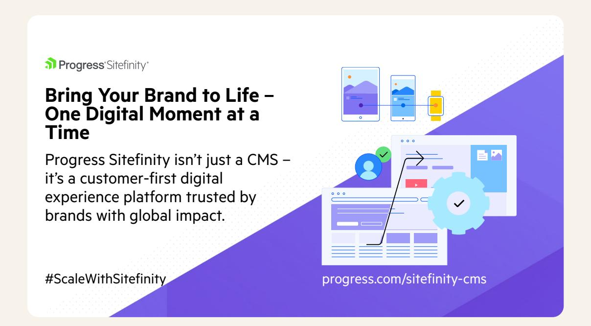

# The Critical Middle: Bridging the Gap between the Data and the Channel

*Interview with Jonathan Moran Head of Martech Solutions Marketing, SAS*

Welcome, Jonathan. We're excited to have you back for #MartechDay 2025. Before we dive in, could you tell those who are not already familiar with you about SAS and your work there?

It's great to be back guys. SAS is primarily known for data management analytics as well as AI. But some readers might not know that we also offer martech and adtech solutions.

We develop and sell a full-blown customer engagement platform, which includes audience creation, journey management, decisioning and channel activation, the whole bit. SAS has been in the martech space for over 20 years and I've been with the company about half of that time. I work in marketing and do all of the marketing things you might imagine: messaging, presenting, writing, you name it.

I am really excited for this conversation because, like you guys, I am very passionate about martech and martech stack compositions. I'm sure you know by now that working on the Stackies every year is absolutely one of my favorite projects. So let's talk all things stacks.

Martech stack nerds of the world unite! Let's start with the topic of the day, of the year, of the decade, AI. What is your conceptual model of the idealized martech stack in an AI world?

Right into the deep end, I love it. So I've got a visual here that I'd like to show, and we will walk through this from bottom to top. This is my ideal martech stack. Is it perfect? No, none of these visuals are ever perfect. So really, this is a starting point to use and refer to as we converse.

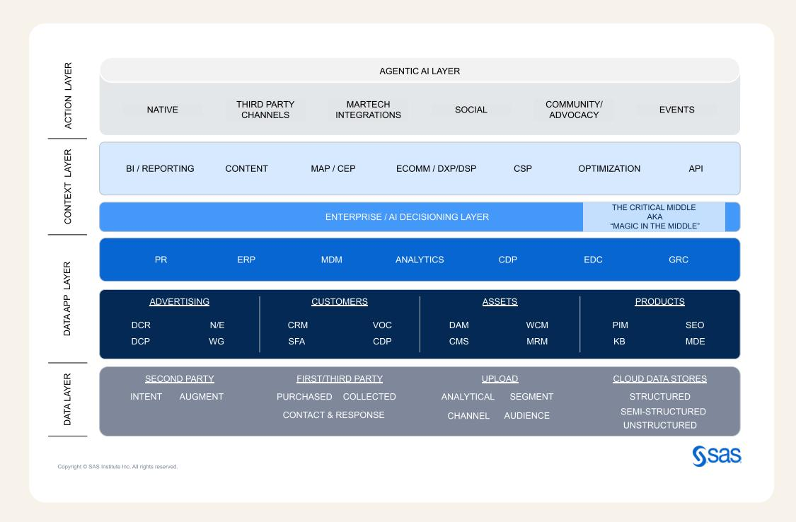

So starting at the bottom, I think that all good MarTech stack diagrams, marketecture diagrams start with data, right? I'm trying to hit the different types and sources of data. We know that well-structured and governed data is the key to all AI success.

Right above that data layer is what I call the data app layer. These are the apps that rely on that data layer to operate. Some are channel and function specific, such as advertising, customers, assets, products, etc., and some that should be more enterprise-wide, such as MDM, analytics, enterprise data catalogs, governance, risk, and compliance. Those are represented in that royal blue layer.

Some technologies, depending on the organization, are going to fall into both the channel function bucket and the enterprise bucket. And I think

this is where AI starts to be introduced, largely as embedded capabilities within individual solutions today. So you know Gen AI, light AI, ML, RAG capabilities, those are in those solutions today.

Above this layer, the aqua blue layer of my visual, should be an enterprisewide decisioning layer. Historically, this has been rooted in business rules and trigger-based analytics, and it's only served certain departments like marketing, risk, service, but not the entire enterprise.

My ideal stack has this decisioning layer integrated with every function capability across the enterprise for that kind of centralized operational decision making. And I think that we're seeing that this layer is moving from being rules and trigger based to more heavily based on AI, leveraging AI to make more automated business decisions just without as many guardrails. We'll talk a little bit more about that as we go on.

AI decisioning is certainly the hot topic. We saw an acquisition in our space not too long ago that looks at how AI decisioning is of importance to both vendors and consumers of the technology. And it's interesting because AI decisioning takes the path of using analytics down to AI, down to machine learning, down to reinforcement learning to make decisions based on large data sets. And so the idea with AI decisioning is that these systems can make these adaptive decisions and offer actions and outcomes that improve over time, all without human intervention.

Are we there yet? I don't think so. But will we be there very shortly based on what's happening in the market? For certain.

Next in my stack visual, we move to this sky blue layer, which represents all of the downstream applications that rely on everything previously mentioned to do their best work. You know, some tools like BI and reporting tools need the data more than anything else, while others like, you know, marketing automation, customer engagement, customer service platforms rely on both the data and the decisions.

And then finally, the top layer of my stack, the light gray layer, which I call the action or activation layer. I have broken it into two sections, which we call the now and the near-to-now layers. The now layer is where we see the native channels that a brand or an organization might have: web, mobile,

email, third-party channels and integration, social channels, community, etc. Coined "now" because most organizations are using the majority of these channels today.

The near-to-now is this emerging agentic AI layer that includes all of the AI agents brands can employ now or in the near future. These can include, but are not limited to, chatbots, virtual assistants, recommendation systems, sentiment analysis, predictive analytics, personalized content generation, voice and visual recognition, RPA agents, and other agentic insight based capabilities. Tons of stuff that can be put into this activation layer with agentic AI.

Now, if we want to bring this to life by applying a vendor-specific lens to this martech stack, it may look something like this next visual. This represents well-known vendors in each of the layers that we account for at SAS in our ideal stack. I realize that some folks might put different vendors in different buckets. And that's fine. Again, this is all just a representation of what an ideal stack might look like.

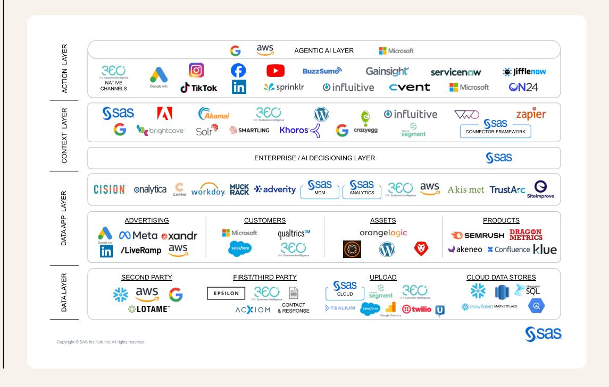

Thank you for walking us through those layers. Let's talk about the data layer. Have cloud data warehouses/lakehouses established themselves as a universal data layer at this point?

I came out of the enterprise data warehouse world in a previous life, and so I prefer the term data warehouse. I get the concept and terminology associated with lakes, but I've never really been a huge fan of the lake term when applied to data, although maybe it's a good term, right? Because we know that lakes can be shallow, dirty, and stagnant, just like a lot of enterprise data.

#### Touché.

A lot of the organizations we are talking to have started or are in the process of performing data transformation projects, right? Moving various data sources into that big cloud data warehouse, whether it's a Snowflake or a GBQ, what have you.

To answer your question, I think that cloud data warehouses are slowly replacing enterprise data warehouses and other kinds of data stores as the universal data layer at this point.

It used to be a big challenge for marketing teams to get the data out of the different silos. The data warehouse — we'll use your preferred term — now has much of that data. What are the new challenges that this presents to marketers to effectively use it?

Data challenges and using data for activation — we could write multiple books on the topic. But I'll share the big three.

First is quality, far and away. Just because the data is available doesn't mean it's clean or reliable. Data can be incomplete, inaccurate, and just plain wrong. And I would also put data conversion into this data quality bucket. Often data quality is lost in translation.

Think about how much unstructured data we know it's coming into an organization that rarely gets converted to valuable business information or used for insight. The percentage is very high. So that's my first one, data quality.

Second big bucket: data integration. We know that if you're consolidating data into a single source, such as a cloud data warehouse, you must account for how the data is being integrated from CRM, social media,

website, email, and so forth, as well as offline and legacy sources. Oftentimes this data can be in an incompatible format.

So the ingestion, normalization, and appending or joining techniques must be perfect in order for that compatibility to line up just right. One slight slip-up in an ETL job could lead to bad or incorrect results downstream. I've seen that happen before. I'm sure others have as well.

And then my third biggest challenge, I've saved for last, is data knowledge and literacy. As data grows in complexity, interpreting it and making sense of it can be an added challenge that many organizations don't account for enough. I've seen organizations that have a lot of data, but they don't have a subject matter expert, a single person or team of people who actually understand the data. And that's a crucial skill and resource to have. If someone has a current and up-to-date working view of all enterprise data, that person is extremely valuable to an organization.

So summing up, data quality, data integration, and data knowledge and literacy are the three biggest challenges, in my opinion, that marketers face today.

#### That segues into the next question. Are there new kinds of structured or unstructured data that marketers are able to leverage with AI in this environment?

I'll name five types of structured and five types of unstructured data.

First is web and app activity data. Applying machine learning models to this type of data helps marketers personalize and optimize the journeys they're creating.

Customer lifetime value data. This can be hard to calculate, but having customer lifetime value scores helps with retention, cross-sell, and up-sell if you really know those scores and how to interact based on them.

Usage data. If you're selling a product or service, can you collect usage data of that product or service. If you can apply AI to that data, you can segment customers looking at their usage, looking at how they transact or interact with your products and services, and then market to them more

appropriately. With our products, software as a service platform, we do look at usage and consumption data that helps us understand how to interact.

Appended data from CRM systems, intent providers, and advertising repositories can be used to create micro-segments. Coming out of, walled gardens, networks, exchanges, those sorts of things.

And then geolocation data. This was a hot topic five to eight years ago, and I feel like it's really coming back around. Using geofencing or beaconing data to understand customer movement and push offers and messages in the moment. Working with airlines, cruises, casinos, sporting venues to really understand how consumers move and how to interact with them.

So that's the structured data bit.

For unstructured data, there's a ton out there marketers can leverage. Top of my list here is user generated content. Instagram stories, YouTube videos, Reddit discussions. Marketers can apply sentiment analysis and natural language processing to understand exactly what their consumers are saying and who their influencers are and detect emerging trends.

Voice and audio data, that's my second unstructured type. If you can convert voice and audio data into insight, such as from support or service channels, that's very very valuable.

Videos and images. We know that video content, livestreams, broadcasts are growing rapidly in popularity. For the advanced marketers out there, what if you had a computer vision technology to analyze and recognize visual content and decipher transcript information in order to elevate customer engagement? You know that's possible today, so it's something to be thinking about.

IoT data coming off of devices. Smart appliances, wearables, home automation systems. That pattern data, movement data, health and maintenance data, can be very valuable for personalization.

And then finally, augmented reality, virtual reality data. Any type of interaction with those platforms, pulling the data from product simulations, virtual try-ons, immersive brand experiences, the metaverse. I had to

bring that term into our conversation. AI can analyze how users interact with virtual environments, which helps marketers design those better experiences.

#### That's a veritable cornucopia of data types. Related to this, the CDP space, customer data platforms, has been going through a lot of changes over this past year. What's your view on the future of CDPs?

It's no secret that a lot of the stand-alone CDP vendors have been scooped up, right? Action IQ and mParticle, Lytics, so forth. As a result of this, we've seen the CDP narrative change a bit from the four core capabilities of ingestion, resolution, profile creation, and activation to doing all of that plus incorporating zero-copy data, AI decisioning, composability, and so on.

A lot of the standalone CDP vendors are looking for unique ways to differentiate as they see cloud data warehouses coming up at them from the bottom of the stack and they see solutions with a lot of CDP capabilities at that activation layer coming at them from the top of the stack. So it's like a squeeze.

So now we're seeing the messaging angle shift toward the concept of embedded CDPs. The thinking is that standalone CDP vendors can now embed their CDP capabilities into whatever solution you may already have. Because after all, they're composable, right? The interesting part for SAS, and I think certain other vendors in the space, is that we've been using the term embedded for a while, as our CDP capabilities are embedded within our customer engagement platform. And I think the market is finally meeting us there.

#### What are the advantages of that approach? And how does it fit in with the ideal stack model that you shared with us earlier?

In my personal opinion, I think the embedded approach makes sense. A lot of the capabilities of stand-alone CDPs can and should be part of larger kinds of martech platforms. Identity resolution, virtual profiles and audience creation, activation.

The CDW continues to gain ground from the bottom and activation solutions become more and more adept at the top.

Let's talk about customer journey mapping. It's been a key concept in marketing and martech, but it was mostly deterministic. Is AI changing journey mapping and how it works?

Customer journey mapping was absolutely deterministic. With those predefined paths that brands designed and then pushed customers or prospects to take. But AI is changing the game here, and it's allowed probabilistic journey mapping to occur with high levels of confidence and correctness.

Using reinforcement learning, Q learning, brands can collect and contextualize relevant data. And then what they do is they take that data and they show it to an algorithm and the algorithm learns, and then recommends, journey paths for individual consumers or audiences to take.

Reinforcement learning is different from standard supervised learning or propensity-based predictive targeting by not relying on historical data from model training. Instead, it learns from experience, through trial-and-error. This means that marketers today can run A/B or multi-armed bandit tests to optimize performance across a journey of interactions, as opposed to just a single interaction.

The benefits of journey-based attribution measurement and predictive targeting don't go away. As a matter of fact, applying reinforcement learning allows marketers to leverage the entire body of the customer journey and the analytical methods that are infused in that customer journey in a much more systematic and efficient manner.

I think this is really the future of customer journeys and customer engagement. Guiding customers to an end conversion event or pulling them towards that conversion event versus forcing them down a predefined, brand-created path.

So AI decisioning is an emerging topic in martech. But enterprise decisioning has been a part of the enterprise tech stack for a while, right? What do you see as the difference?

As I mentioned, we've seen acquisitions of vendors lately in martech that are using the term AI decisioning. It's certainly hot. Scott's diagram that he

put out on systems of context and systems of truth earlier this year really kind of spurred my thinking on this.

We talk about enterprise decisioning at SAS as combining rules-based decisioning with advanced analytics and workflow automation. Some would say that the term we use, real-time interaction management, or RTIM, is an integral part of enterprise decisioning, while others would claim that enterprise decisioning is the evolution of real-time interaction management.

To some degree, both are correct. But it's safe to say that RTIM applies some sales, marketing, and service spice to enterprise decisioning technology.

AI decisioning in my mind is a sibling to such enterprise decisioning. Perhaps even a fraternal twin. It leverages artificial intelligence to make automated business decisions that improve over time without human intervention. AI decisioning and enterprise decisioning will eventually merge.

We have been looking forward to doing a new lightning round with. We've got a handful of questions we want to ask. The only constraint is you've got to keep it to a one word or one sentence answer. Are you ready?

I'm ready. I'm ready.

What's your favorite go-to AI buzzword?

RAG. Retrieval Augmented Generation.

Your favorite AI assistant? ChatGPT, Claude, Gemini, something else?

I got to go ChatGPT. I think they all have their faults. After all, we've seen that certain college professors have gotten ChatGPT to admit to lying to them. But I do like ChatGPT primarily because of Chuck GPT, which if you haven't seen the progressive insurance commercial, check it out. I think it's very funny.

AI agents autonomously sending and replying to emails. Are you a fan, a stan, or not a fan?

I'm a fan, but only for certain very low-level use cases, such as when my order will arrive. If it's something like a ticket change for an airline, not a fan.

Do you think AI will cause martech stacks to grow or shrink?

Shrink, I think. What do you think?

Probably depends on what we define as the stack. Maybe shrink certain different kinds of products, maybe multiply the number of use cases. We'll have to see.

What's the most surprising use of AI in marketing that you've recently seen?

I like the advancements we're seeing in visual search. Allowing customers to search for products using images rather than text. AI systems can analyze these images, recognize products, display similar items for purchase.

I've been doing some fashion and furniture updates around the home and using visual searches is very cool cause I can find something that I like or would like to see in the home and I can go out and use visual search to find something similar or the exact product itself, which is awesome.

In one word, how would you describe the future of AI and marketing?

Promising.

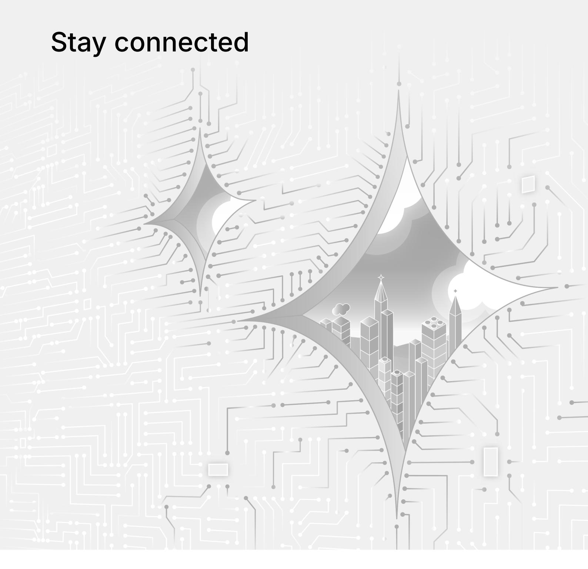

