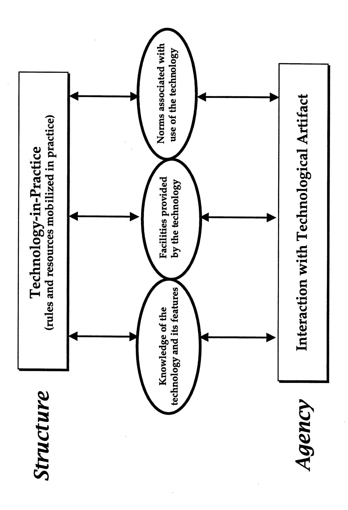
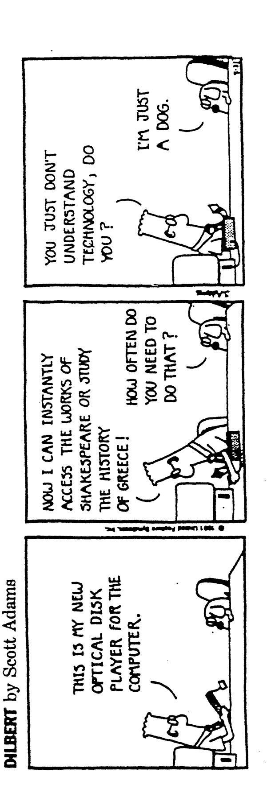

## Technologies-in-Practice: An Enacted Lens for Studying Technology in Organizations

by Wanda J. Orlikowski

WP #4056 February 1999

# Technologies-in-Practice: An Enacted Lens for Studying Technology in Organizations

Wanda J. Orlikowski
Sloan School of Management
Massachusetts Institute of Technology
50 Memorial Drive
Cambridge, MA 02139
(617) 253-0443
wanda@mit.edu

#### **ACKNOWLEDGMENTS**

The author gratefully acknowledges the support of the Centers for Coordination Science and Information Systems Research at the Massachusetts Institute of Technology. Helpful comments on earlier versions of this manuscript were provided by Steve Barley, Suzi Iacono, and JoAnne Yates.

# **Technologies-in-Practice: An Enacted Lens for Studying Technology in Organizations**

#### ABSTRACT

As both technologies and organizations undergo dramatic changes in form and function, organizational researchers are increasingly turning to concepts of innovation, emergence, and improvisation to help explain the new ways of organizing and new patterns of technology use evident in practice. Similarly, I want to offer an extension to the structurational perspective on technology which will facilitate understanding people's use of the new and reconfigurable technologies becoming increasingly prevalent in organizations. I propose viewing the use of technology as a process of enactment through which users are seen to constitute the technology structures which shape their interaction with the technology at hand. Such an enacted lens enables a deeper understanding of the emergent, unprecedented, and innovative ways in which people engage with new technology in organizations and over time. After developing this lens, I offer an example of its use in practice, and then suggest some implications for the study of technology in organizations.

Technology -- and its role in organizational structures, processes, and outcomes -- has long been of interest to organizational researchers. Over the years, as technology changed along with our understanding of it and its effects, different research perspectives on technology were developed which paralleled the development of research perspectives on organizations -- for example, contingency approaches (Woodward, 1965; Galbraith, 1977; Carter, 1984; Daft and Lengel, 1986), strategic choice models (Child, 1972; Buchanan and Boddy, 1983; Davis and Taylor 1986; Zuboff, 1988), Marxist theories (Braverman, 1974; Edwards, 1979; Shaiken, 1985; Perrolle, 1986) symbolic interactionism (Kling 1991; Prasad, 1993), transaction-cost economics (Malone et al. 1987; Ciborra, 1993); network models (Barley, 1990; Burkhardt and Brass, 1990; Rice and Aydin, 1991), practice theory (Suchman, 1987; Button, 1993; Hutchins, 1995; Orr, 1996), and structurational models (Barley, 1986; Orlikowski, 1992; DeSanctis and Poole, 1994).1

Today, both technologies and organizations are undergoing dramatic changes in form and function, and new and unprecedented forms and functions are emerging. In response, organizational researchers have applied notions of innovation, learning, and improvisation to help account for changing and emerging patterns of organizing (Brown and Duguid, 1991; Weick,'1993; Hutchins, 1991; Brown and Eisenhardt, 1997; Ciborra, 1997; Hedberg et al., 1997; Barrett, 1998; Hatch, 1998). Similarly, researchers of technology have also begun to develop insights from innovation, learning, and improvisation to understand the organizational use of radically new technologies (Ciborra, 1996; Cook and Brown, 1996; Orlikowski, 1996; Tushman et al. 1997). This paper continues the development of concepts to address emergence and improvisation around technology use, and in particular, seeks to extend the structurational perspective on technology in this direction.

A number of structurational models of technology have been developed over the past decade, and these have generated important insights about the role and influence of technologies in organizations (Barley, 1986; Poole and DeSanctis, 1990; Orlikowski and Robey, 1991; Walsham and Han, 1991; Orlikowski, 1992; Walsham, 1993; DeSanctis and Poole, 1994; Poole et al., 1998). These models posit technology as embodying structures (built in by designers during technology

1 A number of extensive reviews of this technology literature are available, for example, Kling (1980), Barley (1988), Powell (1988), Scott (1990), Scarbrough and Corbett (1992), and Marx and Smith (1994).

development), which are then appropriated by users during technology use. Human action has been a central aspect of these models, in particular, the actions associated with embedding structures within technologies, and the actions associated with appropriating structures through use of technologies in the workplace.

A number of commentators have urged further theoretical development of a structurational perspective on technology, suggesting that it may have considerable analytic advantages in explaining the consequences associated with the use of new and reconfigurable information technologies (Sproull and Goodman, 1990; Weick, 1990; Roberts and Grabowski, 1995). Because a structurational perspective is inherently dynamic and grounded in human action, it indeed has the potential to explain emergence and change in technologies and use. However, as I argue below, fully realizing this potential will require augmenting the current structurational perspective on technology, in particular, the notions of embodied structure and appropriation. While these notions have been extremely useful in explaining the various outcomes associated with the use of given technologies in different contexts, they may be less able to account effectively for the changes associated with ongoing organizational use of technologies, particularly the newer and reconfigurable technologies becoming more prevalent in organizations (e.g., groupware, web).

In this paper, I propose extending the structurational perspective on technology with the development of an enacted lens, which should better accommodate emergence and change in technologies and use. Such a lens augments the notion of embodied structure with that of emergent structure, and the notion of appropriation with that of enactment.

## *Embodied and Emergent Technology Structures*

In understanding technologies, structurational models of technology have been strongly influenced by social constructionism (MacKenzie and Wajcman, 1985; Bijker, Hughes, and Pinch, 1987; Woolgar, 1991; Bijker and Law, 1992). Using rich case studies of technological invention and development, research in the social constructivist tradition examines how interpretations, social interests, and disciplinary conflicts shape the production of a technology through shaping its social meaning. In addition, this research examines how the produced technology achieves "stabilization"

through social processes aimed at achieving rhetorical closure and community consensus. Further work in this tradition focuses more specifically on how social interests are reflected in the form and function of the technology, a process referred to as "inscription" (Akrich, 1992; Latour, 1992). Akrich (1992, p.208), for example, writes:

Designers thus define actors with specific tastes, competences, motives, aspirations, political prejudices, and the rest, and they assume that morality, technology, science, and economy will evolve in particular ways, A large part of the work of innovators is that of *"inscribing"* this vision of (or prediction about) the world in the technical content of the new object.

Drawing on the ideas of social shaping and inscription, structurational models have seen technology as developed through a social-political process which results in structures (rules and resources) being embedded within the technology. For example, Orlikowski (1992) writes: [H]uman agents build into technology certain interpretive schemes (rules reflecting knowledge of the work being automated), certain facilities (resources to accomplish that work), and certain norms (rules that define the organizationally sanctioned way of executing that work).

Similarly, the lens of "adaptive structuration theory" (DeSanctis and Poole, 1994; Poole et al., 1998) focuses on the structures built into technologies such as group decision support systems (DeSanctis and Poole, 1994, p. 125):

[S]tructures are found in institutions such as reporting hierarchies, organizational knowledge, and standard operating procedures. Designers incorporate some of these structures into the technology ... Once complete, the technology presents an array of social structures for possible use in interpersonal interaction, including rules (e.g., voting procedures) and resources (e.g., stored data, public display screens).

The development of a structurational perspective on technology has benefited considerably from the social constructivist ideas, particularly given the absence of any explicit treatment of technology in Giddens' (1984) theory of structuration. However, this adoption of social constructivist notions has also created some difficulties, particularly with respect to the ideas that technologies become "stabilized" after development, and that they "embody" social rules and interests. The notion of stabilization, as Woolgar and Grint (1991, p. 3 7 0) argue, allows for social construction only during development, and "[t]hereafter, technological determinism is allowed, on the basis that beyond the point of stabilization there is little disagreement about what the technology can do." This is problematic because it downplays the possibility that users can redefine and modify the meaning and uses of technology after development. While structurational models avoid such determinism because they posit flexibility in how technology structures are appropriated, they nevertheless assume technologies embody particular structures, thus depicting technologies as static

and completed artifacts with a built-in array of certain and predictable structures to be presented to users. In the face of dynamically reconfigurable and user-programmable technologies, such assumptions of technological stability, predictability, and completeness break down.

The notion that technologies "embody" social structures is problematic (ironically) from a structurational perspective, because it locates structures (rules and resources) within technologies. This is a departure from Giddens' (1984) view of structures as having only a virtual existence, as having "no reality except as they are instantiated in activity" (Whittington, 1992, p.696). Seeing structures as embodied in physical artifacts ascribes a concrete existence to structures which Giddens explicitly denies (1989, p.256):

... a position I want to avoid, in terms of which structure appears as something 'outside' or 'external' to human action. In my usage, structure is what gives *form* and *shape* to social life, but is not *itself* that form and shape - nor should 'give' be understood in an active sense here, because structure only exists in and through the activities of human agents.

From this understanding of structure, technological features (such as voting procedures, stored data, and public display screens), once they have been built into a technology, are external to human action and remain so until they are used. As built-in features of a technology, they constitute neither rules nor resources (and hence are not structures). They only become constituted as rules and resources (as structures) when they are actually used by human agents. We are unaccustomed to conceiving of rules and resources as only existing "in and through the activities of human agents" (cf. Sewell, 1992), particularly given our conventional view of them as external entities (e.g., rules such as corporate policy and traffic regulations; resources such as land, machines, and money) or internal schema (e.g., rules of thumb; resources such as expertise and judgment). From a structurational perspective, however, the former view suffers from "objectivist reification," and the latter from "subjectivist reduction" (Taylor, 1993, p.55), because rules and resources are constituted in social practice. As Taylor, writing about rules, notes (1993, pp.57-58, emphasis added):

In its operation, the rule exists in the practice it "guides." ... the practice not only fulfills the rules, but also gives it concrete shape in particular situations. ... In fact, what this reciprocity shows is that the "rule" lies essentially in the practice. The rule is what is animating the practice at any given time, not some formulation behind it, inscribed in our thoughts or our brains or our genes or whatever. That is why the rule is, at any given time, what the practice has made it.

Similarly, for resources, as Giddens observes (1984, p. 33, emphasis added):

Some forms of allocative resources (e.g. land, raw materials etc.) might seem to have a real existence. In the sense of having a "time-space" presence this is obviously the case. But their "materiality" does not affect the fact that such phenomena become resources ... only when incorporated within processes of structuration.

While features can be built into technologies, structures (as rules and resources) cannot be. With respect to technology, structures are constituted as humans use particular features of a technology in particular ways thus shaping the particular rules and resources that shape their use. Seen through an enacted lens, technology structures are thus emergent, not embodied.

An enacted view more easily accommodates people's use of dynamically reconfigurable and user-programmable technologies because it makes no assumptions about the stability, predictability, or relative completeness of the technologies. Instead, the focus is on what structures emerge as people interact with whatever features of the technology are at hand, whether these features were built in, have been added on, or are invented on the fly.

## *Appropriation and Enactment of Technology Structures*

Existing structurational models of technology examine what people do with technologies in practice, positing their use as an appropriation of the "structures" provided by the technologies. Such appropriation occurs when "people actively select how technology structures are used" (DeSanctis and Poole, 1994, p.129). DeSanctis and Poole (1994, p. 130) distinguish between "faithful" and "unfaithful" appropriations of the technology structures, highlighting the degree to which uses of the technology reflect the inscribed structures, and relating these to expected outcomes. Their analysis identifies different types of appropriation moves which preserve, substitute for, combine, enlarge, contrast, constrain, affirm, or negate the structures provided by the technology (1994, p. 135).

While the notion of appropriation captures well the importance of human action in shaping the situated use of a technology, it nevertheless frames such human agency in terms of the manipulation of the structures embodied within the particular technology. Thus, DeSanctis and Poole (1994, p.133) recommend "appropriation analysis [which] tries to document exactly how technology structures are being invoked for use in a specific context" (DeSanctis and Poole, 1994, p.133), and Orlikowski and Robey (1991, p. 148), while not using the term "appropriation analysis" suggest analyzing how the structure embodied in information technology "shapes action by facilitating certain outcomes and constraining others." These views thus start with the structures presumed to be embodied within technology, and then analyze how the structures are used, misused, or not used by people in various contexts.

An alternative view comes from adopting the notion of emergent technology structure, which allows us to frame what users do with technologies as a process of enactment. Thus, rather than emphasizing the technology and how actors appropriate its embodied structures, an enacted view emphasizes human action and how it enacts emergent structures by interacting with features of the technology at hand. Focusing attention on the enactment of emergent structures recognizes that while users can and do use technologies as they were designed, they also can and do circumvent built-in ways of using the technology and invent new ways, which may go beyond or even contradict designers' expectations and built-in features. Examples include the fax machine which today is used for point-to-point transmission but which in the 1950s had been earmarked for broadcast use, and the World Wide Web which was developed in 1989 for sharing research updates in the European high-energy physics community but which is now used as a global information, entertainment, and commercial infrastructure.

The notions of emergent structure and enactment posit human action as *constituting* technology structures through use. By engaging with a particular technology in particular ways in particular conditions, users repeatedly enact a structure which shapes their ongoing interaction with the technology. That is, as users interact with a technology they shape the technology structure that shapes their use. This enacted technology structure, which I term *technology-in-practice,* is the structured pattern of people's ongoing and situated engagement with a particular technology. In the enacted lens proposed here, and to paraphrase Kent's (1993, p.l 1) point about language, technology becomes technology only when it is used, and this use of technology -- technology-in-practice - defines the nature and influence of technology in human affairs.

After developing the enacted lens further, I will offer an example of its use by drawing on some empirical studies of a single technology in different organizations. I will then end by offering some research implications of an enacted lens for studying technology in organizations.

#### **TECHNOLOGY-IN-PRACTICE: AN** ENACTED LENS

Lave (1988) has argued for the value of focusing on "cognition in practice" rather than "cognition in the head." Similarly, the enacted lens argues for focusing on emergent structures enacted in practice rather than embodied structures fixed in technologies. An enacted lens requires distinguishing between two aspects of technology that are often conflated: technologies as artifacts (specific bundles of material/symbolic elements packaged in the form of hardware, software, and techniques) and technologies-in-practice (emergent structures of technology use enacted through people's engagement with particular features of the technological artifacts).

## **Technologies as Artifacts and Technologies-in-Practice**

Distinguishing between technologies as artifacts and technologies-in-practice is an analytic move, not an ontological one. As Grint and Woolgar (1995, p.289) remind us "[Technology] exists only in and through our descriptions and practices, and hence it is never available in a raw, untainted state." Thus, even the description, development, and observation of technologies, including their designation as artifacts, may be seen as action that constitutes technologies-inpractice. These reflexive complications notwithstanding, the analytic distinction between technologies as artifacts and the structures enacted through use of such technological artifacts is extremely useful in both empirical work and everyday usage.

This analytic distinction may be further elaborated by considering a discussion offered by Lave (1988, pp.150-151) in her study of arithmetic problem-solving within supermarkets: The supermarket, for instance, is in some respects a public and durable entity. It is a physically, economically, politically, and socially organized space-in-time. In this aspect it may be called an "arena" within which activity takes place. ... At the same time, for individual shoppers, the supermarket is a repeatedly experienced, personally ordered and edited version of the arena. In this aspect it may be termed a "setting" for activity. Some aisles in the supermarket do not exist for a given shopper as part of her setting, while other aisles are rich in detailed possibilities.

The point made by Lave here is akin to that for technologies. To rephrase, technology, is on the one hand, an identifiable, relatively durable entity, a physically, economically, politically, and socially organized object in space-time. It has material properties that transcend the experience of individuals and particular settings. In this aspect, it is what we may call a *technological artifact,*

which appears in our lives as a received or given machine, technique, appliance, device, and gadget. At the same time, technology is a repeatedly experienced, personally ordered and edited version of the technological artifact, being experienced differently by different individuals and differently by the same individuals depending on the time or circumstance. In this aspect it may be termed a *technology-in-practice,* to refer to the specific technology structure we enact every time we use the received machine, technique, appliance, device, and gadget in particular ways in our situated, everyday activities. Some features in the artifact do not exist for us as part of our technology-in-practice, while other features are rich in detailed possibilities.

As structures, technologies-in-practice are produced and reproduced through individuals' recurrent and situated interactions with technologies. 2 Giddens (1984) proposed the notion of structure as the mobilized set of rules and resources that mediate social action. In social life, actors do not enact structures in a vacuum; they draw on their (tacit and explicit) knowledge of prior action and the rules and resources that animated those actions, and in this way, apply those memory traces and habits of the mind and body to "structure" their current action. Thus, the structures enacted by prior human action come to shape individuals' current action. In turn, current action in enacting the structures anew may recreate, undermine, or change them. The view of technology-in-practice as the set of rules and resources enacted in practice avoids ascribing rules and resources to technologies and thus avoids focusing on stable technologies and fixed structures. Instead, it allows the examination of emergent rules and resources and thus allows a focus on change in structures over time and context.

While a technology can be seen to have been constructed with particular materials and developers' specific assumptions and knowledge about the world at a point in time (Noble, 1984; Perrow, 1983; Winner, 1986), it is only when this technology is used in particular practices that the materials, assumptions, and knowledge comprising it are enacted as particular rules and resources. For example, thousands of Americans annually use tax preparation software to complete their tax returns. Knowledge of computers, the Federal tax code, arithmetic, and the content and

2 In what follows, I will conform to common usage and use the term "technologies" to refer to "technologies as artifacts."

layout of various tax forms informed the design of this technology, as did certain material characteristics such as the programming language and database structure used to construct it. When people use the tax preparation software, they interact with the knowledge and material elements comprising the technology, enacting these as tax reporting rules and resources. 3 For example, interaction with the "1040 Form" enables the entry of particular kinds of information and facilitates the calculation of various totals, while also prohibiting the creation of alternative tax reporting representations (say a "999 Form"), or figuring the totals in a more "creative" way.

Users may always choose not to use a technology even if it is available, as happens for example with tax preparation software which is typically ignored for most of the year. In this case, even though the technology exists (typically installed on users' computer desktops), the users enact no tax reporting rules and resources (i.e., no technology-in-practice) with the tax preparation technology, because it is not used. Of course, this scenario typically changes quite dramatically a few weeks before April 15, when users are motivated by the tax filing deadline to use their tax preparation software in a flurry of activity and anxiety, and thereby enact some technologies-inpractice. When users choose to use a technology, they are also choosing in their action, how to interact with the knowledge and material elements comprising that technology. Thus they may, deliberately or inadvertently, enact different rules and resources from those anticipated by the developers. For example, users may use the tax preparation software to print out blank forms and then complete the tax return manually, or they may use the software incorrectly, or they may use it to learn about the current tax code, or to study the software's interface design.

Technologies come with a set of features built in by designers and developers. These features, or "affordances," to use Norman's (1993) term, may be examined to identify the typical or expected range of functions commonly associated with their use. However, the features and scenarios built into technologies by designers can only be instantiated through human action, and in such action, users can, and as numerous studies show, do, assert their agency by ignoring, articulating, altering, or working around the intended use of technological features (Gasser, 1986;

3 It is interesting to note that what is enacted here as tax rules is not the tax code as legislated, but developers' knowledge of the tax code as encoded in software, raising questions about abstraction, mediation, and dependence (Giddens, 1991).

Kraut et al., 1986; Blomberg, 1988; Mackay, 1988; Grudin, 1989; Bullen and Bennett, 1991; Button, 1993; Clement, 1993; Markus, 1994; Suchman, 1996). Thus, the identification of features and common functions associated with a technological artifact cannot circumscribe the ways in which people may use it. Use of technology is not a situated choice among a closed set of predefined possibilities, but a situated process of enactment, which -- while it may often invoke intended "affordances" or replicate familiar uses -- may also and at any time invent new patterns of use. As Bazerman (1994, p.88) reminds us:

... no matter how rigorous the typifications that guide the enactment at any single moment may be, the dynamics of the moment grant new meaning and life to the typifications, and we must look to the dynamics of the moment to understand what is happening.

#### **Structuring of Technologies-in-Practice**

A simple diagram may help to illustrate the enacted notion of technology-in-practice proposed here. Figure 1 uses Giddens' conceptual vocabulary to depict the manner in which structures (technologies-in-practice) are constituted by (even as they constitute) human agency through three dimensions of structuration: knowledge, facility, and norms. When a technology is introduced into a context, actors develop some knowledge, both explicit and tacit, of its features, the sorts of operations to which it may be applied within their context, and the possible normative and substantive implications of such use. This knowledge is often based on the experience of using other technologies and previously-enacted technologies-in-practice. For example, architects' initial use of Computer-Aided Design technology often reflects their familiarity with drawing in two-dimensions using pencil and paper, and thus they often do not effectively utilize the three-dimensional drawing facilities offered by the new technology.

Users' knowledge of a technology is also often influenced by the images, descriptions, and demonstrations presented by intermediaries such as vendors, journalists, consultants, champions, trainers, managers, and "power" users (Orlikowski et al., 1995), who as Woolgar (1996, p.92) notes "intervene in the interpretation ('reading') of the technology by the user through their comments on the product's nature, capacity, use, and value." Some of the claims made in these commentaries can be quite persuasive, so that they are often believed without concrete evidence to

support them. Kling (1992, p.352) for example, observes that the powerful narratives constructed during attempts to advocate computerization often continue to shape users' perceptions even "when computer systems are built, installed, and used in ways that differ significantly from early expectations."

Human interaction with technologies is usually recurrent, so that even as users constitute a technology-in-practice through their present use of a technology, their actions are at the same time shaped by the previous technologies-in-practice they enacted in the past. Ongoing enactment of a technology-in-practice tends to reinforce it, so that it becomes regularized and routinized, an expedient and habitual response to repeated use of a technology within the daily exigencies of organizational life. Even as I write this paper, using a particular technology at my disposal, 4 I routinely use the same few features (utilizing only a fraction of the technology's facilities), enacting a technology-in-practice that reflects my familiarity and moderate proficiency with certain features, my ignorance of many other features, as well as my motivation to get on with the activity at hand. A community of users engaged in similar work practices typically enacts similar technologies-inpractice, where through joint training sessions, shared on-the-job experiences, and mutual coordination and story-telling, users come to engage with a technology in similar ways. Over time, through repeated reinforcement by the community of users, such technologies-in-practice may even become institutionalized (Zucker, 1977) and reified, at which point they become treated as predetermined and firm prescriptions for social action, and as such, will impede change. For example, in a study of process technologies, Tyre and Orlikowski (1994) found that initial patterns of using the technologies congealed quickly, becoming resistant to change despite ongoing operational problems in the use and performance of the technologies. This rapid establishment of relatively fixed technologies-in-practice was influenced by corporate pressure to improve productivity, the unavailability of technical support staff, and users' expectations of and preferences for stable technologies.

4 A bundle of software and hardware capabilities, including an Apple Power Macintosh desktop computer, HP LaserJet printer, and Microsoft's Word application software.

While technologies-in-practice may become routinized, congealed, or institutionalized, they are always only "stabilized-for-now" (Schryer, 1994; Russell, 1997), because as emergent structures they are ongoing accomplishments and accordingly always potentially changeable. Every time actors use a technology they have the opportunity, deliberately and inadvertently, to reaffirm, abandon, or modify the existing technology-in-practice. Technologies-in-practice can be and are changed as actors experience changes in awareness, knowledge, facilities, motivations, time, and circumstances. For example, everytime we use a familiar technology, such as a word processing package, we may routinely and without much consideration, enact a similar technology-in-practice, reinforcing over time a somewhat stabilized pattern of using the technology. That is, until the day when the word processing software starts functioning differently -- perhaps because our computers contracted a virus, or because a software upgrade was installed since our last use -- and so in response we will begin to alter our patterns of using the technology - whether subtly or dramatically - and in doing so we will enact a different technology-in-practice with it. We may also choose to enact a different technology-in-practice because we have become more knowledgeable about using word processing software (through attending a training class or watching a colleague's use) or because we have changed jobs and we need to use the technology differently (say, to share files with co-workers).

Technologies-in-practice are changed through the same process that all social structures are changed - through human action. Such changes may result from deliberate alteration of components of the technology -- for example, analysts downloading software "plug-ins" to improve the performance of their web browser tools, or overriding the parameters of a new scheduling system to replicate the operation of the previous system (Saetnan, 1991). Users may also intentionally adjust their patterns of use, as when new safety regulations require them to begin engaging safety mechanisms during machine operation, or when a computer failure motivates users to back-up their files at the end of every use session. Modifications to patterns of use may also result from inadvertent slippage or breakdown, when, either through inattention or error, users fall into a different form of use, such as forgetting to attach safety guards, or discontinuing use of a faulty or unreliable component. Technologies-in-practice may also be changed through

improvisation--situated innovations responding to an unexpected opportunity or challenge--such as when a temporary workaround or experiment becomes the preferred practice because it turns out to be more productive or more effective than the original practice.

While this discussion has focused on the enactment of technologies-in-practice, individuals also concurrently enact structures associated with their participation in a range of social practices involving work, occupation, family, and community. By enacting multiple, interpenetrating (and perhaps even contradictory) structures, actors experience a variety of rules and resources that may generate knowledge of alternative structures and create awareness of the possibility for change (Sewell, 1992; Tenkasi and Boland, 1993). Likewise with technologies-in-practice, as actors participate in a multiplicity of structures (including other technologies-in-practice) and learn from these experiences, they increase the likelihood that they will enact altered or alternative technologies-inpractice associated with their use of particular technologies. For example, participation in professional or industry conferences often allows people to exchange ideas and stories about their work practices, including how they use technology.

The enacted lens recognizes that even as technologies-in-practice may become institutionalized over time, every engagement with a technology is temporally and contextually stabilized-for-now, and hence always open to different enactments. In this open-endedness, the enacted lens augments existing structurational lenses that have tended to focus on a stable technology (with its array of embodied structures) and the various situated ways in which it is appropriated. The proposed enacted lens focuses on human agency and the various emergent structures that are enacted through its situated use of a technology (whether that technology is stable or reconfigurable). Such an enacted lens recognizes that emergence and impermanence are inherent in social structures -- that while habitual, routinized, and institutionalized patterns of using a technology may be enacted, these are always ongoing accomplishments, and thus there can be no single, invariant, or final technologyin-practice, just multiple, ongoing, and situated enactments, with users having the option, at any moment and within existing conditions and materials, to "choose to do otherwise" (Giddens, 1993) with the technology at hand. In such possibilities to do otherwise, lies the potential for innovation, learning, and change.

### ENACTING TECHNOLOGIES-IN-PRACTICE: AN EXAMPLE

The use of an enacted lens to study technology use in organizations focuses attention on the situated activity of users constituting technologies-in-practice with particular technologies. This can be illustrated with some empirical examples, 5 which highlight how a number of user groups enacted different technologies-in-practice with a single technology. The technologies-in-practice discussed for each of the three sites below should not be seen as exhaustively characterizing what people did with the technology in those sites. These are just the technologies-in-practice I identified given my exposure to certain people at certain times and using particular research tools. Given the situated and emergent nature of technologies-in-practice, we can be sure that other technologies-inpractice were being enacted in these sites at the same time, and that over time, the technologies-inpractice identified here will have evolved and changed, and new ones will have emerged. Before turning to these examples, a brief description of the technology as artifact may be helpful.

## **Background: The** *Notes* **Technology**

The technology considered here is the *Notes* software product, released to the market in 1989 by Lotus Development Corporation, and subsequently sold to thousands of companies world-wide. *Notes* represents a class of software programs known as "groupware," which are designed to support groups of individuals working together by providing facilities for distributed electronic interaction over time. This group-oriented type of computing is grounded in the research of computer and social scientists who, in the early eighties, began studying what they termed "computer-supported cooperative work" (Greif, 1988).

The major features of *Notes,* as represented by its manufacturer (DeJean and DeJean, 1991; Chalstrom, 1993) are software facilities to support communication via electronic mail and shared discussion databases, as well as tools to build new applications within the *Notes* system (see Table 1). Physically, *Notes* consists of both "clients," software which is installed on each user's personal computer and which mediates their interaction with the *Notes* system, and "servers," software which

5 See [cites suppressed] for more details of the research which generated these examples.

is installed on network computers and which facilitates communication among the users and supports their access to shared databases maintained locally and remotely within the *Notes* system.

While there is some general "rhetorical closure" (Pinch and Bijker, 1987) on the facilities provided by the *Notes* product, such "closure" refers only to the *Notes* technology as artifact and its descriptions in training manuals, marketing ads, and press reports. *Notes-in-practice,* because it is constituted in use, does not attain such closure. And as we will see below, multiple, different technologies-in-practice were enacted by different groups -- one in Iris Associates, three in Alpha, and two in Zeta.

# **Example of Enactment:** *Iris Associates and a Collaborative Technology-in-Practice*

While the *Notes* technology is currently manufactured by the Lotus Development Corporation (now owned by IBM), it was conceived and designed by Ray Ozzie, founder of Iris Associates. Ozzie traces his vision for *Notes* to the Plato system, a mainframe-based computing environment at the University of Illinois in Urbana-Champaign. Ozzie used this system as a computer science student in the seventies, and experienced "people who had no knowledge of computers using this tool to collaborate on projects." This experience left such a big impression that after working in the software industry for a number of years, Ozzie returned to these early experiences:

In the early eighties I was working in spreadsheets, but spreadsheets didn't turn me on. So my mind turned to Plato and what I had experienced there -- collaboration and communication. I wanted to start my own company to develop those things.

Ozzie founded Iris Associates in 1984, with financing from the Lotus Development Corporation, and hired four former associates. The five Iris developers spent the next five years designing, building, and testing *Notes. The* knowledge and material elements used to construct the *Notes* technology came from Ozzie's Plato-inspired vision of collaborative computing and the various personal computers and network systems the five developers had been exposed to over the years. Additional influences on the construction of *Notes* were the ideals shared by the developers with respect to use of computers:

As a group of individuals we share the same beliefs about how we'd like to see people work -- the Iris values. [And so], we implemented a very different software development methodology here that relies on distributed management, distributed security, and distributed development.

As is common in many software development projects, the Iris developers used the technology they were building to support their own development activities, using its electronic mail facilities, discussion databases, text entry, editing and searching features, and design capabilities for sharing repositories of software documentation and modules. Drawing on their knowledge of and experience with computer-supported collaboration, their organizational ideals of decentralized control, and their knowledge and experience of the technology they were building, these developers engaged the nascent facilities of *Notes* to enact a set of collaborative rules and resources which structured their development work in terms of distributed knowledge, limited hierarchy, and decentralized control. In turn, this collaborative technology-in-practice influenced the developers' further development of *Notes*, as Ozzie observed: "Distribution is a value that pervades our philosophy. So technically and architecturally the product embraced distribution." Thus, *Notes* the product has a highly distributed architecture; it includes features which allow users to customize their interface with the technology and it provides a facility for users to develop their own applications within the *Notes* system. Ozzie explained that this latter facility to "build" applications was extended to all users in conformance with the Iris philosophy of individual control:

A design debate we had a lot was: Does every copy of *Notes* have the ability to design applications or do we have a "developer's copy" and "user copies"? In practice, while it is a nightmare for the MIS person to have this capability on every copy of *Notes*, it makes the product more exciting for the users because anyone can turn from a user to a developer overnight. We wanted individuals to have independence over their work.

Thus, the first technology-in-practice to be constituted with the *Notes* technology was the one enacted by members of Iris Associates. It was a structure of collaboration, which both shaped and was shaped by the ongoing Iris development process of the *Notes* technology itself. It was influenced by the Iris developers' strong views about decentralized control and individual user power, and it reinforced their belief in the general value of collaborative computing (see Table 2). Different technologies-in-practice with *Notes* were enacted in other settings.

#### Example of Enactment: Alpha and Three Technologies-in-Practice

Alpha (a pseudonym) is a large, multi-national consulting firm with offices in hundreds of cities around the world, employing thousands of consultants who work on project engagements to

deliver professional services to clients. While consultants work in engagement teams, their work relations and practices are strongly influenced by the "up or out" career structure which regulates progress of all consultants via four primary career milestones: junior consultant, senior consultant, manager, and partner.

In the late eighties, a Chief Information Officer (CIO) position was created with responsibility for Alpha's global use of information technology. Having recently been exposed to *Notes,* the CIO was persuaded that it offered the functionality not only to provide corporate-wide electronic mail support, but also to facilitate electronic knowledge sharing. These features, he believed, would address the considerable "reinvention of the wheel" which occurred when Alpha consultants in different offices worked on similar client problems without sharing ideas, approaches, or solutions, and thus duplicating effort and not "leveraging the existing expertise and experience of the firm." The CIO purchased thousands of copies of *Notes* for Alpha's consultants, and ordered his technology staff to install it (and the supporting infrastructure of hardware and networks) rapidly in all offices, so as to establish a critical mass of users as quickly as possible.

I studied the use of *Notes* by both consultants and technologists. As the latter were the first to use *Notes* within Alpha, I will begin with the technology-in-practice they enacted (see Table 3).

## *Collective-Problem-Solving Technology-in-Practice*

Alpha's technology group consists of some 40 technology staff who report to the CIO. The group is responsible for setting corporate technology standards and supporting the firm's technological infrastructure. Most of the group members had technical backgrounds, having worked as programmers and computer support staff for most of their careers. While providing support to the firm's consultants, these technologists are not regarded as consultants. As a result, they are not required to bill their time to clients, and they are not subject to the rigid timing and high risk associated with Alpha's hierarchical consulting career path.

In addition to implementing *Notes* throughout the firm, these technologists used the *Notes* technology extensively in their work. For example, they used electronic mail for coordinating and scheduling their activities, and they maintained a variety of electronic discussions within *Notes*

databases. Most of the technologists frequently accessed and contributed to these discussion databases, exchanging information about technical problems, solutions, trouble-shooting tips, and new or upgraded products. Some had also created their own database designs, using the feature within *Notes* that allows customization of database templates. Not subject to the competitive culture, "up-or-out" career tension, and "billable hours" pressures faced by the consultants, the technologists used many of the features of *Notes* to facilitate their collective technical work, and to cooperate with each other.

In this pattern of use, we see technologists drawing on their considerable knowledge of *Notes* and their technical support work practices to engage features of *Notes* such as electronic mail, text entry and editing, discussion databases, and new database design. This activity enacted a set of rules and resources which structured their work in terms of cooperative problem solving and technical knowledge sharing. In turn, this technology-in-practice of collective-problem-solving reaffirmed the value of cooperation within Alpha's technology group, further encouraging the technologists to use *Notes* to support their work of maintaining Alpha's technological infrastructure.

In contrast to this pattern of *Notes* use, the consultants I studied engaged with *Notes* quite differently, with two distinct technologies-in-practice being distinguishable (see Table 3).

## *Limited-Use Technology-in-Practice*

The most common technology-in-practice I observed in the consulting group involved limited use of *Notes,* and was enacted by consultants at all levels of the firm. Their use of *Notes* was quite minimal, involving opening electronic mail folders a few times a week, rarely, if ever, sending a message, and only occasionally accessing a discussion database to examine activity in it. My data suggest that this technology-in-practice was enacted for at least three different reasons.

First, some consultants had doubts about the value of *Notes* for their own and the firm's performance. Some of these consultants were skeptical about technologies in general and applied this same skepticism to the case of *Notes.* Other consultants based their skepticism on an assumption that *Notes* primarily facilitated information transfer while the work of consulting involved managing relationships. A vivid illustration of this skepticism was provided by a manager who handed me a cartoon clipped from the morning's newspaper, commenting: "You asked me what I thought of *Notes.* Well, here's your answer" (see Figure 2).

The skepticism felt by these consultants was exacerbated by the limited knowledge most of them had of the features of *Notes.* The training sessions conducted about *Notes* were technical, abstract, and dealt with the mechanics of using the software. They did not emphasize the collaborative features of *Notes,* and did little to illustrate how *Notes* could be used in Alpha's consulting practice. Most consultants found the training condescending and unhelpful, and many had not referred to the *Notes* documentation which they had all been issued. These often lay, still shrink-wrapped, in the corner of offices or on top of bookshelves. Thus, despite training and access to *Notes,* consultants remained skeptical and unmotivated to spend much time using the technology. I shadowed half a dozen managers and partners for a few days after they had received *Notes* training, and found that they accessed *Notes* for an average of two minutes a day -- usually just to check if they had received electronic mail.

We see here consultants drawing on their limited knowledge of *Notes,* their view of it as "simply a solution in search of a problem," their prior experiences with and assumptions about computers as inappropriate or ineffective, and their limited use of the electronic mail and discussion database facilities provided by *Notes,* to enact a set of minimal rules and resources which barely influenced their existing consulting work practices. In turn, this limited-use technology-in-practice, because it offered little evidence of technological value, reinforced the consultants' assumptions and experiences of *Notes* as less-than-useful for their work practices.

Second, consultants enacted a limited-use technology-in-practice with *Notes* because of their participation in Alpha's billing practices. For all consultants except partners, there was an expectation that most if not all hours should be "chargeable," that is, billed to clients and hence revenue-producing. Consultants were evaluated on how many "below the line" (nonchargeable) hours they incurred and most consultants studiously avoided having any.6 One consultant noted: "Seniors and managers never have nonchargeable hours. It's just not done. It doesn't happen."

6 My research had been "officially sanctioned" and participants had been told to charge the time they spent with me to a professional activities code. Yet, many confided they would "swallow the time" so as to avoid any dreaded "below the line" hours.

Because many consultants did not see using *Notes* as an activity that could be billed to clients, they were unwilling to spend time on it, either to learn or use it, as this would have required them to incur "nonchargeable hours" or to give up some of their personal time.

We see here consultants drawing on their knowledge of Alpha's institutional practices, in particular, the corporate norm against "nonchargeable" hours, their perception of *Notes as* not useful for client work, and their limited use of the electronic mail and discussion database facilities provided by *Notes,* to enact a set of minimal rules and resources which had little influence on their existing consulting work practices. Such a technology-in-practice of limited-use, in turn, because it provided minimal value to the consultants, reinforced their assumptions about *Notes* as not valuable in client work, and as not worth the cost of nonchargeable or personal time.

Third, consultants enacted a limited-use technology-in-practice with *Notes* because they feared that use of its collaborative features would threaten their status within Alpha. The competitive culture at Alpha, strongly reinforced by the "up or out" career path, was seen by consultants and managers as encouraging the development of individually distinctive competence. As one consultant put it: "In Alpha we have a lot of problems getting people to share expertise and information. That is not in the culture ... People hide information because it gives them an edge." In an environment where knowledge was seen as powerful, many consultants believed that any sharing of expertise (including via *Notes)* would hurt, not help, their chances of promotion. Thus, use of *Notes* was perceived as counter-cultural and as incompatible with advancement in the firm.

We see here consultants drawing on their understanding of *Notes* as a tool for broad distribution of expertise, their knowledge of Alpha's culture as competitive and individualistic, and their limited use of the electronic mail and discussion database facilities provided by *Notes,* to enact a set of minimal rules and resources which did little to alter their existing consulting work practices. In turn, such a limited-use technology-in-practice, because it presented no counter-evidence to the consultants' fears, further reinforced their reluctance to share expertise in an environment which rewarded individual effort and distinctive competence rather than cooperation and knowledge sharing.

While the technology-in-practice of limited-use was very prevalent among the consultants I studied, a different technology-in-practice emphasizing individual productivity was also evident among a smaller subset of consultants.

# *Individual-Productivity Technology-in-Practice*

Another set of consultants in Alpha enacted a technology-in-practice with *Notes* that attempted to enhance their individual productivity by replacing existing means of doing a task with the use of the *Notes* technology. Thus managers and senior consultants began to use *Notes* to perform activities previously conducted with paper or face-to-face media. For example, they began distributing memos electronically rather than on paper, sending electronic rather than voice mail messages, and transferring files to other offices electronically rather than via fax or express mail. Some managers also used *Notes* to obtain electronic newsfeeds from Reuters or to access Alpha publications, previously available on paper or from a centralized computer system in Alpha's library.

Applying a new technology to existing tasks is a common response to encountering unfamiliar technologies, as Barley (1988, p. 50) notes, "[workers] often attempt to assimilate new technologies under previous patterns of practice and interpretation." Some of the consultants who were not yet at partner rank did express concern about possible loss of status from using *Notes,* but because their use of *Notes* automated established practices and increased efficiency, it had not violated institutional norms or undermined their professional standing within the firm. In this case, thus, consultants drew on their knowledge of their firm (its culture and practices), their moderate knowledge of some of *Notes'* features, and engaged specific facilities of *Notes* (electronic mail, newsfeeds, databases, and file transfer), to enact a set of rules and resources which increased their work productivity. In turn, such a technology-in-practice of individual-productivity, because it provided demonstrable improvements in efficiency, served to reinforce these consultants' view of *Notes* as an effective tool for personal productivity gains.

While members of Alpha used *Notes* to enact three distinct technologies-in-practice, members of another organization, Zeta, used *Notes* in different ways.

## **Example of Enactment:** *Zeta and Two Technologies-in-Practice*

Zeta (a pseudonym) is a Top 50 U.S. software company, producing and selling a range of powerful marketing analysis products. In 1994, Zeta earned \$100 million in revenues and employed about 1000 employees in its Midwest headquarters and regional sales offices around the world. My colleagues and I examined the implementation and use of *Notes* in Zeta's customer support department (CSD). Customer support at Zeta involved providing technical consultation via telephone to clients, client service representatives in the field, and other Zeta employees. The technical consultation provided by customer support specialists was a complex activity, typically involving several hours or even days of research including searches of reference material, attempts to replicate the problem, and review of program source code. The CSD employed fifty specialists, and was headed by a director and two managers.

In early 1992, the CSD purchased *Notes* and developed a customized application within it, the Incident Tracking Support System *(ITSS)* to help keep track of customer calls. The acquisition of *Notes* was motivated by an expected increase in calls due to a growing client base and an expanding product range, and the realization that the existing call tracking system was inefficient and poorly used. Following a successful pilot in the latter half of 1992, the CSD deployed *Notes* and *ITSS* throughout the department. We studied the use of *Notes* in the CSD from 1992 to 1994 and found that over time the support specialists enacted two distinct but complementary technologies-in-practice with *Notes* (see Table 4).

## *Process-Support Technology-in-Practice*

Specialists' initial use of *Notes* enacted a technology-in-practice of process-support. Such a pattern of use involved two primary activities: work documentation and knowledge search. In documenting their work process, specialists used the on-line input and text-editing features of *Notes* to enter every customer call they received as an incident in the *ITSS* database, to maintain a complete trace for each incident as they worked on it, and to record the final problem resolution when they closed the incident. The work documentation generated by specialists began to accumulate in the *ITSS* database, growing from about 4,000 entries in December 1992 to 35,000 in December 1994,

and this information became increasingly valuable as specialists started to search the database to try and find existing solutions for new problems. By December 1994, specialists reported resolving up to 50 percent of their incidents simply by using the *Notes* search features to search the *ITSS* database. Searching *ITSS* was seen by the specialists to be helpful not just because it revealed potentially reusable problem resolutions, but also because it provided a detailed trace of the work process involved in resolving different types of incidents

The specialists' engagement with *Notes* for their support work utilized many of its features -- electronic text entry and editing, as well as database searching. As technical support specialists, the CSD members were knowledgeable about technology in general, as well as *Notes* in particular. This latter knowledge was acquired through a series of intensive training sessions (referred to as *"Notes* jam sessions") which included hands-on use of *Notes* during which specialists simulated their production work in the *Notes* environment, taking "fake calls" from colleagues and then documenting these in the *ITSS* database.

Specialists' use of *Notes* to record and reuse problem resolution knowledge was in direct contrast to the action of many of the Alpha consultants, who had felt inhibited by their competitive culture to create and share knowledge within *Notes.* In comparison, Zeta specialists reported that the CSD's cooperative culture and its limited hierarchy encouraged such behavior: "I don't care who grabs credit for my work. ... This support department does well because we're a team, not because we're all individuals." Specialists' enactment of a process-support technology-in-practice was further reinforced by managerial action which redefined the evaluation criteria used to assess specialists' performance so that these criteria now included use of *Notes* for entry and documentation of customer calls, and rewarded specialists for creating high quality documentation and for reusing existing knowledge.

In this pattern of use, we see specialists drawing on their knowledge of the CSD's norms of cooperation and collegiality, limited hierarchy, and expectations of effective client service, their familiarity and experience with computer technology in general, their detailed technical knowledge of *Notes* acquired through comprehensive training, to use the text entry, editing, searching, and documentation features of *Notes* to enact a set of rules and resources which structured their

technical support work in terms of electronic process support. In turn, this process-support technology-in-practice, because it provided immediate and tangible benefits to the CSD specialists, served to reinforce their view of the value of using *Notes* to facilitate customer support work.

# *Improvisational Technology-in-Practice*

A subsequent technology-in-practice enacted by the CSD specialists involved their use of *Notes* to respond artfully to unanticipated problems and unexpected opportunities provided by newly-learned features of *Notes.* Such improvisational action went beyond the process-support technology-in-practice, and typically generated workarounds or new processes for conducting technical support work. For example, one such process concerned the expectation, set by the CSD managers and provided for in the design of *ITSS,* that specialists would directly enter calls into the *ITSS* database as they received them, so as to produce an up-to-the-minute record of all incoming calls. However, many specialists found the process of entering calls into *ITSS* while on the phone too difficult, and so they developed a workaround by writing down call details on paper, and then entering these into the *ITSS* database just after the phone call finished. Specialists' rationale for this practice was grounded in their concerns about typing skills and the importance of listening to their customers' technical problems.

Further improvisational use of *Notes* arose when specialists began to use it to collaborate on incidents. Before the implementation of *Notes,* specialists helped each other only when asked to do so. That is, specialists tended to work on their own incidents in private until they felt stuck, at which point they would approach a colleague -- either by phone or face to face -- and solicit help. In this interaction with colleagues, they would also learn new skills and knowledge. As specialists interacted with *Notes* to do their production work, they gained access to the entire *ITSS* database which included all calls, past and present, worked on by members of the CSD. Specialists got into the habit of browsing through each others' calls, thus engaging in an *ad hoc* learning process: "If it is quiet I will check on my fellow colleagues to see ... what kind of calls they get, so I might learn something from them."

A consequence of such browsing was that specialists also got to see still-open calls where they might have some expertise to help out. This created an opportunity for specialists to offer more proactive help-giving, in contrast to the reactive mode which had operated previously. Rather than waiting to be approached to give assistance on specific incidents, specialists now took the initiative as they browsed the *ITSS* database to offer unsolicited help on calls where they believed they had some particular knowledge: "Sometimes, if I see something that's open on somebody's calls which I've seen before, I may put a note in the incident and say "Hey, I think I've seen this before, this might be this and this."

While the enactment of the improvisational technology-in-practice was initiated by specialists, it was promoted by the "learning" atmosphere generated by the managers who actively encouraged specialists to explore alternative ways of working and offer suggestions for improving processes in the CSD. While managers recommended a particular use of *ITSS* (the process-support use described above), they did not rigidly enforce it, accepting workarounds and variations if these produced valued results. We thus see specialists drawing on their knowledge of their CSD environment, in particular norms of cooperation and expectations of learning and experimentation, their familiarity and experience with computer technology in general and their detailed technical knowledge of *Notes,* to use multiple features of *Notes* (text entry and editing, database browsing, electronic mail, and data analysis). Such use enacted a set of rules and resources which supported their improvisation of use beyond their process-support technology-in-practice and helped them overcome practical difficulties or create alternative ways of doing customer support. In turn, this improvisational technology-in-practice, because it provided value to the specialists work and affirmed their view that using *Notes* could enhance their delivery of customer support through ongoing experimentation, learning, and change.

### **Summarizing the Examples of Enactment**

\_\_\_\_\_

Across a range of contexts and practices, we see people enacting different technologies-inpractice with a single technology, in response to various technological visions, fears, and

opportunities, influenced by different institutional contexts, and shaped by a range of intentions to collaborate, solve problems, preserve status, improve efficiencies, support work processes, learn, and improvise. These structures enacted with *Notes* are not embodied within the technology, but emerge from the different situated interactions users choose to have with the features of the technology available or known to them.

The emergent and enacted nature of technology is particularly evident during the design and production of a technology (Pinch and Bijker, 1987). We see this in the case of Iris Associates, where developers drew on their earlier experiences of different technologies, their visions about collaborative technology use, knowledge of software design, and their start-up environment to enact a collaborative technology-in-practice that both created and engaged the collaborative and distributed design features of *Notes* as rules and resources for their software development efforts. Technology members of Alpha, influenced by an institutional context that supported and rewarded cooperation, enacted a technology-in-practice that engaged many of the collaborative and design features of *Notes* as rules and resources for collective problem solving. Consultant members of Alpha, influenced by their firm's hierarchical career path, individual criteria for evaluation and promotion, time-based billing system, and their personal skepticism and apprehensions, enacted technologies-in-practice that engaged a few of the features of *Notes* as rules and resources for limited use or individual productivity gains. Finally, Zeta support specialists, influenced by a collegial environment which encouraged experimentation and learning and motivated by a personal interest to deliver more effective service, enacted technologies-in-practice that engaged many of the collaborative and design features of *Notes* as rules and resources for process support and improvisation of customer service work.

There are a number of other contrasts that can be made among the different technologies-inpractice described here, but my main interest in presenting these examples has been to illustrate the use of the enacted lens -- to show how it allows us to see different groups constituting different emergent technologies-in-practice with a single technology, in similar and different contexts, and over time, and how it allows us to examine the influences which shape such ongoing constitution

of technology structures. I turn now to some of the implications of an enacted lens for studying technologies in organizations.

### IMPLICATIONS OF THE ENACTED LENS FOR STUDYING TECHNOLOGY

Technology is not meaningful or consequential by itself; it only becomes so when people engage with it in practice and enact something specific with its features. Such engagement is situated and emergent, not built in or predefined, and so it is thoroughly shaped by people's intentions, interests, interpretations, interactions, inertia, and improvisations. As a result, what structures will be enacted with the technology (and with what consequences) is also situated and emergent, not predetermined. In this paper, I have sought to augment the existing structurational perspective on technology through the development of an enacted lens. Such a lens, because it is grounded in human action, can make sense of the variety of situated and emergent structures enacted through users' engagement with technologies, particularly the newer, reconfigurable technologies increasingly being used in organizations attempting to be more innovative and flexible.

An enacted lens adds to the existing structurational perspective on technology by proposing that technology structures are situationally specific, emerging from practice, rather than embodied in given technological artifacts. Such a lens directs researchers' attention away from the structures in the technology and how they are or are not appropriated, to the action of users enacting technology structures in their everyday use of a technology. Rather than trying to understand why and how a given technology is more or less likely to be appropriated differently, an enacted lens tries to understand the patterned, yet emergent and situated, technologies-in-practice enacted in users' engagement with various technologies. Thus, the research orientation is inverted--from a focus on given technologies, embodied structures, external conditions, and their influence on use--to a focus on human agency and its enactment of emergent technologies-in-practice in the ongoing, situated use of technologies.

A focus on the enactment of technologies-in-practice does not mean we have to relinquish the search for generalizable patterns in the use of technologies. An enacted lens, while not seeking universal generalizations, would seek historically and contextually specific generalizations about the types of technologies-in-practice enacted by particular types of user groups with specific technologies in various contexts and times. For example, the empirical examples offered above could be used to suggest some bounded generalizations about the use of the *Notes* technology in contexts such as those resembling Iris Associates, Alpha, and Zeta. The technologies-in-practice enacted by members of Iris Associates and the technologists at Alpha (collaboration and collectiveproblem-solving, respectively) are relatively compatible, and an examination of the social practices of these two groups reveals a number of parallels: small size, technology orientation (either as designers or support staff), extensive technical knowledge, collegial work norms and practices (peer collaboration in Iris, and cooperative problem solving in Alpha), and interest in using technology in their work. While recognizing that users may always choose to do otherwise, such parallels begin to suggest that users are likely to enact technologies-in-practice that facilitate collaboration or collective-problem-solving with a technology providing facilities such as those of *Notes* in contexts of small size, collegial norms and work practices, high technical fluency, and technological interest and orientation. In contrast, drawing on the insights obtained from studying the Alpha consultants, we can suggest that users are unlikely to enact technologies-in-practice that facilitate collaboration or collective-problem-solving with a technology providing facilities such as those of *Notes* in contexts characterized by large size, nontechnological orientation, competitive norms, individualistic work practices, and limited fluency and interest in technology. Finally, we can suggest, examining the practices of the Zeta specialists, that users are likely over time to augment their technology-in-practice from facilitating process-support to include improvisation in contexts characterized by small size, cooperative norms and work practices, technical fluency, and motivation and support for learning and experimentation.

These six technologies-in-practice identified here are not comprehensive and many other technologies-in-practice are likely to be enacted with Notes in these and other sites. However, they are suggestive of the types of technologies-in-practice we might begin to discern and compare across contexts and technologies. Over time and through further research, a repertoire of types of technologies-in-practice may be identified that begin to characterize the typical patterns users enact

~~~~~~~~~~~~I~~~~~~~~~~~~~~~~~~~~~

with specific technologies in particular contexts. Identifying these types should help both researchers and practitioners better understand what uses and consequences are likely in different organizational and technological conditions. Of course, the types identified through such research can never exhaust the technologies-in-practice which users may enact in practice. Such a repertoire of types must always remain an open set, as users continue to improvise and innovate their uses of both existing and new technologies.

The focus on technologies-in-practice also allows an examination of the extent to which users of a technology realize designers' intentions. That is, it can help us identify and analyze how the technological features designed into and available in artifacts deployed on shop floors, installed on desktops, or downloadable from web servers, are used in situated and emergent ways by people attempting to get something done in their daily activities. It has long been recognized that technologies are often not used as designed or intended (Bijker, 1995; von Hippel, 1988), but grasping an adequate understanding of how, where, and why the slippage between design and use occurs in practice has been difficult. By distinguishing between technologies and technologies-inpractice, we have a way to explore and explain this process. For example, the examination of the *Notes* technology and its features, as well as its designers' intentions, provides a profile of potential use that may be compared to the technologies-in-practice realized in a range of practices. It suggests, for example, that where users' social practices are compatible with designer's intentions and the features available in a technology, a technology-in-practice may be enacted that more closely realizes those designers' intentions and potential features. We saw this in the case of the Alpha technologists and Zeta specialists whose work practices of technical support, peer collaboration, collegial environment, and familiarity with technology corresponded with the *Notes'* designers visions of supporting collaboration through technology. Not surprisingly, the technologies-in-practice they enacted (collective-problem-solving, process-support, and improvisation) were relatively compatible with the collaborative use envisioned by the Iris developers and provided for in their technology. In contrast, the work practices of the Alpha consultants (individual tasks, competition, knowledge hoarding, client-oriented time-keeping, limited technology experience) were quite incompatible with *Notes* designers' visions of supporting collaboration through technology. Not surprisingly, the

ia%·PI·aPsslll-·Is-r\_·------------

technologies-in-practice enacted by the Alpha consultants (limited-use and individual-productivity) did not come close to realizing the collaborative use envisioned by the Iris developers and provided for in their *Notes* technology.

But even as we can explore compatibilities between users' social practices and designers' intentions and technology's features, the enacted lens reminds us that technologies-in-practice are always situated and emergent, and hence that users in their interaction with technologies may always choose to depart from designers' *a priori* intentions and the predefined features of the technology. Indeed, the correspondence between features and uses is expected to become even more loosely coupled, given the open-ended kinds of technologies being developed and implemented in organizations today. Sometimes referred to as "radically tailorable tools" (Malone. Lai, and Fry, 1992), these technologies tend to be less fixed-function than prior computing technologies, serving as infrastructures or general-purpose platforms on which users may build their own local applications which convert the generic delivered technology into a customized and situated work aid. Sproull and Goodman (1990: 257) note: "[P]rogrammable technology allows for the possibility of continuous redesign." Given such facilities of new technologies, the ability to examine what people do with them in practice will be helped by being able to distinguish between the available technology and the situated technologies-in-practice enacted with them. When organizations acquired metal turning equipment, CT scanners, or ATM machines, the range of functions that could be invoked by users was largely common and given. While users could, and did, deviate from the prescribed functionality, enacting a variety of technologies-in-practice with the given technologies, they usually did not modify the basic functionality of the technologies. With the new information technologies being developed and deployed today, users will have available to them the facility of defining a wide array of local features with which they will be able to enact an even wider variety of technologies-in-practice. Of course, whether and how they do so depends not just on the facilities of the technology, but as we saw above, their intentions, social practices, and institutional contexts.

An enacted lens focuses attention on knowledgeable human action, and how people actively and ongoingly enact technologies-in-practice with certain technologies, and how these technologiesin-practice reciprocally structure people's future action and its consequences. Through ongoing enactment of similar technologies-in-practice, these technology structures may become routine, even institutionalized, and taken-for-granted. But even as enacted structures do tend to become routinized over time -- for reasons such as efficiency, expedience, convenience, and inertia - they are always only stabilized-for-now. Thus, users always have the potential (within existing organizational and technological conditions) to shift or even radically change the technology structures they enact. Recognizing that this possibility to change technology structures is inherent in every use of technology allows us to study when, how, and why people choose to change, innovate, and move beyond existing patterns of using technology.

Without distinguishing between technology and technology-in-practice, studies that measure technological deployment across organizations to predict technological impacts on organizations are limited to analyzing technologies as artifacts, not the technologies-in-practice constituted in action. This is because the configurations of hardware, software, and techniques that appear artifactually on the factory floor, on people's desktops, and embedded in business processes, are different from the situated and emergent technologies-in-practice enacted by humans in the conduct of everyday activities. Annually, corporations the world over are spending millions of dollars on information technology. Yet, there is considerable controversy about the existence of a "productivity paradox" the question of whether increased investment in information technology is associated with increased corporate productivity (Brynjolfsson, 1993). From an enacted lens, such talk is missing a central and simple point -- that expecting any return on information *technology* may be part of the difficulty. What we should be looking for is a return on the *use* of information technology. Information technology per se can't increase or decrease productivity, only use of it can. Measuring investment in technology does not tell us much about the use of that technology. For example, Alpha spent millions of dollars on its installation and training of the *Notes* technology, yet it experienced limited improvements in business performance. In contrast, Zeta experienced considerable increases in productivity as a result of its use of the *Notes* technology. Knowing what we know about the different technologies-in-practice enacted within Alpha and Zeta, there is no controversy or difficulty

\_\_^\_\_)\_1\_\_\_\_1\_\_\_\_\_\_\_\_\_

in understanding why these firms should have experience significantly different returns on their investments in the same technology.

The distinction between technologies and technologies-in-practice reminds us that investment in and deployment of technologies is not an indicator of organizational improvement or change. Such improvement or change depends not on technologies *per se,* but on whether, what, and how technologies-in-practice are enacted with them. Currently, no statistics are available on the nature and types of technologies-in-practice being enacted in corporations, and different means of assessing such emergent structures will need to be developed to help organizations evaluate their use of technology. This should be a fruitful area of future research.

In this paper, I have proposed that the existing structurational perspective on technology be augmented with an enacted lens which emphasizes people's enactment of emergent technology structures through the use of technologies in practice. An enacted lens allows us to observe and study emergence, improvisation, and change over time as technologies are reconfigured and different technologies-in practice are constituted. Such a lens allows us to deepen the focus on human agency and recognize "the essentially transformational character of all human action, even in its most utterly routinized forms" (Giddens, 1984, p. 1 17).

#### **REFERENCES**

Akrich, M. 1992. "The De-Scription of Technical Artifacts," in Bijker, W.E. and Law, J. (eds.) Shaping Technology/Building Society: Studies in Sociotechnical Change. Cambridge MA: MIT Press, pp. 205-224.

Barley, S.R. 1986. "Technology as an Occasion for Structuring: Evidence from Observation of CT Scanners and the Social Order of Radiology Departments," *Administrative Science Quarterly*, 31, 78-108.

Barley, S.R. 1988. "Technology, Power, and The Social Organization of Work," Research in the Sociology of Organizations, 6, 33-80.

Barley, S.R. 1990. "The Alignment of Technology and Structure through Roles and Networks," *Administrative Science Quarterly*, 35, 61-103.

Barrett, F.J. 1998. "Creativity and Improvisation in Jazz and Organizations: Implications for Organizational Learning," *Organization Science*, 9, 5, 605-622.

Bazerman, C. 1994. "Systems of Genres and the Enactment of Social Intentions," in Freedman, A. and Medway, P. (eds.) *Genre and the New Rhetoric*. London: Taylor & Francis Ltd., 79-101.

Bijker, W.E. 1987. "The Social Construction of Bakelite: Toward a Theory of Invention," in Bijker, W.E., Hughes T.P. and Pinch, T. (eds.) *The Social Construction of Technological Systems*. Cambridge MA: MIT Press, 159-187.

Bijker, W.E. 1995. Of Bicycles, Bakelites, and Bulbs: Toward a Theory of Sociotechnical Change. Cambridge MA: MIT Press.

Bijker, W.E., Hughes T.P. and Pinch, T. (eds.) 1987. The Social Construction of Technological Systems. Cambridge MA: MIT Press

Bijker, W.E. and Law, J. (eds.) 1992. Shaping Technology/Building Society: Studies in Sociotechnical Change. Cambridge MA: MIT Press.

Bourdieu, P. 1977. Outline of a Theory of Practice. New York: Cambridge University Press.

Braverman, H. 1974. Labor and Monopoly Capital: The Degradation of Work in the Twentieth Century, New York: Monthly Review Press.

Brown, J.S. and Duguid, P. 1991. "Organizational Learning and Communities of Practice: Toward a Unified View of Working, Learning and Innovation," *Organization Science*, 2, 40-57.

Brown, S. and Eisenhardt, K.M. 1997. "The Art of Continuous Change: Linking Complexity Theory and Time-paced Evolution in Relentlessly Shifting Organizations," *Administrative Science Quarterly*, 42, 1-34.

Brynjolfsson, E. 1993. "The Productivity Paradox of Information Technology: Review and Assessment," *Communications of the ACM*, 37, 12.

Buchanan, D.A. and Boddy, D. 1983. Organizations in the Computer Age: Technological Imperatives and Strategic Choice. Hants, UK: Gower.

Burkhardt, M.E. and Brass, D.J. 1990. "Changing Patterns or Patterns of Change: The Effects of a Change in Technology on Social Network Power and Structure," *Administrative Science Quarterly,* 35, 104-127.

Button, G. (ed.) 1993. *Technology in Working Order: Studies in Work, Interaction, and Technology.* London: Routledge.

Carter, N.M. 1984. "Computerization as a Predominate Technology: Its Influence on the Structure of Newspaper Organizations," *Academy of Management Journal,* 27, 247-270.

Child, J. 1972. "Organizational Structure, Environment and Performance: The Role of Strategic Choice," *Sociology, 6,* 1-22.

Chalstrom, B. 1993. "Enterprise Computing," *InfoWorld,* November 1, p.6 8.

Ciborra, C.U. 1993. *Teams, Markets, and Systems: Business Innovation and Information Technology.* New York, NY: Cambridge University Press.

Ciborra, C.U. 1996. "Improvisation and Information Technology in Organizations," *Proceedings of the 17th International Conference on Information Systems,* Cleveland, OH: December, 369-380.

Clement, A. 1993. "Looking for the Designers: Transforming the 'Invisible' Infrastructure of Computerized Office Work," *AI & Society,* 7, 323-344.

Cook, S.D.N. and Brown, J.S. 1996. "Bridging Epistemologies: The Generative Dance between Organizational Knowledge and Organizational Knowing," Unpublished Manuscript.

Daft, R.L, and Lengel, R.H. 1986. "Organizational Information Requirements, Media Richness and Structural Design," *Management Science,* 32, *554-571.*

Davis, L.E. and Taylor, J.C. 1986. "Technology, Organization and Job Structure," in Dubin, R. (ed.), *Handbook of Work, Organization, and Society,* Chicago IL: Rand McNally, 379-419.

DeJean, D. and DeJean, S.B. 1991. *Lotus Notes at Work.* New York: Lotus Books.

DeSanctis, G. and Poole, M.S. 1994. "Capturing the Complexity in Advanced Technology Use: Adaptive Structuration Theory," *Organization Science, 5,* 2, 121-147.

Edwards, R. 1979. *Contested Terrain: The Transformation of the Workplace in the Twentieth Century,* New York: Basic Books.

Galbraith, J.R. 1977. *Organization Design.* Reading, MA: Addision-Wesley.

*-·IIBIP·-BL--·i----sl·ra---*

Gasser, L. 1986. "The Integration of Computing and Routine Work," *ACM Transactions on Office Information Systems,* 4, 3, 205-225.

Giddens, A. 1979. *Central Problems in Social Theory: Action, Structure, and Contradiction in Social Analysis.* Berkeley, CA: University of California Press.

Giddens, A. 1981. "Agency, Institution, and Time-Space Analysis," in Knorr-Cetina, K. and Cicourel, A.V. (eds.) *Advances in Social Theory and Methodology.* Boston, MA: Routledge & Kegan Paul, 161-174.

Giddens, A. 1984. *The Constitution of Society: Outline of the Theory of Structure.* Berkeley, CA: University of California Press.

Giddens, A. 1989. "A Reply to my Critics," in Held, D. and Thompson, J.B. Social Theory of Modern Societies: Anthony Giddens and his Critics. Cambridge, UK: Cambridge University Press, 249-301.

Giddens, A. 1991. Modernity and Self-Identity. Stanford, CA: Stanford University Press.

Giddens, A. 1993. New Rules of Sociological Method. (2nd ed.), Stanford, CA: Stanford University Press.

Greif, I. (ed.) 1988. Computer Supported Cooperative Work. New York: Morgan Kaufman.

Grint, K. and Woolgar, S. 1992. "Computers, Guns, and Roses: What's Social about Being Shot?" *Science, Technology and Human Values*, 17, 3, 366-380.

Grint, K. and Woolgar, S. 1995. "On Some Failures of Nerve in Constructivist and Feminist Analyses of Technology," *Science, Technology, & Human Values*, 20, 3, 286-310.

Grudin, J. 1989. "Why Groupware Applications Fail: Problems in Design and Evaluation," Office: Technology and People, 4, 3, 245-264.

Hatch, M.J. 1998. "Jazz as a Metaphor for Organizing in the 21st Century," *Organization Science*, 9, 5, 556-568.

Hedberg, B., Dahlgrenm, G., Hansson, J. and Olve, N-G. 1997. Virtual Organizations and Beyond. New York, NY: John Wiley & Sons.

Hutchins, E. 1991. "Organizing Work by Adaptation," Organization Science, 2, 1: 14-39.

Hutchins, E. 1995. Cognition in the Wild. Cambridge, MA: MIT Press.

Kent, T. 1993. Paralogic Rhetoric: A Theory of Communicative Interaction. Cranbury, NJ: Associated University Presses.

Kling, R. 1980. "Social Analyses of Computing: Theoretical Perspectives in Recent Empirical Research." *Computing Surveys*, 12, 1, 61-110.

Kling, R. 1991. "Computerization and Social Transformations," *Science, Technology and Human Values*, 16, 342-367.

Kling, R. 1992. "Audiences, Narratives, and Human Values in Social Studies of Technology," *Science, Technology and Human Values*, 17, 3, 349-365.

Kraut, R., Koch, S. and Dumais, S. 1988. "Computerization, Productivity, and Quality of Employment," *Communications of the ACM*, 32, 2, 220-238.

Latour, B. 1992. "Where are the Missing Masses? The Sociology of a Few Mundane Artifacts," in Bijker, W.E. and Law, J. (eds.) Shaping Technology/Building Society: Studies in Sociotechnical Change. Cambridge MA: MIT Press, 225-258.

Lave, J. 1988. Cognition in Practice. Cambridge, UK: Cambridge University Press.

Mackay, W.E. 1988. "Diversity in the use of Electronic Mail," ACM Transactions on Office Information Systems, 6, 4, 380-397.

MacKenzie, D. and Wajcman, J. (eds.) 1985. The Social Shaping of Technology. Milton Keynes, UK: Open University Press.

Malone, T.W., Yates, J. and Benjamin, R. 1987. "Electronic Markets and Electronic Hierarchies," *Communications of the ACM*, 484-497.

Malone, T.W., Lai, K.Y. and Fry, C. 1992. "Experiments with OVAL: A Radically Tailorable Tool for Cooperative Work," *Proceedings of the Conference on Computer Supported Cooperative Work*, Toronto, Canada: ACM/SIGCHI & SIGOIS, 289-297.

Markus, M.L. 1994. "Electronic Mail as the Medium of Managerial Choice," *Organization Science*, 5, 4, 502-527.

Marx, L. and Smith, M.R. (eds.) 1994. *Does Technology Drive History?* Cambridge, MA: MIT Press.

Noble, D. 1984. Forces of Production: A Social History of Industrial Automation. New York, NY: Knopf.

Norman, D.A. 1993. Things that Make Us Smart: Defending Human Attributes in the Age of the Machine. Reading, MA: Addison-Wesley Publishing.

Orlikowski, W.J. 1992. "The Duality of Technology: Rethinking the Concept of Technology in Organizations," *Organization Science*, 3, 3, 398-427.

Orlikowski, W.J. 1996. "Improvising Organizational Transformation over Time: A Situated Change Perspective," *Information Systems Research*, 7, 1, 63-92.

Orlikowski, W.J. and Robey, D. 1991. "Information Technology and the Structuring of Organizations," *Information Systems Research*, 2, 2, 143-169.

Orlikowski, W.J., Yates, J., Okamura, K. and Fujimoto, M. 1995. "Shaping Electronic Communication: The Metastructuring of Technology in Use," *Organization Science*, 6, 4, 423-444.

Orr, J. 1996. Talking about Machines: An Ethnography of a Modern Job. Itaca, NY: Cornell University Press.

Perrolle, J. A. 1986. "Intellectual Assembly Lines: The Rationalization of Managerial, Professional, and Technical Work," *Computers and Social Sciences*, 2, 111-121.

Perrow, C. 1983. "The Organizational Context of Human Factors Engineering," *Administrative Science Quarterly*, 28, 521-541.

Pinch, T.J. and Bijker, W.E. 1984. "The Social Construction of Facts and Artefacts: or How the Sociology of Science and the Sociology of Technology might benefit each other," *Social Studies of Science*, 14, 399-441.

Poole, M.S. and DeSanctis, G. 1992. "Microlevel Structuration in Computer-Supported Group Decision Making," *Human Communication Research*, 19, 1, 5-49.

Poole, M.S.. Jackson, M., Kirsch, L. and DeSanctis, G. 1998. "Alignment of System and Structure in the Implementation of Group Decision Support Systems," in 1998 Academy of Management Proceedings, San Diego, CA: C1-C7.

Prasad, P. 1003. "Symbolic Processes in the Implementation of Technological Change: A Symbolic Interactionist Study of Work Computerization," *Academy of Management Journal*, 36, 1400-1429.

Powell, W. 1987. "Explaining Technological Change," American Journal of Sociology, 93, 185-197.

Rice, R.E. and Aydin, C. 1991. "Attitudes toward New Organizational Technology: Network Proximity as a Mechanism for Social Information Processing," *Administrative Science Quarterly*, 36, 219-244.

Roberts, K.H. and Grabowski, M. 1995. "Organizations, Technology, and Structuring," in Clegg, S.R., Hardy, C. and Nord, W.R. (eds.) *Handbook of Organization Studies*, Thousand Oaks, CA: Sage Publications, 409-423.

Russell, D.R. 1997. "Rethinking Genre in School and Society: An Activity Theory Analysis," Written Communication, 14, 504-554.

Saetnan, A.R. 1991. "Rigid Technologies and Technologial Flexibility: The Anatomy of a Failed Hospital Innovation," *Science, Technology, & Human Values,* 16, 4, 419-447.

Schryer, C.F. 1993. "Records as Genres," Written Communication, 10, 200-234.

Scarbrough, H. and Corbett, J.M. 1992. *Technology and Organization: Power, Meaning, and Design*. London: Routledge.

Scott, W.R. 1990. "Technology and Structure: An Organizational Level Perspective," in Goodman, P.S., Sproull, L.S. and Associates, *Technology and Organizations*, San Francisco, CA: Jossey-Bass, 109-143.

Sewell, W.H. Jr. 1992. "A Theory of Structure: Duality, Agency, and Transformation," *American Journal of Sociology*, 98, 1, 1-29.

Shaiken, H. 1985. Work Transformed: Automation and Labor in the Computer Age, New York NY: Holt, Rinehart and Winston.

Sproull, L.S. and Goodman, P.S. 1990. "Technology and Organizations: Integration and Opportunities," in Goodman, P.S., Sproull, L.S. and Associates, *Technology and Organizations*. San Francisco, CA: Jossey-Bass, 254-265.

Suchman, L.A. 1987. Plans and Situated Actions: The Problem of Human Machine Communication. Cambridge, UK: University of Cambridge Press.

Suchman, L.A. 1996. "Supporting Articulation Work," in Kling, R. (ed.) Computerization and Controversy (2nd ed.). San Diego, CA: Academic Press, 407-423.

Taylor, C. 1993. "To Follow a Rule ..." in Calhoun, C., LiPuma, E. and Postone M. (eds.) *Bourdieu: Critical Perspectives.* Chicago, IL: University of Chicago Press, 45-60.

Tenkasi, R.V. and Boland, R.J. 1993. "Locating Meaning Making in Organizational Learning: The Narrative Basis of Cognition," Research in Organizational Change and Development, 7, 77-103.

Tushman, M.L., Anderson, P.C. and O'Reilly, C. 1997. "Technology Cycles, Innovation Streams, and Ambidextrous Organizations: Organizational Renewal Through Innovation Streams and Strategic Change," in Tushman, M.L. and Anderson, P.C. (eds.) *Managing Strategic Innovation and Change*, New York, NY: Oxford University Press, 3-23.

Tyre, M.J. and Orlikowski, W.J. 1994. "Windows of Opportunity: Temporal Patterns of Technological Adaptation in Organizations," *Organization Science, 5,* 1, 98-118.

von Hippel, E. 1988. *The Sources of Innovation.* New York, NY: Oxford University Press.

Walsham, G. 1993. *Interpreting Information Systems in Organizations.* New York: John Wiley.

Walsham, G. and Han, C-K. 1991. "Structuration Theory and Information Systems Research," *Journal of Applied Systems Analysis,* 17, 77-85.

Weick, K. 1979. *The Social Psychology of Organizing.* Reading MA: Addison-Wesley.

Weick, K. 1990. "Technology as Equivoque," in P.S. Goodman, L.S. Sproull, and Associates, *Technology and Organizations.* San Francisco, CA: Jossey-Bass, 1-44.

Weick, K. 1995. *Sensemaking in Organizations.* Thousand Oaks, CA: Sage Publications.

Whittington, Richard. 1992. "Putting Giddens into Action: Social Systems and Managerial Agency," *Journal of Management Studies,* 29, 6, 693-712.

Winner, L. 1986. *The Whale and the Reactor: A Search for Limits in an Age of High Technology.* Chicago, IL: University of Chicago Press.

Woodward, J. 1965. *Industrial Organization: Theory and Practice,* London: Oxford University Press.

Woolgar, S. 1991. "The Turn to Technology in Social Studies of Science," *Science, Technology & Human Values,* 16, 1, pp. 20-50.

Woolgar, S. 1996. "Technologies as Cultural Artefacts," in Dutton, W. (ed.) *Information and Communication Technologies: Visions and Realities.* Oxford, UK: Oxford University Press, 87-102.

Woolgar, S. and Grint, K. 1991. "Computers and the Transformation of Social Analysis," *Science, Technology, & Human Values,* 16, 3, 368-378.

Zuboff, S. 1988. *In the Age of the Smart Machine.* New York: Basic Books.

Zucker, L.G. 1977. "The Role of Institutionalization in Cultural Persistence," *American Sociological Review,* 42, 726-743.

'Q------- \_\_\_\_\_\_\_\_\_\_1\_\_\_\_1\_1\_\_\_\_II\_\_\_\_\_\_\_\_\_

| FEATURE                  | FEATURE                                                                                                                                                                                                                                                                    |
|--------------------------|----------------------------------------------------------------------------------------------------------------------------------------------------------------------------------------------------------------------------------------------------------------------------|
| Electronic Communication | Electronic messaging to geographically dispersed community via email Announcements and responses on widely distributed electronic bulletin boards Importing of newsfeeds from external services Electronic mail gateways to transfer Notes email messages to other systems |
| Text Editing             | Creation and editing of documents that include multiple field types and formats with an emphasis on free-form textual information Importing of text, tables, spreadsheets, graphics, images, and sound from other programs                                                 |
| Document Management      | Creation and management of databases of documents in a variety of views  Search and retrieval of individual or groups of documents based on indexes or free text searches                                                                                                  |
| Customization            | Direct manipulation of user interface Modification of default views and database templates                                                                                                                                                                              |
| Integration              | Connection between various features communication, text editing, and document management                                                                                                                                                                                   |
| Replication              | Periodic, scheduled duplication of designated databases across Notes servers in a network Support for stand-alone computers through dial-up into a Notes server                                                                                                            |
| Security                 | Provision of password protection and ID verification to control access to databases Support for data encryption at level of email messages, databases, documents, and particular fields                                                                                    |
| Application Development  | Programming of unique database applications via Notes Application Programming Interface Computation of totals, averages, and other statistics on any field                                                                                                                 |

Table 1: Features of the Notes Technological Artifact (from DeJean and DeJean, 1991)

| Institutional Context   Hi-tech, start-up firm     Context   Small size (five developers)     No hierarchy   Development orientation |                                                              | Collaboration                                                                                                                                                                            |
|--------------------------------------------------------------------------------------------------------------------------------------|--------------------------------------------------------------|------------------------------------------------------------------------------------------------------------------------------------------------------------------------------------------|
|                                                                                                                                      | Primary Actors                                               | Members of Iris Associates                                                                                                                                                               |
|                                                                                                                                      | Institutional Context                                     | Hi-tech, start-up firm Small size (five developers)                                                                                                                                   |
|                                                                                                                                      |                                                              | No hierarchy Development orientation                                                                                                                                                  |
|                                                                                                                                      |                                                              | Decentralized, collaborative work structure                                                                                                                                              |
|                                                                                                                                      | Motivation, Intention for Action                          | Develop Notes artifact                                                                                                                                                                   |
|                                                                                                                                      | Knowledge of Technological Artifact                    | Extensive technical knowledge Extensive understanding of use of Notes for supporting software development collaboration                                                                  |
|                                                                                                                                      | Norms associated with use of Technological Artifact | Norms of collaboration, participation, and decentralization encourage use of Notes for distributed, collaborative software development work                                              |
|                                                                                                                                      | Action with respect to Technological Artifact          | Design and development of <i>Notes</i> artifact                                                                                                                                          |
|                                                                                                                                      | Features of Technological Artifact Mobilized           | Electronic mail (extensive) Text entry and editing (extensive) Discussion databases (extensive) Database searching (extensive) Document management (extensive) Customization (extensive) |

Table 2: Technology-in-Practice enacted with Notes by members of Iris Associates

|                                                              | Collective-Problem-Solving                                                                                                                                                                                           | Limited-Use                                                                                                                                                                                                                  | Individual-Productivity                                                                                                                                                                                                      |
|--------------------------------------------------------------|----------------------------------------------------------------------------------------------------------------------------------------------------------------------------------------------------------------------|------------------------------------------------------------------------------------------------------------------------------------------------------------------------------------------------------------------------------|------------------------------------------------------------------------------------------------------------------------------------------------------------------------------------------------------------------------------|
| Primary Actors                                               | Technology staff, all levels                                                                                                                                                                                         | Consultants, all levels                                                                                                                                                                                                      | Managers, Senior Consultants, and Administrators                                                                                                                                                                             |
| Institutional Context                                     | Large, multi-national firm with long-standing partnership governance structure                                                                                                                                       | Large, multi-national firm with long-standing partnership governance structure                                                                                                                                         | Large, multi-national firm with long-standing partnership governance structure                                                                                                                                               |
|                                                              | Functional operating structure Technical or technical management career path Team work assignments Evaluation criteria directed at technical problem solving work and maintenance of firm's technical infrastructure | Matrix operating structure "Up or out" career path Time-based billing procedures Deadline-oriented engagements Individual work assignments Evaluation criteria directed at individual performance and distinctive competence | Matrix operating structure "Up or out" career path Time-based billing procedures Deadline-oriented engagements Individual work assignments Evaluation criteria directed at individual performance and distinctive competence |
| Motivation, Intention for Action                       | Maintain the firm's technical infrastructure Assist in firm-wide technical problem solving                                                                                                                           | Deliver service to clients Develop individual expertise Maintain/build client relations                                                                                                                                | Deliver timely and efficient service to clients Improve individual productivity Develop individual expertise                                                                                                        |
| Knowledge of Technological Artifact                    | Comprehensive technical knowledge Specific understanding of the utility of <i>Notes</i> use to enable cooperative technical work practices                                                                  | Limited technical knowledge Minimal to moderate understanding of utility of <i>Notes</i> for consulting practices                                                                                                   | Moderate technical knowledge Specific understanding of the utility of <i>Notes</i> to automate existing consulting tasks                                                                                            |
| Norms associated with use of Technological Artifact | Norms of collegial help-giving encourage use of <i>Notes</i> for technical support work                                                                                                                              | Norms, such as "knowledge is power," inhibit use of <i>Notes</i> for knowledge sharing                                                                                                                                       | Norms of improving efficiency and productivity encourage use of <i>Notes</i> in existing tasks                                                                                                                               |
| Action with respect to Technological Artifact       | Frequent use of <i>Notes</i> for technical problem solving, knowledge sharing and collaboration                                                                                                                      | Sporadic use of <i>Notes</i> with no specific purpose                                                                                                                                                                        | Regular use of <i>Notes</i> for existing forms of communication and information transfer                                                                                                                                     |
| Features of Technological Artifact Mobilized        | Electronic mail (extensive) Text entry and editing (extensive) Discussion databases (extensive) Customization (extensive)                                                                                            | Electronic mail (minimal) Discussion databases (minimal)                                                                                                                                                                  | Electronic mail (efficient) Newsfeeds (efficient) Discussion databases (efficient) File transfer (efficient)                                                                                                                 |

Table 3: Technologies-in-Practice enacted with Notes by members of Alpha

|                                                           | Process-Support                                                                                                                                                       | Improvisation                                                                                                                         |
|-----------------------------------------------------------|-----------------------------------------------------------------------------------------------------------------------------------------------------------------------|---------------------------------------------------------------------------------------------------------------------------------------|
| Primary Actors                                            | All support specialists                                                                                                                                               | Many support specialists                                                                                                              |
| Institutional Context                                     | Medium-sized hi-tech firm                                                                                                                                             | Medium-sized hi-tech firm                                                                                                             |
|                                                           | Team-based structure                                                                                                                                                  | Team-based structure                                                                                                                  |
|                                                           | Limited hierarchy                                                                                                                                                     | Limited hierarchy                                                                                                                     |
|                                                           | Shared call responsibility                                                                                                                                            | Shared call responsibility                                                                                                            |
|                                                           | Evaluation criteria include individual problem-solving ability                                                                                                        | Evaluation criteria include individual problem-solving ability and "being                                                             |
|                                                           | and "being a team player"                                                                                                                                             | a team player"                                                                                                                        |
| Motivation, Intention for Action                       | Deliver timely and accurate technical support to customers Keep track of customer calls Reuse existing call resolutions                                               | Improve technical support Improve collaboration in group Innovate use of technological artifacts for sumort work                      |
|                                                           |                                                                                                                                                                       | wish modding for manning                                                                                                              |
| Knowledge of Technological Artifact                    | Moderate technical knowledge Detailed understanding of utility of Notes and ITSS for supporting specialists' practice                                                 | Moderate technical knowledge Some understanding of utility of Notes and ITSS for facilitating changes in support practices   |
| Norms associated with use of Technological Artifact | Norms of improving efficiency and quality of service to clients encourage use of <i>Notes</i>                                                                         | Norms of collegial help-giving and team contribution encourage further exploration and use of Notes                                   |
| Action with respect to Technological Artifact          | Extensive use of <i>Notes</i> and the ITSS application to enter calls, search prior solutions, document work process, transfer calls, and communicate with colleagues | Regular use of <i>Notes</i> and the ITSS application to delay entering calls, engage in ad hoc learning, and provide unsolicited help |
| Features of Technological Artifact Mobilized        | Text entry and editing (extensive) Database searching (extensive) Electronic mail (extensive) Document management (extensive)                                         | Text entry and editing (extensive) Database browsing (extensive) Electronic mail (extensive) Data analysis (extensive)                |

Table 4: Technologies-in-Practice enacted with Notes by members of Zeta

Figure 1: Enactment of Technology-in-Practice (adapted from Giddens, 1984)

Figure 2: Example of skepticism towards the Notes technology