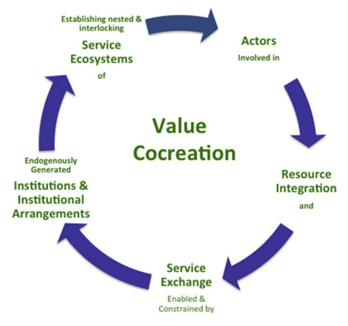
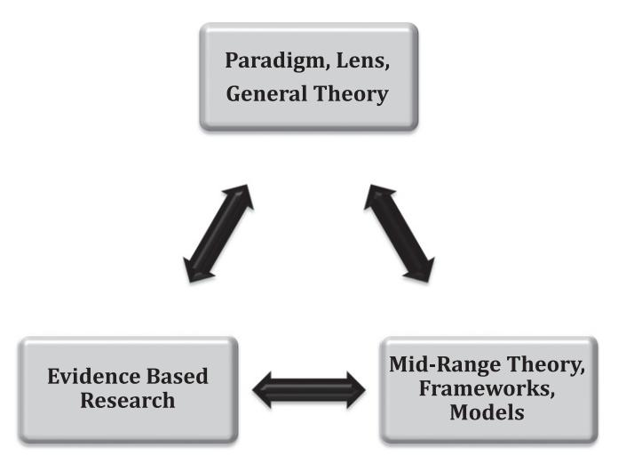
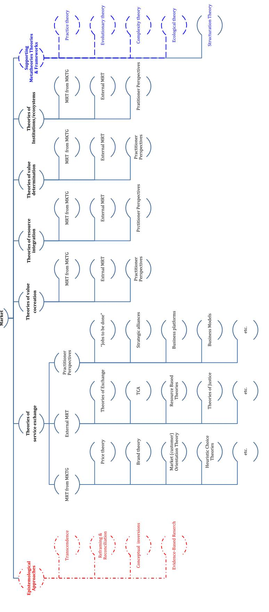

# IJRM

International Journal of Research in Marketing

journal homepage: <www.elsevier.com/locate/ijresmar>

# Full Length Article

# Service-dominant logic 2025

Stephen L. Vargo a,⁎, Robert F. Lusch b

b Eller College of Management, University of Arizona, 1130 East Helen Street, Tucson, AZ 85721, United States

### article info abstract

#### Article history:

First received on October 31, 2015 and was under review for 5 1/2 months Available online 18 November 2016

Senior Editor: Christian Homburg

Keywords: Service-dominant logic S-D logic Theory Institutions Ecosystem

During the last decade, service-dominant (S-D) logic (1) has taken a series of significant theoretical turns, (2) has had foundational premises modified and added and (3) has been consolidated into a smaller set of core axioms. S-D logic can continue to advance over the next decade by moving toward further development of a general theory of the market and, even more broadly, to a general theory of value cocreation. To support this theory of the market requires developing more midrange theoretical frameworks and concepts of service exchange, resource integration, value cocreation, value determination, and institutions/ecosystems. These midrange theories can be partially informed by theories outside of marketing, including those under the rubrics of practice, evolutionary, complexity, ecological and structuration theories. Evidence-based research is also needed; opportunities exist in areas such as (1) strategy development and implementation (2) application of complexity economics and (3) the study of the service of cognitive mediators (assistants) as heuristic tools in complex service ecosystems. Additionally, opportunities exist for using S-D logic as a broader framework for the study of macromarketing, including ethics, economic, environmental and social sustainability, as well as public policy. For each of these, the further study of institutions and institutional arrangements, which facilitate coordination among actors in service ecosystems, is needed.

© 2016 Elsevier B.V. All rights reserved.

# 1. Introduction

Service(s) marketing began to emerge in the early 1980s as a distinct area of marketing study and has now become a major focus of marketing scholars worldwide. Initially, probably few scholars, if any, would have envisioned that, several decades later, service marketing might be proclaimed as a transcending perspective for all of marketing, as has been suggested by service-dominant (S-D) logic [\(Vargo & Lusch, 2004a, 2004b](#page-21-0)). As [Rust and Huang \(2014, p. 206\)](#page-20-0) have recently commented, "Increasingly, and inevitably, all of marketing will come to resemble to a greater degree the formerly specialized area of service marketing...".

Simultaneous with service(s) marketing achieving a wider impact, an idea was surfacing at IBM that, just as it (and other firms) had to take a role in establishing the discipline of computer science, it could be similarly important for industry to take a major role in the advocacy and development of service science. Given the substantial advancements in service(s) marketing, it was not surprising that this effort drew, internationally, on the research of many service(s) marketing scholars and also participation from a host of other leading firms. In particular, the industry leaders of this effort, at the IBM Almaden Research Center, in

E-mail addresses: [Svargo@hawaii.edu](mailto:Svargo@hawaii.edu) (S.L. Vargo), [rlusch@email.arizona.edu](mailto:rlusch@email.arizona.edu) (R.F. Lusch).

⁎ Corresponding author.

outlining their vision of service science ([Maglio and Spohrer, 2008, p. 18\)](#page-20-0), suggested "service-dominant logic may be the philosophical foundation for service science, and the service system may be its basic theoretical construct."

During the mid 1990s, we began collaborating on what resulted in our [\(Vargo & Lusch, 2004a](#page-21-0)) first article outlining a framework that has become known as "S-D logic". The core ideas were rather simple and straightforward. First, marketing activity (and economic activity in general) is best understood in terms of service-for-service exchange, rather than exchange in terms of goodsfor-goods or goods-for-money. In other words, it is the activities emanating from specialized knowledge and abilities that people do for themselves and others (i.e., service, applied abilities) and the activities they want done for them, not the goods, which are only occasionally used in the transmission of this service, that represent the source of value and thus the purpose of exchange. Second, value is cocreated, rather than created by one actor and subsequently delivered.

As with all "new" ideas, neither of these was entirely new (c.f. [Arthur, 2009\)](#page-18-0). For example, [Bastiat \(1848/1964\)](#page-19-0) had declared that "services are exchanged for services" over 150 years ago. Likewise, [Prahalad and Ramaswamy \(2000\)](#page-20-0) had been advocating value cocreation for several years prior to [Vargo and Lusch \(2004a\)](#page-21-0) and before them [Ramirez \(1999\)](#page-20-0) had traced its recognition back at least 300 years. In fact, S-D logic was, from its beginning, more about the identification and extension of apparent coalescence in the ongoing development of marketing thought, as reflected in the title "Evolving Toward a New Dominant Logic for Marketing" ([Vargo & Lusch, 2004a](#page-21-0); see also [Akaka, Vargo, & Lusch, 2012\)](#page-18-0), than a radically new idea. That is, it has been grounded on a foundation built by many others, as has been its progress.

Arguably, what was new was the articulation of an initial, integrated framework for thinking about value cocreation in terms of service-for-service exchange. Services (usually plural) were re-conceptualized by abandoning the intangible-unit-of-output meaning they had acquired through the industrial-, production- and goods-dominant orientation —that had grown out of neoclassical economics and the concerns of the Industrial Revolution— for the adoption of a process meaning (see e.g., [Vargo, Lusch, &](#page-21-0) [Morgan, 2006; Vargo & Morgan, 2005](#page-21-0))—that is, service (singular).

Since its introduction, the development of this integrated framework has continued, first by inclusion of the other (than service exchange) primary activity involved in value cocreation—resource integration—and then by explication of the idiosyncratic and experiential nature of value (e.g., [Vargo & Lusch, 2008](#page-21-0)). More recently, in elaborating this framework, the consideration of the role of institutions in value cocreation has moved to the forefront. All of these developments have been captured in five core foundational premises (FPs, of which there are now a total of 11), which have more recently ([Vargo & Lusch, 2016](#page-21-0)) been identified as axioms (see Table 1).

There have been other "turns" that have been somewhat more subtle or at least not fully captured in separate FPs/ axioms—though some have resulted in the rewording of existing FPs—and others are currently in more formative stages. Examples of these are the move to a generic-actor (A2A) orientation and the identification of a service ecosystem as the "unit" of analysis for value cocreation [\(Vargo & Lusch, 2011](#page-21-0)). There are others.

In short, S-D logic represents a dynamic, continuing narrative of value cocreation through resource integration and service exchange that has been constructed by an increasingly large number of academics from various disciplines and subdisciplines. Like all narratives, while it can capture a general, underlying storyline and even document key path dependencies by identifying its major turns, it cannot reliably predict how the story will eventually unfold. Nonetheless, the purpose of this article is to suggest that, for S-D logic to move forward over the next decade, it needs more midrange theory development, as well as evidencebased research. To accomplish this, we first explicate and elaborate the narrative, as it currently exists. This better enables us to suggest a direction in which it currently seems to be pointing into the less-knowable future (approximately 10 more years). Then we provide a clarification of levels of abstraction and aggregation in theory development, paving the way for a more detailed discussion of midrange theory development. In that regard, we review the epistemological approaches we have used for metatheory development and how they are also relevant for midrange theory development. Next, we consider sources of input for midrange theory. This points us back up to the metatheoretical level and the possibility of a general theory of the market. Importantly, in the spirit of the theme of this special issue on the future of marketing, we discuss seven research frontiers that lead to seven salient research questions; each of which could probably be used to raise dozens of additional sub-questions. Finally we offer some concluding remarks.

#### 2. The emerging S-D logic narrative

Our intention is to offer an integrative approach that will help identify additional, needed and potentially needed, developments. We should note, however, that this is not to be confused with a prediction of the full future narrative or its impact (if any), which we see as emergent. Indeed, had we chanced a prediction of the current S-D logic narrative and its impact

Table 1 The axioms of S-D logic.

|              | Axiom                                                                                               |
|--------------|-----------------------------------------------------------------------------------------------------|
| Axiom 1/FP1  | Service is the fundamental basis of exchange                                                        |
| Axiom 2/FP6  | Value is cocreated by multiple actors, always including the beneficiary                             |
| Axiom 3/FP9  | All social and economic actors are resource integrators                                             |
| Axiom 4/FP10 | Value is always uniquely and phenomenologically determined by the beneficiary                       |
| Axiom 5/FP11 | Value cocreation is coordinated through actor-generated institutions and institutional arrangements |

10 years ago, we would have been incorrect on essentially all accounts. Having said that, we will point toward some likely areas of impact and suggest a partial research agenda.

# 2.1. Foundations, bifurcations, and conceptual turns

As noted, at the heart of S-D logic is the identification of service—the application of resources for the benefit of others—as the common denominator of economic (and non-economic) exchange. In discussing these resources, we especially noted the primary role of operant resources, resources (such as knowledge and skills) that can act on other resources to create a benefit, rather than the role of the relatively static, operand resources (such as natural resources), which are more commonly considered. This conceptualization of service naturally reflected, at least in part, the first major bifurcation in thought that led to S-D logic and was motivated by the intractability of the question regarding the difference between goods and services, a question that, despite long deliberations by service scholars as well as economists, was more abandoned than resolved [\(Vargo & Morgan, 2005](#page-21-0)).

The S-D logic solution was a transcending conceptualization of service (a process, usually expressed singularly)—i.e. as noted the use of one's resources for another actor's benefit—that depicted service as superordinate to goods and services (units of output, usually plural). In other words, as [Gummesson \(1995\)](#page-19-0) had noted some years before, "activities render services, things render services." Given that it is redundant to speak of intangible units of output, called "services," as being created to provide service, the former is generally not a concept used in S-D logic. Instead, the framework suggests that service can be provided either directly or indirectly (e.g., through a good).

#### 2.2. Zooming out: from resource application to resource integration

Partly due to the editorial focus of the Journal of Marketing [\(Vargo & Lusch, 2004a\)](#page-21-0), as well as to the latent influence of traditional models, the initial perspective was relatively dyadic and micro-level focused and somewhat managerially oriented. A major turn occurred therefore with the attempt to zoom out to reveal the bigger picture. Initially, that zooming out exposed other actors, at first generally seen as other firms (e.g., "competitors" and "suppliers"). It then extended to customer connections (e.g., family, peers, etc.), all involved in service-for-service exchange, thus, at least part of the broader context [\(Akaka, Vargo, and Lusch, 2013\)](#page-18-0). But closer examination revealed that all of these actors exhibited foundational commonalities in addition to service-for-service exchange—resource-integration activities. That is, the (especially operant) resources used in service provision were both the source and the combined outcome of service-for-service exchange. This led to the identification of FP 9, later designated Axiom 4 [\(Vargo](#page-21-0) [& Lusch, 2008\)](#page-21-0), an FP/Axiom that seems to have resonated particularly strongly among S-D logic scholars and others. It also revealed a network structure ([Chandler & Vargo, 2011](#page-19-0)), but one that had dynamic, recursive properties beyond those typically attributed to networks. It was becoming increasingly apparent that the key to value cocreation was the ongoing interplay of resource creation and application afforded through reciprocal exchange and differential access and integration.

Full realization of this dynamism, however, required an additional turn. As we argued in [Vargo and Lusch \(2011\),](#page-21-0) an essential step toward fully grasping the process and extent of value cocreation is the "need to overcome (mis)conceptual problems associated with the notion of a 'producer,' as a creator of value, and a 'consumer,' as a destroyer of value. Briefly stated, all actors (e.g. businesses, individual customers, households, etc.) engaged in economic exchange are 'similarly', resource-integrating, serviceproviding enterprises that have the common purpose of value (co)creation. This had been partially reflected in the wording of FP9: "all social and economic actors are resource integrators" [\(Vargo & Lusch, 2008\)](#page-21-0) but more fully captured in the somewhat tongue-in-cheek proclamation that "it's all B2B" [\(Vargo & Lusch, 2011\)](#page-21-0), which was subsequently rephrased 'more neutrally' to "A2A" (actor to actor). In addition, it also moved the network orientation to at least a rudimentary conceptualization of a service ecosystem, as will be discussed.

#### 2.3. Bridging to the future

There are two major theoretical S-D logic orientations that are closely aligned and intertwined with each other. These have been emerging the last several years and appear to have the potential to capture the dynamic structures of markets: ecosystems and institutional theory. They are revealed through the ongoing process of zooming out or, probably more accurately, using oscillating foci [\(Chandler & Vargo, 2011](#page-19-0))—looking at the same phenomena from different levels of aggregation. They also are topics that have been mentioned in our (and others') previous writing, including a recent major update and extension of S-D logic [\(Vargo &](#page-21-0) [Lusch, 2016\)](#page-21-0). However, they are dealt with here as "bridging concepts" (topics, research streams) because, on the one hand, their significance for understanding value cocreation has been more introduced than fully explored and, on the other hand, we anticipate that their full exploration will set the stage for much of the future S-D logic development. In short, they will likely complete the core foundation for much of the continuing progress of S-D logic.

#### 2.3.1. Service ecosystems

As one zooms out from dyadic interactions and discreet transactions, the first thing noticed is that these dyadic interactions do not take place in isolation, but rather within networks of actors, of which the dyad is just a part. These networks can be seen at various levels of aggregation (e.g., macro, meso, micro). Structurally then, these networks reflect what S-D logic captures axiomatically in the resource-integration specification of Axiom 3. Likewise, they emphasize that the benefit (value) realized by a beneficiary (e.g., a "customer") does not occur in isolation either, but rather through integration of the resources from many sources, thus best understood as holistic experiences (FP9/Axiom3 and FP10/Axiom4).

At first glance, it might appear that there is little new here, just the acknowledgement that service provision, value cocreation and value realization take place in networks, as sociologists [Granovetter \(1973\),](#page-19-0) [Burt \(1992\)](#page-19-0) and various scholars in marketing (e.g., [Achrol & Kotler, 1999](#page-18-0)) have been telling us for some time. Partially, this would be a correct evaluation. However, the S-D logic framework adds several key characteristics that are not in all cases typical of these network conceptualizations. Most obvious among these is that the connections represent service-for-service exchange, rather than just connections of resources, people, or product flows; thus, in S-D logic, network actors are linked by common, dynamic processes (service provision). Second, the actors are defined not only in terms of this service provision (resources applied for benefit) but also in terms of the resource-integration activities that the service exchange affords. Finally, the network has a purpose, not in the sense of collective intent but rather in the sense of individual survival/wellbeing, as a partial function of collective wellbeing. The study of purpose or purposeful behavior has a long history in philosophical thought concerning concepts of teleology and, more contemporarily, teleonomy ([Pittendrigh, 1958](#page-20-0)). The latter focuses more on complexity, emergence and self-organizing systems [\(Christensen, Anthony Scott, Berstell, &](#page-19-0) [Nitterhouse, 2007\)](#page-19-0), which are crucial characteristics of service ecosystems. This literature fits well as we try to understand how wellbeing of individuals is both contingent on and contributes to a dynamic network, in which the resources of the actors are being continually updated. It also indicates the need for a subtle but significant shift in orientation among actors, away from the primacy of conflict and toward the primacy of cooperation and coordination. Unpacking how this "purposeful," cooperative activity leads to value cocreation will be a major underlying theme for the next 10 years, as will be discussed below.

#### 2.3.2. Institutions

This coordination for value cocreation implies mechanisms for the facilitation of these resource integration and service-for-service exchange activities. As partially discussed in [Vargo and Lusch \(2016\),](#page-21-0) this is the role of institutions and institutional arrangements. Institutions are the humanly devised rules, norms, and beliefs that enable and constrain action and make social life at least somewhat predictable and meaningful ([Scott, 2008](#page-20-0)), what [North \(1990\)](#page-20-0) calls "rules of the game." Institutional arrangements refer to higher-order assemblages of interrelated institutions (sometimes referred to as "institutional logics"). Thus, S-D logic has recently identified the service ecosystem, partially conceptualized in terms of institutions, as the unit of analysis for value cocreation. Service ecosystems are defined as "relatively self-contained, self-adjusting system of resource-integrating actors connected by shared institutional arrangements and mutual value creation through service exchange" ([Vargo & Lusch, 2016, p. 161](#page-21-0)).

With the addition of institutions and service ecosystems to S-D logic's foundational concepts, we believe S-D logic can begin to be something more than the lens, framework, and perspective, as we have characterized it up to now. That "something more" can take several forms, each with its own potential impact. At a minimum, it affords the completion of a relatively coherent narrative of value cocreation through resource integration and service exchange, coordinated by shared institutional arrangements that define nested and overlapping service ecosystems (see Fig. 1).

Fig. 1. The narrative and process of S-D logic. Note: [Vargo and Lusch \(2016\).](#page-21-0)

# 2.3.3. Further exploration of bridging concepts

The conceptual exploration of service ecosystems and institutions has just begun. Thus, we expect, over the next 10 years, much of the metatheoretical work in S-D logic to be focused on these concepts. Importantly, as we argue later, for S-D logic to be useful beyond a metatheoretical level will necessitate midrange theory development. Some of the kinds of questions that need to be addressed both at a metatheoretical and at a midrange-theoretical level are:

- How do service ecosystems assemble?
- How do service ecosystems adapt and evolve?
- What determines the resiliency of service ecosystems?
- How do keystone actors in an ecosystem establish their position?
- How do service ecosystems innovate and how do they foster market emergence?
- How can ecosystem service(s) be integrated and fostered by service ecosystems?
- What are the institutions and institutional arrangements that allow service ecosystems to hold together and function?
- Are there particular institutions that are more relevant or that may need to be developed for digitally based service ecosystems?
- How can the institutional perspective be used to study innovation, market emergence and market plasticity as well as the decay of firms or industries and even markets?
- How does the work of institutional maintenance continue, yet allow for organizations to explore and experiment with new institutional rules and confront risk and uncertainty and be able to survive and in some cases prosper?

Predictably, there are many more, related questions. However, as will be discussed, in all cases, midrange theory development of ecosystems and institutions, which are intended to support a metatheory of the market, might benefit from existing theoretical frameworks, such as those associated with culture, shared meaning, social change, and human ecology. Before exploring further theory development in S-D logic, however, it is useful to clarify the intertwined conceptual issues of abstraction and aggregation; a common challenge for all of science.

# 3. Levels of abstraction and aggregation

Whereas this "zooming out" has, in our opinion, lent itself to a more generic, holistic, experience-based theoretical framework, its discussion has also led to some apparently paradoxical confusion. For example [Wilkie & Moore \(2006\)](#page-21-0) described S-D logic as managerially focused whereas others (e.g.[,Gronroos & Voima, 2013\)](#page-19-0) have described it as purely macro-level focused, and thus not applicable to micro-level (managerial) phenomena. In a sense, these attributions are both correct and incorrect, primarily because they confuse two meanings of "levels." As shown in Table 2, one has to do with the level of aggregation (e.g., societal, market, or dyadic exchange). The other has to do with the level of abstraction (e.g., metatheoretical, midrange, or micro-foundational). S-D logic is of course primarily focused on meta-level theory development but not solely at a macro-level of aggregation. In fact, we would characterize it as equally, macro-, meso-, and micro-focused in relation to aggregation. Furthermore, as [Chandler and](#page-19-0) [Vargo \(2011\)](#page-19-0) noted, it is essential to alternately zoom in and zoom out in order to understand phenomena at any level (aggregation) of interest. That is, one cannot fully understand the activity (e.g., brand selection) at one level without viewing it from another (e.g., brand community).

Theoretical levels, on the other hand, have to do with levels of abstraction, rather than aggregation. Zooming in and out across levels of abstraction might also be useful, in that theory at one level can inform theory at another (e.g., midrange to macro or vice versa). One can also construct metatheory without directly addressing lower-level theory, at least initially, but perhaps somewhat ironically, if not arguably, it should however address all levels of aggregation. This has been our ([Lusch & Vargo, 2014](#page-20-0)) primary emphasis, though not an exclusive one. It has also been of primary emphasis for some, though far from all, S-D logic focused scholars (e.g., [Brodie, Hollebeek, Juric, & Ilic, 2011; Flint & Mentzer, 2006](#page-19-0)). These mixed emphases will be particularly useful moving forward; given that now the (metatheoretical) narrative of S-D logic has become more fully articulated, lower-level (of abstraction) theory will increasingly become the focus. That is, whereas we see continuing attention being paid to metatheory, at all levels of aggregation, we see much of the development efforts associated with S-D logic to be more midrange and microlevel theoretical in nature, thus lending itself to direct testing, verification, and application.

Table 2 Levels of aggregation and abstraction

| Levels              |                                                               |                                                                      | Aggregation                                     |                                              |
|---------------------|---------------------------------------------------------------|----------------------------------------------------------------------|-------------------------------------------------|----------------------------------------------|
|                     |                                                               | Macro level (e.g., societal, community – national, global, local) | Meso level (e.g., "industry"/market, cartel) | Micro level (e.g., transactions, sharing) |
| Abstraction/ theory | Meta-theoretical (e.g., S-D logic, cocreation of value)    | Primary focus to date                                                |                                                 |                                              |
|                     | Midrange-theoretical (e.g., engagement, coproduction)      | Increasing attention, looking forward                                |                                                 |                                              |
|                     | Micro-theoretical (e.g., law of exchange, decision making) |                                                                      |                                                 |                                              |

# 4. Toward midrange theories

To date, our response to questions concerning normative application of S-D logic has typically been that metatheoretical development was necessarily primary because, without an adequate theoretical foundation, premature application would likely result in frustrating efforts. However, we also pointed out that the S-D logic lens enables practitioners to develop their own novel approaches to the opportunities and challenges they face in their company or the market. Moreover, S-D logic has been synthesized from other, existing metatheory and midrange theory, as well as the observation of the activities of practitioners. As noted, over the next decade, we anticipate the more purposeful generation of S-D logic-consistent, midrange theory, which will enable it to become more prescriptive and conducive to empirical evaluation, further contributing to its development.

A note on midrange and micro-level theory is important here. As indicated, we are talking primarily about an emphasis on the level of abstraction (see [Table 2\)](#page-4-0). Thus, this meaning of midrange (or middle-range) is close to that discussed by [Merton \(2012,](#page-20-0) [p.448\)](#page-20-0):

theories that lie between the minor but necessary working hypotheses that evolve in abundance during day-to-day research and the all-inclusive systematic efforts to develop a unified theory that will explain all the observed uniformities of social behavior, social organization, and social change.

From this conceptualization of midrange theory as bridging metatheoretical and micro-theoretical levels one might conclude that this increased specificity is the same as that referred to in discussion of "microfoundations," which has emerged in recent literature. However, whereas there seems to be some confusion about the term, [Barney and Felin \(2013, p.145\)](#page-18-0) insist that "aggregation is the sine qua non of microfoundations," as most other treatments of the concept seem to support. This would of course place it on a different continuum (i.e., aggregation — micro level) in our levels model (see [Table 2](#page-4-0)).

Importantly, there is no attempt here to privilege levels of aggregation or levels of abstraction or even to suggest that they are as orthogonal as [Table 2](#page-4-0) implies – more likely, they are best considered to be oblique. Rather, it is just to point out that the approach has been to develop metatheoretical models applicable to all levels of aggregation, anticipating that future activity will increasingly deal with more specific, midrange theoretical models. In all likelihood, this will of course promote hybrid approaches, since more meso- and micro-theoretical concepts are often suitable for addressing phenomena at particular levels of aggregation. This hybrid analysis appears to be what [Storbacka, Brodie, Bohmann, Maglio, and Nenonen \(2016\)](#page-20-0) have done in the investigation of engagement as microfoundational to value cocreation. Thus, while we focus on midrange and micro-level theoretical development, we expect that much of it will be done through hybrid analysis.

More generally, the current and future developmental process for S-D logic can be viewed as three interrelated and iterative processes as illustrated in Fig. 2, involving an increasingly large, worldwide community of transdisciplinary scholars and diverse practitioners. As noted, the developmental process began with an analysis of other, existing meta-level paradigms, which led to the development of a partial, synthesized metatheoretical lens and lexicon. Whereas some of this work has been at least initially completed, the process is ongoing and iterative. Another part of the process is the development of midrange theories, frameworks and models, seen from macro-, meso-, and micro levels of analysis. Evidence gathering and application is an additional part of the process. As stated, the whole process is recursive. For instance, the metatheoretical development rests on both midrange theory, as indicated, and evidence, both from observation and existing literature, which serves as a kind of evidence in its own right.

Fig. 2. The recursive research process.

# 5. Toward an integrative framework for midrange theory development

At the core of S-D logic related midrange theory development is the issue of how to apply our collective skills, experiences and knowledge (operant resources), to provide benefit to households, practitioners, policy makers and others. If there is no benefit, by definition, there is no value in use and, thus arguably, the bridge from metatheory to application has failed. However, we have proceeded cautiously about defining this benefit, through midrange theory, too quickly. We believe it is now time to actively encourage the bridge between metatheory and midrange theory. Likewise, it is time to begin to encourage more evidence-based research informed by this midrange theory to better bridge theory and practice.

As indicated, whereas we don't think it is possible to predict specific theoretical content and its impact approximately 10 years out, we do believe that both the need and evidence from current research efforts point toward the further development of S-Dlogic informed theories of market-based value creation. Guided by S-D logic as an overarching framework, we see these (1) developing through a synthesis of existing and ongoing midrange marketing and transdisciplinary research (2) informed by other metatheoretical frameworks implied by S-D logic and (3) supporting (accomplished through) many of the same epistemological processes used in the development of S-D logic in its current form. A potential integrative approach for this development is shown in [Fig. 3](#page-7-0). This figure covers the primary past and anticipated epistemological approaches, a representative sample of supporting metatheoretical models and theories, as well as categories of midrange theories, organized around the axioms of S-D logic. Only the "theories of service-exchange" category is populated with specific sources of input, and then only partially so. The intent here is only to provide the framework for the potentially endless set of midrange theories, built on a shared foundation, rather than to be comprehensive and constraining. We believe that the combined efforts of other interested scholars, with their particular interests, knowledge and skills, will be essential to the task of filling in the specifics. We do however urge developing an understanding of the epistemological approaches that we have used in the framing of S-D logic; we think they are also broadly applicable to midrange theory development.

# 6. Epistemological approaches

Pulling these meta- and midrange- theoretical frameworks into a unified, coherent theoretical framework will be a fairly challenging task. This is in part because the disciplines and subdisciplines drawn on have their own conceptualizations for similar phenomena, if not different ontologies. Some of this work is already in process, as noted. However, some of it will require extensive effort, especially as scholars attempt to cut across disciplinary and subdisciplinary boundaries. We offer no simple solution to this ages-old, interdisciplinary research challenge. However, we can review the primary epistemological methods used in our own theory building, through the synthesis of numerous research streams. Arguably these can also be helpful in the development of additional meta- and midrange theory and frameworks.

### 6.1. Solving tensions and paradoxes

The S-D logic framework grew out of a desire to simplify, to solve tensions and paradoxes. Among those was the paradox that service economies were seen as tertiary, following agricultural and industrial phases, but "services" were often defined in contrast to goods, as possessing negative qualities—intangibility, heterogeneity, inseparability, and perishability (see [Vargo & Lusch,](#page-21-0) [2004b](#page-21-0))—suggesting that advanced economies "produced" inferior (to goods) products. Something also seemed wrong with the idea that "service economies" did not exist prior to industrialization. The general principle is that tensions and paradoxes often point toward areas in which theory building (meta and midrange) is needed. Thus, they should be embraced and resolved (see [Lewis, 2000](#page-20-0)). There are a number of paths toward this end. Some that we have found useful and expect to aid in further theory development are briefly discussed below.

#### 6.2. Conceptual inversions

Conceptualization is an institutional process. In fact, concepts and their related models and relationships become so dominant that they are taken for granted to be true. This is good in that they provide heuristics for cognition. But they also need to be reevaluated and often challenged. S-D logic grew, in part, out of the reconsideration of the relationship between goods and "services," with the latter being seen as a special case of the former—essentially, intangible goods. But, as we looked to contemporary and historical literature, we found exceptions to this thinking, suggesting that goods are actually a special case of service, the common denominator of exchange. For us and apparently many others, this inverted conceptualization began to relieve the tension between the two concepts. As S-D logic developed, we began to see other instances in which the traditional conceptual relationships seemed to be inverted ([Lusch & Vargo, 2014](#page-20-0)). Examples are managerial and entrepreneurial approaches to marketing, and competition and cooperation, with the former becoming the special cases of the latter, respectively.

#### 6.3. Transcendence

To transcend is to see beyond what we have learned to perceive. This frequently involves higher-order abstractions, which can capture a broad range of specific phenomena. Often this helps to resolve conflicts or artificial distinctions as the preceding discussion of "inversions" illustrated. As noted, when S-D logic was introduced [\(Vargo & Lusch, 2004a](#page-21-0)), we argued that the conceptual

Fig. 3. Toward an S-D logic informed, general theory of the market.

distinction between goods and services was flawed and caused problems in economics, marketing, and national income accounting, among other endeavors. It was resolved by making "service" (singular) a transcending concept that includes a tangible good as a special case of service provision, a distribution mechanism. A more recent transcending conceptualization is the adoption of generic "actors" [\(Vargo & Lusch, 2011](#page-21-0)) and the identification of common activities in relation to value creation, rather than myopically pre-assigning roles, such as "producer' and "consumer."

#### 6.4. Reframing and reconciliation

S-D logic is, and will increasingly be, transdisciplinary both in meta- and midrange-theory development and in application. This makes the syntheses of knowledge difficult, since different disciplines (or subdisciplines) often use different terms for similar phenomena or the same term with different conceptualizations. Much of the work has been and will be concerned with finding or developing a more robust lexicon, through reframing previous concepts and reconciling differences in language. For instance, S-D logic reframes "value" from a property of output to an experiential outcome, a measure of a change in viability, wellbeing. A market is reframed from something that is fixed or "out there" to be entered to something that is imagined, created, institutionalized and performed. Likewise, innovation is not about inventing things but about developing systems for value cocreation.

# 6.5. Evidence-based research

Metatheory is relatively difficult to confirm directly based on empirical investigation. However, midrange theory is not so constrained. Thus, as we move toward theory development at lower-levels of abstraction, we anticipate that S-D logic generated theory will be increasingly subjected to empirical scrutiny. This is of course as it should be. Empirical confirmation and disconfirmation are essential to further development of robust theory.

This increased ability to subject theory to empirical scrutiny does not however suggest that evidence-based research is just now entering the picture. Much of S-D logic was motivated and informed by practitioner observation. Some of that has been exploratory, cased-based research, involving observations of successes and failures of practices that could not be adequately explained by existing theory and models. Some of this theory-driving evidence has come from rigorous academic research. Often, however, it has been consolidated in practitioner-focused publications, like Harvard Business Review and Sloan Management Review, as well as books based on practitioner experiences. This combined, top-town, theory-driven, evidence-based testing of midrange theory and bottom up, practice-driven, theory-generating activity is of course an ongoing, iterative process.

# 7. Sources of input

Broadly speaking, there are three sources of input for theory development: (1) S-D logic and other metatheoretical frameworks, (2) existing midrange theory, especially that which is already being developed from S-D logic, both within and outside of marketing, (3) and micro-theoretical, practical observation, often from practitioners, academic consultants and others. Each of these is briefly highlighted.

# 7.1. Source of input: metatheory

S-D logic of course provides the primary theoretical framework. However, the narrative, as it presently exists, has been informed by or implies other metatheory. Among the most important are institutional theory, systems theory, complexity theory and complexity economics, and evolutionary theory.

#### 7.1.1. The institutional perspective

As discussed, we ([Vargo & Lusch, 2016](#page-21-0)) recently brought the institutional perspective to S-D logic axiomatically and find it integral to both metatheoretical and midrange-theoretical advancement. Historically, marketing in general has not included much institutional thought, at least identified as such—for exceptions see, for example, [Arndt \(1981\)](#page-18-0) and [Duddy and Revzan \(1953\)](#page-19-0). Fortunately, institutional thought recently seems to be increasingly nudging its way into marketing. Of particular note are studies by [Carson, Devinney, Dowling, and John \(1999\)](#page-19-0), [Humphreys \(2010\),](#page-19-0) and [Dolbeck and Fischer \(2015\).](#page-19-0) This signals what we think represents an opportunity for a significant contribution, not only to S-D logic but also to marketing in general. As discussed in [Vargo and Lusch \(2016\),](#page-21-0) some nonmarketing scholars have suggested that institutions are the core subject matter and building blocks of the social sciences in general. We agree, though not so much in a reductionist, atomistic sense, as in a systemic and processual sense, with institutionalization as a core process of value cocreation. We try to capture that in the discussion of institutional arrangements as integral to service ecosystems. Combined with the S-D logic narrative, we think the integration of institutional thought in the marketing literature becomes more focused and directional and allows exploration of important questions, as suggested above.

Fortunately, there is a great deal of institutional literature from outside of marketing from which to draw. As discussed in more detail in [Vargo and Lusch \(2016\),](#page-21-0) these can be found in most social science disciplines, such as economics, political science, sociology and organizational theory. However, the specifics of institutional theory often vary among these disciplines (for an overview see [Scott, 2008\)](#page-20-0) and require some degree of reconciliation (see discussion). We suggest that not only can these reconciled

literatures contribute to S-D logic but also that S-D logic might provide a theoretical framework that can contribute to this reconciliation and to the general advancement of institutional theory.

The midrange theoretical derivative of institutional theory is often identified under the rubric of "institutional work" (e. g., [Lawrence, Suddaby, & Lecca, 2009](#page-20-0)) —the creation, maintenance, and disruption of institutions. We anticipate its role to become considerably more evident in S-D logic (see [Vargo, Wieland, & Akaka, 2015](#page-21-0)). In fact, this is already beginning to take place (e.g., [Koskela-Huotari, Edvardsson, Jonas, Sörhammar, & Witell, 2016](#page-19-0))

# 7.1.2. Practice theory

Closely aligned with institutional theory is the loosely defined research stream of practice theory. Practices can be understood as institutionalized activities – linked "doings and sayings" [\(Schatzki, 1996](#page-20-0))—that constitute the "social." This perspective not only resonates especially well with the role of "operant resources" indicated by S-D logic, but also the role of institutional-arrangements in service ecosystems. As with institutional theory, the diverse views of practice theorists can be difficult to reconcile with each other, but we believe that the potential benefits to the advancement of S-D logic is worth the effort. Additionally, S-D logic might serve as a framework to assist with this reconciliation. In marketing, significant contributions from practice theory can be found in the work of Kjellberg and colleagues (e.g. [Kjellberg & Helgesson, 2006; Korkman, Storbacka, & Harald, 2010;](#page-19-0) see also [Schau, Muñiz, & Arnould, 2009](#page-20-0)), with the latter two specifically linking practice theory and S-D logic. There are a number of others. We have been increasingly embracing practice theory as both metatheoretically and midrange-theoretically fundamental to S-D logic since our adoption of an actor-to-actor orientation [\(Vargo & Lusch, 2011\)](#page-21-0).

One particular form of practice theory, Actor Network Theory (ANT) [\(Latour, 2005](#page-20-0)), might be especially worth noting. Among other things, it warns against the potential pitfalls of reifying levels of aggregation, since all practices are entangled, suggesting a "flat world" understanding. While we continue to talk in terms of levels of aggregation, we acknowledge that, the purpose is primarily analytical. Even then, we (1) try to be vigilant in connecting the levels through some variation of structuration theory (e.g., [Giddens, 1984\)](#page-19-0) and (2) suggest oscillating foci ([Chandler & Vargo, 2011](#page-19-0)), as previously discussed. This analytical, oscillating focus-approach also has an additional advantage: it makes more evident the whole-is-more-than-the-sum-of-its-parts nature of systems. That is, it more readily reveals emergent properties of systems.

ANT also advises that material objects have agency. In one sense, this is not too far from Orlikowski's conceptualization of sociomateriality (e.g., [Akaka & Vargo, 2013; Orlikowski & Scott, 2008\)](#page-18-0). However, it likely takes on special meaning as S-D logic takes an ever-increasing deep dive into ecosystems as ontologically foundational, in which the separation of material and immaterial, as well as animate and inanimate objects, is likely to necessarily become increasingly blurred. Practically, these distinctions are already failing us, as we move closer to a full understanding of a true Internet of Things (IoT).

#### 7.1.3. Systems and ecosystems theory

Perhaps it goes without saying that, as presently constituted, S-D logic needs to be informed by systems thinking. This means more than just acknowledging interconnectedness. It requires a profound ontological shift in how we see the subject matter of science. As [Capra and Luisi \(2014\)](#page-19-0) point out, it requires a shift in perspectives from parts to wholes, from objects to relationships, from measuring to mapping, from structures to processes, and from Cartesian certainty to approximate knowledge. Thus, it differs significantly from the more mechanistic underpinnings of scientific thought that have provided its paradigmatic foundation for centuries.

[Alderson \(1951\),](#page-18-0) notably writing in a philosophy journal, expressed some of his early thoughts on this matter when he advocated the need for systematics for problems of action. Later [Alderson \(1965\)](#page-18-0) pointed out the importance of systems thinking to marketing (see also [Adler, 1967\)](#page-18-0) and tried to nudge it toward general systems theory (GST) but, arguably, neither marketing or systems thinking was quite ready at that time. With the advent of complexity theory and complexity economics, that "readiness" situation might now be changing. Given the service ecosystems turn in S-D logic, it is essential to its further development. In addition to our writings, this has already begun (e.g., [Frow et al., 2014](#page-19-0)). We expect this to be facilitated by an increasing, general ecosystems orientation (e.g., [Adner, 2013; Iansiti & Levien, 2004; Lusch, Sagarin, & Tang, 2016\)](#page-18-0) in marketing and business in general.

The term "ecosystems" has its roots in "natural" science, and is generally attributed to [Tansley \(1935\),](#page-20-0) who considered ecosystems as the "basic units of nature." He discussed them in terms of "holistic," "quasi-organisms" since organisms cannot functionally be separated from their environments, both organic and inorganic. This conceptualization resonates with ANT, notions of sociomateriality, and current S-D logic thinking, as discussed. This is somewhat different from some, more-limited, contemporary treatment of business ecosystems, which tend to use the term ecosystems metaphorically to discuss networked constellations of firms, often centered on a central actor. Moreover, as we move forward, we see the whole "human" versus "natural" conceptual divide beginning to break down.

#### 7.1.4. Complexity theory and complexity economics

Tightly aligned with, if not subsets of, systems theory are the study of complex adaptive systems—dynamic systems characterized by feedback and self-adjustment—and the closely aligned complexity economics, —both primary subject matter of the Santa Fe Institute. Complexity theory studies the repeating patterns and order behind what often appears to be complicated activities and processes.

Complexity economics is of course the study of these phenomena in the economy. It differs considerably from neoclassical economic thought in that it assumes out-of-equilibrium states and systems evolution. As [Arthur \(2015. p. 182\)](#page-18-0) indicates: "Common to all studies of complexity are systems with multiple elements adapting… to the world – the aggregate pattern—they create." As he notes elsewhere (pp. 136–37), "The economy forms an ecology for its technologies, it forms out of them, and this means it does not exist separately." He continues, "Notice the circular causality at work here. Technology creates the structure of the economy, and the economy mediates the creation of novel technology (and therefore its own creation)" (cf. [Giddens, 1984\)](#page-19-0). Technology here is the application of useful knowledge [\(Arthur, 2009; Moykr, 2002\)](#page-18-0) and that useful knowledge is captured in S-D logic as "operant resources," which, when applied for benefit, is defined as "service" (see [Akaka & Vargo, 2013](#page-18-0)).

Complexity theory and complexity economics are still young and their application to service ecosystems has only recently begun. However, we see integration and advancement critical to S-D logic, since service ecosystems are complex adaptive systems, by definition, and value cocreation is a complex adaptive process. This is one of the biggest research and theory development challenges, given that, even in biology and zoology, the study of ecosystems is still in relative infancy and continues to result in as many unresolved questions as answers.

# 7.1.5. Evolutionary theory

Institutional, practice, and systems theory all have several common characteristics. Perhaps most important to the advancement of S-D logic is that they are all evolutionary, in the sense that future states and structures are built on foundations formed by past states and structures. In addressing technology, [Arthur \(2009\)](#page-18-0) speaks of "combinatorial evolution," in claiming that no completely new technologies are ever created but, rather, are formed out of recombination of parts of existing ones. While his discussion was technology specific, we see the principle more generally applicable to the formation of institutional arrangements and fundamental to understanding value cocreation through resource integration.

Given the postulated overlapping and nested nature of service ecosystems in S-D logic, concepts of co-evolution (e.g., [Nelson,](#page-20-0) [1994\)](#page-20-0) and inclusive fitness (e.g., [Gardner & Foster, 2008](#page-19-0)) are likely to be particularly useful in informing S-D logic, both in terms of meta-and midrange theory. Likewise, we expect them to contribute to the discussion of value, especially as conceptualized in terms of change in the viability of a system [\(Lusch & Vargo, 2014\)](#page-20-0).

#### 7.2. Sources of input: existing midrange theory

Academic marketing has a long tradition of borrowing theories, frameworks and models from other disciplines. For example, as a field, it originally rested on a framework adopted from economics; much of consumer behavior has been built on the literature from midrange theories in psychology and social psychology; and much of the literature for Consumer Culture Theory (CCT) comes from midrange theories of anthropology and sociology. It would be futile to try to capture all of the midrange theories from outside of marketing that might be used here but a few obvious candidates are transaction cost analysis (TCA), resourcebased theories of the firm, social exchange theory, various theories of justice and ethics, effectuation theory, etc. The potential list is infinite. A major task will be the reconciliation of such concepts among these theories and with S-D logic, as discussed above.

# 7.3. Source of input: practitioner observation

Contrary to at least some conventional wisdom, academics don't lead marketing thought as much as they make sense of it, report it, codify it, and disseminate it. Often, the "front line" in this process is the consolidation of recent observations of shifting, successful practices by practitioners, consultants and consulting academics as reported in the trade press—books and business publications, such as Harvard Business Review (HBR), Sloan Management Review, and California Management Review (there are of course others).

While these sources sometimes are lacking in academic rigor, we have found that they make up for it in their timely, cuttingedge thought concerning practices in the world of business. Thus, they often both signal the need and provide the seeds for development of new or revised midrange theory. Consolidating these by linking them through current metatheoretical frameworks, often updating these frameworks in the process, is the academic task.

In the development of the original S-D logic framework, we found sources such as [Prahalad and Ramaswamy \(2000\),](#page-20-0) [Prahalad](#page-20-0) [and Hamel \(1990\),](#page-20-0) and [Normann and Ramirez \(1993\)](#page-20-0) from HBR, among others, particularly useful in signaling changes in contemporary thought. Since then, we have reconciled core ideas from additional sources. Examples are forward-looking and reframing ideas such as "lean consumption" [\(Womack & Jones, 2005\)](#page-21-0), "jobs to be done" ([Christensen et al., 2007](#page-19-0)), "ecology as strategy" [\(Iansiti & Levien, 2004](#page-19-0)), as well as many of the insights of [Normann \(2001\).](#page-20-0) There are of course many others. We expect much of the midrange theory development to be stimulated by similar observations of practice.

# 8. Ongoing S-D logic midrange theory development: vectors of diffusion

Despite the early perception that S-D logic is uniquely concerned with "services" marketing, S-D logic is not uniquely about any single sub-discipline of marketing. In fact, it is not even uniquely about marketing, at least in the traditional sense of the word. Instead, S-D logic offers a perspective, for seeing economic and social phenomena differently. That is, evidence seems to be mounting that the S-D logic narrative offers not only a more robust model for understanding the traditional subject matter of marketing (e.g., branding, marketing communications, social marketing, and supply chains, etc.) but also for social phenomena in general, than do traditional models.

Fortunately, even as we [\(Vargo & Lusch, 2004a; Vargo & Lusch, 2008\)](#page-21-0) and others were focusing on meta-level theory, some scholars were developing more midrange and micro-level theory (e.g., [Brodie, Saren, & Pels, 2011](#page-19-0)). That is, notably, the emerging S-D logic narrative has found considerable resonance outside the subdisciplines of marketing, in various contexts.

Hence, we highlight here some of this impact. This overview is not intended as a comprehensive review of the tens of thousands of citations of the work of S-D logic scholars. Rather, it is intended to highlight how S-D logic has been broadly impacting marketing and other fields of research, even in its pre-theory stage—that is, to point out major research directions that are in process of being explored and likely become the focus of additional midrange theory development. As noted, we anticipate that this diffusion and theory building will accelerate as the S-D logic narrative continues to evolve into a systemic view—the service ecosystems perspective. In a subsequent section, we will indicate some additional, major areas in which we see additional development of S-D logic theory building.

Table 3A S-D logic vectors of diffusion within marketing.

| Marketing subfield                   | Focus/implications                                                                                                                                                                                                                                                                                                                                                 | Reference                                                                                                             |
|--------------------------------------|--------------------------------------------------------------------------------------------------------------------------------------------------------------------------------------------------------------------------------------------------------------------------------------------------------------------------------------------------------------------|-----------------------------------------------------------------------------------------------------------------------|
| Branding                             | Insights from S-D logic to business-to-business branding. Branding becomes a communicative interaction process and brand value is (dis)confirmed in use by customers. Building a research agenda based on S-D logic to understand brands as collaborative, value                                                                                             | Ballantyne and Aitken (2007) Merz et al. (2009)                                                                    |
|                                      | co-creation activities of firms and all of their stakeholders Drawing on S-D logic to build a conceptual model for designing and planning the customer                                                                                                                                                                                                          | Payne et al. (2009)                                                                                                   |
|                                      | experience involved in co-creating brands. Using S-D logic and its actor-to-actor approach to understand user-generated content about brands.                                                                                                                                                                                                                | Halliday (2016)                                                                                                       |
| Customer engagement               | Exploring the theoretical foundations of customer engagement by drawing on relationship marketing theory and the S-D logic.                                                                                                                                                                                                                                     | Brodie et al. (2011)                                                                                                  |
|                                      | Drawing S-D logic to extend the customer engagement concept beyond the moment of purchase.                                                                                                                                                                                                                                                                         | Vivek et al. (2012)                                                                                                   |
| Customer perceived value          | Synthesizing S-D logic and social construction approach to understand value as value-in-social-context.                                                                                                                                                                                                                                                         | Edvardsson et al. (2011)                                                                                              |
|                                      | Extending S-D logic discussion on value by characterizing value as an experience.                                                                                                                                                                                                                                                                                  | Helkkula et al. (2012)                                                                                                |
| Consumer culture theory (CCT)     | Positioning consumer culture theory (CCT) and S-D logic as natural allies. Synthesizing consumer culture theory (CCT) and S-D logic to study value cocreation in brand communities.                                                                                                                                                                          | Arnould (2007) Schau et al. (2009)                                                                                 |
| International marketing           | Applying S-D logic and its service ecosystems approach to international marketing.                                                                                                                                                                                                                                                                                 | Akaka, Vargo, and Lusch (2013)                                                                                     |
| Logistics/Supply chain management | Linking performance based logistics to S-D logic S-D logic perspective on the cocreation of logistics value (logistics as a context, logistics services) S-D logic as an informative framework for value chain management. The perception of supply chains as value cocreation networks through S-D logic – an elaboration and research opportunities. | Randall et al. (2010) Yazdanparast et al. (2010) Flint and Mentzer (2006) Tokman and Beitelspacher (2011) |
| Marketing communication           | Synthesizing S-D logic and dialogical orientation to broaden the framework of marketing communication.                                                                                                                                                                                                                                                          | Ballantyne and Varey (2006)                                                                                           |
|                                      | Examining the intersection of S-D logic and integrated marketing communication (IMC) through                                                                                                                                                                                                                                                                       | Duncan and Moriarty (2006)                                                                                            |
|                                      | the concept of brand "touchpoints". Using S-D logic and the concept of co-production to study marketing communication through personal media.                                                                                                                                                                                                                | Bacile et al. (2014)                                                                                                  |
| Marketing strategy                   | Facilitating the integration of ethical accountability in marketing decisions through S-D logic. Using S-D logic to guide marketing thought and practice for achieving and sustaining strategic advantage.                                                                                                                                                   | Abela and Murphy (2008) Bettencourt, Lusch and Vargo (2014)                                                     |
|                                      | Explicating how operant resource perspective of S-D logic can influence relationship marketing (RM) strategy success.                                                                                                                                                                                                                                           | Madhavaram, Granot, and Badrinarayanan (2014)                                                                      |
| Social marketing                     | Infusing services thinking, including S-D logic, to social marketing to implementing effective midstream social marketing.                                                                                                                                                                                                                                      | Russell-Bennett et al. (2013)                                                                                         |
|                                      | Extending social marketing by applying (and adapting) the principles, concepts and theories of S-D logic.                                                                                                                                                                                                                                                       | Luca et al. (2015)                                                                                                    |
| Value propositions                   | Applying S-D logic to offering strategies and conceptualizing value propositions as of customer-network value propositions.                                                                                                                                                                                                                                     | Cova and Salle (2008)                                                                                                 |
|                                      | Drawing insights of S-D logic for understanding the dynamics of value propositions. Exploring value propositions in the context of S-D logic through a multi-stakeholder perspective.                                                                                                                                                                           | Kowalkowski (2011) Frow and Payne (2011)                                                                           |

# 8.1. Vectors of diffusion within marketing

The diffusion of S-D logic within marketing has been into virtually all of its subdisciplines (see [Table 3A\)](#page-11-0). The rubric of integrated marketing communications (IMC), unifying the different forms of marketing communications, was quickly linked to ideas spawned by S-D logic by [Duncan and Moriarty \(2006\)](#page-19-0). Simultaneously, [Ballantyne and Varey \(2006\)](#page-18-0) synthesized S-D logic with a dialogical orientation to broaden the framework of marketing communication. More recently S-D logic and its concepts have been used to study, for example, marketing communication through personal media ([Bacile, Ye, & Swilley, 2014\)](#page-18-0) and usergenerated content about brands ([Halliday, 2016\)](#page-19-0).

The link between S-D logic and branding was also established early ([Ballantyne & Aitken, 2007\)](#page-18-0). Here, S-D logic has been used to provide a more holistic perspective of brands as cocreated by all of the firm's stakeholders [\(Merz, He, & Vargo, 2009\)](#page-20-0) and to understand cocreated brands as integral outcomes of the relationship experience that unfolds over time ([Payne, Storbacka, Frow, & Knox, 2009\)](#page-20-0).

In supply chain management, scholars have started to think in terms of value networks and systems, due to the influence of S-D logic (see e.g. [Flint & Mentzer, 2006; Tokman & Beitelspacher, 2011\)](#page-19-0). In addition, [Randall, Pohlen, and Hanna \(2010\)](#page-20-0) have used insights from S-D logic to inform -performance based- logistics and others have focused on the cocreation of logistics value (see e.g., [Yazdanparast, Manuj, & Swartz, 2010\)](#page-21-0).

Table 3B Transdisciplinary vectors of S-D logic diffusion

| Application field                          | Focus/implications                                                                                                                                                                                                                                                                                                                                                                          | References                                                                 |
|--------------------------------------------|---------------------------------------------------------------------------------------------------------------------------------------------------------------------------------------------------------------------------------------------------------------------------------------------------------------------------------------------------------------------------------------------|----------------------------------------------------------------------------|
| Arts philosophy and creative industries | Using S-D logic to discuss arts as a resource that is integrated into everyday life. Guiding the practices of the creative industries by drawing on S-D logic and the metaphor of a "value creating ecology".                                                                                                                                                                         | Boorsma (2006) Hearn et al. (2007)                                      |
| Design thinking/service design          | Linking service-dominant (S-D) logic and design science to advance service system design. Drawing from S-D logic to see designing for service as an exploratory process that aims to create new kinds of value relation between diverse actors within a socio-material configuration.                                                                                                 | Chen and Vargo (2010) Kimbell (2011b)                                   |
| Ecosystem services (ES)                    | Infusing S-D logic and the ecosystem service approach from natural sciences to create a service-dominant value creation (SVC) framework.                                                                                                                                                                                                                                                 | Matthies et al. (2016)                                                     |
| Education                                  | Applying concepts of SDL such as cocreation to foster engagement, learning experiences and                                                                                                                                                                                                                                                                                                  | Jarvis et al. (2014)                                                       |
|                                            | outcomes in large classes. Exploring the implications of S-D Logic for business education.                                                                                                                                                                                                                                                                                               | Semeijn, Semeijn, and Caniëls (2011)                                    |
| Engineering                                | Examines the challenges and opportunities of product-service systems for manufacturing firms. Advocating a "paradigm shift from leadership in technology to leadership in use" by drawing upon S-D logic and other supporting literature.                                                                                                                                             | Isaksson et al. (2009) Meier et al. (2011)                              |
| Health                                     | Applies S-D logic to examine the importance of oncology patients' participation in the value                                                                                                                                                                                                                                                                                                | Rehman et al. (2012)                                                       |
|                                            | co-creation process and its effect on perceived quality. Draws on S-D logic to build a research agenda to use value co-creation as a basis for studying patient                                                                                                                                                                                                                          | Hardyman et al. (2015)                                                     |
|                                            | engagement in micro-level encounters in health care. Authors propose a new paradigm for envisioning value in health care based on S-D logic.                                                                                                                                                                                                                                             | Joiner and Lusch (2016)                                                    |
| Information systems/computer science | Extending information systems research by placing service and service metaphors as core aspects of the field. Connecting service-oriented architecture (SOA) and S-D logic have been used to develop an ontology for collaborative manufacturing.                                                                                                                                     | Alter (2010) Yan et al. (2010)                                          |
| Innovation studies                         | An expanded and strategic view of discontinuous innovations through as SDL lens. Reconciling diverging views on innovation by drawing on S-D logic and its service ecosystems perspective.                                                                                                                                                                                               | Michel et al. (2008) Vargo et al. (2015)                                |
| Management                                 | Urging management education and research to adopt a service-dominant logic perspective and                                                                                                                                                                                                                                                                                                  | Ford and Bowen (2008)                                                      |
|                                            | related concepts. Drawing upon service systems thinking and S-D logic to build an internally consistent framework for management research dealing with organizations, employees and customers in the context of services. Examining S-D logic as a conceptual foundation to address strategies and guide new businesses in emerging economies.                                  | Subramony and Douglas Pugh (2015) Pels (2012)                        |
| Public Administration Service science   | Draws insights from S-D logic to public management to develop a (public) service-dominant logic. Establishing S-D logic as a foundation for service science and the service systems as a basic unit of analysis. Draws on S-D logic when casting service science as a transdiscipline based on symbolic processes that adaptively compute the value of interactions among systems. | Osborne et al. (2013) Maglio et al. (2009) Spohrer and Maglio (2010) |
| Tourism                                    | Demonstrates the importance of S-D logic in uncovering the role played by co-production and co-creation in the tourism industry.                                                                                                                                                                                                                                                         | Shaw et al. (2011)                                                         |
|                                            | Uses S-D Logic as a framework for advancing understanding of intangible assets within the hotel industry. Grounded in S-D logic, the study examines how IT enables value co-creation in tourism.                                                                                                                                                                                         | FitzPatrick et al. (2013) Cabiddu et al. (2013)                         |

S-D logic and consumer culture theory (CCT) were quickly identified as "natural allies" ([Arnould, 2007](#page-18-0)) and their synthesis has been used, for example, to examine value cocreation in brand communities [\(Schau et al., 2009](#page-20-0)). By reconceptualizing value, not just from "value-in-exchange" to "value-in-use," but also to "value-in-context" [\(Vargo, Maglio, & Akaka, 2008\)](#page-21-0), including "valuein-social-context" ([Edvardsson, Tronvoll, & Gruber, 2011\)](#page-19-0) and "value-in-cultural-context" [\(Akaka, Schau and Vargo, 2013](#page-18-0)), S-D logic offers several interesting research avenues for the discussion on customer-perceived value as an experiential and socially constructed phenomenon (see e.g., [Helkkula, Kelleher, & Pihlstrom, 2012\)](#page-19-0). S-D logic has also been identified as the theoretical foundation for the development of the emerging customer engagement concept (see e.g., [Brodie et al., 2011; Hollebeek, Srivastava, &](#page-19-0) [Chen, 2016; Vivek, Beatty, & Morgan, 2012\)](#page-19-0).

S-D logic, as discussed, began with something of a marketing management focus [\(Vargo & Lusch, 2004a\)](#page-21-0). More recently, S-D logic is shown to facilitate a seamless integration of ethical accountability in marketing decision-making ([Abela & Murphy, 2008\)](#page-18-0) and used to guide practitioners to achieve and sustain strategic advantage [\(Bettencourt, Lusch, & Vargo, 2014](#page-19-0)). In relation to offering strategies, [Cova and Salle \(2008\)](#page-19-0) applied S-D logic to conceptualize value propositions as customer-network value propositions. Also, the multi-stakeholder nature ([Frow and Payne, 2011\)](#page-19-0) and the dynamic aspects of value propositions [\(Kowalkowski, 2011](#page-19-0)) have been explored. The newest application areas of S-D logic within marketing sub-disciplines include international marketing ([Akaka, Vargo and Lusch, 2013](#page-18-0)) and social marketing [\(Luca, Hibbert, & McDonald, 2015; Russell-Bennett, Wood, & Previte, 2013](#page-20-0)).

# 8.2. Transdisciplinary vectors of service-dominant logic diffusion

We have been pleased with the receptivity of many disciplines beyond marketing to the S-D logic perspective, sometimes, in somewhat surprising areas of inquiry (see [Table 3B\)](#page-12-0). Management is a major business discipline that has generally not had much of a focus on service or customers, however, [Ford and Bowen \(2008\)](#page-19-0) have urged management education and research to adopt a service-dominant logic perspective. More recently, [Subramony and Pugh \(2015\)](#page-20-0) note that management research dealing with organizations, employees and customers in the context of services needs an internally consistent framework and suggest one by drawing upon service systems thinking and S-D logic. In the field of public administration, [Osborne, Radnor, and Nasi \(2013\)](#page-20-0) argue that S-D logic is more relevant to public management than the previous manufacturing focus and build a research agenda for a "public-service dominant" approach.

From very early on, S-D logic was identified as the philosophical foundation for service science—a transdiscipline based on symbolic processes that adaptively compute the value of interactions among systems [\(Maglio, Vargo, Caswell, & Spohrer, 2009;](#page-20-0) [Spohrer & Maglio, 2010\)](#page-20-0). Information systems and computer science have also increasingly drawn upon S-D logic (see e.g., [Alter, 2010; Yan, Ye, Wang, & Hua, 2010](#page-18-0)). Most recently, MIS Quarterly published a whole special issue with a focus on service innovation in a digital age (see [Barrett, Davidson, Prabhu, & Vargo, 2015](#page-19-0)).

Engineering education and research have traditionally had a strong product or goods focus. However, some engineering scholars draw upon S-D logic and other supporting literature to advocate a "paradigm shift from leadership in technology to leadership in use" [\(Meier, Völker, and Funke 2011, pg.1177\)](#page-20-0). They suggest that product-service systems (PSS) direct manufacturing firms to focus on meeting "customer needs rather than the physical hardware itself" [\(Isaksson, Larsson, and Rönnbäck 2009,](#page-19-0) [pg.329](#page-19-0)). Design thinking and especially service design have found alignment with S-D logic (see e.g., [Kimbell, 2011a](#page-19-0)). [Chen and](#page-19-0) [Vargo \(2010\)](#page-19-0) use S-D logic to link design thinking, design science, and IT in an effort to move the latter toward a full transition to a true "service orientation."

Within innovation studies, [Michel, Brown, and Gallan \(2008\)](#page-20-0) provide an expanded and strategic view of discontinuous innovations by deploying S-D logic; [Lusch and Nambisan \(2015\)](#page-20-0) provide a broadened view of service innovation in the digital age grounded in S-D logic that includes service ecosystems, service platforms and value cocreation; and [Vargo et al. \(2015\)](#page-21-0) reconcile different 'types' of innovation activities by drawing on the service ecosystems perspective. The latter argue that institutionalization processes (i.e., institutional work)—the maintenance, disruption and change of institutions—are central to innovation for both technology and markets.

In addition to these examples, there are numerous others: S-D logic has been increasingly explored in tourism management (see e.g., [Cabiddu, Lui, & Piccoli, 2013; FitzPatrick, Davey, Muller, & Davey, 2013; Shaw, Bailey, & Williams, 2011\)](#page-19-0). Education scholars have proposed that S-D logic, and specifically cocreation, can be a way to foster engagement, learning experiences and outcomes in large classes ([Jarvis, Halvorson, Sadeque, & Johnston, 2014](#page-19-0)). The relevance of a broadened perspective provided by S-D logic has also been acknowledged in the health disciplines (see e.g., [Hardyman, Daunt, & Kitchener, 2015; Rehman, Dean, &](#page-19-0) [Pires, 2012](#page-19-0)), arts philosophy [\(Boorsma, 2006](#page-19-0)), and creative industries [\(Hearn, Roodhouse, & Blakey, 2007](#page-19-0)). S-D logic is even finding its way into the 'natural' sciences. A recent study integrating S-D logic and the Ecosystem Services (ES) approach argues that "a shared service-dominant approach provides an opportunity for deeper inter-disciplinary discussion between natural and business sciences" [\(Matthies et al. 2016, pg.51\)](#page-20-0). The use of S-D logic in all these areas illustrates the broad applicability of S-D logic. Importantly, it also provides evidence that marketing can contribute foundational theory to other academic disciplines, rather than just borrowing theory from them, as has been more typically the case.

#### 9. Toward a general theory of the market

As noted, S-D logic clearly has had a descriptive and explanatory impact on subdisciplines and research streams in marketing as well as on other disciplines, through a growing number of scholars who have participated in its advancement. This explanatory ability is significant in its own right. However, to overlook the additional potential of the ecosystems orientation, as it relates to the role of self-adaptive systems and institutional arrangements in resource integration and value cocreation through service exchange, misses the true significance of S-D logic. In fact, we have been told by numerous scholars that, to them, the continual extension of the narrative is beginning to move the status of S-D logic from a "lens," orientation," and "perspective" toward a theory. That is, the narrative provides not only the core concepts for it also establishes at least the beginning of a nomological network of value cocreation through resource integration and service exchange. Although our focus now is about using the narrative to help direct the development of a general theory of the market (see [Fig. 3](#page-7-0)), S-D logic as a meta-framework can also be used to inform and theorize about non-market forms of value cocreation.

Since early in the explication of S-D logic, we (e.g., [Lusch & Vargo, 2006; Lusch & Vargo, 2014; Vargo, 2007\)](#page-20-0) have suggested that it could lend itself to a general theory, initially, not so much through a general theory of marketing as through a more foundational general theory of the market. That is, we agree with [Arndt \(1985\)](#page-18-0) when he says, "In marketing, the problem is rather one of spinning off a basic science from a problem solving discipline" and note that marketing has evolved more from normative science than from basic science. Likewise [Venkatesh, Penaloza, and Fuat \(2006, p. 252\)](#page-21-0) have argued, "The term market is everywhere and nowhere in [marketing]." In other words, whereas the subject matter of marketing is (should be) the market, academic marketers have not so much studied it in a positive sense as they have explored normative marketing decision rules [\(Vargo, 2007\)](#page-21-0). Thus, while there have been numerous calls for a general theory of marketing (e.g.,[Alderson, 1965; Bartels, 1968; Hunt, 2002](#page-18-0)), we have advocated for some time [\(North, 1990; Vargo, 2007; Vargo, Lusch, Akaka, & He, 2010](#page-20-0)), that the overarching task in marketing is development of a general theory of the market. Importantly we have never claimed that S-D logic is either a positive or normative theory but we agree, that it is moving closer to theory status and see it developing rapidly in that direction over the next decade.

S-D logic might also have the ability to contribute to [Alderson's \(1957\)](#page-18-0) potentially more important, 50-year old challenge: "What is needed is not an interpretation of the utility created by marketing, but a marketing interpretation of the whole process of creating utility [i.e., value] ([Alderson 1957, p.69\)](#page-18-0)." We suggest that the S-D logic narrative can potentially contribute to that goal. However, in so doing, it might be able to do even more than Alderson implied, by providing an understanding of value cocreation that extends beyond a general theory of the market to inform economics and other business, as well as other, non-business disciplines dealing with value cocreation (e.g., sociology, political science, etc.). However, for this to happen, several additional tasks need to be addressed.

# 10. Research Frontiers

Soon after the publication of "Evolving…" [\(Vargo & Lusch, 2004a\)](#page-21-0), we began to get inquiries or questions from academics about the directions, both positve and especially normative research motivated by S-D logic should and would take. Other than to suggest a vision of it serving as a foundation for a general theory of the market, as noted, in most situations, we avoided sharing detailed thoughts. This was because we believed the directions were (1) at the time unknowable and (2) would be cocreated by a community of interested scholars of S-D logic (both supportive and critical), rather than by us. We believe it is now possible to look forward with somewhat more clarity. In the following sections, we highlight some of the most salient of these, and suggest eight research questions with the hope that doing so will not constrain, but rather motivate, participation by others leading to the generation of a broader and more detailed agendum.

#### 10.1. Dynamic strategy development and implementation

Integrating frameworks and theories on strategy development and implementation with the complexity of service ecosystems is a major research opportunity. A successful S-D logic-informed strategy is dependent on a firm's ability to develop ongoing, dynamic, cooperative relationships that enable access to and integration of resources resulting in new resources [\(Lusch & Vargo,](#page-20-0) [2014\)](#page-20-0). This suggests that the related inquiry entails questions of (1) whether or not marketing strategy development should be less about the traditional marketing management decisions (e.g. the marketing mix) and more about the location of the firm with respect to the various service ecosystems in which it participates, and (2) how to foster relationships and cooperation with other actors—versus how to beat the competition. In brief, the most central questions for addressing strategic decisions in marketing and management are those concerned with the ecosystems in which a firm operates and the firm's collaboration with other actors ([Johanson & Vahlne, 2011](#page-19-0)).

Despite considerable research in strategic marketing and management, there is relatively little related to the implementation of strategy. Often there is a conceptual separation between the senior executives who make strategy and the lower level managers and employees who execute the strategy. In all cases employees are fundamentally internal service providers as they apply their knowledge and skills to benefit each other and the firm. However, they are seldom treated as service providers and beneficiaries.

Evidence suggests that poor implementation is frequently the cause for failures in strategy ([Hickson, Miller, & Wilson, 2003;](#page-19-0) [Nutt, 1999\)](#page-19-0). S-D logic, with a focus on viewing customers, suppliers and all employees as operant resources, as well as its dialogical, relational, and cocreation orientation, can play a role in theorizing about how to develop more effective strategy implementation. Part of this may include bringing middle level managers and other service ecosystem actors (suppliers) into the strategydevelopment process, suggesting the salient research question: how can strategic planning and implementation be cocreated with multiple stakeholders and what is the impact of these cocreation processes on the firm and its stakeholders?

# 10.2. Market, economy and complexity economics

We expect to witness an increasing intersection in the study of markets, the economy and complexity. Together these inquiries are in search of understanding non-linear, non-equilibrium, dynamically evolving service ecosystems filled with risk and uncertainty. Big data will become a major way to capture real-time system dynamics not only in marketing but also in economics and other social sciences.

# 10.2.1. Market and economy

Throughout the last two hundred years, multiple schools of economic thought have emerged and often competed with each other. Although not inclusive of all schools of thought, the major schools are: Classical, Neoclassical, Marxist, Keynesian, Austrian, Schumpetrian, Institutional, and Behavioral. Neoclassical economics propelled economics from a philosophical view on political economy to a science with laws (such as supply, demand, declining marginal utility) that could be mathematized to form iron laws from which predictions could be made. The neoclassical model is still prominent in economic and business education and often in public policy making. It has also experienced longevity as a mathematical modeling framework with many applications to marketing.

Nonetheless, it could be argued that the six schools that followed the neoclassical school (Marxist, Keynesian, Austrian, Schumpetrian, Institutional, and Behavioral) developed because of the inability of the neoclassical model to explain many, if not most, economic phenomena. Perhaps one of the most surprising omissions in neoclassical economics is a lack of focus on innovation and entrepreneurship. As [Coase and Wang \(2011 pg.1\)](#page-19-0) observe "…how new goods and services and new ways of production are constantly invented in the economy, how production and innovation are organized, and what forces are at work are rarely on the research agenda in economics. It is extraordinary that the process of production is virtually invisible in economic theory." The focus of neoclassical economics is on resource allocation in a static world, with decisions made by rational economic actors. S-D logic focuses on how actors integrate resources, accessed from multiple sources, to create new resources for value cocreation. This process continually generates innovation and dynamism in the market that, at the same time, makes the market more risky and uncertain ([Lusch & Vargo, 2014](#page-20-0)). One inversion of S-D logic is from seeing management as a general function of business to seeing entrepreneurship as the major function, of which management is a part. Viewing marketing management from an entrepreneurial perspective and conducting research in this direction is needed.

According to the American Economic Association, "Economics can actually be defined a few different ways: it's the study of scarcity, the study of how people use resources, or the study of decision-making" [\(AEA 2016](#page-18-0)). Notably, as [North \(1990\)](#page-20-0) suggests, economics is not focused on the study of the market and, in most regards, lacks a theory of the market. However, more broadly, it neither focuses on the economy nor offers a theory of the economy. An economy involves many things other than markets or their aggregates, such as substitutes for economic exchange (i.e. sharing, self service, gift giving, forced exchange), institutions and institutional arrangements (both formal and informal), tacit knowledge, relationships, and networks to name a few. Consequently, a salient and broad reaching research question becomes: how can S-D logic incorporate various schools of economic thought but also serve as a foundation for developing a theory of the market and the economy as precursor to a more general theory of society?

#### 10.2.2. Complexity economics

As stated, we are encouraged by what is becoming known as "complexity economics" [\(Arthur, 2015](#page-18-0)), because it allows for the study of economic and social actors under more realistic assumptions, such as non-linearity, actor created rules that can become law-like through institutionalization, within a network of other actors (what we call a service ecosystem). Complexity economics is synergistic with computational economics ([Beinhocker, 2011; Tesfatison & Judd, 2006](#page-19-0)), which integrates computer science and learning with economics. Marketing scientists are using computational economics tools such as agent-based modeling [\(Tay &](#page-20-0) [Lusch, 2005, 2007\)](#page-20-0), cellular automata ([Goldenberg, Libai, & Muller, 2001, 2002](#page-19-0)), genetic algorithms [\(Liu, Ram, Lusch, & Brusco,](#page-20-0) [2010](#page-20-0)) and other tools from computer science to model and understand complex service ecosystems and the broader economy comprising them. This suggests another salient research question: how can concepts from complexity economics be used to develop a general model of a complex service ecosystem that could then be used to further research on markets and the economy?

# 10.2.3. Cognitive computing

The science of cognitive computing is emerging [\(Spohrer, 2016](#page-20-0)). Humans are on the edge of dramatically expanding their cognitive abilities by the use of cognitive assistants/mediators. These assistants/mediators assist humans individually and collectively to be able to navigate in an increasingly complex non-linear dynamic world and also to deal with the resultant complex problems and decisions. Hence cognitive computing is inextricably linked to our prior discussion of the economy, markets and complexity economics. [Spohrer and Banavar \(2015\)](#page-20-0) foresee "cognition as a service" and hence as becoming more and more of a marketfacing resource. Cognitive assistants or mediators begin to address issues of bounded rationality and procedural rationality that was a key focus of [Herbert Simon \(1978\)](#page-20-0). Simon was less concerned with the economists' focus on what decisions are made and more concerned with "procedural aspects of decisions, especially to deal with uncertainty, and more generally, with nonequilibrium phenomena" [\(Simon, 1978, p. 494](#page-20-0)). He advocated artificial intelligence, computational complexity, and cognitive simulation, topics that have developed over the last half-century, especially within information technologies, thus enabling cognitive computing.

We foresee a strong alignment of cognitive computing with S-D logic, through service ecosystems, that will increasingly include many smart service systems. Smart service systems are a type of sociotechnical system, in which cognitive assistants/mediators become resources to obtain and provide service. This presents an opportunity for marketing and other behavioral scientists to use behavioral decision labs to study how cognitive assistants/mediators improve or weaken individual and group choice and decisions. In addition, we expect that researchers in neuroscience and neuromarketing ([Lee, Broderick, & Chamberlain, 2007;](#page-20-0) [Reimann, Castano, Zaichkowsky, & Bechara, 2012; Zurawicki, 2010](#page-20-0)) will begin to study (1) how cognitive assistants/mediators alter brain activity and influence a host of marketing phenomena, such as brand choice, value assessment, and new service ("product") adoption, as well as (2) the behavior and decision-making of marketing managers (and other actors), who will increasingly rely upon cognitive assistants/mediators for marketing analytics and decision support. The rapidly developing area of cognitive computing motivates the following salient research question: will cognitive assistants/mediators, such as WATSON, as they become part of smart service systems, improve or hinder decision-making of marketing personnel and consumers?

#### 10.3. Big data

Big data (also known by other names)—large, often difficult to analyze datasets generated in the course of business —have been key sources of information for marketing analytics. The study of big data has continued to evolve [\(Chen, Chiang, & Storey, 2012\)](#page-19-0) from several decades ago, when it was primarily based on database management systems, which analyzed structured content within the organization. In marketing, this led to the development of CRM tools and applications, including the modeling of lifetime shareholder value with predictors, such as advertising, research and development and brands. Approximately 15 years ago, big data analytics began to include web-based unstructured content analyzed with text and web analytics. This enabled firms to interact directly with customers and use cookies, allowing organization to gather data to understand customer preferences and needs. It also ushered in the analysis of user-generated content and social media that were then analyzed with computational linguistic tools to capture sentiments.

Currently a third era of Big Data is emerging [\(Chen et al., 2012\)](#page-19-0), primarily facilitated by the global rise in smart phones and tablets replacing less-mobile computers. Further bolstering this era will be the Internet of Things (IoT) and embedded systems. We find this era very well aligned with S-D logic because it enables, through data analytics, a new breed of enterprises that adapt to and create system dynamics ([Zeng & Lusch, 2013](#page-21-0)). In brief, Big Data allows for real-time data capture of actor-centric behavior using mobile and sensor-based content through advanced analytics (e.g., network analytics, text analytics, nonlinear dynamic modeling) and a host of computational tools (such as genetic algorithms, fuzzy logic, neural networks and agent based modeling). Thus a salient research question is: how can Big Data be used to capture actor centric behavior and provide the means to calibrate nonlinear, dynamic models of market actors (e.g., suppliers, firms, customers) in a service ecosystem?

### 10.4. Macromarketing

The focus in marketing on marketing management and consumer behavior has largely overtaken marketing thought during the last several decades [\(Lusch, 2007; Wilkie & Moore, 2003](#page-20-0)). There are virtually no doctoral seminars, MBA courses and undergraduate courses on macromarketing, marketing phenomena viewed from a macro level of aggregation. Seldom do doctoral students pursue dissertations in this area and the major journals are almost void of related content. The record in Europe is a bit better. Recently a clear signal of the general lack of concern for macromarketing is evident in the complete absence of the broader environment and context within which firms function in the "Big 7 Intellectual Challenges" identified by the leadership of the American Marketing Association ([AMA, 2016](#page-18-0)) ([https://www.ama.org/publications/MarketingNews/Pages/7-big-problems](https://www.ama.org/publications/MarketingNews/Pages/7-big-problems-marketing.aspx)[marketing.aspx](https://www.ama.org/publications/MarketingNews/Pages/7-big-problems-marketing.aspx), accessed on May 10, 2016).

S-D logic presents a framework that can inform macromarketing theory and research. Opportunities around ethics, environmental sustainability, social sustainability and public policy are plentiful. We offer a few thoughts.

# 10.4.1. Ethics

Service and S-D logic can contribute to a normative framework for marketing and business [\(Abela & Murphy, 2008; Vargo &](#page-18-0) [Lusch, 2008\)](#page-18-0). S-D logic and its foundational premises have been shown to be consistent with an integrative justice model. This provides multinational corporations (MNCs) focusing on fast growing markets such as China, India, and Brazil with guidelines for operational practices that help fairly allocate the benefits and burdens among many actors and stakeholders [\(Laczniak &](#page-20-0) [Santos, 2010](#page-20-0)). Others have suggested that the concept of service, with its implicitly ethical connotations, can bridge to higherorder ethical principles, so they can generate better business practice [\(Guitian, 2015\)](#page-19-0). Arguably, there are a host of contemporary business issues, such as information privacy, artificial intelligence, cognitive assistants, and rights of various stakeholders, for which S-D logic inspired midrange theories coupled with evidence-based research may prove helpful. In that regard, the study of business ethics from an S-D logic perspective would need to incorporate the institutions and institutional arrangements that help to massively coordinate actors in the service ecosystem and society. For instance, some business practices may be considered ethical or unethical depending upon the institutional framework within which they are nested. Thus changes in ethical practices may require institutional innovation. This would be a meaningful and valuable area of study, as more nations move to more market based economies but are still coordinated by institutions put in place for a different type of economy. A salient research question is: can S-D logic and institutional theory be used to investigate the process and types of institutional innovation that could foster ethical decision making?

# 10.4.2. Environmental sustainability

In our initial contribution ([Vargo & Lusch, 2004a\)](#page-21-0), we briefly discussed the work of [Malthus \(1798\)](#page-20-0) and his predictions about how population growth would soon outstrip resources. Today, we still face that debate, coupled with more than 200 years of additional data that shed light on the potential vulnerability of natural resources. We also witness the impact of a much larger global population and many more nations moving toward economic development and using more natural resources. Some of this has been mitigated by technology (i.e., applied operant resources), which has expanded the usable supply of resources, such as petroleum. However, we are seeing more recognition by nations and businesses that they need to be proactive in creating business practices that are environmentally sustainable. S-D logic, with its focus on service ecosystem viability and resiliency, can be used as an informative and robust framework for environmental sustainability. An area that we have suggested for particular focus is ecosystem service(s) [\(Lusch & Vargo, 2014\)](#page-20-0). An interdisciplinary team [\(Matthies et al., 2016\)](#page-20-0) recently developed a framework by integrating practices into a service ecosystem, S-D logic approach. We encourage more collaboration with biologists and zoologists, as well as other scientists on environmental sustainability. This line of thought leads to another salient research question: how can S-D logic and ecosystem service(s) be used to advance environmental sustainability?

# 10.4.3. Social sustainability

Over the last decade, we have witnessed increased discussion about issues of social sustainability and the extent to which societies, based on different ways of organizing, exchange. S-D logic, with its dynamic, service ecosystems and level-of-aggregation (i.e micro, meso and macro) lens, reveals an evolutionary history and evolving future. Furthermore, S-D logic embraces a multiple stakeholder orientation ([Frow & Payne, 2011; Lusch & Webster, 2011](#page-19-0)), which might enable a better recognition of both negative and positive externalities that influence social sustainability. Finally, S-D logic, with its focus on the role of institutions and institutional arrangements in coordinating diverse human actors, might provide additional guidance for addressing many of these issues. It might also be used to facilitate the evaluation of numerous government proposals that are being offered around the globe.

An S-D logic inspired inquiry into social sustainability also represents an opportunity for evidence-based research, as noted. There are many natural experiments on issues such as the differential impact of various exchange and governance systems, which could be used to examine the viability and performance of these systems—for example, comparisons of El Paso, Texas and Juarez, Mexico or North and South Korea. There are also opportunities for within-country studies, contrasting cities as the "units" of comparative analysis or, more broadly, between cities across the globe. Application of ecological theory, including human ecology, might inform our understanding of these cross-sectional and longitudinal variations between and among cities, based on a host of factors that influence social sustainability. Examples of useful data are new business startups, patent filings, amount and dispersion of household incomes as well as income mobility, education levels, health and crime, tax rates of all forms, employment growth, etc. This suggests another salient research question: how can S-D logic, informed by ecological theory be used to understand issues of social sustainability?

### 10.4.4. Public policy

There are a host of public policy issues emerging in society, for which traditional legal standards based on G-D logic —definitions of markets, focused on products and views of firms in terms of dyadic transactions, rather than extended networks of relations or value constellations— are ill equipped to inform. These issues bring forth a variety of questions, such as where does legal liability fall for a market offering; whom is responsible when value propositions are coproduced among firms, suppliers and customers; where does fault lie if an actor makes poor decisions using cognitive assistants/mediators; and what role do (should) governments play in fostering institutions and institutional arrangements in global service ecosystems that stretch across many geopolitical areas?

Additionally, most nations have anti-competition/antitrust policies. We believe that S-D logic can add substantially to the refinement of these policies, since existing frameworks define markets in terms of product form. S-D logic focuses on flows of service and also resource-integrating, value-cocreating practices. This implies that, rather than just compete, firms typically collaborate with other firms—what is known as "coopetition" [\(Nalebuff & Brandenburger, 1996](#page-20-0))—to offer more compelling value propositions, often in the development of new forms of service solutions. This cooperation is often considered anticompetitive and thus inconsistent with current ways of seeing marketing, and actual practice. Increasingly, scholars and public policy makers are understanding markets from a network and ecosystems perspective [\(Moore, 2006](#page-20-0)), implying the need for change in public policy. Research in this direction can also benefit from an S-D logic inspired theory of the market and value cocreation (see earlier section on this topic) and possibly of the economy. This argues for attention to the question: how might public policy be modified to be come more beneficial to society by encouraging collaboration and coopetition among firms in national and global service ecosystems and what governance (institutional) safeguards would be necessary?

# 11. Concluding comment

A theory of the market has implications that extend far beyond the focus of marketing, at least as the latter is traditionally conceived. In this view, marketing is seen as one of the social sciences, occupying a small corner of the domain called economics and business. However, from an S-D logic perspective, it is potentially much more. That is, if understood in its broadest sense, marketing is about creating value, through exchange, rather than as the techniques of the marketing department of a firm. From this perspective, value cocreation becomes the purpose of society, rather than a subset of social activity. That is, it could be argued as much that society exists to support the "market", broadly conceived, as it could be argued that the market exists to support society—the former is no doubt one of several potentially disquieting implications of S-D logic, but what other purpose does society have besides value cocreation?

Much of the impetus for these kinds of implications of S-D logic comes from the addition of institutional thought to the S-D logic narrative ([Vargo & Lusch, 2016](#page-21-0)). We have been discussing the critical importance of the service-for-service nature of value cocreation for the last 10 years and will not repeat that here. However, when the generative nature of resource integration is combined with the generalizability and scalability of institutionalization, the theoretical potency of all three orientations is increased. We have noted Alderson's (1957) pronouncement concerning "a marketing interpretation of the whole process of creating utility," and S-D logic's potential for contributing toward that end. However, Alderson's comment has implications that extend far beyond marketing, to business and economics, and potentially to society, as noted. Similarly, though a political scientist, Nobel Laureate [Ostrom \(2005\)](#page-20-0) inquired:

Can we dig below the immense diversity of regularized social interactions in markets, hierarchies, families, sports, legislatures, elections, and other situations to identify universal building blocks used in crafting all such structured situations…to build useful theories of human behavior in the diverse range of situations in which humans interact? Can we use the same components to build an explanation for behavior in a commodity market, as we would use to explain behavior in a university, a religious order, a transportation system, or an urban economy?

Her answer was "yes" and her universal building blocks were institutions. We agree on both counts and suggest that the S-D logic narrative, inclusive of institutions, has the potency to morph into not only a theory of the market, contributing to a theory of marketing, but also to a general theory for social science.

S-D logic is still in its infancy, yet it has, arguably, already developed from a framework to a narrative of near-theory status. It has outgrown its marketing-specific focus to gain business and economics-wide, if not societal, relevance and applicability. It has also moved from obscurity to one of the most cited literature streams in business. As noted, if one were to have asked us in 2004 where S-D logic would likely be in 10 years, we would have missed in our predictions in almost every regard. Despite this resonance and development of additional structure, the task of looking into the future is not simpler now than it was 10 years ago. In part, this is, consistent with the dictates of S-D logic, due to its own cocreated and emergent nature. Thus, its continued emergence is not only unknown but also unknowable.

What we can point to, however, are the directions in which it seems to be headed: (1) toward a cohesive general theory (2) toward more specific, empirically testable and practically applicable, midrange theory and (3) toward expanded influence, both from and on, diverse disciplines and research streams, (e.g., institutional theory, practice theory, systems theory) and emerging microlevel research initiatives (e.g., omni-channels, effectuation theory, reconfiguration theory). We also can be sure that most of this work will not be done by us, but rather by the increasing number of scholars who seem to be finding the S-D logic perspective useful to their work and desire to contribute. As always, all are welcome.

# References

Abela, A., & Murphy, P. E. (2008). [Marketing with integrity: Ethics and the service-dominant logic for marketing.](http://refhub.elsevier.com/S0167-8116(15)30200-7/rf0005) Journal of the Academy of Marketing Science, 36(1), 39–[53.](http://refhub.elsevier.com/S0167-8116(15)30200-7/rf0005)

Achrol, R. S., & Kotler, P. (1999). [Marketing in the Network Economy.](http://refhub.elsevier.com/S0167-8116(15)30200-7/rf0010) Journal of Marketing, 63(Special Issue), 146–163.

Adler, L. (1967). [Systems approach to marketing.](http://refhub.elsevier.com/S0167-8116(15)30200-7/rf0015) Harvard Business Review (May–June).

Adner, R. (2013). [The wide lens: What sucessful innovators see that others dont.](http://refhub.elsevier.com/S0167-8116(15)30200-7/rf0020) New York: Penguin.

Akaka, M. A., & Vargo, S. L. (2013). Technology as an operant resource in service (eco)systems. Information Systems and e-Business Management, 12(3), 367–384. http:// dx.doi.org[/10.1007/s10257-013-0220-5](http://dx.doi.org/10.1007/s10257-013-0220-5).

Akaka, M. A., Schau, H. J., & Vargo, S. L. (2013b). [The co-creation of value-in-cultural-context. In R. W. Belk, L. Price, & L. Peñaloza \(Eds.\),](http://refhub.elsevier.com/S0167-8116(15)30200-7/rf0030) Consumer culture theory—Research in consumer behavior (pp. 265–[284\). Emerald Group Publishing Limited.](http://refhub.elsevier.com/S0167-8116(15)30200-7/rf0030)

Akaka, M. A., Vargo, S. L., & Lusch, R. F. (2012). [An exploration of networks in value cocreation: A service-ecosystems view.](http://refhub.elsevier.com/S0167-8116(15)30200-7/rf0035) Review of Marketing Research, 9, 13–50. Akaka, M. A., Vargo, S. L., & Lusch, R. F. (2013a). [The complexity of context: A service ecosystems approach for international marketing.](http://refhub.elsevier.com/S0167-8116(15)30200-7/rf0040) Journal of International [Marketing](http://refhub.elsevier.com/S0167-8116(15)30200-7/rf0040), 21(4), 1–20.

Alderson, W. (1951). [A systematics for problems of action.](http://refhub.elsevier.com/S0167-8116(15)30200-7/rf0045) Philosophy of Science, 18(January), 16–25.

Alderson, W. (1957). [Marketing behavior and executive action.](http://refhub.elsevier.com/S0167-8116(15)30200-7/rf0050) Homewood. IL: Richard D. Irwin.

Alderson, W. (1965). Dynamic marketing behavior. [Homewood, Ill: Richard D. Irwin.](http://refhub.elsevier.com/S0167-8116(15)30200-7/rf0055)

Alter, S. (2010). [Viewing systems as services: A fresh approach in the IS field.](http://refhub.elsevier.com/S0167-8116(15)30200-7/rf0060) Communications of the Association for Information Systems, 26(1), 196–224.

American Economic Association (AEA) (2016). What is economics? <https://www.aeaweb.org/resources/students/what-is-economics> (last accessed 11.26.2016).

American Marketing Association (AMA) (2016). "7 Big Problems in the Marketing" by Bernie Jaworski, Rob Malcolm and Neil Morgan. [https://www.ama.org/](https://www.ama.org/publications/MarketingNews/Pages/7-big-problems-marketing.aspx) [publications/MarketingNews/Pages/7-big-problems-marketing.aspx](https://www.ama.org/publications/MarketingNews/Pages/7-big-problems-marketing.aspx) (last accessed 11.26.2016).

Arndt, J. (1981). The political economy of marketing systems: Reviving the institutional approach. Journal of Macromarketing, 1(2), 36–47. http://dx.doi.org[/10.1177/](http://dx.doi.org/10.1177/027614678100100206) [027614678100100206.](http://dx.doi.org/10.1177/027614678100100206)

Arndt, J. (1985). [Making marketing science more scientific: Role of orientations, paradigms, metaphors and puzzle solving.](http://refhub.elsevier.com/S0167-8116(15)30200-7/rf0070) Journal of Marketing, 49(Sum), 11–23. Arnould, E. J. (2007). [Service-dominant logic and consumer culture theory: Natural allies in an emerging paradigm. In W. Russel Belk, & F. John SherryJr. \(Eds.\),](http://refhub.elsevier.com/S0167-8116(15)30200-7/rf0075) Re-

[search in consumer behavior: Consumer culture theory](http://refhub.elsevier.com/S0167-8116(15)30200-7/rf0075) (pp. 57–78). Oxford, UK: JAI Press, Elsevier. Arthur, W. B. (2009). [The nature of technology: What it is and how it evolves.](http://refhub.elsevier.com/S0167-8116(15)30200-7/rf0080) New York: Free Press.

Arthur, W. B. (2015). Complexity and the economy. [Oxford: Oxford University Press.](http://refhub.elsevier.com/S0167-8116(15)30200-7/rf0085)

Bacile, T. J., Ye, C., & Swilley, E. (2014). [From firm-controlled to consumer-contributed: Consumer co-production of personal media marketing communication.](http://refhub.elsevier.com/S0167-8116(15)30200-7/rf0090) Journal [of Interactive Marketing](http://refhub.elsevier.com/S0167-8116(15)30200-7/rf0090), 28(2), 117–133.

Ballantyne, D., & Aitken, R. (2007). [Branding in B2B markets: Insights from the service-dominant logic of marketing.](http://refhub.elsevier.com/S0167-8116(15)30200-7/rf0095) Journal of Business & Industrial Marketing, 22(6), 363–[371.](http://refhub.elsevier.com/S0167-8116(15)30200-7/rf0095)

Ballantyne, D., & Varey, R. J. (2006). [Introducing a dialogical orientation to the service-dominant logic of marketing. In R. F. Lusch, & S. L. Vargo \(Eds.\),](http://refhub.elsevier.com/S0167-8116(15)30200-7/rf0100) The service[dominant logic of marketing: Dialog, debate, and directions](http://refhub.elsevier.com/S0167-8116(15)30200-7/rf0100) (pp. 224–235). Armonk, New York: M.E. Sharpe.

Barney, J., & Felin, T. (2013). What are microfoundations? [Academy of Management Perspectives](http://refhub.elsevier.com/S0167-8116(15)30200-7/rf0105), 27(2), 138–155.

Barrett, M., Davidson, E., Prabhu, J., & Vargo, S. L. (2015). [Service innovation in the digital age: Key contributions and future directions.](http://refhub.elsevier.com/S0167-8116(15)30200-7/rf0110) MIS Quarterly, 39(1), 135–154. Bartels, R. (1968). [The general theory of marketing.](http://refhub.elsevier.com/S0167-8116(15)30200-7/rf0115) Journal of Marketing, 32(January), 29–33.

Bastiat, F. (1848/1964). [Selected essays on political economy: Reprint.](http://refhub.elsevier.com/S0167-8116(15)30200-7/rf0120) Princeton, NJ: D. Van Nordstrand.

Beinhocker, E. D. (2011). [Evolution as computation: Integrating self-organization with generalized Darwinism.](http://refhub.elsevier.com/S0167-8116(15)30200-7/rf0125) Journal of Institutional Economics, 7(3), 393–423.

Bettencourt, L. A., Lusch, R. F., & Vargo, S. L. (2014). [A service lens on value creation.](http://refhub.elsevier.com/S0167-8116(15)30200-7/rf0130) California Management Review, 57(1), 44–66.

Boorsma, M. (2006). [A strategic logic for arts marketing: Integrating customer value and artistic objectives.](http://refhub.elsevier.com/S0167-8116(15)30200-7/rf0135) International Journal of Cultural Policy, 12(1), 73–92.

Brodie, R. J., Hollebeek, L. D., Juric, B., & Ilic, A. (2011). [Customer engagement: Conceptual domain, fundamental propositions, and implications for research.](http://refhub.elsevier.com/S0167-8116(15)30200-7/rf0140) Journal of [Service Research](http://refhub.elsevier.com/S0167-8116(15)30200-7/rf0140), 14(3), 252–271.

Brodie, R. J., Saren, M., & Pels, J. (2011, Mar.). [Theorizing about the servicedominant logic: the bridging role of middle range theory.](http://refhub.elsevier.com/S0167-8116(15)30200-7/rf2140) Marketing Theory, 11, 175–191. Burt, R. S. (1992). [Structural holes: The social structure of competition.](http://refhub.elsevier.com/S0167-8116(15)30200-7/rf0145) Cambridge, MA: Harvard University Press.

Cabiddu, F., Lui, T. -W., & Piccoli, G. (2013). [Managing value co-creation in the tourism industry.](http://refhub.elsevier.com/S0167-8116(15)30200-7/rf0150) Annals of Tourism Research, 42, 86–107.

Capra, F., & Luisi, L. (2014). [The systems view of life: A unifying vision.](http://refhub.elsevier.com/S0167-8116(15)30200-7/rf0155) Cambridge: Cambridge University Press.

Carson, S. J., Devinney, T. M., Dowling, G. R., & John, G. (1999). [Understanding institutional designs within marketing value systems.](http://refhub.elsevier.com/S0167-8116(15)30200-7/rf0160) Journal of Marketing, 63(special [issue\), 115](http://refhub.elsevier.com/S0167-8116(15)30200-7/rf0160)–130.

Chandler, J. D., & Vargo, S. L. (2011). Contextualization and value-in-context: How context frames exchange. Marketing Theory, 11(1), 35–49. http://dx.doi.org[/10.1177/](http://dx.doi.org/10.1177/1470593110393713) [1470593110393713](http://dx.doi.org/10.1177/1470593110393713).

Chen, H. -M., & Vargo, S. L. (2010). [Service-oriented challenges for design science: Charting the](http://refhub.elsevier.com/S0167-8116(15)30200-7/rf0170) "E"-volution. Pacific Asia Journal of the Association for Information Systems, 2[\(1\), 1](http://refhub.elsevier.com/S0167-8116(15)30200-7/rf0170)–15.

Chen, H., Chiang, R. H. L., & Storey, V. C. (2012). [Business intelligence and analytics: From big data to big impact.](http://refhub.elsevier.com/S0167-8116(15)30200-7/rf0175) MIS Quarterly, 36(4), 1165–1188.

Christensen, C., Anthony Scott, D., Berstell, G., & Nitterhouse, D. (2007). [Finding the right job for your product.](http://refhub.elsevier.com/S0167-8116(15)30200-7/rf0180) Sloan Management Review (Spring).

Coase, R. H., & Wang, N. (2011). The industrial structure of production: A research agenda for innovation in an entrepreneurial economy. Entrepreneurship Research Journal, 1(2). http://dx.doi.org[/10.2202/2157-5665.1026.](http://dx.doi.org/10.2202/2157-5665.1026)

Cova, B., & Salle, R. (2008). [Marketing solutions in accordance with the SD logic: Co-creating value with customer network actors.](http://refhub.elsevier.com/S0167-8116(15)30200-7/rf0190) Industrial Marketing Management, 37[\(3\), 270](http://refhub.elsevier.com/S0167-8116(15)30200-7/rf0190)–277.

Dolbeck, P. -Y., & Fischer, E. (2015). [Refashioning a field? Connected consumers and instiutional logics.](http://refhub.elsevier.com/S0167-8116(15)30200-7/rf0195) Journal of Consumer Research, 41(Apr), 1447–1468.

Duddy, E. A., & Revzan, D. A. (1953). [Marketing: An institutional approach.](http://refhub.elsevier.com/S0167-8116(15)30200-7/rf0200) Nwe York: McGraw-Hill.

Duncan, T., & Moriarty, S. (2006). How integrated marketing communication's 'touchpoints' [can operationalize the service-dominant logic. In R. F. Lusch, & S. L. Vargo](http://refhub.elsevier.com/S0167-8116(15)30200-7/rf0205) (Eds.), [The service-dominant logic of marketing: Dialog, debate, and directions](http://refhub.elsevier.com/S0167-8116(15)30200-7/rf0205) (pp. 236–249). Armonk, New York: ME Sharpe.

Edvardsson, B., Tronvoll, B., & Gruber, T. (2011). [Expanding understanding of service exchange and value co-creation: A social construction approach.](http://refhub.elsevier.com/S0167-8116(15)30200-7/rf0210) Journal of the [Academy of Marketing Science](http://refhub.elsevier.com/S0167-8116(15)30200-7/rf0210), 39(2), 327–339.

FitzPatrick, M., Davey, J., Muller, L., & Davey, H. (2013). [Value-creating assets in tourism management: Applying marketing's service-dominant logic in the hotel indus](http://refhub.elsevier.com/S0167-8116(15)30200-7/rf0215)try. [Tourism Management](http://refhub.elsevier.com/S0167-8116(15)30200-7/rf0215), 36(June), 86–98.

Flint, D. J., & Mentzer, J. T. (2006). [Striving for integrated value chain management given a service-dominant. In R. F. Lusch, & S. L. Vargo \(Eds.\),](http://refhub.elsevier.com/S0167-8116(15)30200-7/rf0220) The service-dominant [logic of marketing: Dialog, debate, and directions](http://refhub.elsevier.com/S0167-8116(15)30200-7/rf0220) (pp. 139–149). Armonk, New York: ME Sharpe.

Ford, R. C., & Bowen, D. E. (2008). [A service-dominant logic for management education: It's time.](http://refhub.elsevier.com/S0167-8116(15)30200-7/rf0225) Academy of Management Learning & Education, 7(2), 224–243.

Frow, P., & Payne, A. (2011). [A stakeholder perspective of the value proposition concept.](http://refhub.elsevier.com/S0167-8116(15)30200-7/rf0230) European Journal of Marketing, 45(1/2), 223–240.

Frow, P., McColl-Kennedy, J. R., Hilton, T., Davidson, A., Payne, A., & Brozovic, D. (2014). Value propositions: A service ecosystems perspective. Marketing Theory, 14(3), 327–351. http://dx.doi.org[/10.1177/1470593114534346.](http://dx.doi.org/10.1177/1470593114534346)

Gardner, A., & Foster, K. R. (2008). The evolution and ecology of cooperation—[History and concepts. In J. Korb, & J. Heinze \(Eds.\),](http://refhub.elsevier.com/S0167-8116(15)30200-7/rf0240) Ecology of social evolution (pp. 1–36). [Berlin, Heidelberg: Springer Berlin Heidelberg.](http://refhub.elsevier.com/S0167-8116(15)30200-7/rf0240)

Giddens, A. (1984). The constitution of society. [Berkeley and Los Angeles, CA: University of California Press.](http://refhub.elsevier.com/S0167-8116(15)30200-7/rf0245)

Goldenberg, L., Libai, B., & Muller, E. (2001). [Using complex systems analysis to advance marketing theory development: Modeling heterogeneity effects on new prod](http://refhub.elsevier.com/S0167-8116(15)30200-7/rf0250)[uct growth through stochastic cellular automata.](http://refhub.elsevier.com/S0167-8116(15)30200-7/rf0250) Academy of Marketing Science Review, 9.

Goldenberg, J., Libai, B., & Muller, E. (2002). [Riding the saddler: How cross-market communications can create a major slump in sales.](http://refhub.elsevier.com/S0167-8116(15)30200-7/rf0255) Journal of Marketing, 66(April),

1–[16.](http://refhub.elsevier.com/S0167-8116(15)30200-7/rf0255) Granovetter, M. (1973). The strength of weak ties. [American Journal of Sociology](http://refhub.elsevier.com/S0167-8116(15)30200-7/rf0260), 78(6), 1360–1380.

Gronroos, C., & Voima, P. (2013). Critical service logic: Making sense of value creation and co-creation. Journal of the Academy of Marketing Science, 41(2), 133–150. http://dx.doi.org[/10.1007/s11747-012-0308-3](http://dx.doi.org/10.1007/s11747-012-0308-3).

Guitian, G. (2015). [Service as a bridge between ethical principles and business practice: A Catholic social teaching perspective.](http://refhub.elsevier.com/S0167-8116(15)30200-7/rf0270) Journal of Business Ethics, 128, 59–72. Gummesson, E. (1995). [Relationship marketing: Its role in the service economy, understanding services management.](http://refhub.elsevier.com/S0167-8116(15)30200-7/rf0275) New York: John Wiley & Sons.

Halliday, S. V. (2016). [User-generated content about brands: Understanding its creators and consumers.](http://refhub.elsevier.com/S0167-8116(15)30200-7/rf0280) Journal of Business Research, 69(1), 137–144.

Hardyman, W., Daunt, K. L., & Kitchener, M. (2015). [Value co-creation through patient engagement in health care: A micro-level approach and research agenda.](http://refhub.elsevier.com/S0167-8116(15)30200-7/rf0285) Public [Management Review](http://refhub.elsevier.com/S0167-8116(15)30200-7/rf0285), 17(1), 90–107.

Hearn, G., Roodhouse, S., & Blakey, J. (2007). [From value chain to value creating ecology: Implications for creative industries development policy.](http://refhub.elsevier.com/S0167-8116(15)30200-7/rf0290) International Journal [of Cultural Policy](http://refhub.elsevier.com/S0167-8116(15)30200-7/rf0290), 13(4), 419–436.

Helkkula, A., Kelleher, C., & Pihlstrom, M. (2012). Characterizing value as an experience: Implications for service researchers and managers. Journal of Service Research, 15(1), 59–75. http://dx.doi.org[/10.1177/1094670511426897.](http://dx.doi.org/10.1177/1094670511426897)

Hickson, D. J., Miller, S. J., & Wilson, D. C. (2003). [Planned or prioritized? Two options in managing the implementation of strategic decisions.](http://refhub.elsevier.com/S0167-8116(15)30200-7/rf0300) Journal of Management [Studies](http://refhub.elsevier.com/S0167-8116(15)30200-7/rf0300), 40, 1803–1836.

Hollebeek, L. D., Srivastava, R. K., & Chen, T. (2016). SD logic–[informed customer engagement: Integrative framework, revised fundamental propositions, and applica](http://refhub.elsevier.com/S0167-8116(15)30200-7/rf0305)tion to CRM. [Journal of the Academy of Marketing Science](http://refhub.elsevier.com/S0167-8116(15)30200-7/rf0305), 1–25.

Humphreys, A. (2010). Megamarketing. [Journal of Marketing](http://refhub.elsevier.com/S0167-8116(15)30200-7/rf0310), 74(Mar), 1–19.

Hunt, S. D. (2002). [Foundations of marketing theory: Toward a general theoryof marketing.](http://refhub.elsevier.com/S0167-8116(15)30200-7/rf0315) Armonk, NY: M.E. Sharpe.

Iansiti, M., & Levien, R. (2004). Strategy as ecology. [Harvard Business Review](http://refhub.elsevier.com/S0167-8116(15)30200-7/rf0320) (Mar).

Isaksson, O., Larsson, T. C., & Rönnbäck, A.Ö. (2009). [Development of product-service systems: Challenges and opportunities for the manufacturing firm.](http://refhub.elsevier.com/S0167-8116(15)30200-7/rf0325) Journal of [Engineering Design](http://refhub.elsevier.com/S0167-8116(15)30200-7/rf0325), 20(4), 329–348.

Jarvis, W., Halvorson, W., Sadeque, S., & Johnston, S. (2014). [A large class engagement \(LCE\) model based on service-dominant logic \(SDL\) and flipped classrooms.](http://refhub.elsevier.com/S0167-8116(15)30200-7/rf0330) [Education Research and Perspectives \(Online\)](http://refhub.elsevier.com/S0167-8116(15)30200-7/rf0330), 41, 1.

Johanson, J., & Vahlne, J. -E. (2011). [Markets as networks: Implications for strategy-making.](http://refhub.elsevier.com/S0167-8116(15)30200-7/rf0335) Journal of the Academy of Marketing Science, 39, 484–491.

Joiner, K. A., & Lusch, R. F. (2016). [Evolving to a new service-dominant logic for health care.](http://refhub.elsevier.com/S0167-8116(15)30200-7/rf0340) Innovation and Entrepreneurship in Health, 3, 25–33.

Kimbell, L. (2011a). [Designing for service as one way of designing services.](http://refhub.elsevier.com/S0167-8116(15)30200-7/rf0345) International Journal of Design, 5(2).

Kimbell, L. (2011b). Rethinking design thinking: Part I. Design and Culture, 3(3), 285–306. http://dx.doi.org[/10.2752/175470811x13071166525216](http://dx.doi.org/10.2752/175470811x13071166525216).

Kjellberg, H., & Helgesson, C. -F. (2006). Multiple versions of markets: Multiplicity and performativity in market practice. Industrial Marketing Management, 35(7), 839–855. http://dx.doi.org[/10.1016/j.indmarman.2006.05.011.](http://dx.doi.org/10.1016/j.indmarman.2006.05.011)

Korkman, O., Storbacka, K., & Harald, B. (2010). Practices as markets: Value co-creation in e-invoicing. Australasian Marketing Journal (AMJ), 18(4), 236–247. http://dx. doi.org[/10.1016/j.ausmj.2010.07.006](http://dx.doi.org/10.1016/j.ausmj.2010.07.006).

Koskela-Huotari, K., Edvardsson, B., Jonas, J. M., Sörhammar, D., & Witell, L. (2016). Innovation in service ecosystems—[Breaking, making, and maintaining institution](http://refhub.elsevier.com/S0167-8116(15)30200-7/rf0365)[alized rules of resource integration.](http://refhub.elsevier.com/S0167-8116(15)30200-7/rf0365) Journal of Business Research.

Kowalkowski, C. (2011). [Dynamics of value propositions: Insights from service-dominant logic.](http://refhub.elsevier.com/S0167-8116(15)30200-7/rf0370) European Journal of Marketing, 45(1/2), 277–294.

Laczniak, G. R., & Santos, N. J. C. (2010). [An integrative justice model for marketing to the poor: An extension of S-D logic to distributive justice and macromarketing.](http://refhub.elsevier.com/S0167-8116(15)30200-7/rf0375) [Journal of Macromarketing](http://refhub.elsevier.com/S0167-8116(15)30200-7/rf0375), 31(2), 135–147.

Latour, B. (2005). [Reassembling the social: An introduction to actor-network theory.](http://refhub.elsevier.com/S0167-8116(15)30200-7/rf0380) Oxford UK: Oxford University Press.

Lawrence, T. B., Suddaby, R., & Lecca, B. (2009). [Institutional work: Actors and agency in institutional studies and organizations.](http://refhub.elsevier.com/S0167-8116(15)30200-7/rf0385) Cambridge, UK: Cambridge Univesity Press. Lee, N., Broderick, A. J., & Chamberlain, L. (2007). What is 'neuromarkeiing'[? A discussion and agenda for future research.](http://refhub.elsevier.com/S0167-8116(15)30200-7/rf0390) International Journal of Psychophysiology, 63, 199–[204.](http://refhub.elsevier.com/S0167-8116(15)30200-7/rf0390)

Lewis, M. W. (2000). Exploring paradox: Tow. [Academy of Management Review](http://refhub.elsevier.com/S0167-8116(15)30200-7/rf0395), 25(4), 760–776.

Liu, Y., Ram, S., Lusch, R. F., & Brusco, M. (2010). [Multicriterion market segmentation: A new model, implementation, and evaluation.](http://refhub.elsevier.com/S0167-8116(15)30200-7/rf0400) Marketing Science, 29(5), 880–[894.](http://refhub.elsevier.com/S0167-8116(15)30200-7/rf0400)

Luca, N. R., Hibbert, S., & McDonald, R. (2015). Towards a service-dominant approach to social marketing. Marketing Theory. http://dx.doi.org/[10.1177/](http://dx.doi.org/10.1177/1470593115607941) [1470593115607941.](http://dx.doi.org/10.1177/1470593115607941)

Lusch, R. F. (2007). [Marketing's evolving identity: Defining our future.](http://refhub.elsevier.com/S0167-8116(15)30200-7/rf0410) Journal of Public Policy and Marketing, 26(Fall), 261–269.

Lusch, R. F., & Nambisan, S. (2015). [Service-innovation: A service-dominant logic perspective.](http://refhub.elsevier.com/S0167-8116(15)30200-7/rf0415) MIS Quarterly, 39(1), 155–176.

Lusch, R. F., & Vargo, S. L. (2006). [Service-dominant logic as a foundation for a general theory. In R. F. Lusch, & S. L. Vargo \(Eds.\),](http://refhub.elsevier.com/S0167-8116(15)30200-7/rf0420) The service-dominant logic of marketing: [Dialog, debate and directions](http://refhub.elsevier.com/S0167-8116(15)30200-7/rf0420) (pp. 406–420). Armonk: Sharpe Inc.

Lusch, R. F., & Vargo, S. L. (2014). [Service-dominant logic: Premises, perspectives, possibilities.](http://refhub.elsevier.com/S0167-8116(15)30200-7/rf0425) Cambridge: Cambridge University Press.

Lusch, R. F., & Webster, F. E. (2011). [A stakeholder-unifying, cocreation philosophy for marketing.](http://refhub.elsevier.com/S0167-8116(15)30200-7/rf0430) Journal of Macromarketing, 31(2), 129–134.

Lusch, R. F., Sagarin, R., & Tang, Z. (2016). [Lessons from nature: Enhancing the adaptable potential of service ecosystems.](http://refhub.elsevier.com/S0167-8116(15)30200-7/rf0435) Service Science, 8(1), 1–12.

Madhavaram, S., Granot, E., & Badrinarayanan, V. (2014). [Relationship marketing strategy: An operant resource perspective.](http://refhub.elsevier.com/S0167-8116(15)30200-7/rf0440) Journal of Business & Industrial Marketing, 29[\(4\), 275](http://refhub.elsevier.com/S0167-8116(15)30200-7/rf0440)–283.

Maglio, P., & Spohrer, J. (2008). Fundamentals of service science. [Journal of the Academy of Marketing Science](http://refhub.elsevier.com/S0167-8116(15)30200-7/rf0445), 36(1), 18–20.

Maglio, P. P., Vargo, S. L., Caswell, N., & Spohrer, J. (2009). The service system is the basic abstraction of service science. Information Systems and e-Business Management, 7(4), 395–406. http://dx.doi.org[/10.1007/s10257-008-0105-1.](http://dx.doi.org/10.1007/s10257-008-0105-1)

Malthus, T. (1798). An essay on the principle of population. [London: Printed for J. Johnson, in St. Paul's Church-Yard.](http://refhub.elsevier.com/S0167-8116(15)30200-7/rf0455)

Matthies, B. D., D'Amato, D., Berghäll, S., Ekholm, T., Hoen, H. F., Holopainen, J., ... Toppinen, A. (2016). [An ecosystem service-dominant logic?](http://refhub.elsevier.com/S0167-8116(15)30200-7/rf0460)–integrating the ecosystem [service approach and the service-dominant logic.](http://refhub.elsevier.com/S0167-8116(15)30200-7/rf0460) Journal of Cleaner Production, 124, 51–64.

Meier, H., Völker, O., & Funke, B. (2011). Industrial product-service systems (IPS2). [The International Journal of Advanced Manufacturing Technology](http://refhub.elsevier.com/S0167-8116(15)30200-7/rf0465), 52(9–12), 1175–[1191.](http://refhub.elsevier.com/S0167-8116(15)30200-7/rf0465)

Merton, R. K. (2012). [On sociological theories of the middle range. In C. Calhoun, & J. Gerteis \(Eds.\),](http://refhub.elsevier.com/S0167-8116(15)30200-7/rf0470) Classical sociological theory. Oxford, UK: Wiley Balackwell.

Merz, M. A., He, Y., & Vargo, S. L. (2009). The evolving brand logic: A service-dominant logic perspective. Journal of the Academy of Marketing Science, 37(3), 328–344. http://dx.doi.org/[10.1007/s11747-009-0143-3.](http://dx.doi.org/10.1007/s11747-009-0143-3)

Michel, S., Brown, S. W., & Gallan, A. S. (2008). [An expanded and strategic view of discontinuous innovations: Deploying a service-dominant logic.](http://refhub.elsevier.com/S0167-8116(15)30200-7/rf0480) Journal of the [Academy of Marketing Science](http://refhub.elsevier.com/S0167-8116(15)30200-7/rf0480), 36(1), 54–66.

Moore, J. F. (2006). [Business ecosystems and the view from the firm.](http://refhub.elsevier.com/S0167-8116(15)30200-7/rf0485) The Antitrust Bulletin, 51(1), 31–75.

Moykr, J. (2002). [The gifts of Athena: Historical origins of the knowledge economy.](http://refhub.elsevier.com/S0167-8116(15)30200-7/rf0490) Princeton: Princeton University Press.

Nalebuff, B. J., & Brandenburger, A. M. (1996). Co-opetition. [London: Harper Collins.](http://refhub.elsevier.com/S0167-8116(15)30200-7/rf0495)

Nelson, R. R. (1994). The co-evolution of technology, industrial structure, and supporting institutions. Industrial and Corporate Change, 3(1), 47–63. http://dx.doi.org/ [10.1093/icc/3.1.47](http://dx.doi.org/10.1093/icc/3.1.47).

Normann, R. (2001). [Reframing business: When the map changes the landscape.](http://refhub.elsevier.com/S0167-8116(15)30200-7/rf0505) New York: Wiley and Sons.

Normann, R., & Ramirez, R. (1993). [From value chains to value Consellations: Designing interactive strategy.](http://refhub.elsevier.com/S0167-8116(15)30200-7/rf0510) Harvard Business Review(Fall), 65–77.

North, D. C. (1990). [Institutions, institutional change, and economic performance.](http://refhub.elsevier.com/S0167-8116(15)30200-7/rf0515) Cambridge: Cambridge University Press.

Nutt, P. C. (1999). [Surprising but true: Half the decisions in organizations fail.](http://refhub.elsevier.com/S0167-8116(15)30200-7/rf0520) Academy of Management Executive, 13, 75–90.

Orlikowski, W. J., & Scott, S. V. (2008). Sociomateriality: Challenging the separation of technology, work and organization. Academy of Management Annals, 2, 433–474. http://dx.doi.org/[10.1080/19416520802211644.](http://dx.doi.org/10.1080/19416520802211644)

Osborne, S. P., Radnor, Z., & Nasi, G. (2013). [A new theory for public service management? Toward a \(public\) service-dominant approach.](http://refhub.elsevier.com/S0167-8116(15)30200-7/rf0530) The American Review of Public [Administration](http://refhub.elsevier.com/S0167-8116(15)30200-7/rf0530), 43(2), 135–158.

Ostrom, E. (2005). [Understanding institutional diversity, Princeton paperbacks.](http://refhub.elsevier.com/S0167-8116(15)30200-7/rf0535) Princeton: Princeton University Press.

Payne, A., Storbacka, K., Frow, P., & Knox, S. (2009). [Co-creating brands: Diagnosing and designing the relationship experience.](http://refhub.elsevier.com/S0167-8116(15)30200-7/rf0540) Journal of Business Research, 62(3), 379–389. Pels, J. (2012). [The service dominant logic: A conceptual foundation to address the underserved.](http://refhub.elsevier.com/S0167-8116(15)30200-7/rf0545) International Journal of Rural Management, 8(1–2), 63–85.

Pittendrigh, C. S. (1958). [Adaptation, natural selection and behavior. In A. Roe, & G. G. Simpson \(Eds.\),](http://refhub.elsevier.com/S0167-8116(15)30200-7/rf0550) Behavior and evolution. New Haven: Yale Univ. Press.

Prahalad, C. K., & Hamel, G. (1990). [The core competence of the corporation.](http://refhub.elsevier.com/S0167-8116(15)30200-7/rf0555) Harvard Business Review(May/June), 79–91.

Prahalad, C. K., & Ramaswamy, V. (2000). [Co-opting customer competence.](http://refhub.elsevier.com/S0167-8116(15)30200-7/rf0560) Harvard Business Review, 78(January– February), 79–87.

Ramirez, R. (1999). [Value co-production: Intellectual origins and implications for practice and research.](http://refhub.elsevier.com/S0167-8116(15)30200-7/rf0565) Strategic Management Journal, 20(January), 49–65.

Randall, W. S., Pohlen, T. L., & Hanna, J. B. (2010). [Evolving a theory of performance-based logistics using insights from service dominant logic.](http://refhub.elsevier.com/S0167-8116(15)30200-7/rf0570) Journal of Business [Logistics](http://refhub.elsevier.com/S0167-8116(15)30200-7/rf0570), 31(2), 35–61.

Rehman, M., Dean, A. M., & Pires, G. D. (2012). [A research framework for examining customer participation in value co-creation: Applying the service dominant logic to](http://refhub.elsevier.com/S0167-8116(15)30200-7/rf0575) [the provision of living support services to oncology day-care patients.](http://refhub.elsevier.com/S0167-8116(15)30200-7/rf0575) International Journal of Behavioural and Healthcare Research, 3(3–4), 226–243.

Reimann, M., Castano, R., Zaichkowsky, J., & Bechara, A. (2012). [Psychological and neurophysiological insights into consumer-brand relationships.](http://refhub.elsevier.com/S0167-8116(15)30200-7/rf0580) Journal of Consumer [Psychology](http://refhub.elsevier.com/S0167-8116(15)30200-7/rf0580), 22, 128–142.

Russell-Bennett, R., Wood, M., & Previte, J. (2013). [Fresh ideas: Services thinking for social marketing.](http://refhub.elsevier.com/S0167-8116(15)30200-7/rf0585) Journal of Social Marketing, 3(3), 223–238.

Rust, R. T., & Huang, M. -H. (2014). [The service revolution and the transformation of marketing science.](http://refhub.elsevier.com/S0167-8116(15)30200-7/rf0590) Marketing Science, 33(2), 206–221.

Schatzki, T. (1996). [Social practices: A Wittgensteinian approach to human activity and the social.](http://refhub.elsevier.com/S0167-8116(15)30200-7/rf0595) Cambridge: Cambridge University Press.

Schau, H. J., Muñiz, A. M., Jr., & Arnould, E. J. (2009). [How brand community practices create value.](http://refhub.elsevier.com/S0167-8116(15)30200-7/rf0600) Journal of Marketing, 73(5), 30–51.

Scott, W. R. (2008). [Institutions and organizations: Ideas and interests.](http://refhub.elsevier.com/S0167-8116(15)30200-7/rf0605) Los Angeles: Sage.

Semeijn, J., Semeijn, J. H., & Caniëls, M. J. C. (2011). [How should service-dominated logic Be applied to business education? In P. Van den Bossche, H. Wim Gijselaers, &](http://refhub.elsevier.com/S0167-8116(15)30200-7/rf0610) G. Richard Milter (Eds.), [Building learning experiences in a changing world](http://refhub.elsevier.com/S0167-8116(15)30200-7/rf0610) (pp. 45–54). Dordrecht: Springer Netherlands.

Shaw, G., Bailey, A., & Williams, A. (2011). [Aspects of service-dominant logic and its implications for tourism management: Examples from the hotel industry.](http://refhub.elsevier.com/S0167-8116(15)30200-7/rf0615) Tourism [Management](http://refhub.elsevier.com/S0167-8116(15)30200-7/rf0615), 32(2), 207–214.

Simon, H. -A. (1978). [On how to decide what to do.](http://refhub.elsevier.com/S0167-8116(15)30200-7/rf2295) The Bell Journal of Economics, 9(2), 494–507.

Spohrer, J. (2016). A new 'science of cognitive computing' curriculum. accessed May 28 <http://service-science.info/archives/4166>

Spohrer, J., & Banavar, G. (2015). [Cognition as a service: An industry perspective.](http://refhub.elsevier.com/S0167-8116(15)30200-7/rf0625) AI Magazine, 36(4), 71–86.

Spohrer, J. C., & Maglio, P. P. (2010). [Toward a science of service systems. In P. P. Maglio, C. A. Kieliszewski, & J. C. Spohrer \(Eds.\),](http://refhub.elsevier.com/S0167-8116(15)30200-7/rf0630) Handbook of service science (pp. 157–[194\). New York: Springer.](http://refhub.elsevier.com/S0167-8116(15)30200-7/rf0630)

Storbacka, K., Brodie, R. J., Bohmann, T., Maglio, P. P., & Nenonen, S. (2016). [Actor engagement as a microfoundation for value co-creation.](http://refhub.elsevier.com/S0167-8116(15)30200-7/rf0635) Journal of Business Research [\(in press\).](http://refhub.elsevier.com/S0167-8116(15)30200-7/rf0635)

Subramony, M., & Douglas Pugh, S. (2015). [Services management research review, integration, and future directions.](http://refhub.elsevier.com/S0167-8116(15)30200-7/rf0640) Journal of Management, 41(1), 349–373.

Tansley, A. G. (1935). The use and abuse of vegetational concepts and terms. Ecology, 16(3), 284–307. http://dx.doi.org[/10.2307/1930070.](http://dx.doi.org/10.2307/1930070)

Tay, N. S. P., & Lusch, R. F. (2005). [A preliminary test of Hunt's general theory of competition: Using artificial adaptive agents to study complex and ill-defined envi](http://refhub.elsevier.com/S0167-8116(15)30200-7/rf0650)ronments. [Journal of Business Research](http://refhub.elsevier.com/S0167-8116(15)30200-7/rf0650), 58, 1155–1168.

Tay, N. S. P., & Lusch, R. F. (2007). [An agent based model of ambidextrous organizations: Toward virtualizing competitive strategy.](http://refhub.elsevier.com/S0167-8116(15)30200-7/rf0655) IEEE Intelligent Systems, 22(September–[October\), 50](http://refhub.elsevier.com/S0167-8116(15)30200-7/rf0655)–57.

Tesfatison, L., & Judd, K. L. (Eds.). (2006). [Agent-based computational economics. Handbook of computational economics](http://refhub.elsevier.com/S0167-8116(15)30200-7/rf0660), Vol. 2. Amsterdam: Elsevier.

Tokman, M., & Beitelspacher, L. S. (2011). [Supply chain networks and service-dominant logic: Suggestions for future research.](http://refhub.elsevier.com/S0167-8116(15)30200-7/rf0665) International Journal of Physical [Distribution and Logistics Management](http://refhub.elsevier.com/S0167-8116(15)30200-7/rf0665), 41(7), 717–726.

Vargo, S. L. (2007). [On a theory of markets and marketing: From positively normative to normatively positive.](http://refhub.elsevier.com/S0167-8116(15)30200-7/rf0670) Australasian Marketing Journal, 15(1), 53–60.

Vargo, S. L., & Lusch, R. F. (2004a). [Evolving to a new dominant logic in Markting.](http://refhub.elsevier.com/S0167-8116(15)30200-7/rf0675) Journal of Marketing, 68(Jan), 1–17.

Vargo, S. L., & Lusch, R. F. (2004b). The four service marketing myths: Remnants of a goods-based, manufacturing model. Journal of Service Research, 6(4), 324–335. http://dx.doi.org[/10.1177/1094670503262946.](http://dx.doi.org/10.1177/1094670503262946)

Vargo, S. L., & Lusch, R. F. (2008). [Service-dominant logic: Continuing the evolution.](http://refhub.elsevier.com/S0167-8116(15)30200-7/rf0685) Journal of the Academy of Marketing Science, 36(1), 1–10.

Vargo, S. L., & Lusch, R. F. (2011). It's all B2B…and beyond: Toward a systems perspective of the market. Industrial Marketing Management, 40(2), 181–187. http://dx. doi.org[/10.1016/j.indmarman.2010.06.026.](http://dx.doi.org/10.1016/j.indmarman.2010.06.026)

Vargo, S. L., & Lusch, R. F. (2016). [Institutions and axioms: An extension and update of service-dominant logic.](http://refhub.elsevier.com/S0167-8116(15)30200-7/rf0695) Journal of the Academy of Marketing Science.

Vargo, S. L., & Morgan, F. W. (2005). Services in society and academic thought: An historical analysis. Journal of Macromarketing, 25(1), 42–53. http://dx.doi.org[/10.](http://dx.doi.org/10.1177/0276146705275294) [1177/0276146705275294](http://dx.doi.org/10.1177/0276146705275294).

Vargo, S. L., Lusch, R. F., Akaka, M. A., & He, Y. (2010). [Service-dominant logic: A review and assessment.](http://refhub.elsevier.com/S0167-8116(15)30200-7/rf0705) Review of Marketing Research, 6, 125–167.

Vargo, S. L., Lusch, R. F., & Morgan, F. W. (2006). [Historical perspectives on service-dominant logic. In R. F. Lusch, & S. L. Vargo \(Eds.\),](http://refhub.elsevier.com/S0167-8116(15)30200-7/rf0710) The service-dominant logic of marketing: Dialog, debate and directions (pp. 29–[42\). Armonk, New York: M.E. Sharpe Inc.](http://refhub.elsevier.com/S0167-8116(15)30200-7/rf0710)

Vargo, S. L., Maglio, P. P., & Akaka, M. A. (2008). On value and value co-creation: A service systems and service logic perspective. European Management Journal, 26(3), 145–152. http://dx.doi.org[/10.1016/j.emj.2008.04.003](http://dx.doi.org/10.1016/j.emj.2008.04.003).

Vargo, S. L., Wieland, H., & Akaka, M. A. (2015). Innovation through institutionalization: A service ecosystems perspective. Industrial Marketing Management, 44, 63–72. http://dx.doi.org[/10.1016/j.indmarman.2014.10.008](http://dx.doi.org/10.1016/j.indmarman.2014.10.008).

Venkatesh, A., Penaloza, L., & Fuat, F. (2006). [The market as a sign system and the logic of the market, the service-dominant logic of marketing: Dialog, debate, and direc](http://refhub.elsevier.com/S0167-8116(15)30200-7/rf0725)tions. [Armonk, NY: M.E. Sharpe.](http://refhub.elsevier.com/S0167-8116(15)30200-7/rf0725)

Vivek, S. D., Beatty, S. E., & Morgan, R. M. (2012). [Customer engagement: Exploring customer relationships beyond purchase.](http://refhub.elsevier.com/S0167-8116(15)30200-7/rf0730) Journal of Marketing Theory and Practice, 20[\(2\), 122](http://refhub.elsevier.com/S0167-8116(15)30200-7/rf0730)–146.

Wilkie, W., & Moore, E. (2003). [Scholarly research in marketing: Exploring the](http://refhub.elsevier.com/S0167-8116(15)30200-7/rf0735) "4 eras" of thought development. Journal of Marketing and Public Policy, 22(2), 116–146. Wilkie, W. L., & Moore, E. (2006). [Examining marketing scholarship and the service-dominant logic. In R. F. Lusch, & S. L. Vargo \(Eds.\),](http://refhub.elsevier.com/S0167-8116(15)30200-7/rf0740) The service-dominant logic of

[marketing: Dialog, debate, and directions: Dialog, debate, and directions](http://refhub.elsevier.com/S0167-8116(15)30200-7/rf0740). Armonk, New York: M.E. Sharpe. Womack, J. P., & Jones, D. T. (2005). Lean consumption. [Harvard Business Review](http://refhub.elsevier.com/S0167-8116(15)30200-7/rf0745), 50–68 (March).

Yan, J., Ye, K., Wang, H., & Hua, Z. (2010). [Ontology of collaborative manufacturing: Alignment of service-oriented framework with service-dominant logic.](http://refhub.elsevier.com/S0167-8116(15)30200-7/rf0750) Expert [Systems with Applications](http://refhub.elsevier.com/S0167-8116(15)30200-7/rf0750), 37(3), 2222–2231.

Yazdanparast, A., Manuj, I., & Swartz, S. M. (2010). [Co-creating logistics value: A service-dominant logic perspective.](http://refhub.elsevier.com/S0167-8116(15)30200-7/rf0755) International Journal of Logistics Management, 21[\(3\), 375](http://refhub.elsevier.com/S0167-8116(15)30200-7/rf0755)–403.

Zeng, D., & Lusch, R. F. (2013). [Big data analytics: Perspective shifting from transactions to ecosystems.](http://refhub.elsevier.com/S0167-8116(15)30200-7/rf0760) IEEE Intelligent Systems, 2–5 (March/April).

Zurawicki, L. (2010). [Neuromarketing: Exploring the brain of the consumer.](http://refhub.elsevier.com/S0167-8116(15)30200-7/rf0765) Heidelberg, London, New York: Springer-Verlag.