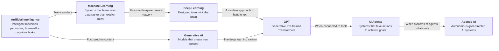
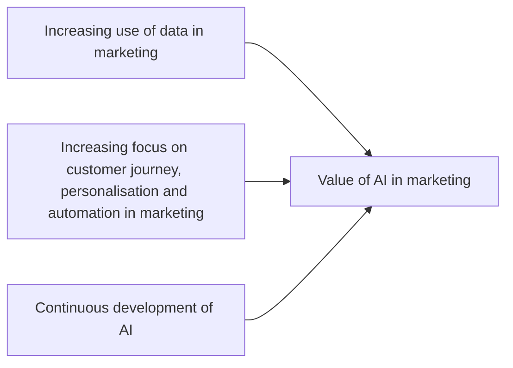

# Literature Review

## The historical impact of AI

To understand how modern AI including AI agents and agentic AI might affect marketing. It is good to investigate how AI has developed, and how previous forms have affected the marketing domain.

The term Artificial Intelligence (AI) has been around since the 1950s to describe "intelligent machines", it is often associated with systems that performs tasks that are typically associated with human cognition. AI can be broudly be categorised into two categories:

1. **Expert systems**: Where rules and heuristics written by humans define the output of the system. An example of this is early game AI
2. **Machine learning**: Where data is user to train a model.

Both expert systems and different forms of machine learning are prevalent in marketing. Marketeers develop expert systems by creating rule based segmentations in marketing tools, defining scenarios in which marketing activations like emails have to be send and more. Machine learning might be used by marketeers to do A/B testing to do converstion rate optimisation, to make product recommendations, or even to make calculations to assess the impact of marketing activities like juxtaposing the Customer Lifetime Value (CLV) with the Customer Acquisition Costs (CAC).

Deep learning is a specific form of machine learning that uses neural networks consisting of multiple layers. Training a deep learning model requires tons of data and compute. This has created a situation where it has only become prevalent after AlexNet even though the concept has been around since 1958. Probably the best known early applications of deep learning in marketing revolve around chatbots. After word2vec (2014), which gave a numerical representation of words, it became possible to match user questions to question-and-answer sets that were explicitly collected. This gave rise to early chatbots which could answer FAQ questions.

## The rise of the LLM

To give a brief overview of the academic progress after word2vec, we had recurrent-neural-networks and Long Short Term Memory (LSTM) to create AI systems that could retain context while processing text. But the real breakthrough came with the paper "attention is all you need" (2016), which introduced the Tranformer model (the T in GPT). Training these systems became very expensive, and pretrained models became more prevalent. One of the best know models from before ChatGPT was Bert (2018), this model was often applied to categorise text or apply sentiment analysis. Within the realm of marketing this was highly valuable to analyse customer support conversations, or product revieuws.

While Google developed the transormer model and released the leading model with Bert at the time. OpenAI worked toward increasingly larger models, starting with GPT1 in (2017) to GPT3 (2020) and ChatGPT (2022). At that point the general public became more aware of these developments.

GPT is a technically descriptive name, it stands for generative pretrained transformer, Models like Bert also adhere to that description. Another key element here the term "pretrained", the fact that modern LLMs are pre-trained drastically changes the economic model. Rather than requiring vast amounts of data and having to recoup the cost of training, organisations can now directly start experimenting with the application of models. This shift from up-front-costs to per-use costs makes AI much more applicable for small-scale usecases and quick experimentation.

*[Maybe note stable diffussion, etc. too?]*

## The impact of ChatGPT

ChatGPT was the introduction of AI to the broader public as a simple question and answer machine. ChatGPT could generate text based on the users input this, in addition to the earlier release of stable diffusion and other imaging models, made the public keenly aware of the potential for AI to answer questions and create content.

Where the pre-transformer chatbots typically required redefined question and answer combinations to work effectively, ChatGPT was able to answer any question. This made it applicable to a much wider range of usecases.

Marketeers started using the image generation to make better briefings for design department, and used the text systems to write better copy, be a brainstroming partner for the creative process and much more.

## The move to Agentic

Just before the release of ChatGPT, the concept of Retreival Augmented Generation (RAG) was introduced [@lewis2020retrieval]. This was immediately relevant for business to get more information into the context of the model. This could be either be context specific to the business or project, but could also be publically available information that was specifically relevant to the prompt that was posed to the AI.

RAG was a first step to get the AI-system to perform actions rather than just generating content. Since 2020 many innovations enabled AI to perform actions. Actions are outcomes that are utilise or effect systems outside of the AI systems. The means of performing the actions is a tool, i.e. a system that AI can talk to to affect an action. Issues that were tackled in the process included when to call a tool, how to decide what tool to call, and how to handle structured input and output, which is often required for deterministic tools.

The development of toolcalling accelerated in 2023 was a pivotal year when it came to toolcalling; the ReAct framework was released and OpenAI's introduced function-calling. This enabled the construction of purpose build software that uses tools. Later in november 2024 Anthropic introduced the MCP interface, this made AI tools portable. This also made it possible for organisations that build SaaS systems, to provide a portable tool (by implementing it as an MCP) that could be used and integrated by multiple AI systems. This really accelerated the business potential for AI agents.

Toolcalling is the foundation for both AI agents and Agentic AI. And allows for AI to perform a much broader set of activities. Nowadays AI is capable of setting goals, planning to achieve these goals, and performing the steps of the plan. This includes retrying and changing the plan when hurdles or unexpected input are found.

This allows AI to not only be usable for content generation and 

# Marketing context

## Learnings from earlier waves of digital transformation

### Recent evidence on AI value in marketing (via Consensus MCP)

Recent studies suggest that AI value in marketing appears in two main outcome groups: operational productivity and customer experience quality.

On productivity, exploratory and practice-oriented work reports gains in content production, campaign execution, and decision support when AI tools are used in well-defined workflows. For example, a case-based study on small marketing teams reports stronger productivity gains where teams combine capable tools with higher AI literacy [@steg2024smallteams]. Broader conceptual work in top marketing journals also frames GenAI as a structural shift in how firms execute innovation and marketing processes [@mariani2024genai].

On customer experience, chatbot and virtual-agent literature indicates that perceived quality is strongly mediated by concrete interaction factors (e.g., relevance, transparency, responsiveness, readability), which then affect satisfaction and downstream behaviors [@aladwani2022virtual; @cranjanu2022hci].

For this thesis, these findings support two working assumptions: (1) AI impact in marketing is contingent on organisational capability (skills, process fit, governance), and (2) "agentic" value is likely to depend on execution quality in tool-mediated interactions, not just model intelligence.

## Definitions:

### Flow of AI

AI

Machine Learning

- Different forms of analytics (descriptive, prescriptive, and predictive?)

Deep learning

GenAI

- GenAI nowadays is pretrained (Generative Pretrained Transformer) while it can "learn" live this is mainly it's context updating with new insights, not updating the underlying network

AI Agents [link](https://consensus.app/search/ai-agent-actions-explained/0dYzKe-wS863mdiRMQoxeQ/?utm_source=share&utm_medium=clipboard)

Analysis counts as an action

Agentic AI [link](https://consensus.app/search/define-agentic-ai/e8ZzdGLBQo6eiWVZW_mSDw/?utm_source=share&utm_medium=clipboard)

### Value

- Pyramid of value (Harvard Business review paper)
- Arch g. Woodside et al.
  - $\text{Value} = \frac{\text{relative sum of weighted benefits perceived}}{\text{relative total cost perceived}}$
  - $\text{Value} = \text{relative sum of weighted benefits perceived} - \text{relative total cost perceived}$
  - ... (more in paper, including which to use when)
  - "most customers will set a minimum level of total bennefit ... cost savings"... (makes me think of satisfisers and maximisers.)
  - "Discontinuous innovations..."
  - Fig. 7 is interesting (input to customer value assessment)
  - Total cost of ownership (Acquisition, use, and disposal of a good or service over the lifetime of the purchase)
- Curious what behavioral economics would say about Woodside's approach, it seems to give too much authority to the user.

## Contribution

We strive contribute by...

## Is it really relevant

- AI driven "synthetic teams"

## Potentially interesting

- Decrease in entry level jobs
  - This might result in lack of pipeline of junior employees, and therefore senior employees in the future.
- Before transformer models, most ML models were not pretrained, this drastically affects the potential for addoption in low-cost scenarios
