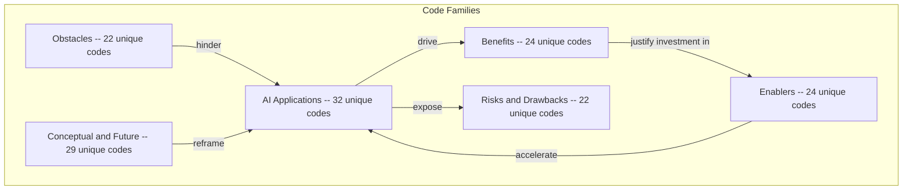
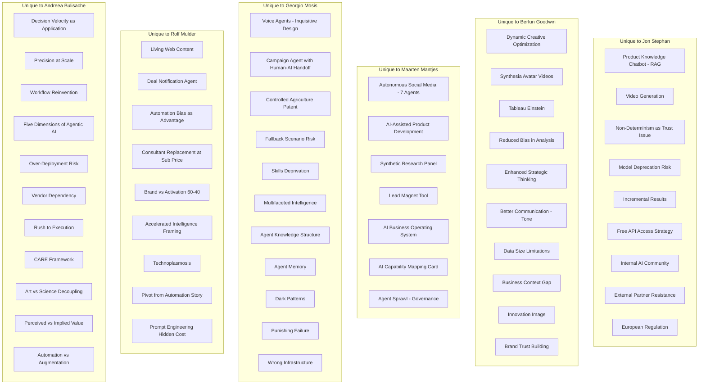
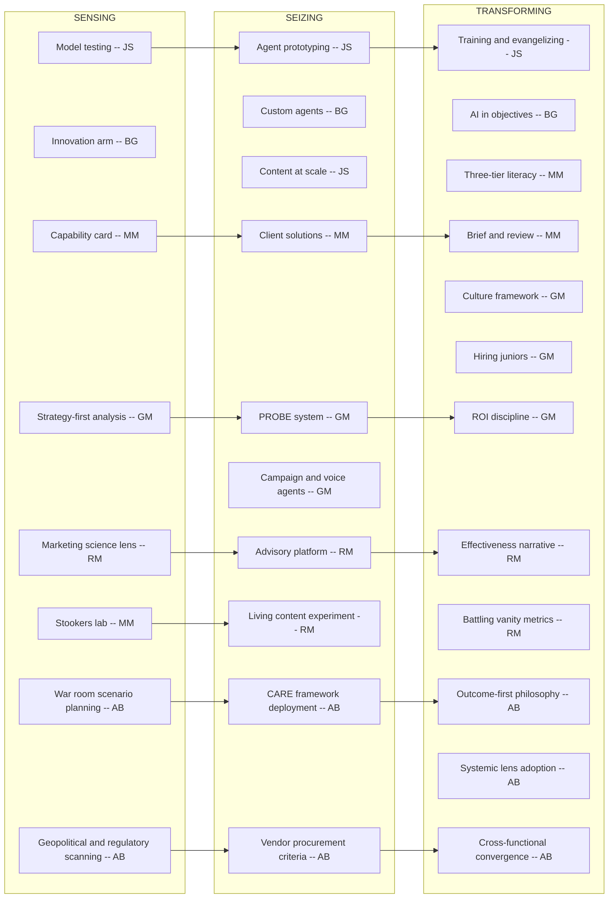

# Cross-Case Code Alignment

**Transcripts Analysed:** Berfun Goodwin (Feb 11), Jon Stephan (Feb 13), Maarten Mantjes (Feb 16), Georgio Mosis (Feb 17), Rolf Mulder (Feb 19), Andreea Bulisache (Feb 20)  
**Organizations:** Merck KGaA (BG, JS); The Only Consultant + Stookers (MM); Consulting firm — pensions/DT (GM); Instant Crush (RM); Independent AI governance advisory (AB)  
**Perspectives:** In-house leader (BG), in-house AI specialist (JS), marketing transformation consultant (MM), DT/AI consultant (GM), startup founder (RM), board-level AI governance advisor (AB)  
**Note:** Six interviews across five organizations. Two in-house practitioners, two consultants, one startup founder, one governance advisor. Andreea adds the first pure governance perspective — focusing on how organizations should approach AI, not what to build. Her CARE framework and outcome-vs-output distinction complement the practice-level observations from earlier participants.

---

## 1. Overview of Code Categories

---

## 2. Converging Codes (Shared Across Multiple Interviews)

### Legend

- **JS** = Jon Stephan | **BG** = Berfun Goodwin | **MM** = Maarten Mantjes | **GM** = Georgio Mosis | **RM** = Rolf Mulder | **AB** = Andreea Bulisache

### 2.1 Converging Applications

| Theme | JS | BG | MM | GM | RM | AB | # | Emerging Insight |
|---|---|---|---|---|---|---|---|---|
| **Content Generation at Scale** | 300K product ads in 1 week | AI-generated copy with approval | Automated recruitment posts (Randstad); autonomous social (Stookers) | Recruitment agent (JD→LinkedIn→ranking) | 1,000 automated web pages; living web content | N/A (acknowledges as baseline) | 5/6 | Universal entry point. RM adds nuance: works for standardized bottom-funnel content but fails for creative/brand. |
| **AI Image Generation** | Gemini Nano Banana for lab imagery | AI product imagery for ecommerce | Seasonal/time-of-day cabin variants (Landal) | N/A | N/A | N/A | 3/6 | Fills business bottlenecks at scale. Absent from advisory/governance/startup perspectives focused on strategy. |
| **Content/Brand Evaluation** | Agentic workflow rating images for safety | Brand guidelines assistant | 7-agent inter-agent evaluation | CRM evaluation agent checking data currency | N/A | AB's "oversight" concept is adjacent but framed as org capability | 4/6 | Evaluation as agentic pattern confirmed across four. Moves AI beyond generation into judgment and decision-making. MM's agent-to-agent QC is the most autonomous form. |
| **Data / Analytics / Market Intelligence** | Data agent replacing data scientist | Complex analytics via Claude; pricing agent | Data activation across dashboards | PROBE multi-agent market research | AI-powered competitive analysis; marketing advisory platform with roadmap | AB frames as "decision velocity" — faster decisions, not faster content | **6/6** | **Strongest convergence.** Every participant engages with this. Progression: data agent (JS) → complex analytics (BG) → data activation (MM) → PROBE multi-agent (GM) → strategic advisory (RM) → decision velocity framing (AB). |
| **Campaign / Customer Orchestration** | N/A | N/A | N/A | Campaign agent with CRM eval + human-AI handoff | N/A | "Precision at scale" + "workflow reinvention" (conceptual frameworks) | 2/6 | GM has implemented; AB provides the theoretical frame. Growing theme — still underrepresented in practice. |
| **Voice / Conversational Agents** | N/A | N/A | N/A | Inquisitive voice agents; proactive calling | N/A | N/A | 1/6 | Georgio only. Novel modality — inquisitive design (ask, don't tell) to reduce errors. |

### 2.2 Converging Benefits

| Theme | JS | BG | MM | GM | RM | AB | # | Emerging Insight |
|---|---|---|---|---|---|---|---|---|
| **Speed / Efficiency** | 1 year → 1 week for 300K ads | 1 week → 2 hours for analytics | "Dominant primary benefit" across clients | Bottom line efficiency: same output, fewer resources | Acknowledges cost reduction but argues it's not the key value driver | Reframes as "decision velocity" — distinct from creation velocity | **6/6** | Universally cited but **increasingly contested.** MM warns of "moving radio"; GM demands ROI; RM argues marketing has an effectiveness problem; AB distinguishes decision velocity from creation velocity. |
| **Scale Without Headcount** | Expanded ads with saved budget | Team of 11 does more | Puk: 2x growth without 2x people | Recruitment firm: entire process handled by agents | Consultant-quality insights at subscription price (€120/hr → subscription) | N/A | 5/6 | Confirmed. RM reframes as "democratizing consultant-grade strategy." GM adds uncomfortable corollary: sometimes means firing people (Malaysia case). |
| **Skill Democratization** | Non-SQL marketers query data | AI enhances SQL skills; marketer becomes data engineer | Anyone can create assets; sales reps get automated research | Junior capabilities available to seniors via agents | AI gives strategic direction to non-expert marketers | N/A | 5/6 | Five modes: replacing skill (JS), augmenting (BG), eliminating need (MM), inverting pyramid (GM), providing strategy to non-strategists (RM). |
| **Quality / Decision Quality** | Better conversion rates from targeted content | Reduced error in analysis | N/A | Quality of outcome — especially healthcare (patient satisfaction, diagnostic accuracy) | Focus and direction as quality of decision-making | "Informed decisions" — boards can justify to auditors; "clarity of direction" | 5/6 | **Strengthened.** Quality now spans output quality (JS, BG), outcome quality (GM), decision quality (RM), and governance quality (AB). |
| **Strategic Focus and Direction** | N/A | N/A | N/A | N/A | Primary value: "they find it relaxing to know what to do tomorrow" | "Clarity of Direction. If you don't have, it's hard to act" | 2/6 | Converging from two angles: founder product (RM) and board advisor (AB). Not efficiency but knowing what to do. |
| **Business Transformation** | N/A | N/A | N/A | N/A | N/A | Redesigning org structure; rethinking human-agent coexistence; evolutionary road maps | 1/6 | AB only. Beyond operational benefits into organizational redesign. |
| **Automation Bias as Advantage** | N/A | N/A | N/A | N/A | "I say the same thing with my machine. And then it's the truth" | N/A | 1/6 | RM only. Double-edged — also a risk. |

### 2.3 Converging Risks

| Theme | JS | BG | MM | GM | RM | AB | # | Emerging Insight |
|---|---|---|---|---|---|---|---|---|
| **Hallucination / Output Risk** | "Free shipping" headline | "AI hallucinates and makes stuff up" | McDonald's/IKEA brand misalignment | Unrealistic expectations → disappointment | Output inconsistency (7th vs 8th ranking); automation bias risk | N/A (scope is governance) | 5/6 | Every practitioner acknowledges. Risk spectrum: factual errors (JS), generic (BG), brand misunderstanding (MM), expectation mismatch (GM), inconsistency (RM). |
| **Job Impact** | "Insane fear" in the corporation | Job modification of tactical roles | Junior pipeline erosion: "no new non-juniors" | "Fired half the people" in Malaysia; "agents are the new interns"; skills deprivation | N/A (concern is talent scarcity, not job loss) | N/A | 4/6 | **Strongest risk convergence.** Four perspectives: fear (JS), modification (BG), pipeline erosion (MM), direct displacement + skills atrophy (GM). GM's Malaysia case is the only concrete displacement example. |
| **Capability Blurring Risks** | N/A | Misrepresentation of skills: "pretend being super smart" | Uninformed opinions "on steroids"; beautifully written terrible briefings | AI credibility stigma: "doping in a relay" | N/A | N/A | 3/6 | Two sides: some fake competence with AI (BG, MM), others are punished for genuine AI competence (GM). |
| **AI Falls Short for Creative/Brand Content** | N/A | N/A | Race to mediocrity; brand blind spot (McDonald's, IKEA) | N/A | "AI still falls very very short" for on-brand emotional content; works only for bottom-funnel | AB's "art vs. science" is adjacent: art portion resists AI | 2/6 | MM observed as market pattern; RM lived it through his pivot. AI content works for activation but not brand building. |
| **AI Hype / Overpromising** | N/A | N/A | N/A | Unrealistic expectations from market | "AI is being overpromised all the time"; agencies over-promise | Executives want "innovation sessions" but are short-sighted; AI strategy defaults to vendor's pitch | 3/6 | **Strengthened.** AB adds "vendor dependency" — strategy shaped by Microsoft/IBM rather than actual needs. |
| **Over-Deployment / Technology Excess** | N/A | N/A | N/A | N/A | N/A | "Too much technology if not well integrated leads to inefficiency" | 1/6 | AB only. Governance-specific: the risk of having too much, not too little, technology. |
| **Rush to Execution** | N/A | N/A | N/A | N/A | N/A | Jumping to tools without clarity/awareness/readiness | 1/6 | AB only. Most executives want to start at execution. |
| **Prompt Engineering Cost** | N/A | N/A | N/A | N/A | Prompts 3-4 pages long; took months to get fast | N/A | 1/6 | RM only. Hidden cost of production-quality AI. |

### 2.4 Converging Enablers

| Theme | JS | BG | MM | GM | RM | AB | # | Emerging Insight |
|---|---|---|---|---|---|---|---|---|
| **Leadership / Board Champion** | Manager gave full autonomy | Leadership cascades AI goals | N/A | Board champion is #1 tailwind; must be board-level | N/A | Fiduciary confidence: leaders must justify AI decisions to shareholders | 4/6 | Ranges from supportive manager (JS) to top-down goal-setting (BG) to board-level decision (GM) to fiduciary responsibility (AB). |
| **Personal Drive** | Obsessed since ChatGPT; evangelizes via training | Intrinsically motivated: "makes life easier" | Gin brand as personal AI laboratory | AI researcher since 1997; patent holder; teaches at two universities | Pivoted entire company around AI conviction | Drive is institutional (governance reform) rather than personal (tool use) | **6/6** | Six archetypes: evangelist (JS), pragmatist (BG), entrepreneur (MM), scientist (GM), founder-operator (RM), governance architect (AB). |
| **Process Understanding** | Distinguishes workflow from agentic | Team as "innovation arm" | "Marketing is a collection of processes"; brief & review as core capabilities | Strategy-first: examines workflows before building; PROBE as structured process | N/A (product provides the process lens) | Systems thinking; "workflows must be explicit"; art-science decoupling | 5/6 | Process thinking as prerequisite confirmed by both consultants (MM, GM), one builder (JS), and the governance advisor (AB). RM's product externalizes process understanding. |
| **Training / Education** | Trains coworkers on agents | Company organized agent-building trainings | Three-tier AI literacy (leadership/management/floor) | "Prompting is really different than just Googling" | N/A | War room scenario planning; education before adoption; building blocks of AI for non-technical decision-makers | 5/6 | Two dimensions: technical training (how to prompt/build) and organizational education (what AI means for the business). AB's approach is the most structured. |
| **Culture of Innovation** | N/A | N/A | Starting from pain points; celebrating failure | Speed + experimental axes; celebrating failure; quick wins | N/A | N/A | 2/6 | Both consultants independently emphasize. GM provides the explicit framework: speed (fast/slow) × approach (planned/experimental). |
| **Paid AI Tools / Investment** | Free API access from corporate | Company-sanctioned internal GPT | N/A | "Paid version moves you one year ahead" | N/A | N/A | 3/6 | Organizations that only provide free-tier AI handicap adoption. |
| **Outcome-First Thinking** | N/A | N/A | N/A | N/A | "Effectiveness vs efficiency" — do the right things | "Start from outcome, not output"; outcome ≠ output | 2/6 | **New convergence.** Same insight from two angles: start from what you want to achieve (AB) / focus on doing the right things, not faster (RM). |
| **Definition of Good** | N/A | N/A | "Quality definition gap" — quality poorly defined | N/A | N/A | "What does good look like from AI standpoint AND company perspective" | 2/6 | **New convergence.** Without explicit success criteria, AI adoption drifts. |
| **Narrow Solution Focus** | N/A | N/A | N/A | N/A | "Narrow down your place as a solution" — being too broad leads to disappointment | N/A | 1/6 | RM only. Key lesson from his pivot. |
| **Expectation Management** | N/A | N/A | N/A | N/A | "We have to reduce expectations — AI is oversold" | N/A | 1/6 | RM only. Distinct enabler: actively managing what AI will/won't deliver. |
| **Marketing Science Literacy** | N/A | N/A | N/A | N/A | "<30% of people in marketing have studied marketing" | N/A | 1/6 | RM only. Understanding how marketing actually works is prerequisite for applying AI meaningfully. |
| **CARE Framework** | N/A | N/A | N/A | N/A | N/A | Clarity → Awareness → Readiness → Execution | 1/6 | AB only. Maturity model mapping to dynamic capabilities. |

### 2.5 Converging Obstacles

| Theme | JS | BG | MM | GM | RM | AB | # | Emerging Insight |
|---|---|---|---|---|---|---|---|---|
| **Human Resistance / Fear** | Team stuck on basic use; external partners anti-AI | Groups afraid of irrelevance | Hallucination used as excuse not to start | Board-level fear policies; geopolitical anxiety | N/A (customers want AI; issue is capability) | N/A | 4/6 | Resistance at every level: individual (JS), departmental (BG), organizational (MM), board (GM). |
| **Organizational Friction** | Corporate politics, silos, credit attribution | Approval processes too slow for AI speed | Poor process definition; regulation pendulum; middle management gap | Wrong infrastructure; punishing failure | SaaS platform lock-in / slow innovation | Implicit workflows; solution-before-problem; automation-vs-augmentation gap | **6/6** | **Strongest obstacle convergence.** Every participant encounters structural friction, but manifestations differ: in-house sees speed mismatches (JS, BG); consultants see structural issues (MM, GM); founder sees platform lock-in (RM); governance advisor sees process deficits (AB). |
| **Generational / Adoption Clash** | Uneven adoption across team | N/A | N/A | Inverted knowledge pyramid; young people blocked by seniors | Developer resistance to AI-first working | N/A | 3/6 | Young people have AI skills but not power; seniors have power but resist. RM confirms it extends to technical staff too. |
| **Marketing Lacks Process Orientation** | N/A | N/A | "Marketing is not seen as a collection of processes" | N/A | "Marketers are not process-oriented" | "They find comfort in complicated processes" — marketing professionals resist standardization | 3/6 | **Strengthened.** Three independent voices confirm marketing's process deficit as a fundamental obstacle to AI adoption. AB adds the insight that marketers conflate "complicated" (gives them value) with "complex" (which could be mapped). |
| **Executive Understanding Gap** | N/A | "They don't know what they're talking about" | N/A | Inverted knowledge pyramid | N/A | "Comfort does not reflect understanding" — executives converse about AI but don't truly understand it | 3/6 | **Strengthened.** Three voices: BG from in-house experience, GM from consulting, AB from board governance. AB adds fiduciary dimension: boards can't justify decisions about things they don't understand. |
| **Marketing Data Illiteracy** | N/A | N/A | N/A | N/A | "Marketers are data illiterate; data people don't understand marketing" | N/A | 1/6 | RM only. The bridging problem between two separate worlds. |
| **Talent Shortage** | N/A | N/A | N/A | N/A | "The talent pool in analytics is so small" | N/A | 1/6 | RM only. Specific to the intersection of marketing + data + AI. |

---

## 3. Diverging Codes (Unique to One Interview)

### Key Observations on Divergence

| Observation | Explanation |
|---|---|
| **Rolf and Andreea contribute the most unique codes** | RM (9 unique) and AB (11 unique) reflect their distinct worldviews: RM challenges the efficiency narrative with marketing science; AB provides governance meta-frameworks. |
| **Jon's unique codes are technical/operational** | RAG chatbots, video generation, model deprecation — reflecting his builder/implementer role. |
| **Berfun's unique codes are personal-productivity focused** | Communication improvement, strategic thinking, reduced bias — reflecting individual user experience. |
| **Maarten's unique codes are system-building oriented** | Autonomous social media, synthetic panels, business OS — reflecting his entrepreneurial experiments. |
| **Georgio's unique codes span technical and human risks** | Fallback scenarios, skills deprivation, dark patterns — reflecting regulated-industry and academic background. |
| **Andreea's unique codes are all meta-level** | CARE, five dimensions, automation vs. augmentation — none are use cases, all are frameworks for thinking about AI. This is distinct from every other participant. |
| **Previously divergent codes continue to converge** | "Faster horse" (RM) echoes "moving radio" (MM). "AI hype" (RM) echoes "unrealistic expectations" (GM). "Process deficit" now at 3/6 (MM, RM, AB). "Executive understanding gap" now at 3/6 (BG, GM, AB). |

---

## 4. Emerging Higher-Order Themes

Eleven themes. Status updated with interview 6.

```mermaid
graph TD
    T1["THEME 1: Analytics as Gateway -- 6/6"]
    T2["THEME 2: Scale Unlocks Value -- 5/6"]
    T3["THEME 3: Governance as Enabler -- 5/6"]
    T4["THEME 4: Champion-Driven Adoption -- 6/6"]
    T5["THEME 5: Org Structures Lag -- 6/6"]
    T6["THEME 6: Role Boundary Blurring -- 3/6"]
    T7["THEME 7: Mediocrity vs Innovation -- 3/6"]
    T8["THEME 8: Commoditization -- 2/6"]
    T9["THEME 9: ROI as Gatekeeper -- 3/6"]
    T10["THEME 10: Effectiveness vs Efficiency -- 3/6"]
    T11["THEME 11: Outcome Before Output -- 2/6, NEW"]

    T1 --- T1a["All 6 engage with analytics. Progression: data agent to strategic advisory to decision velocity"]
    T2 --- T2a["300K ads, 140 parks, 1000 pages, recruitment pipelines, consultant as subscription"]
    T3 --- T3a["Sanctioned tools build trust. But fear policies, pendulums, and vendor dependency destroy it"]
    T4 --- T4a["Six archetypes: evangelist, pragmatist, entrepreneur, scientist, founder, governance architect"]
    T5 --- T5a["Politics, processes, infrastructure, platform lock-in, developer resistance, implicit workflows"]
    T6 --- T6a["Skills democratize but understanding may not. AI stigma punishes those who adapt"]
    T7 --- T7a["Moving radio and faster horse: same things faster not new. Now 3 voices"]
    T8 --- T8a["If everyone can do it your advantage disappears"]
    T9 --- T9a["Without ROI projects die. But ROI thinking may limit brand building"]
    T10 --- T10a["Marketing has effectiveness problem not efficiency. Outcome not output. Moving radio not innovation"]
    T11 --- T11a["Define outcome before optimizing output. CARE as sequencing. Brief and review as human anchor"]
```

### Theme 1: Analytics and Market Intelligence as Gateway to Agentic AI

All six participants build, use, or advocate for AI in analytics/intelligence. The progression deepens with each interview: data agent (JS) → complex analytics (BG) → data activation (MM) → PROBE multi-agent (GM) → strategic advisory platform (RM) → "decision velocity" framing (AB). AB's contribution reframes analytics from "faster data processing" to "faster, better-informed strategic decisions."

**Strength:** 6/6. Approaching saturation.

### Theme 2: Scale Unlocks Value That Manual Cannot Reach

Stable at 5/6. AB doesn't address scale directly — her scope is governance and organizational readiness, not operational output.

### Theme 3: Governance as Enabler, Not Just Constraint

**Strengthened to 5/6.** AB provides the most developed governance framework: CARE model, war room sessions, vendor procurement criteria, fiduciary responsibility, and scenario planning. Her contribution elevates governance from "compliance frameworks that build trust" (BG, JS) to "the precondition for informed decision-making." The tension remains: governance enables (BG, JS, AB) but can also destroy adoption when it becomes fear-driven (GM, MM).

**Supporting codes:** `ENABLER:HUMAN-IN-LOOP` (JS), `ENABLER:SANCTIONED-TOOLS` (BG), `ENABLER:CARE-FRAMEWORK` (AB), `ENABLER:EDUCATION-FIRST` (AB), `OBSTACLE:REGULATION-PENDULUM` (MM), `OBSTACLE:BOARD-FEAR` (GM)

### Theme 4: Champion-Driven Adoption

**6/6.** Six archetypes:
- **Evangelist** (JS): Mission-driven, trains others, shares credit
- **Pragmatist** (BG): Efficiency-driven, uses AI because it works better
- **Entrepreneur** (MM): Experiment-driven, uses personal ventures as labs
- **Scientist** (GM): Research-driven, publishes, patents, teaches
- **Founder-Operator** (RM): Conviction-driven, pivoted company around AI
- **Governance Architect** (AB): Institution-driven, builds frameworks that enable others

### Theme 5: Organizational Structures Lag Behind AI Speed

**6/6.** Now with seven distinct manifestations: politics/silos (JS), slow approvals (BG), poor process definition and middle management gap (MM), board fear policies and punishing failure (GM), platform lock-in and developer resistance (RM), and implicit workflows, solution-before-problem, and automation-vs-augmentation gap (AB).

### Theme 6: Blurring of Role Boundaries

Stable at 3/6 (BG, MM, GM).

### Theme 7: Race to Mediocrity vs. True Innovation

Stable at 3/6 (MM, GM, RM). Three independent voices: "moving radio" (MM), "don't do old things with new tools" (GM), "faster horse" + pivot from automated content (RM). RM provides the most concrete evidence through his company's pivot.

### Theme 8: Competitive Urgency and Commoditization

Stable at 2/6. Primarily MM, with partial support from RM.

### Theme 9: ROI as the Ultimate Gatekeeper

Stable at 3/6. GM insists ROI justifies all AI investment. RM argues ROI thinking limits brand building. JS has measured ROAS uplift. The tension between "ROI is essential" and "ROI is counterproductive for long-term marketing" remains unresolved.

### Theme 10: Effectiveness vs. Efficiency (Strengthened)

Now supported by three voices from very different angles:
- **RM** (founder): Marketing has an effectiveness problem, not an efficiency problem. Quality of marketing has dropped for 20 years because non-specialists took over.
- **AB** (governance): Start from outcome, not output. If you treat AI as technology, you measure in licenses. If systemic, you rethink go-to-market.
- **MM** (consultant): "Moving radio" — doing the same things faster, not fundamentally new things.

The convergence of a founder, a governance advisor, and a transformation consultant on this theme — from completely different directions — significantly strengthens it as a potential core finding.

### Theme 11: Outcome Before Output (NEW with interview 6)

Andreea's outcome-vs-output distinction provides a structural framework for the effectiveness theme. Most organizations optimize outputs (what AI produces from current data). Few define outcomes (what business result they want). The gap between output and outcome is where the real value lies — and where most organizations fail to look.

This theme connects to:
- **CARE framework** (AB): Clarity (define outcome) before Execution (generate outputs)
- **Strategic focus** (RM): Knowing what to do, not just doing things faster
- **Brief & review** (MM): Brief = define what you want; review = check if you got the outcome
- **ROI gatekeeper** (GM): ROI should measure outcomes, not outputs

**Strength:** AB + RM (2/6), with structural support from MM and GM.

---

## 5. Dynamic Capabilities Framework Alignment

### Observations

- **Sensing varies by role:** JS senses through rapid model testing; BG through her innovation arm mandate; MM through cross-client consulting and personal experimentation; GM through strategy-first workflow analysis; RM through marketing science frameworks; AB through geopolitical/regulatory/energy scenario scanning. The breadth of sensing increases as the role moves from practitioner to advisor.
- **Seizing reflects organizational context:** In-house participants seize within their organizations (agents, workflows). MM seizes by building client solutions. GM seizes by building multi-agent systems. RM seizes by building a product. AB seizes by deploying structured frameworks — a fundamentally different mode.
- **Transforming shows two modes:** Practitioners transform by changing what organizations do (JS: training, BG: goal-setting, MM: literacy programs, GM: culture and hiring). Advisors transform by changing how organizations think (RM: effectiveness narrative, AB: outcome-first philosophy, systemic lens). Both modes are necessary.
- **The transformation gap persists:** Despite richer transformation language with each interview, all participants note their clients/organizations are "not there yet." The transformation vision exists but execution is nascent everywhere.

---

## 6. Suggested Probes for Future Interviews

### Validate Strong Themes (6/6 convergence)
1. Is analytics/intelligence universally the strongest AI use case? (Confirmed across all 6.)
2. Does every organization have a champion? Which archetype is most effective?
3. Do all organizations experience structural lag? Which specific frictions matter most?

### Test Growing Themes (3-5/6 convergence)
4. Is the "outcome before output" framing recognized by in-house practitioners, or only by advisors?
5. Does the CARE sequence (clarity → awareness → readiness → execution) resonate with marketing managers?
6. Is "marketing lacks process orientation" (3/6) a universal obstacle, or specific to certain org types?
7. Is the "executive understanding gap" (3/6) more severe for AI than for previous technology waves?

### Explore Gaps
8. **Customer touchpoints:** Still weak. Where does agentic AI touch the customer directly?
9. **Campaign orchestration:** Only GM has implemented. Is it coming, or is it structurally blocked?
10. Do in-house practitioners see the "outcome vs. output" distinction?
11. What fallback scenarios do organizations have when AI systems fail? (Only GM raised this.)

### Context Diversification
12. How do patterns differ in B2C vs. B2B marketing?
13. What do these themes look like without a dedicated AI champion?
14. How does company size affect obstacles?
15. Agency-side perspective still missing from the sample.

---

## 7. Code Frequency Summary

| Code Category | JS | BG | MM | GM | RM | AB | Shared (2+) |
|---|---|---|---|---|---|---|---|
| AI Applications | 7 | 9 | 8 | 5 | 6 | 4 | 5 themes across 3-6 |
| Benefits | 5 | 9 | 5 | 4 | 5 | 5 | 5 themes across 3-6 |
| Risks / Drawbacks | 5 | 4 | 6 | 6 | 5 | 4 | 3 themes across 4-6 |
| Enablers | 5 | 5 | 4 | 6 | 4 | 6 | 5 themes across 3-6 |
| Obstacles | 4 | 5 | 6 | 6 | 5 | 5 | 4 themes across 3-6 |
| Conceptual / Future | 3 | 4 | 5 | 6 | 6 | 7 | 3 themes across 3+ |
| **Total unique codes** | **29** | **36** | **34** | **33** | **31** | **31** | **25 converging themes** |

### Notes on Distribution

- **Convergence continues strengthening:** 25 converging themes (from 21 with 5 interviews). Marginal convergence remains positive, but the rate is slowing — suggesting core patterns are stabilizing.
- **Three themes at 6/6:** Analytics as gateway, champion-driven adoption (now with 6 archetypes), and organizational structures lag. These are approaching saturation.
- **Andreea contributes the most conceptual codes (7) and enabler codes (tied with GM at 6).** Her governance perspective generates meta-level framing that complements but does not replace the practice-level observations from other participants.
- **The effectiveness-efficiency tension is the most analytically rich theme.** Supported by RM (founder), AB (governance), and MM (consultant) from three completely different angles. The convergence of "outcome before output" (AB) with "effectiveness not efficiency" (RM) and "moving radio" (MM) may be the thesis's strongest original contribution.
- **Analytics/intelligence is the rock-solid convergence:** 6/6 interviews, deepening each time. The progression from data agent (JS) → complex analytics (BG) → data activation (MM) → PROBE multi-agent (GM) → strategic advisory (RM) → decision velocity (AB) suggests a maturity curve in how AI analytics creates value.
- **The sample's biggest gap remains in-house diversity:** Four of six participants are external (MM, GM, RM, AB). Only BG and JS are in-house — and from the same organization. Future interviews should strongly prioritize in-house marketing practitioners from different organizations.
