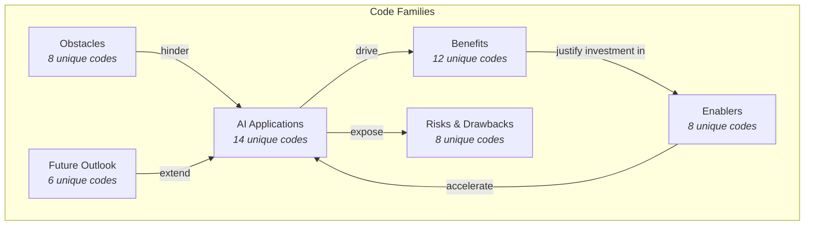
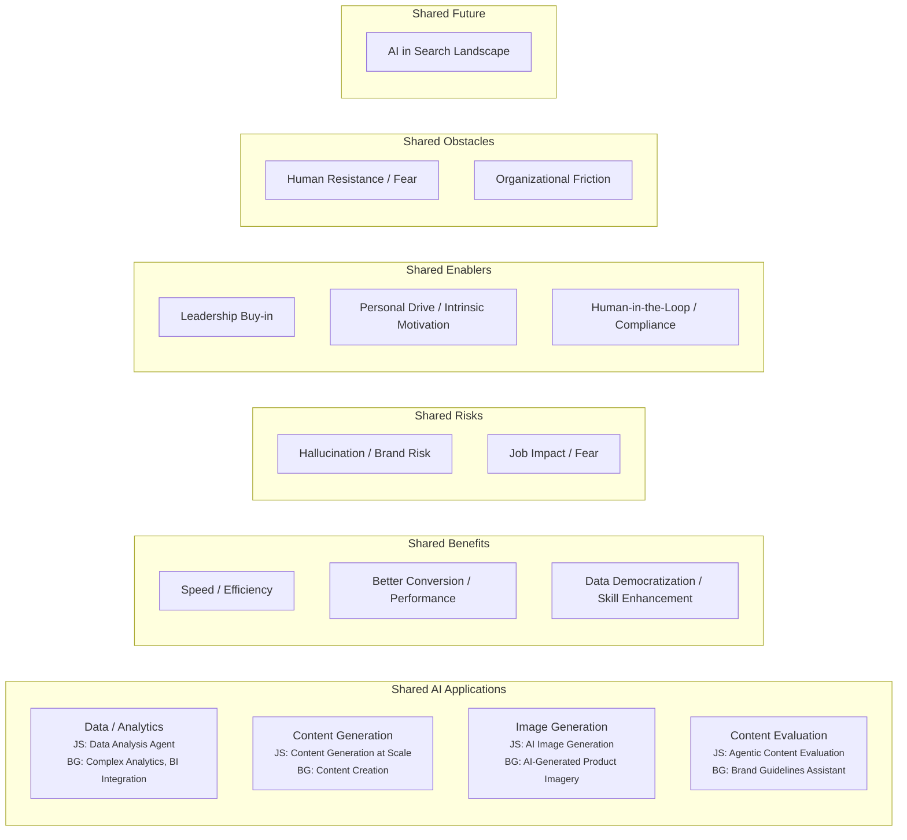
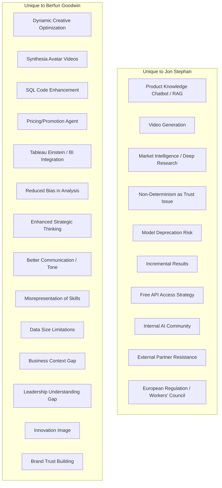
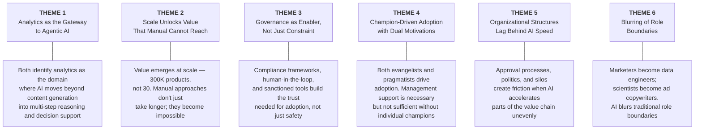
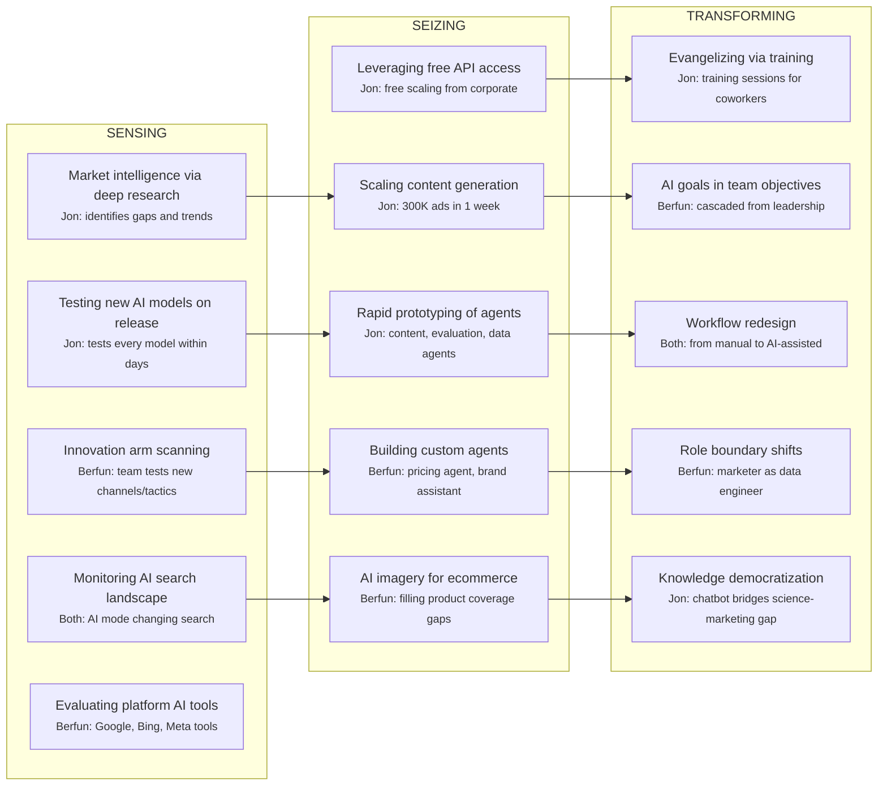

# Cross-Case Code Alignment

**Transcripts Analysed:** Jon Stephan (Feb 13), Berfun Goodwin (Feb 11)  
**Organization:** Both from Merck KGaA / MilliporeSigma (same organization, different roles)  
**Note:** Both participants are from the same organization, which strengthens internal consistency but limits generalizability at this stage. Future interviews with other organizations will be essential to validate or challenge these emerging patterns.

---

## 1. Overview of Code Categories

The following high-level categories emerged across both interviews. The diagram below shows the six primary code families and the number of unique codes identified in each.

---

## 2. Converging Codes (Shared Across Both Interviews)

The following codes appeared in both interviews, suggesting emerging patterns that may generalize beyond a single perspective.

### 2.1 Converging Applications

| Theme | Jon Stephan | Berfun Goodwin | Emerging Insight |
|---|---|---|---|
| **AI-Powered Analytics** | Data agent replaces data scientist for ad hoc queries; enables non-SQL marketers | Complex analytics via Claude; AI improves SQL code; pricing/promotion agent | Analytics emerges as the highest-value agentic use case. Both see it as the domain where AI moves beyond generative into decision support. |
| **Content Generation** | 300K product ads in 1 week (workflow-based, not agentic) | AI-generated copy with human approval | Both treat content generation as table-stakes generative AI, not as the differentiating use case. Human oversight is universal. |
| **Image Generation** | Gemini Nano Banana for scientifically accurate lab imagery | AI product imagery to fill photography gaps, enabling ecommerce scaling | Image generation solves a specific business bottleneck (product coverage at scale) rather than being a creative tool. |
| **Content/Brand Evaluation** | Agentic workflow rating social media images for safety | Brand guidelines assistant checking content alignment and persona fit | Both have built AI systems that evaluate and judge content, not just generate it. This is a step toward agentic behavior. |

### 2.2 Converging Benefits

| Theme | Jon Stephan | Berfun Goodwin | Emerging Insight |
|---|---|---|---|
| **Speed** | 1 year to 1 week for 300K ads | 1 week to 2 hours for analytics | Both emphasize time compression as the most tangible, communicable benefit. Orders of magnitude, not percentages. |
| **Performance** | 0.5 ROAS uplift; better conversion rates | Improved engagement expected (AB tests planned) | Financial impact is real but incremental. Measurement is more mature on the performance marketing side (Jon) than the strategic side (Berfun). |
| **Skill Democratization** | Non-SQL marketers can query data | AI enhances SQL skills; marketer does data engineering | Both describe AI blurring the line between marketer and data professional. Two modes: replacing the skill (Jon) or augmenting it (Berfun). |

### 2.3 Converging Risks

| Theme | Jon Stephan | Berfun Goodwin | Emerging Insight |
|---|---|---|---|
| **Hallucination** | "Free shipping" headline on a site that doesn't offer it | Acknowledged: "AI hallucinates and makes stuff up" | Both see hallucination as the primary technical risk. The "free shipping" example is a concrete, communicable case for thesis findings. |
| **Job Impact** | "Insane amount of fear" in the corporation; especially US employees | Jobs being "modified," not eliminated; potential future losses | Different severity framing: Jon sees outright fear and anxiety; Berfun sees gradual role modification. May reflect their different positions (specialist vs. leader). |

### 2.4 Converging Enablers

| Theme | Jon Stephan | Berfun Goodwin | Emerging Insight |
|---|---|---|---|
| **Leadership Support** | Immediate manager gave full autonomy | Leadership cascades AI goals into objectives; encourages use | Same organization, but two dimensions: bottom-up autonomy (Jon) and top-down goal-setting (Berfun). Both are needed. |
| **Personal Drive** | Obsessed since ChatGPT; evangelizes via training sessions | Intrinsically motivated because "it makes life easier" | Individual motivation matters significantly. Jon is an evangelist (mission-driven); Berfun is a pragmatist (efficiency-driven). Both paths lead to adoption. |
| **Governance & Safety** | Human-in-the-loop for brand safety | Company-sanctioned tools; compliance framework builds trust | Governance is an enabler, not just a constraint. It builds the trust needed for broader adoption. |

### 2.5 Converging Obstacles

| Theme | Jon Stephan | Berfun Goodwin | Emerging Insight |
|---|---|---|---|
| **Human Resistance** | Team members stuck on basic use; external partners anti-AI | Groups afraid of irrelevance; resistance from non-digital parts of the org | Resistance exists at multiple levels: within the team, across departments, and with external partners. |
| **Organizational Friction** | Corporate politics, silos, credit attribution | Content approval processes too slow for AI-speed output | Different flavors of the same problem: organizational structures designed for human-speed workflows create friction when AI accelerates parts of the process. |

---

## 3. Diverging Codes (Unique to One Interview)

These codes appeared in only one interview. They represent areas to probe in future interviews to determine whether they are idiosyncratic or generalizable.

### Key Observations on Divergence

| Observation | Explanation |
|---|---|
| **Jon is more technical, Berfun is more strategic** | Jon discusses RAG, vector databases, temperature settings, MCP servers. Berfun discusses strategic thinking, communication, brand trust. This role-based divergence is expected and useful for triangulation. |
| **Jon sees technical risks, Berfun sees organizational risks** | Jon worries about model deprecation and non-determinism. Berfun worries about data limitations and leadership understanding gaps. The technical person sees technical risks; the strategic person sees governance risks. |
| **Berfun identifies more personal productivity benefits** | Communication, strategic thinking, reduced bias — these are individual-level benefits that Jon doesn't mention, likely because his role is more about building systems than using them personally. |
| **Jon identifies more ecosystem-level concerns** | External partner resistance, regulation, AI in search engines — Jon operates at the boundary between the organization and its external environment more than Berfun. |

---

## 4. Emerging Higher-Order Themes

Based on the alignment of codes across both interviews, the following higher-order themes are forming. These should be validated and refined with additional interviews.

### Theme 1: Analytics as the Gateway to Agentic AI

Both participants independently identify analytics as the domain where AI becomes most "agentic" — requiring multi-step reasoning, evaluation, and decision support rather than simple content generation. This aligns directly with the thesis focus on applications beyond content generation.

**Supporting codes:** `AI-APPLICATION:DATA-ANALYSIS`, `AI-APPLICATION:ANALYTICS`, `AI-APPLICATION:PRICING-AGENT`, `AI-APPLICATION:BI-INTEGRATION`, `BENEFIT:DEPTH-OF-INSIGHT`, `BENEFIT:DATA-DEMOCRATIZATION`

### Theme 2: Scale Unlocks Value That Manual Cannot Reach

The most compelling value proposition is not that AI does tasks faster — it does tasks that are simply impossible at scale with human resources. 300,000 product ads, comprehensive product imagery, exhaustive data analysis across vast datasets. This is a qualitative shift, not a quantitative improvement.

**Supporting codes:** `AI-APPLICATION:CONTENT-GENERATION-SCALE`, `AI-APPLICATION:PRODUCT-IMAGERY`, `BENEFIT:SPEED-AND-SCALE`, `BENEFIT:SPEED`

### Theme 3: Governance as Enabler, Not Just Constraint

Compliance frameworks, company-sanctioned tools, and human-in-the-loop processes are typically framed as constraints. Both participants describe them as enablers — they build the trust and organizational legitimacy needed for broader adoption.

**Supporting codes:** `ENABLER:HUMAN-IN-LOOP`, `ENABLER:SANCTIONED-TOOLS`, `ENABLER:COMPLIANCE-FRAMEWORK`, `OBSTACLE:REGULATION`

### Theme 4: Champion-Driven Adoption with Dual Motivations

AI adoption requires individual champions, but their motivations vary. Jon is an evangelist (mission-driven, training others, sharing credit to get buy-in). Berfun is a pragmatist (efficiency-driven, uses AI because it makes work better). Both paths drive adoption, but through different mechanisms.

**Supporting codes:** `ENABLER:PERSONAL-DRIVE`, `ENABLER:INTRINSIC-MOTIVATION`, `ENABLER:MANAGEMENT-BUY-IN`, `ENABLER:LEADERSHIP-BUY-IN`

### Theme 5: Organizational Structures Lag Behind AI Speed

AI can generate content in seconds, but approval processes take weeks. AI can surface insights instantly, but data lakes aren't connected. Corporate politics and silos add friction that is unrelated to the technology itself. The organizational "operating system" hasn't been updated for AI speed.

**Supporting codes:** `OBSTACLE:APPROVAL-PROCESS`, `OBSTACLE:CORPORATE-POLITICS`, `OBSTACLE:DATA-LIMITATIONS`, `OBSTACLE:CONTEXT-GAP`, `RISK:INCREMENTAL-RESULTS`

### Theme 6: Blurring of Role Boundaries

AI dissolves traditional role boundaries. Marketers become data engineers (Berfun writing SQL, enhanced by AI). Scientists become ad copywriters via chatbots. Non-technical staff access data science capabilities through agents. This has implications for team structure, hiring, and skill development.

**Supporting codes:** `AI-APPLICATION:CODE-IMPROVEMENT`, `BENEFIT:DATA-DEMOCRATIZATION`, `AI-APPLICATION:PRODUCT-CHATBOT`, `BENEFIT:STRATEGIC-THINKING`

---

## 5. Dynamic Capabilities Framework Alignment

Both interviews map onto the sensing-seizing-transforming framework from the thesis. The diagram below shows how the codes distribute across these capabilities.

### Observations

- **Sensing is more developed in Jon's account** — his role is explicitly about finding and evaluating new AI tools. Berfun senses through her team's "innovation arm" function, but it's broader than just AI.
- **Seizing looks different by role** — Jon builds the systems (agents, workflows); Berfun builds for personal and team use (analytics, pricing). Both seize, but at different scales.
- **Transforming is nascent** — Both describe early-stage transformation. Workflows are being redesigned, but the broader organizational structure (approval processes, role definitions, cost models) hasn't caught up. This is the area with the most potential for future development and also the most friction.

---

## 6. Suggested Probes for Future Interviews

Based on the convergences and gaps identified above, the following questions should be explored in subsequent interviews:

### Validate Emerging Themes
1. Is analytics the primary gateway to agentic AI in other organizations, or is this specific to Merck's data-heavy ecommerce context?
2. Does the "governance as enabler" pattern hold in organizations with less mature compliance frameworks?
3. Do other organizations also experience the "organizational lag" — where structures haven't caught up with AI speed?

### Explore Gaps
4. How do organizations without centralized AI cost absorption approach AI adoption? Does the cost model matter as much as Jon suggests?
5. What does AI measurement look like in organizations further along the maturity curve? Are there established KPIs?
6. How do organizations handle the "blurring of role boundaries" in terms of hiring, training, and career development?

### Test Divergences
7. Is the "model deprecation risk" a universal concern, or is it specific to teams building production workflows (like Jon's)?
8. Do marketing leaders in other organizations also have a "leadership understanding gap" where they encourage AI use without deeply understanding it?
9. Is the discomfort with creative AI (Berfun) widespread among marketing professionals, or is it a personal perspective?

---

## 7. Code Frequency Summary

| Code Category | Jon Stephan | Berfun Goodwin | Shared |
|---|---|---|---|
| AI Applications | 7 | 9 | 4 themes overlap |
| Benefits | 5 | 9 | 3 themes overlap |
| Risks / Drawbacks | 5 | 4 | 2 themes overlap |
| Enablers | 5 | 5 | 3 themes overlap |
| Obstacles | 4 | 5 | 2 themes overlap |
| Future Outlook | 3 | 4 | 1 theme overlaps |
| **Total unique codes** | **29** | **36** | **15 overlapping themes** |

> **Note:** Berfun's interview generated more unique codes despite being less technically detailed, primarily because she identified more personal productivity benefits and organizational nuances. This may reflect her broader strategic role and longer management experience.
