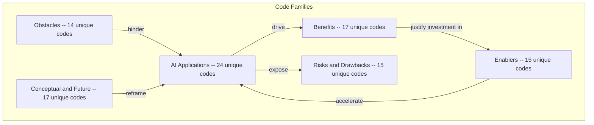
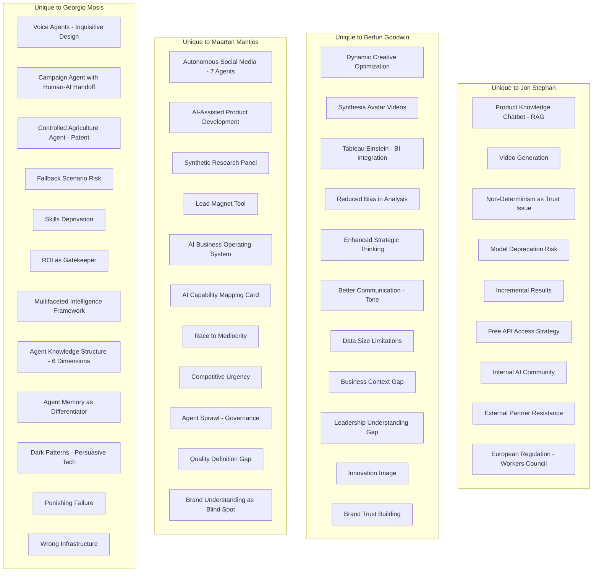
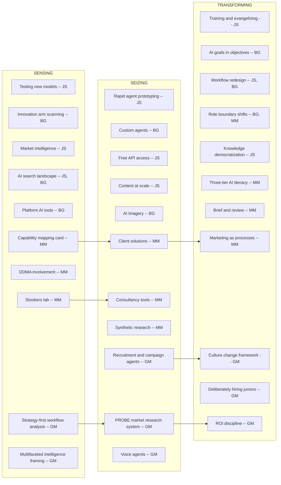

# Cross-Case Code Alignment

**Transcripts Analysed:** Berfun Goodwin (Feb 11), Jon Stephan (Feb 13), Maarten Mantjes (Feb 16), Georgio Mosis (Feb 17)  
**Organizations:** Merck KGaA / MilliporeSigma (Berfun, Jon); The Only Consultant + Stookers gin brand (Maarten); Consulting firm — pensions, asset management, digital transformation (Georgio)  
**Perspectives:** In-house strategic leader (Berfun), in-house AI specialist (Jon), marketing transformation consultant (Maarten), digital transformation / AI consultant with regulated-industry background (Georgio)  
**Note:** With four interviews across three organizations and four distinct roles, patterns are solidifying. The two consultant perspectives (Maarten and Georgio) provide cross-organizational validation, while the two Merck participants give in-house depth. Georgio adds a unique regulated-industry lens (healthcare, finance) that introduces quality and fallback concerns absent from earlier interviews.

---

## 1. Overview of Code Categories

---

## 2. Converging Codes (Shared Across Multiple Interviews)

### Legend

- **JS** = Jon Stephan | **BG** = Berfun Goodwin | **MM** = Maarten Mantjes | **GM** = Georgio Mosis

### 2.1 Converging Applications

| Theme | Jon Stephan | Berfun Goodwin | Maarten Mantjes | Georgio Mosis | Convergence | Emerging Insight |
|---|---|---|---|---|---|---|
| **Content Generation at Scale** | 300K product ads in 1 week | AI-generated copy with human approval | Automated recruitment posts (Randstad); autonomous social media (Stookers) | Recruitment agent: job description to LinkedIn post to applicant ranking | All 4 | Content generation at scale is the universal entry point. Every participant has at least one content-at-scale use case, though the degree of autonomy varies widely. |
| **AI Image Generation** | Gemini Nano Banana for lab imagery | AI product imagery for ecommerce | Seasonal/time-of-day cabin variants (Landal) | N/A | 3 of 4 | Image generation consistently fills a business bottleneck. Georgio's absence here reflects his regulated-industry context where image generation is less relevant. |
| **Content/Brand Evaluation** | Agentic workflow rating images for safety | Brand guidelines assistant | 7-agent system with inter-agent evaluation | CRM evaluation agent checking data currency | All 4 | Evaluation is a universal agentic pattern. Ranges from content safety (Jon) to brand alignment (Berfun) to inter-agent quality control (Maarten) to data validation (Georgio). |
| **Data / Analytics** | Data agent replacing data scientist | Complex analytics via Claude; pricing agent | Data activation across dashboards | Market research agent (PROBE) — continuous competitive intelligence | All 4 | Analytics / market intelligence is confirmed across all four. Georgio's PROBE system is the most structured multi-agent example with named agent roles (Plan, Research, Organize, Evaluate, Build). |
| **Campaign / CRM Automation** | N/A | N/A (future plans for platform AI tools) | N/A | Campaign agent with CRM eval, email, human-AI follow-up | GM (new) | Georgio introduces explicit campaign orchestration with human-AI handoffs — a use case mentioned aspirationally by others but only implemented by Georgio. |
| **Voice / Conversational Agents** | N/A | N/A | N/A | Inquisitive voice agents (ask questions, don't give info); proactive calling | GM (new) | Voice agents represent a new modality. Georgio's design insight — making agents inquisitive rather than informational to reduce errors — is a novel architectural pattern. |

### 2.2 Converging Benefits

| Theme | Jon Stephan | Berfun Goodwin | Maarten Mantjes | Georgio Mosis | Convergence | Emerging Insight |
|---|---|---|---|---|---|---|
| **Speed / Efficiency** | 1 year to 1 week for 300K ads | 1 week to 2 hours for analytics | "Dominant, primary benefit" across clients | Bottom line efficiency: same output, fewer resources | All 4 | Universally cited. But both consultants (MM, GM) frame it differently: Maarten warns of the "moving radio" trap; Georgio insists efficiency must translate to ROI or it doesn't survive the CFO. |
| **Scale Without Headcount** | Expanded ads with saved budget | Team of 11 does more | Puk: 2x growth without 2x people | Recruitment firm: entire process handled by agents | All 4 | Confirmed across all contexts. Georgio adds the uncomfortable corollary: in practice, this sometimes means firing people (Malaysia case). |
| **Skill Democratization** | Non-SQL marketers query data | AI enhances SQL skills | Anyone can create assets | Junior-level capabilities available to seniors via agents | All 4 | AI blurs specialist/generalist boundaries. Four modes: replacing skill (JS), augmenting it (BG), eliminating the need (MM), inverting the knowledge pyramid (GM). |
| **Quality Improvement** | Better conversion rates from targeted content | Reduced error in analysis | N/A | Quality of outcome — especially healthcare (patient satisfaction, diagnostic accuracy) | JS + BG + GM | Quality as a distinct benefit category (beyond just efficiency) is now supported by three participants. Georgio's healthcare perspective adds a dimension where quality is the primary value, not a secondary benefit. |

### 2.3 Converging Risks

| Theme | Jon Stephan | Berfun Goodwin | Maarten Mantjes | Georgio Mosis | Convergence | Emerging Insight |
|---|---|---|---|---|---|---|
| **Hallucination / Brand Risk** | "Free shipping" headline | "AI hallucinates and makes stuff up" | McDonald's/IKEA brand misalignment | Unrealistic expectations → inevitable disappointment | All 4 | The risk spectrum is broadening: factual errors (JS), generic acknowledgment (BG), brand misunderstanding (MM), and expectation mismatch (GM). |
| **Job Impact** | "Insane amount of fear" | Job modification of tactical roles | Junior pipeline erosion | "Fired half the people" in Malaysia; "agents are the new interns"; skills deprivation | All 4 | **Strongest convergence across all interviews.** Four perspectives: fear (JS), modification (BG), pipeline erosion (MM), direct displacement + skills atrophy (GM). Georgio's Malaysia case is the only concrete displacement example. |
| **Capability Blurring Risks** | N/A | Misrepresentation of skills | Uninformed opinions; polished incompetence | AI credibility stigma; "doping in a relay" | BG + MM + GM | Now confirmed across three participants. Georgio adds a new facet: not just overconfidence, but the stigma directed at those who do use AI well. The two sides of the same coin: some fake competence with AI (BG, MM), others are punished for genuine AI competence (GM). |

### 2.4 Converging Enablers

| Theme | Jon Stephan | Berfun Goodwin | Maarten Mantjes | Georgio Mosis | Convergence | Emerging Insight |
|---|---|---|---|---|---|---|
| **Leadership / Board Champion** | Immediate manager gave full autonomy | Leadership cascades AI goals into objectives | N/A (works with leadership from outside) | Board champion is the #1 tailwind; must be board-level, not just CTO | JS + BG + GM | Leadership support confirmed across three. Georgio elevates it: must be a board decision, not just one supportive manager. |
| **Personal Drive** | Obsessed since ChatGPT; evangelizes | Intrinsically motivated: "makes life easier" | Gin brand as personal lab | AI researcher since 1997 (Deep Blue); patent holder; teaches at two universities | All 4 | Every participant is a personal champion. Four archetypes: evangelist (JS), pragmatist (BG), entrepreneur (MM), scientist (GM). |
| **Process Understanding** | Distinguishes workflow from agentic | Team as "innovation arm" | "Marketing is a collection of processes"; brief & review | Strategy-first: examines workflows before building; PROBE as structured process | JS + MM + GM | Process thinking as prerequisite is now confirmed by both consultants (MM, GM) and one builder (JS). Georgio's PROBE acronym (Plan, Research, Organize, Evaluate, Build) is the most explicit process decomposition. |
| **Training / Education** | Trains coworkers on agents | Company organized agent-building trainings | Three-tier AI literacy (leadership/management/floor) | "Prompting is really different than just using it like a Google" | JS + BG + MM + GM | Training now confirmed across all four. Two dimensions: technical training (how to prompt/build) and organizational training (what AI can do at different levels). |
| **Culture of Innovation** | N/A (not explicitly framed) | N/A | Starting from pain points; celebrating failure | Speed + experimental axes; celebrating failure; quick wins | MM + GM | Both consultants independently emphasize culture. Georgio provides the most explicit framework: two axes (speed: fast/slow; approach: planned/experimental). |
| **Paid AI Tools / Investment** | Free API access from corporate | Company-sanctioned internal GPT | N/A | "Paid version moves you one year ahead" | JS + BG + GM | Three of four confirm that tool investment matters. Organizations that only provide free-tier AI handicap adoption. |

### 2.5 Converging Obstacles

| Theme | Jon Stephan | Berfun Goodwin | Maarten Mantjes | Georgio Mosis | Convergence | Emerging Insight |
|---|---|---|---|---|---|---|
| **Human Resistance / Fear** | Team stuck on basic use; partners anti-AI | Groups afraid of irrelevance | Hallucination as excuse not to start | Board-level fear policies; geopolitical anxiety; "fear of even touching anything" | All 4 | Resistance confirmed at every level: individual (JS), departmental (BG), organizational (MM), and board (GM). Georgio's board-level fear policies represent the most structurally damaging form. |
| **Organizational Friction** | Corporate politics, silos | Approval processes too slow | Poor process definition; regulation pendulum; middle management gap | Unrealistic expectations; wrong infrastructure; punishing failure | All 4 | Organizational friction is universal but manifests differently. Georgio adds two new friction types: infrastructure inadequacy and a culture that punishes failure. |
| **Generational / Adoption Clash** | Uneven adoption across team | N/A | N/A | Inverted knowledge pyramid; young people blocked by senior power holders; "cultural clash" | JS + GM | Georgio provides the most detailed analysis of the generational dynamic. Young people have AI skills but not organizational power; seniors have power but resist AI. This is a structural, not just cultural, problem. |

---

## 3. Diverging Codes (Unique to One Interview)

### Key Observations on Divergence

| Observation | Explanation |
|---|---|
| **Georgio introduces the most new risk/obstacle codes** | Fallback scenarios, skills deprivation, punishing failure, wrong infrastructure — these reflect his experience in regulated industries where errors are "super expensive." |
| **Georgio's conceptual codes are the most theoretical** | Multifaceted intelligence, agent knowledge structure, agent memory — he frames AI through academic frameworks, reflecting his scientist/teacher background. |
| **Previously divergent codes now converge further** | Junior pipeline risk (previously MM only) now confirmed by GM. Culture of innovation (previously MM only) confirmed by GM. Training/education now spans all 4. |
| **The consultant pattern is clear** | Both consultants (MM, GM) contribute more obstacle and conceptual codes than in-house participants. Seeing across organizations surfaces systemic patterns. |

---

## 4. Emerging Higher-Order Themes

Nine higher-order themes, updated with Georgio's fourth interview. New theme marked.

```mermaid
graph TD
    T1["THEME 1: Analytics and Market Intelligence as Gateway to Agentic AI"]
    T2["THEME 2: Scale Unlocks Unreachable Value"]
    T3["THEME 3: Governance as Enabler Not Constraint"]
    T4["THEME 4: Champion-Driven Adoption"]
    T5["THEME 5: Organizational Structures Lag Behind AI"]
    T6["THEME 6: Blurring of Role Boundaries"]
    T7["THEME 7: Race to Mediocrity vs True Innovation"]
    T8["THEME 8: Competitive Urgency and Commoditization"]
    T9["THEME 9: ROI as the Ultimate Gatekeeper -- NEW"]

    T1 --- T1a["All 4: analytics and data activation are where AI moves beyond content into decision support"]
    T2 --- T2a["300K ads, 140 parks, 100K posts, full recruitment pipelines. Value at scale where manual is impossible"]
    T3 --- T3a["Sanctioned tools build trust. But regulation pendulum and board fear can destroy adoption"]
    T4 --- T4a["Four champion types: evangelist, pragmatist, entrepreneur, scientist"]
    T5 --- T5a["Politics, processes, middle management, infrastructure, punishing failure, generational clash"]
    T6 --- T6a["Skills democratize but understanding may not. AI stigma punishes those who adapt"]
    T7 --- T7a["Moving radio: same things faster not new things. Confirmed by both consultants"]
    T8 --- T8a["AI as hygiene factor. If everyone can do it your advantage disappears"]
    T9 --- T9a["Without CFO-defensible ROI projects fly crash and move to the next"]
```

### Theme 1: Analytics and Market Intelligence as Gateway to Agentic AI

All four participants identify analytics and data activation as the domain where AI moves beyond content generation into multi-step reasoning and decision support. Georgio's PROBE system is the most structured multi-agent analytics implementation.

**Supporting codes:** `AI-APPLICATION:DATA-ANALYSIS` (JS), `AI-APPLICATION:ANALYTICS` (BG), `BENEFIT:DATA-ACTIVATION` (MM), `AI-APPLICATION:MARKET-RESEARCH-AGENT` (GM)

**Strength:** All 4 interviews.

### Theme 2: Scale Unlocks Value That Manual Cannot Reach

Enabling tasks that are impossible, not just slow, at scale. Now includes full recruitment pipelines (Georgio) alongside content and imagery.

**Supporting codes:** `AI-APPLICATION:CONTENT-GENERATION-SCALE` (JS), `AI-APPLICATION:PRODUCT-IMAGERY` (BG), `AI-APPLICATION:IMAGE-GENERATION-VARIANTS` (MM), `AI-APPLICATION:RECRUITMENT-AGENT` (GM), `BENEFIT:SCALE-WITHOUT-HEADCOUNT` (MM)

**Strength:** All 4 interviews.

### Theme 3: Governance as Enabler, Not Just Constraint

In-house participants see governance as trust-building. Consultants add critical caveats: regulation pendulums (MM) and board-level fear policies (GM) can shut down adoption entirely.

**Supporting codes:** `ENABLER:SANCTIONED-TOOLS` (BG), `ENABLER:HUMAN-IN-LOOP` (JS), `OBSTACLE:REGULATION-PENDULUM` (MM), `OBSTACLE:BOARD-FEAR` (GM)

**Strength:** All 4 interviews. The tension between governance-as-enabler and governance-as-obstacle is itself a finding.

### Theme 4: Champion-Driven Adoption with Four Motivation Types

Four distinct champion archetypes have now emerged:
- **Evangelist** (Jon): Mission-driven, trains others, shares credit
- **Pragmatist** (Berfun): Efficiency-driven, uses AI because it works better
- **Entrepreneur** (Maarten): Experiment-driven, uses personal ventures as labs
- **Scientist** (Georgio): Research-driven, publishes, patents, teaches; combines academic rigor with practice

**Strength:** All 4 interviews. Each participant embodies a different champion archetype.

### Theme 5: Organizational Structures Lag Behind AI Speed

Now with six distinct manifestations: politics/silos (JS), slow approvals (BG), poor process definition and middle management gap (MM), board fear policies and punishing failure (GM), and infrastructure gaps (GM).

**Strength:** All 4 interviews. Georgio adds the most new obstacle subtypes.

### Theme 6: Blurring of Role Boundaries

AI enables cross-boundary work but creates two-sided risks: polished incompetence on one side (BG, MM) and credibility stigma on the other (GM). Those who fake competence and those who demonstrate genuine AI competence are both penalized.

**Strength:** 3 of 4 interviews (BG, MM, GM).

### Theme 7: Race to Mediocrity vs. True Innovation

Both consultants independently warn: "don't do the old thing with new tools" (GM) echoes "moving radio" (MM). Organizations use AI to replicate existing processes more cheaply rather than reimagining them.

**Supporting codes:** `CONCEPT:MOVING-RADIO` (MM), `RISK:RACE-TO-MEDIOCRITY` (MM), GM's explicit warning about not doing old things with new tools

**Strength:** Both consultants (MM, GM). Now validated by two independent voices.

### Theme 8: Competitive Urgency and Commoditization

Primarily Maarten's theme. Not yet confirmed by Georgio (whose regulated-industry context makes commoditization less relevant). Still requires validation with competitive-market participants.

**Strength:** Primarily MM.

### Theme 9: ROI as the Ultimate Gatekeeper (NEW)

**New with interview 4.** Georgio introduces the clearest articulation: AI must justify itself financially or it dies. Three buckets (top line growth, bottom line efficiency, vanity) and only the first two survive CFO scrutiny. Quality is a fourth bucket relevant in regulated industries. This grounds the thesis's value discussion in financial reality.

**Supporting codes:** `CONCEPT:ROI-GATEKEEPER` (GM), `BENEFIT:TOP-LINE-GROWTH` (GM), `BENEFIT:BOTTOM-LINE-EFFICIENCY` (GM), `BENEFIT:QUALITY` (GM)

**Strength:** Primarily Georgio, with partial support from Jon (measured ROAS uplift) and Berfun (planned AB tests). This theme adds financial rigor to the value discussion that was previously dominated by capability descriptions.

---

## 5. Dynamic Capabilities Framework Alignment

### Observations

- **Georgio adds the most structured sensing approach:** His strategy-first method (examine workflows, assess ethics, evaluate risk, check people's knowledge) is the most methodical sensing process across all four interviews.
- **Seizing is broadest across the two consultants:** Maarten and Georgio together account for 6 of 11 seizing codes, reflecting that consultants build for multiple clients and contexts.
- **Georgio uniquely connects seizing to financial transformation:** His ROI discipline (T11) directly links seized opportunities to financial justification — a transformation step that other participants take for granted or skip.
- **Deliberate junior hiring (T10) is a unique transforming action:** While others describe the junior pipeline risk, only Georgio describes actively countering it.

---

## 6. Suggested Probes for Future Interviews

### Validate Strong Themes (4/4 convergence)
1. Is the efficiency-first benefit universal, or do some organizations lead with innovation/quality?
2. Does every organization have an AI champion, and if so, which archetype is most effective?
3. Is the junior talent pipeline concern shared by marketing managers (not just consultants)?

### Test Growing Themes (2-3/4 convergence)
4. Do in-house practitioners see the "moving radio" pattern, or is it only visible from the consultant's perspective?
5. How do organizations manage the two-sided credibility issue: polished incompetence AND AI stigma?
6. Is ROI scrutiny as strict outside of regulated industries and consulting firms?

### Explore Gaps
7. What does the human-AI handoff look like in campaign management? (Only Georgio has implemented this)
8. Are voice agents being adopted in marketing contexts, or are they still primarily customer service?
9. What fallback scenarios do organizations have when AI systems fail?

### Context Diversification
10. How do patterns differ in B2C vs. B2B marketing contexts?
11. What do these themes look like in organizations without a dedicated AI champion?
12. How does company size affect which obstacles dominate?

---

## 7. Code Frequency Summary

| Code Category | Jon Stephan | Berfun Goodwin | Maarten Mantjes | Georgio Mosis | Shared (2+) |
|---|---|---|---|---|---|
| AI Applications | 7 | 9 | 8 | 5 | 4 themes across all 4 |
| Benefits | 5 | 9 | 5 | 4 | 4 themes across 3-4 |
| Risks / Drawbacks | 5 | 4 | 6 | 6 | 3 themes across all 4 |
| Enablers | 5 | 5 | 4 | 6 | 4 themes across 3-4 |
| Obstacles | 4 | 5 | 6 | 6 | 3 themes across all 4 |
| Conceptual / Future | 3 | 4 | 5 | 6 | 2 themes across 2+ |
| **Total unique codes** | **29** | **36** | **34** | **33** | **20 converging themes** |

### Notes on Distribution

- **Convergence is strengthening:** From 15 converging themes with 3 interviews to 20 with 4. Core patterns are solidifying.
- **Georgio contributes the most enabler codes (6):** His consulting practice focuses on what makes adoption succeed, producing a rich enabler vocabulary (board champion, paid tools, training, culture, quick wins, high-impact cases).
- **Both consultants (MM, GM) dominate obstacle and conceptual codes:** This confirms the pattern that cross-organizational observers surface systemic issues not visible from within a single organization.
- **The "big four" application themes are now confirmed across all 4 interviews:** Content generation, image generation (3/4), content/brand evaluation, and data/analytics. These are the core AI application categories in marketing.
- **Risk convergence is now strongest on job impact:** All 4 participants raise it, each with a different facet. This is the most universally acknowledged risk of AI in marketing.
