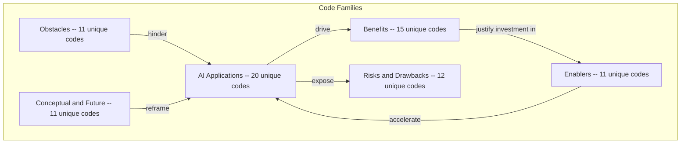
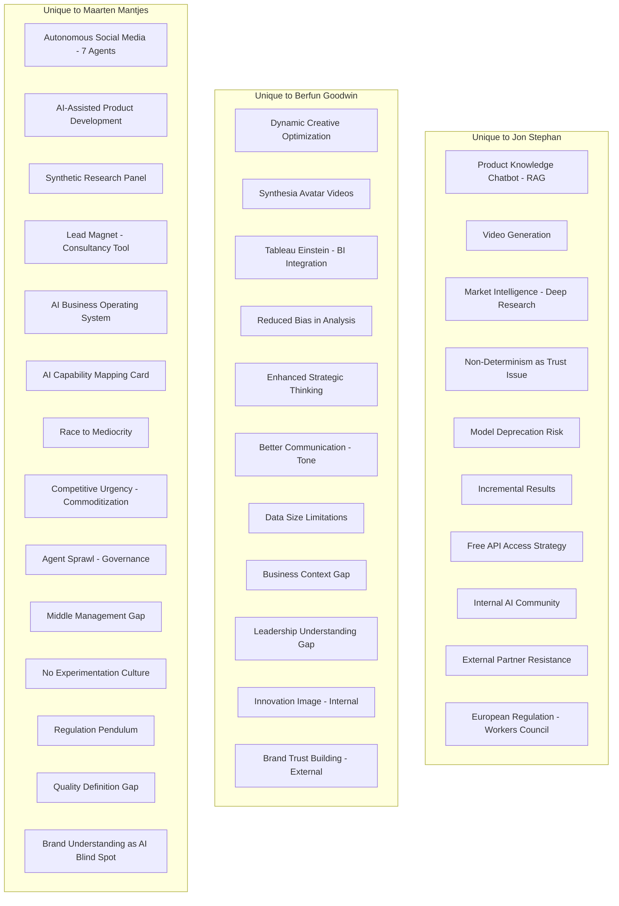
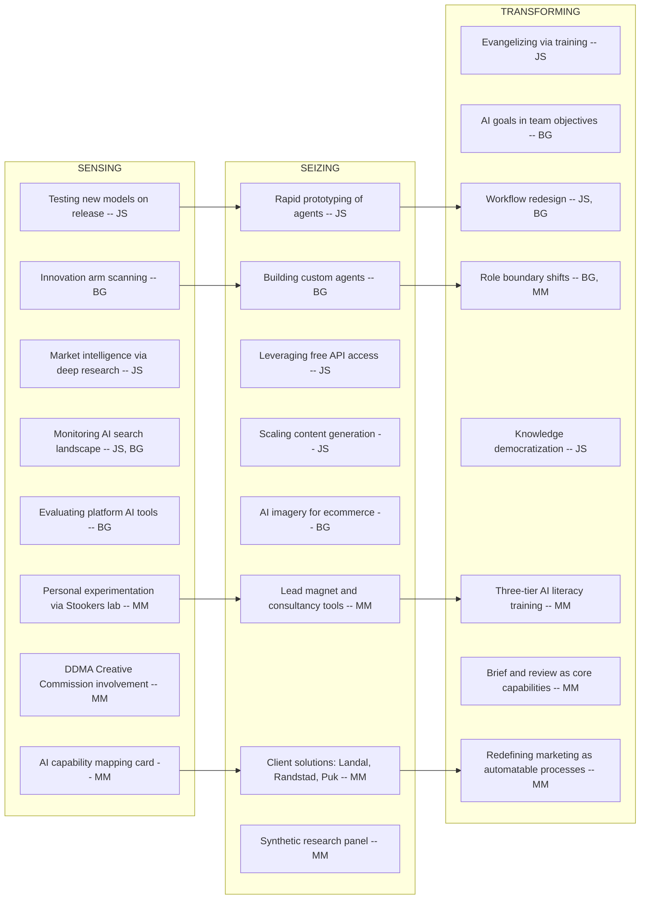

# Cross-Case Code Alignment

**Transcripts Analysed:** Berfun Goodwin (Feb 11), Jon Stephan (Feb 13), Maarten Mantjes (Feb 16)  
**Organizations:** Merck KGaA / MilliporeSigma (Berfun, Jon); The Only Consultant consultancy + Stookers gin brand (Maarten)  
**Perspectives:** In-house strategic leader (Berfun), in-house AI specialist (Jon), external consultant/entrepreneur (Maarten)  
**Note:** With three interviews across two organizations and three distinct roles, patterns are beginning to emerge. The addition of Maarten's consultant perspective — seeing across multiple client organizations (Landal, Randstad, Puk) — provides important external validation and new themes not visible from within a single organization.

---

## 1. Overview of Code Categories

The following high-level categories emerged across all three interviews. The diagram shows the six primary code families and updated code counts.

---

## 2. Converging Codes (Shared Across Multiple Interviews)

### Legend

- **JS** = Jon Stephan | **BG** = Berfun Goodwin | **MM** = Maarten Mantjes
- Codes appearing in **all 3** interviews are marked with a triple indicator

### 2.1 Converging Applications

| Theme | Jon Stephan | Berfun Goodwin | Maarten Mantjes | Convergence | Emerging Insight |
|---|---|---|---|---|---|
| **Content Generation at Scale** | 300K product ads in 1 week | AI-generated copy with human approval | Automated recruitment posts for Randstad (thousands of variants); autonomous social media for Stookers | All 3 | Content generation at scale is the universal entry point. Ranges from workflow-with-LLM (Jon) to fully autonomous multi-agent (Maarten). |
| **AI Image Generation** | Gemini Nano Banana for lab imagery | AI product imagery to fill photography gaps | Seasonal/time-of-day cabin image variants for Landal | All 3 | Image generation consistently solves a business bottleneck (product/asset coverage at scale), not a creative ambition. All three describe it as filling gaps humans cannot fill. |
| **Content/Brand Evaluation** | Agentic workflow rating social media images for safety | Brand guidelines assistant checking persona fit | 7-agent system where agents evaluate each other against specs | All 3 | Evaluation/judgment is a recurring agentic pattern. Moves AI beyond generation into quality control and decision-making. Maarten's agent-to-agent evaluation is the most autonomous form. |
| **Data / Analytics** | Data agent replacing data scientist for ad hoc queries | Complex analytics via Claude; pricing/promotion agent | Data activation across dashboards; decision support enrichment | All 3 | Analytics is confirmed as a high-value AI use case across all perspectives. Both in-house and consultant participants see it as where AI delivers the most differentiated value. |

### 2.2 Converging Benefits

| Theme | Jon Stephan | Berfun Goodwin | Maarten Mantjes | Convergence | Emerging Insight |
|---|---|---|---|---|---|
| **Speed / Efficiency** | 1 year to 1 week for 300K ads | 1 week to 2 hours for analytics | Efficiency is the "dominant, primary benefit" observed across all clients | All 3 | Speed/efficiency is the universally cited first benefit. However, Maarten warns this may be the "moving radio" trap — doing the same things faster rather than doing new things. |
| **Scale Without Proportional Headcount** | Expanded ads into new areas with saved budget | Team of 11 does more with AI assistance | Puk: 2x growth without 2x people | All 3 | AI enables growth without proportional headcount increase. This is especially powerful for smaller organizations (Puk, 12 people) where hiring is a fundamental constraint. |
| **Skill Democratization** | Non-SQL marketers can query data via agents | AI enhances SQL skills; marketer becomes data engineer | Sales reps get automated research and talking points; anyone can create assets | All 3 | AI blurs the line between specialist and generalist roles. Three modes emerge: replacing the skill (Jon), augmenting it (Berfun), or eliminating the need entirely (Maarten). |

### 2.3 Converging Risks

| Theme | Jon Stephan | Berfun Goodwin | Maarten Mantjes | Convergence | Emerging Insight |
|---|---|---|---|---|---|
| **Hallucination / Brand Risk** | "Free shipping" headline the company doesn't offer | "AI hallucinates and makes stuff up" | McDonald's Christmas film: great execution, wrong brand message; IKEA unboxing ads that miss the brand entirely | All 3 | The hallucination risk evolves across perspectives: from factual errors (Jon) to brand misalignment (Maarten). The deeper risk is not that AI gets facts wrong, but that it produces confident, polished output that misunderstands the brand. |
| **Job Impact** | "Insane amount of fear"; employees fear elimination | Job modification of tactical roles; potential future losses | Junior pipeline erosion: "you won't have non-juniors anymore" | All 3 | Three facets of the same concern: immediate fear (Jon), gradual role modification (Berfun), and systemic long-term talent pipeline risk (Maarten). Maarten's framing is the most structural — it's not about losing current jobs but about not developing future senior talent. |
| **Capability Blurring Risks** | N/A (not mentioned as risk) | Misrepresentation of skills: "pretend being super smart" | Uninformed opinions "on steroids"; beautifully written terrible briefings | BG + MM | When everyone can produce output in any domain, the risk is overconfidence without understanding. Maarten's "polished incompetence" code strengthens Berfun's "misrepresentation" concern. |

### 2.4 Converging Enablers

| Theme | Jon Stephan | Berfun Goodwin | Maarten Mantjes | Convergence | Emerging Insight |
|---|---|---|---|---|---|
| **Personal Drive / Intrinsic Motivation** | Obsessed since ChatGPT; evangelizes via training | Intrinsically motivated: "makes life easier" | Uses gin brand as personal AI laboratory; chairs DDMA Creative Commission | All 3 | Individual champions are essential across all contexts. Three motivation types emerge: evangelical (Jon), pragmatic (Berfun), entrepreneurial/experimental (Maarten). |
| **Process Understanding** | Distinguishes workflow from agentic; clear step definitions | Team as "innovation arm" testing new processes | "Marketing is a collection of processes" — explicit prerequisite for AI; brief & review as core capabilities | JS + MM | Process thinking is a prerequisite for meaningful AI adoption. Without it, AI remains "opportunistic and pragmatic" (Maarten). Both the builder (Jon) and the consultant (Maarten) emphasize this. |

### 2.5 Converging Obstacles

| Theme | Jon Stephan | Berfun Goodwin | Maarten Mantjes | Convergence | Emerging Insight |
|---|---|---|---|---|---|
| **Human Resistance / Fear** | Team stuck on basic use; external partners anti-AI | Groups afraid of irrelevance; non-digital departments resist | Hallucination used as excuse not to start; people work their backlog instead of experimenting | All 3 | Resistance takes different forms: passive non-adoption (Jon), active fear of irrelevance (Berfun), and strategic avoidance disguised as prudence (Maarten). |
| **Organizational Friction** | Corporate politics, silos, credit attribution | Content approval processes too slow for AI speed | Poor process definition; regulation pendulum; middle management gap | All 3 | Organizational structures lag behind AI capabilities. The in-house view (Jon, Berfun) focuses on speed mismatches; the consultant view (Maarten) identifies deeper structural issues: processes aren't defined, middle management is forgotten, and regulation swings between extremes. |

---

## 3. Diverging Codes (Unique to One Interview)

Codes that appeared in only one interview. These represent areas to probe in future interviews.

### Key Observations on Divergence

| Observation | Explanation |
|---|---|
| **Maarten contributes the most unique codes (14)** | As a consultant working across multiple organizations, he observes systemic patterns not visible from within a single company. His unique codes tend to be conceptual/strategic rather than tool-specific. |
| **Jon's unique codes are technical/operational** | RAG chatbots, video generation, model deprecation, temperature settings — these reflect his builder/implementer role. |
| **Berfun's unique codes are personal-productivity focused** | Communication improvement, strategic thinking, reduced bias — these reflect an individual user's experience rather than system-level patterns. |
| **Maarten introduces market-level concerns** | Commoditization, competitive urgency, agent sprawl — these are concerns that emerge from seeing the broader competitive landscape, not just one organization. |
| **Previously divergent codes now converge** | "Capability blurring" appeared only in Berfun (as misrepresentation risk) in the 2-interview analysis. Maarten strongly confirms and extends this into "uninformed opinions on steroids" and "polished incompetence." |

---

## 4. Emerging Higher-Order Themes

Based on the alignment of codes across all three interviews, eight higher-order themes are emerging. New themes added with the third interview are marked.

```mermaid
graph TD
    T1["THEME 1: Analytics as Gateway to Agentic AI"]
    T2["THEME 2: Scale Unlocks Unreachable Value"]
    T3["THEME 3: Governance as Enabler Not Constraint"]
    T4["THEME 4: Champion-Driven Adoption"]
    T5["THEME 5: Organizational Structures Lag Behind AI"]
    T6["THEME 6: Blurring of Role Boundaries"]
    T7["THEME 7: Race to Mediocrity vs True Innovation -- NEW"]
    T8["THEME 8: Competitive Urgency and Commoditization -- NEW"]

    T1 --- T1a["All 3 identify analytics and data activation as the domain where AI moves beyond content into decision support"]
    T2 --- T2a["300K ads, 140 parks, 100K recruitment posts. Value emerges at scale where manual is impossible, not just slow"]
    T3 --- T3a["Sanctioned tools and compliance frameworks build trust. But regulation pendulum can destroy adoption"]
    T4 --- T4a["Three champion types: evangelist, pragmatist, entrepreneur. All drive adoption through different mechanisms"]
    T5 --- T5a["Approval processes, politics, poor process definition, middle management gaps, regulation swings"]
    T6 --- T6a["Marketers write SQL, social managers design, creatives strategize. Roles expand but understanding may not"]
    T7 --- T7a["Moving radio: same things faster and cheaper not new things. AI optimizes for average not distinctive"]
    T8 --- T8a["AI as hygiene factor: if everyone can do it your advantage disappears. Not worried enough and not innovative enough"]
```

### Theme 1: Analytics as the Gateway to Agentic AI

All three participants identify analytics and data activation as the domain where AI moves beyond content generation into multi-step reasoning and decision support.

**Supporting codes:** `AI-APPLICATION:DATA-ANALYSIS` (JS), `AI-APPLICATION:ANALYTICS` (BG), `AI-APPLICATION:PRICING-AGENT` (BG), `BENEFIT:DATA-ACTIVATION` (MM), `BENEFIT:DECISION-SUPPORT` (MM), `BENEFIT:DEPTH-OF-INSIGHT` (BG), `BENEFIT:DATA-DEMOCRATIZATION` (JS)

**Strength:** All 3 interviews. Confirmed across in-house and consultant perspectives.

### Theme 2: Scale Unlocks Value That Manual Cannot Reach

The most compelling value proposition is enabling tasks that are impossible, not just slow, at scale. 300,000 product ads (Jon), image variants across 140+ parks (Maarten), 100,000+ recruitment posts (Maarten), comprehensive product imagery (Berfun).

**Supporting codes:** `AI-APPLICATION:CONTENT-GENERATION-SCALE` (JS), `AI-APPLICATION:PRODUCT-IMAGERY` (BG), `AI-APPLICATION:IMAGE-GENERATION-VARIANTS` (MM), `AI-APPLICATION:AUTOMATED-RECRUITMENT-CONTENT` (MM), `BENEFIT:SCALE-WITHOUT-HEADCOUNT` (MM)

**Strength:** All 3 interviews. The scale argument is strongest from Maarten (sees it across clients) and Jon (300K products).

### Theme 3: Governance as Enabler, Not Just Constraint

Compliance frameworks and sanctioned tools build trust that accelerates adoption. However, the regulation pendulum (Maarten) can destroy adoption when organizations swing from permissive to prohibitive overnight.

**Supporting codes:** `ENABLER:HUMAN-IN-LOOP` (JS), `ENABLER:SANCTIONED-TOOLS` (BG), `ENABLER:COMPLIANCE-FRAMEWORK` (BG), `OBSTACLE:REGULATION-PENDULUM` (MM), `OBSTACLE:REGULATION` (JS)

**Strength:** Nuanced. In-house participants (JS, BG) see governance as positive. The consultant (MM) adds the critical caveat that poorly managed governance destroys momentum.

### Theme 4: Champion-Driven Adoption with Three Motivation Types

AI adoption requires individual champions, and three distinct motivation types have emerged:
- **Evangelist** (Jon): Mission-driven, trains others, shares credit to build coalitions
- **Pragmatist** (Berfun): Efficiency-driven, uses AI because it makes work better
- **Entrepreneur** (Maarten): Experiment-driven, uses personal ventures as laboratories, builds tools as products

**Supporting codes:** `ENABLER:PERSONAL-DRIVE` (JS), `ENABLER:INTRINSIC-MOTIVATION` (BG), `AI-APPLICATION:AUTONOMOUS-SOCIAL-MEDIA` (MM — personal lab)

**Strength:** All 3 interviews. Each participant embodies a different champion archetype.

### Theme 5: Organizational Structures Lag Behind AI Speed

Organizations are structurally unprepared for AI. This manifests differently by perspective:
- **In-house (JS):** Politics, silos, credit attribution slow cross-group initiatives
- **In-house (BG):** Approval processes are too slow; data infrastructure isn't connected
- **Consultant (MM):** Processes aren't defined, middle management is forgotten, regulation swings between extremes, no experimentation culture

**Supporting codes:** `OBSTACLE:CORPORATE-POLITICS` (JS), `OBSTACLE:APPROVAL-PROCESS` (BG), `OBSTACLE:POOR-PROCESS-DEFINITION` (MM), `OBSTACLE:MIDDLE-MANAGEMENT-GAP` (MM), `OBSTACLE:REGULATION-PENDULUM` (MM), `OBSTACLE:NO-EXPERIMENTATION-CULTURE` (MM)

**Strength:** All 3 interviews. Maarten's consultant view adds the most new obstacle codes because he sees systemic patterns across organizations.

### Theme 6: Blurring of Role Boundaries

AI enables individuals to perform across traditional role boundaries. This has both positive effects (democratization, efficiency) and negative effects (uninformed opinions, polished incompetence).

**Supporting codes:** `CONCEPT:CAPABILITY-BLURRING` (MM), `BENEFIT:DATA-DEMOCRATIZATION` (JS), `AI-APPLICATION:CODE-IMPROVEMENT` (BG), `RISK:UNINFORMED-OPINIONS` (MM), `RISK:POLISHED-INCOMPETENCE` (MM), `RISK:MISREPRESENTATION` (BG)

**Strength:** All 3 interviews contribute. Maarten provides the most explicit framing ("capability blurring") and articulates both sides — positive and negative.

### Theme 7: Race to Mediocrity vs. True Innovation (NEW)

**New with interview 3.** Organizations are using AI to do the same things faster and cheaper ("moving radio") rather than to do fundamentally new things. AI's optimization toward averages and common denominators, combined with standardized methodologies, threatens creative differentiation. Maarten sees "almost no" examples of organizations doing things they couldn't do before.

**Supporting codes:** `CONCEPT:MOVING-RADIO` (MM), `RISK:RACE-TO-MEDIOCRITY` (MM), `CONCEPT:BRAND-BLIND-SPOT` (MM), `CONCEPT:QUALITY-DEFINITION-GAP` (MM), `RISK:INCREMENTAL-RESULTS` (JS — "never seen a home run")

**Strength:** Primarily Maarten, with partial support from Jon's "incremental results" observation. This is a provocative theme that challenges the efficiency narrative and should be tested in future interviews.

### Theme 8: Competitive Urgency and Commoditization (NEW)

**New with interview 3.** If AI makes everyone more efficient, efficiency is no longer a competitive advantage — it becomes a hygiene factor. In FMCG and consumer markets especially, marketing can be replicated by any AI-equipped competitor. The $24B legal market example illustrates the scale of disruption possible. Organizations are "not worried enough."

**Supporting codes:** `RISK:COMMODITIZATION` (MM), `CONCEPT:COMPETITIVE-URGENCY` (MM), `BENEFIT:EFFICIENCY` (all 3 — but reframed as hygiene, not advantage)

**Strength:** Primarily Maarten. This theme is unique to the consultant perspective and represents a market-level concern rather than an organizational one. Should be tested with other participants, especially those in competitive consumer markets.

---

## 5. Dynamic Capabilities Framework Alignment

All three interviews map onto the sensing-seizing-transforming framework. The diagram now includes Maarten's contributions.

### Observations

- **Sensing varies by role:** Jon senses through rapid model testing, Berfun through her innovation arm mandate, Maarten through his cross-client consulting practice and personal experimentation. The consultant model (seeing across organizations) provides the broadest sensing surface.
- **Seizing reflects organizational context:** In-house participants seize within their organizations (agents, workflows). Maarten seizes by building client solutions and tools, externalizing AI capabilities as products.
- **Transforming is most developed in Maarten's account:** While Jon and Berfun describe early-stage workflow changes, Maarten articulates a more complete transformation vision: redefining marketing as processes, establishing brief & review as core human capabilities, and building tiered AI literacy. This may reflect his consultant role (transformation is what he sells) or a more advanced understanding of what AI adoption ultimately requires.
- **The transformation gap:** Despite richer transformation language, Maarten also notes that his clients are "not there yet." The transformation vision exists, but execution is nascent everywhere.

---

## 6. Suggested Probes for Future Interviews

Updated based on new convergences and gaps from the third interview.

### Validate Strengthened Themes
1. Is the "moving radio" pattern (same things faster, not new things) universal? Or are some organizations already doing genuinely new things with AI?
2. Do other consultants/agencies observe the same "agentic AI is on stages and whitepapers but not in practice" pattern as Maarten?
3. Is the junior talent pipeline concern shared by in-house marketing leaders, or is it primarily a consultant observation?

### Explore New Themes
4. How do organizations in highly competitive markets (FMCG, retail) think about AI as a commoditization risk vs. competitive advantage?
5. What does "brief & review" look like in practice? Are organizations explicitly training these capabilities, or is it assumed expertise?
6. How do organizations handle the regulation pendulum — the swing from permissive to restrictive AI policies?

### Validate Across Contexts
7. Do the patterns hold in non-life-science, non-consultancy contexts? (Finance, consumer goods, B2C, smaller companies)
8. Is the middle management gap a universal organizational obstacle, or specific to larger/older companies?
9. How do organizations without an internal AI tool (like Merck's GPT instance) manage adoption differently?

### Previously Suggested (Still Relevant)
10. How do organizations without centralized AI cost absorption approach AI adoption?
11. What does AI measurement look like in organizations further along the maturity curve?
12. Is the "model deprecation risk" (Jon) a universal concern for production AI workflows?

---

## 7. Code Frequency Summary

| Code Category | Jon Stephan | Berfun Goodwin | Maarten Mantjes | Shared (2+) |
|---|---|---|---|---|
| AI Applications | 7 | 9 | 8 | 4 themes across all 3 |
| Benefits | 5 | 9 | 5 | 3 themes across all 3 |
| Risks / Drawbacks | 5 | 4 | 6 | 3 themes across 2-3 |
| Enablers | 5 | 5 | 4 | 2 themes across 2-3 |
| Obstacles | 4 | 5 | 6 | 2 themes across all 3 |
| Conceptual / Future | 3 | 4 | 5 | 1 theme across all 3 |
| **Total unique codes** | **29** | **36** | **34** | **15 converging themes** |

### Notes on Distribution

- **Maarten contributes the most unique obstacle codes (6)** — his cross-organizational consulting view surfaces systemic issues (middle management gap, regulation pendulum, no experimentation culture, poor process definition) that are not visible from within a single organization.
- **Maarten contributes the most unique conceptual codes (5)** — his role as a strategist/consultant produces more abstract pattern-recognition (moving radio, competitive urgency, capability blurring, quality definition gap, brand blind spot).
- **All 3 converge on the "big four" application themes:** content generation at scale, image generation, content/brand evaluation, and data/analytics. This convergence across in-house and consultant perspectives strengthens these as core categories.
- **The risk landscape is broadening:** From 2 shared risk themes (hallucination, job impact) with 2 interviews to 3 shared themes with the addition of capability blurring risks. Maarten's unique risk codes (race to mediocrity, commoditization, agent sprawl) introduce market-level concerns not yet validated by other participants.
