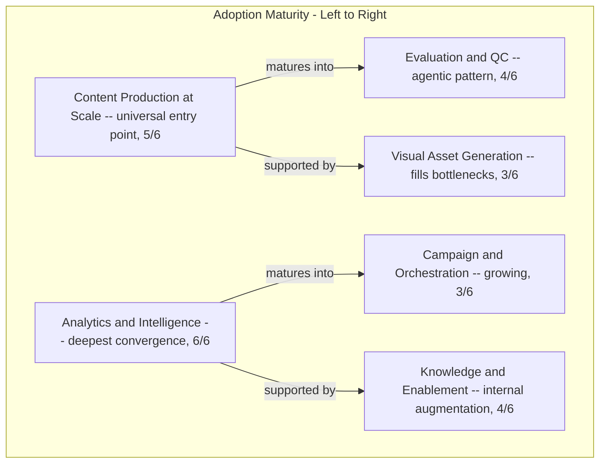
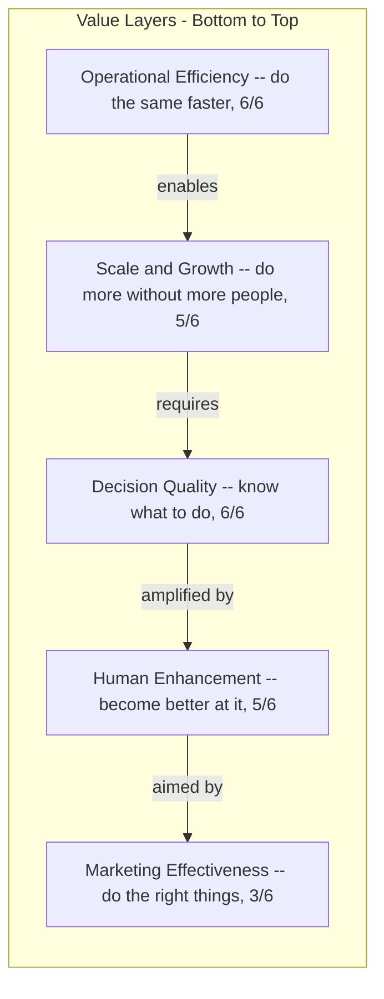
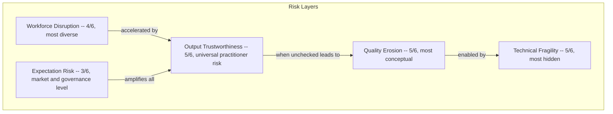

# Second-Order Code Analysis

**Source:** 194 first-order codes across 6 interviews (JS, BG, MM, GM, RM, AB)  
**Method:** First-order codes are grouped into second-order categories that capture shared theoretical meaning. Codes appearing in multiple interviews under different labels are deduplicated into a single second-order concept. The analysis then surfaces patterns visible only at this higher level of abstraction.

---

## 1. Applications: What AI Does in Marketing

| 2nd-Order Code | First-Order Codes (deduplicated) | Interviews | Description |
|---|---|---|---|
| **Content Production at Scale** | Content generation at scale (JS), content creation (BG), automated recruitment content (MM), autonomous social media (MM), bottom-funnel content (RM), living content (RM), avatar video (BG), DCO (BG), video generation (JS) | JS, BG, MM, GM, RM | Producing marketing assets (text, image, video, social posts) at a volume impossible for humans. Ranges from workflow-with-LLM to fully autonomous multi-agent systems. AB acknowledges this as a baseline capability but does not focus on it — her scope is governance, not content production. |
| **Visual Asset Generation** | Image generation (JS), product imagery (BG), image generation variants (MM) | JS, BG, MM | AI-generated images filling gaps in product/asset photography. Solves a coverage bottleneck, not a creative ambition. Absent from advisory, governance, and startup perspectives focused on strategy. |
| **Analytics & Market Intelligence** | Data analysis (JS), analytics (BG), pricing agent (BG), BI integration (BG), data activation (MM), market research agent (GM), competitive analysis (RM), marketing advisory platform (RM), market intelligence (JS), decision velocity (AB) | **All 6** | Using AI to extract insights, monitor competitors, activate data, and generate strategic recommendations. The deepest convergence in the sample. AB reframes analytics from "faster data processing" to "faster, better-informed strategic decisions" — a shift from creation velocity to decision velocity. Progression: data agent (JS) → complex analytics (BG) → data activation (MM) → PROBE multi-agent (GM) → strategic advisory (RM) → decision velocity framing (AB). |
| **Evaluation & Quality Control** | Content evaluation (JS), brand assistant (BG), inter-agent evaluation (MM), CRM evaluation (GM) | JS, BG, MM, GM | AI judging, rating, or validating outputs — content safety, brand alignment, data currency, or inter-agent quality checks. The agentic pattern most distinct from generative AI. AB's "oversight" concept is adjacent but framed as an organizational capability rather than an application. |
| **Campaign & Customer Orchestration** | Campaign agent (GM), deal notification (RM), recruitment agent (GM), voice agents (GM), precision-at-scale (AB), workflow reinvention (AB) | GM, RM, AB | End-to-end campaign workflows with multi-step planning, CRM integration, human-AI handoffs, and proactive customer outreach. GM has implemented; AB provides the theoretical frame ("precision at scale" and "workflow reinvention"). Growing theme — still underrepresented in practice. |
| **Knowledge & Enablement Tools** | Product chatbot / RAG (JS), code improvement (BG), sparring partner (RM), capability card (MM), synthetic research (MM), lead magnet tool (MM), business OS (MM) | JS, BG, MM, RM | Internal tools that augment human knowledge: answering product questions, enhancing code, serving as a thinking partner, or mapping AI capabilities for clients. |

### Analysis

**Key insight:** There is a maturity progression. Organizations start with content production (near-universal), then add analytics (the strongest convergence point at 6/6). More mature implementations add evaluation/QC (making AI judge its own output) and eventually campaign orchestration (AI managing multi-step customer-facing workflows). AB's "decision velocity" reframe suggests the analytics gateway is about more than data processing — it's the point where AI shifts from doing things faster to enabling better decisions. Campaign orchestration gained conceptual support from AB but remains underrepresented in practice.

---

## 2. Benefits: What Value AI Creates

| 2nd-Order Code | First-Order Codes (deduplicated) | Interviews | Description |
|---|---|---|---|
| **Operational Efficiency** | Ad efficiency (JS), speed (BG), speed-and-scale (JS), efficiency (MM), bottom-line efficiency (GM), data-prep-elimination (BG), decision-velocity (AB) | **All 6** | Doing the same things faster and cheaper. The most universally cited benefit, but also the most contested (RM, MM argue it's insufficient; AB distinguishes "decision velocity" from "creation velocity," suggesting organizations conflate the two). |
| **Scale & Growth** | Scale-without-headcount (MM), conversion-rates (JS), top-line-growth (GM), consultant-replacement (RM) | JS, BG, MM, GM, RM | Growing output or revenue without proportional headcount increase. Includes both internal scaling (Puk, Merck) and business model transformation (consultant → subscription). AB does not address scale directly — her scope is governance and readiness, not operational output. |
| **Decision Quality & Strategic Intelligence** | Depth-of-insight (BG), data-democratization (JS), data-activation (MM), decision-support (MM), strategic-focus (RM), management-understanding (RM), strategic-thinking (BG), reduced-bias (BG), informed-decisions (AB), clarity-of-direction (AB) | **All 6** | AI improving the quality of decisions: deeper insights, broader data access, strategic focus, reduced bias. AB adds the governance dimension: boards that can justify AI decisions to auditors gain "fiduciary confidence." Quality now spans output quality (JS, BG), outcome quality (GM), decision quality (RM), and governance quality (AB). |
| **Human Capability Enhancement** | Employee-elevation (JS), communication (BG), faster-experimentation (MM), accuracy (BG), skill-inversion (GM), strategic-direction-to-non-experts (RM) | JS, BG, MM, GM, RM | Making individual professionals more capable. Five modes: replacing skills (JS: non-SQL marketers query data), augmenting (BG: better analysis), eliminating need (MM: anyone creates assets), inverting the pyramid (GM: junior capabilities available to seniors via agents), and providing strategy to non-strategists (RM: AI gives direction to non-expert marketers). Distinct from efficiency — it's about making people better, not replacing them. |
| **Organizational Perception & Trust** | Brand-image (BG), innovation-image (BG), automation-bias advantage (RM) | BG, RM | AI making the organization appear innovative and trustworthy. Rolf's "automation bias" is a specific mechanism: AI recommendations are accepted more readily than human ones. |
| **Marketing Effectiveness** | Effectiveness (RM), quality of outcome (GM), ROI-driven (GM), outcome-first (AB) | GM, RM, AB | Value measured by marketing outcomes, not just output speed. Georgio frames it as healthcare-style quality. Rolf frames it as "doing the right things" vs. "doing things right." AB provides the structural frame: start from outcome, not output. The convergence of a founder, a consultant, and a governance advisor on this theme — from completely different angles — strengthens it as a core finding. |

### Analysis

**Key insight:** Benefits form a value hierarchy. Most participants enter at the efficiency layer and stay there. Rolf's central argument is that the highest-value layer (marketing effectiveness) is rarely reached because organizations get stuck optimizing the lower layers. AB reinforces this from a governance angle: organizations that start from outcomes reach effectiveness; those that start from outputs plateau at efficiency. The progression from "do the same faster" → "do more" → "know what to do" → "do the right things" represents a maturity curve that few organizations traverse fully.

**The efficiency-effectiveness tension** is the most significant analytical finding: all six participants cite efficiency, but four (MM, GM, RM, AB) explicitly or implicitly argue it's necessary but insufficient. AB's "outcome before output" distinction provides a structural explanation for why organizations get stuck: they optimize what AI produces (outputs) without defining what business result they want (outcomes).

---

## 3. Risks: What Can Go Wrong

| 2nd-Order Code | First-Order Codes (deduplicated) | Interviews | Description |
|---|---|---|---|
| **Output Trustworthiness** | Hallucination (JS, BG), non-determinism (JS), output-inconsistency (RM), unrealistic-expectations (GM), incremental-results (JS), brand-misalignment (MM) | JS, BG, MM, GM, RM | AI outputs that are factually wrong, inconsistent across runs, misaligned with brand, or simply not as good as promised. The universal practitioner risk, though severity varies by domain. Risk spectrum: factual errors (JS), generic output (BG), brand misunderstanding (MM), expectation mismatch (GM), inconsistency (RM). AB's scope is governance rather than output quality. |
| **Workforce Disruption** | Job-fear (JS), job-modification (BG), job-displacement (GM), junior-pipeline (MM, GM), skills-deprivation (GM) | JS, BG, MM, GM | Impact on jobs, careers, and professional development. Five facets: immediate fear, role modification, direct displacement, pipeline erosion, and skill atrophy. The broadest risk category with the most diverse manifestations. GM's Malaysia case is the only concrete displacement example. |
| **Quality & Authenticity Erosion** | Race-to-mediocrity (MM), polished-incompetence (MM), uninformed-opinions (MM), misrepresentation (BG), creative-limitation (RM), creative-displacement (BG), AI-stigma (GM), commoditization (MM), art-vs-science (AB) | BG, MM, GM, RM, AB | AI's output converging on the average, enabling people to produce plausible but shallow work, and making genuine expertise harder to distinguish from AI-assisted imitation. Includes the inverse: penalizing those who use AI well (GM's "doping in a relay"). AB's "art vs. science" decoupling adds a structural dimension: the science portion of marketing can be AI-augmented, but treating the art portion (creativity, brand) as if it were science degrades brand quality. AI content works for activation but not brand building — confirmed by both MM's market observations and RM's lived pivot. |
| **Technical & Operational Fragility** | Model-deprecation (JS), agent-sprawl (MM), no-fallback (GM), prompt-engineering-cost (RM), over-deployment (AB) | JS, MM, GM, RM, AB | The hidden costs and fragilities of production AI: models get deprecated, agents proliferate ungoverned, fallback plans don't exist, building reliable prompts takes months, and too much technology without integration leads to inefficiency (AB). AB's "over-deployment" is a governance-specific risk: organizations can have too much technology, not too little. |
| **Expectation & Market Risk** | AI-hype (RM, GM), automation-bias as risk (RM), vendor-dependency (AB), rush-to-execution (AB) | GM, RM, AB | The gap between what AI promises and what it delivers. Includes market-level overselling, micro-level uncritical trust in AI outputs, strategy shaped by vendor pitches rather than actual needs (AB), and organizations jumping to tools without clarity, awareness, or readiness (AB). AB adds that executives want "innovation sessions" but default to the vendor's pitch — strategy shaped by Microsoft/IBM rather than actual organizational needs. |

### Analysis

**Key insight:** Risks cluster into a cascade. Expectation risk (AI is oversold) sets the stage — AB adds that vendor dependency means strategy is shaped by external pitches rather than internal needs. Output trustworthiness issues erode confidence. When unchecked, they lead to quality erosion (mediocre content at scale). Meanwhile, technical fragility (no fallback, model deprecation, agent sprawl, over-deployment) creates operational risk that organizations don't see until something breaks. Workforce disruption runs as a parallel track, driven by the same efficiency gains that are celebrated as benefits.

**The most underappreciated risk is quality erosion** — it's the hardest to detect because the output looks professional. Maarten's "beautifully written terrible briefings" and Rolf's pivot story both point to this: AI can produce more while understanding less. AB's "art vs. science" distinction adds a structural explanation: the science part of marketing can be AI-augmented, but treating the art part as if it were science degrades brand.

---

## 4. Enablers: What Makes AI Adoption Succeed

| 2nd-Order Code | First-Order Codes (deduplicated) | Interviews | Description |
|---|---|---|---|
| **Organizational Investment & Sponsorship** | Management-buy-in (JS), leadership-buy-in (BG), board-champion (GM), free-api-access (JS), paid-tools (GM), sanctioned-tools (BG), fiduciary-confidence (AB) | JS, BG, GM, AB | Leadership support and tangible investment in AI tools. Ranges from a supportive manager (JS) to top-down goal-setting (BG) to a board-level decision with budget (GM) to fiduciary responsibility — leaders who can justify AI decisions to shareholders (AB). Without this, initiatives stall. |
| **Individual Champions** | Personal-drive (JS), intrinsic-motivation (BG), personal lab (MM), research since 1997 (GM), pivot conviction (RM), governance reform drive (AB) | **All 6** | Every successful AI initiative has a champion. Six archetypes: evangelist (JS), pragmatist (BG), entrepreneur (MM), scientist (GM), founder-operator (RM), governance architect (AB). The motivation differs but the pattern is universal. AB's archetype is distinct: her drive is institutional reform rather than personal tool use. |
| **Process & Domain Mastery** | Process-thinking (MM), brief-and-review (MM), marketing-science (RM), proprietary-data (RM), systems-thinking (AB), explicit-workflows (AB), art-science-decoupling (AB), strategy-first-analysis (GM) | MM, GM, RM, AB | Understanding how marketing actually works — as processes, as science, as domain knowledge. Without this, AI is applied to the wrong things or in the wrong way. AB adds systems thinking and the need to make workflows explicit before automating them. GM contributes strategy-first workflow analysis. The prerequisite enabler that most organizations lack. |
| **Learning & Capability Building** | Training (GM), tiered-ai-literacy (MM), self-service-agents (BG), AI-community (JS), education-first (AB), war-room-scenarios (AB) | JS, BG, MM, GM, AB | Structured approaches to building AI skills across the organization. Ranges from peer training (JS) to three-tier programs (MM) to self-service platforms (BG). AB's approach is the most structured: war room scenario planning and education before adoption, building blocks of AI for non-technical decision-makers. Two dimensions: technical training (how to prompt/build) and organizational education (what AI means for the business). |
| **Implementation Strategy** | Quick-wins (GM), high-impact-cases (GM), narrow-focus (RM), expectation-management (RM), pain-point-driven (MM) | MM, GM, RM | How to start and what to prioritize. Both consultants and the founder converge on: start narrow, pick impactful problems, manage expectations, and celebrate small wins. |
| **Governance & Safety** | Human-in-loop (JS), compliance-framework (BG), innovation-culture (GM), CARE-framework (AB), vendor-procurement-criteria (AB) | JS, BG, GM, AB | The organizational guardrails that build trust. Paradoxically, constraints (human review, compliance) accelerate adoption by making it feel safe. AB provides the most developed governance framework: the CARE model (Clarity → Awareness → Readiness → Execution), vendor procurement criteria, and scenario planning. Culture that forgives failure also belongs here (GM). The tension remains: governance enables (BG, JS, AB) but can also destroy adoption when it becomes fear-driven (GM, MM). |
| **Outcome-First Thinking** | Effectiveness-vs-efficiency (RM), outcome-not-output (AB), definition-of-good (MM, AB) | MM, RM, AB | Define the desired outcome before optimizing outputs. AB's "start from outcome, not output" converges with RM's "effectiveness, not efficiency" and MM's "quality definition gap." Without explicit success criteria, AI adoption drifts toward output volume rather than business impact. CARE as sequencing (clarity before execution). Brief & review as human anchor (define what you want, then check if you got the outcome). |

### Analysis

```mermaid
graph TD
    subgraph enablerStack [Enabler Stack - Foundation to Execution]
        E1["Process and Domain Mastery -- prerequisite, 4/6"]
        E2["Organizational Investment -- leadership plus budget, 4/6"]
        E3["Individual Champions -- the human spark, 6/6"]
        E4["Learning and Capability Building -- scaling knowledge, 5/6"]
        E5["Implementation Strategy -- narrow, impactful, managed, 3/6"]
        E6["Governance and Safety -- trust through guardrails, 4/6"]
        E7["Outcome-First Thinking -- aim before acting, 3/6"]
    end

    E1 -->|"enables informed"| E2
    E2 -->|"empowers"| E3
    E3 -->|"drives"| E4
    E4 -->|"guided by"| E5
    E5 -->|"sustained by"| E6
    E7 -->|"orients all layers"| E1
```

**Key insight:** Enablers form a stack where lower layers are prerequisite for upper layers to work. The most commonly cited enablers (champions at 6/6, learning at 5/6) sit in the middle. The most underappreciated enabler sits at the foundation: **process and domain mastery**. If you don't understand how marketing works as a set of processes (MM) or as a science (RM), you can't brief AI well, can't evaluate its output, and end up automating the wrong things.

AB's contribution adds a seventh enabler — **outcome-first thinking** — that orients the entire stack. It operates as a meta-enabler: without a clear outcome, the other enablers optimize in the wrong direction. This converges with RM's "effectiveness not efficiency" and MM's "quality definition gap" from three independent perspectives.

---

## 5. Obstacles: What Prevents AI Value Creation

| 2nd-Order Code | First-Order Codes (deduplicated) | Interviews | Description |
|---|---|---|---|
| **Resistance & Fear Culture** | Human-resistance (BG), board-fear (GM), partner-resistance (JS), hallucination-excuse (MM), corporate-politics (JS) | JS, BG, MM, GM | Fear-driven behavior at every level: individuals avoiding AI, boards banning it, partners refusing it, and organizations using hallucination risk as an excuse not to start. The most cited obstacle at the individual and team level. |
| **Structural & Process Deficits** | Approval-process (BG), poor-process-definition (MM), middle-management-gap (MM), regulation (JS), regulation-pendulum (MM), no-experimentation-culture (MM), platform-lock-in (RM), punishing-failure (GM), implicit-workflows (AB), solution-before-problem (AB), automation-vs-augmentation-gap (AB) | **All 6** | Organizational structures that predate AI and haven't been updated. Every participant encounters structural friction, but manifestations differ: in-house sees speed mismatches (JS, BG); consultants see process and culture issues (MM, GM); the founder sees platform lock-in and developer resistance (RM); the governance advisor sees implicit workflows and solution-before-problem thinking (AB). The strongest obstacle convergence. |
| **Capability & Knowledge Gaps** | Data-illiteracy (RM), imagination-gap (MM), leadership-understanding (BG), talent-shortage (RM), credibility-gap (GM), uneven-adoption (JS), generational-clash (GM), developer-resistance (RM), executive-comfort-without-understanding (AB) | **All 6** | People who lack the knowledge, imagination, or skills to use AI effectively. Cuts across all levels: leaders who don't understand (BG), marketers who can't use data (RM), developers who won't change (RM), and an inverted knowledge pyramid where juniors know more than seniors (GM). AB adds the fiduciary dimension: "comfort does not reflect understanding" — executives converse about AI but can't justify decisions about things they don't truly understand. |
| **Marketing Process Orientation Gap** | Marketing-not-seen-as-processes (MM), marketers-not-process-oriented (RM), comfort-in-complicated-processes (AB) | MM, RM, AB | Marketing's fundamental lack of process thinking as a distinct obstacle to AI adoption. Three independent voices: MM ("marketing is not seen as a collection of processes"), RM ("marketers are not process-oriented"), and AB ("they find comfort in complicated processes" — conflating "complicated" which gives them value with "complex" which could be mapped). Without explicit processes, there is nothing to augment or automate. |
| **Infrastructure & Technical Debt** | Data-limitations (BG), context-gap (BG), infrastructure (GM), expectation-management as obstacle (GM) | BG, GM | The technical foundations that don't support AI: limited data ingestion, missing business context, outdated hardware, and tools that can't handle the workload. |
| **Market & Expectation Mismatch** | AI-hype (RM), expectation-management (GM), vendor-dependency (AB) | GM, RM, AB | The gap between what the market promises about AI and what it can deliver. When expectations aren't managed, even good results disappoint. AB adds that many organizations default to the vendor's pitch — strategy shaped by Microsoft/IBM rather than actual needs. |

### Analysis

**Key insight:** Obstacles mirror enablers as their absence or opposite:

| Enabler (present) | Obstacle (absent) |
|---|---|
| Organizational investment | Resistance & fear culture |
| Process & domain mastery | Structural & process deficits + marketing process orientation gap |
| Learning & capability building | Capability & knowledge gaps |
| Governance & safety | Infrastructure & technical debt |
| Implementation strategy | Market & expectation mismatch |
| Outcome-first thinking | (No direct opposite — its absence is implicit in all other obstacles) |

This symmetry suggests that the enabler stack (Section 4) is also a diagnostic tool: where adoption is failing, look for which enabler layer is missing or insufficient. The addition of "Marketing Process Orientation Gap" as a distinct obstacle (3/6, from three independent voices) reinforces the finding that process mastery is the most underappreciated enabler — and its absence the most fundamental barrier.

---

## 6. Conceptual Lenses: How Participants Frame AI

| 2nd-Order Code | First-Order Codes (deduplicated) | Interviews | Description |
|---|---|---|---|
| **What Counts as Agentic** | Agentic-vs-workflow (JS), agentic-vs-generative (BG, RM), agentic-vs-automation (MM), agentic-vs-chatbot (GM), agent-knowledge-structure (GM), agent-memory (GM), multifaceted-intelligence (GM), accelerated-intelligence (RM), five-dimensions-of-agentic (AB) | **All 6** | How each participant draws the line between "just AI" and "agentic AI." Definitions cluster around: autonomy in decisions (MM), planning + acting (GM), proactivity (RM), and multi-step reasoning beyond Q&A. AB adds a five-dimensional framework. No single definition dominates, but all six participants grapple with the distinction. |
| **Innovation vs. Imitation** | Moving-radio (MM), faster-horse (RM), pivot-from-automation (RM), competitive-urgency (MM), commoditization (MM), market-state (MM) | MM, RM | The critique that AI is being used to do the same things faster rather than to do fundamentally new things. The strongest conceptual convergence between the two most strategically-oriented participants. GM's "don't do old things with new tools" echoes this from the consulting side. |
| **Marketing Science Reframe** | Effectiveness-vs-efficiency (RM), brand-vs-activation (RM), vanity-metrics (RM), quality-definition-gap (MM), brand-blind-spot (MM) | MM, RM | The argument that marketing has well-established scientific principles (60/40 brand/activation, mental availability, probabilistic > deterministic) that most AI applications ignore or violate. |
| **Value & Measurement** | ROI-gatekeeper (GM), measurement (BG), technoplasmosis (RM), perceived-vs-implied-value (AB) | BG, GM, RM, AB | How to measure whether AI is creating value. The tension between ROI discipline (GM) and the argument that ROI thinking limits the most valuable AI applications (RM). AB adds the distinction between perceived value (what executives believe AI delivers) and implied value (what it actually delivers) — a measurement challenge at the governance level. |
| **Outcome vs. Output** | Outcome-not-output (AB), effectiveness-not-efficiency (RM), brief-and-review (MM), ROI-as-outcome-measure (GM) | MM, GM, RM, AB | The structural insight that most organizations optimize what AI produces (outputs) without defining what business result they want (outcomes). AB provides the framework; RM provides the business case; MM provides the process anchor (brief = define outcome, review = check result); GM provides the measurement lens (ROI should measure outcomes). Theme 11 in cross-case alignment. |
| **Future of the Marketing Ecosystem** | AI-search (JS), AI-search-visibility (BG), data-infrastructure (BG), platform-AI (BG), SQL-obsolescence (BG), tech-improvement (JS), new-initiative (JS) | JS, BG | How the external marketing ecosystem is changing: search moving to AI, platforms adding AI features, SQL becoming less relevant. Primarily surfaced by the in-house participants who interact with these platforms daily. |
| **Societal & Ethical Concerns** | Dark-patterns (GM), capability-blurring (MM), dual-change (GM), regulated-industries (GM), automation-vs-augmentation (AB) | MM, GM, AB | Broader concerns beyond the organization: AI-powered persuasion, the blurring of professional boundaries, simultaneous eras of change, unique constraints of regulated industries (GM), and the fundamental question of whether AI should automate tasks or augment humans (AB). |

### Analysis

**Key insight:** The conceptual codes reveal four distinct worldviews among participants:

1. **Technology-forward** (JS, BG): Frame AI through tools, models, and platforms. Conceptual codes are about what AI can do and how the ecosystem is changing.
2. **Process-forward** (MM, GM): Frame AI through workflows, processes, and organizational transformation. Conceptual codes are about how to implement AI properly and what governance is needed.
3. **Strategy-forward** (RM, partially MM): Frame AI through marketing science and business strategy. Conceptual codes challenge whether AI is being applied to the right problems at all.
4. **Governance-forward** (AB): Frames AI through organizational readiness, fiduciary responsibility, and systemic design. Conceptual codes are meta-level frameworks for thinking about AI — none are use cases, all are lenses. Closest to process-forward but operates one abstraction layer above.

These four worldviews map roughly to the value layers from Section 2: technology-forward participants focus on efficiency, process-forward on decision quality, strategy-forward on effectiveness, and governance-forward on the preconditions for any of the above to succeed.

---

## 7. Summary: Second-Order Code Map

```mermaid
graph TD
    subgraph applications [APPLICATIONS]
        A1["Content Production at Scale"]
        A2["Visual Asset Generation"]
        A3["Analytics and Intelligence"]
        A4["Evaluation and QC"]
        A5["Campaign and Orchestration"]
        A6["Knowledge and Enablement"]
    end

    subgraph benefits [BENEFITS]
        B1["Operational Efficiency"]
        B2["Scale and Growth"]
        B3["Decision Quality"]
        B4["Human Enhancement"]
        B5["Organizational Perception"]
        B6["Marketing Effectiveness"]
    end

    subgraph risks [RISKS]
        R1["Output Trustworthiness"]
        R2["Workforce Disruption"]
        R3["Quality Erosion"]
        R4["Technical Fragility"]
        R5["Expectation Risk"]
    end

    subgraph enablers [ENABLERS]
        E1["Org Investment and Sponsorship"]
        E2["Individual Champions"]
        E3["Process and Domain Mastery"]
        E4["Learning and Capability"]
        E5["Implementation Strategy"]
        E6["Governance and Safety"]
        E7["Outcome-First Thinking"]
    end

    subgraph obstacles [OBSTACLES]
        O1["Resistance and Fear"]
        O2["Structural Deficits"]
        O3["Capability Gaps"]
        O4["Marketing Process Gap"]
        O5["Infrastructure Debt"]
        O6["Expectation Mismatch"]
    end

    subgraph lenses [CONCEPTUAL LENSES]
        L1["What is Agentic"]
        L2["Innovation vs Imitation"]
        L3["Marketing Science Reframe"]
        L4["Value and Measurement"]
        L5["Outcome vs Output"]
        L6["Ecosystem Future"]
        L7["Societal and Ethical"]
    end

    A1 -->|"drives"| B1
    A3 -->|"drives"| B3
    A4 -->|"mitigates"| R1
    A5 -->|"most mature"| B6
    E3 -->|"prerequisite for"| A3
    E7 -->|"orients"| B6
    O3 -->|"blocks"| A5
    O4 -->|"undermines"| E3
    L2 -->|"challenges"| B1
    L3 -->|"reframes toward"| B6
    L5 -->|"structures"| E7
```

---

## 8. Cross-Cutting Findings from the Second-Order Analysis

### Finding 1: The Efficiency Trap

At the first-order level, efficiency appears as the universal benefit (6/6). At the second-order level, a more nuanced picture emerges: efficiency is the **entry point** but not the **destination**. Four of six participants (MM, GM, RM, AB) explicitly or implicitly argue that stopping at efficiency misses the highest-value applications. AB's "outcome before output" distinction provides the structural explanation: organizations optimize outputs (what AI produces) without defining outcomes (what the business needs). The second-order benefit hierarchy (efficiency → scale → decision quality → effectiveness) is the single most important structural finding in this analysis.

### Finding 2: The Evaluation Pattern is the Agentic Signature

Across all application second-order codes, **Evaluation & Quality Control** is the one that most clearly distinguishes agentic from generative AI. Content production can be done with simple prompts; evaluation requires judgment, criteria, and decision-making. Four of six participants have built evaluation systems, suggesting this is where "agentic" stops being a buzzword and becomes a practical capability. AB's "oversight" concept is adjacent — framed at the organizational rather than application level — suggesting that evaluation may manifest differently depending on whether the perspective is operational or governance.

### Finding 3: Risks Mirror Benefits as Two Sides of the Same Mechanism

At the second-order level, the symmetry between benefits and risks becomes explicit:

| Benefit | Risk (same mechanism) |
|---|---|
| Scale & Growth | Workforce Disruption |
| Operational Efficiency | Quality Erosion (same thing faster = mediocrity faster) |
| Decision Quality | Output Trustworthiness (if AI insights are wrong, decisions are wrong) |
| Human Enhancement | Capability Gaps (AI replaces learning, not just tasks) |
| Marketing Effectiveness | Expectation Risk (overselling undermines the effectiveness narrative) |

### Finding 4: Process Mastery is the Most Underappreciated Enabler

The enabler most frequently absent from organizations (per obstacle analysis) is **process and domain mastery**. Both consultants (MM, GM), the founder (RM), and the governance advisor (AB) identify this as the root cause of AI failures, yet it receives less attention than tools, training, or leadership. The emergence of "Marketing Process Orientation Gap" as a distinct 3/6 obstacle (MM, RM, AB — three independent voices from completely different roles) reinforces this: organizations invest in AI tools without first understanding their own workflows — the equivalent of automating a process nobody has mapped.

### Finding 5: Four Worldviews Predict Different Value Outcomes

The technology-forward, process-forward, strategy-forward, and governance-forward worldviews (Section 6) predict which benefit layer participants reach:
- Technology-forward → efficiency
- Process-forward → decision quality
- Strategy-forward → marketing effectiveness
- Governance-forward → preconditions for all layers

This suggests that the **lens through which an organization approaches AI determines the ceiling of value it can extract**. Organizations that approach AI as a technology problem will cap out at efficiency. Those that approach it as a strategy problem may reach effectiveness. AB's governance-forward lens adds a new dimension: without organizational readiness (CARE), even the right lens can't produce results.

### Finding 6: Outcome Before Output as Organizing Principle

The convergence of "outcome before output" (AB), "effectiveness not efficiency" (RM), "quality definition gap" (MM), and "ROI as outcome measure" (GM) across four participants from four different roles constitutes a potential core thesis finding. Most organizations measure AI by what it produces (outputs: content volume, speed, cost reduction). The higher-value path is measuring AI by what it achieves (outcomes: market share, brand equity, decision quality). This distinction structures the entire benefit hierarchy: efficiency and scale are output-layer benefits; decision quality and marketing effectiveness are outcome-layer benefits. The gap between the two layers is where most organizations stall.
